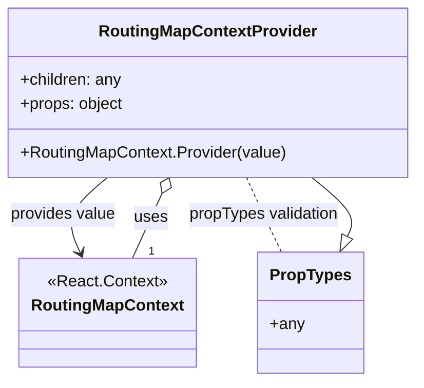

# Diagram: web/portal/src/modules/map/components/RoutingMapContext.js

> Auto-generated by Obscura crawlers

## Mermaid

### SVG

<svg id="container" width="409.89453125" xmlns="http://www.w3.org/2000/svg" class="classDiagram" height="378" viewBox="0 0 409.89453125 378" role="graphics-document document" aria-roledescription="class"><g><defs><marker id="container_class-aggregationStart" class="marker aggregation class" refX="18" refY="7" markerWidth="190" markerHeight="240" orient="auto"><path d="M 18,7 L9,13 L1,7 L9,1 Z"></path></marker></defs><defs><marker id="container_class-aggregationEnd" class="marker aggregation class" refX="1" refY="7" markerWidth="20" markerHeight="28" orient="auto"><path d="M 18,7 L9,13 L1,7 L9,1 Z"></path></marker></defs><defs><marker id="container_class-extensionStart" class="marker extension class" refX="18" refY="7" markerWidth="190" markerHeight="240" orient="auto"><path d="M 1,7 L18,13 V 1 Z"></path></marker></defs><defs><marker id="container_class-extensionEnd" class="marker extension class" refX="1" refY="7" markerWidth="20" markerHeight="28" orient="auto"><path d="M 1,1 V 13 L18,7 Z"></path></marker></defs><defs><marker id="container_class-compositionStart" class="marker composition class" refX="18" refY="7" markerWidth="190" markerHeight="240" orient="auto"><path d="M 18,7 L9,13 L1,7 L9,1 Z"></path></marker></defs><defs><marker id="container_class-compositionEnd" class="marker composition class" refX="1" refY="7" markerWidth="20" markerHeight="28" orient="auto"><path d="M 18,7 L9,13 L1,7 L9,1 Z"></path></marker></defs><defs><marker id="container_class-dependencyStart" class="marker dependency class" refX="6" refY="7" markerWidth="190" markerHeight="240" orient="auto"><path d="M 5,7 L9,13 L1,7 L9,1 Z"></path></marker></defs><defs><marker id="container_class-dependencyEnd" class="marker dependency class" refX="13" refY="7" markerWidth="20" markerHeight="28" orient="auto"><path d="M 18,7 L9,13 L14,7 L9,1 Z"></path></marker></defs><defs><marker id="container_class-lollipopStart" class="marker lollipop class" refX="13" refY="7" markerWidth="190" markerHeight="240" orient="auto"><circle stroke="black" fill="transparent" cx="7" cy="7" r="6"></circle></marker></defs><defs><marker id="container_class-lollipopEnd" class="marker lollipop class" refX="1" refY="7" markerWidth="190" markerHeight="240" orient="auto"><circle stroke="black" fill="transparent" cx="7" cy="7" r="6"></circle></marker></defs><g class="root"><g class="clusters"></g><g class="edgePaths"><path d="M105.412,176L97.989,182.167C90.566,188.333,75.721,200.667,71.181,213.092C66.641,225.517,72.407,238.034,75.29,244.292L78.173,250.55" id="id_RoutingMapContextProvider_RoutingMapContext_1" class="edge-thickness-normal edge-pattern-solid relation" style=";;;" data-edge="true" data-et="edge" data-id="id_RoutingMapContextProvider_RoutingMapContext_1" data-points="W3sieCI6MTA1LjQxMjEyNTUxNjUyODkzLCJ5IjoxNzZ9LHsieCI6NjAuODc1LCJ5IjoyMTN9LHsieCI6ODAuNjgzMTkxMDQzODE0NDMsInkiOjI1Nn1d" marker-end="url(#container_class-dependencyEnd)"></path><path d="M245.595,176L248.463,182.167C251.331,188.333,257.068,200.667,262.99,213C268.912,225.333,275.02,237.667,278.074,243.833L281.127,250" id="id_RoutingMapContextProvider_PropTypes_2" class="edge-thickness-normal edge-pattern-dashed relation" style=";;;" data-edge="true" data-et="edge" data-id="id_RoutingMapContextProvider_PropTypes_2" data-points="W3sieCI6MjQ1LjU5NDcxODQ5MTczNTUzLCJ5IjoxNzZ9LHsieCI6MjYyLjgwNDY4NzUsInkiOjIxM30seyJ4IjoyODEuMTI3Mzc1OTY2NDk0ODcsInkiOjI1MH1d"></path><path d="M160.177,191.641L158.521,195.201C156.865,198.761,153.554,205.88,148.597,216.607C143.639,227.333,137.037,241.667,133.735,248.833L130.434,256" id="id_RoutingMapContextProvider_RoutingMapContext_3" class="edge-thickness-normal edge-pattern-solid relation" style=";;;" data-edge="true" data-et="edge" data-id="id_RoutingMapContextProvider_RoutingMapContext_3" data-points="W3sieCI6MTY3LjQ1MjE1NjUwODI2NDQ3LCJ5IjoxNzZ9LHsieCI6MTUwLjI0MjE4NzUsInkiOjIxM30seyJ4IjoxMzAuNDMzOTk2NDU2MTg1NTgsInkiOjI1Nn1d" marker-start="url(#container_class-aggregationStart)"></path><path d="M348.207,234.542L349.985,230.951C351.763,227.361,355.319,220.181,349.333,210.424C343.346,200.667,327.817,188.333,320.053,182.167L312.288,176" id="id_PropTypes_RoutingMapContextProvider_4" class="edge-thickness-normal edge-pattern-solid relation" style=";;;" data-edge="true" data-et="edge" data-id="id_PropTypes_RoutingMapContextProvider_4" data-points="W3sieCI6MzQwLjU1MjMxMTUzMzUwNTEzLCJ5IjoyNTB9LHsieCI6MzU4Ljg3NSwieSI6MjEzfSx7IngiOjMxMi4yODgxNTg1NzQzODAyLCJ5IjoxNzZ9XQ==" marker-start="url(#container_class-extensionStart)"></path></g><g class="edgeLabels"><g class="edgeLabel" transform="translate(60.875, 213)"><g class="label" data-id="id_RoutingMapContextProvider_RoutingMapContext_1" transform="translate(-52.875, -12)"><foreignObject width="105.75" height="24">

provides value

</foreignObject></g></g><g class="edgeLabel" transform="translate(262.8046875, 213)"><g class="label" data-id="id_RoutingMapContextProvider_PropTypes_2" transform="translate(-76.0703125, -12)"><foreignObject width="152.140625" height="24">

propTypes validation

</foreignObject></g></g><g class="edgeLabel" transform="translate(148.87478, 215.96839)"><g class="label" data-id="id_RoutingMapContextProvider_RoutingMapContext_3" transform="translate(-16.4921875, -12)"><foreignObject width="32.984375" height="24">

uses

</foreignObject></g></g><g class="edgeLabel"><g class="label" data-id="id_PropTypes_RoutingMapContextProvider_4" transform="translate(0, 0)"><foreignObject width="0" height="0">

</foreignObject></g></g><g class="edgeTerminals" transform="translate(146.3799073264911, 241.3813292896323)"><g class="inner" transform="translate(0, 0)"></g><foreignObject style="width: 9px; height: 12px;">
1
</foreignObject></g></g><g class="nodes"><g class="node default" id="classId-RoutingMapContext-0" transform="translate(105.55859375, 310)"><g class="basic label-container"><path d="M-84.0546875 -54 L84.0546875 -54 L84.0546875 54 L-84.0546875 54" stroke="none" stroke-width="0" fill="#ECECFF" style=""></path><path d="M-84.0546875 -54 C-34.051558781494094 -54, 15.951569937011811 -54, 84.0546875 -54 M-84.0546875 -54 C-33.2741796362109 -54, 17.506328227578194 -54, 84.0546875 -54 M84.0546875 -54 C84.0546875 -21.44957558055117, 84.0546875 11.100848838897662, 84.0546875 54 M84.0546875 -54 C84.0546875 -14.59378809043897, 84.0546875 24.81242381912206, 84.0546875 54 M84.0546875 54 C36.207735802922905 54, -11.63921589415419 54, -84.0546875 54 M84.0546875 54 C43.74631070749607 54, 3.4379339149921435 54, -84.0546875 54 M-84.0546875 54 C-84.0546875 29.886849404322927, -84.0546875 5.773698808645854, -84.0546875 -54 M-84.0546875 54 C-84.0546875 11.014635487092455, -84.0546875 -31.97072902581509, -84.0546875 -54" stroke="#9370DB" stroke-width="1.3" fill="none" stroke-dasharray="0 0" style=""></path></g><g class="annotation-group text" transform="translate(-58.4921875, -30)"><g class="label" style="" transform="translate(0,-12)"><foreignObject width="116.984375" height="24">

«React.Context»

</foreignObject></g></g><g class="label-group text" transform="translate(-72.0546875, -6)"><g class="label" style="font-weight: bolder" transform="translate(0,-12)"><foreignObject width="144.109375" height="24">

RoutingMapContext

</foreignObject></g></g><g class="members-group text" transform="translate(-72.0546875, 42)"></g><g class="methods-group text" transform="translate(-72.0546875, 72)"></g><g class="divider" style=""><path d="M-84.0546875 18 C-30.901435571276714 18, 22.25181635744657 18, 84.0546875 18 M-84.0546875 18 C-44.99345656580475 18, -5.932225631609498 18, 84.0546875 18" stroke="#9370DB" stroke-width="1.3" fill="none" stroke-dasharray="0 0" style=""></path></g><g class="divider" style=""><path d="M-84.0546875 36 C-33.763434377905476 36, 16.527818744189048 36, 84.0546875 36 M-84.0546875 36 C-37.291488041957955 36, 9.47171141608409 36, 84.0546875 36" stroke="#9370DB" stroke-width="1.3" fill="none" stroke-dasharray="0 0" style=""></path></g></g><g class="node default" id="classId-RoutingMapContextProvider-1" transform="translate(206.5234375, 92)"><g class="basic label-container"><path d="M-195.37109375 -84 L195.37109375 -84 L195.37109375 84 L-195.37109375 84" stroke="none" stroke-width="0" fill="#ECECFF" style=""></path><path d="M-195.37109375 -84 C-110.1969888218855 -84, -25.022883893770995 -84, 195.37109375 -84 M-195.37109375 -84 C-44.133528880376076 -84, 107.10403598924785 -84, 195.37109375 -84 M195.37109375 -84 C195.37109375 -30.365177817102442, 195.37109375 23.269644365795116, 195.37109375 84 M195.37109375 -84 C195.37109375 -45.68039861630329, 195.37109375 -7.360797232606586, 195.37109375 84 M195.37109375 84 C42.21419080014343 84, -110.94271214971315 84, -195.37109375 84 M195.37109375 84 C87.95635247094819 84, -19.45838880810362 84, -195.37109375 84 M-195.37109375 84 C-195.37109375 48.42375018537062, -195.37109375 12.847500370741244, -195.37109375 -84 M-195.37109375 84 C-195.37109375 39.83956851383078, -195.37109375 -4.320862972338446, -195.37109375 -84" stroke="#9370DB" stroke-width="1.3" fill="none" stroke-dasharray="0 0" style=""></path></g><g class="annotation-group text" transform="translate(0, -60)"></g><g class="label-group text" transform="translate(-103.0546875, -60)"><g class="label" style="font-weight: bolder" transform="translate(0,-12)"><foreignObject width="206.109375" height="24">

RoutingMapContextProvider

</foreignObject></g></g><g class="members-group text" transform="translate(-183.37109375, -12)"><g class="label" style="" transform="translate(0,-12)"><foreignObject width="101.421875" height="24">

+children: any

</foreignObject></g><g class="label" style="" transform="translate(0,12)"><foreignObject width="103.0625" height="24">

+props: object

</foreignObject></g></g><g class="methods-group text" transform="translate(-183.37109375, 60)"><g class="label" style="" transform="translate(0,-12)"><foreignObject width="263.6875" height="24">

+RoutingMapContext.Provider(value)

</foreignObject></g></g><g class="divider" style=""><path d="M-195.37109375 -36 C-90.08630329011346 -36, 15.198487169773074 -36, 195.37109375 -36 M-195.37109375 -36 C-116.15761002816086 -36, -36.94412630632172 -36, 195.37109375 -36" stroke="#9370DB" stroke-width="1.3" fill="none" stroke-dasharray="0 0" style=""></path></g><g class="divider" style=""><path d="M-195.37109375 36 C-43.69165876061041 36, 107.98777622877918 36, 195.37109375 36 M-195.37109375 36 C-105.63187242836511 36, -15.892651106730227 36, 195.37109375 36" stroke="#9370DB" stroke-width="1.3" fill="none" stroke-dasharray="0 0" style=""></path></g></g><g class="node default" id="classId-PropTypes-2" transform="translate(310.83984375, 310)"><g class="basic label-container"><path d="M-50.2578125 -60 L50.2578125 -60 L50.2578125 60 L-50.2578125 60" stroke="none" stroke-width="0" fill="#ECECFF" style=""></path><path d="M-50.2578125 -60 C-21.364335723569834 -60, 7.529141052860332 -60, 50.2578125 -60 M-50.2578125 -60 C-12.870465035022335 -60, 24.51688242995533 -60, 50.2578125 -60 M50.2578125 -60 C50.2578125 -13.003876534492854, 50.2578125 33.99224693101429, 50.2578125 60 M50.2578125 -60 C50.2578125 -14.71948839046896, 50.2578125 30.56102321906208, 50.2578125 60 M50.2578125 60 C25.361458758349826 60, 0.46510501669965265 60, -50.2578125 60 M50.2578125 60 C23.9652307548825 60, -2.327350990234997 60, -50.2578125 60 M-50.2578125 60 C-50.2578125 24.14895005682842, -50.2578125 -11.702099886343163, -50.2578125 -60 M-50.2578125 60 C-50.2578125 29.15969986211868, -50.2578125 -1.680600275762643, -50.2578125 -60" stroke="#9370DB" stroke-width="1.3" fill="none" stroke-dasharray="0 0" style=""></path></g><g class="annotation-group text" transform="translate(0, -36)"></g><g class="label-group text" transform="translate(-38.2578125, -36)"><g class="label" style="font-weight: bolder" transform="translate(0,-12)"><foreignObject width="76.515625" height="24">

PropTypes

</foreignObject></g></g><g class="members-group text" transform="translate(-38.2578125, 12)"><g class="label" style="" transform="translate(0,-12)"><foreignObject width="33.59375" height="24">

+any

</foreignObject></g></g><g class="methods-group text" transform="translate(-38.2578125, 60)"></g><g class="divider" style=""><path d="M-50.2578125 -12 C-28.055967419328972 -12, -5.854122338657945 -12, 50.2578125 -12 M-50.2578125 -12 C-23.02463192305797 -12, 4.208548653884058 -12, 50.2578125 -12" stroke="#9370DB" stroke-width="1.3" fill="none" stroke-dasharray="0 0" style=""></path></g><g class="divider" style=""><path d="M-50.2578125 36 C-16.62213108379457 36, 17.01355033241086 36, 50.2578125 36 M-50.2578125 36 C-28.401863847046503 36, -6.545915194093006 36, 50.2578125 36" stroke="#9370DB" stroke-width="1.3" fill="none" stroke-dasharray="0 0" style=""></path></g></g></g></g></g></svg>
