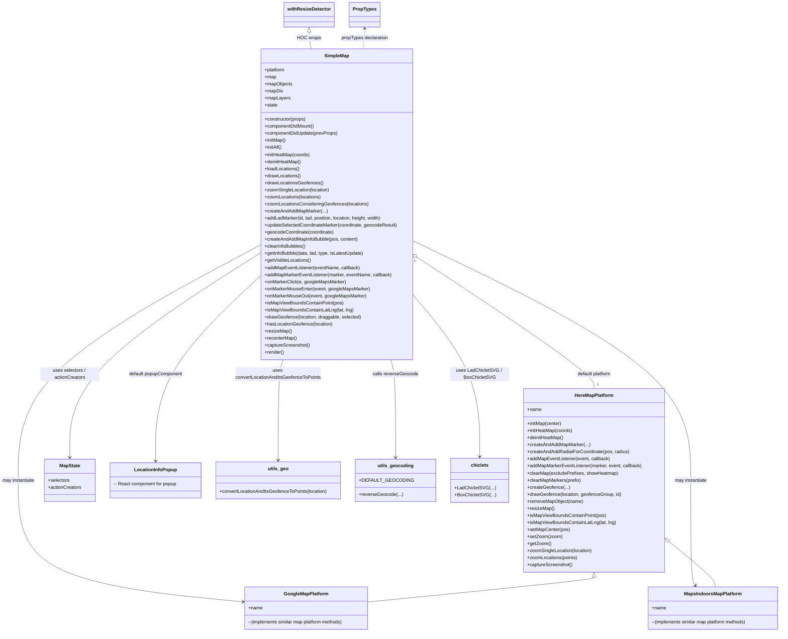

# Diagram: web/portal/src/modules/map/components/SimpleMap.js

> Auto-generated by Obscura crawlers

## Mermaid

### SVG

<svg id="container" width="2633.310546875" xmlns="http://www.w3.org/2000/svg" class="classDiagram" height="2146" viewBox="0 0 2633.310546875 2146" role="graphics-document document" aria-roledescription="class"><g><defs><marker id="container_class-aggregationStart" class="marker aggregation class" refX="18" refY="7" markerWidth="190" markerHeight="240" orient="auto"><path d="M 18,7 L9,13 L1,7 L9,1 Z"></path></marker></defs><defs><marker id="container_class-aggregationEnd" class="marker aggregation class" refX="1" refY="7" markerWidth="20" markerHeight="28" orient="auto"><path d="M 18,7 L9,13 L1,7 L9,1 Z"></path></marker></defs><defs><marker id="container_class-extensionStart" class="marker extension class" refX="18" refY="7" markerWidth="190" markerHeight="240" orient="auto"><path d="M 1,7 L18,13 V 1 Z"></path></marker></defs><defs><marker id="container_class-extensionEnd" class="marker extension class" refX="1" refY="7" markerWidth="20" markerHeight="28" orient="auto"><path d="M 1,1 V 13 L18,7 Z"></path></marker></defs><defs><marker id="container_class-compositionStart" class="marker composition class" refX="18" refY="7" markerWidth="190" markerHeight="240" orient="auto"><path d="M 18,7 L9,13 L1,7 L9,1 Z"></path></marker></defs><defs><marker id="container_class-compositionEnd" class="marker composition class" refX="1" refY="7" markerWidth="20" markerHeight="28" orient="auto"><path d="M 18,7 L9,13 L1,7 L9,1 Z"></path></marker></defs><defs><marker id="container_class-dependencyStart" class="marker dependency class" refX="6" refY="7" markerWidth="190" markerHeight="240" orient="auto"><path d="M 5,7 L9,13 L1,7 L9,1 Z"></path></marker></defs><defs><marker id="container_class-dependencyEnd" class="marker dependency class" refX="13" refY="7" markerWidth="20" markerHeight="28" orient="auto"><path d="M 18,7 L9,13 L14,7 L9,1 Z"></path></marker></defs><defs><marker id="container_class-lollipopStart" class="marker lollipop class" refX="13" refY="7" markerWidth="190" markerHeight="240" orient="auto"><circle stroke="black" fill="transparent" cx="7" cy="7" r="6"></circle></marker></defs><defs><marker id="container_class-lollipopEnd" class="marker lollipop class" refX="1" refY="7" markerWidth="190" markerHeight="240" orient="auto"><circle stroke="black" fill="transparent" cx="7" cy="7" r="6"></circle></marker></defs><g class="root"><g class="clusters"></g><g class="edgePaths"><path d="M1420.662,882.094L1514.946,946.911C1609.231,1011.729,1797.799,1141.365,1892.083,1214.349C1986.367,1287.333,1986.367,1303.667,1986.367,1311.833L1986.367,1320" id="id_SimpleMap_HereMapPlatform_1" class="edge-thickness-normal edge-pattern-solid relation" style=";;;" data-edge="true" data-et="edge" data-id="id_SimpleMap_HereMapPlatform_1" data-points="W3sieCI6MTQwNi40NDcyNjU2MjUsInkiOjg3Mi4zMjExNjM1MzQ4MTg4fSx7IngiOjE5ODYuMzY3MTg3NSwieSI6MTI3MX0seyJ4IjoxOTg2LjM2NzE4NzUsInkiOjEzMjB9XQ==" marker-start="url(#container_class-aggregationStart)"></path><path d="M887.674,832.229L750.448,905.358C613.223,978.486,338.771,1124.743,201.546,1258.038C64.32,1391.333,64.32,1511.667,64.32,1628C64.32,1744.333,64.32,1856.667,187.495,1925.266C310.67,1993.865,557.02,2018.73,680.195,2031.163L803.37,2043.595" id="id_SimpleMap_GoogleMapPlatform_2" class="edge-thickness-normal edge-pattern-solid relation" style=";;;" data-edge="true" data-et="edge" data-id="id_SimpleMap_GoogleMapPlatform_2" data-points="W3sieCI6ODg3LjY3MzgyODEyNSwieSI6ODMyLjIyOTAzNDA0NDQ3OTl9LHsieCI6NjQuMzIwMzEyNSwieSI6MTI3MX0seyJ4Ijo2NC4zMjAzMTI1LCJ5IjoxNjMyfSx7IngiOjY0LjMyMDMxMjUsInkiOjE5Njl9LHsieCI6ODA5LjMzOTg0Mzc1LCJ5IjoyMDQ0LjE5Nzg0ODE1OTkyMDZ9XQ==" marker-end="url(#container_class-dependencyEnd)"></path><path d="M1406.447,814.564L1570.113,890.637C1733.779,966.709,2061.111,1118.855,2224.777,1255.094C2388.443,1391.333,2388.443,1511.667,2388.443,1628C2388.443,1744.333,2388.443,1856.667,2388.77,1916.005C2389.097,1975.344,2389.751,1981.688,2390.078,1984.86L2390.405,1988.032" id="id_SimpleMap_MapsIndoorsMapPlatform_3" class="edge-thickness-normal edge-pattern-solid relation" style=";;;" data-edge="true" data-et="edge" data-id="id_SimpleMap_MapsIndoorsMapPlatform_3" data-points="W3sieCI6MTQwNi40NDcyNjU2MjUsInkiOjgxNC41NjQwNDc3NzkzNzl9LHsieCI6MjM4OC40NDMzNTkzNzUsInkiOjEyNzF9LHsieCI6MjM4OC40NDMzNTkzNzUsInkiOjE2MzJ9LHsieCI6MjM4OC40NDMzNTkzNzUsInkiOjE5Njl9LHsieCI6MjM5MS4wMjA2Nzg5NjI2MjksInkiOjE5OTR9XQ==" marker-end="url(#container_class-dependencyEnd)"></path><path d="M887.674,859.286L779.989,927.905C672.303,996.524,456.933,1133.762,349.248,1249.548C241.563,1365.333,241.563,1459.667,241.563,1506.833L241.563,1554" id="id_SimpleMap_MapState_4" class="edge-thickness-normal edge-pattern-solid relation" style=";;;" data-edge="true" data-et="edge" data-id="id_SimpleMap_MapState_4" data-points="W3sieCI6ODg3LjY3MzgyODEyNSwieSI6ODU5LjI4NTk4NTEzODUzMDl9LHsieCI6MjQxLjU2MjUsInkiOjEyNzF9LHsieCI6MjQxLjU2MjUsInkiOjE1NjB9XQ==" marker-end="url(#container_class-dependencyEnd)"></path><path d="M887.674,938.217L828.765,993.68C769.855,1049.144,652.037,1160.072,593.128,1264.703C534.219,1369.333,534.219,1467.667,534.219,1516.833L534.219,1566" id="id_SimpleMap_LocationInfoPopup_5" class="edge-thickness-normal edge-pattern-solid relation" style=";;;" data-edge="true" data-et="edge" data-id="id_SimpleMap_LocationInfoPopup_5" data-points="W3sieCI6ODg3LjY3MzgyODEyNSwieSI6OTM4LjIxNjU5NDY5MzY0OTl9LHsieCI6NTM0LjIxODc1LCJ5IjoxMjcxfSx7IngiOjUzNC4yMTg3NSwieSI6MTU3Mn1d" marker-end="url(#container_class-dependencyEnd)"></path><path d="M1323.19,1222L1325.914,1230.167C1328.638,1238.333,1334.087,1254.667,1336.811,1310C1339.535,1365.333,1339.535,1459.667,1339.535,1506.833L1339.535,1554" id="id_SimpleMap_utils_geocoding_6" class="edge-thickness-normal edge-pattern-solid relation" style=";;;" data-edge="true" data-et="edge" data-id="id_SimpleMap_utils_geocoding_6" data-points="W3sieCI6MTMyMy4xODk4MjU0NzExODcsInkiOjEyMjJ9LHsieCI6MTMzOS41MzUxNTYyNSwieSI6MTI3MX0seyJ4IjoxMzM5LjUzNTE1NjI1LCJ5IjoxNTYwfV0=" marker-end="url(#container_class-dependencyEnd)"></path><path d="M970.931,1222L968.207,1230.167C965.483,1238.333,960.034,1254.667,957.31,1311.5C954.586,1368.333,954.586,1465.667,954.586,1514.333L954.586,1563" id="id_SimpleMap_utils_geo_7" class="edge-thickness-normal edge-pattern-solid relation" style=";;;" data-edge="true" data-et="edge" data-id="id_SimpleMap_utils_geo_7" data-points="W3sieCI6OTcwLjkzMTI2ODI3ODgxMjgsInkiOjEyMjJ9LHsieCI6OTU0LjU4NTkzNzUsInkiOjEyNzF9LHsieCI6OTU0LjU4NTkzNzUsInkiOjE1Njl9XQ==" marker-end="url(#container_class-dependencyEnd)"></path><path d="M1406.447,1021.807L1439.311,1063.339C1472.174,1104.871,1537.902,1187.936,1570.765,1276.134C1603.629,1364.333,1603.629,1457.667,1603.629,1504.333L1603.629,1551" id="id_SimpleMap_chiclets_8" class="edge-thickness-normal edge-pattern-solid relation" style=";;;" data-edge="true" data-et="edge" data-id="id_SimpleMap_chiclets_8" data-points="W3sieCI6MTQwNi40NDcyNjU2MjUsInkiOjEwMjEuODA2NjMzMjEzOTgxN30seyJ4IjoxNjAzLjYyODkwNjI1LCJ5IjoxMjcxfSx7IngiOjE2MDMuNjI4OTA2MjUsInkiOjE1NTd9XQ==" marker-end="url(#container_class-dependencyEnd)"></path><path d="M1986.367,1961.25L1986.367,1962.542C1986.367,1963.833,1986.367,1966.417,1862.197,1980.241C1738.027,1994.066,1489.688,2019.132,1365.518,2031.665L1241.348,2044.198" id="id_HereMapPlatform_GoogleMapPlatform_9" class="edge-thickness-normal edge-pattern-solid relation" style=";;;" data-edge="true" data-et="edge" data-id="id_HereMapPlatform_GoogleMapPlatform_9" data-points="W3sieCI6MTk4Ni4zNjcxODc1LCJ5IjoxOTQ0fSx7IngiOjE5ODYuMzY3MTg3NSwieSI6MTk2OX0seyJ4IjoxMjQxLjM0NzY1NjI1LCJ5IjoyMDQ0LjE5Nzg0ODE1OTkyMDZ9XQ==" marker-start="url(#container_class-extensionStart)"></path><path d="M2239.808,1834.356L2267.914,1856.797C2296.02,1879.237,2352.232,1924.119,2379.908,1950.726C2407.584,1977.333,2406.725,1985.667,2406.296,1989.833L2405.866,1994" id="id_HereMapPlatform_MapsIndoorsMapPlatform_10" class="edge-thickness-normal edge-pattern-solid relation" style=";;;" data-edge="true" data-et="edge" data-id="id_HereMapPlatform_MapsIndoorsMapPlatform_10" data-points="W3sieCI6MjIyNi4zMjgxMjUsInkiOjE4MjMuNTkyOTkwMzc5NTg3NX0seyJ4IjoyNDA4LjQ0MzM1OTM3NSwieSI6MTk2OX0seyJ4IjoyNDA1Ljg2NjAzOTc4NzM3MSwieSI6MTk5NH1d" marker-start="url(#container_class-extensionStart)"></path><path d="M1055.451,109.25L1055.451,112.542C1055.451,115.833,1055.451,122.417,1056.451,131.875C1057.451,141.333,1059.451,153.667,1060.451,159.833L1061.45,166" id="id_withResizeDetector_SimpleMap_11" class="edge-thickness-normal edge-pattern-solid relation" style=";;;" data-edge="true" data-et="edge" data-id="id_withResizeDetector_SimpleMap_11" data-points="W3sieCI6MTA1NS40NTExNzE4NzUsInkiOjkyfSx7IngiOjEwNTUuNDUxMTcxODc1LCJ5IjoxMjl9LHsieCI6MTA2MS40NTAzNjk4ODM4NDk2LCJ5IjoxNjZ9XQ==" marker-start="url(#container_class-extensionStart)"></path><path d="M1238.67,98L1238.67,103.167C1238.67,108.333,1238.67,118.667,1237.67,130C1236.67,141.333,1234.67,153.667,1233.671,159.833L1232.671,166" id="id_PropTypes_SimpleMap_12" class="edge-thickness-normal edge-pattern-dashed relation" style=";;;" data-edge="true" data-et="edge" data-id="id_PropTypes_SimpleMap_12" data-points="W3sieCI6MTIzOC42Njk5MjE4NzUsInkiOjkyfSx7IngiOjEyMzguNjY5OTIxODc1LCJ5IjoxMjl9LHsieCI6MTIzMi42NzA3MjM4NjYxNTA0LCJ5IjoxNjZ9XQ==" marker-start="url(#container_class-dependencyStart)"></path></g><g class="edgeLabels"><g class="edgeLabel" transform="translate(1986.3671875, 1271)"><g class="label" data-id="id_SimpleMap_HereMapPlatform_1" transform="translate(-59.5234375, -12)"><foreignObject width="119.046875" height="24">

default platform

</foreignObject></g></g><g class="edgeLabel" transform="translate(64.3203125, 1632)"><g class="label" data-id="id_SimpleMap_GoogleMapPlatform_2" transform="translate(-56.3203125, -12)"><foreignObject width="112.640625" height="24">

may instantiate

</foreignObject></g></g><g class="edgeLabel" transform="translate(2388.443359375, 1632)"><g class="label" data-id="id_SimpleMap_MapsIndoorsMapPlatform_3" transform="translate(-56.3203125, -12)"><foreignObject width="112.640625" height="24">

may instantiate

</foreignObject></g></g><g class="edgeLabel" transform="translate(241.5625, 1271)"><g class="label" data-id="id_SimpleMap_MapState_4" transform="translate(-100, -24)"><foreignObject width="200" height="48">

uses selectors / actionCreators

</foreignObject></g></g><g class="edgeLabel" transform="translate(534.21875, 1271)"><g class="label" data-id="id_SimpleMap_LocationInfoPopup_5" transform="translate(-93.4921875, -12)"><foreignObject width="186.984375" height="24">

default popupComponent

</foreignObject></g></g><g class="edgeLabel" transform="translate(1339.53515625, 1271)"><g class="label" data-id="id_SimpleMap_utils_geocoding_6" transform="translate(-76.625, -12)"><foreignObject width="153.25" height="24">

calls reverseGeocode

</foreignObject></g></g><g class="edgeLabel" transform="translate(954.5859375, 1271)"><g class="label" data-id="id_SimpleMap_utils_geo_7" transform="translate(-146.078125, -24)"><foreignObject width="292.15625" height="48">

uses convertLocationAndItsGeofenceToPoints

</foreignObject></g></g><g class="edgeLabel" transform="translate(1603.62890625, 1271)"><g class="label" data-id="id_SimpleMap_chiclets_8" transform="translate(-100, -24)"><foreignObject width="200" height="48">

uses LadChicletSVG / BoxChicletSVG

</foreignObject></g></g><g class="edgeLabel"><g class="label" data-id="id_HereMapPlatform_GoogleMapPlatform_9" transform="translate(0, 0)"><foreignObject width="0" height="0">

</foreignObject></g></g><g class="edgeLabel"><g class="label" data-id="id_HereMapPlatform_MapsIndoorsMapPlatform_10" transform="translate(0, 0)"><foreignObject width="0" height="0">

</foreignObject></g></g><g class="edgeLabel" transform="translate(1055.451171875, 129)"><g class="label" data-id="id_withResizeDetector_SimpleMap_11" transform="translate(-38.9609375, -12)"><foreignObject width="77.921875" height="24">

HOC wraps

</foreignObject></g></g><g class="edgeLabel" transform="translate(1238.669921875, 129)"><g class="label" data-id="id_PropTypes_SimpleMap_12" transform="translate(-81.0390625, -12)"><foreignObject width="162.078125" height="24">

propTypes declaration

</foreignObject></g></g><g class="edgeTerminals" transform="translate(1412.37048873508, 894.5959359974552)"><g class="inner" transform="translate(0, 0)"><foreignObject style="width: 9px; height: 12px;">
1
</foreignObject></g></g><g class="edgeTerminals" transform="translate(1996.36718875, 1297.5000010714286)"><g class="inner" transform="translate(0, 0)"></g><foreignObject style="width: 9px; height: 12px;">
1
</foreignObject></g></g><g class="nodes"><g class="node default" id="classId-SimpleMap-0" transform="translate(1147.060546875, 694)"><g class="basic label-container"><path d="M-259.38671875 -528 L259.38671875 -528 L259.38671875 528 L-259.38671875 528" stroke="none" stroke-width="0" fill="#ECECFF" style=""></path><path d="M-259.38671875 -528 C-79.19909834088699 -528, 100.98852206822602 -528, 259.38671875 -528 M-259.38671875 -528 C-138.6334341735515 -528, -17.880149597102985 -528, 259.38671875 -528 M259.38671875 -528 C259.38671875 -249.35110878634515, 259.38671875 29.2977824273097, 259.38671875 528 M259.38671875 -528 C259.38671875 -148.02576405857303, 259.38671875 231.94847188285394, 259.38671875 528 M259.38671875 528 C134.05410533578686 528, 8.721491921573687 528, -259.38671875 528 M259.38671875 528 C96.72711749764497 528, -65.93248375471006 528, -259.38671875 528 M-259.38671875 528 C-259.38671875 281.249454201123, -259.38671875 34.498908402246, -259.38671875 -528 M-259.38671875 528 C-259.38671875 215.66448900831125, -259.38671875 -96.6710219833775, -259.38671875 -528" stroke="#9370DB" stroke-width="1.3" fill="none" stroke-dasharray="0 0" style=""></path></g><g class="annotation-group text" transform="translate(0, -504)"></g><g class="label-group text" transform="translate(-40.5703125, -504)"><g class="label" style="font-weight: bolder" transform="translate(0,-12)"><foreignObject width="81.140625" height="24">

SimpleMap

</foreignObject></g></g><g class="members-group text" transform="translate(-247.38671875, -456)"><g class="label" style="" transform="translate(0,-12)"><foreignObject width="71.015625" height="24">

+platform

</foreignObject></g><g class="label" style="" transform="translate(0,12)"><foreignObject width="39.90625" height="24">

+map

</foreignObject></g><g class="label" style="" transform="translate(0,36)"><foreignObject width="94.578125" height="24">

+mapObjects

</foreignObject></g><g class="label" style="" transform="translate(0,60)"><foreignObject width="62.59375" height="24">

+mapDiv

</foreignObject></g><g class="label" style="" transform="translate(0,84)"><foreignObject width="86.125" height="24">

+mapLayers

</foreignObject></g><g class="label" style="" transform="translate(0,108)"><foreignObject width="44.09375" height="24">

+state

</foreignObject></g></g><g class="methods-group text" transform="translate(-247.38671875, -288)"><g class="label" style="" transform="translate(0,-12)"><foreignObject width="143.375" height="24">

+constructor(props)

</foreignObject></g><g class="label" style="" transform="translate(0,12)"><foreignObject width="171.484375" height="24">

+componentDidMount()

</foreignObject></g><g class="label" style="" transform="translate(0,36)"><foreignObject width="250.5625" height="24">

+componentDidUpdate(prevProps)

</foreignObject></g><g class="label" style="" transform="translate(0,60)"><foreignObject width="73.1875" height="24">

+initMap()

</foreignObject></g><g class="label" style="" transform="translate(0,84)"><foreignObject width="61.078125" height="24">

+initAll()

</foreignObject></g><g class="label" style="" transform="translate(0,108)"><foreignObject width="155.859375" height="24">

+initHeatMap(coords)

</foreignObject></g><g class="label" style="" transform="translate(0,132)"><foreignObject width="125.40625" height="24">

+deinitHeatMap()

</foreignObject></g><g class="label" style="" transform="translate(0,156)"><foreignObject width="120.015625" height="24">

+loadLocations()

</foreignObject></g><g class="label" style="" transform="translate(0,180)"><foreignObject width="123.21875" height="24">

+drawLocations()

</foreignObject></g><g class="label" style="" transform="translate(0,204)"><foreignObject width="198.203125" height="24">

+drawLocationsGeofences()

</foreignObject></g><g class="label" style="" transform="translate(0,228)"><foreignObject width="222.6875" height="24">

+zoomSingleLocation(location)

</foreignObject></g><g class="label" style="" transform="translate(0,252)"><foreignObject width="193.375" height="24">

+zoomLocations(locations)

</foreignObject></g><g class="label" style="" transform="translate(0,276)"><foreignObject width="354.359375" height="24">

+zoomLocationsConsideringGeofences(locations)

</foreignObject></g><g class="label" style="" transform="translate(0,300)"><foreignObject width="212.09375" height="24">

+createAndAddMapMarker(...)

</foreignObject></g><g class="label" style="" transform="translate(0,324)"><foreignObject width="405.515625" height="24">

+addLadMarker(id, lad, position, location, height, width)

</foreignObject></g><g class="label" style="" transform="translate(0,348)"><foreignObject width="454.203125" height="24">

+updateSelectedCoordinateMarker(coordinate, geocodeResult)

</foreignObject></g><g class="label" style="" transform="translate(0,372)"><foreignObject width="237.015625" height="24">

+geocodeCoordinate(coordinate)

</foreignObject></g><g class="label" style="" transform="translate(0,396)"><foreignObject width="320.171875" height="24">

+createAndAddMapInfoBubble(pos, content)

</foreignObject></g><g class="label" style="" transform="translate(0,420)"><foreignObject width="141.546875" height="24">

+clearInfoBubbles()

</foreignObject></g><g class="label" style="" transform="translate(0,444)"><foreignObject width="340.953125" height="24">

+getInfoBubble(data, lad, type, isLatestUpdate)

</foreignObject></g><g class="label" style="" transform="translate(0,468)"><foreignObject width="158.734375" height="24">

+getVisibleLocations()

</foreignObject></g><g class="label" style="" transform="translate(0,492)"><foreignObject width="324.625" height="24">

+addMapEventListener(eventName, callback)

</foreignObject></g><g class="label" style="" transform="translate(0,516)"><foreignObject width="433.234375" height="24">

+addMapMarkerEventListener(marker, eventName, callback)

</foreignObject></g><g class="label" style="" transform="translate(0,540)"><foreignObject width="274.625" height="24">

+onMarkerClick(e, googleMapsMarker)

</foreignObject></g><g class="label" style="" transform="translate(0,564)"><foreignObject width="358.140625" height="24">

+onMarkerMouseEnter(event, googleMapsMarker)

</foreignObject></g><g class="label" style="" transform="translate(0,588)"><foreignObject width="346.09375" height="24">

+onMarkerMouseOut(event, googleMapsMarker)

</foreignObject></g><g class="label" style="" transform="translate(0,612)"><foreignObject width="269.15625" height="24">

+isMapViewBoundsContainPoint(pos)

</foreignObject></g><g class="label" style="" transform="translate(0,636)"><foreignObject width="302.421875" height="24">

+isMapViewBoundsContainLatLng(lat, lng)

</foreignObject></g><g class="label" style="" transform="translate(0,660)"><foreignObject width="328.890625" height="24">

+drawGeofence(location, draggable, selected)

</foreignObject></g><g class="label" style="" transform="translate(0,684)"><foreignObject width="232.515625" height="24">

+hasLocationGeofence(location)

</foreignObject></g><g class="label" style="" transform="translate(0,708)"><foreignObject width="91.015625" height="24">

+resizeMap()

</foreignObject></g><g class="label" style="" transform="translate(0,732)"><foreignObject width="109.28125" height="24">

+recenterMap()

</foreignObject></g><g class="label" style="" transform="translate(0,756)"><foreignObject width="154.40625" height="24">

+captureScreenshot()

</foreignObject></g><g class="label" style="" transform="translate(0,780)"><foreignObject width="66.609375" height="24">

+render()

</foreignObject></g></g><g class="divider" style=""><path d="M-259.38671875 -480 C-150.8719413756623 -480, -42.35716400132455 -480, 259.38671875 -480 M-259.38671875 -480 C-139.00451444052354 -480, -18.622310131047072 -480, 259.38671875 -480" stroke="#9370DB" stroke-width="1.3" fill="none" stroke-dasharray="0 0" style=""></path></g><g class="divider" style=""><path d="M-259.38671875 -312 C-55.53881321541928 -312, 148.30909231916144 -312, 259.38671875 -312 M-259.38671875 -312 C-52.696270166089306 -312, 153.9941784178214 -312, 259.38671875 -312" stroke="#9370DB" stroke-width="1.3" fill="none" stroke-dasharray="0 0" style=""></path></g></g><g class="node default" id="classId-HereMapPlatform-1" transform="translate(1986.3671875, 1632)"><g class="basic label-container"><path d="M-239.9609375 -312 L239.9609375 -312 L239.9609375 312 L-239.9609375 312" stroke="none" stroke-width="0" fill="#ECECFF" style=""></path><path d="M-239.9609375 -312 C-130.60824680233796 -312, -21.255556104675918 -312, 239.9609375 -312 M-239.9609375 -312 C-121.84801912897618 -312, -3.7351007579523525 -312, 239.9609375 -312 M239.9609375 -312 C239.9609375 -114.61861271803002, 239.9609375 82.76277456393996, 239.9609375 312 M239.9609375 -312 C239.9609375 -135.69906383915068, 239.9609375 40.601872321698636, 239.9609375 312 M239.9609375 312 C118.4441314830802 312, -3.072674533839603 312, -239.9609375 312 M239.9609375 312 C91.05819455996343 312, -57.84454838007315 312, -239.9609375 312 M-239.9609375 312 C-239.9609375 74.47951229665048, -239.9609375 -163.04097540669903, -239.9609375 -312 M-239.9609375 312 C-239.9609375 148.10241214335002, -239.9609375 -15.795175713299955, -239.9609375 -312" stroke="#9370DB" stroke-width="1.3" fill="none" stroke-dasharray="0 0" style=""></path></g><g class="annotation-group text" transform="translate(0, -288)"></g><g class="label-group text" transform="translate(-64.515625, -288)"><g class="label" style="font-weight: bolder" transform="translate(0,-12)"><foreignObject width="129.03125" height="24">

HereMapPlatform

</foreignObject></g></g><g class="members-group text" transform="translate(-227.9609375, -240)"><g class="label" style="" transform="translate(0,-12)"><foreignObject width="48.5" height="24">

+name

</foreignObject></g></g><g class="methods-group text" transform="translate(-227.9609375, -192)"><g class="label" style="" transform="translate(0,-12)"><foreignObject width="119.046875" height="24">

+initMap(center)

</foreignObject></g><g class="label" style="" transform="translate(0,12)"><foreignObject width="155.859375" height="24">

+initHeatMap(coords)

</foreignObject></g><g class="label" style="" transform="translate(0,36)"><foreignObject width="125.40625" height="24">

+deinitHeatMap()

</foreignObject></g><g class="label" style="" transform="translate(0,60)"><foreignObject width="212.09375" height="24">

+createAndAddMapMarker(...)

</foreignObject></g><g class="label" style="" transform="translate(0,84)"><foreignObject width="347.015625" height="24">

+createAndAddRadialForCoordinate(pos, radius)

</foreignObject></g><g class="label" style="" transform="translate(0,108)"><foreignObject width="282.796875" height="24">

+addMapEventListener(event, callback)

</foreignObject></g><g class="label" style="" transform="translate(0,132)"><foreignObject width="391.40625" height="24">

+addMapMarkerEventListener(marker, event, callback)

</foreignObject></g><g class="label" style="" transform="translate(0,156)"><foreignObject width="308.828125" height="24">

+clearMap(excludePrefixes, showHeatmap)

</foreignObject></g><g class="label" style="" transform="translate(0,180)"><foreignObject width="183.09375" height="24">

+clearMapMarkers(prefix)

</foreignObject></g><g class="label" style="" transform="translate(0,204)"><foreignObject width="142.25" height="24">

+createGeofence(...)

</foreignObject></g><g class="label" style="" transform="translate(0,228)"><foreignObject width="319.796875" height="24">

+drawGeofence(location, geofenceGroup, id)

</foreignObject></g><g class="label" style="" transform="translate(0,252)"><foreignObject width="190.671875" height="24">

+removeMapObject(name)

</foreignObject></g><g class="label" style="" transform="translate(0,276)"><foreignObject width="91.015625" height="24">

+resizeMap()

</foreignObject></g><g class="label" style="" transform="translate(0,300)"><foreignObject width="269.15625" height="24">

+isMapViewBoundsContainPoint(pos)

</foreignObject></g><g class="label" style="" transform="translate(0,324)"><foreignObject width="302.421875" height="24">

+isMapViewBoundsContainLatLng(lat, lng)

</foreignObject></g><g class="label" style="" transform="translate(0,348)"><foreignObject width="144.46875" height="24">

+setMapCenter(pos)

</foreignObject></g><g class="label" style="" transform="translate(0,372)"><foreignObject width="120.015625" height="24">

+setZoom(zoom)

</foreignObject></g><g class="label" style="" transform="translate(0,396)"><foreignObject width="81.3125" height="24">

+getZoom()

</foreignObject></g><g class="label" style="" transform="translate(0,420)"><foreignObject width="222.6875" height="24">

+zoomSingleLocation(location)

</foreignObject></g><g class="label" style="" transform="translate(0,444)"><foreignObject width="172.734375" height="24">

+zoomLocations(points)

</foreignObject></g><g class="label" style="" transform="translate(0,468)"><foreignObject width="154.40625" height="24">

+captureScreenshot()

</foreignObject></g></g><g class="divider" style=""><path d="M-239.9609375 -264 C-109.6329895212701 -264, 20.69495845745979 -264, 239.9609375 -264 M-239.9609375 -264 C-54.91746164064298 -264, 130.12601421871403 -264, 239.9609375 -264" stroke="#9370DB" stroke-width="1.3" fill="none" stroke-dasharray="0 0" style=""></path></g><g class="divider" style=""><path d="M-239.9609375 -216 C-70.54433443735587 -216, 98.87226862528826 -216, 239.9609375 -216 M-239.9609375 -216 C-114.30367110141076 -216, 11.353595297178487 -216, 239.9609375 -216" stroke="#9370DB" stroke-width="1.3" fill="none" stroke-dasharray="0 0" style=""></path></g></g><g class="node default" id="classId-GoogleMapPlatform-2" transform="translate(1025.34375, 2066)"><g class="basic label-container"><path d="M-216.00390625 -72 L216.00390625 -72 L216.00390625 72 L-216.00390625 72" stroke="none" stroke-width="0" fill="#ECECFF" style=""></path><path d="M-216.00390625 -72 C-124.26740914585099 -72, -32.53091204170198 -72, 216.00390625 -72 M-216.00390625 -72 C-91.17700622278423 -72, 33.64989380443154 -72, 216.00390625 -72 M216.00390625 -72 C216.00390625 -30.927263515284572, 216.00390625 10.145472969430855, 216.00390625 72 M216.00390625 -72 C216.00390625 -19.1207822961385, 216.00390625 33.758435407723, 216.00390625 72 M216.00390625 72 C59.058791561469036 72, -97.88632312706193 72, -216.00390625 72 M216.00390625 72 C106.45558721863833 72, -3.0927318127233434 72, -216.00390625 72 M-216.00390625 72 C-216.00390625 30.45216220815289, -216.00390625 -11.095675583694216, -216.00390625 -72 M-216.00390625 72 C-216.00390625 17.487146985232236, -216.00390625 -37.02570602953553, -216.00390625 -72" stroke="#9370DB" stroke-width="1.3" fill="none" stroke-dasharray="0 0" style=""></path></g><g class="annotation-group text" transform="translate(0, -48)"></g><g class="label-group text" transform="translate(-73.0546875, -48)"><g class="label" style="font-weight: bolder" transform="translate(0,-12)"><foreignObject width="146.109375" height="24">

GoogleMapPlatform

</foreignObject></g></g><g class="members-group text" transform="translate(-204.00390625, 0)"><g class="label" style="" transform="translate(0,-12)"><foreignObject width="48.5" height="24">

+name

</foreignObject></g></g><g class="methods-group text" transform="translate(-204.00390625, 48)"><g class="label" style="" transform="translate(0,-12)"><foreignObject width="334.953125" height="24">

--(implements similar map platform methods)

</foreignObject></g></g><g class="divider" style=""><path d="M-216.00390625 -24 C-70.1340125627764 -24, 75.73588112444719 -24, 216.00390625 -24 M-216.00390625 -24 C-108.23932811938431 -24, -0.47474998876862173 -24, 216.00390625 -24" stroke="#9370DB" stroke-width="1.3" fill="none" stroke-dasharray="0 0" style=""></path></g><g class="divider" style=""><path d="M-216.00390625 24 C-64.32079355654827 24, 87.36231913690347 24, 216.00390625 24 M-216.00390625 24 C-54.292374340816025 24, 107.41915756836795 24, 216.00390625 24" stroke="#9370DB" stroke-width="1.3" fill="none" stroke-dasharray="0 0" style=""></path></g></g><g class="node default" id="classId-MapsIndoorsMapPlatform-3" transform="translate(2398.443359375, 2066)"><g class="basic label-container"><path d="M-226.8671875 -72 L226.8671875 -72 L226.8671875 72 L-226.8671875 72" stroke="none" stroke-width="0" fill="#ECECFF" style=""></path><path d="M-226.8671875 -72 C-105.50354208201806 -72, 15.860103335963885 -72, 226.8671875 -72 M-226.8671875 -72 C-102.06122428817706 -72, 22.744738923645883 -72, 226.8671875 -72 M226.8671875 -72 C226.8671875 -24.36289948709652, 226.8671875 23.27420102580696, 226.8671875 72 M226.8671875 -72 C226.8671875 -21.034645959647257, 226.8671875 29.930708080705486, 226.8671875 72 M226.8671875 72 C51.68085648840119 72, -123.50547452319762 72, -226.8671875 72 M226.8671875 72 C95.37987496395888 72, -36.10743757208223 72, -226.8671875 72 M-226.8671875 72 C-226.8671875 33.349250864760656, -226.8671875 -5.301498270478689, -226.8671875 -72 M-226.8671875 72 C-226.8671875 31.671732530899526, -226.8671875 -8.656534938200949, -226.8671875 -72" stroke="#9370DB" stroke-width="1.3" fill="none" stroke-dasharray="0 0" style=""></path></g><g class="annotation-group text" transform="translate(0, -48)"></g><g class="label-group text" transform="translate(-94.78125, -48)"><g class="label" style="font-weight: bolder" transform="translate(0,-12)"><foreignObject width="189.5625" height="24">

MapsIndoorsMapPlatform

</foreignObject></g></g><g class="members-group text" transform="translate(-214.8671875, 0)"><g class="label" style="" transform="translate(0,-12)"><foreignObject width="48.5" height="24">

+name

</foreignObject></g></g><g class="methods-group text" transform="translate(-214.8671875, 48)"><g class="label" style="" transform="translate(0,-12)"><foreignObject width="334.953125" height="24">

--(implements similar map platform methods)

</foreignObject></g></g><g class="divider" style=""><path d="M-226.8671875 -24 C-91.99244697575739 -24, 42.88229354848522 -24, 226.8671875 -24 M-226.8671875 -24 C-51.50643459603174 -24, 123.85431830793652 -24, 226.8671875 -24" stroke="#9370DB" stroke-width="1.3" fill="none" stroke-dasharray="0 0" style=""></path></g><g class="divider" style=""><path d="M-226.8671875 24 C-48.54618305911154 24, 129.77482138177692 24, 226.8671875 24 M-226.8671875 24 C-93.60995410687309 24, 39.64727928625382 24, 226.8671875 24" stroke="#9370DB" stroke-width="1.3" fill="none" stroke-dasharray="0 0" style=""></path></g></g><g class="node default" id="classId-MapState-4" transform="translate(241.5625, 1632)"><g class="basic label-container"><path d="M-85.921875 -72 L85.921875 -72 L85.921875 72 L-85.921875 72" stroke="none" stroke-width="0" fill="#ECECFF" style=""></path><path d="M-85.921875 -72 C-41.9120104822021 -72, 2.0978540355958017 -72, 85.921875 -72 M-85.921875 -72 C-44.61020628385431 -72, -3.298537567708621 -72, 85.921875 -72 M85.921875 -72 C85.921875 -14.612240012113688, 85.921875 42.775519975772625, 85.921875 72 M85.921875 -72 C85.921875 -32.76403382225906, 85.921875 6.471932355481883, 85.921875 72 M85.921875 72 C40.86292449725639 72, -4.1960260054872265 72, -85.921875 72 M85.921875 72 C36.04841372383812 72, -13.825047552323767 72, -85.921875 72 M-85.921875 72 C-85.921875 27.685796986271022, -85.921875 -16.628406027457956, -85.921875 -72 M-85.921875 72 C-85.921875 36.4827670417542, -85.921875 0.9655340835084019, -85.921875 -72" stroke="#9370DB" stroke-width="1.3" fill="none" stroke-dasharray="0 0" style=""></path></g><g class="annotation-group text" transform="translate(0, -48)"></g><g class="label-group text" transform="translate(-34.765625, -48)"><g class="label" style="font-weight: bolder" transform="translate(0,-12)"><foreignObject width="69.53125" height="24">

MapState

</foreignObject></g></g><g class="members-group text" transform="translate(-73.921875, 0)"><g class="label" style="" transform="translate(0,-12)"><foreignObject width="73.453125" height="24">

+selectors

</foreignObject></g><g class="label" style="" transform="translate(0,12)"><foreignObject width="113.078125" height="24">

+actionCreators

</foreignObject></g></g><g class="methods-group text" transform="translate(-73.921875, 72)"></g><g class="divider" style=""><path d="M-85.921875 -24 C-46.76147708102977 -24, -7.601079162059534 -24, 85.921875 -24 M-85.921875 -24 C-43.9559026476753 -24, -1.9899302953506037 -24, 85.921875 -24" stroke="#9370DB" stroke-width="1.3" fill="none" stroke-dasharray="0 0" style=""></path></g><g class="divider" style=""><path d="M-85.921875 48 C-17.339253568386553 48, 51.243367863226894 48, 85.921875 48 M-85.921875 48 C-44.87488363841118 48, -3.827892276822354 48, 85.921875 48" stroke="#9370DB" stroke-width="1.3" fill="none" stroke-dasharray="0 0" style=""></path></g></g><g class="node default" id="classId-LocationInfoPopup-5" transform="translate(534.21875, 1632)"><g class="basic label-container"><path d="M-156.734375 -60 L156.734375 -60 L156.734375 60 L-156.734375 60" stroke="none" stroke-width="0" fill="#ECECFF" style=""></path><path d="M-156.734375 -60 C-50.0661984481594 -60, 56.601978103681205 -60, 156.734375 -60 M-156.734375 -60 C-87.70337880286083 -60, -18.67238260572165 -60, 156.734375 -60 M156.734375 -60 C156.734375 -16.049489759955748, 156.734375 27.901020480088505, 156.734375 60 M156.734375 -60 C156.734375 -33.383095658335655, 156.734375 -6.766191316671311, 156.734375 60 M156.734375 60 C72.03848568833408 60, -12.657403623331845 60, -156.734375 60 M156.734375 60 C90.33362474322102 60, 23.932874486442046 60, -156.734375 60 M-156.734375 60 C-156.734375 20.571589348095507, -156.734375 -18.856821303808985, -156.734375 -60 M-156.734375 60 C-156.734375 17.21841198987174, -156.734375 -25.56317602025652, -156.734375 -60" stroke="#9370DB" stroke-width="1.3" fill="none" stroke-dasharray="0 0" style=""></path></g><g class="annotation-group text" transform="translate(0, -36)"></g><g class="label-group text" transform="translate(-69.109375, -36)"><g class="label" style="font-weight: bolder" transform="translate(0,-12)"><foreignObject width="138.21875" height="24">

LocationInfoPopup

</foreignObject></g></g><g class="members-group text" transform="translate(-144.734375, 12)"><g class="label" style="" transform="translate(0,-12)"><foreignObject width="220.359375" height="24">

-- React component for popup

</foreignObject></g></g><g class="methods-group text" transform="translate(-144.734375, 60)"></g><g class="divider" style=""><path d="M-156.734375 -12 C-85.75349397715104 -12, -14.772612954302076 -12, 156.734375 -12 M-156.734375 -12 C-66.3499560187272 -12, 24.034462962545604 -12, 156.734375 -12" stroke="#9370DB" stroke-width="1.3" fill="none" stroke-dasharray="0 0" style=""></path></g><g class="divider" style=""><path d="M-156.734375 36 C-86.89027895539569 36, -17.046182910791373 36, 156.734375 36 M-156.734375 36 C-49.3421963988569 36, 58.0499822022862 36, 156.734375 36" stroke="#9370DB" stroke-width="1.3" fill="none" stroke-dasharray="0 0" style=""></path></g></g><g class="node default" id="classId-utils_geo-6" transform="translate(954.5859375, 1632)"><g class="basic label-container"><path d="M-213.6328125 -63 L213.6328125 -63 L213.6328125 63 L-213.6328125 63" stroke="none" stroke-width="0" fill="#ECECFF" style=""></path><path d="M-213.6328125 -63 C-53.58487850969016 -63, 106.46305548061969 -63, 213.6328125 -63 M-213.6328125 -63 C-106.09767944869535 -63, 1.4374536026093097 -63, 213.6328125 -63 M213.6328125 -63 C213.6328125 -18.47133654107943, 213.6328125 26.057326917841138, 213.6328125 63 M213.6328125 -63 C213.6328125 -26.457301287833403, 213.6328125 10.085397424333195, 213.6328125 63 M213.6328125 63 C127.8977354597997 63, 42.16265841959941 63, -213.6328125 63 M213.6328125 63 C96.29313844206646 63, -21.04653561586707 63, -213.6328125 63 M-213.6328125 63 C-213.6328125 32.670521843986975, -213.6328125 2.3410436879739436, -213.6328125 -63 M-213.6328125 63 C-213.6328125 32.18239912188592, -213.6328125 1.364798243771851, -213.6328125 -63" stroke="#9370DB" stroke-width="1.3" fill="none" stroke-dasharray="0 0" style=""></path></g><g class="annotation-group text" transform="translate(0, -39)"></g><g class="label-group text" transform="translate(-33.609375, -39)"><g class="label" style="font-weight: bolder" transform="translate(0,-12)"><foreignObject width="67.21875" height="24">

utils_geo

</foreignObject></g></g><g class="members-group text" transform="translate(-201.6328125, 9)"></g><g class="methods-group text" transform="translate(-201.6328125, 39)"><g class="label" style="" transform="translate(0,-12)"><foreignObject width="369.65625" height="24">

+convertLocationAndItsGeofenceToPoints(location)

</foreignObject></g></g><g class="divider" style=""><path d="M-213.6328125 -15 C-114.67064096758726 -15, -15.708469435174521 -15, 213.6328125 -15 M-213.6328125 -15 C-89.61712851500685 -15, 34.39855546998629 -15, 213.6328125 -15" stroke="#9370DB" stroke-width="1.3" fill="none" stroke-dasharray="0 0" style=""></path></g><g class="divider" style=""><path d="M-213.6328125 9 C-89.21311952016809 9, 35.206573459663815 9, 213.6328125 9 M-213.6328125 9 C-58.40573250204767 9, 96.82134749590466 9, 213.6328125 9" stroke="#9370DB" stroke-width="1.3" fill="none" stroke-dasharray="0 0" style=""></path></g></g><g class="node default" id="classId-utils_geocoding-7" transform="translate(1339.53515625, 1632)"><g class="basic label-container"><path d="M-121.31640625 -72 L121.31640625 -72 L121.31640625 72 L-121.31640625 72" stroke="none" stroke-width="0" fill="#ECECFF" style=""></path><path d="M-121.31640625 -72 C-52.262781561738464 -72, 16.79084312652307 -72, 121.31640625 -72 M-121.31640625 -72 C-46.37752674790083 -72, 28.56135275419834 -72, 121.31640625 -72 M121.31640625 -72 C121.31640625 -21.949073027113833, 121.31640625 28.101853945772334, 121.31640625 72 M121.31640625 -72 C121.31640625 -32.23967619946711, 121.31640625 7.520647601065775, 121.31640625 72 M121.31640625 72 C27.16631629277427 72, -66.98377366445146 72, -121.31640625 72 M121.31640625 72 C51.292470326019625 72, -18.73146559796075 72, -121.31640625 72 M-121.31640625 72 C-121.31640625 15.301046199443, -121.31640625 -41.397907601114, -121.31640625 -72 M-121.31640625 72 C-121.31640625 36.917341965628125, -121.31640625 1.8346839312562508, -121.31640625 -72" stroke="#9370DB" stroke-width="1.3" fill="none" stroke-dasharray="0 0" style=""></path></g><g class="annotation-group text" transform="translate(0, -48)"></g><g class="label-group text" transform="translate(-58.0390625, -48)"><g class="label" style="font-weight: bolder" transform="translate(0,-12)"><foreignObject width="116.078125" height="24">

utils_geocoding

</foreignObject></g></g><g class="members-group text" transform="translate(-109.31640625, 0)"><g class="label" style="" transform="translate(0,-12)"><foreignObject width="160.59375" height="24">

+DEFAULT_GEOCODING

</foreignObject></g></g><g class="methods-group text" transform="translate(-109.31640625, 48)"><g class="label" style="" transform="translate(0,-12)"><foreignObject width="146.015625" height="24">

+reverseGeocode(...)

</foreignObject></g></g><g class="divider" style=""><path d="M-121.31640625 -24 C-48.01098814071791 -24, 25.294429968564174 -24, 121.31640625 -24 M-121.31640625 -24 C-44.31590160026876 -24, 32.68460304946248 -24, 121.31640625 -24" stroke="#9370DB" stroke-width="1.3" fill="none" stroke-dasharray="0 0" style=""></path></g><g class="divider" style=""><path d="M-121.31640625 24 C-46.061925841253995 24, 29.19255456749201 24, 121.31640625 24 M-121.31640625 24 C-49.93209734305111 24, 21.452211563897777 24, 121.31640625 24" stroke="#9370DB" stroke-width="1.3" fill="none" stroke-dasharray="0 0" style=""></path></g></g><g class="node default" id="classId-chiclets-8" transform="translate(1603.62890625, 1632)"><g class="basic label-container"><path d="M-92.77734375 -75 L92.77734375 -75 L92.77734375 75 L-92.77734375 75" stroke="none" stroke-width="0" fill="#ECECFF" style=""></path><path d="M-92.77734375 -75 C-24.072397032567636 -75, 44.63254968486473 -75, 92.77734375 -75 M-92.77734375 -75 C-51.002124032816425 -75, -9.22690431563285 -75, 92.77734375 -75 M92.77734375 -75 C92.77734375 -41.60255515390905, 92.77734375 -8.205110307818103, 92.77734375 75 M92.77734375 -75 C92.77734375 -27.05620564428571, 92.77734375 20.887588711428577, 92.77734375 75 M92.77734375 75 C55.50996325050541 75, 18.242582751010815 75, -92.77734375 75 M92.77734375 75 C28.640529624163094 75, -35.49628450167381 75, -92.77734375 75 M-92.77734375 75 C-92.77734375 16.008151510204478, -92.77734375 -42.983696979591045, -92.77734375 -75 M-92.77734375 75 C-92.77734375 39.420153067482815, -92.77734375 3.84030613496563, -92.77734375 -75" stroke="#9370DB" stroke-width="1.3" fill="none" stroke-dasharray="0 0" style=""></path></g><g class="annotation-group text" transform="translate(0, -51)"></g><g class="label-group text" transform="translate(-28.2421875, -51)"><g class="label" style="font-weight: bolder" transform="translate(0,-12)"><foreignObject width="56.484375" height="24">

chiclets

</foreignObject></g></g><g class="members-group text" transform="translate(-80.77734375, -3)"></g><g class="methods-group text" transform="translate(-80.77734375, 27)"><g class="label" style="" transform="translate(0,-12)"><foreignObject width="132.71875" height="24">

+LadChicletSVG(...)

</foreignObject></g><g class="label" style="" transform="translate(0,12)"><foreignObject width="133.3125" height="24">

+BoxChicletSVG(...)

</foreignObject></g></g><g class="divider" style=""><path d="M-92.77734375 -27 C-36.898171413733834 -27, 18.98100092253233 -27, 92.77734375 -27 M-92.77734375 -27 C-37.74625091391805 -27, 17.284841922163906 -27, 92.77734375 -27" stroke="#9370DB" stroke-width="1.3" fill="none" stroke-dasharray="0 0" style=""></path></g><g class="divider" style=""><path d="M-92.77734375 -3 C-47.704914625421246 -3, -2.632485500842492 -3, 92.77734375 -3 M-92.77734375 -3 C-47.869085939941094 -3, -2.960828129882188 -3, 92.77734375 -3" stroke="#9370DB" stroke-width="1.3" fill="none" stroke-dasharray="0 0" style=""></path></g></g><g class="node default" id="classId-PropTypes-9" transform="translate(1238.669921875, 50)"><g class="basic label-container"><path d="M-50.2578125 -42 L50.2578125 -42 L50.2578125 42 L-50.2578125 42" stroke="none" stroke-width="0" fill="#ECECFF" style=""></path><path d="M-50.2578125 -42 C-10.309365242055335 -42, 29.63908201588933 -42, 50.2578125 -42 M-50.2578125 -42 C-14.522852409549415 -42, 21.21210768090117 -42, 50.2578125 -42 M50.2578125 -42 C50.2578125 -8.930603391185862, 50.2578125 24.138793217628276, 50.2578125 42 M50.2578125 -42 C50.2578125 -18.404782560771736, 50.2578125 5.190434878456529, 50.2578125 42 M50.2578125 42 C24.345996124524856 42, -1.5658202509502885 42, -50.2578125 42 M50.2578125 42 C12.77675954262957 42, -24.70429341474086 42, -50.2578125 42 M-50.2578125 42 C-50.2578125 10.534566411459139, -50.2578125 -20.930867177081723, -50.2578125 -42 M-50.2578125 42 C-50.2578125 11.861154489440697, -50.2578125 -18.277691021118606, -50.2578125 -42" stroke="#9370DB" stroke-width="1.3" fill="none" stroke-dasharray="0 0" style=""></path></g><g class="annotation-group text" transform="translate(0, -18)"></g><g class="label-group text" transform="translate(-38.2578125, -18)"><g class="label" style="font-weight: bolder" transform="translate(0,-12)"><foreignObject width="76.515625" height="24">

PropTypes

</foreignObject></g></g><g class="members-group text" transform="translate(-38.2578125, 30)"></g><g class="methods-group text" transform="translate(-38.2578125, 60)"></g><g class="divider" style=""><path d="M-50.2578125 6 C-22.942516263551653 6, 4.372779972896694 6, 50.2578125 6 M-50.2578125 6 C-29.945236262339794 6, -9.632660024679588 6, 50.2578125 6" stroke="#9370DB" stroke-width="1.3" fill="none" stroke-dasharray="0 0" style=""></path></g><g class="divider" style=""><path d="M-50.2578125 24 C-29.351203492336438 24, -8.444594484672876 24, 50.2578125 24 M-50.2578125 24 C-25.104569795173255 24, 0.04867290965349014 24, 50.2578125 24" stroke="#9370DB" stroke-width="1.3" fill="none" stroke-dasharray="0 0" style=""></path></g></g><g class="node default" id="classId-withResizeDetector-10" transform="translate(1055.451171875, 50)"><g class="basic label-container"><path d="M-82.9609375 -42 L82.9609375 -42 L82.9609375 42 L-82.9609375 42" stroke="none" stroke-width="0" fill="#ECECFF" style=""></path><path d="M-82.9609375 -42 C-41.86544999463942 -42, -0.7699624892788393 -42, 82.9609375 -42 M-82.9609375 -42 C-43.29705975724809 -42, -3.6331820144961853 -42, 82.9609375 -42 M82.9609375 -42 C82.9609375 -8.943929699989184, 82.9609375 24.112140600021633, 82.9609375 42 M82.9609375 -42 C82.9609375 -20.12283897103451, 82.9609375 1.7543220579309775, 82.9609375 42 M82.9609375 42 C49.499851159579414 42, 16.03876481915883 42, -82.9609375 42 M82.9609375 42 C19.48095152221385 42, -43.9990344555723 42, -82.9609375 42 M-82.9609375 42 C-82.9609375 12.845298741094762, -82.9609375 -16.309402517810476, -82.9609375 -42 M-82.9609375 42 C-82.9609375 9.185228508132965, -82.9609375 -23.62954298373407, -82.9609375 -42" stroke="#9370DB" stroke-width="1.3" fill="none" stroke-dasharray="0 0" style=""></path></g><g class="annotation-group text" transform="translate(0, -18)"></g><g class="label-group text" transform="translate(-70.9609375, -18)"><g class="label" style="font-weight: bolder" transform="translate(0,-12)"><foreignObject width="141.921875" height="24">

withResizeDetector

</foreignObject></g></g><g class="members-group text" transform="translate(-70.9609375, 30)"></g><g class="methods-group text" transform="translate(-70.9609375, 60)"></g><g class="divider" style=""><path d="M-82.9609375 6 C-29.85936514815925 6, 23.242207203681502 6, 82.9609375 6 M-82.9609375 6 C-23.138304497679357 6, 36.684328504641286 6, 82.9609375 6" stroke="#9370DB" stroke-width="1.3" fill="none" stroke-dasharray="0 0" style=""></path></g><g class="divider" style=""><path d="M-82.9609375 24 C-26.71825354557261 24, 29.524430408854784 24, 82.9609375 24 M-82.9609375 24 C-40.79451678577944 24, 1.3719039284411139 24, 82.9609375 24" stroke="#9370DB" stroke-width="1.3" fill="none" stroke-dasharray="0 0" style=""></path></g></g></g></g></g></svg>
