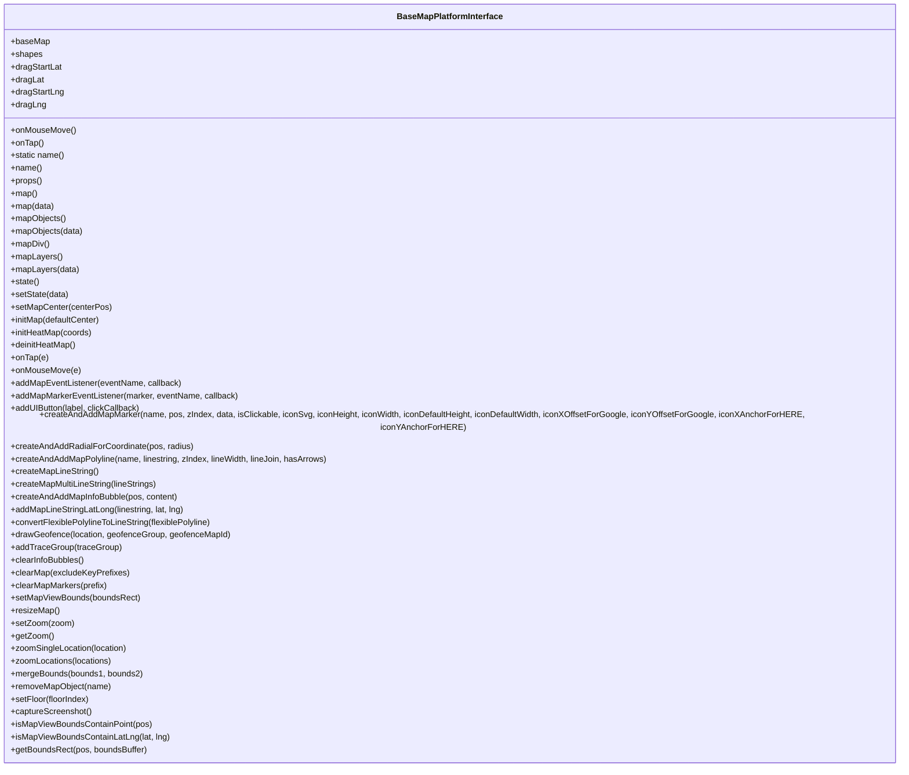

# Diagram: web/portal/src/modules/map/platforms/MapPlatformInterface.js

> Auto-generated by Obscura crawlers

## Mermaid

### SVG

<svg id="container" width="1740.28125" xmlns="http://www.w3.org/2000/svg" class="classDiagram" height="1432" viewBox="0 0 1740.28125 1432" role="graphics-document document" aria-roledescription="class"><g><defs><marker id="container_class-aggregationStart" class="marker aggregation class" refX="18" refY="7" markerWidth="190" markerHeight="240" orient="auto"><path d="M 18,7 L9,13 L1,7 L9,1 Z"></path></marker></defs><defs><marker id="container_class-aggregationEnd" class="marker aggregation class" refX="1" refY="7" markerWidth="20" markerHeight="28" orient="auto"><path d="M 18,7 L9,13 L1,7 L9,1 Z"></path></marker></defs><defs><marker id="container_class-extensionStart" class="marker extension class" refX="18" refY="7" markerWidth="190" markerHeight="240" orient="auto"><path d="M 1,7 L18,13 V 1 Z"></path></marker></defs><defs><marker id="container_class-extensionEnd" class="marker extension class" refX="1" refY="7" markerWidth="20" markerHeight="28" orient="auto"><path d="M 1,1 V 13 L18,7 Z"></path></marker></defs><defs><marker id="container_class-compositionStart" class="marker composition class" refX="18" refY="7" markerWidth="190" markerHeight="240" orient="auto"><path d="M 18,7 L9,13 L1,7 L9,1 Z"></path></marker></defs><defs><marker id="container_class-compositionEnd" class="marker composition class" refX="1" refY="7" markerWidth="20" markerHeight="28" orient="auto"><path d="M 18,7 L9,13 L1,7 L9,1 Z"></path></marker></defs><defs><marker id="container_class-dependencyStart" class="marker dependency class" refX="6" refY="7" markerWidth="190" markerHeight="240" orient="auto"><path d="M 5,7 L9,13 L1,7 L9,1 Z"></path></marker></defs><defs><marker id="container_class-dependencyEnd" class="marker dependency class" refX="13" refY="7" markerWidth="20" markerHeight="28" orient="auto"><path d="M 18,7 L9,13 L14,7 L9,1 Z"></path></marker></defs><defs><marker id="container_class-lollipopStart" class="marker lollipop class" refX="13" refY="7" markerWidth="190" markerHeight="240" orient="auto"><circle stroke="black" fill="transparent" cx="7" cy="7" r="6"></circle></marker></defs><defs><marker id="container_class-lollipopEnd" class="marker lollipop class" refX="1" refY="7" markerWidth="190" markerHeight="240" orient="auto"><circle stroke="black" fill="transparent" cx="7" cy="7" r="6"></circle></marker></defs><g class="root"><g class="clusters"></g><g class="edgePaths"></g><g class="edgeLabels"></g><g class="nodes"><g class="node default" id="classId-BaseMapPlatformInterface-0" transform="translate(870.140625, 716)"><g class="basic label-container"><path d="M-862.140625 -708 L862.140625 -708 L862.140625 708 L-862.140625 708" stroke="none" stroke-width="0" fill="#ECECFF" style=""></path><path d="M-862.140625 -708 C-332.7380132825165 -708, 196.66459843496705 -708, 862.140625 -708 M-862.140625 -708 C-502.24486372394904 -708, -142.34910244789808 -708, 862.140625 -708 M862.140625 -708 C862.140625 -156.86206462147493, 862.140625 394.27587075705014, 862.140625 708 M862.140625 -708 C862.140625 -327.7257534579501, 862.140625 52.548493084099846, 862.140625 708 M862.140625 708 C408.7739311101288 708, -44.59276277974243 708, -862.140625 708 M862.140625 708 C438.600055914516 708, 15.05948682903204 708, -862.140625 708 M-862.140625 708 C-862.140625 280.94394805024854, -862.140625 -146.11210389950293, -862.140625 -708 M-862.140625 708 C-862.140625 299.9434559077659, -862.140625 -108.11308818446821, -862.140625 -708" stroke="#9370DB" stroke-width="1.3" fill="none" stroke-dasharray="0 0" style=""></path></g><g class="annotation-group text" transform="translate(0, -684)"></g><g class="label-group text" transform="translate(-97.5625, -684)"><g class="label" style="font-weight: bolder" transform="translate(0,-12)"><foreignObject width="195.125" height="24">

BaseMapPlatformInterface

</foreignObject></g></g><g class="members-group text" transform="translate(-850.140625, -636)"><g class="label" style="" transform="translate(0,-12)"><foreignObject width="72.734375" height="24">

+baseMap

</foreignObject></g><g class="label" style="" transform="translate(0,12)"><foreignObject width="59.234375" height="24">

+shapes

</foreignObject></g><g class="label" style="" transform="translate(0,36)"><foreignObject width="97.375" height="24">

+dragStartLat

</foreignObject></g><g class="label" style="" transform="translate(0,60)"><foreignObject width="62.328125" height="24">

+dragLat

</foreignObject></g><g class="label" style="" transform="translate(0,84)"><foreignObject width="100.578125" height="24">

+dragStartLng

</foreignObject></g><g class="label" style="" transform="translate(0,108)"><foreignObject width="65.546875" height="24">

+dragLng

</foreignObject></g></g><g class="methods-group text" transform="translate(-850.140625, -468)"><g class="label" style="" transform="translate(0,-12)"><foreignObject width="122.625" height="24">

+onMouseMove()

</foreignObject></g><g class="label" style="" transform="translate(0,12)"><foreignObject width="62.765625" height="24">

+onTap()

</foreignObject></g><g class="label" style="" transform="translate(0,36)"><foreignObject width="102.890625" height="24">

+static name()

</foreignObject></g><g class="label" style="" transform="translate(0,60)"><foreignObject width="58.875" height="24">

+name()

</foreignObject></g><g class="label" style="" transform="translate(0,84)"><foreignObject width="59.875" height="24">

+props()

</foreignObject></g><g class="label" style="" transform="translate(0,108)"><foreignObject width="50.28125" height="24">

+map()

</foreignObject></g><g class="label" style="" transform="translate(0,132)"><foreignObject width="82.921875" height="24">

+map(data)

</foreignObject></g><g class="label" style="" transform="translate(0,156)"><foreignObject width="104.953125" height="24">

+mapObjects()

</foreignObject></g><g class="label" style="" transform="translate(0,180)"><foreignObject width="137.59375" height="24">

+mapObjects(data)

</foreignObject></g><g class="label" style="" transform="translate(0,204)"><foreignObject width="72.96875" height="24">

+mapDiv()

</foreignObject></g><g class="label" style="" transform="translate(0,228)"><foreignObject width="96.484375" height="24">

+mapLayers()

</foreignObject></g><g class="label" style="" transform="translate(0,252)"><foreignObject width="129.125" height="24">

+mapLayers(data)

</foreignObject></g><g class="label" style="" transform="translate(0,276)"><foreignObject width="54.453125" height="24">

+state()

</foreignObject></g><g class="label" style="" transform="translate(0,300)"><foreignObject width="110.3125" height="24">

+setState(data)

</foreignObject></g><g class="label" style="" transform="translate(0,324)"><foreignObject width="189.640625" height="24">

+setMapCenter(centerPos)

</foreignObject></g><g class="label" style="" transform="translate(0,348)"><foreignObject width="172.140625" height="24">

+initMap(defaultCenter)

</foreignObject></g><g class="label" style="" transform="translate(0,372)"><foreignObject width="155.859375" height="24">

+initHeatMap(coords)

</foreignObject></g><g class="label" style="" transform="translate(0,396)"><foreignObject width="125.40625" height="24">

+deinitHeatMap()

</foreignObject></g><g class="label" style="" transform="translate(0,420)"><foreignObject width="71.484375" height="24">

+onTap(e)

</foreignObject></g><g class="label" style="" transform="translate(0,444)"><foreignObject width="131.359375" height="24">

+onMouseMove(e)

</foreignObject></g><g class="label" style="" transform="translate(0,468)"><foreignObject width="324.625" height="24">

+addMapEventListener(eventName, callback)

</foreignObject></g><g class="label" style="" transform="translate(0,492)"><foreignObject width="433.234375" height="24">

+addMapMarkerEventListener(marker, eventName, callback)

</foreignObject></g><g class="label" style="" transform="translate(0,516)"><foreignObject width="248.015625" height="24">

+addUIButton(label, clickCallback)

</foreignObject></g><g class="label" style="" transform="translate(0,540)"><foreignObject width="1602.71875" height="24">

+createAndAddMapMarker(name, pos, zIndex, data, isClickable, iconSvg, iconHeight, iconWidth, iconDefaultHeight, iconDefaultWidth, iconXOffsetForGoogle, iconYOffsetForGoogle, iconXAnchorForHERE, iconYAnchorForHERE)

</foreignObject></g><g class="label" style="" transform="translate(0,564)"><foreignObject width="347.015625" height="24">

+createAndAddRadialForCoordinate(pos, radius)

</foreignObject></g><g class="label" style="" transform="translate(0,588)"><foreignObject width="604.765625" height="24">

+createAndAddMapPolyline(name, linestring, zIndex, lineWidth, lineJoin, hasArrows)

</foreignObject></g><g class="label" style="" transform="translate(0,612)"><foreignObject width="167.34375" height="24">

+createMapLineString()

</foreignObject></g><g class="label" style="" transform="translate(0,636)"><foreignObject width="281.609375" height="24">

+createMapMultiLineString(lineStrings)

</foreignObject></g><g class="label" style="" transform="translate(0,660)"><foreignObject width="320.171875" height="24">

+createAndAddMapInfoBubble(pos, content)

</foreignObject></g><g class="label" style="" transform="translate(0,684)"><foreignObject width="333.59375" height="24">

+addMapLineStringLatLong(linestring, lat, lng)

</foreignObject></g><g class="label" style="" transform="translate(0,708)"><foreignObject width="387.734375" height="24">

+convertFlexiblePolylineToLineString(flexiblePolyline)

</foreignObject></g><g class="label" style="" transform="translate(0,732)"><foreignObject width="416.140625" height="24">

+drawGeofence(location, geofenceGroup, geofenceMapId)

</foreignObject></g><g class="label" style="" transform="translate(0,756)"><foreignObject width="208.171875" height="24">

+addTraceGroup(traceGroup)

</foreignObject></g><g class="label" style="" transform="translate(0,780)"><foreignObject width="141.546875" height="24">

+clearInfoBubbles()

</foreignObject></g><g class="label" style="" transform="translate(0,804)"><foreignObject width="222.96875" height="24">

+clearMap(excludeKeyPrefixes)

</foreignObject></g><g class="label" style="" transform="translate(0,828)"><foreignObject width="183.09375" height="24">

+clearMapMarkers(prefix)

</foreignObject></g><g class="label" style="" transform="translate(0,852)"><foreignObject width="245.546875" height="24">

+setMapViewBounds(boundsRect)

</foreignObject></g><g class="label" style="" transform="translate(0,876)"><foreignObject width="91.015625" height="24">

+resizeMap()

</foreignObject></g><g class="label" style="" transform="translate(0,900)"><foreignObject width="120.015625" height="24">

+setZoom(zoom)

</foreignObject></g><g class="label" style="" transform="translate(0,924)"><foreignObject width="81.3125" height="24">

+getZoom()

</foreignObject></g><g class="label" style="" transform="translate(0,948)"><foreignObject width="222.6875" height="24">

+zoomSingleLocation(location)

</foreignObject></g><g class="label" style="" transform="translate(0,972)"><foreignObject width="193.375" height="24">

+zoomLocations(locations)

</foreignObject></g><g class="label" style="" transform="translate(0,996)"><foreignObject width="249.75" height="24">

+mergeBounds(bounds1, bounds2)

</foreignObject></g><g class="label" style="" transform="translate(0,1020)"><foreignObject width="190.671875" height="24">

+removeMapObject(name)

</foreignObject></g><g class="label" style="" transform="translate(0,1044)"><foreignObject width="151.75" height="24">

+setFloor(floorIndex)

</foreignObject></g><g class="label" style="" transform="translate(0,1068)"><foreignObject width="154.40625" height="24">

+captureScreenshot()

</foreignObject></g><g class="label" style="" transform="translate(0,1092)"><foreignObject width="269.15625" height="24">

+isMapViewBoundsContainPoint(pos)

</foreignObject></g><g class="label" style="" transform="translate(0,1116)"><foreignObject width="302.421875" height="24">

+isMapViewBoundsContainLatLng(lat, lng)

</foreignObject></g><g class="label" style="" transform="translate(0,1140)"><foreignObject width="260.78125" height="24">

+getBoundsRect(pos, boundsBuffer)

</foreignObject></g></g><g class="divider" style=""><path d="M-862.140625 -660 C-501.9587659544266 -660, -141.77690690885322 -660, 862.140625 -660 M-862.140625 -660 C-177.40494733486082 -660, 507.33073033027836 -660, 862.140625 -660" stroke="#9370DB" stroke-width="1.3" fill="none" stroke-dasharray="0 0" style=""></path></g><g class="divider" style=""><path d="M-862.140625 -492 C-485.4253562934717 -492, -108.71008758694336 -492, 862.140625 -492 M-862.140625 -492 C-191.05648227167387 -492, 480.02766045665226 -492, 862.140625 -492" stroke="#9370DB" stroke-width="1.3" fill="none" stroke-dasharray="0 0" style=""></path></g></g></g></g></g></svg>
