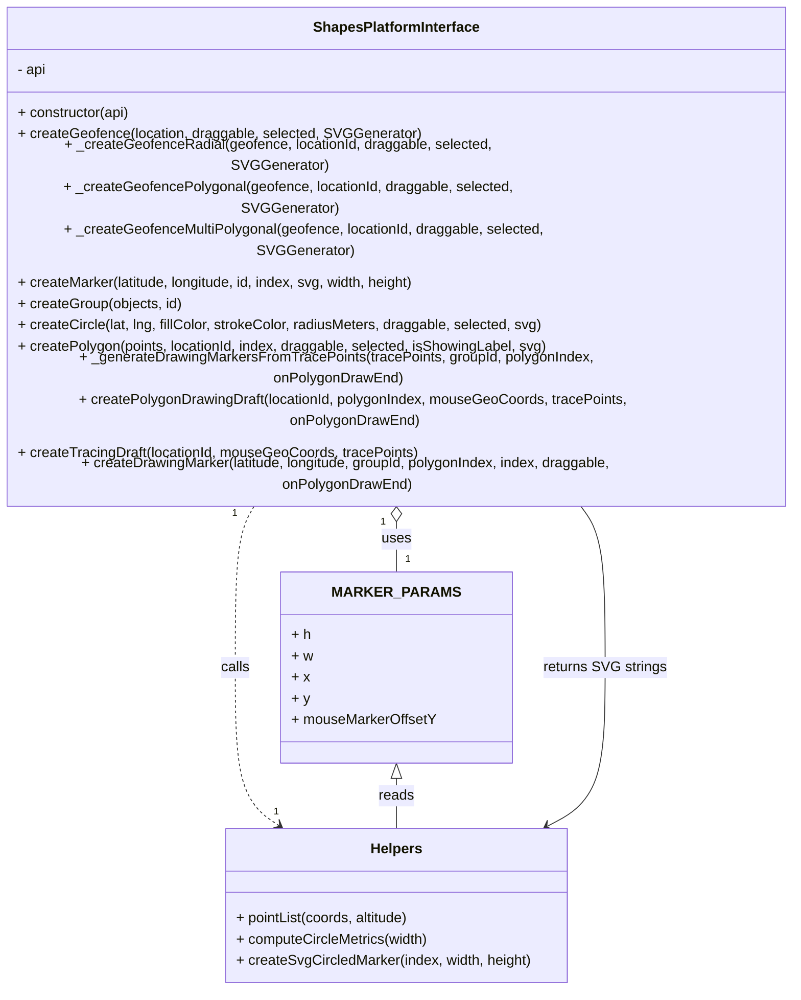

# Diagram: web/portal/src/modules/map/platforms/ShapesPlatformInterface.js


> Auto-generated by Obscura crawlers

## Diagram 1



### SVG

<svg id="container" width="901.4296875" xmlns="http://www.w3.org/2000/svg" class="classDiagram" height="986" viewBox="0 0 901.4296875 986" role="graphics-document document" aria-roledescription="class"><style>#container{font-family:"trebuchet ms",verdana,arial,sans-serif;font-size:16px;fill:#333;}@keyframes edge-animation-frame{from{stroke-dashoffset:0;}}@keyframes dash{to{stroke-dashoffset:0;}}#container .edge-animation-slow{stroke-dasharray:9,5!important;stroke-dashoffset:900;animation:dash 50s linear infinite;stroke-linecap:round;}#container .edge-animation-fast{stroke-dasharray:9,5!important;stroke-dashoffset:900;animation:dash 20s linear infinite;stroke-linecap:round;}#container .error-icon{fill:#552222;}#container .error-text{fill:#552222;stroke:#552222;}#container .edge-thickness-normal{stroke-width:1px;}#container .edge-thickness-thick{stroke-width:3.5px;}#container .edge-pattern-solid{stroke-dasharray:0;}#container .edge-thickness-invisible{stroke-width:0;fill:none;}#container .edge-pattern-dashed{stroke-dasharray:3;}#container .edge-pattern-dotted{stroke-dasharray:2;}#container .marker{fill:#333333;stroke:#333333;}#container .marker.cross{stroke:#333333;}#container svg{font-family:"trebuchet ms",verdana,arial,sans-serif;font-size:16px;}#container p{margin:0;}#container g.classGroup text{fill:#9370DB;stroke:none;font-family:"trebuchet ms",verdana,arial,sans-serif;font-size:10px;}#container g.classGroup text .title{font-weight:bolder;}#container .nodeLabel,#container .edgeLabel{color:#131300;}#container .edgeLabel .label rect{fill:#ECECFF;}#container .label text{fill:#131300;}#container .labelBkg{background:#ECECFF;}#container .edgeLabel .label span{background:#ECECFF;}#container .classTitle{font-weight:bolder;}#container .node rect,#container .node circle,#container .node ellipse,#container .node polygon,#container .node path{fill:#ECECFF;stroke:#9370DB;stroke-width:1px;}#container .divider{stroke:#9370DB;stroke-width:1;}#container g.clickable{cursor:pointer;}#container g.classGroup rect{fill:#ECECFF;stroke:#9370DB;}#container g.classGroup line{stroke:#9370DB;stroke-width:1;}#container .classLabel .box{stroke:none;stroke-width:0;fill:#ECECFF;opacity:0.5;}#container .classLabel .label{fill:#9370DB;font-size:10px;}#container .relation{stroke:#333333;stroke-width:1;fill:none;}#container .dashed-line{stroke-dasharray:3;}#container .dotted-line{stroke-dasharray:1 2;}#container #compositionStart,#container .composition{fill:#333333!important;stroke:#333333!important;stroke-width:1;}#container #compositionEnd,#container .composition{fill:#333333!important;stroke:#333333!important;stroke-width:1;}#container #dependencyStart,#container .dependency{fill:#333333!important;stroke:#333333!important;stroke-width:1;}#container #dependencyStart,#container .dependency{fill:#333333!important;stroke:#333333!important;stroke-width:1;}#container #extensionStart,#container .extension{fill:transparent!important;stroke:#333333!important;stroke-width:1;}#container #extensionEnd,#container .extension{fill:transparent!important;stroke:#333333!important;stroke-width:1;}#container #aggregationStart,#container .aggregation{fill:transparent!important;stroke:#333333!important;stroke-width:1;}#container #aggregationEnd,#container .aggregation{fill:transparent!important;stroke:#333333!important;stroke-width:1;}#container #lollipopStart,#container .lollipop{fill:#ECECFF!important;stroke:#333333!important;stroke-width:1;}#container #lollipopEnd,#container .lollipop{fill:#ECECFF!important;stroke:#333333!important;stroke-width:1;}#container .edgeTerminals{font-size:11px;line-height:initial;}#container .classTitleText{text-anchor:middle;font-size:18px;fill:#333;}#container .label-icon{display:inline-block;height:1em;overflow:visible;vertical-align:-0.125em;}#container .node .label-icon path{fill:currentColor;stroke:revert;stroke-width:revert;}#container :root{--mermaid-font-family:"trebuchet ms",verdana,arial,sans-serif;}</style><g><defs><marker id="container_class-aggregationStart" class="marker aggregation class" refX="18" refY="7" markerWidth="190" markerHeight="240" orient="auto"><path d="M 18,7 L9,13 L1,7 L9,1 Z"></path></marker></defs><defs><marker id="container_class-aggregationEnd" class="marker aggregation class" refX="1" refY="7" markerWidth="20" markerHeight="28" orient="auto"><path d="M 18,7 L9,13 L1,7 L9,1 Z"></path></marker></defs><defs><marker id="container_class-extensionStart" class="marker extension class" refX="18" refY="7" markerWidth="190" markerHeight="240" orient="auto"><path d="M 1,7 L18,13 V 1 Z"></path></marker></defs><defs><marker id="container_class-extensionEnd" class="marker extension class" refX="1" refY="7" markerWidth="20" markerHeight="28" orient="auto"><path d="M 1,1 V 13 L18,7 Z"></path></marker></defs><defs><marker id="container_class-compositionStart" class="marker composition class" refX="18" refY="7" markerWidth="190" markerHeight="240" orient="auto"><path d="M 18,7 L9,13 L1,7 L9,1 Z"></path></marker></defs><defs><marker id="container_class-compositionEnd" class="marker composition class" refX="1" refY="7" markerWidth="20" markerHeight="28" orient="auto"><path d="M 18,7 L9,13 L1,7 L9,1 Z"></path></marker></defs><defs><marker id="container_class-dependencyStart" class="marker dependency class" refX="6" refY="7" markerWidth="190" markerHeight="240" orient="auto"><path d="M 5,7 L9,13 L1,7 L9,1 Z"></path></marker></defs><defs><marker id="container_class-dependencyEnd" class="marker dependency class" refX="13" refY="7" markerWidth="20" markerHeight="28" orient="auto"><path d="M 18,7 L9,13 L14,7 L9,1 Z"></path></marker></defs><defs><marker id="container_class-lollipopStart" class="marker lollipop class" refX="13" refY="7" markerWidth="190" markerHeight="240" orient="auto"><circle stroke="black" fill="transparent" cx="7" cy="7" r="6"></circle></marker></defs><defs><marker id="container_class-lollipopEnd" class="marker lollipop class" refX="1" refY="7" markerWidth="190" markerHeight="240" orient="auto"><circle stroke="black" fill="transparent" cx="7" cy="7" r="6"></circle></marker></defs><g class="root"><g class="clusters"></g><g class="edgePaths"><path d="M450.715,457.25L450.715,460.542C450.715,463.833,450.715,470.417,450.715,479.875C450.715,489.333,450.715,501.667,450.715,507.833L450.715,514" id="id_ShapesPlatformInterface_MARKER_PARAMS_1" class="edge-thickness-normal edge-pattern-solid relation" style=";;;" data-edge="true" data-et="edge" data-id="id_ShapesPlatformInterface_MARKER_PARAMS_1" data-points="W3sieCI6NDUwLjcxNDg0Mzc1LCJ5Ijo0NDB9LHsieCI6NDUwLjcxNDg0Mzc1LCJ5Ijo0Nzd9LHsieCI6NDUwLjcxNDg0Mzc1LCJ5Ijo1MTR9XQ==" marker-start="url(#container_class-aggregationStart)"></path><path d="M299.517,440L295.2,446.167C290.884,452.333,282.25,464.667,277.934,495C273.617,525.333,273.617,573.667,273.617,622C273.617,670.333,273.617,718.667,281.605,748.426C289.593,778.186,305.57,789.372,313.558,794.966L321.546,800.559" id="id_ShapesPlatformInterface_Helpers_2" class="edge-thickness-normal edge-pattern-dashed relation" style=";;;" data-edge="true" data-et="edge" data-id="id_ShapesPlatformInterface_Helpers_2" data-points="W3sieCI6Mjk5LjUxNjg0NDczODE0MjI1LCJ5Ijo0NDB9LHsieCI6MjczLjYxNzE4NzUsInkiOjQ3N30seyJ4IjoyNzMuNjE3MTg3NSwieSI6NjIyfSx7IngiOjI3My42MTcxODc1LCJ5Ijo3Njd9LHsieCI6MzI2LjQ2MDg0Mjk5Mzk1MTYsInkiOjgwNH1d" marker-end="url(#container_class-dependencyEnd)"></path><path d="M450.715,747.25L450.715,750.542C450.715,753.833,450.715,760.417,450.715,769.875C450.715,779.333,450.715,791.667,450.715,797.833L450.715,804" id="id_MARKER_PARAMS_Helpers_3" class="edge-thickness-normal edge-pattern-solid relation" style=";;;" data-edge="true" data-et="edge" data-id="id_MARKER_PARAMS_Helpers_3" data-points="W3sieCI6NDUwLjcxNDg0Mzc1LCJ5Ijo3MzB9LHsieCI6NDUwLjcxNDg0Mzc1LCJ5Ijo3Njd9LHsieCI6NDUwLjcxNDg0Mzc1LCJ5Ijo4MDR9XQ==" marker-start="url(#container_class-extensionStart)"></path><path d="M616.878,801.146L627.403,795.455C637.927,789.764,658.975,778.382,669.499,748.524C680.023,718.667,680.023,670.333,680.023,622C680.023,573.667,680.023,525.333,674.434,495C668.845,464.667,657.667,452.333,652.077,446.167L646.488,440" id="id_Helpers_ShapesPlatformInterface_4" class="edge-thickness-normal edge-pattern-solid relation" style=";;;" data-edge="true" data-et="edge" data-id="id_Helpers_ShapesPlatformInterface_4" data-points="W3sieCI6NjExLjYwMDcxMTk0NTU2NDUsInkiOjgwNH0seyJ4Ijo2ODAuMDIzNDM3NSwieSI6NzY3fSx7IngiOjY4MC4wMjM0Mzc1LCJ5Ijo2MjJ9LHsieCI6NjgwLjAyMzQzNzUsInkiOjQ3N30seyJ4Ijo2NDYuNDg4MTg4NjExNjYwMSwieSI6NDQwfV0=" marker-start="url(#container_class-dependencyStart)"></path></g><g class="edgeLabels"><g class="edgeLabel" transform="translate(450.71484375, 477)"><g class="label" data-id="id_ShapesPlatformInterface_MARKER_PARAMS_1" transform="translate(-16.4921875, -12)"><foreignObject width="32.984375" height="24"><div xmlns="http://www.w3.org/1999/xhtml" class="labelBkg" style="display: table-cell; white-space: nowrap; line-height: 1.5; max-width: 200px; text-align: center;"><span class="edgeLabel"><p>uses</p></span></div></foreignObject></g></g><g class="edgeLabel" transform="translate(273.6171875, 622)"><g class="label" data-id="id_ShapesPlatformInterface_Helpers_2" transform="translate(-16.4453125, -12)"><foreignObject width="32.890625" height="24"><div xmlns="http://www.w3.org/1999/xhtml" class="labelBkg" style="display: table-cell; white-space: nowrap; line-height: 1.5; max-width: 200px; text-align: center;"><span class="edgeLabel"><p>calls</p></span></div></foreignObject></g></g><g class="edgeLabel" transform="translate(450.71484375, 767)"><g class="label" data-id="id_MARKER_PARAMS_Helpers_3" transform="translate(-20.0078125, -12)"><foreignObject width="40.015625" height="24"><div xmlns="http://www.w3.org/1999/xhtml" class="labelBkg" style="display: table-cell; white-space: nowrap; line-height: 1.5; max-width: 200px; text-align: center;"><span class="edgeLabel"><p>reads</p></span></div></foreignObject></g></g><g class="edgeLabel" transform="translate(680.0234375, 622)"><g class="label" data-id="id_Helpers_ShapesPlatformInterface_4" transform="translate(-68.65625, -12)"><foreignObject width="137.3125" height="24"><div xmlns="http://www.w3.org/1999/xhtml" class="labelBkg" style="display: table-cell; white-space: nowrap; line-height: 1.5; max-width: 200px; text-align: center;"><span class="edgeLabel"><p>returns SVG strings</p></span></div></foreignObject></g></g><g class="edgeTerminals" transform="translate(435.7148418750001, 457.49999839285715)"><g class="inner" transform="translate(0, 0)"><foreignObject style="width: 9px; height: 12px;"><div xmlns="http://www.w3.org/1999/xhtml" style="display: inline-block; padding-right: 1px; white-space: nowrap;"><span class="edgeLabel">1</span></div></foreignObject></g></g><g class="edgeTerminals" transform="translate(277.192810555774, 445.734760557206)"><g class="inner" transform="translate(0, 0)"><foreignObject style="width: 9px; height: 12px;"><div xmlns="http://www.w3.org/1999/xhtml" style="display: inline-block; padding-right: 1px; white-space: nowrap;"><span class="edgeLabel">1</span></div></foreignObject></g></g><g class="edgeTerminals" transform="translate(460.7148418749999, 491.49999839285715)"><g class="inner" transform="translate(0, 0)"></g><foreignObject style="width: 9px; height: 12px;"><div xmlns="http://www.w3.org/1999/xhtml" style="display: inline-block; padding-right: 1px; white-space: nowrap;"><span class="edgeLabel">1</span></div></foreignObject></g><g class="edgeTerminals" transform="translate(315.7288945356043, 776.6752423349697)"><g class="inner" transform="translate(0, 0)"></g><foreignObject style="width: 9px; height: 12px;"><div xmlns="http://www.w3.org/1999/xhtml" style="display: inline-block; padding-right: 1px; white-space: nowrap;"><span class="edgeLabel">1</span></div></foreignObject></g></g><g class="nodes"><g class="node default" id="classId-ShapesPlatformInterface-0" transform="translate(450.71484375, 224)"><g class="basic label-container"><path d="M-442.71484375 -216 L442.71484375 -216 L442.71484375 216 L-442.71484375 216" stroke="none" stroke-width="0" fill="#ECECFF" style=""></path><path d="M-442.71484375 -216 C-129.72891852139907 -216, 183.25700670720187 -216, 442.71484375 -216 M-442.71484375 -216 C-120.67994844716094 -216, 201.35494685567812 -216, 442.71484375 -216 M442.71484375 -216 C442.71484375 -79.03484612762892, 442.71484375 57.93030774474215, 442.71484375 216 M442.71484375 -216 C442.71484375 -80.00290810969705, 442.71484375 55.99418378060591, 442.71484375 216 M442.71484375 216 C222.15824903013788 216, 1.6016543102757623 216, -442.71484375 216 M442.71484375 216 C192.4788263508782 216, -57.75719104824361 216, -442.71484375 216 M-442.71484375 216 C-442.71484375 48.71737946452984, -442.71484375 -118.56524107094032, -442.71484375 -216 M-442.71484375 216 C-442.71484375 119.07474153505024, -442.71484375 22.149483070100473, -442.71484375 -216" stroke="#9370DB" stroke-width="1.3" fill="none" stroke-dasharray="0 0" style=""></path></g><g class="annotation-group text" transform="translate(0, -192)"></g><g class="label-group text" transform="translate(-91.2265625, -192)"><g class="label" style="font-weight: bolder" transform="translate(0,-12)"><foreignObject width="182.453125" height="24"><div xmlns="http://www.w3.org/1999/xhtml" style="display: table-cell; white-space: nowrap; line-height: 1.5; max-width: 229px; text-align: center;"><span class="nodeLabel markdown-node-label" style=""><p>ShapesPlatformInterface</p></span></div></foreignObject></g></g><g class="members-group text" transform="translate(-430.71484375, -144)"><g class="label" style="" transform="translate(0,-12)"><foreignObject width="33.421875" height="24"><div xmlns="http://www.w3.org/1999/xhtml" style="display: table-cell; white-space: nowrap; line-height: 1.5; max-width: 91px; text-align: center;"><span class="nodeLabel markdown-node-label" style=""><p>- api</p></span></div></foreignObject></g></g><g class="methods-group text" transform="translate(-430.71484375, -96)"><g class="label" style="" transform="translate(0,-12)"><foreignObject width="128.8125" height="24"><div xmlns="http://www.w3.org/1999/xhtml" style="display: table-cell; white-space: nowrap; line-height: 1.5; max-width: 186px; text-align: center;"><span class="nodeLabel markdown-node-label" style=""><p>+ constructor(api)</p></span></div></foreignObject></g><g class="label" style="" transform="translate(0,12)"><foreignObject width="450.390625" height="24"><div xmlns="http://www.w3.org/1999/xhtml" style="display: table-cell; white-space: nowrap; line-height: 1.5; max-width: 508px; text-align: center;"><span class="nodeLabel markdown-node-label" style=""><p>+ createGeofence(location, draggable, selected, SVGGenerator)</p></span></div></foreignObject></g><g class="label" style="" transform="translate(0,36)"><foreignObject width="591.609375" height="24"><div xmlns="http://www.w3.org/1999/xhtml" style="display: table-cell; white-space: nowrap; line-height: 1.5; max-width: 649px; text-align: center;"><span class="nodeLabel markdown-node-label" style=""><p>+ _createGeofenceRadial(geofence, locationId, draggable, selected, SVGGenerator)</p></span></div></foreignObject></g><g class="label" style="" transform="translate(0,60)"><foreignObject width="616.609375" height="24"><div xmlns="http://www.w3.org/1999/xhtml" style="display: table-cell; white-space: nowrap; line-height: 1.5; max-width: 674px; text-align: center;"><span class="nodeLabel markdown-node-label" style=""><p>+ _createGeofencePolygonal(geofence, locationId, draggable, selected, SVGGenerator)</p></span></div></foreignObject></g><g class="label" style="" transform="translate(0,84)"><foreignObject width="653.359375" height="24"><div xmlns="http://www.w3.org/1999/xhtml" style="display: table-cell; white-space: nowrap; line-height: 1.5; max-width: 711px; text-align: center;"><span class="nodeLabel markdown-node-label" style=""><p>+ _createGeofenceMultiPolygonal(geofence, locationId, draggable, selected, SVGGenerator)</p></span></div></foreignObject></g><g class="label" style="" transform="translate(0,108)"><foreignObject width="456.484375" height="24"><div xmlns="http://www.w3.org/1999/xhtml" style="display: table-cell; white-space: nowrap; line-height: 1.5; max-width: 514px; text-align: center;"><span class="nodeLabel markdown-node-label" style=""><p>+ createMarker(latitude, longitude, id, index, svg, width, height)</p></span></div></foreignObject></g><g class="label" style="" transform="translate(0,132)"><foreignObject width="186.515625" height="24"><div xmlns="http://www.w3.org/1999/xhtml" style="display: table-cell; white-space: nowrap; line-height: 1.5; max-width: 244px; text-align: center;"><span class="nodeLabel markdown-node-label" style=""><p>+ createGroup(objects, id)</p></span></div></foreignObject></g><g class="label" style="" transform="translate(0,156)"><foreignObject width="592.8125" height="24"><div xmlns="http://www.w3.org/1999/xhtml" style="display: table-cell; white-space: nowrap; line-height: 1.5; max-width: 650px; text-align: center;"><span class="nodeLabel markdown-node-label" style=""><p>+ createCircle(lat, lng, fillColor, strokeColor, radiusMeters, draggable, selected, svg)</p></span></div></foreignObject></g><g class="label" style="" transform="translate(0,180)"><foreignObject width="600.921875" height="24"><div xmlns="http://www.w3.org/1999/xhtml" style="display: table-cell; white-space: nowrap; line-height: 1.5; max-width: 658px; text-align: center;"><span class="nodeLabel markdown-node-label" style=""><p>+ createPolygon(points, locationId, index, draggable, selected, isShowingLabel, svg)</p></span></div></foreignObject></g><g class="label" style="" transform="translate(0,204)"><foreignObject width="729.359375" height="24"><div xmlns="http://www.w3.org/1999/xhtml" style="display: table-cell; white-space: nowrap; line-height: 1.5; max-width: 787px; text-align: center;"><span class="nodeLabel markdown-node-label" style=""><p>+ _generateDrawingMarkersFromTracePoints(tracePoints, groupId, polygonIndex, onPolygonDrawEnd)</p></span></div></foreignObject></g><g class="label" style="" transform="translate(0,228)"><foreignObject width="770.203125" height="24"><div xmlns="http://www.w3.org/1999/xhtml" style="display: table-cell; white-space: nowrap; line-height: 1.5; max-width: 828px; text-align: center;"><span class="nodeLabel markdown-node-label" style=""><p>+ createPolygonDrawingDraft(locationId, polygonIndex, mouseGeoCoords, tracePoints, onPolygonDrawEnd)</p></span></div></foreignObject></g><g class="label" style="" transform="translate(0,252)"><foreignObject width="453.015625" height="24"><div xmlns="http://www.w3.org/1999/xhtml" style="display: table-cell; white-space: nowrap; line-height: 1.5; max-width: 510px; text-align: center;"><span class="nodeLabel markdown-node-label" style=""><p>+ createTracingDraft(locationId, mouseGeoCoords, tracePoints)</p></span></div></foreignObject></g><g class="label" style="" transform="translate(0,276)"><foreignObject width="755.84375" height="24"><div xmlns="http://www.w3.org/1999/xhtml" style="display: table-cell; white-space: nowrap; line-height: 1.5; max-width: 813px; text-align: center;"><span class="nodeLabel markdown-node-label" style=""><p>+ createDrawingMarker(latitude, longitude, groupId, polygonIndex, index, draggable, onPolygonDrawEnd)</p></span></div></foreignObject></g></g><g class="divider" style=""><path d="M-442.71484375 -168 C-192.65744164398433 -168, 57.399960462031345 -168, 442.71484375 -168 M-442.71484375 -168 C-92.04432753763359 -168, 258.6261886747328 -168, 442.71484375 -168" stroke="#9370DB" stroke-width="1.3" fill="none" stroke-dasharray="0 0" style=""></path></g><g class="divider" style=""><path d="M-442.71484375 -120 C-219.60876775768045 -120, 3.4973082346390925 -120, 442.71484375 -120 M-442.71484375 -120 C-115.73107838556177 -120, 211.25268697887645 -120, 442.71484375 -120" stroke="#9370DB" stroke-width="1.3" fill="none" stroke-dasharray="0 0" style=""></path></g></g><g class="node default" id="classId-MARKER_PARAMS-1" transform="translate(450.71484375, 622)"><g class="basic label-container"><path d="M-125.65234375 -108 L125.65234375 -108 L125.65234375 108 L-125.65234375 108" stroke="none" stroke-width="0" fill="#ECECFF" style=""></path><path d="M-125.65234375 -108 C-35.961360332360954 -108, 53.72962308527809 -108, 125.65234375 -108 M-125.65234375 -108 C-46.822558301479646 -108, 32.00722714704071 -108, 125.65234375 -108 M125.65234375 -108 C125.65234375 -43.524047252320585, 125.65234375 20.95190549535883, 125.65234375 108 M125.65234375 -108 C125.65234375 -44.84261523568278, 125.65234375 18.314769528634443, 125.65234375 108 M125.65234375 108 C64.50699368633937 108, 3.3616436226787556 108, -125.65234375 108 M125.65234375 108 C53.83918012707106 108, -17.97398349585788 108, -125.65234375 108 M-125.65234375 108 C-125.65234375 36.06717469080877, -125.65234375 -35.86565061838246, -125.65234375 -108 M-125.65234375 108 C-125.65234375 41.072008143307485, -125.65234375 -25.85598371338503, -125.65234375 -108" stroke="#9370DB" stroke-width="1.3" fill="none" stroke-dasharray="0 0" style=""></path></g><g class="annotation-group text" transform="translate(0, -84)"></g><g class="label-group text" transform="translate(-63.7578125, -84)"><g class="label" style="font-weight: bolder" transform="translate(0,-12)"><foreignObject width="127.515625" height="24"><div xmlns="http://www.w3.org/1999/xhtml" style="display: table-cell; white-space: nowrap; line-height: 1.5; max-width: 175px; text-align: center;"><span class="nodeLabel markdown-node-label" style=""><p>MARKER_PARAMS</p></span></div></foreignObject></g></g><g class="members-group text" transform="translate(-113.65234375, -36)"><g class="label" style="" transform="translate(0,-12)"><foreignObject width="21.609375" height="24"><div xmlns="http://www.w3.org/1999/xhtml" style="display: table-cell; white-space: nowrap; line-height: 1.5; max-width: 79px; text-align: center;"><span class="nodeLabel markdown-node-label" style=""><p>+ h</p></span></div></foreignObject></g><g class="label" style="" transform="translate(0,12)"><foreignObject width="23.703125" height="24"><div xmlns="http://www.w3.org/1999/xhtml" style="display: table-cell; white-space: nowrap; line-height: 1.5; max-width: 82px; text-align: center;"><span class="nodeLabel markdown-node-label" style=""><p>+ w</p></span></div></foreignObject></g><g class="label" style="" transform="translate(0,36)"><foreignObject width="19.984375" height="24"><div xmlns="http://www.w3.org/1999/xhtml" style="display: table-cell; white-space: nowrap; line-height: 1.5; max-width: 78px; text-align: center;"><span class="nodeLabel markdown-node-label" style=""><p>+ x</p></span></div></foreignObject></g><g class="label" style="" transform="translate(0,60)"><foreignObject width="20.109375" height="24"><div xmlns="http://www.w3.org/1999/xhtml" style="display: table-cell; white-space: nowrap; line-height: 1.5; max-width: 78px; text-align: center;"><span class="nodeLabel markdown-node-label" style=""><p>+ y</p></span></div></foreignObject></g><g class="label" style="" transform="translate(0,84)"><foreignObject width="163.546875" height="24"><div xmlns="http://www.w3.org/1999/xhtml" style="display: table-cell; white-space: nowrap; line-height: 1.5; max-width: 221px; text-align: center;"><span class="nodeLabel markdown-node-label" style=""><p>+ mouseMarkerOffsetY</p></span></div></foreignObject></g></g><g class="methods-group text" transform="translate(-113.65234375, 108)"></g><g class="divider" style=""><path d="M-125.65234375 -60 C-40.921411686776565 -60, 43.80952037644687 -60, 125.65234375 -60 M-125.65234375 -60 C-51.250936167272954 -60, 23.150471415454092 -60, 125.65234375 -60" stroke="#9370DB" stroke-width="1.3" fill="none" stroke-dasharray="0 0" style=""></path></g><g class="divider" style=""><path d="M-125.65234375 84 C-66.77113404864892 84, -7.889924347297821 84, 125.65234375 84 M-125.65234375 84 C-65.14120276304497 84, -4.630061776089946 84, 125.65234375 84" stroke="#9370DB" stroke-width="1.3" fill="none" stroke-dasharray="0 0" style=""></path></g></g><g class="node default" id="classId-Helpers-2" transform="translate(450.71484375, 891)"><g class="basic label-container"><path d="M-193.62890625 -87 L193.62890625 -87 L193.62890625 87 L-193.62890625 87" stroke="none" stroke-width="0" fill="#ECECFF" style=""></path><path d="M-193.62890625 -87 C-64.55448659950349 -87, 64.51993305099302 -87, 193.62890625 -87 M-193.62890625 -87 C-67.79620824826979 -87, 58.036489753460415 -87, 193.62890625 -87 M193.62890625 -87 C193.62890625 -41.24019467119484, 193.62890625 4.519610657610315, 193.62890625 87 M193.62890625 -87 C193.62890625 -33.82362677760813, 193.62890625 19.352746444783733, 193.62890625 87 M193.62890625 87 C110.25896547913185 87, 26.88902470826369 87, -193.62890625 87 M193.62890625 87 C40.825884852790665 87, -111.97713654441867 87, -193.62890625 87 M-193.62890625 87 C-193.62890625 44.27028296165491, -193.62890625 1.5405659233098135, -193.62890625 -87 M-193.62890625 87 C-193.62890625 31.718243835921776, -193.62890625 -23.56351232815645, -193.62890625 -87" stroke="#9370DB" stroke-width="1.3" fill="none" stroke-dasharray="0 0" style=""></path></g><g class="annotation-group text" transform="translate(0, -63)"></g><g class="label-group text" transform="translate(-28.2890625, -63)"><g class="label" style="font-weight: bolder" transform="translate(0,-12)"><foreignObject width="56.578125" height="24"><div xmlns="http://www.w3.org/1999/xhtml" style="display: table-cell; white-space: nowrap; line-height: 1.5; max-width: 106px; text-align: center;"><span class="nodeLabel markdown-node-label" style=""><p>Helpers</p></span></div></foreignObject></g></g><g class="members-group text" transform="translate(-181.62890625, -15)"></g><g class="methods-group text" transform="translate(-181.62890625, 15)"><g class="label" style="" transform="translate(0,-12)"><foreignObject width="200.5625" height="24"><div xmlns="http://www.w3.org/1999/xhtml" style="display: table-cell; white-space: nowrap; line-height: 1.5; max-width: 258px; text-align: center;"><span class="nodeLabel markdown-node-label" style=""><p>+ pointList(coords, altitude)</p></span></div></foreignObject></g><g class="label" style="" transform="translate(0,12)"><foreignObject width="219.65625" height="24"><div xmlns="http://www.w3.org/1999/xhtml" style="display: table-cell; white-space: nowrap; line-height: 1.5; max-width: 277px; text-align: center;"><span class="nodeLabel markdown-node-label" style=""><p>+ computeCircleMetrics(width)</p></span></div></foreignObject></g><g class="label" style="" transform="translate(0,36)"><foreignObject width="334.96875" height="24"><div xmlns="http://www.w3.org/1999/xhtml" style="display: table-cell; white-space: nowrap; line-height: 1.5; max-width: 392px; text-align: center;"><span class="nodeLabel markdown-node-label" style=""><p>+ createSvgCircledMarker(index, width, height)</p></span></div></foreignObject></g></g><g class="divider" style=""><path d="M-193.62890625 -39 C-90.72594083178994 -39, 12.177024586420117 -39, 193.62890625 -39 M-193.62890625 -39 C-114.00203811697311 -39, -34.37516998394622 -39, 193.62890625 -39" stroke="#9370DB" stroke-width="1.3" fill="none" stroke-dasharray="0 0" style=""></path></g><g class="divider" style=""><path d="M-193.62890625 -15 C-108.86252260489661 -15, -24.096138959793223 -15, 193.62890625 -15 M-193.62890625 -15 C-92.74523149086878 -15, 8.13844326826245 -15, 193.62890625 -15" stroke="#9370DB" stroke-width="1.3" fill="none" stroke-dasharray="0 0" style=""></path></g></g></g></g></g></svg>

## Diagram 2

```mermaid
flowchart TD
    A[createGeofence(location)] --> B{has geofence?}
    B -- No --> C[createGroup()]
    B -- Yes --> D[getType(geofence)]
    D --> E{fencetype}
    E -- RADIAL --> F[_createGeofenceRadial]
    E -- POLYGONAL --> G[_createGeofencePolygonal]
    E -- MULTIPOLYGON --> H[_createGeofenceMultiPolygonal]
    E -- default --> C
    F --> F1{coordinates present?}
    F1 -- true --> I[calculate id, lat,lng, radiusMeters]
    I --> J[createCircle(lat,lng,fillColor,strokeColor,radiusMeters,draggable,selected)]
    J --> K[objects = [circle]]
    I --> L{SVGGenerator provided?}
    L -- yes --> M[svg = SVGGenerator()]
    M --> N[createMarker(lat,lng, id:marker, 1, svg)]
    N --> O[objects.push(marker)]
    K --> P[createGroup(objects, id)]
    P --> Q[return group]
    F1 -- false --> R[return undefined]
```

> SVG rendering failed for this diagram.
