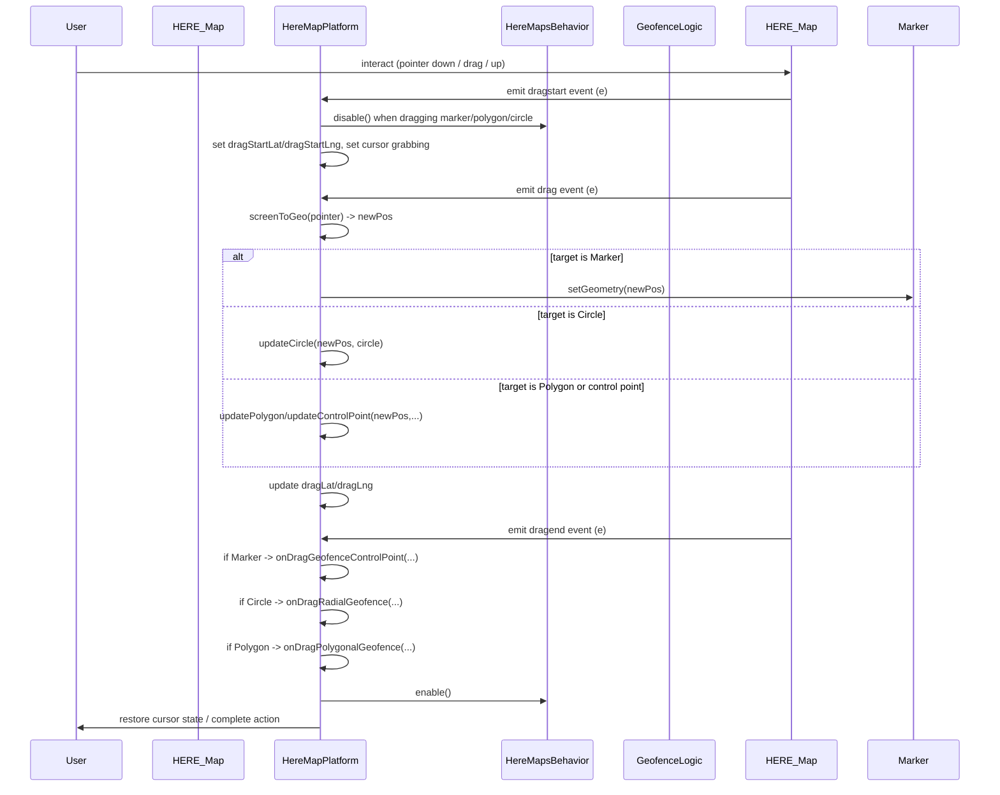

# Diagram: web/portal/src/modules/map/platforms/here/HereMapPlatform.js

> Auto-generated by Obscura crawlers

## Diagram 1

```mermaid
classDiagram
    class MapPlatformInterface {
    }
    class HereMapPlatform {
        -shapes
        -map
        -mapObjects
        -mapLayers
        -dragStartLat
        -dragLat
        -dragStartLng
        -dragLng
        +onDragStart(e)
        +onDrag(e)
        +onDragEnd(e)
        +updateCircle(newPos, circle)
        +updateControlPoint(newPos, point)
        +initMap(defaultCenter)
        +initHeatMap(coords)
        +createRasterTileLayer(style)
        +createAndAddMapMarker(...)
        +createAndAddMapPolyline(...)
        +drawGeofence(location, geofenceGroup, geofenceMapId, lad)
        +clearMap(...)
        +setMapCenter(position)
        +zoomSingleLocation(location)
    }
    class HereMapsShapes {
    }
    class GeofenceType {
    }
    MapPlatformInterface <|-- HereMapPlatform
    HereMapPlatform --> HereMapsShapes : uses
    HereMapPlatform ..> GeofenceType : util functions (getType, getBoundingBox, getCenter, isFenceValid)
```

### SVG

<svg id="container" width="551.609375" xmlns="http://www.w3.org/2000/svg" class="classDiagram" height="980" viewBox="0 0 551.609375 980" role="graphics-document document" aria-roledescription="class"><g><defs><marker id="container_class-aggregationStart" class="marker aggregation class" refX="18" refY="7" markerWidth="190" markerHeight="240" orient="auto"><path d="M 18,7 L9,13 L1,7 L9,1 Z"></path></marker></defs><defs><marker id="container_class-aggregationEnd" class="marker aggregation class" refX="1" refY="7" markerWidth="20" markerHeight="28" orient="auto"><path d="M 18,7 L9,13 L1,7 L9,1 Z"></path></marker></defs><defs><marker id="container_class-extensionStart" class="marker extension class" refX="18" refY="7" markerWidth="190" markerHeight="240" orient="auto"><path d="M 1,7 L18,13 V 1 Z"></path></marker></defs><defs><marker id="container_class-extensionEnd" class="marker extension class" refX="1" refY="7" markerWidth="20" markerHeight="28" orient="auto"><path d="M 1,1 V 13 L18,7 Z"></path></marker></defs><defs><marker id="container_class-compositionStart" class="marker composition class" refX="18" refY="7" markerWidth="190" markerHeight="240" orient="auto"><path d="M 18,7 L9,13 L1,7 L9,1 Z"></path></marker></defs><defs><marker id="container_class-compositionEnd" class="marker composition class" refX="1" refY="7" markerWidth="20" markerHeight="28" orient="auto"><path d="M 18,7 L9,13 L1,7 L9,1 Z"></path></marker></defs><defs><marker id="container_class-dependencyStart" class="marker dependency class" refX="6" refY="7" markerWidth="190" markerHeight="240" orient="auto"><path d="M 5,7 L9,13 L1,7 L9,1 Z"></path></marker></defs><defs><marker id="container_class-dependencyEnd" class="marker dependency class" refX="13" refY="7" markerWidth="20" markerHeight="28" orient="auto"><path d="M 18,7 L9,13 L14,7 L9,1 Z"></path></marker></defs><defs><marker id="container_class-lollipopStart" class="marker lollipop class" refX="13" refY="7" markerWidth="190" markerHeight="240" orient="auto"><circle stroke="black" fill="transparent" cx="7" cy="7" r="6"></circle></marker></defs><defs><marker id="container_class-lollipopEnd" class="marker lollipop class" refX="1" refY="7" markerWidth="190" markerHeight="240" orient="auto"><circle stroke="black" fill="transparent" cx="7" cy="7" r="6"></circle></marker></defs><g class="root"><g class="clusters"></g><g class="edgePaths"><path d="M275.805,109.25L275.805,110.542C275.805,111.833,275.805,114.417,275.805,119.875C275.805,125.333,275.805,133.667,275.805,137.833L275.805,142" id="id_MapPlatformInterface_HereMapPlatform_1" class="edge-thickness-normal edge-pattern-solid relation" style=";;;" data-edge="true" data-et="edge" data-id="id_MapPlatformInterface_HereMapPlatform_1" data-points="W3sieCI6Mjc1LjgwNDY4NzUsInkiOjkyfSx7IngiOjI3NS44MDQ2ODc1LCJ5IjoxMTd9LHsieCI6Mjc1LjgwNDY4NzUsInkiOjE0Mn1d" marker-start="url(#container_class-extensionStart)"></path><path d="M196.945,766L194.376,776.167C191.806,786.333,186.667,806.667,184.097,826C181.527,845.333,181.527,863.667,181.527,872.833L181.527,882" id="id_HereMapPlatform_HereMapsShapes_2" class="edge-thickness-normal edge-pattern-solid relation" style=";;;" data-edge="true" data-et="edge" data-id="id_HereMapPlatform_HereMapsShapes_2" data-points="W3sieCI6MTk2Ljk0NTM1NDM5MDA4MDQsInkiOjc2Nn0seyJ4IjoxODEuNTI3MzQzNzUsInkiOjgyN30seyJ4IjoxODEuNTI3MzQzNzUsInkiOjg4OH1d" marker-end="url(#container_class-dependencyEnd)"></path><path d="M354.664,766L357.234,776.167C359.803,786.333,364.943,806.667,367.512,826C370.082,845.333,370.082,863.667,370.082,872.833L370.082,882" id="id_HereMapPlatform_GeofenceType_3" class="edge-thickness-normal edge-pattern-dashed relation" style=";;;" data-edge="true" data-et="edge" data-id="id_HereMapPlatform_GeofenceType_3" data-points="W3sieCI6MzU0LjY2NDAyMDYwOTkxOTYsInkiOjc2Nn0seyJ4IjozNzAuMDgyMDMxMjUsInkiOjgyN30seyJ4IjozNzAuMDgyMDMxMjUsInkiOjg4OH1d" marker-end="url(#container_class-dependencyEnd)"></path></g><g class="edgeLabels"><g class="edgeLabel"><g class="label" data-id="id_MapPlatformInterface_HereMapPlatform_1" transform="translate(0, 0)"><foreignObject width="0" height="0">

</foreignObject></g></g><g class="edgeLabel" transform="translate(181.52734375, 827)"><g class="label" data-id="id_HereMapPlatform_HereMapsShapes_2" transform="translate(-16.4921875, -12)"><foreignObject width="32.984375" height="24">

uses

</foreignObject></g></g><g class="edgeLabel" transform="translate(370.08203125, 827)"><g class="label" data-id="id_HereMapPlatform_GeofenceType_3" transform="translate(-100, -36)"><foreignObject width="200" height="72">

util functions (getType, getBoundingBox, getCenter, isFenceValid)

</foreignObject></g></g></g><g class="nodes"><g class="node default" id="classId-MapPlatformInterface-0" transform="translate(275.8046875, 50)"><g class="basic label-container"><path d="M-92.046875 -42 L92.046875 -42 L92.046875 42 L-92.046875 42" stroke="none" stroke-width="0" fill="#ECECFF" style=""></path><path d="M-92.046875 -42 C-34.67275320455598 -42, 22.701368590888038 -42, 92.046875 -42 M-92.046875 -42 C-18.775560541393645 -42, 54.49575391721271 -42, 92.046875 -42 M92.046875 -42 C92.046875 -17.190750510992984, 92.046875 7.618498978014031, 92.046875 42 M92.046875 -42 C92.046875 -17.351821337544113, 92.046875 7.296357324911774, 92.046875 42 M92.046875 42 C26.530350437975287 42, -38.98617412404943 42, -92.046875 42 M92.046875 42 C42.55629045245383 42, -6.934294095092341 42, -92.046875 42 M-92.046875 42 C-92.046875 20.417317368265127, -92.046875 -1.1653652634697451, -92.046875 -42 M-92.046875 42 C-92.046875 21.059728554701366, -92.046875 0.11945710940273102, -92.046875 -42" stroke="#9370DB" stroke-width="1.3" fill="none" stroke-dasharray="0 0" style=""></path></g><g class="annotation-group text" transform="translate(0, -18)"></g><g class="label-group text" transform="translate(-80.046875, -18)"><g class="label" style="font-weight: bolder" transform="translate(0,-12)"><foreignObject width="160.09375" height="24">

MapPlatformInterface

</foreignObject></g></g><g class="members-group text" transform="translate(-80.046875, 30)"></g><g class="methods-group text" transform="translate(-80.046875, 60)"></g><g class="divider" style=""><path d="M-92.046875 6 C-53.55359150513242 6, -15.060308010264833 6, 92.046875 6 M-92.046875 6 C-46.699709168252724 6, -1.3525433365054482 6, 92.046875 6" stroke="#9370DB" stroke-width="1.3" fill="none" stroke-dasharray="0 0" style=""></path></g><g class="divider" style=""><path d="M-92.046875 24 C-20.35343138243138 24, 51.34001223513724 24, 92.046875 24 M-92.046875 24 C-32.851594370199365 24, 26.34368625960127 24, 92.046875 24" stroke="#9370DB" stroke-width="1.3" fill="none" stroke-dasharray="0 0" style=""></path></g></g><g class="node default" id="classId-HereMapPlatform-1" transform="translate(275.8046875, 454)"><g class="basic label-container"><path d="M-267.8046875 -312 L267.8046875 -312 L267.8046875 312 L-267.8046875 312" stroke="none" stroke-width="0" fill="#ECECFF" style=""></path><path d="M-267.8046875 -312 C-139.6746132764473 -312, -11.544539052894606 -312, 267.8046875 -312 M-267.8046875 -312 C-101.46710411193351 -312, 64.87047927613298 -312, 267.8046875 -312 M267.8046875 -312 C267.8046875 -140.70110318804007, 267.8046875 30.59779362391987, 267.8046875 312 M267.8046875 -312 C267.8046875 -96.18483797449684, 267.8046875 119.63032405100631, 267.8046875 312 M267.8046875 312 C132.91782208613745 312, -1.9690433277251032 312, -267.8046875 312 M267.8046875 312 C141.3675356718476 312, 14.93038384369521 312, -267.8046875 312 M-267.8046875 312 C-267.8046875 185.6400035778541, -267.8046875 59.280007155708205, -267.8046875 -312 M-267.8046875 312 C-267.8046875 124.23612221770807, -267.8046875 -63.527755564583856, -267.8046875 -312" stroke="#9370DB" stroke-width="1.3" fill="none" stroke-dasharray="0 0" style=""></path></g><g class="annotation-group text" transform="translate(0, -288)"></g><g class="label-group text" transform="translate(-64.515625, -288)"><g class="label" style="font-weight: bolder" transform="translate(0,-12)"><foreignObject width="129.03125" height="24">

HereMapPlatform

</foreignObject></g></g><g class="members-group text" transform="translate(-255.8046875, -240)"><g class="label" style="" transform="translate(0,-12)"><foreignObject width="57.703125" height="24">

-shapes

</foreignObject></g><g class="label" style="" transform="translate(0,12)"><foreignObject width="38.375" height="24">

-map

</foreignObject></g><g class="label" style="" transform="translate(0,36)"><foreignObject width="93.046875" height="24">

-mapObjects

</foreignObject></g><g class="label" style="" transform="translate(0,60)"><foreignObject width="84.578125" height="24">

-mapLayers

</foreignObject></g><g class="label" style="" transform="translate(0,84)"><foreignObject width="95.828125" height="24">

-dragStartLat

</foreignObject></g><g class="label" style="" transform="translate(0,108)"><foreignObject width="60.796875" height="24">

-dragLat

</foreignObject></g><g class="label" style="" transform="translate(0,132)"><foreignObject width="99.046875" height="24">

-dragStartLng

</foreignObject></g><g class="label" style="" transform="translate(0,156)"><foreignObject width="64.015625" height="24">

-dragLng

</foreignObject></g></g><g class="methods-group text" transform="translate(-255.8046875, -24)"><g class="label" style="" transform="translate(0,-12)"><foreignObject width="113.625" height="24">

+onDragStart(e)

</foreignObject></g><g class="label" style="" transform="translate(0,12)"><foreignObject width="78.578125" height="24">

+onDrag(e)

</foreignObject></g><g class="label" style="" transform="translate(0,36)"><foreignObject width="105.921875" height="24">

+onDragEnd(e)

</foreignObject></g><g class="label" style="" transform="translate(0,60)"><foreignObject width="211.953125" height="24">

+updateCircle(newPos, circle)

</foreignObject></g><g class="label" style="" transform="translate(0,84)"><foreignObject width="262.1875" height="24">

+updateControlPoint(newPos, point)

</foreignObject></g><g class="label" style="" transform="translate(0,108)"><foreignObject width="172.140625" height="24">

+initMap(defaultCenter)

</foreignObject></g><g class="label" style="" transform="translate(0,132)"><foreignObject width="155.859375" height="24">

+initHeatMap(coords)

</foreignObject></g><g class="label" style="" transform="translate(0,156)"><foreignObject width="208.640625" height="24">

+createRasterTileLayer(style)

</foreignObject></g><g class="label" style="" transform="translate(0,180)"><foreignObject width="212.09375" height="24">

+createAndAddMapMarker(...)

</foreignObject></g><g class="label" style="" transform="translate(0,204)"><foreignObject width="219.671875" height="24">

+createAndAddMapPolyline(...)

</foreignObject></g><g class="label" style="" transform="translate(0,228)"><foreignObject width="447.09375" height="24">

+drawGeofence(location, geofenceGroup, geofenceMapId, lad)

</foreignObject></g><g class="label" style="" transform="translate(0,252)"><foreignObject width="96.234375" height="24">

+clearMap(...)

</foreignObject></g><g class="label" style="" transform="translate(0,276)"><foreignObject width="177.984375" height="24">

+setMapCenter(position)

</foreignObject></g><g class="label" style="" transform="translate(0,300)"><foreignObject width="222.6875" height="24">

+zoomSingleLocation(location)

</foreignObject></g></g><g class="divider" style=""><path d="M-267.8046875 -264 C-109.0583840698587 -264, 49.68791936028259 -264, 267.8046875 -264 M-267.8046875 -264 C-73.18993009956031 -264, 121.42482730087937 -264, 267.8046875 -264" stroke="#9370DB" stroke-width="1.3" fill="none" stroke-dasharray="0 0" style=""></path></g><g class="divider" style=""><path d="M-267.8046875 -48 C-133.69606193346146 -48, 0.41256363307707034 -48, 267.8046875 -48 M-267.8046875 -48 C-142.96893794510208 -48, -18.133188390204197 -48, 267.8046875 -48" stroke="#9370DB" stroke-width="1.3" fill="none" stroke-dasharray="0 0" style=""></path></g></g><g class="node default" id="classId-HereMapsShapes-2" transform="translate(181.52734375, 930)"><g class="basic label-container"><path d="M-75.078125 -42 L75.078125 -42 L75.078125 42 L-75.078125 42" stroke="none" stroke-width="0" fill="#ECECFF" style=""></path><path d="M-75.078125 -42 C-32.42270834686403 -42, 10.232708306271945 -42, 75.078125 -42 M-75.078125 -42 C-40.79650605262589 -42, -6.514887105251773 -42, 75.078125 -42 M75.078125 -42 C75.078125 -12.346242016695111, 75.078125 17.307515966609778, 75.078125 42 M75.078125 -42 C75.078125 -20.991277492577034, 75.078125 0.01744501484593286, 75.078125 42 M75.078125 42 C21.209578068892732 42, -32.658968862214536 42, -75.078125 42 M75.078125 42 C29.334332064702693 42, -16.409460870594614 42, -75.078125 42 M-75.078125 42 C-75.078125 11.653673117819576, -75.078125 -18.69265376436085, -75.078125 -42 M-75.078125 42 C-75.078125 20.658286133692997, -75.078125 -0.6834277326140068, -75.078125 -42" stroke="#9370DB" stroke-width="1.3" fill="none" stroke-dasharray="0 0" style=""></path></g><g class="annotation-group text" transform="translate(0, -18)"></g><g class="label-group text" transform="translate(-63.078125, -18)"><g class="label" style="font-weight: bolder" transform="translate(0,-12)"><foreignObject width="126.15625" height="24">

HereMapsShapes

</foreignObject></g></g><g class="members-group text" transform="translate(-63.078125, 30)"></g><g class="methods-group text" transform="translate(-63.078125, 60)"></g><g class="divider" style=""><path d="M-75.078125 6 C-28.932088863364818 6, 17.213947273270364 6, 75.078125 6 M-75.078125 6 C-34.44471426680649 6, 6.1886964663870145 6, 75.078125 6" stroke="#9370DB" stroke-width="1.3" fill="none" stroke-dasharray="0 0" style=""></path></g><g class="divider" style=""><path d="M-75.078125 24 C-26.561007306554785 24, 21.95611038689043 24, 75.078125 24 M-75.078125 24 C-34.63188783069165 24, 5.814349338616694 24, 75.078125 24" stroke="#9370DB" stroke-width="1.3" fill="none" stroke-dasharray="0 0" style=""></path></g></g><g class="node default" id="classId-GeofenceType-3" transform="translate(370.08203125, 930)"><g class="basic label-container"><path d="M-63.4765625 -42 L63.4765625 -42 L63.4765625 42 L-63.4765625 42" stroke="none" stroke-width="0" fill="#ECECFF" style=""></path><path d="M-63.4765625 -42 C-13.467314087613367 -42, 36.541934324773266 -42, 63.4765625 -42 M-63.4765625 -42 C-21.652939358455015 -42, 20.17068378308997 -42, 63.4765625 -42 M63.4765625 -42 C63.4765625 -24.519433706586458, 63.4765625 -7.038867413172916, 63.4765625 42 M63.4765625 -42 C63.4765625 -16.24682794851936, 63.4765625 9.506344102961279, 63.4765625 42 M63.4765625 42 C18.30726407290355 42, -26.8620343541929 42, -63.4765625 42 M63.4765625 42 C32.582416305087946 42, 1.6882701101758855 42, -63.4765625 42 M-63.4765625 42 C-63.4765625 14.716229398017763, -63.4765625 -12.567541203964474, -63.4765625 -42 M-63.4765625 42 C-63.4765625 14.79307631207081, -63.4765625 -12.413847375858381, -63.4765625 -42" stroke="#9370DB" stroke-width="1.3" fill="none" stroke-dasharray="0 0" style=""></path></g><g class="annotation-group text" transform="translate(0, -18)"></g><g class="label-group text" transform="translate(-51.4765625, -18)"><g class="label" style="font-weight: bolder" transform="translate(0,-12)"><foreignObject width="102.953125" height="24">

GeofenceType

</foreignObject></g></g><g class="members-group text" transform="translate(-51.4765625, 30)"></g><g class="methods-group text" transform="translate(-51.4765625, 60)"></g><g class="divider" style=""><path d="M-63.4765625 6 C-16.831152491542852 6, 29.814257516914296 6, 63.4765625 6 M-63.4765625 6 C-17.787484067836694 6, 27.901594364326613 6, 63.4765625 6" stroke="#9370DB" stroke-width="1.3" fill="none" stroke-dasharray="0 0" style=""></path></g><g class="divider" style=""><path d="M-63.4765625 24 C-14.123630458560129 24, 35.22930158287974 24, 63.4765625 24 M-63.4765625 24 C-22.289733137555984 24, 18.89709622488803 24, 63.4765625 24" stroke="#9370DB" stroke-width="1.3" fill="none" stroke-dasharray="0 0" style=""></path></g></g></g></g></g></svg>

## Diagram 2

### SVG

<svg id="container" width="1663.5" xmlns="http://www.w3.org/2000/svg" height="1354" viewBox="-50 -10 1663.5 1354" role="graphics-document document" aria-roledescription="sequence"><g><rect x="1413.5" y="1268" fill="#eaeaea" stroke="#666" width="150" height="65" name="Marker" rx="3" ry="3" class="actor actor-bottom"></rect><text x="1488.5" y="1300.5" dominant-baseline="central" alignment-baseline="central" class="actor actor-box" style="text-anchor: middle; font-size: 16px; font-weight: 400;"><tspan x="1488.5" dy="0">Marker</tspan></text></g><g><rect x="1213.5" y="1268" fill="#eaeaea" stroke="#666" width="150" height="65" name="HERE_Map" rx="3" ry="3" class="actor actor-bottom"></rect><text x="1288.5" y="1300.5" dominant-baseline="central" alignment-baseline="central" class="actor actor-box" style="text-anchor: middle; font-size: 16px; font-weight: 400;"><tspan x="1288.5" dy="0">HERE_Map</tspan></text></g><g><rect x="1013.5" y="1268" fill="#eaeaea" stroke="#666" width="150" height="65" name="Geofence" rx="3" ry="3" class="actor actor-bottom"></rect><text x="1088.5" y="1300.5" dominant-baseline="central" alignment-baseline="central" class="actor actor-box" style="text-anchor: middle; font-size: 16px; font-weight: 400;"><tspan x="1088.5" dy="0">GeofenceLogic</tspan></text></g><g><rect x="806.5" y="1268" fill="#eaeaea" stroke="#666" width="157" height="65" name="Behavior" rx="3" ry="3" class="actor actor-bottom"></rect><text x="885" y="1300.5" dominant-baseline="central" alignment-baseline="central" class="actor actor-box" style="text-anchor: middle; font-size: 16px; font-weight: 400;"><tspan x="885" dy="0">HereMapsBehavior</tspan></text></g><g><rect x="400" y="1268" fill="#eaeaea" stroke="#666" width="150" height="65" name="Platform" rx="3" ry="3" class="actor actor-bottom"></rect><text x="475" y="1300.5" dominant-baseline="central" alignment-baseline="central" class="actor actor-box" style="text-anchor: middle; font-size: 16px; font-weight: 400;"><tspan x="475" dy="0">HereMapPlatform</tspan></text></g><g><rect x="200" y="1268" fill="#eaeaea" stroke="#666" width="150" height="65" name="Map" rx="3" ry="3" class="actor actor-bottom"></rect><text x="275" y="1300.5" dominant-baseline="central" alignment-baseline="central" class="actor actor-box" style="text-anchor: middle; font-size: 16px; font-weight: 400;"><tspan x="275" dy="0">HERE_Map</tspan></text></g><g><rect x="0" y="1268" fill="#eaeaea" stroke="#666" width="150" height="65" name="User" rx="3" ry="3" class="actor actor-bottom"></rect><text x="75" y="1300.5" dominant-baseline="central" alignment-baseline="central" class="actor actor-box" style="text-anchor: middle; font-size: 16px; font-weight: 400;"><tspan x="75" dy="0">User</tspan></text></g><g><line id="actor6" x1="1488.5" y1="65" x2="1488.5" y2="1268" class="actor-line 200" stroke-width="0.5px" stroke="#999" name="Marker"></line><g id="root-6"><rect x="1413.5" y="0" fill="#eaeaea" stroke="#666" width="150" height="65" name="Marker" rx="3" ry="3" class="actor actor-top"></rect><text x="1488.5" y="32.5" dominant-baseline="central" alignment-baseline="central" class="actor actor-box" style="text-anchor: middle; font-size: 16px; font-weight: 400;"><tspan x="1488.5" dy="0">Marker</tspan></text></g></g><g><line id="actor5" x1="1288.5" y1="65" x2="1288.5" y2="1268" class="actor-line 200" stroke-width="0.5px" stroke="#999" name="HERE_Map"></line><g id="root-5"><rect x="1213.5" y="0" fill="#eaeaea" stroke="#666" width="150" height="65" name="HERE_Map" rx="3" ry="3" class="actor actor-top"></rect><text x="1288.5" y="32.5" dominant-baseline="central" alignment-baseline="central" class="actor actor-box" style="text-anchor: middle; font-size: 16px; font-weight: 400;"><tspan x="1288.5" dy="0">HERE_Map</tspan></text></g></g><g><line id="actor4" x1="1088.5" y1="65" x2="1088.5" y2="1268" class="actor-line 200" stroke-width="0.5px" stroke="#999" name="Geofence"></line><g id="root-4"><rect x="1013.5" y="0" fill="#eaeaea" stroke="#666" width="150" height="65" name="Geofence" rx="3" ry="3" class="actor actor-top"></rect><text x="1088.5" y="32.5" dominant-baseline="central" alignment-baseline="central" class="actor actor-box" style="text-anchor: middle; font-size: 16px; font-weight: 400;"><tspan x="1088.5" dy="0">GeofenceLogic</tspan></text></g></g><g><line id="actor3" x1="885" y1="65" x2="885" y2="1268" class="actor-line 200" stroke-width="0.5px" stroke="#999" name="Behavior"></line><g id="root-3"><rect x="806.5" y="0" fill="#eaeaea" stroke="#666" width="157" height="65" name="Behavior" rx="3" ry="3" class="actor actor-top"></rect><text x="885" y="32.5" dominant-baseline="central" alignment-baseline="central" class="actor actor-box" style="text-anchor: middle; font-size: 16px; font-weight: 400;"><tspan x="885" dy="0">HereMapsBehavior</tspan></text></g></g><g><line id="actor2" x1="475" y1="65" x2="475" y2="1268" class="actor-line 200" stroke-width="0.5px" stroke="#999" name="Platform"></line><g id="root-2"><rect x="400" y="0" fill="#eaeaea" stroke="#666" width="150" height="65" name="Platform" rx="3" ry="3" class="actor actor-top"></rect><text x="475" y="32.5" dominant-baseline="central" alignment-baseline="central" class="actor actor-box" style="text-anchor: middle; font-size: 16px; font-weight: 400;"><tspan x="475" dy="0">HereMapPlatform</tspan></text></g></g><g><line id="actor1" x1="275" y1="65" x2="275" y2="1268" class="actor-line 200" stroke-width="0.5px" stroke="#999" name="Map"></line><g id="root-1"><rect x="200" y="0" fill="#eaeaea" stroke="#666" width="150" height="65" name="Map" rx="3" ry="3" class="actor actor-top"></rect><text x="275" y="32.5" dominant-baseline="central" alignment-baseline="central" class="actor actor-box" style="text-anchor: middle; font-size: 16px; font-weight: 400;"><tspan x="275" dy="0">HERE_Map</tspan></text></g></g><g><line id="actor0" x1="75" y1="65" x2="75" y2="1268" class="actor-line 200" stroke-width="0.5px" stroke="#999" name="User"></line><g id="root-0"><rect x="0" y="0" fill="#eaeaea" stroke="#666" width="150" height="65" name="User" rx="3" ry="3" class="actor actor-top"></rect><text x="75" y="32.5" dominant-baseline="central" alignment-baseline="central" class="actor actor-box" style="text-anchor: middle; font-size: 16px; font-weight: 400;"><tspan x="75" dy="0">User</tspan></text></g></g><g></g><defs><symbol id="computer" width="24" height="24"><path transform="scale(.5)" d="M2 2v13h20v-13h-20zm18 11h-16v-9h16v9zm-10.228 6l.466-1h3.524l.467 1h-4.457zm14.228 3h-24l2-6h2.104l-1.33 4h18.45l-1.297-4h2.073l2 6zm-5-10h-14v-7h14v7z"></path></symbol></defs><defs><symbol id="database" fill-rule="evenodd" clip-rule="evenodd"><path transform="scale(.5)" d="M12.258.001l.256.004.255.005.253.008.251.01.249.012.247.015.246.016.242.019.241.02.239.023.236.024.233.027.231.028.229.031.225.032.223.034.22.036.217.038.214.04.211.041.208.043.205.045.201.046.198.048.194.05.191.051.187.053.183.054.18.056.175.057.172.059.168.06.163.061.16.063.155.064.15.066.074.033.073.033.071.034.07.034.069.035.068.035.067.035.066.035.064.036.064.036.062.036.06.036.06.037.058.037.058.037.055.038.055.038.053.038.052.038.051.039.05.039.048.039.047.039.045.04.044.04.043.04.041.04.04.041.039.041.037.041.036.041.034.041.033.042.032.042.03.042.029.042.027.042.026.043.024.043.023.043.021.043.02.043.018.044.017.043.015.044.013.044.012.044.011.045.009.044.007.045.006.045.004.045.002.045.001.045v17l-.001.045-.002.045-.004.045-.006.045-.007.045-.009.044-.011.045-.012.044-.013.044-.015.044-.017.043-.018.044-.02.043-.021.043-.023.043-.024.043-.026.043-.027.042-.029.042-.03.042-.032.042-.033.042-.034.041-.036.041-.037.041-.039.041-.04.041-.041.04-.043.04-.044.04-.045.04-.047.039-.048.039-.05.039-.051.039-.052.038-.053.038-.055.038-.055.038-.058.037-.058.037-.06.037-.06.036-.062.036-.064.036-.064.036-.066.035-.067.035-.068.035-.069.035-.07.034-.071.034-.073.033-.074.033-.15.066-.155.064-.16.063-.163.061-.168.06-.172.059-.175.057-.18.056-.183.054-.187.053-.191.051-.194.05-.198.048-.201.046-.205.045-.208.043-.211.041-.214.04-.217.038-.22.036-.223.034-.225.032-.229.031-.231.028-.233.027-.236.024-.239.023-.241.02-.242.019-.246.016-.247.015-.249.012-.251.01-.253.008-.255.005-.256.004-.258.001-.258-.001-.256-.004-.255-.005-.253-.008-.251-.01-.249-.012-.247-.015-.245-.016-.243-.019-.241-.02-.238-.023-.236-.024-.234-.027-.231-.028-.228-.031-.226-.032-.223-.034-.22-.036-.217-.038-.214-.04-.211-.041-.208-.043-.204-.045-.201-.046-.198-.048-.195-.05-.19-.051-.187-.053-.184-.054-.179-.056-.176-.057-.172-.059-.167-.06-.164-.061-.159-.063-.155-.064-.151-.066-.074-.033-.072-.033-.072-.034-.07-.034-.069-.035-.068-.035-.067-.035-.066-.035-.064-.036-.063-.036-.062-.036-.061-.036-.06-.037-.058-.037-.057-.037-.056-.038-.055-.038-.053-.038-.052-.038-.051-.039-.049-.039-.049-.039-.046-.039-.046-.04-.044-.04-.043-.04-.041-.04-.04-.041-.039-.041-.037-.041-.036-.041-.034-.041-.033-.042-.032-.042-.03-.042-.029-.042-.027-.042-.026-.043-.024-.043-.023-.043-.021-.043-.02-.043-.018-.044-.017-.043-.015-.044-.013-.044-.012-.044-.011-.045-.009-.044-.007-.045-.006-.045-.004-.045-.002-.045-.001-.045v-17l.001-.045.002-.045.004-.045.006-.045.007-.045.009-.044.011-.045.012-.044.013-.044.015-.044.017-.043.018-.044.02-.043.021-.043.023-.043.024-.043.026-.043.027-.042.029-.042.03-.042.032-.042.033-.042.034-.041.036-.041.037-.041.039-.041.04-.041.041-.04.043-.04.044-.04.046-.04.046-.039.049-.039.049-.039.051-.039.052-.038.053-.038.055-.038.056-.038.057-.037.058-.037.06-.037.061-.036.062-.036.063-.036.064-.036.066-.035.067-.035.068-.035.069-.035.07-.034.072-.034.072-.033.074-.033.151-.066.155-.064.159-.063.164-.061.167-.06.172-.059.176-.057.179-.056.184-.054.187-.053.19-.051.195-.05.198-.048.201-.046.204-.045.208-.043.211-.041.214-.04.217-.038.22-.036.223-.034.226-.032.228-.031.231-.028.234-.027.236-.024.238-.023.241-.02.243-.019.245-.016.247-.015.249-.012.251-.01.253-.008.255-.005.256-.004.258-.001.258.001zm-9.258 20.499v.01l.001.021.003.021.004.022.005.021.006.022.007.022.009.023.01.022.011.023.012.023.013.023.015.023.016.024.017.023.018.024.019.024.021.024.022.025.023.024.024.025.052.049.056.05.061.051.066.051.07.051.075.051.079.052.084.052.088.052.092.052.097.052.102.051.105.052.11.052.114.051.119.051.123.051.127.05.131.05.135.05.139.048.144.049.147.047.152.047.155.047.16.045.163.045.167.043.171.043.176.041.178.041.183.039.187.039.19.037.194.035.197.035.202.033.204.031.209.03.212.029.216.027.219.025.222.024.226.021.23.02.233.018.236.016.24.015.243.012.246.01.249.008.253.005.256.004.259.001.26-.001.257-.004.254-.005.25-.008.247-.011.244-.012.241-.014.237-.016.233-.018.231-.021.226-.021.224-.024.22-.026.216-.027.212-.028.21-.031.205-.031.202-.034.198-.034.194-.036.191-.037.187-.039.183-.04.179-.04.175-.042.172-.043.168-.044.163-.045.16-.046.155-.046.152-.047.148-.048.143-.049.139-.049.136-.05.131-.05.126-.05.123-.051.118-.052.114-.051.11-.052.106-.052.101-.052.096-.052.092-.052.088-.053.083-.051.079-.052.074-.052.07-.051.065-.051.06-.051.056-.05.051-.05.023-.024.023-.025.021-.024.02-.024.019-.024.018-.024.017-.024.015-.023.014-.024.013-.023.012-.023.01-.023.01-.022.008-.022.006-.022.006-.022.004-.022.004-.021.001-.021.001-.021v-4.127l-.077.055-.08.053-.083.054-.085.053-.087.052-.09.052-.093.051-.095.05-.097.05-.1.049-.102.049-.105.048-.106.047-.109.047-.111.046-.114.045-.115.045-.118.044-.12.043-.122.042-.124.042-.126.041-.128.04-.13.04-.132.038-.134.038-.135.037-.138.037-.139.035-.142.035-.143.034-.144.033-.147.032-.148.031-.15.03-.151.03-.153.029-.154.027-.156.027-.158.026-.159.025-.161.024-.162.023-.163.022-.165.021-.166.02-.167.019-.169.018-.169.017-.171.016-.173.015-.173.014-.175.013-.175.012-.177.011-.178.01-.179.008-.179.008-.181.006-.182.005-.182.004-.184.003-.184.002h-.37l-.184-.002-.184-.003-.182-.004-.182-.005-.181-.006-.179-.008-.179-.008-.178-.01-.176-.011-.176-.012-.175-.013-.173-.014-.172-.015-.171-.016-.17-.017-.169-.018-.167-.019-.166-.02-.165-.021-.163-.022-.162-.023-.161-.024-.159-.025-.157-.026-.156-.027-.155-.027-.153-.029-.151-.03-.15-.03-.148-.031-.146-.032-.145-.033-.143-.034-.141-.035-.14-.035-.137-.037-.136-.037-.134-.038-.132-.038-.13-.04-.128-.04-.126-.041-.124-.042-.122-.042-.12-.044-.117-.043-.116-.045-.113-.045-.112-.046-.109-.047-.106-.047-.105-.048-.102-.049-.1-.049-.097-.05-.095-.05-.093-.052-.09-.051-.087-.052-.085-.053-.083-.054-.08-.054-.077-.054v4.127zm0-5.654v.011l.001.021.003.021.004.021.005.022.006.022.007.022.009.022.01.022.011.023.012.023.013.023.015.024.016.023.017.024.018.024.019.024.021.024.022.024.023.025.024.024.052.05.056.05.061.05.066.051.07.051.075.052.079.051.084.052.088.052.092.052.097.052.102.052.105.052.11.051.114.051.119.052.123.05.127.051.131.05.135.049.139.049.144.048.147.048.152.047.155.046.16.045.163.045.167.044.171.042.176.042.178.04.183.04.187.038.19.037.194.036.197.034.202.033.204.032.209.03.212.028.216.027.219.025.222.024.226.022.23.02.233.018.236.016.24.014.243.012.246.01.249.008.253.006.256.003.259.001.26-.001.257-.003.254-.006.25-.008.247-.01.244-.012.241-.015.237-.016.233-.018.231-.02.226-.022.224-.024.22-.025.216-.027.212-.029.21-.03.205-.032.202-.033.198-.035.194-.036.191-.037.187-.039.183-.039.179-.041.175-.042.172-.043.168-.044.163-.045.16-.045.155-.047.152-.047.148-.048.143-.048.139-.05.136-.049.131-.05.126-.051.123-.051.118-.051.114-.052.11-.052.106-.052.101-.052.096-.052.092-.052.088-.052.083-.052.079-.052.074-.051.07-.052.065-.051.06-.05.056-.051.051-.049.023-.025.023-.024.021-.025.02-.024.019-.024.018-.024.017-.024.015-.023.014-.023.013-.024.012-.022.01-.023.01-.023.008-.022.006-.022.006-.022.004-.021.004-.022.001-.021.001-.021v-4.139l-.077.054-.08.054-.083.054-.085.052-.087.053-.09.051-.093.051-.095.051-.097.05-.1.049-.102.049-.105.048-.106.047-.109.047-.111.046-.114.045-.115.044-.118.044-.12.044-.122.042-.124.042-.126.041-.128.04-.13.039-.132.039-.134.038-.135.037-.138.036-.139.036-.142.035-.143.033-.144.033-.147.033-.148.031-.15.03-.151.03-.153.028-.154.028-.156.027-.158.026-.159.025-.161.024-.162.023-.163.022-.165.021-.166.02-.167.019-.169.018-.169.017-.171.016-.173.015-.173.014-.175.013-.175.012-.177.011-.178.009-.179.009-.179.007-.181.007-.182.005-.182.004-.184.003-.184.002h-.37l-.184-.002-.184-.003-.182-.004-.182-.005-.181-.007-.179-.007-.179-.009-.178-.009-.176-.011-.176-.012-.175-.013-.173-.014-.172-.015-.171-.016-.17-.017-.169-.018-.167-.019-.166-.02-.165-.021-.163-.022-.162-.023-.161-.024-.159-.025-.157-.026-.156-.027-.155-.028-.153-.028-.151-.03-.15-.03-.148-.031-.146-.033-.145-.033-.143-.033-.141-.035-.14-.036-.137-.036-.136-.037-.134-.038-.132-.039-.13-.039-.128-.04-.126-.041-.124-.042-.122-.043-.12-.043-.117-.044-.116-.044-.113-.046-.112-.046-.109-.046-.106-.047-.105-.048-.102-.049-.1-.049-.097-.05-.095-.051-.093-.051-.09-.051-.087-.053-.085-.052-.083-.054-.08-.054-.077-.054v4.139zm0-5.666v.011l.001.02.003.022.004.021.005.022.006.021.007.022.009.023.01.022.011.023.012.023.013.023.015.023.016.024.017.024.018.023.019.024.021.025.022.024.023.024.024.025.052.05.056.05.061.05.066.051.07.051.075.052.079.051.084.052.088.052.092.052.097.052.102.052.105.051.11.052.114.051.119.051.123.051.127.05.131.05.135.05.139.049.144.048.147.048.152.047.155.046.16.045.163.045.167.043.171.043.176.042.178.04.183.04.187.038.19.037.194.036.197.034.202.033.204.032.209.03.212.028.216.027.219.025.222.024.226.021.23.02.233.018.236.017.24.014.243.012.246.01.249.008.253.006.256.003.259.001.26-.001.257-.003.254-.006.25-.008.247-.01.244-.013.241-.014.237-.016.233-.018.231-.02.226-.022.224-.024.22-.025.216-.027.212-.029.21-.03.205-.032.202-.033.198-.035.194-.036.191-.037.187-.039.183-.039.179-.041.175-.042.172-.043.168-.044.163-.045.16-.045.155-.047.152-.047.148-.048.143-.049.139-.049.136-.049.131-.051.126-.05.123-.051.118-.052.114-.051.11-.052.106-.052.101-.052.096-.052.092-.052.088-.052.083-.052.079-.052.074-.052.07-.051.065-.051.06-.051.056-.05.051-.049.023-.025.023-.025.021-.024.02-.024.019-.024.018-.024.017-.024.015-.023.014-.024.013-.023.012-.023.01-.022.01-.023.008-.022.006-.022.006-.022.004-.022.004-.021.001-.021.001-.021v-4.153l-.077.054-.08.054-.083.053-.085.053-.087.053-.09.051-.093.051-.095.051-.097.05-.1.049-.102.048-.105.048-.106.048-.109.046-.111.046-.114.046-.115.044-.118.044-.12.043-.122.043-.124.042-.126.041-.128.04-.13.039-.132.039-.134.038-.135.037-.138.036-.139.036-.142.034-.143.034-.144.033-.147.032-.148.032-.15.03-.151.03-.153.028-.154.028-.156.027-.158.026-.159.024-.161.024-.162.023-.163.023-.165.021-.166.02-.167.019-.169.018-.169.017-.171.016-.173.015-.173.014-.175.013-.175.012-.177.01-.178.01-.179.009-.179.007-.181.006-.182.006-.182.004-.184.003-.184.001-.185.001-.185-.001-.184-.001-.184-.003-.182-.004-.182-.006-.181-.006-.179-.007-.179-.009-.178-.01-.176-.01-.176-.012-.175-.013-.173-.014-.172-.015-.171-.016-.17-.017-.169-.018-.167-.019-.166-.02-.165-.021-.163-.023-.162-.023-.161-.024-.159-.024-.157-.026-.156-.027-.155-.028-.153-.028-.151-.03-.15-.03-.148-.032-.146-.032-.145-.033-.143-.034-.141-.034-.14-.036-.137-.036-.136-.037-.134-.038-.132-.039-.13-.039-.128-.041-.126-.041-.124-.041-.122-.043-.12-.043-.117-.044-.116-.044-.113-.046-.112-.046-.109-.046-.106-.048-.105-.048-.102-.048-.1-.05-.097-.049-.095-.051-.093-.051-.09-.052-.087-.052-.085-.053-.083-.053-.08-.054-.077-.054v4.153zm8.74-8.179l-.257.004-.254.005-.25.008-.247.011-.244.012-.241.014-.237.016-.233.018-.231.021-.226.022-.224.023-.22.026-.216.027-.212.028-.21.031-.205.032-.202.033-.198.034-.194.036-.191.038-.187.038-.183.04-.179.041-.175.042-.172.043-.168.043-.163.045-.16.046-.155.046-.152.048-.148.048-.143.048-.139.049-.136.05-.131.05-.126.051-.123.051-.118.051-.114.052-.11.052-.106.052-.101.052-.096.052-.092.052-.088.052-.083.052-.079.052-.074.051-.07.052-.065.051-.06.05-.056.05-.051.05-.023.025-.023.024-.021.024-.02.025-.019.024-.018.024-.017.023-.015.024-.014.023-.013.023-.012.023-.01.023-.01.022-.008.022-.006.023-.006.021-.004.022-.004.021-.001.021-.001.021.001.021.001.021.004.021.004.022.006.021.006.023.008.022.01.022.01.023.012.023.013.023.014.023.015.024.017.023.018.024.019.024.02.025.021.024.023.024.023.025.051.05.056.05.06.05.065.051.07.052.074.051.079.052.083.052.088.052.092.052.096.052.101.052.106.052.11.052.114.052.118.051.123.051.126.051.131.05.136.05.139.049.143.048.148.048.152.048.155.046.16.046.163.045.168.043.172.043.175.042.179.041.183.04.187.038.191.038.194.036.198.034.202.033.205.032.21.031.212.028.216.027.22.026.224.023.226.022.231.021.233.018.237.016.241.014.244.012.247.011.25.008.254.005.257.004.26.001.26-.001.257-.004.254-.005.25-.008.247-.011.244-.012.241-.014.237-.016.233-.018.231-.021.226-.022.224-.023.22-.026.216-.027.212-.028.21-.031.205-.032.202-.033.198-.034.194-.036.191-.038.187-.038.183-.04.179-.041.175-.042.172-.043.168-.043.163-.045.16-.046.155-.046.152-.048.148-.048.143-.048.139-.049.136-.05.131-.05.126-.051.123-.051.118-.051.114-.052.11-.052.106-.052.101-.052.096-.052.092-.052.088-.052.083-.052.079-.052.074-.051.07-.052.065-.051.06-.05.056-.05.051-.05.023-.025.023-.024.021-.024.02-.025.019-.024.018-.024.017-.023.015-.024.014-.023.013-.023.012-.023.01-.023.01-.022.008-.022.006-.023.006-.021.004-.022.004-.021.001-.021.001-.021-.001-.021-.001-.021-.004-.021-.004-.022-.006-.021-.006-.023-.008-.022-.01-.022-.01-.023-.012-.023-.013-.023-.014-.023-.015-.024-.017-.023-.018-.024-.019-.024-.02-.025-.021-.024-.023-.024-.023-.025-.051-.05-.056-.05-.06-.05-.065-.051-.07-.052-.074-.051-.079-.052-.083-.052-.088-.052-.092-.052-.096-.052-.101-.052-.106-.052-.11-.052-.114-.052-.118-.051-.123-.051-.126-.051-.131-.05-.136-.05-.139-.049-.143-.048-.148-.048-.152-.048-.155-.046-.16-.046-.163-.045-.168-.043-.172-.043-.175-.042-.179-.041-.183-.04-.187-.038-.191-.038-.194-.036-.198-.034-.202-.033-.205-.032-.21-.031-.212-.028-.216-.027-.22-.026-.224-.023-.226-.022-.231-.021-.233-.018-.237-.016-.241-.014-.244-.012-.247-.011-.25-.008-.254-.005-.257-.004-.26-.001-.26.001z"></path></symbol></defs><defs><symbol id="clock" width="24" height="24"><path transform="scale(.5)" d="M12 2c5.514 0 10 4.486 10 10s-4.486 10-10 10-10-4.486-10-10 4.486-10 10-10zm0-2c-6.627 0-12 5.373-12 12s5.373 12 12 12 12-5.373 12-12-5.373-12-12-12zm5.848 12.459c.202.038.202.333.001.372-1.907.361-6.045 1.111-6.547 1.111-.719 0-1.301-.582-1.301-1.301 0-.512.77-5.447 1.125-7.445.034-.192.312-.181.343.014l.985 6.238 5.394 1.011z"></path></symbol></defs><defs><marker id="arrowhead" refX="7.9" refY="5" markerUnits="userSpaceOnUse" markerWidth="12" markerHeight="12" orient="auto-start-reverse"><path d="M -1 0 L 10 5 L 0 10 z"></path></marker></defs><defs><marker id="crosshead" markerWidth="15" markerHeight="8" orient="auto" refX="4" refY="4.5"><path fill="none" stroke="#000000" stroke-width="1pt" d="M 1,2 L 6,7 M 6,2 L 1,7" style="stroke-dasharray: 0, 0;"></path></marker></defs><defs><marker id="filled-head" refX="15.5" refY="7" markerWidth="20" markerHeight="28" orient="auto"><path d="M 18,7 L9,13 L14,7 L9,1 Z"></path></marker></defs><defs><marker id="sequencenumber" refX="15" refY="15" markerWidth="60" markerHeight="40" orient="auto"><circle cx="15" cy="15" r="6"></circle></marker></defs><g><line x1="296.5" y1="423" x2="1499.5" y2="423" class="loopLine"></line><line x1="1499.5" y1="423" x2="1499.5" y2="792" class="loopLine"></line><line x1="296.5" y1="792" x2="1499.5" y2="792" class="loopLine"></line><line x1="296.5" y1="423" x2="296.5" y2="792" class="loopLine"></line><line x1="296.5" y1="521" x2="1499.5" y2="521" class="loopLine" style="stroke-dasharray: 3, 3;"></line><line x1="296.5" y1="644" x2="1499.5" y2="644" class="loopLine" style="stroke-dasharray: 3, 3;"></line><polygon points="296.5,423 346.5,423 346.5,436 338.1,443 296.5,443" class="labelBox"></polygon><text x="322" y="436" text-anchor="middle" dominant-baseline="middle" alignment-baseline="middle" class="labelText" style="font-size: 16px; font-weight: 400;">alt</text><text x="923" y="441" text-anchor="middle" class="loopText" style="font-size: 16px; font-weight: 400;"><tspan x="923">[target is Marker]</tspan></text><text x="898" y="539" text-anchor="middle" class="loopText" style="font-size: 16px; font-weight: 400;">[target is Circle]</text><text x="898" y="662" text-anchor="middle" class="loopText" style="font-size: 16px; font-weight: 400;">[target is Polygon or control point]</text></g><text x="680" y="80" text-anchor="middle" dominant-baseline="middle" alignment-baseline="middle" class="messageText" dy="1em" style="font-size: 16px; font-weight: 400;">interact (pointer down / drag / up)</text><line x1="76" y1="113" x2="1284.5" y2="113" class="messageLine0" stroke-width="2" stroke="none" marker-end="url(#arrowhead)" style="fill: none;"></line><text x="883" y="128" text-anchor="middle" dominant-baseline="middle" alignment-baseline="middle" class="messageText" dy="1em" style="font-size: 16px; font-weight: 400;">emit dragstart event (e)</text><line x1="1287.5" y1="161" x2="479" y2="161" class="messageLine0" stroke-width="2" stroke="none" marker-end="url(#arrowhead)" style="fill: none;"></line><text x="679" y="176" text-anchor="middle" dominant-baseline="middle" alignment-baseline="middle" class="messageText" dy="1em" style="font-size: 16px; font-weight: 400;">disable() when dragging marker/polygon/circle</text><line x1="476" y1="209" x2="881" y2="209" class="messageLine0" stroke-width="2" stroke="none" marker-end="url(#arrowhead)" style="fill: none;"></line><text x="476" y="224" text-anchor="middle" dominant-baseline="middle" alignment-baseline="middle" class="messageText" dy="1em" style="font-size: 16px; font-weight: 400;">set dragStartLat/dragStartLng, set cursor grabbing</text><path d="M 476,257 C 536,247 536,287 476,277" class="messageLine0" stroke-width="2" stroke="none" marker-end="url(#arrowhead)" style="fill: none;"></path><text x="883" y="302" text-anchor="middle" dominant-baseline="middle" alignment-baseline="middle" class="messageText" dy="1em" style="font-size: 16px; font-weight: 400;">emit drag event (e)</text><line x1="1287.5" y1="335" x2="479" y2="335" class="messageLine0" stroke-width="2" stroke="none" marker-end="url(#arrowhead)" style="fill: none;"></line><text x="476" y="350" text-anchor="middle" dominant-baseline="middle" alignment-baseline="middle" class="messageText" dy="1em" style="font-size: 16px; font-weight: 400;">screenToGeo(pointer) -&gt; newPos</text><path d="M 476,383 C 536,373 536,413 476,403" class="messageLine0" stroke-width="2" stroke="none" marker-end="url(#arrowhead)" style="fill: none;"></path><text x="980" y="473" text-anchor="middle" dominant-baseline="middle" alignment-baseline="middle" class="messageText" dy="1em" style="font-size: 16px; font-weight: 400;">setGeometry(newPos)</text><line x1="476" y1="506" x2="1484.5" y2="506" class="messageLine0" stroke-width="2" stroke="none" marker-end="url(#arrowhead)" style="fill: none;"></line><text x="476" y="566" text-anchor="middle" dominant-baseline="middle" alignment-baseline="middle" class="messageText" dy="1em" style="font-size: 16px; font-weight: 400;">updateCircle(newPos, circle)</text><path d="M 476,599 C 536,589 536,629 476,619" class="messageLine0" stroke-width="2" stroke="none" marker-end="url(#arrowhead)" style="fill: none;"></path><text x="476" y="689" text-anchor="middle" dominant-baseline="middle" alignment-baseline="middle" class="messageText" dy="1em" style="font-size: 16px; font-weight: 400;">updatePolygon/updateControlPoint(newPos,...)</text><path d="M 476,722 C 536,712 536,752 476,742" class="messageLine0" stroke-width="2" stroke="none" marker-end="url(#arrowhead)" style="fill: none;"></path><text x="476" y="807" text-anchor="middle" dominant-baseline="middle" alignment-baseline="middle" class="messageText" dy="1em" style="font-size: 16px; font-weight: 400;">update dragLat/dragLng</text><path d="M 476,840 C 536,830 536,870 476,860" class="messageLine0" stroke-width="2" stroke="none" marker-end="url(#arrowhead)" style="fill: none;"></path><text x="883" y="885" text-anchor="middle" dominant-baseline="middle" alignment-baseline="middle" class="messageText" dy="1em" style="font-size: 16px; font-weight: 400;">emit dragend event (e)</text><line x1="1287.5" y1="918" x2="479" y2="918" class="messageLine0" stroke-width="2" stroke="none" marker-end="url(#arrowhead)" style="fill: none;"></line><text x="476" y="933" text-anchor="middle" dominant-baseline="middle" alignment-baseline="middle" class="messageText" dy="1em" style="font-size: 16px; font-weight: 400;">if Marker -&gt; onDragGeofenceControlPoint(...)</text><path d="M 476,966 C 536,956 536,996 476,986" class="messageLine0" stroke-width="2" stroke="none" marker-end="url(#arrowhead)" style="fill: none;"></path><text x="476" y="1011" text-anchor="middle" dominant-baseline="middle" alignment-baseline="middle" class="messageText" dy="1em" style="font-size: 16px; font-weight: 400;">if Circle -&gt; onDragRadialGeofence(...)</text><path d="M 476,1044 C 536,1034 536,1074 476,1064" class="messageLine0" stroke-width="2" stroke="none" marker-end="url(#arrowhead)" style="fill: none;"></path><text x="476" y="1089" text-anchor="middle" dominant-baseline="middle" alignment-baseline="middle" class="messageText" dy="1em" style="font-size: 16px; font-weight: 400;">if Polygon -&gt; onDragPolygonalGeofence(...)</text><path d="M 476,1122 C 536,1112 536,1152 476,1142" class="messageLine0" stroke-width="2" stroke="none" marker-end="url(#arrowhead)" style="fill: none;"></path><text x="679" y="1167" text-anchor="middle" dominant-baseline="middle" alignment-baseline="middle" class="messageText" dy="1em" style="font-size: 16px; font-weight: 400;">enable()</text><line x1="476" y1="1200" x2="881" y2="1200" class="messageLine0" stroke-width="2" stroke="none" marker-end="url(#arrowhead)" style="fill: none;"></line><text x="277" y="1215" text-anchor="middle" dominant-baseline="middle" alignment-baseline="middle" class="messageText" dy="1em" style="font-size: 16px; font-weight: 400;">restore cursor state / complete action</text><line x1="474" y1="1248" x2="79" y2="1248" class="messageLine0" stroke-width="2" stroke="none" marker-end="url(#arrowhead)" style="fill: none;"></line></svg>
