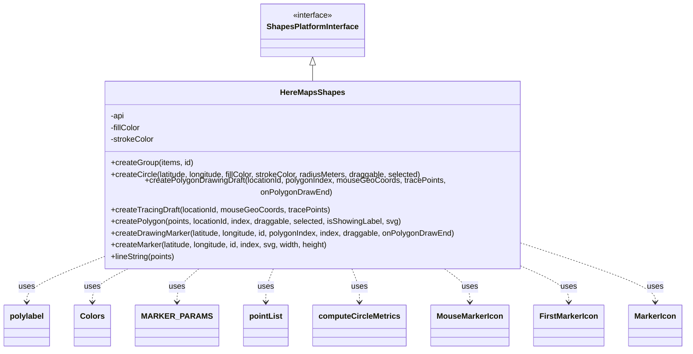

# Diagram: web/portal/src/modules/map/platforms/here/HereMapsShapes.js

> Auto-generated by Obscura crawlers

## Mermaid

### SVG

<svg id="container" width="1350.234375" xmlns="http://www.w3.org/2000/svg" class="classDiagram" height="692" viewBox="0 0 1350.234375 692" role="graphics-document document" aria-roledescription="class"><g><defs><marker id="container_class-aggregationStart" class="marker aggregation class" refX="18" refY="7" markerWidth="190" markerHeight="240" orient="auto"><path d="M 18,7 L9,13 L1,7 L9,1 Z"></path></marker></defs><defs><marker id="container_class-aggregationEnd" class="marker aggregation class" refX="1" refY="7" markerWidth="20" markerHeight="28" orient="auto"><path d="M 18,7 L9,13 L1,7 L9,1 Z"></path></marker></defs><defs><marker id="container_class-extensionStart" class="marker extension class" refX="18" refY="7" markerWidth="190" markerHeight="240" orient="auto"><path d="M 1,7 L18,13 V 1 Z"></path></marker></defs><defs><marker id="container_class-extensionEnd" class="marker extension class" refX="1" refY="7" markerWidth="20" markerHeight="28" orient="auto"><path d="M 1,1 V 13 L18,7 Z"></path></marker></defs><defs><marker id="container_class-compositionStart" class="marker composition class" refX="18" refY="7" markerWidth="190" markerHeight="240" orient="auto"><path d="M 18,7 L9,13 L1,7 L9,1 Z"></path></marker></defs><defs><marker id="container_class-compositionEnd" class="marker composition class" refX="1" refY="7" markerWidth="20" markerHeight="28" orient="auto"><path d="M 18,7 L9,13 L1,7 L9,1 Z"></path></marker></defs><defs><marker id="container_class-dependencyStart" class="marker dependency class" refX="6" refY="7" markerWidth="190" markerHeight="240" orient="auto"><path d="M 5,7 L9,13 L1,7 L9,1 Z"></path></marker></defs><defs><marker id="container_class-dependencyEnd" class="marker dependency class" refX="13" refY="7" markerWidth="20" markerHeight="28" orient="auto"><path d="M 18,7 L9,13 L14,7 L9,1 Z"></path></marker></defs><defs><marker id="container_class-lollipopStart" class="marker lollipop class" refX="13" refY="7" markerWidth="190" markerHeight="240" orient="auto"><circle stroke="black" fill="transparent" cx="7" cy="7" r="6"></circle></marker></defs><defs><marker id="container_class-lollipopEnd" class="marker lollipop class" refX="1" refY="7" markerWidth="190" markerHeight="240" orient="auto"><circle stroke="black" fill="transparent" cx="7" cy="7" r="6"></circle></marker></defs><g class="root"><g class="clusters"></g><g class="edgePaths"><path d="M609.758,133.25L609.758,134.542C609.758,135.833,609.758,138.417,609.758,143.875C609.758,149.333,609.758,157.667,609.758,161.833L609.758,166" id="id_ShapesPlatformInterface_HereMapsShapes_1" class="edge-thickness-normal edge-pattern-solid relation" style=";;;" data-edge="true" data-et="edge" data-id="id_ShapesPlatformInterface_HereMapsShapes_1" data-points="W3sieCI6NjA5Ljc1NzgxMjUsInkiOjExNn0seyJ4Ijo2MDkuNzU3ODEyNSwieSI6MTQxfSx7IngiOjYwOS43NTc4MTI1LCJ5IjoxNjZ9XQ==" marker-start="url(#container_class-extensionStart)"></path><path d="M183.234,512.593L161.725,520.994C140.216,529.396,97.198,546.198,75.689,559.766C54.18,573.333,54.18,583.667,54.18,588.833L54.18,594" id="id_HereMapsShapes_polylabel_2" class="edge-thickness-normal edge-pattern-dashed relation" style=";;;" data-edge="true" data-et="edge" data-id="id_HereMapsShapes_polylabel_2" data-points="W3sieCI6MTgzLjIzNDM3NSwieSI6NTEyLjU5MzI4NjgzNTIyMjN9LHsieCI6NTQuMTc5Njg3NSwieSI6NTYzfSx7IngiOjU0LjE3OTY4NzUsInkiOjYwMH1d" marker-end="url(#container_class-dependencyEnd)"></path><path d="M257.806,526L245.749,532.167C233.691,538.333,209.576,550.667,197.519,562C185.461,573.333,185.461,583.667,185.461,588.833L185.461,594" id="id_HereMapsShapes_Colors_3" class="edge-thickness-normal edge-pattern-dashed relation" style=";;;" data-edge="true" data-et="edge" data-id="id_HereMapsShapes_Colors_3" data-points="W3sieCI6MjU3LjgwNjQ4NzYxNTIwNzM1LCJ5Ijo1MjZ9LHsieCI6MTg1LjQ2MDkzNzUsInkiOjU2M30seyJ4IjoxODUuNDYwOTM3NSwieSI6NjAwfV0=" marker-end="url(#container_class-dependencyEnd)"></path><path d="M391.238,526L383.752,532.167C376.266,538.333,361.293,550.667,353.807,562C346.32,573.333,346.32,583.667,346.32,588.833L346.32,594" id="id_HereMapsShapes_MARKER_PARAMS_4" class="edge-thickness-normal edge-pattern-dashed relation" style=";;;" data-edge="true" data-et="edge" data-id="id_HereMapsShapes_MARKER_PARAMS_4" data-points="W3sieCI6MzkxLjIzODIyNzI0NjU0MzgsInkiOjUyNn0seyJ4IjozNDYuMzIwMzEyNSwieSI6NTYzfSx7IngiOjM0Ni4zMjAzMTI1LCJ5Ijo2MDB9XQ==" marker-end="url(#container_class-dependencyEnd)"></path><path d="M532.654,526L530.012,532.167C527.371,538.333,522.088,550.667,519.446,562C516.805,573.333,516.805,583.667,516.805,588.833L516.805,594" id="id_HereMapsShapes_pointList_5" class="edge-thickness-normal edge-pattern-dashed relation" style=";;;" data-edge="true" data-et="edge" data-id="id_HereMapsShapes_pointList_5" data-points="W3sieCI6NTMyLjY1MzgzNzg0NTYyMjEsInkiOjUyNn0seyJ4Ijo1MTYuODA0Njg3NSwieSI6NTYzfSx7IngiOjUxNi44MDQ2ODc1LCJ5Ijo2MDB9XQ==" marker-end="url(#container_class-dependencyEnd)"></path><path d="M686.862,526L689.503,532.167C692.145,538.333,697.428,550.667,700.069,562C702.711,573.333,702.711,583.667,702.711,588.833L702.711,594" id="id_HereMapsShapes_computeCircleMetrics_6" class="edge-thickness-normal edge-pattern-dashed relation" style=";;;" data-edge="true" data-et="edge" data-id="id_HereMapsShapes_computeCircleMetrics_6" data-points="W3sieCI6Njg2Ljg2MTc4NzE1NDM3NzksInkiOjUyNn0seyJ4Ijo3MDIuNzEwOTM3NSwieSI6NTYzfSx7IngiOjcwMi43MTA5Mzc1LCJ5Ijo2MDB9XQ==" marker-end="url(#container_class-dependencyEnd)"></path><path d="M867.788,526L876.628,532.167C885.468,538.333,903.148,550.667,911.988,562C920.828,573.333,920.828,583.667,920.828,588.833L920.828,594" id="id_HereMapsShapes_MouseMarkerIcon_7" class="edge-thickness-normal edge-pattern-dashed relation" style=";;;" data-edge="true" data-et="edge" data-id="id_HereMapsShapes_MouseMarkerIcon_7" data-points="W3sieCI6ODY3Ljc4ODQ4NjQ2MzEzMzcsInkiOjUyNn0seyJ4Ijo5MjAuODI4MTI1LCJ5Ijo1NjN9LHsieCI6OTIwLjgyODEyNSwieSI6NjAwfV0=" marker-end="url(#container_class-dependencyEnd)"></path><path d="M1030.408,526L1044.819,532.167C1059.23,538.333,1088.053,550.667,1102.464,562C1116.875,573.333,1116.875,583.667,1116.875,588.833L1116.875,594" id="id_HereMapsShapes_FirstMarkerIcon_8" class="edge-thickness-normal edge-pattern-dashed relation" style=";;;" data-edge="true" data-et="edge" data-id="id_HereMapsShapes_FirstMarkerIcon_8" data-points="W3sieCI6MTAzMC40MDgwMTQxMTI5MDMyLCJ5Ijo1MjZ9LHsieCI6MTExNi44NzUsInkiOjU2M30seyJ4IjoxMTE2Ljg3NSwieSI6NjAwfV0=" marker-end="url(#container_class-dependencyEnd)"></path><path d="M1036.281,482.241L1078.419,495.701C1120.557,509.161,1204.833,536.08,1246.971,554.707C1289.109,573.333,1289.109,583.667,1289.109,588.833L1289.109,594" id="id_HereMapsShapes_MarkerIcon_9" class="edge-thickness-normal edge-pattern-dashed relation" style=";;;" data-edge="true" data-et="edge" data-id="id_HereMapsShapes_MarkerIcon_9" data-points="W3sieCI6MTAzNi4yODEyNSwieSI6NDgyLjI0MTA3MzE3NDA5NzU1fSx7IngiOjEyODkuMTA5Mzc1LCJ5Ijo1NjN9LHsieCI6MTI4OS4xMDkzNzUsInkiOjYwMH1d" marker-end="url(#container_class-dependencyEnd)"></path></g><g class="edgeLabels"><g class="edgeLabel"><g class="label" data-id="id_ShapesPlatformInterface_HereMapsShapes_1" transform="translate(0, 0)"><foreignObject width="0" height="0">

</foreignObject></g></g><g class="edgeLabel" transform="translate(54.1796875, 563)"><g class="label" data-id="id_HereMapsShapes_polylabel_2" transform="translate(-16.4921875, -12)"><foreignObject width="32.984375" height="24">

uses

</foreignObject></g></g><g class="edgeLabel" transform="translate(185.4609375, 563)"><g class="label" data-id="id_HereMapsShapes_Colors_3" transform="translate(-16.4921875, -12)"><foreignObject width="32.984375" height="24">

uses

</foreignObject></g></g><g class="edgeLabel" transform="translate(346.3203125, 563)"><g class="label" data-id="id_HereMapsShapes_MARKER_PARAMS_4" transform="translate(-16.4921875, -12)"><foreignObject width="32.984375" height="24">

uses

</foreignObject></g></g><g class="edgeLabel" transform="translate(516.8046875, 563)"><g class="label" data-id="id_HereMapsShapes_pointList_5" transform="translate(-16.4921875, -12)"><foreignObject width="32.984375" height="24">

uses

</foreignObject></g></g><g class="edgeLabel" transform="translate(702.7109375, 563)"><g class="label" data-id="id_HereMapsShapes_computeCircleMetrics_6" transform="translate(-16.4921875, -12)"><foreignObject width="32.984375" height="24">

uses

</foreignObject></g></g><g class="edgeLabel" transform="translate(920.828125, 563)"><g class="label" data-id="id_HereMapsShapes_MouseMarkerIcon_7" transform="translate(-16.4921875, -12)"><foreignObject width="32.984375" height="24">

uses

</foreignObject></g></g><g class="edgeLabel" transform="translate(1116.875, 563)"><g class="label" data-id="id_HereMapsShapes_FirstMarkerIcon_8" transform="translate(-16.4921875, -12)"><foreignObject width="32.984375" height="24">

uses

</foreignObject></g></g><g class="edgeLabel" transform="translate(1289.109375, 563)"><g class="label" data-id="id_HereMapsShapes_MarkerIcon_9" transform="translate(-16.4921875, -12)"><foreignObject width="32.984375" height="24">

uses

</foreignObject></g></g></g><g class="nodes"><g class="node default" id="classId-ShapesPlatformInterface-0" transform="translate(609.7578125, 62)"><g class="basic label-container"><path d="M-103.2265625 -54 L103.2265625 -54 L103.2265625 54 L-103.2265625 54" stroke="none" stroke-width="0" fill="#ECECFF" style=""></path><path d="M-103.2265625 -54 C-29.765730973138957 -54, 43.695100553722085 -54, 103.2265625 -54 M-103.2265625 -54 C-33.68532332968783 -54, 35.855915840624334 -54, 103.2265625 -54 M103.2265625 -54 C103.2265625 -12.293178493317775, 103.2265625 29.41364301336445, 103.2265625 54 M103.2265625 -54 C103.2265625 -16.620696565512056, 103.2265625 20.75860686897589, 103.2265625 54 M103.2265625 54 C55.99096345048565 54, 8.755364400971303 54, -103.2265625 54 M103.2265625 54 C52.63050794189825 54, 2.034453383796503 54, -103.2265625 54 M-103.2265625 54 C-103.2265625 22.128859984382345, -103.2265625 -9.74228003123531, -103.2265625 -54 M-103.2265625 54 C-103.2265625 16.9116527806161, -103.2265625 -20.176694438767797, -103.2265625 -54" stroke="#9370DB" stroke-width="1.3" fill="none" stroke-dasharray="0 0" style=""></path></g><g class="annotation-group text" transform="translate(-41.015625, -30)"><g class="label" style="" transform="translate(0,-12)"><foreignObject width="82.03125" height="24">

«interface»

</foreignObject></g></g><g class="label-group text" transform="translate(-91.2265625, -6)"><g class="label" style="font-weight: bolder" transform="translate(0,-12)"><foreignObject width="182.453125" height="24">

ShapesPlatformInterface

</foreignObject></g></g><g class="members-group text" transform="translate(-91.2265625, 42)"></g><g class="methods-group text" transform="translate(-91.2265625, 72)"></g><g class="divider" style=""><path d="M-103.2265625 18 C-58.67756286105574 18, -14.128563222111481 18, 103.2265625 18 M-103.2265625 18 C-41.578739785822 18, 20.069082928355996 18, 103.2265625 18" stroke="#9370DB" stroke-width="1.3" fill="none" stroke-dasharray="0 0" style=""></path></g><g class="divider" style=""><path d="M-103.2265625 36 C-49.3398452802669 36, 4.5468719394662 36, 103.2265625 36 M-103.2265625 36 C-33.867003210706216 36, 35.49255607858757 36, 103.2265625 36" stroke="#9370DB" stroke-width="1.3" fill="none" stroke-dasharray="0 0" style=""></path></g></g><g class="node default" id="classId-HereMapsShapes-1" transform="translate(609.7578125, 346)"><g class="basic label-container"><path d="M-426.5234375 -180 L426.5234375 -180 L426.5234375 180 L-426.5234375 180" stroke="none" stroke-width="0" fill="#ECECFF" style=""></path><path d="M-426.5234375 -180 C-237.10739801737827 -180, -47.691358534756546 -180, 426.5234375 -180 M-426.5234375 -180 C-193.2489897930617 -180, 40.02545791387661 -180, 426.5234375 -180 M426.5234375 -180 C426.5234375 -43.85765157394357, 426.5234375 92.28469685211286, 426.5234375 180 M426.5234375 -180 C426.5234375 -66.93407817084237, 426.5234375 46.13184365831526, 426.5234375 180 M426.5234375 180 C185.26018057870303 180, -56.00307634259394 180, -426.5234375 180 M426.5234375 180 C227.31621156083514 180, 28.108985621670286 180, -426.5234375 180 M-426.5234375 180 C-426.5234375 61.965725226876856, -426.5234375 -56.06854954624629, -426.5234375 -180 M-426.5234375 180 C-426.5234375 65.42603689361864, -426.5234375 -49.14792621276271, -426.5234375 -180" stroke="#9370DB" stroke-width="1.3" fill="none" stroke-dasharray="0 0" style=""></path></g><g class="annotation-group text" transform="translate(0, -156)"></g><g class="label-group text" transform="translate(-63.078125, -156)"><g class="label" style="font-weight: bolder" transform="translate(0,-12)"><foreignObject width="126.15625" height="24">

HereMapsShapes

</foreignObject></g></g><g class="members-group text" transform="translate(-414.5234375, -108)"><g class="label" style="" transform="translate(0,-12)"><foreignObject width="28.9375" height="24">

-api

</foreignObject></g><g class="label" style="" transform="translate(0,12)"><foreignObject width="62.90625" height="24">

-fillColor

</foreignObject></g><g class="label" style="" transform="translate(0,36)"><foreignObject width="89.625" height="24">

-strokeColor

</foreignObject></g></g><g class="methods-group text" transform="translate(-414.5234375, -12)"><g class="label" style="" transform="translate(0,-12)"><foreignObject width="169.28125" height="24">

+createGroup(items, id)

</foreignObject></g><g class="label" style="" transform="translate(0,12)"><foreignObject width="641.78125" height="24">

+createCircle(latitude, longitude, fillColor, strokeColor, radiusMeters, draggable, selected)

</foreignObject></g><g class="label" style="" transform="translate(0,36)"><foreignObject width="765.96875" height="24">

+createPolygonDrawingDraft(locationId, polygonIndex, mouseGeoCoords, tracePoints, onPolygonDrawEnd)

</foreignObject></g><g class="label" style="" transform="translate(0,60)"><foreignObject width="448.78125" height="24">

+createTracingDraft(locationId, mouseGeoCoords, tracePoints)

</foreignObject></g><g class="label" style="" transform="translate(0,84)"><foreignObject width="596.6875" height="24">

+createPolygon(points, locationId, index, draggable, selected, isShowingLabel, svg)

</foreignObject></g><g class="label" style="" transform="translate(0,108)"><foreignObject width="709.21875" height="24">

+createDrawingMarker(latitude, longitude, id, polygonIndex, index, draggable, onPolygonDrawEnd)

</foreignObject></g><g class="label" style="" transform="translate(0,132)"><foreignObject width="452.25" height="24">

+createMarker(latitude, longitude, id, index, svg, width, height)

</foreignObject></g><g class="label" style="" transform="translate(0,156)"><foreignObject width="134.515625" height="24">

+lineString(points)

</foreignObject></g></g><g class="divider" style=""><path d="M-426.5234375 -132 C-103.59742937886307 -132, 219.32857874227386 -132, 426.5234375 -132 M-426.5234375 -132 C-115.11747543408899 -132, 196.28848663182202 -132, 426.5234375 -132" stroke="#9370DB" stroke-width="1.3" fill="none" stroke-dasharray="0 0" style=""></path></g><g class="divider" style=""><path d="M-426.5234375 -36 C-227.75418024733148 -36, -28.984922994662952 -36, 426.5234375 -36 M-426.5234375 -36 C-255.2001964429027 -36, -83.87695538580539 -36, 426.5234375 -36" stroke="#9370DB" stroke-width="1.3" fill="none" stroke-dasharray="0 0" style=""></path></g></g><g class="node default" id="classId-polylabel-2" transform="translate(54.1796875, 642)"><g class="basic label-container"><path d="M-46.1796875 -42 L46.1796875 -42 L46.1796875 42 L-46.1796875 42" stroke="none" stroke-width="0" fill="#ECECFF" style=""></path><path d="M-46.1796875 -42 C-26.157308166946457 -42, -6.134928833892914 -42, 46.1796875 -42 M-46.1796875 -42 C-25.24804421443734 -42, -4.316400928874678 -42, 46.1796875 -42 M46.1796875 -42 C46.1796875 -23.893754114376964, 46.1796875 -5.787508228753929, 46.1796875 42 M46.1796875 -42 C46.1796875 -8.596995286612199, 46.1796875 24.806009426775603, 46.1796875 42 M46.1796875 42 C22.103574929288385 42, -1.97253764142323 42, -46.1796875 42 M46.1796875 42 C21.397975188721446 42, -3.3837371225571076 42, -46.1796875 42 M-46.1796875 42 C-46.1796875 19.404005299357813, -46.1796875 -3.191989401284374, -46.1796875 -42 M-46.1796875 42 C-46.1796875 9.17654387432566, -46.1796875 -23.64691225134868, -46.1796875 -42" stroke="#9370DB" stroke-width="1.3" fill="none" stroke-dasharray="0 0" style=""></path></g><g class="annotation-group text" transform="translate(0, -18)"></g><g class="label-group text" transform="translate(-34.1796875, -18)"><g class="label" style="font-weight: bolder" transform="translate(0,-12)"><foreignObject width="68.359375" height="24">

polylabel

</foreignObject></g></g><g class="members-group text" transform="translate(-34.1796875, 30)"></g><g class="methods-group text" transform="translate(-34.1796875, 60)"></g><g class="divider" style=""><path d="M-46.1796875 6 C-17.580746553809433 6, 11.018194392381133 6, 46.1796875 6 M-46.1796875 6 C-17.96852499417595 6, 10.242637511648098 6, 46.1796875 6" stroke="#9370DB" stroke-width="1.3" fill="none" stroke-dasharray="0 0" style=""></path></g><g class="divider" style=""><path d="M-46.1796875 24 C-18.650857574161723 24, 8.877972351676554 24, 46.1796875 24 M-46.1796875 24 C-16.883291634124113 24, 12.413104231751774 24, 46.1796875 24" stroke="#9370DB" stroke-width="1.3" fill="none" stroke-dasharray="0 0" style=""></path></g></g><g class="node default" id="classId-Colors-3" transform="translate(185.4609375, 642)"><g class="basic label-container"><path d="M-35.1015625 -42 L35.1015625 -42 L35.1015625 42 L-35.1015625 42" stroke="none" stroke-width="0" fill="#ECECFF" style=""></path><path d="M-35.1015625 -42 C-20.937566703061947 -42, -6.773570906123897 -42, 35.1015625 -42 M-35.1015625 -42 C-13.975476024065923 -42, 7.150610451868154 -42, 35.1015625 -42 M35.1015625 -42 C35.1015625 -16.196504778989528, 35.1015625 9.606990442020944, 35.1015625 42 M35.1015625 -42 C35.1015625 -19.665950234386397, 35.1015625 2.668099531227206, 35.1015625 42 M35.1015625 42 C16.522624930193967 42, -2.0563126396120666 42, -35.1015625 42 M35.1015625 42 C8.256725679486966 42, -18.58811114102607 42, -35.1015625 42 M-35.1015625 42 C-35.1015625 21.80843480098135, -35.1015625 1.6168696019626978, -35.1015625 -42 M-35.1015625 42 C-35.1015625 24.09029085904893, -35.1015625 6.180581718097862, -35.1015625 -42" stroke="#9370DB" stroke-width="1.3" fill="none" stroke-dasharray="0 0" style=""></path></g><g class="annotation-group text" transform="translate(0, -18)"></g><g class="label-group text" transform="translate(-23.1015625, -18)"><g class="label" style="font-weight: bolder" transform="translate(0,-12)"><foreignObject width="46.203125" height="24">

Colors

</foreignObject></g></g><g class="members-group text" transform="translate(-23.1015625, 30)"></g><g class="methods-group text" transform="translate(-23.1015625, 60)"></g><g class="divider" style=""><path d="M-35.1015625 6 C-11.724098109875047 6, 11.653366280249905 6, 35.1015625 6 M-35.1015625 6 C-8.829360851022305 6, 17.44284079795539 6, 35.1015625 6" stroke="#9370DB" stroke-width="1.3" fill="none" stroke-dasharray="0 0" style=""></path></g><g class="divider" style=""><path d="M-35.1015625 24 C-15.52519761218361 24, 4.051167275632778 24, 35.1015625 24 M-35.1015625 24 C-10.170851938502189 24, 14.759858622995623 24, 35.1015625 24" stroke="#9370DB" stroke-width="1.3" fill="none" stroke-dasharray="0 0" style=""></path></g></g><g class="node default" id="classId-MARKER_PARAMS-4" transform="translate(346.3203125, 642)"><g class="basic label-container"><path d="M-75.7578125 -42 L75.7578125 -42 L75.7578125 42 L-75.7578125 42" stroke="none" stroke-width="0" fill="#ECECFF" style=""></path><path d="M-75.7578125 -42 C-38.87152401366756 -42, -1.9852355273351208 -42, 75.7578125 -42 M-75.7578125 -42 C-41.06953923081385 -42, -6.3812659616277045 -42, 75.7578125 -42 M75.7578125 -42 C75.7578125 -12.198189624607437, 75.7578125 17.603620750785126, 75.7578125 42 M75.7578125 -42 C75.7578125 -13.86656149243737, 75.7578125 14.26687701512526, 75.7578125 42 M75.7578125 42 C43.641288212309284 42, 11.524763924618568 42, -75.7578125 42 M75.7578125 42 C23.21776196074785 42, -29.3222885785043 42, -75.7578125 42 M-75.7578125 42 C-75.7578125 9.113884077215879, -75.7578125 -23.772231845568243, -75.7578125 -42 M-75.7578125 42 C-75.7578125 20.73583802597232, -75.7578125 -0.528323948055359, -75.7578125 -42" stroke="#9370DB" stroke-width="1.3" fill="none" stroke-dasharray="0 0" style=""></path></g><g class="annotation-group text" transform="translate(0, -18)"></g><g class="label-group text" transform="translate(-63.7578125, -18)"><g class="label" style="font-weight: bolder" transform="translate(0,-12)"><foreignObject width="127.515625" height="24">

MARKER_PARAMS

</foreignObject></g></g><g class="members-group text" transform="translate(-63.7578125, 30)"></g><g class="methods-group text" transform="translate(-63.7578125, 60)"></g><g class="divider" style=""><path d="M-75.7578125 6 C-33.49457546797169 6, 8.768661564056615 6, 75.7578125 6 M-75.7578125 6 C-43.5482340288362 6, -11.338655557672396 6, 75.7578125 6" stroke="#9370DB" stroke-width="1.3" fill="none" stroke-dasharray="0 0" style=""></path></g><g class="divider" style=""><path d="M-75.7578125 24 C-24.224528107821037 24, 27.308756284357926 24, 75.7578125 24 M-75.7578125 24 C-24.1439886789899 24, 27.4698351420202 24, 75.7578125 24" stroke="#9370DB" stroke-width="1.3" fill="none" stroke-dasharray="0 0" style=""></path></g></g><g class="node default" id="classId-pointList-5" transform="translate(516.8046875, 642)"><g class="basic label-container"><path d="M-44.7265625 -42 L44.7265625 -42 L44.7265625 42 L-44.7265625 42" stroke="none" stroke-width="0" fill="#ECECFF" style=""></path><path d="M-44.7265625 -42 C-24.99936114011956 -42, -5.272159780239122 -42, 44.7265625 -42 M-44.7265625 -42 C-20.50982871542599 -42, 3.7069050691480214 -42, 44.7265625 -42 M44.7265625 -42 C44.7265625 -17.60998782963719, 44.7265625 6.7800243407256175, 44.7265625 42 M44.7265625 -42 C44.7265625 -16.75791877892178, 44.7265625 8.484162442156439, 44.7265625 42 M44.7265625 42 C25.535825982796137 42, 6.345089465592274 42, -44.7265625 42 M44.7265625 42 C13.505784311680458 42, -17.714993876639085 42, -44.7265625 42 M-44.7265625 42 C-44.7265625 9.158364821611933, -44.7265625 -23.683270356776134, -44.7265625 -42 M-44.7265625 42 C-44.7265625 12.077401181614505, -44.7265625 -17.84519763677099, -44.7265625 -42" stroke="#9370DB" stroke-width="1.3" fill="none" stroke-dasharray="0 0" style=""></path></g><g class="annotation-group text" transform="translate(0, -18)"></g><g class="label-group text" transform="translate(-32.7265625, -18)"><g class="label" style="font-weight: bolder" transform="translate(0,-12)"><foreignObject width="65.453125" height="24">

pointList

</foreignObject></g></g><g class="members-group text" transform="translate(-32.7265625, 30)"></g><g class="methods-group text" transform="translate(-32.7265625, 60)"></g><g class="divider" style=""><path d="M-44.7265625 6 C-25.716211452597303 6, -6.705860405194606 6, 44.7265625 6 M-44.7265625 6 C-12.510116208976122 6, 19.706330082047756 6, 44.7265625 6" stroke="#9370DB" stroke-width="1.3" fill="none" stroke-dasharray="0 0" style=""></path></g><g class="divider" style=""><path d="M-44.7265625 24 C-19.39719564585759 24, 5.932171208284821 24, 44.7265625 24 M-44.7265625 24 C-26.2332948377139 24, -7.740027175427798 24, 44.7265625 24" stroke="#9370DB" stroke-width="1.3" fill="none" stroke-dasharray="0 0" style=""></path></g></g><g class="node default" id="classId-computeCircleMetrics-6" transform="translate(702.7109375, 642)"><g class="basic label-container"><path d="M-91.1796875 -42 L91.1796875 -42 L91.1796875 42 L-91.1796875 42" stroke="none" stroke-width="0" fill="#ECECFF" style=""></path><path d="M-91.1796875 -42 C-26.516468832988153 -42, 38.146749834023694 -42, 91.1796875 -42 M-91.1796875 -42 C-35.97775721716869 -42, 19.224173065662626 -42, 91.1796875 -42 M91.1796875 -42 C91.1796875 -21.506006301224208, 91.1796875 -1.012012602448415, 91.1796875 42 M91.1796875 -42 C91.1796875 -21.944556310766536, 91.1796875 -1.889112621533073, 91.1796875 42 M91.1796875 42 C36.59413953689213 42, -17.99140842621574 42, -91.1796875 42 M91.1796875 42 C19.322913944341977 42, -52.533859611316046 42, -91.1796875 42 M-91.1796875 42 C-91.1796875 16.44040802624447, -91.1796875 -9.119183947511061, -91.1796875 -42 M-91.1796875 42 C-91.1796875 18.700393063561084, -91.1796875 -4.599213872877833, -91.1796875 -42" stroke="#9370DB" stroke-width="1.3" fill="none" stroke-dasharray="0 0" style=""></path></g><g class="annotation-group text" transform="translate(0, -18)"></g><g class="label-group text" transform="translate(-79.1796875, -18)"><g class="label" style="font-weight: bolder" transform="translate(0,-12)"><foreignObject width="158.359375" height="24">

computeCircleMetrics

</foreignObject></g></g><g class="members-group text" transform="translate(-79.1796875, 30)"></g><g class="methods-group text" transform="translate(-79.1796875, 60)"></g><g class="divider" style=""><path d="M-91.1796875 6 C-23.23088282880728 6, 44.71792184238544 6, 91.1796875 6 M-91.1796875 6 C-22.550208911052422 6, 46.079269677895155 6, 91.1796875 6" stroke="#9370DB" stroke-width="1.3" fill="none" stroke-dasharray="0 0" style=""></path></g><g class="divider" style=""><path d="M-91.1796875 24 C-43.41345601568625 24, 4.352775468627499 24, 91.1796875 24 M-91.1796875 24 C-37.077754039661066 24, 17.024179420677868 24, 91.1796875 24" stroke="#9370DB" stroke-width="1.3" fill="none" stroke-dasharray="0 0" style=""></path></g></g><g class="node default" id="classId-MouseMarkerIcon-7" transform="translate(920.828125, 642)"><g class="basic label-container"><path d="M-76.9375 -42 L76.9375 -42 L76.9375 42 L-76.9375 42" stroke="none" stroke-width="0" fill="#ECECFF" style=""></path><path d="M-76.9375 -42 C-34.83907377770015 -42, 7.259352444599699 -42, 76.9375 -42 M-76.9375 -42 C-36.157245539159995 -42, 4.623008921680011 -42, 76.9375 -42 M76.9375 -42 C76.9375 -10.923880015187045, 76.9375 20.15223996962591, 76.9375 42 M76.9375 -42 C76.9375 -19.145123410612246, 76.9375 3.7097531787755074, 76.9375 42 M76.9375 42 C42.18942106546885 42, 7.441342130937699 42, -76.9375 42 M76.9375 42 C31.048029833566368 42, -14.841440332867265 42, -76.9375 42 M-76.9375 42 C-76.9375 15.611423945677892, -76.9375 -10.777152108644216, -76.9375 -42 M-76.9375 42 C-76.9375 9.960899280661039, -76.9375 -22.078201438677922, -76.9375 -42" stroke="#9370DB" stroke-width="1.3" fill="none" stroke-dasharray="0 0" style=""></path></g><g class="annotation-group text" transform="translate(0, -18)"></g><g class="label-group text" transform="translate(-64.9375, -18)"><g class="label" style="font-weight: bolder" transform="translate(0,-12)"><foreignObject width="129.875" height="24">

MouseMarkerIcon

</foreignObject></g></g><g class="members-group text" transform="translate(-64.9375, 30)"></g><g class="methods-group text" transform="translate(-64.9375, 60)"></g><g class="divider" style=""><path d="M-76.9375 6 C-36.21389621323842 6, 4.509707573523158 6, 76.9375 6 M-76.9375 6 C-29.160397784750266 6, 18.616704430499468 6, 76.9375 6" stroke="#9370DB" stroke-width="1.3" fill="none" stroke-dasharray="0 0" style=""></path></g><g class="divider" style=""><path d="M-76.9375 24 C-23.22018551969451 24, 30.49712896061098 24, 76.9375 24 M-76.9375 24 C-42.526707806377786 24, -8.115915612755572 24, 76.9375 24" stroke="#9370DB" stroke-width="1.3" fill="none" stroke-dasharray="0 0" style=""></path></g></g><g class="node default" id="classId-FirstMarkerIcon-8" transform="translate(1116.875, 642)"><g class="basic label-container"><path d="M-69.109375 -42 L69.109375 -42 L69.109375 42 L-69.109375 42" stroke="none" stroke-width="0" fill="#ECECFF" style=""></path><path d="M-69.109375 -42 C-25.670713247145308 -42, 17.767948505709384 -42, 69.109375 -42 M-69.109375 -42 C-37.00121712500013 -42, -4.893059250000263 -42, 69.109375 -42 M69.109375 -42 C69.109375 -23.54229689946587, 69.109375 -5.084593798931742, 69.109375 42 M69.109375 -42 C69.109375 -23.522035690476592, 69.109375 -5.044071380953184, 69.109375 42 M69.109375 42 C26.899570645084125 42, -15.31023370983175 42, -69.109375 42 M69.109375 42 C29.609378694892783 42, -9.890617610214434 42, -69.109375 42 M-69.109375 42 C-69.109375 16.55646390243653, -69.109375 -8.88707219512694, -69.109375 -42 M-69.109375 42 C-69.109375 10.492558970810045, -69.109375 -21.01488205837991, -69.109375 -42" stroke="#9370DB" stroke-width="1.3" fill="none" stroke-dasharray="0 0" style=""></path></g><g class="annotation-group text" transform="translate(0, -18)"></g><g class="label-group text" transform="translate(-57.109375, -18)"><g class="label" style="font-weight: bolder" transform="translate(0,-12)"><foreignObject width="114.21875" height="24">

FirstMarkerIcon

</foreignObject></g></g><g class="members-group text" transform="translate(-57.109375, 30)"></g><g class="methods-group text" transform="translate(-57.109375, 60)"></g><g class="divider" style=""><path d="M-69.109375 6 C-36.840851957289075 6, -4.572328914578151 6, 69.109375 6 M-69.109375 6 C-40.56365120852079 6, -12.017927417041577 6, 69.109375 6" stroke="#9370DB" stroke-width="1.3" fill="none" stroke-dasharray="0 0" style=""></path></g><g class="divider" style=""><path d="M-69.109375 24 C-35.26562878141527 24, -1.4218825628305467 24, 69.109375 24 M-69.109375 24 C-20.84898836801738 24, 27.41139826396524 24, 69.109375 24" stroke="#9370DB" stroke-width="1.3" fill="none" stroke-dasharray="0 0" style=""></path></g></g><g class="node default" id="classId-MarkerIcon-9" transform="translate(1289.109375, 642)"><g class="basic label-container"><path d="M-53.125 -42 L53.125 -42 L53.125 42 L-53.125 42" stroke="none" stroke-width="0" fill="#ECECFF" style=""></path><path d="M-53.125 -42 C-18.931383004874647 -42, 15.262233990250706 -42, 53.125 -42 M-53.125 -42 C-14.03546851700581 -42, 25.05406296598838 -42, 53.125 -42 M53.125 -42 C53.125 -20.008378624187664, 53.125 1.9832427516246725, 53.125 42 M53.125 -42 C53.125 -10.96673251735865, 53.125 20.0665349652827, 53.125 42 M53.125 42 C27.54023053555919 42, 1.9554610711183784 42, -53.125 42 M53.125 42 C12.316834115588719 42, -28.491331768822562 42, -53.125 42 M-53.125 42 C-53.125 12.637698000081691, -53.125 -16.724603999836617, -53.125 -42 M-53.125 42 C-53.125 9.66967513965566, -53.125 -22.66064972068868, -53.125 -42" stroke="#9370DB" stroke-width="1.3" fill="none" stroke-dasharray="0 0" style=""></path></g><g class="annotation-group text" transform="translate(0, -18)"></g><g class="label-group text" transform="translate(-41.125, -18)"><g class="label" style="font-weight: bolder" transform="translate(0,-12)"><foreignObject width="82.25" height="24">

MarkerIcon

</foreignObject></g></g><g class="members-group text" transform="translate(-41.125, 30)"></g><g class="methods-group text" transform="translate(-41.125, 60)"></g><g class="divider" style=""><path d="M-53.125 6 C-14.996954357400881 6, 23.131091285198238 6, 53.125 6 M-53.125 6 C-15.98867988952184 6, 21.14764022095632 6, 53.125 6" stroke="#9370DB" stroke-width="1.3" fill="none" stroke-dasharray="0 0" style=""></path></g><g class="divider" style=""><path d="M-53.125 24 C-29.059405002313543 24, -4.993810004627086 24, 53.125 24 M-53.125 24 C-13.198274015853968 24, 26.728451968292063 24, 53.125 24" stroke="#9370DB" stroke-width="1.3" fill="none" stroke-dasharray="0 0" style=""></path></g></g></g></g></g></svg>
