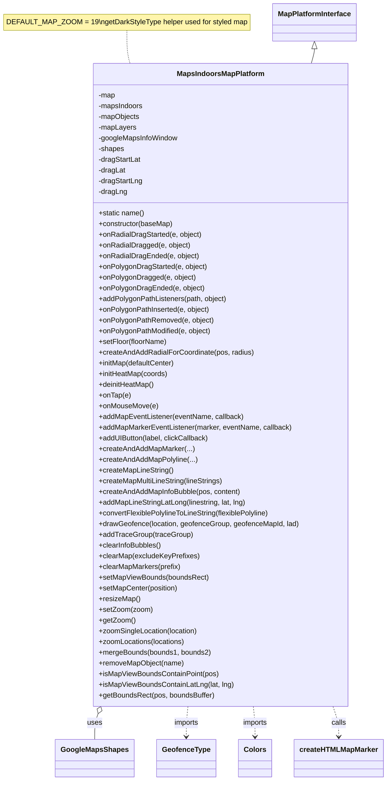

# Diagram: web/portal/src/modules/map/platforms/mapsindoors/MapsIndoorsMapPlatform.js

> Auto-generated by Obscura crawlers

## Mermaid

### SVG

<svg id="container" width="838.83984375" xmlns="http://www.w3.org/2000/svg" class="classDiagram" height="1748" viewBox="0 0 838.83984375 1748" role="graphics-document document" aria-roledescription="class"><g><defs><marker id="container_class-aggregationStart" class="marker aggregation class" refX="18" refY="7" markerWidth="190" markerHeight="240" orient="auto"><path d="M 18,7 L9,13 L1,7 L9,1 Z"></path></marker></defs><defs><marker id="container_class-aggregationEnd" class="marker aggregation class" refX="1" refY="7" markerWidth="20" markerHeight="28" orient="auto"><path d="M 18,7 L9,13 L1,7 L9,1 Z"></path></marker></defs><defs><marker id="container_class-extensionStart" class="marker extension class" refX="18" refY="7" markerWidth="190" markerHeight="240" orient="auto"><path d="M 1,7 L18,13 V 1 Z"></path></marker></defs><defs><marker id="container_class-extensionEnd" class="marker extension class" refX="1" refY="7" markerWidth="20" markerHeight="28" orient="auto"><path d="M 1,1 V 13 L18,7 Z"></path></marker></defs><defs><marker id="container_class-compositionStart" class="marker composition class" refX="18" refY="7" markerWidth="190" markerHeight="240" orient="auto"><path d="M 18,7 L9,13 L1,7 L9,1 Z"></path></marker></defs><defs><marker id="container_class-compositionEnd" class="marker composition class" refX="1" refY="7" markerWidth="20" markerHeight="28" orient="auto"><path d="M 18,7 L9,13 L1,7 L9,1 Z"></path></marker></defs><defs><marker id="container_class-dependencyStart" class="marker dependency class" refX="6" refY="7" markerWidth="190" markerHeight="240" orient="auto"><path d="M 5,7 L9,13 L1,7 L9,1 Z"></path></marker></defs><defs><marker id="container_class-dependencyEnd" class="marker dependency class" refX="13" refY="7" markerWidth="20" markerHeight="28" orient="auto"><path d="M 18,7 L9,13 L14,7 L9,1 Z"></path></marker></defs><defs><marker id="container_class-lollipopStart" class="marker lollipop class" refX="13" refY="7" markerWidth="190" markerHeight="240" orient="auto"><circle stroke="black" fill="transparent" cx="7" cy="7" r="6"></circle></marker></defs><defs><marker id="container_class-lollipopEnd" class="marker lollipop class" refX="1" refY="7" markerWidth="190" markerHeight="240" orient="auto"><circle stroke="black" fill="transparent" cx="7" cy="7" r="6"></circle></marker></defs><g class="root"><g class="clusters"></g><g class="edgePaths"><path d="M275.023,68L275.023,76.167C275.023,84.333,275.023,100.667,276.167,113C277.311,125.333,279.599,133.667,280.743,137.833L281.887,142" id="edgeNote1" class="edge-thickness-normal edge-pattern-dotted relation" style="fill: none;;;fill: none" data-edge="true" data-et="edge" data-id="edgeNote1" data-points="W3sieCI6Mjc1LjAyMzQzNzUsInkiOjY4fSx7IngiOjI3NS4wMjM0Mzc1LCJ5IjoxMTd9LHsieCI6MjgxLjg4NzAzMzM0NzMxNTQsInkiOjE0Mn1d"></path><path d="M684.094,109.25L684.094,110.542C684.094,111.833,684.094,114.417,682.95,119.875C681.806,125.333,679.518,133.667,678.374,137.833L677.23,142" id="id_MapPlatformInterface_MapsIndoorsMapPlatform_1" class="edge-thickness-normal edge-pattern-solid relation" style=";;;" data-edge="true" data-et="edge" data-id="id_MapPlatformInterface_MapsIndoorsMapPlatform_1" data-points="W3sieCI6Njg0LjA5Mzc1LCJ5Ijo5Mn0seyJ4Ijo2ODQuMDkzNzUsInkiOjExN30seyJ4Ijo2NzcuMjMwMTU0MTUyNjg0NiwieSI6MTQyfV0=" marker-start="url(#container_class-extensionStart)"></path><path d="M215.626,1598.238L214.386,1601.698C213.146,1605.159,210.665,1612.079,209.424,1621.706C208.184,1631.333,208.184,1643.667,208.184,1649.833L208.184,1656" id="id_MapsIndoorsMapPlatform_GoogleMapsShapes_2" class="edge-thickness-normal edge-pattern-solid relation" style=";;;" data-edge="true" data-et="edge" data-id="id_MapsIndoorsMapPlatform_GoogleMapsShapes_2" data-points="W3sieCI6MjIxLjQ0NzYyOTQxNzEwNywieSI6MTU4Mn0seyJ4IjoyMDguMTgzNTkzNzUsInkiOjE2MTl9LHsieCI6MjA4LjE4MzU5Mzc1LCJ5IjoxNjU2fV0=" marker-start="url(#container_class-aggregationStart)"></path><path d="M408.901,1582L408.295,1588.167C407.69,1594.333,406.48,1606.667,405.875,1618C405.27,1629.333,405.27,1639.667,405.27,1644.833L405.27,1650" id="id_MapsIndoorsMapPlatform_GeofenceType_3" class="edge-thickness-normal edge-pattern-dashed relation" style=";;;" data-edge="true" data-et="edge" data-id="id_MapsIndoorsMapPlatform_GeofenceType_3" data-points="W3sieCI6NDA4LjkwMDU2ODY1MDkyNDcsInkiOjE1ODJ9LHsieCI6NDA1LjI2OTUzMTI1LCJ5IjoxNjE5fSx7IngiOjQwNS4yNjk1MzEyNSwieSI6MTY1Nn1d" marker-end="url(#container_class-dependencyEnd)"></path><path d="M550.217,1582L550.822,1588.167C551.427,1594.333,552.637,1606.667,553.242,1618C553.848,1629.333,553.848,1639.667,553.848,1644.833L553.848,1650" id="id_MapsIndoorsMapPlatform_Colors_4" class="edge-thickness-normal edge-pattern-dashed relation" style=";;;" data-edge="true" data-et="edge" data-id="id_MapsIndoorsMapPlatform_Colors_4" data-points="W3sieCI6NTUwLjIxNjYxODg0OTA3NTMsInkiOjE1ODJ9LHsieCI6NTUzLjg0NzY1NjI1LCJ5IjoxNjE5fSx7IngiOjU1My44NDc2NTYyNSwieSI6MTY1Nn1d" marker-end="url(#container_class-dependencyEnd)"></path><path d="M722.414,1582L724.494,1588.167C726.574,1594.333,730.735,1606.667,732.815,1618C734.895,1629.333,734.895,1639.667,734.895,1644.833L734.895,1650" id="id_MapsIndoorsMapPlatform_createHTMLMapMarker_5" class="edge-thickness-normal edge-pattern-dashed relation" style=";;;" data-edge="true" data-et="edge" data-id="id_MapsIndoorsMapPlatform_createHTMLMapMarker_5" data-points="W3sieCI6NzIyLjQxNDQzOTE5MjUzNjMsInkiOjE1ODJ9LHsieCI6NzM0Ljg5NDUzMTI1LCJ5IjoxNjE5fSx7IngiOjczNC44OTQ1MzEyNSwieSI6MTY1Nn1d" marker-end="url(#container_class-dependencyEnd)"></path></g><g class="edgeLabels"><g class="edgeLabel"><g class="label" data-id="edgeNote1" transform="translate(0, 0)"><foreignObject width="0" height="0">

</foreignObject></g></g><g class="edgeLabel"><g class="label" data-id="id_MapPlatformInterface_MapsIndoorsMapPlatform_1" transform="translate(0, 0)"><foreignObject width="0" height="0">

</foreignObject></g></g><g class="edgeLabel" transform="translate(208.18359375, 1619)"><g class="label" data-id="id_MapsIndoorsMapPlatform_GoogleMapsShapes_2" transform="translate(-16.4921875, -12)"><foreignObject width="32.984375" height="24">

uses

</foreignObject></g></g><g class="edgeLabel" transform="translate(405.26953125, 1619)"><g class="label" data-id="id_MapsIndoorsMapPlatform_GeofenceType_3" transform="translate(-28.25, -12)"><foreignObject width="56.5" height="24">

imports

</foreignObject></g></g><g class="edgeLabel" transform="translate(553.84765625, 1619)"><g class="label" data-id="id_MapsIndoorsMapPlatform_Colors_4" transform="translate(-28.25, -12)"><foreignObject width="56.5" height="24">

imports

</foreignObject></g></g><g class="edgeLabel" transform="translate(734.89453125, 1619)"><g class="label" data-id="id_MapsIndoorsMapPlatform_createHTMLMapMarker_5" transform="translate(-16.4453125, -12)"><foreignObject width="32.890625" height="24">

calls

</foreignObject></g></g></g><g class="nodes"><g class="node default" id="classId-MapPlatformInterface-0" transform="translate(684.09375, 50)"><g class="basic label-container"><path d="M-92.046875 -42 L92.046875 -42 L92.046875 42 L-92.046875 42" stroke="none" stroke-width="0" fill="#ECECFF" style=""></path><path d="M-92.046875 -42 C-32.231022723507955 -42, 27.58482955298409 -42, 92.046875 -42 M-92.046875 -42 C-53.897749233107575 -42, -15.74862346621515 -42, 92.046875 -42 M92.046875 -42 C92.046875 -18.738909036963346, 92.046875 4.5221819260733085, 92.046875 42 M92.046875 -42 C92.046875 -23.648883600516587, 92.046875 -5.2977672010331744, 92.046875 42 M92.046875 42 C48.97409688037744 42, 5.901318760754876 42, -92.046875 42 M92.046875 42 C34.30553280131459 42, -23.435809397370818 42, -92.046875 42 M-92.046875 42 C-92.046875 9.96385792471169, -92.046875 -22.07228415057662, -92.046875 -42 M-92.046875 42 C-92.046875 22.70584112719115, -92.046875 3.411682254382299, -92.046875 -42" stroke="#9370DB" stroke-width="1.3" fill="none" stroke-dasharray="0 0" style=""></path></g><g class="annotation-group text" transform="translate(0, -18)"></g><g class="label-group text" transform="translate(-80.046875, -18)"><g class="label" style="font-weight: bolder" transform="translate(0,-12)"><foreignObject width="160.09375" height="24">

MapPlatformInterface

</foreignObject></g></g><g class="members-group text" transform="translate(-80.046875, 30)"></g><g class="methods-group text" transform="translate(-80.046875, 60)"></g><g class="divider" style=""><path d="M-92.046875 6 C-40.734759528634505 6, 10.57735594273099 6, 92.046875 6 M-92.046875 6 C-21.970891836644327 6, 48.105091326711346 6, 92.046875 6" stroke="#9370DB" stroke-width="1.3" fill="none" stroke-dasharray="0 0" style=""></path></g><g class="divider" style=""><path d="M-92.046875 24 C-32.88599457511971 24, 26.27488584976058 24, 92.046875 24 M-92.046875 24 C-23.294425452166877 24, 45.45802409566625 24, 92.046875 24" stroke="#9370DB" stroke-width="1.3" fill="none" stroke-dasharray="0 0" style=""></path></g></g><g class="node default" id="classId-MapsIndoorsMapPlatform-1" transform="translate(479.55859375, 862)"><g class="basic label-container"><path d="M-282.9375 -720 L282.9375 -720 L282.9375 720 L-282.9375 720" stroke="none" stroke-width="0" fill="#ECECFF" style=""></path><path d="M-282.9375 -720 C-75.13586872148667 -720, 132.66576255702665 -720, 282.9375 -720 M-282.9375 -720 C-85.2668605915479 -720, 112.40377881690421 -720, 282.9375 -720 M282.9375 -720 C282.9375 -209.99195489804362, 282.9375 300.01609020391277, 282.9375 720 M282.9375 -720 C282.9375 -243.14500934157888, 282.9375 233.70998131684223, 282.9375 720 M282.9375 720 C66.31836009758044 720, -150.30077980483912 720, -282.9375 720 M282.9375 720 C163.8285934420273 720, 44.719686884054624 720, -282.9375 720 M-282.9375 720 C-282.9375 225.95656399910297, -282.9375 -268.08687200179406, -282.9375 -720 M-282.9375 720 C-282.9375 242.84373825236077, -282.9375 -234.31252349527847, -282.9375 -720" stroke="#9370DB" stroke-width="1.3" fill="none" stroke-dasharray="0 0" style=""></path></g><g class="annotation-group text" transform="translate(0, -696)"></g><g class="label-group text" transform="translate(-94.78125, -696)"><g class="label" style="font-weight: bolder" transform="translate(0,-12)"><foreignObject width="189.5625" height="24">

MapsIndoorsMapPlatform

</foreignObject></g></g><g class="members-group text" transform="translate(-270.9375, -648)"><g class="label" style="" transform="translate(0,-12)"><foreignObject width="38.375" height="24">

-map

</foreignObject></g><g class="label" style="" transform="translate(0,12)"><foreignObject width="101.609375" height="24">

-mapsIndoors

</foreignObject></g><g class="label" style="" transform="translate(0,36)"><foreignObject width="93.046875" height="24">

-mapObjects

</foreignObject></g><g class="label" style="" transform="translate(0,60)"><foreignObject width="84.578125" height="24">

-mapLayers

</foreignObject></g><g class="label" style="" transform="translate(0,84)"><foreignObject width="179.109375" height="24">

-googleMapsInfoWindow

</foreignObject></g><g class="label" style="" transform="translate(0,108)"><foreignObject width="57.703125" height="24">

-shapes

</foreignObject></g><g class="label" style="" transform="translate(0,132)"><foreignObject width="95.828125" height="24">

-dragStartLat

</foreignObject></g><g class="label" style="" transform="translate(0,156)"><foreignObject width="60.796875" height="24">

-dragLat

</foreignObject></g><g class="label" style="" transform="translate(0,180)"><foreignObject width="99.046875" height="24">

-dragStartLng

</foreignObject></g><g class="label" style="" transform="translate(0,204)"><foreignObject width="64.015625" height="24">

-dragLng

</foreignObject></g></g><g class="methods-group text" transform="translate(-270.9375, -384)"><g class="label" style="" transform="translate(0,-12)"><foreignObject width="102.890625" height="24">

+static name()

</foreignObject></g><g class="label" style="" transform="translate(0,12)"><foreignObject width="166.578125" height="24">

+constructor(baseMap)

</foreignObject></g><g class="label" style="" transform="translate(0,36)"><foreignObject width="230.59375" height="24">

+onRadialDragStarted(e, object)

</foreignObject></g><g class="label" style="" transform="translate(0,60)"><foreignObject width="203.859375" height="24">

+onRadialDragged(e, object)

</foreignObject></g><g class="label" style="" transform="translate(0,84)"><foreignObject width="223.140625" height="24">

+onRadialDragEnded(e, object)

</foreignObject></g><g class="label" style="" transform="translate(0,108)"><foreignObject width="242.375" height="24">

+onPolygonDragStarted(e, object)

</foreignObject></g><g class="label" style="" transform="translate(0,132)"><foreignObject width="215.640625" height="24">

+onPolygonDragged(e, object)

</foreignObject></g><g class="label" style="" transform="translate(0,156)"><foreignObject width="234.921875" height="24">

+onPolygonDragEnded(e, object)

</foreignObject></g><g class="label" style="" transform="translate(0,180)"><foreignObject width="288.015625" height="24">

+addPolygonPathListeners(path, object)

</foreignObject></g><g class="label" style="" transform="translate(0,204)"><foreignObject width="249.0625" height="24">

+onPolygonPathInserted(e, object)

</foreignObject></g><g class="label" style="" transform="translate(0,228)"><foreignObject width="256.03125" height="24">

+onPolygonPathRemoved(e, object)

</foreignObject></g><g class="label" style="" transform="translate(0,252)"><foreignObject width="252.140625" height="24">

+onPolygonPathModified(e, object)

</foreignObject></g><g class="label" style="" transform="translate(0,276)"><foreignObject width="153.8125" height="24">

+setFloor(floorName)

</foreignObject></g><g class="label" style="" transform="translate(0,300)"><foreignObject width="347.015625" height="24">

+createAndAddRadialForCoordinate(pos, radius)

</foreignObject></g><g class="label" style="" transform="translate(0,324)"><foreignObject width="172.140625" height="24">

+initMap(defaultCenter)

</foreignObject></g><g class="label" style="" transform="translate(0,348)"><foreignObject width="155.859375" height="24">

+initHeatMap(coords)

</foreignObject></g><g class="label" style="" transform="translate(0,372)"><foreignObject width="125.40625" height="24">

+deinitHeatMap()

</foreignObject></g><g class="label" style="" transform="translate(0,396)"><foreignObject width="71.484375" height="24">

+onTap(e)

</foreignObject></g><g class="label" style="" transform="translate(0,420)"><foreignObject width="131.359375" height="24">

+onMouseMove(e)

</foreignObject></g><g class="label" style="" transform="translate(0,444)"><foreignObject width="324.625" height="24">

+addMapEventListener(eventName, callback)

</foreignObject></g><g class="label" style="" transform="translate(0,468)"><foreignObject width="433.234375" height="24">

+addMapMarkerEventListener(marker, eventName, callback)

</foreignObject></g><g class="label" style="" transform="translate(0,492)"><foreignObject width="248.015625" height="24">

+addUIButton(label, clickCallback)

</foreignObject></g><g class="label" style="" transform="translate(0,516)"><foreignObject width="212.09375" height="24">

+createAndAddMapMarker(...)

</foreignObject></g><g class="label" style="" transform="translate(0,540)"><foreignObject width="219.671875" height="24">

+createAndAddMapPolyline(...)

</foreignObject></g><g class="label" style="" transform="translate(0,564)"><foreignObject width="167.34375" height="24">

+createMapLineString()

</foreignObject></g><g class="label" style="" transform="translate(0,588)"><foreignObject width="281.609375" height="24">

+createMapMultiLineString(lineStrings)

</foreignObject></g><g class="label" style="" transform="translate(0,612)"><foreignObject width="320.171875" height="24">

+createAndAddMapInfoBubble(pos, content)

</foreignObject></g><g class="label" style="" transform="translate(0,636)"><foreignObject width="333.59375" height="24">

+addMapLineStringLatLong(linestring, lat, lng)

</foreignObject></g><g class="label" style="" transform="translate(0,660)"><foreignObject width="387.734375" height="24">

+convertFlexiblePolylineToLineString(flexiblePolyline)

</foreignObject></g><g class="label" style="" transform="translate(0,684)"><foreignObject width="447.09375" height="24">

+drawGeofence(location, geofenceGroup, geofenceMapId, lad)

</foreignObject></g><g class="label" style="" transform="translate(0,708)"><foreignObject width="208.171875" height="24">

+addTraceGroup(traceGroup)

</foreignObject></g><g class="label" style="" transform="translate(0,732)"><foreignObject width="141.546875" height="24">

+clearInfoBubbles()

</foreignObject></g><g class="label" style="" transform="translate(0,756)"><foreignObject width="222.96875" height="24">

+clearMap(excludeKeyPrefixes)

</foreignObject></g><g class="label" style="" transform="translate(0,780)"><foreignObject width="183.09375" height="24">

+clearMapMarkers(prefix)

</foreignObject></g><g class="label" style="" transform="translate(0,804)"><foreignObject width="245.546875" height="24">

+setMapViewBounds(boundsRect)

</foreignObject></g><g class="label" style="" transform="translate(0,828)"><foreignObject width="177.984375" height="24">

+setMapCenter(position)

</foreignObject></g><g class="label" style="" transform="translate(0,852)"><foreignObject width="91.015625" height="24">

+resizeMap()

</foreignObject></g><g class="label" style="" transform="translate(0,876)"><foreignObject width="120.015625" height="24">

+setZoom(zoom)

</foreignObject></g><g class="label" style="" transform="translate(0,900)"><foreignObject width="81.3125" height="24">

+getZoom()

</foreignObject></g><g class="label" style="" transform="translate(0,924)"><foreignObject width="222.6875" height="24">

+zoomSingleLocation(location)

</foreignObject></g><g class="label" style="" transform="translate(0,948)"><foreignObject width="193.375" height="24">

+zoomLocations(locations)

</foreignObject></g><g class="label" style="" transform="translate(0,972)"><foreignObject width="249.75" height="24">

+mergeBounds(bounds1, bounds2)

</foreignObject></g><g class="label" style="" transform="translate(0,996)"><foreignObject width="190.671875" height="24">

+removeMapObject(name)

</foreignObject></g><g class="label" style="" transform="translate(0,1020)"><foreignObject width="269.15625" height="24">

+isMapViewBoundsContainPoint(pos)

</foreignObject></g><g class="label" style="" transform="translate(0,1044)"><foreignObject width="302.421875" height="24">

+isMapViewBoundsContainLatLng(lat, lng)

</foreignObject></g><g class="label" style="" transform="translate(0,1068)"><foreignObject width="260.78125" height="24">

+getBoundsRect(pos, boundsBuffer)

</foreignObject></g></g><g class="divider" style=""><path d="M-282.9375 -672 C-156.12513218319657 -672, -29.31276436639311 -672, 282.9375 -672 M-282.9375 -672 C-154.78681516210375 -672, -26.6361303242075 -672, 282.9375 -672" stroke="#9370DB" stroke-width="1.3" fill="none" stroke-dasharray="0 0" style=""></path></g><g class="divider" style=""><path d="M-282.9375 -408 C-122.11726085417098 -408, 38.70297829165804 -408, 282.9375 -408 M-282.9375 -408 C-129.2166798199918 -408, 24.50414036001638 -408, 282.9375 -408" stroke="#9370DB" stroke-width="1.3" fill="none" stroke-dasharray="0 0" style=""></path></g></g><g class="node default" id="classId-GoogleMapsShapes-2" transform="translate(208.18359375, 1698)"><g class="basic label-container"><path d="M-83.609375 -42 L83.609375 -42 L83.609375 42 L-83.609375 42" stroke="none" stroke-width="0" fill="#ECECFF" style=""></path><path d="M-83.609375 -42 C-41.87992554442372 -42, -0.1504760888474408 -42, 83.609375 -42 M-83.609375 -42 C-45.58188577748934 -42, -7.5543965549786805 -42, 83.609375 -42 M83.609375 -42 C83.609375 -9.134612615918826, 83.609375 23.730774768162348, 83.609375 42 M83.609375 -42 C83.609375 -23.369367746882055, 83.609375 -4.738735493764111, 83.609375 42 M83.609375 42 C49.384436558760704 42, 15.159498117521409 42, -83.609375 42 M83.609375 42 C41.439038225469446 42, -0.7312985490611084 42, -83.609375 42 M-83.609375 42 C-83.609375 16.760696033675753, -83.609375 -8.478607932648494, -83.609375 -42 M-83.609375 42 C-83.609375 13.47258511283528, -83.609375 -15.054829774329441, -83.609375 -42" stroke="#9370DB" stroke-width="1.3" fill="none" stroke-dasharray="0 0" style=""></path></g><g class="annotation-group text" transform="translate(0, -18)"></g><g class="label-group text" transform="translate(-71.609375, -18)"><g class="label" style="font-weight: bolder" transform="translate(0,-12)"><foreignObject width="143.21875" height="24">

GoogleMapsShapes

</foreignObject></g></g><g class="members-group text" transform="translate(-71.609375, 30)"></g><g class="methods-group text" transform="translate(-71.609375, 60)"></g><g class="divider" style=""><path d="M-83.609375 6 C-46.98542973925464 6, -10.361484478509283 6, 83.609375 6 M-83.609375 6 C-35.29276759866301 6, 13.023839802673976 6, 83.609375 6" stroke="#9370DB" stroke-width="1.3" fill="none" stroke-dasharray="0 0" style=""></path></g><g class="divider" style=""><path d="M-83.609375 24 C-35.41198787721203 24, 12.785399245575945 24, 83.609375 24 M-83.609375 24 C-21.854377562150944 24, 39.90061987569811 24, 83.609375 24" stroke="#9370DB" stroke-width="1.3" fill="none" stroke-dasharray="0 0" style=""></path></g></g><g class="node default" id="classId-GeofenceType-3" transform="translate(405.26953125, 1698)"><g class="basic label-container"><path d="M-63.4765625 -42 L63.4765625 -42 L63.4765625 42 L-63.4765625 42" stroke="none" stroke-width="0" fill="#ECECFF" style=""></path><path d="M-63.4765625 -42 C-20.21129277534765 -42, 23.053976949304698 -42, 63.4765625 -42 M-63.4765625 -42 C-26.358196410301986 -42, 10.760169679396029 -42, 63.4765625 -42 M63.4765625 -42 C63.4765625 -21.701355035408007, 63.4765625 -1.4027100708160134, 63.4765625 42 M63.4765625 -42 C63.4765625 -24.598340962795344, 63.4765625 -7.196681925590688, 63.4765625 42 M63.4765625 42 C13.120017224946707 42, -37.236528050106585 42, -63.4765625 42 M63.4765625 42 C19.789734657523148 42, -23.897093184953704 42, -63.4765625 42 M-63.4765625 42 C-63.4765625 8.835178821117786, -63.4765625 -24.329642357764428, -63.4765625 -42 M-63.4765625 42 C-63.4765625 23.39372273342405, -63.4765625 4.787445466848098, -63.4765625 -42" stroke="#9370DB" stroke-width="1.3" fill="none" stroke-dasharray="0 0" style=""></path></g><g class="annotation-group text" transform="translate(0, -18)"></g><g class="label-group text" transform="translate(-51.4765625, -18)"><g class="label" style="font-weight: bolder" transform="translate(0,-12)"><foreignObject width="102.953125" height="24">

GeofenceType

</foreignObject></g></g><g class="members-group text" transform="translate(-51.4765625, 30)"></g><g class="methods-group text" transform="translate(-51.4765625, 60)"></g><g class="divider" style=""><path d="M-63.4765625 6 C-26.234510689217856 6, 11.007541121564287 6, 63.4765625 6 M-63.4765625 6 C-15.684435329732082 6, 32.107691840535836 6, 63.4765625 6" stroke="#9370DB" stroke-width="1.3" fill="none" stroke-dasharray="0 0" style=""></path></g><g class="divider" style=""><path d="M-63.4765625 24 C-27.101112591619653 24, 9.274337316760693 24, 63.4765625 24 M-63.4765625 24 C-18.858253380973977 24, 25.760055738052046 24, 63.4765625 24" stroke="#9370DB" stroke-width="1.3" fill="none" stroke-dasharray="0 0" style=""></path></g></g><g class="node default" id="classId-Colors-4" transform="translate(553.84765625, 1698)"><g class="basic label-container"><path d="M-35.1015625 -42 L35.1015625 -42 L35.1015625 42 L-35.1015625 42" stroke="none" stroke-width="0" fill="#ECECFF" style=""></path><path d="M-35.1015625 -42 C-15.628759013373209 -42, 3.8440444732535823 -42, 35.1015625 -42 M-35.1015625 -42 C-13.938503321373904 -42, 7.2245558572521915 -42, 35.1015625 -42 M35.1015625 -42 C35.1015625 -21.42945370927262, 35.1015625 -0.8589074185452432, 35.1015625 42 M35.1015625 -42 C35.1015625 -15.629799586519553, 35.1015625 10.740400826960894, 35.1015625 42 M35.1015625 42 C7.319036800783206 42, -20.46348889843359 42, -35.1015625 42 M35.1015625 42 C12.741376684244074 42, -9.618809131511853 42, -35.1015625 42 M-35.1015625 42 C-35.1015625 10.295806920425836, -35.1015625 -21.40838615914833, -35.1015625 -42 M-35.1015625 42 C-35.1015625 18.16488136282662, -35.1015625 -5.670237274346761, -35.1015625 -42" stroke="#9370DB" stroke-width="1.3" fill="none" stroke-dasharray="0 0" style=""></path></g><g class="annotation-group text" transform="translate(0, -18)"></g><g class="label-group text" transform="translate(-23.1015625, -18)"><g class="label" style="font-weight: bolder" transform="translate(0,-12)"><foreignObject width="46.203125" height="24">

Colors

</foreignObject></g></g><g class="members-group text" transform="translate(-23.1015625, 30)"></g><g class="methods-group text" transform="translate(-23.1015625, 60)"></g><g class="divider" style=""><path d="M-35.1015625 6 C-17.138094549455538 6, 0.8253734010889247 6, 35.1015625 6 M-35.1015625 6 C-8.610635286614286 6, 17.880291926771427 6, 35.1015625 6" stroke="#9370DB" stroke-width="1.3" fill="none" stroke-dasharray="0 0" style=""></path></g><g class="divider" style=""><path d="M-35.1015625 24 C-9.300700058839265 24, 16.50016238232147 24, 35.1015625 24 M-35.1015625 24 C-14.081829127585376 24, 6.937904244829248 24, 35.1015625 24" stroke="#9370DB" stroke-width="1.3" fill="none" stroke-dasharray="0 0" style=""></path></g></g><g class="node default" id="classId-createHTMLMapMarker-5" transform="translate(734.89453125, 1698)"><g class="basic label-container"><path d="M-95.9453125 -42 L95.9453125 -42 L95.9453125 42 L-95.9453125 42" stroke="none" stroke-width="0" fill="#ECECFF" style=""></path><path d="M-95.9453125 -42 C-35.57030761942324 -42, 24.80469726115352 -42, 95.9453125 -42 M-95.9453125 -42 C-28.630677615481375 -42, 38.68395726903725 -42, 95.9453125 -42 M95.9453125 -42 C95.9453125 -17.25374571927272, 95.9453125 7.492508561454557, 95.9453125 42 M95.9453125 -42 C95.9453125 -13.741843855378068, 95.9453125 14.516312289243864, 95.9453125 42 M95.9453125 42 C40.61529531991765 42, -14.714721860164701 42, -95.9453125 42 M95.9453125 42 C53.222209573023605 42, 10.49910664604721 42, -95.9453125 42 M-95.9453125 42 C-95.9453125 11.45091066081542, -95.9453125 -19.09817867836916, -95.9453125 -42 M-95.9453125 42 C-95.9453125 14.874999080777815, -95.9453125 -12.25000183844437, -95.9453125 -42" stroke="#9370DB" stroke-width="1.3" fill="none" stroke-dasharray="0 0" style=""></path></g><g class="annotation-group text" transform="translate(0, -18)"></g><g class="label-group text" transform="translate(-83.9453125, -18)"><g class="label" style="font-weight: bolder" transform="translate(0,-12)"><foreignObject width="167.890625" height="24">

createHTMLMapMarker

</foreignObject></g></g><g class="members-group text" transform="translate(-83.9453125, 30)"></g><g class="methods-group text" transform="translate(-83.9453125, 60)"></g><g class="divider" style=""><path d="M-95.9453125 6 C-29.49481906538854 6, 36.95567436922292 6, 95.9453125 6 M-95.9453125 6 C-25.829119488403194 6, 44.28707352319361 6, 95.9453125 6" stroke="#9370DB" stroke-width="1.3" fill="none" stroke-dasharray="0 0" style=""></path></g><g class="divider" style=""><path d="M-95.9453125 24 C-34.322244242256936 24, 27.30082401548613 24, 95.9453125 24 M-95.9453125 24 C-47.91383826681211 24, 0.11763596637578644 24, 95.9453125 24" stroke="#9370DB" stroke-width="1.3" fill="none" stroke-dasharray="0 0" style=""></path></g></g><g class="node undefined" id="note0" transform="translate(275.0234375, 50)"><g class="basic label-container"><path d="M-267.0234375 -18 L267.0234375 -18 L267.0234375 18 L-267.0234375 18" stroke="none" stroke-width="0" fill="#fff5ad" style="fill:#fff5ad !important;stroke:#aaaa33 !important"></path><path d="M-267.0234375 -18 C-102.9845129180352 -18, 61.05441166392961 -18, 267.0234375 -18 M-267.0234375 -18 C-100.72484737678829 -18, 65.57374274642342 -18, 267.0234375 -18 M267.0234375 -18 C267.0234375 -10.552253191193271, 267.0234375 -3.1045063823865426, 267.0234375 18 M267.0234375 -18 C267.0234375 -4.34738225340047, 267.0234375 9.30523549319906, 267.0234375 18 M267.0234375 18 C113.12484062665695 18, -40.773756246686105 18, -267.0234375 18 M267.0234375 18 C65.52829774408318 18, -135.96684201183365 18, -267.0234375 18 M-267.0234375 18 C-267.0234375 5.684769777066782, -267.0234375 -6.6304604458664365, -267.0234375 -18 M-267.0234375 18 C-267.0234375 8.24957674178562, -267.0234375 -1.5008465164287585, -267.0234375 -18" stroke="#aaaa33" stroke-width="1.3" fill="none" stroke-dasharray="0 0" style="fill:#fff5ad !important;stroke:#aaaa33 !important"></path></g><g class="label" style="text-align:left !important;white-space:nowrap !important" transform="translate(-261.0234375, -12)"><rect></rect><foreignObject width="522.046875" height="24">

DEFAULT_MAP_ZOOM = 19\ngetDarkStyleType helper used for styled map

</foreignObject></g></g></g></g></g></svg>
