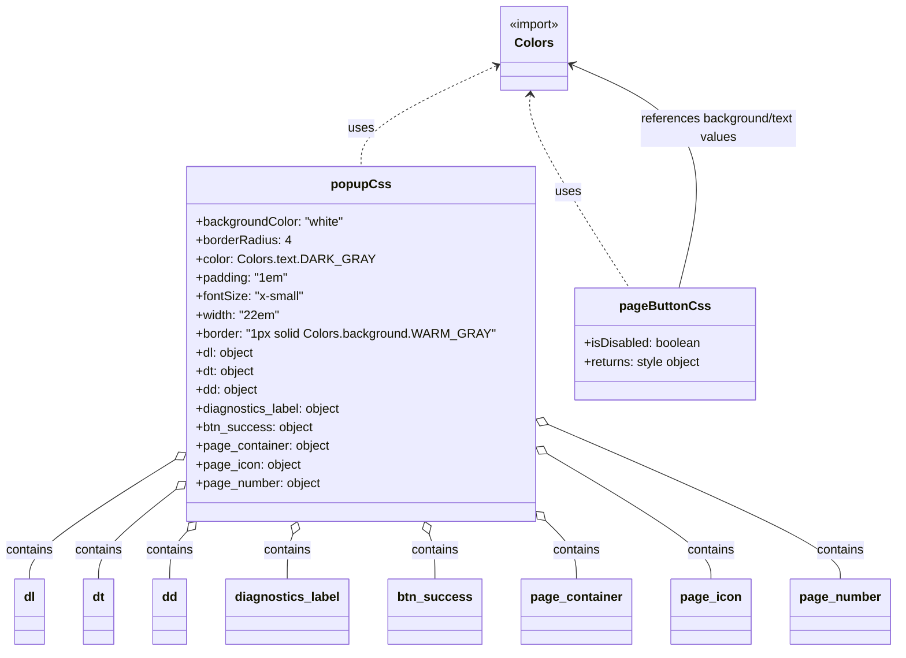

# Diagram: web/portal/src/modules/map/styles/PaginatedLocationInfoPopupStyles.js

> Auto-generated by Obscura crawlers

## Mermaid

```mermaid
classDiagram
class Colors <<import>>
class popupCss {
  +backgroundColor: "white"
  +borderRadius: 4
  +color: Colors.text.DARK_GRAY
  +padding: "1em"
  +fontSize: "x-small"
  +width: "22em"
  +border: "1px solid Colors.background.WARM_GRAY"
  +dl: object
  +dt: object
  +dd: object
  +diagnostics_label: object
  +btn_success: object
  +page_container: object
  +page_icon: object
  +page_number: object
}
class pageButtonCss {
  +isDisabled: boolean
  +returns: style object
}
Colors <.. popupCss : uses
Colors <.. pageButtonCss : uses
popupCss o-- dl : contains
popupCss o-- dt : contains
popupCss o-- dd : contains
popupCss o-- diagnostics_label : contains
popupCss o-- btn_success : contains
popupCss o-- page_container : contains
popupCss o-- page_icon : contains
popupCss o-- page_number : contains
pageButtonCss --> Colors : references background/text values
```

> SVG rendering failed for this diagram.
