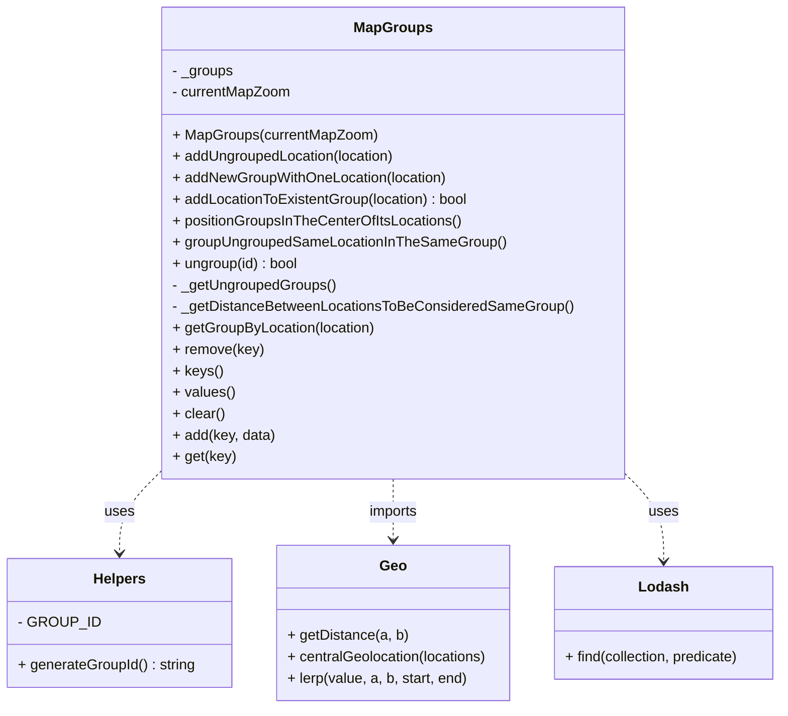

# Diagram: web/portal/src/modules/map/utils/MapGroups.js

> Auto-generated by Obscura crawlers

## Mermaid

### SVG

<svg id="container" width="880.140625" xmlns="http://www.w3.org/2000/svg" class="classDiagram" height="792" viewBox="0 0 880.140625 792" role="graphics-document document" aria-roledescription="class"><g><defs><marker id="container_class-aggregationStart" class="marker aggregation class" refX="18" refY="7" markerWidth="190" markerHeight="240" orient="auto"><path d="M 18,7 L9,13 L1,7 L9,1 Z"></path></marker></defs><defs><marker id="container_class-aggregationEnd" class="marker aggregation class" refX="1" refY="7" markerWidth="20" markerHeight="28" orient="auto"><path d="M 18,7 L9,13 L1,7 L9,1 Z"></path></marker></defs><defs><marker id="container_class-extensionStart" class="marker extension class" refX="18" refY="7" markerWidth="190" markerHeight="240" orient="auto"><path d="M 1,7 L18,13 V 1 Z"></path></marker></defs><defs><marker id="container_class-extensionEnd" class="marker extension class" refX="1" refY="7" markerWidth="20" markerHeight="28" orient="auto"><path d="M 1,1 V 13 L18,7 Z"></path></marker></defs><defs><marker id="container_class-compositionStart" class="marker composition class" refX="18" refY="7" markerWidth="190" markerHeight="240" orient="auto"><path d="M 18,7 L9,13 L1,7 L9,1 Z"></path></marker></defs><defs><marker id="container_class-compositionEnd" class="marker composition class" refX="1" refY="7" markerWidth="20" markerHeight="28" orient="auto"><path d="M 18,7 L9,13 L1,7 L9,1 Z"></path></marker></defs><defs><marker id="container_class-dependencyStart" class="marker dependency class" refX="6" refY="7" markerWidth="190" markerHeight="240" orient="auto"><path d="M 5,7 L9,13 L1,7 L9,1 Z"></path></marker></defs><defs><marker id="container_class-dependencyEnd" class="marker dependency class" refX="13" refY="7" markerWidth="20" markerHeight="28" orient="auto"><path d="M 18,7 L9,13 L14,7 L9,1 Z"></path></marker></defs><defs><marker id="container_class-lollipopStart" class="marker lollipop class" refX="13" refY="7" markerWidth="190" markerHeight="240" orient="auto"><circle stroke="black" fill="transparent" cx="7" cy="7" r="6"></circle></marker></defs><defs><marker id="container_class-lollipopEnd" class="marker lollipop class" refX="1" refY="7" markerWidth="190" markerHeight="240" orient="auto"><circle stroke="black" fill="transparent" cx="7" cy="7" r="6"></circle></marker></defs><g class="root"><g class="clusters"></g><g class="edgePaths"><path d="M184.781,522.607L176.196,531.006C167.611,539.405,150.44,556.202,141.855,572.268C133.27,588.333,133.27,603.667,133.27,611.333L133.27,619" id="id_MapGroups_Helpers_1" class="edge-thickness-normal edge-pattern-dashed relation" style=";;;" data-edge="true" data-et="edge" data-id="id_MapGroups_Helpers_1" data-points="W3sieCI6MTg0Ljc4MTI1LCJ5Ijo1MjIuNjA3MjMzOTkzOTMxNX0seyJ4IjoxMzMuMjY5NTMxMjUsInkiOjU3M30seyJ4IjoxMzMuMjY5NTMxMjUsInkiOjYyNX1d" marker-end="url(#container_class-dependencyEnd)"></path><path d="M440.953,536L440.953,542.167C440.953,548.333,440.953,560.667,440.953,572C440.953,583.333,440.953,593.667,440.953,598.833L440.953,604" id="id_MapGroups_Geo_2" class="edge-thickness-normal edge-pattern-dashed relation" style=";;;" data-edge="true" data-et="edge" data-id="id_MapGroups_Geo_2" data-points="W3sieCI6NDQwLjk1MzEyNSwieSI6NTM2fSx7IngiOjQ0MC45NTMxMjUsInkiOjU3M30seyJ4Ijo0NDAuOTUzMTI1LCJ5Ijo2MTB9XQ==" marker-end="url(#container_class-dependencyEnd)"></path><path d="M697.125,523.328L705.563,531.607C714.001,539.886,730.878,556.443,739.316,573.888C747.754,591.333,747.754,609.667,747.754,618.833L747.754,628" id="id_MapGroups_Lodash_3" class="edge-thickness-normal edge-pattern-dashed relation" style=";;;" data-edge="true" data-et="edge" data-id="id_MapGroups_Lodash_3" data-points="W3sieCI6Njk3LjEyNSwieSI6NTIzLjMyODM1MDc5NzY3MjZ9LHsieCI6NzQ3Ljc1MzkwNjI1LCJ5Ijo1NzN9LHsieCI6NzQ3Ljc1MzkwNjI1LCJ5Ijo2MzR9XQ==" marker-end="url(#container_class-dependencyEnd)"></path></g><g class="edgeLabels"><g class="edgeLabel" transform="translate(133.26953125, 573)"><g class="label" data-id="id_MapGroups_Helpers_1" transform="translate(-16.4921875, -12)"><foreignObject width="32.984375" height="24">

uses

</foreignObject></g></g><g class="edgeLabel" transform="translate(440.953125, 573)"><g class="label" data-id="id_MapGroups_Geo_2" transform="translate(-28.25, -12)"><foreignObject width="56.5" height="24">

imports

</foreignObject></g></g><g class="edgeLabel" transform="translate(747.75390625, 573)"><g class="label" data-id="id_MapGroups_Lodash_3" transform="translate(-16.4921875, -12)"><foreignObject width="32.984375" height="24">

uses

</foreignObject></g></g></g><g class="nodes"><g class="node default" id="classId-MapGroups-0" transform="translate(440.953125, 272)"><g class="basic label-container"><path d="M-256.171875 -264 L256.171875 -264 L256.171875 264 L-256.171875 264" stroke="none" stroke-width="0" fill="#ECECFF" style=""></path><path d="M-256.171875 -264 C-144.8338166305451 -264, -33.4957582610902 -264, 256.171875 -264 M-256.171875 -264 C-98.27206212745341 -264, 59.62775074509318 -264, 256.171875 -264 M256.171875 -264 C256.171875 -54.25387721959453, 256.171875 155.49224556081094, 256.171875 264 M256.171875 -264 C256.171875 -71.71015274292998, 256.171875 120.57969451414004, 256.171875 264 M256.171875 264 C102.18131952727632 264, -51.80923594544737 264, -256.171875 264 M256.171875 264 C91.68656757593729 264, -72.79873984812542 264, -256.171875 264 M-256.171875 264 C-256.171875 92.66692480372552, -256.171875 -78.66615039254896, -256.171875 -264 M-256.171875 264 C-256.171875 111.90095752220904, -256.171875 -40.19808495558192, -256.171875 -264" stroke="#9370DB" stroke-width="1.3" fill="none" stroke-dasharray="0 0" style=""></path></g><g class="annotation-group text" transform="translate(0, -240)"></g><g class="label-group text" transform="translate(-41.46875, -240)"><g class="label" style="font-weight: bolder" transform="translate(0,-12)"><foreignObject width="82.9375" height="24">

MapGroups

</foreignObject></g></g><g class="members-group text" transform="translate(-244.171875, -192)"><g class="label" style="" transform="translate(0,-12)"><foreignObject width="68.8125" height="24">

- _groups

</foreignObject></g><g class="label" style="" transform="translate(0,12)"><foreignObject width="134.296875" height="24">

- currentMapZoom

</foreignObject></g></g><g class="methods-group text" transform="translate(-244.171875, -120)"><g class="label" style="" transform="translate(0,-12)"><foreignObject width="228.28125" height="24">

+ MapGroups(currentMapZoom)

</foreignObject></g><g class="label" style="" transform="translate(0,12)"><foreignObject width="252.140625" height="24">

+ addUngroupedLocation(location)

</foreignObject></g><g class="label" style="" transform="translate(0,36)"><foreignObject width="308.828125" height="24">

+ addNewGroupWithOneLocation(location)

</foreignObject></g><g class="label" style="" transform="translate(0,60)"><foreignObject width="335.296875" height="24">

+ addLocationToExistentGroup(location) : bool

</foreignObject></g><g class="label" style="" transform="translate(0,84)"><foreignObject width="325.484375" height="24">

+ positionGroupsInTheCenterOfItsLocations()

</foreignObject></g><g class="label" style="" transform="translate(0,108)"><foreignObject width="371.453125" height="24">

+ groupUngroupedSameLocationInTheSameGroup()

</foreignObject></g><g class="label" style="" transform="translate(0,132)"><foreignObject width="142.75" height="24">

+ ungroup(id) : bool

</foreignObject></g><g class="label" style="" transform="translate(0,156)"><foreignObject width="183.9375" height="24">

- _getUngroupedGroups()

</foreignObject></g><g class="label" style="" transform="translate(0,180)"><foreignObject width="446.875" height="24">

- _getDistanceBetweenLocationsToBeConsideredSameGroup()

</foreignObject></g><g class="label" style="" transform="translate(0,204)"><foreignObject width="227.96875" height="24">

+ getGroupByLocation(location)

</foreignObject></g><g class="label" style="" transform="translate(0,228)"><foreignObject width="101.109375" height="24">

+ remove(key)

</foreignObject></g><g class="label" style="" transform="translate(0,252)"><foreignObject width="54.53125" height="24">

+ keys()

</foreignObject></g><g class="label" style="" transform="translate(0,276)"><foreignObject width="68.953125" height="24">

+ values()

</foreignObject></g><g class="label" style="" transform="translate(0,300)"><foreignObject width="58.296875" height="24">

+ clear()

</foreignObject></g><g class="label" style="" transform="translate(0,324)"><foreignObject width="115.09375" height="24">

+ add(key, data)

</foreignObject></g><g class="label" style="" transform="translate(0,348)"><foreignObject width="69.734375" height="24">

+ get(key)

</foreignObject></g></g><g class="divider" style=""><path d="M-256.171875 -216 C-108.58696553583329 -216, 38.99794392833343 -216, 256.171875 -216 M-256.171875 -216 C-136.7196953207364 -216, -17.267515641472812 -216, 256.171875 -216" stroke="#9370DB" stroke-width="1.3" fill="none" stroke-dasharray="0 0" style=""></path></g><g class="divider" style=""><path d="M-256.171875 -144 C-79.30807800213995 -144, 97.5557189957201 -144, 256.171875 -144 M-256.171875 -144 C-114.83452200036811 -144, 26.50283099926378 -144, 256.171875 -144" stroke="#9370DB" stroke-width="1.3" fill="none" stroke-dasharray="0 0" style=""></path></g></g><g class="node default" id="classId-Helpers-1" transform="translate(133.26953125, 697)"><g class="basic label-container"><path d="M-125.26953125 -72 L125.26953125 -72 L125.26953125 72 L-125.26953125 72" stroke="none" stroke-width="0" fill="#ECECFF" style=""></path><path d="M-125.26953125 -72 C-28.52517680179737 -72, 68.21917764640526 -72, 125.26953125 -72 M-125.26953125 -72 C-43.01082455226896 -72, 39.247882145462086 -72, 125.26953125 -72 M125.26953125 -72 C125.26953125 -37.74402802571158, 125.26953125 -3.4880560514231576, 125.26953125 72 M125.26953125 -72 C125.26953125 -38.513369306657665, 125.26953125 -5.026738613315331, 125.26953125 72 M125.26953125 72 C51.582245915728265 72, -22.10503941854347 72, -125.26953125 72 M125.26953125 72 C50.17785241297136 72, -24.913826424057277 72, -125.26953125 72 M-125.26953125 72 C-125.26953125 18.319953629747005, -125.26953125 -35.36009274050599, -125.26953125 -72 M-125.26953125 72 C-125.26953125 23.59128933531146, -125.26953125 -24.817421329377083, -125.26953125 -72" stroke="#9370DB" stroke-width="1.3" fill="none" stroke-dasharray="0 0" style=""></path></g><g class="annotation-group text" transform="translate(0, -48)"></g><g class="label-group text" transform="translate(-28.2890625, -48)"><g class="label" style="font-weight: bolder" transform="translate(0,-12)"><foreignObject width="56.578125" height="24">

Helpers

</foreignObject></g></g><g class="members-group text" transform="translate(-113.26953125, 0)"><g class="label" style="" transform="translate(0,-12)"><foreignObject width="83.03125" height="24">

- GROUP_ID

</foreignObject></g></g><g class="methods-group text" transform="translate(-113.26953125, 48)"><g class="label" style="" transform="translate(0,-12)"><foreignObject width="198.25" height="24">

+ generateGroupId() : string

</foreignObject></g></g><g class="divider" style=""><path d="M-125.26953125 -24 C-25.580526852697616 -24, 74.10847754460477 -24, 125.26953125 -24 M-125.26953125 -24 C-35.99515051389899 -24, 53.27923022220202 -24, 125.26953125 -24" stroke="#9370DB" stroke-width="1.3" fill="none" stroke-dasharray="0 0" style=""></path></g><g class="divider" style=""><path d="M-125.26953125 24 C-66.29991299815372 24, -7.33029474630743 24, 125.26953125 24 M-125.26953125 24 C-67.2392659644816 24, -9.209000678963207 24, 125.26953125 24" stroke="#9370DB" stroke-width="1.3" fill="none" stroke-dasharray="0 0" style=""></path></g></g><g class="node default" id="classId-Geo-2" transform="translate(440.953125, 697)"><g class="basic label-container"><path d="M-132.4140625 -87 L132.4140625 -87 L132.4140625 87 L-132.4140625 87" stroke="none" stroke-width="0" fill="#ECECFF" style=""></path><path d="M-132.4140625 -87 C-29.563780898292208 -87, 73.28650070341558 -87, 132.4140625 -87 M-132.4140625 -87 C-33.3051688619494 -87, 65.8037247761012 -87, 132.4140625 -87 M132.4140625 -87 C132.4140625 -37.150327827437835, 132.4140625 12.69934434512433, 132.4140625 87 M132.4140625 -87 C132.4140625 -21.52301570001879, 132.4140625 43.95396859996242, 132.4140625 87 M132.4140625 87 C66.28135863329605 87, 0.1486547665921023 87, -132.4140625 87 M132.4140625 87 C74.43052022382443 87, 16.446977947648875 87, -132.4140625 87 M-132.4140625 87 C-132.4140625 50.32658599286962, -132.4140625 13.653171985739235, -132.4140625 -87 M-132.4140625 87 C-132.4140625 35.938250805187316, -132.4140625 -15.123498389625368, -132.4140625 -87" stroke="#9370DB" stroke-width="1.3" fill="none" stroke-dasharray="0 0" style=""></path></g><g class="annotation-group text" transform="translate(0, -63)"></g><g class="label-group text" transform="translate(-14.25, -63)"><g class="label" style="font-weight: bolder" transform="translate(0,-12)"><foreignObject width="28.5" height="24">

Geo

</foreignObject></g></g><g class="members-group text" transform="translate(-120.4140625, -15)"></g><g class="methods-group text" transform="translate(-120.4140625, 15)"><g class="label" style="" transform="translate(0,-12)"><foreignObject width="133.53125" height="24">

+ getDistance(a, b)

</foreignObject></g><g class="label" style="" transform="translate(0,12)"><foreignObject width="226.578125" height="24">

+ centralGeolocation(locations)

</foreignObject></g><g class="label" style="" transform="translate(0,36)"><foreignObject width="202.21875" height="24">

+ lerp(value, a, b, start, end)

</foreignObject></g></g><g class="divider" style=""><path d="M-132.4140625 -39 C-28.151065445840658 -39, 76.11193160831868 -39, 132.4140625 -39 M-132.4140625 -39 C-64.18411902164513 -39, 4.045824456709738 -39, 132.4140625 -39" stroke="#9370DB" stroke-width="1.3" fill="none" stroke-dasharray="0 0" style=""></path></g><g class="divider" style=""><path d="M-132.4140625 -15 C-77.59996171570833 -15, -22.78586093141665 -15, 132.4140625 -15 M-132.4140625 -15 C-75.84694133708913 -15, -19.279820174178283 -15, 132.4140625 -15" stroke="#9370DB" stroke-width="1.3" fill="none" stroke-dasharray="0 0" style=""></path></g></g><g class="node default" id="classId-Lodash-3" transform="translate(747.75390625, 697)"><g class="basic label-container"><path d="M-124.38671875 -63 L124.38671875 -63 L124.38671875 63 L-124.38671875 63" stroke="none" stroke-width="0" fill="#ECECFF" style=""></path><path d="M-124.38671875 -63 C-51.53549153606886 -63, 21.31573567786228 -63, 124.38671875 -63 M-124.38671875 -63 C-28.648171283176183 -63, 67.09037618364763 -63, 124.38671875 -63 M124.38671875 -63 C124.38671875 -33.04988057936161, 124.38671875 -3.0997611587232257, 124.38671875 63 M124.38671875 -63 C124.38671875 -25.346759176260086, 124.38671875 12.306481647479828, 124.38671875 63 M124.38671875 63 C44.72018750433965 63, -34.9463437413207 63, -124.38671875 63 M124.38671875 63 C74.29959298508864 63, 24.212467220177274 63, -124.38671875 63 M-124.38671875 63 C-124.38671875 19.627877579443215, -124.38671875 -23.74424484111357, -124.38671875 -63 M-124.38671875 63 C-124.38671875 25.580622064933088, -124.38671875 -11.838755870133824, -124.38671875 -63" stroke="#9370DB" stroke-width="1.3" fill="none" stroke-dasharray="0 0" style=""></path></g><g class="annotation-group text" transform="translate(0, -39)"></g><g class="label-group text" transform="translate(-26.1640625, -39)"><g class="label" style="font-weight: bolder" transform="translate(0,-12)"><foreignObject width="52.328125" height="24">

Lodash

</foreignObject></g></g><g class="members-group text" transform="translate(-112.38671875, 9)"></g><g class="methods-group text" transform="translate(-112.38671875, 39)"><g class="label" style="" transform="translate(0,-12)"><foreignObject width="198.609375" height="24">

+ find(collection, predicate)

</foreignObject></g></g><g class="divider" style=""><path d="M-124.38671875 -15 C-26.061737537874492 -15, 72.26324367425102 -15, 124.38671875 -15 M-124.38671875 -15 C-69.75651254610361 -15, -15.1263063422072 -15, 124.38671875 -15" stroke="#9370DB" stroke-width="1.3" fill="none" stroke-dasharray="0 0" style=""></path></g><g class="divider" style=""><path d="M-124.38671875 9 C-39.34109910556084 9, 45.70452053887831 9, 124.38671875 9 M-124.38671875 9 C-24.96015317579591 9, 74.46641239840818 9, 124.38671875 9" stroke="#9370DB" stroke-width="1.3" fill="none" stroke-dasharray="0 0" style=""></path></g></g></g></g></g></svg>
