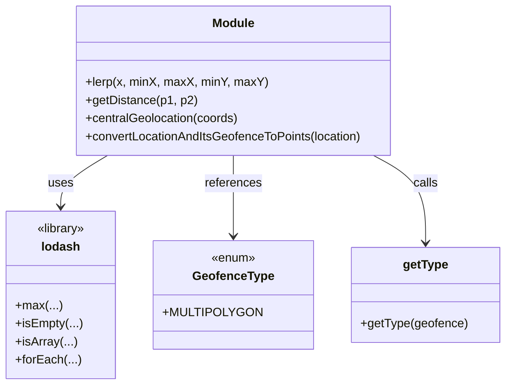

# Diagram: web/portal/src/modules/map/utils/geo.js


> Auto-generated by Obscura crawlers

## Diagram 1



### SVG

<svg id="container" width="646.34375" xmlns="http://www.w3.org/2000/svg" class="classDiagram" height="510" viewBox="0 0 646.34375 510" role="graphics-document document" aria-roledescription="class"><style>#container{font-family:"trebuchet ms",verdana,arial,sans-serif;font-size:16px;fill:#333;}@keyframes edge-animation-frame{from{stroke-dashoffset:0;}}@keyframes dash{to{stroke-dashoffset:0;}}#container .edge-animation-slow{stroke-dasharray:9,5!important;stroke-dashoffset:900;animation:dash 50s linear infinite;stroke-linecap:round;}#container .edge-animation-fast{stroke-dasharray:9,5!important;stroke-dashoffset:900;animation:dash 20s linear infinite;stroke-linecap:round;}#container .error-icon{fill:#552222;}#container .error-text{fill:#552222;stroke:#552222;}#container .edge-thickness-normal{stroke-width:1px;}#container .edge-thickness-thick{stroke-width:3.5px;}#container .edge-pattern-solid{stroke-dasharray:0;}#container .edge-thickness-invisible{stroke-width:0;fill:none;}#container .edge-pattern-dashed{stroke-dasharray:3;}#container .edge-pattern-dotted{stroke-dasharray:2;}#container .marker{fill:#333333;stroke:#333333;}#container .marker.cross{stroke:#333333;}#container svg{font-family:"trebuchet ms",verdana,arial,sans-serif;font-size:16px;}#container p{margin:0;}#container g.classGroup text{fill:#9370DB;stroke:none;font-family:"trebuchet ms",verdana,arial,sans-serif;font-size:10px;}#container g.classGroup text .title{font-weight:bolder;}#container .nodeLabel,#container .edgeLabel{color:#131300;}#container .edgeLabel .label rect{fill:#ECECFF;}#container .label text{fill:#131300;}#container .labelBkg{background:#ECECFF;}#container .edgeLabel .label span{background:#ECECFF;}#container .classTitle{font-weight:bolder;}#container .node rect,#container .node circle,#container .node ellipse,#container .node polygon,#container .node path{fill:#ECECFF;stroke:#9370DB;stroke-width:1px;}#container .divider{stroke:#9370DB;stroke-width:1;}#container g.clickable{cursor:pointer;}#container g.classGroup rect{fill:#ECECFF;stroke:#9370DB;}#container g.classGroup line{stroke:#9370DB;stroke-width:1;}#container .classLabel .box{stroke:none;stroke-width:0;fill:#ECECFF;opacity:0.5;}#container .classLabel .label{fill:#9370DB;font-size:10px;}#container .relation{stroke:#333333;stroke-width:1;fill:none;}#container .dashed-line{stroke-dasharray:3;}#container .dotted-line{stroke-dasharray:1 2;}#container #compositionStart,#container .composition{fill:#333333!important;stroke:#333333!important;stroke-width:1;}#container #compositionEnd,#container .composition{fill:#333333!important;stroke:#333333!important;stroke-width:1;}#container #dependencyStart,#container .dependency{fill:#333333!important;stroke:#333333!important;stroke-width:1;}#container #dependencyStart,#container .dependency{fill:#333333!important;stroke:#333333!important;stroke-width:1;}#container #extensionStart,#container .extension{fill:transparent!important;stroke:#333333!important;stroke-width:1;}#container #extensionEnd,#container .extension{fill:transparent!important;stroke:#333333!important;stroke-width:1;}#container #aggregationStart,#container .aggregation{fill:transparent!important;stroke:#333333!important;stroke-width:1;}#container #aggregationEnd,#container .aggregation{fill:transparent!important;stroke:#333333!important;stroke-width:1;}#container #lollipopStart,#container .lollipop{fill:#ECECFF!important;stroke:#333333!important;stroke-width:1;}#container #lollipopEnd,#container .lollipop{fill:#ECECFF!important;stroke:#333333!important;stroke-width:1;}#container .edgeTerminals{font-size:11px;line-height:initial;}#container .classTitleText{text-anchor:middle;font-size:18px;fill:#333;}#container .label-icon{display:inline-block;height:1em;overflow:visible;vertical-align:-0.125em;}#container .node .label-icon path{fill:currentColor;stroke:revert;stroke-width:revert;}#container :root{--mermaid-font-family:"trebuchet ms",verdana,arial,sans-serif;}</style><g><defs><marker id="container_class-aggregationStart" class="marker aggregation class" refX="18" refY="7" markerWidth="190" markerHeight="240" orient="auto"><path d="M 18,7 L9,13 L1,7 L9,1 Z"></path></marker></defs><defs><marker id="container_class-aggregationEnd" class="marker aggregation class" refX="1" refY="7" markerWidth="20" markerHeight="28" orient="auto"><path d="M 18,7 L9,13 L1,7 L9,1 Z"></path></marker></defs><defs><marker id="container_class-extensionStart" class="marker extension class" refX="18" refY="7" markerWidth="190" markerHeight="240" orient="auto"><path d="M 1,7 L18,13 V 1 Z"></path></marker></defs><defs><marker id="container_class-extensionEnd" class="marker extension class" refX="1" refY="7" markerWidth="20" markerHeight="28" orient="auto"><path d="M 1,1 V 13 L18,7 Z"></path></marker></defs><defs><marker id="container_class-compositionStart" class="marker composition class" refX="18" refY="7" markerWidth="190" markerHeight="240" orient="auto"><path d="M 18,7 L9,13 L1,7 L9,1 Z"></path></marker></defs><defs><marker id="container_class-compositionEnd" class="marker composition class" refX="1" refY="7" markerWidth="20" markerHeight="28" orient="auto"><path d="M 18,7 L9,13 L1,7 L9,1 Z"></path></marker></defs><defs><marker id="container_class-dependencyStart" class="marker dependency class" refX="6" refY="7" markerWidth="190" markerHeight="240" orient="auto"><path d="M 5,7 L9,13 L1,7 L9,1 Z"></path></marker></defs><defs><marker id="container_class-dependencyEnd" class="marker dependency class" refX="13" refY="7" markerWidth="20" markerHeight="28" orient="auto"><path d="M 18,7 L9,13 L14,7 L9,1 Z"></path></marker></defs><defs><marker id="container_class-lollipopStart" class="marker lollipop class" refX="13" refY="7" markerWidth="190" markerHeight="240" orient="auto"><circle stroke="black" fill="transparent" cx="7" cy="7" r="6"></circle></marker></defs><defs><marker id="container_class-lollipopEnd" class="marker lollipop class" refX="1" refY="7" markerWidth="190" markerHeight="240" orient="auto"><circle stroke="black" fill="transparent" cx="7" cy="7" r="6"></circle></marker></defs><g class="root"><g class="clusters"></g><g class="edgePaths"><path d="M139.319,206L129.409,212.167C119.498,218.333,99.677,230.667,89.766,242C79.855,253.333,79.855,263.667,79.855,268.833L79.855,274" id="id_Module_lodash_1" class="edge-thickness-normal edge-pattern-solid relation" style=";;;" data-edge="true" data-et="edge" data-id="id_Module_lodash_1" data-points="W3sieCI6MTM5LjMxOTQ1MDgyNzIwNTg4LCJ5IjoyMDZ9LHsieCI6NzkuODU1NDY4NzUsInkiOjI0M30seyJ4Ijo3OS44NTU0Njg3NSwieSI6MjgwfV0=" marker-end="url(#container_class-dependencyEnd)"></path><path d="M298.426,206L298.426,212.167C298.426,218.333,298.426,230.667,298.426,248.5C298.426,266.333,298.426,289.667,298.426,301.333L298.426,313" id="id_Module_GeofenceType_2" class="edge-thickness-normal edge-pattern-solid relation" style=";;;" data-edge="true" data-et="edge" data-id="id_Module_GeofenceType_2" data-points="W3sieCI6Mjk4LjQyNTc4MTI1LCJ5IjoyMDZ9LHsieCI6Mjk4LjQyNTc4MTI1LCJ5IjoyNDN9LHsieCI6Mjk4LjQyNTc4MTI1LCJ5IjozMTl9XQ==" marker-end="url(#container_class-dependencyEnd)"></path><path d="M475.546,206L486.579,212.167C497.611,218.333,519.677,230.667,530.709,250C541.742,269.333,541.742,295.667,541.742,308.833L541.742,322" id="id_Module_getType_3" class="edge-thickness-normal edge-pattern-solid relation" style=";;;" data-edge="true" data-et="edge" data-id="id_Module_getType_3" data-points="W3sieCI6NDc1LjU0NTgxMjI3MDIyMDYsInkiOjIwNn0seyJ4Ijo1NDEuNzQyMTg3NSwieSI6MjQzfSx7IngiOjU0MS43NDIxODc1LCJ5IjozMjh9XQ==" marker-end="url(#container_class-dependencyEnd)"></path></g><g class="edgeLabels"><g class="edgeLabel" transform="translate(79.85546875, 243)"><g class="label" data-id="id_Module_lodash_1" transform="translate(-16.4921875, -12)"><foreignObject width="32.984375" height="24"><div xmlns="http://www.w3.org/1999/xhtml" class="labelBkg" style="display: table-cell; white-space: nowrap; line-height: 1.5; max-width: 200px; text-align: center;"><span class="edgeLabel"><p>uses</p></span></div></foreignObject></g></g><g class="edgeLabel" transform="translate(298.42578125, 243)"><g class="label" data-id="id_Module_GeofenceType_2" transform="translate(-37.828125, -12)"><foreignObject width="75.65625" height="24"><div xmlns="http://www.w3.org/1999/xhtml" class="labelBkg" style="display: table-cell; white-space: nowrap; line-height: 1.5; max-width: 200px; text-align: center;"><span class="edgeLabel"><p>references</p></span></div></foreignObject></g></g><g class="edgeLabel" transform="translate(541.7421875, 243)"><g class="label" data-id="id_Module_getType_3" transform="translate(-16.4453125, -12)"><foreignObject width="32.890625" height="24"><div xmlns="http://www.w3.org/1999/xhtml" class="labelBkg" style="display: table-cell; white-space: nowrap; line-height: 1.5; max-width: 200px; text-align: center;"><span class="edgeLabel"><p>calls</p></span></div></foreignObject></g></g></g><g class="nodes"><g class="node default" id="classId-Module-0" transform="translate(298.42578125, 107)"><g class="basic label-container"><path d="M-210.375 -99 L210.375 -99 L210.375 99 L-210.375 99" stroke="none" stroke-width="0" fill="#ECECFF" style=""></path><path d="M-210.375 -99 C-59.71043870887601 -99, 90.95412258224798 -99, 210.375 -99 M-210.375 -99 C-119.76768848957316 -99, -29.16037697914632 -99, 210.375 -99 M210.375 -99 C210.375 -31.18530189937063, 210.375 36.62939620125874, 210.375 99 M210.375 -99 C210.375 -41.56770609584677, 210.375 15.864587808306453, 210.375 99 M210.375 99 C69.10304685939238 99, -72.16890628121524 99, -210.375 99 M210.375 99 C100.17321078005791 99, -10.028578439884171 99, -210.375 99 M-210.375 99 C-210.375 58.147173052998085, -210.375 17.29434610599617, -210.375 -99 M-210.375 99 C-210.375 44.19354290533821, -210.375 -10.612914189323575, -210.375 -99" stroke="#9370DB" stroke-width="1.3" fill="none" stroke-dasharray="0 0" style=""></path></g><g class="annotation-group text" transform="translate(0, -75)"></g><g class="label-group text" transform="translate(-27.09375, -75)"><g class="label" style="font-weight: bolder" transform="translate(0,-12)"><foreignObject width="54.1875" height="24"><div xmlns="http://www.w3.org/1999/xhtml" style="display: table-cell; white-space: nowrap; line-height: 1.5; max-width: 104px; text-align: center;"><span class="nodeLabel markdown-node-label" style=""><p>Module</p></span></div></foreignObject></g></g><g class="members-group text" transform="translate(-198.375, -27)"></g><g class="methods-group text" transform="translate(-198.375, 3)"><g class="label" style="" transform="translate(0,-12)"><foreignObject width="235.875" height="24"><div xmlns="http://www.w3.org/1999/xhtml" style="display: table-cell; white-space: nowrap; line-height: 1.5; max-width: 293px; text-align: center;"><span class="nodeLabel markdown-node-label" style=""><p>+lerp(x, minX, maxX, minY, maxY)</p></span></div></foreignObject></g><g class="label" style="" transform="translate(0,12)"><foreignObject width="143.8125" height="24"><div xmlns="http://www.w3.org/1999/xhtml" style="display: table-cell; white-space: nowrap; line-height: 1.5; max-width: 201px; text-align: center;"><span class="nodeLabel markdown-node-label" style=""><p>+getDistance(p1, p2)</p></span></div></foreignObject></g><g class="label" style="" transform="translate(0,36)"><foreignObject width="204.46875" height="24"><div xmlns="http://www.w3.org/1999/xhtml" style="display: table-cell; white-space: nowrap; line-height: 1.5; max-width: 262px; text-align: center;"><span class="nodeLabel markdown-node-label" style=""><p>+centralGeolocation(coords)</p></span></div></foreignObject></g><g class="label" style="" transform="translate(0,60)"><foreignObject width="369.65625" height="24"><div xmlns="http://www.w3.org/1999/xhtml" style="display: table-cell; white-space: nowrap; line-height: 1.5; max-width: 427px; text-align: center;"><span class="nodeLabel markdown-node-label" style=""><p>+convertLocationAndItsGeofenceToPoints(location)</p></span></div></foreignObject></g></g><g class="divider" style=""><path d="M-210.375 -51 C-120.87397133348286 -51, -31.372942666965713 -51, 210.375 -51 M-210.375 -51 C-123.33772582008324 -51, -36.30045164016647 -51, 210.375 -51" stroke="#9370DB" stroke-width="1.3" fill="none" stroke-dasharray="0 0" style=""></path></g><g class="divider" style=""><path d="M-210.375 -27 C-112.21749717406678 -27, -14.059994348133557 -27, 210.375 -27 M-210.375 -27 C-64.49391681372512 -27, 81.38716637254976 -27, 210.375 -27" stroke="#9370DB" stroke-width="1.3" fill="none" stroke-dasharray="0 0" style=""></path></g></g><g class="node default" id="classId-lodash-1" transform="translate(79.85546875, 391)"><g class="basic label-container"><path d="M-71.85546875 -111 L71.85546875 -111 L71.85546875 111 L-71.85546875 111" stroke="none" stroke-width="0" fill="#ECECFF" style=""></path><path d="M-71.85546875 -111 C-26.75427143222086 -111, 18.346925885558278 -111, 71.85546875 -111 M-71.85546875 -111 C-39.87444413278466 -111, -7.893419515569313 -111, 71.85546875 -111 M71.85546875 -111 C71.85546875 -32.81193394688363, 71.85546875 45.376132106232745, 71.85546875 111 M71.85546875 -111 C71.85546875 -29.30753907998171, 71.85546875 52.38492184003658, 71.85546875 111 M71.85546875 111 C23.911185786623797 111, -24.033097176752406 111, -71.85546875 111 M71.85546875 111 C17.3992989123795 111, -37.056870925241 111, -71.85546875 111 M-71.85546875 111 C-71.85546875 30.7059752721957, -71.85546875 -49.5880494556086, -71.85546875 -111 M-71.85546875 111 C-71.85546875 39.44429054404513, -71.85546875 -32.11141891190974, -71.85546875 -111" stroke="#9370DB" stroke-width="1.3" fill="none" stroke-dasharray="0 0" style=""></path></g><g class="annotation-group text" transform="translate(-32.6640625, -87)"><g class="label" style="" transform="translate(0,-12)"><foreignObject width="65.328125" height="24"><div xmlns="http://www.w3.org/1999/xhtml" style="display: table-cell; white-space: nowrap; line-height: 1.5; max-width: 115px; text-align: center;"><span class="nodeLabel markdown-node-label" style=""><p>«library»</p></span></div></foreignObject></g></g><g class="label-group text" transform="translate(-24.59375, -63)"><g class="label" style="font-weight: bolder" transform="translate(0,-12)"><foreignObject width="49.1875" height="24"><div xmlns="http://www.w3.org/1999/xhtml" style="display: table-cell; white-space: nowrap; line-height: 1.5; max-width: 99px; text-align: center;"><span class="nodeLabel markdown-node-label" style=""><p>lodash</p></span></div></foreignObject></g></g><g class="members-group text" transform="translate(-59.85546875, -15)"></g><g class="methods-group text" transform="translate(-59.85546875, 15)"><g class="label" style="" transform="translate(0,-12)"><foreignObject width="60.0625" height="24"><div xmlns="http://www.w3.org/1999/xhtml" style="display: table-cell; white-space: nowrap; line-height: 1.5; max-width: 117px; text-align: center;"><span class="nodeLabel markdown-node-label" style=""><p>+max(...)</p></span></div></foreignObject></g><g class="label" style="" transform="translate(0,12)"><foreignObject width="87.046875" height="24"><div xmlns="http://www.w3.org/1999/xhtml" style="display: table-cell; white-space: nowrap; line-height: 1.5; max-width: 144px; text-align: center;"><span class="nodeLabel markdown-node-label" style=""><p>+isEmpty(...)</p></span></div></foreignObject></g><g class="label" style="" transform="translate(0,36)"><foreignObject width="79.15625" height="24"><div xmlns="http://www.w3.org/1999/xhtml" style="display: table-cell; white-space: nowrap; line-height: 1.5; max-width: 137px; text-align: center;"><span class="nodeLabel markdown-node-label" style=""><p>+isArray(...)</p></span></div></foreignObject></g><g class="label" style="" transform="translate(0,60)"><foreignObject width="84.453125" height="24"><div xmlns="http://www.w3.org/1999/xhtml" style="display: table-cell; white-space: nowrap; line-height: 1.5; max-width: 142px; text-align: center;"><span class="nodeLabel markdown-node-label" style=""><p>+forEach(...)</p></span></div></foreignObject></g></g><g class="divider" style=""><path d="M-71.85546875 -39 C-15.32661712592509 -39, 41.20223449814982 -39, 71.85546875 -39 M-71.85546875 -39 C-31.389757428885645 -39, 9.07595389222871 -39, 71.85546875 -39" stroke="#9370DB" stroke-width="1.3" fill="none" stroke-dasharray="0 0" style=""></path></g><g class="divider" style=""><path d="M-71.85546875 -15 C-26.834330482408532 -15, 18.186807785182936 -15, 71.85546875 -15 M-71.85546875 -15 C-38.00762524587008 -15, -4.1597817417401615 -15, 71.85546875 -15" stroke="#9370DB" stroke-width="1.3" fill="none" stroke-dasharray="0 0" style=""></path></g></g><g class="node default" id="classId-GeofenceType-2" transform="translate(298.42578125, 391)"><g class="basic label-container"><path d="M-96.71484375 -72 L96.71484375 -72 L96.71484375 72 L-96.71484375 72" stroke="none" stroke-width="0" fill="#ECECFF" style=""></path><path d="M-96.71484375 -72 C-54.000752438379735 -72, -11.28666112675947 -72, 96.71484375 -72 M-96.71484375 -72 C-24.954653985531905 -72, 46.80553577893619 -72, 96.71484375 -72 M96.71484375 -72 C96.71484375 -23.457372907876305, 96.71484375 25.08525418424739, 96.71484375 72 M96.71484375 -72 C96.71484375 -21.557070174710155, 96.71484375 28.88585965057969, 96.71484375 72 M96.71484375 72 C53.106045317467135 72, 9.49724688493427 72, -96.71484375 72 M96.71484375 72 C48.99516872448977 72, 1.2754936989795453 72, -96.71484375 72 M-96.71484375 72 C-96.71484375 23.900902877913182, -96.71484375 -24.198194244173635, -96.71484375 -72 M-96.71484375 72 C-96.71484375 30.074331242875743, -96.71484375 -11.851337514248513, -96.71484375 -72" stroke="#9370DB" stroke-width="1.3" fill="none" stroke-dasharray="0 0" style=""></path></g><g class="annotation-group text" transform="translate(-29.53125, -48)"><g class="label" style="" transform="translate(0,-12)"><foreignObject width="59.0625" height="24"><div xmlns="http://www.w3.org/1999/xhtml" style="display: table-cell; white-space: nowrap; line-height: 1.5; max-width: 109px; text-align: center;"><span class="nodeLabel markdown-node-label" style=""><p>«enum»</p></span></div></foreignObject></g></g><g class="label-group text" transform="translate(-51.4765625, -24)"><g class="label" style="font-weight: bolder" transform="translate(0,-12)"><foreignObject width="102.953125" height="24"><div xmlns="http://www.w3.org/1999/xhtml" style="display: table-cell; white-space: nowrap; line-height: 1.5; max-width: 151px; text-align: center;"><span class="nodeLabel markdown-node-label" style=""><p>GeofenceType</p></span></div></foreignObject></g></g><g class="members-group text" transform="translate(-84.71484375, 24)"><g class="label" style="" transform="translate(0,-12)"><foreignObject width="117.953125" height="24"><div xmlns="http://www.w3.org/1999/xhtml" style="display: table-cell; white-space: nowrap; line-height: 1.5; max-width: 175px; text-align: center;"><span class="nodeLabel markdown-node-label" style=""><p>+MULTIPOLYGON</p></span></div></foreignObject></g></g><g class="methods-group text" transform="translate(-84.71484375, 72)"></g><g class="divider" style=""><path d="M-96.71484375 0 C-39.995637550879245 0, 16.72356864824151 0, 96.71484375 0 M-96.71484375 0 C-23.89493979462756 0, 48.92496416074488 0, 96.71484375 0" stroke="#9370DB" stroke-width="1.3" fill="none" stroke-dasharray="0 0" style=""></path></g><g class="divider" style=""><path d="M-96.71484375 48 C-35.229318095999915 48, 26.25620755800017 48, 96.71484375 48 M-96.71484375 48 C-34.367050166284855 48, 27.98074341743029 48, 96.71484375 48" stroke="#9370DB" stroke-width="1.3" fill="none" stroke-dasharray="0 0" style=""></path></g></g><g class="node default" id="classId-getType-3" transform="translate(541.7421875, 391)"><g class="basic label-container"><path d="M-96.6015625 -63 L96.6015625 -63 L96.6015625 63 L-96.6015625 63" stroke="none" stroke-width="0" fill="#ECECFF" style=""></path><path d="M-96.6015625 -63 C-50.33972689985648 -63, -4.0778912997129595 -63, 96.6015625 -63 M-96.6015625 -63 C-49.27511769568738 -63, -1.9486728913747555 -63, 96.6015625 -63 M96.6015625 -63 C96.6015625 -22.18984696075877, 96.6015625 18.620306078482457, 96.6015625 63 M96.6015625 -63 C96.6015625 -16.335605372979714, 96.6015625 30.328789254040572, 96.6015625 63 M96.6015625 63 C37.119059500758944 63, -22.363443498482113 63, -96.6015625 63 M96.6015625 63 C46.088220619887664 63, -4.425121260224671 63, -96.6015625 63 M-96.6015625 63 C-96.6015625 35.370793295391636, -96.6015625 7.741586590783278, -96.6015625 -63 M-96.6015625 63 C-96.6015625 16.67981368524181, -96.6015625 -29.640372629516378, -96.6015625 -63" stroke="#9370DB" stroke-width="1.3" fill="none" stroke-dasharray="0 0" style=""></path></g><g class="annotation-group text" transform="translate(0, -39)"></g><g class="label-group text" transform="translate(-29.078125, -39)"><g class="label" style="font-weight: bolder" transform="translate(0,-12)"><foreignObject width="58.15625" height="24"><div xmlns="http://www.w3.org/1999/xhtml" style="display: table-cell; white-space: nowrap; line-height: 1.5; max-width: 106px; text-align: center;"><span class="nodeLabel markdown-node-label" style=""><p>getType</p></span></div></foreignObject></g></g><g class="members-group text" transform="translate(-84.6015625, 9)"></g><g class="methods-group text" transform="translate(-84.6015625, 39)"><g class="label" style="" transform="translate(0,-12)"><foreignObject width="140.125" height="24"><div xmlns="http://www.w3.org/1999/xhtml" style="display: table-cell; white-space: nowrap; line-height: 1.5; max-width: 197px; text-align: center;"><span class="nodeLabel markdown-node-label" style=""><p>+getType(geofence)</p></span></div></foreignObject></g></g><g class="divider" style=""><path d="M-96.6015625 -15 C-20.669633153690256 -15, 55.26229619261949 -15, 96.6015625 -15 M-96.6015625 -15 C-24.436176561218787 -15, 47.72920937756243 -15, 96.6015625 -15" stroke="#9370DB" stroke-width="1.3" fill="none" stroke-dasharray="0 0" style=""></path></g><g class="divider" style=""><path d="M-96.6015625 9 C-31.331430296185417 9, 33.93870190762917 9, 96.6015625 9 M-96.6015625 9 C-46.110980245882686 9, 4.379602008234627 9, 96.6015625 9" stroke="#9370DB" stroke-width="1.3" fill="none" stroke-dasharray="0 0" style=""></path></g></g></g></g></g></svg>

## Diagram 2

```mermaid
flowchart TD
    A[convertLocationAndItsGeofenceToPoints(location)] --> B{getType(location.geofence)}
    B -->|MULTIPOLYGON| C[forEach polygon -> push polygon.geometry.coordinates to allGeofencePoints]
    B -->|other| D[extractGeopointsRecursively(location.geofence.geometry.coordinates)]
    D --> E{array empty?}
    E -->|yes| F[return []]
    E -->|first element is array| D
    E -->|primitive coords| G[return [{longitude, latitude}]]
    C --> H[allGeofencePoints collected]
    G --> H
    H --> I[validGeofencePoints = filter points with longitude & latitude]
    H --> J{geofence.properties.center has lat & lon?}
    J -->|yes| K[push center as validGeofencePoint]
    J -->|no| L[skip center]
    K --> I
    L --> I
    I --> M[return [...validGeofencePoints]]
```

> SVG rendering failed for this diagram.
