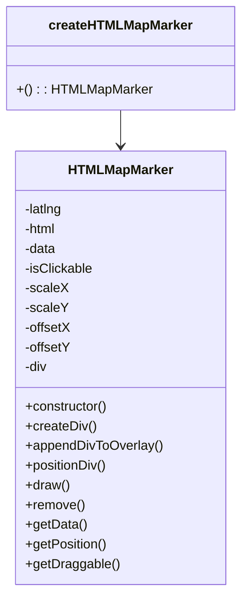

# Diagram: web/portal/src/modules/map/widgets/HTMLMapMarker.js


> Auto-generated by Obscura crawlers

## Diagram 1



### SVG

<svg id="container" width="282.7265625" xmlns="http://www.w3.org/2000/svg" class="classDiagram" height="720" viewBox="0 0 282.7265625 720" role="graphics-document document" aria-roledescription="class"><style>#container{font-family:"trebuchet ms",verdana,arial,sans-serif;font-size:16px;fill:#333;}@keyframes edge-animation-frame{from{stroke-dashoffset:0;}}@keyframes dash{to{stroke-dashoffset:0;}}#container .edge-animation-slow{stroke-dasharray:9,5!important;stroke-dashoffset:900;animation:dash 50s linear infinite;stroke-linecap:round;}#container .edge-animation-fast{stroke-dasharray:9,5!important;stroke-dashoffset:900;animation:dash 20s linear infinite;stroke-linecap:round;}#container .error-icon{fill:#552222;}#container .error-text{fill:#552222;stroke:#552222;}#container .edge-thickness-normal{stroke-width:1px;}#container .edge-thickness-thick{stroke-width:3.5px;}#container .edge-pattern-solid{stroke-dasharray:0;}#container .edge-thickness-invisible{stroke-width:0;fill:none;}#container .edge-pattern-dashed{stroke-dasharray:3;}#container .edge-pattern-dotted{stroke-dasharray:2;}#container .marker{fill:#333333;stroke:#333333;}#container .marker.cross{stroke:#333333;}#container svg{font-family:"trebuchet ms",verdana,arial,sans-serif;font-size:16px;}#container p{margin:0;}#container g.classGroup text{fill:#9370DB;stroke:none;font-family:"trebuchet ms",verdana,arial,sans-serif;font-size:10px;}#container g.classGroup text .title{font-weight:bolder;}#container .nodeLabel,#container .edgeLabel{color:#131300;}#container .edgeLabel .label rect{fill:#ECECFF;}#container .label text{fill:#131300;}#container .labelBkg{background:#ECECFF;}#container .edgeLabel .label span{background:#ECECFF;}#container .classTitle{font-weight:bolder;}#container .node rect,#container .node circle,#container .node ellipse,#container .node polygon,#container .node path{fill:#ECECFF;stroke:#9370DB;stroke-width:1px;}#container .divider{stroke:#9370DB;stroke-width:1;}#container g.clickable{cursor:pointer;}#container g.classGroup rect{fill:#ECECFF;stroke:#9370DB;}#container g.classGroup line{stroke:#9370DB;stroke-width:1;}#container .classLabel .box{stroke:none;stroke-width:0;fill:#ECECFF;opacity:0.5;}#container .classLabel .label{fill:#9370DB;font-size:10px;}#container .relation{stroke:#333333;stroke-width:1;fill:none;}#container .dashed-line{stroke-dasharray:3;}#container .dotted-line{stroke-dasharray:1 2;}#container #compositionStart,#container .composition{fill:#333333!important;stroke:#333333!important;stroke-width:1;}#container #compositionEnd,#container .composition{fill:#333333!important;stroke:#333333!important;stroke-width:1;}#container #dependencyStart,#container .dependency{fill:#333333!important;stroke:#333333!important;stroke-width:1;}#container #dependencyStart,#container .dependency{fill:#333333!important;stroke:#333333!important;stroke-width:1;}#container #extensionStart,#container .extension{fill:transparent!important;stroke:#333333!important;stroke-width:1;}#container #extensionEnd,#container .extension{fill:transparent!important;stroke:#333333!important;stroke-width:1;}#container #aggregationStart,#container .aggregation{fill:transparent!important;stroke:#333333!important;stroke-width:1;}#container #aggregationEnd,#container .aggregation{fill:transparent!important;stroke:#333333!important;stroke-width:1;}#container #lollipopStart,#container .lollipop{fill:#ECECFF!important;stroke:#333333!important;stroke-width:1;}#container #lollipopEnd,#container .lollipop{fill:#ECECFF!important;stroke:#333333!important;stroke-width:1;}#container .edgeTerminals{font-size:11px;line-height:initial;}#container .classTitleText{text-anchor:middle;font-size:18px;fill:#333;}#container .label-icon{display:inline-block;height:1em;overflow:visible;vertical-align:-0.125em;}#container .node .label-icon path{fill:currentColor;stroke:revert;stroke-width:revert;}#container :root{--mermaid-font-family:"trebuchet ms",verdana,arial,sans-serif;}</style><g><defs><marker id="container_class-aggregationStart" class="marker aggregation class" refX="18" refY="7" markerWidth="190" markerHeight="240" orient="auto"><path d="M 18,7 L9,13 L1,7 L9,1 Z"></path></marker></defs><defs><marker id="container_class-aggregationEnd" class="marker aggregation class" refX="1" refY="7" markerWidth="20" markerHeight="28" orient="auto"><path d="M 18,7 L9,13 L1,7 L9,1 Z"></path></marker></defs><defs><marker id="container_class-extensionStart" class="marker extension class" refX="18" refY="7" markerWidth="190" markerHeight="240" orient="auto"><path d="M 1,7 L18,13 V 1 Z"></path></marker></defs><defs><marker id="container_class-extensionEnd" class="marker extension class" refX="1" refY="7" markerWidth="20" markerHeight="28" orient="auto"><path d="M 1,1 V 13 L18,7 Z"></path></marker></defs><defs><marker id="container_class-compositionStart" class="marker composition class" refX="18" refY="7" markerWidth="190" markerHeight="240" orient="auto"><path d="M 18,7 L9,13 L1,7 L9,1 Z"></path></marker></defs><defs><marker id="container_class-compositionEnd" class="marker composition class" refX="1" refY="7" markerWidth="20" markerHeight="28" orient="auto"><path d="M 18,7 L9,13 L1,7 L9,1 Z"></path></marker></defs><defs><marker id="container_class-dependencyStart" class="marker dependency class" refX="6" refY="7" markerWidth="190" markerHeight="240" orient="auto"><path d="M 5,7 L9,13 L1,7 L9,1 Z"></path></marker></defs><defs><marker id="container_class-dependencyEnd" class="marker dependency class" refX="13" refY="7" markerWidth="20" markerHeight="28" orient="auto"><path d="M 18,7 L9,13 L14,7 L9,1 Z"></path></marker></defs><defs><marker id="container_class-lollipopStart" class="marker lollipop class" refX="13" refY="7" markerWidth="190" markerHeight="240" orient="auto"><circle stroke="black" fill="transparent" cx="7" cy="7" r="6"></circle></marker></defs><defs><marker id="container_class-lollipopEnd" class="marker lollipop class" refX="1" refY="7" markerWidth="190" markerHeight="240" orient="auto"><circle stroke="black" fill="transparent" cx="7" cy="7" r="6"></circle></marker></defs><g class="root"><g class="clusters"></g><g class="edgePaths"><path d="M141.363,134L141.363,138.167C141.363,142.333,141.363,150.667,141.363,158C141.363,165.333,141.363,171.667,141.363,174.833L141.363,178" id="id_createHTMLMapMarker_HTMLMapMarker_1" class="edge-thickness-normal edge-pattern-solid relation" style=";;;" data-edge="true" data-et="edge" data-id="id_createHTMLMapMarker_HTMLMapMarker_1" data-points="W3sieCI6MTQxLjM2MzI4MTI1LCJ5IjoxMzR9LHsieCI6MTQxLjM2MzI4MTI1LCJ5IjoxNTl9LHsieCI6MTQxLjM2MzI4MTI1LCJ5IjoxODR9XQ==" marker-end="url(#container_class-dependencyEnd)"></path></g><g class="edgeLabels"><g class="edgeLabel"><g class="label" data-id="id_createHTMLMapMarker_HTMLMapMarker_1" transform="translate(0, 0)"><foreignObject width="0" height="0"><div xmlns="http://www.w3.org/1999/xhtml" class="labelBkg" style="display: table-cell; white-space: nowrap; line-height: 1.5; max-width: 200px; text-align: center;"><span class="edgeLabel"></span></div></foreignObject></g></g></g><g class="nodes"><g class="node default" id="classId-createHTMLMapMarker-0" transform="translate(141.36328125, 71)"><g class="basic label-container"><path d="M-133.36328125 -63 L133.36328125 -63 L133.36328125 63 L-133.36328125 63" stroke="none" stroke-width="0" fill="#ECECFF" style=""></path><path d="M-133.36328125 -63 C-60.60926078716294 -63, 12.144759675674123 -63, 133.36328125 -63 M-133.36328125 -63 C-40.41498769335192 -63, 52.533305863296164 -63, 133.36328125 -63 M133.36328125 -63 C133.36328125 -18.529182201315358, 133.36328125 25.941635597369284, 133.36328125 63 M133.36328125 -63 C133.36328125 -28.38146730991003, 133.36328125 6.237065380179942, 133.36328125 63 M133.36328125 63 C40.28015030024031 63, -52.802980649519384 63, -133.36328125 63 M133.36328125 63 C40.27487692820743 63, -52.81352739358513 63, -133.36328125 63 M-133.36328125 63 C-133.36328125 23.069776492085367, -133.36328125 -16.860447015829266, -133.36328125 -63 M-133.36328125 63 C-133.36328125 29.432008656957265, -133.36328125 -4.13598268608547, -133.36328125 -63" stroke="#9370DB" stroke-width="1.3" fill="none" stroke-dasharray="0 0" style=""></path></g><g class="annotation-group text" transform="translate(0, -39)"></g><g class="label-group text" transform="translate(-83.9453125, -39)"><g class="label" style="font-weight: bolder" transform="translate(0,-12)"><foreignObject width="167.890625" height="24"><div xmlns="http://www.w3.org/1999/xhtml" style="display: table-cell; white-space: nowrap; line-height: 1.5; max-width: 216px; text-align: center;"><span class="nodeLabel markdown-node-label" style=""><p>createHTMLMapMarker</p></span></div></foreignObject></g></g><g class="members-group text" transform="translate(-121.36328125, 9)"></g><g class="methods-group text" transform="translate(-121.36328125, 39)"><g class="label" style="" transform="translate(0,-12)"><foreignObject width="158.78125" height="24"><div xmlns="http://www.w3.org/1999/xhtml" style="display: table-cell; white-space: nowrap; line-height: 1.5; max-width: 210px; text-align: center;"><span class="nodeLabel markdown-node-label" style=""><p>+() : : HTMLMapMarker</p></span></div></foreignObject></g></g><g class="divider" style=""><path d="M-133.36328125 -15 C-72.19011097843068 -15, -11.016940706861376 -15, 133.36328125 -15 M-133.36328125 -15 C-28.2505020949379 -15, 76.8622770601242 -15, 133.36328125 -15" stroke="#9370DB" stroke-width="1.3" fill="none" stroke-dasharray="0 0" style=""></path></g><g class="divider" style=""><path d="M-133.36328125 9 C-31.694335535968776 9, 69.97461017806245 9, 133.36328125 9 M-133.36328125 9 C-76.3385994162191 9, -19.31391758243818 9, 133.36328125 9" stroke="#9370DB" stroke-width="1.3" fill="none" stroke-dasharray="0 0" style=""></path></g></g><g class="node default" id="classId-HTMLMapMarker-1" transform="translate(141.36328125, 448)"><g class="basic label-container"><path d="M-126.35546875 -264 L126.35546875 -264 L126.35546875 264 L-126.35546875 264" stroke="none" stroke-width="0" fill="#ECECFF" style=""></path><path d="M-126.35546875 -264 C-70.96561168656895 -264, -15.575754623137897 -264, 126.35546875 -264 M-126.35546875 -264 C-54.99766244174063 -264, 16.36014386651874 -264, 126.35546875 -264 M126.35546875 -264 C126.35546875 -101.50611145025661, 126.35546875 60.98777709948678, 126.35546875 264 M126.35546875 -264 C126.35546875 -129.7111978164032, 126.35546875 4.577604367193601, 126.35546875 264 M126.35546875 264 C70.51733742713773 264, 14.679206104275451 264, -126.35546875 264 M126.35546875 264 C28.27932780852339 264, -69.79681313295322 264, -126.35546875 264 M-126.35546875 264 C-126.35546875 103.32402716563442, -126.35546875 -57.35194566873116, -126.35546875 -264 M-126.35546875 264 C-126.35546875 155.80637459429843, -126.35546875 47.612749188596865, -126.35546875 -264" stroke="#9370DB" stroke-width="1.3" fill="none" stroke-dasharray="0 0" style=""></path></g><g class="annotation-group text" transform="translate(0, -240)"></g><g class="label-group text" transform="translate(-61.0703125, -240)"><g class="label" style="font-weight: bolder" transform="translate(0,-12)"><foreignObject width="122.140625" height="24"><div xmlns="http://www.w3.org/1999/xhtml" style="display: table-cell; white-space: nowrap; line-height: 1.5; max-width: 171px; text-align: center;"><span class="nodeLabel markdown-node-label" style=""><p>HTMLMapMarker</p></span></div></foreignObject></g></g><g class="members-group text" transform="translate(-114.35546875, -192)"><g class="label" style="" transform="translate(0,-12)"><foreignObject width="47.765625" height="24"><div xmlns="http://www.w3.org/1999/xhtml" style="display: table-cell; white-space: nowrap; line-height: 1.5; max-width: 106px; text-align: center;"><span class="nodeLabel markdown-node-label" style=""><p>-latlng</p></span></div></foreignObject></g><g class="label" style="" transform="translate(0,12)"><foreignObject width="40.015625" height="24"><div xmlns="http://www.w3.org/1999/xhtml" style="display: table-cell; white-space: nowrap; line-height: 1.5; max-width: 98px; text-align: center;"><span class="nodeLabel markdown-node-label" style=""><p>-html</p></span></div></foreignObject></g><g class="label" style="" transform="translate(0,36)"><foreignObject width="39.09375" height="24"><div xmlns="http://www.w3.org/1999/xhtml" style="display: table-cell; white-space: nowrap; line-height: 1.5; max-width: 96px; text-align: center;"><span class="nodeLabel markdown-node-label" style=""><p>-data</p></span></div></foreignObject></g><g class="label" style="" transform="translate(0,60)"><foreignObject width="83.578125" height="24"><div xmlns="http://www.w3.org/1999/xhtml" style="display: table-cell; white-space: nowrap; line-height: 1.5; max-width: 141px; text-align: center;"><span class="nodeLabel markdown-node-label" style=""><p>-isClickable</p></span></div></foreignObject></g><g class="label" style="" transform="translate(0,84)"><foreignObject width="51.921875" height="24"><div xmlns="http://www.w3.org/1999/xhtml" style="display: table-cell; white-space: nowrap; line-height: 1.5; max-width: 110px; text-align: center;"><span class="nodeLabel markdown-node-label" style=""><p>-scaleX</p></span></div></foreignObject></g><g class="label" style="" transform="translate(0,108)"><foreignObject width="52.09375" height="24"><div xmlns="http://www.w3.org/1999/xhtml" style="display: table-cell; white-space: nowrap; line-height: 1.5; max-width: 110px; text-align: center;"><span class="nodeLabel markdown-node-label" style=""><p>-scaleY</p></span></div></foreignObject></g><g class="label" style="" transform="translate(0,132)"><foreignObject width="57.046875" height="24"><div xmlns="http://www.w3.org/1999/xhtml" style="display: table-cell; white-space: nowrap; line-height: 1.5; max-width: 115px; text-align: center;"><span class="nodeLabel markdown-node-label" style=""><p>-offsetX</p></span></div></foreignObject></g><g class="label" style="" transform="translate(0,156)"><foreignObject width="57.203125" height="24"><div xmlns="http://www.w3.org/1999/xhtml" style="display: table-cell; white-space: nowrap; line-height: 1.5; max-width: 115px; text-align: center;"><span class="nodeLabel markdown-node-label" style=""><p>-offsetY</p></span></div></foreignObject></g><g class="label" style="" transform="translate(0,180)"><foreignObject width="28.40625" height="24"><div xmlns="http://www.w3.org/1999/xhtml" style="display: table-cell; white-space: nowrap; line-height: 1.5; max-width: 86px; text-align: center;"><span class="nodeLabel markdown-node-label" style=""><p>-div</p></span></div></foreignObject></g></g><g class="methods-group text" transform="translate(-114.35546875, 48)"><g class="label" style="" transform="translate(0,-12)"><foreignObject width="101.84375" height="24"><div xmlns="http://www.w3.org/1999/xhtml" style="display: table-cell; white-space: nowrap; line-height: 1.5; max-width: 159px; text-align: center;"><span class="nodeLabel markdown-node-label" style=""><p>+constructor()</p></span></div></foreignObject></g><g class="label" style="" transform="translate(0,12)"><foreignObject width="85.90625" height="24"><div xmlns="http://www.w3.org/1999/xhtml" style="display: table-cell; white-space: nowrap; line-height: 1.5; max-width: 143px; text-align: center;"><span class="nodeLabel markdown-node-label" style=""><p>+createDiv()</p></span></div></foreignObject></g><g class="label" style="" transform="translate(0,36)"><foreignObject width="167.640625" height="24"><div xmlns="http://www.w3.org/1999/xhtml" style="display: table-cell; white-space: nowrap; line-height: 1.5; max-width: 225px; text-align: center;"><span class="nodeLabel markdown-node-label" style=""><p>+appendDivToOverlay()</p></span></div></foreignObject></g><g class="label" style="" transform="translate(0,60)"><foreignObject width="100.890625" height="24"><div xmlns="http://www.w3.org/1999/xhtml" style="display: table-cell; white-space: nowrap; line-height: 1.5; max-width: 158px; text-align: center;"><span class="nodeLabel markdown-node-label" style=""><p>+positionDiv()</p></span></div></foreignObject></g><g class="label" style="" transform="translate(0,84)"><foreignObject width="53.640625" height="24"><div xmlns="http://www.w3.org/1999/xhtml" style="display: table-cell; white-space: nowrap; line-height: 1.5; max-width: 111px; text-align: center;"><span class="nodeLabel markdown-node-label" style=""><p>+draw()</p></span></div></foreignObject></g><g class="label" style="" transform="translate(0,108)"><foreignObject width="72.296875" height="24"><div xmlns="http://www.w3.org/1999/xhtml" style="display: table-cell; white-space: nowrap; line-height: 1.5; max-width: 130px; text-align: center;"><span class="nodeLabel markdown-node-label" style=""><p>+remove()</p></span></div></foreignObject></g><g class="label" style="" transform="translate(0,132)"><foreignObject width="74.140625" height="24"><div xmlns="http://www.w3.org/1999/xhtml" style="display: table-cell; white-space: nowrap; line-height: 1.5; max-width: 132px; text-align: center;"><span class="nodeLabel markdown-node-label" style=""><p>+getData()</p></span></div></foreignObject></g><g class="label" style="" transform="translate(0,156)"><foreignObject width="100.078125" height="24"><div xmlns="http://www.w3.org/1999/xhtml" style="display: table-cell; white-space: nowrap; line-height: 1.5; max-width: 157px; text-align: center;"><span class="nodeLabel markdown-node-label" style=""><p>+getPosition()</p></span></div></foreignObject></g><g class="label" style="" transform="translate(0,180)"><foreignObject width="113.25" height="24"><div xmlns="http://www.w3.org/1999/xhtml" style="display: table-cell; white-space: nowrap; line-height: 1.5; max-width: 171px; text-align: center;"><span class="nodeLabel markdown-node-label" style=""><p>+getDraggable()</p></span></div></foreignObject></g></g><g class="divider" style=""><path d="M-126.35546875 -216 C-35.20779167977781 -216, 55.939885390444374 -216, 126.35546875 -216 M-126.35546875 -216 C-46.132298761253 -216, 34.090871227494006 -216, 126.35546875 -216" stroke="#9370DB" stroke-width="1.3" fill="none" stroke-dasharray="0 0" style=""></path></g><g class="divider" style=""><path d="M-126.35546875 24 C-34.72803741742176 24, 56.89939391515648 24, 126.35546875 24 M-126.35546875 24 C-39.18200211586337 24, 47.99146451827326 24, 126.35546875 24" stroke="#9370DB" stroke-width="1.3" fill="none" stroke-dasharray="0 0" style=""></path></g></g></g></g></g></svg>

## Diagram 2

```mermaid
flowchart TD
    A[createHTMLMapMarker(args)] --> B[HTMLMapMarker.constructor()]
    B --> C{offsetX/offsetY undefined?}
    C -->|yes| D[set offsetX/offsetY = 0]
    C -->|no| E[leave offsets]
    D --> F[setMap(args.map)]
    E --> F
    F --> G[draw()]
    G --> H{div exists?}
    H -->|no| I[createDiv()]
    I --> J[attach event listeners (click, mouseover, mouseout)]
    J --> K[appendDivToOverlay()]
    K --> L[positionDiv()]
    H -->|yes| L
    L --> M[end]
    subgraph Removal
        R[remove()] --> S[if div -> remove from parent and div = null]
    end
    click_event[div click] -->|trigger| ClickHandler((trigger "click" on marker))
    mouseover_event[div mouseover] -->|trigger| MouseOverHandler((trigger "mouseover" on marker))
    mouseout_event[div mouseout] -->|trigger| MouseOutHandler((trigger "mouseout" on marker))
    I --> click_event
    I --> mouseover_event
    I --> mouseout_event
```

> SVG rendering failed for this diagram.
