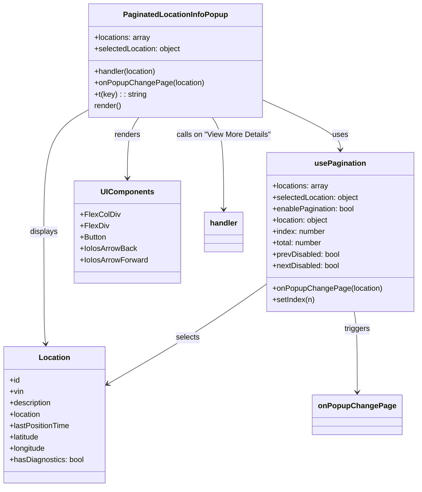

# Diagram: web/portal/src/modules/map/widgets/PaginatedLocationInfoPopup.js


> Auto-generated by Obscura crawlers

## Diagram 1



### SVG

<svg id="container" width="871.671875" xmlns="http://www.w3.org/2000/svg" class="classDiagram" height="1052" viewBox="0 0 871.671875 1052" role="graphics-document document" aria-roledescription="class"><style>#container{font-family:"trebuchet ms",verdana,arial,sans-serif;font-size:16px;fill:#333;}@keyframes edge-animation-frame{from{stroke-dashoffset:0;}}@keyframes dash{to{stroke-dashoffset:0;}}#container .edge-animation-slow{stroke-dasharray:9,5!important;stroke-dashoffset:900;animation:dash 50s linear infinite;stroke-linecap:round;}#container .edge-animation-fast{stroke-dasharray:9,5!important;stroke-dashoffset:900;animation:dash 20s linear infinite;stroke-linecap:round;}#container .error-icon{fill:#552222;}#container .error-text{fill:#552222;stroke:#552222;}#container .edge-thickness-normal{stroke-width:1px;}#container .edge-thickness-thick{stroke-width:3.5px;}#container .edge-pattern-solid{stroke-dasharray:0;}#container .edge-thickness-invisible{stroke-width:0;fill:none;}#container .edge-pattern-dashed{stroke-dasharray:3;}#container .edge-pattern-dotted{stroke-dasharray:2;}#container .marker{fill:#333333;stroke:#333333;}#container .marker.cross{stroke:#333333;}#container svg{font-family:"trebuchet ms",verdana,arial,sans-serif;font-size:16px;}#container p{margin:0;}#container g.classGroup text{fill:#9370DB;stroke:none;font-family:"trebuchet ms",verdana,arial,sans-serif;font-size:10px;}#container g.classGroup text .title{font-weight:bolder;}#container .nodeLabel,#container .edgeLabel{color:#131300;}#container .edgeLabel .label rect{fill:#ECECFF;}#container .label text{fill:#131300;}#container .labelBkg{background:#ECECFF;}#container .edgeLabel .label span{background:#ECECFF;}#container .classTitle{font-weight:bolder;}#container .node rect,#container .node circle,#container .node ellipse,#container .node polygon,#container .node path{fill:#ECECFF;stroke:#9370DB;stroke-width:1px;}#container .divider{stroke:#9370DB;stroke-width:1;}#container g.clickable{cursor:pointer;}#container g.classGroup rect{fill:#ECECFF;stroke:#9370DB;}#container g.classGroup line{stroke:#9370DB;stroke-width:1;}#container .classLabel .box{stroke:none;stroke-width:0;fill:#ECECFF;opacity:0.5;}#container .classLabel .label{fill:#9370DB;font-size:10px;}#container .relation{stroke:#333333;stroke-width:1;fill:none;}#container .dashed-line{stroke-dasharray:3;}#container .dotted-line{stroke-dasharray:1 2;}#container #compositionStart,#container .composition{fill:#333333!important;stroke:#333333!important;stroke-width:1;}#container #compositionEnd,#container .composition{fill:#333333!important;stroke:#333333!important;stroke-width:1;}#container #dependencyStart,#container .dependency{fill:#333333!important;stroke:#333333!important;stroke-width:1;}#container #dependencyStart,#container .dependency{fill:#333333!important;stroke:#333333!important;stroke-width:1;}#container #extensionStart,#container .extension{fill:transparent!important;stroke:#333333!important;stroke-width:1;}#container #extensionEnd,#container .extension{fill:transparent!important;stroke:#333333!important;stroke-width:1;}#container #aggregationStart,#container .aggregation{fill:transparent!important;stroke:#333333!important;stroke-width:1;}#container #aggregationEnd,#container .aggregation{fill:transparent!important;stroke:#333333!important;stroke-width:1;}#container #lollipopStart,#container .lollipop{fill:#ECECFF!important;stroke:#333333!important;stroke-width:1;}#container #lollipopEnd,#container .lollipop{fill:#ECECFF!important;stroke:#333333!important;stroke-width:1;}#container .edgeTerminals{font-size:11px;line-height:initial;}#container .classTitleText{text-anchor:middle;font-size:18px;fill:#333;}#container .label-icon{display:inline-block;height:1em;overflow:visible;vertical-align:-0.125em;}#container .node .label-icon path{fill:currentColor;stroke:revert;stroke-width:revert;}#container :root{--mermaid-font-family:"trebuchet ms",verdana,arial,sans-serif;}</style><g><defs><marker id="container_class-aggregationStart" class="marker aggregation class" refX="18" refY="7" markerWidth="190" markerHeight="240" orient="auto"><path d="M 18,7 L9,13 L1,7 L9,1 Z"></path></marker></defs><defs><marker id="container_class-aggregationEnd" class="marker aggregation class" refX="1" refY="7" markerWidth="20" markerHeight="28" orient="auto"><path d="M 18,7 L9,13 L1,7 L9,1 Z"></path></marker></defs><defs><marker id="container_class-extensionStart" class="marker extension class" refX="18" refY="7" markerWidth="190" markerHeight="240" orient="auto"><path d="M 1,7 L18,13 V 1 Z"></path></marker></defs><defs><marker id="container_class-extensionEnd" class="marker extension class" refX="1" refY="7" markerWidth="20" markerHeight="28" orient="auto"><path d="M 1,1 V 13 L18,7 Z"></path></marker></defs><defs><marker id="container_class-compositionStart" class="marker composition class" refX="18" refY="7" markerWidth="190" markerHeight="240" orient="auto"><path d="M 18,7 L9,13 L1,7 L9,1 Z"></path></marker></defs><defs><marker id="container_class-compositionEnd" class="marker composition class" refX="1" refY="7" markerWidth="20" markerHeight="28" orient="auto"><path d="M 18,7 L9,13 L1,7 L9,1 Z"></path></marker></defs><defs><marker id="container_class-dependencyStart" class="marker dependency class" refX="6" refY="7" markerWidth="190" markerHeight="240" orient="auto"><path d="M 5,7 L9,13 L1,7 L9,1 Z"></path></marker></defs><defs><marker id="container_class-dependencyEnd" class="marker dependency class" refX="13" refY="7" markerWidth="20" markerHeight="28" orient="auto"><path d="M 18,7 L9,13 L14,7 L9,1 Z"></path></marker></defs><defs><marker id="container_class-lollipopStart" class="marker lollipop class" refX="13" refY="7" markerWidth="190" markerHeight="240" orient="auto"><circle stroke="black" fill="transparent" cx="7" cy="7" r="6"></circle></marker></defs><defs><marker id="container_class-lollipopEnd" class="marker lollipop class" refX="1" refY="7" markerWidth="190" markerHeight="240" orient="auto"><circle stroke="black" fill="transparent" cx="7" cy="7" r="6"></circle></marker></defs><g class="root"><g class="clusters"></g><g class="edgePaths"><path d="M547.064,216.343L574.387,229.786C601.71,243.229,656.355,270.114,683.677,290.724C711,311.333,711,325.667,711,332.833L711,340" id="id_PaginatedLocationInfoPopup_usePagination_1" class="edge-thickness-normal edge-pattern-solid relation" style=";;;" data-edge="true" data-et="edge" data-id="id_PaginatedLocationInfoPopup_usePagination_1" data-points="W3sieCI6NTQ3LjA2NDQ1MzEyNSwieSI6MjE2LjM0MzI4OTYwNzYwNTY0fSx7IngiOjcxMSwieSI6Mjk3fSx7IngiOjcxMSwieSI6MzQ2fV0=" marker-end="url(#container_class-dependencyEnd)"></path><path d="M296.188,248L291.334,256.167C286.481,264.333,276.774,280.667,271.92,306C267.066,331.333,267.066,365.667,267.066,382.833L267.066,400" id="id_PaginatedLocationInfoPopup_UIComponents_2" class="edge-thickness-normal edge-pattern-solid relation" style=";;;" data-edge="true" data-et="edge" data-id="id_PaginatedLocationInfoPopup_UIComponents_2" data-points="W3sieCI6Mjk2LjE4NzkwNDQ5MzM0MzIsInkiOjI0OH0seyJ4IjoyNjcuMDY2NDA2MjUsInkiOjI5N30seyJ4IjoyNjcuMDY2NDA2MjUsInkiOjQwNn1d" marker-end="url(#container_class-dependencyEnd)"></path><path d="M558.328,623.069L535.948,639.058C513.568,655.046,468.807,687.023,413.445,722.296C358.083,757.569,292.12,796.138,259.138,815.423L226.156,834.707" id="id_usePagination_Location_3" class="edge-thickness-normal edge-pattern-solid relation" style=";;;" data-edge="true" data-et="edge" data-id="id_usePagination_Location_3" data-points="W3sieCI6NTU4LjMyODEyNSwieSI6NjIzLjA2OTE1MzI4MDY5N30seyJ4Ijo0MjQuMDQ2ODc1LCJ5Ijo3MTl9LHsieCI6MjIwLjk3NjU2MjUsInkiOjgzNy43MzU5MjY5MTIwNTk4fV0=" marker-end="url(#container_class-dependencyEnd)"></path><path d="M187.947,238.097L171.937,247.915C155.926,257.732,123.904,277.366,107.894,323.35C91.883,369.333,91.883,441.667,91.883,512C91.883,582.333,91.883,650.667,92.529,690.008C93.175,729.349,94.468,739.698,95.114,744.872L95.76,750.046" id="id_PaginatedLocationInfoPopup_Location_4" class="edge-thickness-normal edge-pattern-solid relation" style=";;;" data-edge="true" data-et="edge" data-id="id_PaginatedLocationInfoPopup_Location_4" data-points="W3sieCI6MTg3Ljk0NzI2NTYyNSwieSI6MjM4LjA5NzQ3ODAxNTAwODYyfSx7IngiOjkxLjg4MjgxMjUsInkiOjI5N30seyJ4Ijo5MS44ODI4MTI1LCJ5Ijo1MTR9LHsieCI6OTEuODgyODEyNSwieSI6NzE5fSx7IngiOjk2LjUwMzgxOTkyNDAzMzE1LCJ5Ijo3NTZ9XQ==" marker-end="url(#container_class-dependencyEnd)"></path><path d="M438.824,248L443.677,256.167C448.531,264.333,458.238,280.667,463.092,317C467.945,353.333,467.945,409.667,467.945,437.833L467.945,466" id="id_PaginatedLocationInfoPopup_handler_5" class="edge-thickness-normal edge-pattern-solid relation" style=";;;" data-edge="true" data-et="edge" data-id="id_PaginatedLocationInfoPopup_handler_5" data-points="W3sieCI6NDM4LjgyMzgxNDI1NjY1NjgsInkiOjI0OH0seyJ4Ijo0NjcuOTQ1MzEyNSwieSI6Mjk3fSx7IngiOjQ2Ny45NDUzMTI1LCJ5Ijo0NzJ9XQ==" marker-end="url(#container_class-dependencyEnd)"></path><path d="M740.791,682L741.884,688.167C742.978,694.333,745.165,706.667,746.258,735C747.352,763.333,747.352,807.667,747.352,829.833L747.352,852" id="id_usePagination_onPopupChangePage_6" class="edge-thickness-normal edge-pattern-solid relation" style=";;;" data-edge="true" data-et="edge" data-id="id_usePagination_onPopupChangePage_6" data-points="W3sieCI6NzQwLjc5MDU0ODc4MDQ4NzgsInkiOjY4Mn0seyJ4Ijo3NDcuMzUxNTYyNSwieSI6NzE5fSx7IngiOjc0Ny4zNTE1NjI1LCJ5Ijo4NTh9XQ==" marker-end="url(#container_class-dependencyEnd)"></path></g><g class="edgeLabels"><g class="edgeLabel" transform="translate(711, 297)"><g class="label" data-id="id_PaginatedLocationInfoPopup_usePagination_1" transform="translate(-16.4921875, -12)"><foreignObject width="32.984375" height="24"><div xmlns="http://www.w3.org/1999/xhtml" class="labelBkg" style="display: table-cell; white-space: nowrap; line-height: 1.5; max-width: 200px; text-align: center;"><span class="edgeLabel"><p>uses</p></span></div></foreignObject></g></g><g class="edgeLabel" transform="translate(267.06640625, 297)"><g class="label" data-id="id_PaginatedLocationInfoPopup_UIComponents_2" transform="translate(-27.75, -12)"><foreignObject width="55.5" height="24"><div xmlns="http://www.w3.org/1999/xhtml" class="labelBkg" style="display: table-cell; white-space: nowrap; line-height: 1.5; max-width: 200px; text-align: center;"><span class="edgeLabel"><p>renders</p></span></div></foreignObject></g></g><g class="edgeLabel" transform="translate(393.74298, 736.7188)"><g class="label" data-id="id_usePagination_Location_3" transform="translate(-25.2109375, -12)"><foreignObject width="50.421875" height="24"><div xmlns="http://www.w3.org/1999/xhtml" class="labelBkg" style="display: table-cell; white-space: nowrap; line-height: 1.5; max-width: 200px; text-align: center;"><span class="edgeLabel"><p>selects</p></span></div></foreignObject></g></g><g class="edgeLabel" transform="translate(91.8828125, 514)"><g class="label" data-id="id_PaginatedLocationInfoPopup_Location_4" transform="translate(-29.6875, -12)"><foreignObject width="59.375" height="24"><div xmlns="http://www.w3.org/1999/xhtml" class="labelBkg" style="display: table-cell; white-space: nowrap; line-height: 1.5; max-width: 200px; text-align: center;"><span class="edgeLabel"><p>displays</p></span></div></foreignObject></g></g><g class="edgeLabel" transform="translate(467.9453125, 297)"><g class="label" data-id="id_PaginatedLocationInfoPopup_handler_5" transform="translate(-100, -24)"><foreignObject width="200" height="48"><div xmlns="http://www.w3.org/1999/xhtml" class="labelBkg" style="display: table; white-space: break-spaces; line-height: 1.5; max-width: 200px; text-align: center; width: 200px;"><span class="edgeLabel"><p>calls on "View More Details"</p></span></div></foreignObject></g></g><g class="edgeLabel" transform="translate(747.3515625, 719)"><g class="label" data-id="id_usePagination_onPopupChangePage_6" transform="translate(-27.4921875, -12)"><foreignObject width="54.984375" height="24"><div xmlns="http://www.w3.org/1999/xhtml" class="labelBkg" style="display: table-cell; white-space: nowrap; line-height: 1.5; max-width: 200px; text-align: center;"><span class="edgeLabel"><p>triggers</p></span></div></foreignObject></g></g></g><g class="nodes"><g class="node default" id="classId-PaginatedLocationInfoPopup-0" transform="translate(367.505859375, 128)"><g class="basic label-container"><path d="M-179.55859375 -120 L179.55859375 -120 L179.55859375 120 L-179.55859375 120" stroke="none" stroke-width="0" fill="#ECECFF" style=""></path><path d="M-179.55859375 -120 C-95.77984496923403 -120, -12.001096188468068 -120, 179.55859375 -120 M-179.55859375 -120 C-69.86942979238412 -120, 39.81973416523175 -120, 179.55859375 -120 M179.55859375 -120 C179.55859375 -24.238484822891095, 179.55859375 71.52303035421781, 179.55859375 120 M179.55859375 -120 C179.55859375 -33.377681839181804, 179.55859375 53.24463632163639, 179.55859375 120 M179.55859375 120 C53.34172861203466 120, -72.87513652593069 120, -179.55859375 120 M179.55859375 120 C86.97344120240018 120, -5.611711345199637 120, -179.55859375 120 M-179.55859375 120 C-179.55859375 65.60598445779459, -179.55859375 11.211968915589196, -179.55859375 -120 M-179.55859375 120 C-179.55859375 51.63350969236521, -179.55859375 -16.732980615269582, -179.55859375 -120" stroke="#9370DB" stroke-width="1.3" fill="none" stroke-dasharray="0 0" style=""></path></g><g class="annotation-group text" transform="translate(0, -96)"></g><g class="label-group text" transform="translate(-105.6171875, -96)"><g class="label" style="font-weight: bolder" transform="translate(0,-12)"><foreignObject width="211.234375" height="24"><div xmlns="http://www.w3.org/1999/xhtml" style="display: table-cell; white-space: nowrap; line-height: 1.5; max-width: 259px; text-align: center;"><span class="nodeLabel markdown-node-label" style=""><p>PaginatedLocationInfoPopup</p></span></div></foreignObject></g></g><g class="members-group text" transform="translate(-167.55859375, -48)"><g class="label" style="" transform="translate(0,-12)"><foreignObject width="119.53125" height="24"><div xmlns="http://www.w3.org/1999/xhtml" style="display: table-cell; white-space: nowrap; line-height: 1.5; max-width: 177px; text-align: center;"><span class="nodeLabel markdown-node-label" style=""><p>+locations: array</p></span></div></foreignObject></g><g class="label" style="" transform="translate(0,12)"><foreignObject width="184.640625" height="24"><div xmlns="http://www.w3.org/1999/xhtml" style="display: table-cell; white-space: nowrap; line-height: 1.5; max-width: 242px; text-align: center;"><span class="nodeLabel markdown-node-label" style=""><p>+selectedLocation: object</p></span></div></foreignObject></g></g><g class="methods-group text" transform="translate(-167.55859375, 24)"><g class="label" style="" transform="translate(0,-12)"><foreignObject width="134.046875" height="24"><div xmlns="http://www.w3.org/1999/xhtml" style="display: table-cell; white-space: nowrap; line-height: 1.5; max-width: 191px; text-align: center;"><span class="nodeLabel markdown-node-label" style=""><p>+handler(location)</p></span></div></foreignObject></g><g class="label" style="" transform="translate(0,12)"><foreignObject width="229.5" height="24"><div xmlns="http://www.w3.org/1999/xhtml" style="display: table-cell; white-space: nowrap; line-height: 1.5; max-width: 287px; text-align: center;"><span class="nodeLabel markdown-node-label" style=""><p>+onPopupChangePage(location)</p></span></div></foreignObject></g><g class="label" style="" transform="translate(0,36)"><foreignObject width="110.65625" height="24"><div xmlns="http://www.w3.org/1999/xhtml" style="display: table-cell; white-space: nowrap; line-height: 1.5; max-width: 169px; text-align: center;"><span class="nodeLabel markdown-node-label" style=""><p>+t(key) : : string</p></span></div></foreignObject></g><g class="label" style="" transform="translate(0,60)"><foreignObject width="58.625" height="24"><div xmlns="http://www.w3.org/1999/xhtml" style="display: table-cell; white-space: nowrap; line-height: 1.5; max-width: 109px; text-align: center;"><span class="nodeLabel markdown-node-label" style=""><p>render()</p></span></div></foreignObject></g></g><g class="divider" style=""><path d="M-179.55859375 -72 C-86.56030651697988 -72, 6.437980716040244 -72, 179.55859375 -72 M-179.55859375 -72 C-64.43415323084695 -72, 50.69028728830611 -72, 179.55859375 -72" stroke="#9370DB" stroke-width="1.3" fill="none" stroke-dasharray="0 0" style=""></path></g><g class="divider" style=""><path d="M-179.55859375 0 C-95.80052383278048 0, -12.04245391556097 0, 179.55859375 0 M-179.55859375 0 C-75.36966113413703 0, 28.819271481725934 0, 179.55859375 0" stroke="#9370DB" stroke-width="1.3" fill="none" stroke-dasharray="0 0" style=""></path></g></g><g class="node default" id="classId-usePagination-1" transform="translate(711, 514)"><g class="basic label-container"><path d="M-152.671875 -168 L152.671875 -168 L152.671875 168 L-152.671875 168" stroke="none" stroke-width="0" fill="#ECECFF" style=""></path><path d="M-152.671875 -168 C-42.66400947022788 -168, 67.34385605954424 -168, 152.671875 -168 M-152.671875 -168 C-80.72231684302164 -168, -8.77275868604329 -168, 152.671875 -168 M152.671875 -168 C152.671875 -45.53855834270523, 152.671875 76.92288331458954, 152.671875 168 M152.671875 -168 C152.671875 -63.49890549706994, 152.671875 41.00218900586012, 152.671875 168 M152.671875 168 C84.38065612995118 168, 16.089437259902354 168, -152.671875 168 M152.671875 168 C55.31261642297963 168, -42.04664215404074 168, -152.671875 168 M-152.671875 168 C-152.671875 88.76993520742475, -152.671875 9.539870414849503, -152.671875 -168 M-152.671875 168 C-152.671875 80.05421721849604, -152.671875 -7.89156556300793, -152.671875 -168" stroke="#9370DB" stroke-width="1.3" fill="none" stroke-dasharray="0 0" style=""></path></g><g class="annotation-group text" transform="translate(0, -144)"></g><g class="label-group text" transform="translate(-51.84375, -144)"><g class="label" style="font-weight: bolder" transform="translate(0,-12)"><foreignObject width="103.6875" height="24"><div xmlns="http://www.w3.org/1999/xhtml" style="display: table-cell; white-space: nowrap; line-height: 1.5; max-width: 152px; text-align: center;"><span class="nodeLabel markdown-node-label" style=""><p>usePagination</p></span></div></foreignObject></g></g><g class="members-group text" transform="translate(-140.671875, -96)"><g class="label" style="" transform="translate(0,-12)"><foreignObject width="119.53125" height="24"><div xmlns="http://www.w3.org/1999/xhtml" style="display: table-cell; white-space: nowrap; line-height: 1.5; max-width: 177px; text-align: center;"><span class="nodeLabel markdown-node-label" style=""><p>+locations: array</p></span></div></foreignObject></g><g class="label" style="" transform="translate(0,12)"><foreignObject width="184.640625" height="24"><div xmlns="http://www.w3.org/1999/xhtml" style="display: table-cell; white-space: nowrap; line-height: 1.5; max-width: 242px; text-align: center;"><span class="nodeLabel markdown-node-label" style=""><p>+selectedLocation: object</p></span></div></foreignObject></g><g class="label" style="" transform="translate(0,36)"><foreignObject width="175.46875" height="24"><div xmlns="http://www.w3.org/1999/xhtml" style="display: table-cell; white-space: nowrap; line-height: 1.5; max-width: 233px; text-align: center;"><span class="nodeLabel markdown-node-label" style=""><p>+enablePagination: bool</p></span></div></foreignObject></g><g class="label" style="" transform="translate(0,60)"><foreignObject width="120.703125" height="24"><div xmlns="http://www.w3.org/1999/xhtml" style="display: table-cell; white-space: nowrap; line-height: 1.5; max-width: 178px; text-align: center;"><span class="nodeLabel markdown-node-label" style=""><p>+location: object</p></span></div></foreignObject></g><g class="label" style="" transform="translate(0,84)"><foreignObject width="112.734375" height="24"><div xmlns="http://www.w3.org/1999/xhtml" style="display: table-cell; white-space: nowrap; line-height: 1.5; max-width: 171px; text-align: center;"><span class="nodeLabel markdown-node-label" style=""><p>+index: number</p></span></div></foreignObject></g><g class="label" style="" transform="translate(0,108)"><foreignObject width="106.734375" height="24"><div xmlns="http://www.w3.org/1999/xhtml" style="display: table-cell; white-space: nowrap; line-height: 1.5; max-width: 165px; text-align: center;"><span class="nodeLabel markdown-node-label" style=""><p>+total: number</p></span></div></foreignObject></g><g class="label" style="" transform="translate(0,132)"><foreignObject width="143.90625" height="24"><div xmlns="http://www.w3.org/1999/xhtml" style="display: table-cell; white-space: nowrap; line-height: 1.5; max-width: 202px; text-align: center;"><span class="nodeLabel markdown-node-label" style=""><p>+prevDisabled: bool</p></span></div></foreignObject></g><g class="label" style="" transform="translate(0,156)"><foreignObject width="143.671875" height="24"><div xmlns="http://www.w3.org/1999/xhtml" style="display: table-cell; white-space: nowrap; line-height: 1.5; max-width: 201px; text-align: center;"><span class="nodeLabel markdown-node-label" style=""><p>+nextDisabled: bool</p></span></div></foreignObject></g></g><g class="methods-group text" transform="translate(-140.671875, 120)"><g class="label" style="" transform="translate(0,-12)"><foreignObject width="229.5" height="24"><div xmlns="http://www.w3.org/1999/xhtml" style="display: table-cell; white-space: nowrap; line-height: 1.5; max-width: 287px; text-align: center;"><span class="nodeLabel markdown-node-label" style=""><p>+onPopupChangePage(location)</p></span></div></foreignObject></g><g class="label" style="" transform="translate(0,12)"><foreignObject width="89.703125" height="24"><div xmlns="http://www.w3.org/1999/xhtml" style="display: table-cell; white-space: nowrap; line-height: 1.5; max-width: 147px; text-align: center;"><span class="nodeLabel markdown-node-label" style=""><p>+setIndex(n)</p></span></div></foreignObject></g></g><g class="divider" style=""><path d="M-152.671875 -120 C-46.37206400186503 -120, 59.927746996269946 -120, 152.671875 -120 M-152.671875 -120 C-46.87253817233329 -120, 58.926798655333414 -120, 152.671875 -120" stroke="#9370DB" stroke-width="1.3" fill="none" stroke-dasharray="0 0" style=""></path></g><g class="divider" style=""><path d="M-152.671875 96 C-65.31404150988081 96, 22.04379198023838 96, 152.671875 96 M-152.671875 96 C-90.1688325465191 96, -27.665790093038197 96, 152.671875 96" stroke="#9370DB" stroke-width="1.3" fill="none" stroke-dasharray="0 0" style=""></path></g></g><g class="node default" id="classId-Location-2" transform="translate(114.48828125, 900)"><g class="basic label-container"><path d="M-106.48828125 -144 L106.48828125 -144 L106.48828125 144 L-106.48828125 144" stroke="none" stroke-width="0" fill="#ECECFF" style=""></path><path d="M-106.48828125 -144 C-59.0988040332854 -144, -11.709326816570794 -144, 106.48828125 -144 M-106.48828125 -144 C-35.87366147834757 -144, 34.74095829330486 -144, 106.48828125 -144 M106.48828125 -144 C106.48828125 -29.689193452634413, 106.48828125 84.62161309473117, 106.48828125 144 M106.48828125 -144 C106.48828125 -78.97571128624885, 106.48828125 -13.951422572497705, 106.48828125 144 M106.48828125 144 C28.44534097698488 144, -49.59759929603024 144, -106.48828125 144 M106.48828125 144 C31.367209262898825 144, -43.75386272420235 144, -106.48828125 144 M-106.48828125 144 C-106.48828125 34.158794382259, -106.48828125 -75.682411235482, -106.48828125 -144 M-106.48828125 144 C-106.48828125 56.90906057097283, -106.48828125 -30.181878858054347, -106.48828125 -144" stroke="#9370DB" stroke-width="1.3" fill="none" stroke-dasharray="0 0" style=""></path></g><g class="annotation-group text" transform="translate(0, -120)"></g><g class="label-group text" transform="translate(-31.3515625, -120)"><g class="label" style="font-weight: bolder" transform="translate(0,-12)"><foreignObject width="62.703125" height="24"><div xmlns="http://www.w3.org/1999/xhtml" style="display: table-cell; white-space: nowrap; line-height: 1.5; max-width: 112px; text-align: center;"><span class="nodeLabel markdown-node-label" style=""><p>Location</p></span></div></foreignObject></g></g><g class="members-group text" transform="translate(-94.48828125, -72)"><g class="label" style="" transform="translate(0,-12)"><foreignObject width="22.078125" height="24"><div xmlns="http://www.w3.org/1999/xhtml" style="display: table-cell; white-space: nowrap; line-height: 1.5; max-width: 79px; text-align: center;"><span class="nodeLabel markdown-node-label" style=""><p>+id</p></span></div></foreignObject></g><g class="label" style="" transform="translate(0,12)"><foreignObject width="29.59375" height="24"><div xmlns="http://www.w3.org/1999/xhtml" style="display: table-cell; white-space: nowrap; line-height: 1.5; max-width: 87px; text-align: center;"><span class="nodeLabel markdown-node-label" style=""><p>+vin</p></span></div></foreignObject></g><g class="label" style="" transform="translate(0,36)"><foreignObject width="90.59375" height="24"><div xmlns="http://www.w3.org/1999/xhtml" style="display: table-cell; white-space: nowrap; line-height: 1.5; max-width: 148px; text-align: center;"><span class="nodeLabel markdown-node-label" style=""><p>+description</p></span></div></foreignObject></g><g class="label" style="" transform="translate(0,60)"><foreignObject width="67.140625" height="24"><div xmlns="http://www.w3.org/1999/xhtml" style="display: table-cell; white-space: nowrap; line-height: 1.5; max-width: 125px; text-align: center;"><span class="nodeLabel markdown-node-label" style=""><p>+location</p></span></div></foreignObject></g><g class="label" style="" transform="translate(0,84)"><foreignObject width="128.765625" height="24"><div xmlns="http://www.w3.org/1999/xhtml" style="display: table-cell; white-space: nowrap; line-height: 1.5; max-width: 186px; text-align: center;"><span class="nodeLabel markdown-node-label" style=""><p>+lastPositionTime</p></span></div></foreignObject></g><g class="label" style="" transform="translate(0,108)"><foreignObject width="64.96875" height="24"><div xmlns="http://www.w3.org/1999/xhtml" style="display: table-cell; white-space: nowrap; line-height: 1.5; max-width: 122px; text-align: center;"><span class="nodeLabel markdown-node-label" style=""><p>+latitude</p></span></div></foreignObject></g><g class="label" style="" transform="translate(0,132)"><foreignObject width="77.53125" height="24"><div xmlns="http://www.w3.org/1999/xhtml" style="display: table-cell; white-space: nowrap; line-height: 1.5; max-width: 135px; text-align: center;"><span class="nodeLabel markdown-node-label" style=""><p>+longitude</p></span></div></foreignObject></g><g class="label" style="" transform="translate(0,156)"><foreignObject width="157.625" height="24"><div xmlns="http://www.w3.org/1999/xhtml" style="display: table-cell; white-space: nowrap; line-height: 1.5; max-width: 215px; text-align: center;"><span class="nodeLabel markdown-node-label" style=""><p>+hasDiagnostics: bool</p></span></div></foreignObject></g></g><g class="methods-group text" transform="translate(-94.48828125, 144)"></g><g class="divider" style=""><path d="M-106.48828125 -96 C-46.51478746433143 -96, 13.458706321337147 -96, 106.48828125 -96 M-106.48828125 -96 C-52.46906377857599 -96, 1.5501536928480135 -96, 106.48828125 -96" stroke="#9370DB" stroke-width="1.3" fill="none" stroke-dasharray="0 0" style=""></path></g><g class="divider" style=""><path d="M-106.48828125 120 C-47.76260942074961 120, 10.963062408500775 120, 106.48828125 120 M-106.48828125 120 C-54.110197053571646 120, -1.7321128571432922 120, 106.48828125 120" stroke="#9370DB" stroke-width="1.3" fill="none" stroke-dasharray="0 0" style=""></path></g></g><g class="node default" id="classId-UIComponents-3" transform="translate(267.06640625, 514)"><g class="basic label-container"><path d="M-110.49609375 -108 L110.49609375 -108 L110.49609375 108 L-110.49609375 108" stroke="none" stroke-width="0" fill="#ECECFF" style=""></path><path d="M-110.49609375 -108 C-36.900774437905426 -108, 36.69454487418915 -108, 110.49609375 -108 M-110.49609375 -108 C-58.539494955314154 -108, -6.582896160628309 -108, 110.49609375 -108 M110.49609375 -108 C110.49609375 -39.223817581520834, 110.49609375 29.552364836958333, 110.49609375 108 M110.49609375 -108 C110.49609375 -44.06630408292073, 110.49609375 19.86739183415854, 110.49609375 108 M110.49609375 108 C36.32690531401283 108, -37.84228312197433 108, -110.49609375 108 M110.49609375 108 C24.246742262112562 108, -62.002609225774876 108, -110.49609375 108 M-110.49609375 108 C-110.49609375 32.77187033876997, -110.49609375 -42.456259322460056, -110.49609375 -108 M-110.49609375 108 C-110.49609375 46.71717877468924, -110.49609375 -14.565642450621525, -110.49609375 -108" stroke="#9370DB" stroke-width="1.3" fill="none" stroke-dasharray="0 0" style=""></path></g><g class="annotation-group text" transform="translate(0, -84)"></g><g class="label-group text" transform="translate(-53.4765625, -84)"><g class="label" style="font-weight: bolder" transform="translate(0,-12)"><foreignObject width="106.953125" height="24"><div xmlns="http://www.w3.org/1999/xhtml" style="display: table-cell; white-space: nowrap; line-height: 1.5; max-width: 157px; text-align: center;"><span class="nodeLabel markdown-node-label" style=""><p>UIComponents</p></span></div></foreignObject></g></g><g class="members-group text" transform="translate(-98.49609375, -36)"><g class="label" style="" transform="translate(0,-12)"><foreignObject width="81.984375" height="24"><div xmlns="http://www.w3.org/1999/xhtml" style="display: table-cell; white-space: nowrap; line-height: 1.5; max-width: 139px; text-align: center;"><span class="nodeLabel markdown-node-label" style=""><p>+FlexColDiv</p></span></div></foreignObject></g><g class="label" style="" transform="translate(0,12)"><foreignObject width="59.3125" height="24"><div xmlns="http://www.w3.org/1999/xhtml" style="display: table-cell; white-space: nowrap; line-height: 1.5; max-width: 117px; text-align: center;"><span class="nodeLabel markdown-node-label" style=""><p>+FlexDiv</p></span></div></foreignObject></g><g class="label" style="" transform="translate(0,36)"><foreignObject width="57.0625" height="24"><div xmlns="http://www.w3.org/1999/xhtml" style="display: table-cell; white-space: nowrap; line-height: 1.5; max-width: 114px; text-align: center;"><span class="nodeLabel markdown-node-label" style=""><p>+Button</p></span></div></foreignObject></g><g class="label" style="" transform="translate(0,60)"><foreignObject width="119.71875" height="24"><div xmlns="http://www.w3.org/1999/xhtml" style="display: table-cell; white-space: nowrap; line-height: 1.5; max-width: 178px; text-align: center;"><span class="nodeLabel markdown-node-label" style=""><p>+IoIosArrowBack</p></span></div></foreignObject></g><g class="label" style="" transform="translate(0,84)"><foreignObject width="143.515625" height="24"><div xmlns="http://www.w3.org/1999/xhtml" style="display: table-cell; white-space: nowrap; line-height: 1.5; max-width: 201px; text-align: center;"><span class="nodeLabel markdown-node-label" style=""><p>+IoIosArrowForward</p></span></div></foreignObject></g></g><g class="methods-group text" transform="translate(-98.49609375, 108)"></g><g class="divider" style=""><path d="M-110.49609375 -60 C-26.653617388024273 -60, 57.188858973951454 -60, 110.49609375 -60 M-110.49609375 -60 C-32.363448460489266 -60, 45.76919682902147 -60, 110.49609375 -60" stroke="#9370DB" stroke-width="1.3" fill="none" stroke-dasharray="0 0" style=""></path></g><g class="divider" style=""><path d="M-110.49609375 84 C-29.716865079886063 84, 51.062363590227875 84, 110.49609375 84 M-110.49609375 84 C-44.980854583674 84, 20.534384582651995 84, 110.49609375 84" stroke="#9370DB" stroke-width="1.3" fill="none" stroke-dasharray="0 0" style=""></path></g></g><g class="node default" id="classId-handler-4" transform="translate(467.9453125, 514)"><g class="basic label-container"><path d="M-40.3828125 -42 L40.3828125 -42 L40.3828125 42 L-40.3828125 42" stroke="none" stroke-width="0" fill="#ECECFF" style=""></path><path d="M-40.3828125 -42 C-22.30023507849953 -42, -4.217657656999059 -42, 40.3828125 -42 M-40.3828125 -42 C-21.791925696331436 -42, -3.201038892662872 -42, 40.3828125 -42 M40.3828125 -42 C40.3828125 -13.198984043318681, 40.3828125 15.602031913362637, 40.3828125 42 M40.3828125 -42 C40.3828125 -24.43667647623226, 40.3828125 -6.873352952464522, 40.3828125 42 M40.3828125 42 C10.752219449161096 42, -18.878373601677808 42, -40.3828125 42 M40.3828125 42 C16.15529132564061 42, -8.072229848718777 42, -40.3828125 42 M-40.3828125 42 C-40.3828125 23.85364115014554, -40.3828125 5.707282300291077, -40.3828125 -42 M-40.3828125 42 C-40.3828125 21.60964292769239, -40.3828125 1.2192858553847827, -40.3828125 -42" stroke="#9370DB" stroke-width="1.3" fill="none" stroke-dasharray="0 0" style=""></path></g><g class="annotation-group text" transform="translate(0, -18)"></g><g class="label-group text" transform="translate(-28.3828125, -18)"><g class="label" style="font-weight: bolder" transform="translate(0,-12)"><foreignObject width="56.765625" height="24"><div xmlns="http://www.w3.org/1999/xhtml" style="display: table-cell; white-space: nowrap; line-height: 1.5; max-width: 107px; text-align: center;"><span class="nodeLabel markdown-node-label" style=""><p>handler</p></span></div></foreignObject></g></g><g class="members-group text" transform="translate(-28.3828125, 30)"></g><g class="methods-group text" transform="translate(-28.3828125, 60)"></g><g class="divider" style=""><path d="M-40.3828125 6 C-23.299012935804864 6, -6.215213371609728 6, 40.3828125 6 M-40.3828125 6 C-11.380732792050065 6, 17.62134691589987 6, 40.3828125 6" stroke="#9370DB" stroke-width="1.3" fill="none" stroke-dasharray="0 0" style=""></path></g><g class="divider" style=""><path d="M-40.3828125 24 C-9.293784652352844 24, 21.79524319529431 24, 40.3828125 24 M-40.3828125 24 C-13.624155490508123 24, 13.134501518983754 24, 40.3828125 24" stroke="#9370DB" stroke-width="1.3" fill="none" stroke-dasharray="0 0" style=""></path></g></g><g class="node default" id="classId-onPopupChangePage-5" transform="translate(747.3515625, 900)"><g class="basic label-container"><path d="M-88.7734375 -42 L88.7734375 -42 L88.7734375 42 L-88.7734375 42" stroke="none" stroke-width="0" fill="#ECECFF" style=""></path><path d="M-88.7734375 -42 C-44.07001668998381 -42, 0.633404120032381 -42, 88.7734375 -42 M-88.7734375 -42 C-20.009627129407363 -42, 48.754183241185274 -42, 88.7734375 -42 M88.7734375 -42 C88.7734375 -14.710268643632286, 88.7734375 12.579462712735427, 88.7734375 42 M88.7734375 -42 C88.7734375 -21.323699391714648, 88.7734375 -0.6473987834292956, 88.7734375 42 M88.7734375 42 C18.880813443771004 42, -51.01181061245799 42, -88.7734375 42 M88.7734375 42 C28.452588124817375 42, -31.86826125036525 42, -88.7734375 42 M-88.7734375 42 C-88.7734375 19.166550930394717, -88.7734375 -3.6668981392105664, -88.7734375 -42 M-88.7734375 42 C-88.7734375 19.88023852780669, -88.7734375 -2.2395229443866214, -88.7734375 -42" stroke="#9370DB" stroke-width="1.3" fill="none" stroke-dasharray="0 0" style=""></path></g><g class="annotation-group text" transform="translate(0, -18)"></g><g class="label-group text" transform="translate(-76.7734375, -18)"><g class="label" style="font-weight: bolder" transform="translate(0,-12)"><foreignObject width="153.546875" height="24"><div xmlns="http://www.w3.org/1999/xhtml" style="display: table-cell; white-space: nowrap; line-height: 1.5; max-width: 202px; text-align: center;"><span class="nodeLabel markdown-node-label" style=""><p>onPopupChangePage</p></span></div></foreignObject></g></g><g class="members-group text" transform="translate(-76.7734375, 30)"></g><g class="methods-group text" transform="translate(-76.7734375, 60)"></g><g class="divider" style=""><path d="M-88.7734375 6 C-42.07746078581493 6, 4.618515928370144 6, 88.7734375 6 M-88.7734375 6 C-26.74745063194767 6, 35.27853623610466 6, 88.7734375 6" stroke="#9370DB" stroke-width="1.3" fill="none" stroke-dasharray="0 0" style=""></path></g><g class="divider" style=""><path d="M-88.7734375 24 C-34.61718320523759 24, 19.539071089524825 24, 88.7734375 24 M-88.7734375 24 C-33.74826724145889 24, 21.27690301708222 24, 88.7734375 24" stroke="#9370DB" stroke-width="1.3" fill="none" stroke-dasharray="0 0" style=""></path></g></g></g></g></g></svg>

## Diagram 2

```mermaid
flowchart TD
    A[User clicks VIN on map] --> B[Open PaginatedLocationInfoPopup]
    B --> C{locations.length > 1?}
    C -- Yes --> D[enablePagination = true]
    C -- No --> E[enablePagination = false]
    D --> F[Index initialized]
    F --> G[Compute prevDisabled / nextDisabled]
    G --> H[Emit onPopupChangePage(locations[index])]
    H --> I[Popup shows location details (vin, product, time, lat/lon)]
    I --> J[User clicks Prev/Next]
    J --> K{index boundary?}
    K -- Not boundary --> L[setIndex(index +/- 1)]
    L --> G
    K -- Boundary --> M[prevDisabled/nextDisabled true, index clamped]
    M --> H
```

> SVG rendering failed for this diagram.
