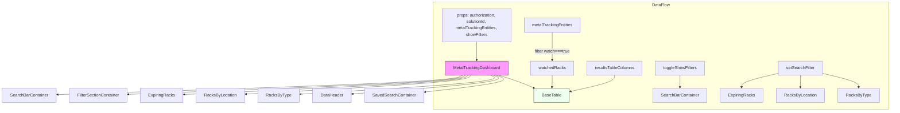

# Diagram: web/portal/src/modules/mt-dashboard/MetalTrackingDashboard.js


> Auto-generated by Obscura crawlers

## Diagram 1

```mermaid
classDiagram
    class MetalTrackingDashboard {
        +authorization
        +solutionId
        +metalTrackingEntities
        +toggleWatchedRackFlag()
        +setSearchFilter()
        +chooseLocation()
        +showFilters
    }
    class ExpiringRacks {
        +solutionId
        +metalTrackingEntities
        +setSearchFilter()
    }
    class RacksByLocation {
        +solutionId
        +metalTrackingEntities
        +setSearchFilter()
    }
    class RacksByType {
        +solutionId
        +metalTrackingEntities
        +setSearchFilter()
    }
    class SearchBarContainer {
        +isShowingFilters
        +toggleShowFilters()
    }
    class FilterSectionContainer {
        +show
        +backgroundColor
        +sectionStyle
    }
    class DataHeader {
        +title
        +total
    }
    class SavedSearchContainer
    class BaseTable {
        +data
        +columns
        +fixPaginationToBottom
    }
    class resultsTableColumns()
    MetalTrackingDashboard "1" o-- "1" SearchBarContainer : contains
    MetalTrackingDashboard "1" o-- "1" FilterSectionContainer : contains
    MetalTrackingDashboard "1" o-- "1" ExpiringRacks : contains
    MetalTrackingDashboard "1" o-- "1" RacksByLocation : contains
    MetalTrackingDashboard "1" o-- "1" RacksByType : contains
    MetalTrackingDashboard "1" o-- "1" DataHeader : contains
    MetalTrackingDashboard "1" o-- "1" SavedSearchContainer : contains
    MetalTrackingDashboard "1" o-- "1" BaseTable : contains
    BaseTable --> resultsTableColumns : uses
    MetalTrackingDashboard ..> MediaQueries : uses
    FilterSectionContainer ..> Colors : uses
    SearchBarContainer ..> useState : uses
    MetalTrackingDashboard ..> useTranslation : uses
```

> SVG rendering failed for this diagram.

## Diagram 2



### SVG

<svg id="container" width="3358.765625" xmlns="http://www.w3.org/2000/svg" class="flowchart" height="424" viewBox="0 0 3358.765625 424" role="graphics-document document" aria-roledescription="flowchart-v2"><style>#container{font-family:"trebuchet ms",verdana,arial,sans-serif;font-size:16px;fill:#333;}@keyframes edge-animation-frame{from{stroke-dashoffset:0;}}@keyframes dash{to{stroke-dashoffset:0;}}#container .edge-animation-slow{stroke-dasharray:9,5!important;stroke-dashoffset:900;animation:dash 50s linear infinite;stroke-linecap:round;}#container .edge-animation-fast{stroke-dasharray:9,5!important;stroke-dashoffset:900;animation:dash 20s linear infinite;stroke-linecap:round;}#container .error-icon{fill:#552222;}#container .error-text{fill:#552222;stroke:#552222;}#container .edge-thickness-normal{stroke-width:1px;}#container .edge-thickness-thick{stroke-width:3.5px;}#container .edge-pattern-solid{stroke-dasharray:0;}#container .edge-thickness-invisible{stroke-width:0;fill:none;}#container .edge-pattern-dashed{stroke-dasharray:3;}#container .edge-pattern-dotted{stroke-dasharray:2;}#container .marker{fill:#333333;stroke:#333333;}#container .marker.cross{stroke:#333333;}#container svg{font-family:"trebuchet ms",verdana,arial,sans-serif;font-size:16px;}#container p{margin:0;}#container .label{font-family:"trebuchet ms",verdana,arial,sans-serif;color:#333;}#container .cluster-label text{fill:#333;}#container .cluster-label span{color:#333;}#container .cluster-label span p{background-color:transparent;}#container .label text,#container span{fill:#333;color:#333;}#container .node rect,#container .node circle,#container .node ellipse,#container .node polygon,#container .node path{fill:#ECECFF;stroke:#9370DB;stroke-width:1px;}#container .rough-node .label text,#container .node .label text,#container .image-shape .label,#container .icon-shape .label{text-anchor:middle;}#container .node .katex path{fill:#000;stroke:#000;stroke-width:1px;}#container .rough-node .label,#container .node .label,#container .image-shape .label,#container .icon-shape .label{text-align:center;}#container .node.clickable{cursor:pointer;}#container .root .anchor path{fill:#333333!important;stroke-width:0;stroke:#333333;}#container .arrowheadPath{fill:#333333;}#container .edgePath .path{stroke:#333333;stroke-width:2.0px;}#container .flowchart-link{stroke:#333333;fill:none;}#container .edgeLabel{background-color:rgba(232,232,232, 0.8);text-align:center;}#container .edgeLabel p{background-color:rgba(232,232,232, 0.8);}#container .edgeLabel rect{opacity:0.5;background-color:rgba(232,232,232, 0.8);fill:rgba(232,232,232, 0.8);}#container .labelBkg{background-color:rgba(232, 232, 232, 0.5);}#container .cluster rect{fill:#ffffde;stroke:#aaaa33;stroke-width:1px;}#container .cluster text{fill:#333;}#container .cluster span{color:#333;}#container div.mermaidTooltip{position:absolute;text-align:center;max-width:200px;padding:2px;font-family:"trebuchet ms",verdana,arial,sans-serif;font-size:12px;background:hsl(80, 100%, 96.2745098039%);border:1px solid #aaaa33;border-radius:2px;pointer-events:none;z-index:100;}#container .flowchartTitleText{text-anchor:middle;font-size:18px;fill:#333;}#container rect.text{fill:none;stroke-width:0;}#container .icon-shape,#container .image-shape{background-color:rgba(232,232,232, 0.8);text-align:center;}#container .icon-shape p,#container .image-shape p{background-color:rgba(232,232,232, 0.8);padding:2px;}#container .icon-shape rect,#container .image-shape rect{opacity:0.5;background-color:rgba(232,232,232, 0.8);fill:rgba(232,232,232, 0.8);}#container .label-icon{display:inline-block;height:1em;overflow:visible;vertical-align:-0.125em;}#container .node .label-icon path{fill:currentColor;stroke:revert;stroke-width:revert;}#container :root{--mermaid-font-family:"trebuchet ms",verdana,arial,sans-serif;}</style><g><marker id="container_flowchart-v2-pointEnd" class="marker flowchart-v2" viewBox="0 0 10 10" refX="5" refY="5" markerUnits="userSpaceOnUse" markerWidth="8" markerHeight="8" orient="auto"><path d="M 0 0 L 10 5 L 0 10 z" class="arrowMarkerPath" style="stroke-width: 1; stroke-dasharray: 1, 0;"></path></marker><marker id="container_flowchart-v2-pointStart" class="marker flowchart-v2" viewBox="0 0 10 10" refX="4.5" refY="5" markerUnits="userSpaceOnUse" markerWidth="8" markerHeight="8" orient="auto"><path d="M 0 5 L 10 10 L 10 0 z" class="arrowMarkerPath" style="stroke-width: 1; stroke-dasharray: 1, 0;"></path></marker><marker id="container_flowchart-v2-circleEnd" class="marker flowchart-v2" viewBox="0 0 10 10" refX="11" refY="5" markerUnits="userSpaceOnUse" markerWidth="11" markerHeight="11" orient="auto"><circle cx="5" cy="5" r="5" class="arrowMarkerPath" style="stroke-width: 1; stroke-dasharray: 1, 0;"></circle></marker><marker id="container_flowchart-v2-circleStart" class="marker flowchart-v2" viewBox="0 0 10 10" refX="-1" refY="5" markerUnits="userSpaceOnUse" markerWidth="11" markerHeight="11" orient="auto"><circle cx="5" cy="5" r="5" class="arrowMarkerPath" style="stroke-width: 1; stroke-dasharray: 1, 0;"></circle></marker><marker id="container_flowchart-v2-crossEnd" class="marker cross flowchart-v2" viewBox="0 0 11 11" refX="12" refY="5.2" markerUnits="userSpaceOnUse" markerWidth="11" markerHeight="11" orient="auto"><path d="M 1,1 l 9,9 M 10,1 l -9,9" class="arrowMarkerPath" style="stroke-width: 2; stroke-dasharray: 1, 0;"></path></marker><marker id="container_flowchart-v2-crossStart" class="marker cross flowchart-v2" viewBox="0 0 11 11" refX="-1" refY="5.2" markerUnits="userSpaceOnUse" markerWidth="11" markerHeight="11" orient="auto"><path d="M 1,1 l 9,9 M 10,1 l -9,9" class="arrowMarkerPath" style="stroke-width: 2; stroke-dasharray: 1, 0;"></path></marker><g class="root"><g class="clusters"><g class="cluster" id="DataFlow" data-look="classic"><rect style="" x="1630.859375" y="8" width="1719.90625" height="408"></rect><g class="cluster-label" transform="translate(2457.640625, 8)"><foreignObject width="66.34375" height="24"><div xmlns="http://www.w3.org/1999/xhtml" style="display: table-cell; white-space: nowrap; line-height: 1.5; max-width: 200px; text-align: center;"><span class="nodeLabel"><p>DataFlow</p></span></div></foreignObject></g></g></g><g class="edgePaths"><path d="M1742.638,287L1734.425,291.167C1726.212,295.333,1709.786,303.667,1455.317,315.92C1200.848,328.174,708.337,344.348,462.082,352.435L215.826,360.522" id="L_A_B_0" class="edge-thickness-normal edge-pattern-solid edge-thickness-normal edge-pattern-solid flowchart-link" style=";" data-edge="true" data-et="edge" data-id="L_A_B_0" data-points="W3sieCI6MTc0Mi42MzgyMjExNTM4NDYyLCJ5IjoyODd9LHsieCI6MTY5My4zNTkzNzUsInkiOjMxMn0seyJ4IjoyMTEuODI4MTI1LCJ5IjozNjAuNjUzMTY0MzMyMTI3OH1d" marker-end="url(#container_flowchart-v2-pointEnd)"></path><path d="M1753.023,287L1746.412,291.167C1739.802,295.333,1726.581,303.667,1515.639,315.758C1304.697,327.85,896.034,343.699,691.703,351.624L487.372,359.549" id="L_A_C_0" class="edge-thickness-normal edge-pattern-solid edge-thickness-normal edge-pattern-solid flowchart-link" style=";" data-edge="true" data-et="edge" data-id="L_A_C_0" data-points="W3sieCI6MTc1My4wMjI4MzY1Mzg0NjE0LCJ5IjoyODd9LHsieCI6MTcxMy4zNTkzNzUsInkiOjMxMn0seyJ4Ijo0ODMuMzc1LCJ5IjozNTkuNzAzNzU4OTUxNjE5fV0=" marker-end="url(#container_flowchart-v2-pointEnd)"></path><path d="M1763.407,287L1758.399,291.167C1753.391,295.333,1743.375,303.667,1565.734,315.849C1388.092,328.032,1042.825,344.064,870.192,352.08L697.558,360.095" id="L_A_D_0" class="edge-thickness-normal edge-pattern-solid edge-thickness-normal edge-pattern-solid flowchart-link" style=";" data-edge="true" data-et="edge" data-id="L_A_D_0" data-points="W3sieCI6MTc2My40MDc0NTE5MjMwNzcsInkiOjI4N30seyJ4IjoxNzMzLjM1OTM3NSwieSI6MzEyfSx7IngiOjY5My41NjI1LCJ5IjozNjAuMjgwOTk4NDIzMzk1MTV9XQ==" marker-end="url(#container_flowchart-v2-pointEnd)"></path><path d="M1773.792,287L1770.387,291.167C1766.981,295.333,1760.17,303.667,1619.326,315.608C1478.482,327.55,1203.605,343.1,1066.167,350.875L928.728,358.65" id="L_A_E_0" class="edge-thickness-normal edge-pattern-solid edge-thickness-normal edge-pattern-solid flowchart-link" style=";" data-edge="true" data-et="edge" data-id="L_A_E_0" data-points="W3sieCI6MTc3My43OTIwNjczMDc2OTI0LCJ5IjoyODd9LHsieCI6MTc1My4zNTkzNzUsInkiOjMxMn0seyJ4Ijo5MjQuNzM0Mzc1LCJ5IjozNTguODc1NTMwMTMzNjkxNH1d" marker-end="url(#container_flowchart-v2-pointEnd)"></path><path d="M1849.865,287L1858.2,291.167C1866.534,295.333,1883.203,303.667,1763.479,315.679C1643.755,327.692,1387.64,343.383,1259.582,351.229L1131.524,359.075" id="L_A_F_0" class="edge-thickness-normal edge-pattern-solid edge-thickness-normal edge-pattern-solid flowchart-link" style=";" data-edge="true" data-et="edge" data-id="L_A_F_0" data-points="W3sieCI6MTg0OS44NjU0NTk3MzU1NzcsInkiOjI4N30seyJ4IjoxODk5Ljg3MTA5Mzc1LCJ5IjozMTJ9LHsieCI6MTEyNy41MzEyNSwieSI6MzU5LjMxOTI2NTI2OTY3ODh9XQ==" marker-end="url(#container_flowchart-v2-pointEnd)"></path><path d="M1860.25,287L1870.187,291.167C1880.124,295.333,1899.997,303.667,1811.18,315.504C1722.363,327.342,1524.855,342.684,1426.101,350.355L1327.347,358.026" id="L_A_G_0" class="edge-thickness-normal edge-pattern-solid edge-thickness-normal edge-pattern-solid flowchart-link" style=";" data-edge="true" data-et="edge" data-id="L_A_G_0" data-points="W3sieCI6MTg2MC4yNTAwNzUxMjAxOTI0LCJ5IjoyODd9LHsieCI6MTkxOS44NzEwOTM3NSwieSI6MzEyfSx7IngiOjEzMjMuMzU5Mzc1LCJ5IjozNTguMzM2MTQzOTY2NjY5MTd9XQ==" marker-end="url(#container_flowchart-v2-pointEnd)"></path><path d="M1870.635,287L1882.174,291.167C1893.713,295.333,1916.792,303.667,1871.659,314.307C1826.525,324.946,1713.179,337.893,1656.506,344.366L1599.834,350.839" id="L_A_H_0" class="edge-thickness-normal edge-pattern-solid edge-thickness-normal edge-pattern-solid flowchart-link" style=";" data-edge="true" data-et="edge" data-id="L_A_H_0" data-points="W3sieCI6MTg3MC42MzQ2OTA1MDQ4MDc2LCJ5IjoyODd9LHsieCI6MTkzOS44NzEwOTM3NSwieSI6MzEyfSx7IngiOjE1OTUuODU5Mzc1LCJ5IjozNTEuMjkzMDIzNDE1NDQ2MX1d" marker-end="url(#container_flowchart-v2-pointEnd)"></path><path d="M1881.019,287L1894.161,291.167C1907.303,295.333,1933.587,303.667,1955.757,311.736C1977.927,319.804,1995.984,327.609,2005.012,331.511L2014.04,335.413" id="L_A_I_0" class="edge-thickness-normal edge-pattern-solid edge-thickness-normal edge-pattern-solid flowchart-link" style=";" data-edge="true" data-et="edge" data-id="L_A_I_0" data-points="W3sieCI6MTg4MS4wMTkzMDU4ODk0MjMsInkiOjI4N30seyJ4IjoxOTU5Ljg3MTA5Mzc1LCJ5IjozMTJ9LHsieCI6MjAxNy43MTE3NjM4MjIxMTU1LCJ5IjozMzd9XQ==" marker-end="url(#container_flowchart-v2-pointEnd)"></path><path d="M1795.859,159L1795.859,165.167C1795.859,171.333,1795.859,183.667,1795.859,195.333C1795.859,207,1795.859,218,1795.859,223.5L1795.859,229" id="L_M_A_0" class="edge-thickness-normal edge-pattern-solid edge-thickness-normal edge-pattern-solid flowchart-link" style=";" data-edge="true" data-et="edge" data-id="L_M_A_0" data-points="W3sieCI6MTc5NS44NTkzNzUsInkiOjE1OX0seyJ4IjoxNzk1Ljg1OTM3NSwieSI6MTk2fSx7IngiOjE3OTUuODU5Mzc1LCJ5IjoyMzN9XQ==" marker-end="url(#container_flowchart-v2-pointEnd)"></path><path d="M2083.883,123L2083.883,135.167C2083.883,147.333,2083.883,171.667,2083.883,189.333C2083.883,207,2083.883,218,2083.883,223.5L2083.883,229" id="L_metalEntities_watched_0" class="edge-thickness-normal edge-pattern-solid edge-thickness-normal edge-pattern-solid flowchart-link" style=";" data-edge="true" data-et="edge" data-id="L_metalEntities_watched_0" data-points="W3sieCI6MjA4My44ODI4MTI1LCJ5IjoxMjN9LHsieCI6MjA4My44ODI4MTI1LCJ5IjoxOTZ9LHsieCI6MjA4My44ODI4MTI1LCJ5IjoyMzN9XQ==" marker-end="url(#container_flowchart-v2-pointEnd)"></path><path d="M2083.883,287L2083.883,291.167C2083.883,295.333,2083.883,303.667,2083.633,311.335C2083.384,319.003,2082.885,326.007,2082.636,329.508L2082.387,333.01" id="L_watched_I_0" class="edge-thickness-normal edge-pattern-solid edge-thickness-normal edge-pattern-solid flowchart-link" style=";" data-edge="true" data-et="edge" data-id="L_watched_I_0" data-points="W3sieCI6MjA4My44ODI4MTI1LCJ5IjoyODd9LHsieCI6MjA4My44ODI4MTI1LCJ5IjozMTJ9LHsieCI6MjA4Mi4xMDI0NjM5NDIzMDc2LCJ5IjozMzd9XQ==" marker-end="url(#container_flowchart-v2-pointEnd)"></path><path d="M2320.383,287L2320.383,291.167C2320.383,295.333,2320.383,303.667,2292.124,313.951C2263.866,324.235,2207.348,336.47,2179.09,342.588L2150.831,348.705" id="L_resultsTableColumns_I_0" class="edge-thickness-normal edge-pattern-solid edge-thickness-normal edge-pattern-solid flowchart-link" style=";" data-edge="true" data-et="edge" data-id="L_resultsTableColumns_I_0" data-points="W3sieCI6MjMyMC4zODI4MTI1LCJ5IjoyODd9LHsieCI6MjMyMC4zODI4MTI1LCJ5IjozMTJ9LHsieCI6MjE0Ni45MjE4NzUsInkiOjM0OS41NTE0MjEzMjMwOTg5Nn1d" marker-end="url(#container_flowchart-v2-pointEnd)"></path><path d="M2569.695,287L2569.695,291.167C2569.695,295.333,2569.695,303.667,2569.695,311.333C2569.695,319,2569.695,326,2569.695,329.5L2569.695,333" id="L_toggleShowFilters_SearchBarContainer_0" class="edge-thickness-normal edge-pattern-solid edge-thickness-normal edge-pattern-solid flowchart-link" style=";" data-edge="true" data-et="edge" data-id="L_toggleShowFilters_SearchBarContainer_0" data-points="W3sieCI6MjU2OS42OTUzMTI1LCJ5IjoyODd9LHsieCI6MjU2OS42OTUzMTI1LCJ5IjozMTJ9LHsieCI6MjU2OS42OTUzMTI1LCJ5IjozMzd9XQ==" marker-end="url(#container_flowchart-v2-pointEnd)"></path><path d="M2938.578,279.747L2915.766,285.123C2892.953,290.498,2847.328,301.249,2824.516,310.125C2801.703,319,2801.703,326,2801.703,329.5L2801.703,333" id="L_setSearchFilter_ExpiringRacks_0" class="edge-thickness-normal edge-pattern-solid edge-thickness-normal edge-pattern-solid flowchart-link" style=";" data-edge="true" data-et="edge" data-id="L_setSearchFilter_ExpiringRacks_0" data-points="W3sieCI6MjkzOC41NzgxMjUsInkiOjI3OS43NDczNzE0MDIyNzI4fSx7IngiOjI4MDEuNzAzMTI1LCJ5IjozMTJ9LHsieCI6MjgwMS43MDMxMjUsInkiOjMzN31d" marker-end="url(#container_flowchart-v2-pointEnd)"></path><path d="M3022.383,287L3022.383,291.167C3022.383,295.333,3022.383,303.667,3022.383,311.333C3022.383,319,3022.383,326,3022.383,329.5L3022.383,333" id="L_setSearchFilter_RacksByLocation_0" class="edge-thickness-normal edge-pattern-solid edge-thickness-normal edge-pattern-solid flowchart-link" style=";" data-edge="true" data-et="edge" data-id="L_setSearchFilter_RacksByLocation_0" data-points="W3sieCI6MzAyMi4zODI4MTI1LCJ5IjoyODd9LHsieCI6MzAyMi4zODI4MTI1LCJ5IjozMTJ9LHsieCI6MzAyMi4zODI4MTI1LCJ5IjozMzd9XQ==" marker-end="url(#container_flowchart-v2-pointEnd)"></path><path d="M3106.188,280.084L3128.384,285.403C3150.581,290.722,3194.974,301.361,3217.171,310.181C3239.367,319,3239.367,326,3239.367,329.5L3239.367,333" id="L_setSearchFilter_RacksByType_0" class="edge-thickness-normal edge-pattern-solid edge-thickness-normal edge-pattern-solid flowchart-link" style=";" data-edge="true" data-et="edge" data-id="L_setSearchFilter_RacksByType_0" data-points="W3sieCI6MzEwNi4xODc1LCJ5IjoyODAuMDgzNjc1Mzc5ODUxN30seyJ4IjozMjM5LjM2NzE4NzUsInkiOjMxMn0seyJ4IjozMjM5LjM2NzE4NzUsInkiOjMzN31d" marker-end="url(#container_flowchart-v2-pointEnd)"></path></g><g class="edgeLabels"><g class="edgeLabel"><g class="label" data-id="L_A_B_0" transform="translate(0, 0)"><foreignObject width="0" height="0"><div xmlns="http://www.w3.org/1999/xhtml" class="labelBkg" style="display: table-cell; white-space: nowrap; line-height: 1.5; max-width: 200px; text-align: center;"><span class="edgeLabel"></span></div></foreignObject></g></g><g class="edgeLabel"><g class="label" data-id="L_A_C_0" transform="translate(0, 0)"><foreignObject width="0" height="0"><div xmlns="http://www.w3.org/1999/xhtml" class="labelBkg" style="display: table-cell; white-space: nowrap; line-height: 1.5; max-width: 200px; text-align: center;"><span class="edgeLabel"></span></div></foreignObject></g></g><g class="edgeLabel"><g class="label" data-id="L_A_D_0" transform="translate(0, 0)"><foreignObject width="0" height="0"><div xmlns="http://www.w3.org/1999/xhtml" class="labelBkg" style="display: table-cell; white-space: nowrap; line-height: 1.5; max-width: 200px; text-align: center;"><span class="edgeLabel"></span></div></foreignObject></g></g><g class="edgeLabel"><g class="label" data-id="L_A_E_0" transform="translate(0, 0)"><foreignObject width="0" height="0"><div xmlns="http://www.w3.org/1999/xhtml" class="labelBkg" style="display: table-cell; white-space: nowrap; line-height: 1.5; max-width: 200px; text-align: center;"><span class="edgeLabel"></span></div></foreignObject></g></g><g class="edgeLabel"><g class="label" data-id="L_A_F_0" transform="translate(0, 0)"><foreignObject width="0" height="0"><div xmlns="http://www.w3.org/1999/xhtml" class="labelBkg" style="display: table-cell; white-space: nowrap; line-height: 1.5; max-width: 200px; text-align: center;"><span class="edgeLabel"></span></div></foreignObject></g></g><g class="edgeLabel"><g class="label" data-id="L_A_G_0" transform="translate(0, 0)"><foreignObject width="0" height="0"><div xmlns="http://www.w3.org/1999/xhtml" class="labelBkg" style="display: table-cell; white-space: nowrap; line-height: 1.5; max-width: 200px; text-align: center;"><span class="edgeLabel"></span></div></foreignObject></g></g><g class="edgeLabel"><g class="label" data-id="L_A_H_0" transform="translate(0, 0)"><foreignObject width="0" height="0"><div xmlns="http://www.w3.org/1999/xhtml" class="labelBkg" style="display: table-cell; white-space: nowrap; line-height: 1.5; max-width: 200px; text-align: center;"><span class="edgeLabel"></span></div></foreignObject></g></g><g class="edgeLabel"><g class="label" data-id="L_A_I_0" transform="translate(0, 0)"><foreignObject width="0" height="0"><div xmlns="http://www.w3.org/1999/xhtml" class="labelBkg" style="display: table-cell; white-space: nowrap; line-height: 1.5; max-width: 200px; text-align: center;"><span class="edgeLabel"></span></div></foreignObject></g></g><g class="edgeLabel"><g class="label" data-id="L_M_A_0" transform="translate(0, 0)"><foreignObject width="0" height="0"><div xmlns="http://www.w3.org/1999/xhtml" class="labelBkg" style="display: table-cell; white-space: nowrap; line-height: 1.5; max-width: 200px; text-align: center;"><span class="edgeLabel"></span></div></foreignObject></g></g><g class="edgeLabel" transform="translate(2083.8828125, 196)"><g class="label" data-id="L_metalEntities_watched_0" transform="translate(-67.546875, -12)"><foreignObject width="135.09375" height="24"><div xmlns="http://www.w3.org/1999/xhtml" class="labelBkg" style="display: table-cell; white-space: nowrap; line-height: 1.5; max-width: 200px; text-align: center;"><span class="edgeLabel"><p>filter watch===true</p></span></div></foreignObject></g></g><g class="edgeLabel"><g class="label" data-id="L_watched_I_0" transform="translate(0, 0)"><foreignObject width="0" height="0"><div xmlns="http://www.w3.org/1999/xhtml" class="labelBkg" style="display: table-cell; white-space: nowrap; line-height: 1.5; max-width: 200px; text-align: center;"><span class="edgeLabel"></span></div></foreignObject></g></g><g class="edgeLabel"><g class="label" data-id="L_resultsTableColumns_I_0" transform="translate(0, 0)"><foreignObject width="0" height="0"><div xmlns="http://www.w3.org/1999/xhtml" class="labelBkg" style="display: table-cell; white-space: nowrap; line-height: 1.5; max-width: 200px; text-align: center;"><span class="edgeLabel"></span></div></foreignObject></g></g><g class="edgeLabel"><g class="label" data-id="L_toggleShowFilters_SearchBarContainer_0" transform="translate(0, 0)"><foreignObject width="0" height="0"><div xmlns="http://www.w3.org/1999/xhtml" class="labelBkg" style="display: table-cell; white-space: nowrap; line-height: 1.5; max-width: 200px; text-align: center;"><span class="edgeLabel"></span></div></foreignObject></g></g><g class="edgeLabel"><g class="label" data-id="L_setSearchFilter_ExpiringRacks_0" transform="translate(0, 0)"><foreignObject width="0" height="0"><div xmlns="http://www.w3.org/1999/xhtml" class="labelBkg" style="display: table-cell; white-space: nowrap; line-height: 1.5; max-width: 200px; text-align: center;"><span class="edgeLabel"></span></div></foreignObject></g></g><g class="edgeLabel"><g class="label" data-id="L_setSearchFilter_RacksByLocation_0" transform="translate(0, 0)"><foreignObject width="0" height="0"><div xmlns="http://www.w3.org/1999/xhtml" class="labelBkg" style="display: table-cell; white-space: nowrap; line-height: 1.5; max-width: 200px; text-align: center;"><span class="edgeLabel"></span></div></foreignObject></g></g><g class="edgeLabel"><g class="label" data-id="L_setSearchFilter_RacksByType_0" transform="translate(0, 0)"><foreignObject width="0" height="0"><div xmlns="http://www.w3.org/1999/xhtml" class="labelBkg" style="display: table-cell; white-space: nowrap; line-height: 1.5; max-width: 200px; text-align: center;"><span class="edgeLabel"></span></div></foreignObject></g></g></g><g class="nodes"><g class="node default" id="flowchart-A-0" transform="translate(1795.859375, 260)"><rect class="basic label-container" style="fill:#f9f !important;stroke:#333 !important;stroke-width:1px !important" x="-119.2109375" y="-27" width="238.421875" height="54"></rect><g class="label" style="" transform="translate(-89.2109375, -12)"><rect></rect><foreignObject width="178.421875" height="24"><div xmlns="http://www.w3.org/1999/xhtml" style="display: table-cell; white-space: nowrap; line-height: 1.5; max-width: 200px; text-align: center;"><span class="nodeLabel"><p>MetalTrackingDashboard</p></span></div></foreignObject></g></g><g class="node default" id="flowchart-B-1" transform="translate(109.9140625, 364)"><rect class="basic label-container" style="" x="-101.9140625" y="-27" width="203.828125" height="54"></rect><g class="label" style="" transform="translate(-71.9140625, -12)"><rect></rect><foreignObject width="143.828125" height="24"><div xmlns="http://www.w3.org/1999/xhtml" style="display: table-cell; white-space: nowrap; line-height: 1.5; max-width: 200px; text-align: center;"><span class="nodeLabel"><p>SearchBarContainer</p></span></div></foreignObject></g></g><g class="node default" id="flowchart-C-3" transform="translate(372.6015625, 364)"><rect class="basic label-container" style="" x="-110.7734375" y="-27" width="221.546875" height="54"></rect><g class="label" style="" transform="translate(-80.7734375, -12)"><rect></rect><foreignObject width="161.546875" height="24"><div xmlns="http://www.w3.org/1999/xhtml" style="display: table-cell; white-space: nowrap; line-height: 1.5; max-width: 200px; text-align: center;"><span class="nodeLabel"><p>FilterSectionContainer</p></span></div></foreignObject></g></g><g class="node default" id="flowchart-D-5" transform="translate(613.46875, 364)"><rect class="basic label-container" style="" x="-80.09375" y="-27" width="160.1875" height="54"></rect><g class="label" style="" transform="translate(-50.09375, -12)"><rect></rect><foreignObject width="100.1875" height="24"><div xmlns="http://www.w3.org/1999/xhtml" style="display: table-cell; white-space: nowrap; line-height: 1.5; max-width: 200px; text-align: center;"><span class="nodeLabel"><p>ExpiringRacks</p></span></div></foreignObject></g></g><g class="node default" id="flowchart-E-7" transform="translate(834.1484375, 364)"><rect class="basic label-container" style="" x="-90.5859375" y="-27" width="181.171875" height="54"></rect><g class="label" style="" transform="translate(-60.5859375, -12)"><rect></rect><foreignObject width="121.171875" height="24"><div xmlns="http://www.w3.org/1999/xhtml" style="display: table-cell; white-space: nowrap; line-height: 1.5; max-width: 200px; text-align: center;"><span class="nodeLabel"><p>RacksByLocation</p></span></div></foreignObject></g></g><g class="node default" id="flowchart-F-9" transform="translate(1051.1328125, 364)"><rect class="basic label-container" style="" x="-76.3984375" y="-27" width="152.796875" height="54"></rect><g class="label" style="" transform="translate(-46.3984375, -12)"><rect></rect><foreignObject width="92.796875" height="24"><div xmlns="http://www.w3.org/1999/xhtml" style="display: table-cell; white-space: nowrap; line-height: 1.5; max-width: 200px; text-align: center;"><span class="nodeLabel"><p>RacksByType</p></span></div></foreignObject></g></g><g class="node default" id="flowchart-G-11" transform="translate(1250.4453125, 364)"><rect class="basic label-container" style="" x="-72.9140625" y="-27" width="145.828125" height="54"></rect><g class="label" style="" transform="translate(-42.9140625, -12)"><rect></rect><foreignObject width="85.828125" height="24"><div xmlns="http://www.w3.org/1999/xhtml" style="display: table-cell; white-space: nowrap; line-height: 1.5; max-width: 200px; text-align: center;"><span class="nodeLabel"><p>DataHeader</p></span></div></foreignObject></g></g><g class="node default" id="flowchart-H-13" transform="translate(1484.609375, 364)"><rect class="basic label-container" style="" x="-111.25" y="-27" width="222.5" height="54"></rect><g class="label" style="" transform="translate(-81.25, -12)"><rect></rect><foreignObject width="162.5" height="24"><div xmlns="http://www.w3.org/1999/xhtml" style="display: table-cell; white-space: nowrap; line-height: 1.5; max-width: 200px; text-align: center;"><span class="nodeLabel"><p>SavedSearchContainer</p></span></div></foreignObject></g></g><g class="node default" id="flowchart-I-15" transform="translate(2080.1796875, 364)"><rect class="basic label-container" style="fill:#efe !important;stroke:#333 !important;stroke-width:1px !important" x="-66.7421875" y="-27" width="133.484375" height="54"></rect><g class="label" style="" transform="translate(-36.7421875, -12)"><rect></rect><foreignObject width="73.484375" height="24"><div xmlns="http://www.w3.org/1999/xhtml" style="display: table-cell; white-space: nowrap; line-height: 1.5; max-width: 200px; text-align: center;"><span class="nodeLabel"><p>BaseTable</p></span></div></foreignObject></g></g><g class="node default" id="flowchart-M-16" transform="translate(1795.859375, 96)"><rect class="basic label-container" style="" x="-130" y="-63" width="260" height="126"></rect><g class="label" style="" transform="translate(-100, -48)"><rect></rect><foreignObject width="200" height="96"><div xmlns="http://www.w3.org/1999/xhtml" style="display: table; white-space: break-spaces; line-height: 1.5; max-width: 200px; text-align: center; width: 200px;"><span class="nodeLabel"><p>props: authorization, solutionId, metalTrackingEntities, showFilters</p></span></div></foreignObject></g></g><g class="node default" id="flowchart-metalEntities-18" transform="translate(2083.8828125, 96)"><rect class="basic label-container" style="" x="-108.0234375" y="-27" width="216.046875" height="54"></rect><g class="label" style="" transform="translate(-78.0234375, -12)"><rect></rect><foreignObject width="156.046875" height="24"><div xmlns="http://www.w3.org/1999/xhtml" style="display: table-cell; white-space: nowrap; line-height: 1.5; max-width: 200px; text-align: center;"><span class="nodeLabel"><p>metalTrackingEntities</p></span></div></foreignObject></g></g><g class="node default" id="flowchart-watched-19" transform="translate(2083.8828125, 260)"><rect class="basic label-container" style="" x="-81.1484375" y="-27" width="162.296875" height="54"></rect><g class="label" style="" transform="translate(-51.1484375, -12)"><rect></rect><foreignObject width="102.296875" height="24"><div xmlns="http://www.w3.org/1999/xhtml" style="display: table-cell; white-space: nowrap; line-height: 1.5; max-width: 200px; text-align: center;"><span class="nodeLabel"><p>watchedRacks</p></span></div></foreignObject></g></g><g class="node default" id="flowchart-resultsTableColumns-22" transform="translate(2320.3828125, 260)"><rect class="basic label-container" style="" x="-105.3515625" y="-27" width="210.703125" height="54"></rect><g class="label" style="" transform="translate(-75.3515625, -12)"><rect></rect><foreignObject width="150.703125" height="24"><div xmlns="http://www.w3.org/1999/xhtml" style="display: table-cell; white-space: nowrap; line-height: 1.5; max-width: 200px; text-align: center;"><span class="nodeLabel"><p>resultsTableColumns</p></span></div></foreignObject></g></g><g class="node default" id="flowchart-toggleShowFilters-24" transform="translate(2569.6953125, 260)"><rect class="basic label-container" style="" x="-93.9609375" y="-27" width="187.921875" height="54"></rect><g class="label" style="" transform="translate(-63.9609375, -12)"><rect></rect><foreignObject width="127.921875" height="24"><div xmlns="http://www.w3.org/1999/xhtml" style="display: table-cell; white-space: nowrap; line-height: 1.5; max-width: 200px; text-align: center;"><span class="nodeLabel"><p>toggleShowFilters</p></span></div></foreignObject></g></g><g class="node default" id="flowchart-SearchBarContainer-25" transform="translate(2569.6953125, 364)"><rect class="basic label-container" style="" x="-101.9140625" y="-27" width="203.828125" height="54"></rect><g class="label" style="" transform="translate(-71.9140625, -12)"><rect></rect><foreignObject width="143.828125" height="24"><div xmlns="http://www.w3.org/1999/xhtml" style="display: table-cell; white-space: nowrap; line-height: 1.5; max-width: 200px; text-align: center;"><span class="nodeLabel"><p>SearchBarContainer</p></span></div></foreignObject></g></g><g class="node default" id="flowchart-setSearchFilter-26" transform="translate(3022.3828125, 260)"><rect class="basic label-container" style="" x="-83.8046875" y="-27" width="167.609375" height="54"></rect><g class="label" style="" transform="translate(-53.8046875, -12)"><rect></rect><foreignObject width="107.609375" height="24"><div xmlns="http://www.w3.org/1999/xhtml" style="display: table-cell; white-space: nowrap; line-height: 1.5; max-width: 200px; text-align: center;"><span class="nodeLabel"><p>setSearchFilter</p></span></div></foreignObject></g></g><g class="node default" id="flowchart-ExpiringRacks-27" transform="translate(2801.703125, 364)"><rect class="basic label-container" style="" x="-80.09375" y="-27" width="160.1875" height="54"></rect><g class="label" style="" transform="translate(-50.09375, -12)"><rect></rect><foreignObject width="100.1875" height="24"><div xmlns="http://www.w3.org/1999/xhtml" style="display: table-cell; white-space: nowrap; line-height: 1.5; max-width: 200px; text-align: center;"><span class="nodeLabel"><p>ExpiringRacks</p></span></div></foreignObject></g></g><g class="node default" id="flowchart-RacksByLocation-28" transform="translate(3022.3828125, 364)"><rect class="basic label-container" style="" x="-90.5859375" y="-27" width="181.171875" height="54"></rect><g class="label" style="" transform="translate(-60.5859375, -12)"><rect></rect><foreignObject width="121.171875" height="24"><div xmlns="http://www.w3.org/1999/xhtml" style="display: table-cell; white-space: nowrap; line-height: 1.5; max-width: 200px; text-align: center;"><span class="nodeLabel"><p>RacksByLocation</p></span></div></foreignObject></g></g><g class="node default" id="flowchart-RacksByType-29" transform="translate(3239.3671875, 364)"><rect class="basic label-container" style="" x="-76.3984375" y="-27" width="152.796875" height="54"></rect><g class="label" style="" transform="translate(-46.3984375, -12)"><rect></rect><foreignObject width="92.796875" height="24"><div xmlns="http://www.w3.org/1999/xhtml" style="display: table-cell; white-space: nowrap; line-height: 1.5; max-width: 200px; text-align: center;"><span class="nodeLabel"><p>RacksByType</p></span></div></foreignObject></g></g></g></g></g></svg>
