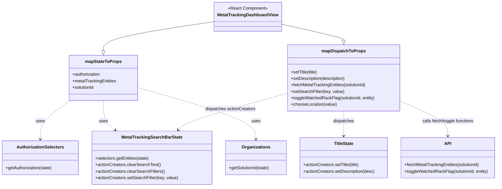

# Diagram: web/portal/src/modules/mt-dashboard/MetalTrackingDashboardContainer.js


> Auto-generated by Obscura crawlers

## Diagram 1

```mermaid
flowchart TD
  A[MetalTrackingDashboardView] -->|connected via connect| B[Redux Connector]
  B --> C(mapStateToProps)
  B --> D(mapDispatchToProps)

  C --> auth[getAuthorization(state)]
  C --> entities[MetalTrackingSearchBarState.selectors.getEntities(state)]
  C --> solutionId[getSolutionId(state)]

  D --> setTitle[setTitle(title) -> TitleState.actionCreators.setTitle]
  D --> setDescription[setDescription(desc) -> TitleState.actionCreators.setDescription]
  D --> fetchEntities[fetchMetalTrackingEntities(solutionId) -> dispatch(fetchMetalTrackingEntities)]
  D --> setSearchFilter[setSearchFilter(key,value) -> clears + setSearchFilter + METAL_TRACKING_SEARCH_RESULTS]
  D --> toggleWatched[toggleWatchedRackFlag(solutionId, entity) -> dispatch(toggleWatchedRackFlag)]
  D --> chooseLocation[chooseLocation(value) -> clears + setSearchFilter('rackLocation',[value]) + METAL_TRACKING_LOCATION_RESULTS]

  subgraph Imports
    MS[MetalTrackingSearchBarState]
    TS[TitleState]
    OR[Organizations.getSolutionId]
    AS[AuthorizationSelectors.getAuthorization]
    TF[toggleWatchedRackFlag / fetchMetalTrackingEntities]
  end

  MS -->|selectors/actionCreators| entities
  TS -->|actionCreators| setTitle
  OR --> solutionId
  AS --> auth
  TF --> toggleWatched
  TF --> fetchEntities
```

> SVG rendering failed for this diagram.

## Diagram 2



### SVG

<svg id="container" width="1838.03125" xmlns="http://www.w3.org/2000/svg" class="classDiagram" height="692" viewBox="0 0 1838.03125 692" role="graphics-document document" aria-roledescription="class"><style>#container{font-family:"trebuchet ms",verdana,arial,sans-serif;font-size:16px;fill:#333;}@keyframes edge-animation-frame{from{stroke-dashoffset:0;}}@keyframes dash{to{stroke-dashoffset:0;}}#container .edge-animation-slow{stroke-dasharray:9,5!important;stroke-dashoffset:900;animation:dash 50s linear infinite;stroke-linecap:round;}#container .edge-animation-fast{stroke-dasharray:9,5!important;stroke-dashoffset:900;animation:dash 20s linear infinite;stroke-linecap:round;}#container .error-icon{fill:#552222;}#container .error-text{fill:#552222;stroke:#552222;}#container .edge-thickness-normal{stroke-width:1px;}#container .edge-thickness-thick{stroke-width:3.5px;}#container .edge-pattern-solid{stroke-dasharray:0;}#container .edge-thickness-invisible{stroke-width:0;fill:none;}#container .edge-pattern-dashed{stroke-dasharray:3;}#container .edge-pattern-dotted{stroke-dasharray:2;}#container .marker{fill:#333333;stroke:#333333;}#container .marker.cross{stroke:#333333;}#container svg{font-family:"trebuchet ms",verdana,arial,sans-serif;font-size:16px;}#container p{margin:0;}#container g.classGroup text{fill:#9370DB;stroke:none;font-family:"trebuchet ms",verdana,arial,sans-serif;font-size:10px;}#container g.classGroup text .title{font-weight:bolder;}#container .nodeLabel,#container .edgeLabel{color:#131300;}#container .edgeLabel .label rect{fill:#ECECFF;}#container .label text{fill:#131300;}#container .labelBkg{background:#ECECFF;}#container .edgeLabel .label span{background:#ECECFF;}#container .classTitle{font-weight:bolder;}#container .node rect,#container .node circle,#container .node ellipse,#container .node polygon,#container .node path{fill:#ECECFF;stroke:#9370DB;stroke-width:1px;}#container .divider{stroke:#9370DB;stroke-width:1;}#container g.clickable{cursor:pointer;}#container g.classGroup rect{fill:#ECECFF;stroke:#9370DB;}#container g.classGroup line{stroke:#9370DB;stroke-width:1;}#container .classLabel .box{stroke:none;stroke-width:0;fill:#ECECFF;opacity:0.5;}#container .classLabel .label{fill:#9370DB;font-size:10px;}#container .relation{stroke:#333333;stroke-width:1;fill:none;}#container .dashed-line{stroke-dasharray:3;}#container .dotted-line{stroke-dasharray:1 2;}#container #compositionStart,#container .composition{fill:#333333!important;stroke:#333333!important;stroke-width:1;}#container #compositionEnd,#container .composition{fill:#333333!important;stroke:#333333!important;stroke-width:1;}#container #dependencyStart,#container .dependency{fill:#333333!important;stroke:#333333!important;stroke-width:1;}#container #dependencyStart,#container .dependency{fill:#333333!important;stroke:#333333!important;stroke-width:1;}#container #extensionStart,#container .extension{fill:transparent!important;stroke:#333333!important;stroke-width:1;}#container #extensionEnd,#container .extension{fill:transparent!important;stroke:#333333!important;stroke-width:1;}#container #aggregationStart,#container .aggregation{fill:transparent!important;stroke:#333333!important;stroke-width:1;}#container #aggregationEnd,#container .aggregation{fill:transparent!important;stroke:#333333!important;stroke-width:1;}#container #lollipopStart,#container .lollipop{fill:#ECECFF!important;stroke:#333333!important;stroke-width:1;}#container #lollipopEnd,#container .lollipop{fill:#ECECFF!important;stroke:#333333!important;stroke-width:1;}#container .edgeTerminals{font-size:11px;line-height:initial;}#container .classTitleText{text-anchor:middle;font-size:18px;fill:#333;}#container .label-icon{display:inline-block;height:1em;overflow:visible;vertical-align:-0.125em;}#container .node .label-icon path{fill:currentColor;stroke:revert;stroke-width:revert;}#container :root{--mermaid-font-family:"trebuchet ms",verdana,arial,sans-serif;}</style><g><defs><marker id="container_class-aggregationStart" class="marker aggregation class" refX="18" refY="7" markerWidth="190" markerHeight="240" orient="auto"><path d="M 18,7 L9,13 L1,7 L9,1 Z"></path></marker></defs><defs><marker id="container_class-aggregationEnd" class="marker aggregation class" refX="1" refY="7" markerWidth="20" markerHeight="28" orient="auto"><path d="M 18,7 L9,13 L1,7 L9,1 Z"></path></marker></defs><defs><marker id="container_class-extensionStart" class="marker extension class" refX="18" refY="7" markerWidth="190" markerHeight="240" orient="auto"><path d="M 1,7 L18,13 V 1 Z"></path></marker></defs><defs><marker id="container_class-extensionEnd" class="marker extension class" refX="1" refY="7" markerWidth="20" markerHeight="28" orient="auto"><path d="M 1,1 V 13 L18,7 Z"></path></marker></defs><defs><marker id="container_class-compositionStart" class="marker composition class" refX="18" refY="7" markerWidth="190" markerHeight="240" orient="auto"><path d="M 18,7 L9,13 L1,7 L9,1 Z"></path></marker></defs><defs><marker id="container_class-compositionEnd" class="marker composition class" refX="1" refY="7" markerWidth="20" markerHeight="28" orient="auto"><path d="M 18,7 L9,13 L1,7 L9,1 Z"></path></marker></defs><defs><marker id="container_class-dependencyStart" class="marker dependency class" refX="6" refY="7" markerWidth="190" markerHeight="240" orient="auto"><path d="M 5,7 L9,13 L1,7 L9,1 Z"></path></marker></defs><defs><marker id="container_class-dependencyEnd" class="marker dependency class" refX="13" refY="7" markerWidth="20" markerHeight="28" orient="auto"><path d="M 18,7 L9,13 L14,7 L9,1 Z"></path></marker></defs><defs><marker id="container_class-lollipopStart" class="marker lollipop class" refX="13" refY="7" markerWidth="190" markerHeight="240" orient="auto"><circle stroke="black" fill="transparent" cx="7" cy="7" r="6"></circle></marker></defs><defs><marker id="container_class-lollipopEnd" class="marker lollipop class" refX="1" refY="7" markerWidth="190" markerHeight="240" orient="auto"><circle stroke="black" fill="transparent" cx="7" cy="7" r="6"></circle></marker></defs><g class="root"><g class="clusters"></g><g class="edgePaths"><path d="M794.23,79.779L725.388,89.982C656.546,100.186,518.862,120.593,450.02,138.588C381.178,156.583,381.178,172.167,381.178,179.958L381.178,187.75" id="id_MetalTrackingDashboardView_mapStateToProps_1" class="edge-thickness-normal edge-pattern-solid relation" style=";;;" data-edge="true" data-et="edge" data-id="id_MetalTrackingDashboardView_mapStateToProps_1" data-points="W3sieCI6Nzk0LjIzMDQ2ODc1LCJ5Ijo3OS43Nzg5NzMxNzMyMjUyN30seyJ4IjozODEuMTc3NzM0Mzc1LCJ5IjoxNDF9LHsieCI6MzgxLjE3NzczNDM3NSwieSI6MjA1fV0=" marker-end="url(#container_class-extensionEnd)"></path><path d="M1034.137,88.745L1073.198,97.454C1112.259,106.163,1190.382,123.582,1229.443,133.583C1268.504,143.583,1268.504,146.167,1268.504,147.458L1268.504,148.75" id="id_MetalTrackingDashboardView_mapDispatchToProps_2" class="edge-thickness-normal edge-pattern-solid relation" style=";;;" data-edge="true" data-et="edge" data-id="id_MetalTrackingDashboardView_mapDispatchToProps_2" data-points="W3sieCI6MTAzNC4xMzY3MTg3NSwieSI6ODguNzQ1MDAwMzMwNzM4ODh9LHsieCI6MTI2OC41MDM5MDYyNSwieSI6MTQxfSx7IngiOjEyNjguNTAzOTA2MjUsInkiOjE2Nn1d" marker-end="url(#container_class-extensionEnd)"></path><path d="M259.551,373L241.21,385.667C222.87,398.333,186.189,423.667,167.848,447.5C149.508,471.333,149.508,493.667,149.508,504.833L149.508,516" id="id_mapStateToProps_AuthorizationSelectors_3" class="edge-thickness-normal edge-pattern-dashed relation" style=";;;" data-edge="true" data-et="edge" data-id="id_mapStateToProps_AuthorizationSelectors_3" data-points="W3sieCI6MjU5LjU1MTAyNTM5MDYyNSwieSI6MzczfSx7IngiOjE0OS41MDc4MTI1LCJ5Ijo0NDl9LHsieCI6MTQ5LjUwNzgxMjUsInkiOjUyMn1d" marker-end="url(#container_class-dependencyEnd)"></path><path d="M381.178,373L381.178,385.667C381.178,398.333,381.178,423.667,388.484,441.894C395.791,460.122,410.403,471.244,417.71,476.805L425.016,482.366" id="id_mapStateToProps_MetalTrackingSearchBarState_4" class="edge-thickness-normal edge-pattern-dashed relation" style=";;;" data-edge="true" data-et="edge" data-id="id_mapStateToProps_MetalTrackingSearchBarState_4" data-points="W3sieCI6MzgxLjE3NzczNDM3NSwieSI6MzczfSx7IngiOjM4MS4xNzc3MzQzNzUsInkiOjQ0OX0seyJ4Ijo0MjkuNzkwNzE0MDM5NTIyMSwieSI6NDg2fV0=" marker-end="url(#container_class-dependencyEnd)"></path><path d="M507.549,325.042L579.987,345.701C652.424,366.361,797.3,407.681,869.738,439.507C942.176,471.333,942.176,493.667,942.176,504.833L942.176,516" id="id_mapStateToProps_Organizations_5" class="edge-thickness-normal edge-pattern-dashed relation" style=";;;" data-edge="true" data-et="edge" data-id="id_mapStateToProps_Organizations_5" data-points="W3sieCI6NTA3LjU0ODgyODEyNSwieSI6MzI1LjA0MTc5MjE0NjM5MDl9LHsieCI6OTQyLjE3NTc4MTI1LCJ5Ijo0NDl9LHsieCI6OTQyLjE3NTc4MTI1LCJ5Ijo1MjJ9XQ==" marker-end="url(#container_class-dependencyEnd)"></path><path d="M1268.504,412L1268.504,418.167C1268.504,424.333,1268.504,436.667,1268.504,452C1268.504,467.333,1268.504,485.667,1268.504,494.833L1268.504,504" id="id_mapDispatchToProps_TitleState_6" class="edge-thickness-normal edge-pattern-dashed relation" style=";;;" data-edge="true" data-et="edge" data-id="id_mapDispatchToProps_TitleState_6" data-points="W3sieCI6MTI2OC41MDM5MDYyNSwieSI6NDEyfSx7IngiOjEyNjguNTAzOTA2MjUsInkiOjQ0OX0seyJ4IjoxMjY4LjUwMzkwNjI1LCJ5Ijo1MTB9XQ==" marker-end="url(#container_class-dependencyEnd)"></path><path d="M1061.508,345.837L998.889,363.031C936.27,380.224,811.031,414.612,743.381,437.239C675.732,459.866,665.67,470.732,660.64,476.165L655.609,481.597" id="id_mapDispatchToProps_MetalTrackingSearchBarState_7" class="edge-thickness-normal edge-pattern-dashed relation" style=";;;" data-edge="true" data-et="edge" data-id="id_mapDispatchToProps_MetalTrackingSearchBarState_7" data-points="W3sieCI6MTA2MS41MDc4MTI1LCJ5IjozNDUuODM2NzE0MTcyNzExMX0seyJ4Ijo2ODUuNzkyOTY4NzUsInkiOjQ0OX0seyJ4Ijo2NTEuNTMyNjg2MTIxMzIzNSwieSI6NDg2fV0=" marker-end="url(#container_class-dependencyEnd)"></path><path d="M1475.5,374.537L1505.533,386.947C1535.566,399.358,1595.633,424.179,1625.666,445.756C1655.699,467.333,1655.699,485.667,1655.699,494.833L1655.699,504" id="id_mapDispatchToProps_API_8" class="edge-thickness-normal edge-pattern-dashed relation" style=";;;" data-edge="true" data-et="edge" data-id="id_mapDispatchToProps_API_8" data-points="W3sieCI6MTQ3NS41LCJ5IjozNzQuNTM2NjExNDQ4NTE4fSx7IngiOjE2NTUuNjk5MjE4NzUsInkiOjQ0OX0seyJ4IjoxNjU1LjY5OTIxODc1LCJ5Ijo1MTB9XQ==" marker-end="url(#container_class-dependencyEnd)"></path></g><g class="edgeLabels"><g class="edgeLabel"><g class="label" data-id="id_MetalTrackingDashboardView_mapStateToProps_1" transform="translate(0, 0)"><foreignObject width="0" height="0"><div xmlns="http://www.w3.org/1999/xhtml" class="labelBkg" style="display: table-cell; white-space: nowrap; line-height: 1.5; max-width: 200px; text-align: center;"><span class="edgeLabel"></span></div></foreignObject></g></g><g class="edgeLabel"><g class="label" data-id="id_MetalTrackingDashboardView_mapDispatchToProps_2" transform="translate(0, 0)"><foreignObject width="0" height="0"><div xmlns="http://www.w3.org/1999/xhtml" class="labelBkg" style="display: table-cell; white-space: nowrap; line-height: 1.5; max-width: 200px; text-align: center;"><span class="edgeLabel"></span></div></foreignObject></g></g><g class="edgeLabel" transform="translate(149.5078125, 449)"><g class="label" data-id="id_mapStateToProps_AuthorizationSelectors_3" transform="translate(-16.4921875, -12)"><foreignObject width="32.984375" height="24"><div xmlns="http://www.w3.org/1999/xhtml" class="labelBkg" style="display: table-cell; white-space: nowrap; line-height: 1.5; max-width: 200px; text-align: center;"><span class="edgeLabel"><p>uses</p></span></div></foreignObject></g></g><g class="edgeLabel" transform="translate(381.177734375, 449)"><g class="label" data-id="id_mapStateToProps_MetalTrackingSearchBarState_4" transform="translate(-16.4921875, -12)"><foreignObject width="32.984375" height="24"><div xmlns="http://www.w3.org/1999/xhtml" class="labelBkg" style="display: table-cell; white-space: nowrap; line-height: 1.5; max-width: 200px; text-align: center;"><span class="edgeLabel"><p>uses</p></span></div></foreignObject></g></g><g class="edgeLabel" transform="translate(942.17578125, 449)"><g class="label" data-id="id_mapStateToProps_Organizations_5" transform="translate(-16.4921875, -12)"><foreignObject width="32.984375" height="24"><div xmlns="http://www.w3.org/1999/xhtml" class="labelBkg" style="display: table-cell; white-space: nowrap; line-height: 1.5; max-width: 200px; text-align: center;"><span class="edgeLabel"><p>uses</p></span></div></foreignObject></g></g><g class="edgeLabel" transform="translate(1268.50390625, 449)"><g class="label" data-id="id_mapDispatchToProps_TitleState_6" transform="translate(-39.1796875, -12)"><foreignObject width="78.359375" height="24"><div xmlns="http://www.w3.org/1999/xhtml" class="labelBkg" style="display: table-cell; white-space: nowrap; line-height: 1.5; max-width: 200px; text-align: center;"><span class="edgeLabel"><p>dispatches</p></span></div></foreignObject></g></g><g class="edgeLabel" transform="translate(849.33733, 404.0942)"><g class="label" data-id="id_mapDispatchToProps_MetalTrackingSearchBarState_7" transform="translate(-93.9609375, -12)"><foreignObject width="187.921875" height="24"><div xmlns="http://www.w3.org/1999/xhtml" class="labelBkg" style="display: table-cell; white-space: nowrap; line-height: 1.5; max-width: 200px; text-align: center;"><span class="edgeLabel"><p>dispatches actionCreators</p></span></div></foreignObject></g></g><g class="edgeLabel" transform="translate(1655.69921875, 449)"><g class="label" data-id="id_mapDispatchToProps_API_8" transform="translate(-99.359375, -12)"><foreignObject width="198.71875" height="24"><div xmlns="http://www.w3.org/1999/xhtml" class="labelBkg" style="display: table-cell; white-space: nowrap; line-height: 1.5; max-width: 200px; text-align: center;"><span class="edgeLabel"><p>calls fetch/toggle functions</p></span></div></foreignObject></g></g></g><g class="nodes"><g class="node default" id="classId-MetalTrackingDashboardView-0" transform="translate(914.18359375, 62)"><g class="basic label-container"><path d="M-119.953125 -54 L119.953125 -54 L119.953125 54 L-119.953125 54" stroke="none" stroke-width="0" fill="#ECECFF" style=""></path><path d="M-119.953125 -54 C-51.167701807764686 -54, 17.617721384470627 -54, 119.953125 -54 M-119.953125 -54 C-52.31919943508228 -54, 15.314726129835435 -54, 119.953125 -54 M119.953125 -54 C119.953125 -23.26019550130658, 119.953125 7.4796089973868405, 119.953125 54 M119.953125 -54 C119.953125 -23.825437924375358, 119.953125 6.349124151249285, 119.953125 54 M119.953125 54 C66.71470953987358 54, 13.476294079747163 54, -119.953125 54 M119.953125 54 C30.63306247135465 54, -58.6870000572907 54, -119.953125 54 M-119.953125 54 C-119.953125 25.866770686524305, -119.953125 -2.2664586269513904, -119.953125 -54 M-119.953125 54 C-119.953125 18.492239475133886, -119.953125 -17.01552104973223, -119.953125 -54" stroke="#9370DB" stroke-width="1.3" fill="none" stroke-dasharray="0 0" style=""></path></g><g class="annotation-group text" transform="translate(-73.2109375, -30)"><g class="label" style="" transform="translate(0,-12)"><foreignObject width="146.421875" height="24"><div xmlns="http://www.w3.org/1999/xhtml" style="display: table-cell; white-space: nowrap; line-height: 1.5; max-width: 196px; text-align: center;"><span class="nodeLabel markdown-node-label" style=""><p>«React Component»</p></span></div></foreignObject></g></g><g class="label-group text" transform="translate(-107.953125, -6)"><g class="label" style="font-weight: bolder" transform="translate(0,-12)"><foreignObject width="215.90625" height="24"><div xmlns="http://www.w3.org/1999/xhtml" style="display: table-cell; white-space: nowrap; line-height: 1.5; max-width: 263px; text-align: center;"><span class="nodeLabel markdown-node-label" style=""><p>MetalTrackingDashboardView</p></span></div></foreignObject></g></g><g class="members-group text" transform="translate(-107.953125, 42)"></g><g class="methods-group text" transform="translate(-107.953125, 72)"></g><g class="divider" style=""><path d="M-119.953125 18 C-31.838599646089307 18, 56.275925707821386 18, 119.953125 18 M-119.953125 18 C-31.712837963720133 18, 56.52744907255973 18, 119.953125 18" stroke="#9370DB" stroke-width="1.3" fill="none" stroke-dasharray="0 0" style=""></path></g><g class="divider" style=""><path d="M-119.953125 36 C-66.2363767130804 36, -12.519628426160807 36, 119.953125 36 M-119.953125 36 C-62.58225133334604 36, -5.211377666692087 36, 119.953125 36" stroke="#9370DB" stroke-width="1.3" fill="none" stroke-dasharray="0 0" style=""></path></g></g><g class="node default" id="classId-mapStateToProps-1" transform="translate(381.177734375, 289)"><g class="basic label-container"><path d="M-126.37109375 -84 L126.37109375 -84 L126.37109375 84 L-126.37109375 84" stroke="none" stroke-width="0" fill="#ECECFF" style=""></path><path d="M-126.37109375 -84 C-43.74601979790856 -84, 38.87905415418288 -84, 126.37109375 -84 M-126.37109375 -84 C-73.81199838315449 -84, -21.252903016308977 -84, 126.37109375 -84 M126.37109375 -84 C126.37109375 -44.87170871353413, 126.37109375 -5.743417427068266, 126.37109375 84 M126.37109375 -84 C126.37109375 -37.44854184005398, 126.37109375 9.102916319892046, 126.37109375 84 M126.37109375 84 C74.71118865627803 84, 23.05128356255605 84, -126.37109375 84 M126.37109375 84 C61.47074066187916 84, -3.4296124262416754 84, -126.37109375 84 M-126.37109375 84 C-126.37109375 21.268547361464826, -126.37109375 -41.46290527707035, -126.37109375 -84 M-126.37109375 84 C-126.37109375 45.03448219926012, -126.37109375 6.068964398520237, -126.37109375 -84" stroke="#9370DB" stroke-width="1.3" fill="none" stroke-dasharray="0 0" style=""></path></g><g class="annotation-group text" transform="translate(0, -60)"></g><g class="label-group text" transform="translate(-64.7109375, -60)"><g class="label" style="font-weight: bolder" transform="translate(0,-12)"><foreignObject width="129.421875" height="24"><div xmlns="http://www.w3.org/1999/xhtml" style="display: table-cell; white-space: nowrap; line-height: 1.5; max-width: 177px; text-align: center;"><span class="nodeLabel markdown-node-label" style=""><p>mapStateToProps</p></span></div></foreignObject></g></g><g class="members-group text" transform="translate(-114.37109375, -12)"><g class="label" style="" transform="translate(0,-12)"><foreignObject width="105.421875" height="24"><div xmlns="http://www.w3.org/1999/xhtml" style="display: table-cell; white-space: nowrap; line-height: 1.5; max-width: 163px; text-align: center;"><span class="nodeLabel markdown-node-label" style=""><p>+authorization</p></span></div></foreignObject></g><g class="label" style="" transform="translate(0,12)"><foreignObject width="164.03125" height="24"><div xmlns="http://www.w3.org/1999/xhtml" style="display: table-cell; white-space: nowrap; line-height: 1.5; max-width: 221px; text-align: center;"><span class="nodeLabel markdown-node-label" style=""><p>+metalTrackingEntities</p></span></div></foreignObject></g><g class="label" style="" transform="translate(0,36)"><foreignObject width="82.109375" height="24"><div xmlns="http://www.w3.org/1999/xhtml" style="display: table-cell; white-space: nowrap; line-height: 1.5; max-width: 139px; text-align: center;"><span class="nodeLabel markdown-node-label" style=""><p>+solutionId</p></span></div></foreignObject></g></g><g class="methods-group text" transform="translate(-114.37109375, 84)"></g><g class="divider" style=""><path d="M-126.37109375 -36 C-34.6924858582577 -36, 56.986122033484605 -36, 126.37109375 -36 M-126.37109375 -36 C-45.13915716580462 -36, 36.09277941839076 -36, 126.37109375 -36" stroke="#9370DB" stroke-width="1.3" fill="none" stroke-dasharray="0 0" style=""></path></g><g class="divider" style=""><path d="M-126.37109375 60 C-56.05929776010906 60, 14.252498229781878 60, 126.37109375 60 M-126.37109375 60 C-72.75813818402415 60, -19.14518261804831 60, 126.37109375 60" stroke="#9370DB" stroke-width="1.3" fill="none" stroke-dasharray="0 0" style=""></path></g></g><g class="node default" id="classId-mapDispatchToProps-2" transform="translate(1268.50390625, 289)"><g class="basic label-container"><path d="M-206.99609375 -123 L206.99609375 -123 L206.99609375 123 L-206.99609375 123" stroke="none" stroke-width="0" fill="#ECECFF" style=""></path><path d="M-206.99609375 -123 C-99.54288354775322 -123, 7.910326654493559 -123, 206.99609375 -123 M-206.99609375 -123 C-121.39192867507215 -123, -35.7877636001443 -123, 206.99609375 -123 M206.99609375 -123 C206.99609375 -33.23055077780596, 206.99609375 56.53889844438808, 206.99609375 123 M206.99609375 -123 C206.99609375 -59.10223263482568, 206.99609375 4.795534730348635, 206.99609375 123 M206.99609375 123 C82.12653111708816 123, -42.743031515823674 123, -206.99609375 123 M206.99609375 123 C78.30999063833877 123, -50.37611247332245 123, -206.99609375 123 M-206.99609375 123 C-206.99609375 33.34877242566118, -206.99609375 -56.30245514867764, -206.99609375 -123 M-206.99609375 123 C-206.99609375 35.31978238643444, -206.99609375 -52.36043522713112, -206.99609375 -123" stroke="#9370DB" stroke-width="1.3" fill="none" stroke-dasharray="0 0" style=""></path></g><g class="annotation-group text" transform="translate(0, -99)"></g><g class="label-group text" transform="translate(-77.1953125, -99)"><g class="label" style="font-weight: bolder" transform="translate(0,-12)"><foreignObject width="154.390625" height="24"><div xmlns="http://www.w3.org/1999/xhtml" style="display: table-cell; white-space: nowrap; line-height: 1.5; max-width: 203px; text-align: center;"><span class="nodeLabel markdown-node-label" style=""><p>mapDispatchToProps</p></span></div></foreignObject></g></g><g class="members-group text" transform="translate(-194.99609375, -51)"></g><g class="methods-group text" transform="translate(-194.99609375, -21)"><g class="label" style="" transform="translate(0,-12)"><foreignObject width="101.28125" height="24"><div xmlns="http://www.w3.org/1999/xhtml" style="display: table-cell; white-space: nowrap; line-height: 1.5; max-width: 159px; text-align: center;"><span class="nodeLabel markdown-node-label" style=""><p>+setTitle(title)</p></span></div></foreignObject></g><g class="label" style="" transform="translate(0,12)"><foreignObject width="206.28125" height="24"><div xmlns="http://www.w3.org/1999/xhtml" style="display: table-cell; white-space: nowrap; line-height: 1.5; max-width: 264px; text-align: center;"><span class="nodeLabel markdown-node-label" style=""><p>+setDescription(description)</p></span></div></foreignObject></g><g class="label" style="" transform="translate(0,36)"><foreignObject width="283.484375" height="24"><div xmlns="http://www.w3.org/1999/xhtml" style="display: table-cell; white-space: nowrap; line-height: 1.5; max-width: 341px; text-align: center;"><span class="nodeLabel markdown-node-label" style=""><p>+fetchMetalTrackingEntities(solutionId)</p></span></div></foreignObject></g><g class="label" style="" transform="translate(0,60)"><foreignObject width="196.859375" height="24"><div xmlns="http://www.w3.org/1999/xhtml" style="display: table-cell; white-space: nowrap; line-height: 1.5; max-width: 254px; text-align: center;"><span class="nodeLabel markdown-node-label" style=""><p>+setSearchFilter(key, value)</p></span></div></foreignObject></g><g class="label" style="" transform="translate(0,84)"><foreignObject width="312.796875" height="24"><div xmlns="http://www.w3.org/1999/xhtml" style="display: table-cell; white-space: nowrap; line-height: 1.5; max-width: 370px; text-align: center;"><span class="nodeLabel markdown-node-label" style=""><p>+toggleWatchedRackFlag(solutionId, entity)</p></span></div></foreignObject></g><g class="label" style="" transform="translate(0,108)"><foreignObject width="171.25" height="24"><div xmlns="http://www.w3.org/1999/xhtml" style="display: table-cell; white-space: nowrap; line-height: 1.5; max-width: 229px; text-align: center;"><span class="nodeLabel markdown-node-label" style=""><p>+chooseLocation(value)</p></span></div></foreignObject></g></g><g class="divider" style=""><path d="M-206.99609375 -75 C-60.85641189636064 -75, 85.28326995727872 -75, 206.99609375 -75 M-206.99609375 -75 C-91.00148964785949 -75, 24.993114454281027 -75, 206.99609375 -75" stroke="#9370DB" stroke-width="1.3" fill="none" stroke-dasharray="0 0" style=""></path></g><g class="divider" style=""><path d="M-206.99609375 -51 C-119.658046836235 -51, -32.319999922470004 -51, 206.99609375 -51 M-206.99609375 -51 C-71.37802181842548 -51, 64.24005011314904 -51, 206.99609375 -51" stroke="#9370DB" stroke-width="1.3" fill="none" stroke-dasharray="0 0" style=""></path></g></g><g class="node default" id="classId-MetalTrackingSearchBarState-3" transform="translate(559.86328125, 585)"><g class="basic label-container"><path d="M-218.84765625 -99 L218.84765625 -99 L218.84765625 99 L-218.84765625 99" stroke="none" stroke-width="0" fill="#ECECFF" style=""></path><path d="M-218.84765625 -99 C-48.67883178113419 -99, 121.48999268773161 -99, 218.84765625 -99 M-218.84765625 -99 C-110.51669416997767 -99, -2.185732089955337 -99, 218.84765625 -99 M218.84765625 -99 C218.84765625 -51.77812717201383, 218.84765625 -4.556254344027664, 218.84765625 99 M218.84765625 -99 C218.84765625 -35.39516625290017, 218.84765625 28.209667494199664, 218.84765625 99 M218.84765625 99 C114.56172522180195 99, 10.2757941936039 99, -218.84765625 99 M218.84765625 99 C79.854964429045 99, -59.137727391910005 99, -218.84765625 99 M-218.84765625 99 C-218.84765625 46.64462286249674, -218.84765625 -5.710754275006522, -218.84765625 -99 M-218.84765625 99 C-218.84765625 25.293880675526566, -218.84765625 -48.41223864894687, -218.84765625 -99" stroke="#9370DB" stroke-width="1.3" fill="none" stroke-dasharray="0 0" style=""></path></g><g class="annotation-group text" transform="translate(0, -75)"></g><g class="label-group text" transform="translate(-107.8515625, -75)"><g class="label" style="font-weight: bolder" transform="translate(0,-12)"><foreignObject width="215.703125" height="24"><div xmlns="http://www.w3.org/1999/xhtml" style="display: table-cell; white-space: nowrap; line-height: 1.5; max-width: 261px; text-align: center;"><span class="nodeLabel markdown-node-label" style=""><p>MetalTrackingSearchBarState</p></span></div></foreignObject></g></g><g class="members-group text" transform="translate(-206.84765625, -27)"></g><g class="methods-group text" transform="translate(-206.84765625, 3)"><g class="label" style="" transform="translate(0,-12)"><foreignObject width="200.703125" height="24"><div xmlns="http://www.w3.org/1999/xhtml" style="display: table-cell; white-space: nowrap; line-height: 1.5; max-width: 258px; text-align: center;"><span class="nodeLabel markdown-node-label" style=""><p>+selectors.getEntities(state)</p></span></div></foreignObject></g><g class="label" style="" transform="translate(0,12)"><foreignObject width="241.03125" height="24"><div xmlns="http://www.w3.org/1999/xhtml" style="display: table-cell; white-space: nowrap; line-height: 1.5; max-width: 298px; text-align: center;"><span class="nodeLabel markdown-node-label" style=""><p>+actionCreators.clearSearchText()</p></span></div></foreignObject></g><g class="label" style="" transform="translate(0,36)"><foreignObject width="255.6875" height="24"><div xmlns="http://www.w3.org/1999/xhtml" style="display: table-cell; white-space: nowrap; line-height: 1.5; max-width: 313px; text-align: center;"><span class="nodeLabel markdown-node-label" style=""><p>+actionCreators.clearSearchFilters()</p></span></div></foreignObject></g><g class="label" style="" transform="translate(0,60)"><foreignObject width="305.84375" height="24"><div xmlns="http://www.w3.org/1999/xhtml" style="display: table-cell; white-space: nowrap; line-height: 1.5; max-width: 363px; text-align: center;"><span class="nodeLabel markdown-node-label" style=""><p>+actionCreators.setSearchFilter(key, value)</p></span></div></foreignObject></g></g><g class="divider" style=""><path d="M-218.84765625 -51 C-61.44351816617083 -51, 95.96061991765833 -51, 218.84765625 -51 M-218.84765625 -51 C-75.26286767992644 -51, 68.32192089014711 -51, 218.84765625 -51" stroke="#9370DB" stroke-width="1.3" fill="none" stroke-dasharray="0 0" style=""></path></g><g class="divider" style=""><path d="M-218.84765625 -27 C-66.4258493961079 -27, 85.99595745778419 -27, 218.84765625 -27 M-218.84765625 -27 C-94.64085120240493 -27, 29.565953845190137 -27, 218.84765625 -27" stroke="#9370DB" stroke-width="1.3" fill="none" stroke-dasharray="0 0" style=""></path></g></g><g class="node default" id="classId-TitleState-4" transform="translate(1268.50390625, 585)"><g class="basic label-container"><path d="M-162.86328125 -75 L162.86328125 -75 L162.86328125 75 L-162.86328125 75" stroke="none" stroke-width="0" fill="#ECECFF" style=""></path><path d="M-162.86328125 -75 C-70.59990127936778 -75, 21.66347869126443 -75, 162.86328125 -75 M-162.86328125 -75 C-92.65604332263435 -75, -22.448805395268693 -75, 162.86328125 -75 M162.86328125 -75 C162.86328125 -30.33155573014743, 162.86328125 14.336888539705143, 162.86328125 75 M162.86328125 -75 C162.86328125 -29.060755554766757, 162.86328125 16.878488890466485, 162.86328125 75 M162.86328125 75 C66.00403348200383 75, -30.855214285992332 75, -162.86328125 75 M162.86328125 75 C46.27264267031788 75, -70.31799590936424 75, -162.86328125 75 M-162.86328125 75 C-162.86328125 41.195513977368456, -162.86328125 7.391027954736913, -162.86328125 -75 M-162.86328125 75 C-162.86328125 39.8026649897488, -162.86328125 4.605329979497597, -162.86328125 -75" stroke="#9370DB" stroke-width="1.3" fill="none" stroke-dasharray="0 0" style=""></path></g><g class="annotation-group text" transform="translate(0, -51)"></g><g class="label-group text" transform="translate(-35.6484375, -51)"><g class="label" style="font-weight: bolder" transform="translate(0,-12)"><foreignObject width="71.296875" height="24"><div xmlns="http://www.w3.org/1999/xhtml" style="display: table-cell; white-space: nowrap; line-height: 1.5; max-width: 119px; text-align: center;"><span class="nodeLabel markdown-node-label" style=""><p>TitleState</p></span></div></foreignObject></g></g><g class="members-group text" transform="translate(-150.86328125, -3)"></g><g class="methods-group text" transform="translate(-150.86328125, 27)"><g class="label" style="" transform="translate(0,-12)"><foreignObject width="210.28125" height="24"><div xmlns="http://www.w3.org/1999/xhtml" style="display: table-cell; white-space: nowrap; line-height: 1.5; max-width: 268px; text-align: center;"><span class="nodeLabel markdown-node-label" style=""><p>+actionCreators.setTitle(title)</p></span></div></foreignObject></g><g class="label" style="" transform="translate(0,12)"><foreignObject width="266.078125" height="24"><div xmlns="http://www.w3.org/1999/xhtml" style="display: table-cell; white-space: nowrap; line-height: 1.5; max-width: 323px; text-align: center;"><span class="nodeLabel markdown-node-label" style=""><p>+actionCreators.setDescription(desc)</p></span></div></foreignObject></g></g><g class="divider" style=""><path d="M-162.86328125 -27 C-47.169925985121935 -27, 68.52342927975613 -27, 162.86328125 -27 M-162.86328125 -27 C-37.50944694172897 -27, 87.84438736654207 -27, 162.86328125 -27" stroke="#9370DB" stroke-width="1.3" fill="none" stroke-dasharray="0 0" style=""></path></g><g class="divider" style=""><path d="M-162.86328125 -3 C-55.03368580448533 -3, 52.79590964102934 -3, 162.86328125 -3 M-162.86328125 -3 C-85.61761379948584 -3, -8.371946348971676 -3, 162.86328125 -3" stroke="#9370DB" stroke-width="1.3" fill="none" stroke-dasharray="0 0" style=""></path></g></g><g class="node default" id="classId-Organizations-5" transform="translate(942.17578125, 585)"><g class="basic label-container"><path d="M-113.46484375 -63 L113.46484375 -63 L113.46484375 63 L-113.46484375 63" stroke="none" stroke-width="0" fill="#ECECFF" style=""></path><path d="M-113.46484375 -63 C-54.432947706895156 -63, 4.598948336209688 -63, 113.46484375 -63 M-113.46484375 -63 C-53.74236845913012 -63, 5.980106831739761 -63, 113.46484375 -63 M113.46484375 -63 C113.46484375 -12.853928297533557, 113.46484375 37.29214340493289, 113.46484375 63 M113.46484375 -63 C113.46484375 -22.75415745856734, 113.46484375 17.491685082865317, 113.46484375 63 M113.46484375 63 C45.641678925942855 63, -22.18148589811429 63, -113.46484375 63 M113.46484375 63 C50.23286189780512 63, -12.999119954389755 63, -113.46484375 63 M-113.46484375 63 C-113.46484375 15.58838694920535, -113.46484375 -31.8232261015893, -113.46484375 -63 M-113.46484375 63 C-113.46484375 29.81475050340483, -113.46484375 -3.3704989931903384, -113.46484375 -63" stroke="#9370DB" stroke-width="1.3" fill="none" stroke-dasharray="0 0" style=""></path></g><g class="annotation-group text" transform="translate(0, -39)"></g><g class="label-group text" transform="translate(-50.5546875, -39)"><g class="label" style="font-weight: bolder" transform="translate(0,-12)"><foreignObject width="101.109375" height="24"><div xmlns="http://www.w3.org/1999/xhtml" style="display: table-cell; white-space: nowrap; line-height: 1.5; max-width: 150px; text-align: center;"><span class="nodeLabel markdown-node-label" style=""><p>Organizations</p></span></div></foreignObject></g></g><g class="members-group text" transform="translate(-101.46484375, 9)"></g><g class="methods-group text" transform="translate(-101.46484375, 39)"><g class="label" style="" transform="translate(0,-12)"><foreignObject width="152.375" height="24"><div xmlns="http://www.w3.org/1999/xhtml" style="display: table-cell; white-space: nowrap; line-height: 1.5; max-width: 210px; text-align: center;"><span class="nodeLabel markdown-node-label" style=""><p>+getSolutionId(state)</p></span></div></foreignObject></g></g><g class="divider" style=""><path d="M-113.46484375 -15 C-61.103878170477536 -15, -8.742912590955072 -15, 113.46484375 -15 M-113.46484375 -15 C-51.26892763504562 -15, 10.926988479908758 -15, 113.46484375 -15" stroke="#9370DB" stroke-width="1.3" fill="none" stroke-dasharray="0 0" style=""></path></g><g class="divider" style=""><path d="M-113.46484375 9 C-24.603861101047414 9, 64.25712154790517 9, 113.46484375 9 M-113.46484375 9 C-44.44184075107812 9, 24.581162247843764 9, 113.46484375 9" stroke="#9370DB" stroke-width="1.3" fill="none" stroke-dasharray="0 0" style=""></path></g></g><g class="node default" id="classId-AuthorizationSelectors-6" transform="translate(149.5078125, 585)"><g class="basic label-container"><path d="M-141.5078125 -63 L141.5078125 -63 L141.5078125 63 L-141.5078125 63" stroke="none" stroke-width="0" fill="#ECECFF" style=""></path><path d="M-141.5078125 -63 C-69.61858955860467 -63, 2.2706333827906633 -63, 141.5078125 -63 M-141.5078125 -63 C-43.100855060615984 -63, 55.30610237876803 -63, 141.5078125 -63 M141.5078125 -63 C141.5078125 -17.370671228333507, 141.5078125 28.258657543332987, 141.5078125 63 M141.5078125 -63 C141.5078125 -15.269887829177911, 141.5078125 32.46022434164418, 141.5078125 63 M141.5078125 63 C45.28451384031281 63, -50.938784819374376 63, -141.5078125 63 M141.5078125 63 C43.465951434237724 63, -54.57590963152455 63, -141.5078125 63 M-141.5078125 63 C-141.5078125 21.63631767927643, -141.5078125 -19.72736464144714, -141.5078125 -63 M-141.5078125 63 C-141.5078125 27.41425417518562, -141.5078125 -8.171491649628763, -141.5078125 -63" stroke="#9370DB" stroke-width="1.3" fill="none" stroke-dasharray="0 0" style=""></path></g><g class="annotation-group text" transform="translate(0, -39)"></g><g class="label-group text" transform="translate(-83.875, -39)"><g class="label" style="font-weight: bolder" transform="translate(0,-12)"><foreignObject width="167.75" height="24"><div xmlns="http://www.w3.org/1999/xhtml" style="display: table-cell; white-space: nowrap; line-height: 1.5; max-width: 215px; text-align: center;"><span class="nodeLabel markdown-node-label" style=""><p>AuthorizationSelectors</p></span></div></foreignObject></g></g><g class="members-group text" transform="translate(-129.5078125, 9)"></g><g class="methods-group text" transform="translate(-129.5078125, 39)"><g class="label" style="" transform="translate(0,-12)"><foreignObject width="175.140625" height="24"><div xmlns="http://www.w3.org/1999/xhtml" style="display: table-cell; white-space: nowrap; line-height: 1.5; max-width: 233px; text-align: center;"><span class="nodeLabel markdown-node-label" style=""><p>+getAuthorization(state)</p></span></div></foreignObject></g></g><g class="divider" style=""><path d="M-141.5078125 -15 C-30.531863636356263 -15, 80.44408522728747 -15, 141.5078125 -15 M-141.5078125 -15 C-71.81873988831244 -15, -2.129667276624872 -15, 141.5078125 -15" stroke="#9370DB" stroke-width="1.3" fill="none" stroke-dasharray="0 0" style=""></path></g><g class="divider" style=""><path d="M-141.5078125 9 C-44.61669031515015 9, 52.2744318696997 9, 141.5078125 9 M-141.5078125 9 C-58.894923442006615 9, 23.71796561598677 9, 141.5078125 9" stroke="#9370DB" stroke-width="1.3" fill="none" stroke-dasharray="0 0" style=""></path></g></g><g class="node default" id="classId-API-7" transform="translate(1655.69921875, 585)"><g class="basic label-container"><path d="M-174.33203125 -75 L174.33203125 -75 L174.33203125 75 L-174.33203125 75" stroke="none" stroke-width="0" fill="#ECECFF" style=""></path><path d="M-174.33203125 -75 C-42.640646038629626 -75, 89.05073917274075 -75, 174.33203125 -75 M-174.33203125 -75 C-102.59137728941279 -75, -30.85072332882558 -75, 174.33203125 -75 M174.33203125 -75 C174.33203125 -30.87635609347428, 174.33203125 13.247287813051443, 174.33203125 75 M174.33203125 -75 C174.33203125 -40.164830546445636, 174.33203125 -5.329661092891271, 174.33203125 75 M174.33203125 75 C82.81726371798987 75, -8.697503814020251 75, -174.33203125 75 M174.33203125 75 C56.92002419639802 75, -60.491982857203965 75, -174.33203125 75 M-174.33203125 75 C-174.33203125 28.118419514087343, -174.33203125 -18.763160971825315, -174.33203125 -75 M-174.33203125 75 C-174.33203125 23.685600846149256, -174.33203125 -27.628798307701487, -174.33203125 -75" stroke="#9370DB" stroke-width="1.3" fill="none" stroke-dasharray="0 0" style=""></path></g><g class="annotation-group text" transform="translate(0, -51)"></g><g class="label-group text" transform="translate(-11.8671875, -51)"><g class="label" style="font-weight: bolder" transform="translate(0,-12)"><foreignObject width="23.734375" height="24"><div xmlns="http://www.w3.org/1999/xhtml" style="display: table-cell; white-space: nowrap; line-height: 1.5; max-width: 73px; text-align: center;"><span class="nodeLabel markdown-node-label" style=""><p>API</p></span></div></foreignObject></g></g><g class="members-group text" transform="translate(-162.33203125, -3)"></g><g class="methods-group text" transform="translate(-162.33203125, 27)"><g class="label" style="" transform="translate(0,-12)"><foreignObject width="283.484375" height="24"><div xmlns="http://www.w3.org/1999/xhtml" style="display: table-cell; white-space: nowrap; line-height: 1.5; max-width: 341px; text-align: center;"><span class="nodeLabel markdown-node-label" style=""><p>+fetchMetalTrackingEntities(solutionId)</p></span></div></foreignObject></g><g class="label" style="" transform="translate(0,12)"><foreignObject width="312.796875" height="24"><div xmlns="http://www.w3.org/1999/xhtml" style="display: table-cell; white-space: nowrap; line-height: 1.5; max-width: 370px; text-align: center;"><span class="nodeLabel markdown-node-label" style=""><p>+toggleWatchedRackFlag(solutionId, entity)</p></span></div></foreignObject></g></g><g class="divider" style=""><path d="M-174.33203125 -27 C-61.516108474582026 -27, 51.29981430083595 -27, 174.33203125 -27 M-174.33203125 -27 C-77.01542581563812 -27, 20.30117961872375 -27, 174.33203125 -27" stroke="#9370DB" stroke-width="1.3" fill="none" stroke-dasharray="0 0" style=""></path></g><g class="divider" style=""><path d="M-174.33203125 -3 C-97.36628766752587 -3, -20.400544085051735 -3, 174.33203125 -3 M-174.33203125 -3 C-55.80556769677764 -3, 62.72089585644471 -3, 174.33203125 -3" stroke="#9370DB" stroke-width="1.3" fill="none" stroke-dasharray="0 0" style=""></path></g></g></g></g></g></svg>
