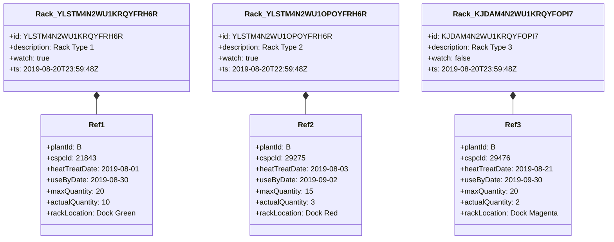

# Diagram: web/portal/src/modules/mt-dashboard/MetalTrackingMockData.js

> Auto-generated by Obscura crawlers

## Mermaid

### SVG

<svg id="container" width="1188.6484375" xmlns="http://www.w3.org/2000/svg" class="classDiagram" height="522" viewBox="0 0 1188.6484375 522" role="graphics-document document" aria-roledescription="class"><g><defs><marker id="container_class-aggregationStart" class="marker aggregation class" refX="18" refY="7" markerWidth="190" markerHeight="240" orient="auto"><path d="M 18,7 L9,13 L1,7 L9,1 Z"></path></marker></defs><defs><marker id="container_class-aggregationEnd" class="marker aggregation class" refX="1" refY="7" markerWidth="20" markerHeight="28" orient="auto"><path d="M 18,7 L9,13 L1,7 L9,1 Z"></path></marker></defs><defs><marker id="container_class-extensionStart" class="marker extension class" refX="18" refY="7" markerWidth="190" markerHeight="240" orient="auto"><path d="M 1,7 L18,13 V 1 Z"></path></marker></defs><defs><marker id="container_class-extensionEnd" class="marker extension class" refX="1" refY="7" markerWidth="20" markerHeight="28" orient="auto"><path d="M 1,1 V 13 L18,7 Z"></path></marker></defs><defs><marker id="container_class-compositionStart" class="marker composition class" refX="18" refY="7" markerWidth="190" markerHeight="240" orient="auto"><path d="M 18,7 L9,13 L1,7 L9,1 Z"></path></marker></defs><defs><marker id="container_class-compositionEnd" class="marker composition class" refX="1" refY="7" markerWidth="20" markerHeight="28" orient="auto"><path d="M 18,7 L9,13 L1,7 L9,1 Z"></path></marker></defs><defs><marker id="container_class-dependencyStart" class="marker dependency class" refX="6" refY="7" markerWidth="190" markerHeight="240" orient="auto"><path d="M 5,7 L9,13 L1,7 L9,1 Z"></path></marker></defs><defs><marker id="container_class-dependencyEnd" class="marker dependency class" refX="13" refY="7" markerWidth="20" markerHeight="28" orient="auto"><path d="M 18,7 L9,13 L14,7 L9,1 Z"></path></marker></defs><defs><marker id="container_class-lollipopStart" class="marker lollipop class" refX="13" refY="7" markerWidth="190" markerHeight="240" orient="auto"><circle stroke="black" fill="transparent" cx="7" cy="7" r="6"></circle></marker></defs><defs><marker id="container_class-lollipopEnd" class="marker lollipop class" refX="1" refY="7" markerWidth="190" markerHeight="240" orient="auto"><circle stroke="black" fill="transparent" cx="7" cy="7" r="6"></circle></marker></defs><g class="root"><g class="clusters"></g><g class="edgePaths"><path d="M187.945,217.25L187.945,218.542C187.945,219.833,187.945,222.417,187.945,227.875C187.945,233.333,187.945,241.667,187.945,245.833L187.945,250" id="id_Rack_YLSTM4N2WU1KRQYFRH6R_Ref1_1" class="edge-thickness-normal edge-pattern-solid relation" style=";;;" data-edge="true" data-et="edge" data-id="id_Rack_YLSTM4N2WU1KRQYFRH6R_Ref1_1" data-points="W3sieCI6MTg3Ljk0NTMxMjUsInkiOjIwMH0seyJ4IjoxODcuOTQ1MzEyNSwieSI6MjI1fSx7IngiOjE4Ny45NDUzMTI1LCJ5IjoyNTB9XQ==" marker-start="url(#container_class-compositionStart)"></path><path d="M598.77,217.25L598.77,218.542C598.77,219.833,598.77,222.417,598.77,227.875C598.77,233.333,598.77,241.667,598.77,245.833L598.77,250" id="id_Rack_YLSTM4N2WU1OPOYFRH6R_Ref2_2" class="edge-thickness-normal edge-pattern-solid relation" style=";;;" data-edge="true" data-et="edge" data-id="id_Rack_YLSTM4N2WU1OPOYFRH6R_Ref2_2" data-points="W3sieCI6NTk4Ljc2OTUzMTI1LCJ5IjoyMDB9LHsieCI6NTk4Ljc2OTUzMTI1LCJ5IjoyMjV9LHsieCI6NTk4Ljc2OTUzMTI1LCJ5IjoyNTB9XQ==" marker-start="url(#container_class-compositionStart)"></path><path d="M1005.148,217.25L1005.148,218.542C1005.148,219.833,1005.148,222.417,1005.148,227.875C1005.148,233.333,1005.148,241.667,1005.148,245.833L1005.148,250" id="id_Rack_KJDAM4N2WU1KRQYFOPI7_Ref3_3" class="edge-thickness-normal edge-pattern-solid relation" style=";;;" data-edge="true" data-et="edge" data-id="id_Rack_KJDAM4N2WU1KRQYFOPI7_Ref3_3" data-points="W3sieCI6MTAwNS4xNDg0Mzc1LCJ5IjoyMDB9LHsieCI6MTAwNS4xNDg0Mzc1LCJ5IjoyMjV9LHsieCI6MTAwNS4xNDg0Mzc1LCJ5IjoyNTB9XQ==" marker-start="url(#container_class-compositionStart)"></path></g><g class="edgeLabels"><g class="edgeLabel"><g class="label" data-id="id_Rack_YLSTM4N2WU1KRQYFRH6R_Ref1_1" transform="translate(0, 0)"><foreignObject width="0" height="0">

</foreignObject></g></g><g class="edgeLabel"><g class="label" data-id="id_Rack_YLSTM4N2WU1OPOYFRH6R_Ref2_2" transform="translate(0, 0)"><foreignObject width="0" height="0">

</foreignObject></g></g><g class="edgeLabel"><g class="label" data-id="id_Rack_KJDAM4N2WU1KRQYFOPI7_Ref3_3" transform="translate(0, 0)"><foreignObject width="0" height="0">

</foreignObject></g></g></g><g class="nodes"><g class="node default" id="classId-Rack_YLSTM4N2WU1KRQYFRH6R-0" transform="translate(187.9453125, 104)"><g class="basic label-container"><path d="M-179.9453125 -96 L179.9453125 -96 L179.9453125 96 L-179.9453125 96" stroke="none" stroke-width="0" fill="#ECECFF" style=""></path><path d="M-179.9453125 -96 C-104.98891126743527 -96, -30.03251003487054 -96, 179.9453125 -96 M-179.9453125 -96 C-107.150494205563 -96, -34.35567591112601 -96, 179.9453125 -96 M179.9453125 -96 C179.9453125 -26.459338128412966, 179.9453125 43.08132374317407, 179.9453125 96 M179.9453125 -96 C179.9453125 -19.74506378368835, 179.9453125 56.5098724326233, 179.9453125 96 M179.9453125 96 C85.73987487362659 96, -8.46556275274682 96, -179.9453125 96 M179.9453125 96 C90.82128777756773 96, 1.6972630551354655 96, -179.9453125 96 M-179.9453125 96 C-179.9453125 24.48059036395908, -179.9453125 -47.03881927208184, -179.9453125 -96 M-179.9453125 96 C-179.9453125 50.66336501061135, -179.9453125 5.326730021222701, -179.9453125 -96" stroke="#9370DB" stroke-width="1.3" fill="none" stroke-dasharray="0 0" style=""></path></g><g class="annotation-group text" transform="translate(0, -72)"></g><g class="label-group text" transform="translate(-117.640625, -72)"><g class="label" style="font-weight: bolder" transform="translate(0,-12)"><foreignObject width="235.28125" height="24">

Rack_YLSTM4N2WU1KRQYFRH6R

</foreignObject></g></g><g class="members-group text" transform="translate(-167.9453125, -24)"><g class="label" style="" transform="translate(0,-12)"><foreignObject width="218.25" height="24">

+id: YLSTM4N2WU1KRQYFRH6R

</foreignObject></g><g class="label" style="" transform="translate(0,12)"><foreignObject width="181.875" height="24">

+description: Rack Type 1

</foreignObject></g><g class="label" style="" transform="translate(0,36)"><foreignObject width="88.59375" height="24">

+watch: true

</foreignObject></g><g class="label" style="" transform="translate(0,60)"><foreignObject width="180.671875" height="24">

+ts: 2019-08-20T23:59:48Z

</foreignObject></g></g><g class="methods-group text" transform="translate(-167.9453125, 96)"></g><g class="divider" style=""><path d="M-179.9453125 -48 C-55.92154284769646 -48, 68.10222680460708 -48, 179.9453125 -48 M-179.9453125 -48 C-64.85315749545792 -48, 50.23899750908416 -48, 179.9453125 -48" stroke="#9370DB" stroke-width="1.3" fill="none" stroke-dasharray="0 0" style=""></path></g><g class="divider" style=""><path d="M-179.9453125 72 C-92.20076779461503 72, -4.456223089230065 72, 179.9453125 72 M-179.9453125 72 C-79.1358836409788 72, 21.673545218042392 72, 179.9453125 72" stroke="#9370DB" stroke-width="1.3" fill="none" stroke-dasharray="0 0" style=""></path></g></g><g class="node default" id="classId-Ref1-1" transform="translate(187.9453125, 382)"><g class="basic label-container"><path d="M-117.9765625 -132 L117.9765625 -132 L117.9765625 132 L-117.9765625 132" stroke="none" stroke-width="0" fill="#ECECFF" style=""></path><path d="M-117.9765625 -132 C-57.96545001305487 -132, 2.0456624738902605 -132, 117.9765625 -132 M-117.9765625 -132 C-35.52335684187703 -132, 46.929848816245936 -132, 117.9765625 -132 M117.9765625 -132 C117.9765625 -28.61246660489276, 117.9765625 74.77506679021448, 117.9765625 132 M117.9765625 -132 C117.9765625 -78.56757469794107, 117.9765625 -25.135149395882124, 117.9765625 132 M117.9765625 132 C60.802611018235176 132, 3.6286595364703516 132, -117.9765625 132 M117.9765625 132 C69.85284995823429 132, 21.729137416468575 132, -117.9765625 132 M-117.9765625 132 C-117.9765625 46.85054181907637, -117.9765625 -38.29891636184726, -117.9765625 -132 M-117.9765625 132 C-117.9765625 66.93615789676406, -117.9765625 1.8723157935281165, -117.9765625 -132" stroke="#9370DB" stroke-width="1.3" fill="none" stroke-dasharray="0 0" style=""></path></g><g class="annotation-group text" transform="translate(0, -108)"></g><g class="label-group text" transform="translate(-15.953125, -108)"><g class="label" style="font-weight: bolder" transform="translate(0,-12)"><foreignObject width="31.90625" height="24">

Ref1

</foreignObject></g></g><g class="members-group text" transform="translate(-105.9765625, -60)"><g class="label" style="" transform="translate(0,-12)"><foreignObject width="78.0625" height="24">

+plantId: B

</foreignObject></g><g class="label" style="" transform="translate(0,12)"><foreignObject width="102.125" height="24">

+cspcId: 21843

</foreignObject></g><g class="label" style="" transform="translate(0,36)"><foreignObject width="196" height="24">

+heatTreatDate: 2019-08-01

</foreignObject></g><g class="label" style="" transform="translate(0,60)"><foreignObject width="170.640625" height="24">

+useByDate: 2019-08-30

</foreignObject></g><g class="label" style="" transform="translate(0,84)"><foreignObject width="125.46875" height="24">

+maxQuantity: 20

</foreignObject></g><g class="label" style="" transform="translate(0,108)"><foreignObject width="138.734375" height="24">

+actualQuantity: 10

</foreignObject></g><g class="label" style="" transform="translate(0,132)"><foreignObject width="190.6875" height="24">

+rackLocation: Dock Green

</foreignObject></g></g><g class="methods-group text" transform="translate(-105.9765625, 132)"></g><g class="divider" style=""><path d="M-117.9765625 -84 C-61.64934182306574 -84, -5.3221211461314795 -84, 117.9765625 -84 M-117.9765625 -84 C-64.68802535178932 -84, -11.399488203578628 -84, 117.9765625 -84" stroke="#9370DB" stroke-width="1.3" fill="none" stroke-dasharray="0 0" style=""></path></g><g class="divider" style=""><path d="M-117.9765625 108 C-49.46463211425497 108, 19.047298271490064 108, 117.9765625 108 M-117.9765625 108 C-42.10357924753204 108, 33.76940400493592 108, 117.9765625 108" stroke="#9370DB" stroke-width="1.3" fill="none" stroke-dasharray="0 0" style=""></path></g></g><g class="node default" id="classId-Rack_YLSTM4N2WU1OPOYFRH6R-2" transform="translate(598.76953125, 104)"><g class="basic label-container"><path d="M-180.87890625 -96 L180.87890625 -96 L180.87890625 96 L-180.87890625 96" stroke="none" stroke-width="0" fill="#ECECFF" style=""></path><path d="M-180.87890625 -96 C-98.21919737003626 -96, -15.55948849007251 -96, 180.87890625 -96 M-180.87890625 -96 C-99.23949888660692 -96, -17.600091523213848 -96, 180.87890625 -96 M180.87890625 -96 C180.87890625 -29.58256243439841, 180.87890625 36.83487513120318, 180.87890625 96 M180.87890625 -96 C180.87890625 -44.39075473979361, 180.87890625 7.218490520412786, 180.87890625 96 M180.87890625 96 C77.83973934073948 96, -25.19942756852103 96, -180.87890625 96 M180.87890625 96 C40.48081315208711 96, -99.91727994582578 96, -180.87890625 96 M-180.87890625 96 C-180.87890625 26.94906461970615, -180.87890625 -42.1018707605877, -180.87890625 -96 M-180.87890625 96 C-180.87890625 39.72020161728118, -180.87890625 -16.559596765437647, -180.87890625 -96" stroke="#9370DB" stroke-width="1.3" fill="none" stroke-dasharray="0 0" style=""></path></g><g class="annotation-group text" transform="translate(0, -72)"></g><g class="label-group text" transform="translate(-118.0859375, -72)"><g class="label" style="font-weight: bolder" transform="translate(0,-12)"><foreignObject width="236.171875" height="24">

Rack_YLSTM4N2WU1OPOYFRH6R

</foreignObject></g></g><g class="members-group text" transform="translate(-168.87890625, -24)"><g class="label" style="" transform="translate(0,-12)"><foreignObject width="219.671875" height="24">

+id: YLSTM4N2WU1OPOYFRH6R

</foreignObject></g><g class="label" style="" transform="translate(0,12)"><foreignObject width="182.875" height="24">

+description: Rack Type 2

</foreignObject></g><g class="label" style="" transform="translate(0,36)"><foreignObject width="88.59375" height="24">

+watch: true

</foreignObject></g><g class="label" style="" transform="translate(0,60)"><foreignObject width="180.6875" height="24">

+ts: 2019-08-20T22:59:48Z

</foreignObject></g></g><g class="methods-group text" transform="translate(-168.87890625, 96)"></g><g class="divider" style=""><path d="M-180.87890625 -48 C-45.29435780822345 -48, 90.2901906335531 -48, 180.87890625 -48 M-180.87890625 -48 C-63.810680830274435 -48, 53.25754458945113 -48, 180.87890625 -48" stroke="#9370DB" stroke-width="1.3" fill="none" stroke-dasharray="0 0" style=""></path></g><g class="divider" style=""><path d="M-180.87890625 72 C-94.68272266137411 72, -8.48653907274823 72, 180.87890625 72 M-180.87890625 72 C-79.81217227287814 72, 21.254561704243713 72, 180.87890625 72" stroke="#9370DB" stroke-width="1.3" fill="none" stroke-dasharray="0 0" style=""></path></g></g><g class="node default" id="classId-Ref2-3" transform="translate(598.76953125, 382)"><g class="basic label-container"><path d="M-118.83203125 -132 L118.83203125 -132 L118.83203125 132 L-118.83203125 132" stroke="none" stroke-width="0" fill="#ECECFF" style=""></path><path d="M-118.83203125 -132 C-62.181029282167955 -132, -5.530027314335911 -132, 118.83203125 -132 M-118.83203125 -132 C-66.73597194438406 -132, -14.63991263876811 -132, 118.83203125 -132 M118.83203125 -132 C118.83203125 -41.051505954630656, 118.83203125 49.89698809073869, 118.83203125 132 M118.83203125 -132 C118.83203125 -64.96843794704968, 118.83203125 2.0631241059006413, 118.83203125 132 M118.83203125 132 C64.77204404902443 132, 10.712056848048846 132, -118.83203125 132 M118.83203125 132 C47.33632741902683 132, -24.15937641194634 132, -118.83203125 132 M-118.83203125 132 C-118.83203125 66.1712533661076, -118.83203125 0.3425067322152131, -118.83203125 -132 M-118.83203125 132 C-118.83203125 61.617073476796506, -118.83203125 -8.765853046406988, -118.83203125 -132" stroke="#9370DB" stroke-width="1.3" fill="none" stroke-dasharray="0 0" style=""></path></g><g class="annotation-group text" transform="translate(0, -108)"></g><g class="label-group text" transform="translate(-16.3828125, -108)"><g class="label" style="font-weight: bolder" transform="translate(0,-12)"><foreignObject width="32.765625" height="24">

Ref2

</foreignObject></g></g><g class="members-group text" transform="translate(-106.83203125, -60)"><g class="label" style="" transform="translate(0,-12)"><foreignObject width="78.0625" height="24">

+plantId: B

</foreignObject></g><g class="label" style="" transform="translate(0,12)"><foreignObject width="101.078125" height="24">

+cspcId: 29275

</foreignObject></g><g class="label" style="" transform="translate(0,36)"><foreignObject width="197.28125" height="24">

+heatTreatDate: 2019-08-03

</foreignObject></g><g class="label" style="" transform="translate(0,60)"><foreignObject width="170.78125" height="24">

+useByDate: 2019-09-02

</foreignObject></g><g class="label" style="" transform="translate(0,84)"><foreignObject width="123.5625" height="24">

+maxQuantity: 15

</foreignObject></g><g class="label" style="" transform="translate(0,108)"><foreignObject width="130.859375" height="24">

+actualQuantity: 3

</foreignObject></g><g class="label" style="" transform="translate(0,132)"><foreignObject width="175.796875" height="24">

+rackLocation: Dock Red

</foreignObject></g></g><g class="methods-group text" transform="translate(-106.83203125, 132)"></g><g class="divider" style=""><path d="M-118.83203125 -84 C-70.88115600183767 -84, -22.930280753675333 -84, 118.83203125 -84 M-118.83203125 -84 C-60.72848609505709 -84, -2.624940940114186 -84, 118.83203125 -84" stroke="#9370DB" stroke-width="1.3" fill="none" stroke-dasharray="0 0" style=""></path></g><g class="divider" style=""><path d="M-118.83203125 108 C-41.65311424048889 108, 35.52580276902222 108, 118.83203125 108 M-118.83203125 108 C-39.83019560531591 108, 39.171640039368185 108, 118.83203125 108" stroke="#9370DB" stroke-width="1.3" fill="none" stroke-dasharray="0 0" style=""></path></g></g><g class="node default" id="classId-Rack_KJDAM4N2WU1KRQYFOPI7-4" transform="translate(1005.1484375, 104)"><g class="basic label-container"><path d="M-175.5 -96 L175.5 -96 L175.5 96 L-175.5 96" stroke="none" stroke-width="0" fill="#ECECFF" style=""></path><path d="M-175.5 -96 C-85.67335270474416 -96, 4.153294590511678 -96, 175.5 -96 M-175.5 -96 C-99.77901795376809 -96, -24.05803590753618 -96, 175.5 -96 M175.5 -96 C175.5 -41.09062401895056, 175.5 13.818751962098887, 175.5 96 M175.5 -96 C175.5 -56.951017337823444, 175.5 -17.902034675646888, 175.5 96 M175.5 96 C94.24274522255205 96, 12.985490445104091 96, -175.5 96 M175.5 96 C45.22225854782039 96, -85.05548290435922 96, -175.5 96 M-175.5 96 C-175.5 45.271978825411026, -175.5 -5.456042349177949, -175.5 -96 M-175.5 96 C-175.5 57.445411713769566, -175.5 18.890823427539132, -175.5 -96" stroke="#9370DB" stroke-width="1.3" fill="none" stroke-dasharray="0 0" style=""></path></g><g class="annotation-group text" transform="translate(0, -72)"></g><g class="label-group text" transform="translate(-114.890625, -72)"><g class="label" style="font-weight: bolder" transform="translate(0,-12)"><foreignObject width="229.78125" height="24">

Rack_KJDAM4N2WU1KRQYFOPI7

</foreignObject></g></g><g class="members-group text" transform="translate(-163.5, -24)"><g class="label" style="" transform="translate(0,-12)"><foreignObject width="212.109375" height="24">

+id: KJDAM4N2WU1KRQYFOPI7

</foreignObject></g><g class="label" style="" transform="translate(0,12)"><foreignObject width="182.9375" height="24">

+description: Rack Type 3

</foreignObject></g><g class="label" style="" transform="translate(0,36)"><foreignObject width="93.046875" height="24">

+watch: false

</foreignObject></g><g class="label" style="" transform="translate(0,60)"><foreignObject width="180.671875" height="24">

+ts: 2019-08-20T23:59:48Z

</foreignObject></g></g><g class="methods-group text" transform="translate(-163.5, 96)"></g><g class="divider" style=""><path d="M-175.5 -48 C-60.757484558153166 -48, 53.98503088369367 -48, 175.5 -48 M-175.5 -48 C-74.64845637510062 -48, 26.203087249798756 -48, 175.5 -48" stroke="#9370DB" stroke-width="1.3" fill="none" stroke-dasharray="0 0" style=""></path></g><g class="divider" style=""><path d="M-175.5 72 C-88.91439942677412 72, -2.32879885354825 72, 175.5 72 M-175.5 72 C-93.78825019235514 72, -12.076500384710272 72, 175.5 72" stroke="#9370DB" stroke-width="1.3" fill="none" stroke-dasharray="0 0" style=""></path></g></g><g class="node default" id="classId-Ref3-5" transform="translate(1005.1484375, 382)"><g class="basic label-container"><path d="M-125.03125 -132 L125.03125 -132 L125.03125 132 L-125.03125 132" stroke="none" stroke-width="0" fill="#ECECFF" style=""></path><path d="M-125.03125 -132 C-72.91211738656057 -132, -20.79298477312112 -132, 125.03125 -132 M-125.03125 -132 C-41.95347404073685 -132, 41.1243019185263 -132, 125.03125 -132 M125.03125 -132 C125.03125 -54.16750919976647, 125.03125 23.66498160046706, 125.03125 132 M125.03125 -132 C125.03125 -26.753484990590593, 125.03125 78.49303001881881, 125.03125 132 M125.03125 132 C51.85233374392544 132, -21.326582512149116 132, -125.03125 132 M125.03125 132 C43.113442076049324 132, -38.80436584790135 132, -125.03125 132 M-125.03125 132 C-125.03125 76.93258337176042, -125.03125 21.865166743520817, -125.03125 -132 M-125.03125 132 C-125.03125 28.29691718898799, -125.03125 -75.40616562202402, -125.03125 -132" stroke="#9370DB" stroke-width="1.3" fill="none" stroke-dasharray="0 0" style=""></path></g><g class="annotation-group text" transform="translate(0, -108)"></g><g class="label-group text" transform="translate(-16.46875, -108)"><g class="label" style="font-weight: bolder" transform="translate(0,-12)"><foreignObject width="32.9375" height="24">

Ref3

</foreignObject></g></g><g class="members-group text" transform="translate(-113.03125, -60)"><g class="label" style="" transform="translate(0,-12)"><foreignObject width="78.0625" height="24">

+plantId: B

</foreignObject></g><g class="label" style="" transform="translate(0,12)"><foreignObject width="102.03125" height="24">

+cspcId: 29476

</foreignObject></g><g class="label" style="" transform="translate(0,36)"><foreignObject width="194.015625" height="24">

+heatTreatDate: 2019-08-21

</foreignObject></g><g class="label" style="" transform="translate(0,60)"><foreignObject width="170.078125" height="24">

+useByDate: 2019-09-30

</foreignObject></g><g class="label" style="" transform="translate(0,84)"><foreignObject width="125.46875" height="24">

+maxQuantity: 20

</foreignObject></g><g class="label" style="" transform="translate(0,108)"><foreignObject width="130.796875" height="24">

+actualQuantity: 2

</foreignObject></g><g class="label" style="" transform="translate(0,132)"><foreignObject width="209.59375" height="24">

+rackLocation: Dock Magenta

</foreignObject></g></g><g class="methods-group text" transform="translate(-113.03125, 132)"></g><g class="divider" style=""><path d="M-125.03125 -84 C-28.264055900761974 -84, 68.50313819847605 -84, 125.03125 -84 M-125.03125 -84 C-54.81112517347674 -84, 15.408999653046521 -84, 125.03125 -84" stroke="#9370DB" stroke-width="1.3" fill="none" stroke-dasharray="0 0" style=""></path></g><g class="divider" style=""><path d="M-125.03125 108 C-65.32315601392423 108, -5.615062027848467 108, 125.03125 108 M-125.03125 108 C-48.85589533976426 108, 27.31945932047148 108, 125.03125 108" stroke="#9370DB" stroke-width="1.3" fill="none" stroke-dasharray="0 0" style=""></path></g></g></g></g></g></svg>
