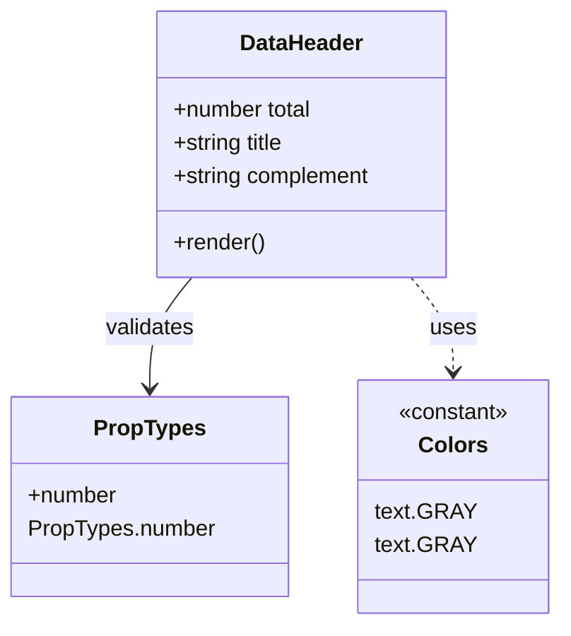

# Diagram: web/portal/src/modules/mt-dashboard/mt-dashboard-components/DataHeader.js

> Auto-generated by Obscura crawlers

## Mermaid

### SVG

<svg id="container" width="396.328125" xmlns="http://www.w3.org/2000/svg" class="classDiagram" height="450" viewBox="0 0 396.328125 450" role="graphics-document document" aria-roledescription="class"><g><defs><marker id="container_class-aggregationStart" class="marker aggregation class" refX="18" refY="7" markerWidth="190" markerHeight="240" orient="auto"><path d="M 18,7 L9,13 L1,7 L9,1 Z"></path></marker></defs><defs><marker id="container_class-aggregationEnd" class="marker aggregation class" refX="1" refY="7" markerWidth="20" markerHeight="28" orient="auto"><path d="M 18,7 L9,13 L1,7 L9,1 Z"></path></marker></defs><defs><marker id="container_class-extensionStart" class="marker extension class" refX="18" refY="7" markerWidth="190" markerHeight="240" orient="auto"><path d="M 1,7 L18,13 V 1 Z"></path></marker></defs><defs><marker id="container_class-extensionEnd" class="marker extension class" refX="1" refY="7" markerWidth="20" markerHeight="28" orient="auto"><path d="M 1,1 V 13 L18,7 Z"></path></marker></defs><defs><marker id="container_class-compositionStart" class="marker composition class" refX="18" refY="7" markerWidth="190" markerHeight="240" orient="auto"><path d="M 18,7 L9,13 L1,7 L9,1 Z"></path></marker></defs><defs><marker id="container_class-compositionEnd" class="marker composition class" refX="1" refY="7" markerWidth="20" markerHeight="28" orient="auto"><path d="M 18,7 L9,13 L1,7 L9,1 Z"></path></marker></defs><defs><marker id="container_class-dependencyStart" class="marker dependency class" refX="6" refY="7" markerWidth="190" markerHeight="240" orient="auto"><path d="M 5,7 L9,13 L1,7 L9,1 Z"></path></marker></defs><defs><marker id="container_class-dependencyEnd" class="marker dependency class" refX="13" refY="7" markerWidth="20" markerHeight="28" orient="auto"><path d="M 18,7 L9,13 L14,7 L9,1 Z"></path></marker></defs><defs><marker id="container_class-lollipopStart" class="marker lollipop class" refX="13" refY="7" markerWidth="190" markerHeight="240" orient="auto"><circle stroke="black" fill="transparent" cx="7" cy="7" r="6"></circle></marker></defs><defs><marker id="container_class-lollipopEnd" class="marker lollipop class" refX="1" refY="7" markerWidth="190" markerHeight="240" orient="auto"><circle stroke="black" fill="transparent" cx="7" cy="7" r="6"></circle></marker></defs><g class="root"><g class="clusters"></g><g class="edgePaths"><path d="M136.745,200L131.757,206.167C126.769,212.333,116.793,224.667,111.805,238C106.816,251.333,106.816,265.667,106.816,272.833L106.816,280" id="id_DataHeader_PropTypes_1" class="edge-thickness-normal edge-pattern-solid relation" style=";;;" data-edge="true" data-et="edge" data-id="id_DataHeader_PropTypes_1" data-points="W3sieCI6MTM2Ljc0NTI0MjAxMTI3ODIsInkiOjIwMH0seyJ4IjoxMDYuODE2NDA2MjUsInkiOjIzN30seyJ4IjoxMDYuODE2NDA2MjUsInkiOjI4Nn1d" marker-end="url(#container_class-dependencyEnd)"></path><path d="M292.052,200L297.04,206.167C302.028,212.333,312.004,224.667,316.992,236C321.98,247.333,321.98,257.667,321.98,262.833L321.98,268" id="id_DataHeader_Colors_2" class="edge-thickness-normal edge-pattern-dashed relation" style=";;;" data-edge="true" data-et="edge" data-id="id_DataHeader_Colors_2" data-points="W3sieCI6MjkyLjA1MTYzMjk4ODcyMTgsInkiOjIwMH0seyJ4IjozMjEuOTgwNDY4NzUsInkiOjIzN30seyJ4IjozMjEuOTgwNDY4NzUsInkiOjI3NH1d" marker-end="url(#container_class-dependencyEnd)"></path></g><g class="edgeLabels"><g class="edgeLabel" transform="translate(106.81640625, 237)"><g class="label" data-id="id_DataHeader_PropTypes_1" transform="translate(-32.6875, -12)"><foreignObject width="65.375" height="24">

validates

</foreignObject></g></g><g class="edgeLabel" transform="translate(321.98046875, 237)"><g class="label" data-id="id_DataHeader_Colors_2" transform="translate(-16.4921875, -12)"><foreignObject width="32.984375" height="24">

uses

</foreignObject></g></g></g><g class="nodes"><g class="node default" id="classId-DataHeader-0" transform="translate(214.3984375, 104)"><g class="basic label-container"><path d="M-106.01953125 -96 L106.01953125 -96 L106.01953125 96 L-106.01953125 96" stroke="none" stroke-width="0" fill="#ECECFF" style=""></path><path d="M-106.01953125 -96 C-44.434140702445625 -96, 17.15124984510875 -96, 106.01953125 -96 M-106.01953125 -96 C-45.82497879711016 -96, 14.369573655779675 -96, 106.01953125 -96 M106.01953125 -96 C106.01953125 -23.341045333075243, 106.01953125 49.317909333849514, 106.01953125 96 M106.01953125 -96 C106.01953125 -32.784215542306214, 106.01953125 30.431568915387572, 106.01953125 96 M106.01953125 96 C51.4354420461617 96, -3.1486471576766064 96, -106.01953125 96 M106.01953125 96 C57.095898087954666 96, 8.172264925909332 96, -106.01953125 96 M-106.01953125 96 C-106.01953125 21.839442715723777, -106.01953125 -52.321114568552446, -106.01953125 -96 M-106.01953125 96 C-106.01953125 34.820922366838595, -106.01953125 -26.35815526632281, -106.01953125 -96" stroke="#9370DB" stroke-width="1.3" fill="none" stroke-dasharray="0 0" style=""></path></g><g class="annotation-group text" transform="translate(0, -72)"></g><g class="label-group text" transform="translate(-43.3671875, -72)"><g class="label" style="font-weight: bolder" transform="translate(0,-12)"><foreignObject width="86.734375" height="24">

DataHeader

</foreignObject></g></g><g class="members-group text" transform="translate(-94.01953125, -24)"><g class="label" style="" transform="translate(0,-12)"><foreignObject width="102.8125" height="24">

+number total

</foreignObject></g><g class="label" style="" transform="translate(0,12)"><foreignObject width="83.09375" height="24">

+string title

</foreignObject></g><g class="label" style="" transform="translate(0,36)"><foreignObject width="144.671875" height="24">

+string complement

</foreignObject></g></g><g class="methods-group text" transform="translate(-94.01953125, 72)"><g class="label" style="" transform="translate(0,-12)"><foreignObject width="66.609375" height="24">

+render()

</foreignObject></g></g><g class="divider" style=""><path d="M-106.01953125 -48 C-25.853505423711837 -48, 54.312520402576325 -48, 106.01953125 -48 M-106.01953125 -48 C-28.466446359680347 -48, 49.086638530639306 -48, 106.01953125 -48" stroke="#9370DB" stroke-width="1.3" fill="none" stroke-dasharray="0 0" style=""></path></g><g class="divider" style=""><path d="M-106.01953125 48 C-43.16400322719958 48, 19.69152479560084 48, 106.01953125 48 M-106.01953125 48 C-43.84466030519451 48, 18.330210639610982 48, 106.01953125 48" stroke="#9370DB" stroke-width="1.3" fill="none" stroke-dasharray="0 0" style=""></path></g></g><g class="node default" id="classId-PropTypes-1" transform="translate(106.81640625, 358)"><g class="basic label-container"><path d="M-98.81640625 -72 L98.81640625 -72 L98.81640625 72 L-98.81640625 72" stroke="none" stroke-width="0" fill="#ECECFF" style=""></path><path d="M-98.81640625 -72 C-26.614379895210234 -72, 45.58764645957953 -72, 98.81640625 -72 M-98.81640625 -72 C-24.77917284066173 -72, 49.25806056867654 -72, 98.81640625 -72 M98.81640625 -72 C98.81640625 -16.01869893264778, 98.81640625 39.96260213470444, 98.81640625 72 M98.81640625 -72 C98.81640625 -37.64225198883825, 98.81640625 -3.2845039776764935, 98.81640625 72 M98.81640625 72 C39.582715621804184 72, -19.650975006391633 72, -98.81640625 72 M98.81640625 72 C23.96323925926022 72, -50.88992773147956 72, -98.81640625 72 M-98.81640625 72 C-98.81640625 29.434986436640102, -98.81640625 -13.130027126719796, -98.81640625 -72 M-98.81640625 72 C-98.81640625 23.988030960681883, -98.81640625 -24.023938078636235, -98.81640625 -72" stroke="#9370DB" stroke-width="1.3" fill="none" stroke-dasharray="0 0" style=""></path></g><g class="annotation-group text" transform="translate(0, -48)"></g><g class="label-group text" transform="translate(-38.2578125, -48)"><g class="label" style="font-weight: bolder" transform="translate(0,-12)"><foreignObject width="76.515625" height="24">

PropTypes

</foreignObject></g></g><g class="members-group text" transform="translate(-86.81640625, 0)"><g class="label" style="" transform="translate(0,-12)"><foreignObject width="64.796875" height="24">

+number

</foreignObject></g><g class="label" style="" transform="translate(0,12)"><foreignObject width="135.375" height="24">

PropTypes.number

</foreignObject></g></g><g class="methods-group text" transform="translate(-86.81640625, 72)"></g><g class="divider" style=""><path d="M-98.81640625 -24 C-32.83776254073224 -24, 33.140881168535515 -24, 98.81640625 -24 M-98.81640625 -24 C-42.746757704322185 -24, 13.32289084135563 -24, 98.81640625 -24" stroke="#9370DB" stroke-width="1.3" fill="none" stroke-dasharray="0 0" style=""></path></g><g class="divider" style=""><path d="M-98.81640625 48 C-34.80681043993188 48, 29.20278537013624 48, 98.81640625 48 M-98.81640625 48 C-54.14299611450513 48, -9.469585979010262 48, 98.81640625 48" stroke="#9370DB" stroke-width="1.3" fill="none" stroke-dasharray="0 0" style=""></path></g></g><g class="node default" id="classId-Colors-2" transform="translate(321.98046875, 358)"><g class="basic label-container"><path d="M-66.34765625 -84 L66.34765625 -84 L66.34765625 84 L-66.34765625 84" stroke="none" stroke-width="0" fill="#ECECFF" style=""></path><path d="M-66.34765625 -84 C-28.76135054706927 -84, 8.82495515586146 -84, 66.34765625 -84 M-66.34765625 -84 C-22.489586455752708 -84, 21.368483338494585 -84, 66.34765625 -84 M66.34765625 -84 C66.34765625 -17.065653769821168, 66.34765625 49.868692460357664, 66.34765625 84 M66.34765625 -84 C66.34765625 -39.61576539249049, 66.34765625 4.768469215019024, 66.34765625 84 M66.34765625 84 C33.30031276415626 84, 0.2529692783125199 84, -66.34765625 84 M66.34765625 84 C14.322427634884313 84, -37.70280098023137 84, -66.34765625 84 M-66.34765625 84 C-66.34765625 31.112332366185896, -66.34765625 -21.775335267628208, -66.34765625 -84 M-66.34765625 84 C-66.34765625 35.74753853291415, -66.34765625 -12.504922934171702, -66.34765625 -84" stroke="#9370DB" stroke-width="1.3" fill="none" stroke-dasharray="0 0" style=""></path></g><g class="annotation-group text" transform="translate(-40.4921875, -60)"><g class="label" style="" transform="translate(0,-12)"><foreignObject width="80.984375" height="24">

«constant»

</foreignObject></g></g><g class="label-group text" transform="translate(-23.1015625, -36)"><g class="label" style="font-weight: bolder" transform="translate(0,-12)"><foreignObject width="46.203125" height="24">

Colors

</foreignObject></g></g><g class="members-group text" transform="translate(-54.34765625, 12)"><g class="label" style="" transform="translate(0,-12)"><foreignObject width="68.203125" height="24">

text.GRAY

</foreignObject></g><g class="label" style="" transform="translate(0,12)"><foreignObject width="68.203125" height="24">

text.GRAY

</foreignObject></g></g><g class="methods-group text" transform="translate(-54.34765625, 84)"></g><g class="divider" style=""><path d="M-66.34765625 -12 C-19.667170800158722 -12, 27.013314649682556 -12, 66.34765625 -12 M-66.34765625 -12 C-33.90473465794718 -12, -1.4618130658943613 -12, 66.34765625 -12" stroke="#9370DB" stroke-width="1.3" fill="none" stroke-dasharray="0 0" style=""></path></g><g class="divider" style=""><path d="M-66.34765625 60 C-16.241540426960093 60, 33.864575396079815 60, 66.34765625 60 M-66.34765625 60 C-35.294806188999395 60, -4.24195612799879 60, 66.34765625 60" stroke="#9370DB" stroke-width="1.3" fill="none" stroke-dasharray="0 0" style=""></path></g></g></g></g></g></svg>
