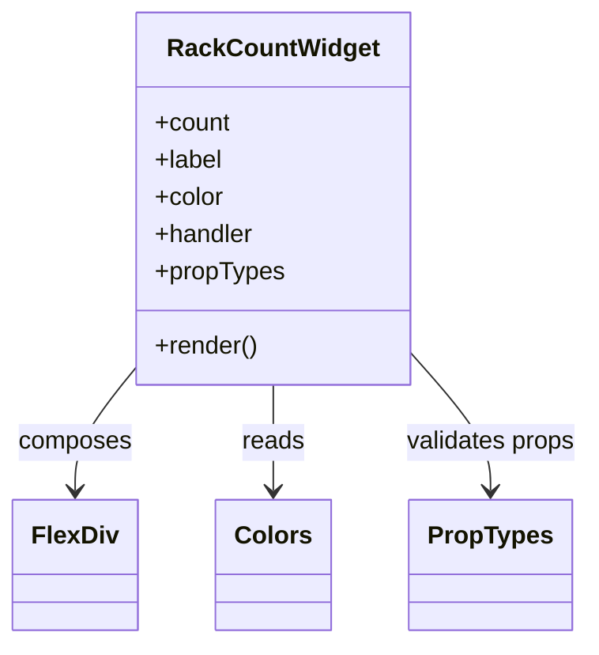

# Diagram: web/portal/src/modules/mt-dashboard/mt-dashboard-components/RackCountWidget.js


> Auto-generated by Obscura crawlers

## Diagram 1



### SVG

<svg id="container" width="368.2890625" xmlns="http://www.w3.org/2000/svg" class="classDiagram" height="414" viewBox="0 0 368.2890625 414" role="graphics-document document" aria-roledescription="class"><style>#container{font-family:"trebuchet ms",verdana,arial,sans-serif;font-size:16px;fill:#333;}@keyframes edge-animation-frame{from{stroke-dashoffset:0;}}@keyframes dash{to{stroke-dashoffset:0;}}#container .edge-animation-slow{stroke-dasharray:9,5!important;stroke-dashoffset:900;animation:dash 50s linear infinite;stroke-linecap:round;}#container .edge-animation-fast{stroke-dasharray:9,5!important;stroke-dashoffset:900;animation:dash 20s linear infinite;stroke-linecap:round;}#container .error-icon{fill:#552222;}#container .error-text{fill:#552222;stroke:#552222;}#container .edge-thickness-normal{stroke-width:1px;}#container .edge-thickness-thick{stroke-width:3.5px;}#container .edge-pattern-solid{stroke-dasharray:0;}#container .edge-thickness-invisible{stroke-width:0;fill:none;}#container .edge-pattern-dashed{stroke-dasharray:3;}#container .edge-pattern-dotted{stroke-dasharray:2;}#container .marker{fill:#333333;stroke:#333333;}#container .marker.cross{stroke:#333333;}#container svg{font-family:"trebuchet ms",verdana,arial,sans-serif;font-size:16px;}#container p{margin:0;}#container g.classGroup text{fill:#9370DB;stroke:none;font-family:"trebuchet ms",verdana,arial,sans-serif;font-size:10px;}#container g.classGroup text .title{font-weight:bolder;}#container .nodeLabel,#container .edgeLabel{color:#131300;}#container .edgeLabel .label rect{fill:#ECECFF;}#container .label text{fill:#131300;}#container .labelBkg{background:#ECECFF;}#container .edgeLabel .label span{background:#ECECFF;}#container .classTitle{font-weight:bolder;}#container .node rect,#container .node circle,#container .node ellipse,#container .node polygon,#container .node path{fill:#ECECFF;stroke:#9370DB;stroke-width:1px;}#container .divider{stroke:#9370DB;stroke-width:1;}#container g.clickable{cursor:pointer;}#container g.classGroup rect{fill:#ECECFF;stroke:#9370DB;}#container g.classGroup line{stroke:#9370DB;stroke-width:1;}#container .classLabel .box{stroke:none;stroke-width:0;fill:#ECECFF;opacity:0.5;}#container .classLabel .label{fill:#9370DB;font-size:10px;}#container .relation{stroke:#333333;stroke-width:1;fill:none;}#container .dashed-line{stroke-dasharray:3;}#container .dotted-line{stroke-dasharray:1 2;}#container #compositionStart,#container .composition{fill:#333333!important;stroke:#333333!important;stroke-width:1;}#container #compositionEnd,#container .composition{fill:#333333!important;stroke:#333333!important;stroke-width:1;}#container #dependencyStart,#container .dependency{fill:#333333!important;stroke:#333333!important;stroke-width:1;}#container #dependencyStart,#container .dependency{fill:#333333!important;stroke:#333333!important;stroke-width:1;}#container #extensionStart,#container .extension{fill:transparent!important;stroke:#333333!important;stroke-width:1;}#container #extensionEnd,#container .extension{fill:transparent!important;stroke:#333333!important;stroke-width:1;}#container #aggregationStart,#container .aggregation{fill:transparent!important;stroke:#333333!important;stroke-width:1;}#container #aggregationEnd,#container .aggregation{fill:transparent!important;stroke:#333333!important;stroke-width:1;}#container #lollipopStart,#container .lollipop{fill:#ECECFF!important;stroke:#333333!important;stroke-width:1;}#container #lollipopEnd,#container .lollipop{fill:#ECECFF!important;stroke:#333333!important;stroke-width:1;}#container .edgeTerminals{font-size:11px;line-height:initial;}#container .classTitleText{text-anchor:middle;font-size:18px;fill:#333;}#container .label-icon{display:inline-block;height:1em;overflow:visible;vertical-align:-0.125em;}#container .node .label-icon path{fill:currentColor;stroke:revert;stroke-width:revert;}#container :root{--mermaid-font-family:"trebuchet ms",verdana,arial,sans-serif;}</style><g><defs><marker id="container_class-aggregationStart" class="marker aggregation class" refX="18" refY="7" markerWidth="190" markerHeight="240" orient="auto"><path d="M 18,7 L9,13 L1,7 L9,1 Z"></path></marker></defs><defs><marker id="container_class-aggregationEnd" class="marker aggregation class" refX="1" refY="7" markerWidth="20" markerHeight="28" orient="auto"><path d="M 18,7 L9,13 L1,7 L9,1 Z"></path></marker></defs><defs><marker id="container_class-extensionStart" class="marker extension class" refX="18" refY="7" markerWidth="190" markerHeight="240" orient="auto"><path d="M 1,7 L18,13 V 1 Z"></path></marker></defs><defs><marker id="container_class-extensionEnd" class="marker extension class" refX="1" refY="7" markerWidth="20" markerHeight="28" orient="auto"><path d="M 1,1 V 13 L18,7 Z"></path></marker></defs><defs><marker id="container_class-compositionStart" class="marker composition class" refX="18" refY="7" markerWidth="190" markerHeight="240" orient="auto"><path d="M 18,7 L9,13 L1,7 L9,1 Z"></path></marker></defs><defs><marker id="container_class-compositionEnd" class="marker composition class" refX="1" refY="7" markerWidth="20" markerHeight="28" orient="auto"><path d="M 18,7 L9,13 L1,7 L9,1 Z"></path></marker></defs><defs><marker id="container_class-dependencyStart" class="marker dependency class" refX="6" refY="7" markerWidth="190" markerHeight="240" orient="auto"><path d="M 5,7 L9,13 L1,7 L9,1 Z"></path></marker></defs><defs><marker id="container_class-dependencyEnd" class="marker dependency class" refX="13" refY="7" markerWidth="20" markerHeight="28" orient="auto"><path d="M 18,7 L9,13 L14,7 L9,1 Z"></path></marker></defs><defs><marker id="container_class-lollipopStart" class="marker lollipop class" refX="13" refY="7" markerWidth="190" markerHeight="240" orient="auto"><circle stroke="black" fill="transparent" cx="7" cy="7" r="6"></circle></marker></defs><defs><marker id="container_class-lollipopEnd" class="marker lollipop class" refX="1" refY="7" markerWidth="190" markerHeight="240" orient="auto"><circle stroke="black" fill="transparent" cx="7" cy="7" r="6"></circle></marker></defs><g class="root"><g class="clusters"></g><g class="edgePaths"><path d="M83.523,237.365L77.292,245.304C71.06,253.243,58.596,269.122,52.365,282.227C46.133,295.333,46.133,305.667,46.133,310.833L46.133,316" id="id_RackCountWidget_FlexDiv_1" class="edge-thickness-normal edge-pattern-solid relation" style=";;;" data-edge="true" data-et="edge" data-id="id_RackCountWidget_FlexDiv_1" data-points="W3sieCI6ODMuNTIzNDM3NSwieSI6MjM3LjM2NDUyMzkwMDA4ODc2fSx7IngiOjQ2LjEzMjgxMjUsInkiOjI4NX0seyJ4Ijo0Ni4xMzI4MTI1LCJ5IjozMjJ9XQ==" marker-end="url(#container_class-dependencyEnd)"></path><path d="M169.367,248L169.367,254.167C169.367,260.333,169.367,272.667,169.367,284C169.367,295.333,169.367,305.667,169.367,310.833L169.367,316" id="id_RackCountWidget_Colors_2" class="edge-thickness-normal edge-pattern-solid relation" style=";;;" data-edge="true" data-et="edge" data-id="id_RackCountWidget_Colors_2" data-points="W3sieCI6MTY5LjM2NzE4NzUsInkiOjI0OH0seyJ4IjoxNjkuMzY3MTg3NSwieSI6Mjg1fSx7IngiOjE2OS4zNjcxODc1LCJ5IjozMjJ9XQ==" marker-end="url(#container_class-dependencyEnd)"></path><path d="M255.211,227.568L263.464,237.14C271.716,246.712,288.221,265.856,296.474,280.595C304.727,295.333,304.727,305.667,304.727,310.833L304.727,316" id="id_RackCountWidget_PropTypes_3" class="edge-thickness-normal edge-pattern-solid relation" style=";;;" data-edge="true" data-et="edge" data-id="id_RackCountWidget_PropTypes_3" data-points="W3sieCI6MjU1LjIxMDkzNzUsInkiOjIyNy41NjgwNDgwMjAzMTYyN30seyJ4IjozMDQuNzI2NTYyNSwieSI6Mjg1fSx7IngiOjMwNC43MjY1NjI1LCJ5IjozMjJ9XQ==" marker-end="url(#container_class-dependencyEnd)"></path></g><g class="edgeLabels"><g class="edgeLabel" transform="translate(46.1328125, 285)"><g class="label" data-id="id_RackCountWidget_FlexDiv_1" transform="translate(-36.453125, -12)"><foreignObject width="72.90625" height="24"><div xmlns="http://www.w3.org/1999/xhtml" class="labelBkg" style="display: table-cell; white-space: nowrap; line-height: 1.5; max-width: 200px; text-align: center;"><span class="edgeLabel"><p>composes</p></span></div></foreignObject></g></g><g class="edgeLabel" transform="translate(169.3671875, 285)"><g class="label" data-id="id_RackCountWidget_Colors_2" transform="translate(-20.0078125, -12)"><foreignObject width="40.015625" height="24"><div xmlns="http://www.w3.org/1999/xhtml" class="labelBkg" style="display: table-cell; white-space: nowrap; line-height: 1.5; max-width: 200px; text-align: center;"><span class="edgeLabel"><p>reads</p></span></div></foreignObject></g></g><g class="edgeLabel" transform="translate(304.7265625, 285)"><g class="label" data-id="id_RackCountWidget_PropTypes_3" transform="translate(-55.5625, -12)"><foreignObject width="111.125" height="24"><div xmlns="http://www.w3.org/1999/xhtml" class="labelBkg" style="display: table-cell; white-space: nowrap; line-height: 1.5; max-width: 200px; text-align: center;"><span class="edgeLabel"><p>validates props</p></span></div></foreignObject></g></g></g><g class="nodes"><g class="node default" id="classId-RackCountWidget-0" transform="translate(169.3671875, 128)"><g class="basic label-container"><path d="M-85.84375 -120 L85.84375 -120 L85.84375 120 L-85.84375 120" stroke="none" stroke-width="0" fill="#ECECFF" style=""></path><path d="M-85.84375 -120 C-27.970559030729753 -120, 29.902631938540495 -120, 85.84375 -120 M-85.84375 -120 C-50.441331071654474 -120, -15.038912143308949 -120, 85.84375 -120 M85.84375 -120 C85.84375 -59.0259026422234, 85.84375 1.9481947155531998, 85.84375 120 M85.84375 -120 C85.84375 -68.11921859579603, 85.84375 -16.238437191592055, 85.84375 120 M85.84375 120 C37.89133550928756 120, -10.061078981424885 120, -85.84375 120 M85.84375 120 C40.501180111634085 120, -4.84138977673183 120, -85.84375 120 M-85.84375 120 C-85.84375 46.87279604627331, -85.84375 -26.254407907453384, -85.84375 -120 M-85.84375 120 C-85.84375 63.03312538139412, -85.84375 6.066250762788243, -85.84375 -120" stroke="#9370DB" stroke-width="1.3" fill="none" stroke-dasharray="0 0" style=""></path></g><g class="annotation-group text" transform="translate(0, -96)"></g><g class="label-group text" transform="translate(-64.453125, -96)"><g class="label" style="font-weight: bolder" transform="translate(0,-12)"><foreignObject width="128.90625" height="24"><div xmlns="http://www.w3.org/1999/xhtml" style="display: table-cell; white-space: nowrap; line-height: 1.5; max-width: 177px; text-align: center;"><span class="nodeLabel markdown-node-label" style=""><p>RackCountWidget</p></span></div></foreignObject></g></g><g class="members-group text" transform="translate(-73.84375, -48)"><g class="label" style="" transform="translate(0,-12)"><foreignObject width="49.125" height="24"><div xmlns="http://www.w3.org/1999/xhtml" style="display: table-cell; white-space: nowrap; line-height: 1.5; max-width: 107px; text-align: center;"><span class="nodeLabel markdown-node-label" style=""><p>+count</p></span></div></foreignObject></g><g class="label" style="" transform="translate(0,12)"><foreignObject width="44.21875" height="24"><div xmlns="http://www.w3.org/1999/xhtml" style="display: table-cell; white-space: nowrap; line-height: 1.5; max-width: 102px; text-align: center;"><span class="nodeLabel markdown-node-label" style=""><p>+label</p></span></div></foreignObject></g><g class="label" style="" transform="translate(0,36)"><foreignObject width="44.796875" height="24"><div xmlns="http://www.w3.org/1999/xhtml" style="display: table-cell; white-space: nowrap; line-height: 1.5; max-width: 103px; text-align: center;"><span class="nodeLabel markdown-node-label" style=""><p>+color</p></span></div></foreignObject></g><g class="label" style="" transform="translate(0,60)"><foreignObject width="64.515625" height="24"><div xmlns="http://www.w3.org/1999/xhtml" style="display: table-cell; white-space: nowrap; line-height: 1.5; max-width: 123px; text-align: center;"><span class="nodeLabel markdown-node-label" style=""><p>+handler</p></span></div></foreignObject></g><g class="label" style="" transform="translate(0,84)"><foreignObject width="83.234375" height="24"><div xmlns="http://www.w3.org/1999/xhtml" style="display: table-cell; white-space: nowrap; line-height: 1.5; max-width: 141px; text-align: center;"><span class="nodeLabel markdown-node-label" style=""><p>+propTypes</p></span></div></foreignObject></g></g><g class="methods-group text" transform="translate(-73.84375, 96)"><g class="label" style="" transform="translate(0,-12)"><foreignObject width="66.609375" height="24"><div xmlns="http://www.w3.org/1999/xhtml" style="display: table-cell; white-space: nowrap; line-height: 1.5; max-width: 124px; text-align: center;"><span class="nodeLabel markdown-node-label" style=""><p>+render()</p></span></div></foreignObject></g></g><g class="divider" style=""><path d="M-85.84375 -72 C-19.337825856134657 -72, 47.168098287730686 -72, 85.84375 -72 M-85.84375 -72 C-37.08046222324823 -72, 11.682825553503534 -72, 85.84375 -72" stroke="#9370DB" stroke-width="1.3" fill="none" stroke-dasharray="0 0" style=""></path></g><g class="divider" style=""><path d="M-85.84375 72 C-35.5436248125472 72, 14.756500374905599 72, 85.84375 72 M-85.84375 72 C-51.084884420220554 72, -16.326018840441108 72, 85.84375 72" stroke="#9370DB" stroke-width="1.3" fill="none" stroke-dasharray="0 0" style=""></path></g></g><g class="node default" id="classId-FlexDiv-1" transform="translate(46.1328125, 364)"><g class="basic label-container"><path d="M-38.1328125 -42 L38.1328125 -42 L38.1328125 42 L-38.1328125 42" stroke="none" stroke-width="0" fill="#ECECFF" style=""></path><path d="M-38.1328125 -42 C-11.185229916342681 -42, 15.762352667314637 -42, 38.1328125 -42 M-38.1328125 -42 C-7.684281767142416 -42, 22.76424896571517 -42, 38.1328125 -42 M38.1328125 -42 C38.1328125 -18.06514911723147, 38.1328125 5.869701765537059, 38.1328125 42 M38.1328125 -42 C38.1328125 -10.048928864405795, 38.1328125 21.90214227118841, 38.1328125 42 M38.1328125 42 C15.018256299032512 42, -8.096299901934977 42, -38.1328125 42 M38.1328125 42 C21.091410424055155 42, 4.05000834811031 42, -38.1328125 42 M-38.1328125 42 C-38.1328125 17.20276185661501, -38.1328125 -7.594476286769982, -38.1328125 -42 M-38.1328125 42 C-38.1328125 17.797765142377603, -38.1328125 -6.404469715244794, -38.1328125 -42" stroke="#9370DB" stroke-width="1.3" fill="none" stroke-dasharray="0 0" style=""></path></g><g class="annotation-group text" transform="translate(0, -18)"></g><g class="label-group text" transform="translate(-26.1328125, -18)"><g class="label" style="font-weight: bolder" transform="translate(0,-12)"><foreignObject width="52.265625" height="24"><div xmlns="http://www.w3.org/1999/xhtml" style="display: table-cell; white-space: nowrap; line-height: 1.5; max-width: 101px; text-align: center;"><span class="nodeLabel markdown-node-label" style=""><p>FlexDiv</p></span></div></foreignObject></g></g><g class="members-group text" transform="translate(-26.1328125, 30)"></g><g class="methods-group text" transform="translate(-26.1328125, 60)"></g><g class="divider" style=""><path d="M-38.1328125 6 C-14.803050546341858 6, 8.526711407316284 6, 38.1328125 6 M-38.1328125 6 C-10.54961899741529 6, 17.03357450516942 6, 38.1328125 6" stroke="#9370DB" stroke-width="1.3" fill="none" stroke-dasharray="0 0" style=""></path></g><g class="divider" style=""><path d="M-38.1328125 24 C-9.030973961912025 24, 20.07086457617595 24, 38.1328125 24 M-38.1328125 24 C-15.574215890913997 24, 6.984380718172005 24, 38.1328125 24" stroke="#9370DB" stroke-width="1.3" fill="none" stroke-dasharray="0 0" style=""></path></g></g><g class="node default" id="classId-Colors-2" transform="translate(169.3671875, 364)"><g class="basic label-container"><path d="M-35.1015625 -42 L35.1015625 -42 L35.1015625 42 L-35.1015625 42" stroke="none" stroke-width="0" fill="#ECECFF" style=""></path><path d="M-35.1015625 -42 C-14.898214186489774 -42, 5.305134127020452 -42, 35.1015625 -42 M-35.1015625 -42 C-12.9249034072216 -42, 9.251755685556802 -42, 35.1015625 -42 M35.1015625 -42 C35.1015625 -10.665853167056444, 35.1015625 20.668293665887113, 35.1015625 42 M35.1015625 -42 C35.1015625 -19.623307151189923, 35.1015625 2.7533856976201534, 35.1015625 42 M35.1015625 42 C9.854592066300043 42, -15.392378367399914 42, -35.1015625 42 M35.1015625 42 C11.240995091549543 42, -12.619572316900914 42, -35.1015625 42 M-35.1015625 42 C-35.1015625 9.393879784857873, -35.1015625 -23.212240430284254, -35.1015625 -42 M-35.1015625 42 C-35.1015625 16.604687514489434, -35.1015625 -8.790624971021131, -35.1015625 -42" stroke="#9370DB" stroke-width="1.3" fill="none" stroke-dasharray="0 0" style=""></path></g><g class="annotation-group text" transform="translate(0, -18)"></g><g class="label-group text" transform="translate(-23.1015625, -18)"><g class="label" style="font-weight: bolder" transform="translate(0,-12)"><foreignObject width="46.203125" height="24"><div xmlns="http://www.w3.org/1999/xhtml" style="display: table-cell; white-space: nowrap; line-height: 1.5; max-width: 95px; text-align: center;"><span class="nodeLabel markdown-node-label" style=""><p>Colors</p></span></div></foreignObject></g></g><g class="members-group text" transform="translate(-23.1015625, 30)"></g><g class="methods-group text" transform="translate(-23.1015625, 60)"></g><g class="divider" style=""><path d="M-35.1015625 6 C-10.356586567888488 6, 14.388389364223023 6, 35.1015625 6 M-35.1015625 6 C-13.232338120722734 6, 8.636886258554533 6, 35.1015625 6" stroke="#9370DB" stroke-width="1.3" fill="none" stroke-dasharray="0 0" style=""></path></g><g class="divider" style=""><path d="M-35.1015625 24 C-20.488506538519026 24, -5.875450577038052 24, 35.1015625 24 M-35.1015625 24 C-20.974404913141743 24, -6.847247326283487 24, 35.1015625 24" stroke="#9370DB" stroke-width="1.3" fill="none" stroke-dasharray="0 0" style=""></path></g></g><g class="node default" id="classId-PropTypes-3" transform="translate(304.7265625, 364)"><g class="basic label-container"><path d="M-50.2578125 -42 L50.2578125 -42 L50.2578125 42 L-50.2578125 42" stroke="none" stroke-width="0" fill="#ECECFF" style=""></path><path d="M-50.2578125 -42 C-29.257425931861775 -42, -8.25703936372355 -42, 50.2578125 -42 M-50.2578125 -42 C-13.384332198679715 -42, 23.48914810264057 -42, 50.2578125 -42 M50.2578125 -42 C50.2578125 -8.479779882734015, 50.2578125 25.04044023453197, 50.2578125 42 M50.2578125 -42 C50.2578125 -10.854548236170519, 50.2578125 20.290903527658962, 50.2578125 42 M50.2578125 42 C27.528599285844113 42, 4.799386071688225 42, -50.2578125 42 M50.2578125 42 C23.464416337893983 42, -3.328979824212034 42, -50.2578125 42 M-50.2578125 42 C-50.2578125 12.111698387006314, -50.2578125 -17.776603225987373, -50.2578125 -42 M-50.2578125 42 C-50.2578125 22.430597233542635, -50.2578125 2.8611944670852694, -50.2578125 -42" stroke="#9370DB" stroke-width="1.3" fill="none" stroke-dasharray="0 0" style=""></path></g><g class="annotation-group text" transform="translate(0, -18)"></g><g class="label-group text" transform="translate(-38.2578125, -18)"><g class="label" style="font-weight: bolder" transform="translate(0,-12)"><foreignObject width="76.515625" height="24"><div xmlns="http://www.w3.org/1999/xhtml" style="display: table-cell; white-space: nowrap; line-height: 1.5; max-width: 125px; text-align: center;"><span class="nodeLabel markdown-node-label" style=""><p>PropTypes</p></span></div></foreignObject></g></g><g class="members-group text" transform="translate(-38.2578125, 30)"></g><g class="methods-group text" transform="translate(-38.2578125, 60)"></g><g class="divider" style=""><path d="M-50.2578125 6 C-11.137899310574255 6, 27.98201387885149 6, 50.2578125 6 M-50.2578125 6 C-15.407240515919412 6, 19.443331468161176 6, 50.2578125 6" stroke="#9370DB" stroke-width="1.3" fill="none" stroke-dasharray="0 0" style=""></path></g><g class="divider" style=""><path d="M-50.2578125 24 C-16.051128690919235 24, 18.15555511816153 24, 50.2578125 24 M-50.2578125 24 C-15.8096111433033 24, 18.6385902133934 24, 50.2578125 24" stroke="#9370DB" stroke-width="1.3" fill="none" stroke-dasharray="0 0" style=""></path></g></g></g></g></g></svg>

## Diagram 2

```mermaid
flowchart TD
    RC[RackCountWidget] --> RootFD[FlexDiv (root container)]
    RootFD --> Spacer[FlexDiv (spacer)]
    RootFD --> Badge[div : count badge]
    RootFD --> LabelFD[FlexDiv : label]
    Badge -->|shows| CountText["{count}"]
    LabelFD -->|shows| LabelText["{label}"]
    RootFD -.-> Styles["hover styles, border, padding"]
    Styles --> Colors[Colors.background / Colors.text]
```

> SVG rendering failed for this diagram.
