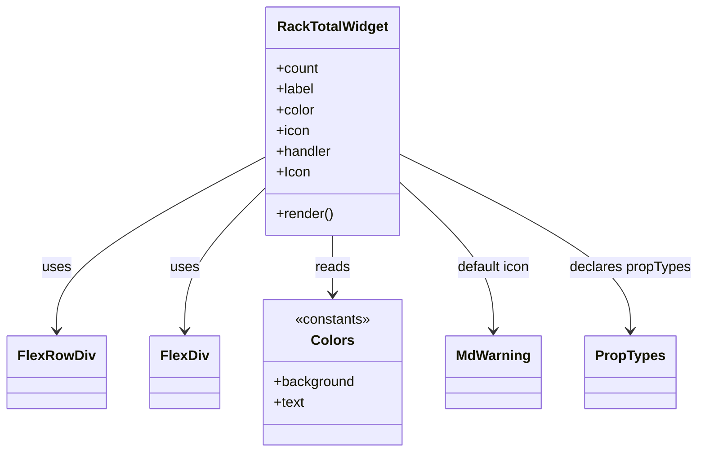

# Diagram: web/portal/src/modules/mt-dashboard/mt-dashboard-components/RackTotalWidget.js

> Auto-generated by Obscura crawlers

## Mermaid

### SVG

<svg id="container" width="787.90625" xmlns="http://www.w3.org/2000/svg" class="classDiagram" height="522" viewBox="0 0 787.90625 522" role="graphics-document document" aria-roledescription="class"><g><defs><marker id="container_class-aggregationStart" class="marker aggregation class" refX="18" refY="7" markerWidth="190" markerHeight="240" orient="auto"><path d="M 18,7 L9,13 L1,7 L9,1 Z"></path></marker></defs><defs><marker id="container_class-aggregationEnd" class="marker aggregation class" refX="1" refY="7" markerWidth="20" markerHeight="28" orient="auto"><path d="M 18,7 L9,13 L1,7 L9,1 Z"></path></marker></defs><defs><marker id="container_class-extensionStart" class="marker extension class" refX="18" refY="7" markerWidth="190" markerHeight="240" orient="auto"><path d="M 1,7 L18,13 V 1 Z"></path></marker></defs><defs><marker id="container_class-extensionEnd" class="marker extension class" refX="1" refY="7" markerWidth="20" markerHeight="28" orient="auto"><path d="M 1,1 V 13 L18,7 Z"></path></marker></defs><defs><marker id="container_class-compositionStart" class="marker composition class" refX="18" refY="7" markerWidth="190" markerHeight="240" orient="auto"><path d="M 18,7 L9,13 L1,7 L9,1 Z"></path></marker></defs><defs><marker id="container_class-compositionEnd" class="marker composition class" refX="1" refY="7" markerWidth="20" markerHeight="28" orient="auto"><path d="M 18,7 L9,13 L1,7 L9,1 Z"></path></marker></defs><defs><marker id="container_class-dependencyStart" class="marker dependency class" refX="6" refY="7" markerWidth="190" markerHeight="240" orient="auto"><path d="M 5,7 L9,13 L1,7 L9,1 Z"></path></marker></defs><defs><marker id="container_class-dependencyEnd" class="marker dependency class" refX="13" refY="7" markerWidth="20" markerHeight="28" orient="auto"><path d="M 18,7 L9,13 L14,7 L9,1 Z"></path></marker></defs><defs><marker id="container_class-lollipopStart" class="marker lollipop class" refX="13" refY="7" markerWidth="190" markerHeight="240" orient="auto"><circle stroke="black" fill="transparent" cx="7" cy="7" r="6"></circle></marker></defs><defs><marker id="container_class-lollipopEnd" class="marker lollipop class" refX="1" refY="7" markerWidth="190" markerHeight="240" orient="auto"><circle stroke="black" fill="transparent" cx="7" cy="7" r="6"></circle></marker></defs><g class="root"><g class="clusters"></g><g class="edgePaths"><path d="M296.348,181.311L257.225,202.593C218.102,223.874,139.855,266.437,100.732,299.885C61.609,333.333,61.609,357.667,61.609,369.833L61.609,382" id="id_RackTotalWidget_FlexRowDiv_1" class="edge-thickness-normal edge-pattern-solid relation" style=";;;" data-edge="true" data-et="edge" data-id="id_RackTotalWidget_FlexRowDiv_1" data-points="W3sieCI6Mjk2LjM0NzY1NjI1LCJ5IjoxODEuMzExMzQ3MjA1NjMyNzN9LHsieCI6NjEuNjA5Mzc1LCJ5IjozMDl9LHsieCI6NjEuNjA5Mzc1LCJ5IjozODh9XQ==" marker-end="url(#container_class-dependencyEnd)"></path><path d="M296.348,215.972L280.848,231.476C265.349,246.981,234.35,277.991,218.851,305.662C203.352,333.333,203.352,357.667,203.352,369.833L203.352,382" id="id_RackTotalWidget_FlexDiv_2" class="edge-thickness-normal edge-pattern-solid relation" style=";;;" data-edge="true" data-et="edge" data-id="id_RackTotalWidget_FlexDiv_2" data-points="W3sieCI6Mjk2LjM0NzY1NjI1LCJ5IjoyMTUuOTcxNjUyNTIzNzU3Nzd9LHsieCI6MjAzLjM1MTU2MjUsInkiOjMwOX0seyJ4IjoyMDMuMzUxNTYyNSwieSI6Mzg4fV0=" marker-end="url(#container_class-dependencyEnd)"></path><path d="M372.293,272L372.293,278.167C372.293,284.333,372.293,296.667,372.293,308C372.293,319.333,372.293,329.667,372.293,334.833L372.293,340" id="id_RackTotalWidget_Colors_3" class="edge-thickness-normal edge-pattern-solid relation" style=";;;" data-edge="true" data-et="edge" data-id="id_RackTotalWidget_Colors_3" data-points="W3sieCI6MzcyLjI5Mjk2ODc1LCJ5IjoyNzJ9LHsieCI6MzcyLjI5Mjk2ODc1LCJ5IjozMDl9LHsieCI6MzcyLjI5Mjk2ODc1LCJ5IjozNDZ9XQ==" marker-end="url(#container_class-dependencyEnd)"></path><path d="M448.238,209.782L466.235,226.319C484.232,242.855,520.225,275.927,538.222,304.63C556.219,333.333,556.219,357.667,556.219,369.833L556.219,382" id="id_RackTotalWidget_MdWarning_4" class="edge-thickness-normal edge-pattern-solid relation" style=";;;" data-edge="true" data-et="edge" data-id="id_RackTotalWidget_MdWarning_4" data-points="W3sieCI6NDQ4LjIzODI4MTI1LCJ5IjoyMDkuNzgyMjY2MTE0NDczODN9LHsieCI6NTU2LjIxODc1LCJ5IjozMDl9LHsieCI6NTU2LjIxODc1LCJ5IjozODh9XQ==" marker-end="url(#container_class-dependencyEnd)"></path><path d="M448.238,178.051L491.798,199.876C535.357,221.701,622.475,265.35,666.035,299.342C709.594,333.333,709.594,357.667,709.594,369.833L709.594,382" id="id_RackTotalWidget_PropTypes_5" class="edge-thickness-normal edge-pattern-solid relation" style=";;;" data-edge="true" data-et="edge" data-id="id_RackTotalWidget_PropTypes_5" data-points="W3sieCI6NDQ4LjIzODI4MTI1LCJ5IjoxNzguMDUxMzcyOTE2ODgzOH0seyJ4Ijo3MDkuNTkzNzUsInkiOjMwOX0seyJ4Ijo3MDkuNTkzNzUsInkiOjM4OH1d" marker-end="url(#container_class-dependencyEnd)"></path></g><g class="edgeLabels"><g class="edgeLabel" transform="translate(61.609375, 309)"><g class="label" data-id="id_RackTotalWidget_FlexRowDiv_1" transform="translate(-16.4921875, -12)"><foreignObject width="32.984375" height="24">

uses

</foreignObject></g></g><g class="edgeLabel" transform="translate(203.3515625, 309)"><g class="label" data-id="id_RackTotalWidget_FlexDiv_2" transform="translate(-16.4921875, -12)"><foreignObject width="32.984375" height="24">

uses

</foreignObject></g></g><g class="edgeLabel" transform="translate(372.29296875, 309)"><g class="label" data-id="id_RackTotalWidget_Colors_3" transform="translate(-20.0078125, -12)"><foreignObject width="40.015625" height="24">

reads

</foreignObject></g></g><g class="edgeLabel" transform="translate(556.21875, 309)"><g class="label" data-id="id_RackTotalWidget_MdWarning_4" transform="translate(-43.2890625, -12)"><foreignObject width="86.578125" height="24">

default icon

</foreignObject></g></g><g class="edgeLabel" transform="translate(709.59375, 309)"><g class="label" data-id="id_RackTotalWidget_PropTypes_5" transform="translate(-70.3125, -12)"><foreignObject width="140.625" height="24">

declares propTypes

</foreignObject></g></g></g><g class="nodes"><g class="node default" id="classId-RackTotalWidget-0" transform="translate(372.29296875, 140)"><g class="basic label-container"><path d="M-75.9453125 -132 L75.9453125 -132 L75.9453125 132 L-75.9453125 132" stroke="none" stroke-width="0" fill="#ECECFF" style=""></path><path d="M-75.9453125 -132 C-23.94832315325275 -132, 28.048666193494498 -132, 75.9453125 -132 M-75.9453125 -132 C-22.084228054228795 -132, 31.77685639154241 -132, 75.9453125 -132 M75.9453125 -132 C75.9453125 -77.85355456744298, 75.9453125 -23.707109134885954, 75.9453125 132 M75.9453125 -132 C75.9453125 -38.54731783877325, 75.9453125 54.905364322453494, 75.9453125 132 M75.9453125 132 C37.9248948090728 132, -0.09552288185439295 132, -75.9453125 132 M75.9453125 132 C24.960455828714004 132, -26.024400842571993 132, -75.9453125 132 M-75.9453125 132 C-75.9453125 40.51412917323553, -75.9453125 -50.97174165352894, -75.9453125 -132 M-75.9453125 132 C-75.9453125 34.40282821791766, -75.9453125 -63.19434356416468, -75.9453125 -132" stroke="#9370DB" stroke-width="1.3" fill="none" stroke-dasharray="0 0" style=""></path></g><g class="annotation-group text" transform="translate(0, -108)"></g><g class="label-group text" transform="translate(-61.28125, -108)"><g class="label" style="font-weight: bolder" transform="translate(0,-12)"><foreignObject width="122.5625" height="24">

RackTotalWidget

</foreignObject></g></g><g class="members-group text" transform="translate(-63.9453125, -60)"><g class="label" style="" transform="translate(0,-12)"><foreignObject width="49.125" height="24">

+count

</foreignObject></g><g class="label" style="" transform="translate(0,12)"><foreignObject width="44.21875" height="24">

+label

</foreignObject></g><g class="label" style="" transform="translate(0,36)"><foreignObject width="44.796875" height="24">

+color

</foreignObject></g><g class="label" style="" transform="translate(0,60)"><foreignObject width="38.546875" height="24">

+icon

</foreignObject></g><g class="label" style="" transform="translate(0,84)"><foreignObject width="64.515625" height="24">

+handler

</foreignObject></g><g class="label" style="" transform="translate(0,108)"><foreignObject width="38.765625" height="24">

+Icon

</foreignObject></g></g><g class="methods-group text" transform="translate(-63.9453125, 108)"><g class="label" style="" transform="translate(0,-12)"><foreignObject width="66.609375" height="24">

+render()

</foreignObject></g></g><g class="divider" style=""><path d="M-75.9453125 -84 C-40.491656577599954 -84, -5.038000655199909 -84, 75.9453125 -84 M-75.9453125 -84 C-19.861228173155645 -84, 36.22285615368871 -84, 75.9453125 -84" stroke="#9370DB" stroke-width="1.3" fill="none" stroke-dasharray="0 0" style=""></path></g><g class="divider" style=""><path d="M-75.9453125 84 C-31.252063827892584 84, 13.441184844214831 84, 75.9453125 84 M-75.9453125 84 C-15.719714533294166 84, 44.50588343341167 84, 75.9453125 84" stroke="#9370DB" stroke-width="1.3" fill="none" stroke-dasharray="0 0" style=""></path></g></g><g class="node default" id="classId-FlexRowDiv-1" transform="translate(61.609375, 430)"><g class="basic label-container"><path d="M-53.609375 -42 L53.609375 -42 L53.609375 42 L-53.609375 42" stroke="none" stroke-width="0" fill="#ECECFF" style=""></path><path d="M-53.609375 -42 C-26.856145103659337 -42, -0.10291520731867365 -42, 53.609375 -42 M-53.609375 -42 C-23.06283917980516 -42, 7.483696640389681 -42, 53.609375 -42 M53.609375 -42 C53.609375 -23.260419499678868, 53.609375 -4.520838999357736, 53.609375 42 M53.609375 -42 C53.609375 -12.444327137756822, 53.609375 17.111345724486355, 53.609375 42 M53.609375 42 C20.498144042548716 42, -12.613086914902567 42, -53.609375 42 M53.609375 42 C28.499999173798606 42, 3.390623347597213 42, -53.609375 42 M-53.609375 42 C-53.609375 11.04316336226401, -53.609375 -19.91367327547198, -53.609375 -42 M-53.609375 42 C-53.609375 21.386108032707405, -53.609375 0.7722160654148098, -53.609375 -42" stroke="#9370DB" stroke-width="1.3" fill="none" stroke-dasharray="0 0" style=""></path></g><g class="annotation-group text" transform="translate(0, -18)"></g><g class="label-group text" transform="translate(-41.609375, -18)"><g class="label" style="font-weight: bolder" transform="translate(0,-12)"><foreignObject width="83.21875" height="24">

FlexRowDiv

</foreignObject></g></g><g class="members-group text" transform="translate(-41.609375, 30)"></g><g class="methods-group text" transform="translate(-41.609375, 60)"></g><g class="divider" style=""><path d="M-53.609375 6 C-18.815158390607493 6, 15.979058218785013 6, 53.609375 6 M-53.609375 6 C-28.46143736070866 6, -3.3134997214173225 6, 53.609375 6" stroke="#9370DB" stroke-width="1.3" fill="none" stroke-dasharray="0 0" style=""></path></g><g class="divider" style=""><path d="M-53.609375 24 C-31.16060241065041 24, -8.711829821300817 24, 53.609375 24 M-53.609375 24 C-31.063938062032072 24, -8.518501124064144 24, 53.609375 24" stroke="#9370DB" stroke-width="1.3" fill="none" stroke-dasharray="0 0" style=""></path></g></g><g class="node default" id="classId-FlexDiv-2" transform="translate(203.3515625, 430)"><g class="basic label-container"><path d="M-38.1328125 -42 L38.1328125 -42 L38.1328125 42 L-38.1328125 42" stroke="none" stroke-width="0" fill="#ECECFF" style=""></path><path d="M-38.1328125 -42 C-10.648307910027839 -42, 16.836196679944322 -42, 38.1328125 -42 M-38.1328125 -42 C-14.332003599815025 -42, 9.46880530036995 -42, 38.1328125 -42 M38.1328125 -42 C38.1328125 -10.688163651795005, 38.1328125 20.62367269640999, 38.1328125 42 M38.1328125 -42 C38.1328125 -23.242517037274624, 38.1328125 -4.485034074549247, 38.1328125 42 M38.1328125 42 C20.53062154156582 42, 2.928430583131643 42, -38.1328125 42 M38.1328125 42 C13.922332442474076 42, -10.288147615051848 42, -38.1328125 42 M-38.1328125 42 C-38.1328125 12.59427306807196, -38.1328125 -16.81145386385608, -38.1328125 -42 M-38.1328125 42 C-38.1328125 15.30490426828202, -38.1328125 -11.390191463435961, -38.1328125 -42" stroke="#9370DB" stroke-width="1.3" fill="none" stroke-dasharray="0 0" style=""></path></g><g class="annotation-group text" transform="translate(0, -18)"></g><g class="label-group text" transform="translate(-26.1328125, -18)"><g class="label" style="font-weight: bolder" transform="translate(0,-12)"><foreignObject width="52.265625" height="24">

FlexDiv

</foreignObject></g></g><g class="members-group text" transform="translate(-26.1328125, 30)"></g><g class="methods-group text" transform="translate(-26.1328125, 60)"></g><g class="divider" style=""><path d="M-38.1328125 6 C-10.107148670710842 6, 17.918515158578316 6, 38.1328125 6 M-38.1328125 6 C-14.732124934694017 6, 8.668562630611966 6, 38.1328125 6" stroke="#9370DB" stroke-width="1.3" fill="none" stroke-dasharray="0 0" style=""></path></g><g class="divider" style=""><path d="M-38.1328125 24 C-11.182647129789789 24, 15.767518240420422 24, 38.1328125 24 M-38.1328125 24 C-22.485571503073956 24, -6.838330506147912 24, 38.1328125 24" stroke="#9370DB" stroke-width="1.3" fill="none" stroke-dasharray="0 0" style=""></path></g></g><g class="node default" id="classId-Colors-3" transform="translate(372.29296875, 430)"><g class="basic label-container"><path d="M-80.80859375 -84 L80.80859375 -84 L80.80859375 84 L-80.80859375 84" stroke="none" stroke-width="0" fill="#ECECFF" style=""></path><path d="M-80.80859375 -84 C-18.96576296793493 -84, 42.87706781413014 -84, 80.80859375 -84 M-80.80859375 -84 C-31.04054116048264 -84, 18.72751142903472 -84, 80.80859375 -84 M80.80859375 -84 C80.80859375 -25.654551318324692, 80.80859375 32.690897363350615, 80.80859375 84 M80.80859375 -84 C80.80859375 -42.50375137926497, 80.80859375 -1.007502758529938, 80.80859375 84 M80.80859375 84 C27.395790806235354 84, -26.017012137529292 84, -80.80859375 84 M80.80859375 84 C36.49614217891106 84, -7.816309392177885 84, -80.80859375 84 M-80.80859375 84 C-80.80859375 28.309171870329656, -80.80859375 -27.381656259340687, -80.80859375 -84 M-80.80859375 84 C-80.80859375 19.042433213924696, -80.80859375 -45.91513357215061, -80.80859375 -84" stroke="#9370DB" stroke-width="1.3" fill="none" stroke-dasharray="0 0" style=""></path></g><g class="annotation-group text" transform="translate(-44.2265625, -60)"><g class="label" style="" transform="translate(0,-12)"><foreignObject width="88.453125" height="24">

«constants»

</foreignObject></g></g><g class="label-group text" transform="translate(-23.1015625, -36)"><g class="label" style="font-weight: bolder" transform="translate(0,-12)"><foreignObject width="46.203125" height="24">

Colors

</foreignObject></g></g><g class="members-group text" transform="translate(-68.80859375, 12)"><g class="label" style="" transform="translate(0,-12)"><foreignObject width="93.390625" height="24">

+background

</foreignObject></g><g class="label" style="" transform="translate(0,12)"><foreignObject width="35.5625" height="24">

+text

</foreignObject></g></g><g class="methods-group text" transform="translate(-68.80859375, 84)"></g><g class="divider" style=""><path d="M-80.80859375 -12 C-19.507825313144473 -12, 41.792943123711055 -12, 80.80859375 -12 M-80.80859375 -12 C-17.214937368442293 -12, 46.378719013115415 -12, 80.80859375 -12" stroke="#9370DB" stroke-width="1.3" fill="none" stroke-dasharray="0 0" style=""></path></g><g class="divider" style=""><path d="M-80.80859375 60 C-26.458595365242886 60, 27.89140301951423 60, 80.80859375 60 M-80.80859375 60 C-29.208840826872958 60, 22.390912096254084 60, 80.80859375 60" stroke="#9370DB" stroke-width="1.3" fill="none" stroke-dasharray="0 0" style=""></path></g></g><g class="node default" id="classId-MdWarning-4" transform="translate(556.21875, 430)"><g class="basic label-container"><path d="M-53.1171875 -42 L53.1171875 -42 L53.1171875 42 L-53.1171875 42" stroke="none" stroke-width="0" fill="#ECECFF" style=""></path><path d="M-53.1171875 -42 C-22.243035205662025 -42, 8.63111708867595 -42, 53.1171875 -42 M-53.1171875 -42 C-18.56282944817385 -42, 15.991528603652299 -42, 53.1171875 -42 M53.1171875 -42 C53.1171875 -14.268222540164501, 53.1171875 13.463554919670997, 53.1171875 42 M53.1171875 -42 C53.1171875 -15.192511107379346, 53.1171875 11.614977785241308, 53.1171875 42 M53.1171875 42 C11.970608487810104 42, -29.175970524379792 42, -53.1171875 42 M53.1171875 42 C17.331754955030014 42, -18.45367758993997 42, -53.1171875 42 M-53.1171875 42 C-53.1171875 16.04867523766959, -53.1171875 -9.902649524660823, -53.1171875 -42 M-53.1171875 42 C-53.1171875 19.165843697399747, -53.1171875 -3.668312605200505, -53.1171875 -42" stroke="#9370DB" stroke-width="1.3" fill="none" stroke-dasharray="0 0" style=""></path></g><g class="annotation-group text" transform="translate(0, -18)"></g><g class="label-group text" transform="translate(-41.1171875, -18)"><g class="label" style="font-weight: bolder" transform="translate(0,-12)"><foreignObject width="82.234375" height="24">

MdWarning

</foreignObject></g></g><g class="members-group text" transform="translate(-41.1171875, 30)"></g><g class="methods-group text" transform="translate(-41.1171875, 60)"></g><g class="divider" style=""><path d="M-53.1171875 6 C-16.60981683363668 6, 19.897553832726643 6, 53.1171875 6 M-53.1171875 6 C-18.78438993140756 6, 15.54840763718488 6, 53.1171875 6" stroke="#9370DB" stroke-width="1.3" fill="none" stroke-dasharray="0 0" style=""></path></g><g class="divider" style=""><path d="M-53.1171875 24 C-31.28944998437672 24, -9.46171246875344 24, 53.1171875 24 M-53.1171875 24 C-13.839992008418008 24, 25.437203483163984 24, 53.1171875 24" stroke="#9370DB" stroke-width="1.3" fill="none" stroke-dasharray="0 0" style=""></path></g></g><g class="node default" id="classId-PropTypes-5" transform="translate(709.59375, 430)"><g class="basic label-container"><path d="M-50.2578125 -42 L50.2578125 -42 L50.2578125 42 L-50.2578125 42" stroke="none" stroke-width="0" fill="#ECECFF" style=""></path><path d="M-50.2578125 -42 C-19.043986256175316 -42, 12.169839987649368 -42, 50.2578125 -42 M-50.2578125 -42 C-16.57562223460868 -42, 17.10656803078264 -42, 50.2578125 -42 M50.2578125 -42 C50.2578125 -22.601229815487457, 50.2578125 -3.2024596309749143, 50.2578125 42 M50.2578125 -42 C50.2578125 -11.653203966982968, 50.2578125 18.693592066034064, 50.2578125 42 M50.2578125 42 C14.450575855602786 42, -21.35666078879443 42, -50.2578125 42 M50.2578125 42 C14.353702982029965 42, -21.55040653594007 42, -50.2578125 42 M-50.2578125 42 C-50.2578125 11.281029126272525, -50.2578125 -19.43794174745495, -50.2578125 -42 M-50.2578125 42 C-50.2578125 18.138934539079834, -50.2578125 -5.722130921840332, -50.2578125 -42" stroke="#9370DB" stroke-width="1.3" fill="none" stroke-dasharray="0 0" style=""></path></g><g class="annotation-group text" transform="translate(0, -18)"></g><g class="label-group text" transform="translate(-38.2578125, -18)"><g class="label" style="font-weight: bolder" transform="translate(0,-12)"><foreignObject width="76.515625" height="24">

PropTypes

</foreignObject></g></g><g class="members-group text" transform="translate(-38.2578125, 30)"></g><g class="methods-group text" transform="translate(-38.2578125, 60)"></g><g class="divider" style=""><path d="M-50.2578125 6 C-22.21022218911584 6, 5.837368121768321 6, 50.2578125 6 M-50.2578125 6 C-21.76492027386642 6, 6.727971952267161 6, 50.2578125 6" stroke="#9370DB" stroke-width="1.3" fill="none" stroke-dasharray="0 0" style=""></path></g><g class="divider" style=""><path d="M-50.2578125 24 C-12.062263980653405 24, 26.13328453869319 24, 50.2578125 24 M-50.2578125 24 C-25.761295972817766 24, -1.2647794456355328 24, 50.2578125 24" stroke="#9370DB" stroke-width="1.3" fill="none" stroke-dasharray="0 0" style=""></path></g></g></g></g></g></svg>
