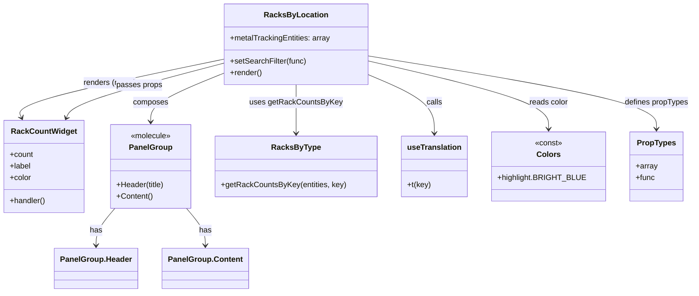

# Diagram: web/portal/src/modules/mt-dashboard/mt-dashboard-components/RacksByLocation.js

> Auto-generated by Obscura crawlers

## Mermaid

### SVG

<svg id="container" width="1406.82421875" xmlns="http://www.w3.org/2000/svg" class="classDiagram" height="608" viewBox="34.2265625 0 1406.82421875 608" role="graphics-document document" aria-roledescription="class"><g><defs><marker id="container_class-aggregationStart" class="marker aggregation class" refX="18" refY="7" markerWidth="190" markerHeight="240" orient="auto"><path d="M 18,7 L9,13 L1,7 L9,1 Z"></path></marker></defs><defs><marker id="container_class-aggregationEnd" class="marker aggregation class" refX="1" refY="7" markerWidth="20" markerHeight="28" orient="auto"><path d="M 18,7 L9,13 L1,7 L9,1 Z"></path></marker></defs><defs><marker id="container_class-extensionStart" class="marker extension class" refX="18" refY="7" markerWidth="190" markerHeight="240" orient="auto"><path d="M 1,7 L18,13 V 1 Z"></path></marker></defs><defs><marker id="container_class-extensionEnd" class="marker extension class" refX="1" refY="7" markerWidth="20" markerHeight="28" orient="auto"><path d="M 1,1 V 13 L18,7 Z"></path></marker></defs><defs><marker id="container_class-compositionStart" class="marker composition class" refX="18" refY="7" markerWidth="190" markerHeight="240" orient="auto"><path d="M 18,7 L9,13 L1,7 L9,1 Z"></path></marker></defs><defs><marker id="container_class-compositionEnd" class="marker composition class" refX="1" refY="7" markerWidth="20" markerHeight="28" orient="auto"><path d="M 18,7 L9,13 L1,7 L9,1 Z"></path></marker></defs><defs><marker id="container_class-dependencyStart" class="marker dependency class" refX="6" refY="7" markerWidth="190" markerHeight="240" orient="auto"><path d="M 5,7 L9,13 L1,7 L9,1 Z"></path></marker></defs><defs><marker id="container_class-dependencyEnd" class="marker dependency class" refX="13" refY="7" markerWidth="20" markerHeight="28" orient="auto"><path d="M 18,7 L9,13 L14,7 L9,1 Z"></path></marker></defs><defs><marker id="container_class-lollipopStart" class="marker lollipop class" refX="13" refY="7" markerWidth="190" markerHeight="240" orient="auto"><circle stroke="black" fill="transparent" cx="7" cy="7" r="6"></circle></marker></defs><defs><marker id="container_class-lollipopEnd" class="marker lollipop class" refX="1" refY="7" markerWidth="190" markerHeight="240" orient="auto"><circle stroke="black" fill="transparent" cx="7" cy="7" r="6"></circle></marker></defs><g class="root"><g class="clusters"></g><g class="edgePaths"><path d="M493.988,122.818L422.128,137.848C350.268,152.879,206.548,182.939,137.102,203.228C67.657,223.516,72.485,234.032,74.9,239.289L77.314,244.547" id="id_RacksByLocation_RackCountWidget_1" class="edge-thickness-normal edge-pattern-solid relation" style=";;;" data-edge="true" data-et="edge" data-id="id_RacksByLocation_RackCountWidget_1" data-points="W3sieCI6NDkzLjk4ODI4MTI1LCJ5IjoxMjIuODE3ODQxMTMwMDc3OH0seyJ4Ijo2Mi44MjgxMjUsInkiOjIxM30seyJ4Ijo3OS44MTc2MTA0MzIzMzA4MiwieSI6MjUwfV0=" marker-end="url(#container_class-dependencyEnd)"></path><path d="M493.988,152.026L469.044,162.188C444.099,172.351,394.21,192.675,369.265,209.504C344.32,226.333,344.32,239.667,344.32,246.333L344.32,253" id="id_RacksByLocation_PanelGroup_2" class="edge-thickness-normal edge-pattern-solid relation" style=";;;" data-edge="true" data-et="edge" data-id="id_RacksByLocation_PanelGroup_2" data-points="W3sieCI6NDkzLjk4ODI4MTI1LCJ5IjoxNTIuMDI1NzY0Nzg5NDM2M30seyJ4IjozNDQuMzIwMzEyNSwieSI6MjEzfSx7IngiOjM0NC4zMjAzMTI1LCJ5IjoyNTl9XQ==" marker-end="url(#container_class-dependencyEnd)"></path><path d="M641.328,176L641.328,182.167C641.328,188.333,641.328,200.667,641.328,217.5C641.328,234.333,641.328,255.667,641.328,266.333L641.328,277" id="id_RacksByLocation_RacksByType_3" class="edge-thickness-normal edge-pattern-solid relation" style=";;;" data-edge="true" data-et="edge" data-id="id_RacksByLocation_RacksByType_3" data-points="W3sieCI6NjQxLjMyODEyNSwieSI6MTc2fSx7IngiOjY0MS4zMjgxMjUsInkiOjIxM30seyJ4Ijo2NDEuMzI4MTI1LCJ5IjoyODN9XQ==" marker-end="url(#container_class-dependencyEnd)"></path><path d="M788.668,155.711L810.749,165.259C832.831,174.807,876.993,193.904,899.075,214.118C921.156,234.333,921.156,255.667,921.156,266.333L921.156,277" id="id_RacksByLocation_useTranslation_4" class="edge-thickness-normal edge-pattern-solid relation" style=";;;" data-edge="true" data-et="edge" data-id="id_RacksByLocation_useTranslation_4" data-points="W3sieCI6Nzg4LjY2Nzk2ODc1LCJ5IjoxNTUuNzEwOTY5MzQ1MDIyMDV9LHsieCI6OTIxLjE1NjI1LCJ5IjoyMTN9LHsieCI6OTIxLjE1NjI1LCJ5IjoyODN9XQ==" marker-end="url(#container_class-dependencyEnd)"></path><path d="M788.668,127.028L848.94,141.356C909.212,155.685,1029.757,184.343,1090.029,207.838C1150.301,231.333,1150.301,249.667,1150.301,258.833L1150.301,268" id="id_RacksByLocation_Colors_5" class="edge-thickness-normal edge-pattern-solid relation" style=";;;" data-edge="true" data-et="edge" data-id="id_RacksByLocation_Colors_5" data-points="W3sieCI6Nzg4LjY2Nzk2ODc1LCJ5IjoxMjcuMDI3NjU5ODg0NzI0OX0seyJ4IjoxMTUwLjMwMDc4MTI1LCJ5IjoyMTN9LHsieCI6MTE1MC4zMDA3ODEyNSwieSI6Mjc0fV0=" marker-end="url(#container_class-dependencyEnd)"></path><path d="M788.668,116.575L885.02,132.646C981.371,148.717,1174.074,180.858,1270.426,206.096C1366.777,231.333,1366.777,249.667,1366.777,258.833L1366.777,268" id="id_RacksByLocation_PropTypes_6" class="edge-thickness-normal edge-pattern-solid relation" style=";;;" data-edge="true" data-et="edge" data-id="id_RacksByLocation_PropTypes_6" data-points="W3sieCI6Nzg4LjY2Nzk2ODc1LCJ5IjoxMTYuNTc1Mjg0NzEwNDQzNDN9LHsieCI6MTM2Ni43NzczNDM3NSwieSI6MjEzfSx7IngiOjEzNjYuNzc3MzQzNzUsInkiOjI3NH1d" marker-end="url(#container_class-dependencyEnd)"></path><path d="M170.483,244.547L172.897,239.289C175.312,234.032,180.14,223.516,234.058,204.602C287.975,185.689,390.982,158.377,442.485,144.722L493.988,131.066" id="id_RackCountWidget_RacksByLocation_7" class="edge-thickness-normal edge-pattern-solid relation" style=";;;" data-edge="true" data-et="edge" data-id="id_RackCountWidget_RacksByLocation_7" data-points="W3sieCI6MTY3Ljk3OTI2NDU2NzY2OTIsInkiOjI1MH0seyJ4IjoxODQuOTY4NzUsInkiOjIxM30seyJ4Ijo0OTMuOTg4MjgxMjUsInkiOjEzMS4wNjU5Njg3NzQ2MDg4Mn1d" marker-start="url(#container_class-dependencyStart)"></path><path d="M273.201,433L266.934,440.667C260.667,448.333,248.132,463.667,241.865,476.5C235.598,489.333,235.598,499.667,235.598,504.833L235.598,510" id="id_PanelGroup_PanelGroup.Header_8" class="edge-thickness-normal edge-pattern-solid relation" style=";;;" data-edge="true" data-et="edge" data-id="id_PanelGroup_PanelGroup.Header_8" data-points="W3sieCI6MjczLjIwMDk4MDk2ODA0NTEsInkiOjQzM30seyJ4IjoyMzUuNTk3NjU2MjUsInkiOjQ3OX0seyJ4IjoyMzUuNTk3NjU2MjUsInkiOjUxNn1d" marker-end="url(#container_class-dependencyEnd)"></path><path d="M415.44,433L421.707,440.667C427.974,448.333,440.509,463.667,446.776,476.5C453.043,489.333,453.043,499.667,453.043,504.833L453.043,510" id="id_PanelGroup_PanelGroup.Content_9" class="edge-thickness-normal edge-pattern-solid relation" style=";;;" data-edge="true" data-et="edge" data-id="id_PanelGroup_PanelGroup.Content_9" data-points="W3sieCI6NDE1LjQzOTY0NDAzMTk1NDksInkiOjQzM30seyJ4Ijo0NTMuMDQyOTY4NzUsInkiOjQ3OX0seyJ4Ijo0NTMuMDQyOTY4NzUsInkiOjUxNn1d" marker-end="url(#container_class-dependencyEnd)"></path></g><g class="edgeLabels"><g class="edgeLabel" transform="translate(258.48232, 172.07665)"><g class="label" data-id="id_RacksByLocation_RackCountWidget_1" transform="translate(-54.828125, -12)"><foreignObject width="109.65625" height="24">

renders (many)

</foreignObject></g></g><g class="edgeLabel" transform="translate(344.3203125, 213)"><g class="label" data-id="id_RacksByLocation_PanelGroup_2" transform="translate(-36.453125, -12)"><foreignObject width="72.90625" height="24">

composes

</foreignObject></g></g><g class="edgeLabel" transform="translate(641.328125, 213)"><g class="label" data-id="id_RacksByLocation_RacksByType_3" transform="translate(-93.546875, -12)"><foreignObject width="187.09375" height="24">

uses getRackCountsByKey

</foreignObject></g></g><g class="edgeLabel" transform="translate(921.15625, 213)"><g class="label" data-id="id_RacksByLocation_useTranslation_4" transform="translate(-16.4453125, -12)"><foreignObject width="32.890625" height="24">

calls

</foreignObject></g></g><g class="edgeLabel" transform="translate(1150.30078125, 213)"><g class="label" data-id="id_RacksByLocation_Colors_5" transform="translate(-40.5234375, -12)"><foreignObject width="81.046875" height="24">

reads color

</foreignObject></g></g><g class="edgeLabel" transform="translate(1366.77734375, 213)"><g class="label" data-id="id_RacksByLocation_PropTypes_6" transform="translate(-66.2734375, -12)"><foreignObject width="132.546875" height="24">

defines propTypes

</foreignObject></g></g><g class="edgeLabel" transform="translate(319.80135, 177.25023)"><g class="label" data-id="id_RackCountWidget_RacksByLocation_7" transform="translate(-47.3125, -12)"><foreignObject width="94.625" height="24">

passes props

</foreignObject></g></g><g class="edgeLabel" transform="translate(235.59765625, 479)"><g class="label" data-id="id_PanelGroup_PanelGroup.Header_8" transform="translate(-12.703125, -12)"><foreignObject width="25.40625" height="24">

has

</foreignObject></g></g><g class="edgeLabel" transform="translate(453.04296875, 479)"><g class="label" data-id="id_PanelGroup_PanelGroup.Content_9" transform="translate(-12.703125, -12)"><foreignObject width="25.40625" height="24">

has

</foreignObject></g></g></g><g class="nodes"><g class="node default" id="classId-RacksByLocation-0" transform="translate(641.328125, 92)"><g class="basic label-container"><path d="M-147.33984375 -84 L147.33984375 -84 L147.33984375 84 L-147.33984375 84" stroke="none" stroke-width="0" fill="#ECECFF" style=""></path><path d="M-147.33984375 -84 C-57.328154364936864 -84, 32.68353502012627 -84, 147.33984375 -84 M-147.33984375 -84 C-62.63022075502798 -84, 22.079402239944045 -84, 147.33984375 -84 M147.33984375 -84 C147.33984375 -44.32261335192046, 147.33984375 -4.645226703840919, 147.33984375 84 M147.33984375 -84 C147.33984375 -33.76055794465185, 147.33984375 16.4788841106963, 147.33984375 84 M147.33984375 84 C63.4615634668295 84, -20.416716816340994 84, -147.33984375 84 M147.33984375 84 C76.66822546624627 84, 5.996607182492539 84, -147.33984375 84 M-147.33984375 84 C-147.33984375 39.85494899109288, -147.33984375 -4.290102017814235, -147.33984375 -84 M-147.33984375 84 C-147.33984375 26.26314398132684, -147.33984375 -31.473712037346317, -147.33984375 -84" stroke="#9370DB" stroke-width="1.3" fill="none" stroke-dasharray="0 0" style=""></path></g><g class="annotation-group text" transform="translate(0, -60)"></g><g class="label-group text" transform="translate(-61.7421875, -60)"><g class="label" style="font-weight: bolder" transform="translate(0,-12)"><foreignObject width="123.484375" height="24">

RacksByLocation

</foreignObject></g></g><g class="members-group text" transform="translate(-135.33984375, -12)"><g class="label" style="" transform="translate(0,-12)"><foreignObject width="208.9375" height="24">

+metalTrackingEntities: array

</foreignObject></g></g><g class="methods-group text" transform="translate(-135.33984375, 36)"><g class="label" style="" transform="translate(0,-12)"><foreignObject width="157.65625" height="24">

+setSearchFilter(func)

</foreignObject></g><g class="label" style="" transform="translate(0,12)"><foreignObject width="66.609375" height="24">

+render()

</foreignObject></g></g><g class="divider" style=""><path d="M-147.33984375 -36 C-36.998568437148066 -36, 73.34270687570387 -36, 147.33984375 -36 M-147.33984375 -36 C-82.68306817364197 -36, -18.02629259728394 -36, 147.33984375 -36" stroke="#9370DB" stroke-width="1.3" fill="none" stroke-dasharray="0 0" style=""></path></g><g class="divider" style=""><path d="M-147.33984375 12 C-85.94109065730166 12, -24.54233756460333 12, 147.33984375 12 M-147.33984375 12 C-87.5304980481877 12, -27.72115234637539 12, 147.33984375 12" stroke="#9370DB" stroke-width="1.3" fill="none" stroke-dasharray="0 0" style=""></path></g></g><g class="node default" id="classId-RackCountWidget-1" transform="translate(123.8984375, 346)"><g class="basic label-container"><path d="M-81.671875 -96 L81.671875 -96 L81.671875 96 L-81.671875 96" stroke="none" stroke-width="0" fill="#ECECFF" style=""></path><path d="M-81.671875 -96 C-17.085832738582994 -96, 47.50020952283401 -96, 81.671875 -96 M-81.671875 -96 C-34.12029764788401 -96, 13.431279704231983 -96, 81.671875 -96 M81.671875 -96 C81.671875 -34.971176164403445, 81.671875 26.05764767119311, 81.671875 96 M81.671875 -96 C81.671875 -19.908138096778572, 81.671875 56.183723806442856, 81.671875 96 M81.671875 96 C24.784281610145364 96, -32.10331177970927 96, -81.671875 96 M81.671875 96 C34.99570204750787 96, -11.680470904984261 96, -81.671875 96 M-81.671875 96 C-81.671875 50.39318122891436, -81.671875 4.786362457828716, -81.671875 -96 M-81.671875 96 C-81.671875 51.44503547452578, -81.671875 6.890070949051562, -81.671875 -96" stroke="#9370DB" stroke-width="1.3" fill="none" stroke-dasharray="0 0" style=""></path></g><g class="annotation-group text" transform="translate(0, -72)"></g><g class="label-group text" transform="translate(-64.453125, -72)"><g class="label" style="font-weight: bolder" transform="translate(0,-12)"><foreignObject width="128.90625" height="24">

RackCountWidget

</foreignObject></g></g><g class="members-group text" transform="translate(-69.671875, -24)"><g class="label" style="" transform="translate(0,-12)"><foreignObject width="49.125" height="24">

+count

</foreignObject></g><g class="label" style="" transform="translate(0,12)"><foreignObject width="44.21875" height="24">

+label

</foreignObject></g><g class="label" style="" transform="translate(0,36)"><foreignObject width="44.796875" height="24">

+color

</foreignObject></g></g><g class="methods-group text" transform="translate(-69.671875, 72)"><g class="label" style="" transform="translate(0,-12)"><foreignObject width="74.890625" height="24">

+handler()

</foreignObject></g></g><g class="divider" style=""><path d="M-81.671875 -48 C-48.93786374960095 -48, -16.2038524992019 -48, 81.671875 -48 M-81.671875 -48 C-30.875188046206404 -48, 19.921498907587193 -48, 81.671875 -48" stroke="#9370DB" stroke-width="1.3" fill="none" stroke-dasharray="0 0" style=""></path></g><g class="divider" style=""><path d="M-81.671875 48 C-19.805015808253785 48, 42.06184338349243 48, 81.671875 48 M-81.671875 48 C-39.374885500186046 48, 2.9221039996279075 48, 81.671875 48" stroke="#9370DB" stroke-width="1.3" fill="none" stroke-dasharray="0 0" style=""></path></g></g><g class="node default" id="classId-PanelGroup-2" transform="translate(344.3203125, 346)"><g class="basic label-container"><path d="M-83.265625 -87 L83.265625 -87 L83.265625 87 L-83.265625 87" stroke="none" stroke-width="0" fill="#ECECFF" style=""></path><path d="M-83.265625 -87 C-32.60563479321135 -87, 18.054355413577298 -87, 83.265625 -87 M-83.265625 -87 C-44.47567753866113 -87, -5.685730077322262 -87, 83.265625 -87 M83.265625 -87 C83.265625 -35.52125700547351, 83.265625 15.957485989052984, 83.265625 87 M83.265625 -87 C83.265625 -24.765375582195325, 83.265625 37.46924883560935, 83.265625 87 M83.265625 87 C46.381260711313395 87, 9.49689642262679 87, -83.265625 87 M83.265625 87 C47.76660503403678 87, 12.267585068073558 87, -83.265625 87 M-83.265625 87 C-83.265625 22.578476106173085, -83.265625 -41.84304778765383, -83.265625 -87 M-83.265625 87 C-83.265625 22.526727012808067, -83.265625 -41.94654597438387, -83.265625 -87" stroke="#9370DB" stroke-width="1.3" fill="none" stroke-dasharray="0 0" style=""></path></g><g class="annotation-group text" transform="translate(-42.2265625, -63)"><g class="label" style="" transform="translate(0,-12)"><foreignObject width="84.453125" height="24">

«molecule»

</foreignObject></g></g><g class="label-group text" transform="translate(-42.328125, -39)"><g class="label" style="font-weight: bolder" transform="translate(0,-12)"><foreignObject width="84.65625" height="24">

PanelGroup

</foreignObject></g></g><g class="members-group text" transform="translate(-71.265625, 9)"></g><g class="methods-group text" transform="translate(-71.265625, 39)"><g class="label" style="" transform="translate(0,-12)"><foreignObject width="100.203125" height="24">

+Header(title)

</foreignObject></g><g class="label" style="" transform="translate(0,12)"><foreignObject width="75.125" height="24">

+Content()

</foreignObject></g></g><g class="divider" style=""><path d="M-83.265625 -15 C-26.721758467874302 -15, 29.822108064251395 -15, 83.265625 -15 M-83.265625 -15 C-44.88349460844955 -15, -6.5013642168991055 -15, 83.265625 -15" stroke="#9370DB" stroke-width="1.3" fill="none" stroke-dasharray="0 0" style=""></path></g><g class="divider" style=""><path d="M-83.265625 9 C-45.70279093526316 9, -8.13995687052632 9, 83.265625 9 M-83.265625 9 C-40.79577414462074 9, 1.674076710758527 9, 83.265625 9" stroke="#9370DB" stroke-width="1.3" fill="none" stroke-dasharray="0 0" style=""></path></g></g><g class="node default" id="classId-RacksByType-3" transform="translate(641.328125, 346)"><g class="basic label-container"><path d="M-163.7421875 -63 L163.7421875 -63 L163.7421875 63 L-163.7421875 63" stroke="none" stroke-width="0" fill="#ECECFF" style=""></path><path d="M-163.7421875 -63 C-63.23876582697065 -63, 37.2646558460587 -63, 163.7421875 -63 M-163.7421875 -63 C-42.03814489587509 -63, 79.66589770824982 -63, 163.7421875 -63 M163.7421875 -63 C163.7421875 -33.877687144562884, 163.7421875 -4.755374289125761, 163.7421875 63 M163.7421875 -63 C163.7421875 -24.693742436937583, 163.7421875 13.612515126124833, 163.7421875 63 M163.7421875 63 C65.39082009682656 63, -32.96054730634688 63, -163.7421875 63 M163.7421875 63 C67.25969603240581 63, -29.222795435188374 63, -163.7421875 63 M-163.7421875 63 C-163.7421875 27.944372124954157, -163.7421875 -7.111255750091686, -163.7421875 -63 M-163.7421875 63 C-163.7421875 15.217397813667752, -163.7421875 -32.565204372664496, -163.7421875 -63" stroke="#9370DB" stroke-width="1.3" fill="none" stroke-dasharray="0 0" style=""></path></g><g class="annotation-group text" transform="translate(0, -39)"></g><g class="label-group text" transform="translate(-47.734375, -39)"><g class="label" style="font-weight: bolder" transform="translate(0,-12)"><foreignObject width="95.46875" height="24">

RacksByType

</foreignObject></g></g><g class="members-group text" transform="translate(-151.7421875, 9)"></g><g class="methods-group text" transform="translate(-151.7421875, 39)"><g class="label" style="" transform="translate(0,-12)"><foreignObject width="255.75" height="24">

+getRackCountsByKey(entities, key)

</foreignObject></g></g><g class="divider" style=""><path d="M-163.7421875 -15 C-35.50071986927415 -15, 92.7407477614517 -15, 163.7421875 -15 M-163.7421875 -15 C-48.973897460191395 -15, 65.79439257961721 -15, 163.7421875 -15" stroke="#9370DB" stroke-width="1.3" fill="none" stroke-dasharray="0 0" style=""></path></g><g class="divider" style=""><path d="M-163.7421875 9 C-81.60625180773675 9, 0.5296838845264915 9, 163.7421875 9 M-163.7421875 9 C-51.02716360212433 9, 61.687860295751335 9, 163.7421875 9" stroke="#9370DB" stroke-width="1.3" fill="none" stroke-dasharray="0 0" style=""></path></g></g><g class="node default" id="classId-useTranslation-4" transform="translate(921.15625, 346)"><g class="basic label-container"><path d="M-66.0859375 -63 L66.0859375 -63 L66.0859375 63 L-66.0859375 63" stroke="none" stroke-width="0" fill="#ECECFF" style=""></path><path d="M-66.0859375 -63 C-24.72842865421937 -63, 16.629080191561258 -63, 66.0859375 -63 M-66.0859375 -63 C-36.8190861848463 -63, -7.552234869692597 -63, 66.0859375 -63 M66.0859375 -63 C66.0859375 -14.989467333251383, 66.0859375 33.02106533349723, 66.0859375 63 M66.0859375 -63 C66.0859375 -32.23160295258609, 66.0859375 -1.4632059051721669, 66.0859375 63 M66.0859375 63 C24.381144570683993 63, -17.323648358632013 63, -66.0859375 63 M66.0859375 63 C24.139529291039516 63, -17.80687891792097 63, -66.0859375 63 M-66.0859375 63 C-66.0859375 15.541678687008591, -66.0859375 -31.916642625982817, -66.0859375 -63 M-66.0859375 63 C-66.0859375 28.203331612190482, -66.0859375 -6.593336775619036, -66.0859375 -63" stroke="#9370DB" stroke-width="1.3" fill="none" stroke-dasharray="0 0" style=""></path></g><g class="annotation-group text" transform="translate(0, -39)"></g><g class="label-group text" transform="translate(-54.0859375, -39)"><g class="label" style="font-weight: bolder" transform="translate(0,-12)"><foreignObject width="108.171875" height="24">

useTranslation

</foreignObject></g></g><g class="members-group text" transform="translate(-54.0859375, 9)"></g><g class="methods-group text" transform="translate(-54.0859375, 39)"><g class="label" style="" transform="translate(0,-12)"><foreignObject width="48.625" height="24">

+t(key)

</foreignObject></g></g><g class="divider" style=""><path d="M-66.0859375 -15 C-20.582902995109862 -15, 24.920131509780276 -15, 66.0859375 -15 M-66.0859375 -15 C-18.710866899764348 -15, 28.664203700471305 -15, 66.0859375 -15" stroke="#9370DB" stroke-width="1.3" fill="none" stroke-dasharray="0 0" style=""></path></g><g class="divider" style=""><path d="M-66.0859375 9 C-16.775331840700787 9, 32.53527381859843 9, 66.0859375 9 M-66.0859375 9 C-23.960435630527385 9, 18.16506623894523 9, 66.0859375 9" stroke="#9370DB" stroke-width="1.3" fill="none" stroke-dasharray="0 0" style=""></path></g></g><g class="node default" id="classId-Colors-5" transform="translate(1150.30078125, 346)"><g class="basic label-container"><path d="M-113.05859375 -72 L113.05859375 -72 L113.05859375 72 L-113.05859375 72" stroke="none" stroke-width="0" fill="#ECECFF" style=""></path><path d="M-113.05859375 -72 C-47.07526625355206 -72, 18.908061242895883 -72, 113.05859375 -72 M-113.05859375 -72 C-38.20725678951855 -72, 36.644080170962894 -72, 113.05859375 -72 M113.05859375 -72 C113.05859375 -28.749481043593555, 113.05859375 14.50103791281289, 113.05859375 72 M113.05859375 -72 C113.05859375 -41.838497737155144, 113.05859375 -11.676995474310289, 113.05859375 72 M113.05859375 72 C58.532366584186434 72, 4.006139418372868 72, -113.05859375 72 M113.05859375 72 C54.2691888949397 72, -4.520215960120595 72, -113.05859375 72 M-113.05859375 72 C-113.05859375 18.84101621582242, -113.05859375 -34.31796756835516, -113.05859375 -72 M-113.05859375 72 C-113.05859375 32.93264582103981, -113.05859375 -6.134708357920374, -113.05859375 -72" stroke="#9370DB" stroke-width="1.3" fill="none" stroke-dasharray="0 0" style=""></path></g><g class="annotation-group text" transform="translate(-28.6171875, -48)"><g class="label" style="" transform="translate(0,-12)"><foreignObject width="57.234375" height="24">

«const»

</foreignObject></g></g><g class="label-group text" transform="translate(-23.1015625, -24)"><g class="label" style="font-weight: bolder" transform="translate(0,-12)"><foreignObject width="46.203125" height="24">

Colors

</foreignObject></g></g><g class="members-group text" transform="translate(-101.05859375, 24)"><g class="label" style="" transform="translate(0,-12)"><foreignObject width="173.5" height="24">

+highlight.BRIGHT_BLUE

</foreignObject></g></g><g class="methods-group text" transform="translate(-101.05859375, 72)"></g><g class="divider" style=""><path d="M-113.05859375 0 C-33.519372336908035 0, 46.01984907618393 0, 113.05859375 0 M-113.05859375 0 C-54.9037193390538 0, 3.2511550718923985 0, 113.05859375 0" stroke="#9370DB" stroke-width="1.3" fill="none" stroke-dasharray="0 0" style=""></path></g><g class="divider" style=""><path d="M-113.05859375 48 C-60.421423238676084 48, -7.784252727352168 48, 113.05859375 48 M-113.05859375 48 C-58.58456228707438 48, -4.1105308241487535 48, 113.05859375 48" stroke="#9370DB" stroke-width="1.3" fill="none" stroke-dasharray="0 0" style=""></path></g></g><g class="node default" id="classId-PropTypes-6" transform="translate(1366.77734375, 346)"><g class="basic label-container"><path d="M-53.41796875 -72 L53.41796875 -72 L53.41796875 72 L-53.41796875 72" stroke="none" stroke-width="0" fill="#ECECFF" style=""></path><path d="M-53.41796875 -72 C-12.86951037635641 -72, 27.67894799728718 -72, 53.41796875 -72 M-53.41796875 -72 C-11.958544479511446 -72, 29.50087979097711 -72, 53.41796875 -72 M53.41796875 -72 C53.41796875 -37.74897928127539, 53.41796875 -3.497958562550778, 53.41796875 72 M53.41796875 -72 C53.41796875 -14.45885221834881, 53.41796875 43.08229556330238, 53.41796875 72 M53.41796875 72 C16.503806513631332 72, -20.410355722737336 72, -53.41796875 72 M53.41796875 72 C29.939205733238605 72, 6.4604427164772105 72, -53.41796875 72 M-53.41796875 72 C-53.41796875 21.553213663629684, -53.41796875 -28.893572672740632, -53.41796875 -72 M-53.41796875 72 C-53.41796875 32.97340226112134, -53.41796875 -6.053195477757313, -53.41796875 -72" stroke="#9370DB" stroke-width="1.3" fill="none" stroke-dasharray="0 0" style=""></path></g><g class="annotation-group text" transform="translate(0, -48)"></g><g class="label-group text" transform="translate(-38.2578125, -48)"><g class="label" style="font-weight: bolder" transform="translate(0,-12)"><foreignObject width="76.515625" height="24">

PropTypes

</foreignObject></g></g><g class="members-group text" transform="translate(-41.41796875, 0)"><g class="label" style="" transform="translate(0,-12)"><foreignObject width="44.578125" height="24">

+array

</foreignObject></g><g class="label" style="" transform="translate(0,12)"><foreignObject width="39.453125" height="24">

+func

</foreignObject></g></g><g class="methods-group text" transform="translate(-41.41796875, 72)"></g><g class="divider" style=""><path d="M-53.41796875 -24 C-22.090967787813856 -24, 9.236033174372288 -24, 53.41796875 -24 M-53.41796875 -24 C-23.379449303405746 -24, 6.659070143188508 -24, 53.41796875 -24" stroke="#9370DB" stroke-width="1.3" fill="none" stroke-dasharray="0 0" style=""></path></g><g class="divider" style=""><path d="M-53.41796875 48 C-13.41478889509122 48, 26.58839095981756 48, 53.41796875 48 M-53.41796875 48 C-17.362335174694344 48, 18.69329840061131 48, 53.41796875 48" stroke="#9370DB" stroke-width="1.3" fill="none" stroke-dasharray="0 0" style=""></path></g></g><g class="node default" id="classId-PanelGroup.Header-7" transform="translate(235.59765625, 558)"><g class="basic label-container"><path d="M-82.640625 -42 L82.640625 -42 L82.640625 42 L-82.640625 42" stroke="none" stroke-width="0" fill="#ECECFF" style=""></path><path d="M-82.640625 -42 C-33.108202607910336 -42, 16.42421978417933 -42, 82.640625 -42 M-82.640625 -42 C-33.705719777085605 -42, 15.22918544582879 -42, 82.640625 -42 M82.640625 -42 C82.640625 -18.99577469523458, 82.640625 4.00845060953084, 82.640625 42 M82.640625 -42 C82.640625 -15.708787766382471, 82.640625 10.582424467235057, 82.640625 42 M82.640625 42 C31.934664854988434 42, -18.771295290023133 42, -82.640625 42 M82.640625 42 C29.92233320712249 42, -22.795958585755017 42, -82.640625 42 M-82.640625 42 C-82.640625 15.7011620693502, -82.640625 -10.5976758612996, -82.640625 -42 M-82.640625 42 C-82.640625 19.879982574263288, -82.640625 -2.2400348514734247, -82.640625 -42" stroke="#9370DB" stroke-width="1.3" fill="none" stroke-dasharray="0 0" style=""></path></g><g class="annotation-group text" transform="translate(0, -18)"></g><g class="label-group text" transform="translate(-70.640625, -18)"><g class="label" style="font-weight: bolder" transform="translate(0,-12)"><foreignObject width="141.28125" height="24">

PanelGroup.Header

</foreignObject></g></g><g class="members-group text" transform="translate(-70.640625, 30)"></g><g class="methods-group text" transform="translate(-70.640625, 60)"></g><g class="divider" style=""><path d="M-82.640625 6 C-40.707142702417386 6, 1.2263395951652285 6, 82.640625 6 M-82.640625 6 C-37.402933264732624 6, 7.8347584705347515 6, 82.640625 6" stroke="#9370DB" stroke-width="1.3" fill="none" stroke-dasharray="0 0" style=""></path></g><g class="divider" style=""><path d="M-82.640625 24 C-41.18916437037327 24, 0.26229625925346056 24, 82.640625 24 M-82.640625 24 C-29.283978023470183 24, 24.072668953059633 24, 82.640625 24" stroke="#9370DB" stroke-width="1.3" fill="none" stroke-dasharray="0 0" style=""></path></g></g><g class="node default" id="classId-PanelGroup.Content-8" transform="translate(453.04296875, 558)"><g class="basic label-container"><path d="M-84.8046875 -42 L84.8046875 -42 L84.8046875 42 L-84.8046875 42" stroke="none" stroke-width="0" fill="#ECECFF" style=""></path><path d="M-84.8046875 -42 C-38.99992104254404 -42, 6.804845414911924 -42, 84.8046875 -42 M-84.8046875 -42 C-47.74804819174206 -42, -10.691408883484115 -42, 84.8046875 -42 M84.8046875 -42 C84.8046875 -19.1367661362344, 84.8046875 3.726467727531201, 84.8046875 42 M84.8046875 -42 C84.8046875 -15.902674641218002, 84.8046875 10.194650717563995, 84.8046875 42 M84.8046875 42 C24.149604597142428 42, -36.505478305715144 42, -84.8046875 42 M84.8046875 42 C36.01820242817862 42, -12.768282643642763 42, -84.8046875 42 M-84.8046875 42 C-84.8046875 19.439200071813033, -84.8046875 -3.1215998563739333, -84.8046875 -42 M-84.8046875 42 C-84.8046875 17.210924175585053, -84.8046875 -7.578151648829895, -84.8046875 -42" stroke="#9370DB" stroke-width="1.3" fill="none" stroke-dasharray="0 0" style=""></path></g><g class="annotation-group text" transform="translate(0, -18)"></g><g class="label-group text" transform="translate(-72.8046875, -18)"><g class="label" style="font-weight: bolder" transform="translate(0,-12)"><foreignObject width="145.609375" height="24">

PanelGroup.Content

</foreignObject></g></g><g class="members-group text" transform="translate(-72.8046875, 30)"></g><g class="methods-group text" transform="translate(-72.8046875, 60)"></g><g class="divider" style=""><path d="M-84.8046875 6 C-30.30746591569099 6, 24.18975566861802 6, 84.8046875 6 M-84.8046875 6 C-21.170254457023653 6, 42.464178585952695 6, 84.8046875 6" stroke="#9370DB" stroke-width="1.3" fill="none" stroke-dasharray="0 0" style=""></path></g><g class="divider" style=""><path d="M-84.8046875 24 C-44.070092218862726 24, -3.335496937725452 24, 84.8046875 24 M-84.8046875 24 C-34.81384370647964 24, 15.177000087040724 24, 84.8046875 24" stroke="#9370DB" stroke-width="1.3" fill="none" stroke-dasharray="0 0" style=""></path></g></g></g></g></g></svg>
