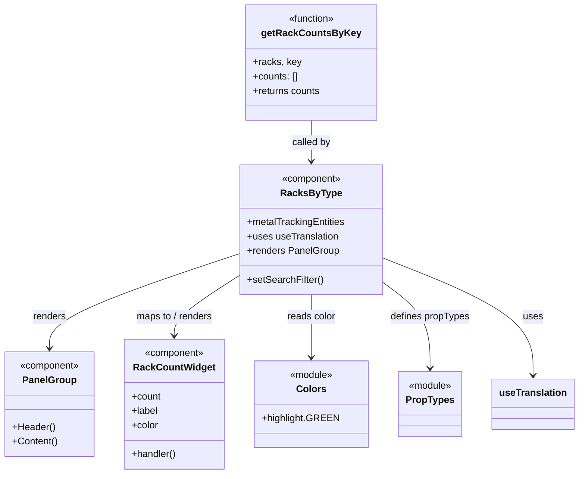

# Diagram: web/portal/src/modules/mt-dashboard/mt-dashboard-components/RacksByType.js


> Auto-generated by Obscura crawlers

## Diagram 1



### SVG

<svg id="container" width="945.625" xmlns="http://www.w3.org/2000/svg" class="classDiagram" height="788" viewBox="0 0 945.625 788" role="graphics-document document" aria-roledescription="class"><style>#container{font-family:"trebuchet ms",verdana,arial,sans-serif;font-size:16px;fill:#333;}@keyframes edge-animation-frame{from{stroke-dashoffset:0;}}@keyframes dash{to{stroke-dashoffset:0;}}#container .edge-animation-slow{stroke-dasharray:9,5!important;stroke-dashoffset:900;animation:dash 50s linear infinite;stroke-linecap:round;}#container .edge-animation-fast{stroke-dasharray:9,5!important;stroke-dashoffset:900;animation:dash 20s linear infinite;stroke-linecap:round;}#container .error-icon{fill:#552222;}#container .error-text{fill:#552222;stroke:#552222;}#container .edge-thickness-normal{stroke-width:1px;}#container .edge-thickness-thick{stroke-width:3.5px;}#container .edge-pattern-solid{stroke-dasharray:0;}#container .edge-thickness-invisible{stroke-width:0;fill:none;}#container .edge-pattern-dashed{stroke-dasharray:3;}#container .edge-pattern-dotted{stroke-dasharray:2;}#container .marker{fill:#333333;stroke:#333333;}#container .marker.cross{stroke:#333333;}#container svg{font-family:"trebuchet ms",verdana,arial,sans-serif;font-size:16px;}#container p{margin:0;}#container g.classGroup text{fill:#9370DB;stroke:none;font-family:"trebuchet ms",verdana,arial,sans-serif;font-size:10px;}#container g.classGroup text .title{font-weight:bolder;}#container .nodeLabel,#container .edgeLabel{color:#131300;}#container .edgeLabel .label rect{fill:#ECECFF;}#container .label text{fill:#131300;}#container .labelBkg{background:#ECECFF;}#container .edgeLabel .label span{background:#ECECFF;}#container .classTitle{font-weight:bolder;}#container .node rect,#container .node circle,#container .node ellipse,#container .node polygon,#container .node path{fill:#ECECFF;stroke:#9370DB;stroke-width:1px;}#container .divider{stroke:#9370DB;stroke-width:1;}#container g.clickable{cursor:pointer;}#container g.classGroup rect{fill:#ECECFF;stroke:#9370DB;}#container g.classGroup line{stroke:#9370DB;stroke-width:1;}#container .classLabel .box{stroke:none;stroke-width:0;fill:#ECECFF;opacity:0.5;}#container .classLabel .label{fill:#9370DB;font-size:10px;}#container .relation{stroke:#333333;stroke-width:1;fill:none;}#container .dashed-line{stroke-dasharray:3;}#container .dotted-line{stroke-dasharray:1 2;}#container #compositionStart,#container .composition{fill:#333333!important;stroke:#333333!important;stroke-width:1;}#container #compositionEnd,#container .composition{fill:#333333!important;stroke:#333333!important;stroke-width:1;}#container #dependencyStart,#container .dependency{fill:#333333!important;stroke:#333333!important;stroke-width:1;}#container #dependencyStart,#container .dependency{fill:#333333!important;stroke:#333333!important;stroke-width:1;}#container #extensionStart,#container .extension{fill:transparent!important;stroke:#333333!important;stroke-width:1;}#container #extensionEnd,#container .extension{fill:transparent!important;stroke:#333333!important;stroke-width:1;}#container #aggregationStart,#container .aggregation{fill:transparent!important;stroke:#333333!important;stroke-width:1;}#container #aggregationEnd,#container .aggregation{fill:transparent!important;stroke:#333333!important;stroke-width:1;}#container #lollipopStart,#container .lollipop{fill:#ECECFF!important;stroke:#333333!important;stroke-width:1;}#container #lollipopEnd,#container .lollipop{fill:#ECECFF!important;stroke:#333333!important;stroke-width:1;}#container .edgeTerminals{font-size:11px;line-height:initial;}#container .classTitleText{text-anchor:middle;font-size:18px;fill:#333;}#container .label-icon{display:inline-block;height:1em;overflow:visible;vertical-align:-0.125em;}#container .node .label-icon path{fill:currentColor;stroke:revert;stroke-width:revert;}#container :root{--mermaid-font-family:"trebuchet ms",verdana,arial,sans-serif;}</style><g><defs><marker id="container_class-aggregationStart" class="marker aggregation class" refX="18" refY="7" markerWidth="190" markerHeight="240" orient="auto"><path d="M 18,7 L9,13 L1,7 L9,1 Z"></path></marker></defs><defs><marker id="container_class-aggregationEnd" class="marker aggregation class" refX="1" refY="7" markerWidth="20" markerHeight="28" orient="auto"><path d="M 18,7 L9,13 L1,7 L9,1 Z"></path></marker></defs><defs><marker id="container_class-extensionStart" class="marker extension class" refX="18" refY="7" markerWidth="190" markerHeight="240" orient="auto"><path d="M 1,7 L18,13 V 1 Z"></path></marker></defs><defs><marker id="container_class-extensionEnd" class="marker extension class" refX="1" refY="7" markerWidth="20" markerHeight="28" orient="auto"><path d="M 1,1 V 13 L18,7 Z"></path></marker></defs><defs><marker id="container_class-compositionStart" class="marker composition class" refX="18" refY="7" markerWidth="190" markerHeight="240" orient="auto"><path d="M 18,7 L9,13 L1,7 L9,1 Z"></path></marker></defs><defs><marker id="container_class-compositionEnd" class="marker composition class" refX="1" refY="7" markerWidth="20" markerHeight="28" orient="auto"><path d="M 18,7 L9,13 L1,7 L9,1 Z"></path></marker></defs><defs><marker id="container_class-dependencyStart" class="marker dependency class" refX="6" refY="7" markerWidth="190" markerHeight="240" orient="auto"><path d="M 5,7 L9,13 L1,7 L9,1 Z"></path></marker></defs><defs><marker id="container_class-dependencyEnd" class="marker dependency class" refX="13" refY="7" markerWidth="20" markerHeight="28" orient="auto"><path d="M 18,7 L9,13 L14,7 L9,1 Z"></path></marker></defs><defs><marker id="container_class-lollipopStart" class="marker lollipop class" refX="13" refY="7" markerWidth="190" markerHeight="240" orient="auto"><circle stroke="black" fill="transparent" cx="7" cy="7" r="6"></circle></marker></defs><defs><marker id="container_class-lollipopEnd" class="marker lollipop class" refX="1" refY="7" markerWidth="190" markerHeight="240" orient="auto"><circle stroke="black" fill="transparent" cx="7" cy="7" r="6"></circle></marker></defs><g class="root"><g class="clusters"></g><g class="edgePaths"><path d="M512.809,200L512.809,206.167C512.809,212.333,512.809,224.667,512.809,236C512.809,247.333,512.809,257.667,512.809,262.833L512.809,268" id="id_getRackCountsByKey_RacksByType_1" class="edge-thickness-normal edge-pattern-solid relation" style=";;;" data-edge="true" data-et="edge" data-id="id_getRackCountsByKey_RacksByType_1" data-points="W3sieCI6NTEyLjgwODU5Mzc1LCJ5IjoyMDB9LHsieCI6NTEyLjgwODU5Mzc1LCJ5IjoyMzd9LHsieCI6NTEyLjgwODU5Mzc1LCJ5IjoyNzR9XQ==" marker-end="url(#container_class-dependencyEnd)"></path><path d="M393.688,422.156L341.851,439.63C290.014,457.104,186.341,492.052,134.505,518.193C82.668,544.333,82.668,561.667,82.668,570.333L82.668,579" id="id_RacksByType_PanelGroup_2" class="edge-thickness-normal edge-pattern-solid relation" style=";;;" data-edge="true" data-et="edge" data-id="id_RacksByType_PanelGroup_2" data-points="W3sieCI6MzkzLjY4NzUsInkiOjQyMi4xNTU2MDg2MzA4OTgzfSx7IngiOjgyLjY2Nzk2ODc1LCJ5Ijo1Mjd9LHsieCI6ODIuNjY3OTY4NzUsInkiOjU4NX1d" marker-end="url(#container_class-dependencyEnd)"></path><path d="M393.688,459.178L376.241,470.482C358.794,481.786,323.901,504.393,306.454,520.863C289.008,537.333,289.008,547.667,289.008,552.833L289.008,558" id="id_RacksByType_RackCountWidget_3" class="edge-thickness-normal edge-pattern-solid relation" style=";;;" data-edge="true" data-et="edge" data-id="id_RacksByType_RackCountWidget_3" data-points="W3sieCI6MzkzLjY4NzUsInkiOjQ1OS4xNzgyNzY1NzgyOTA1NH0seyJ4IjoyODkuMDA3ODEyNSwieSI6NTI3fSx7IngiOjI4OS4wMDc4MTI1LCJ5Ijo1NjR9XQ==" marker-end="url(#container_class-dependencyEnd)"></path><path d="M512.809,490L512.809,496.167C512.809,502.333,512.809,514.667,512.809,532C512.809,549.333,512.809,571.667,512.809,582.833L512.809,594" id="id_RacksByType_Colors_4" class="edge-thickness-normal edge-pattern-solid relation" style=";;;" data-edge="true" data-et="edge" data-id="id_RacksByType_Colors_4" data-points="W3sieCI6NTEyLjgwODU5Mzc1LCJ5Ijo0OTB9LHsieCI6NTEyLjgwODU5Mzc1LCJ5Ijo1Mjd9LHsieCI6NTEyLjgwODU5Mzc1LCJ5Ijo2MDB9XQ==" marker-end="url(#container_class-dependencyEnd)"></path><path d="M631.93,471.78L644.141,480.984C656.352,490.187,680.773,508.593,692.984,531.963C705.195,555.333,705.195,583.667,705.195,597.833L705.195,612" id="id_RacksByType_PropTypes_5" class="edge-thickness-normal edge-pattern-solid relation" style=";;;" data-edge="true" data-et="edge" data-id="id_RacksByType_PropTypes_5" data-points="W3sieCI6NjMxLjkyOTY4NzUsInkiOjQ3MS43ODA0MTA1NTAwMzk2fSx7IngiOjcwNS4xOTUzMTI1LCJ5Ijo1Mjd9LHsieCI6NzA1LjE5NTMxMjUsInkiOjYxOH1d" marker-end="url(#container_class-dependencyEnd)"></path><path d="M631.93,430.149L671.865,446.291C711.799,462.433,791.669,494.716,831.604,527.025C871.539,559.333,871.539,591.667,871.539,607.833L871.539,624" id="id_RacksByType_useTranslation_6" class="edge-thickness-normal edge-pattern-solid relation" style=";;;" data-edge="true" data-et="edge" data-id="id_RacksByType_useTranslation_6" data-points="W3sieCI6NjMxLjkyOTY4NzUsInkiOjQzMC4xNDkxMjYxNTAxNjA2fSx7IngiOjg3MS41MzkwNjI1LCJ5Ijo1Mjd9LHsieCI6ODcxLjUzOTA2MjUsInkiOjYzMH1d" marker-end="url(#container_class-dependencyEnd)"></path></g><g class="edgeLabels"><g class="edgeLabel" transform="translate(512.80859375, 237)"><g class="label" data-id="id_getRackCountsByKey_RacksByType_1" transform="translate(-32.5859375, -12)"><foreignObject width="65.171875" height="24"><div xmlns="http://www.w3.org/1999/xhtml" class="labelBkg" style="display: table-cell; white-space: nowrap; line-height: 1.5; max-width: 200px; text-align: center;"><span class="edgeLabel"><p>called by</p></span></div></foreignObject></g></g><g class="edgeLabel" transform="translate(82.66796875, 527)"><g class="label" data-id="id_RacksByType_PanelGroup_2" transform="translate(-27.75, -12)"><foreignObject width="55.5" height="24"><div xmlns="http://www.w3.org/1999/xhtml" class="labelBkg" style="display: table-cell; white-space: nowrap; line-height: 1.5; max-width: 200px; text-align: center;"><span class="edgeLabel"><p>renders</p></span></div></foreignObject></g></g><g class="edgeLabel" transform="translate(289.0078125, 527)"><g class="label" data-id="id_RacksByType_RackCountWidget_3" transform="translate(-65.40625, -12)"><foreignObject width="130.8125" height="24"><div xmlns="http://www.w3.org/1999/xhtml" class="labelBkg" style="display: table-cell; white-space: nowrap; line-height: 1.5; max-width: 200px; text-align: center;"><span class="edgeLabel"><p>maps to / renders</p></span></div></foreignObject></g></g><g class="edgeLabel" transform="translate(512.80859375, 527)"><g class="label" data-id="id_RacksByType_Colors_4" transform="translate(-40.5234375, -12)"><foreignObject width="81.046875" height="24"><div xmlns="http://www.w3.org/1999/xhtml" class="labelBkg" style="display: table-cell; white-space: nowrap; line-height: 1.5; max-width: 200px; text-align: center;"><span class="edgeLabel"><p>reads color</p></span></div></foreignObject></g></g><g class="edgeLabel" transform="translate(705.1953125, 527)"><g class="label" data-id="id_RacksByType_PropTypes_5" transform="translate(-66.2734375, -12)"><foreignObject width="132.546875" height="24"><div xmlns="http://www.w3.org/1999/xhtml" class="labelBkg" style="display: table-cell; white-space: nowrap; line-height: 1.5; max-width: 200px; text-align: center;"><span class="edgeLabel"><p>defines propTypes</p></span></div></foreignObject></g></g><g class="edgeLabel" transform="translate(871.5390625, 527)"><g class="label" data-id="id_RacksByType_useTranslation_6" transform="translate(-16.4921875, -12)"><foreignObject width="32.984375" height="24"><div xmlns="http://www.w3.org/1999/xhtml" class="labelBkg" style="display: table-cell; white-space: nowrap; line-height: 1.5; max-width: 200px; text-align: center;"><span class="edgeLabel"><p>uses</p></span></div></foreignObject></g></g></g><g class="nodes"><g class="node default" id="classId-getRackCountsByKey-0" transform="translate(512.80859375, 104)"><g class="basic label-container"><path d="M-107.17578125 -96 L107.17578125 -96 L107.17578125 96 L-107.17578125 96" stroke="none" stroke-width="0" fill="#ECECFF" style=""></path><path d="M-107.17578125 -96 C-44.939684651771906 -96, 17.29641194645619 -96, 107.17578125 -96 M-107.17578125 -96 C-52.55756750931681 -96, 2.060646231366377 -96, 107.17578125 -96 M107.17578125 -96 C107.17578125 -57.08915321395406, 107.17578125 -18.178306427908126, 107.17578125 96 M107.17578125 -96 C107.17578125 -43.01473736641897, 107.17578125 9.97052526716206, 107.17578125 96 M107.17578125 96 C50.818960571016945 96, -5.537860107966111 96, -107.17578125 96 M107.17578125 96 C53.04929385359526 96, -1.077193542809482 96, -107.17578125 96 M-107.17578125 96 C-107.17578125 39.41441941328739, -107.17578125 -17.17116117342522, -107.17578125 -96 M-107.17578125 96 C-107.17578125 21.04549197256793, -107.17578125 -53.90901605486414, -107.17578125 -96" stroke="#9370DB" stroke-width="1.3" fill="none" stroke-dasharray="0 0" style=""></path></g><g class="annotation-group text" transform="translate(-39.484375, -72)"><g class="label" style="" transform="translate(0,-12)"><foreignObject width="78.96875" height="24"><div xmlns="http://www.w3.org/1999/xhtml" style="display: table-cell; white-space: nowrap; line-height: 1.5; max-width: 129px; text-align: center;"><span class="nodeLabel markdown-node-label" style=""><p>«function»</p></span></div></foreignObject></g></g><g class="label-group text" transform="translate(-76.9765625, -48)"><g class="label" style="font-weight: bolder" transform="translate(0,-12)"><foreignObject width="153.953125" height="24"><div xmlns="http://www.w3.org/1999/xhtml" style="display: table-cell; white-space: nowrap; line-height: 1.5; max-width: 200px; text-align: center;"><span class="nodeLabel markdown-node-label" style=""><p>getRackCountsByKey</p></span></div></foreignObject></g></g><g class="members-group text" transform="translate(-95.17578125, 0)"><g class="label" style="" transform="translate(0,-12)"><foreignObject width="78.203125" height="24"><div xmlns="http://www.w3.org/1999/xhtml" style="display: table-cell; white-space: nowrap; line-height: 1.5; max-width: 136px; text-align: center;"><span class="nodeLabel markdown-node-label" style=""><p>+racks, key</p></span></div></foreignObject></g><g class="label" style="" transform="translate(0,12)"><foreignObject width="74.984375" height="24"><div xmlns="http://www.w3.org/1999/xhtml" style="display: table-cell; white-space: nowrap; line-height: 1.5; max-width: 132px; text-align: center;"><span class="nodeLabel markdown-node-label" style=""><p>+counts: []</p></span></div></foreignObject></g><g class="label" style="" transform="translate(0,36)"><foreignObject width="113.375" height="24"><div xmlns="http://www.w3.org/1999/xhtml" style="display: table-cell; white-space: nowrap; line-height: 1.5; max-width: 171px; text-align: center;"><span class="nodeLabel markdown-node-label" style=""><p>+returns counts</p></span></div></foreignObject></g></g><g class="methods-group text" transform="translate(-95.17578125, 96)"></g><g class="divider" style=""><path d="M-107.17578125 -24 C-23.154895588399427 -24, 60.86599007320115 -24, 107.17578125 -24 M-107.17578125 -24 C-33.56309144181486 -24, 40.049598366370276 -24, 107.17578125 -24" stroke="#9370DB" stroke-width="1.3" fill="none" stroke-dasharray="0 0" style=""></path></g><g class="divider" style=""><path d="M-107.17578125 72 C-49.808033183862946 72, 7.559714882274108 72, 107.17578125 72 M-107.17578125 72 C-37.75483516511542 72, 31.666110919769153 72, 107.17578125 72" stroke="#9370DB" stroke-width="1.3" fill="none" stroke-dasharray="0 0" style=""></path></g></g><g class="node default" id="classId-RacksByType-1" transform="translate(512.80859375, 382)"><g class="basic label-container"><path d="M-119.12109375 -108 L119.12109375 -108 L119.12109375 108 L-119.12109375 108" stroke="none" stroke-width="0" fill="#ECECFF" style=""></path><path d="M-119.12109375 -108 C-45.2763843827297 -108, 28.568324984540595 -108, 119.12109375 -108 M-119.12109375 -108 C-27.586018067728475 -108, 63.94905761454305 -108, 119.12109375 -108 M119.12109375 -108 C119.12109375 -24.499039505093208, 119.12109375 59.001920989813584, 119.12109375 108 M119.12109375 -108 C119.12109375 -25.02235315193279, 119.12109375 57.95529369613442, 119.12109375 108 M119.12109375 108 C37.28966533728115 108, -44.5417630754377 108, -119.12109375 108 M119.12109375 108 C68.20395138100497 108, 17.286809012009954 108, -119.12109375 108 M-119.12109375 108 C-119.12109375 27.97862232648467, -119.12109375 -52.04275534703066, -119.12109375 -108 M-119.12109375 108 C-119.12109375 59.40052540910259, -119.12109375 10.801050818205184, -119.12109375 -108" stroke="#9370DB" stroke-width="1.3" fill="none" stroke-dasharray="0 0" style=""></path></g><g class="annotation-group text" transform="translate(-50.2109375, -84)"><g class="label" style="" transform="translate(0,-12)"><foreignObject width="100.421875" height="24"><div xmlns="http://www.w3.org/1999/xhtml" style="display: table-cell; white-space: nowrap; line-height: 1.5; max-width: 150px; text-align: center;"><span class="nodeLabel markdown-node-label" style=""><p>«component»</p></span></div></foreignObject></g></g><g class="label-group text" transform="translate(-47.734375, -60)"><g class="label" style="font-weight: bolder" transform="translate(0,-12)"><foreignObject width="95.46875" height="24"><div xmlns="http://www.w3.org/1999/xhtml" style="display: table-cell; white-space: nowrap; line-height: 1.5; max-width: 143px; text-align: center;"><span class="nodeLabel markdown-node-label" style=""><p>RacksByType</p></span></div></foreignObject></g></g><g class="members-group text" transform="translate(-107.12109375, -12)"><g class="label" style="" transform="translate(0,-12)"><foreignObject width="164.03125" height="24"><div xmlns="http://www.w3.org/1999/xhtml" style="display: table-cell; white-space: nowrap; line-height: 1.5; max-width: 221px; text-align: center;"><span class="nodeLabel markdown-node-label" style=""><p>+metalTrackingEntities</p></span></div></foreignObject></g><g class="label" style="" transform="translate(0,12)"><foreignObject width="151.984375" height="24"><div xmlns="http://www.w3.org/1999/xhtml" style="display: table-cell; white-space: nowrap; line-height: 1.5; max-width: 209px; text-align: center;"><span class="nodeLabel markdown-node-label" style=""><p>+uses useTranslation</p></span></div></foreignObject></g><g class="label" style="" transform="translate(0,36)"><foreignObject width="151.578125" height="24"><div xmlns="http://www.w3.org/1999/xhtml" style="display: table-cell; white-space: nowrap; line-height: 1.5; max-width: 209px; text-align: center;"><span class="nodeLabel markdown-node-label" style=""><p>+renders PanelGroup</p></span></div></foreignObject></g></g><g class="methods-group text" transform="translate(-107.12109375, 84)"><g class="label" style="" transform="translate(0,-12)"><foreignObject width="125.953125" height="24"><div xmlns="http://www.w3.org/1999/xhtml" style="display: table-cell; white-space: nowrap; line-height: 1.5; max-width: 183px; text-align: center;"><span class="nodeLabel markdown-node-label" style=""><p>+setSearchFilter()</p></span></div></foreignObject></g></g><g class="divider" style=""><path d="M-119.12109375 -36 C-51.56467760596718 -36, 15.991738538065647 -36, 119.12109375 -36 M-119.12109375 -36 C-67.86431463076869 -36, -16.607535511537378 -36, 119.12109375 -36" stroke="#9370DB" stroke-width="1.3" fill="none" stroke-dasharray="0 0" style=""></path></g><g class="divider" style=""><path d="M-119.12109375 60 C-60.31922170519301 60, -1.5173496603860173 60, 119.12109375 60 M-119.12109375 60 C-56.31791141513001 60, 6.485270919739975 60, 119.12109375 60" stroke="#9370DB" stroke-width="1.3" fill="none" stroke-dasharray="0 0" style=""></path></g></g><g class="node default" id="classId-RackCountWidget-2" transform="translate(289.0078125, 672)"><g class="basic label-container"><path d="M-81.671875 -108 L81.671875 -108 L81.671875 108 L-81.671875 108" stroke="none" stroke-width="0" fill="#ECECFF" style=""></path><path d="M-81.671875 -108 C-22.54360968179565 -108, 36.5846556364087 -108, 81.671875 -108 M-81.671875 -108 C-19.038775074661537 -108, 43.59432485067693 -108, 81.671875 -108 M81.671875 -108 C81.671875 -43.75175439722857, 81.671875 20.496491205542867, 81.671875 108 M81.671875 -108 C81.671875 -58.31938178943456, 81.671875 -8.638763578869117, 81.671875 108 M81.671875 108 C24.124072378379353 108, -33.423730243241295 108, -81.671875 108 M81.671875 108 C32.47145607396031 108, -16.728962852079377 108, -81.671875 108 M-81.671875 108 C-81.671875 55.5560043129145, -81.671875 3.112008625829006, -81.671875 -108 M-81.671875 108 C-81.671875 38.922495315848394, -81.671875 -30.15500936830321, -81.671875 -108" stroke="#9370DB" stroke-width="1.3" fill="none" stroke-dasharray="0 0" style=""></path></g><g class="annotation-group text" transform="translate(-50.2109375, -84)"><g class="label" style="" transform="translate(0,-12)"><foreignObject width="100.421875" height="24"><div xmlns="http://www.w3.org/1999/xhtml" style="display: table-cell; white-space: nowrap; line-height: 1.5; max-width: 150px; text-align: center;"><span class="nodeLabel markdown-node-label" style=""><p>«component»</p></span></div></foreignObject></g></g><g class="label-group text" transform="translate(-64.453125, -60)"><g class="label" style="font-weight: bolder" transform="translate(0,-12)"><foreignObject width="128.90625" height="24"><div xmlns="http://www.w3.org/1999/xhtml" style="display: table-cell; white-space: nowrap; line-height: 1.5; max-width: 177px; text-align: center;"><span class="nodeLabel markdown-node-label" style=""><p>RackCountWidget</p></span></div></foreignObject></g></g><g class="members-group text" transform="translate(-69.671875, -12)"><g class="label" style="" transform="translate(0,-12)"><foreignObject width="49.125" height="24"><div xmlns="http://www.w3.org/1999/xhtml" style="display: table-cell; white-space: nowrap; line-height: 1.5; max-width: 107px; text-align: center;"><span class="nodeLabel markdown-node-label" style=""><p>+count</p></span></div></foreignObject></g><g class="label" style="" transform="translate(0,12)"><foreignObject width="44.21875" height="24"><div xmlns="http://www.w3.org/1999/xhtml" style="display: table-cell; white-space: nowrap; line-height: 1.5; max-width: 102px; text-align: center;"><span class="nodeLabel markdown-node-label" style=""><p>+label</p></span></div></foreignObject></g><g class="label" style="" transform="translate(0,36)"><foreignObject width="44.796875" height="24"><div xmlns="http://www.w3.org/1999/xhtml" style="display: table-cell; white-space: nowrap; line-height: 1.5; max-width: 103px; text-align: center;"><span class="nodeLabel markdown-node-label" style=""><p>+color</p></span></div></foreignObject></g></g><g class="methods-group text" transform="translate(-69.671875, 84)"><g class="label" style="" transform="translate(0,-12)"><foreignObject width="74.890625" height="24"><div xmlns="http://www.w3.org/1999/xhtml" style="display: table-cell; white-space: nowrap; line-height: 1.5; max-width: 132px; text-align: center;"><span class="nodeLabel markdown-node-label" style=""><p>+handler()</p></span></div></foreignObject></g></g><g class="divider" style=""><path d="M-81.671875 -36 C-37.447023980327174 -36, 6.777827039345652 -36, 81.671875 -36 M-81.671875 -36 C-28.106809494039325 -36, 25.45825601192135 -36, 81.671875 -36" stroke="#9370DB" stroke-width="1.3" fill="none" stroke-dasharray="0 0" style=""></path></g><g class="divider" style=""><path d="M-81.671875 60 C-46.110995217458594 60, -10.550115434917188 60, 81.671875 60 M-81.671875 60 C-22.72459472877297 60, 36.22268554245406 60, 81.671875 60" stroke="#9370DB" stroke-width="1.3" fill="none" stroke-dasharray="0 0" style=""></path></g></g><g class="node default" id="classId-PanelGroup-3" transform="translate(82.66796875, 672)"><g class="basic label-container"><path d="M-74.66796875 -87 L74.66796875 -87 L74.66796875 87 L-74.66796875 87" stroke="none" stroke-width="0" fill="#ECECFF" style=""></path><path d="M-74.66796875 -87 C-39.560290827765996 -87, -4.452612905531993 -87, 74.66796875 -87 M-74.66796875 -87 C-23.033165577783308 -87, 28.601637594433384 -87, 74.66796875 -87 M74.66796875 -87 C74.66796875 -42.31047646808063, 74.66796875 2.3790470638387404, 74.66796875 87 M74.66796875 -87 C74.66796875 -40.55460737227939, 74.66796875 5.890785255441216, 74.66796875 87 M74.66796875 87 C34.43127937965824 87, -5.805409990683515 87, -74.66796875 87 M74.66796875 87 C30.47484064249185 87, -13.718287465016303 87, -74.66796875 87 M-74.66796875 87 C-74.66796875 17.69066439564277, -74.66796875 -51.61867120871446, -74.66796875 -87 M-74.66796875 87 C-74.66796875 21.785504409268867, -74.66796875 -43.428991181462266, -74.66796875 -87" stroke="#9370DB" stroke-width="1.3" fill="none" stroke-dasharray="0 0" style=""></path></g><g class="annotation-group text" transform="translate(-50.2109375, -63)"><g class="label" style="" transform="translate(0,-12)"><foreignObject width="100.421875" height="24"><div xmlns="http://www.w3.org/1999/xhtml" style="display: table-cell; white-space: nowrap; line-height: 1.5; max-width: 150px; text-align: center;"><span class="nodeLabel markdown-node-label" style=""><p>«component»</p></span></div></foreignObject></g></g><g class="label-group text" transform="translate(-42.328125, -39)"><g class="label" style="font-weight: bolder" transform="translate(0,-12)"><foreignObject width="84.65625" height="24"><div xmlns="http://www.w3.org/1999/xhtml" style="display: table-cell; white-space: nowrap; line-height: 1.5; max-width: 134px; text-align: center;"><span class="nodeLabel markdown-node-label" style=""><p>PanelGroup</p></span></div></foreignObject></g></g><g class="members-group text" transform="translate(-62.66796875, 9)"></g><g class="methods-group text" transform="translate(-62.66796875, 39)"><g class="label" style="" transform="translate(0,-12)"><foreignObject width="70.96875" height="24"><div xmlns="http://www.w3.org/1999/xhtml" style="display: table-cell; white-space: nowrap; line-height: 1.5; max-width: 128px; text-align: center;"><span class="nodeLabel markdown-node-label" style=""><p>+Header()</p></span></div></foreignObject></g><g class="label" style="" transform="translate(0,12)"><foreignObject width="75.125" height="24"><div xmlns="http://www.w3.org/1999/xhtml" style="display: table-cell; white-space: nowrap; line-height: 1.5; max-width: 132px; text-align: center;"><span class="nodeLabel markdown-node-label" style=""><p>+Content()</p></span></div></foreignObject></g></g><g class="divider" style=""><path d="M-74.66796875 -15 C-40.02938133957433 -15, -5.390793929148657 -15, 74.66796875 -15 M-74.66796875 -15 C-25.575797646175197 -15, 23.516373457649607 -15, 74.66796875 -15" stroke="#9370DB" stroke-width="1.3" fill="none" stroke-dasharray="0 0" style=""></path></g><g class="divider" style=""><path d="M-74.66796875 9 C-21.016776348311858 9, 32.634416053376285 9, 74.66796875 9 M-74.66796875 9 C-44.0219476620887 9, -13.375926574177399 9, 74.66796875 9" stroke="#9370DB" stroke-width="1.3" fill="none" stroke-dasharray="0 0" style=""></path></g></g><g class="node default" id="classId-Colors-4" transform="translate(512.80859375, 672)"><g class="basic label-container"><path d="M-92.12890625 -72 L92.12890625 -72 L92.12890625 72 L-92.12890625 72" stroke="none" stroke-width="0" fill="#ECECFF" style=""></path><path d="M-92.12890625 -72 C-51.59636875795721 -72, -11.063831265914416 -72, 92.12890625 -72 M-92.12890625 -72 C-29.479481167086078 -72, 33.169943915827844 -72, 92.12890625 -72 M92.12890625 -72 C92.12890625 -25.761192396914595, 92.12890625 20.47761520617081, 92.12890625 72 M92.12890625 -72 C92.12890625 -24.479851692614794, 92.12890625 23.040296614770412, 92.12890625 72 M92.12890625 72 C48.07894731044607 72, 4.028988370892137 72, -92.12890625 72 M92.12890625 72 C33.95734504046619 72, -24.214216169067626 72, -92.12890625 72 M-92.12890625 72 C-92.12890625 27.66415711457047, -92.12890625 -16.671685770859057, -92.12890625 -72 M-92.12890625 72 C-92.12890625 22.813490501591616, -92.12890625 -26.373018996816768, -92.12890625 -72" stroke="#9370DB" stroke-width="1.3" fill="none" stroke-dasharray="0 0" style=""></path></g><g class="annotation-group text" transform="translate(-36.6015625, -48)"><g class="label" style="" transform="translate(0,-12)"><foreignObject width="73.203125" height="24"><div xmlns="http://www.w3.org/1999/xhtml" style="display: table-cell; white-space: nowrap; line-height: 1.5; max-width: 123px; text-align: center;"><span class="nodeLabel markdown-node-label" style=""><p>«module»</p></span></div></foreignObject></g></g><g class="label-group text" transform="translate(-23.1015625, -24)"><g class="label" style="font-weight: bolder" transform="translate(0,-12)"><foreignObject width="46.203125" height="24"><div xmlns="http://www.w3.org/1999/xhtml" style="display: table-cell; white-space: nowrap; line-height: 1.5; max-width: 95px; text-align: center;"><span class="nodeLabel markdown-node-label" style=""><p>Colors</p></span></div></foreignObject></g></g><g class="members-group text" transform="translate(-80.12890625, 24)"><g class="label" style="" transform="translate(0,-12)"><foreignObject width="123.65625" height="24"><div xmlns="http://www.w3.org/1999/xhtml" style="display: table-cell; white-space: nowrap; line-height: 1.5; max-width: 181px; text-align: center;"><span class="nodeLabel markdown-node-label" style=""><p>+highlight.GREEN</p></span></div></foreignObject></g></g><g class="methods-group text" transform="translate(-80.12890625, 72)"></g><g class="divider" style=""><path d="M-92.12890625 0 C-25.164038762577746 0, 41.80082872484451 0, 92.12890625 0 M-92.12890625 0 C-23.09217754538936 0, 45.94455115922128 0, 92.12890625 0" stroke="#9370DB" stroke-width="1.3" fill="none" stroke-dasharray="0 0" style=""></path></g><g class="divider" style=""><path d="M-92.12890625 48 C-42.15136166139414 48, 7.826182927211718 48, 92.12890625 48 M-92.12890625 48 C-31.414440074075934 48, 29.300026101848132 48, 92.12890625 48" stroke="#9370DB" stroke-width="1.3" fill="none" stroke-dasharray="0 0" style=""></path></g></g><g class="node default" id="classId-PropTypes-5" transform="translate(705.1953125, 672)"><g class="basic label-container"><path d="M-50.2578125 -54 L50.2578125 -54 L50.2578125 54 L-50.2578125 54" stroke="none" stroke-width="0" fill="#ECECFF" style=""></path><path d="M-50.2578125 -54 C-17.973755668960223 -54, 14.310301162079554 -54, 50.2578125 -54 M-50.2578125 -54 C-21.115840195138105 -54, 8.02613210972379 -54, 50.2578125 -54 M50.2578125 -54 C50.2578125 -11.703861757604251, 50.2578125 30.592276484791498, 50.2578125 54 M50.2578125 -54 C50.2578125 -15.925555407803877, 50.2578125 22.148889184392246, 50.2578125 54 M50.2578125 54 C26.834550042168676 54, 3.4112875843373516 54, -50.2578125 54 M50.2578125 54 C23.91924024665012 54, -2.4193320066997615 54, -50.2578125 54 M-50.2578125 54 C-50.2578125 16.613823168913626, -50.2578125 -20.772353662172748, -50.2578125 -54 M-50.2578125 54 C-50.2578125 29.69253556016597, -50.2578125 5.3850711203319435, -50.2578125 -54" stroke="#9370DB" stroke-width="1.3" fill="none" stroke-dasharray="0 0" style=""></path></g><g class="annotation-group text" transform="translate(-36.6015625, -30)"><g class="label" style="" transform="translate(0,-12)"><foreignObject width="73.203125" height="24"><div xmlns="http://www.w3.org/1999/xhtml" style="display: table-cell; white-space: nowrap; line-height: 1.5; max-width: 123px; text-align: center;"><span class="nodeLabel markdown-node-label" style=""><p>«module»</p></span></div></foreignObject></g></g><g class="label-group text" transform="translate(-38.2578125, -6)"><g class="label" style="font-weight: bolder" transform="translate(0,-12)"><foreignObject width="76.515625" height="24"><div xmlns="http://www.w3.org/1999/xhtml" style="display: table-cell; white-space: nowrap; line-height: 1.5; max-width: 125px; text-align: center;"><span class="nodeLabel markdown-node-label" style=""><p>PropTypes</p></span></div></foreignObject></g></g><g class="members-group text" transform="translate(-38.2578125, 42)"></g><g class="methods-group text" transform="translate(-38.2578125, 72)"></g><g class="divider" style=""><path d="M-50.2578125 18 C-11.723772172056918 18, 26.810268155886163 18, 50.2578125 18 M-50.2578125 18 C-21.43475264821585 18, 7.388307203568303 18, 50.2578125 18" stroke="#9370DB" stroke-width="1.3" fill="none" stroke-dasharray="0 0" style=""></path></g><g class="divider" style=""><path d="M-50.2578125 36 C-13.648164753480927 36, 22.961482993038146 36, 50.2578125 36 M-50.2578125 36 C-11.76300303038854 36, 26.73180643922292 36, 50.2578125 36" stroke="#9370DB" stroke-width="1.3" fill="none" stroke-dasharray="0 0" style=""></path></g></g><g class="node default" id="classId-useTranslation-6" transform="translate(871.5390625, 672)"><g class="basic label-container"><path d="M-66.0859375 -42 L66.0859375 -42 L66.0859375 42 L-66.0859375 42" stroke="none" stroke-width="0" fill="#ECECFF" style=""></path><path d="M-66.0859375 -42 C-31.80888482514606 -42, 2.468167849707882 -42, 66.0859375 -42 M-66.0859375 -42 C-19.000799415562227 -42, 28.084338668875546 -42, 66.0859375 -42 M66.0859375 -42 C66.0859375 -11.664855345083108, 66.0859375 18.670289309833784, 66.0859375 42 M66.0859375 -42 C66.0859375 -22.925220970883395, 66.0859375 -3.850441941766789, 66.0859375 42 M66.0859375 42 C26.73031801931272 42, -12.625301461374562 42, -66.0859375 42 M66.0859375 42 C25.106243838911567 42, -15.873449822176866 42, -66.0859375 42 M-66.0859375 42 C-66.0859375 14.79750405878626, -66.0859375 -12.404991882427481, -66.0859375 -42 M-66.0859375 42 C-66.0859375 14.071726204744955, -66.0859375 -13.85654759051009, -66.0859375 -42" stroke="#9370DB" stroke-width="1.3" fill="none" stroke-dasharray="0 0" style=""></path></g><g class="annotation-group text" transform="translate(0, -18)"></g><g class="label-group text" transform="translate(-54.0859375, -18)"><g class="label" style="font-weight: bolder" transform="translate(0,-12)"><foreignObject width="108.171875" height="24"><div xmlns="http://www.w3.org/1999/xhtml" style="display: table-cell; white-space: nowrap; line-height: 1.5; max-width: 157px; text-align: center;"><span class="nodeLabel markdown-node-label" style=""><p>useTranslation</p></span></div></foreignObject></g></g><g class="members-group text" transform="translate(-54.0859375, 30)"></g><g class="methods-group text" transform="translate(-54.0859375, 60)"></g><g class="divider" style=""><path d="M-66.0859375 6 C-31.542795233000305 6, 3.0003470339993896 6, 66.0859375 6 M-66.0859375 6 C-36.603845660369686 6, -7.121753820739379 6, 66.0859375 6" stroke="#9370DB" stroke-width="1.3" fill="none" stroke-dasharray="0 0" style=""></path></g><g class="divider" style=""><path d="M-66.0859375 24 C-21.75260901032899 24, 22.580719479342022 24, 66.0859375 24 M-66.0859375 24 C-33.72941759129374 24, -1.3728976825874781 24, 66.0859375 24" stroke="#9370DB" stroke-width="1.3" fill="none" stroke-dasharray="0 0" style=""></path></g></g></g></g></g></svg>

## Diagram 2

```mermaid
graph TD
    A[Start: getRackCountsByKey(racks, key)] --> B{iterate racks via map}
    B --> C[for each rack: value = rack[key]]
    C --> D{value !== null?}
    D -- yes --> E[find counts item with label === value]
    E --> F{item found?}
    F -- yes --> G[item.count = item.count + 1]
    F -- no --> H[counts.push({label: value, count:1})]
    D -- no --> I[skip]
    G --> J[continue loop]
    H --> J
    I --> J
    J --> K[after loop return counts]
    K --> L[Consumed by RacksByType]

    subgraph RacksByType_Render
      L --> M[compute racksByType = getRackCountsByKey(...)]
      M --> N[render PanelGroup with Header and Content]
      N --> O[grid container mapping racksByType]
      O --> P{for each obj in racksByType}
      P --> Q[RackCountWidget(count=obj.count,label=obj.label,color=GREEN)]
      Q --> R[handler -> setSearchFilter("description",[obj.label])]
    end
```

> SVG rendering failed for this diagram.
