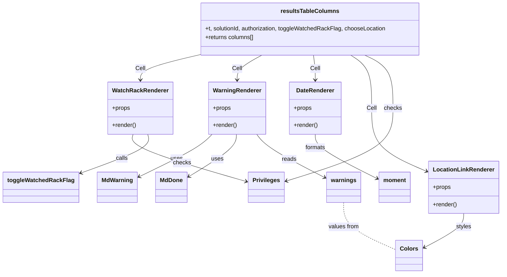

# Diagram: web/portal/src/modules/mt-dashboard/mt-dashboard-components/results-table-columns.js


> Auto-generated by Obscura crawlers

## Diagram 1



### SVG

<svg id="container" width="1341.98046875" xmlns="http://www.w3.org/2000/svg" class="classDiagram" height="754" viewBox="0 0 1341.98046875 754" role="graphics-document document" aria-roledescription="class"><style>#container{font-family:"trebuchet ms",verdana,arial,sans-serif;font-size:16px;fill:#333;}@keyframes edge-animation-frame{from{stroke-dashoffset:0;}}@keyframes dash{to{stroke-dashoffset:0;}}#container .edge-animation-slow{stroke-dasharray:9,5!important;stroke-dashoffset:900;animation:dash 50s linear infinite;stroke-linecap:round;}#container .edge-animation-fast{stroke-dasharray:9,5!important;stroke-dashoffset:900;animation:dash 20s linear infinite;stroke-linecap:round;}#container .error-icon{fill:#552222;}#container .error-text{fill:#552222;stroke:#552222;}#container .edge-thickness-normal{stroke-width:1px;}#container .edge-thickness-thick{stroke-width:3.5px;}#container .edge-pattern-solid{stroke-dasharray:0;}#container .edge-thickness-invisible{stroke-width:0;fill:none;}#container .edge-pattern-dashed{stroke-dasharray:3;}#container .edge-pattern-dotted{stroke-dasharray:2;}#container .marker{fill:#333333;stroke:#333333;}#container .marker.cross{stroke:#333333;}#container svg{font-family:"trebuchet ms",verdana,arial,sans-serif;font-size:16px;}#container p{margin:0;}#container g.classGroup text{fill:#9370DB;stroke:none;font-family:"trebuchet ms",verdana,arial,sans-serif;font-size:10px;}#container g.classGroup text .title{font-weight:bolder;}#container .nodeLabel,#container .edgeLabel{color:#131300;}#container .edgeLabel .label rect{fill:#ECECFF;}#container .label text{fill:#131300;}#container .labelBkg{background:#ECECFF;}#container .edgeLabel .label span{background:#ECECFF;}#container .classTitle{font-weight:bolder;}#container .node rect,#container .node circle,#container .node ellipse,#container .node polygon,#container .node path{fill:#ECECFF;stroke:#9370DB;stroke-width:1px;}#container .divider{stroke:#9370DB;stroke-width:1;}#container g.clickable{cursor:pointer;}#container g.classGroup rect{fill:#ECECFF;stroke:#9370DB;}#container g.classGroup line{stroke:#9370DB;stroke-width:1;}#container .classLabel .box{stroke:none;stroke-width:0;fill:#ECECFF;opacity:0.5;}#container .classLabel .label{fill:#9370DB;font-size:10px;}#container .relation{stroke:#333333;stroke-width:1;fill:none;}#container .dashed-line{stroke-dasharray:3;}#container .dotted-line{stroke-dasharray:1 2;}#container #compositionStart,#container .composition{fill:#333333!important;stroke:#333333!important;stroke-width:1;}#container #compositionEnd,#container .composition{fill:#333333!important;stroke:#333333!important;stroke-width:1;}#container #dependencyStart,#container .dependency{fill:#333333!important;stroke:#333333!important;stroke-width:1;}#container #dependencyStart,#container .dependency{fill:#333333!important;stroke:#333333!important;stroke-width:1;}#container #extensionStart,#container .extension{fill:transparent!important;stroke:#333333!important;stroke-width:1;}#container #extensionEnd,#container .extension{fill:transparent!important;stroke:#333333!important;stroke-width:1;}#container #aggregationStart,#container .aggregation{fill:transparent!important;stroke:#333333!important;stroke-width:1;}#container #aggregationEnd,#container .aggregation{fill:transparent!important;stroke:#333333!important;stroke-width:1;}#container #lollipopStart,#container .lollipop{fill:#ECECFF!important;stroke:#333333!important;stroke-width:1;}#container #lollipopEnd,#container .lollipop{fill:#ECECFF!important;stroke:#333333!important;stroke-width:1;}#container .edgeTerminals{font-size:11px;line-height:initial;}#container .classTitleText{text-anchor:middle;font-size:18px;fill:#333;}#container .label-icon{display:inline-block;height:1em;overflow:visible;vertical-align:-0.125em;}#container .node .label-icon path{fill:currentColor;stroke:revert;stroke-width:revert;}#container :root{--mermaid-font-family:"trebuchet ms",verdana,arial,sans-serif;}</style><g><defs><marker id="container_class-aggregationStart" class="marker aggregation class" refX="18" refY="7" markerWidth="190" markerHeight="240" orient="auto"><path d="M 18,7 L9,13 L1,7 L9,1 Z"></path></marker></defs><defs><marker id="container_class-aggregationEnd" class="marker aggregation class" refX="1" refY="7" markerWidth="20" markerHeight="28" orient="auto"><path d="M 18,7 L9,13 L1,7 L9,1 Z"></path></marker></defs><defs><marker id="container_class-extensionStart" class="marker extension class" refX="18" refY="7" markerWidth="190" markerHeight="240" orient="auto"><path d="M 1,7 L18,13 V 1 Z"></path></marker></defs><defs><marker id="container_class-extensionEnd" class="marker extension class" refX="1" refY="7" markerWidth="20" markerHeight="28" orient="auto"><path d="M 1,1 V 13 L18,7 Z"></path></marker></defs><defs><marker id="container_class-compositionStart" class="marker composition class" refX="18" refY="7" markerWidth="190" markerHeight="240" orient="auto"><path d="M 18,7 L9,13 L1,7 L9,1 Z"></path></marker></defs><defs><marker id="container_class-compositionEnd" class="marker composition class" refX="1" refY="7" markerWidth="20" markerHeight="28" orient="auto"><path d="M 18,7 L9,13 L1,7 L9,1 Z"></path></marker></defs><defs><marker id="container_class-dependencyStart" class="marker dependency class" refX="6" refY="7" markerWidth="190" markerHeight="240" orient="auto"><path d="M 5,7 L9,13 L1,7 L9,1 Z"></path></marker></defs><defs><marker id="container_class-dependencyEnd" class="marker dependency class" refX="13" refY="7" markerWidth="20" markerHeight="28" orient="auto"><path d="M 18,7 L9,13 L14,7 L9,1 Z"></path></marker></defs><defs><marker id="container_class-lollipopStart" class="marker lollipop class" refX="13" refY="7" markerWidth="190" markerHeight="240" orient="auto"><circle stroke="black" fill="transparent" cx="7" cy="7" r="6"></circle></marker></defs><defs><marker id="container_class-lollipopEnd" class="marker lollipop class" refX="1" refY="7" markerWidth="190" markerHeight="240" orient="auto"><circle stroke="black" fill="transparent" cx="7" cy="7" r="6"></circle></marker></defs><g class="root"><g class="clusters"></g><g class="edgePaths"><path d="M565.53,370L559.961,376.167C554.391,382.333,543.252,394.667,510.291,414.231C477.33,433.795,422.548,460.589,395.156,473.987L367.765,487.384" id="id_WarningRenderer_MdWarning_1" class="edge-thickness-normal edge-pattern-solid relation" style=";;;" data-edge="true" data-et="edge" data-id="id_WarningRenderer_MdWarning_1" data-points="W3sieCI6NTY1LjUzMDQ5NzQxOTcyNDcsInkiOjM3MH0seyJ4Ijo1MzIuMTEzMjgxMjUsInkiOjQwN30seyJ4IjozNjIuMzc1LCJ5Ijo0OTAuMDIwMDUyMjMzOTY2MX1d" marker-end="url(#container_class-dependencyEnd)"></path><path d="M630.961,370L630.996,376.167C631.03,382.333,631.099,394.667,609.522,414.158C587.945,433.65,544.721,460.3,523.11,473.625L501.498,486.95" id="id_WarningRenderer_MdDone_2" class="edge-thickness-normal edge-pattern-solid relation" style=";;;" data-edge="true" data-et="edge" data-id="id_WarningRenderer_MdDone_2" data-points="W3sieCI6NjMwLjk2MTExNjY4NTc3OTksInkiOjM3MH0seyJ4Ijo2MzEuMTY3OTY4NzUsInkiOjQwN30seyJ4Ijo0OTYuMzkwNjI1LCJ5Ijo0OTAuMDk5MzQzNzQ3OTI4NX1d" marker-end="url(#container_class-dependencyEnd)"></path><path d="M684.858,370L689.509,376.167C694.159,382.333,703.46,394.667,734.138,414.563C764.816,434.459,816.87,461.918,842.897,475.647L868.924,489.376" id="id_WarningRenderer_warnings_3" class="edge-thickness-normal edge-pattern-solid relation" style=";;;" data-edge="true" data-et="edge" data-id="id_WarningRenderer_warnings_3" data-points="W3sieCI6Njg0Ljg1NzkwNTY3NjYwNTUsInkiOjM3MH0seyJ4Ijo3MTIuNzYxNzE4NzUsInkiOjQwN30seyJ4Ijo4NzQuMjMwNDY4NzUsInkiOjQ5Mi4xNzU2OTY2MjM2OTA5fV0=" marker-end="url(#container_class-dependencyEnd)"></path><path d="M353.956,370L352.232,376.167C350.508,382.333,347.061,394.667,397.74,416.359C448.42,438.051,553.226,469.102,605.629,484.628L658.032,500.153" id="id_WatchRackRenderer_Privileges_4" class="edge-thickness-normal edge-pattern-solid relation" style=";;;" data-edge="true" data-et="edge" data-id="id_WatchRackRenderer_Privileges_4" data-points="W3sieCI6MzUzLjk1NTg4NDQ2MTAwOTIsInkiOjM3MH0seyJ4IjozNDMuNjEzMjgxMjUsInkiOjQwN30seyJ4Ijo2NjMuNzg1MTU2MjUsInkiOjUwMS44NTc2ODI4MzM2MDIzfV0=" marker-end="url(#container_class-dependencyEnd)"></path><path d="M394.208,370L395.932,376.167C397.656,382.333,401.103,394.667,370.698,412.606C340.292,430.545,276.033,454.09,243.904,465.863L211.774,477.635" id="id_WatchRackRenderer_toggleWatchedRackFlag_5" class="edge-thickness-normal edge-pattern-solid relation" style=";;;" data-edge="true" data-et="edge" data-id="id_WatchRackRenderer_toggleWatchedRackFlag_5" data-points="W3sieCI6Mzk0LjIwODE3ODAzODk5MDgsInkiOjM3MH0seyJ4Ijo0MDQuNTUwNzgxMjUsInkiOjQwN30seyJ4IjoyMDYuMTQwNjI1LCJ5Ijo0NzkuNjk5NTg2MzY5OTAzNX1d" marker-end="url(#container_class-dependencyEnd)"></path><path d="M845.723,370L845.723,376.167C845.723,382.333,845.723,394.667,872.973,414.901C900.224,435.135,954.726,463.27,981.976,477.337L1009.227,491.405" id="id_DateRenderer_moment_6" class="edge-thickness-normal edge-pattern-solid relation" style=";;;" data-edge="true" data-et="edge" data-id="id_DateRenderer_moment_6" data-points="W3sieCI6ODQ1LjcyMjY1NjI1LCJ5IjozNzB9LHsieCI6ODQ1LjcyMjY1NjI1LCJ5Ijo0MDd9LHsieCI6MTAxNC41NTg1OTM3NSwieSI6NDk0LjE1NzI1MDE1NzI1MDEzfV0=" marker-end="url(#container_class-dependencyEnd)"></path><path d="M1241.582,588L1241.582,594.167C1241.582,600.333,1241.582,612.667,1224.367,628.301C1207.152,643.935,1172.722,662.87,1155.507,672.337L1138.293,681.804" id="id_LocationLinkRenderer_Colors_7" class="edge-thickness-normal edge-pattern-solid relation" style=";;;" data-edge="true" data-et="edge" data-id="id_LocationLinkRenderer_Colors_7" data-points="W3sieCI6MTI0MS41ODIwMzEyNSwieSI6NTg4fSx7IngiOjEyNDEuNTgyMDMxMjUsInkiOjYyNX0seyJ4IjoxMTMzLjAzNTE1NjI1LCJ5Ijo2ODQuNjk1NzYzMzExMDM1fV0=" marker-end="url(#container_class-dependencyEnd)"></path><path d="M528.258,152L502.562,158.167C476.866,164.333,425.474,176.667,399.778,188C374.082,199.333,374.082,209.667,374.082,214.833L374.082,220" id="id_resultsTableColumns_WatchRackRenderer_8" class="edge-thickness-normal edge-pattern-solid relation" style=";;;" data-edge="true" data-et="edge" data-id="id_resultsTableColumns_WatchRackRenderer_8" data-points="W3sieCI6NTI4LjI1ODQyMTczMTY1MTQsInkiOjE1Mn0seyJ4IjozNzQuMDgyMDMxMjUsInkiOjE4OX0seyJ4IjozNzQuMDgyMDMxMjUsInkiOjIyNn1d" marker-end="url(#container_class-dependencyEnd)"></path><path d="M697.674,152L686.488,158.167C675.302,164.333,652.93,176.667,641.745,188C630.559,199.333,630.559,209.667,630.559,214.833L630.559,220" id="id_resultsTableColumns_WarningRenderer_9" class="edge-thickness-normal edge-pattern-solid relation" style=";;;" data-edge="true" data-et="edge" data-id="id_resultsTableColumns_WarningRenderer_9" data-points="W3sieCI6Njk3LjY3NDEzMjc0MDgyNTcsInkiOjE1Mn0seyJ4Ijo2MzAuNTU4NTkzNzUsInkiOjE4OX0seyJ4Ijo2MzAuNTU4NTkzNzUsInkiOjIyNn1d" marker-end="url(#container_class-dependencyEnd)"></path><path d="M839.801,152L840.788,158.167C841.775,164.333,843.749,176.667,844.736,188C845.723,199.333,845.723,209.667,845.723,214.833L845.723,220" id="id_resultsTableColumns_DateRenderer_10" class="edge-thickness-normal edge-pattern-solid relation" style=";;;" data-edge="true" data-et="edge" data-id="id_resultsTableColumns_DateRenderer_10" data-points="W3sieCI6ODM5LjgwMDg1MjkyNDMxMTksInkiOjE1Mn0seyJ4Ijo4NDUuNzIyNjU2MjUsInkiOjE4OX0seyJ4Ijo4NDUuNzIyNjU2MjUsInkiOjIyNn1d" marker-end="url(#container_class-dependencyEnd)"></path><path d="M940.091,152L949.668,158.167C959.244,164.333,978.398,176.667,987.974,201C997.551,225.333,997.551,261.667,997.551,298C997.551,334.333,997.551,370.667,1021.91,399.714C1046.269,428.761,1094.987,450.521,1119.346,461.402L1143.705,472.282" id="id_resultsTableColumns_LocationLinkRenderer_11" class="edge-thickness-normal edge-pattern-solid relation" style=";;;" data-edge="true" data-et="edge" data-id="id_resultsTableColumns_LocationLinkRenderer_11" data-points="W3sieCI6OTQwLjA5MDk5MDUzODk5MDgsInkiOjE1Mn0seyJ4Ijo5OTcuNTUwNzgxMjUsInkiOjE4OX0seyJ4Ijo5OTcuNTUwNzgxMjUsInkiOjI5OH0seyJ4Ijo5OTcuNTUwNzgxMjUsInkiOjQwN30seyJ4IjoxMTQ5LjE4MzU5Mzc1LCJ5Ijo0NzQuNzI4OTM0NTYyNjg0MDZ9XQ==" marker-end="url(#container_class-dependencyEnd)"></path><path d="M978.315,152L991.166,158.167C1004.016,164.333,1029.717,176.667,1042.568,201C1055.418,225.333,1055.418,261.667,1055.418,298C1055.418,334.333,1055.418,370.667,1007.011,404.176C958.603,437.686,861.788,468.372,813.381,483.715L764.973,499.058" id="id_resultsTableColumns_Privileges_12" class="edge-thickness-normal edge-pattern-solid relation" style=";;;" data-edge="true" data-et="edge" data-id="id_resultsTableColumns_Privileges_12" data-points="W3sieCI6OTc4LjMxNTE4Nzc4NjY5NzMsInkiOjE1Mn0seyJ4IjoxMDU1LjQxNzk2ODc1LCJ5IjoxODl9LHsieCI6MTA1NS40MTc5Njg3NSwieSI6Mjk4fSx7IngiOjEwNTUuNDE3OTY4NzUsInkiOjQwN30seyJ4Ijo3NTkuMjUzOTA2MjUsInkiOjUwMC44NzAzOTY4NzQwNzcxM31d" marker-end="url(#container_class-dependencyEnd)"></path><path d="M919.395,558L919.395,569.167C919.395,580.333,919.395,602.667,943.301,624.411C967.207,646.156,1015.02,667.312,1038.926,677.89L1062.832,688.468" id="id_warnings_Colors_13" class="edge-thickness-normal edge-pattern-dashed relation" style=";;;" data-edge="true" data-et="edge" data-id="id_warnings_Colors_13" data-points="W3sieCI6OTE5LjM5NDUzMTI1LCJ5Ijo1NTh9LHsieCI6OTE5LjM5NDUzMTI1LCJ5Ijo2MjV9LHsieCI6MTA2Mi44MzIwMzEyNSwieSI6Njg4LjQ2ODI1MzYyMDk2ODh9XQ=="></path></g><g class="edgeLabels"><g class="edgeLabel" transform="translate(469.63755, 437.55727)"><g class="label" data-id="id_WarningRenderer_MdWarning_1" transform="translate(-16.4921875, -12)"><foreignObject width="32.984375" height="24"><div xmlns="http://www.w3.org/1999/xhtml" class="labelBkg" style="display: table-cell; white-space: nowrap; line-height: 1.5; max-width: 200px; text-align: center;"><span class="edgeLabel"><p>uses</p></span></div></foreignObject></g></g><g class="edgeLabel" transform="translate(631.16796875, 407)"><g class="label" data-id="id_WarningRenderer_MdDone_2" transform="translate(-16.4921875, -12)"><foreignObject width="32.984375" height="24"><div xmlns="http://www.w3.org/1999/xhtml" class="labelBkg" style="display: table-cell; white-space: nowrap; line-height: 1.5; max-width: 200px; text-align: center;"><span class="edgeLabel"><p>uses</p></span></div></foreignObject></g></g><g class="edgeLabel" transform="translate(773.00151, 438.77684)"><g class="label" data-id="id_WarningRenderer_warnings_3" transform="translate(-20.0078125, -12)"><foreignObject width="40.015625" height="24"><div xmlns="http://www.w3.org/1999/xhtml" class="labelBkg" style="display: table-cell; white-space: nowrap; line-height: 1.5; max-width: 200px; text-align: center;"><span class="edgeLabel"><p>reads</p></span></div></foreignObject></g></g><g class="edgeLabel" transform="translate(485.28137, 448.97217)"><g class="label" data-id="id_WatchRackRenderer_Privileges_4" transform="translate(-24.4921875, -12)"><foreignObject width="48.984375" height="24"><div xmlns="http://www.w3.org/1999/xhtml" class="labelBkg" style="display: table-cell; white-space: nowrap; line-height: 1.5; max-width: 200px; text-align: center;"><span class="edgeLabel"><p>checks</p></span></div></foreignObject></g></g><g class="edgeLabel" transform="translate(323.38223, 436.74102)"><g class="label" data-id="id_WatchRackRenderer_toggleWatchedRackFlag_5" transform="translate(-16.4453125, -12)"><foreignObject width="32.890625" height="24"><div xmlns="http://www.w3.org/1999/xhtml" class="labelBkg" style="display: table-cell; white-space: nowrap; line-height: 1.5; max-width: 200px; text-align: center;"><span class="edgeLabel"><p>calls</p></span></div></foreignObject></g></g><g class="edgeLabel" transform="translate(845.72265625, 407)"><g class="label" data-id="id_DateRenderer_moment_6" transform="translate(-28.1953125, -12)"><foreignObject width="56.390625" height="24"><div xmlns="http://www.w3.org/1999/xhtml" class="labelBkg" style="display: table-cell; white-space: nowrap; line-height: 1.5; max-width: 200px; text-align: center;"><span class="edgeLabel"><p>formats</p></span></div></foreignObject></g></g><g class="edgeLabel" transform="translate(1241.58203125, 625)"><g class="label" data-id="id_LocationLinkRenderer_Colors_7" transform="translate(-20.921875, -12)"><foreignObject width="41.84375" height="24"><div xmlns="http://www.w3.org/1999/xhtml" class="labelBkg" style="display: table-cell; white-space: nowrap; line-height: 1.5; max-width: 200px; text-align: center;"><span class="edgeLabel"><p>styles</p></span></div></foreignObject></g></g><g class="edgeLabel" transform="translate(374.08203125, 189)"><g class="label" data-id="id_resultsTableColumns_WatchRackRenderer_8" transform="translate(-13.375, -12)"><foreignObject width="26.75" height="24"><div xmlns="http://www.w3.org/1999/xhtml" class="labelBkg" style="display: table-cell; white-space: nowrap; line-height: 1.5; max-width: 200px; text-align: center;"><span class="edgeLabel"><p>Cell</p></span></div></foreignObject></g></g><g class="edgeLabel" transform="translate(630.55859375, 189)"><g class="label" data-id="id_resultsTableColumns_WarningRenderer_9" transform="translate(-13.375, -12)"><foreignObject width="26.75" height="24"><div xmlns="http://www.w3.org/1999/xhtml" class="labelBkg" style="display: table-cell; white-space: nowrap; line-height: 1.5; max-width: 200px; text-align: center;"><span class="edgeLabel"><p>Cell</p></span></div></foreignObject></g></g><g class="edgeLabel" transform="translate(845.72265625, 189)"><g class="label" data-id="id_resultsTableColumns_DateRenderer_10" transform="translate(-13.375, -12)"><foreignObject width="26.75" height="24"><div xmlns="http://www.w3.org/1999/xhtml" class="labelBkg" style="display: table-cell; white-space: nowrap; line-height: 1.5; max-width: 200px; text-align: center;"><span class="edgeLabel"><p>Cell</p></span></div></foreignObject></g></g><g class="edgeLabel" transform="translate(997.55078125, 298)"><g class="label" data-id="id_resultsTableColumns_LocationLinkRenderer_11" transform="translate(-13.375, -12)"><foreignObject width="26.75" height="24"><div xmlns="http://www.w3.org/1999/xhtml" class="labelBkg" style="display: table-cell; white-space: nowrap; line-height: 1.5; max-width: 200px; text-align: center;"><span class="edgeLabel"><p>Cell</p></span></div></foreignObject></g></g><g class="edgeLabel" transform="translate(1055.41796875, 298)"><g class="label" data-id="id_resultsTableColumns_Privileges_12" transform="translate(-24.4921875, -12)"><foreignObject width="48.984375" height="24"><div xmlns="http://www.w3.org/1999/xhtml" class="labelBkg" style="display: table-cell; white-space: nowrap; line-height: 1.5; max-width: 200px; text-align: center;"><span class="edgeLabel"><p>checks</p></span></div></foreignObject></g></g><g class="edgeLabel" transform="translate(919.39453125, 625)"><g class="label" data-id="id_warnings_Colors_13" transform="translate(-42.359375, -12)"><foreignObject width="84.71875" height="24"><div xmlns="http://www.w3.org/1999/xhtml" class="labelBkg" style="display: table-cell; white-space: nowrap; line-height: 1.5; max-width: 200px; text-align: center;"><span class="edgeLabel"><p>values from</p></span></div></foreignObject></g></g></g><g class="nodes"><g class="node default" id="classId-WarningRenderer-0" transform="translate(630.55859375, 298)"><g class="basic label-container"><path d="M-77.1484375 -72 L77.1484375 -72 L77.1484375 72 L-77.1484375 72" stroke="none" stroke-width="0" fill="#ECECFF" style=""></path><path d="M-77.1484375 -72 C-18.855949494871446 -72, 39.43653851025711 -72, 77.1484375 -72 M-77.1484375 -72 C-34.28348021457983 -72, 8.581477070840336 -72, 77.1484375 -72 M77.1484375 -72 C77.1484375 -37.05690546289183, 77.1484375 -2.1138109257836533, 77.1484375 72 M77.1484375 -72 C77.1484375 -15.153214143404256, 77.1484375 41.69357171319149, 77.1484375 72 M77.1484375 72 C19.034704300405735 72, -39.07902889918853 72, -77.1484375 72 M77.1484375 72 C45.830140997060774 72, 14.511844494121547 72, -77.1484375 72 M-77.1484375 72 C-77.1484375 34.31845332605603, -77.1484375 -3.36309334788794, -77.1484375 -72 M-77.1484375 72 C-77.1484375 22.055877399308557, -77.1484375 -27.888245201382887, -77.1484375 -72" stroke="#9370DB" stroke-width="1.3" fill="none" stroke-dasharray="0 0" style=""></path></g><g class="annotation-group text" transform="translate(0, -48)"></g><g class="label-group text" transform="translate(-63.6875, -48)"><g class="label" style="font-weight: bolder" transform="translate(0,-12)"><foreignObject width="127.375" height="24"><div xmlns="http://www.w3.org/1999/xhtml" style="display: table-cell; white-space: nowrap; line-height: 1.5; max-width: 176px; text-align: center;"><span class="nodeLabel markdown-node-label" style=""><p>WarningRenderer</p></span></div></foreignObject></g></g><g class="members-group text" transform="translate(-65.1484375, 0)"><g class="label" style="" transform="translate(0,-12)"><foreignObject width="49.515625" height="24"><div xmlns="http://www.w3.org/1999/xhtml" style="display: table-cell; white-space: nowrap; line-height: 1.5; max-width: 107px; text-align: center;"><span class="nodeLabel markdown-node-label" style=""><p>+props</p></span></div></foreignObject></g></g><g class="methods-group text" transform="translate(-65.1484375, 48)"><g class="label" style="" transform="translate(0,-12)"><foreignObject width="66.609375" height="24"><div xmlns="http://www.w3.org/1999/xhtml" style="display: table-cell; white-space: nowrap; line-height: 1.5; max-width: 124px; text-align: center;"><span class="nodeLabel markdown-node-label" style=""><p>+render()</p></span></div></foreignObject></g></g><g class="divider" style=""><path d="M-77.1484375 -24 C-20.037871015291643 -24, 37.072695469416715 -24, 77.1484375 -24 M-77.1484375 -24 C-26.84873333881903 -24, 23.45097082236194 -24, 77.1484375 -24" stroke="#9370DB" stroke-width="1.3" fill="none" stroke-dasharray="0 0" style=""></path></g><g class="divider" style=""><path d="M-77.1484375 24 C-23.713631722672744 24, 29.72117405465451 24, 77.1484375 24 M-77.1484375 24 C-43.244664828700095 24, -9.34089215740019 24, 77.1484375 24" stroke="#9370DB" stroke-width="1.3" fill="none" stroke-dasharray="0 0" style=""></path></g></g><g class="node default" id="classId-WatchRackRenderer-1" transform="translate(374.08203125, 298)"><g class="basic label-container"><path d="M-85.4609375 -72 L85.4609375 -72 L85.4609375 72 L-85.4609375 72" stroke="none" stroke-width="0" fill="#ECECFF" style=""></path><path d="M-85.4609375 -72 C-17.189528494113418 -72, 51.081880511773164 -72, 85.4609375 -72 M-85.4609375 -72 C-34.05559333119102 -72, 17.34975083761796 -72, 85.4609375 -72 M85.4609375 -72 C85.4609375 -38.895441847344706, 85.4609375 -5.790883694689413, 85.4609375 72 M85.4609375 -72 C85.4609375 -34.480733286997605, 85.4609375 3.03853342600479, 85.4609375 72 M85.4609375 72 C42.75429136462804 72, 0.047645229256076504 72, -85.4609375 72 M85.4609375 72 C44.83576538431368 72, 4.210593268627363 72, -85.4609375 72 M-85.4609375 72 C-85.4609375 24.67428609013475, -85.4609375 -22.6514278197305, -85.4609375 -72 M-85.4609375 72 C-85.4609375 33.32328869032594, -85.4609375 -5.353422619348123, -85.4609375 -72" stroke="#9370DB" stroke-width="1.3" fill="none" stroke-dasharray="0 0" style=""></path></g><g class="annotation-group text" transform="translate(0, -48)"></g><g class="label-group text" transform="translate(-73.4609375, -48)"><g class="label" style="font-weight: bolder" transform="translate(0,-12)"><foreignObject width="146.921875" height="24"><div xmlns="http://www.w3.org/1999/xhtml" style="display: table-cell; white-space: nowrap; line-height: 1.5; max-width: 195px; text-align: center;"><span class="nodeLabel markdown-node-label" style=""><p>WatchRackRenderer</p></span></div></foreignObject></g></g><g class="members-group text" transform="translate(-73.4609375, 0)"><g class="label" style="" transform="translate(0,-12)"><foreignObject width="49.515625" height="24"><div xmlns="http://www.w3.org/1999/xhtml" style="display: table-cell; white-space: nowrap; line-height: 1.5; max-width: 107px; text-align: center;"><span class="nodeLabel markdown-node-label" style=""><p>+props</p></span></div></foreignObject></g></g><g class="methods-group text" transform="translate(-73.4609375, 48)"><g class="label" style="" transform="translate(0,-12)"><foreignObject width="66.609375" height="24"><div xmlns="http://www.w3.org/1999/xhtml" style="display: table-cell; white-space: nowrap; line-height: 1.5; max-width: 124px; text-align: center;"><span class="nodeLabel markdown-node-label" style=""><p>+render()</p></span></div></foreignObject></g></g><g class="divider" style=""><path d="M-85.4609375 -24 C-35.3022980730093 -24, 14.856341353981406 -24, 85.4609375 -24 M-85.4609375 -24 C-32.67662054616082 -24, 20.10769640767836 -24, 85.4609375 -24" stroke="#9370DB" stroke-width="1.3" fill="none" stroke-dasharray="0 0" style=""></path></g><g class="divider" style=""><path d="M-85.4609375 24 C-45.16442377785659 24, -4.867910055713182 24, 85.4609375 24 M-85.4609375 24 C-27.109537241835547 24, 31.241863016328907 24, 85.4609375 24" stroke="#9370DB" stroke-width="1.3" fill="none" stroke-dasharray="0 0" style=""></path></g></g><g class="node default" id="classId-DateRenderer-2" transform="translate(845.72265625, 298)"><g class="basic label-container"><path d="M-70.5703125 -72 L70.5703125 -72 L70.5703125 72 L-70.5703125 72" stroke="none" stroke-width="0" fill="#ECECFF" style=""></path><path d="M-70.5703125 -72 C-17.179544655414034 -72, 36.21122318917193 -72, 70.5703125 -72 M-70.5703125 -72 C-26.116940046212683 -72, 18.336432407574634 -72, 70.5703125 -72 M70.5703125 -72 C70.5703125 -24.39281013297169, 70.5703125 23.21437973405662, 70.5703125 72 M70.5703125 -72 C70.5703125 -24.155245009119938, 70.5703125 23.689509981760125, 70.5703125 72 M70.5703125 72 C23.87578472208552 72, -22.81874305582896 72, -70.5703125 72 M70.5703125 72 C39.25160276197726 72, 7.93289302395452 72, -70.5703125 72 M-70.5703125 72 C-70.5703125 32.94920756371026, -70.5703125 -6.10158487257948, -70.5703125 -72 M-70.5703125 72 C-70.5703125 32.64919483586232, -70.5703125 -6.701610328275365, -70.5703125 -72" stroke="#9370DB" stroke-width="1.3" fill="none" stroke-dasharray="0 0" style=""></path></g><g class="annotation-group text" transform="translate(0, -48)"></g><g class="label-group text" transform="translate(-50.53125, -48)"><g class="label" style="font-weight: bolder" transform="translate(0,-12)"><foreignObject width="101.0625" height="24"><div xmlns="http://www.w3.org/1999/xhtml" style="display: table-cell; white-space: nowrap; line-height: 1.5; max-width: 150px; text-align: center;"><span class="nodeLabel markdown-node-label" style=""><p>DateRenderer</p></span></div></foreignObject></g></g><g class="members-group text" transform="translate(-58.5703125, 0)"><g class="label" style="" transform="translate(0,-12)"><foreignObject width="49.515625" height="24"><div xmlns="http://www.w3.org/1999/xhtml" style="display: table-cell; white-space: nowrap; line-height: 1.5; max-width: 107px; text-align: center;"><span class="nodeLabel markdown-node-label" style=""><p>+props</p></span></div></foreignObject></g></g><g class="methods-group text" transform="translate(-58.5703125, 48)"><g class="label" style="" transform="translate(0,-12)"><foreignObject width="66.609375" height="24"><div xmlns="http://www.w3.org/1999/xhtml" style="display: table-cell; white-space: nowrap; line-height: 1.5; max-width: 124px; text-align: center;"><span class="nodeLabel markdown-node-label" style=""><p>+render()</p></span></div></foreignObject></g></g><g class="divider" style=""><path d="M-70.5703125 -24 C-29.095646610765 -24, 12.379019278469997 -24, 70.5703125 -24 M-70.5703125 -24 C-37.0776296968395 -24, -3.584946893679003 -24, 70.5703125 -24" stroke="#9370DB" stroke-width="1.3" fill="none" stroke-dasharray="0 0" style=""></path></g><g class="divider" style=""><path d="M-70.5703125 24 C-34.59524110998017 24, 1.3798302800396556 24, 70.5703125 24 M-70.5703125 24 C-36.55084667057276 24, -2.53138084114552 24, 70.5703125 24" stroke="#9370DB" stroke-width="1.3" fill="none" stroke-dasharray="0 0" style=""></path></g></g><g class="node default" id="classId-LocationLinkRenderer-3" transform="translate(1241.58203125, 516)"><g class="basic label-container"><path d="M-92.3984375 -72 L92.3984375 -72 L92.3984375 72 L-92.3984375 72" stroke="none" stroke-width="0" fill="#ECECFF" style=""></path><path d="M-92.3984375 -72 C-34.79760655835296 -72, 22.80322438329408 -72, 92.3984375 -72 M-92.3984375 -72 C-42.48103392204919 -72, 7.436369655901615 -72, 92.3984375 -72 M92.3984375 -72 C92.3984375 -38.696726243213654, 92.3984375 -5.393452486427307, 92.3984375 72 M92.3984375 -72 C92.3984375 -29.20231632965384, 92.3984375 13.59536734069232, 92.3984375 72 M92.3984375 72 C31.759615913207625 72, -28.87920567358475 72, -92.3984375 72 M92.3984375 72 C48.390494235312126 72, 4.382550970624251 72, -92.3984375 72 M-92.3984375 72 C-92.3984375 21.845584423099126, -92.3984375 -28.308831153801748, -92.3984375 -72 M-92.3984375 72 C-92.3984375 26.238431388796712, -92.3984375 -19.523137222406575, -92.3984375 -72" stroke="#9370DB" stroke-width="1.3" fill="none" stroke-dasharray="0 0" style=""></path></g><g class="annotation-group text" transform="translate(0, -48)"></g><g class="label-group text" transform="translate(-80.3984375, -48)"><g class="label" style="font-weight: bolder" transform="translate(0,-12)"><foreignObject width="160.796875" height="24"><div xmlns="http://www.w3.org/1999/xhtml" style="display: table-cell; white-space: nowrap; line-height: 1.5; max-width: 209px; text-align: center;"><span class="nodeLabel markdown-node-label" style=""><p>LocationLinkRenderer</p></span></div></foreignObject></g></g><g class="members-group text" transform="translate(-80.3984375, 0)"><g class="label" style="" transform="translate(0,-12)"><foreignObject width="49.515625" height="24"><div xmlns="http://www.w3.org/1999/xhtml" style="display: table-cell; white-space: nowrap; line-height: 1.5; max-width: 107px; text-align: center;"><span class="nodeLabel markdown-node-label" style=""><p>+props</p></span></div></foreignObject></g></g><g class="methods-group text" transform="translate(-80.3984375, 48)"><g class="label" style="" transform="translate(0,-12)"><foreignObject width="66.609375" height="24"><div xmlns="http://www.w3.org/1999/xhtml" style="display: table-cell; white-space: nowrap; line-height: 1.5; max-width: 124px; text-align: center;"><span class="nodeLabel markdown-node-label" style=""><p>+render()</p></span></div></foreignObject></g></g><g class="divider" style=""><path d="M-92.3984375 -24 C-24.09148595243647 -24, 44.21546559512706 -24, 92.3984375 -24 M-92.3984375 -24 C-34.91141447062555 -24, 22.575608558748897 -24, 92.3984375 -24" stroke="#9370DB" stroke-width="1.3" fill="none" stroke-dasharray="0 0" style=""></path></g><g class="divider" style=""><path d="M-92.3984375 24 C-21.94830174292909 24, 48.50183401414182 24, 92.3984375 24 M-92.3984375 24 C-35.07369801067778 24, 22.25104147864444 24, 92.3984375 24" stroke="#9370DB" stroke-width="1.3" fill="none" stroke-dasharray="0 0" style=""></path></g></g><g class="node default" id="classId-resultsTableColumns-4" transform="translate(828.27734375, 80)"><g class="basic label-container"><path d="M-301.26171875 -72 L301.26171875 -72 L301.26171875 72 L-301.26171875 72" stroke="none" stroke-width="0" fill="#ECECFF" style=""></path><path d="M-301.26171875 -72 C-85.53613715239061 -72, 130.18944444521878 -72, 301.26171875 -72 M-301.26171875 -72 C-117.96508347477598 -72, 65.33155180044804 -72, 301.26171875 -72 M301.26171875 -72 C301.26171875 -34.40848774785976, 301.26171875 3.183024504280482, 301.26171875 72 M301.26171875 -72 C301.26171875 -35.941747151045874, 301.26171875 0.11650569790825216, 301.26171875 72 M301.26171875 72 C73.32842124076109 72, -154.60487626847782 72, -301.26171875 72 M301.26171875 72 C69.65731627253624 72, -161.94708620492753 72, -301.26171875 72 M-301.26171875 72 C-301.26171875 35.72649813821548, -301.26171875 -0.5470037235690342, -301.26171875 -72 M-301.26171875 72 C-301.26171875 23.192324972106164, -301.26171875 -25.615350055787673, -301.26171875 -72" stroke="#9370DB" stroke-width="1.3" fill="none" stroke-dasharray="0 0" style=""></path></g><g class="annotation-group text" transform="translate(0, -48)"></g><g class="label-group text" transform="translate(-76.2890625, -48)"><g class="label" style="font-weight: bolder" transform="translate(0,-12)"><foreignObject width="152.578125" height="24"><div xmlns="http://www.w3.org/1999/xhtml" style="display: table-cell; white-space: nowrap; line-height: 1.5; max-width: 201px; text-align: center;"><span class="nodeLabel markdown-node-label" style=""><p>resultsTableColumns</p></span></div></foreignObject></g></g><g class="members-group text" transform="translate(-289.26171875, 0)"><g class="label" style="" transform="translate(0,-12)"><foreignObject width="502.234375" height="24"><div xmlns="http://www.w3.org/1999/xhtml" style="display: table-cell; white-space: nowrap; line-height: 1.5; max-width: 560px; text-align: center;"><span class="nodeLabel markdown-node-label" style=""><p>+t, solutionId, authorization, toggleWatchedRackFlag, chooseLocation</p></span></div></foreignObject></g><g class="label" style="" transform="translate(0,12)"><foreignObject width="136.296875" height="24"><div xmlns="http://www.w3.org/1999/xhtml" style="display: table-cell; white-space: nowrap; line-height: 1.5; max-width: 194px; text-align: center;"><span class="nodeLabel markdown-node-label" style=""><p>+returns columns[]</p></span></div></foreignObject></g></g><g class="methods-group text" transform="translate(-289.26171875, 72)"></g><g class="divider" style=""><path d="M-301.26171875 -24 C-85.49872846876525 -24, 130.2642618124695 -24, 301.26171875 -24 M-301.26171875 -24 C-113.03929223355894 -24, 75.18313428288212 -24, 301.26171875 -24" stroke="#9370DB" stroke-width="1.3" fill="none" stroke-dasharray="0 0" style=""></path></g><g class="divider" style=""><path d="M-301.26171875 48 C-62.46830143434781 48, 176.32511588130438 48, 301.26171875 48 M-301.26171875 48 C-72.47417509332286 48, 156.3133685633543 48, 301.26171875 48" stroke="#9370DB" stroke-width="1.3" fill="none" stroke-dasharray="0 0" style=""></path></g></g><g class="node default" id="classId-warnings-5" transform="translate(919.39453125, 516)"><g class="basic label-container"><path d="M-45.1640625 -42 L45.1640625 -42 L45.1640625 42 L-45.1640625 42" stroke="none" stroke-width="0" fill="#ECECFF" style=""></path><path d="M-45.1640625 -42 C-9.751890867555417 -42, 25.660280764889166 -42, 45.1640625 -42 M-45.1640625 -42 C-18.217405823468994 -42, 8.729250853062013 -42, 45.1640625 -42 M45.1640625 -42 C45.1640625 -19.250405468057284, 45.1640625 3.4991890638854315, 45.1640625 42 M45.1640625 -42 C45.1640625 -10.705890278269145, 45.1640625 20.58821944346171, 45.1640625 42 M45.1640625 42 C23.447857608824393 42, 1.7316527176487853 42, -45.1640625 42 M45.1640625 42 C22.35595554882101 42, -0.4521514023579769 42, -45.1640625 42 M-45.1640625 42 C-45.1640625 17.927130249849597, -45.1640625 -6.145739500300806, -45.1640625 -42 M-45.1640625 42 C-45.1640625 13.971919653099526, -45.1640625 -14.056160693800948, -45.1640625 -42" stroke="#9370DB" stroke-width="1.3" fill="none" stroke-dasharray="0 0" style=""></path></g><g class="annotation-group text" transform="translate(0, -18)"></g><g class="label-group text" transform="translate(-33.1640625, -18)"><g class="label" style="font-weight: bolder" transform="translate(0,-12)"><foreignObject width="66.328125" height="24"><div xmlns="http://www.w3.org/1999/xhtml" style="display: table-cell; white-space: nowrap; line-height: 1.5; max-width: 115px; text-align: center;"><span class="nodeLabel markdown-node-label" style=""><p>warnings</p></span></div></foreignObject></g></g><g class="members-group text" transform="translate(-33.1640625, 30)"></g><g class="methods-group text" transform="translate(-33.1640625, 60)"></g><g class="divider" style=""><path d="M-45.1640625 6 C-15.271955686160982 6, 14.620151127678035 6, 45.1640625 6 M-45.1640625 6 C-15.731247941297202 6, 13.701566617405597 6, 45.1640625 6" stroke="#9370DB" stroke-width="1.3" fill="none" stroke-dasharray="0 0" style=""></path></g><g class="divider" style=""><path d="M-45.1640625 24 C-25.522652983951733 24, -5.881243467903467 24, 45.1640625 24 M-45.1640625 24 C-25.40583274147485 24, -5.647602982949699 24, 45.1640625 24" stroke="#9370DB" stroke-width="1.3" fill="none" stroke-dasharray="0 0" style=""></path></g></g><g class="node default" id="classId-Colors-6" transform="translate(1097.93359375, 704)"><g class="basic label-container"><path d="M-35.1015625 -42 L35.1015625 -42 L35.1015625 42 L-35.1015625 42" stroke="none" stroke-width="0" fill="#ECECFF" style=""></path><path d="M-35.1015625 -42 C-18.135553382274388 -42, -1.169544264548776 -42, 35.1015625 -42 M-35.1015625 -42 C-19.288019463700678 -42, -3.474476427401356 -42, 35.1015625 -42 M35.1015625 -42 C35.1015625 -16.052707245508422, 35.1015625 9.894585508983155, 35.1015625 42 M35.1015625 -42 C35.1015625 -12.546123029945758, 35.1015625 16.907753940108485, 35.1015625 42 M35.1015625 42 C11.485718701623252 42, -12.130125096753495 42, -35.1015625 42 M35.1015625 42 C18.499587908391906 42, 1.8976133167838114 42, -35.1015625 42 M-35.1015625 42 C-35.1015625 20.40441607543576, -35.1015625 -1.1911678491284832, -35.1015625 -42 M-35.1015625 42 C-35.1015625 9.686228433451603, -35.1015625 -22.627543133096793, -35.1015625 -42" stroke="#9370DB" stroke-width="1.3" fill="none" stroke-dasharray="0 0" style=""></path></g><g class="annotation-group text" transform="translate(0, -18)"></g><g class="label-group text" transform="translate(-23.1015625, -18)"><g class="label" style="font-weight: bolder" transform="translate(0,-12)"><foreignObject width="46.203125" height="24"><div xmlns="http://www.w3.org/1999/xhtml" style="display: table-cell; white-space: nowrap; line-height: 1.5; max-width: 95px; text-align: center;"><span class="nodeLabel markdown-node-label" style=""><p>Colors</p></span></div></foreignObject></g></g><g class="members-group text" transform="translate(-23.1015625, 30)"></g><g class="methods-group text" transform="translate(-23.1015625, 60)"></g><g class="divider" style=""><path d="M-35.1015625 6 C-10.421210201801873 6, 14.259142096396253 6, 35.1015625 6 M-35.1015625 6 C-13.973037608926514 6, 7.1554872821469715 6, 35.1015625 6" stroke="#9370DB" stroke-width="1.3" fill="none" stroke-dasharray="0 0" style=""></path></g><g class="divider" style=""><path d="M-35.1015625 24 C-18.432716986491474 24, -1.7638714729829488 24, 35.1015625 24 M-35.1015625 24 C-20.068237060690425 24, -5.03491162138085 24, 35.1015625 24" stroke="#9370DB" stroke-width="1.3" fill="none" stroke-dasharray="0 0" style=""></path></g></g><g class="node default" id="classId-Privileges-7" transform="translate(711.51953125, 516)"><g class="basic label-container"><path d="M-47.734375 -42 L47.734375 -42 L47.734375 42 L-47.734375 42" stroke="none" stroke-width="0" fill="#ECECFF" style=""></path><path d="M-47.734375 -42 C-28.037190338339045 -42, -8.34000567667809 -42, 47.734375 -42 M-47.734375 -42 C-27.098694927670508 -42, -6.463014855341015 -42, 47.734375 -42 M47.734375 -42 C47.734375 -22.70325002996473, 47.734375 -3.4065000599294635, 47.734375 42 M47.734375 -42 C47.734375 -23.083412880253366, 47.734375 -4.1668257605067325, 47.734375 42 M47.734375 42 C26.502970596481926 42, 5.271566192963853 42, -47.734375 42 M47.734375 42 C9.656913933243203 42, -28.420547133513594 42, -47.734375 42 M-47.734375 42 C-47.734375 11.288914683626164, -47.734375 -19.422170632747672, -47.734375 -42 M-47.734375 42 C-47.734375 8.407855528209325, -47.734375 -25.18428894358135, -47.734375 -42" stroke="#9370DB" stroke-width="1.3" fill="none" stroke-dasharray="0 0" style=""></path></g><g class="annotation-group text" transform="translate(0, -18)"></g><g class="label-group text" transform="translate(-35.734375, -18)"><g class="label" style="font-weight: bolder" transform="translate(0,-12)"><foreignObject width="71.46875" height="24"><div xmlns="http://www.w3.org/1999/xhtml" style="display: table-cell; white-space: nowrap; line-height: 1.5; max-width: 120px; text-align: center;"><span class="nodeLabel markdown-node-label" style=""><p>Privileges</p></span></div></foreignObject></g></g><g class="members-group text" transform="translate(-35.734375, 30)"></g><g class="methods-group text" transform="translate(-35.734375, 60)"></g><g class="divider" style=""><path d="M-47.734375 6 C-15.599462378944523 6, 16.535450242110954 6, 47.734375 6 M-47.734375 6 C-14.088809045066213 6, 19.556756909867573 6, 47.734375 6" stroke="#9370DB" stroke-width="1.3" fill="none" stroke-dasharray="0 0" style=""></path></g><g class="divider" style=""><path d="M-47.734375 24 C-21.68339146702574 24, 4.3675920659485215 24, 47.734375 24 M-47.734375 24 C-25.35195178771954 24, -2.969528575439078 24, 47.734375 24" stroke="#9370DB" stroke-width="1.3" fill="none" stroke-dasharray="0 0" style=""></path></g></g><g class="node default" id="classId-moment-8" transform="translate(1056.87109375, 516)"><g class="basic label-container"><path d="M-42.3125 -42 L42.3125 -42 L42.3125 42 L-42.3125 42" stroke="none" stroke-width="0" fill="#ECECFF" style=""></path><path d="M-42.3125 -42 C-11.647671160296003 -42, 19.017157679407994 -42, 42.3125 -42 M-42.3125 -42 C-12.664234081997765 -42, 16.98403183600447 -42, 42.3125 -42 M42.3125 -42 C42.3125 -11.334102893158537, 42.3125 19.331794213682926, 42.3125 42 M42.3125 -42 C42.3125 -23.043211179532722, 42.3125 -4.086422359065445, 42.3125 42 M42.3125 42 C20.773737424055625 42, -0.7650251518887501 42, -42.3125 42 M42.3125 42 C21.242965211433095 42, 0.17343042286618982 42, -42.3125 42 M-42.3125 42 C-42.3125 12.55206271152796, -42.3125 -16.89587457694408, -42.3125 -42 M-42.3125 42 C-42.3125 18.456375859511787, -42.3125 -5.087248280976425, -42.3125 -42" stroke="#9370DB" stroke-width="1.3" fill="none" stroke-dasharray="0 0" style=""></path></g><g class="annotation-group text" transform="translate(0, -18)"></g><g class="label-group text" transform="translate(-30.3125, -18)"><g class="label" style="font-weight: bolder" transform="translate(0,-12)"><foreignObject width="60.625" height="24"><div xmlns="http://www.w3.org/1999/xhtml" style="display: table-cell; white-space: nowrap; line-height: 1.5; max-width: 111px; text-align: center;"><span class="nodeLabel markdown-node-label" style=""><p>moment</p></span></div></foreignObject></g></g><g class="members-group text" transform="translate(-30.3125, 30)"></g><g class="methods-group text" transform="translate(-30.3125, 60)"></g><g class="divider" style=""><path d="M-42.3125 6 C-23.00659722831052 6, -3.7006944566210365 6, 42.3125 6 M-42.3125 6 C-20.32008291204594 6, 1.6723341759081194 6, 42.3125 6" stroke="#9370DB" stroke-width="1.3" fill="none" stroke-dasharray="0 0" style=""></path></g><g class="divider" style=""><path d="M-42.3125 24 C-14.609332444944645 24, 13.09383511011071 24, 42.3125 24 M-42.3125 24 C-25.304909655188606 24, -8.297319310377212 24, 42.3125 24" stroke="#9370DB" stroke-width="1.3" fill="none" stroke-dasharray="0 0" style=""></path></g></g><g class="node default" id="classId-MdWarning-9" transform="translate(309.2578125, 516)"><g class="basic label-container"><path d="M-53.1171875 -42 L53.1171875 -42 L53.1171875 42 L-53.1171875 42" stroke="none" stroke-width="0" fill="#ECECFF" style=""></path><path d="M-53.1171875 -42 C-13.630055301287577 -42, 25.857076897424847 -42, 53.1171875 -42 M-53.1171875 -42 C-17.577155055331232 -42, 17.962877389337535 -42, 53.1171875 -42 M53.1171875 -42 C53.1171875 -13.253243122140713, 53.1171875 15.493513755718574, 53.1171875 42 M53.1171875 -42 C53.1171875 -17.926896410432068, 53.1171875 6.146207179135864, 53.1171875 42 M53.1171875 42 C21.47496555757255 42, -10.167256384854902 42, -53.1171875 42 M53.1171875 42 C15.152764938430245 42, -22.81165762313951 42, -53.1171875 42 M-53.1171875 42 C-53.1171875 11.32741657706331, -53.1171875 -19.34516684587338, -53.1171875 -42 M-53.1171875 42 C-53.1171875 25.153490156861913, -53.1171875 8.306980313723827, -53.1171875 -42" stroke="#9370DB" stroke-width="1.3" fill="none" stroke-dasharray="0 0" style=""></path></g><g class="annotation-group text" transform="translate(0, -18)"></g><g class="label-group text" transform="translate(-41.1171875, -18)"><g class="label" style="font-weight: bolder" transform="translate(0,-12)"><foreignObject width="82.234375" height="24"><div xmlns="http://www.w3.org/1999/xhtml" style="display: table-cell; white-space: nowrap; line-height: 1.5; max-width: 132px; text-align: center;"><span class="nodeLabel markdown-node-label" style=""><p>MdWarning</p></span></div></foreignObject></g></g><g class="members-group text" transform="translate(-41.1171875, 30)"></g><g class="methods-group text" transform="translate(-41.1171875, 60)"></g><g class="divider" style=""><path d="M-53.1171875 6 C-30.2405097880353 6, -7.363832076070601 6, 53.1171875 6 M-53.1171875 6 C-22.167580790129325 6, 8.78202591974135 6, 53.1171875 6" stroke="#9370DB" stroke-width="1.3" fill="none" stroke-dasharray="0 0" style=""></path></g><g class="divider" style=""><path d="M-53.1171875 24 C-18.160081449894925 24, 16.79702460021015 24, 53.1171875 24 M-53.1171875 24 C-10.918773132821677 24, 31.279641234356646 24, 53.1171875 24" stroke="#9370DB" stroke-width="1.3" fill="none" stroke-dasharray="0 0" style=""></path></g></g><g class="node default" id="classId-MdDone-10" transform="translate(454.3828125, 516)"><g class="basic label-container"><path d="M-42.0078125 -42 L42.0078125 -42 L42.0078125 42 L-42.0078125 42" stroke="none" stroke-width="0" fill="#ECECFF" style=""></path><path d="M-42.0078125 -42 C-23.744392557568673 -42, -5.480972615137347 -42, 42.0078125 -42 M-42.0078125 -42 C-20.584962745567474 -42, 0.837887008865053 -42, 42.0078125 -42 M42.0078125 -42 C42.0078125 -14.267347685611568, 42.0078125 13.465304628776863, 42.0078125 42 M42.0078125 -42 C42.0078125 -13.745521763108375, 42.0078125 14.50895647378325, 42.0078125 42 M42.0078125 42 C21.6490882216341 42, 1.290363943268197 42, -42.0078125 42 M42.0078125 42 C19.513644540125014 42, -2.9805234197499715 42, -42.0078125 42 M-42.0078125 42 C-42.0078125 19.01066792222134, -42.0078125 -3.9786641555573183, -42.0078125 -42 M-42.0078125 42 C-42.0078125 19.160815519010573, -42.0078125 -3.6783689619788547, -42.0078125 -42" stroke="#9370DB" stroke-width="1.3" fill="none" stroke-dasharray="0 0" style=""></path></g><g class="annotation-group text" transform="translate(0, -18)"></g><g class="label-group text" transform="translate(-30.0078125, -18)"><g class="label" style="font-weight: bolder" transform="translate(0,-12)"><foreignObject width="60.015625" height="24"><div xmlns="http://www.w3.org/1999/xhtml" style="display: table-cell; white-space: nowrap; line-height: 1.5; max-width: 110px; text-align: center;"><span class="nodeLabel markdown-node-label" style=""><p>MdDone</p></span></div></foreignObject></g></g><g class="members-group text" transform="translate(-30.0078125, 30)"></g><g class="methods-group text" transform="translate(-30.0078125, 60)"></g><g class="divider" style=""><path d="M-42.0078125 6 C-13.014338886346351 6, 15.979134727307297 6, 42.0078125 6 M-42.0078125 6 C-10.829919198775094 6, 20.34797410244981 6, 42.0078125 6" stroke="#9370DB" stroke-width="1.3" fill="none" stroke-dasharray="0 0" style=""></path></g><g class="divider" style=""><path d="M-42.0078125 24 C-8.720840858695638 24, 24.566130782608724 24, 42.0078125 24 M-42.0078125 24 C-16.596410356871925 24, 8.81499178625615 24, 42.0078125 24" stroke="#9370DB" stroke-width="1.3" fill="none" stroke-dasharray="0 0" style=""></path></g></g><g class="node default" id="classId-toggleWatchedRackFlag-11" transform="translate(107.0703125, 516)"><g class="basic label-container"><path d="M-99.0703125 -42 L99.0703125 -42 L99.0703125 42 L-99.0703125 42" stroke="none" stroke-width="0" fill="#ECECFF" style=""></path><path d="M-99.0703125 -42 C-39.428588080260795 -42, 20.21313633947841 -42, 99.0703125 -42 M-99.0703125 -42 C-41.05531099452013 -42, 16.959690510959746 -42, 99.0703125 -42 M99.0703125 -42 C99.0703125 -10.6799699358982, 99.0703125 20.6400601282036, 99.0703125 42 M99.0703125 -42 C99.0703125 -19.963390374760902, 99.0703125 2.0732192504781963, 99.0703125 42 M99.0703125 42 C58.98436590668788 42, 18.898419313375754 42, -99.0703125 42 M99.0703125 42 C23.027900463187677 42, -53.014511573624645 42, -99.0703125 42 M-99.0703125 42 C-99.0703125 22.25792485116269, -99.0703125 2.515849702325383, -99.0703125 -42 M-99.0703125 42 C-99.0703125 16.76191890979297, -99.0703125 -8.476162180414057, -99.0703125 -42" stroke="#9370DB" stroke-width="1.3" fill="none" stroke-dasharray="0 0" style=""></path></g><g class="annotation-group text" transform="translate(0, -18)"></g><g class="label-group text" transform="translate(-87.0703125, -18)"><g class="label" style="font-weight: bolder" transform="translate(0,-12)"><foreignObject width="174.140625" height="24"><div xmlns="http://www.w3.org/1999/xhtml" style="display: table-cell; white-space: nowrap; line-height: 1.5; max-width: 221px; text-align: center;"><span class="nodeLabel markdown-node-label" style=""><p>toggleWatchedRackFlag</p></span></div></foreignObject></g></g><g class="members-group text" transform="translate(-87.0703125, 30)"></g><g class="methods-group text" transform="translate(-87.0703125, 60)"></g><g class="divider" style=""><path d="M-99.0703125 6 C-22.72869213187225 6, 53.6129282362555 6, 99.0703125 6 M-99.0703125 6 C-46.29278207891299 6, 6.484748342174015 6, 99.0703125 6" stroke="#9370DB" stroke-width="1.3" fill="none" stroke-dasharray="0 0" style=""></path></g><g class="divider" style=""><path d="M-99.0703125 24 C-43.76282591939556 24, 11.54466066120888 24, 99.0703125 24 M-99.0703125 24 C-56.72414998034539 24, -14.377987460690775 24, 99.0703125 24" stroke="#9370DB" stroke-width="1.3" fill="none" stroke-dasharray="0 0" style=""></path></g></g></g></g></g></svg>

## Diagram 2

```mermaid
flowchart LR
    A[resultsTableColumns inputs: t, solutionId, authorization, toggleWatchedRackFlag, chooseLocation] --> B[build columns array]
    B --> C{column: watch}
    C --> D[accessor returns {solutionId, authorization, toggleWatchedRackFlag}]
    D --> E[WatchRackRenderer]
    E --> F{authorization.hasPrivileges(MANAGE_ENTITY)?}
    F -- yes --> G[checkbox enabled; onChange calls toggleWatchedRackFlag(solutionId, row)]
    F -- no --> H[checkbox disabled]

    B --> I{column: warning}
    I --> J[WarningRenderer]
    J --> K{props.row.original.warning exists?}
    K -- "15+ days" --> L[MdDone (color = warnings['15+ days'])]
    K -- other --> M[MdWarning (color = warnings[warning])]

    B --> N{date columns}
    N --> O[DateRenderer]
    O --> P{value?}
    P -- yes --> Q[format with moment -> display date]
    P -- no --> R[display "N/A"]

    B --> S{rackLocation column}
    S --> T[LocationLinkRenderer]
    T --> U{chooseLocation provided?}
    U -- yes --> V[clickable underline -> chooseLocation(rackLocation)]
    U -- no --> W[plain text rackLocation]
```

> SVG rendering failed for this diagram.
