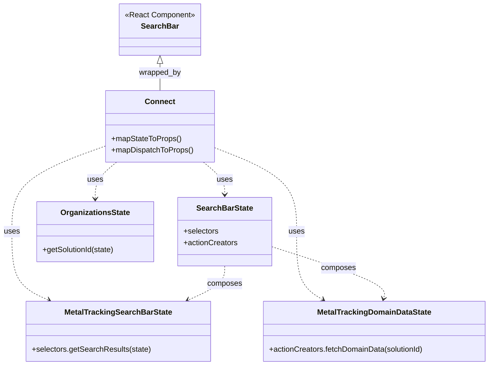

# Diagram: web/portal/src/modules/mt-location-results/MetalTrackingLocationResultsSearchBarContainer.js


> Auto-generated by Obscura crawlers

## Diagram 1



### SVG

<svg id="container" width="1020.763671875" xmlns="http://www.w3.org/2000/svg" class="classDiagram" height="766" viewBox="0 0 1020.763671875 766" role="graphics-document document" aria-roledescription="class"><style>#container{font-family:"trebuchet ms",verdana,arial,sans-serif;font-size:16px;fill:#333;}@keyframes edge-animation-frame{from{stroke-dashoffset:0;}}@keyframes dash{to{stroke-dashoffset:0;}}#container .edge-animation-slow{stroke-dasharray:9,5!important;stroke-dashoffset:900;animation:dash 50s linear infinite;stroke-linecap:round;}#container .edge-animation-fast{stroke-dasharray:9,5!important;stroke-dashoffset:900;animation:dash 20s linear infinite;stroke-linecap:round;}#container .error-icon{fill:#552222;}#container .error-text{fill:#552222;stroke:#552222;}#container .edge-thickness-normal{stroke-width:1px;}#container .edge-thickness-thick{stroke-width:3.5px;}#container .edge-pattern-solid{stroke-dasharray:0;}#container .edge-thickness-invisible{stroke-width:0;fill:none;}#container .edge-pattern-dashed{stroke-dasharray:3;}#container .edge-pattern-dotted{stroke-dasharray:2;}#container .marker{fill:#333333;stroke:#333333;}#container .marker.cross{stroke:#333333;}#container svg{font-family:"trebuchet ms",verdana,arial,sans-serif;font-size:16px;}#container p{margin:0;}#container g.classGroup text{fill:#9370DB;stroke:none;font-family:"trebuchet ms",verdana,arial,sans-serif;font-size:10px;}#container g.classGroup text .title{font-weight:bolder;}#container .nodeLabel,#container .edgeLabel{color:#131300;}#container .edgeLabel .label rect{fill:#ECECFF;}#container .label text{fill:#131300;}#container .labelBkg{background:#ECECFF;}#container .edgeLabel .label span{background:#ECECFF;}#container .classTitle{font-weight:bolder;}#container .node rect,#container .node circle,#container .node ellipse,#container .node polygon,#container .node path{fill:#ECECFF;stroke:#9370DB;stroke-width:1px;}#container .divider{stroke:#9370DB;stroke-width:1;}#container g.clickable{cursor:pointer;}#container g.classGroup rect{fill:#ECECFF;stroke:#9370DB;}#container g.classGroup line{stroke:#9370DB;stroke-width:1;}#container .classLabel .box{stroke:none;stroke-width:0;fill:#ECECFF;opacity:0.5;}#container .classLabel .label{fill:#9370DB;font-size:10px;}#container .relation{stroke:#333333;stroke-width:1;fill:none;}#container .dashed-line{stroke-dasharray:3;}#container .dotted-line{stroke-dasharray:1 2;}#container #compositionStart,#container .composition{fill:#333333!important;stroke:#333333!important;stroke-width:1;}#container #compositionEnd,#container .composition{fill:#333333!important;stroke:#333333!important;stroke-width:1;}#container #dependencyStart,#container .dependency{fill:#333333!important;stroke:#333333!important;stroke-width:1;}#container #dependencyStart,#container .dependency{fill:#333333!important;stroke:#333333!important;stroke-width:1;}#container #extensionStart,#container .extension{fill:transparent!important;stroke:#333333!important;stroke-width:1;}#container #extensionEnd,#container .extension{fill:transparent!important;stroke:#333333!important;stroke-width:1;}#container #aggregationStart,#container .aggregation{fill:transparent!important;stroke:#333333!important;stroke-width:1;}#container #aggregationEnd,#container .aggregation{fill:transparent!important;stroke:#333333!important;stroke-width:1;}#container #lollipopStart,#container .lollipop{fill:#ECECFF!important;stroke:#333333!important;stroke-width:1;}#container #lollipopEnd,#container .lollipop{fill:#ECECFF!important;stroke:#333333!important;stroke-width:1;}#container .edgeTerminals{font-size:11px;line-height:initial;}#container .classTitleText{text-anchor:middle;font-size:18px;fill:#333;}#container .label-icon{display:inline-block;height:1em;overflow:visible;vertical-align:-0.125em;}#container .node .label-icon path{fill:currentColor;stroke:revert;stroke-width:revert;}#container :root{--mermaid-font-family:"trebuchet ms",verdana,arial,sans-serif;}</style><g><defs><marker id="container_class-aggregationStart" class="marker aggregation class" refX="18" refY="7" markerWidth="190" markerHeight="240" orient="auto"><path d="M 18,7 L9,13 L1,7 L9,1 Z"></path></marker></defs><defs><marker id="container_class-aggregationEnd" class="marker aggregation class" refX="1" refY="7" markerWidth="20" markerHeight="28" orient="auto"><path d="M 18,7 L9,13 L1,7 L9,1 Z"></path></marker></defs><defs><marker id="container_class-extensionStart" class="marker extension class" refX="18" refY="7" markerWidth="190" markerHeight="240" orient="auto"><path d="M 1,7 L18,13 V 1 Z"></path></marker></defs><defs><marker id="container_class-extensionEnd" class="marker extension class" refX="1" refY="7" markerWidth="20" markerHeight="28" orient="auto"><path d="M 1,1 V 13 L18,7 Z"></path></marker></defs><defs><marker id="container_class-compositionStart" class="marker composition class" refX="18" refY="7" markerWidth="190" markerHeight="240" orient="auto"><path d="M 18,7 L9,13 L1,7 L9,1 Z"></path></marker></defs><defs><marker id="container_class-compositionEnd" class="marker composition class" refX="1" refY="7" markerWidth="20" markerHeight="28" orient="auto"><path d="M 18,7 L9,13 L1,7 L9,1 Z"></path></marker></defs><defs><marker id="container_class-dependencyStart" class="marker dependency class" refX="6" refY="7" markerWidth="190" markerHeight="240" orient="auto"><path d="M 5,7 L9,13 L1,7 L9,1 Z"></path></marker></defs><defs><marker id="container_class-dependencyEnd" class="marker dependency class" refX="13" refY="7" markerWidth="20" markerHeight="28" orient="auto"><path d="M 18,7 L9,13 L14,7 L9,1 Z"></path></marker></defs><defs><marker id="container_class-lollipopStart" class="marker lollipop class" refX="13" refY="7" markerWidth="190" markerHeight="240" orient="auto"><circle stroke="black" fill="transparent" cx="7" cy="7" r="6"></circle></marker></defs><defs><marker id="container_class-lollipopEnd" class="marker lollipop class" refX="1" refY="7" markerWidth="190" markerHeight="240" orient="auto"><circle stroke="black" fill="transparent" cx="7" cy="7" r="6"></circle></marker></defs><g class="root"><g class="clusters"></g><g class="edgePaths"><path d="M334.074,133.25L334.074,136.542C334.074,139.833,334.074,146.417,334.074,155.875C334.074,165.333,334.074,177.667,334.074,183.833L334.074,190" id="id_SearchBar_Connect_1" class="edge-thickness-normal edge-pattern-solid relation" style=";;;" data-edge="true" data-et="edge" data-id="id_SearchBar_Connect_1" data-points="W3sieCI6MzM0LjA3NDIxODc1LCJ5IjoxMTZ9LHsieCI6MzM0LjA3NDIxODc1LCJ5IjoxNTN9LHsieCI6MzM0LjA3NDIxODc1LCJ5IjoxOTB9XQ==" marker-start="url(#container_class-extensionStart)"></path><path d="M424.455,340L431.886,346.167C439.318,352.333,454.18,364.667,461.612,376C469.043,387.333,469.043,397.667,469.043,402.833L469.043,408" id="id_Connect_SearchBarState_2" class="edge-thickness-normal edge-pattern-dashed relation" style=";;;" data-edge="true" data-et="edge" data-id="id_Connect_SearchBarState_2" data-points="W3sieCI6NDI0LjQ1NTA3ODEyNSwieSI6MzQwfSx7IngiOjQ2OS4wNDI5Njg3NSwieSI6Mzc3fSx7IngiOjQ2OS4wNDI5Njg3NSwieSI6NDE0fV0=" marker-end="url(#container_class-dependencyEnd)"></path><path d="M221.777,305.627L188.896,317.522C156.016,329.418,90.254,353.209,57.373,383.271C24.492,413.333,24.492,449.667,24.492,486C24.492,522.333,24.492,558.667,37.287,582.59C50.082,606.513,75.672,618.026,88.467,623.782L101.262,629.538" id="id_Connect_MetalTrackingSearchBarState_3" class="edge-thickness-normal edge-pattern-dashed relation" style=";;;" data-edge="true" data-et="edge" data-id="id_Connect_MetalTrackingSearchBarState_3" data-points="W3sieCI6MjIxLjc3NzM0Mzc1LCJ5IjozMDUuNjI2NTUwNDE0NDk1MzR9LHsieCI6MjQuNDkyMTg3NSwieSI6Mzc3fSx7IngiOjI0LjQ5MjE4NzUsInkiOjQ4Nn0seyJ4IjoyNC40OTIxODc1LCJ5Ijo1OTV9LHsieCI6MTA2LjczNDA4MjAzMTI1MDAxLCJ5Ijo2MzJ9XQ==" marker-end="url(#container_class-dependencyEnd)"></path><path d="M446.371,309.399L474.868,320.666C503.365,331.933,560.358,354.466,588.855,383.9C617.352,413.333,617.352,449.667,617.352,486C617.352,522.333,617.352,558.667,626.509,582.475C635.666,606.284,653.98,617.568,663.137,623.21L672.294,628.853" id="id_Connect_MetalTrackingDomainDataState_4" class="edge-thickness-normal edge-pattern-dashed relation" style=";;;" data-edge="true" data-et="edge" data-id="id_Connect_MetalTrackingDomainDataState_4" data-points="W3sieCI6NDQ2LjM3MTA5Mzc1LCJ5IjozMDkuMzk5MDY3ODMwNDk5Nn0seyJ4Ijo2MTcuMzUxNTYyNSwieSI6Mzc3fSx7IngiOjYxNy4zNTE1NjI1LCJ5Ijo0ODZ9LHsieCI6NjE3LjM1MTU2MjUsInkiOjU5NX0seyJ4Ijo2NzcuNDAyMTI4OTA2MjUsInkiOjYzMn1d" marker-end="url(#container_class-dependencyEnd)"></path><path d="M243.693,340L236.262,346.167C228.831,352.333,213.968,364.667,206.537,377.5C199.105,390.333,199.105,403.667,199.105,410.333L199.105,417" id="id_Connect_OrganizationsState_5" class="edge-thickness-normal edge-pattern-dashed relation" style=";;;" data-edge="true" data-et="edge" data-id="id_Connect_OrganizationsState_5" data-points="W3sieCI6MjQzLjY5MzM1OTM3NSwieSI6MzQwfSx7IngiOjE5OS4xMDU0Njg3NSwieSI6Mzc3fSx7IngiOjE5OS4xMDU0Njg3NSwieSI6NDIzfV0=" marker-end="url(#container_class-dependencyEnd)"></path><path d="M469.043,558L469.043,564.167C469.043,570.333,469.043,582.667,456.248,594.59C443.453,606.513,417.863,618.026,405.068,623.782L392.273,629.538" id="id_SearchBarState_MetalTrackingSearchBarState_6" class="edge-thickness-normal edge-pattern-dashed relation" style=";;;" data-edge="true" data-et="edge" data-id="id_SearchBarState_MetalTrackingSearchBarState_6" data-points="W3sieCI6NDY5LjA0Mjk2ODc1LCJ5Ijo1NTh9LHsieCI6NDY5LjA0Mjk2ODc1LCJ5Ijo1OTV9LHsieCI6Mzg2LjgwMTA3NDIxODc1LCJ5Ijo2MzJ9XQ==" marker-end="url(#container_class-dependencyEnd)"></path><path d="M565.859,517.145L606.196,530.121C646.532,543.097,727.204,569.048,766.072,587.228C804.939,605.409,802.001,615.817,800.532,621.021L799.063,626.226" id="id_SearchBarState_MetalTrackingDomainDataState_7" class="edge-thickness-normal edge-pattern-dashed relation" style=";;;" data-edge="true" data-et="edge" data-id="id_SearchBarState_MetalTrackingDomainDataState_7" data-points="W3sieCI6NTY1Ljg1OTM3NSwieSI6NTE3LjE0NTAxMTMyNjc1ODJ9LHsieCI6ODA3Ljg3Njk1MzEyNSwieSI6NTk1fSx7IngiOjc5Ny40MzMxMjUsInkiOjYzMn1d" marker-end="url(#container_class-dependencyEnd)"></path></g><g class="edgeLabels"><g class="edgeLabel" transform="translate(334.07421875, 153)"><g class="label" data-id="id_SearchBar_Connect_1" transform="translate(-44.3671875, -12)"><foreignObject width="88.734375" height="24"><div xmlns="http://www.w3.org/1999/xhtml" class="labelBkg" style="display: table-cell; white-space: nowrap; line-height: 1.5; max-width: 200px; text-align: center;"><span class="edgeLabel"><p>wrapped_by</p></span></div></foreignObject></g></g><g class="edgeLabel" transform="translate(469.04296875, 377)"><g class="label" data-id="id_Connect_SearchBarState_2" transform="translate(-16.4921875, -12)"><foreignObject width="32.984375" height="24"><div xmlns="http://www.w3.org/1999/xhtml" class="labelBkg" style="display: table-cell; white-space: nowrap; line-height: 1.5; max-width: 200px; text-align: center;"><span class="edgeLabel"><p>uses</p></span></div></foreignObject></g></g><g class="edgeLabel" transform="translate(24.4921875, 486)"><g class="label" data-id="id_Connect_MetalTrackingSearchBarState_3" transform="translate(-16.4921875, -12)"><foreignObject width="32.984375" height="24"><div xmlns="http://www.w3.org/1999/xhtml" class="labelBkg" style="display: table-cell; white-space: nowrap; line-height: 1.5; max-width: 200px; text-align: center;"><span class="edgeLabel"><p>uses</p></span></div></foreignObject></g></g><g class="edgeLabel" transform="translate(617.3515625, 486)"><g class="label" data-id="id_Connect_MetalTrackingDomainDataState_4" transform="translate(-16.4921875, -12)"><foreignObject width="32.984375" height="24"><div xmlns="http://www.w3.org/1999/xhtml" class="labelBkg" style="display: table-cell; white-space: nowrap; line-height: 1.5; max-width: 200px; text-align: center;"><span class="edgeLabel"><p>uses</p></span></div></foreignObject></g></g><g class="edgeLabel" transform="translate(199.10546875, 377)"><g class="label" data-id="id_Connect_OrganizationsState_5" transform="translate(-16.4921875, -12)"><foreignObject width="32.984375" height="24"><div xmlns="http://www.w3.org/1999/xhtml" class="labelBkg" style="display: table-cell; white-space: nowrap; line-height: 1.5; max-width: 200px; text-align: center;"><span class="edgeLabel"><p>uses</p></span></div></foreignObject></g></g><g class="edgeLabel" transform="translate(469.04296875, 595)"><g class="label" data-id="id_SearchBarState_MetalTrackingSearchBarState_6" transform="translate(-36.453125, -12)"><foreignObject width="72.90625" height="24"><div xmlns="http://www.w3.org/1999/xhtml" class="labelBkg" style="display: table-cell; white-space: nowrap; line-height: 1.5; max-width: 200px; text-align: center;"><span class="edgeLabel"><p>composes</p></span></div></foreignObject></g></g><g class="edgeLabel" transform="translate(705.16747, 561.95924)"><g class="label" data-id="id_SearchBarState_MetalTrackingDomainDataState_7" transform="translate(-36.453125, -12)"><foreignObject width="72.90625" height="24"><div xmlns="http://www.w3.org/1999/xhtml" class="labelBkg" style="display: table-cell; white-space: nowrap; line-height: 1.5; max-width: 200px; text-align: center;"><span class="edgeLabel"><p>composes</p></span></div></foreignObject></g></g></g><g class="nodes"><g class="node default" id="classId-SearchBar-0" transform="translate(334.07421875, 62)"><g class="basic label-container"><path d="M-85.2109375 -54 L85.2109375 -54 L85.2109375 54 L-85.2109375 54" stroke="none" stroke-width="0" fill="#ECECFF" style=""></path><path d="M-85.2109375 -54 C-48.117383156795704 -54, -11.023828813591408 -54, 85.2109375 -54 M-85.2109375 -54 C-50.6084267340443 -54, -16.0059159680886 -54, 85.2109375 -54 M85.2109375 -54 C85.2109375 -27.72771746157581, 85.2109375 -1.4554349231516213, 85.2109375 54 M85.2109375 -54 C85.2109375 -12.777302465111838, 85.2109375 28.445395069776325, 85.2109375 54 M85.2109375 54 C33.301547341797544 54, -18.60784281640491 54, -85.2109375 54 M85.2109375 54 C39.431965390993305 54, -6.34700671801339 54, -85.2109375 54 M-85.2109375 54 C-85.2109375 17.064792855158316, -85.2109375 -19.870414289683367, -85.2109375 -54 M-85.2109375 54 C-85.2109375 18.41192144443034, -85.2109375 -17.176157111139318, -85.2109375 -54" stroke="#9370DB" stroke-width="1.3" fill="none" stroke-dasharray="0 0" style=""></path></g><g class="annotation-group text" transform="translate(-73.2109375, -30)"><g class="label" style="" transform="translate(0,-12)"><foreignObject width="146.421875" height="24"><div xmlns="http://www.w3.org/1999/xhtml" style="display: table-cell; white-space: nowrap; line-height: 1.5; max-width: 196px; text-align: center;"><span class="nodeLabel markdown-node-label" style=""><p>«React Component»</p></span></div></foreignObject></g></g><g class="label-group text" transform="translate(-37.2421875, -6)"><g class="label" style="font-weight: bolder" transform="translate(0,-12)"><foreignObject width="74.484375" height="24"><div xmlns="http://www.w3.org/1999/xhtml" style="display: table-cell; white-space: nowrap; line-height: 1.5; max-width: 124px; text-align: center;"><span class="nodeLabel markdown-node-label" style=""><p>SearchBar</p></span></div></foreignObject></g></g><g class="members-group text" transform="translate(-73.2109375, 42)"></g><g class="methods-group text" transform="translate(-73.2109375, 72)"></g><g class="divider" style=""><path d="M-85.2109375 18 C-41.11732110338554 18, 2.9762952932289153 18, 85.2109375 18 M-85.2109375 18 C-25.191078621340054 18, 34.82878025731989 18, 85.2109375 18" stroke="#9370DB" stroke-width="1.3" fill="none" stroke-dasharray="0 0" style=""></path></g><g class="divider" style=""><path d="M-85.2109375 36 C-47.61208347588983 36, -10.013229451779665 36, 85.2109375 36 M-85.2109375 36 C-39.49621529687223 36, 6.218506906255541 36, 85.2109375 36" stroke="#9370DB" stroke-width="1.3" fill="none" stroke-dasharray="0 0" style=""></path></g></g><g class="node default" id="classId-Connect-1" transform="translate(334.07421875, 265)"><g class="basic label-container"><path d="M-112.296875 -75 L112.296875 -75 L112.296875 75 L-112.296875 75" stroke="none" stroke-width="0" fill="#ECECFF" style=""></path><path d="M-112.296875 -75 C-57.99941158089189 -75, -3.7019481617837755 -75, 112.296875 -75 M-112.296875 -75 C-36.99336981100751 -75, 38.31013537798498 -75, 112.296875 -75 M112.296875 -75 C112.296875 -17.42862398325581, 112.296875 40.14275203348838, 112.296875 75 M112.296875 -75 C112.296875 -22.323655980444805, 112.296875 30.35268803911039, 112.296875 75 M112.296875 75 C46.65902675169772 75, -18.978821496604553 75, -112.296875 75 M112.296875 75 C53.025602921809316 75, -6.245669156381368 75, -112.296875 75 M-112.296875 75 C-112.296875 17.15534353011809, -112.296875 -40.68931293976382, -112.296875 -75 M-112.296875 75 C-112.296875 19.18618616290712, -112.296875 -36.62762767418576, -112.296875 -75" stroke="#9370DB" stroke-width="1.3" fill="none" stroke-dasharray="0 0" style=""></path></g><g class="annotation-group text" transform="translate(0, -51)"></g><g class="label-group text" transform="translate(-29.6875, -51)"><g class="label" style="font-weight: bolder" transform="translate(0,-12)"><foreignObject width="59.375" height="24"><div xmlns="http://www.w3.org/1999/xhtml" style="display: table-cell; white-space: nowrap; line-height: 1.5; max-width: 109px; text-align: center;"><span class="nodeLabel markdown-node-label" style=""><p>Connect</p></span></div></foreignObject></g></g><g class="members-group text" transform="translate(-100.296875, -3)"></g><g class="methods-group text" transform="translate(-100.296875, 27)"><g class="label" style="" transform="translate(0,-12)"><foreignObject width="145.359375" height="24"><div xmlns="http://www.w3.org/1999/xhtml" style="display: table-cell; white-space: nowrap; line-height: 1.5; max-width: 203px; text-align: center;"><span class="nodeLabel markdown-node-label" style=""><p>+mapStateToProps()</p></span></div></foreignObject></g><g class="label" style="" transform="translate(0,12)"><foreignObject width="170.90625" height="24"><div xmlns="http://www.w3.org/1999/xhtml" style="display: table-cell; white-space: nowrap; line-height: 1.5; max-width: 228px; text-align: center;"><span class="nodeLabel markdown-node-label" style=""><p>+mapDispatchToProps()</p></span></div></foreignObject></g></g><g class="divider" style=""><path d="M-112.296875 -27 C-34.61666488335207 -27, 43.063545233295855 -27, 112.296875 -27 M-112.296875 -27 C-65.04353596128244 -27, -17.79019692256489 -27, 112.296875 -27" stroke="#9370DB" stroke-width="1.3" fill="none" stroke-dasharray="0 0" style=""></path></g><g class="divider" style=""><path d="M-112.296875 -3 C-40.51818444455023 -3, 31.26050611089954 -3, 112.296875 -3 M-112.296875 -3 C-59.24148861777757 -3, -6.18610223555514 -3, 112.296875 -3" stroke="#9370DB" stroke-width="1.3" fill="none" stroke-dasharray="0 0" style=""></path></g></g><g class="node default" id="classId-SearchBarState-2" transform="translate(469.04296875, 486)"><g class="basic label-container"><path d="M-96.81640625 -72 L96.81640625 -72 L96.81640625 72 L-96.81640625 72" stroke="none" stroke-width="0" fill="#ECECFF" style=""></path><path d="M-96.81640625 -72 C-21.271719110063103 -72, 54.272968029873795 -72, 96.81640625 -72 M-96.81640625 -72 C-24.768444261178587 -72, 47.279517727642826 -72, 96.81640625 -72 M96.81640625 -72 C96.81640625 -20.54946732592768, 96.81640625 30.90106534814464, 96.81640625 72 M96.81640625 -72 C96.81640625 -37.06308030482704, 96.81640625 -2.126160609654079, 96.81640625 72 M96.81640625 72 C52.199964675346735 72, 7.583523100693469 72, -96.81640625 72 M96.81640625 72 C21.42809912439445 72, -53.9602080012111 72, -96.81640625 72 M-96.81640625 72 C-96.81640625 38.51838924549099, -96.81640625 5.036778490981973, -96.81640625 -72 M-96.81640625 72 C-96.81640625 38.18643270416948, -96.81640625 4.372865408338967, -96.81640625 -72" stroke="#9370DB" stroke-width="1.3" fill="none" stroke-dasharray="0 0" style=""></path></g><g class="annotation-group text" transform="translate(0, -48)"></g><g class="label-group text" transform="translate(-56.5546875, -48)"><g class="label" style="font-weight: bolder" transform="translate(0,-12)"><foreignObject width="113.109375" height="24"><div xmlns="http://www.w3.org/1999/xhtml" style="display: table-cell; white-space: nowrap; line-height: 1.5; max-width: 161px; text-align: center;"><span class="nodeLabel markdown-node-label" style=""><p>SearchBarState</p></span></div></foreignObject></g></g><g class="members-group text" transform="translate(-84.81640625, 0)"><g class="label" style="" transform="translate(0,-12)"><foreignObject width="73.453125" height="24"><div xmlns="http://www.w3.org/1999/xhtml" style="display: table-cell; white-space: nowrap; line-height: 1.5; max-width: 131px; text-align: center;"><span class="nodeLabel markdown-node-label" style=""><p>+selectors</p></span></div></foreignObject></g><g class="label" style="" transform="translate(0,12)"><foreignObject width="113.078125" height="24"><div xmlns="http://www.w3.org/1999/xhtml" style="display: table-cell; white-space: nowrap; line-height: 1.5; max-width: 170px; text-align: center;"><span class="nodeLabel markdown-node-label" style=""><p>+actionCreators</p></span></div></foreignObject></g></g><g class="methods-group text" transform="translate(-84.81640625, 72)"></g><g class="divider" style=""><path d="M-96.81640625 -24 C-37.25422477112637 -24, 22.307956707747266 -24, 96.81640625 -24 M-96.81640625 -24 C-32.20794276608986 -24, 32.400520717820285 -24, 96.81640625 -24" stroke="#9370DB" stroke-width="1.3" fill="none" stroke-dasharray="0 0" style=""></path></g><g class="divider" style=""><path d="M-96.81640625 48 C-38.38155004977571 48, 20.053306150448577 48, 96.81640625 48 M-96.81640625 48 C-41.82537251218105 48, 13.165661225637905 48, 96.81640625 48" stroke="#9370DB" stroke-width="1.3" fill="none" stroke-dasharray="0 0" style=""></path></g></g><g class="node default" id="classId-MetalTrackingSearchBarState-3" transform="translate(246.767578125, 695)"><g class="basic label-container"><path d="M-189.79296875 -63 L189.79296875 -63 L189.79296875 63 L-189.79296875 63" stroke="none" stroke-width="0" fill="#ECECFF" style=""></path><path d="M-189.79296875 -63 C-82.01719923216635 -63, 25.758570285667304 -63, 189.79296875 -63 M-189.79296875 -63 C-45.06392468935533 -63, 99.66511937128934 -63, 189.79296875 -63 M189.79296875 -63 C189.79296875 -24.566178995816323, 189.79296875 13.867642008367355, 189.79296875 63 M189.79296875 -63 C189.79296875 -14.788749877795091, 189.79296875 33.42250024440982, 189.79296875 63 M189.79296875 63 C62.24988287459465 63, -65.2932030008107 63, -189.79296875 63 M189.79296875 63 C99.46207108177384 63, 9.131173413547685 63, -189.79296875 63 M-189.79296875 63 C-189.79296875 21.787682650814254, -189.79296875 -19.42463469837149, -189.79296875 -63 M-189.79296875 63 C-189.79296875 28.271673803431206, -189.79296875 -6.456652393137588, -189.79296875 -63" stroke="#9370DB" stroke-width="1.3" fill="none" stroke-dasharray="0 0" style=""></path></g><g class="annotation-group text" transform="translate(0, -39)"></g><g class="label-group text" transform="translate(-107.8515625, -39)"><g class="label" style="font-weight: bolder" transform="translate(0,-12)"><foreignObject width="215.703125" height="24"><div xmlns="http://www.w3.org/1999/xhtml" style="display: table-cell; white-space: nowrap; line-height: 1.5; max-width: 261px; text-align: center;"><span class="nodeLabel markdown-node-label" style=""><p>MetalTrackingSearchBarState</p></span></div></foreignObject></g></g><g class="members-group text" transform="translate(-177.79296875, 9)"></g><g class="methods-group text" transform="translate(-177.79296875, 39)"><g class="label" style="" transform="translate(0,-12)"><foreignObject width="247.734375" height="24"><div xmlns="http://www.w3.org/1999/xhtml" style="display: table-cell; white-space: nowrap; line-height: 1.5; max-width: 305px; text-align: center;"><span class="nodeLabel markdown-node-label" style=""><p>+selectors.getSearchResults(state)</p></span></div></foreignObject></g></g><g class="divider" style=""><path d="M-189.79296875 -15 C-111.7434997776365 -15, -33.694030805273 -15, 189.79296875 -15 M-189.79296875 -15 C-56.3717538657678 -15, 77.0494610184644 -15, 189.79296875 -15" stroke="#9370DB" stroke-width="1.3" fill="none" stroke-dasharray="0 0" style=""></path></g><g class="divider" style=""><path d="M-189.79296875 9 C-96.25612364504637 9, -2.719278540092745 9, 189.79296875 9 M-189.79296875 9 C-89.90546664387901 9, 9.982035462241981 9, 189.79296875 9" stroke="#9370DB" stroke-width="1.3" fill="none" stroke-dasharray="0 0" style=""></path></g></g><g class="node default" id="classId-MetalTrackingDomainDataState-4" transform="translate(779.650390625, 695)"><g class="basic label-container"><path d="M-233.11328125 -63 L233.11328125 -63 L233.11328125 63 L-233.11328125 63" stroke="none" stroke-width="0" fill="#ECECFF" style=""></path><path d="M-233.11328125 -63 C-138.62192069046245 -63, -44.13056013092486 -63, 233.11328125 -63 M-233.11328125 -63 C-51.62637398604036 -63, 129.86053327791927 -63, 233.11328125 -63 M233.11328125 -63 C233.11328125 -17.04479108260727, 233.11328125 28.910417834785463, 233.11328125 63 M233.11328125 -63 C233.11328125 -21.76155369809446, 233.11328125 19.47689260381108, 233.11328125 63 M233.11328125 63 C53.785320164631344 63, -125.54264092073731 63, -233.11328125 63 M233.11328125 63 C49.512327902951284 63, -134.08862544409743 63, -233.11328125 63 M-233.11328125 63 C-233.11328125 19.272645073233825, -233.11328125 -24.45470985353235, -233.11328125 -63 M-233.11328125 63 C-233.11328125 13.83803566524373, -233.11328125 -35.32392866951254, -233.11328125 -63" stroke="#9370DB" stroke-width="1.3" fill="none" stroke-dasharray="0 0" style=""></path></g><g class="annotation-group text" transform="translate(0, -39)"></g><g class="label-group text" transform="translate(-115.3984375, -39)"><g class="label" style="font-weight: bolder" transform="translate(0,-12)"><foreignObject width="230.796875" height="24"><div xmlns="http://www.w3.org/1999/xhtml" style="display: table-cell; white-space: nowrap; line-height: 1.5; max-width: 277px; text-align: center;"><span class="nodeLabel markdown-node-label" style=""><p>MetalTrackingDomainDataState</p></span></div></foreignObject></g></g><g class="members-group text" transform="translate(-221.11328125, 9)"></g><g class="methods-group text" transform="translate(-221.11328125, 39)"><g class="label" style="" transform="translate(0,-12)"><foreignObject width="326.828125" height="24"><div xmlns="http://www.w3.org/1999/xhtml" style="display: table-cell; white-space: nowrap; line-height: 1.5; max-width: 384px; text-align: center;"><span class="nodeLabel markdown-node-label" style=""><p>+actionCreators.fetchDomainData(solutionId)</p></span></div></foreignObject></g></g><g class="divider" style=""><path d="M-233.11328125 -15 C-59.483499638377936 -15, 114.14628197324413 -15, 233.11328125 -15 M-233.11328125 -15 C-103.54522370371686 -15, 26.022833842566286 -15, 233.11328125 -15" stroke="#9370DB" stroke-width="1.3" fill="none" stroke-dasharray="0 0" style=""></path></g><g class="divider" style=""><path d="M-233.11328125 9 C-50.024672716001675 9, 133.06393581799665 9, 233.11328125 9 M-233.11328125 9 C-116.97327234314824 9, -0.8332634362964768 9, 233.11328125 9" stroke="#9370DB" stroke-width="1.3" fill="none" stroke-dasharray="0 0" style=""></path></g></g><g class="node default" id="classId-OrganizationsState-5" transform="translate(199.10546875, 486)"><g class="basic label-container"><path d="M-123.12109375 -63 L123.12109375 -63 L123.12109375 63 L-123.12109375 63" stroke="none" stroke-width="0" fill="#ECECFF" style=""></path><path d="M-123.12109375 -63 C-59.7812970585085 -63, 3.5584996329830005 -63, 123.12109375 -63 M-123.12109375 -63 C-25.936574268134308 -63, 71.24794521373138 -63, 123.12109375 -63 M123.12109375 -63 C123.12109375 -18.222298004561786, 123.12109375 26.555403990876428, 123.12109375 63 M123.12109375 -63 C123.12109375 -35.58805107846203, 123.12109375 -8.176102156924067, 123.12109375 63 M123.12109375 63 C40.95930620237904 63, -41.20248134524192 63, -123.12109375 63 M123.12109375 63 C58.5784244996794 63, -5.9642447506412 63, -123.12109375 63 M-123.12109375 63 C-123.12109375 26.689948197573088, -123.12109375 -9.620103604853824, -123.12109375 -63 M-123.12109375 63 C-123.12109375 28.557483935688566, -123.12109375 -5.885032128622868, -123.12109375 -63" stroke="#9370DB" stroke-width="1.3" fill="none" stroke-dasharray="0 0" style=""></path></g><g class="annotation-group text" transform="translate(0, -39)"></g><g class="label-group text" transform="translate(-69.8671875, -39)"><g class="label" style="font-weight: bolder" transform="translate(0,-12)"><foreignObject width="139.734375" height="24"><div xmlns="http://www.w3.org/1999/xhtml" style="display: table-cell; white-space: nowrap; line-height: 1.5; max-width: 187px; text-align: center;"><span class="nodeLabel markdown-node-label" style=""><p>OrganizationsState</p></span></div></foreignObject></g></g><g class="members-group text" transform="translate(-111.12109375, 9)"></g><g class="methods-group text" transform="translate(-111.12109375, 39)"><g class="label" style="" transform="translate(0,-12)"><foreignObject width="152.375" height="24"><div xmlns="http://www.w3.org/1999/xhtml" style="display: table-cell; white-space: nowrap; line-height: 1.5; max-width: 210px; text-align: center;"><span class="nodeLabel markdown-node-label" style=""><p>+getSolutionId(state)</p></span></div></foreignObject></g></g><g class="divider" style=""><path d="M-123.12109375 -15 C-63.33136715452455 -15, -3.5416405590490996 -15, 123.12109375 -15 M-123.12109375 -15 C-58.81605803044167 -15, 5.488977689116666 -15, 123.12109375 -15" stroke="#9370DB" stroke-width="1.3" fill="none" stroke-dasharray="0 0" style=""></path></g><g class="divider" style=""><path d="M-123.12109375 9 C-42.00468826654506 9, 39.11171721690988 9, 123.12109375 9 M-123.12109375 9 C-26.104473445207816 9, 70.91214685958437 9, 123.12109375 9" stroke="#9370DB" stroke-width="1.3" fill="none" stroke-dasharray="0 0" style=""></path></g></g></g></g></g></svg>

## Diagram 2

```mermaid
flowchart LR
subgraph StateSide
  State[(Redux State)]
  MTSearch[MetalTrackingSearchBarState.selectors]
  Orgs[OrganizationsState.getSolutionId]
  SearchBarSelectors[SearchBarState.selectors]
end
subgraph DispatchSide
  Dispatch[(dispatch)]
  SBAction[SearchBarState.actionCreators]
  MTDomainAction[MetalTrackingDomainDataState.actionCreators.fetchDomainData]
end
State --> MTSearch --> BuildOptions[buildRackLocationFilteredOptionsSelector(property)\n-> getSerialNumbers/getLocations/getTagIds/getCspcs/getDescriptions]
State --> SearchBarSelectors --> MappedState[mapStateToProps\n(typeaheadOptionsMetadata,searchText,searchCategory,solutionId,serialNumbers,locations,descriptions,tagIds,cspcs)]
State --> Orgs --> MappedState
Dispatch --> SBAction --> MappedDispatch[mapDispatchToProps\n(setSearchCategory,setSearchText,clearSearchText,resetSearchBar,clearSavedSearch,searchEntities)]
Dispatch --> MTDomainAction --> MappedDispatch
MappedState --> Connect[connect(mapStateToProps,mapDispatchToProps)]
MappedDispatch --> Connect
Connect --> SearchBar
```

> SVG rendering failed for this diagram.
