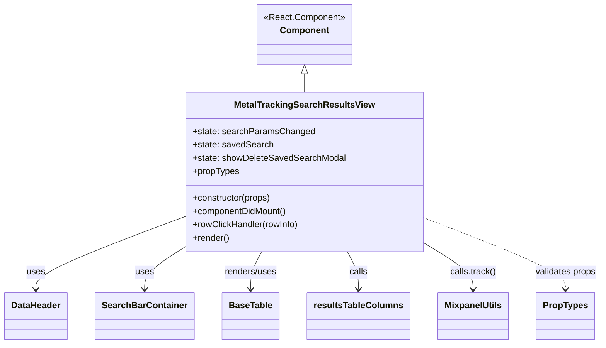
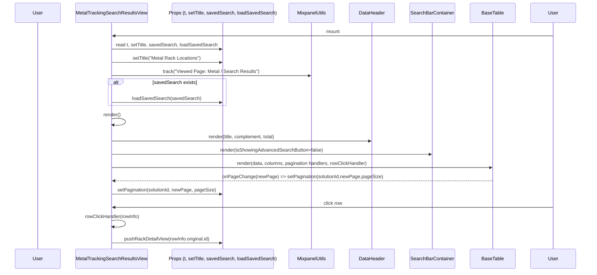

# Diagram: web/portal/src/modules/mt-location-results/MetalTrackingLocationResultsView.js

> Auto-generated by Obscura crawlers

## Diagram 1

### SVG

<svg id="container" width="1051.3828125" xmlns="http://www.w3.org/2000/svg" class="classDiagram" height="620" viewBox="0 0 1051.3828125 620" role="graphics-document document" aria-roledescription="class"><g><defs><marker id="container_class-aggregationStart" class="marker aggregation class" refX="18" refY="7" markerWidth="190" markerHeight="240" orient="auto"><path d="M 18,7 L9,13 L1,7 L9,1 Z"></path></marker></defs><defs><marker id="container_class-aggregationEnd" class="marker aggregation class" refX="1" refY="7" markerWidth="20" markerHeight="28" orient="auto"><path d="M 18,7 L9,13 L1,7 L9,1 Z"></path></marker></defs><defs><marker id="container_class-extensionStart" class="marker extension class" refX="18" refY="7" markerWidth="190" markerHeight="240" orient="auto"><path d="M 1,7 L18,13 V 1 Z"></path></marker></defs><defs><marker id="container_class-extensionEnd" class="marker extension class" refX="1" refY="7" markerWidth="20" markerHeight="28" orient="auto"><path d="M 1,1 V 13 L18,7 Z"></path></marker></defs><defs><marker id="container_class-compositionStart" class="marker composition class" refX="18" refY="7" markerWidth="190" markerHeight="240" orient="auto"><path d="M 18,7 L9,13 L1,7 L9,1 Z"></path></marker></defs><defs><marker id="container_class-compositionEnd" class="marker composition class" refX="1" refY="7" markerWidth="20" markerHeight="28" orient="auto"><path d="M 18,7 L9,13 L1,7 L9,1 Z"></path></marker></defs><defs><marker id="container_class-dependencyStart" class="marker dependency class" refX="6" refY="7" markerWidth="190" markerHeight="240" orient="auto"><path d="M 5,7 L9,13 L1,7 L9,1 Z"></path></marker></defs><defs><marker id="container_class-dependencyEnd" class="marker dependency class" refX="13" refY="7" markerWidth="20" markerHeight="28" orient="auto"><path d="M 18,7 L9,13 L14,7 L9,1 Z"></path></marker></defs><defs><marker id="container_class-lollipopStart" class="marker lollipop class" refX="13" refY="7" markerWidth="190" markerHeight="240" orient="auto"><circle stroke="black" fill="transparent" cx="7" cy="7" r="6"></circle></marker></defs><defs><marker id="container_class-lollipopEnd" class="marker lollipop class" refX="1" refY="7" markerWidth="190" markerHeight="240" orient="auto"><circle stroke="black" fill="transparent" cx="7" cy="7" r="6"></circle></marker></defs><g class="root"><g class="clusters"></g><g class="edgePaths"><path d="M531.605,133.25L531.605,134.542C531.605,135.833,531.605,138.417,531.605,143.875C531.605,149.333,531.605,157.667,531.605,161.833L531.605,166" id="id_Component_MetalTrackingSearchResultsView_1" class="edge-thickness-normal edge-pattern-solid relation" style=";;;" data-edge="true" data-et="edge" data-id="id_Component_MetalTrackingSearchResultsView_1" data-points="W3sieCI6NTMxLjYwNTQ2ODc1LCJ5IjoxMTZ9LHsieCI6NTMxLjYwNTQ2ODc1LCJ5IjoxNDF9LHsieCI6NTMxLjYwNTQ2ODc1LCJ5IjoxNjZ9XQ==" marker-start="url(#container_class-extensionStart)"></path><path d="M322.98,390.645L279.712,407.371C236.443,424.097,149.905,457.548,106.636,479.441C63.367,501.333,63.367,511.667,63.367,516.833L63.367,522" id="id_MetalTrackingSearchResultsView_DataHeader_2" class="edge-thickness-normal edge-pattern-solid relation" style=";;;" data-edge="true" data-et="edge" data-id="id_MetalTrackingSearchResultsView_DataHeader_2" data-points="W3sieCI6MzIyLjk4MDQ2ODc1LCJ5IjozOTAuNjQ1MTA0MjM4Nzk0MDN9LHsieCI6NjMuMzY3MTg3NSwieSI6NDkxfSx7IngiOjYzLjM2NzE4NzUsInkiOjUyOH1d" marker-end="url(#container_class-dependencyEnd)"></path><path d="M322.98,445.818L311.413,453.348C299.846,460.879,276.712,475.939,265.145,488.636C253.578,501.333,253.578,511.667,253.578,516.833L253.578,522" id="id_MetalTrackingSearchResultsView_SearchBarContainer_3" class="edge-thickness-normal edge-pattern-solid relation" style=";;;" data-edge="true" data-et="edge" data-id="id_MetalTrackingSearchResultsView_SearchBarContainer_3" data-points="W3sieCI6MzIyLjk4MDQ2ODc1LCJ5Ijo0NDUuODE4MDI1OTkyMjcyNTd9LHsieCI6MjUzLjU3ODEyNSwieSI6NDkxfSx7IngiOjI1My41NzgxMjUsInkiOjUyOH1d" marker-end="url(#container_class-dependencyEnd)"></path><path d="M456.961,454L453.764,460.167C450.568,466.333,444.174,478.667,440.978,490C437.781,501.333,437.781,511.667,437.781,516.833L437.781,522" id="id_MetalTrackingSearchResultsView_BaseTable_4" class="edge-thickness-normal edge-pattern-solid relation" style=";;;" data-edge="true" data-et="edge" data-id="id_MetalTrackingSearchResultsView_BaseTable_4" data-points="W3sieCI6NDU2Ljk2MDc4NjQyOTU1OCwieSI6NDU0fSx7IngiOjQzNy43ODEyNSwieSI6NDkxfSx7IngiOjQzNy43ODEyNSwieSI6NTI4fV0=" marker-end="url(#container_class-dependencyEnd)"></path><path d="M606.25,454L609.447,460.167C612.643,466.333,619.037,478.667,622.233,490C625.43,501.333,625.43,511.667,625.43,516.833L625.43,522" id="id_MetalTrackingSearchResultsView_resultsTableColumns_5" class="edge-thickness-normal edge-pattern-solid relation" style=";;;" data-edge="true" data-et="edge" data-id="id_MetalTrackingSearchResultsView_resultsTableColumns_5" data-points="W3sieCI6NjA2LjI1MDE1MTA3MDQ0MiwieSI6NDU0fSx7IngiOjYyNS40Mjk2ODc1LCJ5Ijo0OTF9LHsieCI6NjI1LjQyOTY4NzUsInkiOjUyOH1d" marker-end="url(#container_class-dependencyEnd)"></path><path d="M740.23,438.424L754.465,447.187C768.701,455.949,797.171,473.475,811.406,487.404C825.641,501.333,825.641,511.667,825.641,516.833L825.641,522" id="id_MetalTrackingSearchResultsView_MixpanelUtils_6" class="edge-thickness-normal edge-pattern-solid relation" style=";;;" data-edge="true" data-et="edge" data-id="id_MetalTrackingSearchResultsView_MixpanelUtils_6" data-points="W3sieCI6NzQwLjIzMDQ2ODc1LCJ5Ijo0MzguNDIzODQzODc0OTYxOH0seyJ4Ijo4MjUuNjQwNjI1LCJ5Ijo0OTF9LHsieCI6ODI1LjY0MDYyNSwieSI6NTI4fV0=" marker-end="url(#container_class-dependencyEnd)"></path><path d="M740.23,392.77L781.495,409.142C822.76,425.514,905.29,458.257,946.555,479.795C987.82,501.333,987.82,511.667,987.82,516.833L987.82,522" id="id_MetalTrackingSearchResultsView_PropTypes_7" class="edge-thickness-normal edge-pattern-dashed relation" style=";;;" data-edge="true" data-et="edge" data-id="id_MetalTrackingSearchResultsView_PropTypes_7" data-points="W3sieCI6NzQwLjIzMDQ2ODc1LCJ5IjozOTIuNzcwNDg3NDUxOTQ0MDZ9LHsieCI6OTg3LjgyMDMxMjUsInkiOjQ5MX0seyJ4Ijo5ODcuODIwMzEyNSwieSI6NTI4fV0=" marker-end="url(#container_class-dependencyEnd)"></path></g><g class="edgeLabels"><g class="edgeLabel"><g class="label" data-id="id_Component_MetalTrackingSearchResultsView_1" transform="translate(0, 0)"><foreignObject width="0" height="0">

</foreignObject></g></g><g class="edgeLabel" transform="translate(63.3671875, 491)"><g class="label" data-id="id_MetalTrackingSearchResultsView_DataHeader_2" transform="translate(-16.4921875, -12)"><foreignObject width="32.984375" height="24">

uses

</foreignObject></g></g><g class="edgeLabel" transform="translate(253.578125, 491)"><g class="label" data-id="id_MetalTrackingSearchResultsView_SearchBarContainer_3" transform="translate(-16.4921875, -12)"><foreignObject width="32.984375" height="24">

uses

</foreignObject></g></g><g class="edgeLabel" transform="translate(437.78125, 491)"><g class="label" data-id="id_MetalTrackingSearchResultsView_BaseTable_4" transform="translate(-48.15625, -12)"><foreignObject width="96.3125" height="24">

renders/uses

</foreignObject></g></g><g class="edgeLabel" transform="translate(625.4296875, 491)"><g class="label" data-id="id_MetalTrackingSearchResultsView_resultsTableColumns_5" transform="translate(-16.4453125, -12)"><foreignObject width="32.890625" height="24">

calls

</foreignObject></g></g><g class="edgeLabel" transform="translate(825.640625, 491)"><g class="label" data-id="id_MetalTrackingSearchResultsView_MixpanelUtils_6" transform="translate(-41.2734375, -12)"><foreignObject width="82.546875" height="24">

calls.track()

</foreignObject></g></g><g class="edgeLabel" transform="translate(987.8203125, 491)"><g class="label" data-id="id_MetalTrackingSearchResultsView_PropTypes_7" transform="translate(-55.5625, -12)"><foreignObject width="111.125" height="24">

validates props

</foreignObject></g></g></g><g class="nodes"><g class="node default" id="classId-Component-0" transform="translate(531.60546875, 62)"><g class="basic label-container"><path d="M-84.8828125 -54 L84.8828125 -54 L84.8828125 54 L-84.8828125 54" stroke="none" stroke-width="0" fill="#ECECFF" style=""></path><path d="M-84.8828125 -54 C-23.229765870222195 -54, 38.42328075955561 -54, 84.8828125 -54 M-84.8828125 -54 C-45.94763630814898 -54, -7.012460116297959 -54, 84.8828125 -54 M84.8828125 -54 C84.8828125 -21.94199533475259, 84.8828125 10.116009330494819, 84.8828125 54 M84.8828125 -54 C84.8828125 -19.295761312948493, 84.8828125 15.408477374103015, 84.8828125 54 M84.8828125 54 C47.350332441491354 54, 9.817852382982707 54, -84.8828125 54 M84.8828125 54 C28.728957296941047 54, -27.424897906117906 54, -84.8828125 54 M-84.8828125 54 C-84.8828125 23.10078738868804, -84.8828125 -7.798425222623919, -84.8828125 -54 M-84.8828125 54 C-84.8828125 24.529481372608988, -84.8828125 -4.9410372547820245, -84.8828125 -54" stroke="#9370DB" stroke-width="1.3" fill="none" stroke-dasharray="0 0" style=""></path></g><g class="annotation-group text" transform="translate(-72.8828125, -30)"><g class="label" style="" transform="translate(0,-12)"><foreignObject width="145.765625" height="24">

«React.Component»

</foreignObject></g></g><g class="label-group text" transform="translate(-42.0625, -6)"><g class="label" style="font-weight: bolder" transform="translate(0,-12)"><foreignObject width="84.125" height="24">

Component

</foreignObject></g></g><g class="members-group text" transform="translate(-72.8828125, 42)"></g><g class="methods-group text" transform="translate(-72.8828125, 72)"></g><g class="divider" style=""><path d="M-84.8828125 18 C-45.920012692748 18, -6.957212885496006 18, 84.8828125 18 M-84.8828125 18 C-37.56613204015114 18, 9.750548419697722 18, 84.8828125 18" stroke="#9370DB" stroke-width="1.3" fill="none" stroke-dasharray="0 0" style=""></path></g><g class="divider" style=""><path d="M-84.8828125 36 C-36.06690943630521 36, 12.74899362738958 36, 84.8828125 36 M-84.8828125 36 C-41.06106552673351 36, 2.7606814465329848 36, 84.8828125 36" stroke="#9370DB" stroke-width="1.3" fill="none" stroke-dasharray="0 0" style=""></path></g></g><g class="node default" id="classId-MetalTrackingSearchResultsView-1" transform="translate(531.60546875, 310)"><g class="basic label-container"><path d="M-208.625 -144 L208.625 -144 L208.625 144 L-208.625 144" stroke="none" stroke-width="0" fill="#ECECFF" style=""></path><path d="M-208.625 -144 C-59.03889440499759 -144, 90.54721119000482 -144, 208.625 -144 M-208.625 -144 C-116.34192745362643 -144, -24.05885490725285 -144, 208.625 -144 M208.625 -144 C208.625 -60.638297593319436, 208.625 22.723404813361128, 208.625 144 M208.625 -144 C208.625 -51.84093210753859, 208.625 40.318135784922816, 208.625 144 M208.625 144 C46.9352362448094 144, -114.7545275103812 144, -208.625 144 M208.625 144 C70.07111896498239 144, -68.48276207003522 144, -208.625 144 M-208.625 144 C-208.625 59.136595817820265, -208.625 -25.72680836435947, -208.625 -144 M-208.625 144 C-208.625 47.8731241320246, -208.625 -48.2537517359508, -208.625 -144" stroke="#9370DB" stroke-width="1.3" fill="none" stroke-dasharray="0 0" style=""></path></g><g class="annotation-group text" transform="translate(0, -120)"></g><g class="label-group text" transform="translate(-120.234375, -120)"><g class="label" style="font-weight: bolder" transform="translate(0,-12)"><foreignObject width="240.46875" height="24">

MetalTrackingSearchResultsView

</foreignObject></g></g><g class="members-group text" transform="translate(-196.625, -72)"><g class="label" style="" transform="translate(0,-12)"><foreignObject width="214.859375" height="24">

+state: searchParamsChanged

</foreignObject></g><g class="label" style="" transform="translate(0,12)"><foreignObject width="142.75" height="24">

+state: savedSearch

</foreignObject></g><g class="label" style="" transform="translate(0,36)"><foreignObject width="273.015625" height="24">

+state: showDeleteSavedSearchModal

</foreignObject></g><g class="label" style="" transform="translate(0,60)"><foreignObject width="83.234375" height="24">

+propTypes

</foreignObject></g></g><g class="methods-group text" transform="translate(-196.625, 48)"><g class="label" style="" transform="translate(0,-12)"><foreignObject width="143.375" height="24">

+constructor(props)

</foreignObject></g><g class="label" style="" transform="translate(0,12)"><foreignObject width="171.484375" height="24">

+componentDidMount()

</foreignObject></g><g class="label" style="" transform="translate(0,36)"><foreignObject width="191.890625" height="24">

+rowClickHandler(rowInfo)

</foreignObject></g><g class="label" style="" transform="translate(0,60)"><foreignObject width="66.609375" height="24">

+render()

</foreignObject></g></g><g class="divider" style=""><path d="M-208.625 -96 C-49.468313387274634 -96, 109.68837322545073 -96, 208.625 -96 M-208.625 -96 C-65.18333612490721 -96, 78.25832775018557 -96, 208.625 -96" stroke="#9370DB" stroke-width="1.3" fill="none" stroke-dasharray="0 0" style=""></path></g><g class="divider" style=""><path d="M-208.625 24 C-63.37137498631242 24, 81.88225002737516 24, 208.625 24 M-208.625 24 C-77.46505849998826 24, 53.69488300002348 24, 208.625 24" stroke="#9370DB" stroke-width="1.3" fill="none" stroke-dasharray="0 0" style=""></path></g></g><g class="node default" id="classId-DataHeader-2" transform="translate(63.3671875, 570)"><g class="basic label-container"><path d="M-55.3671875 -42 L55.3671875 -42 L55.3671875 42 L-55.3671875 42" stroke="none" stroke-width="0" fill="#ECECFF" style=""></path><path d="M-55.3671875 -42 C-11.223462772613352 -42, 32.920261954773295 -42, 55.3671875 -42 M-55.3671875 -42 C-16.219683917899467 -42, 22.927819664201067 -42, 55.3671875 -42 M55.3671875 -42 C55.3671875 -15.179652409731116, 55.3671875 11.640695180537769, 55.3671875 42 M55.3671875 -42 C55.3671875 -15.708525478926571, 55.3671875 10.582949042146858, 55.3671875 42 M55.3671875 42 C18.35924015978381 42, -18.648707180432382 42, -55.3671875 42 M55.3671875 42 C12.714043741004176 42, -29.93910001799165 42, -55.3671875 42 M-55.3671875 42 C-55.3671875 11.491273296350524, -55.3671875 -19.01745340729895, -55.3671875 -42 M-55.3671875 42 C-55.3671875 9.379574176682333, -55.3671875 -23.240851646635335, -55.3671875 -42" stroke="#9370DB" stroke-width="1.3" fill="none" stroke-dasharray="0 0" style=""></path></g><g class="annotation-group text" transform="translate(0, -18)"></g><g class="label-group text" transform="translate(-43.3671875, -18)"><g class="label" style="font-weight: bolder" transform="translate(0,-12)"><foreignObject width="86.734375" height="24">

DataHeader

</foreignObject></g></g><g class="members-group text" transform="translate(-43.3671875, 30)"></g><g class="methods-group text" transform="translate(-43.3671875, 60)"></g><g class="divider" style=""><path d="M-55.3671875 6 C-18.082664334561386 6, 19.201858830877228 6, 55.3671875 6 M-55.3671875 6 C-25.6972023471157 6, 3.9727828057686025 6, 55.3671875 6" stroke="#9370DB" stroke-width="1.3" fill="none" stroke-dasharray="0 0" style=""></path></g><g class="divider" style=""><path d="M-55.3671875 24 C-21.171281692648684 24, 13.024624114702632 24, 55.3671875 24 M-55.3671875 24 C-30.42434823898903 24, -5.481508977978059 24, 55.3671875 24" stroke="#9370DB" stroke-width="1.3" fill="none" stroke-dasharray="0 0" style=""></path></g></g><g class="node default" id="classId-SearchBarContainer-3" transform="translate(253.578125, 570)"><g class="basic label-container"><path d="M-84.84375 -42 L84.84375 -42 L84.84375 42 L-84.84375 42" stroke="none" stroke-width="0" fill="#ECECFF" style=""></path><path d="M-84.84375 -42 C-22.45853705848929 -42, 39.92667588302142 -42, 84.84375 -42 M-84.84375 -42 C-30.30491842274069 -42, 24.233913154518618 -42, 84.84375 -42 M84.84375 -42 C84.84375 -13.730393165845452, 84.84375 14.539213668309095, 84.84375 42 M84.84375 -42 C84.84375 -13.783842598531336, 84.84375 14.432314802937327, 84.84375 42 M84.84375 42 C33.652005637704725 42, -17.53973872459055 42, -84.84375 42 M84.84375 42 C30.926392459946044 42, -22.990965080107912 42, -84.84375 42 M-84.84375 42 C-84.84375 16.00157589222854, -84.84375 -9.996848215542919, -84.84375 -42 M-84.84375 42 C-84.84375 22.684563854974872, -84.84375 3.369127709949744, -84.84375 -42" stroke="#9370DB" stroke-width="1.3" fill="none" stroke-dasharray="0 0" style=""></path></g><g class="annotation-group text" transform="translate(0, -18)"></g><g class="label-group text" transform="translate(-72.84375, -18)"><g class="label" style="font-weight: bolder" transform="translate(0,-12)"><foreignObject width="145.6875" height="24">

SearchBarContainer

</foreignObject></g></g><g class="members-group text" transform="translate(-72.84375, 30)"></g><g class="methods-group text" transform="translate(-72.84375, 60)"></g><g class="divider" style=""><path d="M-84.84375 6 C-44.87045334984148 6, -4.8971566996829665 6, 84.84375 6 M-84.84375 6 C-33.67853353868003 6, 17.486682922639943 6, 84.84375 6" stroke="#9370DB" stroke-width="1.3" fill="none" stroke-dasharray="0 0" style=""></path></g><g class="divider" style=""><path d="M-84.84375 24 C-48.19487803430837 24, -11.546006068616734 24, 84.84375 24 M-84.84375 24 C-23.25096355880136 24, 38.34182288239728 24, 84.84375 24" stroke="#9370DB" stroke-width="1.3" fill="none" stroke-dasharray="0 0" style=""></path></g></g><g class="node default" id="classId-BaseTable-4" transform="translate(437.78125, 570)"><g class="basic label-container"><path d="M-49.359375 -42 L49.359375 -42 L49.359375 42 L-49.359375 42" stroke="none" stroke-width="0" fill="#ECECFF" style=""></path><path d="M-49.359375 -42 C-24.95685400087231 -42, -0.5543330017446166 -42, 49.359375 -42 M-49.359375 -42 C-14.63800585359094 -42, 20.08336329281812 -42, 49.359375 -42 M49.359375 -42 C49.359375 -16.380292191750478, 49.359375 9.239415616499045, 49.359375 42 M49.359375 -42 C49.359375 -20.969165623724674, 49.359375 0.06166875255065207, 49.359375 42 M49.359375 42 C27.137669607375944 42, 4.915964214751888 42, -49.359375 42 M49.359375 42 C16.423888334318 42, -16.511598331364 42, -49.359375 42 M-49.359375 42 C-49.359375 18.539521655833976, -49.359375 -4.920956688332048, -49.359375 -42 M-49.359375 42 C-49.359375 20.70657951890001, -49.359375 -0.5868409621999788, -49.359375 -42" stroke="#9370DB" stroke-width="1.3" fill="none" stroke-dasharray="0 0" style=""></path></g><g class="annotation-group text" transform="translate(0, -18)"></g><g class="label-group text" transform="translate(-37.359375, -18)"><g class="label" style="font-weight: bolder" transform="translate(0,-12)"><foreignObject width="74.71875" height="24">

BaseTable

</foreignObject></g></g><g class="members-group text" transform="translate(-37.359375, 30)"></g><g class="methods-group text" transform="translate(-37.359375, 60)"></g><g class="divider" style=""><path d="M-49.359375 6 C-22.728473701209353 6, 3.902427597581294 6, 49.359375 6 M-49.359375 6 C-20.067953177323258 6, 9.223468645353485 6, 49.359375 6" stroke="#9370DB" stroke-width="1.3" fill="none" stroke-dasharray="0 0" style=""></path></g><g class="divider" style=""><path d="M-49.359375 24 C-23.484765556937283 24, 2.3898438861254334 24, 49.359375 24 M-49.359375 24 C-11.871148384838634 24, 25.617078230322733 24, 49.359375 24" stroke="#9370DB" stroke-width="1.3" fill="none" stroke-dasharray="0 0" style=""></path></g></g><g class="node default" id="classId-resultsTableColumns-5" transform="translate(625.4296875, 570)"><g class="basic label-container"><path d="M-88.2890625 -42 L88.2890625 -42 L88.2890625 42 L-88.2890625 42" stroke="none" stroke-width="0" fill="#ECECFF" style=""></path><path d="M-88.2890625 -42 C-42.004887476654055 -42, 4.27928754669189 -42, 88.2890625 -42 M-88.2890625 -42 C-50.90508098713196 -42, -13.52109947426392 -42, 88.2890625 -42 M88.2890625 -42 C88.2890625 -14.973025835919511, 88.2890625 12.053948328160978, 88.2890625 42 M88.2890625 -42 C88.2890625 -13.9145986497515, 88.2890625 14.170802700497, 88.2890625 42 M88.2890625 42 C40.41817911776817 42, -7.452704264463662 42, -88.2890625 42 M88.2890625 42 C18.36195839181687 42, -51.56514571636626 42, -88.2890625 42 M-88.2890625 42 C-88.2890625 16.7841500330017, -88.2890625 -8.431699933996597, -88.2890625 -42 M-88.2890625 42 C-88.2890625 9.149562229688414, -88.2890625 -23.700875540623173, -88.2890625 -42" stroke="#9370DB" stroke-width="1.3" fill="none" stroke-dasharray="0 0" style=""></path></g><g class="annotation-group text" transform="translate(0, -18)"></g><g class="label-group text" transform="translate(-76.2890625, -18)"><g class="label" style="font-weight: bolder" transform="translate(0,-12)"><foreignObject width="152.578125" height="24">

resultsTableColumns

</foreignObject></g></g><g class="members-group text" transform="translate(-76.2890625, 30)"></g><g class="methods-group text" transform="translate(-76.2890625, 60)"></g><g class="divider" style=""><path d="M-88.2890625 6 C-37.339704115665576 6, 13.609654268668848 6, 88.2890625 6 M-88.2890625 6 C-29.696278760779805 6, 28.89650497844039 6, 88.2890625 6" stroke="#9370DB" stroke-width="1.3" fill="none" stroke-dasharray="0 0" style=""></path></g><g class="divider" style=""><path d="M-88.2890625 24 C-23.838630244344557 24, 40.611802011310886 24, 88.2890625 24 M-88.2890625 24 C-50.54081369600504 24, -12.792564892010077 24, 88.2890625 24" stroke="#9370DB" stroke-width="1.3" fill="none" stroke-dasharray="0 0" style=""></path></g></g><g class="node default" id="classId-MixpanelUtils-6" transform="translate(825.640625, 570)"><g class="basic label-container"><path d="M-61.921875 -42 L61.921875 -42 L61.921875 42 L-61.921875 42" stroke="none" stroke-width="0" fill="#ECECFF" style=""></path><path d="M-61.921875 -42 C-34.4880520455293 -42, -7.054229091058595 -42, 61.921875 -42 M-61.921875 -42 C-27.627642965775763 -42, 6.666589068448474 -42, 61.921875 -42 M61.921875 -42 C61.921875 -25.060025819040813, 61.921875 -8.120051638081627, 61.921875 42 M61.921875 -42 C61.921875 -17.997531195889486, 61.921875 6.004937608221027, 61.921875 42 M61.921875 42 C23.130692481007188 42, -15.660490037985625 42, -61.921875 42 M61.921875 42 C27.918017017114416 42, -6.085840965771169 42, -61.921875 42 M-61.921875 42 C-61.921875 23.927000937666705, -61.921875 5.8540018753334095, -61.921875 -42 M-61.921875 42 C-61.921875 21.562799167912896, -61.921875 1.1255983358257922, -61.921875 -42" stroke="#9370DB" stroke-width="1.3" fill="none" stroke-dasharray="0 0" style=""></path></g><g class="annotation-group text" transform="translate(0, -18)"></g><g class="label-group text" transform="translate(-49.921875, -18)"><g class="label" style="font-weight: bolder" transform="translate(0,-12)"><foreignObject width="99.84375" height="24">

MixpanelUtils

</foreignObject></g></g><g class="members-group text" transform="translate(-49.921875, 30)"></g><g class="methods-group text" transform="translate(-49.921875, 60)"></g><g class="divider" style=""><path d="M-61.921875 6 C-27.292809317653912 6, 7.336256364692176 6, 61.921875 6 M-61.921875 6 C-27.701562840361298 6, 6.518749319277404 6, 61.921875 6" stroke="#9370DB" stroke-width="1.3" fill="none" stroke-dasharray="0 0" style=""></path></g><g class="divider" style=""><path d="M-61.921875 24 C-15.44868552856655 24, 31.0245039428669 24, 61.921875 24 M-61.921875 24 C-20.67619266321904 24, 20.569489673561918 24, 61.921875 24" stroke="#9370DB" stroke-width="1.3" fill="none" stroke-dasharray="0 0" style=""></path></g></g><g class="node default" id="classId-PropTypes-7" transform="translate(987.8203125, 570)"><g class="basic label-container"><path d="M-50.2578125 -42 L50.2578125 -42 L50.2578125 42 L-50.2578125 42" stroke="none" stroke-width="0" fill="#ECECFF" style=""></path><path d="M-50.2578125 -42 C-15.16767441413591 -42, 19.92246367172818 -42, 50.2578125 -42 M-50.2578125 -42 C-23.13329195458496 -42, 3.991228590830083 -42, 50.2578125 -42 M50.2578125 -42 C50.2578125 -8.50794055874885, 50.2578125 24.9841188825023, 50.2578125 42 M50.2578125 -42 C50.2578125 -14.179701170511564, 50.2578125 13.640597658976873, 50.2578125 42 M50.2578125 42 C27.47009245050939 42, 4.682372401018782 42, -50.2578125 42 M50.2578125 42 C26.36925778663574 42, 2.480703073271478 42, -50.2578125 42 M-50.2578125 42 C-50.2578125 16.270691440879116, -50.2578125 -9.458617118241769, -50.2578125 -42 M-50.2578125 42 C-50.2578125 14.819868016142266, -50.2578125 -12.360263967715468, -50.2578125 -42" stroke="#9370DB" stroke-width="1.3" fill="none" stroke-dasharray="0 0" style=""></path></g><g class="annotation-group text" transform="translate(0, -18)"></g><g class="label-group text" transform="translate(-38.2578125, -18)"><g class="label" style="font-weight: bolder" transform="translate(0,-12)"><foreignObject width="76.515625" height="24">

PropTypes

</foreignObject></g></g><g class="members-group text" transform="translate(-38.2578125, 30)"></g><g class="methods-group text" transform="translate(-38.2578125, 60)"></g><g class="divider" style=""><path d="M-50.2578125 6 C-14.707029064018279 6, 20.843754371963442 6, 50.2578125 6 M-50.2578125 6 C-24.805379968591645 6, 0.647052562816711 6, 50.2578125 6" stroke="#9370DB" stroke-width="1.3" fill="none" stroke-dasharray="0 0" style=""></path></g><g class="divider" style=""><path d="M-50.2578125 24 C-21.725526264888547 24, 6.806759970222906 24, 50.2578125 24 M-50.2578125 24 C-26.902692917594997 24, -3.5475733351899947 24, 50.2578125 24" stroke="#9370DB" stroke-width="1.3" fill="none" stroke-dasharray="0 0" style=""></path></g></g></g></g></g></svg>

## Diagram 2

### SVG

<svg id="container" width="2035" xmlns="http://www.w3.org/2000/svg" height="958" viewBox="-50 -10 2035 958" role="graphics-document document" aria-roledescription="sequence"><g><rect x="1785" y="872" fill="#eaeaea" stroke="#666" width="150" height="65" name="User" rx="3" ry="3" class="actor actor-bottom"></rect><text x="1860" y="904.5" dominant-baseline="central" alignment-baseline="central" class="actor actor-box" style="text-anchor: middle; font-size: 16px; font-weight: 400;"><tspan x="1860" dy="0">User</tspan></text></g><g><rect x="1585" y="872" fill="#eaeaea" stroke="#666" width="150" height="65" name="Table" rx="3" ry="3" class="actor actor-bottom"></rect><text x="1660" y="904.5" dominant-baseline="central" alignment-baseline="central" class="actor actor-box" style="text-anchor: middle; font-size: 16px; font-weight: 400;"><tspan x="1660" dy="0">BaseTable</tspan></text></g><g><rect x="1370" y="872" fill="#eaeaea" stroke="#666" width="165" height="65" name="SearchBar" rx="3" ry="3" class="actor actor-bottom"></rect><text x="1452.5" y="904.5" dominant-baseline="central" alignment-baseline="central" class="actor actor-box" style="text-anchor: middle; font-size: 16px; font-weight: 400;"><tspan x="1452.5" dy="0">SearchBarContainer</tspan></text></g><g><rect x="1170" y="872" fill="#eaeaea" stroke="#666" width="150" height="65" name="DataHeaderComp" rx="3" ry="3" class="actor actor-bottom"></rect><text x="1245" y="904.5" dominant-baseline="central" alignment-baseline="central" class="actor actor-box" style="text-anchor: middle; font-size: 16px; font-weight: 400;"><tspan x="1245" dy="0">DataHeader</tspan></text></g><g><rect x="970" y="872" fill="#eaeaea" stroke="#666" width="150" height="65" name="Mixpanel" rx="3" ry="3" class="actor actor-bottom"></rect><text x="1045" y="904.5" dominant-baseline="central" alignment-baseline="central" class="actor actor-box" style="text-anchor: middle; font-size: 16px; font-weight: 400;"><tspan x="1045" dy="0">MixpanelUtils</tspan></text></g><g><rect x="546" y="872" fill="#eaeaea" stroke="#666" width="374" height="65" name="Props" rx="3" ry="3" class="actor actor-bottom"></rect><text x="733" y="904.5" dominant-baseline="central" alignment-baseline="central" class="actor actor-box" style="text-anchor: middle; font-size: 16px; font-weight: 400;"><tspan x="733" dy="0">Props (t, setTitle, savedSearch, loadSavedSearch)</tspan></text></g><g><rect x="200" y="872" fill="#eaeaea" stroke="#666" width="256" height="65" name="MTSRV" rx="3" ry="3" class="actor actor-bottom"></rect><text x="328" y="904.5" dominant-baseline="central" alignment-baseline="central" class="actor actor-box" style="text-anchor: middle; font-size: 16px; font-weight: 400;"><tspan x="328" dy="0">MetalTrackingSearchResultsView</tspan></text></g><g><rect x="0" y="872" fill="#eaeaea" stroke="#666" width="150" height="65" name="Browser" rx="3" ry="3" class="actor actor-bottom"></rect><text x="75" y="904.5" dominant-baseline="central" alignment-baseline="central" class="actor actor-box" style="text-anchor: middle; font-size: 16px; font-weight: 400;"><tspan x="75" dy="0">User</tspan></text></g><g><line id="actor7" x1="1860" y1="65" x2="1860" y2="872" class="actor-line 200" stroke-width="0.5px" stroke="#999" name="User"></line><g id="root-7"><rect x="1785" y="0" fill="#eaeaea" stroke="#666" width="150" height="65" name="User" rx="3" ry="3" class="actor actor-top"></rect><text x="1860" y="32.5" dominant-baseline="central" alignment-baseline="central" class="actor actor-box" style="text-anchor: middle; font-size: 16px; font-weight: 400;"><tspan x="1860" dy="0">User</tspan></text></g></g><g><line id="actor6" x1="1660" y1="65" x2="1660" y2="872" class="actor-line 200" stroke-width="0.5px" stroke="#999" name="Table"></line><g id="root-6"><rect x="1585" y="0" fill="#eaeaea" stroke="#666" width="150" height="65" name="Table" rx="3" ry="3" class="actor actor-top"></rect><text x="1660" y="32.5" dominant-baseline="central" alignment-baseline="central" class="actor actor-box" style="text-anchor: middle; font-size: 16px; font-weight: 400;"><tspan x="1660" dy="0">BaseTable</tspan></text></g></g><g><line id="actor5" x1="1452.5" y1="65" x2="1452.5" y2="872" class="actor-line 200" stroke-width="0.5px" stroke="#999" name="SearchBar"></line><g id="root-5"><rect x="1370" y="0" fill="#eaeaea" stroke="#666" width="165" height="65" name="SearchBar" rx="3" ry="3" class="actor actor-top"></rect><text x="1452.5" y="32.5" dominant-baseline="central" alignment-baseline="central" class="actor actor-box" style="text-anchor: middle; font-size: 16px; font-weight: 400;"><tspan x="1452.5" dy="0">SearchBarContainer</tspan></text></g></g><g><line id="actor4" x1="1245" y1="65" x2="1245" y2="872" class="actor-line 200" stroke-width="0.5px" stroke="#999" name="DataHeaderComp"></line><g id="root-4"><rect x="1170" y="0" fill="#eaeaea" stroke="#666" width="150" height="65" name="DataHeaderComp" rx="3" ry="3" class="actor actor-top"></rect><text x="1245" y="32.5" dominant-baseline="central" alignment-baseline="central" class="actor actor-box" style="text-anchor: middle; font-size: 16px; font-weight: 400;"><tspan x="1245" dy="0">DataHeader</tspan></text></g></g><g><line id="actor3" x1="1045" y1="65" x2="1045" y2="872" class="actor-line 200" stroke-width="0.5px" stroke="#999" name="Mixpanel"></line><g id="root-3"><rect x="970" y="0" fill="#eaeaea" stroke="#666" width="150" height="65" name="Mixpanel" rx="3" ry="3" class="actor actor-top"></rect><text x="1045" y="32.5" dominant-baseline="central" alignment-baseline="central" class="actor actor-box" style="text-anchor: middle; font-size: 16px; font-weight: 400;"><tspan x="1045" dy="0">MixpanelUtils</tspan></text></g></g><g><line id="actor2" x1="733" y1="65" x2="733" y2="872" class="actor-line 200" stroke-width="0.5px" stroke="#999" name="Props"></line><g id="root-2"><rect x="546" y="0" fill="#eaeaea" stroke="#666" width="374" height="65" name="Props" rx="3" ry="3" class="actor actor-top"></rect><text x="733" y="32.5" dominant-baseline="central" alignment-baseline="central" class="actor actor-box" style="text-anchor: middle; font-size: 16px; font-weight: 400;"><tspan x="733" dy="0">Props (t, setTitle, savedSearch, loadSavedSearch)</tspan></text></g></g><g><line id="actor1" x1="328" y1="65" x2="328" y2="872" class="actor-line 200" stroke-width="0.5px" stroke="#999" name="MTSRV"></line><g id="root-1"><rect x="200" y="0" fill="#eaeaea" stroke="#666" width="256" height="65" name="MTSRV" rx="3" ry="3" class="actor actor-top"></rect><text x="328" y="32.5" dominant-baseline="central" alignment-baseline="central" class="actor actor-box" style="text-anchor: middle; font-size: 16px; font-weight: 400;"><tspan x="328" dy="0">MetalTrackingSearchResultsView</tspan></text></g></g><g><line id="actor0" x1="75" y1="65" x2="75" y2="872" class="actor-line 200" stroke-width="0.5px" stroke="#999" name="Browser"></line><g id="root-0"><rect x="0" y="0" fill="#eaeaea" stroke="#666" width="150" height="65" name="Browser" rx="3" ry="3" class="actor actor-top"></rect><text x="75" y="32.5" dominant-baseline="central" alignment-baseline="central" class="actor actor-box" style="text-anchor: middle; font-size: 16px; font-weight: 400;"><tspan x="75" dy="0">User</tspan></text></g></g><g></g><defs><symbol id="computer" width="24" height="24"><path transform="scale(.5)" d="M2 2v13h20v-13h-20zm18 11h-16v-9h16v9zm-10.228 6l.466-1h3.524l.467 1h-4.457zm14.228 3h-24l2-6h2.104l-1.33 4h18.45l-1.297-4h2.073l2 6zm-5-10h-14v-7h14v7z"></path></symbol></defs><defs><symbol id="database" fill-rule="evenodd" clip-rule="evenodd"><path transform="scale(.5)" d="M12.258.001l.256.004.255.005.253.008.251.01.249.012.247.015.246.016.242.019.241.02.239.023.236.024.233.027.231.028.229.031.225.032.223.034.22.036.217.038.214.04.211.041.208.043.205.045.201.046.198.048.194.05.191.051.187.053.183.054.18.056.175.057.172.059.168.06.163.061.16.063.155.064.15.066.074.033.073.033.071.034.07.034.069.035.068.035.067.035.066.035.064.036.064.036.062.036.06.036.06.037.058.037.058.037.055.038.055.038.053.038.052.038.051.039.05.039.048.039.047.039.045.04.044.04.043.04.041.04.04.041.039.041.037.041.036.041.034.041.033.042.032.042.03.042.029.042.027.042.026.043.024.043.023.043.021.043.02.043.018.044.017.043.015.044.013.044.012.044.011.045.009.044.007.045.006.045.004.045.002.045.001.045v17l-.001.045-.002.045-.004.045-.006.045-.007.045-.009.044-.011.045-.012.044-.013.044-.015.044-.017.043-.018.044-.02.043-.021.043-.023.043-.024.043-.026.043-.027.042-.029.042-.03.042-.032.042-.033.042-.034.041-.036.041-.037.041-.039.041-.04.041-.041.04-.043.04-.044.04-.045.04-.047.039-.048.039-.05.039-.051.039-.052.038-.053.038-.055.038-.055.038-.058.037-.058.037-.06.037-.06.036-.062.036-.064.036-.064.036-.066.035-.067.035-.068.035-.069.035-.07.034-.071.034-.073.033-.074.033-.15.066-.155.064-.16.063-.163.061-.168.06-.172.059-.175.057-.18.056-.183.054-.187.053-.191.051-.194.05-.198.048-.201.046-.205.045-.208.043-.211.041-.214.04-.217.038-.22.036-.223.034-.225.032-.229.031-.231.028-.233.027-.236.024-.239.023-.241.02-.242.019-.246.016-.247.015-.249.012-.251.01-.253.008-.255.005-.256.004-.258.001-.258-.001-.256-.004-.255-.005-.253-.008-.251-.01-.249-.012-.247-.015-.245-.016-.243-.019-.241-.02-.238-.023-.236-.024-.234-.027-.231-.028-.228-.031-.226-.032-.223-.034-.22-.036-.217-.038-.214-.04-.211-.041-.208-.043-.204-.045-.201-.046-.198-.048-.195-.05-.19-.051-.187-.053-.184-.054-.179-.056-.176-.057-.172-.059-.167-.06-.164-.061-.159-.063-.155-.064-.151-.066-.074-.033-.072-.033-.072-.034-.07-.034-.069-.035-.068-.035-.067-.035-.066-.035-.064-.036-.063-.036-.062-.036-.061-.036-.06-.037-.058-.037-.057-.037-.056-.038-.055-.038-.053-.038-.052-.038-.051-.039-.049-.039-.049-.039-.046-.039-.046-.04-.044-.04-.043-.04-.041-.04-.04-.041-.039-.041-.037-.041-.036-.041-.034-.041-.033-.042-.032-.042-.03-.042-.029-.042-.027-.042-.026-.043-.024-.043-.023-.043-.021-.043-.02-.043-.018-.044-.017-.043-.015-.044-.013-.044-.012-.044-.011-.045-.009-.044-.007-.045-.006-.045-.004-.045-.002-.045-.001-.045v-17l.001-.045.002-.045.004-.045.006-.045.007-.045.009-.044.011-.045.012-.044.013-.044.015-.044.017-.043.018-.044.02-.043.021-.043.023-.043.024-.043.026-.043.027-.042.029-.042.03-.042.032-.042.033-.042.034-.041.036-.041.037-.041.039-.041.04-.041.041-.04.043-.04.044-.04.046-.04.046-.039.049-.039.049-.039.051-.039.052-.038.053-.038.055-.038.056-.038.057-.037.058-.037.06-.037.061-.036.062-.036.063-.036.064-.036.066-.035.067-.035.068-.035.069-.035.07-.034.072-.034.072-.033.074-.033.151-.066.155-.064.159-.063.164-.061.167-.06.172-.059.176-.057.179-.056.184-.054.187-.053.19-.051.195-.05.198-.048.201-.046.204-.045.208-.043.211-.041.214-.04.217-.038.22-.036.223-.034.226-.032.228-.031.231-.028.234-.027.236-.024.238-.023.241-.02.243-.019.245-.016.247-.015.249-.012.251-.01.253-.008.255-.005.256-.004.258-.001.258.001zm-9.258 20.499v.01l.001.021.003.021.004.022.005.021.006.022.007.022.009.023.01.022.011.023.012.023.013.023.015.023.016.024.017.023.018.024.019.024.021.024.022.025.023.024.024.025.052.049.056.05.061.051.066.051.07.051.075.051.079.052.084.052.088.052.092.052.097.052.102.051.105.052.11.052.114.051.119.051.123.051.127.05.131.05.135.05.139.048.144.049.147.047.152.047.155.047.16.045.163.045.167.043.171.043.176.041.178.041.183.039.187.039.19.037.194.035.197.035.202.033.204.031.209.03.212.029.216.027.219.025.222.024.226.021.23.02.233.018.236.016.24.015.243.012.246.01.249.008.253.005.256.004.259.001.26-.001.257-.004.254-.005.25-.008.247-.011.244-.012.241-.014.237-.016.233-.018.231-.021.226-.021.224-.024.22-.026.216-.027.212-.028.21-.031.205-.031.202-.034.198-.034.194-.036.191-.037.187-.039.183-.04.179-.04.175-.042.172-.043.168-.044.163-.045.16-.046.155-.046.152-.047.148-.048.143-.049.139-.049.136-.05.131-.05.126-.05.123-.051.118-.052.114-.051.11-.052.106-.052.101-.052.096-.052.092-.052.088-.053.083-.051.079-.052.074-.052.07-.051.065-.051.06-.051.056-.05.051-.05.023-.024.023-.025.021-.024.02-.024.019-.024.018-.024.017-.024.015-.023.014-.024.013-.023.012-.023.01-.023.01-.022.008-.022.006-.022.006-.022.004-.022.004-.021.001-.021.001-.021v-4.127l-.077.055-.08.053-.083.054-.085.053-.087.052-.09.052-.093.051-.095.05-.097.05-.1.049-.102.049-.105.048-.106.047-.109.047-.111.046-.114.045-.115.045-.118.044-.12.043-.122.042-.124.042-.126.041-.128.04-.13.04-.132.038-.134.038-.135.037-.138.037-.139.035-.142.035-.143.034-.144.033-.147.032-.148.031-.15.03-.151.03-.153.029-.154.027-.156.027-.158.026-.159.025-.161.024-.162.023-.163.022-.165.021-.166.02-.167.019-.169.018-.169.017-.171.016-.173.015-.173.014-.175.013-.175.012-.177.011-.178.01-.179.008-.179.008-.181.006-.182.005-.182.004-.184.003-.184.002h-.37l-.184-.002-.184-.003-.182-.004-.182-.005-.181-.006-.179-.008-.179-.008-.178-.01-.176-.011-.176-.012-.175-.013-.173-.014-.172-.015-.171-.016-.17-.017-.169-.018-.167-.019-.166-.02-.165-.021-.163-.022-.162-.023-.161-.024-.159-.025-.157-.026-.156-.027-.155-.027-.153-.029-.151-.03-.15-.03-.148-.031-.146-.032-.145-.033-.143-.034-.141-.035-.14-.035-.137-.037-.136-.037-.134-.038-.132-.038-.13-.04-.128-.04-.126-.041-.124-.042-.122-.042-.12-.044-.117-.043-.116-.045-.113-.045-.112-.046-.109-.047-.106-.047-.105-.048-.102-.049-.1-.049-.097-.05-.095-.05-.093-.052-.09-.051-.087-.052-.085-.053-.083-.054-.08-.054-.077-.054v4.127zm0-5.654v.011l.001.021.003.021.004.021.005.022.006.022.007.022.009.022.01.022.011.023.012.023.013.023.015.024.016.023.017.024.018.024.019.024.021.024.022.024.023.025.024.024.052.05.056.05.061.05.066.051.07.051.075.052.079.051.084.052.088.052.092.052.097.052.102.052.105.052.11.051.114.051.119.052.123.05.127.051.131.05.135.049.139.049.144.048.147.048.152.047.155.046.16.045.163.045.167.044.171.042.176.042.178.04.183.04.187.038.19.037.194.036.197.034.202.033.204.032.209.03.212.028.216.027.219.025.222.024.226.022.23.02.233.018.236.016.24.014.243.012.246.01.249.008.253.006.256.003.259.001.26-.001.257-.003.254-.006.25-.008.247-.01.244-.012.241-.015.237-.016.233-.018.231-.02.226-.022.224-.024.22-.025.216-.027.212-.029.21-.03.205-.032.202-.033.198-.035.194-.036.191-.037.187-.039.183-.039.179-.041.175-.042.172-.043.168-.044.163-.045.16-.045.155-.047.152-.047.148-.048.143-.048.139-.05.136-.049.131-.05.126-.051.123-.051.118-.051.114-.052.11-.052.106-.052.101-.052.096-.052.092-.052.088-.052.083-.052.079-.052.074-.051.07-.052.065-.051.06-.05.056-.051.051-.049.023-.025.023-.024.021-.025.02-.024.019-.024.018-.024.017-.024.015-.023.014-.023.013-.024.012-.022.01-.023.01-.023.008-.022.006-.022.006-.022.004-.021.004-.022.001-.021.001-.021v-4.139l-.077.054-.08.054-.083.054-.085.052-.087.053-.09.051-.093.051-.095.051-.097.05-.1.049-.102.049-.105.048-.106.047-.109.047-.111.046-.114.045-.115.044-.118.044-.12.044-.122.042-.124.042-.126.041-.128.04-.13.039-.132.039-.134.038-.135.037-.138.036-.139.036-.142.035-.143.033-.144.033-.147.033-.148.031-.15.03-.151.03-.153.028-.154.028-.156.027-.158.026-.159.025-.161.024-.162.023-.163.022-.165.021-.166.02-.167.019-.169.018-.169.017-.171.016-.173.015-.173.014-.175.013-.175.012-.177.011-.178.009-.179.009-.179.007-.181.007-.182.005-.182.004-.184.003-.184.002h-.37l-.184-.002-.184-.003-.182-.004-.182-.005-.181-.007-.179-.007-.179-.009-.178-.009-.176-.011-.176-.012-.175-.013-.173-.014-.172-.015-.171-.016-.17-.017-.169-.018-.167-.019-.166-.02-.165-.021-.163-.022-.162-.023-.161-.024-.159-.025-.157-.026-.156-.027-.155-.028-.153-.028-.151-.03-.15-.03-.148-.031-.146-.033-.145-.033-.143-.033-.141-.035-.14-.036-.137-.036-.136-.037-.134-.038-.132-.039-.13-.039-.128-.04-.126-.041-.124-.042-.122-.043-.12-.043-.117-.044-.116-.044-.113-.046-.112-.046-.109-.046-.106-.047-.105-.048-.102-.049-.1-.049-.097-.05-.095-.051-.093-.051-.09-.051-.087-.053-.085-.052-.083-.054-.08-.054-.077-.054v4.139zm0-5.666v.011l.001.02.003.022.004.021.005.022.006.021.007.022.009.023.01.022.011.023.012.023.013.023.015.023.016.024.017.024.018.023.019.024.021.025.022.024.023.024.024.025.052.05.056.05.061.05.066.051.07.051.075.052.079.051.084.052.088.052.092.052.097.052.102.052.105.051.11.052.114.051.119.051.123.051.127.05.131.05.135.05.139.049.144.048.147.048.152.047.155.046.16.045.163.045.167.043.171.043.176.042.178.04.183.04.187.038.19.037.194.036.197.034.202.033.204.032.209.03.212.028.216.027.219.025.222.024.226.021.23.02.233.018.236.017.24.014.243.012.246.01.249.008.253.006.256.003.259.001.26-.001.257-.003.254-.006.25-.008.247-.01.244-.013.241-.014.237-.016.233-.018.231-.02.226-.022.224-.024.22-.025.216-.027.212-.029.21-.03.205-.032.202-.033.198-.035.194-.036.191-.037.187-.039.183-.039.179-.041.175-.042.172-.043.168-.044.163-.045.16-.045.155-.047.152-.047.148-.048.143-.049.139-.049.136-.049.131-.051.126-.05.123-.051.118-.052.114-.051.11-.052.106-.052.101-.052.096-.052.092-.052.088-.052.083-.052.079-.052.074-.052.07-.051.065-.051.06-.051.056-.05.051-.049.023-.025.023-.025.021-.024.02-.024.019-.024.018-.024.017-.024.015-.023.014-.024.013-.023.012-.023.01-.022.01-.023.008-.022.006-.022.006-.022.004-.022.004-.021.001-.021.001-.021v-4.153l-.077.054-.08.054-.083.053-.085.053-.087.053-.09.051-.093.051-.095.051-.097.05-.1.049-.102.048-.105.048-.106.048-.109.046-.111.046-.114.046-.115.044-.118.044-.12.043-.122.043-.124.042-.126.041-.128.04-.13.039-.132.039-.134.038-.135.037-.138.036-.139.036-.142.034-.143.034-.144.033-.147.032-.148.032-.15.03-.151.03-.153.028-.154.028-.156.027-.158.026-.159.024-.161.024-.162.023-.163.023-.165.021-.166.02-.167.019-.169.018-.169.017-.171.016-.173.015-.173.014-.175.013-.175.012-.177.01-.178.01-.179.009-.179.007-.181.006-.182.006-.182.004-.184.003-.184.001-.185.001-.185-.001-.184-.001-.184-.003-.182-.004-.182-.006-.181-.006-.179-.007-.179-.009-.178-.01-.176-.01-.176-.012-.175-.013-.173-.014-.172-.015-.171-.016-.17-.017-.169-.018-.167-.019-.166-.02-.165-.021-.163-.023-.162-.023-.161-.024-.159-.024-.157-.026-.156-.027-.155-.028-.153-.028-.151-.03-.15-.03-.148-.032-.146-.032-.145-.033-.143-.034-.141-.034-.14-.036-.137-.036-.136-.037-.134-.038-.132-.039-.13-.039-.128-.041-.126-.041-.124-.041-.122-.043-.12-.043-.117-.044-.116-.044-.113-.046-.112-.046-.109-.046-.106-.048-.105-.048-.102-.048-.1-.05-.097-.049-.095-.051-.093-.051-.09-.052-.087-.052-.085-.053-.083-.053-.08-.054-.077-.054v4.153zm8.74-8.179l-.257.004-.254.005-.25.008-.247.011-.244.012-.241.014-.237.016-.233.018-.231.021-.226.022-.224.023-.22.026-.216.027-.212.028-.21.031-.205.032-.202.033-.198.034-.194.036-.191.038-.187.038-.183.04-.179.041-.175.042-.172.043-.168.043-.163.045-.16.046-.155.046-.152.048-.148.048-.143.048-.139.049-.136.05-.131.05-.126.051-.123.051-.118.051-.114.052-.11.052-.106.052-.101.052-.096.052-.092.052-.088.052-.083.052-.079.052-.074.051-.07.052-.065.051-.06.05-.056.05-.051.05-.023.025-.023.024-.021.024-.02.025-.019.024-.018.024-.017.023-.015.024-.014.023-.013.023-.012.023-.01.023-.01.022-.008.022-.006.023-.006.021-.004.022-.004.021-.001.021-.001.021.001.021.001.021.004.021.004.022.006.021.006.023.008.022.01.022.01.023.012.023.013.023.014.023.015.024.017.023.018.024.019.024.02.025.021.024.023.024.023.025.051.05.056.05.06.05.065.051.07.052.074.051.079.052.083.052.088.052.092.052.096.052.101.052.106.052.11.052.114.052.118.051.123.051.126.051.131.05.136.05.139.049.143.048.148.048.152.048.155.046.16.046.163.045.168.043.172.043.175.042.179.041.183.04.187.038.191.038.194.036.198.034.202.033.205.032.21.031.212.028.216.027.22.026.224.023.226.022.231.021.233.018.237.016.241.014.244.012.247.011.25.008.254.005.257.004.26.001.26-.001.257-.004.254-.005.25-.008.247-.011.244-.012.241-.014.237-.016.233-.018.231-.021.226-.022.224-.023.22-.026.216-.027.212-.028.21-.031.205-.032.202-.033.198-.034.194-.036.191-.038.187-.038.183-.04.179-.041.175-.042.172-.043.168-.043.163-.045.16-.046.155-.046.152-.048.148-.048.143-.048.139-.049.136-.05.131-.05.126-.051.123-.051.118-.051.114-.052.11-.052.106-.052.101-.052.096-.052.092-.052.088-.052.083-.052.079-.052.074-.051.07-.052.065-.051.06-.05.056-.05.051-.05.023-.025.023-.024.021-.024.02-.025.019-.024.018-.024.017-.023.015-.024.014-.023.013-.023.012-.023.01-.023.01-.022.008-.022.006-.023.006-.021.004-.022.004-.021.001-.021.001-.021-.001-.021-.001-.021-.004-.021-.004-.022-.006-.021-.006-.023-.008-.022-.01-.022-.01-.023-.012-.023-.013-.023-.014-.023-.015-.024-.017-.023-.018-.024-.019-.024-.02-.025-.021-.024-.023-.024-.023-.025-.051-.05-.056-.05-.06-.05-.065-.051-.07-.052-.074-.051-.079-.052-.083-.052-.088-.052-.092-.052-.096-.052-.101-.052-.106-.052-.11-.052-.114-.052-.118-.051-.123-.051-.126-.051-.131-.05-.136-.05-.139-.049-.143-.048-.148-.048-.152-.048-.155-.046-.16-.046-.163-.045-.168-.043-.172-.043-.175-.042-.179-.041-.183-.04-.187-.038-.191-.038-.194-.036-.198-.034-.202-.033-.205-.032-.21-.031-.212-.028-.216-.027-.22-.026-.224-.023-.226-.022-.231-.021-.233-.018-.237-.016-.241-.014-.244-.012-.247-.011-.25-.008-.254-.005-.257-.004-.26-.001-.26.001z"></path></symbol></defs><defs><symbol id="clock" width="24" height="24"><path transform="scale(.5)" d="M12 2c5.514 0 10 4.486 10 10s-4.486 10-10 10-10-4.486-10-10 4.486-10 10-10zm0-2c-6.627 0-12 5.373-12 12s5.373 12 12 12 12-5.373 12-12-5.373-12-12-12zm5.848 12.459c.202.038.202.333.001.372-1.907.361-6.045 1.111-6.547 1.111-.719 0-1.301-.582-1.301-1.301 0-.512.77-5.447 1.125-7.445.034-.192.312-.181.343.014l.985 6.238 5.394 1.011z"></path></symbol></defs><defs><marker id="arrowhead" refX="7.9" refY="5" markerUnits="userSpaceOnUse" markerWidth="12" markerHeight="12" orient="auto-start-reverse"><path d="M -1 0 L 10 5 L 0 10 z"></path></marker></defs><defs><marker id="crosshead" markerWidth="15" markerHeight="8" orient="auto" refX="4" refY="4.5"><path fill="none" stroke="#000000" stroke-width="1pt" d="M 1,2 L 6,7 M 6,2 L 1,7" style="stroke-dasharray: 0, 0;"></path></marker></defs><defs><marker id="filled-head" refX="15.5" refY="7" markerWidth="20" markerHeight="28" orient="auto"><path d="M 18,7 L9,13 L14,7 L9,1 Z"></path></marker></defs><defs><marker id="sequencenumber" refX="15" refY="15" markerWidth="60" markerHeight="40" orient="auto"><circle cx="15" cy="15" r="6"></circle></marker></defs><g><line x1="317" y1="267" x2="744" y2="267" class="loopLine"></line><line x1="744" y1="267" x2="744" y2="360" class="loopLine"></line><line x1="317" y1="360" x2="744" y2="360" class="loopLine"></line><line x1="317" y1="267" x2="317" y2="360" class="loopLine"></line><polygon points="317,267 367,267 367,280 358.6,287 317,287" class="labelBox"></polygon><text x="342" y="280" text-anchor="middle" dominant-baseline="middle" alignment-baseline="middle" class="labelText" style="font-size: 16px; font-weight: 400;">alt</text><text x="555.5" y="285" text-anchor="middle" class="loopText" style="font-size: 16px; font-weight: 400;"><tspan x="555.5">[savedSearch exists]</tspan></text></g><text x="1096" y="80" text-anchor="middle" dominant-baseline="middle" alignment-baseline="middle" class="messageText" dy="1em" style="font-size: 16px; font-weight: 400;">mount</text><line x1="1859" y1="113" x2="332" y2="113" class="messageLine0" stroke-width="2" stroke="none" marker-end="url(#arrowhead)" style="fill: none;"></line><text x="529" y="128" text-anchor="middle" dominant-baseline="middle" alignment-baseline="middle" class="messageText" dy="1em" style="font-size: 16px; font-weight: 400;">read t, setTitle, savedSearch, loadSavedSearch</text><line x1="329" y1="161" x2="729" y2="161" class="messageLine0" stroke-width="2" stroke="none" marker-end="url(#arrowhead)" style="fill: none;"></line><text x="529" y="176" text-anchor="middle" dominant-baseline="middle" alignment-baseline="middle" class="messageText" dy="1em" style="font-size: 16px; font-weight: 400;">setTitle("Metal Rack Locations")</text><line x1="329" y1="209" x2="729" y2="209" class="messageLine0" stroke-width="2" stroke="none" marker-end="url(#arrowhead)" style="fill: none;"></line><text x="685" y="224" text-anchor="middle" dominant-baseline="middle" alignment-baseline="middle" class="messageText" dy="1em" style="font-size: 16px; font-weight: 400;">track("Viewed Page: Metal / Search Results")</text><line x1="329" y1="257" x2="1041" y2="257" class="messageLine0" stroke-width="2" stroke="none" marker-end="url(#arrowhead)" style="fill: none;"></line><text x="529" y="317" text-anchor="middle" dominant-baseline="middle" alignment-baseline="middle" class="messageText" dy="1em" style="font-size: 16px; font-weight: 400;">loadSavedSearch(savedSearch)</text><line x1="329" y1="350" x2="729" y2="350" class="messageLine0" stroke-width="2" stroke="none" marker-end="url(#arrowhead)" style="fill: none;"></line><text x="329" y="375" text-anchor="middle" dominant-baseline="middle" alignment-baseline="middle" class="messageText" dy="1em" style="font-size: 16px; font-weight: 400;">render()</text><path d="M 329,408 C 389,398 389,438 329,428" class="messageLine0" stroke-width="2" stroke="none" marker-end="url(#arrowhead)" style="fill: none;"></path><text x="785" y="453" text-anchor="middle" dominant-baseline="middle" alignment-baseline="middle" class="messageText" dy="1em" style="font-size: 16px; font-weight: 400;">render(title, complement, total)</text><line x1="329" y1="486" x2="1241" y2="486" class="messageLine0" stroke-width="2" stroke="none" marker-end="url(#arrowhead)" style="fill: none;"></line><text x="889" y="501" text-anchor="middle" dominant-baseline="middle" alignment-baseline="middle" class="messageText" dy="1em" style="font-size: 16px; font-weight: 400;">render(isShowingAdvancedSearchButton=false)</text><line x1="329" y1="534" x2="1448.5" y2="534" class="messageLine0" stroke-width="2" stroke="none" marker-end="url(#arrowhead)" style="fill: none;"></line><text x="993" y="549" text-anchor="middle" dominant-baseline="middle" alignment-baseline="middle" class="messageText" dy="1em" style="font-size: 16px; font-weight: 400;">render(data, columns, pagination handlers, rowClickHandler)</text><line x1="329" y1="582" x2="1656" y2="582" class="messageLine0" stroke-width="2" stroke="none" marker-end="url(#arrowhead)" style="fill: none;"></line><text x="996" y="597" text-anchor="middle" dominant-baseline="middle" alignment-baseline="middle" class="messageText" dy="1em" style="font-size: 16px; font-weight: 400;">onPageChange(newPage) =&gt; setPagination(solutionId,newPage,pageSize)</text><line x1="1659" y1="630" x2="332" y2="630" class="messageLine1" stroke-width="2" stroke="none" marker-end="url(#arrowhead)" style="stroke-dasharray: 3, 3; fill: none;"></line><text x="529" y="645" text-anchor="middle" dominant-baseline="middle" alignment-baseline="middle" class="messageText" dy="1em" style="font-size: 16px; font-weight: 400;">setPagination(solutionId, newPage, pageSize)</text><line x1="329" y1="678" x2="729" y2="678" class="messageLine0" stroke-width="2" stroke="none" marker-end="url(#arrowhead)" style="fill: none;"></line><text x="1096" y="693" text-anchor="middle" dominant-baseline="middle" alignment-baseline="middle" class="messageText" dy="1em" style="font-size: 16px; font-weight: 400;">click row</text><line x1="1859" y1="726" x2="332" y2="726" class="messageLine0" stroke-width="2" stroke="none" marker-end="url(#arrowhead)" style="fill: none;"></line><text x="329" y="741" text-anchor="middle" dominant-baseline="middle" alignment-baseline="middle" class="messageText" dy="1em" style="font-size: 16px; font-weight: 400;">rowClickHandler(rowInfo)</text><path d="M 329,774 C 389,764 389,804 329,794" class="messageLine0" stroke-width="2" stroke="none" marker-end="url(#arrowhead)" style="fill: none;"></path><text x="529" y="819" text-anchor="middle" dominant-baseline="middle" alignment-baseline="middle" class="messageText" dy="1em" style="font-size: 16px; font-weight: 400;">pushRackDetailView(rowInfo.original.id)</text><line x1="329" y1="852" x2="729" y2="852" class="messageLine0" stroke-width="2" stroke="none" marker-end="url(#arrowhead)" style="fill: none;"></line></svg>
