# Diagram: web/portal/src/modules/mt-location-results/MetalTrackingLocationResultsViewContainer.js

> Auto-generated by Obscura crawlers

## Mermaid

```mermaid
flowchart TD
  Connect[connect] --> MapState[mapStateToProps]
  Connect --> MapDispatch[mapDispatchToProps]
  Connect --> View[MetalTrackingSearchResultsView]

  subgraph StateAccess
    S_state[state]
    S_rackLocation["state.location.payload.rackLocation"]
    S_solutionId["getSolutionId(state)"]
  end

  subgraph Selectors
    Sel_searchResults["MetalTrackingSearchBarState.selectors.getSearchResults(state)"]
    Sel_isLoading["MetalTrackingSearchBarState.selectors.getIsLoading(state)"]
    Sel_page["MetalTrackingSearchBarState.selectors.getPage(state)"]
    Sel_pageSize["MetalTrackingSearchBarState.selectors.getPageSize(state)"]
    Sel_totalPages["MetalTrackingSearchBarState.selectors.getTotalPages(state)"]
    Sel_totalEntities["MetalTrackingSearchBarState.selectors.getTotalEntities(state)"]
  end

  S_state --> S_rackLocation
  S_state --> S_solutionId
  MapState --> S_rackLocation
  MapState --> Sel_searchResults
  MapState --> Sel_isLoading
  MapState --> Sel_page
  MapState --> Sel_pageSize
  MapState --> Sel_totalPages
  MapState --> Sel_totalEntities
  MapState --> S_solutionId
  MapState --> View

  subgraph Dispatchers
    D_setTitle["dispatch(TitleState.actionCreators.setTitle(title))"]
    D_pushRack["pushRackDetailView(entityId) // returns (disabled)"]
    D_toggleShowFilters["dispatch(MetalTrackingSearchBarState.actionCreators.toggleShowFilters(showFilters))"]
    D_setPagination["dispatch(MetalTrackingSearchBarState.actionCreators.setPagination(solutionId, page, pageSize))"]
    D_toggleWatched["dispatch(toggleWatchedRackFlag(solutionId, entity))"]
  end

  MapDispatch --> D_setTitle
  MapDispatch --> D_pushRack
  MapDispatch --> D_toggleShowFilters
  MapDispatch --> D_setPagination
  MapDispatch --> D_toggleWatched
  D_setTitle --> View
  D_pushRack --> View
  D_toggleShowFilters --> View
  D_setPagination --> View
  D_toggleWatched --> View

  classDef stateStyle fill:#f9f,stroke:#333,stroke-width:1px;
  class S_state,S_rackLocation,S_solutionId stateStyle
  classDef selStyle fill:#fffbcc,stroke:#333;
  class Sel_searchResults,Sel_isLoading,Sel_page,Sel_pageSize,Sel_totalPages,Sel_totalEntities selStyle
  classDef dispStyle fill:#ccf,stroke:#333;
  class D_setTitle,D_pushRack,D_toggleShowFilters,D_setPagination,D_toggleWatched dispStyle
```

### SVG

<svg id="container" width="6621.078125" xmlns="http://www.w3.org/2000/svg" class="flowchart" height="506" viewBox="0 0 6621.078125 506" role="graphics-document document" aria-roledescription="flowchart-v2"><g><marker id="container_flowchart-v2-pointEnd" class="marker flowchart-v2" viewBox="0 0 10 10" refX="5" refY="5" markerUnits="userSpaceOnUse" markerWidth="8" markerHeight="8" orient="auto"><path d="M 0 0 L 10 5 L 0 10 z" class="arrowMarkerPath" style="stroke-width: 1; stroke-dasharray: 1, 0;"></path></marker><marker id="container_flowchart-v2-pointStart" class="marker flowchart-v2" viewBox="0 0 10 10" refX="4.5" refY="5" markerUnits="userSpaceOnUse" markerWidth="8" markerHeight="8" orient="auto"><path d="M 0 5 L 10 10 L 10 0 z" class="arrowMarkerPath" style="stroke-width: 1; stroke-dasharray: 1, 0;"></path></marker><marker id="container_flowchart-v2-circleEnd" class="marker flowchart-v2" viewBox="0 0 10 10" refX="11" refY="5" markerUnits="userSpaceOnUse" markerWidth="11" markerHeight="11" orient="auto"><circle cx="5" cy="5" r="5" class="arrowMarkerPath" style="stroke-width: 1; stroke-dasharray: 1, 0;"></circle></marker><marker id="container_flowchart-v2-circleStart" class="marker flowchart-v2" viewBox="0 0 10 10" refX="-1" refY="5" markerUnits="userSpaceOnUse" markerWidth="11" markerHeight="11" orient="auto"><circle cx="5" cy="5" r="5" class="arrowMarkerPath" style="stroke-width: 1; stroke-dasharray: 1, 0;"></circle></marker><marker id="container_flowchart-v2-crossEnd" class="marker cross flowchart-v2" viewBox="0 0 11 11" refX="12" refY="5.2" markerUnits="userSpaceOnUse" markerWidth="11" markerHeight="11" orient="auto"><path d="M 1,1 l 9,9 M 10,1 l -9,9" class="arrowMarkerPath" style="stroke-width: 2; stroke-dasharray: 1, 0;"></path></marker><marker id="container_flowchart-v2-crossStart" class="marker cross flowchart-v2" viewBox="0 0 11 11" refX="-1" refY="5.2" markerUnits="userSpaceOnUse" markerWidth="11" markerHeight="11" orient="auto"><path d="M 1,1 l 9,9 M 10,1 l -9,9" class="arrowMarkerPath" style="stroke-width: 2; stroke-dasharray: 1, 0;"></path></marker><g class="root"><g class="clusters"><g class="cluster" id="Dispatchers" data-look="classic"><rect style="" x="3940.125" y="216" width="2652.953125" height="128"></rect><g class="cluster-label" transform="translate(5224.0859375, 216)"><foreignObject width="85.03125" height="24">

Dispatchers

</foreignObject></g></g><g class="cluster" id="Selectors" data-look="classic"><rect style="" x="8" y="394" width="3231.109375" height="104"></rect><g class="cluster-label" transform="translate(1590.1953125, 394)"><foreignObject width="66.71875" height="24">

Selectors

</foreignObject></g></g><g class="cluster" id="StateAccess" data-look="classic"><rect style="" x="3279.109375" y="216" width="641.015625" height="282"></rect><g class="cluster-label" transform="translate(3557.2734375, 216)"><foreignObject width="84.6875" height="24">

StateAccess

</foreignObject></g></g></g><g class="edgePaths"><path d="M5038.875,36.136L4600.116,44.613C4161.357,53.091,3283.839,70.045,2845.079,87.189C2406.32,104.333,2406.32,121.667,2406.32,139C2406.32,156.333,2406.32,173.667,2406.32,186.5C2406.32,199.333,2406.32,207.667,2406.32,217.333C2406.32,227,2406.32,238,2406.32,243.5L2406.32,249" id="L_Connect_MapState_0" class="edge-thickness-normal edge-pattern-solid edge-thickness-normal edge-pattern-solid flowchart-link" style=";" data-edge="true" data-et="edge" data-id="L_Connect_MapState_0" data-points="W3sieCI6NTAzOC44NzUsInkiOjM2LjEzNTg3NTQzMzk3MjM0NX0seyJ4IjoyNDA2LjMyMDMxMjUsInkiOjg3fSx7IngiOjI0MDYuMzIwMzEyNSwieSI6MTM5fSx7IngiOjI0MDYuMzIwMzEyNSwieSI6MTkxfSx7IngiOjI0MDYuMzIwMzEyNSwieSI6MjE2fSx7IngiOjI0MDYuMzIwMzEyNSwieSI6MjUzfV0=" marker-end="url(#container_flowchart-v2-pointEnd)"></path><path d="M5097.664,62L5097.664,66.167C5097.664,70.333,5097.664,78.667,5097.664,86.333C5097.664,94,5097.664,101,5097.664,104.5L5097.664,108" id="L_Connect_MapDispatch_0" class="edge-thickness-normal edge-pattern-solid edge-thickness-normal edge-pattern-solid flowchart-link" style=";" data-edge="true" data-et="edge" data-id="L_Connect_MapDispatch_0" data-points="W3sieCI6NTA5Ny42NjQwNjI1LCJ5Ijo2Mn0seyJ4Ijo1MDk3LjY2NDA2MjUsInkiOjg3fSx7IngiOjUwOTcuNjY0MDYyNSwieSI6MTEyfV0=" marker-end="url(#container_flowchart-v2-pointEnd)"></path><path d="M5156.453,37.017L5399.224,45.348C5641.995,53.678,6127.536,70.339,6370.307,87.336C6613.078,104.333,6613.078,121.667,6613.078,139C6613.078,156.333,6613.078,173.667,6613.078,186.5C6613.078,199.333,6613.078,207.667,6613.078,222.5C6613.078,237.333,6613.078,258.667,6613.078,280C6613.078,301.333,6613.078,322.667,6613.078,337.5C6613.078,352.333,6613.078,360.667,6613.078,369C6613.078,377.333,6613.078,385.667,6385.794,397.632C6158.51,409.598,5703.941,425.196,5476.657,432.995L5249.373,440.794" id="L_Connect_View_0" class="edge-thickness-normal edge-pattern-solid edge-thickness-normal edge-pattern-solid flowchart-link" style=";" data-edge="true" data-et="edge" data-id="L_Connect_View_0" data-points="W3sieCI6NTE1Ni40NTMxMjUsInkiOjM3LjAxNzI5MTA2NjI4MjQyfSx7IngiOjY2MTMuMDc4MTI1LCJ5Ijo4N30seyJ4Ijo2NjEzLjA3ODEyNSwieSI6MTM5fSx7IngiOjY2MTMuMDc4MTI1LCJ5IjoxOTF9LHsieCI6NjYxMy4wNzgxMjUsInkiOjIxNn0seyJ4Ijo2NjEzLjA3ODEyNSwieSI6MjgwfSx7IngiOjY2MTMuMDc4MTI1LCJ5IjozNDR9LHsieCI6NjYxMy4wNzgxMjUsInkiOjM2OX0seyJ4Ijo2NjEzLjA3ODEyNSwieSI6Mzk0fSx7IngiOjUyNDUuMzc1LCJ5Ijo0NDAuOTMxNDM4OTExNjAxMX1d" marker-end="url(#container_flowchart-v2-pointEnd)"></path><path d="M3761.945,299.809L3744.079,307.175C3726.212,314.54,3690.479,329.27,3672.613,340.802C3654.746,352.333,3654.746,360.667,3654.746,369C3654.746,377.333,3654.746,385.667,3640.778,393.817C3626.81,401.968,3598.873,409.935,3584.905,413.919L3570.937,417.903" id="L_S_state_S_rackLocation_0" class="edge-thickness-normal edge-pattern-solid edge-thickness-normal edge-pattern-solid flowchart-link" style=";" data-edge="true" data-et="edge" data-id="L_S_state_S_rackLocation_0" data-points="W3sieCI6Mzc2MS45NDUzMTI1LCJ5IjoyOTkuODA5NDg1NDY5ODcwNH0seyJ4IjozNjU0Ljc0NjA5Mzc1LCJ5IjozNDR9LHsieCI6MzY1NC43NDYwOTM3NSwieSI6MzY5fSx7IngiOjM2NTQuNzQ2MDkzNzUsInkiOjM5NH0seyJ4IjozNTY3LjA5MDIxOTM1MDk2MTQsInkiOjQxOX1d" marker-end="url(#container_flowchart-v2-pointEnd)"></path><path d="M3823.301,307L3826.338,313.167C3829.376,319.333,3835.452,331.667,3838.49,342C3841.527,352.333,3841.527,360.667,3841.527,369C3841.527,377.333,3841.527,385.667,3837.331,393.558C3833.134,401.448,3824.741,408.897,3820.544,412.621L3816.347,416.345" id="L_S_state_S_solutionId_0" class="edge-thickness-normal edge-pattern-solid edge-thickness-normal edge-pattern-solid flowchart-link" style=";" data-edge="true" data-et="edge" data-id="L_S_state_S_solutionId_0" data-points="W3sieCI6MzgyMy4zMDA1OTgxNDQ1MzEyLCJ5IjozMDd9LHsieCI6Mzg0MS41MjczNDM3NSwieSI6MzQ0fSx7IngiOjM4NDEuNTI3MzQzNzUsInkiOjM2OX0seyJ4IjozODQxLjUyNzM0Mzc1LCJ5IjozOTR9LHsieCI6MzgxMy4zNTUzOTM2Mjk4MDc2LCJ5Ijo0MTl9XQ==" marker-end="url(#container_flowchart-v2-pointEnd)"></path><path d="M2499.82,286.11L2647.478,295.758C2795.135,305.406,3090.451,324.703,3238.108,338.518C3385.766,352.333,3385.766,360.667,3385.766,369C3385.766,377.333,3385.766,385.667,3392.138,393.657C3398.51,401.647,3411.253,409.295,3417.625,413.118L3423.997,416.942" id="L_MapState_S_rackLocation_0" class="edge-thickness-normal edge-pattern-solid edge-thickness-normal edge-pattern-solid flowchart-link" style=";" data-edge="true" data-et="edge" data-id="L_MapState_S_rackLocation_0" data-points="W3sieCI6MjQ5OS44MjAzMTI1LCJ5IjoyODYuMTA5NTgwNTE4MzA5OTR9LHsieCI6MzM4NS43NjU2MjUsInkiOjM0NH0seyJ4IjozMzg1Ljc2NTYyNSwieSI6MzY5fSx7IngiOjMzODUuNzY1NjI1LCJ5IjozOTR9LHsieCI6MzQyNy40MjcyODM2NTM4NDYsInkiOjQxOX1d" marker-end="url(#container_flowchart-v2-pointEnd)"></path><path d="M2312.82,282.841L1977.382,293.034C1641.943,303.227,971.065,323.614,635.626,337.974C300.188,352.333,300.188,360.667,300.188,369C300.188,377.333,300.188,385.667,300.188,393.333C300.188,401,300.188,408,300.188,411.5L300.188,415" id="L_MapState_Sel_searchResults_0" class="edge-thickness-normal edge-pattern-solid edge-thickness-normal edge-pattern-solid flowchart-link" style=";" data-edge="true" data-et="edge" data-id="L_MapState_Sel_searchResults_0" data-points="W3sieCI6MjMxMi44MjAzMTI1LCJ5IjoyODIuODQxMjI2MzI5MzU4MX0seyJ4IjozMDAuMTg3NSwieSI6MzQ0fSx7IngiOjMwMC4xODc1LCJ5IjozNjl9LHsieCI6MzAwLjE4NzUsInkiOjM5NH0seyJ4IjozMDAuMTg3NSwieSI6NDE5fV0=" marker-end="url(#container_flowchart-v2-pointEnd)"></path><path d="M2312.82,283.841L2068.764,293.868C1824.708,303.894,1336.596,323.947,1092.54,338.14C848.484,352.333,848.484,360.667,848.484,369C848.484,377.333,848.484,385.667,848.484,393.333C848.484,401,848.484,408,848.484,411.5L848.484,415" id="L_MapState_Sel_isLoading_0" class="edge-thickness-normal edge-pattern-solid edge-thickness-normal edge-pattern-solid flowchart-link" style=";" data-edge="true" data-et="edge" data-id="L_MapState_Sel_isLoading_0" data-points="W3sieCI6MjMxMi44MjAzMTI1LCJ5IjoyODMuODQxMjI2MDU5Nzg4NX0seyJ4Ijo4NDguNDg0Mzc1LCJ5IjozNDR9LHsieCI6ODQ4LjQ4NDM3NSwieSI6MzY5fSx7IngiOjg0OC40ODQzNzUsInkiOjM5NH0seyJ4Ijo4NDguNDg0Mzc1LCJ5Ijo0MTl9XQ==" marker-end="url(#container_flowchart-v2-pointEnd)"></path><path d="M2312.82,285.735L2154.493,295.446C1996.167,305.157,1679.513,324.578,1521.186,338.456C1362.859,352.333,1362.859,360.667,1362.859,369C1362.859,377.333,1362.859,385.667,1362.859,393.333C1362.859,401,1362.859,408,1362.859,411.5L1362.859,415" id="L_MapState_Sel_page_0" class="edge-thickness-normal edge-pattern-solid edge-thickness-normal edge-pattern-solid flowchart-link" style=";" data-edge="true" data-et="edge" data-id="L_MapState_Sel_page_0" data-points="W3sieCI6MjMxMi44MjAzMTI1LCJ5IjoyODUuNzM0NzYxODcyNjc0M30seyJ4IjoxMzYyLjg1OTM3NSwieSI6MzQ0fSx7IngiOjEzNjIuODU5Mzc1LCJ5IjozNjl9LHsieCI6MTM2Mi44NTkzNzUsInkiOjM5NH0seyJ4IjoxMzYyLjg1OTM3NSwieSI6NDE5fV0=" marker-end="url(#container_flowchart-v2-pointEnd)"></path><path d="M2312.82,291.237L2239.652,300.031C2166.484,308.825,2020.148,326.412,1946.98,339.373C1873.813,352.333,1873.813,360.667,1873.813,369C1873.813,377.333,1873.813,385.667,1873.813,393.333C1873.813,401,1873.813,408,1873.813,411.5L1873.813,415" id="L_MapState_Sel_pageSize_0" class="edge-thickness-normal edge-pattern-solid edge-thickness-normal edge-pattern-solid flowchart-link" style=";" data-edge="true" data-et="edge" data-id="L_MapState_Sel_pageSize_0" data-points="W3sieCI6MjMxMi44MjAzMTI1LCJ5IjoyOTEuMjM3MzkzODE3NTc4OTV9LHsieCI6MTg3My44MTI1LCJ5IjozNDR9LHsieCI6MTg3My44MTI1LCJ5IjozNjl9LHsieCI6MTg3My44MTI1LCJ5IjozOTR9LHsieCI6MTg3My44MTI1LCJ5Ijo0MTl9XQ==" marker-end="url(#container_flowchart-v2-pointEnd)"></path><path d="M2406.32,307L2406.32,313.167C2406.32,319.333,2406.32,331.667,2406.32,342C2406.32,352.333,2406.32,360.667,2406.32,369C2406.32,377.333,2406.32,385.667,2406.32,393.333C2406.32,401,2406.32,408,2406.32,411.5L2406.32,415" id="L_MapState_Sel_totalPages_0" class="edge-thickness-normal edge-pattern-solid edge-thickness-normal edge-pattern-solid flowchart-link" style=";" data-edge="true" data-et="edge" data-id="L_MapState_Sel_totalPages_0" data-points="W3sieCI6MjQwNi4zMjAzMTI1LCJ5IjozMDd9LHsieCI6MjQwNi4zMjAzMTI1LCJ5IjozNDR9LHsieCI6MjQwNi4zMjAzMTI1LCJ5IjozNjl9LHsieCI6MjQwNi4zMjAzMTI1LCJ5IjozOTR9LHsieCI6MjQwNi4zMjAzMTI1LCJ5Ijo0MTl9XQ==" marker-end="url(#container_flowchart-v2-pointEnd)"></path><path d="M2499.82,290.954L2575.288,299.795C2650.755,308.636,2801.69,326.318,2877.158,339.326C2952.625,352.333,2952.625,360.667,2952.625,369C2952.625,377.333,2952.625,385.667,2952.625,393.333C2952.625,401,2952.625,408,2952.625,411.5L2952.625,415" id="L_MapState_Sel_totalEntities_0" class="edge-thickness-normal edge-pattern-solid edge-thickness-normal edge-pattern-solid flowchart-link" style=";" data-edge="true" data-et="edge" data-id="L_MapState_Sel_totalEntities_0" data-points="W3sieCI6MjQ5OS44MjAzMTI1LCJ5IjoyOTAuOTUzNTk0NDYyNzk2OX0seyJ4IjoyOTUyLjYyNSwieSI6MzQ0fSx7IngiOjI5NTIuNjI1LCJ5IjozNjl9LHsieCI6Mjk1Mi42MjUsInkiOjM5NH0seyJ4IjoyOTUyLjYyNSwieSI6NDE5fV0=" marker-end="url(#container_flowchart-v2-pointEnd)"></path><path d="M2499.82,285.228L2675.02,295.023C2850.22,304.818,3200.62,324.409,3375.82,338.371C3551.02,352.333,3551.02,360.667,3551.02,369C3551.02,377.333,3551.02,385.667,3571.988,394.535C3592.957,403.403,3634.894,412.807,3655.863,417.508L3676.831,422.21" id="L_MapState_S_solutionId_0" class="edge-thickness-normal edge-pattern-solid edge-thickness-normal edge-pattern-solid flowchart-link" style=";" data-edge="true" data-et="edge" data-id="L_MapState_S_solutionId_0" data-points="W3sieCI6MjQ5OS44MjAzMTI1LCJ5IjoyODUuMjI3NTc0MTEwMjg0MTR9LHsieCI6MzU1MS4wMTk1MzEyNSwieSI6MzQ0fSx7IngiOjM1NTEuMDE5NTMxMjUsInkiOjM2OX0seyJ4IjozNTUxLjAxOTUzMTI1LCJ5IjozOTR9LHsieCI6MzY4MC43MzQzNzUsInkiOjQyMy4wODUyODAxOTY3MzU2NX1d" marker-end="url(#container_flowchart-v2-pointEnd)"></path><path d="M2499.82,287.017L2626.368,296.514C2752.917,306.011,3006.013,325.006,3132.561,338.669C3259.109,352.333,3259.109,360.667,3259.109,369C3259.109,377.333,3259.109,385.667,3540.25,397.785C3821.391,409.903,4383.673,425.806,4664.814,433.758L4945.955,441.709" id="L_MapState_View_0" class="edge-thickness-normal edge-pattern-solid edge-thickness-normal edge-pattern-solid flowchart-link" style=";" data-edge="true" data-et="edge" data-id="L_MapState_View_0" data-points="W3sieCI6MjQ5OS44MjAzMTI1LCJ5IjoyODcuMDE2OTc1NTQ4OTc5OTN9LHsieCI6MzI1OS4xMDkzNzUsInkiOjM0NH0seyJ4IjozMjU5LjEwOTM3NSwieSI6MzY5fSx7IngiOjMyNTkuMTA5Mzc1LCJ5IjozOTR9LHsieCI6NDk0OS45NTMxMjUsInkiOjQ0MS44MjIyNzg4NzkwNDQ3NX1d" marker-end="url(#container_flowchart-v2-pointEnd)"></path><path d="M4991.391,145.016L4855.997,152.68C4720.604,160.344,4449.818,175.672,4314.424,187.503C4179.031,199.333,4179.031,207.667,4179.031,217.333C4179.031,227,4179.031,238,4179.031,243.5L4179.031,249" id="L_MapDispatch_D_setTitle_0" class="edge-thickness-normal edge-pattern-solid edge-thickness-normal edge-pattern-solid flowchart-link" style=";" data-edge="true" data-et="edge" data-id="L_MapDispatch_D_setTitle_0" data-points="W3sieCI6NDk5MS4zOTA2MjUsInkiOjE0NS4wMTU2OTkyODEzNzA5M30seyJ4Ijo0MTc5LjAzMTI1LCJ5IjoxOTF9LHsieCI6NDE3OS4wMzEyNSwieSI6MjE2fSx7IngiOjQxNzkuMDMxMjUsInkiOjI1M31d" marker-end="url(#container_flowchart-v2-pointEnd)"></path><path d="M4991.391,149.499L4921.38,156.416C4851.37,163.333,4711.349,177.166,4641.339,188.25C4571.328,199.333,4571.328,207.667,4571.328,215.333C4571.328,223,4571.328,230,4571.328,233.5L4571.328,237" id="L_MapDispatch_D_pushRack_0" class="edge-thickness-normal edge-pattern-solid edge-thickness-normal edge-pattern-solid flowchart-link" style=";" data-edge="true" data-et="edge" data-id="L_MapDispatch_D_pushRack_0" data-points="W3sieCI6NDk5MS4zOTA2MjUsInkiOjE0OS40OTk0MTM2OTQzMTk1MX0seyJ4Ijo0NTcxLjMyODEyNSwieSI6MTkxfSx7IngiOjQ1NzEuMzI4MTI1LCJ5IjoyMTZ9LHsieCI6NDU3MS4zMjgxMjUsInkiOjI0MX1d" marker-end="url(#container_flowchart-v2-pointEnd)"></path><path d="M5097.664,166L5097.664,170.167C5097.664,174.333,5097.664,182.667,5097.664,191C5097.664,199.333,5097.664,207.667,5097.664,217.333C5097.664,227,5097.664,238,5097.664,243.5L5097.664,249" id="L_MapDispatch_D_toggleShowFilters_0" class="edge-thickness-normal edge-pattern-solid edge-thickness-normal edge-pattern-solid flowchart-link" style=";" data-edge="true" data-et="edge" data-id="L_MapDispatch_D_toggleShowFilters_0" data-points="W3sieCI6NTA5Ny42NjQwNjI1LCJ5IjoxNjZ9LHsieCI6NTA5Ny42NjQwNjI1LCJ5IjoxOTF9LHsieCI6NTA5Ny42NjQwNjI1LCJ5IjoyMTZ9LHsieCI6NTA5Ny42NjQwNjI1LCJ5IjoyNTN9XQ==" marker-end="url(#container_flowchart-v2-pointEnd)"></path><path d="M5203.938,146.82L5303.997,154.184C5404.057,161.547,5604.177,176.273,5704.237,187.803C5804.297,199.333,5804.297,207.667,5804.297,215.333C5804.297,223,5804.297,230,5804.297,233.5L5804.297,237" id="L_MapDispatch_D_setPagination_0" class="edge-thickness-normal edge-pattern-solid edge-thickness-normal edge-pattern-solid flowchart-link" style=";" data-edge="true" data-et="edge" data-id="L_MapDispatch_D_setPagination_0" data-points="W3sieCI6NTIwMy45Mzc1LCJ5IjoxNDYuODIwNDk1NTI3ODY2NTR9LHsieCI6NTgwNC4yOTY4NzUsInkiOjE5MX0seyJ4Ijo1ODA0LjI5Njg3NSwieSI6MjE2fSx7IngiOjU4MDQuMjk2ODc1LCJ5IjoyNDF9XQ==" marker-end="url(#container_flowchart-v2-pointEnd)"></path><path d="M5203.938,143.359L5397.536,151.299C5591.135,159.239,5978.333,175.12,6171.932,187.226C6365.531,199.333,6365.531,207.667,6365.531,215.333C6365.531,223,6365.531,230,6365.531,233.5L6365.531,237" id="L_MapDispatch_D_toggleWatched_0" class="edge-thickness-normal edge-pattern-solid edge-thickness-normal edge-pattern-solid flowchart-link" style=";" data-edge="true" data-et="edge" data-id="L_MapDispatch_D_toggleWatched_0" data-points="W3sieCI6NTIwMy45Mzc1LCJ5IjoxNDMuMzU4NjczMjE0NzM2ODV9LHsieCI6NjM2NS41MzEyNSwieSI6MTkxfSx7IngiOjYzNjUuNTMxMjUsInkiOjIxNn0seyJ4Ijo2MzY1LjUzMTI1LCJ5IjoyNDF9XQ==" marker-end="url(#container_flowchart-v2-pointEnd)"></path><path d="M4179.031,307L4179.031,313.167C4179.031,319.333,4179.031,331.667,4179.031,342C4179.031,352.333,4179.031,360.667,4179.031,369C4179.031,377.333,4179.031,385.667,4306.853,397.069C4434.674,408.471,4690.317,422.942,4818.138,430.177L4945.96,437.413" id="L_D_setTitle_View_0" class="edge-thickness-normal edge-pattern-solid edge-thickness-normal edge-pattern-solid flowchart-link" style=";" data-edge="true" data-et="edge" data-id="L_D_setTitle_View_0" data-points="W3sieCI6NDE3OS4wMzEyNSwieSI6MzA3fSx7IngiOjQxNzkuMDMxMjUsInkiOjM0NH0seyJ4Ijo0MTc5LjAzMTI1LCJ5IjozNjl9LHsieCI6NDE3OS4wMzEyNSwieSI6Mzk0fSx7IngiOjQ5NDkuOTUzMTI1LCJ5Ijo0MzcuNjM4Njk1NDExODI5NzZ9XQ==" marker-end="url(#container_flowchart-v2-pointEnd)"></path><path d="M4571.328,319L4571.328,323.167C4571.328,327.333,4571.328,335.667,4571.328,344C4571.328,352.333,4571.328,360.667,4571.328,369C4571.328,377.333,4571.328,385.667,4633.769,396.002C4696.21,406.338,4821.091,418.676,4883.532,424.845L4945.973,431.013" id="L_D_pushRack_View_0" class="edge-thickness-normal edge-pattern-solid edge-thickness-normal edge-pattern-solid flowchart-link" style=";" data-edge="true" data-et="edge" data-id="L_D_pushRack_View_0" data-points="W3sieCI6NDU3MS4zMjgxMjUsInkiOjMxOX0seyJ4Ijo0NTcxLjMyODEyNSwieSI6MzQ0fSx7IngiOjQ1NzEuMzI4MTI1LCJ5IjozNjl9LHsieCI6NDU3MS4zMjgxMjUsInkiOjM5NH0seyJ4Ijo0OTQ5Ljk1MzEyNSwieSI6NDMxLjQwNjcxODAyNDA3NTY0fV0=" marker-end="url(#container_flowchart-v2-pointEnd)"></path><path d="M5097.664,307L5097.664,313.167C5097.664,319.333,5097.664,331.667,5097.664,342C5097.664,352.333,5097.664,360.667,5097.664,369C5097.664,377.333,5097.664,385.667,5097.664,393.333C5097.664,401,5097.664,408,5097.664,411.5L5097.664,415" id="L_D_toggleShowFilters_View_0" class="edge-thickness-normal edge-pattern-solid edge-thickness-normal edge-pattern-solid flowchart-link" style=";" data-edge="true" data-et="edge" data-id="L_D_toggleShowFilters_View_0" data-points="W3sieCI6NTA5Ny42NjQwNjI1LCJ5IjozMDd9LHsieCI6NTA5Ny42NjQwNjI1LCJ5IjozNDR9LHsieCI6NTA5Ny42NjQwNjI1LCJ5IjozNjl9LHsieCI6NTA5Ny42NjQwNjI1LCJ5IjozOTR9LHsieCI6NTA5Ny42NjQwNjI1LCJ5Ijo0MTl9XQ==" marker-end="url(#container_flowchart-v2-pointEnd)"></path><path d="M5804.297,319L5804.297,323.167C5804.297,327.333,5804.297,335.667,5804.297,344C5804.297,352.333,5804.297,360.667,5804.297,369C5804.297,377.333,5804.297,385.667,5711.808,396.639C5619.319,407.612,5434.342,421.224,5341.853,428.031L5249.364,434.837" id="L_D_setPagination_View_0" class="edge-thickness-normal edge-pattern-solid edge-thickness-normal edge-pattern-solid flowchart-link" style=";" data-edge="true" data-et="edge" data-id="L_D_setPagination_View_0" data-points="W3sieCI6NTgwNC4yOTY4NzUsInkiOjMxOX0seyJ4Ijo1ODA0LjI5Njg3NSwieSI6MzQ0fSx7IngiOjU4MDQuMjk2ODc1LCJ5IjozNjl9LHsieCI6NTgwNC4yOTY4NzUsInkiOjM5NH0seyJ4Ijo1MjQ1LjM3NSwieSI6NDM1LjEzMDE4Mzg2MDUxODA2fV0=" marker-end="url(#container_flowchart-v2-pointEnd)"></path><path d="M6365.531,319L6365.531,323.167C6365.531,327.333,6365.531,335.667,6365.531,344C6365.531,352.333,6365.531,360.667,6365.531,369C6365.531,377.333,6365.531,385.667,6179.505,397.463C5993.478,409.259,5621.425,424.519,5435.398,432.148L5249.372,439.778" id="L_D_toggleWatched_View_0" class="edge-thickness-normal edge-pattern-solid edge-thickness-normal edge-pattern-solid flowchart-link" style=";" data-edge="true" data-et="edge" data-id="L_D_toggleWatched_View_0" data-points="W3sieCI6NjM2NS41MzEyNSwieSI6MzE5fSx7IngiOjYzNjUuNTMxMjUsInkiOjM0NH0seyJ4Ijo2MzY1LjUzMTI1LCJ5IjozNjl9LHsieCI6NjM2NS41MzEyNSwieSI6Mzk0fSx7IngiOjUyNDUuMzc1LCJ5Ijo0MzkuOTQxODE5MTIyOTExODV9XQ==" marker-end="url(#container_flowchart-v2-pointEnd)"></path></g><g class="edgeLabels"><g class="edgeLabel"><g class="label" data-id="L_Connect_MapState_0" transform="translate(0, 0)"><foreignObject width="0" height="0">

</foreignObject></g></g><g class="edgeLabel"><g class="label" data-id="L_Connect_MapDispatch_0" transform="translate(0, 0)"><foreignObject width="0" height="0">

</foreignObject></g></g><g class="edgeLabel"><g class="label" data-id="L_Connect_View_0" transform="translate(0, 0)"><foreignObject width="0" height="0">

</foreignObject></g></g><g class="edgeLabel"><g class="label" data-id="L_S_state_S_rackLocation_0" transform="translate(0, 0)"><foreignObject width="0" height="0">

</foreignObject></g></g><g class="edgeLabel"><g class="label" data-id="L_S_state_S_solutionId_0" transform="translate(0, 0)"><foreignObject width="0" height="0">

</foreignObject></g></g><g class="edgeLabel"><g class="label" data-id="L_MapState_S_rackLocation_0" transform="translate(0, 0)"><foreignObject width="0" height="0">

</foreignObject></g></g><g class="edgeLabel"><g class="label" data-id="L_MapState_Sel_searchResults_0" transform="translate(0, 0)"><foreignObject width="0" height="0">

</foreignObject></g></g><g class="edgeLabel"><g class="label" data-id="L_MapState_Sel_isLoading_0" transform="translate(0, 0)"><foreignObject width="0" height="0">

</foreignObject></g></g><g class="edgeLabel"><g class="label" data-id="L_MapState_Sel_page_0" transform="translate(0, 0)"><foreignObject width="0" height="0">

</foreignObject></g></g><g class="edgeLabel"><g class="label" data-id="L_MapState_Sel_pageSize_0" transform="translate(0, 0)"><foreignObject width="0" height="0">

</foreignObject></g></g><g class="edgeLabel"><g class="label" data-id="L_MapState_Sel_totalPages_0" transform="translate(0, 0)"><foreignObject width="0" height="0">

</foreignObject></g></g><g class="edgeLabel"><g class="label" data-id="L_MapState_Sel_totalEntities_0" transform="translate(0, 0)"><foreignObject width="0" height="0">

</foreignObject></g></g><g class="edgeLabel"><g class="label" data-id="L_MapState_S_solutionId_0" transform="translate(0, 0)"><foreignObject width="0" height="0">

</foreignObject></g></g><g class="edgeLabel"><g class="label" data-id="L_MapState_View_0" transform="translate(0, 0)"><foreignObject width="0" height="0">

</foreignObject></g></g><g class="edgeLabel"><g class="label" data-id="L_MapDispatch_D_setTitle_0" transform="translate(0, 0)"><foreignObject width="0" height="0">

</foreignObject></g></g><g class="edgeLabel"><g class="label" data-id="L_MapDispatch_D_pushRack_0" transform="translate(0, 0)"><foreignObject width="0" height="0">

</foreignObject></g></g><g class="edgeLabel"><g class="label" data-id="L_MapDispatch_D_toggleShowFilters_0" transform="translate(0, 0)"><foreignObject width="0" height="0">

</foreignObject></g></g><g class="edgeLabel"><g class="label" data-id="L_MapDispatch_D_setPagination_0" transform="translate(0, 0)"><foreignObject width="0" height="0">

</foreignObject></g></g><g class="edgeLabel"><g class="label" data-id="L_MapDispatch_D_toggleWatched_0" transform="translate(0, 0)"><foreignObject width="0" height="0">

</foreignObject></g></g><g class="edgeLabel"><g class="label" data-id="L_D_setTitle_View_0" transform="translate(0, 0)"><foreignObject width="0" height="0">

</foreignObject></g></g><g class="edgeLabel"><g class="label" data-id="L_D_pushRack_View_0" transform="translate(0, 0)"><foreignObject width="0" height="0">

</foreignObject></g></g><g class="edgeLabel"><g class="label" data-id="L_D_toggleShowFilters_View_0" transform="translate(0, 0)"><foreignObject width="0" height="0">

</foreignObject></g></g><g class="edgeLabel"><g class="label" data-id="L_D_setPagination_View_0" transform="translate(0, 0)"><foreignObject width="0" height="0">

</foreignObject></g></g><g class="edgeLabel"><g class="label" data-id="L_D_toggleWatched_View_0" transform="translate(0, 0)"><foreignObject width="0" height="0">

</foreignObject></g></g></g><g class="nodes"><g class="node default" id="flowchart-Connect-0" transform="translate(5097.6640625, 35)"><rect class="basic label-container" style="" x="-58.7890625" y="-27" width="117.578125" height="54"></rect><g class="label" style="" transform="translate(-28.7890625, -12)"><rect></rect><foreignObject width="57.578125" height="24">

connect

</foreignObject></g></g><g class="node default" id="flowchart-MapState-1" transform="translate(2406.3203125, 280)"><rect class="basic label-container" style="" x="-93.5" y="-27" width="187" height="54"></rect><g class="label" style="" transform="translate(-63.5, -12)"><rect></rect><foreignObject width="127" height="24">

mapStateToProps

</foreignObject></g></g><g class="node default" id="flowchart-MapDispatch-3" transform="translate(5097.6640625, 139)"><rect class="basic label-container" style="" x="-106.2734375" y="-27" width="212.546875" height="54"></rect><g class="label" style="" transform="translate(-76.2734375, -12)"><rect></rect><foreignObject width="152.546875" height="24">

mapDispatchToProps

</foreignObject></g></g><g class="node default" id="flowchart-View-5" transform="translate(5097.6640625, 446)"><rect class="basic label-container" style="" x="-147.7109375" y="-27" width="295.421875" height="54"></rect><g class="label" style="" transform="translate(-117.7109375, -12)"><rect></rect><foreignObject width="235.421875" height="24">

MetalTrackingSearchResultsView

</foreignObject></g></g><g class="node default stateStyle" id="flowchart-S_state-6" transform="translate(3810, 280)"><rect class="basic label-container" style="fill:#f9f !important;stroke:#333 !important;stroke-width:1px !important" x="-48.0546875" y="-27" width="96.109375" height="54"></rect><g class="label" style="" transform="translate(-18.0546875, -12)"><rect></rect><foreignObject width="36.109375" height="24">

state

</foreignObject></g></g><g class="node default stateStyle" id="flowchart-S_rackLocation-7" transform="translate(3472.421875, 446)"><rect class="basic label-container" style="fill:#f9f !important;stroke:#333 !important;stroke-width:1px !important" x="-158.3125" y="-27" width="316.625" height="54"></rect><g class="label" style="" transform="translate(-128.3125, -12)"><rect></rect><foreignObject width="256.625" height="24">

state.location.payload.rackLocation

</foreignObject></g></g><g class="node default stateStyle" id="flowchart-S_solutionId-8" transform="translate(3782.9296875, 446)"><rect class="basic label-container" style="fill:#f9f !important;stroke:#333 !important;stroke-width:1px !important" x="-102.1953125" y="-27" width="204.390625" height="54"></rect><g class="label" style="" transform="translate(-72.1953125, -12)"><rect></rect><foreignObject width="144.390625" height="24">

getSolutionId(state)

</foreignObject></g></g><g class="node default selStyle" id="flowchart-Sel_searchResults-9" transform="translate(300.1875, 446)"><rect class="basic label-container" style="fill:#fffbcc !important;stroke:#333 !important" x="-257.1875" y="-27" width="514.375" height="54"></rect><g class="label" style="" transform="translate(-227.1875, -12)"><rect></rect><foreignObject width="454.375" height="24">

MetalTrackingSearchBarState.selectors.getSearchResults(state)

</foreignObject></g></g><g class="node default selStyle" id="flowchart-Sel_isLoading-10" transform="translate(848.484375, 446)"><rect class="basic label-container" style="fill:#fffbcc !important;stroke:#333 !important" x="-241.109375" y="-27" width="482.21875" height="54"></rect><g class="label" style="" transform="translate(-211.109375, -12)"><rect></rect><foreignObject width="422.21875" height="24">

MetalTrackingSearchBarState.selectors.getIsLoading(state)

</foreignObject></g></g><g class="node default selStyle" id="flowchart-Sel_page-11" transform="translate(1362.859375, 446)"><rect class="basic label-container" style="fill:#fffbcc !important;stroke:#333 !important" x="-223.265625" y="-27" width="446.53125" height="54"></rect><g class="label" style="" transform="translate(-193.265625, -12)"><rect></rect><foreignObject width="386.53125" height="24">

MetalTrackingSearchBarState.selectors.getPage(state)

</foreignObject></g></g><g class="node default selStyle" id="flowchart-Sel_pageSize-12" transform="translate(1873.8125, 446)"><rect class="basic label-container" style="fill:#fffbcc !important;stroke:#333 !important" x="-237.6875" y="-27" width="475.375" height="54"></rect><g class="label" style="" transform="translate(-207.6875, -12)"><rect></rect><foreignObject width="415.375" height="24">

MetalTrackingSearchBarState.selectors.getPageSize(state)

</foreignObject></g></g><g class="node default selStyle" id="flowchart-Sel_totalPages-13" transform="translate(2406.3203125, 446)"><rect class="basic label-container" style="fill:#fffbcc !important;stroke:#333 !important" x="-244.8203125" y="-27" width="489.640625" height="54"></rect><g class="label" style="" transform="translate(-214.8203125, -12)"><rect></rect><foreignObject width="429.640625" height="24">

MetalTrackingSearchBarState.selectors.getTotalPages(state)

</foreignObject></g></g><g class="node default selStyle" id="flowchart-Sel_totalEntities-14" transform="translate(2952.625, 446)"><rect class="basic label-container" style="fill:#fffbcc !important;stroke:#333 !important" x="-251.484375" y="-27" width="502.96875" height="54"></rect><g class="label" style="" transform="translate(-221.484375, -12)"><rect></rect><foreignObject width="442.96875" height="24">

MetalTrackingSearchBarState.selectors.getTotalEntities(state)

</foreignObject></g></g><g class="node default dispStyle" id="flowchart-D_setTitle-37" transform="translate(4179.03125, 280)"><rect class="basic label-container" style="fill:#ccf !important;stroke:#333 !important" x="-203.90625" y="-27" width="407.8125" height="54"></rect><g class="label" style="" transform="translate(-173.90625, -12)"><rect></rect><foreignObject width="347.8125" height="24">

dispatch(TitleState.actionCreators.setTitle(title))

</foreignObject></g></g><g class="node default dispStyle" id="flowchart-D_pushRack-38" transform="translate(4571.328125, 280)"><rect class="basic label-container" style="fill:#ccf !important;stroke:#333 !important" x="-138.390625" y="-39" width="276.78125" height="78"></rect><g class="label" style="" transform="translate(-108.390625, -24)"><rect></rect><foreignObject width="216.78125" height="48">

pushRackDetailView(entityId) // returns (disabled)

</foreignObject></g></g><g class="node default dispStyle" id="flowchart-D_toggleShowFilters-39" transform="translate(5097.6640625, 280)"><rect class="basic label-container" style="fill:#ccf !important;stroke:#333 !important" x="-337.9453125" y="-27" width="675.890625" height="54"></rect><g class="label" style="" transform="translate(-307.9453125, -12)"><rect></rect><foreignObject width="615.890625" height="24">

dispatch(MetalTrackingSearchBarState.actionCreators.toggleShowFilters(showFilters))

</foreignObject></g></g><g class="node default dispStyle" id="flowchart-D_setPagination-40" transform="translate(5804.296875, 280)"><rect class="basic label-container" style="fill:#ccf !important;stroke:#333 !important" x="-318.6875" y="-39" width="637.375" height="78"></rect><g class="label" style="" transform="translate(-288.6875, -24)"><rect></rect><foreignObject width="577.375" height="48">

dispatch(MetalTrackingSearchBarState.actionCreators.setPagination(solutionId, page, pageSize))

</foreignObject></g></g><g class="node default dispStyle" id="flowchart-D_toggleWatched-41" transform="translate(6365.53125, 280)"><rect class="basic label-container" style="fill:#ccf !important;stroke:#333 !important" x="-192.546875" y="-39" width="385.09375" height="78"></rect><g class="label" style="" transform="translate(-162.546875, -24)"><rect></rect><foreignObject width="325.09375" height="48">

dispatch(toggleWatchedRackFlag(solutionId, entity))

</foreignObject></g></g></g></g></g></svg>
