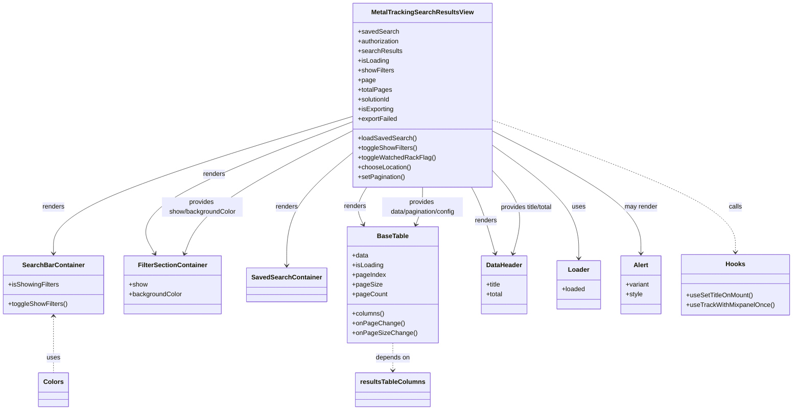

# Diagram: web/portal/src/modules/mt-search-results/MetalTrackingSearchResultsView.js

> Auto-generated by Obscura crawlers

## Mermaid

### SVG

<svg id="container" width="1946.986328125" xmlns="http://www.w3.org/2000/svg" class="classDiagram" height="1016" viewBox="0 0 1946.986328125 1016" role="graphics-document document" aria-roledescription="class"><g><defs><marker id="container_class-aggregationStart" class="marker aggregation class" refX="18" refY="7" markerWidth="190" markerHeight="240" orient="auto"><path d="M 18,7 L9,13 L1,7 L9,1 Z"></path></marker></defs><defs><marker id="container_class-aggregationEnd" class="marker aggregation class" refX="1" refY="7" markerWidth="20" markerHeight="28" orient="auto"><path d="M 18,7 L9,13 L1,7 L9,1 Z"></path></marker></defs><defs><marker id="container_class-extensionStart" class="marker extension class" refX="18" refY="7" markerWidth="190" markerHeight="240" orient="auto"><path d="M 1,7 L18,13 V 1 Z"></path></marker></defs><defs><marker id="container_class-extensionEnd" class="marker extension class" refX="1" refY="7" markerWidth="20" markerHeight="28" orient="auto"><path d="M 1,1 V 13 L18,7 Z"></path></marker></defs><defs><marker id="container_class-compositionStart" class="marker composition class" refX="18" refY="7" markerWidth="190" markerHeight="240" orient="auto"><path d="M 18,7 L9,13 L1,7 L9,1 Z"></path></marker></defs><defs><marker id="container_class-compositionEnd" class="marker composition class" refX="1" refY="7" markerWidth="20" markerHeight="28" orient="auto"><path d="M 18,7 L9,13 L1,7 L9,1 Z"></path></marker></defs><defs><marker id="container_class-dependencyStart" class="marker dependency class" refX="6" refY="7" markerWidth="190" markerHeight="240" orient="auto"><path d="M 5,7 L9,13 L1,7 L9,1 Z"></path></marker></defs><defs><marker id="container_class-dependencyEnd" class="marker dependency class" refX="13" refY="7" markerWidth="20" markerHeight="28" orient="auto"><path d="M 18,7 L9,13 L14,7 L9,1 Z"></path></marker></defs><defs><marker id="container_class-lollipopStart" class="marker lollipop class" refX="13" refY="7" markerWidth="190" markerHeight="240" orient="auto"><circle stroke="black" fill="transparent" cx="7" cy="7" r="6"></circle></marker></defs><defs><marker id="container_class-lollipopEnd" class="marker lollipop class" refX="1" refY="7" markerWidth="190" markerHeight="240" orient="auto"><circle stroke="black" fill="transparent" cx="7" cy="7" r="6"></circle></marker></defs><g class="root"><g class="clusters"></g><g class="edgePaths"><path d="M857.953,287.52L736.548,325.1C615.143,362.68,372.333,437.84,250.928,494.587C129.523,551.333,129.523,589.667,129.523,608.833L129.523,628" id="id_MetalTrackingSearchResultsView_SearchBarContainer_1" class="edge-thickness-normal edge-pattern-solid relation" style=";;;" data-edge="true" data-et="edge" data-id="id_MetalTrackingSearchResultsView_SearchBarContainer_1" data-points="W3sieCI6ODU3Ljk1MzEyNSwieSI6Mjg3LjUxOTU4NjUzMDgyMjV9LHsieCI6MTI5LjUyMzQzNzUsInkiOjUxM30seyJ4IjoxMjkuNTIzNDM3NSwieSI6NjM0fV0=" marker-end="url(#container_class-dependencyEnd)"></path><path d="M857.953,300.752L767.026,336.126C676.099,371.501,494.245,442.251,414.05,496.918C333.856,551.586,355.321,590.171,366.054,609.464L376.787,628.757" id="id_MetalTrackingSearchResultsView_FilterSectionContainer_2" class="edge-thickness-normal edge-pattern-solid relation" style=";;;" data-edge="true" data-et="edge" data-id="id_MetalTrackingSearchResultsView_FilterSectionContainer_2" data-points="W3sieCI6ODU3Ljk1MzEyNSwieSI6MzAwLjc1MTY2NzgzNzA3ODd9LHsieCI6MzEyLjM5MDYyNSwieSI6NTEzfSx7IngiOjM3OS43MDM3MzIxODkxMTkyLCJ5Ijo2MzR9XQ==" marker-end="url(#container_class-dependencyEnd)"></path><path d="M857.953,377.716L831.473,400.264C804.992,422.811,752.031,467.905,725.551,514.619C699.07,561.333,699.07,609.667,699.07,633.833L699.07,658" id="id_MetalTrackingSearchResultsView_SavedSearchContainer_3" class="edge-thickness-normal edge-pattern-solid relation" style=";;;" data-edge="true" data-et="edge" data-id="id_MetalTrackingSearchResultsView_SavedSearchContainer_3" data-points="W3sieCI6ODU3Ljk1MzEyNSwieSI6Mzc3LjcxNjI4OTIzNDE2ODI0fSx7IngiOjY5OS4wNzAzMTI1LCJ5Ijo1MTN9LHsieCI6Njk5LjA3MDMxMjUsInkiOjY2NH1d" marker-end="url(#container_class-dependencyEnd)"></path><path d="M891.173,464L886.401,472.167C881.63,480.333,872.086,496.667,870.622,512.09C869.158,527.513,875.774,542.027,879.082,549.284L882.389,556.54" id="id_MetalTrackingSearchResultsView_BaseTable_4" class="edge-thickness-normal edge-pattern-solid relation" style=";;;" data-edge="true" data-et="edge" data-id="id_MetalTrackingSearchResultsView_BaseTable_4" data-points="W3sieCI6ODkxLjE3MzA1OTU2Njc4NzEsInkiOjQ2NH0seyJ4Ijo4NjIuNTQyOTY4NzUsInkiOjUxM30seyJ4Ijo4ODQuODc3OTk1NDY2MzIxMiwieSI6NTYyfV0=" marker-end="url(#container_class-dependencyEnd)"></path><path d="M1146.004,464L1150.36,472.167C1154.716,480.333,1163.429,496.667,1173.588,524.043C1183.747,551.419,1195.353,589.838,1201.156,609.047L1206.959,628.256" id="id_MetalTrackingSearchResultsView_DataHeader_5" class="edge-thickness-normal edge-pattern-solid relation" style=";;;" data-edge="true" data-et="edge" data-id="id_MetalTrackingSearchResultsView_DataHeader_5" data-points="W3sieCI6MTE0Ni4wMDQzNDM0MTE1NTIzLCJ5Ijo0NjR9LHsieCI6MTE3Mi4xNDA2MjUsInkiOjUxM30seyJ4IjoxMjA4LjY5NDM0MDk5NzQwOTQsInkiOjYzNH1d" marker-end="url(#container_class-dependencyEnd)"></path><path d="M1190.828,352.237L1229.194,379.031C1267.559,405.825,1344.29,459.412,1382.656,507.373C1421.021,555.333,1421.021,597.667,1421.021,618.833L1421.021,640" id="id_MetalTrackingSearchResultsView_Loader_6" class="edge-thickness-normal edge-pattern-solid relation" style=";;;" data-edge="true" data-et="edge" data-id="id_MetalTrackingSearchResultsView_Loader_6" data-points="W3sieCI6MTE5MC44MjgxMjUsInkiOjM1Mi4yMzcwMTU4ODA4MzIyfSx7IngiOjE0MjEuMDIxNDg0Mzc1LCJ5Ijo1MTN9LHsieCI6MTQyMS4wMjE0ODQzNzUsInkiOjY0Nn1d" marker-end="url(#container_class-dependencyEnd)"></path><path d="M1190.828,319.718L1254.871,351.932C1318.913,384.146,1446.999,448.573,1511.041,499.953C1575.084,551.333,1575.084,589.667,1575.084,608.833L1575.084,628" id="id_MetalTrackingSearchResultsView_Alert_7" class="edge-thickness-normal edge-pattern-solid relation" style=";;;" data-edge="true" data-et="edge" data-id="id_MetalTrackingSearchResultsView_Alert_7" data-points="W3sieCI6MTE5MC44MjgxMjUsInkiOjMxOS43MTg0MzczMzkyOTE3fSx7IngiOjE1NzUuMDgzOTg0Mzc1LCJ5Ijo1MTN9LHsieCI6MTU3NS4wODM5ODQzNzUsInkiOjYzNH1d" marker-end="url(#container_class-dependencyEnd)"></path><path d="M1190.828,294.898L1293.549,331.248C1396.27,367.599,1601.712,440.299,1704.433,495.316C1807.154,550.333,1807.154,587.667,1807.154,606.333L1807.154,625" id="id_MetalTrackingSearchResultsView_Hooks_8" class="edge-thickness-normal edge-pattern-dashed relation" style=";;;" data-edge="true" data-et="edge" data-id="id_MetalTrackingSearchResultsView_Hooks_8" data-points="W3sieCI6MTE5MC44MjgxMjUsInkiOjI5NC44OTc5NjUxOTI0Mzk2NH0seyJ4IjoxODA3LjE1NDI5Njg3NSwieSI6NTEzfSx7IngiOjE4MDcuMTU0Mjk2ODc1LCJ5Ijo2MzF9XQ==" marker-end="url(#container_class-dependencyEnd)"></path><path d="M129.523,784L129.523,801.167C129.523,818.333,129.523,852.667,129.523,876C129.523,899.333,129.523,911.667,129.523,917.833L129.523,924" id="id_SearchBarContainer_Colors_9" class="edge-thickness-normal edge-pattern-dashed relation" style=";;;" data-edge="true" data-et="edge" data-id="id_SearchBarContainer_Colors_9" data-points="W3sieCI6MTI5LjUyMzQzNzUsInkiOjc3OH0seyJ4IjoxMjkuNTIzNDM3NSwieSI6ODg3fSx7IngiOjEyOS41MjM0Mzc1LCJ5Ijo5MjR9XQ==" marker-start="url(#container_class-dependencyStart)"></path><path d="M950.516,850L950.516,856.167C950.516,862.333,950.516,874.667,950.516,886C950.516,897.333,950.516,907.667,950.516,912.833L950.516,918" id="id_BaseTable_resultsTableColumns_10" class="edge-thickness-normal edge-pattern-dashed relation" style=";;;" data-edge="true" data-et="edge" data-id="id_BaseTable_resultsTableColumns_10" data-points="W3sieCI6OTUwLjUxNTYyNSwieSI6ODUwfSx7IngiOjk1MC41MTU2MjUsInkiOjg4N30seyJ4Ijo5NTAuNTE1NjI1LCJ5Ijo5MjR9XQ==" marker-end="url(#container_class-dependencyEnd)"></path><path d="M1253.931,628.256L1259.735,609.047C1265.538,589.838,1277.144,551.419,1266.627,515.109C1256.109,478.799,1223.469,444.597,1207.148,427.497L1190.828,410.396" id="id_DataHeader_MetalTrackingSearchResultsView_11" class="edge-thickness-normal edge-pattern-solid relation" style=";;;" data-edge="true" data-et="edge" data-id="id_DataHeader_MetalTrackingSearchResultsView_11" data-points="W3sieCI6MTI1Mi4xOTYyODQwMDI1OTA2LCJ5Ijo2MzR9LHsieCI6MTI4OC43NSwieSI6NTEzfSx7IngiOjExOTAuODI4MTI1LCJ5Ijo0MTAuMzk1ODg2MjgxNjk1MTR9XQ==" marker-start="url(#container_class-dependencyStart)"></path><path d="M1007.78,556.396L1010.548,549.164C1013.317,541.931,1018.854,527.465,1021.622,512.066C1024.391,496.667,1024.391,480.333,1024.391,472.167L1024.391,464" id="id_BaseTable_MetalTrackingSearchResultsView_12" class="edge-thickness-normal edge-pattern-solid relation" style=";;;" data-edge="true" data-et="edge" data-id="id_BaseTable_MetalTrackingSearchResultsView_12" data-points="W3sieCI6MTAwNS42MzQ3OTU5ODQ0NTYsInkiOjU2Mn0seyJ4IjoxMDI0LjM5MDYyNSwieSI6NTEzfSx7IngiOjEwMjQuMzkwNjI1LCJ5Ijo0NjR9XQ==" marker-start="url(#container_class-dependencyStart)"></path><path d="M449.462,628.396L456.824,609.164C464.186,589.931,478.909,551.465,546.991,500.543C615.073,449.621,736.513,386.242,797.233,354.552L857.953,322.863" id="id_FilterSectionContainer_MetalTrackingSearchResultsView_13" class="edge-thickness-normal edge-pattern-solid relation" style=";;;" data-edge="true" data-et="edge" data-id="id_FilterSectionContainer_MetalTrackingSearchResultsView_13" data-points="W3sieCI6NDQ3LjMxNzM5Nzk5MjIyOCwieSI6NjM0fSx7IngiOjQ5My42MzI4MTI1LCJ5Ijo1MTN9LHsieCI6ODU3Ljk1MzEyNSwieSI6MzIyLjg2Mjk0NjU1MzQyNDV9XQ==" marker-start="url(#container_class-dependencyStart)"></path></g><g class="edgeLabels"><g class="edgeLabel" transform="translate(129.5234375, 513)"><g class="label" data-id="id_MetalTrackingSearchResultsView_SearchBarContainer_1" transform="translate(-27.75, -12)"><foreignObject width="55.5" height="24">

renders

</foreignObject></g></g><g class="edgeLabel" transform="translate(520.65111, 431.97731)"><g class="label" data-id="id_MetalTrackingSearchResultsView_FilterSectionContainer_2" transform="translate(-27.75, -12)"><foreignObject width="55.5" height="24">

renders

</foreignObject></g></g><g class="edgeLabel" transform="translate(699.0703125, 513)"><g class="label" data-id="id_MetalTrackingSearchResultsView_SavedSearchContainer_3" transform="translate(-27.75, -12)"><foreignObject width="55.5" height="24">

renders

</foreignObject></g></g><g class="edgeLabel" transform="translate(863.27467, 511.74771)"><g class="label" data-id="id_MetalTrackingSearchResultsView_BaseTable_4" transform="translate(-27.75, -12)"><foreignObject width="55.5" height="24">

renders

</foreignObject></g></g><g class="edgeLabel" transform="translate(1182.38747, 546.91908)"><g class="label" data-id="id_MetalTrackingSearchResultsView_DataHeader_5" transform="translate(-27.75, -12)"><foreignObject width="55.5" height="24">

renders

</foreignObject></g></g><g class="edgeLabel" transform="translate(1421.021484375, 513)"><g class="label" data-id="id_MetalTrackingSearchResultsView_Loader_6" transform="translate(-16.4921875, -12)"><foreignObject width="32.984375" height="24">

uses

</foreignObject></g></g><g class="edgeLabel" transform="translate(1575.083984375, 513)"><g class="label" data-id="id_MetalTrackingSearchResultsView_Alert_7" transform="translate(-41.2734375, -12)"><foreignObject width="82.546875" height="24">

may render

</foreignObject></g></g><g class="edgeLabel" transform="translate(1807.154296875, 513)"><g class="label" data-id="id_MetalTrackingSearchResultsView_Hooks_8" transform="translate(-16.4453125, -12)"><foreignObject width="32.890625" height="24">

calls

</foreignObject></g></g><g class="edgeLabel" transform="translate(129.5234375, 887)"><g class="label" data-id="id_SearchBarContainer_Colors_9" transform="translate(-16.4921875, -12)"><foreignObject width="32.984375" height="24">

uses

</foreignObject></g></g><g class="edgeLabel" transform="translate(950.515625, 887)"><g class="label" data-id="id_BaseTable_resultsTableColumns_10" transform="translate(-42.9453125, -12)"><foreignObject width="85.890625" height="24">

depends on

</foreignObject></g></g><g class="edgeLabel" transform="translate(1283.42313, 507.41842)"><g class="label" data-id="id_DataHeader_MetalTrackingSearchResultsView_11" transform="translate(-68.859375, -12)"><foreignObject width="137.71875" height="24">

provides title/total

</foreignObject></g></g><g class="edgeLabel" transform="translate(1024.390625, 513)"><g class="label" data-id="id_BaseTable_MetalTrackingSearchResultsView_12" transform="translate(-100, -24)"><foreignObject width="200" height="48">

provides data/pagination/config

</foreignObject></g></g><g class="edgeLabel" transform="translate(618.36313, 447.90384)"><g class="label" data-id="id_FilterSectionContainer_MetalTrackingSearchResultsView_13" transform="translate(-100, -24)"><foreignObject width="200" height="48">

provides show/backgroundColor

</foreignObject></g></g></g><g class="nodes"><g class="node default" id="classId-MetalTrackingSearchResultsView-0" transform="translate(1024.390625, 236)"><g class="basic label-container"><path d="M-166.4375 -228 L166.4375 -228 L166.4375 228 L-166.4375 228" stroke="none" stroke-width="0" fill="#ECECFF" style=""></path><path d="M-166.4375 -228 C-82.26368014577474 -228, 1.9101397084505152 -228, 166.4375 -228 M-166.4375 -228 C-82.9753921695538 -228, 0.4867156608924006 -228, 166.4375 -228 M166.4375 -228 C166.4375 -83.19134878988811, 166.4375 61.61730242022378, 166.4375 228 M166.4375 -228 C166.4375 -101.98081014753845, 166.4375 24.038379704923102, 166.4375 228 M166.4375 228 C88.57016141498346 228, 10.70282282996692 228, -166.4375 228 M166.4375 228 C89.59703461889742 228, 12.75656923779485 228, -166.4375 228 M-166.4375 228 C-166.4375 60.11554902820947, -166.4375 -107.76890194358106, -166.4375 -228 M-166.4375 228 C-166.4375 70.26960046170313, -166.4375 -87.46079907659373, -166.4375 -228" stroke="#9370DB" stroke-width="1.3" fill="none" stroke-dasharray="0 0" style=""></path></g><g class="annotation-group text" transform="translate(0, -204)"></g><g class="label-group text" transform="translate(-120.234375, -204)"><g class="label" style="font-weight: bolder" transform="translate(0,-12)"><foreignObject width="240.46875" height="24">

MetalTrackingSearchResultsView

</foreignObject></g></g><g class="members-group text" transform="translate(-154.4375, -156)"><g class="label" style="" transform="translate(0,-12)"><foreignObject width="98.5625" height="24">

+savedSearch

</foreignObject></g><g class="label" style="" transform="translate(0,12)"><foreignObject width="105.421875" height="24">

+authorization

</foreignObject></g><g class="label" style="" transform="translate(0,36)"><foreignObject width="108.328125" height="24">

+searchResults

</foreignObject></g><g class="label" style="" transform="translate(0,60)"><foreignObject width="77.203125" height="24">

+isLoading

</foreignObject></g><g class="label" style="" transform="translate(0,84)"><foreignObject width="89.8125" height="24">

+showFilters

</foreignObject></g><g class="label" style="" transform="translate(0,108)"><foreignObject width="42.65625" height="24">

+page

</foreignObject></g><g class="label" style="" transform="translate(0,132)"><foreignObject width="82.90625" height="24">

+totalPages

</foreignObject></g><g class="label" style="" transform="translate(0,156)"><foreignObject width="82.109375" height="24">

+solutionId

</foreignObject></g><g class="label" style="" transform="translate(0,180)"><foreignObject width="89.296875" height="24">

+isExporting

</foreignObject></g><g class="label" style="" transform="translate(0,204)"><foreignObject width="98.140625" height="24">

+exportFailed

</foreignObject></g></g><g class="methods-group text" transform="translate(-154.4375, 108)"><g class="label" style="" transform="translate(0,-12)"><foreignObject width="142.40625" height="24">

+loadSavedSearch()

</foreignObject></g><g class="label" style="" transform="translate(0,12)"><foreignObject width="146.203125" height="24">

+toggleShowFilters()

</foreignObject></g><g class="label" style="" transform="translate(0,36)"><foreignObject width="188.640625" height="24">

+toggleWatchedRackFlag()

</foreignObject></g><g class="label" style="" transform="translate(0,60)"><foreignObject width="132.375" height="24">

+chooseLocation()

</foreignObject></g><g class="label" style="" transform="translate(0,84)"><foreignObject width="117.203125" height="24">

+setPagination()

</foreignObject></g></g><g class="divider" style=""><path d="M-166.4375 -180 C-39.0988230493612 -180, 88.2398539012776 -180, 166.4375 -180 M-166.4375 -180 C-67.17428076842992 -180, 32.08893846314015 -180, 166.4375 -180" stroke="#9370DB" stroke-width="1.3" fill="none" stroke-dasharray="0 0" style=""></path></g><g class="divider" style=""><path d="M-166.4375 84 C-59.08753837518371 84, 48.262423249632576 84, 166.4375 84 M-166.4375 84 C-94.04425365240125 84, -21.651007304802505 84, 166.4375 84" stroke="#9370DB" stroke-width="1.3" fill="none" stroke-dasharray="0 0" style=""></path></g></g><g class="node default" id="classId-SearchBarContainer-1" transform="translate(129.5234375, 706)"><g class="basic label-container"><path d="M-121.5234375 -72 L121.5234375 -72 L121.5234375 72 L-121.5234375 72" stroke="none" stroke-width="0" fill="#ECECFF" style=""></path><path d="M-121.5234375 -72 C-49.15323582978969 -72, 23.216965840420613 -72, 121.5234375 -72 M-121.5234375 -72 C-62.544628381752226 -72, -3.5658192635044514 -72, 121.5234375 -72 M121.5234375 -72 C121.5234375 -40.34185789600301, 121.5234375 -8.683715792006026, 121.5234375 72 M121.5234375 -72 C121.5234375 -41.68601721245467, 121.5234375 -11.372034424909337, 121.5234375 72 M121.5234375 72 C65.35345995874168 72, 9.183482417483361 72, -121.5234375 72 M121.5234375 72 C26.006706293106305 72, -69.51002491378739 72, -121.5234375 72 M-121.5234375 72 C-121.5234375 19.16687020219844, -121.5234375 -33.66625959560312, -121.5234375 -72 M-121.5234375 72 C-121.5234375 22.571298168906225, -121.5234375 -26.85740366218755, -121.5234375 -72" stroke="#9370DB" stroke-width="1.3" fill="none" stroke-dasharray="0 0" style=""></path></g><g class="annotation-group text" transform="translate(0, -48)"></g><g class="label-group text" transform="translate(-72.84375, -48)"><g class="label" style="font-weight: bolder" transform="translate(0,-12)"><foreignObject width="145.6875" height="24">

SearchBarContainer

</foreignObject></g></g><g class="members-group text" transform="translate(-109.5234375, 0)"><g class="label" style="" transform="translate(0,-12)"><foreignObject width="125.25" height="24">

+isShowingFilters

</foreignObject></g></g><g class="methods-group text" transform="translate(-109.5234375, 48)"><g class="label" style="" transform="translate(0,-12)"><foreignObject width="146.203125" height="24">

+toggleShowFilters()

</foreignObject></g></g><g class="divider" style=""><path d="M-121.5234375 -24 C-32.387137155736895 -24, 56.74916318852621 -24, 121.5234375 -24 M-121.5234375 -24 C-51.1908345168175 -24, 19.141768466364994 -24, 121.5234375 -24" stroke="#9370DB" stroke-width="1.3" fill="none" stroke-dasharray="0 0" style=""></path></g><g class="divider" style=""><path d="M-121.5234375 24 C-44.481433884685046 24, 32.56056973062991 24, 121.5234375 24 M-121.5234375 24 C-71.89237599372265 24, -22.26131448744532 24, 121.5234375 24" stroke="#9370DB" stroke-width="1.3" fill="none" stroke-dasharray="0 0" style=""></path></g></g><g class="node default" id="classId-FilterSectionContainer-2" transform="translate(419.7578125, 706)"><g class="basic label-container"><path d="M-118.7109375 -72 L118.7109375 -72 L118.7109375 72 L-118.7109375 72" stroke="none" stroke-width="0" fill="#ECECFF" style=""></path><path d="M-118.7109375 -72 C-60.82391559222823 -72, -2.9368936844564644 -72, 118.7109375 -72 M-118.7109375 -72 C-68.09910185097004 -72, -17.487266201940102 -72, 118.7109375 -72 M118.7109375 -72 C118.7109375 -32.941022048658475, 118.7109375 6.11795590268305, 118.7109375 72 M118.7109375 -72 C118.7109375 -29.854121050122494, 118.7109375 12.291757899755012, 118.7109375 72 M118.7109375 72 C57.50182630049489 72, -3.7072848990102187 72, -118.7109375 72 M118.7109375 72 C38.647068006629496 72, -41.41680148674101 72, -118.7109375 72 M-118.7109375 72 C-118.7109375 24.671330533461422, -118.7109375 -22.657338933077156, -118.7109375 -72 M-118.7109375 72 C-118.7109375 29.814200314081447, -118.7109375 -12.371599371837107, -118.7109375 -72" stroke="#9370DB" stroke-width="1.3" fill="none" stroke-dasharray="0 0" style=""></path></g><g class="annotation-group text" transform="translate(0, -48)"></g><g class="label-group text" transform="translate(-81.921875, -48)"><g class="label" style="font-weight: bolder" transform="translate(0,-12)"><foreignObject width="163.84375" height="24">

FilterSectionContainer

</foreignObject></g></g><g class="members-group text" transform="translate(-106.7109375, 0)"><g class="label" style="" transform="translate(0,-12)"><foreignObject width="45.65625" height="24">

+show

</foreignObject></g><g class="label" style="" transform="translate(0,12)"><foreignObject width="131.5" height="24">

+backgroundColor

</foreignObject></g></g><g class="methods-group text" transform="translate(-106.7109375, 72)"></g><g class="divider" style=""><path d="M-118.7109375 -24 C-70.60013617051011 -24, -22.489334841020224 -24, 118.7109375 -24 M-118.7109375 -24 C-57.18909877146669 -24, 4.332739957066622 -24, 118.7109375 -24" stroke="#9370DB" stroke-width="1.3" fill="none" stroke-dasharray="0 0" style=""></path></g><g class="divider" style=""><path d="M-118.7109375 48 C-62.92086204167698 48, -7.1307865833539665 48, 118.7109375 48 M-118.7109375 48 C-61.02271097958005 48, -3.3344844591600946 48, 118.7109375 48" stroke="#9370DB" stroke-width="1.3" fill="none" stroke-dasharray="0 0" style=""></path></g></g><g class="node default" id="classId-SavedSearchContainer-3" transform="translate(699.0703125, 706)"><g class="basic label-container"><path d="M-94.4140625 -42 L94.4140625 -42 L94.4140625 42 L-94.4140625 42" stroke="none" stroke-width="0" fill="#ECECFF" style=""></path><path d="M-94.4140625 -42 C-50.246804494093105 -42, -6.07954648818621 -42, 94.4140625 -42 M-94.4140625 -42 C-45.16682941052936 -42, 4.0804036789412805 -42, 94.4140625 -42 M94.4140625 -42 C94.4140625 -20.1846508513081, 94.4140625 1.6306982973838018, 94.4140625 42 M94.4140625 -42 C94.4140625 -22.810532861860967, 94.4140625 -3.6210657237219337, 94.4140625 42 M94.4140625 42 C47.36542131032613 42, 0.316780120652254 42, -94.4140625 42 M94.4140625 42 C36.61532439498125 42, -21.1834137100375 42, -94.4140625 42 M-94.4140625 42 C-94.4140625 18.20831959943896, -94.4140625 -5.583360801122083, -94.4140625 -42 M-94.4140625 42 C-94.4140625 20.786546202187886, -94.4140625 -0.426907595624229, -94.4140625 -42" stroke="#9370DB" stroke-width="1.3" fill="none" stroke-dasharray="0 0" style=""></path></g><g class="annotation-group text" transform="translate(0, -18)"></g><g class="label-group text" transform="translate(-82.4140625, -18)"><g class="label" style="font-weight: bolder" transform="translate(0,-12)"><foreignObject width="164.828125" height="24">

SavedSearchContainer

</foreignObject></g></g><g class="members-group text" transform="translate(-82.4140625, 30)"></g><g class="methods-group text" transform="translate(-82.4140625, 60)"></g><g class="divider" style=""><path d="M-94.4140625 6 C-20.334165064751332 6, 53.745732370497336 6, 94.4140625 6 M-94.4140625 6 C-19.19364125909192 6, 56.02677998181616 6, 94.4140625 6" stroke="#9370DB" stroke-width="1.3" fill="none" stroke-dasharray="0 0" style=""></path></g><g class="divider" style=""><path d="M-94.4140625 24 C-21.06493680414546 24, 52.28418889170908 24, 94.4140625 24 M-94.4140625 24 C-47.20844679787617 24, -0.002831095752341639 24, 94.4140625 24" stroke="#9370DB" stroke-width="1.3" fill="none" stroke-dasharray="0 0" style=""></path></g></g><g class="node default" id="classId-BaseTable-4" transform="translate(950.515625, 706)"><g class="basic label-container"><path d="M-107.03125 -144 L107.03125 -144 L107.03125 144 L-107.03125 144" stroke="none" stroke-width="0" fill="#ECECFF" style=""></path><path d="M-107.03125 -144 C-47.11884051852062 -144, 12.793568962958759 -144, 107.03125 -144 M-107.03125 -144 C-29.12862132663038 -144, 48.77400734673924 -144, 107.03125 -144 M107.03125 -144 C107.03125 -73.51364635140838, 107.03125 -3.0272927028167658, 107.03125 144 M107.03125 -144 C107.03125 -45.46241100983397, 107.03125 53.07517798033206, 107.03125 144 M107.03125 144 C23.97028780205126 144, -59.09067439589748 144, -107.03125 144 M107.03125 144 C53.72983150639445 144, 0.4284130127888943 144, -107.03125 144 M-107.03125 144 C-107.03125 61.477944918571964, -107.03125 -21.04411016285607, -107.03125 -144 M-107.03125 144 C-107.03125 40.64470738044109, -107.03125 -62.71058523911782, -107.03125 -144" stroke="#9370DB" stroke-width="1.3" fill="none" stroke-dasharray="0 0" style=""></path></g><g class="annotation-group text" transform="translate(0, -120)"></g><g class="label-group text" transform="translate(-37.359375, -120)"><g class="label" style="font-weight: bolder" transform="translate(0,-12)"><foreignObject width="74.71875" height="24">

BaseTable

</foreignObject></g></g><g class="members-group text" transform="translate(-95.03125, -72)"><g class="label" style="" transform="translate(0,-12)"><foreignObject width="40.625" height="24">

+data

</foreignObject></g><g class="label" style="" transform="translate(0,12)"><foreignObject width="77.203125" height="24">

+isLoading

</foreignObject></g><g class="label" style="" transform="translate(0,36)"><foreignObject width="82.65625" height="24">

+pageIndex

</foreignObject></g><g class="label" style="" transform="translate(0,60)"><foreignObject width="71.5" height="24">

+pageSize

</foreignObject></g><g class="label" style="" transform="translate(0,84)"><foreignObject width="85.109375" height="24">

+pageCount

</foreignObject></g></g><g class="methods-group text" transform="translate(-95.03125, 72)"><g class="label" style="" transform="translate(0,-12)"><foreignObject width="79.59375" height="24">

+columns()

</foreignObject></g><g class="label" style="" transform="translate(0,12)"><foreignObject width="123.859375" height="24">

+onPageChange()

</foreignObject></g><g class="label" style="" transform="translate(0,36)"><foreignObject width="152.703125" height="24">

+onPageSizeChange()

</foreignObject></g></g><g class="divider" style=""><path d="M-107.03125 -96 C-61.60465842834652 -96, -16.178066856693036 -96, 107.03125 -96 M-107.03125 -96 C-33.44100941591874 -96, 40.149231168162515 -96, 107.03125 -96" stroke="#9370DB" stroke-width="1.3" fill="none" stroke-dasharray="0 0" style=""></path></g><g class="divider" style=""><path d="M-107.03125 48 C-31.669404365153596 48, 43.69244126969281 48, 107.03125 48 M-107.03125 48 C-47.06011448535317 48, 12.911021029293664 48, 107.03125 48" stroke="#9370DB" stroke-width="1.3" fill="none" stroke-dasharray="0 0" style=""></path></g></g><g class="node default" id="classId-DataHeader-5" transform="translate(1230.4453125, 706)"><g class="basic label-container"><path d="M-55.3671875 -72 L55.3671875 -72 L55.3671875 72 L-55.3671875 72" stroke="none" stroke-width="0" fill="#ECECFF" style=""></path><path d="M-55.3671875 -72 C-30.410926856286032 -72, -5.454666212572064 -72, 55.3671875 -72 M-55.3671875 -72 C-26.928661620985338 -72, 1.5098642580293244 -72, 55.3671875 -72 M55.3671875 -72 C55.3671875 -30.951100142920268, 55.3671875 10.097799714159464, 55.3671875 72 M55.3671875 -72 C55.3671875 -26.16754773812616, 55.3671875 19.66490452374768, 55.3671875 72 M55.3671875 72 C25.771276957591887 72, -3.824633584816226 72, -55.3671875 72 M55.3671875 72 C14.89638102667945 72, -25.5744254466411 72, -55.3671875 72 M-55.3671875 72 C-55.3671875 36.79134218711796, -55.3671875 1.5826843742359245, -55.3671875 -72 M-55.3671875 72 C-55.3671875 15.172441521688462, -55.3671875 -41.655116956623075, -55.3671875 -72" stroke="#9370DB" stroke-width="1.3" fill="none" stroke-dasharray="0 0" style=""></path></g><g class="annotation-group text" transform="translate(0, -48)"></g><g class="label-group text" transform="translate(-43.3671875, -48)"><g class="label" style="font-weight: bolder" transform="translate(0,-12)"><foreignObject width="86.734375" height="24">

DataHeader

</foreignObject></g></g><g class="members-group text" transform="translate(-43.3671875, 0)"><g class="label" style="" transform="translate(0,-12)"><foreignObject width="37.140625" height="24">

+title

</foreignObject></g><g class="label" style="" transform="translate(0,12)"><foreignObject width="41.6875" height="24">

+total

</foreignObject></g></g><g class="methods-group text" transform="translate(-43.3671875, 72)"></g><g class="divider" style=""><path d="M-55.3671875 -24 C-16.50475993985092 -24, 22.35766762029816 -24, 55.3671875 -24 M-55.3671875 -24 C-13.305428354290974 -24, 28.75633079141805 -24, 55.3671875 -24" stroke="#9370DB" stroke-width="1.3" fill="none" stroke-dasharray="0 0" style=""></path></g><g class="divider" style=""><path d="M-55.3671875 48 C-12.28255441489469 48, 30.80207867021062 48, 55.3671875 48 M-55.3671875 48 C-26.875961283762695 48, 1.6152649324746093 48, 55.3671875 48" stroke="#9370DB" stroke-width="1.3" fill="none" stroke-dasharray="0 0" style=""></path></g></g><g class="node default" id="classId-Loader-6" transform="translate(1421.021484375, 706)"><g class="basic label-container"><path d="M-53.82421875 -60 L53.82421875 -60 L53.82421875 60 L-53.82421875 60" stroke="none" stroke-width="0" fill="#ECECFF" style=""></path><path d="M-53.82421875 -60 C-25.396745581895868 -60, 3.0307275862082648 -60, 53.82421875 -60 M-53.82421875 -60 C-19.47360255588294 -60, 14.877013638234118 -60, 53.82421875 -60 M53.82421875 -60 C53.82421875 -23.703522328725214, 53.82421875 12.592955342549573, 53.82421875 60 M53.82421875 -60 C53.82421875 -20.13223479286669, 53.82421875 19.73553041426662, 53.82421875 60 M53.82421875 60 C19.61429424183728 60, -14.595630266325443 60, -53.82421875 60 M53.82421875 60 C19.046501759005253 60, -15.731215231989495 60, -53.82421875 60 M-53.82421875 60 C-53.82421875 31.27367017814029, -53.82421875 2.5473403562805785, -53.82421875 -60 M-53.82421875 60 C-53.82421875 16.04766170441114, -53.82421875 -27.90467659117772, -53.82421875 -60" stroke="#9370DB" stroke-width="1.3" fill="none" stroke-dasharray="0 0" style=""></path></g><g class="annotation-group text" transform="translate(0, -36)"></g><g class="label-group text" transform="translate(-25.3046875, -36)"><g class="label" style="font-weight: bolder" transform="translate(0,-12)"><foreignObject width="50.609375" height="24">

Loader

</foreignObject></g></g><g class="members-group text" transform="translate(-41.82421875, 12)"><g class="label" style="" transform="translate(0,-12)"><foreignObject width="58.34375" height="24">

+loaded

</foreignObject></g></g><g class="methods-group text" transform="translate(-41.82421875, 60)"></g><g class="divider" style=""><path d="M-53.82421875 -12 C-17.195963702267115 -12, 19.43229134546577 -12, 53.82421875 -12 M-53.82421875 -12 C-18.167205649546332 -12, 17.489807450907335 -12, 53.82421875 -12" stroke="#9370DB" stroke-width="1.3" fill="none" stroke-dasharray="0 0" style=""></path></g><g class="divider" style=""><path d="M-53.82421875 36 C-12.185893965897563 36, 29.452430818204874 36, 53.82421875 36 M-53.82421875 36 C-24.007986315732023 36, 5.808246118535955 36, 53.82421875 36" stroke="#9370DB" stroke-width="1.3" fill="none" stroke-dasharray="0 0" style=""></path></g></g><g class="node default" id="classId-Alert-7" transform="translate(1575.083984375, 706)"><g class="basic label-container"><path d="M-50.23828125 -72 L50.23828125 -72 L50.23828125 72 L-50.23828125 72" stroke="none" stroke-width="0" fill="#ECECFF" style=""></path><path d="M-50.23828125 -72 C-22.651721592758676 -72, 4.934838064482648 -72, 50.23828125 -72 M-50.23828125 -72 C-19.033480927174285 -72, 12.17131939565143 -72, 50.23828125 -72 M50.23828125 -72 C50.23828125 -42.20706390281572, 50.23828125 -12.414127805631438, 50.23828125 72 M50.23828125 -72 C50.23828125 -41.911001307622485, 50.23828125 -11.822002615244976, 50.23828125 72 M50.23828125 72 C16.77823874099493 72, -16.68180376801014 72, -50.23828125 72 M50.23828125 72 C20.054655975345568 72, -10.128969299308864 72, -50.23828125 72 M-50.23828125 72 C-50.23828125 43.14691720389182, -50.23828125 14.293834407783628, -50.23828125 -72 M-50.23828125 72 C-50.23828125 34.73981866764748, -50.23828125 -2.520362664705047, -50.23828125 -72" stroke="#9370DB" stroke-width="1.3" fill="none" stroke-dasharray="0 0" style=""></path></g><g class="annotation-group text" transform="translate(0, -48)"></g><g class="label-group text" transform="translate(-17.7734375, -48)"><g class="label" style="font-weight: bolder" transform="translate(0,-12)"><foreignObject width="35.546875" height="24">

Alert

</foreignObject></g></g><g class="members-group text" transform="translate(-38.23828125, 0)"><g class="label" style="" transform="translate(0,-12)"><foreignObject width="58.703125" height="24">

+variant

</foreignObject></g><g class="label" style="" transform="translate(0,12)"><foreignObject width="42.359375" height="24">

+style

</foreignObject></g></g><g class="methods-group text" transform="translate(-38.23828125, 72)"></g><g class="divider" style=""><path d="M-50.23828125 -24 C-22.380763336617676 -24, 5.476754576764648 -24, 50.23828125 -24 M-50.23828125 -24 C-12.150116571301652 -24, 25.938048107396696 -24, 50.23828125 -24" stroke="#9370DB" stroke-width="1.3" fill="none" stroke-dasharray="0 0" style=""></path></g><g class="divider" style=""><path d="M-50.23828125 48 C-17.54458980083931 48, 15.149101648321377 48, 50.23828125 48 M-50.23828125 48 C-12.797329842308109 48, 24.643621565383782 48, 50.23828125 48" stroke="#9370DB" stroke-width="1.3" fill="none" stroke-dasharray="0 0" style=""></path></g></g><g class="node default" id="classId-Hooks-8" transform="translate(1807.154296875, 706)"><g class="basic label-container"><path d="M-131.83203125 -75 L131.83203125 -75 L131.83203125 75 L-131.83203125 75" stroke="none" stroke-width="0" fill="#ECECFF" style=""></path><path d="M-131.83203125 -75 C-73.30260466388552 -75, -14.773178077771036 -75, 131.83203125 -75 M-131.83203125 -75 C-56.259924429406794 -75, 19.31218239118641 -75, 131.83203125 -75 M131.83203125 -75 C131.83203125 -30.788209257845537, 131.83203125 13.423581484308926, 131.83203125 75 M131.83203125 -75 C131.83203125 -43.48076780456387, 131.83203125 -11.961535609127743, 131.83203125 75 M131.83203125 75 C71.03572730084805 75, 10.239423351696104 75, -131.83203125 75 M131.83203125 75 C48.70286395229846 75, -34.426303345403085 75, -131.83203125 75 M-131.83203125 75 C-131.83203125 21.70689385697918, -131.83203125 -31.586212286041643, -131.83203125 -75 M-131.83203125 75 C-131.83203125 27.721004751467497, -131.83203125 -19.557990497065006, -131.83203125 -75" stroke="#9370DB" stroke-width="1.3" fill="none" stroke-dasharray="0 0" style=""></path></g><g class="annotation-group text" transform="translate(0, -51)"></g><g class="label-group text" transform="translate(-22.9140625, -51)"><g class="label" style="font-weight: bolder" transform="translate(0,-12)"><foreignObject width="45.828125" height="24">

Hooks

</foreignObject></g></g><g class="members-group text" transform="translate(-119.83203125, -3)"></g><g class="methods-group text" transform="translate(-119.83203125, 27)"><g class="label" style="" transform="translate(0,-12)"><foreignObject width="165.515625" height="24">

+useSetTitleOnMount()

</foreignObject></g><g class="label" style="" transform="translate(0,12)"><foreignObject width="216.75" height="24">

+useTrackWithMixpanelOnce()

</foreignObject></g></g><g class="divider" style=""><path d="M-131.83203125 -27 C-59.0818415052599 -27, 13.668348239480196 -27, 131.83203125 -27 M-131.83203125 -27 C-41.849399598649256 -27, 48.13323205270149 -27, 131.83203125 -27" stroke="#9370DB" stroke-width="1.3" fill="none" stroke-dasharray="0 0" style=""></path></g><g class="divider" style=""><path d="M-131.83203125 -3 C-74.06009773456184 -3, -16.288164219123672 -3, 131.83203125 -3 M-131.83203125 -3 C-75.30221149073367 -3, -18.772391731467337 -3, 131.83203125 -3" stroke="#9370DB" stroke-width="1.3" fill="none" stroke-dasharray="0 0" style=""></path></g></g><g class="node default" id="classId-Colors-9" transform="translate(129.5234375, 966)"><g class="basic label-container"><path d="M-35.1015625 -42 L35.1015625 -42 L35.1015625 42 L-35.1015625 42" stroke="none" stroke-width="0" fill="#ECECFF" style=""></path><path d="M-35.1015625 -42 C-20.51256479814862 -42, -5.923567096297241 -42, 35.1015625 -42 M-35.1015625 -42 C-19.93199314545805 -42, -4.762423790916099 -42, 35.1015625 -42 M35.1015625 -42 C35.1015625 -9.875301556257519, 35.1015625 22.249396887484963, 35.1015625 42 M35.1015625 -42 C35.1015625 -9.165550859228318, 35.1015625 23.668898281543363, 35.1015625 42 M35.1015625 42 C14.898590631358338 42, -5.304381237283323 42, -35.1015625 42 M35.1015625 42 C16.355759609398646 42, -2.3900432812027077 42, -35.1015625 42 M-35.1015625 42 C-35.1015625 24.32060293629359, -35.1015625 6.641205872587179, -35.1015625 -42 M-35.1015625 42 C-35.1015625 16.80754391347949, -35.1015625 -8.384912173041023, -35.1015625 -42" stroke="#9370DB" stroke-width="1.3" fill="none" stroke-dasharray="0 0" style=""></path></g><g class="annotation-group text" transform="translate(0, -18)"></g><g class="label-group text" transform="translate(-23.1015625, -18)"><g class="label" style="font-weight: bolder" transform="translate(0,-12)"><foreignObject width="46.203125" height="24">

Colors

</foreignObject></g></g><g class="members-group text" transform="translate(-23.1015625, 30)"></g><g class="methods-group text" transform="translate(-23.1015625, 60)"></g><g class="divider" style=""><path d="M-35.1015625 6 C-8.676956741112363 6, 17.747649017775274 6, 35.1015625 6 M-35.1015625 6 C-11.866917834085722 6, 11.367726831828556 6, 35.1015625 6" stroke="#9370DB" stroke-width="1.3" fill="none" stroke-dasharray="0 0" style=""></path></g><g class="divider" style=""><path d="M-35.1015625 24 C-17.244549161631248 24, 0.6124641767375039 24, 35.1015625 24 M-35.1015625 24 C-13.960537274526374 24, 7.180487950947253 24, 35.1015625 24" stroke="#9370DB" stroke-width="1.3" fill="none" stroke-dasharray="0 0" style=""></path></g></g><g class="node default" id="classId-resultsTableColumns-10" transform="translate(950.515625, 966)"><g class="basic label-container"><path d="M-88.2890625 -42 L88.2890625 -42 L88.2890625 42 L-88.2890625 42" stroke="none" stroke-width="0" fill="#ECECFF" style=""></path><path d="M-88.2890625 -42 C-44.74385049828633 -42, -1.1986384965726558 -42, 88.2890625 -42 M-88.2890625 -42 C-45.467444688789655 -42, -2.64582687757931 -42, 88.2890625 -42 M88.2890625 -42 C88.2890625 -13.09210008061611, 88.2890625 15.81579983876778, 88.2890625 42 M88.2890625 -42 C88.2890625 -8.624932202257867, 88.2890625 24.750135595484267, 88.2890625 42 M88.2890625 42 C52.31363373161942 42, 16.338204963238837 42, -88.2890625 42 M88.2890625 42 C46.45619789068329 42, 4.623333281366584 42, -88.2890625 42 M-88.2890625 42 C-88.2890625 11.978247413634595, -88.2890625 -18.04350517273081, -88.2890625 -42 M-88.2890625 42 C-88.2890625 16.378806185385148, -88.2890625 -9.242387629229704, -88.2890625 -42" stroke="#9370DB" stroke-width="1.3" fill="none" stroke-dasharray="0 0" style=""></path></g><g class="annotation-group text" transform="translate(0, -18)"></g><g class="label-group text" transform="translate(-76.2890625, -18)"><g class="label" style="font-weight: bolder" transform="translate(0,-12)"><foreignObject width="152.578125" height="24">

resultsTableColumns

</foreignObject></g></g><g class="members-group text" transform="translate(-76.2890625, 30)"></g><g class="methods-group text" transform="translate(-76.2890625, 60)"></g><g class="divider" style=""><path d="M-88.2890625 6 C-51.87100140498849 6, -15.45294030997698 6, 88.2890625 6 M-88.2890625 6 C-35.59433202800964 6, 17.100398443980723 6, 88.2890625 6" stroke="#9370DB" stroke-width="1.3" fill="none" stroke-dasharray="0 0" style=""></path></g><g class="divider" style=""><path d="M-88.2890625 24 C-37.83428346174584 24, 12.620495576508318 24, 88.2890625 24 M-88.2890625 24 C-36.157504816265714 24, 15.974052867468572 24, 88.2890625 24" stroke="#9370DB" stroke-width="1.3" fill="none" stroke-dasharray="0 0" style=""></path></g></g></g></g></g></svg>
