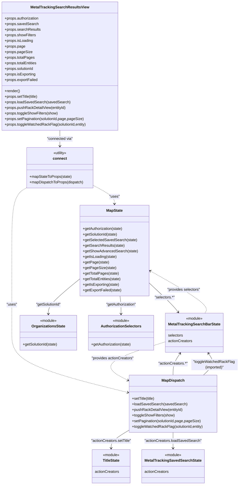

# Diagram: web/portal/src/modules/mt-search-results/MetalTrackingSearchResultsViewContainer.js

> Auto-generated by Obscura crawlers

## Mermaid

### SVG

<svg id="container" width="1026.5435791015625" xmlns="http://www.w3.org/2000/svg" class="classDiagram" height="2084" viewBox="0 0 1026.5435791015625 2084" role="graphics-document document" aria-roledescription="class"><g><defs><marker id="container_class-aggregationStart" class="marker aggregation class" refX="18" refY="7" markerWidth="190" markerHeight="240" orient="auto"><path d="M 18,7 L9,13 L1,7 L9,1 Z"></path></marker></defs><defs><marker id="container_class-aggregationEnd" class="marker aggregation class" refX="1" refY="7" markerWidth="20" markerHeight="28" orient="auto"><path d="M 18,7 L9,13 L1,7 L9,1 Z"></path></marker></defs><defs><marker id="container_class-extensionStart" class="marker extension class" refX="18" refY="7" markerWidth="190" markerHeight="240" orient="auto"><path d="M 1,7 L18,13 V 1 Z"></path></marker></defs><defs><marker id="container_class-extensionEnd" class="marker extension class" refX="1" refY="7" markerWidth="20" markerHeight="28" orient="auto"><path d="M 1,1 V 13 L18,7 Z"></path></marker></defs><defs><marker id="container_class-compositionStart" class="marker composition class" refX="18" refY="7" markerWidth="190" markerHeight="240" orient="auto"><path d="M 18,7 L9,13 L1,7 L9,1 Z"></path></marker></defs><defs><marker id="container_class-compositionEnd" class="marker composition class" refX="1" refY="7" markerWidth="20" markerHeight="28" orient="auto"><path d="M 18,7 L9,13 L1,7 L9,1 Z"></path></marker></defs><defs><marker id="container_class-dependencyStart" class="marker dependency class" refX="6" refY="7" markerWidth="190" markerHeight="240" orient="auto"><path d="M 5,7 L9,13 L1,7 L9,1 Z"></path></marker></defs><defs><marker id="container_class-dependencyEnd" class="marker dependency class" refX="13" refY="7" markerWidth="20" markerHeight="28" orient="auto"><path d="M 18,7 L9,13 L14,7 L9,1 Z"></path></marker></defs><defs><marker id="container_class-lollipopStart" class="marker lollipop class" refX="13" refY="7" markerWidth="190" markerHeight="240" orient="auto"><circle stroke="black" fill="transparent" cx="7" cy="7" r="6"></circle></marker></defs><defs><marker id="container_class-lollipopEnd" class="marker lollipop class" refX="1" refY="7" markerWidth="190" markerHeight="240" orient="auto"><circle stroke="black" fill="transparent" cx="7" cy="7" r="6"></circle></marker></defs><g class="root"><g class="clusters"></g><g class="edgePaths"><path d="M256.797,560L256.797,566.167C256.797,572.333,256.797,584.667,256.797,596C256.797,607.333,256.797,617.667,256.797,622.833L256.797,628" id="id_MetalTrackingSearchResultsView_connect_1" class="edge-thickness-normal edge-pattern-solid relation" style=";;;" data-edge="true" data-et="edge" data-id="id_MetalTrackingSearchResultsView_connect_1" data-points="W3sieCI6MjU2Ljc5Njg3NSwieSI6NTYwfSx7IngiOjI1Ni43OTY4NzUsInkiOjU5N30seyJ4IjoyNTYuNzk2ODc1LCJ5Ijo2MzR9XQ==" marker-end="url(#container_class-dependencyEnd)"></path><path d="M400.484,796.377L415.932,804.481C431.38,812.585,462.276,828.792,477.724,842.063C493.172,855.333,493.172,865.667,493.172,870.833L493.172,876" id="id_connect_MapState_2" class="edge-thickness-normal edge-pattern-dashed relation" style=";;;" data-edge="true" data-et="edge" data-id="id_connect_MapState_2" data-points="W3sieCI6NDAwLjQ4NDM3NSwieSI6Nzk2LjM3NzA0OTE4MDMyNzh9LHsieCI6NDkzLjE3MTg3NSwieSI6ODQ1fSx7IngiOjQ5My4xNzE4NzUsInkiOjg4Mn1d" marker-end="url(#container_class-dependencyEnd)"></path><path d="M113.109,805.944L102.098,812.453C91.087,818.962,69.065,831.981,58.054,877.157C47.043,922.333,47.043,999.667,47.043,1077C47.043,1154.333,47.043,1231.667,47.043,1290.5C47.043,1349.333,47.043,1389.667,47.043,1432C47.043,1474.333,47.043,1518.667,129.817,1561.399C212.592,1604.131,378.14,1645.261,460.914,1665.827L543.689,1686.392" id="id_connect_MapDispatch_3" class="edge-thickness-normal edge-pattern-dashed relation" style=";;;" data-edge="true" data-et="edge" data-id="id_connect_MapDispatch_3" data-points="W3sieCI6MTEzLjEwOTM3NSwieSI6ODA1Ljk0MzU5MDg4OTYyMTR9LHsieCI6NDcuMDQyOTY4NzUsInkiOjg0NX0seyJ4Ijo0Ny4wNDI5Njg3NSwieSI6MTA3N30seyJ4Ijo0Ny4wNDI5Njg3NSwieSI6MTMwOX0seyJ4Ijo0Ny4wNDI5Njg3NSwieSI6MTQzMH0seyJ4Ijo0Ny4wNDI5Njg3NSwieSI6MTU2M30seyJ4Ijo1NDkuNTExNzE4NzUsInkiOjE2ODcuODM4OTI4ODI1MzQxNn1d" marker-end="url(#container_class-dependencyEnd)"></path><path d="M515.547,1272L516.255,1278.167C516.963,1284.333,518.378,1296.667,519.085,1309.5C519.793,1322.333,519.793,1335.667,519.793,1342.333L519.793,1349" id="id_MapState_AuthorizationSelectors_4" class="edge-thickness-normal edge-pattern-solid relation" style=";;;" data-edge="true" data-et="edge" data-id="id_MapState_AuthorizationSelectors_4" data-points="W3sieCI6NTE1LjU0NzM2MzI4MTI1LCJ5IjoxMjcyfSx7IngiOjUxOS43OTI5Njg3NSwieSI6MTMwOX0seyJ4Ijo1MTkuNzkyOTY4NzUsInkiOjEzNTV9XQ==" marker-end="url(#container_class-dependencyEnd)"></path><path d="M346.445,1195.193L322.898,1214.161C299.352,1233.129,252.258,1271.064,228.711,1296.699C205.164,1322.333,205.164,1335.667,205.164,1342.333L205.164,1349" id="id_MapState_OrganizationsState_5" class="edge-thickness-normal edge-pattern-solid relation" style=";;;" data-edge="true" data-et="edge" data-id="id_MapState_OrganizationsState_5" data-points="W3sieCI6MzQ2LjQ0NTMxMjUsInkiOjExOTUuMTkzMTkxMzczOTMyfSx7IngiOjIwNS4xNjQwNjI1LCJ5IjoxMzA5fSx7IngiOjIwNS4xNjQwNjI1LCJ5IjoxMzU1fV0=" marker-end="url(#container_class-dependencyEnd)"></path><path d="M639.898,1214.538L656.694,1230.281C673.49,1246.025,707.081,1277.513,727.889,1298.622C748.697,1319.732,756.721,1330.463,760.734,1335.829L764.746,1341.195" id="id_MapState_MetalTrackingSearchBarState_6" class="edge-thickness-normal edge-pattern-solid relation" style=";;;" data-edge="true" data-et="edge" data-id="id_MapState_MetalTrackingSearchBarState_6" data-points="W3sieCI6NjM5Ljg5ODQzNzUsInkiOjEyMTQuNTM3NjI2MjYyNjI2Mn0seyJ4Ijo3NDAuNjcxODc1LCJ5IjoxMzA5fSx7IngiOjc2OC4zMzk0NTYzNTMzMDU4LCJ5IjoxMzQ2fV0=" marker-end="url(#container_class-dependencyEnd)"></path><path d="M549.512,1850.747L537.416,1858.122C525.32,1865.498,501.129,1880.249,489.033,1892.791C476.938,1905.333,476.938,1915.667,476.938,1920.833L476.938,1926" id="id_MapDispatch_TitleState_7" class="edge-thickness-normal edge-pattern-solid relation" style=";;;" data-edge="true" data-et="edge" data-id="id_MapDispatch_TitleState_7" data-points="W3sieCI6NTQ5LjUxMTcxODc1LCJ5IjoxODUwLjc0NjUwNTI5MjMwNDh9LHsieCI6NDc2LjkzNzUsInkiOjE4OTV9LHsieCI6NDc2LjkzNzUsInkiOjE5MzJ9XQ==" marker-end="url(#container_class-dependencyEnd)"></path><path d="M739.332,1858L739.332,1864.167C739.332,1870.333,739.332,1882.667,739.332,1894C739.332,1905.333,739.332,1915.667,739.332,1920.833L739.332,1926" id="id_MapDispatch_MetalTrackingSavedSearchState_8" class="edge-thickness-normal edge-pattern-solid relation" style=";;;" data-edge="true" data-et="edge" data-id="id_MapDispatch_MetalTrackingSavedSearchState_8" data-points="W3sieCI6NzM5LjMzMjAzMTI1LCJ5IjoxODU4fSx7IngiOjczOS4zMzIwMzEyNSwieSI6MTg5NX0seyJ4Ijo3MzkuMzMyMDMxMjUsInkiOjE5MzJ9XQ==" marker-end="url(#container_class-dependencyEnd)"></path><path d="M739.332,1612L739.332,1603.833C739.332,1595.667,739.332,1579.333,744.402,1563.823C749.472,1548.313,759.612,1533.625,764.682,1526.281L769.752,1518.938" id="id_MapDispatch_MetalTrackingSearchBarState_9" class="edge-thickness-normal edge-pattern-solid relation" style=";;;" data-edge="true" data-et="edge" data-id="id_MapDispatch_MetalTrackingSearchBarState_9" data-points="W3sieCI6NzM5LjMzMjAzMTI1LCJ5IjoxNjEyfSx7IngiOjczOS4zMzIwMzEyNSwieSI6MTU2M30seyJ4Ijo3NzMuMTYwNTY3NDM0MjEwNSwieSI6MTUxNH1d" marker-end="url(#container_class-dependencyEnd)"></path><path d="M870.656,1612L879.376,1603.833C888.095,1595.667,905.534,1579.333,909.183,1563.823C912.833,1548.313,902.693,1533.625,897.623,1526.281L892.553,1518.938" id="id_MapDispatch_MetalTrackingSearchBarState_10" class="edge-thickness-normal edge-pattern-solid relation" style=";;;" data-edge="true" data-et="edge" data-id="id_MapDispatch_MetalTrackingSearchBarState_10" data-points="W3sieCI6ODcwLjY1NjQzMTY4NjA0NjUsInkiOjE2MTJ9LHsieCI6OTIyLjk3MjY1NjI1LCJ5IjoxNTYzfSx7IngiOjg4OS4xNDQxMjAwNjU3ODk1LCJ5IjoxNTE0fV0=" marker-end="url(#container_class-dependencyEnd)"></path><path d="M878.421,1346L881.891,1339.833C885.362,1333.667,892.302,1321.333,853.416,1290.968C814.531,1260.602,729.819,1212.204,687.464,1188.005L645.108,1163.806" id="id_MetalTrackingSearchBarState_MapState_11" class="edge-thickness-normal edge-pattern-dashed relation" style=";;;" data-edge="true" data-et="edge" data-id="id_MetalTrackingSearchBarState_MapState_11" data-points="W3sieCI6ODc4LjQyMTMyNjE4ODAxNjYsInkiOjEzNDZ9LHsieCI6ODk5LjI0MjE4NzUsInkiOjEzMDl9LHsieCI6NjM5Ljg5ODQzNzUsInkiOjExNjAuODI5MjMyMTYwMzc4NX1d" marker-end="url(#container_class-dependencyEnd)"></path><path d="M711.301,1467.606L660.63,1483.505C609.96,1499.404,508.618,1531.202,480.766,1558.92C452.913,1586.639,498.548,1610.277,521.366,1622.097L544.184,1633.916" id="id_MetalTrackingSearchBarState_MapDispatch_12" class="edge-thickness-normal edge-pattern-dashed relation" style=";;;" data-edge="true" data-et="edge" data-id="id_MetalTrackingSearchBarState_MapDispatch_12" data-points="W3sieCI6NzExLjMwMDc4MTI1LCJ5IjoxNDY3LjYwNjAzNDM1NTY0NzR9LHsieCI6NDA3LjI3NzM0Mzc1LCJ5IjoxNTYzfSx7IngiOjU0OS41MTE3MTg3NSwieSI6MTYzNi42NzU1NTIzMTM5NTQzfV0=" marker-end="url(#container_class-dependencyEnd)"></path></g><g class="edgeLabels"><g class="edgeLabel" transform="translate(256.796875, 597)"><g class="label" data-id="id_MetalTrackingSearchResultsView_connect_1" transform="translate(-56.703125, -12)"><foreignObject width="113.40625" height="24">

"connected via"

</foreignObject></g></g><g class="edgeLabel" transform="translate(493.171875, 845)"><g class="label" data-id="id_connect_MapState_2" transform="translate(-22.7578125, -12)"><foreignObject width="45.515625" height="24">

"uses"

</foreignObject></g></g><g class="edgeLabel" transform="translate(47.04296875, 1309)"><g class="label" data-id="id_connect_MapDispatch_3" transform="translate(-22.7578125, -12)"><foreignObject width="45.515625" height="24">

"uses"

</foreignObject></g></g><g class="edgeLabel" transform="translate(519.79296875, 1309)"><g class="label" data-id="id_MapState_AuthorizationSelectors_4" transform="translate(-66.6484375, -12)"><foreignObject width="133.296875" height="24">

"getAuthorization"

</foreignObject></g></g><g class="edgeLabel" transform="translate(205.1640625, 1309)"><g class="label" data-id="id_MapState_OrganizationsState_5" transform="translate(-55.3515625, -12)"><foreignObject width="110.703125" height="24">

"getSolutionId"

</foreignObject></g></g><g class="edgeLabel" transform="translate(707.13874, 1277.56692)"><g class="label" data-id="id_MapState_MetalTrackingSearchBarState_6" transform="translate(-43.75, -12)"><foreignObject width="87.5" height="24">

"selectors.*"

</foreignObject></g></g><g class="edgeLabel" transform="translate(476.9375, 1895)"><g class="label" data-id="id_MapDispatch_TitleState_7" transform="translate(-87.6484375, -12)"><foreignObject width="175.296875" height="24">

"actionCreators.setTitle"

</foreignObject></g></g><g class="edgeLabel" transform="translate(739.33203125, 1895)"><g class="label" data-id="id_MapDispatch_MetalTrackingSavedSearchState_8" transform="translate(-122.796875, -12)"><foreignObject width="245.59375" height="24">

"actionCreators.loadSavedSearch"

</foreignObject></g></g><g class="edgeLabel" transform="translate(739.33203125, 1563)"><g class="label" data-id="id_MapDispatch_MetalTrackingSearchBarState_9" transform="translate(-63.640625, -12)"><foreignObject width="127.28125" height="24">

"actionCreators.*"

</foreignObject></g></g><g class="edgeLabel" transform="translate(918.54359, 1567.14832)"><g class="label" data-id="id_MapDispatch_MetalTrackingSearchBarState_10" transform="translate(-100, -24)"><foreignObject width="200" height="48">

"toggleWatchedRackFlag (imported)"

</foreignObject></g></g><g class="edgeLabel" transform="translate(788.00214, 1245.44527)"><g class="label" data-id="id_MetalTrackingSearchBarState_MapState_11" transform="translate(-72.4296875, -12)"><foreignObject width="144.859375" height="24">

"provides selectors"

</foreignObject></g></g><g class="edgeLabel" transform="translate(482.87088, 1539.28088)"><g class="label" data-id="id_MetalTrackingSearchBarState_MapDispatch_12" transform="translate(-92.3671875, -12)"><foreignObject width="184.734375" height="24">

"provides actionCreators"

</foreignObject></g></g></g><g class="nodes"><g class="node default" id="classId-MetalTrackingSearchResultsView-0" transform="translate(256.796875, 284)"><g class="basic label-container"><path d="M-248.796875 -276 L248.796875 -276 L248.796875 276 L-248.796875 276" stroke="none" stroke-width="0" fill="#ECECFF" style=""></path><path d="M-248.796875 -276 C-97.950438325514 -276, 52.895998348972 -276, 248.796875 -276 M-248.796875 -276 C-84.34165302314136 -276, 80.11356895371728 -276, 248.796875 -276 M248.796875 -276 C248.796875 -109.18161941403883, 248.796875 57.63676117192233, 248.796875 276 M248.796875 -276 C248.796875 -104.2229514045419, 248.796875 67.5540971909162, 248.796875 276 M248.796875 276 C143.85527403626088 276, 38.91367307252173 276, -248.796875 276 M248.796875 276 C118.83896408884803 276, -11.11894682230394 276, -248.796875 276 M-248.796875 276 C-248.796875 70.87507273074456, -248.796875 -134.24985453851087, -248.796875 -276 M-248.796875 276 C-248.796875 82.64757421848392, -248.796875 -110.70485156303215, -248.796875 -276" stroke="#9370DB" stroke-width="1.3" fill="none" stroke-dasharray="0 0" style=""></path></g><g class="annotation-group text" transform="translate(0, -252)"></g><g class="label-group text" transform="translate(-120.234375, -252)"><g class="label" style="font-weight: bolder" transform="translate(0,-12)"><foreignObject width="240.46875" height="24">

MetalTrackingSearchResultsView

</foreignObject></g></g><g class="members-group text" transform="translate(-236.796875, -204)"><g class="label" style="" transform="translate(0,-12)"><foreignObject width="151.015625" height="24">

+props.authorization

</foreignObject></g><g class="label" style="" transform="translate(0,12)"><foreignObject width="143.984375" height="24">

+props.savedSearch

</foreignObject></g><g class="label" style="" transform="translate(0,36)"><foreignObject width="153.75" height="24">

+props.searchResults

</foreignObject></g><g class="label" style="" transform="translate(0,60)"><foreignObject width="135.234375" height="24">

+props.showFilters

</foreignObject></g><g class="label" style="" transform="translate(0,84)"><foreignObject width="122.5625" height="24">

+props.isLoading

</foreignObject></g><g class="label" style="" transform="translate(0,108)"><foreignObject width="88.03125" height="24">

+props.page

</foreignObject></g><g class="label" style="" transform="translate(0,132)"><foreignObject width="116.859375" height="24">

+props.pageSize

</foreignObject></g><g class="label" style="" transform="translate(0,156)"><foreignObject width="127.859375" height="24">

+props.totalPages

</foreignObject></g><g class="label" style="" transform="translate(0,180)"><foreignObject width="141.1875" height="24">

+props.totalEntities

</foreignObject></g><g class="label" style="" transform="translate(0,204)"><foreignObject width="127.53125" height="24">

+props.solutionId

</foreignObject></g><g class="label" style="" transform="translate(0,228)"><foreignObject width="134.671875" height="24">

+props.isExporting

</foreignObject></g><g class="label" style="" transform="translate(0,252)"><foreignObject width="143.34375" height="24">

+props.exportFailed

</foreignObject></g></g><g class="methods-group text" transform="translate(-236.796875, 108)"><g class="label" style="" transform="translate(0,-12)"><foreignObject width="66.609375" height="24">

+render()

</foreignObject></g><g class="label" style="" transform="translate(0,12)"><foreignObject width="146.71875" height="24">

+props.setTitle(title)

</foreignObject></g><g class="label" style="" transform="translate(0,36)"><foreignObject width="278.34375" height="24">

+props.loadSavedSearch(savedSearch)

</foreignObject></g><g class="label" style="" transform="translate(0,60)"><foreignObject width="265.875" height="24">

+props.pushRackDetailView(entityId)

</foreignObject></g><g class="label" style="" transform="translate(0,84)"><foreignObject width="228.828125" height="24">

+props.toggleShowFilters(show)

</foreignObject></g><g class="label" style="" transform="translate(0,108)"><foreignObject width="342.4375" height="24">

+props.setPagination(solutionId,page,pageSize)

</foreignObject></g><g class="label" style="" transform="translate(0,132)"><foreignObject width="353.359375" height="24">

+props.toggleWatchedRackFlag(solutionId,entity)

</foreignObject></g></g><g class="divider" style=""><path d="M-248.796875 -228 C-137.8509563184753 -228, -26.905037636950652 -228, 248.796875 -228 M-248.796875 -228 C-119.33200322668304 -228, 10.132868546633915 -228, 248.796875 -228" stroke="#9370DB" stroke-width="1.3" fill="none" stroke-dasharray="0 0" style=""></path></g><g class="divider" style=""><path d="M-248.796875 84 C-128.91424857895112 84, -9.031622157902206 84, 248.796875 84 M-248.796875 84 C-141.15047696052318 84, -33.504078921046386 84, 248.796875 84" stroke="#9370DB" stroke-width="1.3" fill="none" stroke-dasharray="0 0" style=""></path></g></g><g class="node default" id="classId-connect-1" transform="translate(256.796875, 721)"><g class="basic label-container"><path d="M-143.6875 -87 L143.6875 -87 L143.6875 87 L-143.6875 87" stroke="none" stroke-width="0" fill="#ECECFF" style=""></path><path d="M-143.6875 -87 C-43.499532020867534 -87, 56.68843595826493 -87, 143.6875 -87 M-143.6875 -87 C-63.01562054420856 -87, 17.65625891158288 -87, 143.6875 -87 M143.6875 -87 C143.6875 -44.62381651649559, 143.6875 -2.2476330329911747, 143.6875 87 M143.6875 -87 C143.6875 -22.48472680056814, 143.6875 42.03054639886372, 143.6875 87 M143.6875 87 C35.116081706204525 87, -73.45533658759095 87, -143.6875 87 M143.6875 87 C80.72114976181403 87, 17.754799523628066 87, -143.6875 87 M-143.6875 87 C-143.6875 35.946651124989216, -143.6875 -15.106697750021567, -143.6875 -87 M-143.6875 87 C-143.6875 29.182276724834296, -143.6875 -28.63544655033141, -143.6875 -87" stroke="#9370DB" stroke-width="1.3" fill="none" stroke-dasharray="0 0" style=""></path></g><g class="annotation-group text" transform="translate(-30.3125, -63)"><g class="label" style="" transform="translate(0,-12)"><foreignObject width="60.625" height="24">

«utility»

</foreignObject></g></g><g class="label-group text" transform="translate(-28.9140625, -39)"><g class="label" style="font-weight: bolder" transform="translate(0,-12)"><foreignObject width="57.828125" height="24">

connect

</foreignObject></g></g><g class="members-group text" transform="translate(-131.6875, 9)"></g><g class="methods-group text" transform="translate(-131.6875, 39)"><g class="label" style="" transform="translate(0,-12)"><foreignObject width="181.453125" height="24">

+mapStateToProps(state)

</foreignObject></g><g class="label" style="" transform="translate(0,12)"><foreignObject width="233.0625" height="24">

+mapDispatchToProps(dispatch)

</foreignObject></g></g><g class="divider" style=""><path d="M-143.6875 -15 C-62.12935157810897 -15, 19.428796843782067 -15, 143.6875 -15 M-143.6875 -15 C-78.52629629503002 -15, -13.365092590060044 -15, 143.6875 -15" stroke="#9370DB" stroke-width="1.3" fill="none" stroke-dasharray="0 0" style=""></path></g><g class="divider" style=""><path d="M-143.6875 9 C-85.39359223693668 9, -27.099684473873353 9, 143.6875 9 M-143.6875 9 C-57.36406439326703 9, 28.959371213465943 9, 143.6875 9" stroke="#9370DB" stroke-width="1.3" fill="none" stroke-dasharray="0 0" style=""></path></g></g><g class="node default" id="classId-MapState-2" transform="translate(493.171875, 1077)"><g class="basic label-container"><path d="M-146.7265625 -195 L146.7265625 -195 L146.7265625 195 L-146.7265625 195" stroke="none" stroke-width="0" fill="#ECECFF" style=""></path><path d="M-146.7265625 -195 C-77.25783409778296 -195, -7.789105695565922 -195, 146.7265625 -195 M-146.7265625 -195 C-49.04515879708653 -195, 48.63624490582694 -195, 146.7265625 -195 M146.7265625 -195 C146.7265625 -69.06291691148242, 146.7265625 56.874166177035164, 146.7265625 195 M146.7265625 -195 C146.7265625 -44.66705503217517, 146.7265625 105.66588993564966, 146.7265625 195 M146.7265625 195 C85.68960211679939 195, 24.652641733598784 195, -146.7265625 195 M146.7265625 195 C74.72509869098248 195, 2.723634881964955 195, -146.7265625 195 M-146.7265625 195 C-146.7265625 108.74425500265703, -146.7265625 22.488510005314055, -146.7265625 -195 M-146.7265625 195 C-146.7265625 61.09842021544097, -146.7265625 -72.80315956911807, -146.7265625 -195" stroke="#9370DB" stroke-width="1.3" fill="none" stroke-dasharray="0 0" style=""></path></g><g class="annotation-group text" transform="translate(0, -171)"></g><g class="label-group text" transform="translate(-34.765625, -171)"><g class="label" style="font-weight: bolder" transform="translate(0,-12)"><foreignObject width="69.53125" height="24">

MapState

</foreignObject></g></g><g class="members-group text" transform="translate(-134.7265625, -123)"></g><g class="methods-group text" transform="translate(-134.7265625, -93)"><g class="label" style="" transform="translate(0,-12)"><foreignObject width="175.140625" height="24">

+getAuthorization(state)

</foreignObject></g><g class="label" style="" transform="translate(0,12)"><foreignObject width="152.375" height="24">

+getSolutionId(state)

</foreignObject></g><g class="label" style="" transform="translate(0,36)"><foreignObject width="231.234375" height="24">

+getSelectedSavedSearch(state)

</foreignObject></g><g class="label" style="" transform="translate(0,60)"><foreignObject width="178.59375" height="24">

+getSearchResults(state)

</foreignObject></g><g class="label" style="" transform="translate(0,84)"><foreignObject width="234.6875" height="24">

+getShowAdvancedSearch(state)

</foreignObject></g><g class="label" style="" transform="translate(0,108)"><foreignObject width="146.4375" height="24">

+getIsLoading(state)

</foreignObject></g><g class="label" style="" transform="translate(0,132)"><foreignObject width="110.765625" height="24">

+getPage(state)

</foreignObject></g><g class="label" style="" transform="translate(0,156)"><foreignObject width="139.59375" height="24">

+getPageSize(state)

</foreignObject></g><g class="label" style="" transform="translate(0,180)"><foreignObject width="153.859375" height="24">

+getTotalPages(state)

</foreignObject></g><g class="label" style="" transform="translate(0,204)"><foreignObject width="167.1875" height="24">

+getTotalEntities(state)

</foreignObject></g><g class="label" style="" transform="translate(0,228)"><foreignObject width="158.53125" height="24">

+getIsExporting(state)

</foreignObject></g><g class="label" style="" transform="translate(0,252)"><foreignObject width="167.140625" height="24">

+getExportFailed(state)

</foreignObject></g></g><g class="divider" style=""><path d="M-146.7265625 -147 C-47.373368667061825 -147, 51.97982516587635 -147, 146.7265625 -147 M-146.7265625 -147 C-73.87192930790431 -147, -1.0172961158086196 -147, 146.7265625 -147" stroke="#9370DB" stroke-width="1.3" fill="none" stroke-dasharray="0 0" style=""></path></g><g class="divider" style=""><path d="M-146.7265625 -123 C-48.68998028337032 -123, 49.346601933259365 -123, 146.7265625 -123 M-146.7265625 -123 C-72.24859622187239 -123, 2.2293700562552203 -123, 146.7265625 -123" stroke="#9370DB" stroke-width="1.3" fill="none" stroke-dasharray="0 0" style=""></path></g></g><g class="node default" id="classId-MapDispatch-3" transform="translate(739.33203125, 1735)"><g class="basic label-container"><path d="M-189.8203125 -123 L189.8203125 -123 L189.8203125 123 L-189.8203125 123" stroke="none" stroke-width="0" fill="#ECECFF" style=""></path><path d="M-189.8203125 -123 C-108.87537525897541 -123, -27.93043801795082 -123, 189.8203125 -123 M-189.8203125 -123 C-51.04635585380305 -123, 87.7276007923939 -123, 189.8203125 -123 M189.8203125 -123 C189.8203125 -73.12706166094233, 189.8203125 -23.254123321884677, 189.8203125 123 M189.8203125 -123 C189.8203125 -42.159980273783844, 189.8203125 38.68003945243231, 189.8203125 123 M189.8203125 123 C78.22480928162834 123, -33.37069393674332 123, -189.8203125 123 M189.8203125 123 C85.82669974292297 123, -18.166913014154062 123, -189.8203125 123 M-189.8203125 123 C-189.8203125 67.99242442145714, -189.8203125 12.984848842914289, -189.8203125 -123 M-189.8203125 123 C-189.8203125 27.866509781079586, -189.8203125 -67.26698043784083, -189.8203125 -123" stroke="#9370DB" stroke-width="1.3" fill="none" stroke-dasharray="0 0" style=""></path></g><g class="annotation-group text" transform="translate(0, -99)"></g><g class="label-group text" transform="translate(-47.25, -99)"><g class="label" style="font-weight: bolder" transform="translate(0,-12)"><foreignObject width="94.5" height="24">

MapDispatch

</foreignObject></g></g><g class="members-group text" transform="translate(-177.8203125, -51)"></g><g class="methods-group text" transform="translate(-177.8203125, -21)"><g class="label" style="" transform="translate(0,-12)"><foreignObject width="101.28125" height="24">

+setTitle(title)

</foreignObject></g><g class="label" style="" transform="translate(0,12)"><foreignObject width="232.984375" height="24">

+loadSavedSearch(savedSearch)

</foreignObject></g><g class="label" style="" transform="translate(0,36)"><foreignObject width="220.515625" height="24">

+pushRackDetailView(entityId)

</foreignObject></g><g class="label" style="" transform="translate(0,60)"><foreignObject width="183.859375" height="24">

+toggleShowFilters(show)

</foreignObject></g><g class="label" style="" transform="translate(0,84)"><foreignObject width="297.015625" height="24">

+setPagination(solutionId,page,pageSize)

</foreignObject></g><g class="label" style="" transform="translate(0,108)"><foreignObject width="308.390625" height="24">

+toggleWatchedRackFlag(solutionId,entity)

</foreignObject></g></g><g class="divider" style=""><path d="M-189.8203125 -75 C-53.54863605615094 -75, 82.72304038769812 -75, 189.8203125 -75 M-189.8203125 -75 C-43.034150163878365 -75, 103.75201217224327 -75, 189.8203125 -75" stroke="#9370DB" stroke-width="1.3" fill="none" stroke-dasharray="0 0" style=""></path></g><g class="divider" style=""><path d="M-189.8203125 -51 C-96.68233756671879 -51, -3.544362633437572 -51, 189.8203125 -51 M-189.8203125 -51 C-78.90240093798309 -51, 32.01551062403382 -51, 189.8203125 -51" stroke="#9370DB" stroke-width="1.3" fill="none" stroke-dasharray="0 0" style=""></path></g></g><g class="node default" id="classId-MetalTrackingSearchBarState-4" transform="translate(831.15234375, 1430)"><g class="basic label-container"><path d="M-119.8515625 -84 L119.8515625 -84 L119.8515625 84 L-119.8515625 84" stroke="none" stroke-width="0" fill="#ECECFF" style=""></path><path d="M-119.8515625 -84 C-71.10461712478221 -84, -22.357671749564417 -84, 119.8515625 -84 M-119.8515625 -84 C-69.922838354973 -84, -19.99411420994599 -84, 119.8515625 -84 M119.8515625 -84 C119.8515625 -38.02761246816486, 119.8515625 7.944775063670278, 119.8515625 84 M119.8515625 -84 C119.8515625 -28.810574138049233, 119.8515625 26.378851723901533, 119.8515625 84 M119.8515625 84 C25.656954880697057 84, -68.53765273860589 84, -119.8515625 84 M119.8515625 84 C37.60193081889328 84, -44.64770086221344 84, -119.8515625 84 M-119.8515625 84 C-119.8515625 36.14954377103926, -119.8515625 -11.700912457921476, -119.8515625 -84 M-119.8515625 84 C-119.8515625 36.59151924020262, -119.8515625 -10.816961519594756, -119.8515625 -84" stroke="#9370DB" stroke-width="1.3" fill="none" stroke-dasharray="0 0" style=""></path></g><g class="annotation-group text" transform="translate(-36.6015625, -60)"><g class="label" style="" transform="translate(0,-12)"><foreignObject width="73.203125" height="24">

«module»

</foreignObject></g></g><g class="label-group text" transform="translate(-107.8515625, -36)"><g class="label" style="font-weight: bolder" transform="translate(0,-12)"><foreignObject width="215.703125" height="24">

MetalTrackingSearchBarState

</foreignObject></g></g><g class="members-group text" transform="translate(-107.8515625, 12)"><g class="label" style="" transform="translate(0,-12)"><foreignObject width="65.46875" height="24">

selectors

</foreignObject></g><g class="label" style="" transform="translate(0,12)"><foreignObject width="105.34375" height="24">

actionCreators

</foreignObject></g></g><g class="methods-group text" transform="translate(-107.8515625, 84)"></g><g class="divider" style=""><path d="M-119.8515625 -12 C-37.32042889163601 -12, 45.210704716727975 -12, 119.8515625 -12 M-119.8515625 -12 C-43.302798655097874 -12, 33.24596518980425 -12, 119.8515625 -12" stroke="#9370DB" stroke-width="1.3" fill="none" stroke-dasharray="0 0" style=""></path></g><g class="divider" style=""><path d="M-119.8515625 60 C-44.32004788454621 60, 31.211466730907574 60, 119.8515625 60 M-119.8515625 60 C-41.884068400507346 60, 36.08342569898531 60, 119.8515625 60" stroke="#9370DB" stroke-width="1.3" fill="none" stroke-dasharray="0 0" style=""></path></g></g><g class="node default" id="classId-MetalTrackingSavedSearchState-5" transform="translate(739.33203125, 2004)"><g class="basic label-container"><path d="M-129.421875 -72 L129.421875 -72 L129.421875 72 L-129.421875 72" stroke="none" stroke-width="0" fill="#ECECFF" style=""></path><path d="M-129.421875 -72 C-73.83088955196149 -72, -18.239904103922967 -72, 129.421875 -72 M-129.421875 -72 C-58.03738485832511 -72, 13.347105283349777 -72, 129.421875 -72 M129.421875 -72 C129.421875 -26.74842277592772, 129.421875 18.503154448144556, 129.421875 72 M129.421875 -72 C129.421875 -22.449443627904863, 129.421875 27.101112744190274, 129.421875 72 M129.421875 72 C30.939731048597025 72, -67.54241290280595 72, -129.421875 72 M129.421875 72 C28.330444223198555 72, -72.76098655360289 72, -129.421875 72 M-129.421875 72 C-129.421875 42.108576721275796, -129.421875 12.217153442551592, -129.421875 -72 M-129.421875 72 C-129.421875 38.24147829789048, -129.421875 4.482956595780962, -129.421875 -72" stroke="#9370DB" stroke-width="1.3" fill="none" stroke-dasharray="0 0" style=""></path></g><g class="annotation-group text" transform="translate(-36.6015625, -48)"><g class="label" style="" transform="translate(0,-12)"><foreignObject width="73.203125" height="24">

«module»

</foreignObject></g></g><g class="label-group text" transform="translate(-117.421875, -24)"><g class="label" style="font-weight: bolder" transform="translate(0,-12)"><foreignObject width="234.84375" height="24">

MetalTrackingSavedSearchState

</foreignObject></g></g><g class="members-group text" transform="translate(-117.421875, 24)"><g class="label" style="" transform="translate(0,-12)"><foreignObject width="105.34375" height="24">

actionCreators

</foreignObject></g></g><g class="methods-group text" transform="translate(-117.421875, 72)"></g><g class="divider" style=""><path d="M-129.421875 0 C-39.496923875966985 0, 50.42802724806603 0, 129.421875 0 M-129.421875 0 C-44.04698979852891 0, 41.327895402942175 0, 129.421875 0" stroke="#9370DB" stroke-width="1.3" fill="none" stroke-dasharray="0 0" style=""></path></g><g class="divider" style=""><path d="M-129.421875 48 C-60.085449011038364 48, 9.250976977923273 48, 129.421875 48 M-129.421875 48 C-42.30423869870293 48, 44.81339760259414 48, 129.421875 48" stroke="#9370DB" stroke-width="1.3" fill="none" stroke-dasharray="0 0" style=""></path></g></g><g class="node default" id="classId-TitleState-6" transform="translate(476.9375, 2004)"><g class="basic label-container"><path d="M-82.97265625 -72 L82.97265625 -72 L82.97265625 72 L-82.97265625 72" stroke="none" stroke-width="0" fill="#ECECFF" style=""></path><path d="M-82.97265625 -72 C-33.33071054440259 -72, 16.311235161194816 -72, 82.97265625 -72 M-82.97265625 -72 C-22.547457218376174 -72, 37.87774181324765 -72, 82.97265625 -72 M82.97265625 -72 C82.97265625 -32.87389833697624, 82.97265625 6.252203326047521, 82.97265625 72 M82.97265625 -72 C82.97265625 -33.404827249926456, 82.97265625 5.190345500147089, 82.97265625 72 M82.97265625 72 C36.07304886667186 72, -10.826558516656277 72, -82.97265625 72 M82.97265625 72 C45.74949457492952 72, 8.526332899859042 72, -82.97265625 72 M-82.97265625 72 C-82.97265625 28.27078162476412, -82.97265625 -15.458436750471762, -82.97265625 -72 M-82.97265625 72 C-82.97265625 26.37629522385069, -82.97265625 -19.24740955229862, -82.97265625 -72" stroke="#9370DB" stroke-width="1.3" fill="none" stroke-dasharray="0 0" style=""></path></g><g class="annotation-group text" transform="translate(-36.6015625, -48)"><g class="label" style="" transform="translate(0,-12)"><foreignObject width="73.203125" height="24">

«module»

</foreignObject></g></g><g class="label-group text" transform="translate(-35.6484375, -24)"><g class="label" style="font-weight: bolder" transform="translate(0,-12)"><foreignObject width="71.296875" height="24">

TitleState

</foreignObject></g></g><g class="members-group text" transform="translate(-70.97265625, 24)"><g class="label" style="" transform="translate(0,-12)"><foreignObject width="105.34375" height="24">

actionCreators

</foreignObject></g></g><g class="methods-group text" transform="translate(-70.97265625, 72)"></g><g class="divider" style=""><path d="M-82.97265625 0 C-31.125108838171933 0, 20.722438573656135 0, 82.97265625 0 M-82.97265625 0 C-35.34994381745316 0, 12.272768615093682 0, 82.97265625 0" stroke="#9370DB" stroke-width="1.3" fill="none" stroke-dasharray="0 0" style=""></path></g><g class="divider" style=""><path d="M-82.97265625 48 C-48.27125537851173 48, -13.569854507023464 48, 82.97265625 48 M-82.97265625 48 C-30.634354393681356 48, 21.703947462637288 48, 82.97265625 48" stroke="#9370DB" stroke-width="1.3" fill="none" stroke-dasharray="0 0" style=""></path></g></g><g class="node default" id="classId-OrganizationsState-7" transform="translate(205.1640625, 1430)"><g class="basic label-container"><path d="M-123.12109375 -75 L123.12109375 -75 L123.12109375 75 L-123.12109375 75" stroke="none" stroke-width="0" fill="#ECECFF" style=""></path><path d="M-123.12109375 -75 C-70.64158171375513 -75, -18.162069677510274 -75, 123.12109375 -75 M-123.12109375 -75 C-29.83522727108351 -75, 63.45063920783298 -75, 123.12109375 -75 M123.12109375 -75 C123.12109375 -30.298314998413552, 123.12109375 14.403370003172896, 123.12109375 75 M123.12109375 -75 C123.12109375 -29.59281504539546, 123.12109375 15.814369909209077, 123.12109375 75 M123.12109375 75 C62.240803655350184 75, 1.3605135607003689 75, -123.12109375 75 M123.12109375 75 C36.11327786515467 75, -50.89453801969066 75, -123.12109375 75 M-123.12109375 75 C-123.12109375 33.04755296940505, -123.12109375 -8.904894061189907, -123.12109375 -75 M-123.12109375 75 C-123.12109375 24.195419480041416, -123.12109375 -26.60916103991717, -123.12109375 -75" stroke="#9370DB" stroke-width="1.3" fill="none" stroke-dasharray="0 0" style=""></path></g><g class="annotation-group text" transform="translate(-36.6015625, -51)"><g class="label" style="" transform="translate(0,-12)"><foreignObject width="73.203125" height="24">

«module»

</foreignObject></g></g><g class="label-group text" transform="translate(-69.8671875, -27)"><g class="label" style="font-weight: bolder" transform="translate(0,-12)"><foreignObject width="139.734375" height="24">

OrganizationsState

</foreignObject></g></g><g class="members-group text" transform="translate(-111.12109375, 21)"></g><g class="methods-group text" transform="translate(-111.12109375, 51)"><g class="label" style="" transform="translate(0,-12)"><foreignObject width="152.375" height="24">

+getSolutionId(state)

</foreignObject></g></g><g class="divider" style=""><path d="M-123.12109375 -3 C-24.928138222676125 -3, 73.26481730464775 -3, 123.12109375 -3 M-123.12109375 -3 C-49.914037955339296 -3, 23.293017839321408 -3, 123.12109375 -3" stroke="#9370DB" stroke-width="1.3" fill="none" stroke-dasharray="0 0" style=""></path></g><g class="divider" style=""><path d="M-123.12109375 21 C-31.36221693254096 21, 60.39665988491808 21, 123.12109375 21 M-123.12109375 21 C-39.17756007009348 21, 44.765973609813045 21, 123.12109375 21" stroke="#9370DB" stroke-width="1.3" fill="none" stroke-dasharray="0 0" style=""></path></g></g><g class="node default" id="classId-AuthorizationSelectors-8" transform="translate(519.79296875, 1430)"><g class="basic label-container"><path d="M-141.5078125 -75 L141.5078125 -75 L141.5078125 75 L-141.5078125 75" stroke="none" stroke-width="0" fill="#ECECFF" style=""></path><path d="M-141.5078125 -75 C-80.67116262007713 -75, -19.83451274015424 -75, 141.5078125 -75 M-141.5078125 -75 C-65.2944108244947 -75, 10.91899085101059 -75, 141.5078125 -75 M141.5078125 -75 C141.5078125 -30.07917934550406, 141.5078125 14.841641308991882, 141.5078125 75 M141.5078125 -75 C141.5078125 -33.41795900516785, 141.5078125 8.164081989664297, 141.5078125 75 M141.5078125 75 C74.31230476493322 75, 7.116797029866433 75, -141.5078125 75 M141.5078125 75 C39.31919427646885 75, -62.8694239470623 75, -141.5078125 75 M-141.5078125 75 C-141.5078125 15.157320689050444, -141.5078125 -44.68535862189911, -141.5078125 -75 M-141.5078125 75 C-141.5078125 23.326908517624936, -141.5078125 -28.346182964750128, -141.5078125 -75" stroke="#9370DB" stroke-width="1.3" fill="none" stroke-dasharray="0 0" style=""></path></g><g class="annotation-group text" transform="translate(-36.6015625, -51)"><g class="label" style="" transform="translate(0,-12)"><foreignObject width="73.203125" height="24">

«module»

</foreignObject></g></g><g class="label-group text" transform="translate(-83.875, -27)"><g class="label" style="font-weight: bolder" transform="translate(0,-12)"><foreignObject width="167.75" height="24">

AuthorizationSelectors

</foreignObject></g></g><g class="members-group text" transform="translate(-129.5078125, 21)"></g><g class="methods-group text" transform="translate(-129.5078125, 51)"><g class="label" style="" transform="translate(0,-12)"><foreignObject width="175.140625" height="24">

+getAuthorization(state)

</foreignObject></g></g><g class="divider" style=""><path d="M-141.5078125 -3 C-67.71189022963564 -3, 6.084032040728715 -3, 141.5078125 -3 M-141.5078125 -3 C-47.89287021456232 -3, 45.722072070875356 -3, 141.5078125 -3" stroke="#9370DB" stroke-width="1.3" fill="none" stroke-dasharray="0 0" style=""></path></g><g class="divider" style=""><path d="M-141.5078125 21 C-37.54743239648121 21, 66.41294770703757 21, 141.5078125 21 M-141.5078125 21 C-43.080989294937396 21, 55.34583391012521 21, 141.5078125 21" stroke="#9370DB" stroke-width="1.3" fill="none" stroke-dasharray="0 0" style=""></path></g></g></g></g></g></svg>
