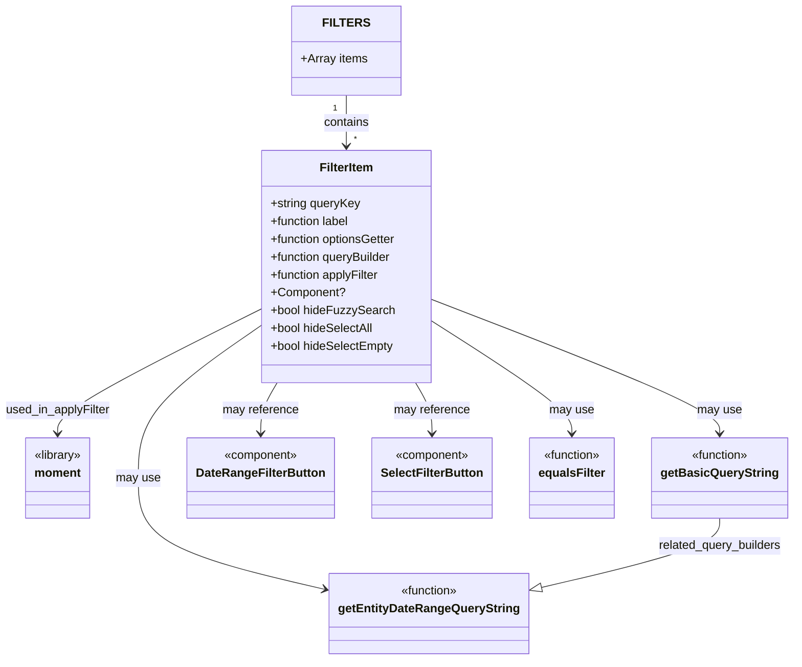

# Diagram: web/portal/src/modules/mt-search/MetalTrackingFilterSectionCategoryDefs.js

> Auto-generated by Obscura crawlers

## Mermaid

### SVG

<svg id="container" width="1042.8125" xmlns="http://www.w3.org/2000/svg" class="classDiagram" height="886" viewBox="0 0 1042.8125 886" role="graphics-document document" aria-roledescription="class"><g><defs><marker id="container_class-aggregationStart" class="marker aggregation class" refX="18" refY="7" markerWidth="190" markerHeight="240" orient="auto"><path d="M 18,7 L9,13 L1,7 L9,1 Z"></path></marker></defs><defs><marker id="container_class-aggregationEnd" class="marker aggregation class" refX="1" refY="7" markerWidth="20" markerHeight="28" orient="auto"><path d="M 18,7 L9,13 L1,7 L9,1 Z"></path></marker></defs><defs><marker id="container_class-extensionStart" class="marker extension class" refX="18" refY="7" markerWidth="190" markerHeight="240" orient="auto"><path d="M 1,7 L18,13 V 1 Z"></path></marker></defs><defs><marker id="container_class-extensionEnd" class="marker extension class" refX="1" refY="7" markerWidth="20" markerHeight="28" orient="auto"><path d="M 1,1 V 13 L18,7 Z"></path></marker></defs><defs><marker id="container_class-compositionStart" class="marker composition class" refX="18" refY="7" markerWidth="190" markerHeight="240" orient="auto"><path d="M 18,7 L9,13 L1,7 L9,1 Z"></path></marker></defs><defs><marker id="container_class-compositionEnd" class="marker composition class" refX="1" refY="7" markerWidth="20" markerHeight="28" orient="auto"><path d="M 18,7 L9,13 L1,7 L9,1 Z"></path></marker></defs><defs><marker id="container_class-dependencyStart" class="marker dependency class" refX="6" refY="7" markerWidth="190" markerHeight="240" orient="auto"><path d="M 5,7 L9,13 L1,7 L9,1 Z"></path></marker></defs><defs><marker id="container_class-dependencyEnd" class="marker dependency class" refX="13" refY="7" markerWidth="20" markerHeight="28" orient="auto"><path d="M 18,7 L9,13 L14,7 L9,1 Z"></path></marker></defs><defs><marker id="container_class-lollipopStart" class="marker lollipop class" refX="13" refY="7" markerWidth="190" markerHeight="240" orient="auto"><circle stroke="black" fill="transparent" cx="7" cy="7" r="6"></circle></marker></defs><defs><marker id="container_class-lollipopEnd" class="marker lollipop class" refX="1" refY="7" markerWidth="190" markerHeight="240" orient="auto"><circle stroke="black" fill="transparent" cx="7" cy="7" r="6"></circle></marker></defs><g class="root"><g class="clusters"></g><g class="edgePaths"><path d="M460.426,128L460.426,134.167C460.426,140.333,460.426,152.667,460.426,164C460.426,175.333,460.426,185.667,460.426,190.833L460.426,196" id="id_FILTERS_FilterItem_1" class="edge-thickness-normal edge-pattern-solid relation" style=";;;" data-edge="true" data-et="edge" data-id="id_FILTERS_FilterItem_1" data-points="W3sieCI6NDYwLjQyNTc4MTI1LCJ5IjoxMjh9LHsieCI6NDYwLjQyNTc4MTI1LCJ5IjoxNjV9LHsieCI6NDYwLjQyNTc4MTI1LCJ5IjoyMDJ9XQ==" marker-end="url(#container_class-dependencyEnd)"></path><path d="M576.613,404.004L638.489,428.503C700.365,453.003,824.116,502.001,885.992,531.667C947.867,561.333,947.867,571.667,947.867,576.833L947.867,582" id="id_FilterItem_getBasicQueryString_2" class="edge-thickness-normal edge-pattern-solid relation" style=";;;" data-edge="true" data-et="edge" data-id="id_FilterItem_getBasicQueryString_2" data-points="W3sieCI6NTc2LjYxMzI4MTI1LCJ5Ijo0MDQuMDAzODYyNjQzNzQ3MjV9LHsieCI6OTQ3Ljg2NzE4NzUsInkiOjU1MX0seyJ4Ijo5NDcuODY3MTg3NSwieSI6NTg4fV0=" marker-end="url(#container_class-dependencyEnd)"></path><path d="M344.238,440.533L318.32,458.944C292.401,477.355,240.564,514.178,214.645,547.756C188.727,581.333,188.727,611.667,188.727,642C188.727,672.333,188.727,702.667,229.613,727.636C270.5,752.605,352.274,772.21,393.161,782.012L434.048,791.815" id="id_FilterItem_getEntityDateRangeQueryString_3" class="edge-thickness-normal edge-pattern-solid relation" style=";;;" data-edge="true" data-et="edge" data-id="id_FilterItem_getEntityDateRangeQueryString_3" data-points="W3sieCI6MzQ0LjIzODI4MTI1LCJ5Ijo0NDAuNTMzMTMyMDUzNzcwNH0seyJ4IjoxODguNzI2NTYyNSwieSI6NTUxfSx7IngiOjE4OC43MjY1NjI1LCJ5Ijo2NDJ9LHsieCI6MTg4LjcyNjU2MjUsInkiOjczM30seyJ4Ijo0MzkuODgyODEyNSwieSI6NzkzLjIxMzM5OTE5NzI4MzF9XQ==" marker-end="url(#container_class-dependencyEnd)"></path><path d="M370.121,514L366.552,520.167C362.982,526.333,355.843,538.667,352.273,550C348.703,561.333,348.703,571.667,348.703,576.833L348.703,582" id="id_FilterItem_DateRangeFilterButton_4" class="edge-thickness-normal edge-pattern-solid relation" style=";;;" data-edge="true" data-et="edge" data-id="id_FilterItem_DateRangeFilterButton_4" data-points="W3sieCI6MzcwLjEyMTQ1ODA2MzQ3MTUsInkiOjUxNH0seyJ4IjozNDguNzAzMTI1LCJ5Ijo1NTF9LHsieCI6MzQ4LjcwMzEyNSwieSI6NTg4fV0=" marker-end="url(#container_class-dependencyEnd)"></path><path d="M550.73,514L554.3,520.167C557.87,526.333,565.009,538.667,568.579,550C572.148,561.333,572.148,571.667,572.148,576.833L572.148,582" id="id_FilterItem_SelectFilterButton_5" class="edge-thickness-normal edge-pattern-solid relation" style=";;;" data-edge="true" data-et="edge" data-id="id_FilterItem_SelectFilterButton_5" data-points="W3sieCI6NTUwLjczMDEwNDQzNjUyODQsInkiOjUxNH0seyJ4Ijo1NzIuMTQ4NDM3NSwieSI6NTUxfSx7IngiOjU3Mi4xNDg0Mzc1LCJ5Ijo1ODh9XQ==" marker-end="url(#container_class-dependencyEnd)"></path><path d="M576.613,433.939L606.464,453.449C636.315,472.959,696.017,511.98,725.868,536.656C755.719,561.333,755.719,571.667,755.719,576.833L755.719,582" id="id_FilterItem_equalsFilter_6" class="edge-thickness-normal edge-pattern-solid relation" style=";;;" data-edge="true" data-et="edge" data-id="id_FilterItem_equalsFilter_6" data-points="W3sieCI6NTc2LjYxMzI4MTI1LCJ5Ijo0MzMuOTM4Nzc5MDE5Nzc2NDZ9LHsieCI6NzU1LjcxODc1LCJ5Ijo1NTF9LHsieCI6NzU1LjcxODc1LCJ5Ijo1ODh9XQ==" marker-end="url(#container_class-dependencyEnd)"></path><path d="M344.238,416.816L300.059,439.18C255.88,461.544,167.522,506.272,123.343,533.803C79.164,561.333,79.164,571.667,79.164,576.833L79.164,582" id="id_FilterItem_moment_7" class="edge-thickness-normal edge-pattern-solid relation" style=";;;" data-edge="true" data-et="edge" data-id="id_FilterItem_moment_7" data-points="W3sieCI6MzQ0LjIzODI4MTI1LCJ5Ijo0MTYuODE1NzMzMTIyOTU3M30seyJ4Ijo3OS4xNjQwNjI1LCJ5Ijo1NTF9LHsieCI6NzkuMTY0MDYyNSwieSI6NTg4fV0=" marker-end="url(#container_class-dependencyEnd)"></path><path d="M947.867,696L947.867,702.167C947.867,708.333,947.867,720.667,908.804,736.199C869.74,751.731,791.613,770.461,752.549,779.826L713.486,789.192" id="id_getBasicQueryString_getEntityDateRangeQueryString_8" class="edge-thickness-normal edge-pattern-solid relation" style=";;;" data-edge="true" data-et="edge" data-id="id_getBasicQueryString_getEntityDateRangeQueryString_8" data-points="W3sieCI6OTQ3Ljg2NzE4NzUsInkiOjY5Nn0seyJ4Ijo5NDcuODY3MTg3NSwieSI6NzMzfSx7IngiOjY5Ni43MTA5Mzc1LCJ5Ijo3OTMuMjEzMzk5MTk3MjgzMX1d" marker-end="url(#container_class-extensionEnd)"></path></g><g class="edgeLabels"><g class="edgeLabel" transform="translate(460.42578125, 165)"><g class="label" data-id="id_FILTERS_FilterItem_1" transform="translate(-30.890625, -12)"><foreignObject width="61.78125" height="24">

contains

</foreignObject></g></g><g class="edgeLabel" transform="translate(947.8671875, 551)"><g class="label" data-id="id_FilterItem_getBasicQueryString_2" transform="translate(-29.8984375, -12)"><foreignObject width="59.796875" height="24">

may use

</foreignObject></g></g><g class="edgeLabel" transform="translate(188.7265625, 642)"><g class="label" data-id="id_FilterItem_getEntityDateRangeQueryString_3" transform="translate(-29.8984375, -12)"><foreignObject width="59.796875" height="24">

may use

</foreignObject></g></g><g class="edgeLabel" transform="translate(348.703125, 551)"><g class="label" data-id="id_FilterItem_DateRangeFilterButton_4" transform="translate(-51.234375, -12)"><foreignObject width="102.46875" height="24">

may reference

</foreignObject></g></g><g class="edgeLabel" transform="translate(572.1484375, 551)"><g class="label" data-id="id_FilterItem_SelectFilterButton_5" transform="translate(-51.234375, -12)"><foreignObject width="102.46875" height="24">

may reference

</foreignObject></g></g><g class="edgeLabel" transform="translate(755.71875, 551)"><g class="label" data-id="id_FilterItem_equalsFilter_6" transform="translate(-29.8984375, -12)"><foreignObject width="59.796875" height="24">

may use

</foreignObject></g></g><g class="edgeLabel" transform="translate(79.1640625, 551)"><g class="label" data-id="id_FilterItem_moment_7" transform="translate(-71.1640625, -12)"><foreignObject width="142.328125" height="24">

used_in_applyFilter

</foreignObject></g></g><g class="edgeLabel" transform="translate(947.8671875, 733)"><g class="label" data-id="id_getBasicQueryString_getEntityDateRangeQueryString_8" transform="translate(-84.34375, -12)"><foreignObject width="168.6875" height="24">

related_query_builders

</foreignObject></g></g><g class="edgeTerminals" transform="translate(445.425780625, 145.4999994642857)"><g class="inner" transform="translate(0, 0)"><foreignObject style="width: 9px; height: 12px;">
1
</foreignObject></g></g><g class="edgeTerminals" transform="translate(470.425780625, 179.4999994642857)"><g class="inner" transform="translate(0, 0)"></g><foreignObject style="width: 9px; height: 12px;">
*
</foreignObject></g></g><g class="nodes"><g class="node default" id="classId-FILTERS-0" transform="translate(460.42578125, 68)"><g class="basic label-container"><path d="M-70.4375 -60 L70.4375 -60 L70.4375 60 L-70.4375 60" stroke="none" stroke-width="0" fill="#ECECFF" style=""></path><path d="M-70.4375 -60 C-41.67331061780743 -60, -12.909121235614862 -60, 70.4375 -60 M-70.4375 -60 C-35.63444037890245 -60, -0.8313807578048937 -60, 70.4375 -60 M70.4375 -60 C70.4375 -27.287616576528315, 70.4375 5.4247668469433705, 70.4375 60 M70.4375 -60 C70.4375 -12.587737096280271, 70.4375 34.82452580743946, 70.4375 60 M70.4375 60 C30.968629621855335 60, -8.50024075628933 60, -70.4375 60 M70.4375 60 C35.953003584541115 60, 1.4685071690822298 60, -70.4375 60 M-70.4375 60 C-70.4375 23.15455726588754, -70.4375 -13.69088546822492, -70.4375 -60 M-70.4375 60 C-70.4375 30.727078707817245, -70.4375 1.4541574156344907, -70.4375 -60" stroke="#9370DB" stroke-width="1.3" fill="none" stroke-dasharray="0 0" style=""></path></g><g class="annotation-group text" transform="translate(0, -36)"></g><g class="label-group text" transform="translate(-27.5625, -36)"><g class="label" style="font-weight: bolder" transform="translate(0,-12)"><foreignObject width="55.125" height="24">

FILTERS

</foreignObject></g></g><g class="members-group text" transform="translate(-58.4375, 12)"><g class="label" style="" transform="translate(0,-12)"><foreignObject width="89.3125" height="24">

+Array items

</foreignObject></g></g><g class="methods-group text" transform="translate(-58.4375, 60)"></g><g class="divider" style=""><path d="M-70.4375 -12 C-24.511009585335522 -12, 21.415480829328956 -12, 70.4375 -12 M-70.4375 -12 C-15.835453122164566 -12, 38.76659375567087 -12, 70.4375 -12" stroke="#9370DB" stroke-width="1.3" fill="none" stroke-dasharray="0 0" style=""></path></g><g class="divider" style=""><path d="M-70.4375 36 C-20.39803166882701 36, 29.64143666234598 36, 70.4375 36 M-70.4375 36 C-34.35909129341247 36, 1.7193174131750624 36, 70.4375 36" stroke="#9370DB" stroke-width="1.3" fill="none" stroke-dasharray="0 0" style=""></path></g></g><g class="node default" id="classId-FilterItem-1" transform="translate(460.42578125, 358)"><g class="basic label-container"><path d="M-116.1875 -156 L116.1875 -156 L116.1875 156 L-116.1875 156" stroke="none" stroke-width="0" fill="#ECECFF" style=""></path><path d="M-116.1875 -156 C-28.02155535468833 -156, 60.14438929062334 -156, 116.1875 -156 M-116.1875 -156 C-47.76720664499625 -156, 20.6530867100075 -156, 116.1875 -156 M116.1875 -156 C116.1875 -52.80297314089324, 116.1875 50.39405371821351, 116.1875 156 M116.1875 -156 C116.1875 -79.65319495434711, 116.1875 -3.3063899086942286, 116.1875 156 M116.1875 156 C42.83652956739999 156, -30.514440865200015 156, -116.1875 156 M116.1875 156 C31.030750376374854 156, -54.12599924725029 156, -116.1875 156 M-116.1875 156 C-116.1875 84.96149497695122, -116.1875 13.92298995390243, -116.1875 -156 M-116.1875 156 C-116.1875 91.09796835431975, -116.1875 26.195936708639493, -116.1875 -156" stroke="#9370DB" stroke-width="1.3" fill="none" stroke-dasharray="0 0" style=""></path></g><g class="annotation-group text" transform="translate(0, -132)"></g><g class="label-group text" transform="translate(-35.328125, -132)"><g class="label" style="font-weight: bolder" transform="translate(0,-12)"><foreignObject width="70.65625" height="24">

FilterItem

</foreignObject></g></g><g class="members-group text" transform="translate(-104.1875, -84)"><g class="label" style="" transform="translate(0,-12)"><foreignObject width="121.234375" height="24">

+string queryKey

</foreignObject></g><g class="label" style="" transform="translate(0,12)"><foreignObject width="108.921875" height="24">

+function label

</foreignObject></g><g class="label" style="" transform="translate(0,36)"><foreignObject width="173.046875" height="24">

+function optionsGetter

</foreignObject></g><g class="label" style="" transform="translate(0,60)"><foreignObject width="166.96875" height="24">

+function queryBuilder

</foreignObject></g><g class="label" style="" transform="translate(0,84)"><foreignObject width="149.734375" height="24">

+function applyFilter

</foreignObject></g><g class="label" style="" transform="translate(0,108)"><foreignObject width="98.640625" height="24">

+Component?

</foreignObject></g><g class="label" style="" transform="translate(0,132)"><foreignObject width="164.421875" height="24">

+bool hideFuzzySearch

</foreignObject></g><g class="label" style="" transform="translate(0,156)"><foreignObject width="140.03125" height="24">

+bool hideSelectAll

</foreignObject></g><g class="label" style="" transform="translate(0,180)"><foreignObject width="166.671875" height="24">

+bool hideSelectEmpty

</foreignObject></g></g><g class="methods-group text" transform="translate(-104.1875, 156)"></g><g class="divider" style=""><path d="M-116.1875 -108 C-24.641013999959526 -108, 66.90547200008095 -108, 116.1875 -108 M-116.1875 -108 C-49.592825523505695 -108, 17.00184895298861 -108, 116.1875 -108" stroke="#9370DB" stroke-width="1.3" fill="none" stroke-dasharray="0 0" style=""></path></g><g class="divider" style=""><path d="M-116.1875 132 C-31.985154342896266 132, 52.21719131420747 132, 116.1875 132 M-116.1875 132 C-59.427941822582945 132, -2.668383645165889 132, 116.1875 132" stroke="#9370DB" stroke-width="1.3" fill="none" stroke-dasharray="0 0" style=""></path></g></g><g class="node default" id="classId-moment-2" transform="translate(79.1640625, 642)"><g class="basic label-container"><path d="M-44.6640625 -54 L44.6640625 -54 L44.6640625 54 L-44.6640625 54" stroke="none" stroke-width="0" fill="#ECECFF" style=""></path><path d="M-44.6640625 -54 C-25.067978113811662 -54, -5.471893727623325 -54, 44.6640625 -54 M-44.6640625 -54 C-25.97301849949134 -54, -7.281974498982677 -54, 44.6640625 -54 M44.6640625 -54 C44.6640625 -32.065668683681565, 44.6640625 -10.131337367363138, 44.6640625 54 M44.6640625 -54 C44.6640625 -27.351242783005823, 44.6640625 -0.7024855660116458, 44.6640625 54 M44.6640625 54 C18.94931054981977 54, -6.765441400360459 54, -44.6640625 54 M44.6640625 54 C26.008153442861463 54, 7.352244385722926 54, -44.6640625 54 M-44.6640625 54 C-44.6640625 17.937741935584512, -44.6640625 -18.124516128830976, -44.6640625 -54 M-44.6640625 54 C-44.6640625 19.521925278752846, -44.6640625 -14.956149442494308, -44.6640625 -54" stroke="#9370DB" stroke-width="1.3" fill="none" stroke-dasharray="0 0" style=""></path></g><g class="annotation-group text" transform="translate(-32.6640625, -30)"><g class="label" style="" transform="translate(0,-12)"><foreignObject width="65.328125" height="24">

«library»

</foreignObject></g></g><g class="label-group text" transform="translate(-30.3125, -6)"><g class="label" style="font-weight: bolder" transform="translate(0,-12)"><foreignObject width="60.625" height="24">

moment

</foreignObject></g></g><g class="members-group text" transform="translate(-32.6640625, 42)"></g><g class="methods-group text" transform="translate(-32.6640625, 72)"></g><g class="divider" style=""><path d="M-44.6640625 18 C-22.039592730986858 18, 0.5848770380262849 18, 44.6640625 18 M-44.6640625 18 C-16.293006597212646 18, 12.078049305574709 18, 44.6640625 18" stroke="#9370DB" stroke-width="1.3" fill="none" stroke-dasharray="0 0" style=""></path></g><g class="divider" style=""><path d="M-44.6640625 36 C-20.849008231482525 36, 2.9660460370349497 36, 44.6640625 36 M-44.6640625 36 C-20.045000677192338 36, 4.574061145615325 36, 44.6640625 36" stroke="#9370DB" stroke-width="1.3" fill="none" stroke-dasharray="0 0" style=""></path></g></g><g class="node default" id="classId-getBasicQueryString-3" transform="translate(947.8671875, 642)"><g class="basic label-container"><path d="M-86.9453125 -54 L86.9453125 -54 L86.9453125 54 L-86.9453125 54" stroke="none" stroke-width="0" fill="#ECECFF" style=""></path><path d="M-86.9453125 -54 C-51.164371614485134 -54, -15.383430728970268 -54, 86.9453125 -54 M-86.9453125 -54 C-17.967292073053002 -54, 51.010728353893995 -54, 86.9453125 -54 M86.9453125 -54 C86.9453125 -15.081034968395073, 86.9453125 23.837930063209853, 86.9453125 54 M86.9453125 -54 C86.9453125 -13.586019638611958, 86.9453125 26.827960722776083, 86.9453125 54 M86.9453125 54 C30.661172295040686 54, -25.62296790991863 54, -86.9453125 54 M86.9453125 54 C45.27758156139303 54, 3.6098506227860554 54, -86.9453125 54 M-86.9453125 54 C-86.9453125 31.644916800782294, -86.9453125 9.289833601564588, -86.9453125 -54 M-86.9453125 54 C-86.9453125 20.289235880027952, -86.9453125 -13.421528239944095, -86.9453125 -54" stroke="#9370DB" stroke-width="1.3" fill="none" stroke-dasharray="0 0" style=""></path></g><g class="annotation-group text" transform="translate(-39.484375, -30)"><g class="label" style="" transform="translate(0,-12)"><foreignObject width="78.96875" height="24">

«function»

</foreignObject></g></g><g class="label-group text" transform="translate(-74.9453125, -6)"><g class="label" style="font-weight: bolder" transform="translate(0,-12)"><foreignObject width="149.890625" height="24">

getBasicQueryString

</foreignObject></g></g><g class="members-group text" transform="translate(-74.9453125, 42)"></g><g class="methods-group text" transform="translate(-74.9453125, 72)"></g><g class="divider" style=""><path d="M-86.9453125 18 C-18.16284975875452 18, 50.61961298249096 18, 86.9453125 18 M-86.9453125 18 C-32.70683020709299 18, 21.531652085814017 18, 86.9453125 18" stroke="#9370DB" stroke-width="1.3" fill="none" stroke-dasharray="0 0" style=""></path></g><g class="divider" style=""><path d="M-86.9453125 36 C-31.986980634844606 36, 22.971351230310788 36, 86.9453125 36 M-86.9453125 36 C-40.6846211331331 36, 5.576070233733802 36, 86.9453125 36" stroke="#9370DB" stroke-width="1.3" fill="none" stroke-dasharray="0 0" style=""></path></g></g><g class="node default" id="classId-getEntityDateRangeQueryString-4" transform="translate(568.296875, 824)"><g class="basic label-container"><path d="M-128.4140625 -54 L128.4140625 -54 L128.4140625 54 L-128.4140625 54" stroke="none" stroke-width="0" fill="#ECECFF" style=""></path><path d="M-128.4140625 -54 C-43.9334699065014 -54, 40.5471226869972 -54, 128.4140625 -54 M-128.4140625 -54 C-66.96576068807582 -54, -5.51745887615165 -54, 128.4140625 -54 M128.4140625 -54 C128.4140625 -22.903438379278736, 128.4140625 8.193123241442528, 128.4140625 54 M128.4140625 -54 C128.4140625 -23.781423125619167, 128.4140625 6.437153748761666, 128.4140625 54 M128.4140625 54 C48.9299592383867 54, -30.5541440232266 54, -128.4140625 54 M128.4140625 54 C69.97858817077656 54, 11.543113841553108 54, -128.4140625 54 M-128.4140625 54 C-128.4140625 20.441451562439966, -128.4140625 -13.117096875120069, -128.4140625 -54 M-128.4140625 54 C-128.4140625 32.01212212467853, -128.4140625 10.024244249357054, -128.4140625 -54" stroke="#9370DB" stroke-width="1.3" fill="none" stroke-dasharray="0 0" style=""></path></g><g class="annotation-group text" transform="translate(-39.484375, -30)"><g class="label" style="" transform="translate(0,-12)"><foreignObject width="78.96875" height="24">

«function»

</foreignObject></g></g><g class="label-group text" transform="translate(-116.4140625, -6)"><g class="label" style="font-weight: bolder" transform="translate(0,-12)"><foreignObject width="232.828125" height="24">

getEntityDateRangeQueryString

</foreignObject></g></g><g class="members-group text" transform="translate(-116.4140625, 42)"></g><g class="methods-group text" transform="translate(-116.4140625, 72)"></g><g class="divider" style=""><path d="M-128.4140625 18 C-39.84853550699167 18, 48.71699148601667 18, 128.4140625 18 M-128.4140625 18 C-27.357555877810356 18, 73.69895074437929 18, 128.4140625 18" stroke="#9370DB" stroke-width="1.3" fill="none" stroke-dasharray="0 0" style=""></path></g><g class="divider" style=""><path d="M-128.4140625 36 C-73.0683038790564 36, -17.722545258112802 36, 128.4140625 36 M-128.4140625 36 C-27.077343838963174 36, 74.25937482207365 36, 128.4140625 36" stroke="#9370DB" stroke-width="1.3" fill="none" stroke-dasharray="0 0" style=""></path></g></g><g class="node default" id="classId-DateRangeFilterButton-5" transform="translate(348.703125, 642)"><g class="basic label-container"><path d="M-95.078125 -54 L95.078125 -54 L95.078125 54 L-95.078125 54" stroke="none" stroke-width="0" fill="#ECECFF" style=""></path><path d="M-95.078125 -54 C-46.01859709440451 -54, 3.040930811190975 -54, 95.078125 -54 M-95.078125 -54 C-55.329770416099535 -54, -15.58141583219907 -54, 95.078125 -54 M95.078125 -54 C95.078125 -31.599749671779747, 95.078125 -9.199499343559495, 95.078125 54 M95.078125 -54 C95.078125 -11.183175554163313, 95.078125 31.633648891673374, 95.078125 54 M95.078125 54 C24.030765803876662 54, -47.016593392246676 54, -95.078125 54 M95.078125 54 C48.22010925156309 54, 1.3620935031261752 54, -95.078125 54 M-95.078125 54 C-95.078125 11.522346910684533, -95.078125 -30.955306178630934, -95.078125 -54 M-95.078125 54 C-95.078125 21.67196564744122, -95.078125 -10.656068705117562, -95.078125 -54" stroke="#9370DB" stroke-width="1.3" fill="none" stroke-dasharray="0 0" style=""></path></g><g class="annotation-group text" transform="translate(-50.2109375, -30)"><g class="label" style="" transform="translate(0,-12)"><foreignObject width="100.421875" height="24">

«component»

</foreignObject></g></g><g class="label-group text" transform="translate(-83.078125, -6)"><g class="label" style="font-weight: bolder" transform="translate(0,-12)"><foreignObject width="166.15625" height="24">

DateRangeFilterButton

</foreignObject></g></g><g class="members-group text" transform="translate(-83.078125, 42)"></g><g class="methods-group text" transform="translate(-83.078125, 72)"></g><g class="divider" style=""><path d="M-95.078125 18 C-28.950764787540464 18, 37.17659542491907 18, 95.078125 18 M-95.078125 18 C-41.540541891055966 18, 11.997041217888068 18, 95.078125 18" stroke="#9370DB" stroke-width="1.3" fill="none" stroke-dasharray="0 0" style=""></path></g><g class="divider" style=""><path d="M-95.078125 36 C-29.54879341180491 36, 35.98053817639018 36, 95.078125 36 M-95.078125 36 C-45.35996463347197 36, 4.358195733056064 36, 95.078125 36" stroke="#9370DB" stroke-width="1.3" fill="none" stroke-dasharray="0 0" style=""></path></g></g><g class="node default" id="classId-SelectFilterButton-6" transform="translate(572.1484375, 642)"><g class="basic label-container"><path d="M-78.3671875 -54 L78.3671875 -54 L78.3671875 54 L-78.3671875 54" stroke="none" stroke-width="0" fill="#ECECFF" style=""></path><path d="M-78.3671875 -54 C-33.43610149352508 -54, 11.494984512949841 -54, 78.3671875 -54 M-78.3671875 -54 C-36.001672729909885 -54, 6.363842040180231 -54, 78.3671875 -54 M78.3671875 -54 C78.3671875 -20.761163607398537, 78.3671875 12.477672785202927, 78.3671875 54 M78.3671875 -54 C78.3671875 -15.318197278692352, 78.3671875 23.363605442615295, 78.3671875 54 M78.3671875 54 C16.137326931673833 54, -46.092533636652334 54, -78.3671875 54 M78.3671875 54 C28.066147976538645 54, -22.23489154692271 54, -78.3671875 54 M-78.3671875 54 C-78.3671875 17.579436651832324, -78.3671875 -18.84112669633535, -78.3671875 -54 M-78.3671875 54 C-78.3671875 27.171760443357364, -78.3671875 0.34352088671472814, -78.3671875 -54" stroke="#9370DB" stroke-width="1.3" fill="none" stroke-dasharray="0 0" style=""></path></g><g class="annotation-group text" transform="translate(-50.2109375, -30)"><g class="label" style="" transform="translate(0,-12)"><foreignObject width="100.421875" height="24">

«component»

</foreignObject></g></g><g class="label-group text" transform="translate(-66.3671875, -6)"><g class="label" style="font-weight: bolder" transform="translate(0,-12)"><foreignObject width="132.734375" height="24">

SelectFilterButton

</foreignObject></g></g><g class="members-group text" transform="translate(-66.3671875, 42)"></g><g class="methods-group text" transform="translate(-66.3671875, 72)"></g><g class="divider" style=""><path d="M-78.3671875 18 C-25.38958244377814 18, 27.588022612443723 18, 78.3671875 18 M-78.3671875 18 C-30.264251668977046 18, 17.838684162045908 18, 78.3671875 18" stroke="#9370DB" stroke-width="1.3" fill="none" stroke-dasharray="0 0" style=""></path></g><g class="divider" style=""><path d="M-78.3671875 36 C-30.954890493596196 36, 16.45740651280761 36, 78.3671875 36 M-78.3671875 36 C-46.65642231429899 36, -14.94565712859798 36, 78.3671875 36" stroke="#9370DB" stroke-width="1.3" fill="none" stroke-dasharray="0 0" style=""></path></g></g><g class="node default" id="classId-equalsFilter-7" transform="translate(755.71875, 642)"><g class="basic label-container"><path d="M-55.203125 -54 L55.203125 -54 L55.203125 54 L-55.203125 54" stroke="none" stroke-width="0" fill="#ECECFF" style=""></path><path d="M-55.203125 -54 C-11.67529660809032 -54, 31.85253178381936 -54, 55.203125 -54 M-55.203125 -54 C-19.772511714160878 -54, 15.658101571678245 -54, 55.203125 -54 M55.203125 -54 C55.203125 -24.193546462601812, 55.203125 5.612907074796375, 55.203125 54 M55.203125 -54 C55.203125 -21.345094657342855, 55.203125 11.30981068531429, 55.203125 54 M55.203125 54 C16.506488911674765 54, -22.19014717665047 54, -55.203125 54 M55.203125 54 C14.078851490682908 54, -27.045422018634184 54, -55.203125 54 M-55.203125 54 C-55.203125 30.594004012894377, -55.203125 7.188008025788754, -55.203125 -54 M-55.203125 54 C-55.203125 17.096998872344443, -55.203125 -19.806002255311114, -55.203125 -54" stroke="#9370DB" stroke-width="1.3" fill="none" stroke-dasharray="0 0" style=""></path></g><g class="annotation-group text" transform="translate(-39.484375, -30)"><g class="label" style="" transform="translate(0,-12)"><foreignObject width="78.96875" height="24">

«function»

</foreignObject></g></g><g class="label-group text" transform="translate(-43.203125, -6)"><g class="label" style="font-weight: bolder" transform="translate(0,-12)"><foreignObject width="86.40625" height="24">

equalsFilter

</foreignObject></g></g><g class="members-group text" transform="translate(-43.203125, 42)"></g><g class="methods-group text" transform="translate(-43.203125, 72)"></g><g class="divider" style=""><path d="M-55.203125 18 C-16.57717498504708 18, 22.04877502990584 18, 55.203125 18 M-55.203125 18 C-15.320962066121368 18, 24.561200867757265 18, 55.203125 18" stroke="#9370DB" stroke-width="1.3" fill="none" stroke-dasharray="0 0" style=""></path></g><g class="divider" style=""><path d="M-55.203125 36 C-24.53579068271933 36, 6.131543634561339 36, 55.203125 36 M-55.203125 36 C-25.412710354835273 36, 4.377704290329454 36, 55.203125 36" stroke="#9370DB" stroke-width="1.3" fill="none" stroke-dasharray="0 0" style=""></path></g></g></g></g></g></svg>
