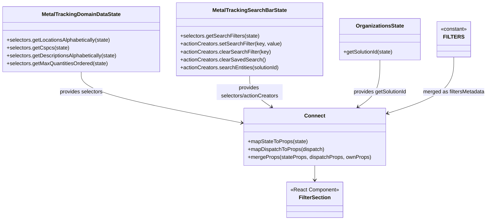

# Diagram: web/portal/src/modules/mt-search/MetalTrackingFilterSectionContainer.js


> Auto-generated by Obscura crawlers

## Diagram 1

```mermaid
flowchart LR
  subgraph Redux_State[Redux State]
    State((state))
  end
  subgraph DomainData[MetalTrackingDomainDataState]
    MD_selectors[getLocationsAlphabetically/getCspcs/getDescriptionsAlphabetically/getMaxQuantitiesOrdered]
  end
  subgraph SearchBarState[MetalTrackingSearchBarState]
    MS_selectors[getSearchFilters]
    MS_actions[setSearchFilter/clearSearchFilter/clearSavedSearch/searchEntities]
  end
  Organizations[getSolutionId]
  State --> MD_selectors
  State --> MS_selectors
  State --> Organizations
  MD_selectors -->|locations, cspcs, descriptions, maxQuantities| mapStateToProps
  MS_selectors -->|searchFilters| mapStateToProps
  Organizations -->|solutionId| mapStateToProps
  MS_actions --> mapDispatchToProps
  mapStateToProps[mapStateToProps(state) => stateProps]
  mapDispatchToProps[mapDispatchToProps(dispatch) => dispatchProps]
  mergeProps[mergeProps(stateProps, dispatchProps, ownProps) => mergedProps{filtersMetadata: FILTERS}]
  ownProps[ownProps] --> mergeProps
  mapStateToProps --> mergeProps
  mapDispatchToProps --> mergeProps
  mergeProps --> ConnectedComponent[connect(...)(FilterSection)]
  FILTERS(["FILTERS constant"]) --> mergeProps
```

> SVG rendering failed for this diagram.

## Diagram 2



### SVG

<svg id="container" width="1476.3515625" xmlns="http://www.w3.org/2000/svg" class="classDiagram" height="668" viewBox="0 0 1476.3515625 668" role="graphics-document document" aria-roledescription="class"><style>#container{font-family:"trebuchet ms",verdana,arial,sans-serif;font-size:16px;fill:#333;}@keyframes edge-animation-frame{from{stroke-dashoffset:0;}}@keyframes dash{to{stroke-dashoffset:0;}}#container .edge-animation-slow{stroke-dasharray:9,5!important;stroke-dashoffset:900;animation:dash 50s linear infinite;stroke-linecap:round;}#container .edge-animation-fast{stroke-dasharray:9,5!important;stroke-dashoffset:900;animation:dash 20s linear infinite;stroke-linecap:round;}#container .error-icon{fill:#552222;}#container .error-text{fill:#552222;stroke:#552222;}#container .edge-thickness-normal{stroke-width:1px;}#container .edge-thickness-thick{stroke-width:3.5px;}#container .edge-pattern-solid{stroke-dasharray:0;}#container .edge-thickness-invisible{stroke-width:0;fill:none;}#container .edge-pattern-dashed{stroke-dasharray:3;}#container .edge-pattern-dotted{stroke-dasharray:2;}#container .marker{fill:#333333;stroke:#333333;}#container .marker.cross{stroke:#333333;}#container svg{font-family:"trebuchet ms",verdana,arial,sans-serif;font-size:16px;}#container p{margin:0;}#container g.classGroup text{fill:#9370DB;stroke:none;font-family:"trebuchet ms",verdana,arial,sans-serif;font-size:10px;}#container g.classGroup text .title{font-weight:bolder;}#container .nodeLabel,#container .edgeLabel{color:#131300;}#container .edgeLabel .label rect{fill:#ECECFF;}#container .label text{fill:#131300;}#container .labelBkg{background:#ECECFF;}#container .edgeLabel .label span{background:#ECECFF;}#container .classTitle{font-weight:bolder;}#container .node rect,#container .node circle,#container .node ellipse,#container .node polygon,#container .node path{fill:#ECECFF;stroke:#9370DB;stroke-width:1px;}#container .divider{stroke:#9370DB;stroke-width:1;}#container g.clickable{cursor:pointer;}#container g.classGroup rect{fill:#ECECFF;stroke:#9370DB;}#container g.classGroup line{stroke:#9370DB;stroke-width:1;}#container .classLabel .box{stroke:none;stroke-width:0;fill:#ECECFF;opacity:0.5;}#container .classLabel .label{fill:#9370DB;font-size:10px;}#container .relation{stroke:#333333;stroke-width:1;fill:none;}#container .dashed-line{stroke-dasharray:3;}#container .dotted-line{stroke-dasharray:1 2;}#container #compositionStart,#container .composition{fill:#333333!important;stroke:#333333!important;stroke-width:1;}#container #compositionEnd,#container .composition{fill:#333333!important;stroke:#333333!important;stroke-width:1;}#container #dependencyStart,#container .dependency{fill:#333333!important;stroke:#333333!important;stroke-width:1;}#container #dependencyStart,#container .dependency{fill:#333333!important;stroke:#333333!important;stroke-width:1;}#container #extensionStart,#container .extension{fill:transparent!important;stroke:#333333!important;stroke-width:1;}#container #extensionEnd,#container .extension{fill:transparent!important;stroke:#333333!important;stroke-width:1;}#container #aggregationStart,#container .aggregation{fill:transparent!important;stroke:#333333!important;stroke-width:1;}#container #aggregationEnd,#container .aggregation{fill:transparent!important;stroke:#333333!important;stroke-width:1;}#container #lollipopStart,#container .lollipop{fill:#ECECFF!important;stroke:#333333!important;stroke-width:1;}#container #lollipopEnd,#container .lollipop{fill:#ECECFF!important;stroke:#333333!important;stroke-width:1;}#container .edgeTerminals{font-size:11px;line-height:initial;}#container .classTitleText{text-anchor:middle;font-size:18px;fill:#333;}#container .label-icon{display:inline-block;height:1em;overflow:visible;vertical-align:-0.125em;}#container .node .label-icon path{fill:currentColor;stroke:revert;stroke-width:revert;}#container :root{--mermaid-font-family:"trebuchet ms",verdana,arial,sans-serif;}</style><g><defs><marker id="container_class-aggregationStart" class="marker aggregation class" refX="18" refY="7" markerWidth="190" markerHeight="240" orient="auto"><path d="M 18,7 L9,13 L1,7 L9,1 Z"></path></marker></defs><defs><marker id="container_class-aggregationEnd" class="marker aggregation class" refX="1" refY="7" markerWidth="20" markerHeight="28" orient="auto"><path d="M 18,7 L9,13 L1,7 L9,1 Z"></path></marker></defs><defs><marker id="container_class-extensionStart" class="marker extension class" refX="18" refY="7" markerWidth="190" markerHeight="240" orient="auto"><path d="M 1,7 L18,13 V 1 Z"></path></marker></defs><defs><marker id="container_class-extensionEnd" class="marker extension class" refX="1" refY="7" markerWidth="20" markerHeight="28" orient="auto"><path d="M 1,1 V 13 L18,7 Z"></path></marker></defs><defs><marker id="container_class-compositionStart" class="marker composition class" refX="18" refY="7" markerWidth="190" markerHeight="240" orient="auto"><path d="M 18,7 L9,13 L1,7 L9,1 Z"></path></marker></defs><defs><marker id="container_class-compositionEnd" class="marker composition class" refX="1" refY="7" markerWidth="20" markerHeight="28" orient="auto"><path d="M 18,7 L9,13 L1,7 L9,1 Z"></path></marker></defs><defs><marker id="container_class-dependencyStart" class="marker dependency class" refX="6" refY="7" markerWidth="190" markerHeight="240" orient="auto"><path d="M 5,7 L9,13 L1,7 L9,1 Z"></path></marker></defs><defs><marker id="container_class-dependencyEnd" class="marker dependency class" refX="13" refY="7" markerWidth="20" markerHeight="28" orient="auto"><path d="M 18,7 L9,13 L14,7 L9,1 Z"></path></marker></defs><defs><marker id="container_class-lollipopStart" class="marker lollipop class" refX="13" refY="7" markerWidth="190" markerHeight="240" orient="auto"><circle stroke="black" fill="transparent" cx="7" cy="7" r="6"></circle></marker></defs><defs><marker id="container_class-lollipopEnd" class="marker lollipop class" refX="1" refY="7" markerWidth="190" markerHeight="240" orient="auto"><circle stroke="black" fill="transparent" cx="7" cy="7" r="6"></circle></marker></defs><g class="root"><g class="clusters"></g><g class="edgePaths"><path d="M952.277,502L952.277,506.167C952.277,510.333,952.277,518.667,952.277,526C952.277,533.333,952.277,539.667,952.277,542.833L952.277,546" id="id_Connect_FilterSection_1" class="edge-thickness-normal edge-pattern-solid relation" style=";;;" data-edge="true" data-et="edge" data-id="id_Connect_FilterSection_1" data-points="W3sieCI6OTUyLjI3NzM0Mzc1LCJ5Ijo1MDJ9LHsieCI6OTUyLjI3NzM0Mzc1LCJ5Ijo1Mjd9LHsieCI6OTUyLjI3NzM0Mzc1LCJ5Ijo1NTJ9XQ==" marker-end="url(#container_class-dependencyEnd)"></path><path d="M247.723,218L247.723,228.167C247.723,238.333,247.723,258.667,328.685,284.461C409.647,310.256,571.571,341.512,652.533,357.14L733.495,372.769" id="id_MetalTrackingDomainDataState_Connect_2" class="edge-thickness-normal edge-pattern-solid relation" style=";;;" data-edge="true" data-et="edge" data-id="id_MetalTrackingDomainDataState_Connect_2" data-points="W3sieCI6MjQ3LjcyMjY1NjI1LCJ5IjoyMTh9LHsieCI6MjQ3LjcyMjY1NjI1LCJ5IjoyNzl9LHsieCI6NzM5LjM4NjcxODc1LCJ5IjozNzMuOTA1NzgwNDY4NjAyNzZ9XQ==" marker-end="url(#container_class-dependencyEnd)"></path><path d="M756.293,230L756.293,238.167C756.293,246.333,756.293,262.667,767.24,278.43C778.187,294.193,800.081,309.386,811.028,316.983L821.976,324.579" id="id_MetalTrackingSearchBarState_Connect_3" class="edge-thickness-normal edge-pattern-solid relation" style=";;;" data-edge="true" data-et="edge" data-id="id_MetalTrackingSearchBarState_Connect_3" data-points="W3sieCI6NzU2LjI5Mjk2ODc1LCJ5IjoyMzB9LHsieCI6NzU2LjI5Mjk2ODc1LCJ5IjoyNzl9LHsieCI6ODI2LjkwNDk4NjIxMzIzNTIsInkiOjMyOH1d" marker-end="url(#container_class-dependencyEnd)"></path><path d="M1148.262,182L1148.262,198.167C1148.262,214.333,1148.262,246.667,1137.315,270.43C1126.368,294.193,1104.473,309.386,1093.526,316.983L1082.579,324.579" id="id_OrganizationsState_Connect_4" class="edge-thickness-normal edge-pattern-solid relation" style=";;;" data-edge="true" data-et="edge" data-id="id_OrganizationsState_Connect_4" data-points="W3sieCI6MTE0OC4yNjE3MTg3NSwieSI6MTgyfSx7IngiOjExNDguMjYxNzE4NzUsInkiOjI3OX0seyJ4IjoxMDc3LjY0OTcwMTI4Njc2NDYsInkiOjMyOH1d" marker-end="url(#container_class-dependencyEnd)"></path><path d="M1373.875,173L1373.875,190.667C1373.875,208.333,1373.875,243.667,1340.042,272.247C1306.209,300.828,1238.544,322.655,1204.711,333.569L1170.878,344.483" id="id_FILTERS_Connect_5" class="edge-thickness-normal edge-pattern-solid relation" style=";;;" data-edge="true" data-et="edge" data-id="id_FILTERS_Connect_5" data-points="W3sieCI6MTM3My44NzUsInkiOjE3M30seyJ4IjoxMzczLjg3NSwieSI6Mjc5fSx7IngiOjExNjUuMTY3OTY4NzUsInkiOjM0Ni4zMjUyMjMwNjMzMTAxNX1d" marker-end="url(#container_class-dependencyEnd)"></path></g><g class="edgeLabels"><g class="edgeLabel"><g class="label" data-id="id_Connect_FilterSection_1" transform="translate(0, 0)"><foreignObject width="0" height="0"><div xmlns="http://www.w3.org/1999/xhtml" class="labelBkg" style="display: table-cell; white-space: nowrap; line-height: 1.5; max-width: 200px; text-align: center;"><span class="edgeLabel"></span></div></foreignObject></g></g><g class="edgeLabel" transform="translate(247.72265625, 279)"><g class="label" data-id="id_MetalTrackingDomainDataState_Connect_2" transform="translate(-66.1640625, -12)"><foreignObject width="132.328125" height="24"><div xmlns="http://www.w3.org/1999/xhtml" class="labelBkg" style="display: table-cell; white-space: nowrap; line-height: 1.5; max-width: 200px; text-align: center;"><span class="edgeLabel"><p>provides selectors</p></span></div></foreignObject></g></g><g class="edgeLabel" transform="translate(756.29296875, 279)"><g class="label" data-id="id_MetalTrackingSearchBarState_Connect_3" transform="translate(-100, -24)"><foreignObject width="200" height="48"><div xmlns="http://www.w3.org/1999/xhtml" class="labelBkg" style="display: table; white-space: break-spaces; line-height: 1.5; max-width: 200px; text-align: center; width: 200px;"><span class="edgeLabel"><p>provides selectors/actionCreators</p></span></div></foreignObject></g></g><g class="edgeLabel" transform="translate(1148.26171875, 279)"><g class="label" data-id="id_OrganizationsState_Connect_4" transform="translate(-82.3984375, -12)"><foreignObject width="164.796875" height="24"><div xmlns="http://www.w3.org/1999/xhtml" class="labelBkg" style="display: table-cell; white-space: nowrap; line-height: 1.5; max-width: 200px; text-align: center;"><span class="edgeLabel"><p>provides getSolutionId</p></span></div></foreignObject></g></g><g class="edgeLabel" transform="translate(1373.875, 279)"><g class="label" data-id="id_FILTERS_Connect_5" transform="translate(-94.4765625, -12)"><foreignObject width="188.953125" height="24"><div xmlns="http://www.w3.org/1999/xhtml" class="labelBkg" style="display: table-cell; white-space: nowrap; line-height: 1.5; max-width: 200px; text-align: center;"><span class="edgeLabel"><p>merged as filtersMetadata</p></span></div></foreignObject></g></g></g><g class="nodes"><g class="node default" id="classId-FilterSection-0" transform="translate(952.27734375, 606)"><g class="basic label-container"><path d="M-85.2109375 -54 L85.2109375 -54 L85.2109375 54 L-85.2109375 54" stroke="none" stroke-width="0" fill="#ECECFF" style=""></path><path d="M-85.2109375 -54 C-29.83056401278838 -54, 25.549809474423242 -54, 85.2109375 -54 M-85.2109375 -54 C-48.87939091628426 -54, -12.547844332568516 -54, 85.2109375 -54 M85.2109375 -54 C85.2109375 -14.771501009635877, 85.2109375 24.456997980728246, 85.2109375 54 M85.2109375 -54 C85.2109375 -20.524772406330065, 85.2109375 12.95045518733987, 85.2109375 54 M85.2109375 54 C36.402108329103726 54, -12.406720841792549 54, -85.2109375 54 M85.2109375 54 C39.04187222197394 54, -7.127193056052121 54, -85.2109375 54 M-85.2109375 54 C-85.2109375 22.69505370813206, -85.2109375 -8.609892583735878, -85.2109375 -54 M-85.2109375 54 C-85.2109375 14.9205429268806, -85.2109375 -24.1589141462388, -85.2109375 -54" stroke="#9370DB" stroke-width="1.3" fill="none" stroke-dasharray="0 0" style=""></path></g><g class="annotation-group text" transform="translate(-73.2109375, -30)"><g class="label" style="" transform="translate(0,-12)"><foreignObject width="146.421875" height="24"><div xmlns="http://www.w3.org/1999/xhtml" style="display: table-cell; white-space: nowrap; line-height: 1.5; max-width: 196px; text-align: center;"><span class="nodeLabel markdown-node-label" style=""><p>«React Component»</p></span></div></foreignObject></g></g><g class="label-group text" transform="translate(-46.3203125, -6)"><g class="label" style="font-weight: bolder" transform="translate(0,-12)"><foreignObject width="92.640625" height="24"><div xmlns="http://www.w3.org/1999/xhtml" style="display: table-cell; white-space: nowrap; line-height: 1.5; max-width: 141px; text-align: center;"><span class="nodeLabel markdown-node-label" style=""><p>FilterSection</p></span></div></foreignObject></g></g><g class="members-group text" transform="translate(-73.2109375, 42)"></g><g class="methods-group text" transform="translate(-73.2109375, 72)"></g><g class="divider" style=""><path d="M-85.2109375 18 C-28.67877207457166 18, 27.853393350856678 18, 85.2109375 18 M-85.2109375 18 C-23.662188881684692 18, 37.886559736630616 18, 85.2109375 18" stroke="#9370DB" stroke-width="1.3" fill="none" stroke-dasharray="0 0" style=""></path></g><g class="divider" style=""><path d="M-85.2109375 36 C-43.25616561166334 36, -1.301393723326683 36, 85.2109375 36 M-85.2109375 36 C-23.090901151527454 36, 39.02913519694509 36, 85.2109375 36" stroke="#9370DB" stroke-width="1.3" fill="none" stroke-dasharray="0 0" style=""></path></g></g><g class="node default" id="classId-Connect-1" transform="translate(952.27734375, 415)"><g class="basic label-container"><path d="M-212.890625 -87 L212.890625 -87 L212.890625 87 L-212.890625 87" stroke="none" stroke-width="0" fill="#ECECFF" style=""></path><path d="M-212.890625 -87 C-119.57936066179532 -87, -26.26809632359064 -87, 212.890625 -87 M-212.890625 -87 C-85.21862140248307 -87, 42.45338219503387 -87, 212.890625 -87 M212.890625 -87 C212.890625 -41.575260509091855, 212.890625 3.84947898181629, 212.890625 87 M212.890625 -87 C212.890625 -22.243335779371634, 212.890625 42.51332844125673, 212.890625 87 M212.890625 87 C103.53757843868574 87, -5.815468122628516 87, -212.890625 87 M212.890625 87 C57.47575405845933 87, -97.93911688308134 87, -212.890625 87 M-212.890625 87 C-212.890625 26.2718534721039, -212.890625 -34.4562930557922, -212.890625 -87 M-212.890625 87 C-212.890625 28.49238710475219, -212.890625 -30.01522579049562, -212.890625 -87" stroke="#9370DB" stroke-width="1.3" fill="none" stroke-dasharray="0 0" style=""></path></g><g class="annotation-group text" transform="translate(0, -63)"></g><g class="label-group text" transform="translate(-29.6875, -63)"><g class="label" style="font-weight: bolder" transform="translate(0,-12)"><foreignObject width="59.375" height="24"><div xmlns="http://www.w3.org/1999/xhtml" style="display: table-cell; white-space: nowrap; line-height: 1.5; max-width: 109px; text-align: center;"><span class="nodeLabel markdown-node-label" style=""><p>Connect</p></span></div></foreignObject></g></g><g class="members-group text" transform="translate(-200.890625, -15)"></g><g class="methods-group text" transform="translate(-200.890625, 15)"><g class="label" style="" transform="translate(0,-12)"><foreignObject width="181.453125" height="24"><div xmlns="http://www.w3.org/1999/xhtml" style="display: table-cell; white-space: nowrap; line-height: 1.5; max-width: 239px; text-align: center;"><span class="nodeLabel markdown-node-label" style=""><p>+mapStateToProps(state)</p></span></div></foreignObject></g><g class="label" style="" transform="translate(0,12)"><foreignObject width="233.0625" height="24"><div xmlns="http://www.w3.org/1999/xhtml" style="display: table-cell; white-space: nowrap; line-height: 1.5; max-width: 290px; text-align: center;"><span class="nodeLabel markdown-node-label" style=""><p>+mapDispatchToProps(dispatch)</p></span></div></foreignObject></g><g class="label" style="" transform="translate(0,36)"><foreignObject width="372.09375" height="24"><div xmlns="http://www.w3.org/1999/xhtml" style="display: table-cell; white-space: nowrap; line-height: 1.5; max-width: 429px; text-align: center;"><span class="nodeLabel markdown-node-label" style=""><p>+mergeProps(stateProps, dispatchProps, ownProps)</p></span></div></foreignObject></g></g><g class="divider" style=""><path d="M-212.890625 -39 C-46.15505136151367 -39, 120.58052227697266 -39, 212.890625 -39 M-212.890625 -39 C-79.40564952851994 -39, 54.07932594296011 -39, 212.890625 -39" stroke="#9370DB" stroke-width="1.3" fill="none" stroke-dasharray="0 0" style=""></path></g><g class="divider" style=""><path d="M-212.890625 -15 C-59.78725269201567 -15, 93.31611961596866 -15, 212.890625 -15 M-212.890625 -15 C-106.04217997969695 -15, 0.8062650406060925 -15, 212.890625 -15" stroke="#9370DB" stroke-width="1.3" fill="none" stroke-dasharray="0 0" style=""></path></g></g><g class="node default" id="classId-MetalTrackingDomainDataState-2" transform="translate(247.72265625, 119)"><g class="basic label-container"><path d="M-239.72265625 -99 L239.72265625 -99 L239.72265625 99 L-239.72265625 99" stroke="none" stroke-width="0" fill="#ECECFF" style=""></path><path d="M-239.72265625 -99 C-112.04393422815235 -99, 15.634787793695295 -99, 239.72265625 -99 M-239.72265625 -99 C-53.98707722965625 -99, 131.7485017906875 -99, 239.72265625 -99 M239.72265625 -99 C239.72265625 -55.14559870246799, 239.72265625 -11.291197404935986, 239.72265625 99 M239.72265625 -99 C239.72265625 -58.27164060276847, 239.72265625 -17.543281205536942, 239.72265625 99 M239.72265625 99 C72.1019544459418 99, -95.5187473581164 99, -239.72265625 99 M239.72265625 99 C137.36996519535842 99, 35.017274140716864 99, -239.72265625 99 M-239.72265625 99 C-239.72265625 29.92212179762886, -239.72265625 -39.15575640474228, -239.72265625 -99 M-239.72265625 99 C-239.72265625 20.113391271131604, -239.72265625 -58.77321745773679, -239.72265625 -99" stroke="#9370DB" stroke-width="1.3" fill="none" stroke-dasharray="0 0" style=""></path></g><g class="annotation-group text" transform="translate(0, -75)"></g><g class="label-group text" transform="translate(-115.3984375, -75)"><g class="label" style="font-weight: bolder" transform="translate(0,-12)"><foreignObject width="230.796875" height="24"><div xmlns="http://www.w3.org/1999/xhtml" style="display: table-cell; white-space: nowrap; line-height: 1.5; max-width: 277px; text-align: center;"><span class="nodeLabel markdown-node-label" style=""><p>MetalTrackingDomainDataState</p></span></div></foreignObject></g></g><g class="members-group text" transform="translate(-227.72265625, -27)"></g><g class="methods-group text" transform="translate(-227.72265625, 3)"><g class="label" style="" transform="translate(0,-12)"><foreignObject width="318.8125" height="24"><div xmlns="http://www.w3.org/1999/xhtml" style="display: table-cell; white-space: nowrap; line-height: 1.5; max-width: 376px; text-align: center;"><span class="nodeLabel markdown-node-label" style=""><p>+selectors.getLocationsAlphabetically(state)</p></span></div></foreignObject></g><g class="label" style="" transform="translate(0,12)"><foreignObject width="187" height="24"><div xmlns="http://www.w3.org/1999/xhtml" style="display: table-cell; white-space: nowrap; line-height: 1.5; max-width: 244px; text-align: center;"><span class="nodeLabel markdown-node-label" style=""><p>+selectors.getCspcs(state)</p></span></div></foreignObject></g><g class="label" style="" transform="translate(0,36)"><foreignObject width="340.046875" height="24"><div xmlns="http://www.w3.org/1999/xhtml" style="display: table-cell; white-space: nowrap; line-height: 1.5; max-width: 397px; text-align: center;"><span class="nodeLabel markdown-node-label" style=""><p>+selectors.getDescriptionsAlphabetically(state)</p></span></div></foreignObject></g><g class="label" style="" transform="translate(0,60)"><foreignObject width="309.328125" height="24"><div xmlns="http://www.w3.org/1999/xhtml" style="display: table-cell; white-space: nowrap; line-height: 1.5; max-width: 367px; text-align: center;"><span class="nodeLabel markdown-node-label" style=""><p>+selectors.getMaxQuantitiesOrdered(state)</p></span></div></foreignObject></g></g><g class="divider" style=""><path d="M-239.72265625 -51 C-106.43756696977553 -51, 26.847522310448937 -51, 239.72265625 -51 M-239.72265625 -51 C-109.59538593345047 -51, 20.531884383099055 -51, 239.72265625 -51" stroke="#9370DB" stroke-width="1.3" fill="none" stroke-dasharray="0 0" style=""></path></g><g class="divider" style=""><path d="M-239.72265625 -27 C-55.860433071826435 -27, 128.00179010634713 -27, 239.72265625 -27 M-239.72265625 -27 C-59.7990939703968 -27, 120.1244683092064 -27, 239.72265625 -27" stroke="#9370DB" stroke-width="1.3" fill="none" stroke-dasharray="0 0" style=""></path></g></g><g class="node default" id="classId-MetalTrackingSearchBarState-3" transform="translate(756.29296875, 119)"><g class="basic label-container"><path d="M-218.84765625 -111 L218.84765625 -111 L218.84765625 111 L-218.84765625 111" stroke="none" stroke-width="0" fill="#ECECFF" style=""></path><path d="M-218.84765625 -111 C-60.17392543573652 -111, 98.49980537852696 -111, 218.84765625 -111 M-218.84765625 -111 C-96.4810541184024 -111, 25.885548013195205 -111, 218.84765625 -111 M218.84765625 -111 C218.84765625 -23.69276367500767, 218.84765625 63.61447264998466, 218.84765625 111 M218.84765625 -111 C218.84765625 -45.24217064260351, 218.84765625 20.515658714792977, 218.84765625 111 M218.84765625 111 C106.80399150062028 111, -5.239673248759431 111, -218.84765625 111 M218.84765625 111 C93.37082555786695 111, -32.1060051342661 111, -218.84765625 111 M-218.84765625 111 C-218.84765625 42.23316192062303, -218.84765625 -26.533676158753934, -218.84765625 -111 M-218.84765625 111 C-218.84765625 31.740667892423048, -218.84765625 -47.518664215153905, -218.84765625 -111" stroke="#9370DB" stroke-width="1.3" fill="none" stroke-dasharray="0 0" style=""></path></g><g class="annotation-group text" transform="translate(0, -87)"></g><g class="label-group text" transform="translate(-107.8515625, -87)"><g class="label" style="font-weight: bolder" transform="translate(0,-12)"><foreignObject width="215.703125" height="24"><div xmlns="http://www.w3.org/1999/xhtml" style="display: table-cell; white-space: nowrap; line-height: 1.5; max-width: 261px; text-align: center;"><span class="nodeLabel markdown-node-label" style=""><p>MetalTrackingSearchBarState</p></span></div></foreignObject></g></g><g class="members-group text" transform="translate(-206.84765625, -39)"></g><g class="methods-group text" transform="translate(-206.84765625, -9)"><g class="label" style="" transform="translate(0,-12)"><foreignObject width="239.015625" height="24"><div xmlns="http://www.w3.org/1999/xhtml" style="display: table-cell; white-space: nowrap; line-height: 1.5; max-width: 296px; text-align: center;"><span class="nodeLabel markdown-node-label" style=""><p>+selectors.getSearchFilters(state)</p></span></div></foreignObject></g><g class="label" style="" transform="translate(0,12)"><foreignObject width="305.84375" height="24"><div xmlns="http://www.w3.org/1999/xhtml" style="display: table-cell; white-space: nowrap; line-height: 1.5; max-width: 363px; text-align: center;"><span class="nodeLabel markdown-node-label" style=""><p>+actionCreators.setSearchFilter(key, value)</p></span></div></foreignObject></g><g class="label" style="" transform="translate(0,36)"><foreignObject width="273.03125" height="24"><div xmlns="http://www.w3.org/1999/xhtml" style="display: table-cell; white-space: nowrap; line-height: 1.5; max-width: 330px; text-align: center;"><span class="nodeLabel markdown-node-label" style=""><p>+actionCreators.clearSearchFilter(key)</p></span></div></foreignObject></g><g class="label" style="" transform="translate(0,60)"><foreignObject width="254.8125" height="24"><div xmlns="http://www.w3.org/1999/xhtml" style="display: table-cell; white-space: nowrap; line-height: 1.5; max-width: 312px; text-align: center;"><span class="nodeLabel markdown-node-label" style=""><p>+actionCreators.clearSavedSearch()</p></span></div></foreignObject></g><g class="label" style="" transform="translate(0,84)"><foreignObject width="303.46875" height="24"><div xmlns="http://www.w3.org/1999/xhtml" style="display: table-cell; white-space: nowrap; line-height: 1.5; max-width: 361px; text-align: center;"><span class="nodeLabel markdown-node-label" style=""><p>+actionCreators.searchEntities(solutionId)</p></span></div></foreignObject></g></g><g class="divider" style=""><path d="M-218.84765625 -63 C-66.14338626025528 -63, 86.56088372948943 -63, 218.84765625 -63 M-218.84765625 -63 C-75.92363420160288 -63, 67.00038784679424 -63, 218.84765625 -63" stroke="#9370DB" stroke-width="1.3" fill="none" stroke-dasharray="0 0" style=""></path></g><g class="divider" style=""><path d="M-218.84765625 -39 C-47.61071878184569 -39, 123.62621868630862 -39, 218.84765625 -39 M-218.84765625 -39 C-128.16431919524797 -39, -37.48098214049591 -39, 218.84765625 -39" stroke="#9370DB" stroke-width="1.3" fill="none" stroke-dasharray="0 0" style=""></path></g></g><g class="node default" id="classId-OrganizationsState-4" transform="translate(1148.26171875, 119)"><g class="basic label-container"><path d="M-123.12109375 -63 L123.12109375 -63 L123.12109375 63 L-123.12109375 63" stroke="none" stroke-width="0" fill="#ECECFF" style=""></path><path d="M-123.12109375 -63 C-54.62087611901866 -63, 13.879341511962679 -63, 123.12109375 -63 M-123.12109375 -63 C-53.74426731056725 -63, 15.632559128865495 -63, 123.12109375 -63 M123.12109375 -63 C123.12109375 -29.47512117807517, 123.12109375 4.049757643849659, 123.12109375 63 M123.12109375 -63 C123.12109375 -17.7478861978107, 123.12109375 27.5042276043786, 123.12109375 63 M123.12109375 63 C28.19728934112709 63, -66.72651506774582 63, -123.12109375 63 M123.12109375 63 C31.19615642356723 63, -60.72878090286554 63, -123.12109375 63 M-123.12109375 63 C-123.12109375 16.135462827007927, -123.12109375 -30.729074345984145, -123.12109375 -63 M-123.12109375 63 C-123.12109375 25.565507030054313, -123.12109375 -11.868985939891374, -123.12109375 -63" stroke="#9370DB" stroke-width="1.3" fill="none" stroke-dasharray="0 0" style=""></path></g><g class="annotation-group text" transform="translate(0, -39)"></g><g class="label-group text" transform="translate(-69.8671875, -39)"><g class="label" style="font-weight: bolder" transform="translate(0,-12)"><foreignObject width="139.734375" height="24"><div xmlns="http://www.w3.org/1999/xhtml" style="display: table-cell; white-space: nowrap; line-height: 1.5; max-width: 187px; text-align: center;"><span class="nodeLabel markdown-node-label" style=""><p>OrganizationsState</p></span></div></foreignObject></g></g><g class="members-group text" transform="translate(-111.12109375, 9)"></g><g class="methods-group text" transform="translate(-111.12109375, 39)"><g class="label" style="" transform="translate(0,-12)"><foreignObject width="152.375" height="24"><div xmlns="http://www.w3.org/1999/xhtml" style="display: table-cell; white-space: nowrap; line-height: 1.5; max-width: 210px; text-align: center;"><span class="nodeLabel markdown-node-label" style=""><p>+getSolutionId(state)</p></span></div></foreignObject></g></g><g class="divider" style=""><path d="M-123.12109375 -15 C-31.935284543952363 -15, 59.25052466209527 -15, 123.12109375 -15 M-123.12109375 -15 C-25.55327048687019 -15, 72.01455277625962 -15, 123.12109375 -15" stroke="#9370DB" stroke-width="1.3" fill="none" stroke-dasharray="0 0" style=""></path></g><g class="divider" style=""><path d="M-123.12109375 9 C-25.811063749103013 9, 71.49896625179397 9, 123.12109375 9 M-123.12109375 9 C-37.36104395244848 9, 48.399005845103034 9, 123.12109375 9" stroke="#9370DB" stroke-width="1.3" fill="none" stroke-dasharray="0 0" style=""></path></g></g><g class="node default" id="classId-FILTERS-5" transform="translate(1373.875, 119)"><g class="basic label-container"><path d="M-52.4921875 -54 L52.4921875 -54 L52.4921875 54 L-52.4921875 54" stroke="none" stroke-width="0" fill="#ECECFF" style=""></path><path d="M-52.4921875 -54 C-28.89065918087179 -54, -5.28913086174358 -54, 52.4921875 -54 M-52.4921875 -54 C-29.096425431558966 -54, -5.700663363117933 -54, 52.4921875 -54 M52.4921875 -54 C52.4921875 -20.48920116870479, 52.4921875 13.021597662590423, 52.4921875 54 M52.4921875 -54 C52.4921875 -25.25853858486715, 52.4921875 3.4829228302657, 52.4921875 54 M52.4921875 54 C31.43351663133828 54, 10.374845762676557 54, -52.4921875 54 M52.4921875 54 C23.919346055417737 54, -4.653495389164526 54, -52.4921875 54 M-52.4921875 54 C-52.4921875 30.419526684274718, -52.4921875 6.839053368549436, -52.4921875 -54 M-52.4921875 54 C-52.4921875 30.621366248095278, -52.4921875 7.2427324961905555, -52.4921875 -54" stroke="#9370DB" stroke-width="1.3" fill="none" stroke-dasharray="0 0" style=""></path></g><g class="annotation-group text" transform="translate(-40.4921875, -30)"><g class="label" style="" transform="translate(0,-12)"><foreignObject width="80.984375" height="24"><div xmlns="http://www.w3.org/1999/xhtml" style="display: table-cell; white-space: nowrap; line-height: 1.5; max-width: 131px; text-align: center;"><span class="nodeLabel markdown-node-label" style=""><p>«constant»</p></span></div></foreignObject></g></g><g class="label-group text" transform="translate(-27.5625, -6)"><g class="label" style="font-weight: bolder" transform="translate(0,-12)"><foreignObject width="55.125" height="24"><div xmlns="http://www.w3.org/1999/xhtml" style="display: table-cell; white-space: nowrap; line-height: 1.5; max-width: 105px; text-align: center;"><span class="nodeLabel markdown-node-label" style=""><p>FILTERS</p></span></div></foreignObject></g></g><g class="members-group text" transform="translate(-40.4921875, 42)"></g><g class="methods-group text" transform="translate(-40.4921875, 72)"></g><g class="divider" style=""><path d="M-52.4921875 18 C-19.390987423813442 18, 13.710212652373116 18, 52.4921875 18 M-52.4921875 18 C-15.478906385386594 18, 21.534374729226812 18, 52.4921875 18" stroke="#9370DB" stroke-width="1.3" fill="none" stroke-dasharray="0 0" style=""></path></g><g class="divider" style=""><path d="M-52.4921875 36 C-15.05513860095435 36, 22.3819102980913 36, 52.4921875 36 M-52.4921875 36 C-23.812722826686255 36, 4.866741846627491 36, 52.4921875 36" stroke="#9370DB" stroke-width="1.3" fill="none" stroke-dasharray="0 0" style=""></path></g></g></g></g></g></svg>
