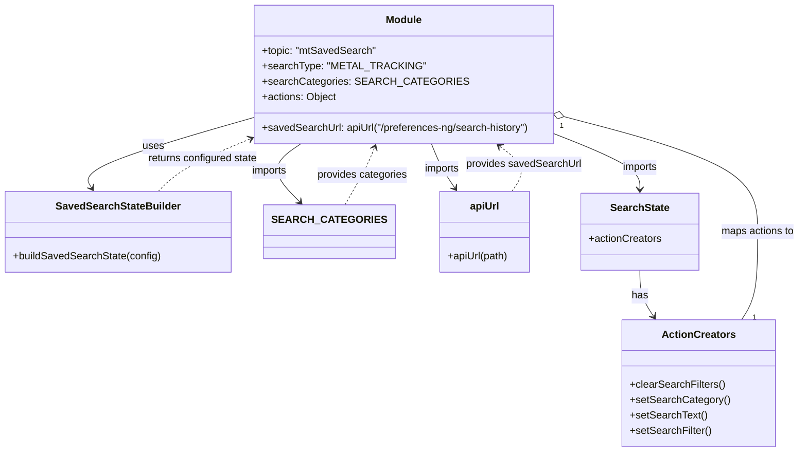

# Diagram: web/portal/src/modules/mt-search/MetalTrackingSavedSearchState.js

> Auto-generated by Obscura crawlers

## Mermaid

### SVG

<svg id="container" width="1231.521484375" xmlns="http://www.w3.org/2000/svg" class="classDiagram" height="704" viewBox="0 0 1231.521484375 704" role="graphics-document document" aria-roledescription="class"><g><defs><marker id="container_class-aggregationStart" class="marker aggregation class" refX="18" refY="7" markerWidth="190" markerHeight="240" orient="auto"><path d="M 18,7 L9,13 L1,7 L9,1 Z"></path></marker></defs><defs><marker id="container_class-aggregationEnd" class="marker aggregation class" refX="1" refY="7" markerWidth="20" markerHeight="28" orient="auto"><path d="M 18,7 L9,13 L1,7 L9,1 Z"></path></marker></defs><defs><marker id="container_class-extensionStart" class="marker extension class" refX="18" refY="7" markerWidth="190" markerHeight="240" orient="auto"><path d="M 1,7 L18,13 V 1 Z"></path></marker></defs><defs><marker id="container_class-extensionEnd" class="marker extension class" refX="1" refY="7" markerWidth="20" markerHeight="28" orient="auto"><path d="M 1,1 V 13 L18,7 Z"></path></marker></defs><defs><marker id="container_class-compositionStart" class="marker composition class" refX="18" refY="7" markerWidth="190" markerHeight="240" orient="auto"><path d="M 18,7 L9,13 L1,7 L9,1 Z"></path></marker></defs><defs><marker id="container_class-compositionEnd" class="marker composition class" refX="1" refY="7" markerWidth="20" markerHeight="28" orient="auto"><path d="M 18,7 L9,13 L1,7 L9,1 Z"></path></marker></defs><defs><marker id="container_class-dependencyStart" class="marker dependency class" refX="6" refY="7" markerWidth="190" markerHeight="240" orient="auto"><path d="M 5,7 L9,13 L1,7 L9,1 Z"></path></marker></defs><defs><marker id="container_class-dependencyEnd" class="marker dependency class" refX="13" refY="7" markerWidth="20" markerHeight="28" orient="auto"><path d="M 18,7 L9,13 L14,7 L9,1 Z"></path></marker></defs><defs><marker id="container_class-lollipopStart" class="marker lollipop class" refX="13" refY="7" markerWidth="190" markerHeight="240" orient="auto"><circle stroke="black" fill="transparent" cx="7" cy="7" r="6"></circle></marker></defs><defs><marker id="container_class-lollipopEnd" class="marker lollipop class" refX="1" refY="7" markerWidth="190" markerHeight="240" orient="auto"><circle stroke="black" fill="transparent" cx="7" cy="7" r="6"></circle></marker></defs><g class="root"><g class="clusters"></g><g class="edgePaths"><path d="M373.547,185.919L331.124,198.433C288.701,210.946,203.854,235.973,164.711,253.802C125.567,271.631,132.127,282.262,135.406,287.578L138.686,292.894" id="id_Module_SavedSearchStateBuilder_1" class="edge-thickness-normal edge-pattern-solid relation" style=";;;" data-edge="true" data-et="edge" data-id="id_Module_SavedSearchStateBuilder_1" data-points="W3sieCI6MzczLjU0Njg3NSwieSI6MTg1LjkxOTAyNjczMTUwODg0fSx7IngiOjExOS4wMDc4MTI1LCJ5IjoyNjF9LHsieCI6MTQxLjgzNjUyMzQzNzUsInkiOjI5OH1d" marker-end="url(#container_class-dependencyEnd)"></path><path d="M456.49,224L447.691,230.167C438.892,236.333,421.295,248.667,420.327,263.749C419.359,278.831,435.02,296.661,442.851,305.577L450.681,314.492" id="id_Module_SEARCH_CATEGORIES_2" class="edge-thickness-normal edge-pattern-solid relation" style=";;;" data-edge="true" data-et="edge" data-id="id_Module_SEARCH_CATEGORIES_2" data-points="W3sieCI6NDU2LjQ4OTU0NzQxMzc5MzEsInkiOjIyNH0seyJ4Ijo0MDMuNjk3MjY1NjI1LCJ5IjoyNjF9LHsieCI6NDU0LjY0MDk3NjU2MjUsInkiOjMxOX1d" marker-end="url(#container_class-dependencyEnd)"></path><path d="M654.924,224L657.455,230.167C659.987,236.333,665.05,248.667,671.26,260.176C677.471,271.686,684.828,282.372,688.507,287.715L692.186,293.058" id="id_Module_apiUrl_3" class="edge-thickness-normal edge-pattern-solid relation" style=";;;" data-edge="true" data-et="edge" data-id="id_Module_apiUrl_3" data-points="W3sieCI6NjU0LjkyMzU0NTI1ODYyMDcsInkiOjIyNH0seyJ4Ijo2NzAuMTEzMjgxMjUsInkiOjI2MX0seyJ4Ijo2OTUuNTg4MzU5Mzc1LCJ5IjoyOTh9XQ==" marker-end="url(#container_class-dependencyEnd)"></path><path d="M847.625,208.447L870.083,217.206C892.541,225.965,937.457,243.482,959.915,257.908C982.373,272.333,982.373,283.667,982.373,289.333L982.373,295" id="id_Module_SearchState_4" class="edge-thickness-normal edge-pattern-solid relation" style=";;;" data-edge="true" data-et="edge" data-id="id_Module_SearchState_4" data-points="W3sieCI6ODQ3LjYyNSwieSI6MjA4LjQ0NzE2NDUwODQxODV9LHsieCI6OTgyLjM3MzA0Njg3NSwieSI6MjYxfSx7IngiOjk4Mi4zNzMwNDY4NzUsInkiOjMwMX1d" marker-end="url(#container_class-dependencyEnd)"></path><path d="M982.373,421L982.373,427.667C982.373,434.333,982.373,447.667,985.971,459.671C989.569,471.675,996.765,482.35,1000.363,487.687L1003.961,493.025" id="id_SearchState_ActionCreators_5" class="edge-thickness-normal edge-pattern-solid relation" style=";;;" data-edge="true" data-et="edge" data-id="id_SearchState_ActionCreators_5" data-points="W3sieCI6OTgyLjM3MzA0Njg3NSwieSI6NDIxfSx7IngiOjk4Mi4zNzMwNDY4NzUsInkiOjQ2MX0seyJ4IjoxMDA3LjMxNDI1MjA2ODAxNDgsInkiOjQ5OH1d" marker-end="url(#container_class-dependencyEnd)"></path><path d="M864.315,182.273L914.55,195.394C964.785,208.515,1065.255,234.758,1115.49,264.546C1165.725,294.333,1165.725,327.667,1165.725,361C1165.725,394.333,1165.725,427.667,1161.568,450.5C1157.411,473.333,1149.097,485.667,1144.94,491.833L1140.783,498" id="id_Module_ActionCreators_6" class="edge-thickness-normal edge-pattern-solid relation" style=";;;" data-edge="true" data-et="edge" data-id="id_Module_ActionCreators_6" data-points="W3sieCI6ODQ3LjYyNSwieSI6MTc3LjkxMzY1NDczODU3NTN9LHsieCI6MTE2NS43MjQ2MDkzNzUsInkiOjI2MX0seyJ4IjoxMTY1LjcyNDYwOTM3NSwieSI6MzYxfSx7IngiOjExNjUuNzI0NjA5Mzc1LCJ5Ijo0NjF9LHsieCI6MTE0MC43ODM0MDQxODE5ODU0LCJ5Ijo0OTh9XQ==" marker-start="url(#container_class-aggregationStart)"></path><path d="M236.042,298L241.459,291.833C246.875,285.667,257.708,273.333,279.705,260.138C301.702,246.943,334.862,232.885,351.442,225.856L368.023,218.828" id="id_SavedSearchStateBuilder_Module_7" class="edge-thickness-normal edge-pattern-dashed relation" style=";;;" data-edge="true" data-et="edge" data-id="id_SavedSearchStateBuilder_Module_7" data-points="W3sieCI6MjM2LjA0MjQ0MTQwNjI1LCJ5IjoyOTh9LHsieCI6MjY4LjU0MTAxNTYyNSwieSI6MjYxfSx7IngiOjM3My41NDY4NzUsInkiOjIxNi40ODU4MTg4NjI4ODIzNX1d" marker-end="url(#container_class-dependencyEnd)"></path><path d="M782.341,298L786.587,291.833C790.833,285.667,799.325,273.333,795.988,261.592C792.652,249.851,777.487,238.703,769.905,233.128L762.323,227.554" id="id_apiUrl_Module_8" class="edge-thickness-normal edge-pattern-dashed relation" style=";;;" data-edge="true" data-et="edge" data-id="id_apiUrl_Module_8" data-points="W3sieCI6NzgyLjM0MTMyODEyNSwieSI6Mjk4fSx7IngiOjgwNy44MTY0MDYyNSwieSI6MjYxfSx7IngiOjc1Ny40ODg2MzE0NjU1MTczLCJ5IjoyMjR9XQ==" marker-end="url(#container_class-dependencyEnd)"></path><path d="M516.533,319L522.287,309.333C528.041,299.667,539.55,280.333,547.456,265.425C555.362,250.517,559.666,240.034,561.818,234.792L563.97,229.55" id="id_SEARCH_CATEGORIES_Module_9" class="edge-thickness-normal edge-pattern-dashed relation" style=";;;" data-edge="true" data-et="edge" data-id="id_SEARCH_CATEGORIES_Module_9" data-points="W3sieCI6NTE2LjUzMjczNDM3NSwieSI6MzE5fSx7IngiOjU1MS4wNTg1OTM3NSwieSI6MjYxfSx7IngiOjU2Ni4yNDgzMjk3NDEzNzkzLCJ5IjoyMjR9XQ==" marker-end="url(#container_class-dependencyEnd)"></path></g><g class="edgeLabels"><g class="edgeLabel" transform="translate(225.42753, 229.60955)"><g class="label" data-id="id_Module_SavedSearchStateBuilder_1" transform="translate(-16.4921875, -12)"><foreignObject width="32.984375" height="24">

uses

</foreignObject></g></g><g class="edgeLabel" transform="translate(407.89736, 265.78186)"><g class="label" data-id="id_Module_SEARCH_CATEGORIES_2" transform="translate(-28.25, -12)"><foreignObject width="56.5" height="24">

imports

</foreignObject></g></g><g class="edgeLabel" transform="translate(671.50985, 263.02838)"><g class="label" data-id="id_Module_apiUrl_3" transform="translate(-28.25, -12)"><foreignObject width="56.5" height="24">

imports

</foreignObject></g></g><g class="edgeLabel" transform="translate(982.373046875, 261)"><g class="label" data-id="id_Module_SearchState_4" transform="translate(-28.25, -12)"><foreignObject width="56.5" height="24">

imports

</foreignObject></g></g><g class="edgeLabel" transform="translate(982.373046875, 461)"><g class="label" data-id="id_SearchState_ActionCreators_5" transform="translate(-12.703125, -12)"><foreignObject width="25.40625" height="24">

has

</foreignObject></g></g><g class="edgeLabel" transform="translate(1165.724609375, 361)"><g class="label" data-id="id_Module_ActionCreators_6" transform="translate(-57.796875, -12)"><foreignObject width="115.59375" height="24">

maps actions to

</foreignObject></g></g><g class="edgeLabel" transform="translate(298.37389, 248.35322)"><g class="label" data-id="id_SavedSearchStateBuilder_Module_7" transform="translate(-86.90625, -12)"><foreignObject width="173.8125" height="24">

returns configured state

</foreignObject></g></g><g class="edgeLabel" transform="translate(800.7492, 255.80433)"><g class="label" data-id="id_apiUrl_Module_8" transform="translate(-89.453125, -12)"><foreignObject width="178.90625" height="24">

provides savedSearchUrl

</foreignObject></g></g><g class="edgeLabel" transform="translate(544.02492, 272.81587)"><g class="label" data-id="id_SEARCH_CATEGORIES_Module_9" transform="translate(-70.8046875, -12)"><foreignObject width="141.609375" height="24">

provides categories

</foreignObject></g></g><g class="edgeTerminals" transform="translate(860.766185987274, 196.8493136298667)"><g class="inner" transform="translate(0, 0)"><foreignObject style="width: 9px; height: 12px;">
1
</foreignObject></g></g><g class="edgeTerminals" transform="translate(1158.0030677449236, 486.8732917384648)"><g class="inner" transform="translate(0, 0)"></g><foreignObject style="width: 9px; height: 12px;">
1
</foreignObject></g></g><g class="nodes"><g class="node default" id="classId-Module-0" transform="translate(610.5859375, 116)"><g class="basic label-container"><path d="M-237.0390625 -108 L237.0390625 -108 L237.0390625 108 L-237.0390625 108" stroke="none" stroke-width="0" fill="#ECECFF" style=""></path><path d="M-237.0390625 -108 C-93.92033564509381 -108, 49.19839120981237 -108, 237.0390625 -108 M-237.0390625 -108 C-111.91849431540732 -108, 13.20207386918537 -108, 237.0390625 -108 M237.0390625 -108 C237.0390625 -40.69849303297967, 237.0390625 26.60301393404066, 237.0390625 108 M237.0390625 -108 C237.0390625 -22.914815707380413, 237.0390625 62.170368585239174, 237.0390625 108 M237.0390625 108 C66.9970940977619 108, -103.0448743044762 108, -237.0390625 108 M237.0390625 108 C53.954541987214895 108, -129.1299785255702 108, -237.0390625 108 M-237.0390625 108 C-237.0390625 36.59289546486767, -237.0390625 -34.81420907026467, -237.0390625 -108 M-237.0390625 108 C-237.0390625 47.593173836458355, -237.0390625 -12.81365232708329, -237.0390625 -108" stroke="#9370DB" stroke-width="1.3" fill="none" stroke-dasharray="0 0" style=""></path></g><g class="annotation-group text" transform="translate(0, -84)"></g><g class="label-group text" transform="translate(-27.09375, -84)"><g class="label" style="font-weight: bolder" transform="translate(0,-12)"><foreignObject width="54.1875" height="24">

Module

</foreignObject></g></g><g class="members-group text" transform="translate(-225.0390625, -36)"><g class="label" style="" transform="translate(0,-12)"><foreignObject width="176.6875" height="24">

+topic: "mtSavedSearch"

</foreignObject></g><g class="label" style="" transform="translate(0,12)"><foreignObject width="234.09375" height="24">

+searchType: "METAL_TRACKING"

</foreignObject></g><g class="label" style="" transform="translate(0,36)"><foreignObject width="289.734375" height="24">

+searchCategories: SEARCH_CATEGORIES

</foreignObject></g><g class="label" style="" transform="translate(0,60)"><foreignObject width="115.859375" height="24">

+actions: Object

</foreignObject></g></g><g class="methods-group text" transform="translate(-225.0390625, 84)"><g class="label" style="" transform="translate(0,-12)"><foreignObject width="422.984375" height="24">

+savedSearchUrl: apiUrl("/preferences-ng/search-history")

</foreignObject></g></g><g class="divider" style=""><path d="M-237.0390625 -60 C-129.32273939256902 -60, -21.606416285138067 -60, 237.0390625 -60 M-237.0390625 -60 C-91.6506324650484 -60, 53.737797569903194 -60, 237.0390625 -60" stroke="#9370DB" stroke-width="1.3" fill="none" stroke-dasharray="0 0" style=""></path></g><g class="divider" style=""><path d="M-237.0390625 60 C-48.72952111198225 60, 139.5800202760355 60, 237.0390625 60 M-237.0390625 60 C-88.09298653155133 60, 60.853089436897335 60, 237.0390625 60" stroke="#9370DB" stroke-width="1.3" fill="none" stroke-dasharray="0 0" style=""></path></g></g><g class="node default" id="classId-SavedSearchStateBuilder-1" transform="translate(180.70703125, 361)"><g class="basic label-container"><path d="M-172.70703125 -63 L172.70703125 -63 L172.70703125 63 L-172.70703125 63" stroke="none" stroke-width="0" fill="#ECECFF" style=""></path><path d="M-172.70703125 -63 C-54.21537496182211 -63, 64.27628132635579 -63, 172.70703125 -63 M-172.70703125 -63 C-56.86614800345491 -63, 58.97473524309018 -63, 172.70703125 -63 M172.70703125 -63 C172.70703125 -30.10969851674063, 172.70703125 2.7806029665187424, 172.70703125 63 M172.70703125 -63 C172.70703125 -15.00596545098582, 172.70703125 32.98806909802836, 172.70703125 63 M172.70703125 63 C42.01536523366906 63, -88.67630078266188 63, -172.70703125 63 M172.70703125 63 C36.07394317334379 63, -100.55914490331241 63, -172.70703125 63 M-172.70703125 63 C-172.70703125 15.104390787737337, -172.70703125 -32.791218424525326, -172.70703125 -63 M-172.70703125 63 C-172.70703125 33.870091991634695, -172.70703125 4.740183983269382, -172.70703125 -63" stroke="#9370DB" stroke-width="1.3" fill="none" stroke-dasharray="0 0" style=""></path></g><g class="annotation-group text" transform="translate(0, -39)"></g><g class="label-group text" transform="translate(-92.6484375, -39)"><g class="label" style="font-weight: bolder" transform="translate(0,-12)"><foreignObject width="185.296875" height="24">

SavedSearchStateBuilder

</foreignObject></g></g><g class="members-group text" transform="translate(-160.70703125, 9)"></g><g class="methods-group text" transform="translate(-160.70703125, 39)"><g class="label" style="" transform="translate(0,-12)"><foreignObject width="228.765625" height="24">

+buildSavedSearchState(config)

</foreignObject></g></g><g class="divider" style=""><path d="M-172.70703125 -15 C-79.87596684148613 -15, 12.955097567027735 -15, 172.70703125 -15 M-172.70703125 -15 C-71.16129721284366 -15, 30.384436824312672 -15, 172.70703125 -15" stroke="#9370DB" stroke-width="1.3" fill="none" stroke-dasharray="0 0" style=""></path></g><g class="divider" style=""><path d="M-172.70703125 9 C-56.047514266210754 9, 60.61200271757849 9, 172.70703125 9 M-172.70703125 9 C-100.01511068498284 9, -27.323190119965687 9, 172.70703125 9" stroke="#9370DB" stroke-width="1.3" fill="none" stroke-dasharray="0 0" style=""></path></g></g><g class="node default" id="classId-SEARCH_CATEGORIES-2" transform="translate(491.53125, 361)"><g class="basic label-container"><path d="M-88.1171875 -42 L88.1171875 -42 L88.1171875 42 L-88.1171875 42" stroke="none" stroke-width="0" fill="#ECECFF" style=""></path><path d="M-88.1171875 -42 C-49.93079233274783 -42, -11.744397165495656 -42, 88.1171875 -42 M-88.1171875 -42 C-21.69223670179025 -42, 44.7327140964195 -42, 88.1171875 -42 M88.1171875 -42 C88.1171875 -10.93511298842849, 88.1171875 20.12977402314302, 88.1171875 42 M88.1171875 -42 C88.1171875 -20.57507287878719, 88.1171875 0.8498542424256215, 88.1171875 42 M88.1171875 42 C45.07533161218683 42, 2.033475724373659 42, -88.1171875 42 M88.1171875 42 C30.814354876865472 42, -26.488477746269055 42, -88.1171875 42 M-88.1171875 42 C-88.1171875 11.610746137804863, -88.1171875 -18.778507724390273, -88.1171875 -42 M-88.1171875 42 C-88.1171875 11.862173431613986, -88.1171875 -18.27565313677203, -88.1171875 -42" stroke="#9370DB" stroke-width="1.3" fill="none" stroke-dasharray="0 0" style=""></path></g><g class="annotation-group text" transform="translate(0, -18)"></g><g class="label-group text" transform="translate(-76.1171875, -18)"><g class="label" style="font-weight: bolder" transform="translate(0,-12)"><foreignObject width="152.234375" height="24">

SEARCH_CATEGORIES

</foreignObject></g></g><g class="members-group text" transform="translate(-76.1171875, 30)"></g><g class="methods-group text" transform="translate(-76.1171875, 60)"></g><g class="divider" style=""><path d="M-88.1171875 6 C-27.70501957887884 6, 32.70714834224232 6, 88.1171875 6 M-88.1171875 6 C-31.40483713946754 6, 25.307513221064923 6, 88.1171875 6" stroke="#9370DB" stroke-width="1.3" fill="none" stroke-dasharray="0 0" style=""></path></g><g class="divider" style=""><path d="M-88.1171875 24 C-25.504731474014292 24, 37.107724551971415 24, 88.1171875 24 M-88.1171875 24 C-48.16139569449406 24, -8.205603888988122 24, 88.1171875 24" stroke="#9370DB" stroke-width="1.3" fill="none" stroke-dasharray="0 0" style=""></path></g></g><g class="node default" id="classId-apiUrl-3" transform="translate(738.96484375, 361)"><g class="basic label-container"><path d="M-70.85546875 -63 L70.85546875 -63 L70.85546875 63 L-70.85546875 63" stroke="none" stroke-width="0" fill="#ECECFF" style=""></path><path d="M-70.85546875 -63 C-36.05768461093756 -63, -1.2599004718751132 -63, 70.85546875 -63 M-70.85546875 -63 C-35.82557585038691 -63, -0.7956829507738234 -63, 70.85546875 -63 M70.85546875 -63 C70.85546875 -17.525150140802417, 70.85546875 27.949699718395166, 70.85546875 63 M70.85546875 -63 C70.85546875 -26.6848736689207, 70.85546875 9.630252662158597, 70.85546875 63 M70.85546875 63 C14.405612463208207 63, -42.044243823583585 63, -70.85546875 63 M70.85546875 63 C21.18973829157376 63, -28.47599216685248 63, -70.85546875 63 M-70.85546875 63 C-70.85546875 23.275940758825698, -70.85546875 -16.448118482348605, -70.85546875 -63 M-70.85546875 63 C-70.85546875 14.715471171789254, -70.85546875 -33.56905765642149, -70.85546875 -63" stroke="#9370DB" stroke-width="1.3" fill="none" stroke-dasharray="0 0" style=""></path></g><g class="annotation-group text" transform="translate(0, -39)"></g><g class="label-group text" transform="translate(-22.2109375, -39)"><g class="label" style="font-weight: bolder" transform="translate(0,-12)"><foreignObject width="44.421875" height="24">

apiUrl

</foreignObject></g></g><g class="members-group text" transform="translate(-58.85546875, 9)"></g><g class="methods-group text" transform="translate(-58.85546875, 39)"><g class="label" style="" transform="translate(0,-12)"><foreignObject width="95.5" height="24">

+apiUrl(path)

</foreignObject></g></g><g class="divider" style=""><path d="M-70.85546875 -15 C-26.821823105956966 -15, 17.211822538086068 -15, 70.85546875 -15 M-70.85546875 -15 C-27.4338917430764 -15, 15.987685263847197 -15, 70.85546875 -15" stroke="#9370DB" stroke-width="1.3" fill="none" stroke-dasharray="0 0" style=""></path></g><g class="divider" style=""><path d="M-70.85546875 9 C-33.03671007329082 9, 4.78204860341836 9, 70.85546875 9 M-70.85546875 9 C-27.91990772648959 9, 15.015653297020819 9, 70.85546875 9" stroke="#9370DB" stroke-width="1.3" fill="none" stroke-dasharray="0 0" style=""></path></g></g><g class="node default" id="classId-SearchState-4" transform="translate(982.373046875, 361)"><g class="basic label-container"><path d="M-90.5546875 -60 L90.5546875 -60 L90.5546875 60 L-90.5546875 60" stroke="none" stroke-width="0" fill="#ECECFF" style=""></path><path d="M-90.5546875 -60 C-50.43620802056456 -60, -10.317728541129114 -60, 90.5546875 -60 M-90.5546875 -60 C-26.368367338377567 -60, 37.817952823244866 -60, 90.5546875 -60 M90.5546875 -60 C90.5546875 -32.15391584184707, 90.5546875 -4.307831683694147, 90.5546875 60 M90.5546875 -60 C90.5546875 -18.227376628908836, 90.5546875 23.54524674218233, 90.5546875 60 M90.5546875 60 C42.470438024496026 60, -5.6138114510079475 60, -90.5546875 60 M90.5546875 60 C46.54702612275834 60, 2.5393647455166786 60, -90.5546875 60 M-90.5546875 60 C-90.5546875 33.73454444532706, -90.5546875 7.46908889065412, -90.5546875 -60 M-90.5546875 60 C-90.5546875 22.45485733606644, -90.5546875 -15.090285327867122, -90.5546875 -60" stroke="#9370DB" stroke-width="1.3" fill="none" stroke-dasharray="0 0" style=""></path></g><g class="annotation-group text" transform="translate(0, -36)"></g><g class="label-group text" transform="translate(-44.03125, -36)"><g class="label" style="font-weight: bolder" transform="translate(0,-12)"><foreignObject width="88.0625" height="24">

SearchState

</foreignObject></g></g><g class="members-group text" transform="translate(-78.5546875, 12)"><g class="label" style="" transform="translate(0,-12)"><foreignObject width="113.078125" height="24">

+actionCreators

</foreignObject></g></g><g class="methods-group text" transform="translate(-78.5546875, 60)"></g><g class="divider" style=""><path d="M-90.5546875 -12 C-23.17339777149091 -12, 44.20789195701818 -12, 90.5546875 -12 M-90.5546875 -12 C-33.11438627040639 -12, 24.325914959187216 -12, 90.5546875 -12" stroke="#9370DB" stroke-width="1.3" fill="none" stroke-dasharray="0 0" style=""></path></g><g class="divider" style=""><path d="M-90.5546875 36 C-45.322519859930814 36, -0.09035221986162867 36, 90.5546875 36 M-90.5546875 36 C-20.693927055339472 36, 49.166833389321056 36, 90.5546875 36" stroke="#9370DB" stroke-width="1.3" fill="none" stroke-dasharray="0 0" style=""></path></g></g><g class="node default" id="classId-ActionCreators-5" transform="translate(1074.048828125, 597)"><g class="basic label-container"><path d="M-115.109375 -99 L115.109375 -99 L115.109375 99 L-115.109375 99" stroke="none" stroke-width="0" fill="#ECECFF" style=""></path><path d="M-115.109375 -99 C-31.894743696611016 -99, 51.31988760677797 -99, 115.109375 -99 M-115.109375 -99 C-42.10235812289855 -99, 30.9046587542029 -99, 115.109375 -99 M115.109375 -99 C115.109375 -42.99551117894984, 115.109375 13.00897764210032, 115.109375 99 M115.109375 -99 C115.109375 -47.59132733010752, 115.109375 3.817345339784964, 115.109375 99 M115.109375 99 C47.17824254723361 99, -20.752889905532783 99, -115.109375 99 M115.109375 99 C31.70763454841388 99, -51.69410590317224 99, -115.109375 99 M-115.109375 99 C-115.109375 21.027554052192087, -115.109375 -56.944891895615825, -115.109375 -99 M-115.109375 99 C-115.109375 29.31040855724281, -115.109375 -40.37918288551438, -115.109375 -99" stroke="#9370DB" stroke-width="1.3" fill="none" stroke-dasharray="0 0" style=""></path></g><g class="annotation-group text" transform="translate(0, -75)"></g><g class="label-group text" transform="translate(-53.96875, -75)"><g class="label" style="font-weight: bolder" transform="translate(0,-12)"><foreignObject width="107.9375" height="24">

ActionCreators

</foreignObject></g></g><g class="members-group text" transform="translate(-103.109375, -27)"></g><g class="methods-group text" transform="translate(-103.109375, 3)"><g class="label" style="" transform="translate(0,-12)"><foreignObject width="146.921875" height="24">

+clearSearchFilters()

</foreignObject></g><g class="label" style="" transform="translate(0,12)"><foreignObject width="152.25" height="24">

+setSearchCategory()

</foreignObject></g><g class="label" style="" transform="translate(0,36)"><foreignObject width="118.53125" height="24">

+setSearchText()

</foreignObject></g><g class="label" style="" transform="translate(0,60)"><foreignObject width="125.953125" height="24">

+setSearchFilter()

</foreignObject></g></g><g class="divider" style=""><path d="M-115.109375 -51 C-54.03466628368743 -51, 7.0400424326251425 -51, 115.109375 -51 M-115.109375 -51 C-67.08751645817617 -51, -19.065657916352336 -51, 115.109375 -51" stroke="#9370DB" stroke-width="1.3" fill="none" stroke-dasharray="0 0" style=""></path></g><g class="divider" style=""><path d="M-115.109375 -27 C-57.32355327625052 -27, 0.4622684474989569 -27, 115.109375 -27 M-115.109375 -27 C-66.3627826029867 -27, -17.616190205973382 -27, 115.109375 -27" stroke="#9370DB" stroke-width="1.3" fill="none" stroke-dasharray="0 0" style=""></path></g></g></g></g></g></svg>
