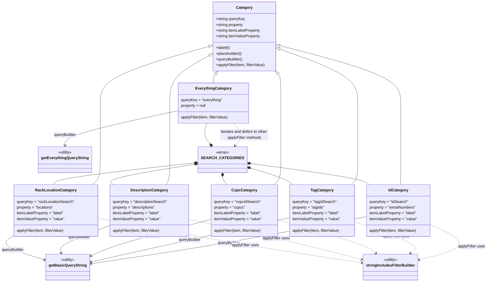

# Diagram: web/portal/src/modules/mt-search/MetalTrackingSearchBarCategoryDefs.js

> Auto-generated by Obscura crawlers

## Mermaid

```mermaid
classDiagram
class Category {
  +string queryKey
  +label(t)
  +placeholder(t)
  +queryBuilder()
  +string property
  +string itemLabelProperty
  +string itemValueProperty
  +applyFilter(item, filterValue)
}
class EverythingCategory {
  queryKey = "everything"
  property = null
  applyFilter(item, filterValue)
}
class IdCategory {
  queryKey = "idSearch"
  property = "serialNumbers"
  itemLabelProperty = "label"
  itemValueProperty = "value"
  applyFilter(item, filterValue)
}
class TagCategory {
  queryKey = "tagIdSearch"
  property = "tagIds"
  itemLabelProperty = "label"
  itemValueProperty = "value"
  applyFilter(item, filterValue)
}
class CspcCategory {
  queryKey = "cspcIdSearch"
  property = "cspcs"
  itemLabelProperty = "label"
  itemValueProperty = "value"
  applyFilter(item, filterValue)
}
class DescriptionCategory {
  queryKey = "descriptionSearch"
  property = "descriptions"
  itemLabelProperty = "label"
  itemValueProperty = "value"
  applyFilter(item, filterValue)
}
class RackLocationCategory {
  queryKey = "rackLocationSearch"
  property = "locations"
  itemLabelProperty = "label"
  itemValueProperty = "value"
  applyFilter(item, filterValue)
}
class getBasicQueryString <<utility>>
class getEverythingQueryString <<utility>>
class stringIncludesFilterBuilder <<utility>>
class SEARCH_CATEGORIES <<array>>

Category <|-- EverythingCategory
Category <|-- IdCategory
Category <|-- TagCategory
Category <|-- CspcCategory
Category <|-- DescriptionCategory
Category <|-- RackLocationCategory

EverythingCategory --> getEverythingQueryString : queryBuilder
IdCategory --> getBasicQueryString : queryBuilder
TagCategory --> getBasicQueryString : queryBuilder
CspcCategory --> getBasicQueryString : queryBuilder
DescriptionCategory --> getBasicQueryString : queryBuilder
RackLocationCategory --> getBasicQueryString : queryBuilder

IdCategory ..> stringIncludesFilterBuilder : applyFilter uses
TagCategory ..> stringIncludesFilterBuilder : applyFilter uses
CspcCategory ..> stringIncludesFilterBuilder : applyFilter uses
DescriptionCategory ..> stringIncludesFilterBuilder : applyFilter uses
RackLocationCategory ..> stringIncludesFilterBuilder : applyFilter uses

SEARCH_CATEGORIES *-- EverythingCategory
SEARCH_CATEGORIES *-- IdCategory
SEARCH_CATEGORIES *-- TagCategory
SEARCH_CATEGORIES *-- CspcCategory
SEARCH_CATEGORIES *-- DescriptionCategory
SEARCH_CATEGORIES *-- RackLocationCategory

EverythingCategory ..> SEARCH_CATEGORIES : iterates and defers to other applyFilter methods
```

> SVG rendering failed for this diagram.
