# Diagram: web/portal/src/modules/mt-search/MetalTrackingSearchBarContainer.js

> Auto-generated by Obscura crawlers

## Mermaid

```mermaid
classDiagram
class SearchBar
class mapStateToProps {
  +typeaheadOptionsMetadata
  +searchText
  +searchCategory
  +ignoreSearchCategory
  +solutionId
  +serialNumbers
  +locations
  +descriptions
  +tagIds
  +cspcs
}
class mapDispatchToProps {
  +setSearchCategory()
  +setSearchText()
  +clearSearchText()
  +resetSearchBar()
  +clearSavedSearch()
  +searchEntities()
  +fetchDomainData()
}
class SearchBarState_selectors {
  +getSearchText()
  +getSearchCategory()
  +getIgnoreSearchCategory()
  +getTypeaheadOptionsMetadata()
}
class SearchBarState_actionCreators {
  +setSearchCategoryForKey()
  +setSearchText()
  +clearSearchText()
  +resetSearchBar()
  +clearSavedSearch()
  +searchEntities()
}
class MetalTrackingDomainData_selectors {
  +getSerialNumbers()
  +getLocations()
  +getDescriptions()
  +getTagIds()
  +getCspcs()
}
class MetalTrackingDomainData_actionCreators {
  +fetchDomainData()
}
class OrganizationsState {
  +getSolutionId()
}
class connect_HOC

mapStateToProps ..> SearchBarState_selectors : uses
mapStateToProps ..> MetalTrackingDomainData_selectors : uses
mapStateToProps ..> OrganizationsState : uses
mapDispatchToProps ..> SearchBarState_actionCreators : uses
mapDispatchToProps ..> MetalTrackingDomainData_actionCreators : uses
connect_HOC ..> mapStateToProps : injects state
connect_HOC ..> mapDispatchToProps : injects dispatch
connect_HOC --> SearchBar : wraps and exports
```

### SVG

<svg id="container" width="1764.6171875" xmlns="http://www.w3.org/2000/svg" class="classDiagram" height="830" viewBox="0 0 1764.6171875 830" role="graphics-document document" aria-roledescription="class"><g><defs><marker id="container_class-aggregationStart" class="marker aggregation class" refX="18" refY="7" markerWidth="190" markerHeight="240" orient="auto"><path d="M 18,7 L9,13 L1,7 L9,1 Z"></path></marker></defs><defs><marker id="container_class-aggregationEnd" class="marker aggregation class" refX="1" refY="7" markerWidth="20" markerHeight="28" orient="auto"><path d="M 18,7 L9,13 L1,7 L9,1 Z"></path></marker></defs><defs><marker id="container_class-extensionStart" class="marker extension class" refX="18" refY="7" markerWidth="190" markerHeight="240" orient="auto"><path d="M 1,7 L18,13 V 1 Z"></path></marker></defs><defs><marker id="container_class-extensionEnd" class="marker extension class" refX="1" refY="7" markerWidth="20" markerHeight="28" orient="auto"><path d="M 1,1 V 13 L18,7 Z"></path></marker></defs><defs><marker id="container_class-compositionStart" class="marker composition class" refX="18" refY="7" markerWidth="190" markerHeight="240" orient="auto"><path d="M 18,7 L9,13 L1,7 L9,1 Z"></path></marker></defs><defs><marker id="container_class-compositionEnd" class="marker composition class" refX="1" refY="7" markerWidth="20" markerHeight="28" orient="auto"><path d="M 18,7 L9,13 L1,7 L9,1 Z"></path></marker></defs><defs><marker id="container_class-dependencyStart" class="marker dependency class" refX="6" refY="7" markerWidth="190" markerHeight="240" orient="auto"><path d="M 5,7 L9,13 L1,7 L9,1 Z"></path></marker></defs><defs><marker id="container_class-dependencyEnd" class="marker dependency class" refX="13" refY="7" markerWidth="20" markerHeight="28" orient="auto"><path d="M 18,7 L9,13 L14,7 L9,1 Z"></path></marker></defs><defs><marker id="container_class-lollipopStart" class="marker lollipop class" refX="13" refY="7" markerWidth="190" markerHeight="240" orient="auto"><circle stroke="black" fill="transparent" cx="7" cy="7" r="6"></circle></marker></defs><defs><marker id="container_class-lollipopEnd" class="marker lollipop class" refX="1" refY="7" markerWidth="190" markerHeight="240" orient="auto"><circle stroke="black" fill="transparent" cx="7" cy="7" r="6"></circle></marker></defs><g class="root"><g class="clusters"></g><g class="edgePaths"><path d="M424.223,413.63L385.072,434.525C345.922,455.42,267.621,497.21,228.471,527.272C189.32,557.333,189.32,575.667,189.32,584.833L189.32,594" id="id_mapStateToProps_SearchBarState_selectors_1" class="edge-thickness-normal edge-pattern-dashed relation" style=";;;" data-edge="true" data-et="edge" data-id="id_mapStateToProps_SearchBarState_selectors_1" data-points="W3sieCI6NDI0LjIyMjY1NjI1LCJ5Ijo0MTMuNjI5NTYzNzE0MDI0Mn0seyJ4IjoxODkuMzIwMzEyNSwieSI6NTM5fSx7IngiOjE4OS4zMjAzMTI1LCJ5Ijo2MDB9XQ==" marker-end="url(#container_class-dependencyEnd)"></path><path d="M573.422,502L573.422,508.167C573.422,514.333,573.422,526.667,573.422,540C573.422,553.333,573.422,567.667,573.422,574.833L573.422,582" id="id_mapStateToProps_MetalTrackingDomainData_selectors_2" class="edge-thickness-normal edge-pattern-dashed relation" style=";;;" data-edge="true" data-et="edge" data-id="id_mapStateToProps_MetalTrackingDomainData_selectors_2" data-points="W3sieCI6NTczLjQyMTg3NSwieSI6NTAyfSx7IngiOjU3My40MjE4NzUsInkiOjUzOX0seyJ4Ijo1NzMuNDIxODc1LCJ5Ijo1ODh9XQ==" marker-end="url(#container_class-dependencyEnd)"></path><path d="M722.621,433.351L749.064,450.959C775.507,468.568,828.392,503.784,854.835,536.559C881.277,569.333,881.277,599.667,881.277,614.833L881.277,630" id="id_mapStateToProps_OrganizationsState_3" class="edge-thickness-normal edge-pattern-dashed relation" style=";;;" data-edge="true" data-et="edge" data-id="id_mapStateToProps_OrganizationsState_3" data-points="W3sieCI6NzIyLjYyMTA5Mzc1LCJ5Ijo0MzMuMzUxMjk2MTM4ODYzODZ9LHsieCI6ODgxLjI3NzM0Mzc1LCJ5Ijo1Mzl9LHsieCI6ODgxLjI3NzM0Mzc1LCJ5Ijo2MzZ9XQ==" marker-end="url(#container_class-dependencyEnd)"></path><path d="M1395.83,416.005L1364.153,436.504C1332.475,457.003,1269.12,498.002,1237.443,523.668C1205.766,549.333,1205.766,559.667,1205.766,564.833L1205.766,570" id="id_mapDispatchToProps_SearchBarState_actionCreators_4" class="edge-thickness-normal edge-pattern-dashed relation" style=";;;" data-edge="true" data-et="edge" data-id="id_mapDispatchToProps_SearchBarState_actionCreators_4" data-points="W3sieCI6MTM5NS44MzAwNzgxMjUsInkiOjQxNi4wMDUwNTU2NDI4OTl9LHsieCI6MTIwNS43NjU2MjUsInkiOjUzOX0seyJ4IjoxMjA1Ljc2NTYyNSwieSI6NTc2fV0=" marker-end="url(#container_class-dependencyEnd)"></path><path d="M1567.561,469L1571.45,480.667C1575.34,492.333,1583.119,515.667,1587.009,542.5C1590.898,569.333,1590.898,599.667,1590.898,614.833L1590.898,630" id="id_mapDispatchToProps_MetalTrackingDomainData_actionCreators_5" class="edge-thickness-normal edge-pattern-dashed relation" style=";;;" data-edge="true" data-et="edge" data-id="id_mapDispatchToProps_MetalTrackingDomainData_actionCreators_5" data-points="W3sieCI6MTU2Ny41NjA4ODAzMzUzNjYsInkiOjQ2OX0seyJ4IjoxNTkwLjg5ODQzNzUsInkiOjUzOX0seyJ4IjoxNTkwLjg5ODQzNzUsInkiOjYzNn1d" marker-end="url(#container_class-dependencyEnd)"></path><path d="M573.422,92L573.422,98.167C573.422,104.333,573.422,116.667,573.422,128C573.422,139.333,573.422,149.667,573.422,154.833L573.422,160" id="id_connect_HOC_mapStateToProps_6" class="edge-thickness-normal edge-pattern-dashed relation" style=";;;" data-edge="true" data-et="edge" data-id="id_connect_HOC_mapStateToProps_6" data-points="W3sieCI6NTczLjQyMTg3NSwieSI6OTJ9LHsieCI6NTczLjQyMTg3NSwieSI6MTI5fSx7IngiOjU3My40MjE4NzUsInkiOjE2Nn1d" marker-end="url(#container_class-dependencyEnd)"></path><path d="M633.953,55.038L782.053,67.365C930.153,79.692,1226.353,104.346,1374.453,127.34C1522.553,150.333,1522.553,171.667,1522.553,182.333L1522.553,193" id="id_connect_HOC_mapDispatchToProps_7" class="edge-thickness-normal edge-pattern-dashed relation" style=";;;" data-edge="true" data-et="edge" data-id="id_connect_HOC_mapDispatchToProps_7" data-points="W3sieCI6NjMzLjk1MzEyNSwieSI6NTUuMDM4MjYwNzQ0MzA3Nn0seyJ4IjoxNTIyLjU1MjczNDM3NSwieSI6MTI5fSx7IngiOjE1MjIuNTUyNzM0Mzc1LCJ5IjoxOTl9XQ==" marker-end="url(#container_class-dependencyEnd)"></path><path d="M512.891,69.248L481.572,79.207C450.254,89.165,387.617,109.083,356.299,145.208C324.98,181.333,324.98,233.667,324.98,259.833L324.98,286" id="id_connect_HOC_SearchBar_8" class="edge-thickness-normal edge-pattern-solid relation" style=";;;" data-edge="true" data-et="edge" data-id="id_connect_HOC_SearchBar_8" data-points="W3sieCI6NTEyLjg5MDYyNSwieSI6NjkuMjQ3ODczNDYxMTA5MX0seyJ4IjozMjQuOTgwNDY4NzUsInkiOjEyOX0seyJ4IjozMjQuOTgwNDY4NzUsInkiOjI5Mn1d" marker-end="url(#container_class-dependencyEnd)"></path></g><g class="edgeLabels"><g class="edgeLabel" transform="translate(189.3203125, 539)"><g class="label" data-id="id_mapStateToProps_SearchBarState_selectors_1" transform="translate(-16.4921875, -12)"><foreignObject width="32.984375" height="24">

uses

</foreignObject></g></g><g class="edgeLabel" transform="translate(573.421875, 539)"><g class="label" data-id="id_mapStateToProps_MetalTrackingDomainData_selectors_2" transform="translate(-16.4921875, -12)"><foreignObject width="32.984375" height="24">

uses

</foreignObject></g></g><g class="edgeLabel" transform="translate(881.27734375, 539)"><g class="label" data-id="id_mapStateToProps_OrganizationsState_3" transform="translate(-16.4921875, -12)"><foreignObject width="32.984375" height="24">

uses

</foreignObject></g></g><g class="edgeLabel" transform="translate(1205.765625, 539)"><g class="label" data-id="id_mapDispatchToProps_SearchBarState_actionCreators_4" transform="translate(-16.4921875, -12)"><foreignObject width="32.984375" height="24">

uses

</foreignObject></g></g><g class="edgeLabel" transform="translate(1590.8984375, 539)"><g class="label" data-id="id_mapDispatchToProps_MetalTrackingDomainData_actionCreators_5" transform="translate(-16.4921875, -12)"><foreignObject width="32.984375" height="24">

uses

</foreignObject></g></g><g class="edgeLabel" transform="translate(573.421875, 129)"><g class="label" data-id="id_connect_HOC_mapStateToProps_6" transform="translate(-44.1640625, -12)"><foreignObject width="88.328125" height="24">

injects state

</foreignObject></g></g><g class="edgeLabel" transform="translate(1522.552734375, 129)"><g class="label" data-id="id_connect_HOC_mapDispatchToProps_7" transform="translate(-57.1953125, -12)"><foreignObject width="114.390625" height="24">

injects dispatch

</foreignObject></g></g><g class="edgeLabel" transform="translate(324.98046875, 129)"><g class="label" data-id="id_connect_HOC_SearchBar_8" transform="translate(-66.7578125, -12)"><foreignObject width="133.515625" height="24">

wraps and exports

</foreignObject></g></g></g><g class="nodes"><g class="node default" id="classId-SearchBar-0" transform="translate(324.98046875, 334)"><g class="basic label-container"><path d="M-49.2421875 -42 L49.2421875 -42 L49.2421875 42 L-49.2421875 42" stroke="none" stroke-width="0" fill="#ECECFF" style=""></path><path d="M-49.2421875 -42 C-17.683347376513165 -42, 13.87549274697367 -42, 49.2421875 -42 M-49.2421875 -42 C-19.656448332793108 -42, 9.929290834413784 -42, 49.2421875 -42 M49.2421875 -42 C49.2421875 -17.706415809622357, 49.2421875 6.587168380755287, 49.2421875 42 M49.2421875 -42 C49.2421875 -16.962000307336748, 49.2421875 8.075999385326504, 49.2421875 42 M49.2421875 42 C16.44297110730936 42, -16.356245285381277 42, -49.2421875 42 M49.2421875 42 C21.824797705093303 42, -5.592592089813394 42, -49.2421875 42 M-49.2421875 42 C-49.2421875 18.330612478860655, -49.2421875 -5.338775042278691, -49.2421875 -42 M-49.2421875 42 C-49.2421875 24.732182158750213, -49.2421875 7.464364317500426, -49.2421875 -42" stroke="#9370DB" stroke-width="1.3" fill="none" stroke-dasharray="0 0" style=""></path></g><g class="annotation-group text" transform="translate(0, -18)"></g><g class="label-group text" transform="translate(-37.2421875, -18)"><g class="label" style="font-weight: bolder" transform="translate(0,-12)"><foreignObject width="74.484375" height="24">

SearchBar

</foreignObject></g></g><g class="members-group text" transform="translate(-37.2421875, 30)"></g><g class="methods-group text" transform="translate(-37.2421875, 60)"></g><g class="divider" style=""><path d="M-49.2421875 6 C-12.267584907617923 6, 24.707017684764153 6, 49.2421875 6 M-49.2421875 6 C-23.08927431958484 6, 3.0636388608303236 6, 49.2421875 6" stroke="#9370DB" stroke-width="1.3" fill="none" stroke-dasharray="0 0" style=""></path></g><g class="divider" style=""><path d="M-49.2421875 24 C-22.86869935846914 24, 3.50478878306172 24, 49.2421875 24 M-49.2421875 24 C-21.04248959270519 24, 7.157208314589617 24, 49.2421875 24" stroke="#9370DB" stroke-width="1.3" fill="none" stroke-dasharray="0 0" style=""></path></g></g><g class="node default" id="classId-mapStateToProps-1" transform="translate(573.421875, 334)"><g class="basic label-container"><path d="M-149.19921875 -168 L149.19921875 -168 L149.19921875 168 L-149.19921875 168" stroke="none" stroke-width="0" fill="#ECECFF" style=""></path><path d="M-149.19921875 -168 C-60.54976090379708 -168, 28.099696942405842 -168, 149.19921875 -168 M-149.19921875 -168 C-50.306743779548825 -168, 48.58573119090235 -168, 149.19921875 -168 M149.19921875 -168 C149.19921875 -64.93703874748358, 149.19921875 38.12592250503283, 149.19921875 168 M149.19921875 -168 C149.19921875 -97.25843276652593, 149.19921875 -26.516865533051856, 149.19921875 168 M149.19921875 168 C55.11817540207569 168, -38.962867945848615 168, -149.19921875 168 M149.19921875 168 C82.45006722324986 168, 15.70091569649972 168, -149.19921875 168 M-149.19921875 168 C-149.19921875 83.54570832482608, -149.19921875 -0.9085833503478398, -149.19921875 -168 M-149.19921875 168 C-149.19921875 62.74684963951667, -149.19921875 -42.506300720966664, -149.19921875 -168" stroke="#9370DB" stroke-width="1.3" fill="none" stroke-dasharray="0 0" style=""></path></g><g class="annotation-group text" transform="translate(0, -144)"></g><g class="label-group text" transform="translate(-64.7109375, -144)"><g class="label" style="font-weight: bolder" transform="translate(0,-12)"><foreignObject width="129.421875" height="24">

mapStateToProps

</foreignObject></g></g><g class="members-group text" transform="translate(-137.19921875, -96)"><g class="label" style="" transform="translate(0,-12)"><foreignObject width="209.6875" height="24">

+typeaheadOptionsMetadata

</foreignObject></g><g class="label" style="" transform="translate(0,12)"><foreignObject width="84.953125" height="24">

+searchText

</foreignObject></g><g class="label" style="" transform="translate(0,36)"><foreignObject width="118.65625" height="24">

+searchCategory

</foreignObject></g><g class="label" style="" transform="translate(0,60)"><foreignObject width="165.875" height="24">

+ignoreSearchCategory

</foreignObject></g><g class="label" style="" transform="translate(0,84)"><foreignObject width="82.109375" height="24">

+solutionId

</foreignObject></g><g class="label" style="" transform="translate(0,108)"><foreignObject width="113.6875" height="24">

+serialNumbers

</foreignObject></g><g class="label" style="" transform="translate(0,132)"><foreignObject width="74.609375" height="24">

+locations

</foreignObject></g><g class="label" style="" transform="translate(0,156)"><foreignObject width="98.078125" height="24">

+descriptions

</foreignObject></g><g class="label" style="" transform="translate(0,180)"><foreignObject width="52.203125" height="24">

+tagIds

</foreignObject></g><g class="label" style="" transform="translate(0,204)"><foreignObject width="47.734375" height="24">

+cspcs

</foreignObject></g></g><g class="methods-group text" transform="translate(-137.19921875, 168)"></g><g class="divider" style=""><path d="M-149.19921875 -120 C-34.02205672315459 -120, 81.15510530369082 -120, 149.19921875 -120 M-149.19921875 -120 C-88.00416033665746 -120, -26.80910192331494 -120, 149.19921875 -120" stroke="#9370DB" stroke-width="1.3" fill="none" stroke-dasharray="0 0" style=""></path></g><g class="divider" style=""><path d="M-149.19921875 144 C-75.08775940165303 144, -0.976300053306062 144, 149.19921875 144 M-149.19921875 144 C-72.6295712778609 144, 3.9400761942781912 144, 149.19921875 144" stroke="#9370DB" stroke-width="1.3" fill="none" stroke-dasharray="0 0" style=""></path></g></g><g class="node default" id="classId-mapDispatchToProps-2" transform="translate(1522.552734375, 334)"><g class="basic label-container"><path d="M-126.72265625 -135 L126.72265625 -135 L126.72265625 135 L-126.72265625 135" stroke="none" stroke-width="0" fill="#ECECFF" style=""></path><path d="M-126.72265625 -135 C-33.8483968622198 -135, 59.0258625255604 -135, 126.72265625 -135 M-126.72265625 -135 C-41.0914686018599 -135, 44.5397190462802 -135, 126.72265625 -135 M126.72265625 -135 C126.72265625 -47.54561771510302, 126.72265625 39.90876456979396, 126.72265625 135 M126.72265625 -135 C126.72265625 -42.608381723063914, 126.72265625 49.78323655387217, 126.72265625 135 M126.72265625 135 C35.62298791068355 135, -55.4766804286329 135, -126.72265625 135 M126.72265625 135 C34.929778844281145 135, -56.86309856143771 135, -126.72265625 135 M-126.72265625 135 C-126.72265625 74.15335160029767, -126.72265625 13.306703200595337, -126.72265625 -135 M-126.72265625 135 C-126.72265625 73.22345022280834, -126.72265625 11.446900445616663, -126.72265625 -135" stroke="#9370DB" stroke-width="1.3" fill="none" stroke-dasharray="0 0" style=""></path></g><g class="annotation-group text" transform="translate(0, -111)"></g><g class="label-group text" transform="translate(-77.1953125, -111)"><g class="label" style="font-weight: bolder" transform="translate(0,-12)"><foreignObject width="154.390625" height="24">

mapDispatchToProps

</foreignObject></g></g><g class="members-group text" transform="translate(-114.72265625, -63)"></g><g class="methods-group text" transform="translate(-114.72265625, -33)"><g class="label" style="" transform="translate(0,-12)"><foreignObject width="152.25" height="24">

+setSearchCategory()

</foreignObject></g><g class="label" style="" transform="translate(0,12)"><foreignObject width="118.53125" height="24">

+setSearchText()

</foreignObject></g><g class="label" style="" transform="translate(0,36)"><foreignObject width="132.265625" height="24">

+clearSearchText()

</foreignObject></g><g class="label" style="" transform="translate(0,60)"><foreignObject width="128.0625" height="24">

+resetSearchBar()

</foreignObject></g><g class="label" style="" transform="translate(0,84)"><foreignObject width="146.046875" height="24">

+clearSavedSearch()

</foreignObject></g><g class="label" style="" transform="translate(0,108)"><foreignObject width="120.359375" height="24">

+searchEntities()

</foreignObject></g><g class="label" style="" transform="translate(0,132)"><foreignObject width="143.765625" height="24">

+fetchDomainData()

</foreignObject></g></g><g class="divider" style=""><path d="M-126.72265625 -87 C-25.821521336375554 -87, 75.07961357724889 -87, 126.72265625 -87 M-126.72265625 -87 C-43.71802080216395 -87, 39.2866146456721 -87, 126.72265625 -87" stroke="#9370DB" stroke-width="1.3" fill="none" stroke-dasharray="0 0" style=""></path></g><g class="divider" style=""><path d="M-126.72265625 -63 C-28.060788706468657 -63, 70.60107883706269 -63, 126.72265625 -63 M-126.72265625 -63 C-58.60367698213247 -63, 9.51530228573506 -63, 126.72265625 -63" stroke="#9370DB" stroke-width="1.3" fill="none" stroke-dasharray="0 0" style=""></path></g></g><g class="node default" id="classId-SearchBarState_selectors-3" transform="translate(189.3203125, 699)"><g class="basic label-container"><path d="M-181.3203125 -99 L181.3203125 -99 L181.3203125 99 L-181.3203125 99" stroke="none" stroke-width="0" fill="#ECECFF" style=""></path><path d="M-181.3203125 -99 C-96.28323907461451 -99, -11.246165649229027 -99, 181.3203125 -99 M-181.3203125 -99 C-63.333167021689505 -99, 54.65397845662099 -99, 181.3203125 -99 M181.3203125 -99 C181.3203125 -53.07174860444484, 181.3203125 -7.143497208889684, 181.3203125 99 M181.3203125 -99 C181.3203125 -35.47850170501416, 181.3203125 28.04299658997168, 181.3203125 99 M181.3203125 99 C96.20721673377797 99, 11.094120967555938 99, -181.3203125 99 M181.3203125 99 C72.4610020850547 99, -36.3983083298906 99, -181.3203125 99 M-181.3203125 99 C-181.3203125 45.76606682639657, -181.3203125 -7.467866347206865, -181.3203125 -99 M-181.3203125 99 C-181.3203125 47.497973633035215, -181.3203125 -4.004052733929569, -181.3203125 -99" stroke="#9370DB" stroke-width="1.3" fill="none" stroke-dasharray="0 0" style=""></path></g><g class="annotation-group text" transform="translate(0, -75)"></g><g class="label-group text" transform="translate(-94.015625, -75)"><g class="label" style="font-weight: bolder" transform="translate(0,-12)"><foreignObject width="188.03125" height="24">

SearchBarState_selectors

</foreignObject></g></g><g class="members-group text" transform="translate(-169.3203125, -27)"></g><g class="methods-group text" transform="translate(-169.3203125, 3)"><g class="label" style="" transform="translate(0,-12)"><foreignObject width="119.125" height="24">

+getSearchText()

</foreignObject></g><g class="label" style="" transform="translate(0,12)"><foreignObject width="152.84375" height="24">

+getSearchCategory()

</foreignObject></g><g class="label" style="" transform="translate(0,36)"><foreignObject width="199.015625" height="24">

+getIgnoreSearchCategory()

</foreignObject></g><g class="label" style="" transform="translate(0,60)"><foreignObject width="244.625" height="24">

+getTypeaheadOptionsMetadata()

</foreignObject></g></g><g class="divider" style=""><path d="M-181.3203125 -51 C-96.32222979788085 -51, -11.324147095761703 -51, 181.3203125 -51 M-181.3203125 -51 C-92.16253802456998 -51, -3.004763549139966 -51, 181.3203125 -51" stroke="#9370DB" stroke-width="1.3" fill="none" stroke-dasharray="0 0" style=""></path></g><g class="divider" style=""><path d="M-181.3203125 -27 C-45.05770391415322 -27, 91.20490467169355 -27, 181.3203125 -27 M-181.3203125 -27 C-105.17842481484205 -27, -29.036537129684092 -27, 181.3203125 -27" stroke="#9370DB" stroke-width="1.3" fill="none" stroke-dasharray="0 0" style=""></path></g></g><g class="node default" id="classId-SearchBarState_actionCreators-4" transform="translate(1205.765625, 699)"><g class="basic label-container"><path d="M-169.4140625 -123 L169.4140625 -123 L169.4140625 123 L-169.4140625 123" stroke="none" stroke-width="0" fill="#ECECFF" style=""></path><path d="M-169.4140625 -123 C-50.73563265339641 -123, 67.94279719320718 -123, 169.4140625 -123 M-169.4140625 -123 C-80.82929920471267 -123, 7.755464090574662 -123, 169.4140625 -123 M169.4140625 -123 C169.4140625 -50.245044685816055, 169.4140625 22.50991062836789, 169.4140625 123 M169.4140625 -123 C169.4140625 -58.29303271719006, 169.4140625 6.413934565619883, 169.4140625 123 M169.4140625 123 C70.51866968983356 123, -28.376723120332883 123, -169.4140625 123 M169.4140625 123 C44.33267036179703 123, -80.74872177640594 123, -169.4140625 123 M-169.4140625 123 C-169.4140625 47.02524496910337, -169.4140625 -28.949510061793262, -169.4140625 -123 M-169.4140625 123 C-169.4140625 55.45947163859651, -169.4140625 -12.081056722806977, -169.4140625 -123" stroke="#9370DB" stroke-width="1.3" fill="none" stroke-dasharray="0 0" style=""></path></g><g class="annotation-group text" transform="translate(0, -99)"></g><g class="label-group text" transform="translate(-114.03125, -99)"><g class="label" style="font-weight: bolder" transform="translate(0,-12)"><foreignObject width="228.0625" height="24">

SearchBarState_actionCreators

</foreignObject></g></g><g class="members-group text" transform="translate(-157.4140625, -51)"></g><g class="methods-group text" transform="translate(-157.4140625, -21)"><g class="label" style="" transform="translate(0,-12)"><foreignObject width="200.796875" height="24">

+setSearchCategoryForKey()

</foreignObject></g><g class="label" style="" transform="translate(0,12)"><foreignObject width="118.53125" height="24">

+setSearchText()

</foreignObject></g><g class="label" style="" transform="translate(0,36)"><foreignObject width="132.265625" height="24">

+clearSearchText()

</foreignObject></g><g class="label" style="" transform="translate(0,60)"><foreignObject width="128.0625" height="24">

+resetSearchBar()

</foreignObject></g><g class="label" style="" transform="translate(0,84)"><foreignObject width="146.046875" height="24">

+clearSavedSearch()

</foreignObject></g><g class="label" style="" transform="translate(0,108)"><foreignObject width="120.359375" height="24">

+searchEntities()

</foreignObject></g></g><g class="divider" style=""><path d="M-169.4140625 -75 C-48.26216118061885 -75, 72.8897401387623 -75, 169.4140625 -75 M-169.4140625 -75 C-71.3691386650323 -75, 26.67578516993541 -75, 169.4140625 -75" stroke="#9370DB" stroke-width="1.3" fill="none" stroke-dasharray="0 0" style=""></path></g><g class="divider" style=""><path d="M-169.4140625 -51 C-34.91719008826317 -51, 99.57968232347366 -51, 169.4140625 -51 M-169.4140625 -51 C-63.52520891020869 -51, 42.36364467958262 -51, 169.4140625 -51" stroke="#9370DB" stroke-width="1.3" fill="none" stroke-dasharray="0 0" style=""></path></g></g><g class="node default" id="classId-MetalTrackingDomainData_selectors-5" transform="translate(573.421875, 699)"><g class="basic label-container"><path d="M-152.78125 -111 L152.78125 -111 L152.78125 111 L-152.78125 111" stroke="none" stroke-width="0" fill="#ECECFF" style=""></path><path d="M-152.78125 -111 C-66.7312258657597 -111, 19.318798268480606 -111, 152.78125 -111 M-152.78125 -111 C-44.98561226041444 -111, 62.81002547917112 -111, 152.78125 -111 M152.78125 -111 C152.78125 -49.897071561974414, 152.78125 11.205856876051172, 152.78125 111 M152.78125 -111 C152.78125 -47.11371767992192, 152.78125 16.772564640156162, 152.78125 111 M152.78125 111 C49.88715684232645 111, -53.006936315347104 111, -152.78125 111 M152.78125 111 C58.32241487718835 111, -36.1364202456233 111, -152.78125 111 M-152.78125 111 C-152.78125 56.03032836662879, -152.78125 1.0606567332575736, -152.78125 -111 M-152.78125 111 C-152.78125 56.96369246784824, -152.78125 2.9273849356964803, -152.78125 -111" stroke="#9370DB" stroke-width="1.3" fill="none" stroke-dasharray="0 0" style=""></path></g><g class="annotation-group text" transform="translate(0, -87)"></g><g class="label-group text" transform="translate(-133.703125, -87)"><g class="label" style="font-weight: bolder" transform="translate(0,-12)"><foreignObject width="267.40625" height="24">

MetalTrackingDomainData_selectors

</foreignObject></g></g><g class="members-group text" transform="translate(-140.78125, -39)"></g><g class="methods-group text" transform="translate(-140.78125, -9)"><g class="label" style="" transform="translate(0,-12)"><foreignObject width="147.859375" height="24">

+getSerialNumbers()

</foreignObject></g><g class="label" style="" transform="translate(0,12)"><foreignObject width="110.5" height="24">

+getLocations()

</foreignObject></g><g class="label" style="" transform="translate(0,36)"><foreignObject width="131.734375" height="24">

+getDescriptions()

</foreignObject></g><g class="label" style="" transform="translate(0,60)"><foreignObject width="87.015625" height="24">

+getTagIds()

</foreignObject></g><g class="label" style="" transform="translate(0,84)"><foreignObject width="81.765625" height="24">

+getCspcs()

</foreignObject></g></g><g class="divider" style=""><path d="M-152.78125 -63 C-72.0526778104296 -63, 8.6758943791408 -63, 152.78125 -63 M-152.78125 -63 C-51.92555686167354 -63, 48.93013627665292 -63, 152.78125 -63" stroke="#9370DB" stroke-width="1.3" fill="none" stroke-dasharray="0 0" style=""></path></g><g class="divider" style=""><path d="M-152.78125 -39 C-71.79782841753818 -39, 9.185593164923631 -39, 152.78125 -39 M-152.78125 -39 C-74.00580790491348 -39, 4.769634190173036 -39, 152.78125 -39" stroke="#9370DB" stroke-width="1.3" fill="none" stroke-dasharray="0 0" style=""></path></g></g><g class="node default" id="classId-MetalTrackingDomainData_actionCreators-6" transform="translate(1590.8984375, 699)"><g class="basic label-container"><path d="M-165.71875 -63 L165.71875 -63 L165.71875 63 L-165.71875 63" stroke="none" stroke-width="0" fill="#ECECFF" style=""></path><path d="M-165.71875 -63 C-84.63340817321692 -63, -3.548066346433842 -63, 165.71875 -63 M-165.71875 -63 C-87.32840138903082 -63, -8.938052778061632 -63, 165.71875 -63 M165.71875 -63 C165.71875 -12.844704050422813, 165.71875 37.310591899154375, 165.71875 63 M165.71875 -63 C165.71875 -16.5864278165999, 165.71875 29.827144366800198, 165.71875 63 M165.71875 63 C92.90263379988536 63, 20.08651759977073 63, -165.71875 63 M165.71875 63 C61.262716044846954 63, -43.19331791030609 63, -165.71875 63 M-165.71875 63 C-165.71875 28.166505909136767, -165.71875 -6.666988181726467, -165.71875 -63 M-165.71875 63 C-165.71875 26.04577778330735, -165.71875 -10.908444433385299, -165.71875 -63" stroke="#9370DB" stroke-width="1.3" fill="none" stroke-dasharray="0 0" style=""></path></g><g class="annotation-group text" transform="translate(0, -39)"></g><g class="label-group text" transform="translate(-153.71875, -39)"><g class="label" style="font-weight: bolder" transform="translate(0,-12)"><foreignObject width="307.4375" height="24">

MetalTrackingDomainData_actionCreators

</foreignObject></g></g><g class="members-group text" transform="translate(-153.71875, 9)"></g><g class="methods-group text" transform="translate(-153.71875, 39)"><g class="label" style="" transform="translate(0,-12)"><foreignObject width="143.765625" height="24">

+fetchDomainData()

</foreignObject></g></g><g class="divider" style=""><path d="M-165.71875 -15 C-38.5352337319257 -15, 88.6482825361486 -15, 165.71875 -15 M-165.71875 -15 C-34.901209511471535 -15, 95.91633097705693 -15, 165.71875 -15" stroke="#9370DB" stroke-width="1.3" fill="none" stroke-dasharray="0 0" style=""></path></g><g class="divider" style=""><path d="M-165.71875 9 C-55.31186370036819 9, 55.095022599263615 9, 165.71875 9 M-165.71875 9 C-78.40738419006536 9, 8.903981619869285 9, 165.71875 9" stroke="#9370DB" stroke-width="1.3" fill="none" stroke-dasharray="0 0" style=""></path></g></g><g class="node default" id="classId-OrganizationsState-7" transform="translate(881.27734375, 699)"><g class="basic label-container"><path d="M-105.07421875 -63 L105.07421875 -63 L105.07421875 63 L-105.07421875 63" stroke="none" stroke-width="0" fill="#ECECFF" style=""></path><path d="M-105.07421875 -63 C-41.23944185963001 -63, 22.595335030739975 -63, 105.07421875 -63 M-105.07421875 -63 C-55.50245691839907 -63, -5.9306950867981385 -63, 105.07421875 -63 M105.07421875 -63 C105.07421875 -16.09469740162117, 105.07421875 30.810605196757663, 105.07421875 63 M105.07421875 -63 C105.07421875 -36.78032141674051, 105.07421875 -10.560642833481026, 105.07421875 63 M105.07421875 63 C45.660368070287014 63, -13.753482609425973 63, -105.07421875 63 M105.07421875 63 C45.793739996719644 63, -13.486738756560712 63, -105.07421875 63 M-105.07421875 63 C-105.07421875 34.642061962132345, -105.07421875 6.284123924264691, -105.07421875 -63 M-105.07421875 63 C-105.07421875 29.245214195895706, -105.07421875 -4.509571608208589, -105.07421875 -63" stroke="#9370DB" stroke-width="1.3" fill="none" stroke-dasharray="0 0" style=""></path></g><g class="annotation-group text" transform="translate(0, -39)"></g><g class="label-group text" transform="translate(-69.8671875, -39)"><g class="label" style="font-weight: bolder" transform="translate(0,-12)"><foreignObject width="139.734375" height="24">

OrganizationsState

</foreignObject></g></g><g class="members-group text" transform="translate(-93.07421875, 9)"></g><g class="methods-group text" transform="translate(-93.07421875, 39)"><g class="label" style="" transform="translate(0,-12)"><foreignObject width="116.28125" height="24">

+getSolutionId()

</foreignObject></g></g><g class="divider" style=""><path d="M-105.07421875 -15 C-48.31999831148218 -15, 8.434222127035639 -15, 105.07421875 -15 M-105.07421875 -15 C-60.047423300912726 -15, -15.020627851825452 -15, 105.07421875 -15" stroke="#9370DB" stroke-width="1.3" fill="none" stroke-dasharray="0 0" style=""></path></g><g class="divider" style=""><path d="M-105.07421875 9 C-33.21651389289893 9, 38.64119096420214 9, 105.07421875 9 M-105.07421875 9 C-25.47155527800497 9, 54.13110819399006 9, 105.07421875 9" stroke="#9370DB" stroke-width="1.3" fill="none" stroke-dasharray="0 0" style=""></path></g></g><g class="node default" id="classId-connect_HOC-8" transform="translate(573.421875, 50)"><g class="basic label-container"><path d="M-60.53125 -42 L60.53125 -42 L60.53125 42 L-60.53125 42" stroke="none" stroke-width="0" fill="#ECECFF" style=""></path><path d="M-60.53125 -42 C-19.514860640892856 -42, 21.50152871821429 -42, 60.53125 -42 M-60.53125 -42 C-12.96320227410093 -42, 34.60484545179814 -42, 60.53125 -42 M60.53125 -42 C60.53125 -9.279115082160146, 60.53125 23.441769835679708, 60.53125 42 M60.53125 -42 C60.53125 -11.984970518238349, 60.53125 18.030058963523302, 60.53125 42 M60.53125 42 C17.62434148874707 42, -25.28256702250586 42, -60.53125 42 M60.53125 42 C23.38613198989961 42, -13.75898602020078 42, -60.53125 42 M-60.53125 42 C-60.53125 20.138675798453555, -60.53125 -1.7226484030928901, -60.53125 -42 M-60.53125 42 C-60.53125 15.643845637739524, -60.53125 -10.712308724520952, -60.53125 -42" stroke="#9370DB" stroke-width="1.3" fill="none" stroke-dasharray="0 0" style=""></path></g><g class="annotation-group text" transform="translate(0, -18)"></g><g class="label-group text" transform="translate(-48.53125, -18)"><g class="label" style="font-weight: bolder" transform="translate(0,-12)"><foreignObject width="97.0625" height="24">

connect_HOC

</foreignObject></g></g><g class="members-group text" transform="translate(-48.53125, 30)"></g><g class="methods-group text" transform="translate(-48.53125, 60)"></g><g class="divider" style=""><path d="M-60.53125 6 C-31.64025399100195 6, -2.749257982003897 6, 60.53125 6 M-60.53125 6 C-25.23507261702057 6, 10.06110476595886 6, 60.53125 6" stroke="#9370DB" stroke-width="1.3" fill="none" stroke-dasharray="0 0" style=""></path></g><g class="divider" style=""><path d="M-60.53125 24 C-29.710608426762718 24, 1.1100331464745636 24, 60.53125 24 M-60.53125 24 C-26.817388394627073 24, 6.896473210745853 24, 60.53125 24" stroke="#9370DB" stroke-width="1.3" fill="none" stroke-dasharray="0 0" style=""></path></g></g></g></g></g></svg>
