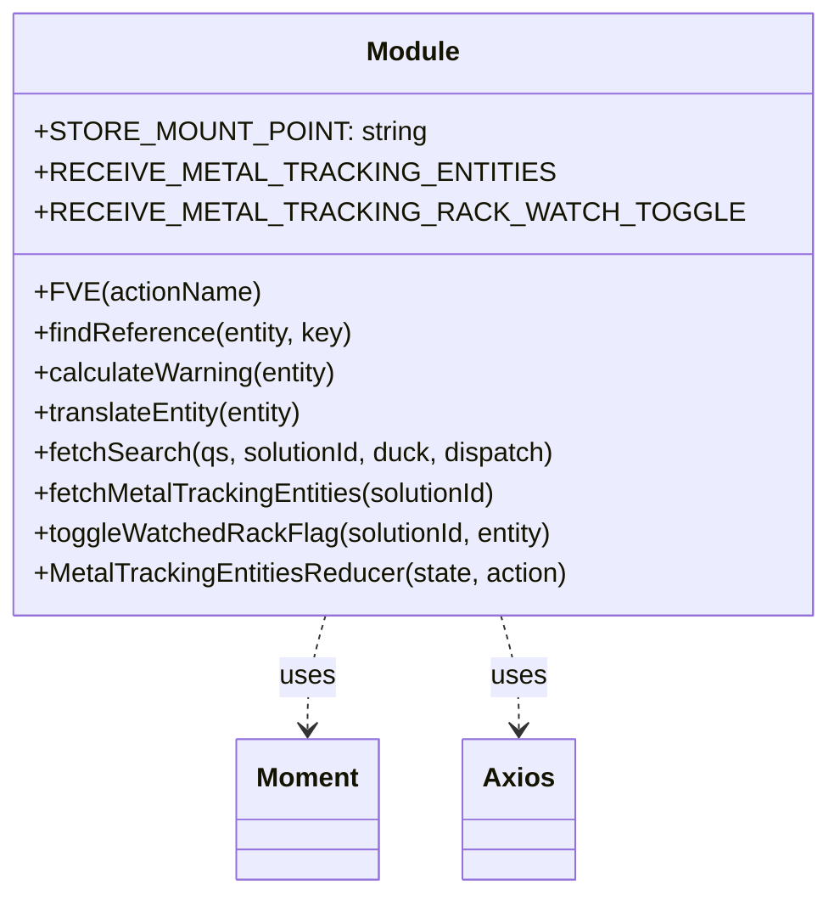

# Diagram: web/portal/src/modules/mt-search/MetalTrackingSearchBarState.js


> Auto-generated by Obscura crawlers

## Diagram 1



### SVG

<svg id="container" width="430.28125" xmlns="http://www.w3.org/2000/svg" class="classDiagram" height="534" viewBox="0 0 430.28125 534" role="graphics-document document" aria-roledescription="class"><style>#container{font-family:"trebuchet ms",verdana,arial,sans-serif;font-size:16px;fill:#333;}@keyframes edge-animation-frame{from{stroke-dashoffset:0;}}@keyframes dash{to{stroke-dashoffset:0;}}#container .edge-animation-slow{stroke-dasharray:9,5!important;stroke-dashoffset:900;animation:dash 50s linear infinite;stroke-linecap:round;}#container .edge-animation-fast{stroke-dasharray:9,5!important;stroke-dashoffset:900;animation:dash 20s linear infinite;stroke-linecap:round;}#container .error-icon{fill:#552222;}#container .error-text{fill:#552222;stroke:#552222;}#container .edge-thickness-normal{stroke-width:1px;}#container .edge-thickness-thick{stroke-width:3.5px;}#container .edge-pattern-solid{stroke-dasharray:0;}#container .edge-thickness-invisible{stroke-width:0;fill:none;}#container .edge-pattern-dashed{stroke-dasharray:3;}#container .edge-pattern-dotted{stroke-dasharray:2;}#container .marker{fill:#333333;stroke:#333333;}#container .marker.cross{stroke:#333333;}#container svg{font-family:"trebuchet ms",verdana,arial,sans-serif;font-size:16px;}#container p{margin:0;}#container g.classGroup text{fill:#9370DB;stroke:none;font-family:"trebuchet ms",verdana,arial,sans-serif;font-size:10px;}#container g.classGroup text .title{font-weight:bolder;}#container .nodeLabel,#container .edgeLabel{color:#131300;}#container .edgeLabel .label rect{fill:#ECECFF;}#container .label text{fill:#131300;}#container .labelBkg{background:#ECECFF;}#container .edgeLabel .label span{background:#ECECFF;}#container .classTitle{font-weight:bolder;}#container .node rect,#container .node circle,#container .node ellipse,#container .node polygon,#container .node path{fill:#ECECFF;stroke:#9370DB;stroke-width:1px;}#container .divider{stroke:#9370DB;stroke-width:1;}#container g.clickable{cursor:pointer;}#container g.classGroup rect{fill:#ECECFF;stroke:#9370DB;}#container g.classGroup line{stroke:#9370DB;stroke-width:1;}#container .classLabel .box{stroke:none;stroke-width:0;fill:#ECECFF;opacity:0.5;}#container .classLabel .label{fill:#9370DB;font-size:10px;}#container .relation{stroke:#333333;stroke-width:1;fill:none;}#container .dashed-line{stroke-dasharray:3;}#container .dotted-line{stroke-dasharray:1 2;}#container #compositionStart,#container .composition{fill:#333333!important;stroke:#333333!important;stroke-width:1;}#container #compositionEnd,#container .composition{fill:#333333!important;stroke:#333333!important;stroke-width:1;}#container #dependencyStart,#container .dependency{fill:#333333!important;stroke:#333333!important;stroke-width:1;}#container #dependencyStart,#container .dependency{fill:#333333!important;stroke:#333333!important;stroke-width:1;}#container #extensionStart,#container .extension{fill:transparent!important;stroke:#333333!important;stroke-width:1;}#container #extensionEnd,#container .extension{fill:transparent!important;stroke:#333333!important;stroke-width:1;}#container #aggregationStart,#container .aggregation{fill:transparent!important;stroke:#333333!important;stroke-width:1;}#container #aggregationEnd,#container .aggregation{fill:transparent!important;stroke:#333333!important;stroke-width:1;}#container #lollipopStart,#container .lollipop{fill:#ECECFF!important;stroke:#333333!important;stroke-width:1;}#container #lollipopEnd,#container .lollipop{fill:#ECECFF!important;stroke:#333333!important;stroke-width:1;}#container .edgeTerminals{font-size:11px;line-height:initial;}#container .classTitleText{text-anchor:middle;font-size:18px;fill:#333;}#container .label-icon{display:inline-block;height:1em;overflow:visible;vertical-align:-0.125em;}#container .node .label-icon path{fill:currentColor;stroke:revert;stroke-width:revert;}#container :root{--mermaid-font-family:"trebuchet ms",verdana,arial,sans-serif;}</style><g><defs><marker id="container_class-aggregationStart" class="marker aggregation class" refX="18" refY="7" markerWidth="190" markerHeight="240" orient="auto"><path d="M 18,7 L9,13 L1,7 L9,1 Z"></path></marker></defs><defs><marker id="container_class-aggregationEnd" class="marker aggregation class" refX="1" refY="7" markerWidth="20" markerHeight="28" orient="auto"><path d="M 18,7 L9,13 L1,7 L9,1 Z"></path></marker></defs><defs><marker id="container_class-extensionStart" class="marker extension class" refX="18" refY="7" markerWidth="190" markerHeight="240" orient="auto"><path d="M 1,7 L18,13 V 1 Z"></path></marker></defs><defs><marker id="container_class-extensionEnd" class="marker extension class" refX="1" refY="7" markerWidth="20" markerHeight="28" orient="auto"><path d="M 1,1 V 13 L18,7 Z"></path></marker></defs><defs><marker id="container_class-compositionStart" class="marker composition class" refX="18" refY="7" markerWidth="190" markerHeight="240" orient="auto"><path d="M 18,7 L9,13 L1,7 L9,1 Z"></path></marker></defs><defs><marker id="container_class-compositionEnd" class="marker composition class" refX="1" refY="7" markerWidth="20" markerHeight="28" orient="auto"><path d="M 18,7 L9,13 L1,7 L9,1 Z"></path></marker></defs><defs><marker id="container_class-dependencyStart" class="marker dependency class" refX="6" refY="7" markerWidth="190" markerHeight="240" orient="auto"><path d="M 5,7 L9,13 L1,7 L9,1 Z"></path></marker></defs><defs><marker id="container_class-dependencyEnd" class="marker dependency class" refX="13" refY="7" markerWidth="20" markerHeight="28" orient="auto"><path d="M 18,7 L9,13 L14,7 L9,1 Z"></path></marker></defs><defs><marker id="container_class-lollipopStart" class="marker lollipop class" refX="13" refY="7" markerWidth="190" markerHeight="240" orient="auto"><circle stroke="black" fill="transparent" cx="7" cy="7" r="6"></circle></marker></defs><defs><marker id="container_class-lollipopEnd" class="marker lollipop class" refX="1" refY="7" markerWidth="190" markerHeight="240" orient="auto"><circle stroke="black" fill="transparent" cx="7" cy="7" r="6"></circle></marker></defs><g class="root"><g class="clusters"></g><g class="edgePaths"><path d="M163.939,368L162.185,374.167C160.431,380.333,156.922,392.667,155.168,404C153.414,415.333,153.414,425.667,153.414,430.833L153.414,436" id="id_Module_Moment_1" class="edge-thickness-normal edge-pattern-dashed relation" style=";;;" data-edge="true" data-et="edge" data-id="id_Module_Moment_1" data-points="W3sieCI6MTYzLjkzODg2ODA4NzU1NzYsInkiOjM2OH0seyJ4IjoxNTMuNDE0MDYyNSwieSI6NDA1fSx7IngiOjE1My40MTQwNjI1LCJ5Ijo0NDJ9XQ==" marker-end="url(#container_class-dependencyEnd)"></path><path d="M266.342,368L268.097,374.167C269.851,380.333,273.359,392.667,275.113,404C276.867,415.333,276.867,425.667,276.867,430.833L276.867,436" id="id_Module_Axios_2" class="edge-thickness-normal edge-pattern-dashed relation" style=";;;" data-edge="true" data-et="edge" data-id="id_Module_Axios_2" data-points="W3sieCI6MjY2LjM0MjM4MTkxMjQ0MjQsInkiOjM2OH0seyJ4IjoyNzYuODY3MTg3NSwieSI6NDA1fSx7IngiOjI3Ni44NjcxODc1LCJ5Ijo0NDJ9XQ==" marker-end="url(#container_class-dependencyEnd)"></path></g><g class="edgeLabels"><g class="edgeLabel" transform="translate(153.4140625, 405)"><g class="label" data-id="id_Module_Moment_1" transform="translate(-16.4921875, -12)"><foreignObject width="32.984375" height="24"><div xmlns="http://www.w3.org/1999/xhtml" class="labelBkg" style="display: table-cell; white-space: nowrap; line-height: 1.5; max-width: 200px; text-align: center;"><span class="edgeLabel"><p>uses</p></span></div></foreignObject></g></g><g class="edgeLabel" transform="translate(276.8671875, 405)"><g class="label" data-id="id_Module_Axios_2" transform="translate(-16.4921875, -12)"><foreignObject width="32.984375" height="24"><div xmlns="http://www.w3.org/1999/xhtml" class="labelBkg" style="display: table-cell; white-space: nowrap; line-height: 1.5; max-width: 200px; text-align: center;"><span class="edgeLabel"><p>uses</p></span></div></foreignObject></g></g></g><g class="nodes"><g class="node default" id="classId-Module-0" transform="translate(215.140625, 188)"><g class="basic label-container"><path d="M-207.140625 -180 L207.140625 -180 L207.140625 180 L-207.140625 180" stroke="none" stroke-width="0" fill="#ECECFF" style=""></path><path d="M-207.140625 -180 C-124.2793867625991 -180, -41.418148525198205 -180, 207.140625 -180 M-207.140625 -180 C-108.78624346847768 -180, -10.431861936955357 -180, 207.140625 -180 M207.140625 -180 C207.140625 -105.04980942223425, 207.140625 -30.099618844468495, 207.140625 180 M207.140625 -180 C207.140625 -107.01060608391703, 207.140625 -34.02121216783405, 207.140625 180 M207.140625 180 C85.69367003587399 180, -35.753284928252015 180, -207.140625 180 M207.140625 180 C50.590489438474265 180, -105.95964612305147 180, -207.140625 180 M-207.140625 180 C-207.140625 36.28953517573606, -207.140625 -107.42092964852787, -207.140625 -180 M-207.140625 180 C-207.140625 55.5538911299937, -207.140625 -68.8922177400126, -207.140625 -180" stroke="#9370DB" stroke-width="1.3" fill="none" stroke-dasharray="0 0" style=""></path></g><g class="annotation-group text" transform="translate(0, -156)"></g><g class="label-group text" transform="translate(-27.09375, -156)"><g class="label" style="font-weight: bolder" transform="translate(0,-12)"><foreignObject width="54.1875" height="24"><div xmlns="http://www.w3.org/1999/xhtml" style="display: table-cell; white-space: nowrap; line-height: 1.5; max-width: 104px; text-align: center;"><span class="nodeLabel markdown-node-label" style=""><p>Module</p></span></div></foreignObject></g></g><g class="members-group text" transform="translate(-195.140625, -108)"><g class="label" style="" transform="translate(0,-12)"><foreignObject width="215.09375" height="24"><div xmlns="http://www.w3.org/1999/xhtml" style="display: table-cell; white-space: nowrap; line-height: 1.5; max-width: 273px; text-align: center;"><span class="nodeLabel markdown-node-label" style=""><p>+STORE_MOUNT_POINT: string</p></span></div></foreignObject></g><g class="label" style="" transform="translate(0,12)"><foreignObject width="269.1875" height="24"><div xmlns="http://www.w3.org/1999/xhtml" style="display: table-cell; white-space: nowrap; line-height: 1.5; max-width: 327px; text-align: center;"><span class="nodeLabel markdown-node-label" style=""><p>+RECEIVE_METAL_TRACKING_ENTITIES</p></span></div></foreignObject></g><g class="label" style="" transform="translate(0,36)"><foreignObject width="363.1875" height="24"><div xmlns="http://www.w3.org/1999/xhtml" style="display: table-cell; white-space: nowrap; line-height: 1.5; max-width: 421px; text-align: center;"><span class="nodeLabel markdown-node-label" style=""><p>+RECEIVE_METAL_TRACKING_RACK_WATCH_TOGGLE</p></span></div></foreignObject></g></g><g class="methods-group text" transform="translate(-195.140625, -12)"><g class="label" style="" transform="translate(0,-12)"><foreignObject width="131.09375" height="24"><div xmlns="http://www.w3.org/1999/xhtml" style="display: table-cell; white-space: nowrap; line-height: 1.5; max-width: 188px; text-align: center;"><span class="nodeLabel markdown-node-label" style=""><p>+FVE(actionName)</p></span></div></foreignObject></g><g class="label" style="" transform="translate(0,12)"><foreignObject width="192.15625" height="24"><div xmlns="http://www.w3.org/1999/xhtml" style="display: table-cell; white-space: nowrap; line-height: 1.5; max-width: 250px; text-align: center;"><span class="nodeLabel markdown-node-label" style=""><p>+findReference(entity, key)</p></span></div></foreignObject></g><g class="label" style="" transform="translate(0,36)"><foreignObject width="184.515625" height="24"><div xmlns="http://www.w3.org/1999/xhtml" style="display: table-cell; white-space: nowrap; line-height: 1.5; max-width: 242px; text-align: center;"><span class="nodeLabel markdown-node-label" style=""><p>+calculateWarning(entity)</p></span></div></foreignObject></g><g class="label" style="" transform="translate(0,60)"><foreignObject width="166.375" height="24"><div xmlns="http://www.w3.org/1999/xhtml" style="display: table-cell; white-space: nowrap; line-height: 1.5; max-width: 224px; text-align: center;"><span class="nodeLabel markdown-node-label" style=""><p>+translateEntity(entity)</p></span></div></foreignObject></g><g class="label" style="" transform="translate(0,84)"><foreignObject width="315.640625" height="24"><div xmlns="http://www.w3.org/1999/xhtml" style="display: table-cell; white-space: nowrap; line-height: 1.5; max-width: 373px; text-align: center;"><span class="nodeLabel markdown-node-label" style=""><p>+fetchSearch(qs, solutionId, duck, dispatch)</p></span></div></foreignObject></g><g class="label" style="" transform="translate(0,108)"><foreignObject width="283.484375" height="24"><div xmlns="http://www.w3.org/1999/xhtml" style="display: table-cell; white-space: nowrap; line-height: 1.5; max-width: 341px; text-align: center;"><span class="nodeLabel markdown-node-label" style=""><p>+fetchMetalTrackingEntities(solutionId)</p></span></div></foreignObject></g><g class="label" style="" transform="translate(0,132)"><foreignObject width="312.796875" height="24"><div xmlns="http://www.w3.org/1999/xhtml" style="display: table-cell; white-space: nowrap; line-height: 1.5; max-width: 370px; text-align: center;"><span class="nodeLabel markdown-node-label" style=""><p>+toggleWatchedRackFlag(solutionId, entity)</p></span></div></foreignObject></g><g class="label" style="" transform="translate(0,156)"><foreignObject width="321.765625" height="24"><div xmlns="http://www.w3.org/1999/xhtml" style="display: table-cell; white-space: nowrap; line-height: 1.5; max-width: 379px; text-align: center;"><span class="nodeLabel markdown-node-label" style=""><p>+MetalTrackingEntitiesReducer(state, action)</p></span></div></foreignObject></g></g><g class="divider" style=""><path d="M-207.140625 -132 C-110.0973536399711 -132, -13.054082279942207 -132, 207.140625 -132 M-207.140625 -132 C-63.93593500520814 -132, 79.26875498958373 -132, 207.140625 -132" stroke="#9370DB" stroke-width="1.3" fill="none" stroke-dasharray="0 0" style=""></path></g><g class="divider" style=""><path d="M-207.140625 -36 C-64.858909177159 -36, 77.42280664568199 -36, 207.140625 -36 M-207.140625 -36 C-105.24655912789636 -36, -3.352493255792723 -36, 207.140625 -36" stroke="#9370DB" stroke-width="1.3" fill="none" stroke-dasharray="0 0" style=""></path></g></g><g class="node default" id="classId-Moment-1" transform="translate(153.4140625, 484)"><g class="basic label-container"><path d="M-41.84375 -42 L41.84375 -42 L41.84375 42 L-41.84375 42" stroke="none" stroke-width="0" fill="#ECECFF" style=""></path><path d="M-41.84375 -42 C-22.784926449301683 -42, -3.726102898603365 -42, 41.84375 -42 M-41.84375 -42 C-8.86118644477125 -42, 24.1213771104575 -42, 41.84375 -42 M41.84375 -42 C41.84375 -9.212106680065219, 41.84375 23.575786639869563, 41.84375 42 M41.84375 -42 C41.84375 -13.208665421387309, 41.84375 15.582669157225382, 41.84375 42 M41.84375 42 C24.711974801670635 42, 7.580199603341271 42, -41.84375 42 M41.84375 42 C16.469956444802197 42, -8.903837110395607 42, -41.84375 42 M-41.84375 42 C-41.84375 20.255458437829084, -41.84375 -1.4890831243418319, -41.84375 -42 M-41.84375 42 C-41.84375 9.909609604313623, -41.84375 -22.180780791372754, -41.84375 -42" stroke="#9370DB" stroke-width="1.3" fill="none" stroke-dasharray="0 0" style=""></path></g><g class="annotation-group text" transform="translate(0, -18)"></g><g class="label-group text" transform="translate(-29.84375, -18)"><g class="label" style="font-weight: bolder" transform="translate(0,-12)"><foreignObject width="59.6875" height="24"><div xmlns="http://www.w3.org/1999/xhtml" style="display: table-cell; white-space: nowrap; line-height: 1.5; max-width: 110px; text-align: center;"><span class="nodeLabel markdown-node-label" style=""><p>Moment</p></span></div></foreignObject></g></g><g class="members-group text" transform="translate(-29.84375, 30)"></g><g class="methods-group text" transform="translate(-29.84375, 60)"></g><g class="divider" style=""><path d="M-41.84375 6 C-10.584218995084747 6, 20.675312009830506 6, 41.84375 6 M-41.84375 6 C-20.927594207186928 6, -0.011438414373856176 6, 41.84375 6" stroke="#9370DB" stroke-width="1.3" fill="none" stroke-dasharray="0 0" style=""></path></g><g class="divider" style=""><path d="M-41.84375 24 C-13.183114457580434 24, 15.477521084839132 24, 41.84375 24 M-41.84375 24 C-18.554790875333918 24, 4.734168249332164 24, 41.84375 24" stroke="#9370DB" stroke-width="1.3" fill="none" stroke-dasharray="0 0" style=""></path></g></g><g class="node default" id="classId-Axios-2" transform="translate(276.8671875, 484)"><g class="basic label-container"><path d="M-31.609375 -42 L31.609375 -42 L31.609375 42 L-31.609375 42" stroke="none" stroke-width="0" fill="#ECECFF" style=""></path><path d="M-31.609375 -42 C-9.395735779575254 -42, 12.817903440849491 -42, 31.609375 -42 M-31.609375 -42 C-17.067465477730465 -42, -2.525555955460927 -42, 31.609375 -42 M31.609375 -42 C31.609375 -16.928890517624488, 31.609375 8.142218964751024, 31.609375 42 M31.609375 -42 C31.609375 -13.018092249110996, 31.609375 15.963815501778008, 31.609375 42 M31.609375 42 C12.070779664152568 42, -7.467815671694865 42, -31.609375 42 M31.609375 42 C9.692341272562135 42, -12.22469245487573 42, -31.609375 42 M-31.609375 42 C-31.609375 15.778217200589054, -31.609375 -10.443565598821891, -31.609375 -42 M-31.609375 42 C-31.609375 24.389129171155, -31.609375 6.7782583423099965, -31.609375 -42" stroke="#9370DB" stroke-width="1.3" fill="none" stroke-dasharray="0 0" style=""></path></g><g class="annotation-group text" transform="translate(0, -18)"></g><g class="label-group text" transform="translate(-19.609375, -18)"><g class="label" style="font-weight: bolder" transform="translate(0,-12)"><foreignObject width="39.21875" height="24"><div xmlns="http://www.w3.org/1999/xhtml" style="display: table-cell; white-space: nowrap; line-height: 1.5; max-width: 88px; text-align: center;"><span class="nodeLabel markdown-node-label" style=""><p>Axios</p></span></div></foreignObject></g></g><g class="members-group text" transform="translate(-19.609375, 30)"></g><g class="methods-group text" transform="translate(-19.609375, 60)"></g><g class="divider" style=""><path d="M-31.609375 6 C-16.80690619923878 6, -2.0044373984775596 6, 31.609375 6 M-31.609375 6 C-13.811698562119389 6, 3.985977875761222 6, 31.609375 6" stroke="#9370DB" stroke-width="1.3" fill="none" stroke-dasharray="0 0" style=""></path></g><g class="divider" style=""><path d="M-31.609375 24 C-11.46932413224993 24, 8.67072673550014 24, 31.609375 24 M-31.609375 24 C-11.359073345387689 24, 8.891228309224623 24, 31.609375 24" stroke="#9370DB" stroke-width="1.3" fill="none" stroke-dasharray="0 0" style=""></path></g></g></g></g></g></svg>

## Diagram 2

```mermaid
flowchart LR
  subgraph TranslateFlow
    TE[translateEntity(entity)]
    FR[findReference(entity, key)]
    CW[calculateWarning(entity)]
    TE --> FR
    TE --> CW
  end

  subgraph FetchEntities
    FME[fetchMetalTrackingEntities(solutionId)]
    API_URL[apiUrl("/entity/...?pageSize=100000")]
    AXGET[axios.get(url)]
    DISPATCH1[dispatch({ type: RECEIVE_METAL_TRACKING_ENTITIES, payload })]
    FME --> API_URL --> AXGET --> DISPATCH1
    DISPATCH1 --> MetalReducer[MetalTrackingEntitiesReducer]
  end

  subgraph ToggleWatch
    TW[toggleWatchedRackFlag(solutionId, entity)]
    API_PATCH[axios.patch(url, { watch: !entity.watch })]
    PROM[Promise.all([...])]
    DISPATCH2[dispatch({ type: RECEIVE_METAL_TRACKING_RACK_WATCH_TOGGLE, payload })]
    TW --> API_PATCH --> PROM --> DISPATCH2
    DISPATCH2 --> MetalReducer
  end

  MetalReducer -->|on RECEIVE_METAL_TRACKING_ENTITIES| UpdateData[update state.data with mapped translateEntity]
  MetalReducer -->|on RECEIVE_METAL_TRACKING_RACK_WATCH_TOGGLE| UpdateWatch[map state.data and toggle item.watch]
```

> SVG rendering failed for this diagram.
