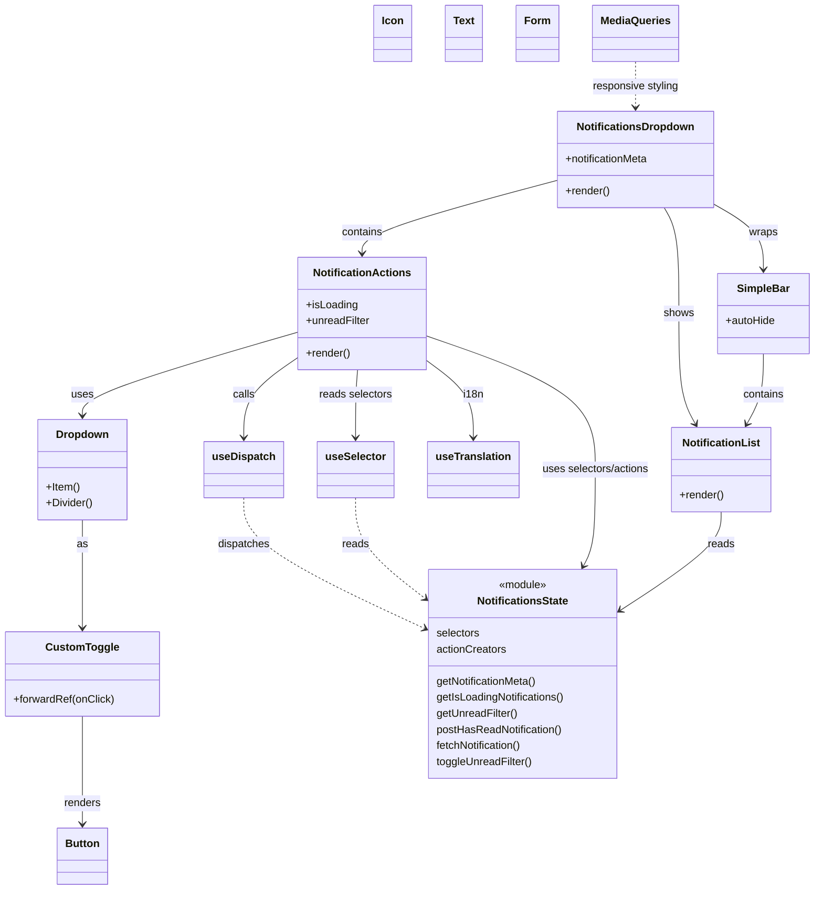

# Diagram: web/portal/src/modules/notifications/NotificationsDropdown.js

> Auto-generated by Obscura crawlers

## Mermaid

```mermaid
classDiagram
class NotificationsDropdown {
  +render()
  +notificationMeta
}
class NotificationActions {
  +render()
  +isLoading
  +unreadFilter
}
class CustomToggle {
  +forwardRef(onClick)
}
class NotificationsState <<module>> {
  selectors
  actionCreators
  getNotificationMeta()
  getIsLoadingNotifications()
  getUnreadFilter()
  postHasReadNotification()
  fetchNotification()
  toggleUnreadFilter()
}
class Dropdown {
  +Item()
  +Divider()
}
class NotificationList {
  +render()
}
class SimpleBar {
  +autoHide
}
class Button
class Icon
class Text
class Form
class useTranslation
class useDispatch
class useSelector
class MediaQueries

NotificationsDropdown --> NotificationActions : contains
NotificationsDropdown --> NotificationList : shows
NotificationsDropdown --> SimpleBar : wraps
NotificationActions --> Dropdown : uses
NotificationActions --> useDispatch : calls
NotificationActions --> useSelector : reads selectors
NotificationActions --> useTranslation : i18n
NotificationActions --> NotificationsState : uses selectors/actions
CustomToggle --> Button : renders
Dropdown --> CustomToggle : as
NotificationList --> NotificationsState : reads
SimpleBar --> NotificationList : contains
useSelector ..> NotificationsState : reads
useDispatch ..> NotificationsState : dispatches
MediaQueries ..> NotificationsDropdown : responsive styling
```

> SVG rendering failed for this diagram.
