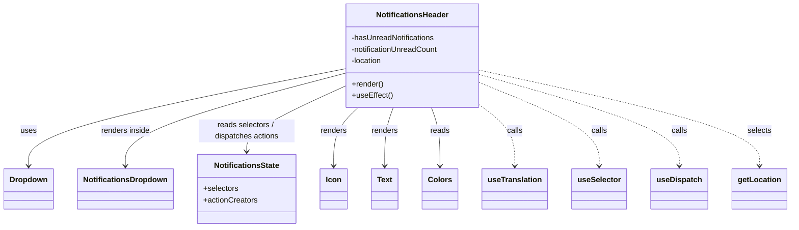
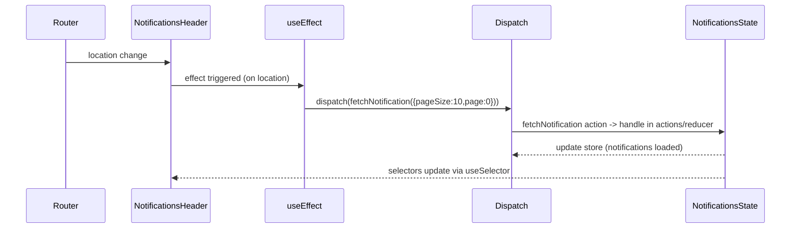

# Diagram: web/portal/src/modules/notifications/NotificationsHeader.js

> Auto-generated by Obscura crawlers

## Diagram 1

### SVG

<svg id="container" width="1607.21875" xmlns="http://www.w3.org/2000/svg" class="classDiagram" height="474" viewBox="0 0 1607.21875 474" role="graphics-document document" aria-roledescription="class"><g><defs><marker id="container_class-aggregationStart" class="marker aggregation class" refX="18" refY="7" markerWidth="190" markerHeight="240" orient="auto"><path d="M 18,7 L9,13 L1,7 L9,1 Z"></path></marker></defs><defs><marker id="container_class-aggregationEnd" class="marker aggregation class" refX="1" refY="7" markerWidth="20" markerHeight="28" orient="auto"><path d="M 18,7 L9,13 L1,7 L9,1 Z"></path></marker></defs><defs><marker id="container_class-extensionStart" class="marker extension class" refX="18" refY="7" markerWidth="190" markerHeight="240" orient="auto"><path d="M 1,7 L18,13 V 1 Z"></path></marker></defs><defs><marker id="container_class-extensionEnd" class="marker extension class" refX="1" refY="7" markerWidth="20" markerHeight="28" orient="auto"><path d="M 1,1 V 13 L18,7 Z"></path></marker></defs><defs><marker id="container_class-compositionStart" class="marker composition class" refX="18" refY="7" markerWidth="190" markerHeight="240" orient="auto"><path d="M 18,7 L9,13 L1,7 L9,1 Z"></path></marker></defs><defs><marker id="container_class-compositionEnd" class="marker composition class" refX="1" refY="7" markerWidth="20" markerHeight="28" orient="auto"><path d="M 18,7 L9,13 L1,7 L9,1 Z"></path></marker></defs><defs><marker id="container_class-dependencyStart" class="marker dependency class" refX="6" refY="7" markerWidth="190" markerHeight="240" orient="auto"><path d="M 5,7 L9,13 L1,7 L9,1 Z"></path></marker></defs><defs><marker id="container_class-dependencyEnd" class="marker dependency class" refX="13" refY="7" markerWidth="20" markerHeight="28" orient="auto"><path d="M 18,7 L9,13 L14,7 L9,1 Z"></path></marker></defs><defs><marker id="container_class-lollipopStart" class="marker lollipop class" refX="13" refY="7" markerWidth="190" markerHeight="240" orient="auto"><circle stroke="black" fill="transparent" cx="7" cy="7" r="6"></circle></marker></defs><defs><marker id="container_class-lollipopEnd" class="marker lollipop class" refX="1" refY="7" markerWidth="190" markerHeight="240" orient="auto"><circle stroke="black" fill="transparent" cx="7" cy="7" r="6"></circle></marker></defs><g class="root"><g class="clusters"></g><g class="edgePaths"><path d="M700.688,144.239L593.525,165.699C486.362,187.16,272.036,230.08,164.874,263.707C57.711,297.333,57.711,321.667,57.711,333.833L57.711,346" id="id_NotificationsHeader_Dropdown_1" class="edge-thickness-normal edge-pattern-solid relation" style=";;;" data-edge="true" data-et="edge" data-id="id_NotificationsHeader_Dropdown_1" data-points="W3sieCI6NzAwLjY4NzUsInkiOjE0NC4yMzkzNzk3NzY5ODI4fSx7IngiOjU3LjcxMDkzNzUsInkiOjI3M30seyJ4Ijo1Ny43MTA5Mzc1LCJ5IjozNTJ9XQ==" marker-end="url(#container_class-dependencyEnd)"></path><path d="M700.688,153.663L626.219,173.553C551.75,193.442,402.813,233.221,328.344,265.277C253.875,297.333,253.875,321.667,253.875,333.833L253.875,346" id="id_NotificationsHeader_NotificationsDropdown_2" class="edge-thickness-normal edge-pattern-solid relation" style=";;;" data-edge="true" data-et="edge" data-id="id_NotificationsHeader_NotificationsDropdown_2" data-points="W3sieCI6NzAwLjY4NzUsInkiOjE1My42NjMxNDAyNjc0MDM4M30seyJ4IjoyNTMuODc1LCJ5IjoyNzN9LHsieCI6MjUzLjg3NSwieSI6MzUyfV0=" marker-end="url(#container_class-dependencyEnd)"></path><path d="M700.688,181.153L667.556,196.461C634.424,211.769,568.161,242.384,535.03,264.859C501.898,287.333,501.898,301.667,501.898,308.833L501.898,316" id="id_NotificationsHeader_NotificationsState_3" class="edge-thickness-normal edge-pattern-solid relation" style=";;;" data-edge="true" data-et="edge" data-id="id_NotificationsHeader_NotificationsState_3" data-points="W3sieCI6NzAwLjY4NzUsInkiOjE4MS4xNTM0NjU5MTU2MjI1fSx7IngiOjUwMS44OTg0Mzc1LCJ5IjoyNzN9LHsieCI6NTAxLjg5ODQzNzUsInkiOjMyMn1d" marker-end="url(#container_class-dependencyEnd)"></path><path d="M731,224L722.629,232.167C714.258,240.333,697.516,256.667,689.145,277C680.773,297.333,680.773,321.667,680.773,333.833L680.773,346" id="id_NotificationsHeader_Icon_4" class="edge-thickness-normal edge-pattern-solid relation" style=";;;" data-edge="true" data-et="edge" data-id="id_NotificationsHeader_Icon_4" data-points="W3sieCI6NzMwLjk5OTkwMDQ3NzcwNywieSI6MjI0fSx7IngiOjY4MC43NzM0Mzc1LCJ5IjoyNzN9LHsieCI6NjgwLjc3MzQzNzUsInkiOjM1Mn1d" marker-end="url(#container_class-dependencyEnd)"></path><path d="M803.014,224L800.089,232.167C797.163,240.333,791.312,256.667,788.386,277C785.461,297.333,785.461,321.667,785.461,333.833L785.461,346" id="id_NotificationsHeader_Text_5" class="edge-thickness-normal edge-pattern-solid relation" style=";;;" data-edge="true" data-et="edge" data-id="id_NotificationsHeader_Text_5" data-points="W3sieCI6ODAzLjAxNDIzMTY4Nzg5ODEsInkiOjIyNH0seyJ4Ijo3ODUuNDYwOTM3NSwieSI6MjczfSx7IngiOjc4NS40NjA5Mzc1LCJ5IjozNTJ9XQ==" marker-end="url(#container_class-dependencyEnd)"></path><path d="M880.392,224L883.318,232.167C886.243,240.333,892.094,256.667,895.02,277C897.945,297.333,897.945,321.667,897.945,333.833L897.945,346" id="id_NotificationsHeader_Colors_6" class="edge-thickness-normal edge-pattern-solid relation" style=";;;" data-edge="true" data-et="edge" data-id="id_NotificationsHeader_Colors_6" data-points="W3sieCI6ODgwLjM5MjAxODMxMjEwMTksInkiOjIyNH0seyJ4Ijo4OTcuOTQ1MzEyNSwieSI6MjczfSx7IngiOjg5Ny45NDUzMTI1LCJ5IjozNTJ9XQ==" marker-end="url(#container_class-dependencyEnd)"></path><path d="M982.719,222.732L993.788,231.11C1004.857,239.488,1026.995,256.244,1038.064,276.789C1049.133,297.333,1049.133,321.667,1049.133,333.833L1049.133,346" id="id_NotificationsHeader_useTranslation_7" class="edge-thickness-normal edge-pattern-dashed relation" style=";;;" data-edge="true" data-et="edge" data-id="id_NotificationsHeader_useTranslation_7" data-points="W3sieCI6OTgyLjcxODc1LCJ5IjoyMjIuNzMyMzI2NDY2MDQ2NDZ9LHsieCI6MTA0OS4xMzI4MTI1LCJ5IjoyNzN9LHsieCI6MTA0OS4xMzI4MTI1LCJ5IjozNTJ9XQ==" marker-end="url(#container_class-dependencyEnd)"></path><path d="M982.719,174.45L1022.345,190.875C1061.971,207.3,1141.224,240.15,1180.85,268.742C1220.477,297.333,1220.477,321.667,1220.477,333.833L1220.477,346" id="id_NotificationsHeader_useSelector_8" class="edge-thickness-normal edge-pattern-dashed relation" style=";;;" data-edge="true" data-et="edge" data-id="id_NotificationsHeader_useSelector_8" data-points="W3sieCI6OTgyLjcxODc1LCJ5IjoxNzQuNDUwMzg0NjcwOTE1NTh9LHsieCI6MTIyMC40NzY1NjI1LCJ5IjoyNzN9LHsieCI6MTIyMC40NzY1NjI1LCJ5IjozNTJ9XQ==" marker-end="url(#container_class-dependencyEnd)"></path><path d="M982.719,156.947L1049.331,176.289C1115.943,195.631,1249.167,234.316,1315.779,265.824C1382.391,297.333,1382.391,321.667,1382.391,333.833L1382.391,346" id="id_NotificationsHeader_useDispatch_9" class="edge-thickness-normal edge-pattern-dashed relation" style=";;;" data-edge="true" data-et="edge" data-id="id_NotificationsHeader_useDispatch_9" data-points="W3sieCI6OTgyLjcxODc1LCJ5IjoxNTYuOTQ2ODU1ODU0ODE0NX0seyJ4IjoxMzgyLjM5MDYyNSwieSI6MjczfSx7IngiOjEzODIuMzkwNjI1LCJ5IjozNTJ9XQ==" marker-end="url(#container_class-dependencyEnd)"></path><path d="M982.719,147.518L1076.288,168.432C1169.857,189.346,1356.995,231.173,1450.564,264.253C1544.133,297.333,1544.133,321.667,1544.133,333.833L1544.133,346" id="id_NotificationsHeader_getLocation_10" class="edge-thickness-normal edge-pattern-dashed relation" style=";;;" data-edge="true" data-et="edge" data-id="id_NotificationsHeader_getLocation_10" data-points="W3sieCI6OTgyLjcxODc1LCJ5IjoxNDcuNTE4MzkwNDA4MjkyNjV9LHsieCI6MTU0NC4xMzI4MTI1LCJ5IjoyNzN9LHsieCI6MTU0NC4xMzI4MTI1LCJ5IjozNTJ9XQ==" marker-end="url(#container_class-dependencyEnd)"></path></g><g class="edgeLabels"><g class="edgeLabel" transform="translate(57.7109375, 273)"><g class="label" data-id="id_NotificationsHeader_Dropdown_1" transform="translate(-16.4921875, -12)"><foreignObject width="32.984375" height="24">

uses

</foreignObject></g></g><g class="edgeLabel" transform="translate(253.875, 273)"><g class="label" data-id="id_NotificationsHeader_NotificationsDropdown_2" transform="translate(-51.9453125, -12)"><foreignObject width="103.890625" height="24">

renders inside

</foreignObject></g></g><g class="edgeLabel" transform="translate(501.8984375, 273)"><g class="label" data-id="id_NotificationsHeader_NotificationsState_3" transform="translate(-100, -24)"><foreignObject width="200" height="48">

reads selectors / dispatches actions

</foreignObject></g></g><g class="edgeLabel" transform="translate(680.7734375, 273)"><g class="label" data-id="id_NotificationsHeader_Icon_4" transform="translate(-27.75, -12)"><foreignObject width="55.5" height="24">

renders

</foreignObject></g></g><g class="edgeLabel" transform="translate(785.4609375, 273)"><g class="label" data-id="id_NotificationsHeader_Text_5" transform="translate(-27.75, -12)"><foreignObject width="55.5" height="24">

renders

</foreignObject></g></g><g class="edgeLabel" transform="translate(897.9453125, 273)"><g class="label" data-id="id_NotificationsHeader_Colors_6" transform="translate(-20.0078125, -12)"><foreignObject width="40.015625" height="24">

reads

</foreignObject></g></g><g class="edgeLabel" transform="translate(1049.1328125, 273)"><g class="label" data-id="id_NotificationsHeader_useTranslation_7" transform="translate(-16.4453125, -12)"><foreignObject width="32.890625" height="24">

calls

</foreignObject></g></g><g class="edgeLabel" transform="translate(1220.4765625, 273)"><g class="label" data-id="id_NotificationsHeader_useSelector_8" transform="translate(-16.4453125, -12)"><foreignObject width="32.890625" height="24">

calls

</foreignObject></g></g><g class="edgeLabel" transform="translate(1382.390625, 273)"><g class="label" data-id="id_NotificationsHeader_useDispatch_9" transform="translate(-16.4453125, -12)"><foreignObject width="32.890625" height="24">

calls

</foreignObject></g></g><g class="edgeLabel" transform="translate(1544.1328125, 273)"><g class="label" data-id="id_NotificationsHeader_getLocation_10" transform="translate(-25.2109375, -12)"><foreignObject width="50.421875" height="24">

selects

</foreignObject></g></g></g><g class="nodes"><g class="node default" id="classId-NotificationsHeader-0" transform="translate(841.703125, 116)"><g class="basic label-container"><path d="M-141.015625 -108 L141.015625 -108 L141.015625 108 L-141.015625 108" stroke="none" stroke-width="0" fill="#ECECFF" style=""></path><path d="M-141.015625 -108 C-77.00221184810712 -108, -12.988798696214246 -108, 141.015625 -108 M-141.015625 -108 C-78.16790668670819 -108, -15.320188373416372 -108, 141.015625 -108 M141.015625 -108 C141.015625 -22.80296405050794, 141.015625 62.39407189898412, 141.015625 108 M141.015625 -108 C141.015625 -25.951736728060013, 141.015625 56.096526543879975, 141.015625 108 M141.015625 108 C45.086360316053344 108, -50.84290436789331 108, -141.015625 108 M141.015625 108 C84.46735931733619 108, 27.91909363467238 108, -141.015625 108 M-141.015625 108 C-141.015625 25.927589985126744, -141.015625 -56.14482002974651, -141.015625 -108 M-141.015625 108 C-141.015625 49.049847339502854, -141.015625 -9.900305320994292, -141.015625 -108" stroke="#9370DB" stroke-width="1.3" fill="none" stroke-dasharray="0 0" style=""></path></g><g class="annotation-group text" transform="translate(0, -84)"></g><g class="label-group text" transform="translate(-73.21875, -84)"><g class="label" style="font-weight: bolder" transform="translate(0,-12)"><foreignObject width="146.4375" height="24">

NotificationsHeader

</foreignObject></g></g><g class="members-group text" transform="translate(-129.015625, -36)"><g class="label" style="" transform="translate(0,-12)"><foreignObject width="176.78125" height="24">

-hasUnreadNotifications

</foreignObject></g><g class="label" style="" transform="translate(0,12)"><foreignObject width="184.8125" height="24">

-notificationUnreadCount

</foreignObject></g><g class="label" style="" transform="translate(0,36)"><foreignObject width="65.609375" height="24">

-location

</foreignObject></g></g><g class="methods-group text" transform="translate(-129.015625, 60)"><g class="label" style="" transform="translate(0,-12)"><foreignObject width="66.609375" height="24">

+render()

</foreignObject></g><g class="label" style="" transform="translate(0,12)"><foreignObject width="84.8125" height="24">

+useEffect()

</foreignObject></g></g><g class="divider" style=""><path d="M-141.015625 -60 C-61.12176829536021 -60, 18.772088409279576 -60, 141.015625 -60 M-141.015625 -60 C-36.96194845963892 -60, 67.09172808072216 -60, 141.015625 -60" stroke="#9370DB" stroke-width="1.3" fill="none" stroke-dasharray="0 0" style=""></path></g><g class="divider" style=""><path d="M-141.015625 36 C-84.06429531387211 36, -27.112965627744217 36, 141.015625 36 M-141.015625 36 C-35.3822017108417 36, 70.2512215783166 36, 141.015625 36" stroke="#9370DB" stroke-width="1.3" fill="none" stroke-dasharray="0 0" style=""></path></g></g><g class="node default" id="classId-Dropdown-1" transform="translate(57.7109375, 394)"><g class="basic label-container"><path d="M-49.7109375 -42 L49.7109375 -42 L49.7109375 42 L-49.7109375 42" stroke="none" stroke-width="0" fill="#ECECFF" style=""></path><path d="M-49.7109375 -42 C-18.09852632063621 -42, 13.513884858727579 -42, 49.7109375 -42 M-49.7109375 -42 C-9.966112021841035 -42, 29.77871345631793 -42, 49.7109375 -42 M49.7109375 -42 C49.7109375 -22.10876296502268, 49.7109375 -2.217525930045362, 49.7109375 42 M49.7109375 -42 C49.7109375 -18.977437293442648, 49.7109375 4.045125413114704, 49.7109375 42 M49.7109375 42 C14.908318243943505 42, -19.89430101211299 42, -49.7109375 42 M49.7109375 42 C13.849121995030046 42, -22.012693509939908 42, -49.7109375 42 M-49.7109375 42 C-49.7109375 15.40374136402152, -49.7109375 -11.192517271956959, -49.7109375 -42 M-49.7109375 42 C-49.7109375 16.297025165333828, -49.7109375 -9.405949669332344, -49.7109375 -42" stroke="#9370DB" stroke-width="1.3" fill="none" stroke-dasharray="0 0" style=""></path></g><g class="annotation-group text" transform="translate(0, -18)"></g><g class="label-group text" transform="translate(-37.7109375, -18)"><g class="label" style="font-weight: bolder" transform="translate(0,-12)"><foreignObject width="75.421875" height="24">

Dropdown

</foreignObject></g></g><g class="members-group text" transform="translate(-37.7109375, 30)"></g><g class="methods-group text" transform="translate(-37.7109375, 60)"></g><g class="divider" style=""><path d="M-49.7109375 6 C-20.738108150221027 6, 8.234721199557946 6, 49.7109375 6 M-49.7109375 6 C-12.733741412494133 6, 24.243454675011733 6, 49.7109375 6" stroke="#9370DB" stroke-width="1.3" fill="none" stroke-dasharray="0 0" style=""></path></g><g class="divider" style=""><path d="M-49.7109375 24 C-19.009018281311658 24, 11.692900937376685 24, 49.7109375 24 M-49.7109375 24 C-11.028108477298069 24, 27.654720545403862 24, 49.7109375 24" stroke="#9370DB" stroke-width="1.3" fill="none" stroke-dasharray="0 0" style=""></path></g></g><g class="node default" id="classId-NotificationsDropdown-2" transform="translate(253.875, 394)"><g class="basic label-container"><path d="M-96.453125 -42 L96.453125 -42 L96.453125 42 L-96.453125 42" stroke="none" stroke-width="0" fill="#ECECFF" style=""></path><path d="M-96.453125 -42 C-27.782996562731483 -42, 40.88713187453703 -42, 96.453125 -42 M-96.453125 -42 C-21.085098742395516 -42, 54.28292751520897 -42, 96.453125 -42 M96.453125 -42 C96.453125 -20.93095749484623, 96.453125 0.13808501030754172, 96.453125 42 M96.453125 -42 C96.453125 -14.244543770912045, 96.453125 13.510912458175909, 96.453125 42 M96.453125 42 C20.869021002890022 42, -54.715082994219955 42, -96.453125 42 M96.453125 42 C33.83471815716456 42, -28.78368868567088 42, -96.453125 42 M-96.453125 42 C-96.453125 19.646614194015296, -96.453125 -2.7067716119694083, -96.453125 -42 M-96.453125 42 C-96.453125 8.650455170356544, -96.453125 -24.699089659286912, -96.453125 -42" stroke="#9370DB" stroke-width="1.3" fill="none" stroke-dasharray="0 0" style=""></path></g><g class="annotation-group text" transform="translate(0, -18)"></g><g class="label-group text" transform="translate(-84.453125, -18)"><g class="label" style="font-weight: bolder" transform="translate(0,-12)"><foreignObject width="168.90625" height="24">

NotificationsDropdown

</foreignObject></g></g><g class="members-group text" transform="translate(-84.453125, 30)"></g><g class="methods-group text" transform="translate(-84.453125, 60)"></g><g class="divider" style=""><path d="M-96.453125 6 C-21.302811235810907 6, 53.847502528378186 6, 96.453125 6 M-96.453125 6 C-29.406939622267217 6, 37.639245755465566 6, 96.453125 6" stroke="#9370DB" stroke-width="1.3" fill="none" stroke-dasharray="0 0" style=""></path></g><g class="divider" style=""><path d="M-96.453125 24 C-36.81718516387428 24, 22.818754672251444 24, 96.453125 24 M-96.453125 24 C-43.6181965707106 24, 9.216731858578797 24, 96.453125 24" stroke="#9370DB" stroke-width="1.3" fill="none" stroke-dasharray="0 0" style=""></path></g></g><g class="node default" id="classId-NotificationsState-3" transform="translate(501.8984375, 394)"><g class="basic label-container"><path d="M-101.5703125 -72 L101.5703125 -72 L101.5703125 72 L-101.5703125 72" stroke="none" stroke-width="0" fill="#ECECFF" style=""></path><path d="M-101.5703125 -72 C-60.43100161300879 -72, -19.291690726017578 -72, 101.5703125 -72 M-101.5703125 -72 C-25.147290723783925 -72, 51.27573105243215 -72, 101.5703125 -72 M101.5703125 -72 C101.5703125 -38.77777907700134, 101.5703125 -5.555558154002682, 101.5703125 72 M101.5703125 -72 C101.5703125 -36.02254207381252, 101.5703125 -0.04508414762503321, 101.5703125 72 M101.5703125 72 C30.1344197756261 72, -41.3014729487478 72, -101.5703125 72 M101.5703125 72 C26.006476992170064 72, -49.55735851565987 72, -101.5703125 72 M-101.5703125 72 C-101.5703125 42.60684623341963, -101.5703125 13.213692466839262, -101.5703125 -72 M-101.5703125 72 C-101.5703125 17.48832182988334, -101.5703125 -37.02335634023332, -101.5703125 -72" stroke="#9370DB" stroke-width="1.3" fill="none" stroke-dasharray="0 0" style=""></path></g><g class="annotation-group text" transform="translate(0, -48)"></g><g class="label-group text" transform="translate(-66.0625, -48)"><g class="label" style="font-weight: bolder" transform="translate(0,-12)"><foreignObject width="132.125" height="24">

NotificationsState

</foreignObject></g></g><g class="members-group text" transform="translate(-89.5703125, 0)"><g class="label" style="" transform="translate(0,-12)"><foreignObject width="73.453125" height="24">

+selectors

</foreignObject></g><g class="label" style="" transform="translate(0,12)"><foreignObject width="113.078125" height="24">

+actionCreators

</foreignObject></g></g><g class="methods-group text" transform="translate(-89.5703125, 72)"></g><g class="divider" style=""><path d="M-101.5703125 -24 C-56.394825737549574 -24, -11.219338975099149 -24, 101.5703125 -24 M-101.5703125 -24 C-56.89176244458454 -24, -12.213212389169087 -24, 101.5703125 -24" stroke="#9370DB" stroke-width="1.3" fill="none" stroke-dasharray="0 0" style=""></path></g><g class="divider" style=""><path d="M-101.5703125 48 C-37.425749997955876 48, 26.71881250408825 48, 101.5703125 48 M-101.5703125 48 C-49.71741413330245 48, 2.135484233395104 48, 101.5703125 48" stroke="#9370DB" stroke-width="1.3" fill="none" stroke-dasharray="0 0" style=""></path></g></g><g class="node default" id="classId-Icon-4" transform="translate(680.7734375, 394)"><g class="basic label-container"><path d="M-27.3046875 -42 L27.3046875 -42 L27.3046875 42 L-27.3046875 42" stroke="none" stroke-width="0" fill="#ECECFF" style=""></path><path d="M-27.3046875 -42 C-14.495885319322822 -42, -1.6870831386456437 -42, 27.3046875 -42 M-27.3046875 -42 C-5.576869706800963 -42, 16.150948086398074 -42, 27.3046875 -42 M27.3046875 -42 C27.3046875 -11.29177528149701, 27.3046875 19.41644943700598, 27.3046875 42 M27.3046875 -42 C27.3046875 -16.08199225718106, 27.3046875 9.83601548563788, 27.3046875 42 M27.3046875 42 C12.899831983465607 42, -1.505023533068787 42, -27.3046875 42 M27.3046875 42 C6.308712162671064 42, -14.687263174657872 42, -27.3046875 42 M-27.3046875 42 C-27.3046875 24.406600958771648, -27.3046875 6.813201917543296, -27.3046875 -42 M-27.3046875 42 C-27.3046875 8.433003661574702, -27.3046875 -25.133992676850596, -27.3046875 -42" stroke="#9370DB" stroke-width="1.3" fill="none" stroke-dasharray="0 0" style=""></path></g><g class="annotation-group text" transform="translate(0, -18)"></g><g class="label-group text" transform="translate(-15.3046875, -18)"><g class="label" style="font-weight: bolder" transform="translate(0,-12)"><foreignObject width="30.609375" height="24">

Icon

</foreignObject></g></g><g class="members-group text" transform="translate(-15.3046875, 30)"></g><g class="methods-group text" transform="translate(-15.3046875, 60)"></g><g class="divider" style=""><path d="M-27.3046875 6 C-8.786485481140716 6, 9.731716537718569 6, 27.3046875 6 M-27.3046875 6 C-10.33342409601083 6, 6.637839307978339 6, 27.3046875 6" stroke="#9370DB" stroke-width="1.3" fill="none" stroke-dasharray="0 0" style=""></path></g><g class="divider" style=""><path d="M-27.3046875 24 C-13.407859432626882 24, 0.48896863474623586 24, 27.3046875 24 M-27.3046875 24 C-15.982294608285336 24, -4.659901716570673 24, 27.3046875 24" stroke="#9370DB" stroke-width="1.3" fill="none" stroke-dasharray="0 0" style=""></path></g></g><g class="node default" id="classId-Text-5" transform="translate(785.4609375, 394)"><g class="basic label-container"><path d="M-27.3828125 -42 L27.3828125 -42 L27.3828125 42 L-27.3828125 42" stroke="none" stroke-width="0" fill="#ECECFF" style=""></path><path d="M-27.3828125 -42 C-13.40473907307963 -42, 0.5733343538407389 -42, 27.3828125 -42 M-27.3828125 -42 C-13.01757675086996 -42, 1.34765899826008 -42, 27.3828125 -42 M27.3828125 -42 C27.3828125 -19.118611301482538, 27.3828125 3.762777397034924, 27.3828125 42 M27.3828125 -42 C27.3828125 -24.461271363189315, 27.3828125 -6.92254272637863, 27.3828125 42 M27.3828125 42 C14.632503295928728 42, 1.882194091857457 42, -27.3828125 42 M27.3828125 42 C10.231758160456831 42, -6.919296179086338 42, -27.3828125 42 M-27.3828125 42 C-27.3828125 24.52162892969426, -27.3828125 7.043257859388518, -27.3828125 -42 M-27.3828125 42 C-27.3828125 23.43680560594646, -27.3828125 4.873611211892921, -27.3828125 -42" stroke="#9370DB" stroke-width="1.3" fill="none" stroke-dasharray="0 0" style=""></path></g><g class="annotation-group text" transform="translate(0, -18)"></g><g class="label-group text" transform="translate(-15.3828125, -18)"><g class="label" style="font-weight: bolder" transform="translate(0,-12)"><foreignObject width="30.765625" height="24">

Text

</foreignObject></g></g><g class="members-group text" transform="translate(-15.3828125, 30)"></g><g class="methods-group text" transform="translate(-15.3828125, 60)"></g><g class="divider" style=""><path d="M-27.3828125 6 C-8.691292337101057 6, 10.000227825797886 6, 27.3828125 6 M-27.3828125 6 C-7.861413078964311 6, 11.659986342071377 6, 27.3828125 6" stroke="#9370DB" stroke-width="1.3" fill="none" stroke-dasharray="0 0" style=""></path></g><g class="divider" style=""><path d="M-27.3828125 24 C-13.33434366688243 24, 0.7141251662351387 24, 27.3828125 24 M-27.3828125 24 C-14.400156309194804 24, -1.4175001183896079 24, 27.3828125 24" stroke="#9370DB" stroke-width="1.3" fill="none" stroke-dasharray="0 0" style=""></path></g></g><g class="node default" id="classId-Colors-6" transform="translate(897.9453125, 394)"><g class="basic label-container"><path d="M-35.1015625 -42 L35.1015625 -42 L35.1015625 42 L-35.1015625 42" stroke="none" stroke-width="0" fill="#ECECFF" style=""></path><path d="M-35.1015625 -42 C-12.746027889835737 -42, 9.609506720328525 -42, 35.1015625 -42 M-35.1015625 -42 C-14.605166832966102 -42, 5.891228834067796 -42, 35.1015625 -42 M35.1015625 -42 C35.1015625 -17.750523884022297, 35.1015625 6.498952231955407, 35.1015625 42 M35.1015625 -42 C35.1015625 -25.083993926085245, 35.1015625 -8.16798785217049, 35.1015625 42 M35.1015625 42 C16.302649988734498 42, -2.496262522531005 42, -35.1015625 42 M35.1015625 42 C8.69595933996057 42, -17.70964382007886 42, -35.1015625 42 M-35.1015625 42 C-35.1015625 21.542643422424952, -35.1015625 1.0852868448499038, -35.1015625 -42 M-35.1015625 42 C-35.1015625 11.407195018696385, -35.1015625 -19.18560996260723, -35.1015625 -42" stroke="#9370DB" stroke-width="1.3" fill="none" stroke-dasharray="0 0" style=""></path></g><g class="annotation-group text" transform="translate(0, -18)"></g><g class="label-group text" transform="translate(-23.1015625, -18)"><g class="label" style="font-weight: bolder" transform="translate(0,-12)"><foreignObject width="46.203125" height="24">

Colors

</foreignObject></g></g><g class="members-group text" transform="translate(-23.1015625, 30)"></g><g class="methods-group text" transform="translate(-23.1015625, 60)"></g><g class="divider" style=""><path d="M-35.1015625 6 C-16.824824406907425 6, 1.4519136861851507 6, 35.1015625 6 M-35.1015625 6 C-20.111133923229858 6, -5.120705346459712 6, 35.1015625 6" stroke="#9370DB" stroke-width="1.3" fill="none" stroke-dasharray="0 0" style=""></path></g><g class="divider" style=""><path d="M-35.1015625 24 C-11.050694630868705 24, 13.00017323826259 24, 35.1015625 24 M-35.1015625 24 C-20.198435031388996 24, -5.295307562777989 24, 35.1015625 24" stroke="#9370DB" stroke-width="1.3" fill="none" stroke-dasharray="0 0" style=""></path></g></g><g class="node default" id="classId-useTranslation-7" transform="translate(1049.1328125, 394)"><g class="basic label-container"><path d="M-66.0859375 -42 L66.0859375 -42 L66.0859375 42 L-66.0859375 42" stroke="none" stroke-width="0" fill="#ECECFF" style=""></path><path d="M-66.0859375 -42 C-34.5308340740422 -42, -2.9757306480843937 -42, 66.0859375 -42 M-66.0859375 -42 C-36.499412822234056 -42, -6.912888144468113 -42, 66.0859375 -42 M66.0859375 -42 C66.0859375 -23.533073247970645, 66.0859375 -5.06614649594129, 66.0859375 42 M66.0859375 -42 C66.0859375 -14.698827530083662, 66.0859375 12.602344939832676, 66.0859375 42 M66.0859375 42 C31.727473126164348 42, -2.6309912476713038 42, -66.0859375 42 M66.0859375 42 C21.47872084448756 42, -23.128495811024877 42, -66.0859375 42 M-66.0859375 42 C-66.0859375 9.790866449180974, -66.0859375 -22.41826710163805, -66.0859375 -42 M-66.0859375 42 C-66.0859375 20.923053002042227, -66.0859375 -0.15389399591554564, -66.0859375 -42" stroke="#9370DB" stroke-width="1.3" fill="none" stroke-dasharray="0 0" style=""></path></g><g class="annotation-group text" transform="translate(0, -18)"></g><g class="label-group text" transform="translate(-54.0859375, -18)"><g class="label" style="font-weight: bolder" transform="translate(0,-12)"><foreignObject width="108.171875" height="24">

useTranslation

</foreignObject></g></g><g class="members-group text" transform="translate(-54.0859375, 30)"></g><g class="methods-group text" transform="translate(-54.0859375, 60)"></g><g class="divider" style=""><path d="M-66.0859375 6 C-22.559431362813797 6, 20.967074774372406 6, 66.0859375 6 M-66.0859375 6 C-28.198335077885197 6, 9.689267344229606 6, 66.0859375 6" stroke="#9370DB" stroke-width="1.3" fill="none" stroke-dasharray="0 0" style=""></path></g><g class="divider" style=""><path d="M-66.0859375 24 C-36.5253528948726 24, -6.964768289745194 24, 66.0859375 24 M-66.0859375 24 C-15.35541359728802 24, 35.37511030542396 24, 66.0859375 24" stroke="#9370DB" stroke-width="1.3" fill="none" stroke-dasharray="0 0" style=""></path></g></g><g class="node default" id="classId-useSelector-8" transform="translate(1220.4765625, 394)"><g class="basic label-container"><path d="M-55.2578125 -42 L55.2578125 -42 L55.2578125 42 L-55.2578125 42" stroke="none" stroke-width="0" fill="#ECECFF" style=""></path><path d="M-55.2578125 -42 C-26.565638473245222 -42, 2.126535553509555 -42, 55.2578125 -42 M-55.2578125 -42 C-26.34898491303469 -42, 2.5598426739306177 -42, 55.2578125 -42 M55.2578125 -42 C55.2578125 -8.922485972255501, 55.2578125 24.155028055488998, 55.2578125 42 M55.2578125 -42 C55.2578125 -19.462298896823487, 55.2578125 3.0754022063530257, 55.2578125 42 M55.2578125 42 C15.970685390971056 42, -23.316441718057888 42, -55.2578125 42 M55.2578125 42 C30.144390278234226 42, 5.030968056468453 42, -55.2578125 42 M-55.2578125 42 C-55.2578125 14.586687688988782, -55.2578125 -12.826624622022436, -55.2578125 -42 M-55.2578125 42 C-55.2578125 9.006683597744207, -55.2578125 -23.986632804511586, -55.2578125 -42" stroke="#9370DB" stroke-width="1.3" fill="none" stroke-dasharray="0 0" style=""></path></g><g class="annotation-group text" transform="translate(0, -18)"></g><g class="label-group text" transform="translate(-43.2578125, -18)"><g class="label" style="font-weight: bolder" transform="translate(0,-12)"><foreignObject width="86.515625" height="24">

useSelector

</foreignObject></g></g><g class="members-group text" transform="translate(-43.2578125, 30)"></g><g class="methods-group text" transform="translate(-43.2578125, 60)"></g><g class="divider" style=""><path d="M-55.2578125 6 C-27.231758551926784 6, 0.7942953961464312 6, 55.2578125 6 M-55.2578125 6 C-11.804631294661178 6, 31.648549910677644 6, 55.2578125 6" stroke="#9370DB" stroke-width="1.3" fill="none" stroke-dasharray="0 0" style=""></path></g><g class="divider" style=""><path d="M-55.2578125 24 C-18.89489755522117 24, 17.46801738955766 24, 55.2578125 24 M-55.2578125 24 C-11.767073544931229 24, 31.723665410137542 24, 55.2578125 24" stroke="#9370DB" stroke-width="1.3" fill="none" stroke-dasharray="0 0" style=""></path></g></g><g class="node default" id="classId-useDispatch-9" transform="translate(1382.390625, 394)"><g class="basic label-container"><path d="M-56.65625 -42 L56.65625 -42 L56.65625 42 L-56.65625 42" stroke="none" stroke-width="0" fill="#ECECFF" style=""></path><path d="M-56.65625 -42 C-23.12553440326765 -42, 10.4051811934647 -42, 56.65625 -42 M-56.65625 -42 C-27.930823852322305 -42, 0.7946022953553893 -42, 56.65625 -42 M56.65625 -42 C56.65625 -16.562954006468324, 56.65625 8.874091987063352, 56.65625 42 M56.65625 -42 C56.65625 -17.720130185412195, 56.65625 6.55973962917561, 56.65625 42 M56.65625 42 C28.4326412939419 42, 0.2090325878837973 42, -56.65625 42 M56.65625 42 C24.34441035231186 42, -7.967429295376277 42, -56.65625 42 M-56.65625 42 C-56.65625 18.00094652192451, -56.65625 -5.998106956150977, -56.65625 -42 M-56.65625 42 C-56.65625 21.357458113467874, -56.65625 0.714916226935749, -56.65625 -42" stroke="#9370DB" stroke-width="1.3" fill="none" stroke-dasharray="0 0" style=""></path></g><g class="annotation-group text" transform="translate(0, -18)"></g><g class="label-group text" transform="translate(-44.65625, -18)"><g class="label" style="font-weight: bolder" transform="translate(0,-12)"><foreignObject width="89.3125" height="24">

useDispatch

</foreignObject></g></g><g class="members-group text" transform="translate(-44.65625, 30)"></g><g class="methods-group text" transform="translate(-44.65625, 60)"></g><g class="divider" style=""><path d="M-56.65625 6 C-33.075400442256225 6, -9.494550884512442 6, 56.65625 6 M-56.65625 6 C-25.002525939900924 6, 6.651198120198153 6, 56.65625 6" stroke="#9370DB" stroke-width="1.3" fill="none" stroke-dasharray="0 0" style=""></path></g><g class="divider" style=""><path d="M-56.65625 24 C-17.234787420831367 24, 22.186675158337266 24, 56.65625 24 M-56.65625 24 C-26.293307976400406 24, 4.069634047199187 24, 56.65625 24" stroke="#9370DB" stroke-width="1.3" fill="none" stroke-dasharray="0 0" style=""></path></g></g><g class="node default" id="classId-getLocation-10" transform="translate(1544.1328125, 394)"><g class="basic label-container"><path d="M-55.0859375 -42 L55.0859375 -42 L55.0859375 42 L-55.0859375 42" stroke="none" stroke-width="0" fill="#ECECFF" style=""></path><path d="M-55.0859375 -42 C-11.154592093208798 -42, 32.776753313582404 -42, 55.0859375 -42 M-55.0859375 -42 C-25.628418444188892 -42, 3.8291006116222164 -42, 55.0859375 -42 M55.0859375 -42 C55.0859375 -20.95459135633063, 55.0859375 0.09081728733873717, 55.0859375 42 M55.0859375 -42 C55.0859375 -13.550015527559104, 55.0859375 14.899968944881792, 55.0859375 42 M55.0859375 42 C20.907769370545388 42, -13.270398758909224 42, -55.0859375 42 M55.0859375 42 C19.523310669806918 42, -16.039316160386164 42, -55.0859375 42 M-55.0859375 42 C-55.0859375 20.318707415723075, -55.0859375 -1.3625851685538493, -55.0859375 -42 M-55.0859375 42 C-55.0859375 13.729606661035138, -55.0859375 -14.540786677929724, -55.0859375 -42" stroke="#9370DB" stroke-width="1.3" fill="none" stroke-dasharray="0 0" style=""></path></g><g class="annotation-group text" transform="translate(0, -18)"></g><g class="label-group text" transform="translate(-43.0859375, -18)"><g class="label" style="font-weight: bolder" transform="translate(0,-12)"><foreignObject width="86.171875" height="24">

getLocation

</foreignObject></g></g><g class="members-group text" transform="translate(-43.0859375, 30)"></g><g class="methods-group text" transform="translate(-43.0859375, 60)"></g><g class="divider" style=""><path d="M-55.0859375 6 C-14.896291466331014 6, 25.29335456733797 6, 55.0859375 6 M-55.0859375 6 C-22.001491135394616 6, 11.082955229210768 6, 55.0859375 6" stroke="#9370DB" stroke-width="1.3" fill="none" stroke-dasharray="0 0" style=""></path></g><g class="divider" style=""><path d="M-55.0859375 24 C-26.709575076666138 24, 1.666787346667725 24, 55.0859375 24 M-55.0859375 24 C-32.91622675429709 24, -10.746516008594185 24, 55.0859375 24" stroke="#9370DB" stroke-width="1.3" fill="none" stroke-dasharray="0 0" style=""></path></g></g></g></g></g></svg>

## Diagram 2

### SVG

<svg id="container" width="1608" xmlns="http://www.w3.org/2000/svg" height="459" viewBox="-50 -10 1608 459" role="graphics-document document" aria-roledescription="sequence"><g><rect x="1358" y="373" fill="#eaeaea" stroke="#666" width="150" height="65" name="NotificationsState" rx="3" ry="3" class="actor actor-bottom"></rect><text x="1433" y="405.5" dominant-baseline="central" alignment-baseline="central" class="actor actor-box" style="text-anchor: middle; font-size: 16px; font-weight: 400;"><tspan x="1433" dy="0">NotificationsState</tspan></text></g><g><rect x="904" y="373" fill="#eaeaea" stroke="#666" width="150" height="65" name="Dispatch" rx="3" ry="3" class="actor actor-bottom"></rect><text x="979" y="405.5" dominant-baseline="central" alignment-baseline="central" class="actor actor-box" style="text-anchor: middle; font-size: 16px; font-weight: 400;"><tspan x="979" dy="0">Dispatch</tspan></text></g><g><rect x="486" y="373" fill="#eaeaea" stroke="#666" width="150" height="65" name="useEffect" rx="3" ry="3" class="actor actor-bottom"></rect><text x="561" y="405.5" dominant-baseline="central" alignment-baseline="central" class="actor actor-box" style="text-anchor: middle; font-size: 16px; font-weight: 400;"><tspan x="561" dy="0">useEffect</tspan></text></g><g><rect x="200" y="373" fill="#eaeaea" stroke="#666" width="166" height="65" name="NotificationsHeader" rx="3" ry="3" class="actor actor-bottom"></rect><text x="283" y="405.5" dominant-baseline="central" alignment-baseline="central" class="actor actor-box" style="text-anchor: middle; font-size: 16px; font-weight: 400;"><tspan x="283" dy="0">NotificationsHeader</tspan></text></g><g><rect x="0" y="373" fill="#eaeaea" stroke="#666" width="150" height="65" name="Router" rx="3" ry="3" class="actor actor-bottom"></rect><text x="75" y="405.5" dominant-baseline="central" alignment-baseline="central" class="actor actor-box" style="text-anchor: middle; font-size: 16px; font-weight: 400;"><tspan x="75" dy="0">Router</tspan></text></g><g><line id="actor4" x1="1433" y1="65" x2="1433" y2="373" class="actor-line 200" stroke-width="0.5px" stroke="#999" name="NotificationsState"></line><g id="root-4"><rect x="1358" y="0" fill="#eaeaea" stroke="#666" width="150" height="65" name="NotificationsState" rx="3" ry="3" class="actor actor-top"></rect><text x="1433" y="32.5" dominant-baseline="central" alignment-baseline="central" class="actor actor-box" style="text-anchor: middle; font-size: 16px; font-weight: 400;"><tspan x="1433" dy="0">NotificationsState</tspan></text></g></g><g><line id="actor3" x1="979" y1="65" x2="979" y2="373" class="actor-line 200" stroke-width="0.5px" stroke="#999" name="Dispatch"></line><g id="root-3"><rect x="904" y="0" fill="#eaeaea" stroke="#666" width="150" height="65" name="Dispatch" rx="3" ry="3" class="actor actor-top"></rect><text x="979" y="32.5" dominant-baseline="central" alignment-baseline="central" class="actor actor-box" style="text-anchor: middle; font-size: 16px; font-weight: 400;"><tspan x="979" dy="0">Dispatch</tspan></text></g></g><g><line id="actor2" x1="561" y1="65" x2="561" y2="373" class="actor-line 200" stroke-width="0.5px" stroke="#999" name="useEffect"></line><g id="root-2"><rect x="486" y="0" fill="#eaeaea" stroke="#666" width="150" height="65" name="useEffect" rx="3" ry="3" class="actor actor-top"></rect><text x="561" y="32.5" dominant-baseline="central" alignment-baseline="central" class="actor actor-box" style="text-anchor: middle; font-size: 16px; font-weight: 400;"><tspan x="561" dy="0">useEffect</tspan></text></g></g><g><line id="actor1" x1="283" y1="65" x2="283" y2="373" class="actor-line 200" stroke-width="0.5px" stroke="#999" name="NotificationsHeader"></line><g id="root-1"><rect x="200" y="0" fill="#eaeaea" stroke="#666" width="166" height="65" name="NotificationsHeader" rx="3" ry="3" class="actor actor-top"></rect><text x="283" y="32.5" dominant-baseline="central" alignment-baseline="central" class="actor actor-box" style="text-anchor: middle; font-size: 16px; font-weight: 400;"><tspan x="283" dy="0">NotificationsHeader</tspan></text></g></g><g><line id="actor0" x1="75" y1="65" x2="75" y2="373" class="actor-line 200" stroke-width="0.5px" stroke="#999" name="Router"></line><g id="root-0"><rect x="0" y="0" fill="#eaeaea" stroke="#666" width="150" height="65" name="Router" rx="3" ry="3" class="actor actor-top"></rect><text x="75" y="32.5" dominant-baseline="central" alignment-baseline="central" class="actor actor-box" style="text-anchor: middle; font-size: 16px; font-weight: 400;"><tspan x="75" dy="0">Router</tspan></text></g></g><g></g><defs><symbol id="computer" width="24" height="24"><path transform="scale(.5)" d="M2 2v13h20v-13h-20zm18 11h-16v-9h16v9zm-10.228 6l.466-1h3.524l.467 1h-4.457zm14.228 3h-24l2-6h2.104l-1.33 4h18.45l-1.297-4h2.073l2 6zm-5-10h-14v-7h14v7z"></path></symbol></defs><defs><symbol id="database" fill-rule="evenodd" clip-rule="evenodd"><path transform="scale(.5)" d="M12.258.001l.256.004.255.005.253.008.251.01.249.012.247.015.246.016.242.019.241.02.239.023.236.024.233.027.231.028.229.031.225.032.223.034.22.036.217.038.214.04.211.041.208.043.205.045.201.046.198.048.194.05.191.051.187.053.183.054.18.056.175.057.172.059.168.06.163.061.16.063.155.064.15.066.074.033.073.033.071.034.07.034.069.035.068.035.067.035.066.035.064.036.064.036.062.036.06.036.06.037.058.037.058.037.055.038.055.038.053.038.052.038.051.039.05.039.048.039.047.039.045.04.044.04.043.04.041.04.04.041.039.041.037.041.036.041.034.041.033.042.032.042.03.042.029.042.027.042.026.043.024.043.023.043.021.043.02.043.018.044.017.043.015.044.013.044.012.044.011.045.009.044.007.045.006.045.004.045.002.045.001.045v17l-.001.045-.002.045-.004.045-.006.045-.007.045-.009.044-.011.045-.012.044-.013.044-.015.044-.017.043-.018.044-.02.043-.021.043-.023.043-.024.043-.026.043-.027.042-.029.042-.03.042-.032.042-.033.042-.034.041-.036.041-.037.041-.039.041-.04.041-.041.04-.043.04-.044.04-.045.04-.047.039-.048.039-.05.039-.051.039-.052.038-.053.038-.055.038-.055.038-.058.037-.058.037-.06.037-.06.036-.062.036-.064.036-.064.036-.066.035-.067.035-.068.035-.069.035-.07.034-.071.034-.073.033-.074.033-.15.066-.155.064-.16.063-.163.061-.168.06-.172.059-.175.057-.18.056-.183.054-.187.053-.191.051-.194.05-.198.048-.201.046-.205.045-.208.043-.211.041-.214.04-.217.038-.22.036-.223.034-.225.032-.229.031-.231.028-.233.027-.236.024-.239.023-.241.02-.242.019-.246.016-.247.015-.249.012-.251.01-.253.008-.255.005-.256.004-.258.001-.258-.001-.256-.004-.255-.005-.253-.008-.251-.01-.249-.012-.247-.015-.245-.016-.243-.019-.241-.02-.238-.023-.236-.024-.234-.027-.231-.028-.228-.031-.226-.032-.223-.034-.22-.036-.217-.038-.214-.04-.211-.041-.208-.043-.204-.045-.201-.046-.198-.048-.195-.05-.19-.051-.187-.053-.184-.054-.179-.056-.176-.057-.172-.059-.167-.06-.164-.061-.159-.063-.155-.064-.151-.066-.074-.033-.072-.033-.072-.034-.07-.034-.069-.035-.068-.035-.067-.035-.066-.035-.064-.036-.063-.036-.062-.036-.061-.036-.06-.037-.058-.037-.057-.037-.056-.038-.055-.038-.053-.038-.052-.038-.051-.039-.049-.039-.049-.039-.046-.039-.046-.04-.044-.04-.043-.04-.041-.04-.04-.041-.039-.041-.037-.041-.036-.041-.034-.041-.033-.042-.032-.042-.03-.042-.029-.042-.027-.042-.026-.043-.024-.043-.023-.043-.021-.043-.02-.043-.018-.044-.017-.043-.015-.044-.013-.044-.012-.044-.011-.045-.009-.044-.007-.045-.006-.045-.004-.045-.002-.045-.001-.045v-17l.001-.045.002-.045.004-.045.006-.045.007-.045.009-.044.011-.045.012-.044.013-.044.015-.044.017-.043.018-.044.02-.043.021-.043.023-.043.024-.043.026-.043.027-.042.029-.042.03-.042.032-.042.033-.042.034-.041.036-.041.037-.041.039-.041.04-.041.041-.04.043-.04.044-.04.046-.04.046-.039.049-.039.049-.039.051-.039.052-.038.053-.038.055-.038.056-.038.057-.037.058-.037.06-.037.061-.036.062-.036.063-.036.064-.036.066-.035.067-.035.068-.035.069-.035.07-.034.072-.034.072-.033.074-.033.151-.066.155-.064.159-.063.164-.061.167-.06.172-.059.176-.057.179-.056.184-.054.187-.053.19-.051.195-.05.198-.048.201-.046.204-.045.208-.043.211-.041.214-.04.217-.038.22-.036.223-.034.226-.032.228-.031.231-.028.234-.027.236-.024.238-.023.241-.02.243-.019.245-.016.247-.015.249-.012.251-.01.253-.008.255-.005.256-.004.258-.001.258.001zm-9.258 20.499v.01l.001.021.003.021.004.022.005.021.006.022.007.022.009.023.01.022.011.023.012.023.013.023.015.023.016.024.017.023.018.024.019.024.021.024.022.025.023.024.024.025.052.049.056.05.061.051.066.051.07.051.075.051.079.052.084.052.088.052.092.052.097.052.102.051.105.052.11.052.114.051.119.051.123.051.127.05.131.05.135.05.139.048.144.049.147.047.152.047.155.047.16.045.163.045.167.043.171.043.176.041.178.041.183.039.187.039.19.037.194.035.197.035.202.033.204.031.209.03.212.029.216.027.219.025.222.024.226.021.23.02.233.018.236.016.24.015.243.012.246.01.249.008.253.005.256.004.259.001.26-.001.257-.004.254-.005.25-.008.247-.011.244-.012.241-.014.237-.016.233-.018.231-.021.226-.021.224-.024.22-.026.216-.027.212-.028.21-.031.205-.031.202-.034.198-.034.194-.036.191-.037.187-.039.183-.04.179-.04.175-.042.172-.043.168-.044.163-.045.16-.046.155-.046.152-.047.148-.048.143-.049.139-.049.136-.05.131-.05.126-.05.123-.051.118-.052.114-.051.11-.052.106-.052.101-.052.096-.052.092-.052.088-.053.083-.051.079-.052.074-.052.07-.051.065-.051.06-.051.056-.05.051-.05.023-.024.023-.025.021-.024.02-.024.019-.024.018-.024.017-.024.015-.023.014-.024.013-.023.012-.023.01-.023.01-.022.008-.022.006-.022.006-.022.004-.022.004-.021.001-.021.001-.021v-4.127l-.077.055-.08.053-.083.054-.085.053-.087.052-.09.052-.093.051-.095.05-.097.05-.1.049-.102.049-.105.048-.106.047-.109.047-.111.046-.114.045-.115.045-.118.044-.12.043-.122.042-.124.042-.126.041-.128.04-.13.04-.132.038-.134.038-.135.037-.138.037-.139.035-.142.035-.143.034-.144.033-.147.032-.148.031-.15.03-.151.03-.153.029-.154.027-.156.027-.158.026-.159.025-.161.024-.162.023-.163.022-.165.021-.166.02-.167.019-.169.018-.169.017-.171.016-.173.015-.173.014-.175.013-.175.012-.177.011-.178.01-.179.008-.179.008-.181.006-.182.005-.182.004-.184.003-.184.002h-.37l-.184-.002-.184-.003-.182-.004-.182-.005-.181-.006-.179-.008-.179-.008-.178-.01-.176-.011-.176-.012-.175-.013-.173-.014-.172-.015-.171-.016-.17-.017-.169-.018-.167-.019-.166-.02-.165-.021-.163-.022-.162-.023-.161-.024-.159-.025-.157-.026-.156-.027-.155-.027-.153-.029-.151-.03-.15-.03-.148-.031-.146-.032-.145-.033-.143-.034-.141-.035-.14-.035-.137-.037-.136-.037-.134-.038-.132-.038-.13-.04-.128-.04-.126-.041-.124-.042-.122-.042-.12-.044-.117-.043-.116-.045-.113-.045-.112-.046-.109-.047-.106-.047-.105-.048-.102-.049-.1-.049-.097-.05-.095-.05-.093-.052-.09-.051-.087-.052-.085-.053-.083-.054-.08-.054-.077-.054v4.127zm0-5.654v.011l.001.021.003.021.004.021.005.022.006.022.007.022.009.022.01.022.011.023.012.023.013.023.015.024.016.023.017.024.018.024.019.024.021.024.022.024.023.025.024.024.052.05.056.05.061.05.066.051.07.051.075.052.079.051.084.052.088.052.092.052.097.052.102.052.105.052.11.051.114.051.119.052.123.05.127.051.131.05.135.049.139.049.144.048.147.048.152.047.155.046.16.045.163.045.167.044.171.042.176.042.178.04.183.04.187.038.19.037.194.036.197.034.202.033.204.032.209.03.212.028.216.027.219.025.222.024.226.022.23.02.233.018.236.016.24.014.243.012.246.01.249.008.253.006.256.003.259.001.26-.001.257-.003.254-.006.25-.008.247-.01.244-.012.241-.015.237-.016.233-.018.231-.02.226-.022.224-.024.22-.025.216-.027.212-.029.21-.03.205-.032.202-.033.198-.035.194-.036.191-.037.187-.039.183-.039.179-.041.175-.042.172-.043.168-.044.163-.045.16-.045.155-.047.152-.047.148-.048.143-.048.139-.05.136-.049.131-.05.126-.051.123-.051.118-.051.114-.052.11-.052.106-.052.101-.052.096-.052.092-.052.088-.052.083-.052.079-.052.074-.051.07-.052.065-.051.06-.05.056-.051.051-.049.023-.025.023-.024.021-.025.02-.024.019-.024.018-.024.017-.024.015-.023.014-.023.013-.024.012-.022.01-.023.01-.023.008-.022.006-.022.006-.022.004-.021.004-.022.001-.021.001-.021v-4.139l-.077.054-.08.054-.083.054-.085.052-.087.053-.09.051-.093.051-.095.051-.097.05-.1.049-.102.049-.105.048-.106.047-.109.047-.111.046-.114.045-.115.044-.118.044-.12.044-.122.042-.124.042-.126.041-.128.04-.13.039-.132.039-.134.038-.135.037-.138.036-.139.036-.142.035-.143.033-.144.033-.147.033-.148.031-.15.03-.151.03-.153.028-.154.028-.156.027-.158.026-.159.025-.161.024-.162.023-.163.022-.165.021-.166.02-.167.019-.169.018-.169.017-.171.016-.173.015-.173.014-.175.013-.175.012-.177.011-.178.009-.179.009-.179.007-.181.007-.182.005-.182.004-.184.003-.184.002h-.37l-.184-.002-.184-.003-.182-.004-.182-.005-.181-.007-.179-.007-.179-.009-.178-.009-.176-.011-.176-.012-.175-.013-.173-.014-.172-.015-.171-.016-.17-.017-.169-.018-.167-.019-.166-.02-.165-.021-.163-.022-.162-.023-.161-.024-.159-.025-.157-.026-.156-.027-.155-.028-.153-.028-.151-.03-.15-.03-.148-.031-.146-.033-.145-.033-.143-.033-.141-.035-.14-.036-.137-.036-.136-.037-.134-.038-.132-.039-.13-.039-.128-.04-.126-.041-.124-.042-.122-.043-.12-.043-.117-.044-.116-.044-.113-.046-.112-.046-.109-.046-.106-.047-.105-.048-.102-.049-.1-.049-.097-.05-.095-.051-.093-.051-.09-.051-.087-.053-.085-.052-.083-.054-.08-.054-.077-.054v4.139zm0-5.666v.011l.001.02.003.022.004.021.005.022.006.021.007.022.009.023.01.022.011.023.012.023.013.023.015.023.016.024.017.024.018.023.019.024.021.025.022.024.023.024.024.025.052.05.056.05.061.05.066.051.07.051.075.052.079.051.084.052.088.052.092.052.097.052.102.052.105.051.11.052.114.051.119.051.123.051.127.05.131.05.135.05.139.049.144.048.147.048.152.047.155.046.16.045.163.045.167.043.171.043.176.042.178.04.183.04.187.038.19.037.194.036.197.034.202.033.204.032.209.03.212.028.216.027.219.025.222.024.226.021.23.02.233.018.236.017.24.014.243.012.246.01.249.008.253.006.256.003.259.001.26-.001.257-.003.254-.006.25-.008.247-.01.244-.013.241-.014.237-.016.233-.018.231-.02.226-.022.224-.024.22-.025.216-.027.212-.029.21-.03.205-.032.202-.033.198-.035.194-.036.191-.037.187-.039.183-.039.179-.041.175-.042.172-.043.168-.044.163-.045.16-.045.155-.047.152-.047.148-.048.143-.049.139-.049.136-.049.131-.051.126-.05.123-.051.118-.052.114-.051.11-.052.106-.052.101-.052.096-.052.092-.052.088-.052.083-.052.079-.052.074-.052.07-.051.065-.051.06-.051.056-.05.051-.049.023-.025.023-.025.021-.024.02-.024.019-.024.018-.024.017-.024.015-.023.014-.024.013-.023.012-.023.01-.022.01-.023.008-.022.006-.022.006-.022.004-.022.004-.021.001-.021.001-.021v-4.153l-.077.054-.08.054-.083.053-.085.053-.087.053-.09.051-.093.051-.095.051-.097.05-.1.049-.102.048-.105.048-.106.048-.109.046-.111.046-.114.046-.115.044-.118.044-.12.043-.122.043-.124.042-.126.041-.128.04-.13.039-.132.039-.134.038-.135.037-.138.036-.139.036-.142.034-.143.034-.144.033-.147.032-.148.032-.15.03-.151.03-.153.028-.154.028-.156.027-.158.026-.159.024-.161.024-.162.023-.163.023-.165.021-.166.02-.167.019-.169.018-.169.017-.171.016-.173.015-.173.014-.175.013-.175.012-.177.01-.178.01-.179.009-.179.007-.181.006-.182.006-.182.004-.184.003-.184.001-.185.001-.185-.001-.184-.001-.184-.003-.182-.004-.182-.006-.181-.006-.179-.007-.179-.009-.178-.01-.176-.01-.176-.012-.175-.013-.173-.014-.172-.015-.171-.016-.17-.017-.169-.018-.167-.019-.166-.02-.165-.021-.163-.023-.162-.023-.161-.024-.159-.024-.157-.026-.156-.027-.155-.028-.153-.028-.151-.03-.15-.03-.148-.032-.146-.032-.145-.033-.143-.034-.141-.034-.14-.036-.137-.036-.136-.037-.134-.038-.132-.039-.13-.039-.128-.041-.126-.041-.124-.041-.122-.043-.12-.043-.117-.044-.116-.044-.113-.046-.112-.046-.109-.046-.106-.048-.105-.048-.102-.048-.1-.05-.097-.049-.095-.051-.093-.051-.09-.052-.087-.052-.085-.053-.083-.053-.08-.054-.077-.054v4.153zm8.74-8.179l-.257.004-.254.005-.25.008-.247.011-.244.012-.241.014-.237.016-.233.018-.231.021-.226.022-.224.023-.22.026-.216.027-.212.028-.21.031-.205.032-.202.033-.198.034-.194.036-.191.038-.187.038-.183.04-.179.041-.175.042-.172.043-.168.043-.163.045-.16.046-.155.046-.152.048-.148.048-.143.048-.139.049-.136.05-.131.05-.126.051-.123.051-.118.051-.114.052-.11.052-.106.052-.101.052-.096.052-.092.052-.088.052-.083.052-.079.052-.074.051-.07.052-.065.051-.06.05-.056.05-.051.05-.023.025-.023.024-.021.024-.02.025-.019.024-.018.024-.017.023-.015.024-.014.023-.013.023-.012.023-.01.023-.01.022-.008.022-.006.023-.006.021-.004.022-.004.021-.001.021-.001.021.001.021.001.021.004.021.004.022.006.021.006.023.008.022.01.022.01.023.012.023.013.023.014.023.015.024.017.023.018.024.019.024.02.025.021.024.023.024.023.025.051.05.056.05.06.05.065.051.07.052.074.051.079.052.083.052.088.052.092.052.096.052.101.052.106.052.11.052.114.052.118.051.123.051.126.051.131.05.136.05.139.049.143.048.148.048.152.048.155.046.16.046.163.045.168.043.172.043.175.042.179.041.183.04.187.038.191.038.194.036.198.034.202.033.205.032.21.031.212.028.216.027.22.026.224.023.226.022.231.021.233.018.237.016.241.014.244.012.247.011.25.008.254.005.257.004.26.001.26-.001.257-.004.254-.005.25-.008.247-.011.244-.012.241-.014.237-.016.233-.018.231-.021.226-.022.224-.023.22-.026.216-.027.212-.028.21-.031.205-.032.202-.033.198-.034.194-.036.191-.038.187-.038.183-.04.179-.041.175-.042.172-.043.168-.043.163-.045.16-.046.155-.046.152-.048.148-.048.143-.048.139-.049.136-.05.131-.05.126-.051.123-.051.118-.051.114-.052.11-.052.106-.052.101-.052.096-.052.092-.052.088-.052.083-.052.079-.052.074-.051.07-.052.065-.051.06-.05.056-.05.051-.05.023-.025.023-.024.021-.024.02-.025.019-.024.018-.024.017-.023.015-.024.014-.023.013-.023.012-.023.01-.023.01-.022.008-.022.006-.023.006-.021.004-.022.004-.021.001-.021.001-.021-.001-.021-.001-.021-.004-.021-.004-.022-.006-.021-.006-.023-.008-.022-.01-.022-.01-.023-.012-.023-.013-.023-.014-.023-.015-.024-.017-.023-.018-.024-.019-.024-.02-.025-.021-.024-.023-.024-.023-.025-.051-.05-.056-.05-.06-.05-.065-.051-.07-.052-.074-.051-.079-.052-.083-.052-.088-.052-.092-.052-.096-.052-.101-.052-.106-.052-.11-.052-.114-.052-.118-.051-.123-.051-.126-.051-.131-.05-.136-.05-.139-.049-.143-.048-.148-.048-.152-.048-.155-.046-.16-.046-.163-.045-.168-.043-.172-.043-.175-.042-.179-.041-.183-.04-.187-.038-.191-.038-.194-.036-.198-.034-.202-.033-.205-.032-.21-.031-.212-.028-.216-.027-.22-.026-.224-.023-.226-.022-.231-.021-.233-.018-.237-.016-.241-.014-.244-.012-.247-.011-.25-.008-.254-.005-.257-.004-.26-.001-.26.001z"></path></symbol></defs><defs><symbol id="clock" width="24" height="24"><path transform="scale(.5)" d="M12 2c5.514 0 10 4.486 10 10s-4.486 10-10 10-10-4.486-10-10 4.486-10 10-10zm0-2c-6.627 0-12 5.373-12 12s5.373 12 12 12 12-5.373 12-12-5.373-12-12-12zm5.848 12.459c.202.038.202.333.001.372-1.907.361-6.045 1.111-6.547 1.111-.719 0-1.301-.582-1.301-1.301 0-.512.77-5.447 1.125-7.445.034-.192.312-.181.343.014l.985 6.238 5.394 1.011z"></path></symbol></defs><defs><marker id="arrowhead" refX="7.9" refY="5" markerUnits="userSpaceOnUse" markerWidth="12" markerHeight="12" orient="auto-start-reverse"><path d="M -1 0 L 10 5 L 0 10 z"></path></marker></defs><defs><marker id="crosshead" markerWidth="15" markerHeight="8" orient="auto" refX="4" refY="4.5"><path fill="none" stroke="#000000" stroke-width="1pt" d="M 1,2 L 6,7 M 6,2 L 1,7" style="stroke-dasharray: 0, 0;"></path></marker></defs><defs><marker id="filled-head" refX="15.5" refY="7" markerWidth="20" markerHeight="28" orient="auto"><path d="M 18,7 L9,13 L14,7 L9,1 Z"></path></marker></defs><defs><marker id="sequencenumber" refX="15" refY="15" markerWidth="60" markerHeight="40" orient="auto"><circle cx="15" cy="15" r="6"></circle></marker></defs><text x="178" y="80" text-anchor="middle" dominant-baseline="middle" alignment-baseline="middle" class="messageText" dy="1em" style="font-size: 16px; font-weight: 400;">location change</text><line x1="76" y1="113" x2="279" y2="113" class="messageLine0" stroke-width="2" stroke="none" marker-end="url(#arrowhead)" style="fill: none;"></line><text x="421" y="128" text-anchor="middle" dominant-baseline="middle" alignment-baseline="middle" class="messageText" dy="1em" style="font-size: 16px; font-weight: 400;">effect triggered (on location)</text><line x1="284" y1="161" x2="557" y2="161" class="messageLine0" stroke-width="2" stroke="none" marker-end="url(#arrowhead)" style="fill: none;"></line><text x="769" y="176" text-anchor="middle" dominant-baseline="middle" alignment-baseline="middle" class="messageText" dy="1em" style="font-size: 16px; font-weight: 400;">dispatch(fetchNotification({pageSize:10,page:0}))</text><line x1="562" y1="209" x2="975" y2="209" class="messageLine0" stroke-width="2" stroke="none" marker-end="url(#arrowhead)" style="fill: none;"></line><text x="1205" y="224" text-anchor="middle" dominant-baseline="middle" alignment-baseline="middle" class="messageText" dy="1em" style="font-size: 16px; font-weight: 400;">fetchNotification action -&gt; handle in actions/reducer</text><line x1="980" y1="257" x2="1429" y2="257" class="messageLine0" stroke-width="2" stroke="none" marker-end="url(#arrowhead)" style="fill: none;"></line><text x="1208" y="272" text-anchor="middle" dominant-baseline="middle" alignment-baseline="middle" class="messageText" dy="1em" style="font-size: 16px; font-weight: 400;">update store (notifications loaded)</text><line x1="1432" y1="305" x2="983" y2="305" class="messageLine1" stroke-width="2" stroke="none" marker-end="url(#arrowhead)" style="stroke-dasharray: 3, 3; fill: none;"></line><text x="860" y="320" text-anchor="middle" dominant-baseline="middle" alignment-baseline="middle" class="messageText" dy="1em" style="font-size: 16px; font-weight: 400;">selectors update via useSelector</text><line x1="1432" y1="353" x2="287" y2="353" class="messageLine1" stroke-width="2" stroke="none" marker-end="url(#arrowhead)" style="stroke-dasharray: 3, 3; fill: none;"></line></svg>
