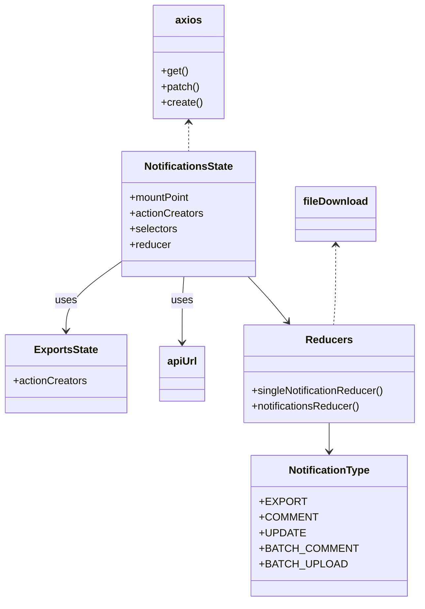

# Diagram: web/portal/src/modules/notifications/NotificationsState.js


> Auto-generated by Obscura crawlers

## Diagram 1



### SVG

<svg id="container" width="642" xmlns="http://www.w3.org/2000/svg" class="classDiagram" height="922" viewBox="0 0 642 922" role="graphics-document document" aria-roledescription="class"><style>#container{font-family:"trebuchet ms",verdana,arial,sans-serif;font-size:16px;fill:#333;}@keyframes edge-animation-frame{from{stroke-dashoffset:0;}}@keyframes dash{to{stroke-dashoffset:0;}}#container .edge-animation-slow{stroke-dasharray:9,5!important;stroke-dashoffset:900;animation:dash 50s linear infinite;stroke-linecap:round;}#container .edge-animation-fast{stroke-dasharray:9,5!important;stroke-dashoffset:900;animation:dash 20s linear infinite;stroke-linecap:round;}#container .error-icon{fill:#552222;}#container .error-text{fill:#552222;stroke:#552222;}#container .edge-thickness-normal{stroke-width:1px;}#container .edge-thickness-thick{stroke-width:3.5px;}#container .edge-pattern-solid{stroke-dasharray:0;}#container .edge-thickness-invisible{stroke-width:0;fill:none;}#container .edge-pattern-dashed{stroke-dasharray:3;}#container .edge-pattern-dotted{stroke-dasharray:2;}#container .marker{fill:#333333;stroke:#333333;}#container .marker.cross{stroke:#333333;}#container svg{font-family:"trebuchet ms",verdana,arial,sans-serif;font-size:16px;}#container p{margin:0;}#container g.classGroup text{fill:#9370DB;stroke:none;font-family:"trebuchet ms",verdana,arial,sans-serif;font-size:10px;}#container g.classGroup text .title{font-weight:bolder;}#container .nodeLabel,#container .edgeLabel{color:#131300;}#container .edgeLabel .label rect{fill:#ECECFF;}#container .label text{fill:#131300;}#container .labelBkg{background:#ECECFF;}#container .edgeLabel .label span{background:#ECECFF;}#container .classTitle{font-weight:bolder;}#container .node rect,#container .node circle,#container .node ellipse,#container .node polygon,#container .node path{fill:#ECECFF;stroke:#9370DB;stroke-width:1px;}#container .divider{stroke:#9370DB;stroke-width:1;}#container g.clickable{cursor:pointer;}#container g.classGroup rect{fill:#ECECFF;stroke:#9370DB;}#container g.classGroup line{stroke:#9370DB;stroke-width:1;}#container .classLabel .box{stroke:none;stroke-width:0;fill:#ECECFF;opacity:0.5;}#container .classLabel .label{fill:#9370DB;font-size:10px;}#container .relation{stroke:#333333;stroke-width:1;fill:none;}#container .dashed-line{stroke-dasharray:3;}#container .dotted-line{stroke-dasharray:1 2;}#container #compositionStart,#container .composition{fill:#333333!important;stroke:#333333!important;stroke-width:1;}#container #compositionEnd,#container .composition{fill:#333333!important;stroke:#333333!important;stroke-width:1;}#container #dependencyStart,#container .dependency{fill:#333333!important;stroke:#333333!important;stroke-width:1;}#container #dependencyStart,#container .dependency{fill:#333333!important;stroke:#333333!important;stroke-width:1;}#container #extensionStart,#container .extension{fill:transparent!important;stroke:#333333!important;stroke-width:1;}#container #extensionEnd,#container .extension{fill:transparent!important;stroke:#333333!important;stroke-width:1;}#container #aggregationStart,#container .aggregation{fill:transparent!important;stroke:#333333!important;stroke-width:1;}#container #aggregationEnd,#container .aggregation{fill:transparent!important;stroke:#333333!important;stroke-width:1;}#container #lollipopStart,#container .lollipop{fill:#ECECFF!important;stroke:#333333!important;stroke-width:1;}#container #lollipopEnd,#container .lollipop{fill:#ECECFF!important;stroke:#333333!important;stroke-width:1;}#container .edgeTerminals{font-size:11px;line-height:initial;}#container .classTitleText{text-anchor:middle;font-size:18px;fill:#333;}#container .label-icon{display:inline-block;height:1em;overflow:visible;vertical-align:-0.125em;}#container .node .label-icon path{fill:currentColor;stroke:revert;stroke-width:revert;}#container :root{--mermaid-font-family:"trebuchet ms",verdana,arial,sans-serif;}</style><g><defs><marker id="container_class-aggregationStart" class="marker aggregation class" refX="18" refY="7" markerWidth="190" markerHeight="240" orient="auto"><path d="M 18,7 L9,13 L1,7 L9,1 Z"></path></marker></defs><defs><marker id="container_class-aggregationEnd" class="marker aggregation class" refX="1" refY="7" markerWidth="20" markerHeight="28" orient="auto"><path d="M 18,7 L9,13 L1,7 L9,1 Z"></path></marker></defs><defs><marker id="container_class-extensionStart" class="marker extension class" refX="18" refY="7" markerWidth="190" markerHeight="240" orient="auto"><path d="M 1,7 L18,13 V 1 Z"></path></marker></defs><defs><marker id="container_class-extensionEnd" class="marker extension class" refX="1" refY="7" markerWidth="20" markerHeight="28" orient="auto"><path d="M 1,1 V 13 L18,7 Z"></path></marker></defs><defs><marker id="container_class-compositionStart" class="marker composition class" refX="18" refY="7" markerWidth="190" markerHeight="240" orient="auto"><path d="M 18,7 L9,13 L1,7 L9,1 Z"></path></marker></defs><defs><marker id="container_class-compositionEnd" class="marker composition class" refX="1" refY="7" markerWidth="20" markerHeight="28" orient="auto"><path d="M 18,7 L9,13 L1,7 L9,1 Z"></path></marker></defs><defs><marker id="container_class-dependencyStart" class="marker dependency class" refX="6" refY="7" markerWidth="190" markerHeight="240" orient="auto"><path d="M 5,7 L9,13 L1,7 L9,1 Z"></path></marker></defs><defs><marker id="container_class-dependencyEnd" class="marker dependency class" refX="13" refY="7" markerWidth="20" markerHeight="28" orient="auto"><path d="M 18,7 L9,13 L14,7 L9,1 Z"></path></marker></defs><defs><marker id="container_class-lollipopStart" class="marker lollipop class" refX="13" refY="7" markerWidth="190" markerHeight="240" orient="auto"><circle stroke="black" fill="transparent" cx="7" cy="7" r="6"></circle></marker></defs><defs><marker id="container_class-lollipopEnd" class="marker lollipop class" refX="1" refY="7" markerWidth="190" markerHeight="240" orient="auto"><circle stroke="black" fill="transparent" cx="7" cy="7" r="6"></circle></marker></defs><g class="root"><g class="clusters"></g><g class="edgePaths"><path d="M377.586,424L383.436,430.167C389.286,436.333,400.986,448.667,411.148,460.219C421.311,471.772,429.936,482.544,434.248,487.93L438.561,493.316" id="id_NotificationsState_Reducers_1" class="edge-thickness-normal edge-pattern-solid relation" style=";;;" data-edge="true" data-et="edge" data-id="id_NotificationsState_Reducers_1" data-points="W3sieCI6Mzc3LjU4NTY0Mzc5Njk5MjUsInkiOjQyNH0seyJ4Ijo0MTIuNjg1NTQ2ODc1LCJ5Ijo0NjF9LHsieCI6NDQyLjMxMTIyNjk4MTAyNjgsInkiOjQ5OH1d" marker-end="url(#container_class-dependencyEnd)"></path><path d="M184.945,400.487L170.813,410.572C156.681,420.658,128.417,440.829,114.285,458.581C100.152,476.333,100.152,491.667,100.152,499.333L100.152,507" id="id_NotificationsState_ExportsState_2" class="edge-thickness-normal edge-pattern-solid relation" style=";;;" data-edge="true" data-et="edge" data-id="id_NotificationsState_ExportsState_2" data-points="W3sieCI6MTg0Ljk0NTMxMjUsInkiOjQwMC40ODY2NTg3MDE3MTI1fSx7IngiOjEwMC4xNTIzNDM3NSwieSI6NDYxfSx7IngiOjEwMC4xNTIzNDM3NSwieSI6NTEzfV0=" marker-end="url(#container_class-dependencyEnd)"></path><path d="M279.298,424L278.834,430.167C278.37,436.333,277.443,448.667,276.979,465.5C276.516,482.333,276.516,503.667,276.516,514.333L276.516,525" id="id_NotificationsState_apiUrl_3" class="edge-thickness-normal edge-pattern-solid relation" style=";;;" data-edge="true" data-et="edge" data-id="id_NotificationsState_apiUrl_3" data-points="W3sieCI6Mjc5LjI5NzU3OTg4NzIxODAzLCJ5Ijo0MjR9LHsieCI6Mjc2LjUxNTYyNSwieSI6NDYxfSx7IngiOjI3Ni41MTU2MjUsInkiOjUzMX1d" marker-end="url(#container_class-dependencyEnd)"></path><path d="M502.363,648L502.363,652.167C502.363,656.333,502.363,664.667,502.363,672C502.363,679.333,502.363,685.667,502.363,688.833L502.363,692" id="id_Reducers_NotificationType_4" class="edge-thickness-normal edge-pattern-solid relation" style=";;;" data-edge="true" data-et="edge" data-id="id_Reducers_NotificationType_4" data-points="W3sieCI6NTAyLjM2MzI4MTI1LCJ5Ijo2NDh9LHsieCI6NTAyLjM2MzI4MTI1LCJ5Ijo2NzN9LHsieCI6NTAyLjM2MzI4MTI1LCJ5Ijo2OTh9XQ==" marker-end="url(#container_class-dependencyEnd)"></path><path d="M286.516,188L286.516,191.167C286.516,194.333,286.516,200.667,286.516,208C286.516,215.333,286.516,223.667,286.516,227.833L286.516,232" id="id_axios_NotificationsState_5" class="edge-thickness-normal edge-pattern-dashed relation" style=";;;" data-edge="true" data-et="edge" data-id="id_axios_NotificationsState_5" data-points="W3sieCI6Mjg2LjUxNTYyNSwieSI6MTgyfSx7IngiOjI4Ni41MTU2MjUsInkiOjIwN30seyJ4IjoyODYuNTE1NjI1LCJ5IjoyMzJ9XQ==" marker-start="url(#container_class-dependencyStart)"></path><path d="M512.363,376L512.363,390.167C512.363,404.333,512.363,432.667,511.813,453C511.262,473.333,510.161,485.667,509.61,491.833L509.06,498" id="id_fileDownload_Reducers_6" class="edge-thickness-normal edge-pattern-dashed relation" style=";;;" data-edge="true" data-et="edge" data-id="id_fileDownload_Reducers_6" data-points="W3sieCI6NTEyLjM2MzI4MTI1LCJ5IjozNzB9LHsieCI6NTEyLjM2MzI4MTI1LCJ5Ijo0NjF9LHsieCI6NTA5LjA1OTcwOTgyMTQyODU2LCJ5Ijo0OTh9XQ==" marker-start="url(#container_class-dependencyStart)"></path></g><g class="edgeLabels"><g class="edgeLabel"><g class="label" data-id="id_NotificationsState_Reducers_1" transform="translate(0, 0)"><foreignObject width="0" height="0"><div xmlns="http://www.w3.org/1999/xhtml" class="labelBkg" style="display: table-cell; white-space: nowrap; line-height: 1.5; max-width: 200px; text-align: center;"><span class="edgeLabel"></span></div></foreignObject></g></g><g class="edgeLabel" transform="translate(100.15234375, 461)"><g class="label" data-id="id_NotificationsState_ExportsState_2" transform="translate(-16.4921875, -12)"><foreignObject width="32.984375" height="24"><div xmlns="http://www.w3.org/1999/xhtml" class="labelBkg" style="display: table-cell; white-space: nowrap; line-height: 1.5; max-width: 200px; text-align: center;"><span class="edgeLabel"><p>uses</p></span></div></foreignObject></g></g><g class="edgeLabel" transform="translate(276.515625, 461)"><g class="label" data-id="id_NotificationsState_apiUrl_3" transform="translate(-16.4921875, -12)"><foreignObject width="32.984375" height="24"><div xmlns="http://www.w3.org/1999/xhtml" class="labelBkg" style="display: table-cell; white-space: nowrap; line-height: 1.5; max-width: 200px; text-align: center;"><span class="edgeLabel"><p>uses</p></span></div></foreignObject></g></g><g class="edgeLabel"><g class="label" data-id="id_Reducers_NotificationType_4" transform="translate(0, 0)"><foreignObject width="0" height="0"><div xmlns="http://www.w3.org/1999/xhtml" class="labelBkg" style="display: table-cell; white-space: nowrap; line-height: 1.5; max-width: 200px; text-align: center;"><span class="edgeLabel"></span></div></foreignObject></g></g><g class="edgeLabel"><g class="label" data-id="id_axios_NotificationsState_5" transform="translate(0, 0)"><foreignObject width="0" height="0"><div xmlns="http://www.w3.org/1999/xhtml" class="labelBkg" style="display: table-cell; white-space: nowrap; line-height: 1.5; max-width: 200px; text-align: center;"><span class="edgeLabel"></span></div></foreignObject></g></g><g class="edgeLabel"><g class="label" data-id="id_fileDownload_Reducers_6" transform="translate(0, 0)"><foreignObject width="0" height="0"><div xmlns="http://www.w3.org/1999/xhtml" class="labelBkg" style="display: table-cell; white-space: nowrap; line-height: 1.5; max-width: 200px; text-align: center;"><span class="edgeLabel"></span></div></foreignObject></g></g></g><g class="nodes"><g class="node default" id="classId-NotificationsState-0" transform="translate(286.515625, 328)"><g class="basic label-container"><path d="M-101.5703125 -96 L101.5703125 -96 L101.5703125 96 L-101.5703125 96" stroke="none" stroke-width="0" fill="#ECECFF" style=""></path><path d="M-101.5703125 -96 C-45.36268425472616 -96, 10.844943990547677 -96, 101.5703125 -96 M-101.5703125 -96 C-43.93050553061734 -96, 13.709301438765323 -96, 101.5703125 -96 M101.5703125 -96 C101.5703125 -35.60609131677587, 101.5703125 24.787817366448266, 101.5703125 96 M101.5703125 -96 C101.5703125 -50.15499160714425, 101.5703125 -4.3099832142884935, 101.5703125 96 M101.5703125 96 C58.06829444197709 96, 14.566276383954175 96, -101.5703125 96 M101.5703125 96 C27.689850363387507 96, -46.19061177322499 96, -101.5703125 96 M-101.5703125 96 C-101.5703125 52.07382153532816, -101.5703125 8.147643070656315, -101.5703125 -96 M-101.5703125 96 C-101.5703125 30.194706309241027, -101.5703125 -35.610587381517945, -101.5703125 -96" stroke="#9370DB" stroke-width="1.3" fill="none" stroke-dasharray="0 0" style=""></path></g><g class="annotation-group text" transform="translate(0, -72)"></g><g class="label-group text" transform="translate(-66.0625, -72)"><g class="label" style="font-weight: bolder" transform="translate(0,-12)"><foreignObject width="132.125" height="24"><div xmlns="http://www.w3.org/1999/xhtml" style="display: table-cell; white-space: nowrap; line-height: 1.5; max-width: 180px; text-align: center;"><span class="nodeLabel markdown-node-label" style=""><p>NotificationsState</p></span></div></foreignObject></g></g><g class="members-group text" transform="translate(-89.5703125, -24)"><g class="label" style="" transform="translate(0,-12)"><foreignObject width="93.34375" height="24"><div xmlns="http://www.w3.org/1999/xhtml" style="display: table-cell; white-space: nowrap; line-height: 1.5; max-width: 151px; text-align: center;"><span class="nodeLabel markdown-node-label" style=""><p>+mountPoint</p></span></div></foreignObject></g><g class="label" style="" transform="translate(0,12)"><foreignObject width="113.078125" height="24"><div xmlns="http://www.w3.org/1999/xhtml" style="display: table-cell; white-space: nowrap; line-height: 1.5; max-width: 170px; text-align: center;"><span class="nodeLabel markdown-node-label" style=""><p>+actionCreators</p></span></div></foreignObject></g><g class="label" style="" transform="translate(0,36)"><foreignObject width="73.453125" height="24"><div xmlns="http://www.w3.org/1999/xhtml" style="display: table-cell; white-space: nowrap; line-height: 1.5; max-width: 131px; text-align: center;"><span class="nodeLabel markdown-node-label" style=""><p>+selectors</p></span></div></foreignObject></g><g class="label" style="" transform="translate(0,60)"><foreignObject width="63.515625" height="24"><div xmlns="http://www.w3.org/1999/xhtml" style="display: table-cell; white-space: nowrap; line-height: 1.5; max-width: 122px; text-align: center;"><span class="nodeLabel markdown-node-label" style=""><p>+reducer</p></span></div></foreignObject></g></g><g class="methods-group text" transform="translate(-89.5703125, 96)"></g><g class="divider" style=""><path d="M-101.5703125 -48 C-38.30452132691533 -48, 24.961269846169344 -48, 101.5703125 -48 M-101.5703125 -48 C-52.80980366012712 -48, -4.0492948202542465 -48, 101.5703125 -48" stroke="#9370DB" stroke-width="1.3" fill="none" stroke-dasharray="0 0" style=""></path></g><g class="divider" style=""><path d="M-101.5703125 72 C-28.875405371213375 72, 43.81950175757325 72, 101.5703125 72 M-101.5703125 72 C-28.392146102485242 72, 44.786020295029516 72, 101.5703125 72" stroke="#9370DB" stroke-width="1.3" fill="none" stroke-dasharray="0 0" style=""></path></g></g><g class="node default" id="classId-ExportsState-1" transform="translate(100.15234375, 573)"><g class="basic label-container"><path d="M-92.15234375 -60 L92.15234375 -60 L92.15234375 60 L-92.15234375 60" stroke="none" stroke-width="0" fill="#ECECFF" style=""></path><path d="M-92.15234375 -60 C-48.35870985176672 -60, -4.565075953533437 -60, 92.15234375 -60 M-92.15234375 -60 C-52.270224022428515 -60, -12.38810429485703 -60, 92.15234375 -60 M92.15234375 -60 C92.15234375 -20.888938938978313, 92.15234375 18.222122122043373, 92.15234375 60 M92.15234375 -60 C92.15234375 -35.46344283679515, 92.15234375 -10.926885673590306, 92.15234375 60 M92.15234375 60 C30.777337080716215 60, -30.59766958856757 60, -92.15234375 60 M92.15234375 60 C36.64328634423194 60, -18.865771061536122 60, -92.15234375 60 M-92.15234375 60 C-92.15234375 14.04257513896313, -92.15234375 -31.91484972207374, -92.15234375 -60 M-92.15234375 60 C-92.15234375 12.857396542384173, -92.15234375 -34.285206915231655, -92.15234375 -60" stroke="#9370DB" stroke-width="1.3" fill="none" stroke-dasharray="0 0" style=""></path></g><g class="annotation-group text" transform="translate(0, -36)"></g><g class="label-group text" transform="translate(-47.2265625, -36)"><g class="label" style="font-weight: bolder" transform="translate(0,-12)"><foreignObject width="94.453125" height="24"><div xmlns="http://www.w3.org/1999/xhtml" style="display: table-cell; white-space: nowrap; line-height: 1.5; max-width: 142px; text-align: center;"><span class="nodeLabel markdown-node-label" style=""><p>ExportsState</p></span></div></foreignObject></g></g><g class="members-group text" transform="translate(-80.15234375, 12)"><g class="label" style="" transform="translate(0,-12)"><foreignObject width="113.078125" height="24"><div xmlns="http://www.w3.org/1999/xhtml" style="display: table-cell; white-space: nowrap; line-height: 1.5; max-width: 170px; text-align: center;"><span class="nodeLabel markdown-node-label" style=""><p>+actionCreators</p></span></div></foreignObject></g></g><g class="methods-group text" transform="translate(-80.15234375, 60)"></g><g class="divider" style=""><path d="M-92.15234375 -12 C-53.07549012766198 -12, -13.998636505323958 -12, 92.15234375 -12 M-92.15234375 -12 C-44.89590766879351 -12, 2.3605284124129753 -12, 92.15234375 -12" stroke="#9370DB" stroke-width="1.3" fill="none" stroke-dasharray="0 0" style=""></path></g><g class="divider" style=""><path d="M-92.15234375 36 C-20.495687264560416 36, 51.16096922087917 36, 92.15234375 36 M-92.15234375 36 C-27.91044137419115 36, 36.3314610016177 36, 92.15234375 36" stroke="#9370DB" stroke-width="1.3" fill="none" stroke-dasharray="0 0" style=""></path></g></g><g class="node default" id="classId-axios-2" transform="translate(286.515625, 95)"><g class="basic label-container"><path d="M-53.24609375 -87 L53.24609375 -87 L53.24609375 87 L-53.24609375 87" stroke="none" stroke-width="0" fill="#ECECFF" style=""></path><path d="M-53.24609375 -87 C-16.407182561678226 -87, 20.431728626643547 -87, 53.24609375 -87 M-53.24609375 -87 C-25.553509594960826 -87, 2.139074560078349 -87, 53.24609375 -87 M53.24609375 -87 C53.24609375 -20.17571577559299, 53.24609375 46.64856844881402, 53.24609375 87 M53.24609375 -87 C53.24609375 -26.50855980030154, 53.24609375 33.98288039939692, 53.24609375 87 M53.24609375 87 C13.06530245247086 87, -27.11548884505828 87, -53.24609375 87 M53.24609375 87 C14.863785332918702 87, -23.518523084162595 87, -53.24609375 87 M-53.24609375 87 C-53.24609375 20.40092109611126, -53.24609375 -46.19815780777748, -53.24609375 -87 M-53.24609375 87 C-53.24609375 25.727502060429714, -53.24609375 -35.54499587914057, -53.24609375 -87" stroke="#9370DB" stroke-width="1.3" fill="none" stroke-dasharray="0 0" style=""></path></g><g class="annotation-group text" transform="translate(0, -63)"></g><g class="label-group text" transform="translate(-19.2734375, -63)"><g class="label" style="font-weight: bolder" transform="translate(0,-12)"><foreignObject width="38.546875" height="24"><div xmlns="http://www.w3.org/1999/xhtml" style="display: table-cell; white-space: nowrap; line-height: 1.5; max-width: 88px; text-align: center;"><span class="nodeLabel markdown-node-label" style=""><p>axios</p></span></div></foreignObject></g></g><g class="members-group text" transform="translate(-41.24609375, -15)"></g><g class="methods-group text" transform="translate(-41.24609375, 15)"><g class="label" style="" transform="translate(0,-12)"><foreignObject width="40.921875" height="24"><div xmlns="http://www.w3.org/1999/xhtml" style="display: table-cell; white-space: nowrap; line-height: 1.5; max-width: 98px; text-align: center;"><span class="nodeLabel markdown-node-label" style=""><p>+get()</p></span></div></foreignObject></g><g class="label" style="" transform="translate(0,12)"><foreignObject width="58.96875" height="24"><div xmlns="http://www.w3.org/1999/xhtml" style="display: table-cell; white-space: nowrap; line-height: 1.5; max-width: 116px; text-align: center;"><span class="nodeLabel markdown-node-label" style=""><p>+patch()</p></span></div></foreignObject></g><g class="label" style="" transform="translate(0,36)"><foreignObject width="63.21875" height="24"><div xmlns="http://www.w3.org/1999/xhtml" style="display: table-cell; white-space: nowrap; line-height: 1.5; max-width: 121px; text-align: center;"><span class="nodeLabel markdown-node-label" style=""><p>+create()</p></span></div></foreignObject></g></g><g class="divider" style=""><path d="M-53.24609375 -39 C-20.987006603766623 -39, 11.272080542466753 -39, 53.24609375 -39 M-53.24609375 -39 C-23.145531567756866 -39, 6.955030614486269 -39, 53.24609375 -39" stroke="#9370DB" stroke-width="1.3" fill="none" stroke-dasharray="0 0" style=""></path></g><g class="divider" style=""><path d="M-53.24609375 -15 C-26.57844450568934 -15, 0.08920473862131928 -15, 53.24609375 -15 M-53.24609375 -15 C-27.787664128478806 -15, -2.3292345069576115 -15, 53.24609375 -15" stroke="#9370DB" stroke-width="1.3" fill="none" stroke-dasharray="0 0" style=""></path></g></g><g class="node default" id="classId-apiUrl-3" transform="translate(276.515625, 573)"><g class="basic label-container"><path d="M-34.2109375 -42 L34.2109375 -42 L34.2109375 42 L-34.2109375 42" stroke="none" stroke-width="0" fill="#ECECFF" style=""></path><path d="M-34.2109375 -42 C-13.299649122865812 -42, 7.6116392542683755 -42, 34.2109375 -42 M-34.2109375 -42 C-12.050811633802176 -42, 10.109314232395647 -42, 34.2109375 -42 M34.2109375 -42 C34.2109375 -8.533703918992785, 34.2109375 24.93259216201443, 34.2109375 42 M34.2109375 -42 C34.2109375 -10.35597168282818, 34.2109375 21.28805663434364, 34.2109375 42 M34.2109375 42 C11.388185761861077 42, -11.434565976277845 42, -34.2109375 42 M34.2109375 42 C19.720990866116274 42, 5.231044232232552 42, -34.2109375 42 M-34.2109375 42 C-34.2109375 23.542854516210536, -34.2109375 5.085709032421072, -34.2109375 -42 M-34.2109375 42 C-34.2109375 14.12534745216038, -34.2109375 -13.74930509567924, -34.2109375 -42" stroke="#9370DB" stroke-width="1.3" fill="none" stroke-dasharray="0 0" style=""></path></g><g class="annotation-group text" transform="translate(0, -18)"></g><g class="label-group text" transform="translate(-22.2109375, -18)"><g class="label" style="font-weight: bolder" transform="translate(0,-12)"><foreignObject width="44.421875" height="24"><div xmlns="http://www.w3.org/1999/xhtml" style="display: table-cell; white-space: nowrap; line-height: 1.5; max-width: 94px; text-align: center;"><span class="nodeLabel markdown-node-label" style=""><p>apiUrl</p></span></div></foreignObject></g></g><g class="members-group text" transform="translate(-22.2109375, 30)"></g><g class="methods-group text" transform="translate(-22.2109375, 60)"></g><g class="divider" style=""><path d="M-34.2109375 6 C-13.71218417487528 6, 6.786569150249441 6, 34.2109375 6 M-34.2109375 6 C-8.50204500256639 6, 17.20684749486722 6, 34.2109375 6" stroke="#9370DB" stroke-width="1.3" fill="none" stroke-dasharray="0 0" style=""></path></g><g class="divider" style=""><path d="M-34.2109375 24 C-7.135993321363639 24, 19.938950857272722 24, 34.2109375 24 M-34.2109375 24 C-19.327212530013725 24, -4.4434875600274495 24, 34.2109375 24" stroke="#9370DB" stroke-width="1.3" fill="none" stroke-dasharray="0 0" style=""></path></g></g><g class="node default" id="classId-fileDownload-4" transform="translate(512.36328125, 328)"><g class="basic label-container"><path d="M-60.1484375 -42 L60.1484375 -42 L60.1484375 42 L-60.1484375 42" stroke="none" stroke-width="0" fill="#ECECFF" style=""></path><path d="M-60.1484375 -42 C-19.1942314826235 -42, 21.759974534753 -42, 60.1484375 -42 M-60.1484375 -42 C-26.140464966327222 -42, 7.867507567345555 -42, 60.1484375 -42 M60.1484375 -42 C60.1484375 -22.108041723876607, 60.1484375 -2.2160834477532134, 60.1484375 42 M60.1484375 -42 C60.1484375 -12.457395650577432, 60.1484375 17.085208698845136, 60.1484375 42 M60.1484375 42 C31.463386028168646 42, 2.778334556337292 42, -60.1484375 42 M60.1484375 42 C35.918239003950234 42, 11.688040507900467 42, -60.1484375 42 M-60.1484375 42 C-60.1484375 19.11862147532647, -60.1484375 -3.7627570493470586, -60.1484375 -42 M-60.1484375 42 C-60.1484375 23.896143848245924, -60.1484375 5.792287696491847, -60.1484375 -42" stroke="#9370DB" stroke-width="1.3" fill="none" stroke-dasharray="0 0" style=""></path></g><g class="annotation-group text" transform="translate(0, -18)"></g><g class="label-group text" transform="translate(-48.1484375, -18)"><g class="label" style="font-weight: bolder" transform="translate(0,-12)"><foreignObject width="96.296875" height="24"><div xmlns="http://www.w3.org/1999/xhtml" style="display: table-cell; white-space: nowrap; line-height: 1.5; max-width: 145px; text-align: center;"><span class="nodeLabel markdown-node-label" style=""><p>fileDownload</p></span></div></foreignObject></g></g><g class="members-group text" transform="translate(-48.1484375, 30)"></g><g class="methods-group text" transform="translate(-48.1484375, 60)"></g><g class="divider" style=""><path d="M-60.1484375 6 C-30.89090514551487 6, -1.6333727910297426 6, 60.1484375 6 M-60.1484375 6 C-33.62388738572318 6, -7.099337271446359 6, 60.1484375 6" stroke="#9370DB" stroke-width="1.3" fill="none" stroke-dasharray="0 0" style=""></path></g><g class="divider" style=""><path d="M-60.1484375 24 C-30.24684261257717 24, -0.3452477251543371 24, 60.1484375 24 M-60.1484375 24 C-25.767570306511523 24, 8.613296886976954 24, 60.1484375 24" stroke="#9370DB" stroke-width="1.3" fill="none" stroke-dasharray="0 0" style=""></path></g></g><g class="node default" id="classId-NotificationType-5" transform="translate(502.36328125, 806)"><g class="basic label-container"><path d="M-108.859375 -108 L108.859375 -108 L108.859375 108 L-108.859375 108" stroke="none" stroke-width="0" fill="#ECECFF" style=""></path><path d="M-108.859375 -108 C-42.571447177016964 -108, 23.716480645966072 -108, 108.859375 -108 M-108.859375 -108 C-47.68933119431836 -108, 13.480712611363273 -108, 108.859375 -108 M108.859375 -108 C108.859375 -47.98028732646659, 108.859375 12.039425347066825, 108.859375 108 M108.859375 -108 C108.859375 -60.05496546962823, 108.859375 -12.109930939256458, 108.859375 108 M108.859375 108 C44.50937638954511 108, -19.84062222090978 108, -108.859375 108 M108.859375 108 C42.26931933490462 108, -24.320736330190755 108, -108.859375 108 M-108.859375 108 C-108.859375 22.103560269867742, -108.859375 -63.792879460264516, -108.859375 -108 M-108.859375 108 C-108.859375 25.12786249654826, -108.859375 -57.74427500690348, -108.859375 -108" stroke="#9370DB" stroke-width="1.3" fill="none" stroke-dasharray="0 0" style=""></path></g><g class="annotation-group text" transform="translate(0, -84)"></g><g class="label-group text" transform="translate(-60.21875, -84)"><g class="label" style="font-weight: bolder" transform="translate(0,-12)"><foreignObject width="120.4375" height="24"><div xmlns="http://www.w3.org/1999/xhtml" style="display: table-cell; white-space: nowrap; line-height: 1.5; max-width: 169px; text-align: center;"><span class="nodeLabel markdown-node-label" style=""><p>NotificationType</p></span></div></foreignObject></g></g><g class="members-group text" transform="translate(-96.859375, -36)"><g class="label" style="" transform="translate(0,-12)"><foreignObject width="63.1875" height="24"><div xmlns="http://www.w3.org/1999/xhtml" style="display: table-cell; white-space: nowrap; line-height: 1.5; max-width: 121px; text-align: center;"><span class="nodeLabel markdown-node-label" style=""><p>+EXPORT</p></span></div></foreignObject></g><g class="label" style="" transform="translate(0,12)"><foreignObject width="80.25" height="24"><div xmlns="http://www.w3.org/1999/xhtml" style="display: table-cell; white-space: nowrap; line-height: 1.5; max-width: 138px; text-align: center;"><span class="nodeLabel markdown-node-label" style=""><p>+COMMENT</p></span></div></foreignObject></g><g class="label" style="" transform="translate(0,36)"><foreignObject width="63.21875" height="24"><div xmlns="http://www.w3.org/1999/xhtml" style="display: table-cell; white-space: nowrap; line-height: 1.5; max-width: 121px; text-align: center;"><span class="nodeLabel markdown-node-label" style=""><p>+UPDATE</p></span></div></foreignObject></g><g class="label" style="" transform="translate(0,60)"><foreignObject width="133.5" height="24"><div xmlns="http://www.w3.org/1999/xhtml" style="display: table-cell; white-space: nowrap; line-height: 1.5; max-width: 192px; text-align: center;"><span class="nodeLabel markdown-node-label" style=""><p>+BATCH_COMMENT</p></span></div></foreignObject></g><g class="label" style="" transform="translate(0,84)"><foreignObject width="118.921875" height="24"><div xmlns="http://www.w3.org/1999/xhtml" style="display: table-cell; white-space: nowrap; line-height: 1.5; max-width: 176px; text-align: center;"><span class="nodeLabel markdown-node-label" style=""><p>+BATCH_UPLOAD</p></span></div></foreignObject></g></g><g class="methods-group text" transform="translate(-96.859375, 108)"></g><g class="divider" style=""><path d="M-108.859375 -60 C-24.8022662375746 -60, 59.2548425248508 -60, 108.859375 -60 M-108.859375 -60 C-38.49477359465014 -60, 31.869827810699718 -60, 108.859375 -60" stroke="#9370DB" stroke-width="1.3" fill="none" stroke-dasharray="0 0" style=""></path></g><g class="divider" style=""><path d="M-108.859375 84 C-48.51070364180978 84, 11.837967716380433 84, 108.859375 84 M-108.859375 84 C-32.25288045024419 84, 44.35361409951162 84, 108.859375 84" stroke="#9370DB" stroke-width="1.3" fill="none" stroke-dasharray="0 0" style=""></path></g></g><g class="node default" id="classId-Reducers-6" transform="translate(502.36328125, 573)"><g class="basic label-container"><path d="M-131.63671875 -75 L131.63671875 -75 L131.63671875 75 L-131.63671875 75" stroke="none" stroke-width="0" fill="#ECECFF" style=""></path><path d="M-131.63671875 -75 C-56.64238925384855 -75, 18.351940242302902 -75, 131.63671875 -75 M-131.63671875 -75 C-65.24272236335081 -75, 1.1512740232983845 -75, 131.63671875 -75 M131.63671875 -75 C131.63671875 -19.966964294928815, 131.63671875 35.06607141014237, 131.63671875 75 M131.63671875 -75 C131.63671875 -40.54169507815679, 131.63671875 -6.083390156313584, 131.63671875 75 M131.63671875 75 C50.31511601375023 75, -31.006486722499545 75, -131.63671875 75 M131.63671875 75 C51.433560177401574 75, -28.76959839519685 75, -131.63671875 75 M-131.63671875 75 C-131.63671875 39.375539825965795, -131.63671875 3.7510796519315903, -131.63671875 -75 M-131.63671875 75 C-131.63671875 19.703111573799248, -131.63671875 -35.593776852401504, -131.63671875 -75" stroke="#9370DB" stroke-width="1.3" fill="none" stroke-dasharray="0 0" style=""></path></g><g class="annotation-group text" transform="translate(0, -51)"></g><g class="label-group text" transform="translate(-33.6796875, -51)"><g class="label" style="font-weight: bolder" transform="translate(0,-12)"><foreignObject width="67.359375" height="24"><div xmlns="http://www.w3.org/1999/xhtml" style="display: table-cell; white-space: nowrap; line-height: 1.5; max-width: 117px; text-align: center;"><span class="nodeLabel markdown-node-label" style=""><p>Reducers</p></span></div></foreignObject></g></g><g class="members-group text" transform="translate(-119.63671875, -3)"></g><g class="methods-group text" transform="translate(-119.63671875, 27)"><g class="label" style="" transform="translate(0,-12)"><foreignObject width="205.59375" height="24"><div xmlns="http://www.w3.org/1999/xhtml" style="display: table-cell; white-space: nowrap; line-height: 1.5; max-width: 263px; text-align: center;"><span class="nodeLabel markdown-node-label" style=""><p>+singleNotificationReducer()</p></span></div></foreignObject></g><g class="label" style="" transform="translate(0,12)"><foreignObject width="168.5" height="24"><div xmlns="http://www.w3.org/1999/xhtml" style="display: table-cell; white-space: nowrap; line-height: 1.5; max-width: 226px; text-align: center;"><span class="nodeLabel markdown-node-label" style=""><p>+notificationsReducer()</p></span></div></foreignObject></g></g><g class="divider" style=""><path d="M-131.63671875 -27 C-76.83739561022097 -27, -22.038072470441918 -27, 131.63671875 -27 M-131.63671875 -27 C-75.4558488163748 -27, -19.274978882749593 -27, 131.63671875 -27" stroke="#9370DB" stroke-width="1.3" fill="none" stroke-dasharray="0 0" style=""></path></g><g class="divider" style=""><path d="M-131.63671875 -3 C-63.379032086763175 -3, 4.87865457647365 -3, 131.63671875 -3 M-131.63671875 -3 C-66.48571611751142 -3, -1.3347134850228315 -3, 131.63671875 -3" stroke="#9370DB" stroke-width="1.3" fill="none" stroke-dasharray="0 0" style=""></path></g></g></g></g></g></svg>

## Diagram 2

```mermaid
flowchart TD
  A[fetchNotification(params)] --> B{build qs and dispatch START_FETCH_NOTIFICATIONS}
  B --> C[axios.get(qs(notificationUrl(params.id)))]
  C --> D[response.data?]
  D -->|yes| E[dispatch handleExports(response.data.data)]
  E --> F[dispatch setNotificationResults(data, meta, refresh)]
  F --> G[dispatch setNotificationUnreadCount(meta.unreadCount)]
  D -->|no| H[no-op]
  C --> I[network/errors handled by promise rejection]
  J[postHasReadNotification(params)] --> K[axios.patch(notificationUrl(id)/read, payload)]
  K --> L[dispatch handleExports(response.data.data)]
  L --> M[dispatch fetchNotification({pageSize:10, refresh:true})]
```

> SVG rendering failed for this diagram.
