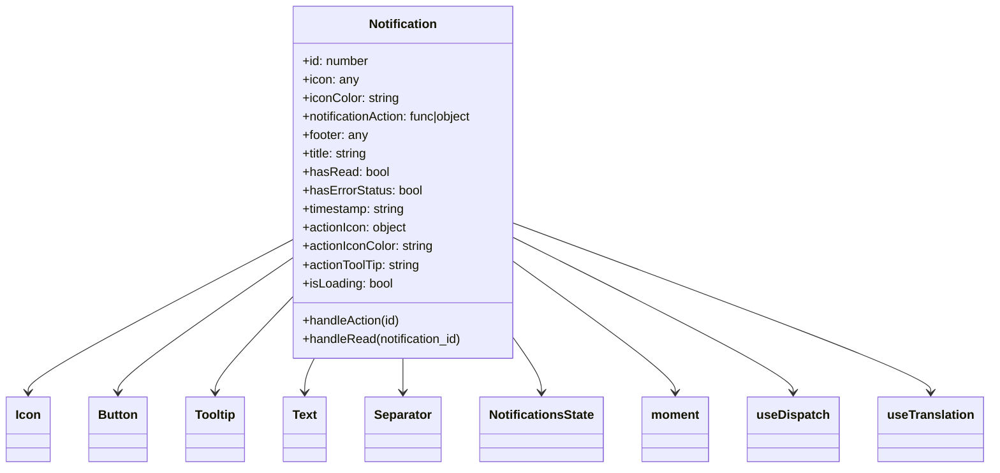

# Diagram: web/portal/src/modules/notifications/components/Notification.molecule.js


> Auto-generated by Obscura crawlers

## Diagram 1



### SVG

<svg id="container" width="1257.15625" xmlns="http://www.w3.org/2000/svg" class="classDiagram" height="606" viewBox="0 0 1257.15625 606" role="graphics-document document" aria-roledescription="class"><style>#container{font-family:"trebuchet ms",verdana,arial,sans-serif;font-size:16px;fill:#333;}@keyframes edge-animation-frame{from{stroke-dashoffset:0;}}@keyframes dash{to{stroke-dashoffset:0;}}#container .edge-animation-slow{stroke-dasharray:9,5!important;stroke-dashoffset:900;animation:dash 50s linear infinite;stroke-linecap:round;}#container .edge-animation-fast{stroke-dasharray:9,5!important;stroke-dashoffset:900;animation:dash 20s linear infinite;stroke-linecap:round;}#container .error-icon{fill:#552222;}#container .error-text{fill:#552222;stroke:#552222;}#container .edge-thickness-normal{stroke-width:1px;}#container .edge-thickness-thick{stroke-width:3.5px;}#container .edge-pattern-solid{stroke-dasharray:0;}#container .edge-thickness-invisible{stroke-width:0;fill:none;}#container .edge-pattern-dashed{stroke-dasharray:3;}#container .edge-pattern-dotted{stroke-dasharray:2;}#container .marker{fill:#333333;stroke:#333333;}#container .marker.cross{stroke:#333333;}#container svg{font-family:"trebuchet ms",verdana,arial,sans-serif;font-size:16px;}#container p{margin:0;}#container g.classGroup text{fill:#9370DB;stroke:none;font-family:"trebuchet ms",verdana,arial,sans-serif;font-size:10px;}#container g.classGroup text .title{font-weight:bolder;}#container .nodeLabel,#container .edgeLabel{color:#131300;}#container .edgeLabel .label rect{fill:#ECECFF;}#container .label text{fill:#131300;}#container .labelBkg{background:#ECECFF;}#container .edgeLabel .label span{background:#ECECFF;}#container .classTitle{font-weight:bolder;}#container .node rect,#container .node circle,#container .node ellipse,#container .node polygon,#container .node path{fill:#ECECFF;stroke:#9370DB;stroke-width:1px;}#container .divider{stroke:#9370DB;stroke-width:1;}#container g.clickable{cursor:pointer;}#container g.classGroup rect{fill:#ECECFF;stroke:#9370DB;}#container g.classGroup line{stroke:#9370DB;stroke-width:1;}#container .classLabel .box{stroke:none;stroke-width:0;fill:#ECECFF;opacity:0.5;}#container .classLabel .label{fill:#9370DB;font-size:10px;}#container .relation{stroke:#333333;stroke-width:1;fill:none;}#container .dashed-line{stroke-dasharray:3;}#container .dotted-line{stroke-dasharray:1 2;}#container #compositionStart,#container .composition{fill:#333333!important;stroke:#333333!important;stroke-width:1;}#container #compositionEnd,#container .composition{fill:#333333!important;stroke:#333333!important;stroke-width:1;}#container #dependencyStart,#container .dependency{fill:#333333!important;stroke:#333333!important;stroke-width:1;}#container #dependencyStart,#container .dependency{fill:#333333!important;stroke:#333333!important;stroke-width:1;}#container #extensionStart,#container .extension{fill:transparent!important;stroke:#333333!important;stroke-width:1;}#container #extensionEnd,#container .extension{fill:transparent!important;stroke:#333333!important;stroke-width:1;}#container #aggregationStart,#container .aggregation{fill:transparent!important;stroke:#333333!important;stroke-width:1;}#container #aggregationEnd,#container .aggregation{fill:transparent!important;stroke:#333333!important;stroke-width:1;}#container #lollipopStart,#container .lollipop{fill:#ECECFF!important;stroke:#333333!important;stroke-width:1;}#container #lollipopEnd,#container .lollipop{fill:#ECECFF!important;stroke:#333333!important;stroke-width:1;}#container .edgeTerminals{font-size:11px;line-height:initial;}#container .classTitleText{text-anchor:middle;font-size:18px;fill:#333;}#container .label-icon{display:inline-block;height:1em;overflow:visible;vertical-align:-0.125em;}#container .node .label-icon path{fill:currentColor;stroke:revert;stroke-width:revert;}#container :root{--mermaid-font-family:"trebuchet ms",verdana,arial,sans-serif;}</style><g><defs><marker id="container_class-aggregationStart" class="marker aggregation class" refX="18" refY="7" markerWidth="190" markerHeight="240" orient="auto"><path d="M 18,7 L9,13 L1,7 L9,1 Z"></path></marker></defs><defs><marker id="container_class-aggregationEnd" class="marker aggregation class" refX="1" refY="7" markerWidth="20" markerHeight="28" orient="auto"><path d="M 18,7 L9,13 L1,7 L9,1 Z"></path></marker></defs><defs><marker id="container_class-extensionStart" class="marker extension class" refX="18" refY="7" markerWidth="190" markerHeight="240" orient="auto"><path d="M 1,7 L18,13 V 1 Z"></path></marker></defs><defs><marker id="container_class-extensionEnd" class="marker extension class" refX="1" refY="7" markerWidth="20" markerHeight="28" orient="auto"><path d="M 1,1 V 13 L18,7 Z"></path></marker></defs><defs><marker id="container_class-compositionStart" class="marker composition class" refX="18" refY="7" markerWidth="190" markerHeight="240" orient="auto"><path d="M 18,7 L9,13 L1,7 L9,1 Z"></path></marker></defs><defs><marker id="container_class-compositionEnd" class="marker composition class" refX="1" refY="7" markerWidth="20" markerHeight="28" orient="auto"><path d="M 18,7 L9,13 L1,7 L9,1 Z"></path></marker></defs><defs><marker id="container_class-dependencyStart" class="marker dependency class" refX="6" refY="7" markerWidth="190" markerHeight="240" orient="auto"><path d="M 5,7 L9,13 L1,7 L9,1 Z"></path></marker></defs><defs><marker id="container_class-dependencyEnd" class="marker dependency class" refX="13" refY="7" markerWidth="20" markerHeight="28" orient="auto"><path d="M 18,7 L9,13 L14,7 L9,1 Z"></path></marker></defs><defs><marker id="container_class-lollipopStart" class="marker lollipop class" refX="13" refY="7" markerWidth="190" markerHeight="240" orient="auto"><circle stroke="black" fill="transparent" cx="7" cy="7" r="6"></circle></marker></defs><defs><marker id="container_class-lollipopEnd" class="marker lollipop class" refX="1" refY="7" markerWidth="190" markerHeight="240" orient="auto"><circle stroke="black" fill="transparent" cx="7" cy="7" r="6"></circle></marker></defs><g class="root"><g class="clusters"></g><g class="edgePaths"><path d="M366.809,314.053L311.558,343.211C256.307,372.369,145.806,430.684,90.555,463.009C35.305,495.333,35.305,501.667,35.305,504.833L35.305,508" id="id_Notification_Icon_1" class="edge-thickness-normal edge-pattern-solid relation" style=";;;" data-edge="true" data-et="edge" data-id="id_Notification_Icon_1" data-points="W3sieCI6MzY2LjgwODU5Mzc1LCJ5IjozMTQuMDUzNDEwNzk0NjAyN30seyJ4IjozNS4zMDQ2ODc1LCJ5Ijo0ODl9LHsieCI6MzUuMzA0Njg3NSwieSI6NTE0fV0=" marker-end="url(#container_class-dependencyEnd)"></path><path d="M366.809,338.444L330.581,363.537C294.354,388.629,221.9,438.815,185.673,467.074C149.445,495.333,149.445,501.667,149.445,504.833L149.445,508" id="id_Notification_Button_2" class="edge-thickness-normal edge-pattern-solid relation" style=";;;" data-edge="true" data-et="edge" data-id="id_Notification_Button_2" data-points="W3sieCI6MzY2LjgwODU5Mzc1LCJ5IjozMzguNDQ0MDU4MjYyMzk0NjZ9LHsieCI6MTQ5LjQ0NTMxMjUsInkiOjQ4OX0seyJ4IjoxNDkuNDQ1MzEyNSwieSI6NTE0fV0=" marker-end="url(#container_class-dependencyEnd)"></path><path d="M366.809,391.458L351.342,407.715C335.875,423.972,304.941,456.486,289.475,475.91C274.008,495.333,274.008,501.667,274.008,504.833L274.008,508" id="id_Notification_Tooltip_3" class="edge-thickness-normal edge-pattern-solid relation" style=";;;" data-edge="true" data-et="edge" data-id="id_Notification_Tooltip_3" data-points="W3sieCI6MzY2LjgwODU5Mzc1LCJ5IjozOTEuNDU4Mjc2NTMzNTkzfSx7IngiOjI3NC4wMDc4MTI1LCJ5Ijo0ODl9LHsieCI6Mjc0LjAwNzgxMjUsInkiOjUxNH1d" marker-end="url(#container_class-dependencyEnd)"></path><path d="M401.528,464L399.459,468.167C397.391,472.333,393.254,480.667,391.186,488C389.117,495.333,389.117,501.667,389.117,504.833L389.117,508" id="id_Notification_Text_4" class="edge-thickness-normal edge-pattern-solid relation" style=";;;" data-edge="true" data-et="edge" data-id="id_Notification_Text_4" data-points="W3sieCI6NDAxLjUyNzYzNzEwNDc0MzA2LCJ5Ijo0NjR9LHsieCI6Mzg5LjExNzE4NzUsInkiOjQ4OX0seyJ4IjozODkuMTE3MTg3NSwieSI6NTE0fV0=" marker-end="url(#container_class-dependencyEnd)"></path><path d="M514.711,464L514.711,468.167C514.711,472.333,514.711,480.667,514.711,488C514.711,495.333,514.711,501.667,514.711,504.833L514.711,508" id="id_Notification_Separator_5" class="edge-thickness-normal edge-pattern-solid relation" style=";;;" data-edge="true" data-et="edge" data-id="id_Notification_Separator_5" data-points="W3sieCI6NTE0LjcxMDkzNzUsInkiOjQ2NH0seyJ4Ijo1MTQuNzEwOTM3NSwieSI6NDg5fSx7IngiOjUxNC43MTA5Mzc1LCJ5Ijo1MTR9XQ==" marker-end="url(#container_class-dependencyEnd)"></path><path d="M662.613,448.28L667.342,455.067C672.07,461.853,681.527,475.427,686.256,485.38C690.984,495.333,690.984,501.667,690.984,504.833L690.984,508" id="id_Notification_NotificationsState_6" class="edge-thickness-normal edge-pattern-solid relation" style=";;;" data-edge="true" data-et="edge" data-id="id_Notification_NotificationsState_6" data-points="W3sieCI6NjYyLjYxMzI4MTI1LCJ5Ijo0NDguMjc5ODE2NTEzNzYxNX0seyJ4Ijo2OTAuOTg0Mzc1LCJ5Ijo0ODl9LHsieCI6NjkwLjk4NDM3NSwieSI6NTE0fV0=" marker-end="url(#container_class-dependencyEnd)"></path><path d="M662.613,343.946L695.738,368.122C728.862,392.297,795.111,440.649,828.235,467.991C861.359,495.333,861.359,501.667,861.359,504.833L861.359,508" id="id_Notification_moment_7" class="edge-thickness-normal edge-pattern-solid relation" style=";;;" data-edge="true" data-et="edge" data-id="id_Notification_moment_7" data-points="W3sieCI6NjYyLjYxMzI4MTI1LCJ5IjozNDMuOTQ1OTQ0NDIzMTU5M30seyJ4Ijo4NjEuMzU5Mzc1LCJ5Ijo0ODl9LHsieCI6ODYxLjM1OTM3NSwieSI6NTE0fV0=" marker-end="url(#container_class-dependencyEnd)"></path><path d="M662.613,311.5L720.566,341.084C778.518,370.667,894.423,429.833,952.376,462.583C1010.328,495.333,1010.328,501.667,1010.328,504.833L1010.328,508" id="id_Notification_useDispatch_8" class="edge-thickness-normal edge-pattern-solid relation" style=";;;" data-edge="true" data-et="edge" data-id="id_Notification_useDispatch_8" data-points="W3sieCI6NjYyLjYxMzI4MTI1LCJ5IjozMTEuNTAwMzk0MDc5MzUxODV9LHsieCI6MTAxMC4zMjgxMjUsInkiOjQ4OX0seyJ4IjoxMDEwLjMyODEyNSwieSI6NTE0fV0=" marker-end="url(#container_class-dependencyEnd)"></path><path d="M662.613,291.987L749.356,324.822C836.099,357.658,1009.585,423.329,1096.327,459.331C1183.07,495.333,1183.07,501.667,1183.07,504.833L1183.07,508" id="id_Notification_useTranslation_9" class="edge-thickness-normal edge-pattern-solid relation" style=";;;" data-edge="true" data-et="edge" data-id="id_Notification_useTranslation_9" data-points="W3sieCI6NjYyLjYxMzI4MTI1LCJ5IjoyOTEuOTg2Nzg1NTA1NTUyM30seyJ4IjoxMTgzLjA3MDMxMjUsInkiOjQ4OX0seyJ4IjoxMTgzLjA3MDMxMjUsInkiOjUxNH1d" marker-end="url(#container_class-dependencyEnd)"></path></g><g class="edgeLabels"><g class="edgeLabel"><g class="label" data-id="id_Notification_Icon_1" transform="translate(0, 0)"><foreignObject width="0" height="0"><div xmlns="http://www.w3.org/1999/xhtml" class="labelBkg" style="display: table-cell; white-space: nowrap; line-height: 1.5; max-width: 200px; text-align: center;"><span class="edgeLabel"></span></div></foreignObject></g></g><g class="edgeLabel"><g class="label" data-id="id_Notification_Button_2" transform="translate(0, 0)"><foreignObject width="0" height="0"><div xmlns="http://www.w3.org/1999/xhtml" class="labelBkg" style="display: table-cell; white-space: nowrap; line-height: 1.5; max-width: 200px; text-align: center;"><span class="edgeLabel"></span></div></foreignObject></g></g><g class="edgeLabel"><g class="label" data-id="id_Notification_Tooltip_3" transform="translate(0, 0)"><foreignObject width="0" height="0"><div xmlns="http://www.w3.org/1999/xhtml" class="labelBkg" style="display: table-cell; white-space: nowrap; line-height: 1.5; max-width: 200px; text-align: center;"><span class="edgeLabel"></span></div></foreignObject></g></g><g class="edgeLabel"><g class="label" data-id="id_Notification_Text_4" transform="translate(0, 0)"><foreignObject width="0" height="0"><div xmlns="http://www.w3.org/1999/xhtml" class="labelBkg" style="display: table-cell; white-space: nowrap; line-height: 1.5; max-width: 200px; text-align: center;"><span class="edgeLabel"></span></div></foreignObject></g></g><g class="edgeLabel"><g class="label" data-id="id_Notification_Separator_5" transform="translate(0, 0)"><foreignObject width="0" height="0"><div xmlns="http://www.w3.org/1999/xhtml" class="labelBkg" style="display: table-cell; white-space: nowrap; line-height: 1.5; max-width: 200px; text-align: center;"><span class="edgeLabel"></span></div></foreignObject></g></g><g class="edgeLabel"><g class="label" data-id="id_Notification_NotificationsState_6" transform="translate(0, 0)"><foreignObject width="0" height="0"><div xmlns="http://www.w3.org/1999/xhtml" class="labelBkg" style="display: table-cell; white-space: nowrap; line-height: 1.5; max-width: 200px; text-align: center;"><span class="edgeLabel"></span></div></foreignObject></g></g><g class="edgeLabel"><g class="label" data-id="id_Notification_moment_7" transform="translate(0, 0)"><foreignObject width="0" height="0"><div xmlns="http://www.w3.org/1999/xhtml" class="labelBkg" style="display: table-cell; white-space: nowrap; line-height: 1.5; max-width: 200px; text-align: center;"><span class="edgeLabel"></span></div></foreignObject></g></g><g class="edgeLabel"><g class="label" data-id="id_Notification_useDispatch_8" transform="translate(0, 0)"><foreignObject width="0" height="0"><div xmlns="http://www.w3.org/1999/xhtml" class="labelBkg" style="display: table-cell; white-space: nowrap; line-height: 1.5; max-width: 200px; text-align: center;"><span class="edgeLabel"></span></div></foreignObject></g></g><g class="edgeLabel"><g class="label" data-id="id_Notification_useTranslation_9" transform="translate(0, 0)"><foreignObject width="0" height="0"><div xmlns="http://www.w3.org/1999/xhtml" class="labelBkg" style="display: table-cell; white-space: nowrap; line-height: 1.5; max-width: 200px; text-align: center;"><span class="edgeLabel"></span></div></foreignObject></g></g></g><g class="nodes"><g class="node default" id="classId-Notification-0" transform="translate(514.7109375, 236)"><g class="basic label-container"><path d="M-147.90234375 -228 L147.90234375 -228 L147.90234375 228 L-147.90234375 228" stroke="none" stroke-width="0" fill="#ECECFF" style=""></path><path d="M-147.90234375 -228 C-80.30439211463577 -228, -12.70644047927155 -228, 147.90234375 -228 M-147.90234375 -228 C-71.39066758894768 -228, 5.1210085721046426 -228, 147.90234375 -228 M147.90234375 -228 C147.90234375 -81.8878861146514, 147.90234375 64.22422777069721, 147.90234375 228 M147.90234375 -228 C147.90234375 -72.90954300501195, 147.90234375 82.18091398997609, 147.90234375 228 M147.90234375 228 C83.21946666977378 228, 18.53658958954756 228, -147.90234375 228 M147.90234375 228 C32.03118910634474 228, -83.83996553731052 228, -147.90234375 228 M-147.90234375 228 C-147.90234375 119.6796876654147, -147.90234375 11.359375330829408, -147.90234375 -228 M-147.90234375 228 C-147.90234375 54.561403062248104, -147.90234375 -118.87719387550379, -147.90234375 -228" stroke="#9370DB" stroke-width="1.3" fill="none" stroke-dasharray="0 0" style=""></path></g><g class="annotation-group text" transform="translate(0, -204)"></g><g class="label-group text" transform="translate(-42.8828125, -204)"><g class="label" style="font-weight: bolder" transform="translate(0,-12)"><foreignObject width="85.765625" height="24"><div xmlns="http://www.w3.org/1999/xhtml" style="display: table-cell; white-space: nowrap; line-height: 1.5; max-width: 135px; text-align: center;"><span class="nodeLabel markdown-node-label" style=""><p>Notification</p></span></div></foreignObject></g></g><g class="members-group text" transform="translate(-135.90234375, -156)"><g class="label" style="" transform="translate(0,-12)"><foreignObject width="86.953125" height="24"><div xmlns="http://www.w3.org/1999/xhtml" style="display: table-cell; white-space: nowrap; line-height: 1.5; max-width: 145px; text-align: center;"><span class="nodeLabel markdown-node-label" style=""><p>+id: number</p></span></div></foreignObject></g><g class="label" style="" transform="translate(0,12)"><foreignObject width="72.46875" height="24"><div xmlns="http://www.w3.org/1999/xhtml" style="display: table-cell; white-space: nowrap; line-height: 1.5; max-width: 130px; text-align: center;"><span class="nodeLabel markdown-node-label" style=""><p>+icon: any</p></span></div></foreignObject></g><g class="label" style="" transform="translate(0,36)"><foreignObject width="126.53125" height="24"><div xmlns="http://www.w3.org/1999/xhtml" style="display: table-cell; white-space: nowrap; line-height: 1.5; max-width: 185px; text-align: center;"><span class="nodeLabel markdown-node-label" style=""><p>+iconColor: string</p></span></div></foreignObject></g><g class="label" style="" transform="translate(0,60)"><foreignObject width="228.921875" height="24"><div xmlns="http://www.w3.org/1999/xhtml" style="display: table-cell; white-space: nowrap; line-height: 1.5; max-width: 286px; text-align: center;"><span class="nodeLabel markdown-node-label" style=""><p>+notificationAction: func|object</p></span></div></foreignObject></g><g class="label" style="" transform="translate(0,84)"><foreignObject width="86.15625" height="24"><div xmlns="http://www.w3.org/1999/xhtml" style="display: table-cell; white-space: nowrap; line-height: 1.5; max-width: 144px; text-align: center;"><span class="nodeLabel markdown-node-label" style=""><p>+footer: any</p></span></div></foreignObject></g><g class="label" style="" transform="translate(0,108)"><foreignObject width="86.859375" height="24"><div xmlns="http://www.w3.org/1999/xhtml" style="display: table-cell; white-space: nowrap; line-height: 1.5; max-width: 145px; text-align: center;"><span class="nodeLabel markdown-node-label" style=""><p>+title: string</p></span></div></foreignObject></g><g class="label" style="" transform="translate(0,132)"><foreignObject width="110.609375" height="24"><div xmlns="http://www.w3.org/1999/xhtml" style="display: table-cell; white-space: nowrap; line-height: 1.5; max-width: 168px; text-align: center;"><span class="nodeLabel markdown-node-label" style=""><p>+hasRead: bool</p></span></div></foreignObject></g><g class="label" style="" transform="translate(0,156)"><foreignObject width="155.78125" height="24"><div xmlns="http://www.w3.org/1999/xhtml" style="display: table-cell; white-space: nowrap; line-height: 1.5; max-width: 213px; text-align: center;"><span class="nodeLabel markdown-node-label" style=""><p>+hasErrorStatus: bool</p></span></div></foreignObject></g><g class="label" style="" transform="translate(0,180)"><foreignObject width="135.40625" height="24"><div xmlns="http://www.w3.org/1999/xhtml" style="display: table-cell; white-space: nowrap; line-height: 1.5; max-width: 193px; text-align: center;"><span class="nodeLabel markdown-node-label" style=""><p>+timestamp: string</p></span></div></foreignObject></g><g class="label" style="" transform="translate(0,204)"><foreignObject width="137.4375" height="24"><div xmlns="http://www.w3.org/1999/xhtml" style="display: table-cell; white-space: nowrap; line-height: 1.5; max-width: 195px; text-align: center;"><span class="nodeLabel markdown-node-label" style=""><p>+actionIcon: object</p></span></div></foreignObject></g><g class="label" style="" transform="translate(0,228)"><foreignObject width="171.859375" height="24"><div xmlns="http://www.w3.org/1999/xhtml" style="display: table-cell; white-space: nowrap; line-height: 1.5; max-width: 230px; text-align: center;"><span class="nodeLabel markdown-node-label" style=""><p>+actionIconColor: string</p></span></div></foreignObject></g><g class="label" style="" transform="translate(0,252)"><foreignObject width="155.875" height="24"><div xmlns="http://www.w3.org/1999/xhtml" style="display: table-cell; white-space: nowrap; line-height: 1.5; max-width: 214px; text-align: center;"><span class="nodeLabel markdown-node-label" style=""><p>+actionToolTip: string</p></span></div></foreignObject></g><g class="label" style="" transform="translate(0,276)"><foreignObject width="118.171875" height="24"><div xmlns="http://www.w3.org/1999/xhtml" style="display: table-cell; white-space: nowrap; line-height: 1.5; max-width: 176px; text-align: center;"><span class="nodeLabel markdown-node-label" style=""><p>+isLoading: bool</p></span></div></foreignObject></g></g><g class="methods-group text" transform="translate(-135.90234375, 180)"><g class="label" style="" transform="translate(0,-12)"><foreignObject width="128.609375" height="24"><div xmlns="http://www.w3.org/1999/xhtml" style="display: table-cell; white-space: nowrap; line-height: 1.5; max-width: 186px; text-align: center;"><span class="nodeLabel markdown-node-label" style=""><p>+handleAction(id)</p></span></div></foreignObject></g><g class="label" style="" transform="translate(0,12)"><foreignObject width="210.796875" height="24"><div xmlns="http://www.w3.org/1999/xhtml" style="display: table-cell; white-space: nowrap; line-height: 1.5; max-width: 268px; text-align: center;"><span class="nodeLabel markdown-node-label" style=""><p>+handleRead(notification_id)</p></span></div></foreignObject></g></g><g class="divider" style=""><path d="M-147.90234375 -180 C-35.56121763088706 -180, 76.77990848822589 -180, 147.90234375 -180 M-147.90234375 -180 C-74.35831427386383 -180, -0.8142847977276517 -180, 147.90234375 -180" stroke="#9370DB" stroke-width="1.3" fill="none" stroke-dasharray="0 0" style=""></path></g><g class="divider" style=""><path d="M-147.90234375 156 C-52.570796253587176 156, 42.76075124282565 156, 147.90234375 156 M-147.90234375 156 C-82.12622597939905 156, -16.350108208798105 156, 147.90234375 156" stroke="#9370DB" stroke-width="1.3" fill="none" stroke-dasharray="0 0" style=""></path></g></g><g class="node default" id="classId-Icon-1" transform="translate(35.3046875, 556)"><g class="basic label-container"><path d="M-27.3046875 -42 L27.3046875 -42 L27.3046875 42 L-27.3046875 42" stroke="none" stroke-width="0" fill="#ECECFF" style=""></path><path d="M-27.3046875 -42 C-10.82777414997754 -42, 5.649139200044921 -42, 27.3046875 -42 M-27.3046875 -42 C-11.695105484074418 -42, 3.9144765318511645 -42, 27.3046875 -42 M27.3046875 -42 C27.3046875 -10.016173199710806, 27.3046875 21.967653600578387, 27.3046875 42 M27.3046875 -42 C27.3046875 -18.26579769669341, 27.3046875 5.468404606613177, 27.3046875 42 M27.3046875 42 C15.377621691869333 42, 3.450555883738666 42, -27.3046875 42 M27.3046875 42 C8.934561462032558 42, -9.435564575934883 42, -27.3046875 42 M-27.3046875 42 C-27.3046875 18.332148656637813, -27.3046875 -5.335702686724375, -27.3046875 -42 M-27.3046875 42 C-27.3046875 20.612110906327175, -27.3046875 -0.7757781873456508, -27.3046875 -42" stroke="#9370DB" stroke-width="1.3" fill="none" stroke-dasharray="0 0" style=""></path></g><g class="annotation-group text" transform="translate(0, -18)"></g><g class="label-group text" transform="translate(-15.3046875, -18)"><g class="label" style="font-weight: bolder" transform="translate(0,-12)"><foreignObject width="30.609375" height="24"><div xmlns="http://www.w3.org/1999/xhtml" style="display: table-cell; white-space: nowrap; line-height: 1.5; max-width: 81px; text-align: center;"><span class="nodeLabel markdown-node-label" style=""><p>Icon</p></span></div></foreignObject></g></g><g class="members-group text" transform="translate(-15.3046875, 30)"></g><g class="methods-group text" transform="translate(-15.3046875, 60)"></g><g class="divider" style=""><path d="M-27.3046875 6 C-7.275751717433465 6, 12.75318406513307 6, 27.3046875 6 M-27.3046875 6 C-15.633442845372004 6, -3.962198190744008 6, 27.3046875 6" stroke="#9370DB" stroke-width="1.3" fill="none" stroke-dasharray="0 0" style=""></path></g><g class="divider" style=""><path d="M-27.3046875 24 C-12.951189476507787 24, 1.4023085469844254 24, 27.3046875 24 M-27.3046875 24 C-9.271398728336589 24, 8.761890043326822 24, 27.3046875 24" stroke="#9370DB" stroke-width="1.3" fill="none" stroke-dasharray="0 0" style=""></path></g></g><g class="node default" id="classId-Button-2" transform="translate(149.4453125, 556)"><g class="basic label-container"><path d="M-36.8359375 -42 L36.8359375 -42 L36.8359375 42 L-36.8359375 42" stroke="none" stroke-width="0" fill="#ECECFF" style=""></path><path d="M-36.8359375 -42 C-18.7641033258701 -42, -0.6922691517401987 -42, 36.8359375 -42 M-36.8359375 -42 C-19.841606966778357 -42, -2.847276433556715 -42, 36.8359375 -42 M36.8359375 -42 C36.8359375 -20.081390018400445, 36.8359375 1.8372199631991109, 36.8359375 42 M36.8359375 -42 C36.8359375 -8.439740863624465, 36.8359375 25.12051827275107, 36.8359375 42 M36.8359375 42 C13.863379747266908 42, -9.109178005466184 42, -36.8359375 42 M36.8359375 42 C21.005395176567895 42, 5.174852853135789 42, -36.8359375 42 M-36.8359375 42 C-36.8359375 13.043959992518001, -36.8359375 -15.912080014963998, -36.8359375 -42 M-36.8359375 42 C-36.8359375 11.223404786593594, -36.8359375 -19.55319042681281, -36.8359375 -42" stroke="#9370DB" stroke-width="1.3" fill="none" stroke-dasharray="0 0" style=""></path></g><g class="annotation-group text" transform="translate(0, -18)"></g><g class="label-group text" transform="translate(-24.8359375, -18)"><g class="label" style="font-weight: bolder" transform="translate(0,-12)"><foreignObject width="49.671875" height="24"><div xmlns="http://www.w3.org/1999/xhtml" style="display: table-cell; white-space: nowrap; line-height: 1.5; max-width: 99px; text-align: center;"><span class="nodeLabel markdown-node-label" style=""><p>Button</p></span></div></foreignObject></g></g><g class="members-group text" transform="translate(-24.8359375, 30)"></g><g class="methods-group text" transform="translate(-24.8359375, 60)"></g><g class="divider" style=""><path d="M-36.8359375 6 C-13.083779674696682 6, 10.668378150606635 6, 36.8359375 6 M-36.8359375 6 C-9.637395718277098 6, 17.561146063445804 6, 36.8359375 6" stroke="#9370DB" stroke-width="1.3" fill="none" stroke-dasharray="0 0" style=""></path></g><g class="divider" style=""><path d="M-36.8359375 24 C-11.965019490217117 24, 12.905898519565767 24, 36.8359375 24 M-36.8359375 24 C-15.792092646371763 24, 5.251752207256473 24, 36.8359375 24" stroke="#9370DB" stroke-width="1.3" fill="none" stroke-dasharray="0 0" style=""></path></g></g><g class="node default" id="classId-Tooltip-3" transform="translate(274.0078125, 556)"><g class="basic label-container"><path d="M-37.7265625 -42 L37.7265625 -42 L37.7265625 42 L-37.7265625 42" stroke="none" stroke-width="0" fill="#ECECFF" style=""></path><path d="M-37.7265625 -42 C-8.977588120127056 -42, 19.77138625974589 -42, 37.7265625 -42 M-37.7265625 -42 C-11.404041637587994 -42, 14.918479224824011 -42, 37.7265625 -42 M37.7265625 -42 C37.7265625 -22.617378111208048, 37.7265625 -3.2347562224160953, 37.7265625 42 M37.7265625 -42 C37.7265625 -19.390925030379172, 37.7265625 3.2181499392416555, 37.7265625 42 M37.7265625 42 C20.8400271835439 42, 3.9534918670877985 42, -37.7265625 42 M37.7265625 42 C17.537428652771776 42, -2.651705194456447 42, -37.7265625 42 M-37.7265625 42 C-37.7265625 11.89262014164374, -37.7265625 -18.21475971671252, -37.7265625 -42 M-37.7265625 42 C-37.7265625 16.59148749333379, -37.7265625 -8.817025013332419, -37.7265625 -42" stroke="#9370DB" stroke-width="1.3" fill="none" stroke-dasharray="0 0" style=""></path></g><g class="annotation-group text" transform="translate(0, -18)"></g><g class="label-group text" transform="translate(-25.7265625, -18)"><g class="label" style="font-weight: bolder" transform="translate(0,-12)"><foreignObject width="51.453125" height="24"><div xmlns="http://www.w3.org/1999/xhtml" style="display: table-cell; white-space: nowrap; line-height: 1.5; max-width: 101px; text-align: center;"><span class="nodeLabel markdown-node-label" style=""><p>Tooltip</p></span></div></foreignObject></g></g><g class="members-group text" transform="translate(-25.7265625, 30)"></g><g class="methods-group text" transform="translate(-25.7265625, 60)"></g><g class="divider" style=""><path d="M-37.7265625 6 C-12.73023459196407 6, 12.26609331607186 6, 37.7265625 6 M-37.7265625 6 C-15.68672566826725 6, 6.353111163465499 6, 37.7265625 6" stroke="#9370DB" stroke-width="1.3" fill="none" stroke-dasharray="0 0" style=""></path></g><g class="divider" style=""><path d="M-37.7265625 24 C-11.756458264036834 24, 14.213645971926333 24, 37.7265625 24 M-37.7265625 24 C-14.678359513296272 24, 8.369843473407457 24, 37.7265625 24" stroke="#9370DB" stroke-width="1.3" fill="none" stroke-dasharray="0 0" style=""></path></g></g><g class="node default" id="classId-Text-4" transform="translate(389.1171875, 556)"><g class="basic label-container"><path d="M-27.3828125 -42 L27.3828125 -42 L27.3828125 42 L-27.3828125 42" stroke="none" stroke-width="0" fill="#ECECFF" style=""></path><path d="M-27.3828125 -42 C-13.265914395318257 -42, 0.8509837093634864 -42, 27.3828125 -42 M-27.3828125 -42 C-12.393066934652147 -42, 2.596678630695706 -42, 27.3828125 -42 M27.3828125 -42 C27.3828125 -19.74574616757569, 27.3828125 2.508507664848622, 27.3828125 42 M27.3828125 -42 C27.3828125 -21.168405837132724, 27.3828125 -0.3368116742654479, 27.3828125 42 M27.3828125 42 C13.597324092138766 42, -0.18816431572246728 42, -27.3828125 42 M27.3828125 42 C14.357537383869909 42, 1.332262267739818 42, -27.3828125 42 M-27.3828125 42 C-27.3828125 16.51331565001224, -27.3828125 -8.973368699975516, -27.3828125 -42 M-27.3828125 42 C-27.3828125 21.586765182819892, -27.3828125 1.1735303656397846, -27.3828125 -42" stroke="#9370DB" stroke-width="1.3" fill="none" stroke-dasharray="0 0" style=""></path></g><g class="annotation-group text" transform="translate(0, -18)"></g><g class="label-group text" transform="translate(-15.3828125, -18)"><g class="label" style="font-weight: bolder" transform="translate(0,-12)"><foreignObject width="30.765625" height="24"><div xmlns="http://www.w3.org/1999/xhtml" style="display: table-cell; white-space: nowrap; line-height: 1.5; max-width: 80px; text-align: center;"><span class="nodeLabel markdown-node-label" style=""><p>Text</p></span></div></foreignObject></g></g><g class="members-group text" transform="translate(-15.3828125, 30)"></g><g class="methods-group text" transform="translate(-15.3828125, 60)"></g><g class="divider" style=""><path d="M-27.3828125 6 C-10.858209627464579 6, 5.666393245070843 6, 27.3828125 6 M-27.3828125 6 C-9.980853907318611 6, 7.421104685362778 6, 27.3828125 6" stroke="#9370DB" stroke-width="1.3" fill="none" stroke-dasharray="0 0" style=""></path></g><g class="divider" style=""><path d="M-27.3828125 24 C-9.078093770325694 24, 9.226624959348612 24, 27.3828125 24 M-27.3828125 24 C-7.128038907573501 24, 13.126734684852998 24, 27.3828125 24" stroke="#9370DB" stroke-width="1.3" fill="none" stroke-dasharray="0 0" style=""></path></g></g><g class="node default" id="classId-Separator-5" transform="translate(514.7109375, 556)"><g class="basic label-container"><path d="M-48.2109375 -42 L48.2109375 -42 L48.2109375 42 L-48.2109375 42" stroke="none" stroke-width="0" fill="#ECECFF" style=""></path><path d="M-48.2109375 -42 C-13.38397820240008 -42, 21.44298109519984 -42, 48.2109375 -42 M-48.2109375 -42 C-10.534175323389341 -42, 27.142586853221317 -42, 48.2109375 -42 M48.2109375 -42 C48.2109375 -10.129445412382928, 48.2109375 21.741109175234143, 48.2109375 42 M48.2109375 -42 C48.2109375 -24.246292104715888, 48.2109375 -6.492584209431776, 48.2109375 42 M48.2109375 42 C25.39189047555585 42, 2.5728434511117015 42, -48.2109375 42 M48.2109375 42 C20.290534212300262 42, -7.629869075399476 42, -48.2109375 42 M-48.2109375 42 C-48.2109375 20.89701869487177, -48.2109375 -0.20596261025645646, -48.2109375 -42 M-48.2109375 42 C-48.2109375 10.814820787160965, -48.2109375 -20.37035842567807, -48.2109375 -42" stroke="#9370DB" stroke-width="1.3" fill="none" stroke-dasharray="0 0" style=""></path></g><g class="annotation-group text" transform="translate(0, -18)"></g><g class="label-group text" transform="translate(-36.2109375, -18)"><g class="label" style="font-weight: bolder" transform="translate(0,-12)"><foreignObject width="72.421875" height="24"><div xmlns="http://www.w3.org/1999/xhtml" style="display: table-cell; white-space: nowrap; line-height: 1.5; max-width: 122px; text-align: center;"><span class="nodeLabel markdown-node-label" style=""><p>Separator</p></span></div></foreignObject></g></g><g class="members-group text" transform="translate(-36.2109375, 30)"></g><g class="methods-group text" transform="translate(-36.2109375, 60)"></g><g class="divider" style=""><path d="M-48.2109375 6 C-16.740148886617217 6, 14.730639726765567 6, 48.2109375 6 M-48.2109375 6 C-11.568787957005355 6, 25.07336158598929 6, 48.2109375 6" stroke="#9370DB" stroke-width="1.3" fill="none" stroke-dasharray="0 0" style=""></path></g><g class="divider" style=""><path d="M-48.2109375 24 C-14.181094932621804 24, 19.848747634756393 24, 48.2109375 24 M-48.2109375 24 C-20.031164850721996 24, 8.148607798556007 24, 48.2109375 24" stroke="#9370DB" stroke-width="1.3" fill="none" stroke-dasharray="0 0" style=""></path></g></g><g class="node default" id="classId-NotificationsState-6" transform="translate(690.984375, 556)"><g class="basic label-container"><path d="M-78.0625 -42 L78.0625 -42 L78.0625 42 L-78.0625 42" stroke="none" stroke-width="0" fill="#ECECFF" style=""></path><path d="M-78.0625 -42 C-27.81030960197848 -42, 22.441880796043037 -42, 78.0625 -42 M-78.0625 -42 C-31.60901316423815 -42, 14.844473671523701 -42, 78.0625 -42 M78.0625 -42 C78.0625 -11.109967998169061, 78.0625 19.780064003661877, 78.0625 42 M78.0625 -42 C78.0625 -23.43048919613591, 78.0625 -4.860978392271818, 78.0625 42 M78.0625 42 C16.593922537436043 42, -44.87465492512791 42, -78.0625 42 M78.0625 42 C28.510152085683288 42, -21.042195828633425 42, -78.0625 42 M-78.0625 42 C-78.0625 18.48897501789833, -78.0625 -5.02204996420334, -78.0625 -42 M-78.0625 42 C-78.0625 16.116159427829306, -78.0625 -9.767681144341388, -78.0625 -42" stroke="#9370DB" stroke-width="1.3" fill="none" stroke-dasharray="0 0" style=""></path></g><g class="annotation-group text" transform="translate(0, -18)"></g><g class="label-group text" transform="translate(-66.0625, -18)"><g class="label" style="font-weight: bolder" transform="translate(0,-12)"><foreignObject width="132.125" height="24"><div xmlns="http://www.w3.org/1999/xhtml" style="display: table-cell; white-space: nowrap; line-height: 1.5; max-width: 180px; text-align: center;"><span class="nodeLabel markdown-node-label" style=""><p>NotificationsState</p></span></div></foreignObject></g></g><g class="members-group text" transform="translate(-66.0625, 30)"></g><g class="methods-group text" transform="translate(-66.0625, 60)"></g><g class="divider" style=""><path d="M-78.0625 6 C-27.54280745693012 6, 22.97688508613976 6, 78.0625 6 M-78.0625 6 C-41.48086852264193 6, -4.899237045283854 6, 78.0625 6" stroke="#9370DB" stroke-width="1.3" fill="none" stroke-dasharray="0 0" style=""></path></g><g class="divider" style=""><path d="M-78.0625 24 C-35.621093386631735 24, 6.8203132267365305 24, 78.0625 24 M-78.0625 24 C-44.145780381755955 24, -10.22906076351191 24, 78.0625 24" stroke="#9370DB" stroke-width="1.3" fill="none" stroke-dasharray="0 0" style=""></path></g></g><g class="node default" id="classId-moment-7" transform="translate(861.359375, 556)"><g class="basic label-container"><path d="M-42.3125 -42 L42.3125 -42 L42.3125 42 L-42.3125 42" stroke="none" stroke-width="0" fill="#ECECFF" style=""></path><path d="M-42.3125 -42 C-17.854780851696315 -42, 6.60293829660737 -42, 42.3125 -42 M-42.3125 -42 C-9.245125998645122 -42, 23.822248002709756 -42, 42.3125 -42 M42.3125 -42 C42.3125 -10.405743517081238, 42.3125 21.188512965837525, 42.3125 42 M42.3125 -42 C42.3125 -21.160303583684975, 42.3125 -0.32060716736994976, 42.3125 42 M42.3125 42 C16.3619617342722 42, -9.588576531455601 42, -42.3125 42 M42.3125 42 C21.945101263138035 42, 1.5777025262760702 42, -42.3125 42 M-42.3125 42 C-42.3125 11.572719551789103, -42.3125 -18.854560896421795, -42.3125 -42 M-42.3125 42 C-42.3125 18.84734223542889, -42.3125 -4.30531552914222, -42.3125 -42" stroke="#9370DB" stroke-width="1.3" fill="none" stroke-dasharray="0 0" style=""></path></g><g class="annotation-group text" transform="translate(0, -18)"></g><g class="label-group text" transform="translate(-30.3125, -18)"><g class="label" style="font-weight: bolder" transform="translate(0,-12)"><foreignObject width="60.625" height="24"><div xmlns="http://www.w3.org/1999/xhtml" style="display: table-cell; white-space: nowrap; line-height: 1.5; max-width: 111px; text-align: center;"><span class="nodeLabel markdown-node-label" style=""><p>moment</p></span></div></foreignObject></g></g><g class="members-group text" transform="translate(-30.3125, 30)"></g><g class="methods-group text" transform="translate(-30.3125, 60)"></g><g class="divider" style=""><path d="M-42.3125 6 C-20.31971808724306 6, 1.6730638255138786 6, 42.3125 6 M-42.3125 6 C-22.467653562909337 6, -2.6228071258186745 6, 42.3125 6" stroke="#9370DB" stroke-width="1.3" fill="none" stroke-dasharray="0 0" style=""></path></g><g class="divider" style=""><path d="M-42.3125 24 C-10.751130946266723 24, 20.810238107466553 24, 42.3125 24 M-42.3125 24 C-16.5222860759415 24, 9.267927848116997 24, 42.3125 24" stroke="#9370DB" stroke-width="1.3" fill="none" stroke-dasharray="0 0" style=""></path></g></g><g class="node default" id="classId-useDispatch-8" transform="translate(1010.328125, 556)"><g class="basic label-container"><path d="M-56.65625 -42 L56.65625 -42 L56.65625 42 L-56.65625 42" stroke="none" stroke-width="0" fill="#ECECFF" style=""></path><path d="M-56.65625 -42 C-14.655649988278327 -42, 27.344950023443346 -42, 56.65625 -42 M-56.65625 -42 C-18.53389179002224 -42, 19.588466419955523 -42, 56.65625 -42 M56.65625 -42 C56.65625 -17.226669657736633, 56.65625 7.546660684526735, 56.65625 42 M56.65625 -42 C56.65625 -16.628416427510174, 56.65625 8.743167144979651, 56.65625 42 M56.65625 42 C26.14398532207757 42, -4.368279355844862 42, -56.65625 42 M56.65625 42 C15.430145382684607 42, -25.795959234630786 42, -56.65625 42 M-56.65625 42 C-56.65625 17.192890579711, -56.65625 -7.614218840577998, -56.65625 -42 M-56.65625 42 C-56.65625 8.64754242441883, -56.65625 -24.70491515116234, -56.65625 -42" stroke="#9370DB" stroke-width="1.3" fill="none" stroke-dasharray="0 0" style=""></path></g><g class="annotation-group text" transform="translate(0, -18)"></g><g class="label-group text" transform="translate(-44.65625, -18)"><g class="label" style="font-weight: bolder" transform="translate(0,-12)"><foreignObject width="89.3125" height="24"><div xmlns="http://www.w3.org/1999/xhtml" style="display: table-cell; white-space: nowrap; line-height: 1.5; max-width: 138px; text-align: center;"><span class="nodeLabel markdown-node-label" style=""><p>useDispatch</p></span></div></foreignObject></g></g><g class="members-group text" transform="translate(-44.65625, 30)"></g><g class="methods-group text" transform="translate(-44.65625, 60)"></g><g class="divider" style=""><path d="M-56.65625 6 C-19.35124670469248 6, 17.953756590615043 6, 56.65625 6 M-56.65625 6 C-16.048845493065762 6, 24.558559013868475 6, 56.65625 6" stroke="#9370DB" stroke-width="1.3" fill="none" stroke-dasharray="0 0" style=""></path></g><g class="divider" style=""><path d="M-56.65625 24 C-13.03064752291013 24, 30.59495495417974 24, 56.65625 24 M-56.65625 24 C-24.25323845599285 24, 8.1497730880143 24, 56.65625 24" stroke="#9370DB" stroke-width="1.3" fill="none" stroke-dasharray="0 0" style=""></path></g></g><g class="node default" id="classId-useTranslation-9" transform="translate(1183.0703125, 556)"><g class="basic label-container"><path d="M-66.0859375 -42 L66.0859375 -42 L66.0859375 42 L-66.0859375 42" stroke="none" stroke-width="0" fill="#ECECFF" style=""></path><path d="M-66.0859375 -42 C-27.69186405835876 -42, 10.70220938328248 -42, 66.0859375 -42 M-66.0859375 -42 C-35.76311649185955 -42, -5.440295483719105 -42, 66.0859375 -42 M66.0859375 -42 C66.0859375 -22.243178029838067, 66.0859375 -2.486356059676133, 66.0859375 42 M66.0859375 -42 C66.0859375 -10.497450304603234, 66.0859375 21.005099390793532, 66.0859375 42 M66.0859375 42 C37.123546132912196 42, 8.161154765824385 42, -66.0859375 42 M66.0859375 42 C14.218929155251132 42, -37.648079189497736 42, -66.0859375 42 M-66.0859375 42 C-66.0859375 8.431988824231794, -66.0859375 -25.13602235153641, -66.0859375 -42 M-66.0859375 42 C-66.0859375 22.851287302485847, -66.0859375 3.7025746049716943, -66.0859375 -42" stroke="#9370DB" stroke-width="1.3" fill="none" stroke-dasharray="0 0" style=""></path></g><g class="annotation-group text" transform="translate(0, -18)"></g><g class="label-group text" transform="translate(-54.0859375, -18)"><g class="label" style="font-weight: bolder" transform="translate(0,-12)"><foreignObject width="108.171875" height="24"><div xmlns="http://www.w3.org/1999/xhtml" style="display: table-cell; white-space: nowrap; line-height: 1.5; max-width: 157px; text-align: center;"><span class="nodeLabel markdown-node-label" style=""><p>useTranslation</p></span></div></foreignObject></g></g><g class="members-group text" transform="translate(-54.0859375, 30)"></g><g class="methods-group text" transform="translate(-54.0859375, 60)"></g><g class="divider" style=""><path d="M-66.0859375 6 C-16.003385296234583 6, 34.07916690753083 6, 66.0859375 6 M-66.0859375 6 C-23.774271165753802 6, 18.537395168492395 6, 66.0859375 6" stroke="#9370DB" stroke-width="1.3" fill="none" stroke-dasharray="0 0" style=""></path></g><g class="divider" style=""><path d="M-66.0859375 24 C-20.072022074415145 24, 25.94189335116971 24, 66.0859375 24 M-66.0859375 24 C-29.785500338905265 24, 6.514936822189469 24, 66.0859375 24" stroke="#9370DB" stroke-width="1.3" fill="none" stroke-dasharray="0 0" style=""></path></g></g></g></g></g></svg>

## Diagram 2

```mermaid
graph TD
  subgraph NotificationComponent
    A[Container div (css props)] --> B[Icon column]
    A --> C[Content column]
    A --> D[Separator?]
    A --> E[Action column]
    B --> IconElem[Icon: src, color, spin, size]
    C --> Title[Text: title]
    C --> Timestamp{timestamp ?}
    Timestamp -->|yes| TimeText[Text: formatted local time + tz]
    C --> FooterText[Text: footer]
    E --> MarkRead{!hasRead ?}
    MarkRead -->|yes| Tooltip1[Tooltip: "Mark as read"]
    Tooltip1 --> MarkReadBtn[Button -> onClick handleRead(id)]
    E --> ActionIcon{actionIcon ?}
    ActionIcon -->|yes| Tooltip2[Tooltip: actionToolTip]
    Tooltip2 --> ActionBtn[Button -> onClick handleAction(id)]
  end
```

> SVG rendering failed for this diagram.
