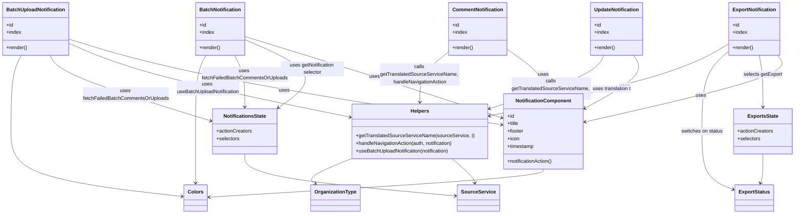

# Diagram: web/portal/src/modules/notifications/components/Notification.organism.js

> Auto-generated by Obscura crawlers

## Mermaid

### SVG

<svg id="container" width="2521.181640625" xmlns="http://www.w3.org/2000/svg" class="classDiagram" height="680" viewBox="0 0 2521.181640625 680" role="graphics-document document" aria-roledescription="class"><g><defs><marker id="container_class-aggregationStart" class="marker aggregation class" refX="18" refY="7" markerWidth="190" markerHeight="240" orient="auto"><path d="M 18,7 L9,13 L1,7 L9,1 Z"></path></marker></defs><defs><marker id="container_class-aggregationEnd" class="marker aggregation class" refX="1" refY="7" markerWidth="20" markerHeight="28" orient="auto"><path d="M 18,7 L9,13 L1,7 L9,1 Z"></path></marker></defs><defs><marker id="container_class-extensionStart" class="marker extension class" refX="18" refY="7" markerWidth="190" markerHeight="240" orient="auto"><path d="M 1,7 L18,13 V 1 Z"></path></marker></defs><defs><marker id="container_class-extensionEnd" class="marker extension class" refX="1" refY="7" markerWidth="20" markerHeight="28" orient="auto"><path d="M 1,1 V 13 L18,7 Z"></path></marker></defs><defs><marker id="container_class-compositionStart" class="marker composition class" refX="18" refY="7" markerWidth="190" markerHeight="240" orient="auto"><path d="M 18,7 L9,13 L1,7 L9,1 Z"></path></marker></defs><defs><marker id="container_class-compositionEnd" class="marker composition class" refX="1" refY="7" markerWidth="20" markerHeight="28" orient="auto"><path d="M 18,7 L9,13 L1,7 L9,1 Z"></path></marker></defs><defs><marker id="container_class-dependencyStart" class="marker dependency class" refX="6" refY="7" markerWidth="190" markerHeight="240" orient="auto"><path d="M 5,7 L9,13 L1,7 L9,1 Z"></path></marker></defs><defs><marker id="container_class-dependencyEnd" class="marker dependency class" refX="13" refY="7" markerWidth="20" markerHeight="28" orient="auto"><path d="M 18,7 L9,13 L14,7 L9,1 Z"></path></marker></defs><defs><marker id="container_class-lollipopStart" class="marker lollipop class" refX="13" refY="7" markerWidth="190" markerHeight="240" orient="auto"><circle stroke="black" fill="transparent" cx="7" cy="7" r="6"></circle></marker></defs><defs><marker id="container_class-lollipopEnd" class="marker lollipop class" refX="1" refY="7" markerWidth="190" markerHeight="240" orient="auto"><circle stroke="black" fill="transparent" cx="7" cy="7" r="6"></circle></marker></defs><g class="root"><g class="clusters"></g><g class="edgePaths"><path d="M2004.003,176L2010.675,186.167C2017.346,196.333,2030.69,216.667,2005.812,244.524C1980.934,272.381,1917.835,307.763,1886.285,325.453L1854.735,343.144" id="id_UpdateNotification_NotificationComponent_1" class="edge-thickness-normal edge-pattern-solid relation" style=";;;" data-edge="true" data-et="edge" data-id="id_UpdateNotification_NotificationComponent_1" data-points="W3sieCI6MjAwNC4wMDI3NzQ3ODQ0ODI3LCJ5IjoxNzZ9LHsieCI6MjA0NC4wMzMyMDMxMjUsInkiOjIzN30seyJ4IjoxODQ5LjUwMTk1MzEyNSwieSI6MzQ2LjA3ODM2Nzc4MTU5NjR9XQ==" marker-end="url(#container_class-dependencyEnd)"></path><path d="M1600.744,153.853L1620.826,167.71C1640.908,181.568,1681.072,209.284,1701.154,232.309C1721.236,255.333,1721.236,273.667,1721.236,282.833L1721.236,292" id="id_CommentNotification_NotificationComponent_2" class="edge-thickness-normal edge-pattern-solid relation" style=";;;" data-edge="true" data-et="edge" data-id="id_CommentNotification_NotificationComponent_2" data-points="W3sieCI6MTYwMC43NDQxNDA2MjUsInkiOjE1My44NTI1MDU5NDg4Mzk5Nn0seyJ4IjoxNzIxLjIzNjMyODEyNSwieSI6MjM3fSx7IngiOjE3MjEuMjM2MzI4MTI1LCJ5IjoyOTh9XQ==" marker-end="url(#container_class-dependencyEnd)"></path><path d="M2465.247,176L2474.321,186.167C2483.396,196.333,2501.545,216.667,2399.896,251.933C2298.247,287.199,2076.8,337.398,1966.077,362.498L1855.353,387.597" id="id_ExportNotification_NotificationComponent_3" class="edge-thickness-normal edge-pattern-solid relation" style=";;;" data-edge="true" data-et="edge" data-id="id_ExportNotification_NotificationComponent_3" data-points="W3sieCI6MjQ2NS4yNDY5MTU0MDk0ODMsInkiOjE3Nn0seyJ4IjoyNTE5LjY5MzM1OTM3NSwieSI6MjM3fSx7IngiOjE4NDkuNTAxOTUzMTI1LCJ5IjozODguOTIzODIyODAyNzY5fV0=" marker-end="url(#container_class-dependencyEnd)"></path><path d="M776.625,115.839L841.937,136.032C907.249,156.226,1037.874,196.613,1172.981,239.662C1308.088,282.71,1447.678,328.421,1517.474,351.276L1587.269,374.131" id="id_BatchNotification_NotificationComponent_4" class="edge-thickness-normal edge-pattern-solid relation" style=";;;" data-edge="true" data-et="edge" data-id="id_BatchNotification_NotificationComponent_4" data-points="W3sieCI6Nzc2LjYyNSwieSI6MTE1LjgzODY2MDY0MTc3NTgyfSx7IngiOjExNjguNDk4MDQ2ODc1LCJ5IjoyMzd9LHsieCI6MTU5Mi45NzA3MDMxMjUsInkiOjM3NS45OTgwNjM2MTc5MjQ5N31d" marker-end="url(#container_class-dependencyEnd)"></path><path d="M211.391,123.261L273.057,142.218C334.723,161.174,458.056,199.087,687.332,244.659C916.607,290.23,1251.826,343.461,1419.436,370.076L1587.045,396.691" id="id_BatchUploadNotification_NotificationComponent_5" class="edge-thickness-normal edge-pattern-solid relation" style=";;;" data-edge="true" data-et="edge" data-id="id_BatchUploadNotification_NotificationComponent_5" data-points="W3sieCI6MjExLjM5MDYyNSwieSI6MTIzLjI2MTQ1NDExOTM0MjI5fSx7IngiOjU4MS4zODg2NzE4NzUsInkiOjIzN30seyJ4IjoxNTkyLjk3MDcwMzEyNSwieSI6Mzk3LjYzMjI5NzM1MzMzMzN9XQ==" marker-end="url(#container_class-dependencyEnd)"></path><path d="M1910.503,176L1905.858,186.167C1901.214,196.333,1891.924,216.667,1831.619,245.06C1771.314,273.453,1659.993,309.906,1604.333,328.133L1548.673,346.359" id="id_UpdateNotification_Helpers_6" class="edge-thickness-normal edge-pattern-solid relation" style=";;;" data-edge="true" data-et="edge" data-id="id_UpdateNotification_Helpers_6" data-points="W3sieCI6MTkxMC41MDI5OTAzMDE3MjQxLCJ5IjoxNzZ9LHsieCI6MTg4Mi42MzQ3NjU2MjUsInkiOjIzN30seyJ4IjoxNTQyLjk3MDcwMzEyNSwieSI6MzQ4LjIyNjU5MjAzODIxODh9XQ==" marker-end="url(#container_class-dependencyEnd)"></path><path d="M1421.479,163.72L1406.215,175.933C1390.951,188.147,1360.424,212.573,1345.16,239.453C1329.896,266.333,1329.896,295.667,1329.896,310.333L1329.896,325" id="id_CommentNotification_Helpers_7" class="edge-thickness-normal edge-pattern-solid relation" style=";;;" data-edge="true" data-et="edge" data-id="id_CommentNotification_Helpers_7" data-points="W3sieCI6MTQyMS40Nzg1MTU2MjUsInkiOjE2My43MjAxNjEyMzgxNzEyMn0seyJ4IjoxMzI5Ljg5NjQ4NDM3NSwieSI6MjM3fSx7IngiOjEzMjkuODk2NDg0Mzc1LCJ5IjozMzF9XQ==" marker-end="url(#container_class-dependencyEnd)"></path><path d="M2408.09,176L2410.246,186.167C2412.403,196.333,2416.716,216.667,2418.873,244C2421.029,271.333,2421.029,305.667,2421.029,322.833L2421.029,340" id="id_ExportNotification_ExportsState_8" class="edge-thickness-normal edge-pattern-solid relation" style=";;;" data-edge="true" data-et="edge" data-id="id_ExportNotification_ExportsState_8" data-points="W3sieCI6MjQwOC4wODk4MDMzNDA1MTc0LCJ5IjoxNzZ9LHsieCI6MjQyMS4wMjkyOTY4NzUsInkiOjIzN30seyJ4IjoyNDIxLjAyOTI5Njg3NSwieSI6MzQ2fV0=" marker-end="url(#container_class-dependencyEnd)"></path><path d="M2311.342,162.108L2297.289,174.59C2283.236,187.072,2255.131,212.036,2241.078,254.685C2227.025,297.333,2227.025,357.667,2227.025,412C2227.025,466.333,2227.025,514.667,2243.386,545.548C2259.747,576.43,2292.468,589.859,2308.829,596.574L2325.19,603.289" id="id_ExportNotification_ExportStatus_9" class="edge-thickness-normal edge-pattern-solid relation" style=";;;" data-edge="true" data-et="edge" data-id="id_ExportNotification_ExportStatus_9" data-points="W3sieCI6MjMxMS4zNDE3OTY4NzUsInkiOjE2Mi4xMDc2Nzg2ODY3OTg1OH0seyJ4IjoyMjI3LjAyNTM5MDYyNSwieSI6MjM3fSx7IngiOjIyMjcuMDI1MzkwNjI1LCJ5Ijo0MTh9LHsieCI6MjIyNy4wMjUzOTA2MjUsInkiOjU2M30seyJ4IjoyMzMwLjc0MDIzNDM3NSwieSI6NjA1LjU2Njk4ODEwNzQ4NzN9XQ==" marker-end="url(#container_class-dependencyEnd)"></path><path d="M2311.342,138.43L2283.414,154.858C2255.486,171.287,2199.631,204.143,2072.545,242.624C1945.459,281.104,1747.144,325.208,1647.986,347.26L1548.828,369.312" id="id_ExportNotification_Helpers_10" class="edge-thickness-normal edge-pattern-solid relation" style=";;;" data-edge="true" data-et="edge" data-id="id_ExportNotification_Helpers_10" data-points="W3sieCI6MjMxMS4zNDE3OTY4NzUsInkiOjEzOC40Mjk5NjM3MTAxMjQ3Mn0seyJ4IjoyMTQzLjc3NTM5MDYyNSwieSI6MjM3fSx7IngiOjE1NDIuOTcwNzAzMTI1LCJ5IjozNzAuNjE0MDM5NjM0NjU4NDd9XQ==" marker-end="url(#container_class-dependencyEnd)"></path><path d="M776.625,125.625L819.188,144.188C861.752,162.75,946.879,199.875,964.345,236.109C981.81,272.343,931.615,307.686,906.517,325.358L881.42,343.029" id="id_BatchNotification_NotificationsState_11" class="edge-thickness-normal edge-pattern-solid relation" style=";;;" data-edge="true" data-et="edge" data-id="id_BatchNotification_NotificationsState_11" data-points="W3sieCI6Nzc2LjYyNSwieSI6MTI1LjYyNTAxNTQyMDIyMzExfSx7IngiOjEwMzIuMDA1ODU5Mzc1LCJ5IjoyMzd9LHsieCI6ODc2LjUxMzY3MTg3NSwieSI6MzQ2LjQ4MzQzNjY2NDIzNTM0fV0=" marker-end="url(#container_class-dependencyEnd)"></path><path d="M743.215,176L748.503,186.167C753.791,196.333,764.367,216.667,769.655,244C774.943,271.333,774.943,305.667,774.943,322.833L774.943,340" id="id_BatchNotification_NotificationsState_12" class="edge-thickness-normal edge-pattern-solid relation" style=";;;" data-edge="true" data-et="edge" data-id="id_BatchNotification_NotificationsState_12" data-points="W3sieCI6NzQzLjIxNDk3ODQ0ODI3NTgsInkiOjE3Nn0seyJ4Ijo3NzQuOTQzMzU5Mzc1LCJ5IjoyMzd9LHsieCI6Nzc0Ljk0MzM1OTM3NSwieSI6MzQ2fV0=" marker-end="url(#container_class-dependencyEnd)"></path><path d="M211.391,136.23L250.006,153.025C288.622,169.82,365.853,203.41,515.778,242.924C665.704,282.437,888.324,327.874,999.634,350.593L1110.943,373.311" id="id_BatchUploadNotification_Helpers_13" class="edge-thickness-normal edge-pattern-solid relation" style=";;;" data-edge="true" data-et="edge" data-id="id_BatchUploadNotification_Helpers_13" data-points="W3sieCI6MjExLjM5MDYyNSwieSI6MTM2LjIzMDExODA0NjgwODYzfSx7IngiOjQ0My4wODM5ODQzNzUsInkiOjIzN30seyJ4IjoxMTE2LjgyMjI2NTYyNSwieSI6Mzc0LjUxMTE3NTAyOTk1Mjc3fV0=" marker-end="url(#container_class-dependencyEnd)"></path><path d="M152.862,176L158.086,186.167C163.311,196.333,173.76,216.667,259.556,251.52C345.351,286.374,506.494,335.748,587.065,360.434L667.636,385.121" id="id_BatchUploadNotification_NotificationsState_14" class="edge-thickness-normal edge-pattern-solid relation" style=";;;" data-edge="true" data-et="edge" data-id="id_BatchUploadNotification_NotificationsState_14" data-points="W3sieCI6MTUyLjg2MTg1MzQ0ODI3NTg3LCJ5IjoxNzZ9LHsieCI6MTg0LjIwODk4NDM3NSwieSI6MjM3fSx7IngiOjY3My4zNzMwNDY4NzUsInkiOjM4Ni44NzkwMzAzMzgyOTcxfV0=" marker-end="url(#container_class-dependencyEnd)"></path><path d="M2421.029,490L2421.029,502.167C2421.029,514.333,2421.029,538.667,2419.534,554.091C2418.038,569.516,2415.047,576.031,2413.551,579.289L2412.056,582.547" id="id_ExportsState_ExportStatus_15" class="edge-thickness-normal edge-pattern-solid relation" style=";;;" data-edge="true" data-et="edge" data-id="id_ExportsState_ExportStatus_15" data-points="W3sieCI6MjQyMS4wMjkyOTY4NzUsInkiOjQ5MH0seyJ4IjoyNDIxLjAyOTI5Njg3NSwieSI6NTYzfSx7IngiOjI0MDkuNTUyNTAxMTY2MDQ0NywieSI6NTg4fV0=" marker-end="url(#container_class-dependencyEnd)"></path><path d="M774.943,490L774.943,502.167C774.943,514.333,774.943,538.667,886.796,560.952C998.649,583.237,1222.354,603.475,1334.207,613.593L1446.06,623.712" id="id_NotificationsState_SourceService_16" class="edge-thickness-normal edge-pattern-solid relation" style=";;;" data-edge="true" data-et="edge" data-id="id_NotificationsState_SourceService_16" data-points="W3sieCI6Nzc0Ljk0MzM1OTM3NSwieSI6NDkwfSx7IngiOjc3NC45NDMzNTkzNzUsInkiOjU2M30seyJ4IjoxNDUyLjAzNTE1NjI1LCJ5Ijo2MjQuMjUyNjg1MjY1NTIwMn1d" marker-end="url(#container_class-dependencyEnd)"></path><path d="M1437.016,505L1448.919,514.667C1460.821,524.333,1484.625,543.667,1496.865,556.506C1509.106,569.345,1509.781,575.689,1510.119,578.861L1510.457,582.034" id="id_Helpers_SourceService_17" class="edge-thickness-normal edge-pattern-solid relation" style=";;;" data-edge="true" data-et="edge" data-id="id_Helpers_SourceService_17" data-points="W3sieCI6MTQzNy4wMTY0MDYyNSwieSI6NTA1fSx7IngiOjE1MDguNDI5Njg3NSwieSI6NTYzfSx7IngiOjE1MTEuMDkyNjQyMjU3NDYyOCwieSI6NTg4fV0=" marker-end="url(#container_class-dependencyEnd)"></path><path d="M1116.822,503.199L1091.896,513.166C1066.97,523.133,1017.118,543.066,997.292,556.624C977.465,570.182,987.665,577.364,992.765,580.955L997.865,584.546" id="id_Helpers_OrganizationType_18" class="edge-thickness-normal edge-pattern-solid relation" style=";;;" data-edge="true" data-et="edge" data-id="id_Helpers_OrganizationType_18" data-points="W3sieCI6MTExNi44MjIyNjU2MjUsInkiOjUwMy4xOTg5MzE0MjAyMzA4NX0seyJ4Ijo5NjcuMjY1NjI1LCJ5Ijo1NjN9LHsieCI6MTAwMi43NzA5NTk2NTQ4NTA4LCJ5Ijo1ODh9XQ==" marker-end="url(#container_class-dependencyEnd)"></path><path d="M1721.236,538L1721.236,542.167C1721.236,546.333,1721.236,554.667,1544.192,569.584C1367.148,584.502,1013.06,606.003,836.016,616.754L658.971,627.505" id="id_NotificationComponent_Colors_19" class="edge-thickness-normal edge-pattern-solid relation" style=";;;" data-edge="true" data-et="edge" data-id="id_NotificationComponent_Colors_19" data-points="W3sieCI6MTcyMS4yMzYzMjgxMjUsInkiOjUzOH0seyJ4IjoxNzIxLjIzNjMyODEyNSwieSI6NTYzfSx7IngiOjY1Mi45ODI0MjE4NzUsInkiOjYyNy44Njg0OTc3Mjg4NzM5fV0=" marker-end="url(#container_class-dependencyEnd)"></path><path d="M652.227,176L646.503,186.167C640.778,196.333,629.33,216.667,623.605,257C617.881,297.333,617.881,357.667,617.881,412C617.881,466.333,617.881,514.667,617.881,542C617.881,569.333,617.881,575.667,617.881,578.833L617.881,582" id="id_BatchNotification_Colors_20" class="edge-thickness-normal edge-pattern-solid relation" style=";;;" data-edge="true" data-et="edge" data-id="id_BatchNotification_Colors_20" data-points="W3sieCI6NjUyLjIyNzA0NzQxMzc5MzEsInkiOjE3Nn0seyJ4Ijo2MTcuODgwODU5Mzc1LCJ5IjoyMzd9LHsieCI6NjE3Ljg4MDg1OTM3NSwieSI6NDE4fSx7IngiOjYxNy44ODA4NTkzNzUsInkiOjU2M30seyJ4Ijo2MTcuODgwODU5Mzc1LCJ5Ijo1ODh9XQ==" marker-end="url(#container_class-dependencyEnd)"></path><path d="M61.874,176L56.086,186.167C50.298,196.333,38.722,216.667,32.934,257C27.146,297.333,27.146,357.667,27.146,412C27.146,466.333,27.146,514.667,118.758,549.224C210.37,583.781,393.594,604.562,485.206,614.952L576.818,625.343" id="id_BatchUploadNotification_Colors_21" class="edge-thickness-normal edge-pattern-solid relation" style=";;;" data-edge="true" data-et="edge" data-id="id_BatchUploadNotification_Colors_21" data-points="W3sieCI6NjEuODczOTIyNDEzNzkzMSwieSI6MTc2fSx7IngiOjI3LjE0NjQ4NDM3NSwieSI6MjM3fSx7IngiOjI3LjE0NjQ4NDM3NSwieSI6NDE4fSx7IngiOjI3LjE0NjQ4NDM3NSwieSI6NTYzfSx7IngiOjU4Mi43NzkyOTY4NzUsInkiOjYyNi4wMTg4NDU3MTY0MDE4fV0=" marker-end="url(#container_class-dependencyEnd)"></path></g><g class="edgeLabels"><g class="edgeLabel" transform="translate(1978.58759, 273.69694)"><g class="label" data-id="id_UpdateNotification_NotificationComponent_1" transform="translate(-16.4921875, -12)"><foreignObject width="32.984375" height="24">

uses

</foreignObject></g></g><g class="edgeLabel" transform="translate(1721.236328125, 237)"><g class="label" data-id="id_CommentNotification_NotificationComponent_2" transform="translate(-16.4921875, -12)"><foreignObject width="32.984375" height="24">

uses

</foreignObject></g></g><g class="edgeLabel" transform="translate(2224.46827, 303.92375)"><g class="label" data-id="id_ExportNotification_NotificationComponent_3" transform="translate(-16.4921875, -12)"><foreignObject width="32.984375" height="24">

uses

</foreignObject></g></g><g class="edgeLabel" transform="translate(1185.83004, 242.67554)"><g class="label" data-id="id_BatchNotification_NotificationComponent_4" transform="translate(-16.4921875, -12)"><foreignObject width="32.984375" height="24">

uses

</foreignObject></g></g><g class="edgeLabel" transform="translate(896.03197, 286.9632)"><g class="label" data-id="id_BatchUploadNotification_NotificationComponent_5" transform="translate(-16.4921875, -12)"><foreignObject width="32.984375" height="24">

uses

</foreignObject></g></g><g class="edgeLabel" transform="translate(1744.66989, 282.17806)"><g class="label" data-id="id_UpdateNotification_Helpers_6" transform="translate(-124.90625, -36)"><foreignObject width="249.8125" height="72">

calls getTranslatedSourceServiceName, handleNavigationAction

</foreignObject></g></g><g class="edgeLabel" transform="translate(1329.896484375, 237)"><g class="label" data-id="id_CommentNotification_Helpers_7" transform="translate(-124.90625, -36)"><foreignObject width="249.8125" height="72">

calls getTranslatedSourceServiceName, handleNavigationAction

</foreignObject></g></g><g class="edgeLabel" transform="translate(2421.029296875, 237)"><g class="label" data-id="id_ExportNotification_ExportsState_8" transform="translate(-62.171875, -12)"><foreignObject width="124.34375" height="24">

selects getExport

</foreignObject></g></g><g class="edgeLabel" transform="translate(2227.025390625, 418)"><g class="label" data-id="id_ExportNotification_ExportStatus_9" transform="translate(-66.8515625, -12)"><foreignObject width="133.703125" height="24">

switches on status

</foreignObject></g></g><g class="edgeLabel" transform="translate(1938.25903, 282.70516)"><g class="label" data-id="id_ExportNotification_Helpers_10" transform="translate(-63.25, -12)"><foreignObject width="126.5" height="24">

uses translation t

</foreignObject></g></g><g class="edgeLabel" transform="translate(991.47235, 219.3228)"><g class="label" data-id="id_BatchNotification_NotificationsState_11" transform="translate(-100, -24)"><foreignObject width="200" height="48">

uses getNotification selector

</foreignObject></g></g><g class="edgeLabel" transform="translate(774.943359375, 237)"><g class="label" data-id="id_BatchNotification_NotificationsState_12" transform="translate(-137.0625, -24)"><foreignObject width="274.125" height="48">

uses fetchFailedBatchCommentsOrUploads

</foreignObject></g></g><g class="edgeLabel" transform="translate(656.17564, 280.49238)"><g class="label" data-id="id_BatchUploadNotification_Helpers_13" transform="translate(-101.8125, -24)"><foreignObject width="203.625" height="48">

uses useBatchUploadNotification

</foreignObject></g></g><g class="edgeLabel" transform="translate(396.00397, 301.89362)"><g class="label" data-id="id_BatchUploadNotification_NotificationsState_14" transform="translate(-137.0625, -24)"><foreignObject width="274.125" height="48">

uses fetchFailedBatchCommentsOrUploads

</foreignObject></g></g><g class="edgeLabel"><g class="label" data-id="id_ExportsState_ExportStatus_15" transform="translate(0, 0)"><foreignObject width="0" height="0">

</foreignObject></g></g><g class="edgeLabel"><g class="label" data-id="id_NotificationsState_SourceService_16" transform="translate(0, 0)"><foreignObject width="0" height="0">

</foreignObject></g></g><g class="edgeLabel"><g class="label" data-id="id_Helpers_SourceService_17" transform="translate(0, 0)"><foreignObject width="0" height="0">

</foreignObject></g></g><g class="edgeLabel"><g class="label" data-id="id_Helpers_OrganizationType_18" transform="translate(0, 0)"><foreignObject width="0" height="0">

</foreignObject></g></g><g class="edgeLabel"><g class="label" data-id="id_NotificationComponent_Colors_19" transform="translate(0, 0)"><foreignObject width="0" height="0">

</foreignObject></g></g><g class="edgeLabel"><g class="label" data-id="id_BatchNotification_Colors_20" transform="translate(0, 0)"><foreignObject width="0" height="0">

</foreignObject></g></g><g class="edgeLabel"><g class="label" data-id="id_BatchUploadNotification_Colors_21" transform="translate(0, 0)"><foreignObject width="0" height="0">

</foreignObject></g></g></g><g class="nodes"><g class="node default" id="classId-UpdateNotification-0" transform="translate(1948.87890625, 92)"><g class="basic label-container"><path d="M-81.4140625 -84 L81.4140625 -84 L81.4140625 84 L-81.4140625 84" stroke="none" stroke-width="0" fill="#ECECFF" style=""></path><path d="M-81.4140625 -84 C-30.34070077562191 -84, 20.732660948756177 -84, 81.4140625 -84 M-81.4140625 -84 C-17.989420808201523 -84, 45.435220883596955 -84, 81.4140625 -84 M81.4140625 -84 C81.4140625 -19.745715897224798, 81.4140625 44.508568205550404, 81.4140625 84 M81.4140625 -84 C81.4140625 -44.87680882443073, 81.4140625 -5.753617648861464, 81.4140625 84 M81.4140625 84 C48.182975057417316 84, 14.951887614834632 84, -81.4140625 84 M81.4140625 84 C41.38772170079642 84, 1.3613809015928382 84, -81.4140625 84 M-81.4140625 84 C-81.4140625 39.605197081326516, -81.4140625 -4.7896058373469685, -81.4140625 -84 M-81.4140625 84 C-81.4140625 38.108592707375074, -81.4140625 -7.782814585249852, -81.4140625 -84" stroke="#9370DB" stroke-width="1.3" fill="none" stroke-dasharray="0 0" style=""></path></g><g class="annotation-group text" transform="translate(0, -60)"></g><g class="label-group text" transform="translate(-69.4140625, -60)"><g class="label" style="font-weight: bolder" transform="translate(0,-12)"><foreignObject width="138.828125" height="24">

UpdateNotification

</foreignObject></g></g><g class="members-group text" transform="translate(-69.4140625, -12)"><g class="label" style="" transform="translate(0,-12)"><foreignObject width="22.078125" height="24">

+id

</foreignObject></g><g class="label" style="" transform="translate(0,12)"><foreignObject width="47.78125" height="24">

+index

</foreignObject></g></g><g class="methods-group text" transform="translate(-69.4140625, 60)"><g class="label" style="" transform="translate(0,-12)"><foreignObject width="66.609375" height="24">

+render()

</foreignObject></g></g><g class="divider" style=""><path d="M-81.4140625 -36 C-19.993537236786658 -36, 41.426988026426685 -36, 81.4140625 -36 M-81.4140625 -36 C-33.71138013129717 -36, 13.991302237405662 -36, 81.4140625 -36" stroke="#9370DB" stroke-width="1.3" fill="none" stroke-dasharray="0 0" style=""></path></g><g class="divider" style=""><path d="M-81.4140625 36 C-43.09613802553261 36, -4.778213551065221 36, 81.4140625 36 M-81.4140625 36 C-47.742916139698096 36, -14.071769779396192 36, 81.4140625 36" stroke="#9370DB" stroke-width="1.3" fill="none" stroke-dasharray="0 0" style=""></path></g></g><g class="node default" id="classId-CommentNotification-1" transform="translate(1511.111328125, 92)"><g class="basic label-container"><path d="M-89.6328125 -84 L89.6328125 -84 L89.6328125 84 L-89.6328125 84" stroke="none" stroke-width="0" fill="#ECECFF" style=""></path><path d="M-89.6328125 -84 C-35.13433549809113 -84, 19.364141503817734 -84, 89.6328125 -84 M-89.6328125 -84 C-48.42834383317006 -84, -7.223875166340122 -84, 89.6328125 -84 M89.6328125 -84 C89.6328125 -37.30867598220523, 89.6328125 9.38264803558954, 89.6328125 84 M89.6328125 -84 C89.6328125 -29.67417177283938, 89.6328125 24.65165645432124, 89.6328125 84 M89.6328125 84 C53.02731270443983 84, 16.42181290887966 84, -89.6328125 84 M89.6328125 84 C25.66999152244017 84, -38.29282945511966 84, -89.6328125 84 M-89.6328125 84 C-89.6328125 28.125715925885928, -89.6328125 -27.748568148228145, -89.6328125 -84 M-89.6328125 84 C-89.6328125 39.22028614568667, -89.6328125 -5.559427708626657, -89.6328125 -84" stroke="#9370DB" stroke-width="1.3" fill="none" stroke-dasharray="0 0" style=""></path></g><g class="annotation-group text" transform="translate(0, -60)"></g><g class="label-group text" transform="translate(-77.6328125, -60)"><g class="label" style="font-weight: bolder" transform="translate(0,-12)"><foreignObject width="155.265625" height="24">

CommentNotification

</foreignObject></g></g><g class="members-group text" transform="translate(-77.6328125, -12)"><g class="label" style="" transform="translate(0,-12)"><foreignObject width="22.078125" height="24">

+id

</foreignObject></g><g class="label" style="" transform="translate(0,12)"><foreignObject width="47.78125" height="24">

+index

</foreignObject></g></g><g class="methods-group text" transform="translate(-77.6328125, 60)"><g class="label" style="" transform="translate(0,-12)"><foreignObject width="66.609375" height="24">

+render()

</foreignObject></g></g><g class="divider" style=""><path d="M-89.6328125 -36 C-35.30154021416678 -36, 19.029732071666444 -36, 89.6328125 -36 M-89.6328125 -36 C-28.377833877468362 -36, 32.877144745063276 -36, 89.6328125 -36" stroke="#9370DB" stroke-width="1.3" fill="none" stroke-dasharray="0 0" style=""></path></g><g class="divider" style=""><path d="M-89.6328125 36 C-29.023023718059456 36, 31.58676506388109 36, 89.6328125 36 M-89.6328125 36 C-50.88828889301177 36, -12.143765286023537 36, 89.6328125 36" stroke="#9370DB" stroke-width="1.3" fill="none" stroke-dasharray="0 0" style=""></path></g></g><g class="node default" id="classId-ExportNotification-2" transform="translate(2390.271484375, 92)"><g class="basic label-container"><path d="M-78.9296875 -84 L78.9296875 -84 L78.9296875 84 L-78.9296875 84" stroke="none" stroke-width="0" fill="#ECECFF" style=""></path><path d="M-78.9296875 -84 C-45.748099262512405 -84, -12.566511025024809 -84, 78.9296875 -84 M-78.9296875 -84 C-27.117335568536227 -84, 24.695016362927547 -84, 78.9296875 -84 M78.9296875 -84 C78.9296875 -30.627277522851273, 78.9296875 22.745444954297454, 78.9296875 84 M78.9296875 -84 C78.9296875 -28.28895684611119, 78.9296875 27.42208630777762, 78.9296875 84 M78.9296875 84 C37.94001495539539 84, -3.049657589209218 84, -78.9296875 84 M78.9296875 84 C40.678965525217755 84, 2.4282435504355107 84, -78.9296875 84 M-78.9296875 84 C-78.9296875 46.731775468781166, -78.9296875 9.463550937562331, -78.9296875 -84 M-78.9296875 84 C-78.9296875 26.8346441314608, -78.9296875 -30.330711737078403, -78.9296875 -84" stroke="#9370DB" stroke-width="1.3" fill="none" stroke-dasharray="0 0" style=""></path></g><g class="annotation-group text" transform="translate(0, -60)"></g><g class="label-group text" transform="translate(-66.9296875, -60)"><g class="label" style="font-weight: bolder" transform="translate(0,-12)"><foreignObject width="133.859375" height="24">

ExportNotification

</foreignObject></g></g><g class="members-group text" transform="translate(-66.9296875, -12)"><g class="label" style="" transform="translate(0,-12)"><foreignObject width="22.078125" height="24">

+id

</foreignObject></g><g class="label" style="" transform="translate(0,12)"><foreignObject width="47.78125" height="24">

+index

</foreignObject></g></g><g class="methods-group text" transform="translate(-66.9296875, 60)"><g class="label" style="" transform="translate(0,-12)"><foreignObject width="66.609375" height="24">

+render()

</foreignObject></g></g><g class="divider" style=""><path d="M-78.9296875 -36 C-33.67973925668488 -36, 11.570208986630234 -36, 78.9296875 -36 M-78.9296875 -36 C-47.08137947042378 -36, -15.233071440847553 -36, 78.9296875 -36" stroke="#9370DB" stroke-width="1.3" fill="none" stroke-dasharray="0 0" style=""></path></g><g class="divider" style=""><path d="M-78.9296875 36 C-42.51934098693761 36, -6.108994473875214 36, 78.9296875 36 M-78.9296875 36 C-25.128791510133688 36, 28.672104479732624 36, 78.9296875 36" stroke="#9370DB" stroke-width="1.3" fill="none" stroke-dasharray="0 0" style=""></path></g></g><g class="node default" id="classId-BatchNotification-3" transform="translate(699.5234375, 92)"><g class="basic label-container"><path d="M-77.1015625 -84 L77.1015625 -84 L77.1015625 84 L-77.1015625 84" stroke="none" stroke-width="0" fill="#ECECFF" style=""></path><path d="M-77.1015625 -84 C-39.05065022362272 -84, -0.9997379472454355 -84, 77.1015625 -84 M-77.1015625 -84 C-37.80957056568942 -84, 1.4824213686211607 -84, 77.1015625 -84 M77.1015625 -84 C77.1015625 -28.388207508397315, 77.1015625 27.22358498320537, 77.1015625 84 M77.1015625 -84 C77.1015625 -29.904837266213924, 77.1015625 24.19032546757215, 77.1015625 84 M77.1015625 84 C24.858145207748855 84, -27.38527208450229 84, -77.1015625 84 M77.1015625 84 C32.09233588237512 84, -12.916890735249765 84, -77.1015625 84 M-77.1015625 84 C-77.1015625 39.81700599090155, -77.1015625 -4.3659880181969015, -77.1015625 -84 M-77.1015625 84 C-77.1015625 24.020256123881943, -77.1015625 -35.959487752236114, -77.1015625 -84" stroke="#9370DB" stroke-width="1.3" fill="none" stroke-dasharray="0 0" style=""></path></g><g class="annotation-group text" transform="translate(0, -60)"></g><g class="label-group text" transform="translate(-63.59375, -60)"><g class="label" style="font-weight: bolder" transform="translate(0,-12)"><foreignObject width="127.1875" height="24">

BatchNotification

</foreignObject></g></g><g class="members-group text" transform="translate(-65.1015625, -12)"><g class="label" style="" transform="translate(0,-12)"><foreignObject width="22.078125" height="24">

+id

</foreignObject></g><g class="label" style="" transform="translate(0,12)"><foreignObject width="47.78125" height="24">

+index

</foreignObject></g></g><g class="methods-group text" transform="translate(-65.1015625, 60)"><g class="label" style="" transform="translate(0,-12)"><foreignObject width="66.609375" height="24">

+render()

</foreignObject></g></g><g class="divider" style=""><path d="M-77.1015625 -36 C-39.0336598538494 -36, -0.9657572076988004 -36, 77.1015625 -36 M-77.1015625 -36 C-39.790729028456795 -36, -2.47989555691359 -36, 77.1015625 -36" stroke="#9370DB" stroke-width="1.3" fill="none" stroke-dasharray="0 0" style=""></path></g><g class="divider" style=""><path d="M-77.1015625 36 C-28.90242956152032 36, 19.296703376959357 36, 77.1015625 36 M-77.1015625 36 C-41.916389022517656 36, -6.731215545035312 36, 77.1015625 36" stroke="#9370DB" stroke-width="1.3" fill="none" stroke-dasharray="0 0" style=""></path></g></g><g class="node default" id="classId-BatchUploadNotification-4" transform="translate(109.6953125, 92)"><g class="basic label-container"><path d="M-101.6953125 -84 L101.6953125 -84 L101.6953125 84 L-101.6953125 84" stroke="none" stroke-width="0" fill="#ECECFF" style=""></path><path d="M-101.6953125 -84 C-39.60893904218598 -84, 22.47743441562804 -84, 101.6953125 -84 M-101.6953125 -84 C-54.13761281763923 -84, -6.57991313527846 -84, 101.6953125 -84 M101.6953125 -84 C101.6953125 -28.304486921963445, 101.6953125 27.39102615607311, 101.6953125 84 M101.6953125 -84 C101.6953125 -48.74569546959487, 101.6953125 -13.491390939189742, 101.6953125 84 M101.6953125 84 C23.492595987675656 84, -54.71012052464869 84, -101.6953125 84 M101.6953125 84 C21.53375986335132 84, -58.62779277329736 84, -101.6953125 84 M-101.6953125 84 C-101.6953125 17.90224242375116, -101.6953125 -48.19551515249768, -101.6953125 -84 M-101.6953125 84 C-101.6953125 46.2595683579145, -101.6953125 8.519136715829006, -101.6953125 -84" stroke="#9370DB" stroke-width="1.3" fill="none" stroke-dasharray="0 0" style=""></path></g><g class="annotation-group text" transform="translate(0, -60)"></g><g class="label-group text" transform="translate(-89.6953125, -60)"><g class="label" style="font-weight: bolder" transform="translate(0,-12)"><foreignObject width="179.390625" height="24">

BatchUploadNotification

</foreignObject></g></g><g class="members-group text" transform="translate(-89.6953125, -12)"><g class="label" style="" transform="translate(0,-12)"><foreignObject width="22.078125" height="24">

+id

</foreignObject></g><g class="label" style="" transform="translate(0,12)"><foreignObject width="47.78125" height="24">

+index

</foreignObject></g></g><g class="methods-group text" transform="translate(-89.6953125, 60)"><g class="label" style="" transform="translate(0,-12)"><foreignObject width="66.609375" height="24">

+render()

</foreignObject></g></g><g class="divider" style=""><path d="M-101.6953125 -36 C-22.408644315720508 -36, 56.878023868558984 -36, 101.6953125 -36 M-101.6953125 -36 C-49.75057894955295 -36, 2.1941546008940946 -36, 101.6953125 -36" stroke="#9370DB" stroke-width="1.3" fill="none" stroke-dasharray="0 0" style=""></path></g><g class="divider" style=""><path d="M-101.6953125 36 C-32.62358087421116 36, 36.448150751577685 36, 101.6953125 36 M-101.6953125 36 C-50.572752150239616 36, 0.5498081995207684 36, 101.6953125 36" stroke="#9370DB" stroke-width="1.3" fill="none" stroke-dasharray="0 0" style=""></path></g></g><g class="node default" id="classId-NotificationComponent-5" transform="translate(1721.236328125, 418)"><g class="basic label-container"><path d="M-128.265625 -120 L128.265625 -120 L128.265625 120 L-128.265625 120" stroke="none" stroke-width="0" fill="#ECECFF" style=""></path><path d="M-128.265625 -120 C-41.807166446223164 -120, 44.65129210755367 -120, 128.265625 -120 M-128.265625 -120 C-40.71733407307387 -120, 46.83095685385226 -120, 128.265625 -120 M128.265625 -120 C128.265625 -34.163713719695025, 128.265625 51.67257256060995, 128.265625 120 M128.265625 -120 C128.265625 -37.32869822519747, 128.265625 45.34260354960506, 128.265625 120 M128.265625 120 C61.102307158749454 120, -6.061010682501092 120, -128.265625 120 M128.265625 120 C59.15108234602933 120, -9.963460307941347 120, -128.265625 120 M-128.265625 120 C-128.265625 59.683893896047465, -128.265625 -0.63221220790507, -128.265625 -120 M-128.265625 120 C-128.265625 26.417048240429835, -128.265625 -67.16590351914033, -128.265625 -120" stroke="#9370DB" stroke-width="1.3" fill="none" stroke-dasharray="0 0" style=""></path></g><g class="annotation-group text" transform="translate(0, -96)"></g><g class="label-group text" transform="translate(-84.9375, -96)"><g class="label" style="font-weight: bolder" transform="translate(0,-12)"><foreignObject width="169.875" height="24">

NotificationComponent

</foreignObject></g></g><g class="members-group text" transform="translate(-116.265625, -48)"><g class="label" style="" transform="translate(0,-12)"><foreignObject width="22.078125" height="24">

+id

</foreignObject></g><g class="label" style="" transform="translate(0,12)"><foreignObject width="37.140625" height="24">

+title

</foreignObject></g><g class="label" style="" transform="translate(0,36)"><foreignObject width="52.078125" height="24">

+footer

</foreignObject></g><g class="label" style="" transform="translate(0,60)"><foreignObject width="38.546875" height="24">

+icon

</foreignObject></g><g class="label" style="" transform="translate(0,84)"><foreignObject width="85.6875" height="24">

+timestamp

</foreignObject></g></g><g class="methods-group text" transform="translate(-116.265625, 96)"><g class="label" style="" transform="translate(0,-12)"><foreignObject width="147.59375" height="24">

+notificationAction()

</foreignObject></g></g><g class="divider" style=""><path d="M-128.265625 -72 C-67.84910690532824 -72, -7.432588810656483 -72, 128.265625 -72 M-128.265625 -72 C-54.79468908825048 -72, 18.676246823499042 -72, 128.265625 -72" stroke="#9370DB" stroke-width="1.3" fill="none" stroke-dasharray="0 0" style=""></path></g><g class="divider" style=""><path d="M-128.265625 72 C-62.809829921443395 72, 2.64596515711321 72, 128.265625 72 M-128.265625 72 C-26.734786761410874 72, 74.79605147717825 72, 128.265625 72" stroke="#9370DB" stroke-width="1.3" fill="none" stroke-dasharray="0 0" style=""></path></g></g><g class="node default" id="classId-Helpers-6" transform="translate(1329.896484375, 418)"><g class="basic label-container"><path d="M-213.07421875 -87 L213.07421875 -87 L213.07421875 87 L-213.07421875 87" stroke="none" stroke-width="0" fill="#ECECFF" style=""></path><path d="M-213.07421875 -87 C-83.2993664300997 -87, 46.47548588980061 -87, 213.07421875 -87 M-213.07421875 -87 C-114.91626658065955 -87, -16.758314411319105 -87, 213.07421875 -87 M213.07421875 -87 C213.07421875 -40.01828852672198, 213.07421875 6.963422946556037, 213.07421875 87 M213.07421875 -87 C213.07421875 -45.89052809232636, 213.07421875 -4.781056184652726, 213.07421875 87 M213.07421875 87 C53.21724863808376 87, -106.63972147383248 87, -213.07421875 87 M213.07421875 87 C75.0212191241364 87, -63.03178050172721 87, -213.07421875 87 M-213.07421875 87 C-213.07421875 19.12198582121127, -213.07421875 -48.75602835757746, -213.07421875 -87 M-213.07421875 87 C-213.07421875 39.998242234470034, -213.07421875 -7.003515531059932, -213.07421875 -87" stroke="#9370DB" stroke-width="1.3" fill="none" stroke-dasharray="0 0" style=""></path></g><g class="annotation-group text" transform="translate(0, -63)"></g><g class="label-group text" transform="translate(-28.2890625, -63)"><g class="label" style="font-weight: bolder" transform="translate(0,-12)"><foreignObject width="56.578125" height="24">

Helpers

</foreignObject></g></g><g class="members-group text" transform="translate(-201.07421875, -15)"></g><g class="methods-group text" transform="translate(-201.07421875, 15)"><g class="label" style="" transform="translate(0,-12)"><foreignObject width="373.859375" height="24">

+getTranslatedSourceServiceName(sourceService, t)

</foreignObject></g><g class="label" style="" transform="translate(0,12)"><foreignObject width="316.703125" height="24">

+handleNavigationAction(auth, notification)

</foreignObject></g><g class="label" style="" transform="translate(0,36)"><foreignObject width="305.390625" height="24">

+useBatchUploadNotification(notification)

</foreignObject></g></g><g class="divider" style=""><path d="M-213.07421875 -39 C-87.22783970292959 -39, 38.61853934414083 -39, 213.07421875 -39 M-213.07421875 -39 C-70.3652381912162 -39, 72.34374236756759 -39, 213.07421875 -39" stroke="#9370DB" stroke-width="1.3" fill="none" stroke-dasharray="0 0" style=""></path></g><g class="divider" style=""><path d="M-213.07421875 -15 C-90.39771526068212 -15, 32.27878822863576 -15, 213.07421875 -15 M-213.07421875 -15 C-79.0586891690937 -15, 54.95684041181261 -15, 213.07421875 -15" stroke="#9370DB" stroke-width="1.3" fill="none" stroke-dasharray="0 0" style=""></path></g></g><g class="node default" id="classId-ExportsState-7" transform="translate(2421.029296875, 418)"><g class="basic label-container"><path d="M-92.15234375 -72 L92.15234375 -72 L92.15234375 72 L-92.15234375 72" stroke="none" stroke-width="0" fill="#ECECFF" style=""></path><path d="M-92.15234375 -72 C-37.28414067446204 -72, 17.584062401075926 -72, 92.15234375 -72 M-92.15234375 -72 C-19.782156110020523 -72, 52.588031529958954 -72, 92.15234375 -72 M92.15234375 -72 C92.15234375 -32.27901175464136, 92.15234375 7.4419764907172805, 92.15234375 72 M92.15234375 -72 C92.15234375 -19.416132276567687, 92.15234375 33.167735446864626, 92.15234375 72 M92.15234375 72 C25.668271897635805 72, -40.81579995472839 72, -92.15234375 72 M92.15234375 72 C24.90694770595222 72, -42.33844833809556 72, -92.15234375 72 M-92.15234375 72 C-92.15234375 36.74220460054693, -92.15234375 1.4844092010938539, -92.15234375 -72 M-92.15234375 72 C-92.15234375 36.85049474387917, -92.15234375 1.700989487758335, -92.15234375 -72" stroke="#9370DB" stroke-width="1.3" fill="none" stroke-dasharray="0 0" style=""></path></g><g class="annotation-group text" transform="translate(0, -48)"></g><g class="label-group text" transform="translate(-47.2265625, -48)"><g class="label" style="font-weight: bolder" transform="translate(0,-12)"><foreignObject width="94.453125" height="24">

ExportsState

</foreignObject></g></g><g class="members-group text" transform="translate(-80.15234375, 0)"><g class="label" style="" transform="translate(0,-12)"><foreignObject width="113.078125" height="24">

+actionCreators

</foreignObject></g><g class="label" style="" transform="translate(0,12)"><foreignObject width="73.453125" height="24">

+selectors

</foreignObject></g></g><g class="methods-group text" transform="translate(-80.15234375, 72)"></g><g class="divider" style=""><path d="M-92.15234375 -24 C-49.51644737599573 -24, -6.8805510019914635 -24, 92.15234375 -24 M-92.15234375 -24 C-35.85929557313622 -24, 20.433752603727555 -24, 92.15234375 -24" stroke="#9370DB" stroke-width="1.3" fill="none" stroke-dasharray="0 0" style=""></path></g><g class="divider" style=""><path d="M-92.15234375 48 C-24.025563526776494 48, 44.10121669644701 48, 92.15234375 48 M-92.15234375 48 C-22.646149450435857 48, 46.860044849128286 48, 92.15234375 48" stroke="#9370DB" stroke-width="1.3" fill="none" stroke-dasharray="0 0" style=""></path></g></g><g class="node default" id="classId-NotificationsState-8" transform="translate(774.943359375, 418)"><g class="basic label-container"><path d="M-101.5703125 -72 L101.5703125 -72 L101.5703125 72 L-101.5703125 72" stroke="none" stroke-width="0" fill="#ECECFF" style=""></path><path d="M-101.5703125 -72 C-58.75939866860214 -72, -15.948484837204276 -72, 101.5703125 -72 M-101.5703125 -72 C-53.1192254257753 -72, -4.668138351550596 -72, 101.5703125 -72 M101.5703125 -72 C101.5703125 -34.85614142992115, 101.5703125 2.287717140157696, 101.5703125 72 M101.5703125 -72 C101.5703125 -43.10294779342691, 101.5703125 -14.205895586853806, 101.5703125 72 M101.5703125 72 C59.00713637555554 72, 16.44396025111108 72, -101.5703125 72 M101.5703125 72 C47.33040359803425 72, -6.909505303931496 72, -101.5703125 72 M-101.5703125 72 C-101.5703125 19.11595856750749, -101.5703125 -33.76808286498502, -101.5703125 -72 M-101.5703125 72 C-101.5703125 30.42921572476859, -101.5703125 -11.141568550462821, -101.5703125 -72" stroke="#9370DB" stroke-width="1.3" fill="none" stroke-dasharray="0 0" style=""></path></g><g class="annotation-group text" transform="translate(0, -48)"></g><g class="label-group text" transform="translate(-66.0625, -48)"><g class="label" style="font-weight: bolder" transform="translate(0,-12)"><foreignObject width="132.125" height="24">

NotificationsState

</foreignObject></g></g><g class="members-group text" transform="translate(-89.5703125, 0)"><g class="label" style="" transform="translate(0,-12)"><foreignObject width="113.078125" height="24">

+actionCreators

</foreignObject></g><g class="label" style="" transform="translate(0,12)"><foreignObject width="73.453125" height="24">

+selectors

</foreignObject></g></g><g class="methods-group text" transform="translate(-89.5703125, 72)"></g><g class="divider" style=""><path d="M-101.5703125 -24 C-21.714795922307246 -24, 58.14072065538551 -24, 101.5703125 -24 M-101.5703125 -24 C-31.60585968866758 -24, 38.35859312266484 -24, 101.5703125 -24" stroke="#9370DB" stroke-width="1.3" fill="none" stroke-dasharray="0 0" style=""></path></g><g class="divider" style=""><path d="M-101.5703125 48 C-44.78469309047899 48, 12.000926319042023 48, 101.5703125 48 M-101.5703125 48 C-25.63755033313285 48, 50.2952118337343 48, 101.5703125 48" stroke="#9370DB" stroke-width="1.3" fill="none" stroke-dasharray="0 0" style=""></path></g></g><g class="node default" id="classId-ExportStatus-9" transform="translate(2390.271484375, 630)"><g class="basic label-container"><path d="M-59.53125 -42 L59.53125 -42 L59.53125 42 L-59.53125 42" stroke="none" stroke-width="0" fill="#ECECFF" style=""></path><path d="M-59.53125 -42 C-32.83005067102737 -42, -6.128851342054745 -42, 59.53125 -42 M-59.53125 -42 C-30.828330181334373 -42, -2.1254103626687453 -42, 59.53125 -42 M59.53125 -42 C59.53125 -19.950773938249082, 59.53125 2.0984521235018363, 59.53125 42 M59.53125 -42 C59.53125 -18.007859705171406, 59.53125 5.984280589657189, 59.53125 42 M59.53125 42 C15.011692546050114 42, -29.507864907899773 42, -59.53125 42 M59.53125 42 C28.816553021686683 42, -1.8981439566266332 42, -59.53125 42 M-59.53125 42 C-59.53125 18.079412363987377, -59.53125 -5.841175272025247, -59.53125 -42 M-59.53125 42 C-59.53125 24.525422393264442, -59.53125 7.050844786528884, -59.53125 -42" stroke="#9370DB" stroke-width="1.3" fill="none" stroke-dasharray="0 0" style=""></path></g><g class="annotation-group text" transform="translate(0, -18)"></g><g class="label-group text" transform="translate(-47.53125, -18)"><g class="label" style="font-weight: bolder" transform="translate(0,-12)"><foreignObject width="95.0625" height="24">

ExportStatus

</foreignObject></g></g><g class="members-group text" transform="translate(-47.53125, 30)"></g><g class="methods-group text" transform="translate(-47.53125, 60)"></g><g class="divider" style=""><path d="M-59.53125 6 C-17.216956605587015 6, 25.09733678882597 6, 59.53125 6 M-59.53125 6 C-13.587759445896019 6, 32.35573110820796 6, 59.53125 6" stroke="#9370DB" stroke-width="1.3" fill="none" stroke-dasharray="0 0" style=""></path></g><g class="divider" style=""><path d="M-59.53125 24 C-19.49172397229526 24, 20.547802055409477 24, 59.53125 24 M-59.53125 24 C-35.520783365983064 24, -11.510316731966121 24, 59.53125 24" stroke="#9370DB" stroke-width="1.3" fill="none" stroke-dasharray="0 0" style=""></path></g></g><g class="node default" id="classId-SourceService-10" transform="translate(1515.56640625, 630)"><g class="basic label-container"><path d="M-63.53125 -42 L63.53125 -42 L63.53125 42 L-63.53125 42" stroke="none" stroke-width="0" fill="#ECECFF" style=""></path><path d="M-63.53125 -42 C-24.19216218714869 -42, 15.146925625702622 -42, 63.53125 -42 M-63.53125 -42 C-24.110730075575255 -42, 15.30978984884949 -42, 63.53125 -42 M63.53125 -42 C63.53125 -20.601985130283293, 63.53125 0.7960297394334148, 63.53125 42 M63.53125 -42 C63.53125 -23.592062354798866, 63.53125 -5.184124709597732, 63.53125 42 M63.53125 42 C13.408522755687102 42, -36.714204488625796 42, -63.53125 42 M63.53125 42 C26.62887909571826 42, -10.273491808563477 42, -63.53125 42 M-63.53125 42 C-63.53125 11.958410996848869, -63.53125 -18.083178006302262, -63.53125 -42 M-63.53125 42 C-63.53125 17.932440678652966, -63.53125 -6.135118642694067, -63.53125 -42" stroke="#9370DB" stroke-width="1.3" fill="none" stroke-dasharray="0 0" style=""></path></g><g class="annotation-group text" transform="translate(0, -18)"></g><g class="label-group text" transform="translate(-51.53125, -18)"><g class="label" style="font-weight: bolder" transform="translate(0,-12)"><foreignObject width="103.0625" height="24">

SourceService

</foreignObject></g></g><g class="members-group text" transform="translate(-51.53125, 30)"></g><g class="methods-group text" transform="translate(-51.53125, 60)"></g><g class="divider" style=""><path d="M-63.53125 6 C-18.271651610307664 6, 26.98794677938467 6, 63.53125 6 M-63.53125 6 C-16.204998995613444 6, 31.121252008773112 6, 63.53125 6" stroke="#9370DB" stroke-width="1.3" fill="none" stroke-dasharray="0 0" style=""></path></g><g class="divider" style=""><path d="M-63.53125 24 C-31.3980463657575 24, 0.735157268484997 24, 63.53125 24 M-63.53125 24 C-29.959668546217102 24, 3.611912907565795 24, 63.53125 24" stroke="#9370DB" stroke-width="1.3" fill="none" stroke-dasharray="0 0" style=""></path></g></g><g class="node default" id="classId-OrganizationType-11" transform="translate(1062.419921875, 630)"><g class="basic label-container"><path d="M-76.03125 -42 L76.03125 -42 L76.03125 42 L-76.03125 42" stroke="none" stroke-width="0" fill="#ECECFF" style=""></path><path d="M-76.03125 -42 C-20.909429006747615 -42, 34.21239198650477 -42, 76.03125 -42 M-76.03125 -42 C-30.641342983026973 -42, 14.748564033946053 -42, 76.03125 -42 M76.03125 -42 C76.03125 -12.898593514118716, 76.03125 16.20281297176257, 76.03125 42 M76.03125 -42 C76.03125 -17.717861496250723, 76.03125 6.5642770074985535, 76.03125 42 M76.03125 42 C31.966274484939106 42, -12.098701030121788 42, -76.03125 42 M76.03125 42 C28.499842234011197 42, -19.031565531977606 42, -76.03125 42 M-76.03125 42 C-76.03125 9.605771680486754, -76.03125 -22.788456639026492, -76.03125 -42 M-76.03125 42 C-76.03125 13.819702773441023, -76.03125 -14.360594453117955, -76.03125 -42" stroke="#9370DB" stroke-width="1.3" fill="none" stroke-dasharray="0 0" style=""></path></g><g class="annotation-group text" transform="translate(0, -18)"></g><g class="label-group text" transform="translate(-64.03125, -18)"><g class="label" style="font-weight: bolder" transform="translate(0,-12)"><foreignObject width="128.0625" height="24">

OrganizationType

</foreignObject></g></g><g class="members-group text" transform="translate(-64.03125, 30)"></g><g class="methods-group text" transform="translate(-64.03125, 60)"></g><g class="divider" style=""><path d="M-76.03125 6 C-31.024336334915965 6, 13.98257733016807 6, 76.03125 6 M-76.03125 6 C-36.23793880317822 6, 3.555372393643566 6, 76.03125 6" stroke="#9370DB" stroke-width="1.3" fill="none" stroke-dasharray="0 0" style=""></path></g><g class="divider" style=""><path d="M-76.03125 24 C-19.00002983988758 24, 38.03119032022484 24, 76.03125 24 M-76.03125 24 C-32.202800793657495 24, 11.62564841268501 24, 76.03125 24" stroke="#9370DB" stroke-width="1.3" fill="none" stroke-dasharray="0 0" style=""></path></g></g><g class="node default" id="classId-Colors-12" transform="translate(617.880859375, 630)"><g class="basic label-container"><path d="M-35.1015625 -42 L35.1015625 -42 L35.1015625 42 L-35.1015625 42" stroke="none" stroke-width="0" fill="#ECECFF" style=""></path><path d="M-35.1015625 -42 C-20.969248946441404 -42, -6.836935392882804 -42, 35.1015625 -42 M-35.1015625 -42 C-11.32100291191901 -42, 12.45955667616198 -42, 35.1015625 -42 M35.1015625 -42 C35.1015625 -24.65858022293775, 35.1015625 -7.317160445875501, 35.1015625 42 M35.1015625 -42 C35.1015625 -12.936269016254322, 35.1015625 16.127461967491357, 35.1015625 42 M35.1015625 42 C15.449369660129804 42, -4.202823179740392 42, -35.1015625 42 M35.1015625 42 C19.19856735393595 42, 3.2955722078718956 42, -35.1015625 42 M-35.1015625 42 C-35.1015625 24.186210985152496, -35.1015625 6.372421970304991, -35.1015625 -42 M-35.1015625 42 C-35.1015625 10.270807648203903, -35.1015625 -21.458384703592195, -35.1015625 -42" stroke="#9370DB" stroke-width="1.3" fill="none" stroke-dasharray="0 0" style=""></path></g><g class="annotation-group text" transform="translate(0, -18)"></g><g class="label-group text" transform="translate(-23.1015625, -18)"><g class="label" style="font-weight: bolder" transform="translate(0,-12)"><foreignObject width="46.203125" height="24">

Colors

</foreignObject></g></g><g class="members-group text" transform="translate(-23.1015625, 30)"></g><g class="methods-group text" transform="translate(-23.1015625, 60)"></g><g class="divider" style=""><path d="M-35.1015625 6 C-19.685050545248334 6, -4.268538590496668 6, 35.1015625 6 M-35.1015625 6 C-10.75628879547519 6, 13.588984909049621 6, 35.1015625 6" stroke="#9370DB" stroke-width="1.3" fill="none" stroke-dasharray="0 0" style=""></path></g><g class="divider" style=""><path d="M-35.1015625 24 C-16.34618265607895 24, 2.4091971878421035 24, 35.1015625 24 M-35.1015625 24 C-18.5840320014305 24, -2.0665015028610014 24, 35.1015625 24" stroke="#9370DB" stroke-width="1.3" fill="none" stroke-dasharray="0 0" style=""></path></g></g></g></g></g></svg>
