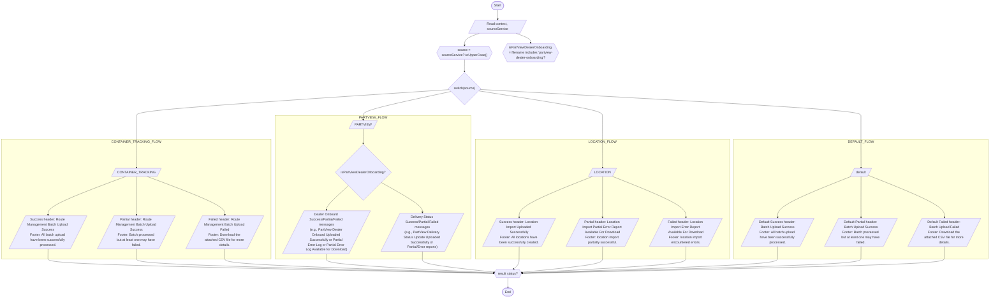

# Diagram: web/portal/src/modules/notifications/hooks/useBatchUploadNotification.ts


> Auto-generated by Obscura crawlers

## Diagram 1

```mermaid
classDiagram
class UseBatchUploadNotification {
  +context: { filename?: string; presignedUrl?: string; text?: string }
  +sourceService: string
  +getSuccessTranslatedHeaderFooter()
  +getPartialFailedTranslatedHeaderFooter()
  +getFailedTranslatedHeaderFooter()
}
class SourceService {
  <<enumeration>>
  CONTAINER_TRACKING
  PARTVIEW
  LOCATION
}
UseBatchUploadNotification --> SourceService
```

> SVG rendering failed for this diagram.

## Diagram 2



### SVG

<svg id="container" width="4700" xmlns="http://www.w3.org/2000/svg" class="flowchart" height="1454.0625" viewBox="0 0 4700 1454.0625" role="graphics-document document" aria-roledescription="flowchart-v2"><style>#container{font-family:"trebuchet ms",verdana,arial,sans-serif;font-size:16px;fill:#333;}@keyframes edge-animation-frame{from{stroke-dashoffset:0;}}@keyframes dash{to{stroke-dashoffset:0;}}#container .edge-animation-slow{stroke-dasharray:9,5!important;stroke-dashoffset:900;animation:dash 50s linear infinite;stroke-linecap:round;}#container .edge-animation-fast{stroke-dasharray:9,5!important;stroke-dashoffset:900;animation:dash 20s linear infinite;stroke-linecap:round;}#container .error-icon{fill:#552222;}#container .error-text{fill:#552222;stroke:#552222;}#container .edge-thickness-normal{stroke-width:1px;}#container .edge-thickness-thick{stroke-width:3.5px;}#container .edge-pattern-solid{stroke-dasharray:0;}#container .edge-thickness-invisible{stroke-width:0;fill:none;}#container .edge-pattern-dashed{stroke-dasharray:3;}#container .edge-pattern-dotted{stroke-dasharray:2;}#container .marker{fill:#333333;stroke:#333333;}#container .marker.cross{stroke:#333333;}#container svg{font-family:"trebuchet ms",verdana,arial,sans-serif;font-size:16px;}#container p{margin:0;}#container .label{font-family:"trebuchet ms",verdana,arial,sans-serif;color:#333;}#container .cluster-label text{fill:#333;}#container .cluster-label span{color:#333;}#container .cluster-label span p{background-color:transparent;}#container .label text,#container span{fill:#333;color:#333;}#container .node rect,#container .node circle,#container .node ellipse,#container .node polygon,#container .node path{fill:#ECECFF;stroke:#9370DB;stroke-width:1px;}#container .rough-node .label text,#container .node .label text,#container .image-shape .label,#container .icon-shape .label{text-anchor:middle;}#container .node .katex path{fill:#000;stroke:#000;stroke-width:1px;}#container .rough-node .label,#container .node .label,#container .image-shape .label,#container .icon-shape .label{text-align:center;}#container .node.clickable{cursor:pointer;}#container .root .anchor path{fill:#333333!important;stroke-width:0;stroke:#333333;}#container .arrowheadPath{fill:#333333;}#container .edgePath .path{stroke:#333333;stroke-width:2.0px;}#container .flowchart-link{stroke:#333333;fill:none;}#container .edgeLabel{background-color:rgba(232,232,232, 0.8);text-align:center;}#container .edgeLabel p{background-color:rgba(232,232,232, 0.8);}#container .edgeLabel rect{opacity:0.5;background-color:rgba(232,232,232, 0.8);fill:rgba(232,232,232, 0.8);}#container .labelBkg{background-color:rgba(232, 232, 232, 0.5);}#container .cluster rect{fill:#ffffde;stroke:#aaaa33;stroke-width:1px;}#container .cluster text{fill:#333;}#container .cluster span{color:#333;}#container div.mermaidTooltip{position:absolute;text-align:center;max-width:200px;padding:2px;font-family:"trebuchet ms",verdana,arial,sans-serif;font-size:12px;background:hsl(80, 100%, 96.2745098039%);border:1px solid #aaaa33;border-radius:2px;pointer-events:none;z-index:100;}#container .flowchartTitleText{text-anchor:middle;font-size:18px;fill:#333;}#container rect.text{fill:none;stroke-width:0;}#container .icon-shape,#container .image-shape{background-color:rgba(232,232,232, 0.8);text-align:center;}#container .icon-shape p,#container .image-shape p{background-color:rgba(232,232,232, 0.8);padding:2px;}#container .icon-shape rect,#container .image-shape rect{opacity:0.5;background-color:rgba(232,232,232, 0.8);fill:rgba(232,232,232, 0.8);}#container .label-icon{display:inline-block;height:1em;overflow:visible;vertical-align:-0.125em;}#container .node .label-icon path{fill:currentColor;stroke:revert;stroke-width:revert;}#container :root{--mermaid-font-family:"trebuchet ms",verdana,arial,sans-serif;}</style><g><marker id="container_flowchart-v2-pointEnd" class="marker flowchart-v2" viewBox="0 0 10 10" refX="5" refY="5" markerUnits="userSpaceOnUse" markerWidth="8" markerHeight="8" orient="auto"><path d="M 0 0 L 10 5 L 0 10 z" class="arrowMarkerPath" style="stroke-width: 1; stroke-dasharray: 1, 0;"></path></marker><marker id="container_flowchart-v2-pointStart" class="marker flowchart-v2" viewBox="0 0 10 10" refX="4.5" refY="5" markerUnits="userSpaceOnUse" markerWidth="8" markerHeight="8" orient="auto"><path d="M 0 5 L 10 10 L 10 0 z" class="arrowMarkerPath" style="stroke-width: 1; stroke-dasharray: 1, 0;"></path></marker><marker id="container_flowchart-v2-circleEnd" class="marker flowchart-v2" viewBox="0 0 10 10" refX="11" refY="5" markerUnits="userSpaceOnUse" markerWidth="11" markerHeight="11" orient="auto"><circle cx="5" cy="5" r="5" class="arrowMarkerPath" style="stroke-width: 1; stroke-dasharray: 1, 0;"></circle></marker><marker id="container_flowchart-v2-circleStart" class="marker flowchart-v2" viewBox="0 0 10 10" refX="-1" refY="5" markerUnits="userSpaceOnUse" markerWidth="11" markerHeight="11" orient="auto"><circle cx="5" cy="5" r="5" class="arrowMarkerPath" style="stroke-width: 1; stroke-dasharray: 1, 0;"></circle></marker><marker id="container_flowchart-v2-crossEnd" class="marker cross flowchart-v2" viewBox="0 0 11 11" refX="12" refY="5.2" markerUnits="userSpaceOnUse" markerWidth="11" markerHeight="11" orient="auto"><path d="M 1,1 l 9,9 M 10,1 l -9,9" class="arrowMarkerPath" style="stroke-width: 2; stroke-dasharray: 1, 0;"></path></marker><marker id="container_flowchart-v2-crossStart" class="marker cross flowchart-v2" viewBox="0 0 11 11" refX="-1" refY="5.2" markerUnits="userSpaceOnUse" markerWidth="11" markerHeight="11" orient="auto"><path d="M 1,1 l 9,9 M 10,1 l -9,9" class="arrowMarkerPath" style="stroke-width: 2; stroke-dasharray: 1, 0;"></path></marker><g class="root"><g class="clusters"><g class="cluster" id="DEFAULT_FLOW" data-look="classic"><rect style="" x="3472" y="693.15625" width="1220" height="574.90625"></rect><g class="cluster-label" transform="translate(4028.3203125, 693.15625)"><foreignObject width="107.359375" height="24"><div xmlns="http://www.w3.org/1999/xhtml" style="display: table-cell; white-space: nowrap; line-height: 1.5; max-width: 200px; text-align: center;"><span class="nodeLabel"><p>DEFAULT_FLOW</p></span></div></foreignObject></g></g><g class="cluster" id="LOCATION_FLOW" data-look="classic"><rect style="" x="2184" y="693.15625" width="1268" height="574.90625"></rect><g class="cluster-label" transform="translate(2758.8203125, 693.15625)"><foreignObject width="118.359375" height="24"><div xmlns="http://www.w3.org/1999/xhtml" style="display: table-cell; white-space: nowrap; line-height: 1.5; max-width: 200px; text-align: center;"><span class="nodeLabel"><p>LOCATION_FLOW</p></span></div></foreignObject></g></g><g class="cluster" id="PARTVIEW_FLOW" data-look="classic"><rect style="" x="1248" y="579.15625" width="916" height="688.90625"></rect><g class="cluster-label" transform="translate(1647.359375, 579.15625)"><foreignObject width="117.28125" height="24"><div xmlns="http://www.w3.org/1999/xhtml" style="display: table-cell; white-space: nowrap; line-height: 1.5; max-width: 200px; text-align: center;"><span class="nodeLabel"><p>PARTVIEW_FLOW</p></span></div></foreignObject></g></g><g class="cluster" id="CONTAINER_TRACKING_FLOW" data-look="classic"><rect style="" x="8" y="693.15625" width="1220" height="574.90625"></rect><g class="cluster-label" transform="translate(514.25, 693.15625)"><foreignObject width="207.5" height="24"><div xmlns="http://www.w3.org/1999/xhtml" style="display: table; white-space: break-spaces; line-height: 1.5; max-width: 200px; text-align: center; width: 200px;"><span class="nodeLabel"><p>CONTAINER_TRACKING_FLOW</p></span></div></foreignObject></g></g></g><g class="edgePaths"><path d="M2320.691,47.5L2320.607,51.583C2320.524,55.667,2320.357,63.833,2320.344,71.5C2320.331,79.167,2320.472,86.334,2320.542,89.917L2320.612,93.501" id="L_Start_ReadInput_0" class="edge-thickness-normal edge-pattern-solid edge-thickness-normal edge-pattern-solid flowchart-link" style=";" data-edge="true" data-et="edge" data-id="L_Start_ReadInput_0" data-points="W3sieCI6MjMyMC42OTA3NTc3NTE0NjUsInkiOjQ3LjV9LHsieCI6MjMyMC4xOTA3NTc3NTE0NjUsInkiOjcyfSx7IngiOjIzMjAuNjkwNzU3NzUxNDY1LCJ5Ijo5Ny41fV0=" marker-end="url(#container_flowchart-v2-pointEnd)"></path><path d="M2225.806,160.5L2213.171,164.583C2200.537,168.667,2175.269,176.833,2162.711,188.5C2150.153,200.167,2150.306,215.333,2150.383,222.917L2150.46,230.5" id="L_ReadInput_NormalizeSource_0" class="edge-thickness-normal edge-pattern-solid edge-thickness-normal edge-pattern-solid flowchart-link" style=";" data-edge="true" data-et="edge" data-id="L_ReadInput_NormalizeSource_0" data-points="W3sieCI6MjIyNS44MDU2NDUwMjI3NzIsInkiOjE2MC41fSx7IngiOjIxNTAsInkiOjE4NX0seyJ4IjoyMTUwLjQ5OTk5OTk5OTk5OTUsInkiOjIzNC40OTk5OTk5OTk5OTk4M31d" marker-end="url(#container_flowchart-v2-pointEnd)"></path><path d="M2415.576,160.5L2428.043,164.583C2440.511,168.667,2465.446,176.833,2477.984,184.5C2490.522,192.167,2490.663,199.334,2490.733,202.917L2490.803,206.501" id="L_ReadInput_CheckFilename_0" class="edge-thickness-normal edge-pattern-solid edge-thickness-normal edge-pattern-solid flowchart-link" style=";" data-edge="true" data-et="edge" data-id="L_ReadInput_CheckFilename_0" data-points="W3sieCI6MjQxNS41NzU4NzA0ODAxNTgsInkiOjE2MC41fSx7IngiOjI0OTAuMzgxNTE1NTAyOTI5NywieSI6MTg1fSx7IngiOjI0OTAuODgxNTE1NTAyOTI5NywieSI6MjEwLjV9XQ==" marker-end="url(#container_flowchart-v2-pointEnd)"></path><path d="M2150.5,297.5L2150.417,305.583C2150.333,313.667,2150.167,329.833,2150.083,341.417C2150,353,2150,360,2150,363.5L2150,367" id="L_NormalizeSource_SwitchSource_0" class="edge-thickness-normal edge-pattern-solid edge-thickness-normal edge-pattern-solid flowchart-link" style=";" data-edge="true" data-et="edge" data-id="L_NormalizeSource_SwitchSource_0" data-points="W3sieCI6MjE1MC40OTk5OTk5OTk5OTk1LCJ5IjoyOTcuNDk5OTk5OTk5OTk5NDN9LHsieCI6MjE1MCwieSI6MzQ2fSx7IngiOjIxNTAsInkiOjM3MX1d" marker-end="url(#container_flowchart-v2-pointEnd)"></path><path d="M2075.952,455.109L1832.96,471.617C1589.968,488.125,1103.984,521.14,860.992,541.815C618,562.49,618,570.823,618,582.406C618,593.99,618,608.823,618,623.656C618,638.49,618,653.323,618,664.906C618,676.49,618,684.823,618.081,711.648C618.162,738.474,618.324,783.792,618.405,806.451L618.486,829.109" id="L_SwitchSource_CT_0" class="edge-thickness-normal edge-pattern-solid edge-thickness-normal edge-pattern-solid flowchart-link" style=";" data-edge="true" data-et="edge" data-id="L_SwitchSource_CT_0" data-points="W3sieCI6MjA3NS45NTIzODIzMTY3MDY1LCJ5Ijo0NTUuMTA4NjMyMzE2NzA2M30seyJ4Ijo2MTgsInkiOjU1NC4xNTYyNX0seyJ4Ijo2MTgsInkiOjU3OS4xNTYyNX0seyJ4Ijo2MTgsInkiOjYyMy42NTYyNX0seyJ4Ijo2MTgsInkiOjY2OC4xNTYyNX0seyJ4Ijo2MTgsInkiOjY5My4xNTYyNX0seyJ4Ijo2MTguNSwieSI6ODMzLjEwOTM3NX1d" marker-end="url(#container_flowchart-v2-pointEnd)"></path><path d="M2084.61,463.766L2012.643,478.831C1940.676,493.896,1796.743,524.026,1724.776,543.258C1652.809,562.49,1652.809,570.823,1652.88,578.573C1652.95,586.323,1653.09,593.49,1653.161,597.074L1653.231,600.657" id="L_SwitchSource_PV_0" class="edge-thickness-normal edge-pattern-solid edge-thickness-normal edge-pattern-solid flowchart-link" style=";" data-edge="true" data-et="edge" data-id="L_SwitchSource_PV_0" data-points="W3sieCI6MjA4NC42MTAwOTg3MTI1ODEsInkiOjQ2My43NjYzNDg3MTI1ODA5Nn0seyJ4IjoxNjUyLjgwOTI0MjI0ODUzNTIsInkiOjU1NC4xNTYyNX0seyJ4IjoxNjUyLjgwOTI0MjI0ODUzNTIsInkiOjU3OS4xNTYyNX0seyJ4IjoxNjUzLjMwOTI0MjI0ODUzNTIsInkiOjYwNC42NTYyNX1d" marker-end="url(#container_flowchart-v2-pointEnd)"></path><path d="M2218.25,460.906L2316.208,476.448C2414.167,491.99,2610.083,523.073,2708.042,542.781C2806,562.49,2806,570.823,2806,582.406C2806,593.99,2806,608.823,2806,623.656C2806,638.49,2806,653.323,2806,664.906C2806,676.49,2806,684.823,2806.081,711.648C2806.162,738.474,2806.324,783.792,2806.405,806.451L2806.486,829.109" id="L_SwitchSource_LOC_0" class="edge-thickness-normal edge-pattern-solid edge-thickness-normal edge-pattern-solid flowchart-link" style=";" data-edge="true" data-et="edge" data-id="L_SwitchSource_LOC_0" data-points="W3sieCI6MjIxOC4yNDk4OTIwNzUyMzksInkiOjQ2MC45MDYzNTc5MjQ3NjEwNH0seyJ4IjoyODA2LCJ5Ijo1NTQuMTU2MjV9LHsieCI6MjgwNiwieSI6NTc5LjE1NjI1fSx7IngiOjI4MDYsInkiOjYyMy42NTYyNX0seyJ4IjoyODA2LCJ5Ijo2NjguMTU2MjV9LHsieCI6MjgwNiwieSI6NjkzLjE1NjI1fSx7IngiOjI4MDYuNSwieSI6ODMzLjEwOTM3NX1d" marker-end="url(#container_flowchart-v2-pointEnd)"></path><path d="M2225.036,454.12L2534.53,470.793C2844.024,487.466,3463.012,520.811,3772.506,541.65C4082,562.49,4082,570.823,4082,582.406C4082,593.99,4082,608.823,4082,623.656C4082,638.49,4082,653.323,4082,664.906C4082,676.49,4082,684.823,4082.081,711.648C4082.162,738.474,4082.324,783.792,4082.405,806.451L4082.486,829.109" id="L_SwitchSource_DEF_0" class="edge-thickness-normal edge-pattern-solid edge-thickness-normal edge-pattern-solid flowchart-link" style=";" data-edge="true" data-et="edge" data-id="L_SwitchSource_DEF_0" data-points="W3sieCI6MjIyNS4wMzU4OTE2MTE0Nzc0LCJ5Ijo0NTQuMTIwMzU4Mzg4NTIyN30seyJ4Ijo0MDgyLCJ5Ijo1NTQuMTU2MjV9LHsieCI6NDA4MiwieSI6NTc5LjE1NjI1fSx7IngiOjQwODIsInkiOjYyMy42NTYyNX0seyJ4Ijo0MDgyLCJ5Ijo2NjguMTU2MjV9LHsieCI6NDA4MiwieSI6NjkzLjE1NjI1fSx7IngiOjQwODIuNSwieSI6ODMzLjEwOTM3NX1d" marker-end="url(#container_flowchart-v2-pointEnd)"></path><path d="M569.429,872.109L510.857,895.268C452.286,918.427,335.143,964.745,276.649,997.487C218.156,1030.229,218.312,1049.396,218.39,1058.979L218.467,1068.563" id="L_CT_CT_Success_0" class="edge-thickness-normal edge-pattern-solid edge-thickness-normal edge-pattern-solid flowchart-link" style=";" data-edge="true" data-et="edge" data-id="L_CT_CT_Success_0" data-points="W3sieCI6NTY5LjQyODkyOTUxOTMxNTgsInkiOjg3Mi4xMDkzNzV9LHsieCI6MjE4LCJ5IjoxMDExLjA2MjV9LHsieCI6MjE4LjUsInkiOjEwNzIuNTYyNX1d" marker-end="url(#container_flowchart-v2-pointEnd)"></path><path d="M618.5,872.109L618.417,895.268C618.333,918.427,618.167,964.745,618.161,997.487C618.156,1030.229,618.312,1049.396,618.39,1058.979L618.467,1068.563" id="L_CT_CT_Partial_0" class="edge-thickness-normal edge-pattern-solid edge-thickness-normal edge-pattern-solid flowchart-link" style=";" data-edge="true" data-et="edge" data-id="L_CT_CT_Partial_0" data-points="W3sieCI6NjE4LjUsInkiOjg3Mi4xMDkzNzV9LHsieCI6NjE4LCJ5IjoxMDExLjA2MjV9LHsieCI6NjE4LjUsInkiOjEwNzIuNTYyNX1d" marker-end="url(#container_flowchart-v2-pointEnd)"></path><path d="M667.571,872.109L725.976,895.268C784.381,918.427,901.19,964.745,959.673,997.487C1018.156,1030.229,1018.312,1049.396,1018.39,1058.979L1018.467,1068.563" id="L_CT_CT_Failed_0" class="edge-thickness-normal edge-pattern-solid edge-thickness-normal edge-pattern-solid flowchart-link" style=";" data-edge="true" data-et="edge" data-id="L_CT_CT_Failed_0" data-points="W3sieCI6NjY3LjU3MTA3MDQ4MDY4NDIsInkiOjg3Mi4xMDkzNzV9LHsieCI6MTAxOCwieSI6MTAxMS4wNjI1fSx7IngiOjEwMTguNSwieSI6MTA3Mi41NjI1fV0=" marker-end="url(#container_flowchart-v2-pointEnd)"></path><path d="M1653.309,643.656L1653.226,647.74C1653.143,651.823,1652.976,659.99,1652.893,668.24C1652.809,676.49,1652.809,684.823,1652.809,692.49C1652.809,700.156,1652.809,707.156,1652.809,710.656L1652.809,714.156" id="L_PV_PV_CheckDealer_0" class="edge-thickness-normal edge-pattern-solid edge-thickness-normal edge-pattern-solid flowchart-link" style=";" data-edge="true" data-et="edge" data-id="L_PV_PV_CheckDealer_0" data-points="W3sieCI6MTY1My4zMDkyNDIyNDg1MzUyLCJ5Ijo2NDMuNjU2MjV9LHsieCI6MTY1Mi44MDkyNDIyNDg1MzUyLCJ5Ijo2NjguMTU2MjV9LHsieCI6MTY1Mi44MDkyNDIyNDg1MzUyLCJ5Ijo2OTMuMTU2MjV9LHsieCI6MTY1Mi44MDkyNDIyNDg1MzUyLCJ5Ijo3MTguMTU2MjV9XQ==" marker-end="url(#container_flowchart-v2-pointEnd)"></path><path d="M1585.863,919.116L1570.553,934.441C1555.242,949.765,1524.621,980.414,1509.381,999.322C1494.141,1018.229,1494.281,1025.396,1494.351,1028.98L1494.422,1032.563" id="L_PV_CheckDealer_PV_DealerTrue_0" class="edge-thickness-normal edge-pattern-solid edge-thickness-normal edge-pattern-solid flowchart-link" style=";" data-edge="true" data-et="edge" data-id="L_PV_CheckDealer_PV_DealerTrue_0" data-points="W3sieCI6MTU4NS44NjMwMDY3MjU4Mjg0LCJ5Ijo5MTkuMTE2MjY0NDc3MjkzMn0seyJ4IjoxNDk0LCJ5IjoxMDExLjA2MjV9LHsieCI6MTQ5NC41LCJ5IjoxMDM2LjU2MjV9XQ==" marker-end="url(#container_flowchart-v2-pointEnd)"></path><path d="M1739.25,899.621L1773.042,918.195C1806.833,936.768,1874.417,973.915,1908.285,1000.072C1942.153,1026.229,1942.306,1041.396,1942.383,1048.979L1942.46,1056.563" id="L_PV_CheckDealer_PV_DealerFalse_0" class="edge-thickness-normal edge-pattern-solid edge-thickness-normal edge-pattern-solid flowchart-link" style=";" data-edge="true" data-et="edge" data-id="L_PV_CheckDealer_PV_DealerFalse_0" data-points="W3sieCI6MTczOS4yNTAyNDMwMzYyNDQ3LCJ5Ijo4OTkuNjIxNDk5MjEyMjkwMn0seyJ4IjoxOTQyLCJ5IjoxMDExLjA2MjV9LHsieCI6MTk0Mi41LCJ5IjoxMDYwLjU2MjV9XQ==" marker-end="url(#container_flowchart-v2-pointEnd)"></path><path d="M2755.957,872.109L2695.631,895.268C2635.305,918.427,2514.652,964.745,2454.404,997.487C2394.156,1030.229,2394.312,1049.396,2394.39,1058.979L2394.467,1068.563" id="L_LOC_LOC_Success_0" class="edge-thickness-normal edge-pattern-solid edge-thickness-normal edge-pattern-solid flowchart-link" style=";" data-edge="true" data-et="edge" data-id="L_LOC_LOC_Success_0" data-points="W3sieCI6Mjc1NS45NTY3OTc0MDQ4OTU1LCJ5Ijo4NzIuMTA5Mzc1fSx7IngiOjIzOTQsInkiOjEwMTEuMDYyNX0seyJ4IjoyMzk0LjUsInkiOjEwNzIuNTYyNX1d" marker-end="url(#container_flowchart-v2-pointEnd)"></path><path d="M2806.5,872.109L2806.417,895.268C2806.333,918.427,2806.167,964.745,2806.16,995.487C2806.153,1026.229,2806.306,1041.396,2806.383,1048.979L2806.46,1056.563" id="L_LOC_LOC_Partial_0" class="edge-thickness-normal edge-pattern-solid edge-thickness-normal edge-pattern-solid flowchart-link" style=";" data-edge="true" data-et="edge" data-id="L_LOC_LOC_Partial_0" data-points="W3sieCI6MjgwNi41LCJ5Ijo4NzIuMTA5Mzc1fSx7IngiOjI4MDYsInkiOjEwMTEuMDYyNX0seyJ4IjoyODA2LjUsInkiOjEwNjAuNTYyNX1d" marker-end="url(#container_flowchart-v2-pointEnd)"></path><path d="M2850.772,869.206L2913.976,892.849C2977.181,916.492,3103.591,963.777,3166.872,995.003C3230.153,1026.229,3230.306,1041.396,3230.383,1048.979L3230.46,1056.563" id="L_LOC_LOC_Failed_0" class="edge-thickness-normal edge-pattern-solid edge-thickness-normal edge-pattern-solid flowchart-link" style=";" data-edge="true" data-et="edge" data-id="L_LOC_LOC_Failed_0" data-points="W3sieCI6Mjg1MC43NzE3OTc2NTY5MTY1LCJ5Ijo4NjkuMjA2NDA0Njg2MTY2NX0seyJ4IjozMjMwLCJ5IjoxMDExLjA2MjV9LHsieCI6MzIzMC41LCJ5IjoxMDYwLjU2MjV9XQ==" marker-end="url(#container_flowchart-v2-pointEnd)"></path><path d="M4033.429,872.109L3974.857,895.268C3916.286,918.427,3799.143,964.745,3740.649,997.487C3682.156,1030.229,3682.312,1049.396,3682.39,1058.979L3682.467,1068.563" id="L_DEF_DEF_Success_0" class="edge-thickness-normal edge-pattern-solid edge-thickness-normal edge-pattern-solid flowchart-link" style=";" data-edge="true" data-et="edge" data-id="L_DEF_DEF_Success_0" data-points="W3sieCI6NDAzMy40Mjg5Mjk1MTkzMTU3LCJ5Ijo4NzIuMTA5Mzc1fSx7IngiOjM2ODIsInkiOjEwMTEuMDYyNX0seyJ4IjozNjgyLjUsInkiOjEwNzIuNTYyNX1d" marker-end="url(#container_flowchart-v2-pointEnd)"></path><path d="M4082.5,872.109L4082.417,895.268C4082.333,918.427,4082.167,964.745,4082.161,997.487C4082.156,1030.229,4082.312,1049.396,4082.39,1058.979L4082.467,1068.563" id="L_DEF_DEF_Partial_0" class="edge-thickness-normal edge-pattern-solid edge-thickness-normal edge-pattern-solid flowchart-link" style=";" data-edge="true" data-et="edge" data-id="L_DEF_DEF_Partial_0" data-points="W3sieCI6NDA4Mi41LCJ5Ijo4NzIuMTA5Mzc1fSx7IngiOjQwODIsInkiOjEwMTEuMDYyNX0seyJ4Ijo0MDgyLjUsInkiOjEwNzIuNTYyNX1d" marker-end="url(#container_flowchart-v2-pointEnd)"></path><path d="M4118.49,866.911L4179.075,890.936C4239.66,914.962,4360.83,963.012,4421.493,996.621C4482.156,1030.229,4482.312,1049.396,4482.39,1058.979L4482.467,1068.563" id="L_DEF_DEF_Failed_0" class="edge-thickness-normal edge-pattern-solid edge-thickness-normal edge-pattern-solid flowchart-link" style=";" data-edge="true" data-et="edge" data-id="L_DEF_DEF_Failed_0" data-points="W3sieCI6NDExOC40ODk3Njc0ODczMzIsInkiOjg2Ni45MTEwOTAwMjUzMzY5fSx7IngiOjQ0ODIsInkiOjEwMTEuMDYyNX0seyJ4Ijo0NDgyLjUsInkiOjEwNzIuNTYyNX1d" marker-end="url(#container_flowchart-v2-pointEnd)"></path><path d="M218.5,1207.563L218.417,1217.646C218.333,1227.729,218.167,1247.896,218.083,1262.146C218,1276.396,218,1284.729,556.262,1296.108C894.524,1307.488,1571.047,1321.913,1909.309,1329.126L2247.571,1336.338" id="L_CT_Success_StatusChoice_0" class="edge-thickness-normal edge-pattern-solid edge-thickness-normal edge-pattern-solid flowchart-link" style=";" data-edge="true" data-et="edge" data-id="L_CT_Success_StatusChoice_0" data-points="W3sieCI6MjE4LjUsInkiOjEyMDcuNTYyNX0seyJ4IjoyMTgsInkiOjEyNjguMDYyNX0seyJ4IjoyMTgsInkiOjEyOTMuMDYyNX0seyJ4IjoyMjUxLjU3MDA5NTM2NDQ4MSwieSI6MTMzNi40MjM2MDYyNjgxMDgyfV0=" marker-end="url(#container_flowchart-v2-pointEnd)"></path><path d="M618.5,1207.563L618.417,1217.646C618.333,1227.729,618.167,1247.896,618.083,1262.146C618,1276.396,618,1284.729,889.627,1296.042C1161.254,1307.355,1704.507,1321.648,1976.134,1328.794L2247.761,1335.94" id="L_CT_Partial_StatusChoice_0" class="edge-thickness-normal edge-pattern-solid edge-thickness-normal edge-pattern-solid flowchart-link" style=";" data-edge="true" data-et="edge" data-id="L_CT_Partial_StatusChoice_0" data-points="W3sieCI6NjE4LjUsInkiOjEyMDcuNTYyNX0seyJ4Ijo2MTgsInkiOjEyNjguMDYyNX0seyJ4Ijo2MTgsInkiOjEyOTMuMDYyNX0seyJ4IjoyMjUxLjc1OTIyODM5NDg5OCwieSI6MTMzNi4wNDUzNDAyMDcyNzQ2fV0=" marker-end="url(#container_flowchart-v2-pointEnd)"></path><path d="M1018.5,1207.563L1018.417,1217.646C1018.333,1227.729,1018.167,1247.896,1018.083,1262.146C1018,1276.396,1018,1284.729,1223.011,1295.936C1428.021,1307.143,1838.043,1321.223,2043.054,1328.263L2248.064,1335.303" id="L_CT_Failed_StatusChoice_0" class="edge-thickness-normal edge-pattern-solid edge-thickness-normal edge-pattern-solid flowchart-link" style=";" data-edge="true" data-et="edge" data-id="L_CT_Failed_StatusChoice_0" data-points="W3sieCI6MTAxOC41LCJ5IjoxMjA3LjU2MjV9LHsieCI6MTAxOCwieSI6MTI2OC4wNjI1fSx7IngiOjEwMTgsInkiOjEyOTMuMDYyNX0seyJ4IjoyMjUyLjA2MTg2NDU3NjIxNiwieSI6MTMzNS40NDAwNjc4NDQ2Mzh9XQ==" marker-end="url(#container_flowchart-v2-pointEnd)"></path><path d="M1494.5,1243.563L1494.417,1247.646C1494.333,1251.729,1494.167,1259.896,1494.083,1268.146C1494,1276.396,1494,1284.729,1619.799,1295.68C1745.599,1306.631,1997.197,1320.2,2122.997,1326.984L2248.796,1333.768" id="L_PV_DealerTrue_StatusChoice_0" class="edge-thickness-normal edge-pattern-solid edge-thickness-normal edge-pattern-solid flowchart-link" style=";" data-edge="true" data-et="edge" data-id="L_PV_DealerTrue_StatusChoice_0" data-points="W3sieCI6MTQ5NC41LCJ5IjoxMjQzLjU2MjV9LHsieCI6MTQ5NCwieSI6MTI2OC4wNjI1fSx7IngiOjE0OTQsInkiOjEyOTMuMDYyNX0seyJ4IjoyMjUyLjc5MDA5NzYxMTAwNDUsInkiOjEzMzMuOTgzNjAxNzc1MDYxfV0=" marker-end="url(#container_flowchart-v2-pointEnd)"></path><path d="M1942.5,1219.563L1942.417,1227.646C1942.333,1235.729,1942.167,1251.896,1942.083,1264.146C1942,1276.396,1942,1284.729,1993.508,1294.894C2045.017,1305.06,2148.034,1317.057,2199.542,1323.055L2251.051,1329.054" id="L_PV_DealerFalse_StatusChoice_0" class="edge-thickness-normal edge-pattern-solid edge-thickness-normal edge-pattern-solid flowchart-link" style=";" data-edge="true" data-et="edge" data-id="L_PV_DealerFalse_StatusChoice_0" data-points="W3sieCI6MTk0Mi41LCJ5IjoxMjE5LjU2MjV9LHsieCI6MTk0MiwieSI6MTI2OC4wNjI1fSx7IngiOjE5NDIsInkiOjEyOTMuMDYyNX0seyJ4IjoyMjU1LjAyMzY5Mzg5MjQ3MjIsInkiOjEzMjkuNTE2NDA5MjEyMTI1OH1d" marker-end="url(#container_flowchart-v2-pointEnd)"></path><path d="M2394.5,1207.563L2394.417,1217.646C2394.333,1227.729,2394.167,1247.896,2394.083,1262.146C2394,1276.396,2394,1284.729,2388.524,1292.761C2383.048,1300.794,2372.096,1308.525,2366.62,1312.39L2361.144,1316.256" id="L_LOC_Success_StatusChoice_0" class="edge-thickness-normal edge-pattern-solid edge-thickness-normal edge-pattern-solid flowchart-link" style=";" data-edge="true" data-et="edge" data-id="L_LOC_Success_StatusChoice_0" data-points="W3sieCI6MjM5NC41LCJ5IjoxMjA3LjU2MjV9LHsieCI6MjM5NCwieSI6MTI2OC4wNjI1fSx7IngiOjIzOTQsInkiOjEyOTMuMDYyNX0seyJ4IjoyMzU3Ljg3NTk3ODc5MTMxMiwieSI6MTMxOC41NjI1fV0=" marker-end="url(#container_flowchart-v2-pointEnd)"></path><path d="M2806.5,1219.563L2806.417,1227.646C2806.333,1235.729,2806.167,1251.896,2806.083,1264.146C2806,1276.396,2806,1284.729,2739.725,1295.166C2673.45,1305.604,2540.9,1318.145,2474.625,1324.416L2408.35,1330.686" id="L_LOC_Partial_StatusChoice_0" class="edge-thickness-normal edge-pattern-solid edge-thickness-normal edge-pattern-solid flowchart-link" style=";" data-edge="true" data-et="edge" data-id="L_LOC_Partial_StatusChoice_0" data-points="W3sieCI6MjgwNi41LCJ5IjoxMjE5LjU2MjV9LHsieCI6MjgwNiwieSI6MTI2OC4wNjI1fSx7IngiOjI4MDYsInkiOjEyOTMuMDYyNX0seyJ4IjoyNDA0LjM2ODA2NDEzNjA4ODQsInkiOjEzMzEuMDYyOTU2Mjc1MTA3MX1d" marker-end="url(#container_flowchart-v2-pointEnd)"></path><path d="M3230.5,1219.563L3230.417,1227.646C3230.333,1235.729,3230.167,1251.896,3230.083,1264.146C3230,1276.396,3230,1284.729,3093.328,1295.732C2956.657,1306.734,2683.313,1320.405,2546.642,1327.241L2409.97,1334.077" id="L_LOC_Failed_StatusChoice_0" class="edge-thickness-normal edge-pattern-solid edge-thickness-normal edge-pattern-solid flowchart-link" style=";" data-edge="true" data-et="edge" data-id="L_LOC_Failed_StatusChoice_0" data-points="W3sieCI6MzIzMC41LCJ5IjoxMjE5LjU2MjV9LHsieCI6MzIzMCwieSI6MTI2OC4wNjI1fSx7IngiOjMyMzAsInkiOjEyOTMuMDYyNX0seyJ4IjoyNDA1Ljk3NDk5MjYzMzkwNywieSI6MTMzNC4yNzY4MTMyNzA3NDI3fV0=" marker-end="url(#container_flowchart-v2-pointEnd)"></path><path d="M3682.5,1207.563L3682.417,1217.646C3682.333,1227.729,3682.167,1247.896,3682.083,1262.146C3682,1276.396,3682,1284.729,3470.099,1295.95C3258.198,1307.171,2834.397,1321.279,2622.496,1328.334L2410.595,1335.388" id="L_DEF_Success_StatusChoice_0" class="edge-thickness-normal edge-pattern-solid edge-thickness-normal edge-pattern-solid flowchart-link" style=";" data-edge="true" data-et="edge" data-id="L_DEF_Success_StatusChoice_0" data-points="W3sieCI6MzY4Mi41LCJ5IjoxMjA3LjU2MjV9LHsieCI6MzY4MiwieSI6MTI2OC4wNjI1fSx7IngiOjM2ODIsInkiOjEyOTMuMDYyNX0seyJ4IjoyNDA2LjU5NzAyMjQ3ODUxNDYsInkiOjEzMzUuNTIwODcyOTU5OTU5NH1d" marker-end="url(#container_flowchart-v2-pointEnd)"></path><path d="M4082.5,1207.563L4082.417,1217.646C4082.333,1227.729,4082.167,1247.896,4082.083,1262.146C4082,1276.396,4082,1284.729,3803.48,1296.051C3524.961,1307.372,2967.921,1321.681,2689.402,1328.836L2410.882,1335.991" id="L_DEF_Partial_StatusChoice_0" class="edge-thickness-normal edge-pattern-solid edge-thickness-normal edge-pattern-solid flowchart-link" style=";" data-edge="true" data-et="edge" data-id="L_DEF_Partial_StatusChoice_0" data-points="W3sieCI6NDA4Mi41LCJ5IjoxMjA3LjU2MjV9LHsieCI6NDA4MiwieSI6MTI2OC4wNjI1fSx7IngiOjQwODIsInkiOjEyOTMuMDYyNX0seyJ4IjoyNDA2Ljg4MzMzMTg5NTM2NywieSI6MTMzNi4wOTM0OTE3OTM2NjQ1fV0=" marker-end="url(#container_flowchart-v2-pointEnd)"></path><path d="M4482.5,1207.563L4482.417,1217.646C4482.333,1227.729,4482.167,1247.896,4482.083,1262.146C4482,1276.396,4482,1284.729,4136.844,1296.114C3791.688,1307.499,3101.376,1321.935,2756.22,1329.154L2411.063,1336.372" id="L_DEF_Failed_StatusChoice_0" class="edge-thickness-normal edge-pattern-solid edge-thickness-normal edge-pattern-solid flowchart-link" style=";" data-edge="true" data-et="edge" data-id="L_DEF_Failed_StatusChoice_0" data-points="W3sieCI6NDQ4Mi41LCJ5IjoxMjA3LjU2MjV9LHsieCI6NDQ4MiwieSI6MTI2OC4wNjI1fSx7IngiOjQ0ODIsInkiOjEyOTMuMDYyNX0seyJ4IjoyNDA3LjA2NDM1MzQzNzcyMTQsInkiOjEzMzYuNDU1NTM0ODc4MzcxN31d" marker-end="url(#container_flowchart-v2-pointEnd)"></path><path d="M2329.309,1357.563L2329.226,1361.646C2329.143,1365.729,2328.976,1373.896,2328.963,1381.563C2328.95,1389.229,2329.09,1396.396,2329.161,1399.98L2329.231,1403.563" id="L_StatusChoice_End_0" class="edge-thickness-normal edge-pattern-solid edge-thickness-normal edge-pattern-solid flowchart-link" style=";" data-edge="true" data-et="edge" data-id="L_StatusChoice_End_0" data-points="W3sieCI6MjMyOS4zMDkyNDIyNDg1MzUsInkiOjEzNTcuNTYyNX0seyJ4IjoyMzI4LjgwOTI0MjI0ODUzNSwieSI6MTM4Mi4wNjI1fSx7IngiOjIzMjkuMzA5MjQyMjQ4NTM1LCJ5IjoxNDA3LjU2MjV9XQ==" marker-end="url(#container_flowchart-v2-pointEnd)"></path></g><g class="edgeLabels"><g class="edgeLabel"><g class="label" data-id="L_Start_ReadInput_0" transform="translate(0, 0)"><foreignObject width="0" height="0"><div xmlns="http://www.w3.org/1999/xhtml" class="labelBkg" style="display: table-cell; white-space: nowrap; line-height: 1.5; max-width: 200px; text-align: center;"><span class="edgeLabel"></span></div></foreignObject></g></g><g class="edgeLabel"><g class="label" data-id="L_ReadInput_NormalizeSource_0" transform="translate(0, 0)"><foreignObject width="0" height="0"><div xmlns="http://www.w3.org/1999/xhtml" class="labelBkg" style="display: table-cell; white-space: nowrap; line-height: 1.5; max-width: 200px; text-align: center;"><span class="edgeLabel"></span></div></foreignObject></g></g><g class="edgeLabel"><g class="label" data-id="L_ReadInput_CheckFilename_0" transform="translate(0, 0)"><foreignObject width="0" height="0"><div xmlns="http://www.w3.org/1999/xhtml" class="labelBkg" style="display: table-cell; white-space: nowrap; line-height: 1.5; max-width: 200px; text-align: center;"><span class="edgeLabel"></span></div></foreignObject></g></g><g class="edgeLabel"><g class="label" data-id="L_NormalizeSource_SwitchSource_0" transform="translate(0, 0)"><foreignObject width="0" height="0"><div xmlns="http://www.w3.org/1999/xhtml" class="labelBkg" style="display: table-cell; white-space: nowrap; line-height: 1.5; max-width: 200px; text-align: center;"><span class="edgeLabel"></span></div></foreignObject></g></g><g class="edgeLabel"><g class="label" data-id="L_SwitchSource_CT_0" transform="translate(0, 0)"><foreignObject width="0" height="0"><div xmlns="http://www.w3.org/1999/xhtml" class="labelBkg" style="display: table-cell; white-space: nowrap; line-height: 1.5; max-width: 200px; text-align: center;"><span class="edgeLabel"></span></div></foreignObject></g></g><g class="edgeLabel"><g class="label" data-id="L_SwitchSource_PV_0" transform="translate(0, 0)"><foreignObject width="0" height="0"><div xmlns="http://www.w3.org/1999/xhtml" class="labelBkg" style="display: table-cell; white-space: nowrap; line-height: 1.5; max-width: 200px; text-align: center;"><span class="edgeLabel"></span></div></foreignObject></g></g><g class="edgeLabel"><g class="label" data-id="L_SwitchSource_LOC_0" transform="translate(0, 0)"><foreignObject width="0" height="0"><div xmlns="http://www.w3.org/1999/xhtml" class="labelBkg" style="display: table-cell; white-space: nowrap; line-height: 1.5; max-width: 200px; text-align: center;"><span class="edgeLabel"></span></div></foreignObject></g></g><g class="edgeLabel"><g class="label" data-id="L_SwitchSource_DEF_0" transform="translate(0, 0)"><foreignObject width="0" height="0"><div xmlns="http://www.w3.org/1999/xhtml" class="labelBkg" style="display: table-cell; white-space: nowrap; line-height: 1.5; max-width: 200px; text-align: center;"><span class="edgeLabel"></span></div></foreignObject></g></g><g class="edgeLabel"><g class="label" data-id="L_CT_CT_Success_0" transform="translate(0, 0)"><foreignObject width="0" height="0"><div xmlns="http://www.w3.org/1999/xhtml" class="labelBkg" style="display: table-cell; white-space: nowrap; line-height: 1.5; max-width: 200px; text-align: center;"><span class="edgeLabel"></span></div></foreignObject></g></g><g class="edgeLabel"><g class="label" data-id="L_CT_CT_Partial_0" transform="translate(0, 0)"><foreignObject width="0" height="0"><div xmlns="http://www.w3.org/1999/xhtml" class="labelBkg" style="display: table-cell; white-space: nowrap; line-height: 1.5; max-width: 200px; text-align: center;"><span class="edgeLabel"></span></div></foreignObject></g></g><g class="edgeLabel"><g class="label" data-id="L_CT_CT_Failed_0" transform="translate(0, 0)"><foreignObject width="0" height="0"><div xmlns="http://www.w3.org/1999/xhtml" class="labelBkg" style="display: table-cell; white-space: nowrap; line-height: 1.5; max-width: 200px; text-align: center;"><span class="edgeLabel"></span></div></foreignObject></g></g><g class="edgeLabel"><g class="label" data-id="L_PV_PV_CheckDealer_0" transform="translate(0, 0)"><foreignObject width="0" height="0"><div xmlns="http://www.w3.org/1999/xhtml" class="labelBkg" style="display: table-cell; white-space: nowrap; line-height: 1.5; max-width: 200px; text-align: center;"><span class="edgeLabel"></span></div></foreignObject></g></g><g class="edgeLabel"><g class="label" data-id="L_PV_CheckDealer_PV_DealerTrue_0" transform="translate(0, 0)"><foreignObject width="0" height="0"><div xmlns="http://www.w3.org/1999/xhtml" class="labelBkg" style="display: table-cell; white-space: nowrap; line-height: 1.5; max-width: 200px; text-align: center;"><span class="edgeLabel"></span></div></foreignObject></g></g><g class="edgeLabel"><g class="label" data-id="L_PV_CheckDealer_PV_DealerFalse_0" transform="translate(0, 0)"><foreignObject width="0" height="0"><div xmlns="http://www.w3.org/1999/xhtml" class="labelBkg" style="display: table-cell; white-space: nowrap; line-height: 1.5; max-width: 200px; text-align: center;"><span class="edgeLabel"></span></div></foreignObject></g></g><g class="edgeLabel"><g class="label" data-id="L_LOC_LOC_Success_0" transform="translate(0, 0)"><foreignObject width="0" height="0"><div xmlns="http://www.w3.org/1999/xhtml" class="labelBkg" style="display: table-cell; white-space: nowrap; line-height: 1.5; max-width: 200px; text-align: center;"><span class="edgeLabel"></span></div></foreignObject></g></g><g class="edgeLabel"><g class="label" data-id="L_LOC_LOC_Partial_0" transform="translate(0, 0)"><foreignObject width="0" height="0"><div xmlns="http://www.w3.org/1999/xhtml" class="labelBkg" style="display: table-cell; white-space: nowrap; line-height: 1.5; max-width: 200px; text-align: center;"><span class="edgeLabel"></span></div></foreignObject></g></g><g class="edgeLabel"><g class="label" data-id="L_LOC_LOC_Failed_0" transform="translate(0, 0)"><foreignObject width="0" height="0"><div xmlns="http://www.w3.org/1999/xhtml" class="labelBkg" style="display: table-cell; white-space: nowrap; line-height: 1.5; max-width: 200px; text-align: center;"><span class="edgeLabel"></span></div></foreignObject></g></g><g class="edgeLabel"><g class="label" data-id="L_DEF_DEF_Success_0" transform="translate(0, 0)"><foreignObject width="0" height="0"><div xmlns="http://www.w3.org/1999/xhtml" class="labelBkg" style="display: table-cell; white-space: nowrap; line-height: 1.5; max-width: 200px; text-align: center;"><span class="edgeLabel"></span></div></foreignObject></g></g><g class="edgeLabel"><g class="label" data-id="L_DEF_DEF_Partial_0" transform="translate(0, 0)"><foreignObject width="0" height="0"><div xmlns="http://www.w3.org/1999/xhtml" class="labelBkg" style="display: table-cell; white-space: nowrap; line-height: 1.5; max-width: 200px; text-align: center;"><span class="edgeLabel"></span></div></foreignObject></g></g><g class="edgeLabel"><g class="label" data-id="L_DEF_DEF_Failed_0" transform="translate(0, 0)"><foreignObject width="0" height="0"><div xmlns="http://www.w3.org/1999/xhtml" class="labelBkg" style="display: table-cell; white-space: nowrap; line-height: 1.5; max-width: 200px; text-align: center;"><span class="edgeLabel"></span></div></foreignObject></g></g><g class="edgeLabel"><g class="label" data-id="L_CT_Success_StatusChoice_0" transform="translate(0, 0)"><foreignObject width="0" height="0"><div xmlns="http://www.w3.org/1999/xhtml" class="labelBkg" style="display: table-cell; white-space: nowrap; line-height: 1.5; max-width: 200px; text-align: center;"><span class="edgeLabel"></span></div></foreignObject></g></g><g class="edgeLabel"><g class="label" data-id="L_CT_Partial_StatusChoice_0" transform="translate(0, 0)"><foreignObject width="0" height="0"><div xmlns="http://www.w3.org/1999/xhtml" class="labelBkg" style="display: table-cell; white-space: nowrap; line-height: 1.5; max-width: 200px; text-align: center;"><span class="edgeLabel"></span></div></foreignObject></g></g><g class="edgeLabel"><g class="label" data-id="L_CT_Failed_StatusChoice_0" transform="translate(0, 0)"><foreignObject width="0" height="0"><div xmlns="http://www.w3.org/1999/xhtml" class="labelBkg" style="display: table-cell; white-space: nowrap; line-height: 1.5; max-width: 200px; text-align: center;"><span class="edgeLabel"></span></div></foreignObject></g></g><g class="edgeLabel"><g class="label" data-id="L_PV_DealerTrue_StatusChoice_0" transform="translate(0, 0)"><foreignObject width="0" height="0"><div xmlns="http://www.w3.org/1999/xhtml" class="labelBkg" style="display: table-cell; white-space: nowrap; line-height: 1.5; max-width: 200px; text-align: center;"><span class="edgeLabel"></span></div></foreignObject></g></g><g class="edgeLabel"><g class="label" data-id="L_PV_DealerFalse_StatusChoice_0" transform="translate(0, 0)"><foreignObject width="0" height="0"><div xmlns="http://www.w3.org/1999/xhtml" class="labelBkg" style="display: table-cell; white-space: nowrap; line-height: 1.5; max-width: 200px; text-align: center;"><span class="edgeLabel"></span></div></foreignObject></g></g><g class="edgeLabel"><g class="label" data-id="L_LOC_Success_StatusChoice_0" transform="translate(0, 0)"><foreignObject width="0" height="0"><div xmlns="http://www.w3.org/1999/xhtml" class="labelBkg" style="display: table-cell; white-space: nowrap; line-height: 1.5; max-width: 200px; text-align: center;"><span class="edgeLabel"></span></div></foreignObject></g></g><g class="edgeLabel"><g class="label" data-id="L_LOC_Partial_StatusChoice_0" transform="translate(0, 0)"><foreignObject width="0" height="0"><div xmlns="http://www.w3.org/1999/xhtml" class="labelBkg" style="display: table-cell; white-space: nowrap; line-height: 1.5; max-width: 200px; text-align: center;"><span class="edgeLabel"></span></div></foreignObject></g></g><g class="edgeLabel"><g class="label" data-id="L_LOC_Failed_StatusChoice_0" transform="translate(0, 0)"><foreignObject width="0" height="0"><div xmlns="http://www.w3.org/1999/xhtml" class="labelBkg" style="display: table-cell; white-space: nowrap; line-height: 1.5; max-width: 200px; text-align: center;"><span class="edgeLabel"></span></div></foreignObject></g></g><g class="edgeLabel"><g class="label" data-id="L_DEF_Success_StatusChoice_0" transform="translate(0, 0)"><foreignObject width="0" height="0"><div xmlns="http://www.w3.org/1999/xhtml" class="labelBkg" style="display: table-cell; white-space: nowrap; line-height: 1.5; max-width: 200px; text-align: center;"><span class="edgeLabel"></span></div></foreignObject></g></g><g class="edgeLabel"><g class="label" data-id="L_DEF_Partial_StatusChoice_0" transform="translate(0, 0)"><foreignObject width="0" height="0"><div xmlns="http://www.w3.org/1999/xhtml" class="labelBkg" style="display: table-cell; white-space: nowrap; line-height: 1.5; max-width: 200px; text-align: center;"><span class="edgeLabel"></span></div></foreignObject></g></g><g class="edgeLabel"><g class="label" data-id="L_DEF_Failed_StatusChoice_0" transform="translate(0, 0)"><foreignObject width="0" height="0"><div xmlns="http://www.w3.org/1999/xhtml" class="labelBkg" style="display: table-cell; white-space: nowrap; line-height: 1.5; max-width: 200px; text-align: center;"><span class="edgeLabel"></span></div></foreignObject></g></g><g class="edgeLabel"><g class="label" data-id="L_StatusChoice_End_0" transform="translate(0, 0)"><foreignObject width="0" height="0"><div xmlns="http://www.w3.org/1999/xhtml" class="labelBkg" style="display: table-cell; white-space: nowrap; line-height: 1.5; max-width: 200px; text-align: center;"><span class="edgeLabel"></span></div></foreignObject></g></g></g><g class="nodes"><g class="node default" id="flowchart-Start-0" transform="translate(2320.190757751465, 27.5)"><g class="basic label-container outer-path"><path d="M-10.3984375 -19.5 C-2.8516815551387014 -19.5, 4.695074389722597 -19.5, 10.3984375 -19.5 C10.3984375 -19.5, 10.3984375 -19.5, 10.398437499999998 -19.5 C10.857934264828108 -19.485264833108157, 11.317431029656216 -19.470529666216315, 11.6478067896239 -19.45993515863156 C11.944511008690686 -19.431312459457217, 12.241215227757472 -19.402689760282875, 12.892042152847864 -19.3399052695533 C13.303795270227075 -19.273336218728545, 13.715548387606285 -19.20676716790379, 14.126030759676757 -19.140403561325776 C14.478036739253326 -19.060060493541112, 14.830042718829896 -18.979717425756448, 15.34470188623539 -18.862249829261074 C15.598848912846123 -18.786820325807973, 15.852995939456855 -18.711390822354875, 16.543047751460602 -18.50658706670804 C16.82132316025561 -18.404179143921795, 17.09959856905062 -18.301771221135553, 17.716144095147794 -18.074876768247425 C18.060115167045502 -17.922610978257623, 18.40408623894321 -17.770345188267825, 18.85917041279238 -17.568892924097174 C19.23005443317681 -17.37540296822517, 19.60093845356124 -17.181913012353167, 19.967429764076783 -16.990714730406097 C20.363531679481586 -16.750595421534474, 20.759633594886385 -16.51047611266285, 21.036368073605697 -16.342718045390892 C21.37530137924089 -16.10629284356611, 21.714234684876086 -15.869867641741324, 22.061592844578712 -15.627565626425154 C22.313702106634477 -15.4265151988449, 22.565811368690245 -15.225464771264647, 23.03889120850187 -14.848196188198123 C23.386441386362144 -14.532560312339221, 23.73399156422242 -14.216924436480317, 23.964247236767985 -14.007812326905688 C24.197287795452578 -13.767178817078152, 24.43032835413717 -13.526545307250617, 24.833858442968648 -13.10986736009568 C25.117373884863074 -12.776833989560831, 25.4008893267575 -12.443800619025982, 25.644151408126582 -12.158051136245305 C25.824031750899106 -11.917027864366469, 26.00391209367163 -11.676004592487635, 26.391796464640635 -11.156274872382312 C26.56413011926917 -10.891524100807073, 26.736463773897707 -10.626773329231835, 27.073721378604247 -10.108655082055241 C27.208076139467252 -9.870094599248175, 27.342430900330257 -9.631534116441106, 27.6871239742735 -9.019496659696287 C27.802589041866792 -8.779730976282144, 27.918054109460087 -8.539965292868002, 28.22948364880834 -7.893275190886684 C28.353815063804888 -7.586174192060834, 28.478146478801435 -7.279073193234983, 28.698571729970325 -6.734618561215508 C28.837548123037894 -6.31604380817716, 28.976524516105464 -5.897469055138814, 29.09246063421488 -5.548287939305138 C29.158517104698443 -5.296385988295909, 29.224573575182006 -5.044484037286681, 29.40953178754556 -4.339158212148133 C29.49602734643641 -3.8950217980864585, 29.582522905327263 -3.450885384024784, 29.648482276581777 -3.1121979531509023 C29.687872151929227 -2.80669785836678, 29.727262027276673 -2.5011977635826583, 29.808330202509367 -1.872449005199798 C29.83764707033422 -1.4158151246779087, 29.866963938159074 -0.9591812441560194, 29.888418715913414 -0.6250057626472757 C29.888418715913414 -0.20074741917836691, 29.888418715913414 0.22351092429054187, 29.888418715913414 0.625005762647271 C29.867194994966557 0.9555823478737924, 29.845971274019696 1.2861589331003138, 29.808330202509367 1.8724490051997846 C29.75098649733784 2.317195458714745, 29.693642792166315 2.7619419122297058, 29.648482276581777 3.1121979531508885 C29.567662671946447 3.5271895417238204, 29.486843067311117 3.9421811302967518, 29.40953178754556 4.339158212148129 C29.303110749449285 4.744987753578902, 29.19668971135301 5.1508172950096744, 29.092460634214884 5.548287939305125 C28.93988381254076 6.0078250163723945, 28.787306990866632 6.467362093439664, 28.69857172997033 6.734618561215495 C28.584133295823808 7.017283706074012, 28.469694861677286 7.2999488509325285, 28.229483648808344 7.893275190886679 C28.04733028951231 8.271520538922426, 27.865176930216272 8.649765886958173, 27.687123974273504 9.019496659696284 C27.556025934028945 9.252274505266577, 27.424927893784385 9.485052350836872, 27.07372137860425 10.108655082055236 C26.858815812285393 10.43880774214575, 26.643910245966534 10.768960402236265, 26.39179646464064 11.156274872382301 C26.092752800655504 11.55696613868415, 25.793709136670362 11.957657404985998, 25.644151408126582 12.158051136245302 C25.423686875244556 12.41702132135583, 25.20322234236253 12.675991506466357, 24.83385844296866 13.10986736009567 C24.49209951356376 13.462761513636158, 24.15034058415886 13.815655667176644, 23.96424723676799 14.007812326905684 C23.7145384443476 14.234591245249284, 23.464829651927207 14.461370163592886, 23.038891208501887 14.848196188198111 C22.744350232292696 15.083084778660385, 22.449809256083505 15.317973369122662, 22.061592844578715 15.627565626425152 C21.770538150981352 15.830592781124057, 21.47948345738399 16.033619935822962, 21.036368073605708 16.34271804539089 C20.679039860752184 16.559332507916356, 20.321711647898663 16.775946970441826, 19.967429764076787 16.990714730406093 C19.607036509523414 17.17873166046369, 19.246643254970042 17.366748590521286, 18.859170412792388 17.56889292409717 C18.41510514465901 17.765467445571666, 17.971039876525627 17.96204196704616, 17.716144095147804 18.07487676824742 C17.272754336004457 18.238048298262175, 16.829364576861106 18.401219828276933, 16.543047751460616 18.506587066708033 C16.269684287565063 18.58771990787813, 15.996320823669514 18.668852749048227, 15.344701886235413 18.86224982926107 C14.970115512323781 18.94774672470187, 14.595529138412148 19.033243620142667, 14.126030759676766 19.140403561325773 C13.645693565463013 19.218060753815678, 13.165356371249262 19.295717946305583, 12.892042152847878 19.3399052695533 C12.462466603291134 19.381345906178854, 12.03289105373439 19.422786542804406, 11.6478067896239 19.45993515863156 C11.309525471959565 19.470783182064412, 10.971244154295233 19.48163120549727, 10.398437500000004 19.5 C10.398437500000002 19.5, 10.398437500000002 19.5, 10.3984375 19.5 C5.439502020825153 19.5, 0.48056654165030643 19.5, -10.398437499999996 19.5 C-10.683001461237332 19.490874587633268, -10.967565422474669 19.481749175266536, -11.647806789623893 19.45993515863156 C-12.088803825588599 19.417392704948575, -12.529800861553305 19.374850251265595, -12.892042152847871 19.3399052695533 C-13.32043812522797 19.270645530999268, -13.748834097608066 19.201385792445237, -14.126030759676759 19.140403561325773 C-14.370116753914456 19.084692525950988, -14.614202748152152 19.0289814905762, -15.344701886235388 18.862249829261074 C-15.590331351961067 18.78934829316907, -15.835960817686747 18.716446757077065, -16.54304775146059 18.506587066708043 C-16.92647414721077 18.36548260871723, -17.309900542960946 18.224378150726416, -17.716144095147797 18.074876768247425 C-18.1187002195025 17.89667711339875, -18.521256343857203 17.71847745855007, -18.85917041279238 17.568892924097174 C-19.276561862472697 17.351140072150937, -19.693953312153017 17.133387220204696, -19.96742976407678 16.990714730406097 C-20.32259486078886 16.77541156159745, -20.677759957500943 16.560108392788806, -21.036368073605686 16.3427180453909 C-21.281874319698517 16.171463515910645, -21.52738056579135 16.00020898643039, -22.061592844578712 15.627565626425156 C-22.367034723750137 15.383983855935707, -22.672476602921567 15.14040208544626, -23.03889120850187 14.848196188198125 C-23.30713806401757 14.604581491441637, -23.57538491953327 14.360966794685147, -23.964247236767974 14.007812326905697 C-24.189000696775736 13.775735926845446, -24.413754156783497 13.543659526785193, -24.833858442968655 13.109867360095677 C-25.069795068237212 12.832722774880935, -25.305731693505766 12.55557818966619, -25.64415140812658 12.158051136245307 C-25.937574130634466 11.764891419444675, -26.230996853142354 11.371731702644043, -26.391796464640635 11.156274872382316 C-26.550300146414067 10.912770652980216, -26.708803828187502 10.669266433578118, -27.073721378604244 10.108655082055249 C-27.3127642391681 9.684210277409715, -27.551807099731953 9.259765472764181, -27.6871239742735 9.019496659696289 C-27.846872826863496 8.687774749215285, -28.00662167945349 8.35605283873428, -28.22948364880834 7.893275190886686 C-28.376730369726847 7.529572943396299, -28.52397709064535 7.1658706959059115, -28.698571729970325 6.73461856121551 C-28.82780401508629 6.345391508814632, -28.95703630020225 5.956164456413755, -29.09246063421488 5.5482879393051325 C-29.184185159888717 5.198502569249901, -29.275909685562553 4.84871719919467, -29.409531787545557 4.339158212148136 C-29.458983651534822 4.085233342218424, -29.508435515524084 3.8313084722887125, -29.648482276581777 3.112197953150904 C-29.698392809135825 2.7251017186111324, -29.748303341689876 2.338005484071361, -29.808330202509364 1.872449005199809 C-29.82927206146292 1.5462626480339081, -29.850213920416472 1.2200762908680072, -29.888418715913414 0.6250057626472781 C-29.888418715913414 0.28797091874091263, -29.888418715913414 -0.04906392516545288, -29.888418715913414 -0.6250057626472687 C-29.86453685765222 -0.9969849821544027, -29.840654999391024 -1.3689642016615367, -29.808330202509367 -1.8724490051997822 C-29.755021508962678 -2.285900705355677, -29.70171281541599 -2.6993524055115716, -29.648482276581777 -3.112197953150895 C-29.573976503875627 -3.494769349196339, -29.499470731169477 -3.8773407452417827, -29.40953178754556 -4.339158212148126 C-29.30759402360347 -4.727891086165682, -29.205656259661378 -5.116623960183239, -29.092460634214884 -5.548287939305123 C-28.997520466493313 -5.8342325978210114, -28.902580298771742 -6.120177256336899, -28.698571729970332 -6.734618561215485 C-28.532707611124916 -7.144306141528245, -28.366843492279504 -7.553993721841005, -28.229483648808344 -7.893275190886676 C-28.119141317031925 -8.122403403768097, -28.008798985255503 -8.351531616649519, -27.687123974273504 -9.019496659696282 C-27.56073610888926 -9.243911112845165, -27.434348243505013 -9.468325565994046, -27.073721378604247 -10.108655082055243 C-26.80762291569655 -10.51745377852374, -26.54152445278886 -10.926252474992234, -26.39179646464064 -11.156274872382308 C-26.19954717697741 -11.413871403580629, -26.00729788931418 -11.671467934778951, -25.644151408126586 -12.158051136245302 C-25.344051328324685 -12.510565766158903, -25.04395124852278 -12.863080396072505, -24.833858442968662 -13.10986736009567 C-24.56134581536843 -13.391259021795728, -24.2888331877682 -13.672650683495785, -23.964247236767996 -14.007812326905677 C-23.644172970807933 -14.2984953065496, -23.324098704847867 -14.589178286193523, -23.038891208501887 -14.848196188198107 C-22.7232019777514 -15.099949948878377, -22.40751274700092 -15.351703709558645, -22.06159284457872 -15.627565626425149 C-21.654224720598258 -15.911727995032054, -21.246856596617793 -16.19589036363896, -21.03636807360571 -16.342718045390885 C-20.635488953000582 -16.58573332412892, -20.234609832395456 -16.828748602866952, -19.96742976407679 -16.99071473040609 C-19.561046689183357 -17.20272452027721, -19.15466361428992 -17.414734310148337, -18.859170412792388 -17.56889292409717 C-18.42384663192476 -17.761597848466124, -17.988522851057134 -17.954302772835078, -17.716144095147804 -18.07487676824742 C-17.461627670796503 -18.168541165132734, -17.207111246445205 -18.26220556201805, -16.54304775146062 -18.506587066708033 C-16.207306495804414 -18.60623330904498, -15.871565240148204 -18.70587955138193, -15.344701886235413 -18.862249829261067 C-15.012501105801451 -18.938072489582435, -14.680300325367492 -19.013895149903803, -14.126030759676768 -19.140403561325773 C-13.72069605717038 -19.20593493260944, -13.315361354663994 -19.27146630389311, -12.89204215284788 -19.3399052695533 C-12.617380270240595 -19.36640157103918, -12.342718387633308 -19.39289787252506, -11.647806789623903 -19.45993515863156 C-11.271492143998316 -19.47200283686475, -10.895177498372727 -19.48407051509794, -10.398437500000005 -19.5 C-10.398437500000004 -19.5, -10.398437500000002 -19.5, -10.3984375 -19.5" stroke="none" stroke-width="0" fill="#ECECFF" style=""></path><path d="M-10.3984375 -19.5 C-2.2680847450210315 -19.5, 5.862268009957937 -19.5, 10.3984375 -19.5 M-10.3984375 -19.5 C-4.127444598473934 -19.5, 2.143548303052132 -19.5, 10.3984375 -19.5 M10.3984375 -19.5 C10.3984375 -19.5, 10.3984375 -19.5, 10.398437499999998 -19.5 M10.3984375 -19.5 C10.3984375 -19.5, 10.398437499999998 -19.5, 10.398437499999998 -19.5 M10.398437499999998 -19.5 C10.655442016252689 -19.49175836539272, 10.91244653250538 -19.48351673078544, 11.6478067896239 -19.45993515863156 M10.398437499999998 -19.5 C10.79011584936224 -19.48743963769161, 11.181794198724479 -19.474879275383223, 11.6478067896239 -19.45993515863156 M11.6478067896239 -19.45993515863156 C11.975318047523155 -19.428340541471933, 12.30282930542241 -19.396745924312306, 12.892042152847864 -19.3399052695533 M11.6478067896239 -19.45993515863156 C12.115003655526845 -19.41486523886434, 12.582200521429789 -19.36979531909712, 12.892042152847864 -19.3399052695533 M12.892042152847864 -19.3399052695533 C13.149711707617776 -19.298247254195342, 13.40738126238769 -19.256589238837382, 14.126030759676757 -19.140403561325776 M12.892042152847864 -19.3399052695533 C13.141790740735908 -19.299527854692787, 13.391539328623951 -19.259150439832272, 14.126030759676757 -19.140403561325776 M14.126030759676757 -19.140403561325776 C14.491116943642334 -19.05707502224563, 14.856203127607909 -18.973746483165485, 15.34470188623539 -18.862249829261074 M14.126030759676757 -19.140403561325776 C14.522516444785715 -19.04990829101055, 14.919002129894674 -18.95941302069532, 15.34470188623539 -18.862249829261074 M15.34470188623539 -18.862249829261074 C15.70375779685504 -18.755683919712098, 16.06281370747469 -18.64911801016312, 16.543047751460602 -18.50658706670804 M15.34470188623539 -18.862249829261074 C15.76083276865265 -18.738744367675206, 16.17696365106991 -18.615238906089342, 16.543047751460602 -18.50658706670804 M16.543047751460602 -18.50658706670804 C16.90147454615397 -18.374682692999908, 17.259901340847343 -18.24277831929178, 17.716144095147794 -18.074876768247425 M16.543047751460602 -18.50658706670804 C16.90953290727622 -18.371717141616248, 17.276018063091833 -18.23684721652446, 17.716144095147794 -18.074876768247425 M17.716144095147794 -18.074876768247425 C18.08435414788084 -17.91188110046564, 18.45256420061389 -17.748885432683856, 18.85917041279238 -17.568892924097174 M17.716144095147794 -18.074876768247425 C17.96427330308895 -17.965037328383307, 18.21240251103011 -17.855197888519193, 18.85917041279238 -17.568892924097174 M18.85917041279238 -17.568892924097174 C19.293798616343224 -17.34214766869735, 19.72842681989407 -17.115402413297527, 19.967429764076783 -16.990714730406097 M18.85917041279238 -17.568892924097174 C19.152995496792826 -17.41560456597809, 19.446820580793272 -17.26231620785901, 19.967429764076783 -16.990714730406097 M19.967429764076783 -16.990714730406097 C20.223171688098645 -16.83568247315768, 20.478913612120508 -16.68065021590926, 21.036368073605697 -16.342718045390892 M19.967429764076783 -16.990714730406097 C20.356678989602365 -16.754749562410133, 20.74592821512795 -16.518784394414165, 21.036368073605697 -16.342718045390892 M21.036368073605697 -16.342718045390892 C21.289959641153 -16.16582354567192, 21.543551208700308 -15.98892904595295, 22.061592844578712 -15.627565626425154 M21.036368073605697 -16.342718045390892 C21.341910802914178 -16.12958466415687, 21.64745353222266 -15.91645128292285, 22.061592844578712 -15.627565626425154 M22.061592844578712 -15.627565626425154 C22.356162660184335 -15.392654037311672, 22.65073247578996 -15.15774244819819, 23.03889120850187 -14.848196188198123 M22.061592844578712 -15.627565626425154 C22.268017099221282 -15.46294777652782, 22.47444135386385 -15.298329926630487, 23.03889120850187 -14.848196188198123 M23.03889120850187 -14.848196188198123 C23.293993561672295 -14.616518980687141, 23.549095914842717 -14.38484177317616, 23.964247236767985 -14.007812326905688 M23.03889120850187 -14.848196188198123 C23.304521453594717 -14.606957827795954, 23.57015169868756 -14.365719467393784, 23.964247236767985 -14.007812326905688 M23.964247236767985 -14.007812326905688 C24.210167246195702 -13.753879726763307, 24.456087255623416 -13.499947126620924, 24.833858442968648 -13.10986736009568 M23.964247236767985 -14.007812326905688 C24.245492971560463 -13.7174030150282, 24.526738706352937 -13.426993703150712, 24.833858442968648 -13.10986736009568 M24.833858442968648 -13.10986736009568 C25.115011620372517 -12.7796088398481, 25.396164797776382 -12.449350319600518, 25.644151408126582 -12.158051136245305 M24.833858442968648 -13.10986736009568 C25.044212826352457 -12.862773131869563, 25.25456720973627 -12.615678903643445, 25.644151408126582 -12.158051136245305 M25.644151408126582 -12.158051136245305 C25.796719061431205 -11.95362438001626, 25.949286714735827 -11.749197623787216, 26.391796464640635 -11.156274872382312 M25.644151408126582 -12.158051136245305 C25.803903331015846 -11.943998113273267, 25.963655253905106 -11.729945090301227, 26.391796464640635 -11.156274872382312 M26.391796464640635 -11.156274872382312 C26.645487152237425 -10.766537850745557, 26.899177839834213 -10.376800829108802, 27.073721378604247 -10.108655082055241 M26.391796464640635 -11.156274872382312 C26.55323008843621 -10.90826947523461, 26.714663712231783 -10.66026407808691, 27.073721378604247 -10.108655082055241 M27.073721378604247 -10.108655082055241 C27.248163025696584 -9.798916273510594, 27.422604672788925 -9.489177464965946, 27.6871239742735 -9.019496659696287 M27.073721378604247 -10.108655082055241 C27.19902646193403 -9.88616321808763, 27.324331545263814 -9.66367135412002, 27.6871239742735 -9.019496659696287 M27.6871239742735 -9.019496659696287 C27.84165689377081 -8.69860574588533, 27.996189813268124 -8.377714832074373, 28.22948364880834 -7.893275190886684 M27.6871239742735 -9.019496659696287 C27.857370551149565 -8.665976000119944, 28.02761712802563 -8.312455340543599, 28.22948364880834 -7.893275190886684 M28.22948364880834 -7.893275190886684 C28.36763182688826 -7.552046520115961, 28.50578000496818 -7.210817849345236, 28.698571729970325 -6.734618561215508 M28.22948364880834 -7.893275190886684 C28.392715099308628 -7.490090352285573, 28.555946549808915 -7.086905513684462, 28.698571729970325 -6.734618561215508 M28.698571729970325 -6.734618561215508 C28.813314034464405 -6.389033021782859, 28.928056338958484 -6.043447482350208, 29.09246063421488 -5.548287939305138 M28.698571729970325 -6.734618561215508 C28.81420384816966 -6.386353044675183, 28.929835966368998 -6.0380875281348585, 29.09246063421488 -5.548287939305138 M29.09246063421488 -5.548287939305138 C29.21386231637784 -5.085330709395899, 29.335263998540796 -4.622373479486661, 29.40953178754556 -4.339158212148133 M29.09246063421488 -5.548287939305138 C29.198948103788723 -5.142205065858821, 29.305435573362566 -4.736122192412505, 29.40953178754556 -4.339158212148133 M29.40953178754556 -4.339158212148133 C29.48420989408236 -3.9557019183050857, 29.558888000619156 -3.572245624462038, 29.648482276581777 -3.1121979531509023 M29.40953178754556 -4.339158212148133 C29.46572247389313 -4.050630913659119, 29.521913160240704 -3.762103615170105, 29.648482276581777 -3.1121979531509023 M29.648482276581777 -3.1121979531509023 C29.705486970267742 -2.670080805772564, 29.762491663953707 -2.227963658394225, 29.808330202509367 -1.872449005199798 M29.648482276581777 -3.1121979531509023 C29.692694908964718 -2.7692935071606053, 29.736907541347655 -2.4263890611703083, 29.808330202509367 -1.872449005199798 M29.808330202509367 -1.872449005199798 C29.83365398338214 -1.4780106771183772, 29.85897776425491 -1.0835723490369564, 29.888418715913414 -0.6250057626472757 M29.808330202509367 -1.872449005199798 C29.82476580745683 -1.6164511915614832, 29.8412014124043 -1.3604533779231684, 29.888418715913414 -0.6250057626472757 M29.888418715913414 -0.6250057626472757 C29.888418715913414 -0.35055237771494, 29.888418715913414 -0.07609899278260435, 29.888418715913414 0.625005762647271 M29.888418715913414 -0.6250057626472757 C29.888418715913414 -0.26943714994048756, 29.888418715913414 0.08613146276630057, 29.888418715913414 0.625005762647271 M29.888418715913414 0.625005762647271 C29.869160923278496 0.9249614275465492, 29.84990313064358 1.2249170924458275, 29.808330202509367 1.8724490051997846 M29.888418715913414 0.625005762647271 C29.857941766307455 1.0997088533110067, 29.8274648167015 1.5744119439747422, 29.808330202509367 1.8724490051997846 M29.808330202509367 1.8724490051997846 C29.761289667845116 2.2372861028514683, 29.714249133180864 2.602123200503152, 29.648482276581777 3.1121979531508885 M29.808330202509367 1.8724490051997846 C29.751639849176502 2.312128190872996, 29.694949495843638 2.751807376546208, 29.648482276581777 3.1121979531508885 M29.648482276581777 3.1121979531508885 C29.578030106053966 3.473954958739698, 29.50757793552615 3.8357119643285067, 29.40953178754556 4.339158212148129 M29.648482276581777 3.1121979531508885 C29.564435546617876 3.5437601482328493, 29.480388816653978 3.9753223433148106, 29.40953178754556 4.339158212148129 M29.40953178754556 4.339158212148129 C29.33143275668705 4.636983665145714, 29.25333372582854 4.934809118143301, 29.092460634214884 5.548287939305125 M29.40953178754556 4.339158212148129 C29.30546300100757 4.736017598914877, 29.201394214469584 5.132876985681626, 29.092460634214884 5.548287939305125 M29.092460634214884 5.548287939305125 C28.96983075058973 5.9176296103655055, 28.847200866964574 6.286971281425886, 28.69857172997033 6.734618561215495 M29.092460634214884 5.548287939305125 C28.956266234720832 5.958483770950513, 28.820071835226784 6.368679602595901, 28.69857172997033 6.734618561215495 M28.69857172997033 6.734618561215495 C28.55500849209042 7.089222534385253, 28.411445254210513 7.443826507555011, 28.229483648808344 7.893275190886679 M28.69857172997033 6.734618561215495 C28.602041735523034 6.9730495137807935, 28.50551174107574 7.211480466346093, 28.229483648808344 7.893275190886679 M28.229483648808344 7.893275190886679 C28.05350203065061 8.258704786394642, 27.87752041249287 8.624134381902604, 27.687123974273504 9.019496659696284 M28.229483648808344 7.893275190886679 C28.093723718362114 8.175183591255449, 27.957963787915883 8.45709199162422, 27.687123974273504 9.019496659696284 M27.687123974273504 9.019496659696284 C27.477443333874913 9.391805869191193, 27.26776269347632 9.764115078686103, 27.07372137860425 10.108655082055236 M27.687123974273504 9.019496659696284 C27.55666773688638 9.251134919303619, 27.426211499499253 9.482773178910954, 27.07372137860425 10.108655082055236 M27.07372137860425 10.108655082055236 C26.835852913620293 10.474084920897013, 26.597984448636335 10.83951475973879, 26.39179646464064 11.156274872382301 M27.07372137860425 10.108655082055236 C26.824236922111293 10.491930203185305, 26.574752465618335 10.875205324315374, 26.39179646464064 11.156274872382301 M26.39179646464064 11.156274872382301 C26.213232099352485 11.395534854320099, 26.034667734064328 11.634794836257894, 25.644151408126582 12.158051136245302 M26.39179646464064 11.156274872382301 C26.11148041012232 11.531872848118933, 25.831164355604 11.907470823855567, 25.644151408126582 12.158051136245302 M25.644151408126582 12.158051136245302 C25.33552277855134 12.5205838860109, 25.026894148976098 12.883116635776497, 24.83385844296866 13.10986736009567 M25.644151408126582 12.158051136245302 C25.32681011203181 12.530818279869505, 25.009468815937044 12.903585423493707, 24.83385844296866 13.10986736009567 M24.83385844296866 13.10986736009567 C24.52919084111791 13.424461672681872, 24.22452323926716 13.739055985268072, 23.96424723676799 14.007812326905684 M24.83385844296866 13.10986736009567 C24.620725897858474 13.329944211429318, 24.40759335274829 13.550021062762966, 23.96424723676799 14.007812326905684 M23.96424723676799 14.007812326905684 C23.677456283757213 14.268268282357269, 23.390665330746437 14.528724237808854, 23.038891208501887 14.848196188198111 M23.96424723676799 14.007812326905684 C23.68549736618329 14.260965584053286, 23.406747495598594 14.514118841200888, 23.038891208501887 14.848196188198111 M23.038891208501887 14.848196188198111 C22.663384080774456 15.147653129896403, 22.28787695304703 15.447110071594693, 22.061592844578715 15.627565626425152 M23.038891208501887 14.848196188198111 C22.836558865561337 15.009550847403428, 22.634226522620786 15.170905506608747, 22.061592844578715 15.627565626425152 M22.061592844578715 15.627565626425152 C21.68335978676532 15.891404634110598, 21.305126728951922 16.155243641796044, 21.036368073605708 16.34271804539089 M22.061592844578715 15.627565626425152 C21.79442159932316 15.813932721458626, 21.527250354067608 16.0002998164921, 21.036368073605708 16.34271804539089 M21.036368073605708 16.34271804539089 C20.741189591764563 16.521656975744296, 20.446011109923415 16.7005959060977, 19.967429764076787 16.990714730406093 M21.036368073605708 16.34271804539089 C20.632117938113282 16.587776853163884, 20.227867802620857 16.83283566093688, 19.967429764076787 16.990714730406093 M19.967429764076787 16.990714730406093 C19.72762922846382 17.115818516235805, 19.487828692850854 17.240922302065517, 18.859170412792388 17.56889292409717 M19.967429764076787 16.990714730406093 C19.635722826284912 17.16376602738368, 19.30401588849304 17.336817324361267, 18.859170412792388 17.56889292409717 M18.859170412792388 17.56889292409717 C18.572031791831574 17.696000673931966, 18.28489317087076 17.823108423766758, 17.716144095147804 18.07487676824742 M18.859170412792388 17.56889292409717 C18.44668067973526 17.75148989284838, 18.03419094667813 17.93408686159959, 17.716144095147804 18.07487676824742 M17.716144095147804 18.07487676824742 C17.272642016689208 18.238089632808457, 16.829139938230607 18.401302497369493, 16.543047751460616 18.506587066708033 M17.716144095147804 18.07487676824742 C17.452555596304045 18.171879772407298, 17.18896709746029 18.26888277656717, 16.543047751460616 18.506587066708033 M16.543047751460616 18.506587066708033 C16.180187248928004 18.61428215916607, 15.81732674639539 18.721977251624104, 15.344701886235413 18.86224982926107 M16.543047751460616 18.506587066708033 C16.287451883400884 18.58244657869807, 16.031856015341152 18.65830609068811, 15.344701886235413 18.86224982926107 M15.344701886235413 18.86224982926107 C15.06486702322968 18.92612031064899, 14.78503216022395 18.98999079203691, 14.126030759676766 19.140403561325773 M15.344701886235413 18.86224982926107 C14.874229911120585 18.969631987464474, 14.403757936005759 19.077014145667878, 14.126030759676766 19.140403561325773 M14.126030759676766 19.140403561325773 C13.823395659866504 19.189331257292846, 13.520760560056242 19.238258953259916, 12.892042152847878 19.3399052695533 M14.126030759676766 19.140403561325773 C13.692063789757983 19.210563975558127, 13.258096819839198 19.280724389790482, 12.892042152847878 19.3399052695533 M12.892042152847878 19.3399052695533 C12.584207280160106 19.369601729495887, 12.276372407472332 19.399298189438476, 11.6478067896239 19.45993515863156 M12.892042152847878 19.3399052695533 C12.532635828879743 19.37457676537716, 12.173229504911605 19.40924826120102, 11.6478067896239 19.45993515863156 M11.6478067896239 19.45993515863156 C11.305755705706051 19.470904071130757, 10.963704621788201 19.48187298362996, 10.398437500000004 19.5 M11.6478067896239 19.45993515863156 C11.17847577805068 19.474985690675318, 10.70914476647746 19.490036222719073, 10.398437500000004 19.5 M10.398437500000004 19.5 C10.398437500000002 19.5, 10.3984375 19.5, 10.3984375 19.5 M10.398437500000004 19.5 C10.398437500000002 19.5, 10.398437500000002 19.5, 10.3984375 19.5 M10.3984375 19.5 C5.890094162852567 19.5, 1.3817508257051347 19.5, -10.398437499999996 19.5 M10.3984375 19.5 C4.438747090026743 19.5, -1.5209433199465145 19.5, -10.398437499999996 19.5 M-10.398437499999996 19.5 C-10.694337121339965 19.4905110750773, -10.990236742679935 19.4810221501546, -11.647806789623893 19.45993515863156 M-10.398437499999996 19.5 C-10.737832532756512 19.489116261891855, -11.077227565513027 19.47823252378371, -11.647806789623893 19.45993515863156 M-11.647806789623893 19.45993515863156 C-11.99143897092533 19.426785375379573, -12.335071152226766 19.393635592127584, -12.892042152847871 19.3399052695533 M-11.647806789623893 19.45993515863156 C-12.10796918023069 19.415543846235966, -12.568131570837485 19.37115253384037, -12.892042152847871 19.3399052695533 M-12.892042152847871 19.3399052695533 C-13.275263519879571 19.2779490108577, -13.658484886911271 19.2159927521621, -14.126030759676759 19.140403561325773 M-12.892042152847871 19.3399052695533 C-13.274672896308754 19.278044498296275, -13.657303639769635 19.21618372703925, -14.126030759676759 19.140403561325773 M-14.126030759676759 19.140403561325773 C-14.548562102095843 19.04396353969331, -14.971093444514928 18.94752351806084, -15.344701886235388 18.862249829261074 M-14.126030759676759 19.140403561325773 C-14.376178129881053 19.083309056440786, -14.626325500085349 19.0262145515558, -15.344701886235388 18.862249829261074 M-15.344701886235388 18.862249829261074 C-15.732410047098456 18.747180082238582, -16.120118207961525 18.63211033521609, -16.54304775146059 18.506587066708043 M-15.344701886235388 18.862249829261074 C-15.78819790020037 18.73062254027435, -16.23169391416535 18.598995251287626, -16.54304775146059 18.506587066708043 M-16.54304775146059 18.506587066708043 C-16.998599693181465 18.338939741078775, -17.45415163490234 18.171292415449507, -17.716144095147797 18.074876768247425 M-16.54304775146059 18.506587066708043 C-16.96860890099008 18.349976629837048, -17.39417005051957 18.193366192966053, -17.716144095147797 18.074876768247425 M-17.716144095147797 18.074876768247425 C-18.102118097663027 17.904017526845916, -18.488092100178257 17.733158285444407, -18.85917041279238 17.568892924097174 M-17.716144095147797 18.074876768247425 C-18.041720567973584 17.93075372161037, -18.367297040799375 17.786630674973313, -18.85917041279238 17.568892924097174 M-18.85917041279238 17.568892924097174 C-19.240247884457588 17.370085051221206, -19.621325356122796 17.171277178345235, -19.96742976407678 16.990714730406097 M-18.85917041279238 17.568892924097174 C-19.13790856158347 17.423475410413168, -19.416646710374557 17.278057896729162, -19.96742976407678 16.990714730406097 M-19.96742976407678 16.990714730406097 C-20.35380121103785 16.756494088687642, -20.740172657998922 16.52227344696919, -21.036368073605686 16.3427180453909 M-19.96742976407678 16.990714730406097 C-20.204119134429963 16.847232243156864, -20.44080850478315 16.703749755907634, -21.036368073605686 16.3427180453909 M-21.036368073605686 16.3427180453909 C-21.27046671313402 16.17942096842271, -21.50456535266235 16.01612389145452, -22.061592844578712 15.627565626425156 M-21.036368073605686 16.3427180453909 C-21.296943501915706 16.16095190673032, -21.557518930225726 15.979185768069739, -22.061592844578712 15.627565626425156 M-22.061592844578712 15.627565626425156 C-22.277262293091013 15.455574980441652, -22.492931741603314 15.283584334458148, -23.03889120850187 14.848196188198125 M-22.061592844578712 15.627565626425156 C-22.29797010201821 15.439061053880152, -22.534347359457705 15.250556481335149, -23.03889120850187 14.848196188198125 M-23.03889120850187 14.848196188198125 C-23.246629935985947 14.65953337236262, -23.45436866347002 14.470870556527114, -23.964247236767974 14.007812326905697 M-23.03889120850187 14.848196188198125 C-23.408420786025886 14.51259920310766, -23.777950363549902 14.177002218017194, -23.964247236767974 14.007812326905697 M-23.964247236767974 14.007812326905697 C-24.182997964130536 13.781934241135131, -24.401748691493097 13.556056155364564, -24.833858442968655 13.109867360095677 M-23.964247236767974 14.007812326905697 C-24.239331692416368 13.7237650415949, -24.514416148064765 13.439717756284105, -24.833858442968655 13.109867360095677 M-24.833858442968655 13.109867360095677 C-25.042053318138493 12.86530981309719, -25.250248193308327 12.620752266098702, -25.64415140812658 12.158051136245307 M-24.833858442968655 13.109867360095677 C-25.025346089042703 12.884935075061371, -25.216833735116747 12.660002790027065, -25.64415140812658 12.158051136245307 M-25.64415140812658 12.158051136245307 C-25.832098183491297 11.90621957956006, -26.020044958856015 11.654388022874814, -26.391796464640635 11.156274872382316 M-25.64415140812658 12.158051136245307 C-25.83711393289224 11.899498932306967, -26.0300764576579 11.640946728368629, -26.391796464640635 11.156274872382316 M-26.391796464640635 11.156274872382316 C-26.59517931747658 10.843824194483366, -26.798562170312522 10.531373516584416, -27.073721378604244 10.108655082055249 M-26.391796464640635 11.156274872382316 C-26.58138859243499 10.865010451475433, -26.770980720229346 10.573746030568552, -27.073721378604244 10.108655082055249 M-27.073721378604244 10.108655082055249 C-27.289089827995525 9.726246591740704, -27.504458277386806 9.34383810142616, -27.6871239742735 9.019496659696289 M-27.073721378604244 10.108655082055249 C-27.208397660097976 9.869523706810831, -27.343073941591708 9.630392331566416, -27.6871239742735 9.019496659696289 M-27.6871239742735 9.019496659696289 C-27.84898883798738 8.68338080684115, -28.01085370170126 8.347264953986011, -28.22948364880834 7.893275190886686 M-27.6871239742735 9.019496659696289 C-27.812815657640183 8.758495189814179, -27.938507341006865 8.49749371993207, -28.22948364880834 7.893275190886686 M-28.22948364880834 7.893275190886686 C-28.342355360025035 7.614479881955371, -28.45522707124173 7.335684573024056, -28.698571729970325 6.73461856121551 M-28.22948364880834 7.893275190886686 C-28.328800416724444 7.647960853974825, -28.428117184640552 7.402646517062965, -28.698571729970325 6.73461856121551 M-28.698571729970325 6.73461856121551 C-28.795910331553436 6.441450202047207, -28.893248933136544 6.1482818428789034, -29.09246063421488 5.5482879393051325 M-28.698571729970325 6.73461856121551 C-28.8550819556885 6.263234697870385, -29.011592181406677 5.7918508345252615, -29.09246063421488 5.5482879393051325 M-29.09246063421488 5.5482879393051325 C-29.1896674582364 5.177596189607044, -29.286874282257923 4.806904439908957, -29.409531787545557 4.339158212148136 M-29.09246063421488 5.5482879393051325 C-29.191277603630898 5.171456007376396, -29.290094573046918 4.794624075447661, -29.409531787545557 4.339158212148136 M-29.409531787545557 4.339158212148136 C-29.479306769086904 3.9808784288808923, -29.549081750628254 3.6225986456136483, -29.648482276581777 3.112197953150904 M-29.409531787545557 4.339158212148136 C-29.460962870691937 4.075070470154747, -29.51239395383832 3.810982728161358, -29.648482276581777 3.112197953150904 M-29.648482276581777 3.112197953150904 C-29.70253348999401 2.6929874155449856, -29.75658470340624 2.2737768779390666, -29.808330202509364 1.872449005199809 M-29.648482276581777 3.112197953150904 C-29.70875280905888 2.6447516050213067, -29.769023341535984 2.1773052568917093, -29.808330202509364 1.872449005199809 M-29.808330202509364 1.872449005199809 C-29.838463208413064 1.4031031153251179, -29.868596214316764 0.9337572254504267, -29.888418715913414 0.6250057626472781 M-29.808330202509364 1.872449005199809 C-29.82927136038888 1.5462735678279629, -29.850212518268393 1.2200981304561167, -29.888418715913414 0.6250057626472781 M-29.888418715913414 0.6250057626472781 C-29.888418715913414 0.22056056406742625, -29.888418715913414 -0.18388463451242565, -29.888418715913414 -0.6250057626472687 M-29.888418715913414 0.6250057626472781 C-29.888418715913414 0.2792179035379792, -29.888418715913414 -0.06656995557131973, -29.888418715913414 -0.6250057626472687 M-29.888418715913414 -0.6250057626472687 C-29.86396536201919 -1.005886487941797, -29.839512008124967 -1.3867672132363256, -29.808330202509367 -1.8724490051997822 M-29.888418715913414 -0.6250057626472687 C-29.867041624206557 -0.9579712212594107, -29.8456645324997 -1.2909366798715527, -29.808330202509367 -1.8724490051997822 M-29.808330202509367 -1.8724490051997822 C-29.7501942363468 -2.32334007851164, -29.69205827018423 -2.774231151823498, -29.648482276581777 -3.112197953150895 M-29.808330202509367 -1.8724490051997822 C-29.74894087772103 -2.333060880509459, -29.68955155293269 -2.7936727558191357, -29.648482276581777 -3.112197953150895 M-29.648482276581777 -3.112197953150895 C-29.570304660543943 -3.513623488660179, -29.492127044506105 -3.915049024169463, -29.40953178754556 -4.339158212148126 M-29.648482276581777 -3.112197953150895 C-29.567901130631352 -3.525965106775107, -29.487319984680923 -3.9397322603993192, -29.40953178754556 -4.339158212148126 M-29.40953178754556 -4.339158212148126 C-29.302238670579534 -4.748313368270634, -29.194945553613504 -5.157468524393143, -29.092460634214884 -5.548287939305123 M-29.40953178754556 -4.339158212148126 C-29.320481837866545 -4.678744264766539, -29.23143188818753 -5.018330317384953, -29.092460634214884 -5.548287939305123 M-29.092460634214884 -5.548287939305123 C-28.97385666868092 -5.905504186517776, -28.855252703146956 -6.26272043373043, -28.698571729970332 -6.734618561215485 M-29.092460634214884 -5.548287939305123 C-28.961932132234303 -5.941418990378117, -28.83140363025372 -6.33455004145111, -28.698571729970332 -6.734618561215485 M-28.698571729970332 -6.734618561215485 C-28.52171629816108 -7.171454897051499, -28.34486086635183 -7.608291232887513, -28.229483648808344 -7.893275190886676 M-28.698571729970332 -6.734618561215485 C-28.53833001485279 -7.130418695618619, -28.378088299735246 -7.5262188300217545, -28.229483648808344 -7.893275190886676 M-28.229483648808344 -7.893275190886676 C-28.019638048315855 -8.3290240702859, -27.809792447823366 -8.764772949685124, -27.687123974273504 -9.019496659696282 M-28.229483648808344 -7.893275190886676 C-28.11798002497115 -8.124814851579961, -28.00647640113396 -8.356354512273246, -27.687123974273504 -9.019496659696282 M-27.687123974273504 -9.019496659696282 C-27.522170966782117 -9.312387427800491, -27.357217959290733 -9.6052781959047, -27.073721378604247 -10.108655082055243 M-27.687123974273504 -9.019496659696282 C-27.562572314891895 -9.240650743151463, -27.43802065551029 -9.461804826606642, -27.073721378604247 -10.108655082055243 M-27.073721378604247 -10.108655082055243 C-26.89928960982204 -10.376629120393059, -26.724857841039835 -10.644603158730872, -26.39179646464064 -11.156274872382308 M-27.073721378604247 -10.108655082055243 C-26.883947843951844 -10.400198192610649, -26.69417430929944 -10.691741303166056, -26.39179646464064 -11.156274872382308 M-26.39179646464064 -11.156274872382308 C-26.17743292345929 -11.443502488644972, -25.963069382277936 -11.730730104907634, -25.644151408126586 -12.158051136245302 M-26.39179646464064 -11.156274872382308 C-26.10108923160358 -11.545796080678214, -25.81038199856652 -11.93531728897412, -25.644151408126586 -12.158051136245302 M-25.644151408126586 -12.158051136245302 C-25.358437263485907 -12.493667228135628, -25.072723118845232 -12.829283320025956, -24.833858442968662 -13.10986736009567 M-25.644151408126586 -12.158051136245302 C-25.47259517835965 -12.359570845555558, -25.301038948592716 -12.561090554865816, -24.833858442968662 -13.10986736009567 M-24.833858442968662 -13.10986736009567 C-24.61473548820006 -13.336129801223413, -24.395612533431457 -13.562392242351153, -23.964247236767996 -14.007812326905677 M-24.833858442968662 -13.10986736009567 C-24.527097125327646 -13.426623606132585, -24.220335807686627 -13.7433798521695, -23.964247236767996 -14.007812326905677 M-23.964247236767996 -14.007812326905677 C-23.698950928165722 -14.248747415022587, -23.433654619563445 -14.489682503139496, -23.038891208501887 -14.848196188198107 M-23.964247236767996 -14.007812326905677 C-23.642579869533524 -14.299942118975867, -23.320912502299052 -14.592071911046057, -23.038891208501887 -14.848196188198107 M-23.038891208501887 -14.848196188198107 C-22.791802293218158 -15.045243022824701, -22.544713377934425 -15.242289857451297, -22.06159284457872 -15.627565626425149 M-23.038891208501887 -14.848196188198107 C-22.795258846970157 -15.04248651319024, -22.551626485438426 -15.236776838182374, -22.06159284457872 -15.627565626425149 M-22.06159284457872 -15.627565626425149 C-21.68709492204065 -15.888799165433927, -21.312596999502585 -16.150032704442705, -21.03636807360571 -16.342718045390885 M-22.06159284457872 -15.627565626425149 C-21.749360459013 -15.84536542227367, -21.43712807344728 -16.06316521812219, -21.03636807360571 -16.342718045390885 M-21.03636807360571 -16.342718045390885 C-20.67946659766651 -16.559073817491107, -20.322565121727315 -16.775429589591326, -19.96742976407679 -16.99071473040609 M-21.03636807360571 -16.342718045390885 C-20.780872040954645 -16.49760124184531, -20.525376008303578 -16.652484438299734, -19.96742976407679 -16.99071473040609 M-19.96742976407679 -16.99071473040609 C-19.72045238415862 -17.11956267131284, -19.473475004240452 -17.248410612219587, -18.859170412792388 -17.56889292409717 M-19.96742976407679 -16.99071473040609 C-19.72297632656868 -17.118245932174172, -19.47852288906057 -17.24577713394225, -18.859170412792388 -17.56889292409717 M-18.859170412792388 -17.56889292409717 C-18.441314670422244 -17.75386526599424, -18.023458928052097 -17.93883760789131, -17.716144095147804 -18.07487676824742 M-18.859170412792388 -17.56889292409717 C-18.598271070370487 -17.68438532368333, -18.337371727948586 -17.799877723269493, -17.716144095147804 -18.07487676824742 M-17.716144095147804 -18.07487676824742 C-17.468279685147497 -18.166093162361022, -17.22041527514719 -18.257309556474624, -16.54304775146062 -18.506587066708033 M-17.716144095147804 -18.07487676824742 C-17.46950656210342 -18.165641660300118, -17.222869029059034 -18.256406552352814, -16.54304775146062 -18.506587066708033 M-16.54304775146062 -18.506587066708033 C-16.236995294694214 -18.597421829374174, -15.930942837927807 -18.688256592040315, -15.344701886235413 -18.862249829261067 M-16.54304775146062 -18.506587066708033 C-16.255536621104817 -18.591918861020915, -15.968025490749014 -18.677250655333797, -15.344701886235413 -18.862249829261067 M-15.344701886235413 -18.862249829261067 C-14.976948924464539 -18.94618704297292, -14.609195962693665 -19.030124256684772, -14.126030759676768 -19.140403561325773 M-15.344701886235413 -18.862249829261067 C-14.954986307271188 -18.95119986702783, -14.565270728306965 -19.040149904794596, -14.126030759676768 -19.140403561325773 M-14.126030759676768 -19.140403561325773 C-13.770458667464133 -19.197889699691952, -13.414886575251497 -19.255375838058136, -12.89204215284788 -19.3399052695533 M-14.126030759676768 -19.140403561325773 C-13.87268058071192 -19.181363253500827, -13.61933040174707 -19.222322945675884, -12.89204215284788 -19.3399052695533 M-12.89204215284788 -19.3399052695533 C-12.459518213356567 -19.381630333809884, -12.026994273865256 -19.423355398066466, -11.647806789623903 -19.45993515863156 M-12.89204215284788 -19.3399052695533 C-12.629760347137315 -19.365207279910177, -12.36747854142675 -19.39050929026705, -11.647806789623903 -19.45993515863156 M-11.647806789623903 -19.45993515863156 C-11.290317549602864 -19.47139914274844, -10.932828309581827 -19.482863126865322, -10.398437500000005 -19.5 M-11.647806789623903 -19.45993515863156 C-11.372851673369695 -19.468752434042166, -11.097896557115487 -19.47756970945277, -10.398437500000005 -19.5 M-10.398437500000005 -19.5 C-10.398437500000004 -19.5, -10.398437500000002 -19.5, -10.3984375 -19.5 M-10.398437500000005 -19.5 C-10.398437500000004 -19.5, -10.398437500000002 -19.5, -10.3984375 -19.5" stroke="#9370DB" stroke-width="1.3" fill="none" stroke-dasharray="0 0" style=""></path></g><g class="label" style="" transform="translate(-17.5234375, -12)"><rect></rect><foreignObject width="35.046875" height="24"><div xmlns="http://www.w3.org/1999/xhtml" style="display: table-cell; white-space: nowrap; line-height: 1.5; max-width: 200px; text-align: center;"><span class="nodeLabel"><p>Start</p></span></div></foreignObject></g></g><g class="node default" id="flowchart-ReadInput-1" transform="translate(2320.190757751465, 128.5)"><polygon points="-31.5,0 215,0 246.5,-63 0,-63" class="label-container" transform="translate(-107.5,31.5)"></polygon><g class="label" style="" transform="translate(-100, -24)"><rect></rect><foreignObject width="200" height="48"><div xmlns="http://www.w3.org/1999/xhtml" style="display: table; white-space: break-spaces; line-height: 1.5; max-width: 200px; text-align: center; width: 200px;"><span class="nodeLabel"><p>Read context, sourceService</p></span></div></foreignObject></g></g><g class="node default" id="flowchart-NormalizeSource-3" transform="translate(2150, 265.5)"><g class="basic label-container"><path d="M-129.60026041666666 -31.5 C-103.23094871017882 -31.5, -76.86163700369099 -31.5, 0 -31.5 C49.40425826208424 -31.5, 98.80851652416848 -31.5, 129.60026041666666 -31.5 C133.49466580303874 -23.71118922725585, 137.3890711894108 -15.922378454511705, 145.35026041666666 0 C141.3956966771948 7.909127478943738, 137.44113293772293 15.818254957887476, 129.60026041666666 31.5 C84.1584748542269 31.5, 38.716689291787134 31.5, 0 31.5 C-30.92672745724049 31.5, -61.85345491448098 31.5, -129.60026041666666 31.5 C-132.9872254396867 24.726069953959875, -136.3741904627068 17.95213990791975, -145.35026041666666 0 C-141.48394472917624 -7.732631374980816, -137.61762904168583 -15.465262749961632, -129.60026041666666 -31.5" stroke="none" stroke-width="0" fill="#ECECFF" style=""></path><path d="M-129.60026041666666 -31.5 C-79.69538227542819 -31.5, -29.790504134189703 -31.5, 0 -31.5 M-129.60026041666666 -31.5 C-97.89312320676298 -31.5, -66.1859859968593 -31.5, 0 -31.5 M0 -31.5 C32.48028738930331 -31.5, 64.96057477860661 -31.5, 129.60026041666666 -31.5 M0 -31.5 C42.73276423466396 -31.5, 85.46552846932792 -31.5, 129.60026041666666 -31.5 M129.60026041666666 -31.5 C135.60066265906732 -19.49919551519865, 141.60106490146802 -7.498391030397297, 145.35026041666666 0 M129.60026041666666 -31.5 C133.4594296740498 -23.78166148523369, 137.31859893143297 -16.06332297046738, 145.35026041666666 0 M145.35026041666666 0 C139.38727559863412 11.925969636065066, 133.42429078060158 23.85193927213013, 129.60026041666666 31.5 M145.35026041666666 0 C139.788966997277 11.122586838779348, 134.22767357788732 22.245173677558697, 129.60026041666666 31.5 M129.60026041666666 31.5 C78.37177838518762 31.5, 27.143296353708593 31.5, 0 31.5 M129.60026041666666 31.5 C99.56024137044972 31.5, 69.52022232423278 31.5, 0 31.5 M0 31.5 C-44.47580897441285 31.5, -88.9516179488257 31.5, -129.60026041666666 31.5 M0 31.5 C-48.13722199587328 31.5, -96.27444399174657 31.5, -129.60026041666666 31.5 M-129.60026041666666 31.5 C-135.05223185108036 20.596057131172604, -140.50420328549404 9.692114262345207, -145.35026041666666 0 M-129.60026041666666 31.5 C-134.56883204760774 21.562856738117844, -139.5374036785488 11.625713476235692, -145.35026041666666 0 M-145.35026041666666 0 C-140.17517694638798 -10.350166940557338, -135.00009347610933 -20.700333881114677, -129.60026041666666 -31.5 M-145.35026041666666 0 C-141.03695743627023 -8.626605960792833, -136.72365445587383 -17.253211921585667, -129.60026041666666 -31.5" stroke="#9370DB" stroke-width="1.3" fill="none" stroke-dasharray="0 0" style=""></path></g><g class="label" style="" transform="translate(-105.8359375, -24)"><rect></rect><foreignObject width="211.671875" height="48"><div xmlns="http://www.w3.org/1999/xhtml" style="display: table; white-space: break-spaces; line-height: 1.5; max-width: 200px; text-align: center; width: 200px;"><span class="nodeLabel"><p>source = sourceService?.toUpperCase()</p></span></div></foreignObject></g></g><g class="node default" id="flowchart-CheckFilename-5" transform="translate(2490.3815155029297, 265.5)"><g class="basic label-container"><path d="M-117.28125 -55.5 C-84.518536039258 -55.5, -51.75582207851599 -55.5, 0 -55.5 C29.965508948295632 -55.5, 59.931017896591264 -55.5, 117.28125 -55.5 C123.62686552439523 -42.80876895120954, 129.97248104879046 -30.117537902419073, 145.03125 0 C134.422536306537 21.217427386925966, 123.81382261307404 42.43485477385193, 117.28125 55.5 C87.59247038599462 55.5, 57.90369077198923 55.5, 0 55.5 C-39.6460535902471 55.5, -79.2921071804942 55.5, -117.28125 55.5 C-123.62326827211193 42.81596345577613, -129.96528654422386 30.131926911552263, -145.03125 0 C-134.10583142872025 -21.850837142559495, -123.1804128574405 -43.70167428511899, -117.28125 -55.5" stroke="none" stroke-width="0" fill="#ECECFF" style=""></path><path d="M-117.28125 -55.5 C-77.16932049285656 -55.5, -37.05739098571311 -55.5, 0 -55.5 M-117.28125 -55.5 C-84.32467212535016 -55.5, -51.368094250700324 -55.5, 0 -55.5 M0 -55.5 C26.45201284544074 -55.5, 52.90402569088148 -55.5, 117.28125 -55.5 M0 -55.5 C29.603107476016373 -55.5, 59.206214952032745 -55.5, 117.28125 -55.5 M117.28125 -55.5 C127.66498449421343 -34.732531011573144, 138.04871898842686 -13.965062023146295, 145.03125 0 M117.28125 -55.5 C128.2057700445427 -33.65095991091459, 139.1302900890854 -11.801919821829173, 145.03125 0 M145.03125 0 C134.76289045032695 20.536719099346076, 124.49453090065393 41.07343819869215, 117.28125 55.5 M145.03125 0 C135.89747521346382 18.267549573072344, 126.76370042692766 36.53509914614469, 117.28125 55.5 M117.28125 55.5 C81.40735465026302 55.5, 45.53345930052605 55.5, 0 55.5 M117.28125 55.5 C91.35622336544462 55.5, 65.43119673088924 55.5, 0 55.5 M0 55.5 C-43.400182174829865 55.5, -86.80036434965973 55.5, -117.28125 55.5 M0 55.5 C-36.01506685943191 55.5, -72.03013371886382 55.5, -117.28125 55.5 M-117.28125 55.5 C-125.57614469508285 38.9102106098343, -133.8710393901657 22.320421219668603, -145.03125 0 M-117.28125 55.5 C-123.83138480714764 42.399730385704714, -130.38151961429529 29.299460771409425, -145.03125 0 M-145.03125 0 C-139.0104141516004 -12.041671696799197, -132.9895783032008 -24.083343393598394, -117.28125 -55.5 M-145.03125 0 C-136.552278474506 -16.95794305098797, -128.07330694901202 -33.91588610197594, -117.28125 -55.5" stroke="#9370DB" stroke-width="1.3" fill="none" stroke-dasharray="0 0" style=""></path></g><g class="label" style="" transform="translate(-105.5625, -48)"><rect></rect><foreignObject width="211.125" height="96"><div xmlns="http://www.w3.org/1999/xhtml" style="display: table; white-space: break-spaces; line-height: 1.5; max-width: 200px; text-align: center; width: 200px;"><span class="nodeLabel"><p>isPartViewDealerOnboarding = filename includes 'partview-dealer-onboarding'?</p></span></div></foreignObject></g></g><g class="node default" id="flowchart-SwitchSource-7" transform="translate(2150, 450.078125)"><polygon points="79.078125,0 158.15625,-79.078125 79.078125,-158.15625 0,-79.078125" class="label-container" transform="translate(-78.578125, 79.078125)"></polygon><g class="label" style="" transform="translate(-52.078125, -12)"><rect></rect><foreignObject width="104.15625" height="24"><div xmlns="http://www.w3.org/1999/xhtml" style="display: table-cell; white-space: nowrap; line-height: 1.5; max-width: 200px; text-align: center;"><span class="nodeLabel"><p>switch(source)</p></span></div></foreignObject></g></g><g class="node default" id="flowchart-CT-9" transform="translate(618, 852.109375)"><polygon points="-19.5,0 174.78125,0 194.28125,-39 0,-39" class="label-container" transform="translate(-87.390625,19.5)"></polygon><g class="label" style="" transform="translate(-79.890625, -12)"><rect></rect><foreignObject width="159.78125" height="24"><div xmlns="http://www.w3.org/1999/xhtml" style="display: table-cell; white-space: nowrap; line-height: 1.5; max-width: 200px; text-align: center;"><span class="nodeLabel"><p>CONTAINER_TRACKING</p></span></div></foreignObject></g></g><g class="node default" id="flowchart-PV-11" transform="translate(1652.8092422485352, 623.65625)"><polygon points="-19.5,0 85.53125,0 105.03125,-39 0,-39" class="label-container" transform="translate(-42.765625,19.5)"></polygon><g class="label" style="" transform="translate(-35.265625, -12)"><rect></rect><foreignObject width="70.53125" height="24"><div xmlns="http://www.w3.org/1999/xhtml" style="display: table-cell; white-space: nowrap; line-height: 1.5; max-width: 200px; text-align: center;"><span class="nodeLabel"><p>PARTVIEW</p></span></div></foreignObject></g></g><g class="node default" id="flowchart-LOC-13" transform="translate(2806, 852.109375)"><polygon points="-19.5,0 85.640625,0 105.140625,-39 0,-39" class="label-container" transform="translate(-42.8203125,19.5)"></polygon><g class="label" style="" transform="translate(-35.3203125, -12)"><rect></rect><foreignObject width="70.640625" height="24"><div xmlns="http://www.w3.org/1999/xhtml" style="display: table-cell; white-space: nowrap; line-height: 1.5; max-width: 200px; text-align: center;"><span class="nodeLabel"><p>LOCATION</p></span></div></foreignObject></g></g><g class="node default" id="flowchart-DEF-15" transform="translate(4082, 852.109375)"><polygon points="-19.5,0 66.78125,0 86.28125,-39 0,-39" class="label-container" transform="translate(-33.390625,19.5)"></polygon><g class="label" style="" transform="translate(-25.890625, -12)"><rect></rect><foreignObject width="51.78125" height="24"><div xmlns="http://www.w3.org/1999/xhtml" style="display: table-cell; white-space: nowrap; line-height: 1.5; max-width: 200px; text-align: center;"><span class="nodeLabel"><p>default</p></span></div></foreignObject></g></g><g class="node default" id="flowchart-CT_Success-17" transform="translate(218, 1139.5625)"><polygon points="-67.5,0 215,0 282.5,-135 0,-135" class="label-container" transform="translate(-107.5,67.5)"></polygon><g class="label" style="" transform="translate(-100, -60)"><rect></rect><foreignObject width="200" height="120"><div xmlns="http://www.w3.org/1999/xhtml" style="display: table; white-space: break-spaces; line-height: 1.5; max-width: 200px; text-align: center; width: 200px;"><span class="nodeLabel"><p>Success header: Route Management Batch Upload Success\nFooter: All batch upload have been successfully processed.</p></span></div></foreignObject></g></g><g class="node default" id="flowchart-CT_Partial-19" transform="translate(618, 1139.5625)"><polygon points="-67.5,0 215,0 282.5,-135 0,-135" class="label-container" transform="translate(-107.5,67.5)"></polygon><g class="label" style="" transform="translate(-100, -60)"><rect></rect><foreignObject width="200" height="120"><div xmlns="http://www.w3.org/1999/xhtml" style="display: table; white-space: break-spaces; line-height: 1.5; max-width: 200px; text-align: center; width: 200px;"><span class="nodeLabel"><p>Partial header: Route Management Batch Upload Success\nFooter: Batch processed but at least one may have failed.</p></span></div></foreignObject></g></g><g class="node default" id="flowchart-CT_Failed-21" transform="translate(1018, 1139.5625)"><polygon points="-67.5,0 215,0 282.5,-135 0,-135" class="label-container" transform="translate(-107.5,67.5)"></polygon><g class="label" style="" transform="translate(-100, -60)"><rect></rect><foreignObject width="200" height="120"><div xmlns="http://www.w3.org/1999/xhtml" style="display: table; white-space: break-spaces; line-height: 1.5; max-width: 200px; text-align: center; width: 200px;"><span class="nodeLabel"><p>Failed header: Route Management Batch Upload Failed\nFooter: Download the attached CSV file for more details.</p></span></div></foreignObject></g></g><g class="node default" id="flowchart-PV_CheckDealer-23" transform="translate(1652.8092422485352, 852.109375)"><polygon points="133.953125,0 267.90625,-133.953125 133.953125,-267.90625 0,-133.953125" class="label-container" transform="translate(-133.453125, 133.953125)"></polygon><g class="label" style="" transform="translate(-106.953125, -12)"><rect></rect><foreignObject width="213.90625" height="24"><div xmlns="http://www.w3.org/1999/xhtml" style="display: table; white-space: break-spaces; line-height: 1.5; max-width: 200px; text-align: center; width: 200px;"><span class="nodeLabel"><p>isPartViewDealerOnboarding?</p></span></div></foreignObject></g></g><g class="node default" id="flowchart-PV_DealerTrue-25" transform="translate(1494, 1139.5625)"><polygon points="-103.5,0 215,0 318.5,-207 0,-207" class="label-container" transform="translate(-107.5,103.5)"></polygon><g class="label" style="" transform="translate(-100, -96)"><rect></rect><foreignObject width="200" height="192"><div xmlns="http://www.w3.org/1999/xhtml" style="display: table; white-space: break-spaces; line-height: 1.5; max-width: 200px; text-align: center; width: 200px;"><span class="nodeLabel"><p>Dealer Onboard Success/Partial/Failed messages\n(e.g., PartView Dealer Onboard Uploaded Successfully or Partial Error Log or Partial Error Log Available for Download)</p></span></div></foreignObject></g></g><g class="node default" id="flowchart-PV_DealerFalse-27" transform="translate(1942, 1139.5625)"><polygon points="-79.5,0 215,0 294.5,-159 0,-159" class="label-container" transform="translate(-107.5,79.5)"></polygon><g class="label" style="" transform="translate(-100, -72)"><rect></rect><foreignObject width="200" height="144"><div xmlns="http://www.w3.org/1999/xhtml" style="display: table; white-space: break-spaces; line-height: 1.5; max-width: 200px; text-align: center; width: 200px;"><span class="nodeLabel"><p>Delivery Status Success/Partial/Failed messages\n(e.g., PartView Delivery Status Update Uploaded Successfully or Partial/Error reports)</p></span></div></foreignObject></g></g><g class="node default" id="flowchart-LOC_Success-29" transform="translate(2394, 1139.5625)"><polygon points="-67.5,0 215,0 282.5,-135 0,-135" class="label-container" transform="translate(-107.5,67.5)"></polygon><g class="label" style="" transform="translate(-100, -60)"><rect></rect><foreignObject width="200" height="120"><div xmlns="http://www.w3.org/1999/xhtml" style="display: table; white-space: break-spaces; line-height: 1.5; max-width: 200px; text-align: center; width: 200px;"><span class="nodeLabel"><p>Success header: Location Import Uploaded Successfully\nFooter: All locations have been successfully created.</p></span></div></foreignObject></g></g><g class="node default" id="flowchart-LOC_Partial-31" transform="translate(2806, 1139.5625)"><polygon points="-79.5,0 215,0 294.5,-159 0,-159" class="label-container" transform="translate(-107.5,79.5)"></polygon><g class="label" style="" transform="translate(-100, -72)"><rect></rect><foreignObject width="200" height="144"><div xmlns="http://www.w3.org/1999/xhtml" style="display: table; white-space: break-spaces; line-height: 1.5; max-width: 200px; text-align: center; width: 200px;"><span class="nodeLabel"><p>Partial header: Location Import Partial Error Report Available For Download\nFooter: location import partially successful.</p></span></div></foreignObject></g></g><g class="node default" id="flowchart-LOC_Failed-33" transform="translate(3230, 1139.5625)"><polygon points="-79.5,0 215,0 294.5,-159 0,-159" class="label-container" transform="translate(-107.5,79.5)"></polygon><g class="label" style="" transform="translate(-100, -72)"><rect></rect><foreignObject width="200" height="144"><div xmlns="http://www.w3.org/1999/xhtml" style="display: table; white-space: break-spaces; line-height: 1.5; max-width: 200px; text-align: center; width: 200px;"><span class="nodeLabel"><p>Failed header: Location Import Error Report Available For Download\nFooter: location import encountered errors.</p></span></div></foreignObject></g></g><g class="node default" id="flowchart-DEF_Success-35" transform="translate(3682, 1139.5625)"><polygon points="-67.5,0 215,0 282.5,-135 0,-135" class="label-container" transform="translate(-107.5,67.5)"></polygon><g class="label" style="" transform="translate(-100, -60)"><rect></rect><foreignObject width="200" height="120"><div xmlns="http://www.w3.org/1999/xhtml" style="display: table; white-space: break-spaces; line-height: 1.5; max-width: 200px; text-align: center; width: 200px;"><span class="nodeLabel"><p>Default Success header: Batch Upload Success\nFooter: All batch upload have been successfully processed.</p></span></div></foreignObject></g></g><g class="node default" id="flowchart-DEF_Partial-37" transform="translate(4082, 1139.5625)"><polygon points="-67.5,0 215,0 282.5,-135 0,-135" class="label-container" transform="translate(-107.5,67.5)"></polygon><g class="label" style="" transform="translate(-100, -60)"><rect></rect><foreignObject width="200" height="120"><div xmlns="http://www.w3.org/1999/xhtml" style="display: table; white-space: break-spaces; line-height: 1.5; max-width: 200px; text-align: center; width: 200px;"><span class="nodeLabel"><p>Default Partial header: Batch Upload Success\nFooter: Batch processed but at least one may have failed.</p></span></div></foreignObject></g></g><g class="node default" id="flowchart-DEF_Failed-39" transform="translate(4482, 1139.5625)"><polygon points="-67.5,0 215,0 282.5,-135 0,-135" class="label-container" transform="translate(-107.5,67.5)"></polygon><g class="label" style="" transform="translate(-100, -60)"><rect></rect><foreignObject width="200" height="120"><div xmlns="http://www.w3.org/1999/xhtml" style="display: table; white-space: break-spaces; line-height: 1.5; max-width: 200px; text-align: center; width: 200px;"><span class="nodeLabel"><p>Default Failed header: Batch Upload Failed\nFooter: Download the attached CSV file for more details.</p></span></div></foreignObject></g></g><g class="node default" id="flowchart-StatusChoice-40" transform="translate(2328.809242248535, 1337.5625)"><g class="basic label-container"><path d="M-68.80859375 -19.5 C-51.430665181917206 -19.5, -34.052736613834405 -19.5, 0 -19.5 C24.46498448829854 -19.5, 48.92996897659708 -19.5, 68.80859375 -19.5 C71.76047128974166 -13.596244920516673, 74.71234882948333 -7.692489841033346, 78.55859375 0 C75.27577992897562 6.565627642048765, 71.99296610795123 13.13125528409753, 68.80859375 19.5 C46.1564642953642 19.5, 23.50433484072841 19.5, 0 19.5 C-25.472127526130244 19.5, -50.94425505226049 19.5, -68.80859375 19.5 C-71.52291842335198 14.071350653296028, -74.23724309670398 8.642701306592055, -78.55859375 0 C-75.0075218764633 -7.102143747073399, -71.4564500029266 -14.204287494146797, -68.80859375 -19.5" stroke="none" stroke-width="0" fill="#ECECFF" style=""></path><path d="M-68.80859375 -19.5 C-53.05691182039733 -19.5, -37.30522989079467 -19.5, 0 -19.5 M-68.80859375 -19.5 C-46.83055967998929 -19.5, -24.852525609978592 -19.5, 0 -19.5 M0 -19.5 C17.089739666832543 -19.5, 34.179479333665086 -19.5, 68.80859375 -19.5 M0 -19.5 C20.538560954583627 -19.5, 41.07712190916725 -19.5, 68.80859375 -19.5 M68.80859375 -19.5 C70.82659738715769 -15.463992725684626, 72.84460102431538 -11.427985451369253, 78.55859375 0 M68.80859375 -19.5 C71.13737993173659 -14.842427636526818, 73.46616611347318 -10.184855273053635, 78.55859375 0 M78.55859375 0 C75.88497247578368 5.347242548432642, 73.21135120156735 10.694485096865284, 68.80859375 19.5 M78.55859375 0 C75.04939647444463 7.018394551110727, 71.54019919888927 14.036789102221453, 68.80859375 19.5 M68.80859375 19.5 C47.93234845091929 19.5, 27.056103151838585 19.5, 0 19.5 M68.80859375 19.5 C44.943767488251595 19.5, 21.07894122650319 19.5, 0 19.5 M0 19.5 C-25.77056291531547 19.5, -51.54112583063094 19.5, -68.80859375 19.5 M0 19.5 C-27.373296437810914 19.5, -54.74659287562183 19.5, -68.80859375 19.5 M-68.80859375 19.5 C-71.74427748709235 13.628632525815298, -74.6799612241847 7.757265051630599, -78.55859375 0 M-68.80859375 19.5 C-72.05976057824378 12.99766634351245, -75.31092740648755 6.495332687024897, -78.55859375 0 M-78.55859375 0 C-75.6322777631606 -5.852631973678802, -72.7059617763212 -11.705263947357604, -68.80859375 -19.5 M-78.55859375 0 C-76.58530622443796 -3.946575051124085, -74.61201869887591 -7.89315010224817, -68.80859375 -19.5" stroke="#9370DB" stroke-width="1.3" fill="none" stroke-dasharray="0 0" style=""></path></g><g class="label" style="" transform="translate(-48.5859375, -12)"><rect></rect><foreignObject width="97.171875" height="24"><div xmlns="http://www.w3.org/1999/xhtml" style="display: table-cell; white-space: nowrap; line-height: 1.5; max-width: 200px; text-align: center;"><span class="nodeLabel"><p>result status?</p></span></div></foreignObject></g></g><g class="node default" id="flowchart-End-64" transform="translate(2328.809242248535, 1426.5625)"><g class="basic label-container outer-path"><path d="M-6.5546875 -19.5 C-1.5752044783193444 -19.5, 3.404278543361311 -19.5, 6.5546875 -19.5 C6.5546875 -19.5, 6.5546875 -19.5, 6.554687499999999 -19.5 C6.847821715927859 -19.490599756246333, 7.14095593185572 -19.481199512492662, 7.8040567896239 -19.45993515863156 C8.120658304039274 -19.429392991304937, 8.437259818454649 -19.398850823978314, 9.048292152847864 -19.3399052695533 C9.330612217826015 -19.294261950872436, 9.612932282804167 -19.248618632191572, 10.282280759676757 -19.140403561325776 C10.60811136763015 -19.06603485130384, 10.933941975583542 -18.9916661412819, 11.50095188623539 -18.862249829261074 C11.761651798183793 -18.784875463836553, 12.022351710132197 -18.707501098412028, 12.699297751460602 -18.50658706670804 C13.028034181900619 -18.38560902149986, 13.356770612340638 -18.264630976291684, 13.872394095147794 -18.074876768247425 C14.302772484201707 -17.884361022134566, 14.733150873255621 -17.693845276021708, 15.015420412792382 -17.568892924097174 C15.32266921980358 -17.408601418281688, 15.629918026814776 -17.248309912466198, 16.123679764076783 -16.990714730406097 C16.47072890490418 -16.780331501749398, 16.81777804573158 -16.569948273092695, 17.192618073605697 -16.342718045390892 C17.507560225530455 -16.123028033834203, 17.822502377455212 -15.903338022277515, 18.217842844578712 -15.627565626425154 C18.477102365219473 -15.420813057899739, 18.736361885860234 -15.214060489374322, 19.19514120850187 -14.848196188198123 C19.40032993495922 -14.661849215825761, 19.605518661416568 -14.475502243453398, 20.120497236767985 -14.007812326905688 C20.434021570460324 -13.684072711541837, 20.747545904152663 -13.360333096177985, 20.990108442968648 -13.10986736009568 C21.243949938347512 -12.811690695633398, 21.49779143372638 -12.513514031171116, 21.800401408126582 -12.158051136245305 C22.00390880086848 -11.885369769876041, 22.207416193610378 -11.612688403506777, 22.548046464640635 -11.156274872382312 C22.747544210165977 -10.849792762609834, 22.947041955691322 -10.543310652837356, 23.229971378604247 -10.108655082055241 C23.38022675537211 -9.841861445597148, 23.53048213213997 -9.575067809139053, 23.8433739742735 -9.019496659696287 C24.02745501196679 -8.637248446222932, 24.21153604966008 -8.255000232749579, 24.38573364880834 -7.893275190886684 C24.523600845861836 -7.552740548683628, 24.66146804291533 -7.2122059064805715, 24.854821729970325 -6.734618561215508 C24.97590431945288 -6.369937093584794, 25.096986908935435 -6.005255625954081, 25.24871063421488 -5.548287939305138 C25.325530712432794 -5.25533968702773, 25.402350790650708 -4.962391434750321, 25.56578178754556 -4.339158212148133 C25.6478024309665 -3.917999543250733, 25.72982307438744 -3.4968408743533326, 25.804732276581777 -3.1121979531509023 C25.853103702489285 -2.7370387258307116, 25.901475128396797 -2.3618794985105214, 25.964580202509367 -1.872449005199798 C25.98129904342996 -1.6120395626560602, 25.998017884350553 -1.3516301201123224, 26.044668715913414 -0.6250057626472757 C26.044668715913414 -0.2163709603642553, 26.044668715913414 0.1922638419187651, 26.044668715913414 0.625005762647271 C26.022505388708712 0.970217473776217, 26.00034206150401 1.315429184905163, 25.964580202509367 1.8724490051997846 C25.909913978162333 2.2964294461683674, 25.855247753815302 2.7204098871369506, 25.804732276581777 3.1121979531508885 C25.7365270767119 3.4624172393086154, 25.668321876842022 3.812636525466343, 25.56578178754556 4.339158212148129 C25.498273474029112 4.596596669874506, 25.430765160512664 4.854035127600882, 25.248710634214884 5.548287939305125 C25.159554994461047 5.816810521221565, 25.070399354707213 6.085333103138005, 24.85482172997033 6.734618561215495 C24.75252574728015 6.9872916162185215, 24.650229764589966 7.239964671221549, 24.385733648808344 7.893275190886679 C24.26805905873224 8.137628995012586, 24.15038446865614 8.381982799138491, 23.843373974273504 9.019496659696284 C23.637496571497422 9.385052835672855, 23.43161916872134 9.750609011649429, 23.22997137860425 10.108655082055236 C22.969696088483275 10.508507821382494, 22.7094207983623 10.908360560709752, 22.54804646464064 11.156274872382301 C22.37279456124993 11.39109645714901, 22.19754265785922 11.625918041915716, 21.800401408126582 12.158051136245302 C21.56624825989731 12.43310074784698, 21.332095111668043 12.70815035944866, 20.99010844296866 13.10986736009567 C20.76117862173782 13.346256196004383, 20.532248800506984 13.582645031913094, 20.12049723676799 14.007812326905684 C19.88541186538648 14.22131064117629, 19.650326494004975 14.434808955446895, 19.195141208501887 14.848196188198111 C18.82343880306902 15.144618965114402, 18.451736397636154 15.441041742030691, 18.217842844578715 15.627565626425152 C17.92774198372495 15.829927428692878, 17.63764112287118 16.032289230960604, 17.192618073605708 16.34271804539089 C16.80820337806676 16.575752492898104, 16.42378868252781 16.808786940405316, 16.123679764076787 16.990714730406093 C15.845397876802112 17.135894212749236, 15.567115989527437 17.281073695092378, 15.015420412792386 17.56889292409717 C14.724321627123885 17.697753721373946, 14.433222841455384 17.82661451865072, 13.872394095147804 18.07487676824742 C13.471721182279122 18.2223281039629, 13.07104826941044 18.369779439678382, 12.699297751460616 18.506587066708033 C12.365521205673826 18.605650193468712, 12.031744659887034 18.70471332022939, 11.500951886235413 18.86224982926107 C11.194543509494153 18.93218554175074, 10.888135132752893 19.00212125424041, 10.282280759676766 19.140403561325773 C9.885008302415926 19.204631491321788, 9.487735845155086 19.2688594213178, 9.048292152847878 19.3399052695533 C8.668710516865287 19.376523053462833, 8.289128880882696 19.413140837372364, 7.804056789623901 19.45993515863156 C7.436184807559904 19.471732097076977, 7.068312825495908 19.483529035522395, 6.5546875000000036 19.5 C6.554687500000003 19.5, 6.554687500000002 19.5, 6.5546875 19.5 C2.4323412785521663 19.5, -1.6900049428956674 19.5, -6.5546874999999964 19.5 C-6.867100373235392 19.48998152723011, -7.179513246470786 19.479963054460217, -7.8040567896238935 19.45993515863156 C-8.214530970703438 19.420337208050245, -8.62500515178298 19.380739257468928, -9.048292152847871 19.3399052695533 C-9.39995143663433 19.28305172370918, -9.751610720420791 19.22619817786506, -10.282280759676759 19.140403561325773 C-10.73099593950015 19.037987249671282, -11.179711119323544 18.935570938016788, -11.500951886235388 18.862249829261074 C-11.892038770359097 18.746177294910105, -12.283125654482804 18.630104760559135, -12.699297751460593 18.506587066708043 C-13.159403983785657 18.337263720037033, -13.619510216110719 18.167940373366022, -13.872394095147797 18.074876768247425 C-14.103196178080202 17.972707532633784, -14.333998261012605 17.87053829702014, -15.01542041279238 17.568892924097174 C-15.375941683887008 17.380809207892003, -15.736462954981636 17.19272549168683, -16.12367976407678 16.990714730406097 C-16.530887925108935 16.74386275016763, -16.938096086141094 16.497010769929158, -17.192618073605686 16.3427180453909 C-17.513275413887015 16.11904136584318, -17.833932754168348 15.895364686295466, -18.217842844578712 15.627565626425156 C-18.572739293286542 15.34454515277179, -18.927635741994376 15.061524679118426, -19.19514120850187 14.848196188198125 C-19.380221657857668 14.680111021053536, -19.565302107213462 14.512025853908945, -20.120497236767974 14.007812326905697 C-20.447204041495134 13.670460727897396, -20.773910846222293 13.333109128889093, -20.990108442968655 13.109867360095677 C-21.19471580114812 12.869523914689577, -21.39932315932759 12.629180469283476, -21.80040140812658 12.158051136245307 C-22.02369972877674 11.858851729469592, -22.246998049426907 11.559652322693879, -22.548046464640635 11.156274872382316 C-22.749504918136857 10.846780588642755, -22.950963371633083 10.537286304903194, -23.229971378604244 10.108655082055249 C-23.46476813651173 9.691749662640614, -23.69956489441922 9.27484424322598, -23.8433739742735 9.019496659696289 C-24.010610261514334 8.672226930957384, -24.177846548755166 8.32495720221848, -24.38573364880834 7.893275190886686 C-24.498628437521237 7.614422880093582, -24.61152322623413 7.3355705693004785, -24.854821729970325 6.73461856121551 C-24.95598526523639 6.42993011121457, -25.057148800502453 6.1252416612136305, -25.24871063421488 5.5482879393051325 C-25.36698393750455 5.097260573887729, -25.485257240794216 4.646233208470326, -25.565781787545557 4.339158212148136 C-25.6314615895281 4.001906310398843, -25.697141391510645 3.6646544086495494, -25.804732276581777 3.112197953150904 C-25.854518320158366 2.7260672305371934, -25.90430436373495 2.3399365079234826, -25.964580202509364 1.872449005199809 C-25.989380856811525 1.4861587957158215, -26.014181511113684 1.099868586231834, -26.044668715913414 0.6250057626472781 C-26.044668715913414 0.2557061348251322, -26.044668715913414 -0.11359349299701371, -26.044668715913414 -0.6250057626472687 C-26.017034938842496 -1.0554241461102065, -25.98940116177158 -1.4858425295731443, -25.964580202509367 -1.8724490051997822 C-25.902582954130487 -2.353287420884944, -25.840585705751607 -2.834125836570106, -25.804732276581777 -3.112197953150895 C-25.735889987770737 -3.4656885563726965, -25.667047698959696 -3.819179159594498, -25.56578178754556 -4.339158212148126 C-25.450450041837826 -4.778968143626495, -25.335118296130094 -5.218778075104863, -25.248710634214884 -5.548287939305123 C-25.16825682235564 -5.790602002051045, -25.087803010496394 -6.032916064796967, -24.854821729970332 -6.734618561215485 C-24.67482391949604 -7.179216633107911, -24.494826109021748 -7.6238147050003375, -24.385733648808344 -7.893275190886676 C-24.177601545828438 -8.325465956038046, -23.969469442848535 -8.757656721189417, -23.843373974273504 -9.019496659696282 C-23.602648000153817 -9.446930002893922, -23.361922026034133 -9.874363346091563, -23.229971378604247 -10.108655082055243 C-23.022718456412615 -10.42705122574366, -22.815465534220984 -10.745447369432078, -22.54804646464064 -11.156274872382308 C-22.337020345542776 -11.439030647098507, -22.12599422644491 -11.721786421814706, -21.800401408126586 -12.158051136245302 C-21.575855739385855 -12.421815255758672, -21.351310070645127 -12.685579375272042, -20.990108442968662 -13.10986736009567 C-20.68671734518099 -13.423143577433809, -20.38332624739332 -13.736419794771948, -20.120497236767996 -14.007812326905677 C-19.80272189414701 -14.29640748519923, -19.484946551526022 -14.585002643492782, -19.195141208501887 -14.848196188198107 C-18.902074794406197 -15.081908854614612, -18.60900838031051 -15.315621521031115, -18.21784284457872 -15.627565626425149 C-17.828587628819676 -15.899093214351952, -17.439332413060633 -16.170620802278755, -17.19261807360571 -16.342718045390885 C-16.876765211571687 -16.534189906513358, -16.560912349537663 -16.72566176763583, -16.12367976407679 -16.99071473040609 C-15.77905535850288 -17.170505062051532, -15.43443095292897 -17.350295393696975, -15.01542041279239 -17.56889292409717 C-14.609587240004062 -17.748543231077225, -14.203754067215737 -17.92819353805728, -13.872394095147806 -18.07487676824742 C-13.5487345434899 -18.193986475133627, -13.225074991831995 -18.313096182019834, -12.699297751460618 -18.506587066708033 C-12.33485962018057 -18.614750391097164, -11.970421488900524 -18.722913715486293, -11.500951886235413 -18.862249829261067 C-11.110385317692387 -18.951394099845967, -10.719818749149361 -19.040538370430866, -10.282280759676768 -19.140403561325773 C-9.998731576312679 -19.186245594335322, -9.715182392948588 -19.232087627344868, -9.04829215284788 -19.3399052695533 C-8.762889325448173 -19.36743773706543, -8.477486498048467 -19.39497020457756, -7.804056789623903 -19.45993515863156 C-7.409620206951555 -19.47258397211363, -7.015183624279206 -19.4852327855957, -6.554687500000006 -19.5 C-6.554687500000004 -19.5, -6.554687500000002 -19.5, -6.5546875 -19.5" stroke="none" stroke-width="0" fill="#ECECFF" style=""></path><path d="M-6.5546875 -19.5 C-1.386243227154992 -19.5, 3.782201045690016 -19.5, 6.5546875 -19.5 M-6.5546875 -19.5 C-2.749257600526037 -19.5, 1.056172298947926 -19.5, 6.5546875 -19.5 M6.5546875 -19.5 C6.5546875 -19.5, 6.554687499999999 -19.5, 6.554687499999999 -19.5 M6.5546875 -19.5 C6.5546875 -19.5, 6.554687499999999 -19.5, 6.554687499999999 -19.5 M6.554687499999999 -19.5 C6.844562940813938 -19.490704258821413, 7.134438381627877 -19.48140851764283, 7.8040567896239 -19.45993515863156 M6.554687499999999 -19.5 C6.937906092685643 -19.487710925622313, 7.321124685371287 -19.475421851244622, 7.8040567896239 -19.45993515863156 M7.8040567896239 -19.45993515863156 C8.248656349955702 -19.41704517375555, 8.693255910287505 -19.374155188879545, 9.048292152847864 -19.3399052695533 M7.8040567896239 -19.45993515863156 C8.129159545904695 -19.428572886726418, 8.454262302185489 -19.39721061482128, 9.048292152847864 -19.3399052695533 M9.048292152847864 -19.3399052695533 C9.38946675474424 -19.28474680576725, 9.730641356640612 -19.229588341981195, 10.282280759676757 -19.140403561325776 M9.048292152847864 -19.3399052695533 C9.390830381665875 -19.284526345141643, 9.733368610483886 -19.229147420729984, 10.282280759676757 -19.140403561325776 M10.282280759676757 -19.140403561325776 C10.533423337686767 -19.08308190675347, 10.784565915696778 -19.02576025218117, 11.50095188623539 -18.862249829261074 M10.282280759676757 -19.140403561325776 C10.63162903763557 -19.06066709659224, 10.980977315594384 -18.980930631858705, 11.50095188623539 -18.862249829261074 M11.50095188623539 -18.862249829261074 C11.966709220367548 -18.724015497300787, 12.432466554499706 -18.5857811653405, 12.699297751460602 -18.50658706670804 M11.50095188623539 -18.862249829261074 C11.894198116211188 -18.74553641239584, 12.287444346186986 -18.62882299553061, 12.699297751460602 -18.50658706670804 M12.699297751460602 -18.50658706670804 C13.046208520092742 -18.37892069704342, 13.393119288724881 -18.2512543273788, 13.872394095147794 -18.074876768247425 M12.699297751460602 -18.50658706670804 C13.110857407924945 -18.3551293087134, 13.522417064389288 -18.203671550718763, 13.872394095147794 -18.074876768247425 M13.872394095147794 -18.074876768247425 C14.271807750291272 -17.89806819130052, 14.67122140543475 -17.721259614353617, 15.015420412792382 -17.568892924097174 M13.872394095147794 -18.074876768247425 C14.220098859839196 -17.92095818321392, 14.567803624530596 -17.767039598180414, 15.015420412792382 -17.568892924097174 M15.015420412792382 -17.568892924097174 C15.354607159712177 -17.391939415488597, 15.69379390663197 -17.21498590688002, 16.123679764076783 -16.990714730406097 M15.015420412792382 -17.568892924097174 C15.279936032415579 -17.430895294770092, 15.544451652038775 -17.29289766544301, 16.123679764076783 -16.990714730406097 M16.123679764076783 -16.990714730406097 C16.538341505542558 -16.73934434590667, 16.95300324700833 -16.48797396140724, 17.192618073605697 -16.342718045390892 M16.123679764076783 -16.990714730406097 C16.55048488181006 -16.731982959850907, 16.977289999543338 -16.473251189295716, 17.192618073605697 -16.342718045390892 M17.192618073605697 -16.342718045390892 C17.51952091394562 -16.114684775365642, 17.84642375428554 -15.88665150534039, 18.217842844578712 -15.627565626425154 M17.192618073605697 -16.342718045390892 C17.572599813875577 -16.077659232523047, 17.95258155414546 -15.812600419655201, 18.217842844578712 -15.627565626425154 M18.217842844578712 -15.627565626425154 C18.41647020578992 -15.469165591555281, 18.61509756700113 -15.310765556685409, 19.19514120850187 -14.848196188198123 M18.217842844578712 -15.627565626425154 C18.507207877912258 -15.396804712668581, 18.796572911245804 -15.166043798912007, 19.19514120850187 -14.848196188198123 M19.19514120850187 -14.848196188198123 C19.437971507588074 -14.627664135505672, 19.680801806674275 -14.40713208281322, 20.120497236767985 -14.007812326905688 M19.19514120850187 -14.848196188198123 C19.391530083018186 -14.669841008527284, 19.5879189575345 -14.491485828856446, 20.120497236767985 -14.007812326905688 M20.120497236767985 -14.007812326905688 C20.407484908298404 -13.7114739939245, 20.694472579828826 -13.415135660943314, 20.990108442968648 -13.10986736009568 M20.120497236767985 -14.007812326905688 C20.379592663441095 -13.740275026735564, 20.638688090114204 -13.472737726565441, 20.990108442968648 -13.10986736009568 M20.990108442968648 -13.10986736009568 C21.19061453860838 -12.874341491037203, 21.391120634248114 -12.638815621978727, 21.800401408126582 -12.158051136245305 M20.990108442968648 -13.10986736009568 C21.289888825945567 -12.757728264263969, 21.589669208922487 -12.40558916843226, 21.800401408126582 -12.158051136245305 M21.800401408126582 -12.158051136245305 C22.08606559504289 -11.775287150320255, 22.3717297819592 -11.392523164395202, 22.548046464640635 -11.156274872382312 M21.800401408126582 -12.158051136245305 C22.07364907300587 -11.79192415868143, 22.34689673788516 -11.425797181117556, 22.548046464640635 -11.156274872382312 M22.548046464640635 -11.156274872382312 C22.698911406822596 -10.924505808281502, 22.849776349004557 -10.692736744180694, 23.229971378604247 -10.108655082055241 M22.548046464640635 -11.156274872382312 C22.785529816877297 -10.791436670137633, 23.02301316911396 -10.426598467892955, 23.229971378604247 -10.108655082055241 M23.229971378604247 -10.108655082055241 C23.438253914597272 -9.738828348505837, 23.646536450590297 -9.369001614956433, 23.8433739742735 -9.019496659696287 M23.229971378604247 -10.108655082055241 C23.359921438208573 -9.877915592357326, 23.489871497812903 -9.64717610265941, 23.8433739742735 -9.019496659696287 M23.8433739742735 -9.019496659696287 C24.0490403199283 -8.592426092389255, 24.2547066655831 -8.165355525082223, 24.38573364880834 -7.893275190886684 M23.8433739742735 -9.019496659696287 C24.001507961130482 -8.69112805246248, 24.15964194798746 -8.362759445228674, 24.38573364880834 -7.893275190886684 M24.38573364880834 -7.893275190886684 C24.496680878498466 -7.619233388533309, 24.607628108188596 -7.345191586179933, 24.854821729970325 -6.734618561215508 M24.38573364880834 -7.893275190886684 C24.54034668867882 -7.51137799316683, 24.6949597285493 -7.129480795446975, 24.854821729970325 -6.734618561215508 M24.854821729970325 -6.734618561215508 C24.93765015518762 -6.485152541378401, 25.020478580404912 -6.235686521541294, 25.24871063421488 -5.548287939305138 M24.854821729970325 -6.734618561215508 C24.98726028443451 -6.3357347363874394, 25.119698838898692 -5.93685091155937, 25.24871063421488 -5.548287939305138 M25.24871063421488 -5.548287939305138 C25.3561226369499 -5.138679420220038, 25.463534639684923 -4.729070901134939, 25.56578178754556 -4.339158212148133 M25.24871063421488 -5.548287939305138 C25.375004703656952 -5.066673916326577, 25.501298773099027 -4.585059893348016, 25.56578178754556 -4.339158212148133 M25.56578178754556 -4.339158212148133 C25.657250381989506 -3.8694863115727514, 25.74871897643345 -3.3998144109973696, 25.804732276581777 -3.1121979531509023 M25.56578178754556 -4.339158212148133 C25.65280032320945 -3.8923364228880875, 25.73981885887334 -3.4455146336280413, 25.804732276581777 -3.1121979531509023 M25.804732276581777 -3.1121979531509023 C25.866681751866995 -2.6317300561463233, 25.928631227152216 -2.1512621591417442, 25.964580202509367 -1.872449005199798 M25.804732276581777 -3.1121979531509023 C25.866191028007727 -2.6355360134944377, 25.927649779433676 -2.158874073837973, 25.964580202509367 -1.872449005199798 M25.964580202509367 -1.872449005199798 C25.993618656674624 -1.4201516421576204, 26.022657110839877 -0.9678542791154426, 26.044668715913414 -0.6250057626472757 M25.964580202509367 -1.872449005199798 C25.98959263101252 -1.4828602415942678, 26.014605059515674 -1.0932714779887376, 26.044668715913414 -0.6250057626472757 M26.044668715913414 -0.6250057626472757 C26.044668715913414 -0.22821891170430575, 26.044668715913414 0.1685679392386642, 26.044668715913414 0.625005762647271 M26.044668715913414 -0.6250057626472757 C26.044668715913414 -0.22753588329802477, 26.044668715913414 0.16993399605122617, 26.044668715913414 0.625005762647271 M26.044668715913414 0.625005762647271 C26.02715544891322 0.8977890326299974, 26.009642181913023 1.1705723026127237, 25.964580202509367 1.8724490051997846 M26.044668715913414 0.625005762647271 C26.018661947017936 1.0300821804803777, 25.992655178122455 1.4351585983134845, 25.964580202509367 1.8724490051997846 M25.964580202509367 1.8724490051997846 C25.921360818565553 2.2076500124353067, 25.878141434621742 2.5428510196708287, 25.804732276581777 3.1121979531508885 M25.964580202509367 1.8724490051997846 C25.906998901046112 2.319038208634691, 25.84941759958286 2.765627412069597, 25.804732276581777 3.1121979531508885 M25.804732276581777 3.1121979531508885 C25.733812525705186 3.4763558850075267, 25.662892774828595 3.8405138168641644, 25.56578178754556 4.339158212148129 M25.804732276581777 3.1121979531508885 C25.750485051805825 3.3907459872203822, 25.696237827029876 3.669294021289876, 25.56578178754556 4.339158212148129 M25.56578178754556 4.339158212148129 C25.498645452485427 4.595178154804094, 25.431509117425293 4.85119809746006, 25.248710634214884 5.548287939305125 M25.56578178754556 4.339158212148129 C25.442280447422117 4.810122347858217, 25.318779107298674 5.281086483568304, 25.248710634214884 5.548287939305125 M25.248710634214884 5.548287939305125 C25.11558956095523 5.949227402000556, 24.98246848769557 6.3501668646959875, 24.85482172997033 6.734618561215495 M25.248710634214884 5.548287939305125 C25.14425420848465 5.862894050733297, 25.039797782754416 6.1775001621614685, 24.85482172997033 6.734618561215495 M24.85482172997033 6.734618561215495 C24.69634285210855 7.126064453514756, 24.53786397424677 7.517510345814016, 24.385733648808344 7.893275190886679 M24.85482172997033 6.734618561215495 C24.74988128780126 6.993823482258525, 24.64494084563219 7.2530284033015535, 24.385733648808344 7.893275190886679 M24.385733648808344 7.893275190886679 C24.25087831604597 8.173305174809629, 24.116022983283596 8.45333515873258, 23.843373974273504 9.019496659696284 M24.385733648808344 7.893275190886679 C24.235426848307323 8.205390478177378, 24.085120047806303 8.51750576546808, 23.843373974273504 9.019496659696284 M23.843373974273504 9.019496659696284 C23.61755067295963 9.420468798267946, 23.391727371645757 9.82144093683961, 23.22997137860425 10.108655082055236 M23.843373974273504 9.019496659696284 C23.655156468872022 9.353695899625736, 23.466938963470536 9.687895139555188, 23.22997137860425 10.108655082055236 M23.22997137860425 10.108655082055236 C23.08258231362596 10.335084265367488, 22.93519324864767 10.561513448679742, 22.54804646464064 11.156274872382301 M23.22997137860425 10.108655082055236 C23.033635800731023 10.410279253153158, 22.83730022285779 10.71190342425108, 22.54804646464064 11.156274872382301 M22.54804646464064 11.156274872382301 C22.304327524574525 11.482836048818694, 22.060608584508408 11.809397225255086, 21.800401408126582 12.158051136245302 M22.54804646464064 11.156274872382301 C22.369905972663712 11.394966902698707, 22.191765480686783 11.633658933015113, 21.800401408126582 12.158051136245302 M21.800401408126582 12.158051136245302 C21.521943748382334 12.485143348070595, 21.243486088638086 12.812235559895889, 20.99010844296866 13.10986736009567 M21.800401408126582 12.158051136245302 C21.53517078959194 12.469606112825826, 21.2699401710573 12.78116108940635, 20.99010844296866 13.10986736009567 M20.99010844296866 13.10986736009567 C20.688904968224367 13.42088467703433, 20.387701493480073 13.73190199397299, 20.12049723676799 14.007812326905684 M20.99010844296866 13.10986736009567 C20.707960887727644 13.40120787562711, 20.425813332486626 13.69254839115855, 20.12049723676799 14.007812326905684 M20.12049723676799 14.007812326905684 C19.900981700037736 14.207170529301273, 19.68146616330748 14.40652873169686, 19.195141208501887 14.848196188198111 M20.12049723676799 14.007812326905684 C19.903428552705357 14.204948362448713, 19.68635986864272 14.40208439799174, 19.195141208501887 14.848196188198111 M19.195141208501887 14.848196188198111 C18.817705199124745 15.14919136168235, 18.440269189747607 15.45018653516659, 18.217842844578715 15.627565626425152 M19.195141208501887 14.848196188198111 C18.884204770189015 15.096159723386503, 18.57326833187614 15.344123258574896, 18.217842844578715 15.627565626425152 M18.217842844578715 15.627565626425152 C17.954259711826044 15.811429809503503, 17.690676579073372 15.995293992581852, 17.192618073605708 16.34271804539089 M18.217842844578715 15.627565626425152 C18.005231183129318 15.775874317641769, 17.79261952167992 15.924183008858384, 17.192618073605708 16.34271804539089 M17.192618073605708 16.34271804539089 C16.77508391692265 16.595829704875218, 16.357549760239596 16.848941364359547, 16.123679764076787 16.990714730406093 M17.192618073605708 16.34271804539089 C16.935509363171036 16.49857885659488, 16.678400652736368 16.654439667798872, 16.123679764076787 16.990714730406093 M16.123679764076787 16.990714730406093 C15.727559798281431 17.197370262834582, 15.331439832486074 17.40402579526307, 15.015420412792386 17.56889292409717 M16.123679764076787 16.990714730406093 C15.867260642196275 17.12448842204687, 15.610841520315761 17.258262113687646, 15.015420412792386 17.56889292409717 M15.015420412792386 17.56889292409717 C14.672913354692028 17.72051063860731, 14.330406296591672 17.87212835311745, 13.872394095147804 18.07487676824742 M15.015420412792386 17.56889292409717 C14.647053370677293 17.731958086421464, 14.278686328562198 17.895023248745755, 13.872394095147804 18.07487676824742 M13.872394095147804 18.07487676824742 C13.570490807515219 18.18597996885961, 13.268587519882631 18.2970831694718, 12.699297751460616 18.506587066708033 M13.872394095147804 18.07487676824742 C13.502412303207882 18.211033487755504, 13.132430511267957 18.34719020726359, 12.699297751460616 18.506587066708033 M12.699297751460616 18.506587066708033 C12.278999766161956 18.63132930255553, 11.858701780863296 18.75607153840303, 11.500951886235413 18.86224982926107 M12.699297751460616 18.506587066708033 C12.448022712881976 18.58116417918858, 12.196747674303335 18.65574129166913, 11.500951886235413 18.86224982926107 M11.500951886235413 18.86224982926107 C11.022386634536304 18.97147922503127, 10.543821382837194 19.080708620801474, 10.282280759676766 19.140403561325773 M11.500951886235413 18.86224982926107 C11.059733355803255 18.96295507961222, 10.618514825371097 19.063660329963373, 10.282280759676766 19.140403561325773 M10.282280759676766 19.140403561325773 C9.8326394313678 19.213098084266186, 9.382998103058835 19.285792607206602, 9.048292152847878 19.3399052695533 M10.282280759676766 19.140403561325773 C9.882742020702144 19.204997886173995, 9.483203281727521 19.269592211022214, 9.048292152847878 19.3399052695533 M9.048292152847878 19.3399052695533 C8.714133457183229 19.372141157039437, 8.379974761518577 19.404377044525578, 7.804056789623901 19.45993515863156 M9.048292152847878 19.3399052695533 C8.7877694810332 19.365037578378907, 8.52724680921852 19.390169887204515, 7.804056789623901 19.45993515863156 M7.804056789623901 19.45993515863156 C7.38585253400961 19.473346155123906, 6.967648278395319 19.486757151616256, 6.5546875000000036 19.5 M7.804056789623901 19.45993515863156 C7.4944461060487795 19.469863770633175, 7.184835422473659 19.479792382634795, 6.5546875000000036 19.5 M6.5546875000000036 19.5 C6.554687500000003 19.5, 6.554687500000002 19.5, 6.5546875 19.5 M6.5546875000000036 19.5 C6.554687500000002 19.5, 6.554687500000001 19.5, 6.5546875 19.5 M6.5546875 19.5 C2.609491412510054 19.5, -1.3357046749798922 19.5, -6.5546874999999964 19.5 M6.5546875 19.5 C2.473147631025043 19.5, -1.6083922379499143 19.5, -6.5546874999999964 19.5 M-6.5546874999999964 19.5 C-6.974995739288753 19.486521532846368, -7.395303978577508 19.473043065692735, -7.8040567896238935 19.45993515863156 M-6.5546874999999964 19.5 C-7.034018473195216 19.48462878865077, -7.513349446390435 19.46925757730154, -7.8040567896238935 19.45993515863156 M-7.8040567896238935 19.45993515863156 C-8.236887968176164 19.418180455392275, -8.669719146728434 19.37642575215299, -9.048292152847871 19.3399052695533 M-7.8040567896238935 19.45993515863156 C-8.241550562244809 19.41773066055006, -8.679044334865724 19.375526162468564, -9.048292152847871 19.3399052695533 M-9.048292152847871 19.3399052695533 C-9.385366679216853 19.285409674181953, -9.722441205585836 19.23091407881061, -10.282280759676759 19.140403561325773 M-9.048292152847871 19.3399052695533 C-9.517613599409062 19.264029017715462, -9.986935045970252 19.188152765877625, -10.282280759676759 19.140403561325773 M-10.282280759676759 19.140403561325773 C-10.699607957799861 19.04515135166865, -11.116935155922963 18.949899142011528, -11.500951886235388 18.862249829261074 M-10.282280759676759 19.140403561325773 C-10.541007530428333 19.08135086425169, -10.799734301179909 19.022298167177606, -11.500951886235388 18.862249829261074 M-11.500951886235388 18.862249829261074 C-11.889058982222346 18.747061680387866, -12.277166078209307 18.631873531514653, -12.699297751460593 18.506587066708043 M-11.500951886235388 18.862249829261074 C-11.781156811716423 18.779086478203972, -12.061361737197458 18.69592312714687, -12.699297751460593 18.506587066708043 M-12.699297751460593 18.506587066708043 C-12.940171337136638 18.41794336056824, -13.181044922812683 18.32929965442844, -13.872394095147797 18.074876768247425 M-12.699297751460593 18.506587066708043 C-13.147575278780218 18.341616792822386, -13.595852806099844 18.176646518936725, -13.872394095147797 18.074876768247425 M-13.872394095147797 18.074876768247425 C-14.289814303561556 17.89009722431319, -14.707234511975317 17.705317680378958, -15.01542041279238 17.568892924097174 M-13.872394095147797 18.074876768247425 C-14.25355772164182 17.90614693761577, -14.634721348135844 17.73741710698411, -15.01542041279238 17.568892924097174 M-15.01542041279238 17.568892924097174 C-15.240932303655509 17.45124351508114, -15.466444194518637 17.333594106065107, -16.12367976407678 16.990714730406097 M-15.01542041279238 17.568892924097174 C-15.395770178542305 17.37046469493109, -15.776119944292228 17.172036465765007, -16.12367976407678 16.990714730406097 M-16.12367976407678 16.990714730406097 C-16.45487761979287 16.78994064393636, -16.78607547550896 16.58916655746663, -17.192618073605686 16.3427180453909 M-16.12367976407678 16.990714730406097 C-16.44726371976329 16.794556234878538, -16.770847675449794 16.598397739350983, -17.192618073605686 16.3427180453909 M-17.192618073605686 16.3427180453909 C-17.589441076411216 16.065911496824693, -17.986264079216742 15.789104948258485, -18.217842844578712 15.627565626425156 M-17.192618073605686 16.3427180453909 C-17.500516893878032 16.12794115709402, -17.808415714150378 15.913164268797143, -18.217842844578712 15.627565626425156 M-18.217842844578712 15.627565626425156 C-18.535608306298286 15.374156126797866, -18.85337376801786 15.120746627170575, -19.19514120850187 14.848196188198125 M-18.217842844578712 15.627565626425156 C-18.430953500124453 15.457615549740142, -18.644064155670197 15.287665473055128, -19.19514120850187 14.848196188198125 M-19.19514120850187 14.848196188198125 C-19.39248791649163 14.668971129509588, -19.58983462448139 14.48974607082105, -20.120497236767974 14.007812326905697 M-19.19514120850187 14.848196188198125 C-19.383707726858848 14.676945065422993, -19.572274245215826 14.505693942647863, -20.120497236767974 14.007812326905697 M-20.120497236767974 14.007812326905697 C-20.446836848509232 13.670839884802444, -20.77317646025049 13.33386744269919, -20.990108442968655 13.109867360095677 M-20.120497236767974 14.007812326905697 C-20.36776671256521 13.752486291943537, -20.61503618836245 13.497160256981378, -20.990108442968655 13.109867360095677 M-20.990108442968655 13.109867360095677 C-21.27153567691972 12.779286917433497, -21.552962910870782 12.448706474771317, -21.80040140812658 12.158051136245307 M-20.990108442968655 13.109867360095677 C-21.264691718663247 12.787326220233805, -21.539274994357843 12.464785080371932, -21.80040140812658 12.158051136245307 M-21.80040140812658 12.158051136245307 C-21.984273547790455 11.911679220192237, -22.168145687454334 11.66530730413917, -22.548046464640635 11.156274872382316 M-21.80040140812658 12.158051136245307 C-22.045673202054694 11.829409277101735, -22.29094499598281 11.500767417958162, -22.548046464640635 11.156274872382316 M-22.548046464640635 11.156274872382316 C-22.810630094848786 10.752875902805053, -23.073213725056934 10.349476933227793, -23.229971378604244 10.108655082055249 M-22.548046464640635 11.156274872382316 C-22.80634398681768 10.75946051572199, -23.064641508994725 10.362646159061665, -23.229971378604244 10.108655082055249 M-23.229971378604244 10.108655082055249 C-23.42550668704794 9.76146234181644, -23.621041995491634 9.414269601577633, -23.8433739742735 9.019496659696289 M-23.229971378604244 10.108655082055249 C-23.383806968374028 9.835504414876365, -23.53764255814381 9.56235374769748, -23.8433739742735 9.019496659696289 M-23.8433739742735 9.019496659696289 C-24.06021551675466 8.569220557068416, -24.277057059235815 8.118944454440541, -24.38573364880834 7.893275190886686 M-23.8433739742735 9.019496659696289 C-24.009908160214337 8.673684859329386, -24.176442346155174 8.327873058962483, -24.38573364880834 7.893275190886686 M-24.38573364880834 7.893275190886686 C-24.5304865173389 7.535732807009881, -24.67523938586946 7.178190423133074, -24.854821729970325 6.73461856121551 M-24.38573364880834 7.893275190886686 C-24.56045948226386 7.4616990041573725, -24.73518531571938 7.030122817428059, -24.854821729970325 6.73461856121551 M-24.854821729970325 6.73461856121551 C-24.96319990903371 6.408200753594427, -25.071578088097095 6.081782945973344, -25.24871063421488 5.5482879393051325 M-24.854821729970325 6.73461856121551 C-24.94423885283958 6.465308433817107, -25.033655975708832 6.195998306418704, -25.24871063421488 5.5482879393051325 M-25.24871063421488 5.5482879393051325 C-25.36971589367669 5.086842440966048, -25.490721153138505 4.625396942626963, -25.565781787545557 4.339158212148136 M-25.24871063421488 5.5482879393051325 C-25.350706778503177 5.159332435725297, -25.45270292279147 4.770376932145461, -25.565781787545557 4.339158212148136 M-25.565781787545557 4.339158212148136 C-25.631727677684836 4.000540003951764, -25.697673567824115 3.6619217957553922, -25.804732276581777 3.112197953150904 M-25.565781787545557 4.339158212148136 C-25.637379720533637 3.9715179584828433, -25.708977653521718 3.6038777048175508, -25.804732276581777 3.112197953150904 M-25.804732276581777 3.112197953150904 C-25.859410813786624 2.6881220160885526, -25.91408935099147 2.264046079026201, -25.964580202509364 1.872449005199809 M-25.804732276581777 3.112197953150904 C-25.84739857993184 2.7812865297823848, -25.890064883281905 2.450375106413866, -25.964580202509364 1.872449005199809 M-25.964580202509364 1.872449005199809 C-25.987247947615277 1.5193805781006908, -26.00991569272119 1.1663121510015728, -26.044668715913414 0.6250057626472781 M-25.964580202509364 1.872449005199809 C-25.982026073392966 1.6007154841342168, -25.999471944276564 1.3289819630686244, -26.044668715913414 0.6250057626472781 M-26.044668715913414 0.6250057626472781 C-26.044668715913414 0.19564090004094875, -26.044668715913414 -0.23372396256538064, -26.044668715913414 -0.6250057626472687 M-26.044668715913414 0.6250057626472781 C-26.044668715913414 0.2411587281349361, -26.044668715913414 -0.14268830637740593, -26.044668715913414 -0.6250057626472687 M-26.044668715913414 -0.6250057626472687 C-26.019579691949257 -1.0157875623846766, -25.994490667985097 -1.4065693621220845, -25.964580202509367 -1.8724490051997822 M-26.044668715913414 -0.6250057626472687 C-26.02846821915262 -0.8773415765022299, -26.01226772239183 -1.129677390357191, -25.964580202509367 -1.8724490051997822 M-25.964580202509367 -1.8724490051997822 C-25.92940223463994 -2.145282377319574, -25.894224266770514 -2.418115749439366, -25.804732276581777 -3.112197953150895 M-25.964580202509367 -1.8724490051997822 C-25.927845857250233 -2.1573533330126633, -25.891111511991102 -2.442257660825544, -25.804732276581777 -3.112197953150895 M-25.804732276581777 -3.112197953150895 C-25.74541620996924 -3.4167734187511574, -25.686100143356704 -3.7213488843514195, -25.56578178754556 -4.339158212148126 M-25.804732276581777 -3.112197953150895 C-25.721164662383487 -3.541299990037608, -25.637597048185192 -3.9704020269243205, -25.56578178754556 -4.339158212148126 M-25.56578178754556 -4.339158212148126 C-25.470982003814147 -4.700670874002179, -25.376182220082732 -5.0621835358562315, -25.248710634214884 -5.548287939305123 M-25.56578178754556 -4.339158212148126 C-25.442605834220238 -4.808881506973453, -25.319429880894912 -5.27860480179878, -25.248710634214884 -5.548287939305123 M-25.248710634214884 -5.548287939305123 C-25.14266972450593 -5.867666264023966, -25.036628814796973 -6.187044588742809, -24.854821729970332 -6.734618561215485 M-25.248710634214884 -5.548287939305123 C-25.122045352977405 -5.929783585020529, -24.995380071739927 -6.311279230735936, -24.854821729970332 -6.734618561215485 M-24.854821729970332 -6.734618561215485 C-24.745010248685535 -7.005855043049494, -24.635198767400738 -7.277091524883504, -24.385733648808344 -7.893275190886676 M-24.854821729970332 -6.734618561215485 C-24.728040830884602 -7.047769833099177, -24.601259931798868 -7.360921104982869, -24.385733648808344 -7.893275190886676 M-24.385733648808344 -7.893275190886676 C-24.268145531820597 -8.137449431794382, -24.150557414832853 -8.381623672702087, -23.843373974273504 -9.019496659696282 M-24.385733648808344 -7.893275190886676 C-24.195564912305393 -8.288164641194182, -24.005396175802442 -8.683054091501688, -23.843373974273504 -9.019496659696282 M-23.843373974273504 -9.019496659696282 C-23.712793267746747 -9.2513559268649, -23.58221256121999 -9.483215194033518, -23.229971378604247 -10.108655082055243 M-23.843373974273504 -9.019496659696282 C-23.651012646519252 -9.361053675820587, -23.458651318765 -9.702610691944894, -23.229971378604247 -10.108655082055243 M-23.229971378604247 -10.108655082055243 C-22.985459094459035 -10.484291611243956, -22.74094681031382 -10.859928140432668, -22.54804646464064 -11.156274872382308 M-23.229971378604247 -10.108655082055243 C-22.9868494662047 -10.482155626875524, -22.74372755380515 -10.855656171695808, -22.54804646464064 -11.156274872382308 M-22.54804646464064 -11.156274872382308 C-22.326223291171438 -11.453497716324208, -22.104400117702237 -11.750720560266108, -21.800401408126586 -12.158051136245302 M-22.54804646464064 -11.156274872382308 C-22.363153723189956 -11.404014301850967, -22.178260981739268 -11.651753731319626, -21.800401408126586 -12.158051136245302 M-21.800401408126586 -12.158051136245302 C-21.631481327778914 -12.356474274446539, -21.462561247431243 -12.554897412647776, -20.990108442968662 -13.10986736009567 M-21.800401408126586 -12.158051136245302 C-21.546053564183865 -12.45682258654274, -21.291705720241143 -12.755594036840177, -20.990108442968662 -13.10986736009567 M-20.990108442968662 -13.10986736009567 C-20.727487402716953 -13.381045145743956, -20.46486636246524 -13.652222931392242, -20.120497236767996 -14.007812326905677 M-20.990108442968662 -13.10986736009567 C-20.72484484323285 -13.383773805369458, -20.45958124349704 -13.657680250643246, -20.120497236767996 -14.007812326905677 M-20.120497236767996 -14.007812326905677 C-19.828590427970767 -14.27291436722439, -19.53668361917354 -14.538016407543102, -19.195141208501887 -14.848196188198107 M-20.120497236767996 -14.007812326905677 C-19.93501917004121 -14.176258599626221, -19.74954110331442 -14.344704872346766, -19.195141208501887 -14.848196188198107 M-19.195141208501887 -14.848196188198107 C-18.815911778159702 -15.150621567177033, -18.43668234781752 -15.453046946155961, -18.21784284457872 -15.627565626425149 M-19.195141208501887 -14.848196188198107 C-18.856438491673757 -15.118302591610716, -18.517735774845626 -15.388408995023324, -18.21784284457872 -15.627565626425149 M-18.21784284457872 -15.627565626425149 C-17.83274371449718 -15.896194108897374, -17.447644584415638 -16.1648225913696, -17.19261807360571 -16.342718045390885 M-18.21784284457872 -15.627565626425149 C-17.834280169168295 -15.895122344630854, -17.450717493757875 -16.16267906283656, -17.19261807360571 -16.342718045390885 M-17.19261807360571 -16.342718045390885 C-16.915281325558894 -16.510841211868502, -16.637944577512076 -16.678964378346123, -16.12367976407679 -16.99071473040609 M-17.19261807360571 -16.342718045390885 C-16.776398587058733 -16.595032744112867, -16.360179100511754 -16.847347442834845, -16.12367976407679 -16.99071473040609 M-16.12367976407679 -16.99071473040609 C-15.872048438948525 -17.12199063154795, -15.620417113820261 -17.25326653268981, -15.01542041279239 -17.56889292409717 M-16.12367976407679 -16.99071473040609 C-15.751130197585182 -17.18507360061538, -15.378580631093572 -17.379432470824664, -15.01542041279239 -17.56889292409717 M-15.01542041279239 -17.56889292409717 C-14.583126168542126 -17.760256762473627, -14.150831924291863 -17.951620600850084, -13.872394095147806 -18.07487676824742 M-15.01542041279239 -17.56889292409717 C-14.741348683451637 -17.69021634862733, -14.467276954110885 -17.81153977315749, -13.872394095147806 -18.07487676824742 M-13.872394095147806 -18.07487676824742 C-13.548312473562486 -18.194141800768488, -13.224230851977167 -18.313406833289555, -12.699297751460618 -18.506587066708033 M-13.872394095147806 -18.07487676824742 C-13.532302545902713 -18.200033602141435, -13.192210996657622 -18.325190436035445, -12.699297751460618 -18.506587066708033 M-12.699297751460618 -18.506587066708033 C-12.287564124422431 -18.628787445979057, -11.875830497384245 -18.75098782525008, -11.500951886235413 -18.862249829261067 M-12.699297751460618 -18.506587066708033 C-12.419720466224577 -18.589564137434973, -12.140143180988535 -18.672541208161913, -11.500951886235413 -18.862249829261067 M-11.500951886235413 -18.862249829261067 C-11.14866016093724 -18.942658116642022, -10.796368435639067 -19.02306640402298, -10.282280759676768 -19.140403561325773 M-11.500951886235413 -18.862249829261067 C-11.246661712888766 -18.920289901928978, -10.99237153954212 -18.978329974596893, -10.282280759676768 -19.140403561325773 M-10.282280759676768 -19.140403561325773 C-9.964592482990424 -19.19176493819104, -9.646904206304079 -19.24312631505631, -9.04829215284788 -19.3399052695533 M-10.282280759676768 -19.140403561325773 C-9.943353046766592 -19.195198765525422, -9.604425333856415 -19.249993969725068, -9.04829215284788 -19.3399052695533 M-9.04829215284788 -19.3399052695533 C-8.737393724442093 -19.36989726703154, -8.426495296036306 -19.39988926450978, -7.804056789623903 -19.45993515863156 M-9.04829215284788 -19.3399052695533 C-8.63174643194733 -19.38008893427905, -8.215200711046776 -19.420272599004804, -7.804056789623903 -19.45993515863156 M-7.804056789623903 -19.45993515863156 C-7.441813332876727 -19.471551601225325, -7.0795698761295505 -19.48316804381909, -6.554687500000006 -19.5 M-7.804056789623903 -19.45993515863156 C-7.475374309366825 -19.470475366031767, -7.146691829109748 -19.481015573431975, -6.554687500000006 -19.5 M-6.554687500000006 -19.5 C-6.554687500000004 -19.5, -6.5546875000000036 -19.5, -6.5546875 -19.5 M-6.554687500000006 -19.5 C-6.554687500000004 -19.5, -6.554687500000003 -19.5, -6.5546875 -19.5" stroke="#9370DB" stroke-width="1.3" fill="none" stroke-dasharray="0 0" style=""></path></g><g class="label" style="" transform="translate(-13.6796875, -12)"><rect></rect><foreignObject width="27.359375" height="24"><div xmlns="http://www.w3.org/1999/xhtml" style="display: table-cell; white-space: nowrap; line-height: 1.5; max-width: 200px; text-align: center;"><span class="nodeLabel"><p>End</p></span></div></foreignObject></g></g></g></g></g></svg>
