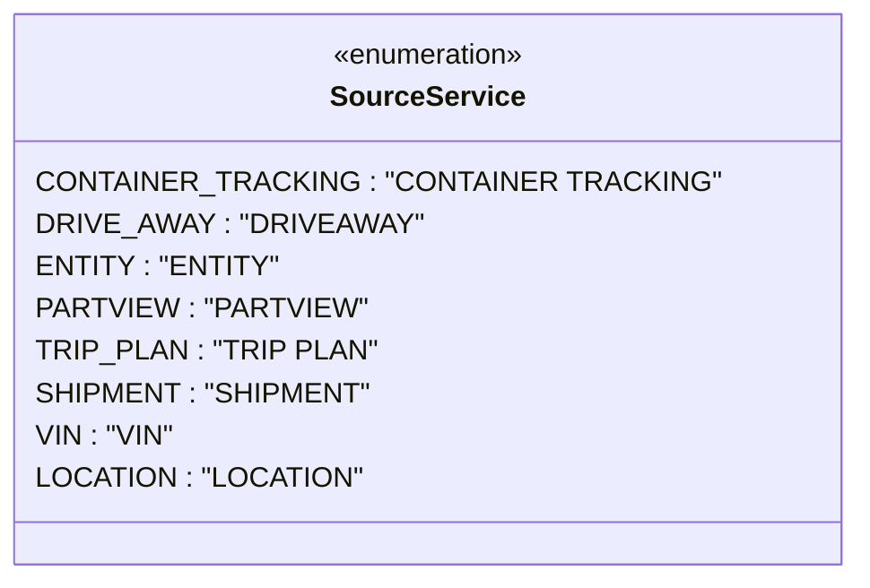

# Diagram: web/portal/src/modules/notifications/utils/const.ts

> Auto-generated by Obscura crawlers

## Mermaid

### SVG

<svg id="container" width="436.7578125" xmlns="http://www.w3.org/2000/svg" class="classDiagram" height="328" viewBox="0 0 436.7578125 328" role="graphics-document document" aria-roledescription="class"><g><defs><marker id="container_class-aggregationStart" class="marker aggregation class" refX="18" refY="7" markerWidth="190" markerHeight="240" orient="auto"><path d="M 18,7 L9,13 L1,7 L9,1 Z"></path></marker></defs><defs><marker id="container_class-aggregationEnd" class="marker aggregation class" refX="1" refY="7" markerWidth="20" markerHeight="28" orient="auto"><path d="M 18,7 L9,13 L1,7 L9,1 Z"></path></marker></defs><defs><marker id="container_class-extensionStart" class="marker extension class" refX="18" refY="7" markerWidth="190" markerHeight="240" orient="auto"><path d="M 1,7 L18,13 V 1 Z"></path></marker></defs><defs><marker id="container_class-extensionEnd" class="marker extension class" refX="1" refY="7" markerWidth="20" markerHeight="28" orient="auto"><path d="M 1,1 V 13 L18,7 Z"></path></marker></defs><defs><marker id="container_class-compositionStart" class="marker composition class" refX="18" refY="7" markerWidth="190" markerHeight="240" orient="auto"><path d="M 18,7 L9,13 L1,7 L9,1 Z"></path></marker></defs><defs><marker id="container_class-compositionEnd" class="marker composition class" refX="1" refY="7" markerWidth="20" markerHeight="28" orient="auto"><path d="M 18,7 L9,13 L1,7 L9,1 Z"></path></marker></defs><defs><marker id="container_class-dependencyStart" class="marker dependency class" refX="6" refY="7" markerWidth="190" markerHeight="240" orient="auto"><path d="M 5,7 L9,13 L1,7 L9,1 Z"></path></marker></defs><defs><marker id="container_class-dependencyEnd" class="marker dependency class" refX="13" refY="7" markerWidth="20" markerHeight="28" orient="auto"><path d="M 18,7 L9,13 L14,7 L9,1 Z"></path></marker></defs><defs><marker id="container_class-lollipopStart" class="marker lollipop class" refX="13" refY="7" markerWidth="190" markerHeight="240" orient="auto"><circle stroke="black" fill="transparent" cx="7" cy="7" r="6"></circle></marker></defs><defs><marker id="container_class-lollipopEnd" class="marker lollipop class" refX="1" refY="7" markerWidth="190" markerHeight="240" orient="auto"><circle stroke="black" fill="transparent" cx="7" cy="7" r="6"></circle></marker></defs><g class="root"><g class="clusters"></g><g class="edgePaths"></g><g class="edgeLabels"></g><g class="nodes"><g class="node default" id="classId-SourceService-0" transform="translate(218.37890625, 164)"><g class="basic label-container"><path d="M-210.37890625 -156 L210.37890625 -156 L210.37890625 156 L-210.37890625 156" stroke="none" stroke-width="0" fill="#ECECFF" style=""></path><path d="M-210.37890625 -156 C-123.59497750070317 -156, -36.81104875140633 -156, 210.37890625 -156 M-210.37890625 -156 C-45.208407799569216 -156, 119.96209065086157 -156, 210.37890625 -156 M210.37890625 -156 C210.37890625 -89.79299792453622, 210.37890625 -23.585995849072447, 210.37890625 156 M210.37890625 -156 C210.37890625 -90.3543484144801, 210.37890625 -24.7086968289602, 210.37890625 156 M210.37890625 156 C87.89450216918505 156, -34.58990191162991 156, -210.37890625 156 M210.37890625 156 C105.61533776500384 156, 0.8517692800076873 156, -210.37890625 156 M-210.37890625 156 C-210.37890625 42.02465606372216, -210.37890625 -71.95068787255568, -210.37890625 -156 M-210.37890625 156 C-210.37890625 78.51945026080881, -210.37890625 1.0389005216176201, -210.37890625 -156" stroke="#9370DB" stroke-width="1.3" fill="none" stroke-dasharray="0 0" style=""></path></g><g class="annotation-group text" transform="translate(-55.5546875, -132)"><g class="label" style="" transform="translate(0,-12)"><foreignObject width="111.109375" height="24">

«enumeration»

</foreignObject></g></g><g class="label-group text" transform="translate(-51.53125, -108)"><g class="label" style="font-weight: bolder" transform="translate(0,-12)"><foreignObject width="103.0625" height="24">

SourceService

</foreignObject></g></g><g class="members-group text" transform="translate(-198.37890625, -60)"><g class="label" style="" transform="translate(0,-12)"><foreignObject width="341.203125" height="24">

CONTAINER_TRACKING : "CONTAINER TRACKING"

</foreignObject></g><g class="label" style="" transform="translate(0,12)"><foreignObject width="197.03125" height="24">

DRIVE_AWAY : "DRIVEAWAY"

</foreignObject></g><g class="label" style="" transform="translate(0,36)"><foreignObject width="124.359375" height="24">

ENTITY : "ENTITY"

</foreignObject></g><g class="label" style="" transform="translate(0,60)"><foreignObject width="166.15625" height="24">

PARTVIEW : "PARTVIEW"

</foreignObject></g><g class="label" style="" transform="translate(0,84)"><foreignObject width="174.875" height="24">

TRIP_PLAN : "TRIP PLAN"

</foreignObject></g><g class="label" style="" transform="translate(0,108)"><foreignObject width="171.9375" height="24">

SHIPMENT : "SHIPMENT"

</foreignObject></g><g class="label" style="" transform="translate(0,132)"><foreignObject width="74.34375" height="24">

VIN : "VIN"

</foreignObject></g><g class="label" style="" transform="translate(0,156)"><foreignObject width="166.375" height="24">

LOCATION : "LOCATION"

</foreignObject></g></g><g class="methods-group text" transform="translate(-198.37890625, 156)"></g><g class="divider" style=""><path d="M-210.37890625 -84 C-101.0910806707318 -84, 8.196744908536402 -84, 210.37890625 -84 M-210.37890625 -84 C-102.87985091978129 -84, 4.619204410437419 -84, 210.37890625 -84" stroke="#9370DB" stroke-width="1.3" fill="none" stroke-dasharray="0 0" style=""></path></g><g class="divider" style=""><path d="M-210.37890625 132 C-111.12239581494336 132, -11.86588537988672 132, 210.37890625 132 M-210.37890625 132 C-83.9107658759167 132, 42.55737449816661 132, 210.37890625 132" stroke="#9370DB" stroke-width="1.3" fill="none" stroke-dasharray="0 0" style=""></path></g></g></g></g></g></svg>
