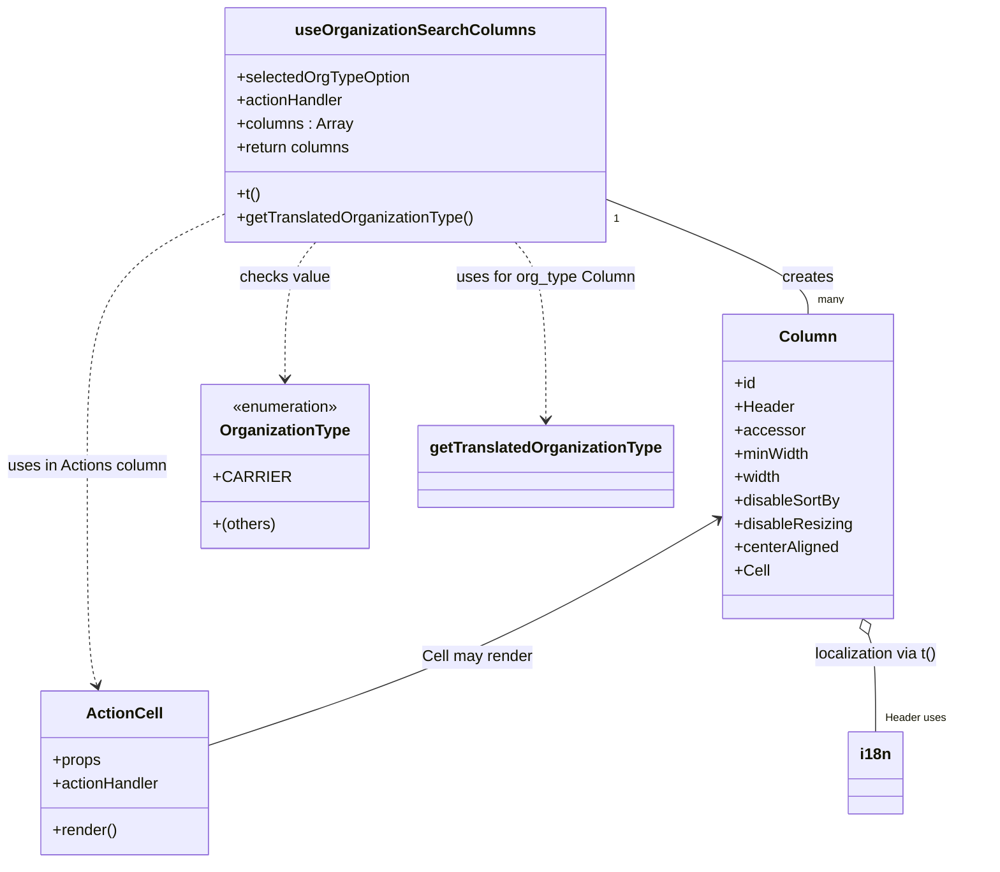

# Diagram: web/portal/src/modules/organizations/OrganizationSearch.columns.js


> Auto-generated by Obscura crawlers

## Diagram 1

```mermaid
flowchart TD
    UI[UI: Organization Search Page] -->|selectOrgType| useOrg[useOrganizationSearchColumns(selectedOrgTypeOption, actionHandler)]
    useOrg -->|calls| i18n[useTranslation("organizations")]
    useOrg -->|calls| orgTrans[useOrganizationsTranslation()]
    useOrg -->|reads| orgType{selectedOrgTypeOption?.value}
    orgType -->|equals CARRIER?| carrierCheck{OrganizationType.CARRIER}
    carrierCheck -- yes --> addSCAC[Add SCAC column]
    carrierCheck -- no --> skipSCAC[Skip SCAC]
    useOrg --> buildCols[Build columns array]
    buildCols --> colName[Name Column (org_name)]
    buildCols --> colType[Organization Type Column (org_type) -> getTranslatedOrganizationType]
    buildCols --> colFv[FV ID Column (fv_id)]
    buildCols --> colUsers[# of Users Column (no_of_user)]
    buildCols --> colLocations[# of Locations Column (no_of_location)]
    buildCols --> colActions[Actions Column -> renders ActionCell with actionHandler]
    colActions --> ActionCellComponent[ActionCell Component]
```

> SVG rendering failed for this diagram.

## Diagram 2



### SVG

<svg id="container" width="992.72265625" xmlns="http://www.w3.org/2000/svg" class="classDiagram" height="884" viewBox="0 0 992.72265625 884" role="graphics-document document" aria-roledescription="class"><style>#container{font-family:"trebuchet ms",verdana,arial,sans-serif;font-size:16px;fill:#333;}@keyframes edge-animation-frame{from{stroke-dashoffset:0;}}@keyframes dash{to{stroke-dashoffset:0;}}#container .edge-animation-slow{stroke-dasharray:9,5!important;stroke-dashoffset:900;animation:dash 50s linear infinite;stroke-linecap:round;}#container .edge-animation-fast{stroke-dasharray:9,5!important;stroke-dashoffset:900;animation:dash 20s linear infinite;stroke-linecap:round;}#container .error-icon{fill:#552222;}#container .error-text{fill:#552222;stroke:#552222;}#container .edge-thickness-normal{stroke-width:1px;}#container .edge-thickness-thick{stroke-width:3.5px;}#container .edge-pattern-solid{stroke-dasharray:0;}#container .edge-thickness-invisible{stroke-width:0;fill:none;}#container .edge-pattern-dashed{stroke-dasharray:3;}#container .edge-pattern-dotted{stroke-dasharray:2;}#container .marker{fill:#333333;stroke:#333333;}#container .marker.cross{stroke:#333333;}#container svg{font-family:"trebuchet ms",verdana,arial,sans-serif;font-size:16px;}#container p{margin:0;}#container g.classGroup text{fill:#9370DB;stroke:none;font-family:"trebuchet ms",verdana,arial,sans-serif;font-size:10px;}#container g.classGroup text .title{font-weight:bolder;}#container .nodeLabel,#container .edgeLabel{color:#131300;}#container .edgeLabel .label rect{fill:#ECECFF;}#container .label text{fill:#131300;}#container .labelBkg{background:#ECECFF;}#container .edgeLabel .label span{background:#ECECFF;}#container .classTitle{font-weight:bolder;}#container .node rect,#container .node circle,#container .node ellipse,#container .node polygon,#container .node path{fill:#ECECFF;stroke:#9370DB;stroke-width:1px;}#container .divider{stroke:#9370DB;stroke-width:1;}#container g.clickable{cursor:pointer;}#container g.classGroup rect{fill:#ECECFF;stroke:#9370DB;}#container g.classGroup line{stroke:#9370DB;stroke-width:1;}#container .classLabel .box{stroke:none;stroke-width:0;fill:#ECECFF;opacity:0.5;}#container .classLabel .label{fill:#9370DB;font-size:10px;}#container .relation{stroke:#333333;stroke-width:1;fill:none;}#container .dashed-line{stroke-dasharray:3;}#container .dotted-line{stroke-dasharray:1 2;}#container #compositionStart,#container .composition{fill:#333333!important;stroke:#333333!important;stroke-width:1;}#container #compositionEnd,#container .composition{fill:#333333!important;stroke:#333333!important;stroke-width:1;}#container #dependencyStart,#container .dependency{fill:#333333!important;stroke:#333333!important;stroke-width:1;}#container #dependencyStart,#container .dependency{fill:#333333!important;stroke:#333333!important;stroke-width:1;}#container #extensionStart,#container .extension{fill:transparent!important;stroke:#333333!important;stroke-width:1;}#container #extensionEnd,#container .extension{fill:transparent!important;stroke:#333333!important;stroke-width:1;}#container #aggregationStart,#container .aggregation{fill:transparent!important;stroke:#333333!important;stroke-width:1;}#container #aggregationEnd,#container .aggregation{fill:transparent!important;stroke:#333333!important;stroke-width:1;}#container #lollipopStart,#container .lollipop{fill:#ECECFF!important;stroke:#333333!important;stroke-width:1;}#container #lollipopEnd,#container .lollipop{fill:#ECECFF!important;stroke:#333333!important;stroke-width:1;}#container .edgeTerminals{font-size:11px;line-height:initial;}#container .classTitleText{text-anchor:middle;font-size:18px;fill:#333;}#container .label-icon{display:inline-block;height:1em;overflow:visible;vertical-align:-0.125em;}#container .node .label-icon path{fill:currentColor;stroke:revert;stroke-width:revert;}#container :root{--mermaid-font-family:"trebuchet ms",verdana,arial,sans-serif;}</style><g><defs><marker id="container_class-aggregationStart" class="marker aggregation class" refX="18" refY="7" markerWidth="190" markerHeight="240" orient="auto"><path d="M 18,7 L9,13 L1,7 L9,1 Z"></path></marker></defs><defs><marker id="container_class-aggregationEnd" class="marker aggregation class" refX="1" refY="7" markerWidth="20" markerHeight="28" orient="auto"><path d="M 18,7 L9,13 L1,7 L9,1 Z"></path></marker></defs><defs><marker id="container_class-extensionStart" class="marker extension class" refX="18" refY="7" markerWidth="190" markerHeight="240" orient="auto"><path d="M 1,7 L18,13 V 1 Z"></path></marker></defs><defs><marker id="container_class-extensionEnd" class="marker extension class" refX="1" refY="7" markerWidth="20" markerHeight="28" orient="auto"><path d="M 1,1 V 13 L18,7 Z"></path></marker></defs><defs><marker id="container_class-compositionStart" class="marker composition class" refX="18" refY="7" markerWidth="190" markerHeight="240" orient="auto"><path d="M 18,7 L9,13 L1,7 L9,1 Z"></path></marker></defs><defs><marker id="container_class-compositionEnd" class="marker composition class" refX="1" refY="7" markerWidth="20" markerHeight="28" orient="auto"><path d="M 18,7 L9,13 L1,7 L9,1 Z"></path></marker></defs><defs><marker id="container_class-dependencyStart" class="marker dependency class" refX="6" refY="7" markerWidth="190" markerHeight="240" orient="auto"><path d="M 5,7 L9,13 L1,7 L9,1 Z"></path></marker></defs><defs><marker id="container_class-dependencyEnd" class="marker dependency class" refX="13" refY="7" markerWidth="20" markerHeight="28" orient="auto"><path d="M 18,7 L9,13 L14,7 L9,1 Z"></path></marker></defs><defs><marker id="container_class-lollipopStart" class="marker lollipop class" refX="13" refY="7" markerWidth="190" markerHeight="240" orient="auto"><circle stroke="black" fill="transparent" cx="7" cy="7" r="6"></circle></marker></defs><defs><marker id="container_class-lollipopEnd" class="marker lollipop class" refX="1" refY="7" markerWidth="190" markerHeight="240" orient="auto"><circle stroke="black" fill="transparent" cx="7" cy="7" r="6"></circle></marker></defs><g class="root"><g class="clusters"></g><g class="edgePaths"><path d="M606.445,205.019L639.537,218.349C672.629,231.679,738.813,258.34,771.904,277.836C804.996,297.333,804.996,309.667,804.996,315.833L804.996,322" id="id_useOrganizationSearchColumns_Column_1" class="edge-thickness-normal edge-pattern-solid relation" style=";;;" data-edge="true" data-et="edge" data-id="id_useOrganizationSearchColumns_Column_1" data-points="W3sieCI6NjA2LjQ0NTMxMjUsInkiOjIwNS4wMTg1MTE2NTEyMTUyNX0seyJ4Ijo4MDQuOTk2MDkzNzUsInkiOjI4NX0seyJ4Ijo4MDQuOTk2MDkzNzUsInkiOjMyMn1d"></path><path d="M714.009,533.143L676.098,556.119C638.187,579.095,562.364,625.048,479.308,663.332C396.251,701.616,305.962,732.233,260.817,747.541L215.672,762.849" id="id_Column_ActionCell_2" class="edge-thickness-normal edge-pattern-solid relation" style=";;;" data-edge="true" data-et="edge" data-id="id_Column_ActionCell_2" data-points="W3sieCI6NzE5LjE0MDYyNSwieSI6NTMwLjAzMjc4NzY4OTU5MDJ9LHsieCI6NDg2LjU0MTAxNTYyNSwieSI6NjcxfSx7IngiOjIxNS42NzE4NzUsInkiOjc2Mi44NDg4OTUxODk0MDc4fV0=" marker-start="url(#container_class-dependencyStart)"></path><path d="M317.893,248L312.89,254.167C307.887,260.333,297.881,272.667,292.878,296C287.875,319.333,287.875,353.667,287.875,370.833L287.875,388" id="id_useOrganizationSearchColumns_OrganizationType_3" class="edge-thickness-normal edge-pattern-dashed relation" style=";;;" data-edge="true" data-et="edge" data-id="id_useOrganizationSearchColumns_OrganizationType_3" data-points="W3sieCI6MzE3Ljg5MzMxMjEwMTkxMDg1LCJ5IjoyNDh9LHsieCI6Mjg3Ljg3NSwieSI6Mjg1fSx7IngiOjI4Ny44NzUsInkiOjM5NH1d" marker-end="url(#container_class-dependencyEnd)"></path><path d="M224.055,220.667L201.932,231.389C179.81,242.111,135.565,263.556,113.443,306.445C91.32,349.333,91.32,413.667,91.32,478C91.32,542.333,91.32,606.667,92.974,644.047C94.628,681.427,97.935,691.854,99.589,697.067L101.243,702.281" id="id_useOrganizationSearchColumns_ActionCell_4" class="edge-thickness-normal edge-pattern-dashed relation" style=";;;" data-edge="true" data-et="edge" data-id="id_useOrganizationSearchColumns_ActionCell_4" data-points="W3sieCI6MjI0LjA1NDY4NzUsInkiOjIyMC42NjcyMjEzNzgwOTYxNH0seyJ4Ijo5MS4zMjAzMTI1LCJ5IjoyODV9LHsieCI6OTEuMzIwMzEyNSwieSI6NDc4fSx7IngiOjkxLjMyMDMxMjUsInkiOjY3MX0seyJ4IjoxMDMuMDU3MjA1NTc4NTEyNCwieSI6NzA4fV0=" marker-end="url(#container_class-dependencyEnd)"></path><path d="M868.099,650.197L869.37,653.664C870.64,657.131,873.181,664.066,874.452,680.699C875.723,697.333,875.723,723.667,875.723,736.833L875.723,750" id="id_Column_i18n_5" class="edge-thickness-normal edge-pattern-solid relation" style=";;;" data-edge="true" data-et="edge" data-id="id_Column_i18n_5" data-points="W3sieCI6ODYyLjE2MzY3Nzk0Njg5MTIsInkiOjYzNH0seyJ4Ijo4NzUuNzIyNjU2MjUsInkiOjY3MX0seyJ4Ijo4NzUuNzIyNjU2MjUsInkiOjc1MH1d" marker-start="url(#container_class-aggregationStart)"></path><path d="M512.607,248L517.61,254.167C522.613,260.333,532.619,272.667,537.622,303C542.625,333.333,542.625,381.667,542.625,405.833L542.625,430" id="id_useOrganizationSearchColumns_getTranslatedOrganizationType_6" class="edge-thickness-normal edge-pattern-dashed relation" style=";;;" data-edge="true" data-et="edge" data-id="id_useOrganizationSearchColumns_getTranslatedOrganizationType_6" data-points="W3sieCI6NTEyLjYwNjY4Nzg5ODA4OTEsInkiOjI0OH0seyJ4Ijo1NDIuNjI1LCJ5IjoyODV9LHsieCI6NTQyLjYyNSwieSI6NDM2fV0=" marker-end="url(#container_class-dependencyEnd)"></path></g><g class="edgeLabels"><g class="edgeLabel" transform="translate(804.99609375, 285)"><g class="label" data-id="id_useOrganizationSearchColumns_Column_1" transform="translate(-26.171875, -12)"><foreignObject width="52.34375" height="24"><div xmlns="http://www.w3.org/1999/xhtml" class="labelBkg" style="display: table-cell; white-space: nowrap; line-height: 1.5; max-width: 200px; text-align: center;"><span class="edgeLabel"><p>creates</p></span></div></foreignObject></g></g><g class="edgeLabel" transform="translate(479.89482, 673.25366)"><g class="label" data-id="id_Column_ActionCell_2" transform="translate(-56.765625, -12)"><foreignObject width="113.53125" height="24"><div xmlns="http://www.w3.org/1999/xhtml" class="labelBkg" style="display: table-cell; white-space: nowrap; line-height: 1.5; max-width: 200px; text-align: center;"><span class="edgeLabel"><p>Cell may render</p></span></div></foreignObject></g></g><g class="edgeLabel" transform="translate(287.875, 285)"><g class="label" data-id="id_useOrganizationSearchColumns_OrganizationType_3" transform="translate(-46.0546875, -12)"><foreignObject width="92.109375" height="24"><div xmlns="http://www.w3.org/1999/xhtml" class="labelBkg" style="display: table-cell; white-space: nowrap; line-height: 1.5; max-width: 200px; text-align: center;"><span class="edgeLabel"><p>checks value</p></span></div></foreignObject></g></g><g class="edgeLabel" transform="translate(91.3203125, 478)"><g class="label" data-id="id_useOrganizationSearchColumns_ActionCell_4" transform="translate(-83.3203125, -12)"><foreignObject width="166.640625" height="24"><div xmlns="http://www.w3.org/1999/xhtml" class="labelBkg" style="display: table-cell; white-space: nowrap; line-height: 1.5; max-width: 200px; text-align: center;"><span class="edgeLabel"><p>uses in Actions column</p></span></div></foreignObject></g></g><g class="edgeLabel" transform="translate(875.72265625, 671)"><g class="label" data-id="id_Column_i18n_5" transform="translate(-64.6875, -12)"><foreignObject width="129.375" height="24"><div xmlns="http://www.w3.org/1999/xhtml" class="labelBkg" style="display: table-cell; white-space: nowrap; line-height: 1.5; max-width: 200px; text-align: center;"><span class="edgeLabel"><p>localization via t()</p></span></div></foreignObject></g></g><g class="edgeLabel" transform="translate(542.625, 285)"><g class="label" data-id="id_useOrganizationSearchColumns_getTranslatedOrganizationType_6" transform="translate(-92.4765625, -12)"><foreignObject width="184.953125" height="24"><div xmlns="http://www.w3.org/1999/xhtml" class="labelBkg" style="display: table-cell; white-space: nowrap; line-height: 1.5; max-width: 200px; text-align: center;"><span class="edgeLabel"><p>uses for org_type Column</p></span></div></foreignObject></g></g><g class="edgeTerminals" transform="translate(617.0730413726235, 225.47092943333246)"><g class="inner" transform="translate(0, 0)"><foreignObject style="width: 9px; height: 12px;"><div xmlns="http://www.w3.org/1999/xhtml" style="display: inline-block; padding-right: 1px; white-space: nowrap;"><span class="edgeLabel">1</span></div></foreignObject></g></g><g class="edgeTerminals" transform="translate(885.7226581249998, 727.5000016071428)"><g class="inner" transform="translate(0, 0)"></g><foreignObject style="width: 99px; height: 12px;"><div xmlns="http://www.w3.org/1999/xhtml" style="display: inline-block; padding-right: 1px; white-space: nowrap;"><span class="edgeLabel">Header uses</span></div></foreignObject></g><g class="edgeTerminals" transform="translate(814.9960918749999, 299.49999839285715)"><g class="inner" transform="translate(0, 0)"></g><foreignObject style="width: 36px; height: 12px;"><div xmlns="http://www.w3.org/1999/xhtml" style="display: inline-block; padding-right: 1px; white-space: nowrap;"><span class="edgeLabel">many</span></div></foreignObject></g></g><g class="nodes"><g class="node default" id="classId-useOrganizationSearchColumns-0" transform="translate(415.25, 128)"><g class="basic label-container"><path d="M-191.1953125 -120 L191.1953125 -120 L191.1953125 120 L-191.1953125 120" stroke="none" stroke-width="0" fill="#ECECFF" style=""></path><path d="M-191.1953125 -120 C-62.81896943563581 -120, 65.55737362872839 -120, 191.1953125 -120 M-191.1953125 -120 C-98.1709619212785 -120, -5.146611342557009 -120, 191.1953125 -120 M191.1953125 -120 C191.1953125 -27.80606585233687, 191.1953125 64.38786829532626, 191.1953125 120 M191.1953125 -120 C191.1953125 -58.88440963663692, 191.1953125 2.2311807267261656, 191.1953125 120 M191.1953125 120 C92.5319599449095 120, -6.1313926101809955 120, -191.1953125 120 M191.1953125 120 C93.96415965328984 120, -3.266993193420319 120, -191.1953125 120 M-191.1953125 120 C-191.1953125 52.89718958174244, -191.1953125 -14.205620836515124, -191.1953125 -120 M-191.1953125 120 C-191.1953125 43.743759393570215, -191.1953125 -32.51248121285957, -191.1953125 -120" stroke="#9370DB" stroke-width="1.3" fill="none" stroke-dasharray="0 0" style=""></path></g><g class="annotation-group text" transform="translate(0, -96)"></g><g class="label-group text" transform="translate(-115.5625, -96)"><g class="label" style="font-weight: bolder" transform="translate(0,-12)"><foreignObject width="231.125" height="24"><div xmlns="http://www.w3.org/1999/xhtml" style="display: table-cell; white-space: nowrap; line-height: 1.5; max-width: 279px; text-align: center;"><span class="nodeLabel markdown-node-label" style=""><p>useOrganizationSearchColumns</p></span></div></foreignObject></g></g><g class="members-group text" transform="translate(-179.1953125, -48)"><g class="label" style="" transform="translate(0,-12)"><foreignObject width="177.625" height="24"><div xmlns="http://www.w3.org/1999/xhtml" style="display: table-cell; white-space: nowrap; line-height: 1.5; max-width: 235px; text-align: center;"><span class="nodeLabel markdown-node-label" style=""><p>+selectedOrgTypeOption</p></span></div></foreignObject></g><g class="label" style="" transform="translate(0,12)"><foreignObject width="111.140625" height="24"><div xmlns="http://www.w3.org/1999/xhtml" style="display: table-cell; white-space: nowrap; line-height: 1.5; max-width: 169px; text-align: center;"><span class="nodeLabel markdown-node-label" style=""><p>+actionHandler</p></span></div></foreignObject></g><g class="label" style="" transform="translate(0,36)"><foreignObject width="118.84375" height="24"><div xmlns="http://www.w3.org/1999/xhtml" style="display: table-cell; white-space: nowrap; line-height: 1.5; max-width: 176px; text-align: center;"><span class="nodeLabel markdown-node-label" style=""><p>+columns : Array</p></span></div></foreignObject></g><g class="label" style="" transform="translate(0,60)"><foreignObject width="118.515625" height="24"><div xmlns="http://www.w3.org/1999/xhtml" style="display: table-cell; white-space: nowrap; line-height: 1.5; max-width: 176px; text-align: center;"><span class="nodeLabel markdown-node-label" style=""><p>+return columns</p></span></div></foreignObject></g></g><g class="methods-group text" transform="translate(-179.1953125, 72)"><g class="label" style="" transform="translate(0,-12)"><foreignObject width="24.0625" height="24"><div xmlns="http://www.w3.org/1999/xhtml" style="display: table-cell; white-space: nowrap; line-height: 1.5; max-width: 81px; text-align: center;"><span class="nodeLabel markdown-node-label" style=""><p>+t()</p></span></div></foreignObject></g><g class="label" style="" transform="translate(0,12)"><foreignObject width="242.828125" height="24"><div xmlns="http://www.w3.org/1999/xhtml" style="display: table-cell; white-space: nowrap; line-height: 1.5; max-width: 300px; text-align: center;"><span class="nodeLabel markdown-node-label" style=""><p>+getTranslatedOrganizationType()</p></span></div></foreignObject></g></g><g class="divider" style=""><path d="M-191.1953125 -72 C-93.61135911307454 -72, 3.972594273850916 -72, 191.1953125 -72 M-191.1953125 -72 C-113.61737988820275 -72, -36.0394472764055 -72, 191.1953125 -72" stroke="#9370DB" stroke-width="1.3" fill="none" stroke-dasharray="0 0" style=""></path></g><g class="divider" style=""><path d="M-191.1953125 48 C-69.5440417885629 48, 52.107228922874214 48, 191.1953125 48 M-191.1953125 48 C-95.29141270153836 48, 0.6124870969232745 48, 191.1953125 48" stroke="#9370DB" stroke-width="1.3" fill="none" stroke-dasharray="0 0" style=""></path></g></g><g class="node default" id="classId-Column-1" transform="translate(804.99609375, 478)"><g class="basic label-container"><path d="M-85.85546875 -156 L85.85546875 -156 L85.85546875 156 L-85.85546875 156" stroke="none" stroke-width="0" fill="#ECECFF" style=""></path><path d="M-85.85546875 -156 C-17.84856326957008 -156, 50.15834221085984 -156, 85.85546875 -156 M-85.85546875 -156 C-17.46361546390621 -156, 50.92823782218758 -156, 85.85546875 -156 M85.85546875 -156 C85.85546875 -42.697541761901675, 85.85546875 70.60491647619665, 85.85546875 156 M85.85546875 -156 C85.85546875 -74.24128586773814, 85.85546875 7.517428264523716, 85.85546875 156 M85.85546875 156 C42.351096286671016 156, -1.1532761766579682 156, -85.85546875 156 M85.85546875 156 C19.298139873553595 156, -47.25918900289281 156, -85.85546875 156 M-85.85546875 156 C-85.85546875 64.73363149062938, -85.85546875 -26.532737018741244, -85.85546875 -156 M-85.85546875 156 C-85.85546875 40.2463296458853, -85.85546875 -75.5073407082294, -85.85546875 -156" stroke="#9370DB" stroke-width="1.3" fill="none" stroke-dasharray="0 0" style=""></path></g><g class="annotation-group text" transform="translate(0, -132)"></g><g class="label-group text" transform="translate(-27.4453125, -132)"><g class="label" style="font-weight: bolder" transform="translate(0,-12)"><foreignObject width="54.890625" height="24"><div xmlns="http://www.w3.org/1999/xhtml" style="display: table-cell; white-space: nowrap; line-height: 1.5; max-width: 105px; text-align: center;"><span class="nodeLabel markdown-node-label" style=""><p>Column</p></span></div></foreignObject></g></g><g class="members-group text" transform="translate(-73.85546875, -84)"><g class="label" style="" transform="translate(0,-12)"><foreignObject width="22.078125" height="24"><div xmlns="http://www.w3.org/1999/xhtml" style="display: table-cell; white-space: nowrap; line-height: 1.5; max-width: 79px; text-align: center;"><span class="nodeLabel markdown-node-label" style=""><p>+id</p></span></div></foreignObject></g><g class="label" style="" transform="translate(0,12)"><foreignObject width="60.59375" height="24"><div xmlns="http://www.w3.org/1999/xhtml" style="display: table-cell; white-space: nowrap; line-height: 1.5; max-width: 119px; text-align: center;"><span class="nodeLabel markdown-node-label" style=""><p>+Header</p></span></div></foreignObject></g><g class="label" style="" transform="translate(0,36)"><foreignObject width="70.140625" height="24"><div xmlns="http://www.w3.org/1999/xhtml" style="display: table-cell; white-space: nowrap; line-height: 1.5; max-width: 128px; text-align: center;"><span class="nodeLabel markdown-node-label" style=""><p>+accessor</p></span></div></foreignObject></g><g class="label" style="" transform="translate(0,60)"><foreignObject width="78.046875" height="24"><div xmlns="http://www.w3.org/1999/xhtml" style="display: table-cell; white-space: nowrap; line-height: 1.5; max-width: 135px; text-align: center;"><span class="nodeLabel markdown-node-label" style=""><p>+minWidth</p></span></div></foreignObject></g><g class="label" style="" transform="translate(0,84)"><foreignObject width="48.703125" height="24"><div xmlns="http://www.w3.org/1999/xhtml" style="display: table-cell; white-space: nowrap; line-height: 1.5; max-width: 106px; text-align: center;"><span class="nodeLabel markdown-node-label" style=""><p>+width</p></span></div></foreignObject></g><g class="label" style="" transform="translate(0,108)"><foreignObject width="108.53125" height="24"><div xmlns="http://www.w3.org/1999/xhtml" style="display: table-cell; white-space: nowrap; line-height: 1.5; max-width: 166px; text-align: center;"><span class="nodeLabel markdown-node-label" style=""><p>+disableSortBy</p></span></div></foreignObject></g><g class="label" style="" transform="translate(0,132)"><foreignObject width="120.265625" height="24"><div xmlns="http://www.w3.org/1999/xhtml" style="display: table-cell; white-space: nowrap; line-height: 1.5; max-width: 178px; text-align: center;"><span class="nodeLabel markdown-node-label" style=""><p>+disableResizing</p></span></div></foreignObject></g><g class="label" style="" transform="translate(0,156)"><foreignObject width="108.203125" height="24"><div xmlns="http://www.w3.org/1999/xhtml" style="display: table-cell; white-space: nowrap; line-height: 1.5; max-width: 166px; text-align: center;"><span class="nodeLabel markdown-node-label" style=""><p>+centerAligned</p></span></div></foreignObject></g><g class="label" style="" transform="translate(0,180)"><foreignObject width="34.734375" height="24"><div xmlns="http://www.w3.org/1999/xhtml" style="display: table-cell; white-space: nowrap; line-height: 1.5; max-width: 92px; text-align: center;"><span class="nodeLabel markdown-node-label" style=""><p>+Cell</p></span></div></foreignObject></g></g><g class="methods-group text" transform="translate(-73.85546875, 156)"></g><g class="divider" style=""><path d="M-85.85546875 -108 C-28.023271107513615 -108, 29.80892653497277 -108, 85.85546875 -108 M-85.85546875 -108 C-38.46817600801784 -108, 8.919116733964316 -108, 85.85546875 -108" stroke="#9370DB" stroke-width="1.3" fill="none" stroke-dasharray="0 0" style=""></path></g><g class="divider" style=""><path d="M-85.85546875 132 C-40.55592841886811 132, 4.743611912263773 132, 85.85546875 132 M-85.85546875 132 C-17.993703532937445 132, 49.86806168412511 132, 85.85546875 132" stroke="#9370DB" stroke-width="1.3" fill="none" stroke-dasharray="0 0" style=""></path></g></g><g class="node default" id="classId-ActionCell-2" transform="translate(129.703125, 792)"><g class="basic label-container"><path d="M-85.96875 -84 L85.96875 -84 L85.96875 84 L-85.96875 84" stroke="none" stroke-width="0" fill="#ECECFF" style=""></path><path d="M-85.96875 -84 C-32.36736373751932 -84, 21.23402252496136 -84, 85.96875 -84 M-85.96875 -84 C-40.49664524871843 -84, 4.97545950256314 -84, 85.96875 -84 M85.96875 -84 C85.96875 -45.94557094563574, 85.96875 -7.891141891271474, 85.96875 84 M85.96875 -84 C85.96875 -18.636724503529592, 85.96875 46.726550992940815, 85.96875 84 M85.96875 84 C40.30843648534921 84, -5.351877029301576 84, -85.96875 84 M85.96875 84 C46.7321545825288 84, 7.4955591650576 84, -85.96875 84 M-85.96875 84 C-85.96875 38.52794678852525, -85.96875 -6.944106422949503, -85.96875 -84 M-85.96875 84 C-85.96875 30.030624096261235, -85.96875 -23.93875180747753, -85.96875 -84" stroke="#9370DB" stroke-width="1.3" fill="none" stroke-dasharray="0 0" style=""></path></g><g class="annotation-group text" transform="translate(0, -60)"></g><g class="label-group text" transform="translate(-36.796875, -60)"><g class="label" style="font-weight: bolder" transform="translate(0,-12)"><foreignObject width="73.59375" height="24"><div xmlns="http://www.w3.org/1999/xhtml" style="display: table-cell; white-space: nowrap; line-height: 1.5; max-width: 123px; text-align: center;"><span class="nodeLabel markdown-node-label" style=""><p>ActionCell</p></span></div></foreignObject></g></g><g class="members-group text" transform="translate(-73.96875, -12)"><g class="label" style="" transform="translate(0,-12)"><foreignObject width="49.515625" height="24"><div xmlns="http://www.w3.org/1999/xhtml" style="display: table-cell; white-space: nowrap; line-height: 1.5; max-width: 107px; text-align: center;"><span class="nodeLabel markdown-node-label" style=""><p>+props</p></span></div></foreignObject></g><g class="label" style="" transform="translate(0,12)"><foreignObject width="111.140625" height="24"><div xmlns="http://www.w3.org/1999/xhtml" style="display: table-cell; white-space: nowrap; line-height: 1.5; max-width: 169px; text-align: center;"><span class="nodeLabel markdown-node-label" style=""><p>+actionHandler</p></span></div></foreignObject></g></g><g class="methods-group text" transform="translate(-73.96875, 60)"><g class="label" style="" transform="translate(0,-12)"><foreignObject width="66.609375" height="24"><div xmlns="http://www.w3.org/1999/xhtml" style="display: table-cell; white-space: nowrap; line-height: 1.5; max-width: 124px; text-align: center;"><span class="nodeLabel markdown-node-label" style=""><p>+render()</p></span></div></foreignObject></g></g><g class="divider" style=""><path d="M-85.96875 -36 C-21.42273529090768 -36, 43.12327941818464 -36, 85.96875 -36 M-85.96875 -36 C-42.092519979036084 -36, 1.783710041927833 -36, 85.96875 -36" stroke="#9370DB" stroke-width="1.3" fill="none" stroke-dasharray="0 0" style=""></path></g><g class="divider" style=""><path d="M-85.96875 36 C-41.147123167660425 36, 3.6745036646791505 36, 85.96875 36 M-85.96875 36 C-30.264645309742846 36, 25.439459380514307 36, 85.96875 36" stroke="#9370DB" stroke-width="1.3" fill="none" stroke-dasharray="0 0" style=""></path></g></g><g class="node default" id="classId-OrganizationType-3" transform="translate(287.875, 478)"><g class="basic label-container"><path d="M-78.234375 -84 L78.234375 -84 L78.234375 84 L-78.234375 84" stroke="none" stroke-width="0" fill="#ECECFF" style=""></path><path d="M-78.234375 -84 C-25.448528051011657 -84, 27.337318897976687 -84, 78.234375 -84 M-78.234375 -84 C-21.253004645535235 -84, 35.72836570892953 -84, 78.234375 -84 M78.234375 -84 C78.234375 -30.74617794647196, 78.234375 22.50764410705608, 78.234375 84 M78.234375 -84 C78.234375 -43.16381159944222, 78.234375 -2.3276231988844387, 78.234375 84 M78.234375 84 C34.59628540191703 84, -9.041804196165941 84, -78.234375 84 M78.234375 84 C44.9185962806664 84, 11.602817561332799 84, -78.234375 84 M-78.234375 84 C-78.234375 24.840791823657966, -78.234375 -34.31841635268407, -78.234375 -84 M-78.234375 84 C-78.234375 41.907206066177, -78.234375 -0.18558786764600654, -78.234375 -84" stroke="#9370DB" stroke-width="1.3" fill="none" stroke-dasharray="0 0" style=""></path></g><g class="annotation-group text" transform="translate(-55.5546875, -60)"><g class="label" style="" transform="translate(0,-12)"><foreignObject width="111.109375" height="24"><div xmlns="http://www.w3.org/1999/xhtml" style="display: table-cell; white-space: nowrap; line-height: 1.5; max-width: 161px; text-align: center;"><span class="nodeLabel markdown-node-label" style=""><p>«enumeration»</p></span></div></foreignObject></g></g><g class="label-group text" transform="translate(-64.03125, -36)"><g class="label" style="font-weight: bolder" transform="translate(0,-12)"><foreignObject width="128.0625" height="24"><div xmlns="http://www.w3.org/1999/xhtml" style="display: table-cell; white-space: nowrap; line-height: 1.5; max-width: 176px; text-align: center;"><span class="nodeLabel markdown-node-label" style=""><p>OrganizationType</p></span></div></foreignObject></g></g><g class="members-group text" transform="translate(-66.234375, 12)"><g class="label" style="" transform="translate(0,-12)"><foreignObject width="68.4375" height="24"><div xmlns="http://www.w3.org/1999/xhtml" style="display: table-cell; white-space: nowrap; line-height: 1.5; max-width: 126px; text-align: center;"><span class="nodeLabel markdown-node-label" style=""><p>+CARRIER</p></span></div></foreignObject></g></g><g class="methods-group text" transform="translate(-66.234375, 60)"><g class="label" style="" transform="translate(0,-12)"><foreignObject width="64.984375" height="24"><div xmlns="http://www.w3.org/1999/xhtml" style="display: table-cell; white-space: nowrap; line-height: 1.5; max-width: 115px; text-align: center;"><span class="nodeLabel markdown-node-label" style=""><p>+(others)</p></span></div></foreignObject></g></g><g class="divider" style=""><path d="M-78.234375 -12 C-20.492263138693666 -12, 37.24984872261267 -12, 78.234375 -12 M-78.234375 -12 C-33.138937965793545 -12, 11.95649906841291 -12, 78.234375 -12" stroke="#9370DB" stroke-width="1.3" fill="none" stroke-dasharray="0 0" style=""></path></g><g class="divider" style=""><path d="M-78.234375 36 C-16.77312171661586 36, 44.68813156676828 36, 78.234375 36 M-78.234375 36 C-22.879187774525604 36, 32.47599945094879 36, 78.234375 36" stroke="#9370DB" stroke-width="1.3" fill="none" stroke-dasharray="0 0" style=""></path></g></g><g class="node default" id="classId-i18n-4" transform="translate(875.72265625, 792)"><g class="basic label-container"><path d="M-27.234375 -42 L27.234375 -42 L27.234375 42 L-27.234375 42" stroke="none" stroke-width="0" fill="#ECECFF" style=""></path><path d="M-27.234375 -42 C-9.36857947860031 -42, 8.49721604279938 -42, 27.234375 -42 M-27.234375 -42 C-6.834741075822041 -42, 13.564892848355917 -42, 27.234375 -42 M27.234375 -42 C27.234375 -14.090106684360595, 27.234375 13.81978663127881, 27.234375 42 M27.234375 -42 C27.234375 -21.4093167408065, 27.234375 -0.8186334816129985, 27.234375 42 M27.234375 42 C8.980176740170524 42, -9.274021519658952 42, -27.234375 42 M27.234375 42 C9.227018685458226 42, -8.780337629083547 42, -27.234375 42 M-27.234375 42 C-27.234375 25.080728130517578, -27.234375 8.161456261035156, -27.234375 -42 M-27.234375 42 C-27.234375 17.817099215042738, -27.234375 -6.365801569914524, -27.234375 -42" stroke="#9370DB" stroke-width="1.3" fill="none" stroke-dasharray="0 0" style=""></path></g><g class="annotation-group text" transform="translate(0, -18)"></g><g class="label-group text" transform="translate(-15.234375, -18)"><g class="label" style="font-weight: bolder" transform="translate(0,-12)"><foreignObject width="30.46875" height="24"><div xmlns="http://www.w3.org/1999/xhtml" style="display: table-cell; white-space: nowrap; line-height: 1.5; max-width: 80px; text-align: center;"><span class="nodeLabel markdown-node-label" style=""><p>i18n</p></span></div></foreignObject></g></g><g class="members-group text" transform="translate(-15.234375, 30)"></g><g class="methods-group text" transform="translate(-15.234375, 60)"></g><g class="divider" style=""><path d="M-27.234375 6 C-15.800805981549278 6, -4.367236963098556 6, 27.234375 6 M-27.234375 6 C-8.660988214753932 6, 9.912398570492137 6, 27.234375 6" stroke="#9370DB" stroke-width="1.3" fill="none" stroke-dasharray="0 0" style=""></path></g><g class="divider" style=""><path d="M-27.234375 24 C-5.84291679304112 24, 15.54854141391776 24, 27.234375 24 M-27.234375 24 C-9.001491829272688 24, 9.231391341454625 24, 27.234375 24" stroke="#9370DB" stroke-width="1.3" fill="none" stroke-dasharray="0 0" style=""></path></g></g><g class="node default" id="classId-getTranslatedOrganizationType-5" transform="translate(542.625, 478)"><g class="basic label-container"><path d="M-126.515625 -42 L126.515625 -42 L126.515625 42 L-126.515625 42" stroke="none" stroke-width="0" fill="#ECECFF" style=""></path><path d="M-126.515625 -42 C-35.226067043181786 -42, 56.06349091363643 -42, 126.515625 -42 M-126.515625 -42 C-27.565235984451718 -42, 71.38515303109656 -42, 126.515625 -42 M126.515625 -42 C126.515625 -18.129841434198745, 126.515625 5.7403171316025094, 126.515625 42 M126.515625 -42 C126.515625 -18.090127680415854, 126.515625 5.819744639168292, 126.515625 42 M126.515625 42 C63.54591881880556 42, 0.5762126376111212 42, -126.515625 42 M126.515625 42 C42.233648815519416 42, -42.04832736896117 42, -126.515625 42 M-126.515625 42 C-126.515625 18.37143560482813, -126.515625 -5.257128790343742, -126.515625 -42 M-126.515625 42 C-126.515625 14.56088549906151, -126.515625 -12.878229001876981, -126.515625 -42" stroke="#9370DB" stroke-width="1.3" fill="none" stroke-dasharray="0 0" style=""></path></g><g class="annotation-group text" transform="translate(0, -18)"></g><g class="label-group text" transform="translate(-114.515625, -18)"><g class="label" style="font-weight: bolder" transform="translate(0,-12)"><foreignObject width="229.03125" height="24"><div xmlns="http://www.w3.org/1999/xhtml" style="display: table-cell; white-space: nowrap; line-height: 1.5; max-width: 274px; text-align: center;"><span class="nodeLabel markdown-node-label" style=""><p>getTranslatedOrganizationType</p></span></div></foreignObject></g></g><g class="members-group text" transform="translate(-114.515625, 30)"></g><g class="methods-group text" transform="translate(-114.515625, 60)"></g><g class="divider" style=""><path d="M-126.515625 6 C-27.946315223671718 6, 70.62299455265656 6, 126.515625 6 M-126.515625 6 C-38.873189337561385 6, 48.76924632487723 6, 126.515625 6" stroke="#9370DB" stroke-width="1.3" fill="none" stroke-dasharray="0 0" style=""></path></g><g class="divider" style=""><path d="M-126.515625 24 C-63.02761792186192 24, 0.4603891562761646 24, 126.515625 24 M-126.515625 24 C-45.61020488676046 24, 35.29521522647909 24, 126.515625 24" stroke="#9370DB" stroke-width="1.3" fill="none" stroke-dasharray="0 0" style=""></path></g></g></g></g></g></svg>
