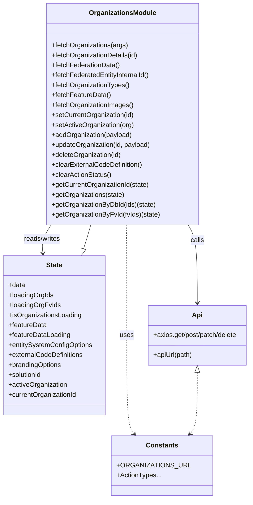

# Diagram: web/portal/src/modules/organizations/OrganizationsState.js


> Auto-generated by Obscura crawlers

## Diagram 1



### SVG

<svg id="container" width="615.2578125" xmlns="http://www.w3.org/2000/svg" class="classDiagram" height="1202" viewBox="0 0 615.2578125 1202" role="graphics-document document" aria-roledescription="class"><style>#container{font-family:"trebuchet ms",verdana,arial,sans-serif;font-size:16px;fill:#333;}@keyframes edge-animation-frame{from{stroke-dashoffset:0;}}@keyframes dash{to{stroke-dashoffset:0;}}#container .edge-animation-slow{stroke-dasharray:9,5!important;stroke-dashoffset:900;animation:dash 50s linear infinite;stroke-linecap:round;}#container .edge-animation-fast{stroke-dasharray:9,5!important;stroke-dashoffset:900;animation:dash 20s linear infinite;stroke-linecap:round;}#container .error-icon{fill:#552222;}#container .error-text{fill:#552222;stroke:#552222;}#container .edge-thickness-normal{stroke-width:1px;}#container .edge-thickness-thick{stroke-width:3.5px;}#container .edge-pattern-solid{stroke-dasharray:0;}#container .edge-thickness-invisible{stroke-width:0;fill:none;}#container .edge-pattern-dashed{stroke-dasharray:3;}#container .edge-pattern-dotted{stroke-dasharray:2;}#container .marker{fill:#333333;stroke:#333333;}#container .marker.cross{stroke:#333333;}#container svg{font-family:"trebuchet ms",verdana,arial,sans-serif;font-size:16px;}#container p{margin:0;}#container g.classGroup text{fill:#9370DB;stroke:none;font-family:"trebuchet ms",verdana,arial,sans-serif;font-size:10px;}#container g.classGroup text .title{font-weight:bolder;}#container .nodeLabel,#container .edgeLabel{color:#131300;}#container .edgeLabel .label rect{fill:#ECECFF;}#container .label text{fill:#131300;}#container .labelBkg{background:#ECECFF;}#container .edgeLabel .label span{background:#ECECFF;}#container .classTitle{font-weight:bolder;}#container .node rect,#container .node circle,#container .node ellipse,#container .node polygon,#container .node path{fill:#ECECFF;stroke:#9370DB;stroke-width:1px;}#container .divider{stroke:#9370DB;stroke-width:1;}#container g.clickable{cursor:pointer;}#container g.classGroup rect{fill:#ECECFF;stroke:#9370DB;}#container g.classGroup line{stroke:#9370DB;stroke-width:1;}#container .classLabel .box{stroke:none;stroke-width:0;fill:#ECECFF;opacity:0.5;}#container .classLabel .label{fill:#9370DB;font-size:10px;}#container .relation{stroke:#333333;stroke-width:1;fill:none;}#container .dashed-line{stroke-dasharray:3;}#container .dotted-line{stroke-dasharray:1 2;}#container #compositionStart,#container .composition{fill:#333333!important;stroke:#333333!important;stroke-width:1;}#container #compositionEnd,#container .composition{fill:#333333!important;stroke:#333333!important;stroke-width:1;}#container #dependencyStart,#container .dependency{fill:#333333!important;stroke:#333333!important;stroke-width:1;}#container #dependencyStart,#container .dependency{fill:#333333!important;stroke:#333333!important;stroke-width:1;}#container #extensionStart,#container .extension{fill:transparent!important;stroke:#333333!important;stroke-width:1;}#container #extensionEnd,#container .extension{fill:transparent!important;stroke:#333333!important;stroke-width:1;}#container #aggregationStart,#container .aggregation{fill:transparent!important;stroke:#333333!important;stroke-width:1;}#container #aggregationEnd,#container .aggregation{fill:transparent!important;stroke:#333333!important;stroke-width:1;}#container #lollipopStart,#container .lollipop{fill:#ECECFF!important;stroke:#333333!important;stroke-width:1;}#container #lollipopEnd,#container .lollipop{fill:#ECECFF!important;stroke:#333333!important;stroke-width:1;}#container .edgeTerminals{font-size:11px;line-height:initial;}#container .classTitleText{text-anchor:middle;font-size:18px;fill:#333;}#container .label-icon{display:inline-block;height:1em;overflow:visible;vertical-align:-0.125em;}#container .node .label-icon path{fill:currentColor;stroke:revert;stroke-width:revert;}#container :root{--mermaid-font-family:"trebuchet ms",verdana,arial,sans-serif;}</style><g><defs><marker id="container_class-aggregationStart" class="marker aggregation class" refX="18" refY="7" markerWidth="190" markerHeight="240" orient="auto"><path d="M 18,7 L9,13 L1,7 L9,1 Z"></path></marker></defs><defs><marker id="container_class-aggregationEnd" class="marker aggregation class" refX="1" refY="7" markerWidth="20" markerHeight="28" orient="auto"><path d="M 18,7 L9,13 L1,7 L9,1 Z"></path></marker></defs><defs><marker id="container_class-extensionStart" class="marker extension class" refX="18" refY="7" markerWidth="190" markerHeight="240" orient="auto"><path d="M 1,7 L18,13 V 1 Z"></path></marker></defs><defs><marker id="container_class-extensionEnd" class="marker extension class" refX="1" refY="7" markerWidth="20" markerHeight="28" orient="auto"><path d="M 1,1 V 13 L18,7 Z"></path></marker></defs><defs><marker id="container_class-compositionStart" class="marker composition class" refX="18" refY="7" markerWidth="190" markerHeight="240" orient="auto"><path d="M 18,7 L9,13 L1,7 L9,1 Z"></path></marker></defs><defs><marker id="container_class-compositionEnd" class="marker composition class" refX="1" refY="7" markerWidth="20" markerHeight="28" orient="auto"><path d="M 18,7 L9,13 L1,7 L9,1 Z"></path></marker></defs><defs><marker id="container_class-dependencyStart" class="marker dependency class" refX="6" refY="7" markerWidth="190" markerHeight="240" orient="auto"><path d="M 5,7 L9,13 L1,7 L9,1 Z"></path></marker></defs><defs><marker id="container_class-dependencyEnd" class="marker dependency class" refX="13" refY="7" markerWidth="20" markerHeight="28" orient="auto"><path d="M 18,7 L9,13 L14,7 L9,1 Z"></path></marker></defs><defs><marker id="container_class-lollipopStart" class="marker lollipop class" refX="13" refY="7" markerWidth="190" markerHeight="240" orient="auto"><circle stroke="black" fill="transparent" cx="7" cy="7" r="6"></circle></marker></defs><defs><marker id="container_class-lollipopEnd" class="marker lollipop class" refX="1" refY="7" markerWidth="190" markerHeight="240" orient="auto"><circle stroke="black" fill="transparent" cx="7" cy="7" r="6"></circle></marker></defs><g class="root"><g class="clusters"></g><g class="edgePaths"><path d="M122.595,542L118.58,548.167C114.565,554.333,106.534,566.667,103.265,578.01C99.995,589.354,101.485,599.707,102.231,604.884L102.976,610.061" id="id_OrganizationsModule_State_1" class="edge-thickness-normal edge-pattern-solid relation" style=";;;" data-edge="true" data-et="edge" data-id="id_OrganizationsModule_State_1" data-points="W3sieCI6MTIyLjU5NTQ1ODk4NDM3NSwieSI6NTQyfSx7IngiOjk4LjUwMzkwNjI1LCJ5Ijo1Nzl9LHsieCI6MTAzLjgzMTM2NTk5MzQ0OTc4LCJ5Ijo2MTZ9XQ==" marker-end="url(#container_class-dependencyEnd)"></path><path d="M459.941,542L463.717,548.167C467.493,554.333,475.045,566.667,478.822,598C482.598,629.333,482.598,679.667,482.598,704.833L482.598,730" id="id_OrganizationsModule_Api_2" class="edge-thickness-normal edge-pattern-solid relation" style=";;;" data-edge="true" data-et="edge" data-id="id_OrganizationsModule_Api_2" data-points="W3sieCI6NDU5Ljk0MDk1NjUxNzI2OTc0LCJ5Ijo1NDJ9LHsieCI6NDgyLjU5NzY1NjI1LCJ5Ijo1Nzl9LHsieCI6NDgyLjU5NzY1NjI1LCJ5Ijo3MzZ9XQ==" marker-end="url(#container_class-dependencyEnd)"></path><path d="M305.228,542L305.431,548.167C305.634,554.333,306.04,566.667,306.242,611C306.445,655.333,306.445,731.667,306.445,806C306.445,880.333,306.445,952.667,309.556,992.26C312.668,1031.853,318.89,1038.705,322.001,1042.132L325.112,1045.558" id="id_OrganizationsModule_Constants_3" class="edge-thickness-normal edge-pattern-dashed relation" style=";;;" data-edge="true" data-et="edge" data-id="id_OrganizationsModule_Constants_3" data-points="W3sieCI6MzA1LjIyODIwNzIzNjg0MjEsInkiOjU0Mn0seyJ4IjozMDYuNDQ1MzEyNSwieSI6NTc5fSx7IngiOjMwNi40NDUzMTI1LCJ5Ijo4MDh9LHsieCI6MzA2LjQ0NTMxMjUsInkiOjEwMjV9LHsieCI6MzI5LjE0NTM1Njc5NzY4MDQsInkiOjEwNTB9XQ==" marker-end="url(#container_class-dependencyEnd)"></path><path d="M201.97,599.66L203.136,596.217C204.301,592.773,206.631,585.887,209.57,576.277C212.51,566.667,216.059,554.333,217.834,548.167L219.609,542" id="id_State_OrganizationsModule_4" class="edge-thickness-normal edge-pattern-solid relation" style=";;;" data-edge="true" data-et="edge" data-id="id_State_OrganizationsModule_4" data-points="W3sieCI6MTk2LjQ0MTYyODAwMjE4MzQsInkiOjYxNn0seyJ4IjoyMDguOTYwOTM3NSwieSI6NTc5fSx7IngiOjIxOS42MDg3MDY4MjU2NTc5LCJ5Ijo1NDJ9XQ==" marker-start="url(#container_class-extensionStart)"></path><path d="M482.598,897.25L482.598,918.542C482.598,939.833,482.598,982.417,479.487,1007.135C476.375,1031.853,470.153,1038.705,467.042,1042.132L463.931,1045.558" id="id_Api_Constants_5" class="edge-thickness-normal edge-pattern-dashed relation" style=";;;" data-edge="true" data-et="edge" data-id="id_Api_Constants_5" data-points="W3sieCI6NDgyLjU5NzY1NjI1LCJ5Ijo4ODB9LHsieCI6NDgyLjU5NzY1NjI1LCJ5IjoxMDI1fSx7IngiOjQ1OS44OTc2MTE5NTIzMTk2LCJ5IjoxMDUwfV0=" marker-start="url(#container_class-extensionStart)" marker-end="url(#container_class-dependencyEnd)"></path></g><g class="edgeLabels"><g class="edgeLabel" transform="translate(100.35106, 576.16313)"><g class="label" data-id="id_OrganizationsModule_State_1" transform="translate(-45.9453125, -12)"><foreignObject width="91.890625" height="24"><div xmlns="http://www.w3.org/1999/xhtml" class="labelBkg" style="display: table-cell; white-space: nowrap; line-height: 1.5; max-width: 200px; text-align: center;"><span class="edgeLabel"><p>reads/writes</p></span></div></foreignObject></g></g><g class="edgeLabel" transform="translate(482.59765625, 579)"><g class="label" data-id="id_OrganizationsModule_Api_2" transform="translate(-16.4453125, -12)"><foreignObject width="32.890625" height="24"><div xmlns="http://www.w3.org/1999/xhtml" class="labelBkg" style="display: table-cell; white-space: nowrap; line-height: 1.5; max-width: 200px; text-align: center;"><span class="edgeLabel"><p>calls</p></span></div></foreignObject></g></g><g class="edgeLabel" transform="translate(306.4453125, 808)"><g class="label" data-id="id_OrganizationsModule_Constants_3" transform="translate(-16.4921875, -12)"><foreignObject width="32.984375" height="24"><div xmlns="http://www.w3.org/1999/xhtml" class="labelBkg" style="display: table-cell; white-space: nowrap; line-height: 1.5; max-width: 200px; text-align: center;"><span class="edgeLabel"><p>uses</p></span></div></foreignObject></g></g><g class="edgeLabel"><g class="label" data-id="id_State_OrganizationsModule_4" transform="translate(0, 0)"><foreignObject width="0" height="0"><div xmlns="http://www.w3.org/1999/xhtml" class="labelBkg" style="display: table-cell; white-space: nowrap; line-height: 1.5; max-width: 200px; text-align: center;"><span class="edgeLabel"></span></div></foreignObject></g></g><g class="edgeLabel"><g class="label" data-id="id_Api_Constants_5" transform="translate(0, 0)"><foreignObject width="0" height="0"><div xmlns="http://www.w3.org/1999/xhtml" class="labelBkg" style="display: table-cell; white-space: nowrap; line-height: 1.5; max-width: 200px; text-align: center;"><span class="edgeLabel"></span></div></foreignObject></g></g></g><g class="nodes"><g class="node default" id="classId-OrganizationsModule-0" transform="translate(296.4453125, 275)"><g class="basic label-container"><path d="M-181.578125 -267 L181.578125 -267 L181.578125 267 L-181.578125 267" stroke="none" stroke-width="0" fill="#ECECFF" style=""></path><path d="M-181.578125 -267 C-79.00177656413369 -267, 23.574571871732616 -267, 181.578125 -267 M-181.578125 -267 C-39.59241875231305 -267, 102.3932874953739 -267, 181.578125 -267 M181.578125 -267 C181.578125 -123.87826025103783, 181.578125 19.24347949792434, 181.578125 267 M181.578125 -267 C181.578125 -105.64193137213252, 181.578125 55.716137255734964, 181.578125 267 M181.578125 267 C63.8089272625361 267, -53.960270474927796 267, -181.578125 267 M181.578125 267 C76.56801283618427 267, -28.442099327631468 267, -181.578125 267 M-181.578125 267 C-181.578125 128.4753795484496, -181.578125 -10.049240903100781, -181.578125 -267 M-181.578125 267 C-181.578125 113.16554681077997, -181.578125 -40.668906378440056, -181.578125 -267" stroke="#9370DB" stroke-width="1.3" fill="none" stroke-dasharray="0 0" style=""></path></g><g class="annotation-group text" transform="translate(0, -243)"></g><g class="label-group text" transform="translate(-77.640625, -243)"><g class="label" style="font-weight: bolder" transform="translate(0,-12)"><foreignObject width="155.28125" height="24"><div xmlns="http://www.w3.org/1999/xhtml" style="display: table-cell; white-space: nowrap; line-height: 1.5; max-width: 204px; text-align: center;"><span class="nodeLabel markdown-node-label" style=""><p>OrganizationsModule</p></span></div></foreignObject></g></g><g class="members-group text" transform="translate(-169.578125, -195)"></g><g class="methods-group text" transform="translate(-169.578125, -165)"><g class="label" style="" transform="translate(0,-12)"><foreignObject width="184.46875" height="24"><div xmlns="http://www.w3.org/1999/xhtml" style="display: table-cell; white-space: nowrap; line-height: 1.5; max-width: 242px; text-align: center;"><span class="nodeLabel markdown-node-label" style=""><p>+fetchOrganizations(args)</p></span></div></foreignObject></g><g class="label" style="" transform="translate(0,12)"><foreignObject width="210.828125" height="24"><div xmlns="http://www.w3.org/1999/xhtml" style="display: table-cell; white-space: nowrap; line-height: 1.5; max-width: 268px; text-align: center;"><span class="nodeLabel markdown-node-label" style=""><p>+fetchOrganizationDetails(id)</p></span></div></foreignObject></g><g class="label" style="" transform="translate(0,36)"><foreignObject width="165.453125" height="24"><div xmlns="http://www.w3.org/1999/xhtml" style="display: table-cell; white-space: nowrap; line-height: 1.5; max-width: 223px; text-align: center;"><span class="nodeLabel markdown-node-label" style=""><p>+fetchFederationData()</p></span></div></foreignObject></g><g class="label" style="" transform="translate(0,60)"><foreignObject width="240.109375" height="24"><div xmlns="http://www.w3.org/1999/xhtml" style="display: table-cell; white-space: nowrap; line-height: 1.5; max-width: 297px; text-align: center;"><span class="nodeLabel markdown-node-label" style=""><p>+fetchFederatedEntityInternalId()</p></span></div></foreignObject></g><g class="label" style="" transform="translate(0,84)"><foreignObject width="187.875" height="24"><div xmlns="http://www.w3.org/1999/xhtml" style="display: table-cell; white-space: nowrap; line-height: 1.5; max-width: 245px; text-align: center;"><span class="nodeLabel markdown-node-label" style=""><p>+fetchOrganizationTypes()</p></span></div></foreignObject></g><g class="label" style="" transform="translate(0,108)"><foreignObject width="141.875" height="24"><div xmlns="http://www.w3.org/1999/xhtml" style="display: table-cell; white-space: nowrap; line-height: 1.5; max-width: 199px; text-align: center;"><span class="nodeLabel markdown-node-label" style=""><p>+fetchFeatureData()</p></span></div></foreignObject></g><g class="label" style="" transform="translate(0,132)"><foreignObject width="197.90625" height="24"><div xmlns="http://www.w3.org/1999/xhtml" style="display: table-cell; white-space: nowrap; line-height: 1.5; max-width: 255px; text-align: center;"><span class="nodeLabel markdown-node-label" style=""><p>+fetchOrganizationImages()</p></span></div></foreignObject></g><g class="label" style="" transform="translate(0,156)"><foreignObject width="200.234375" height="24"><div xmlns="http://www.w3.org/1999/xhtml" style="display: table-cell; white-space: nowrap; line-height: 1.5; max-width: 258px; text-align: center;"><span class="nodeLabel markdown-node-label" style=""><p>+setCurrentOrganization(id)</p></span></div></foreignObject></g><g class="label" style="" transform="translate(0,180)"><foreignObject width="199.640625" height="24"><div xmlns="http://www.w3.org/1999/xhtml" style="display: table-cell; white-space: nowrap; line-height: 1.5; max-width: 257px; text-align: center;"><span class="nodeLabel markdown-node-label" style=""><p>+setActiveOrganization(org)</p></span></div></foreignObject></g><g class="label" style="" transform="translate(0,204)"><foreignObject width="195.78125" height="24"><div xmlns="http://www.w3.org/1999/xhtml" style="display: table-cell; white-space: nowrap; line-height: 1.5; max-width: 253px; text-align: center;"><span class="nodeLabel markdown-node-label" style=""><p>+addOrganization(payload)</p></span></div></foreignObject></g><g class="label" style="" transform="translate(0,228)"><foreignObject width="241.6875" height="24"><div xmlns="http://www.w3.org/1999/xhtml" style="display: table-cell; white-space: nowrap; line-height: 1.5; max-width: 299px; text-align: center;"><span class="nodeLabel markdown-node-label" style=""><p>+updateOrganization(id, payload)</p></span></div></foreignObject></g><g class="label" style="" transform="translate(0,252)"><foreignObject width="170.390625" height="24"><div xmlns="http://www.w3.org/1999/xhtml" style="display: table-cell; white-space: nowrap; line-height: 1.5; max-width: 228px; text-align: center;"><span class="nodeLabel markdown-node-label" style=""><p>+deleteOrganization(id)</p></span></div></foreignObject></g><g class="label" style="" transform="translate(0,276)"><foreignObject width="220.8125" height="24"><div xmlns="http://www.w3.org/1999/xhtml" style="display: table-cell; white-space: nowrap; line-height: 1.5; max-width: 278px; text-align: center;"><span class="nodeLabel markdown-node-label" style=""><p>+clearExternalCodeDefinition()</p></span></div></foreignObject></g><g class="label" style="" transform="translate(0,300)"><foreignObject width="145.53125" height="24"><div xmlns="http://www.w3.org/1999/xhtml" style="display: table-cell; white-space: nowrap; line-height: 1.5; max-width: 203px; text-align: center;"><span class="nodeLabel markdown-node-label" style=""><p>+clearActionStatus()</p></span></div></foreignObject></g><g class="label" style="" transform="translate(0,324)"><foreignObject width="237.125" height="24"><div xmlns="http://www.w3.org/1999/xhtml" style="display: table-cell; white-space: nowrap; line-height: 1.5; max-width: 294px; text-align: center;"><span class="nodeLabel markdown-node-label" style=""><p>+getCurrentOrganizationId(state)</p></span></div></foreignObject></g><g class="label" style="" transform="translate(0,348)"><foreignObject width="176.5625" height="24"><div xmlns="http://www.w3.org/1999/xhtml" style="display: table-cell; white-space: nowrap; line-height: 1.5; max-width: 234px; text-align: center;"><span class="nodeLabel markdown-node-label" style=""><p>+getOrganizations(state)</p></span></div></foreignObject></g><g class="label" style="" transform="translate(0,372)"><foreignObject width="252.71875" height="24"><div xmlns="http://www.w3.org/1999/xhtml" style="display: table-cell; white-space: nowrap; line-height: 1.5; max-width: 310px; text-align: center;"><span class="nodeLabel markdown-node-label" style=""><p>+getOrganizationByDbId(ids)(state)</p></span></div></foreignObject></g><g class="label" style="" transform="translate(0,396)"><foreignObject width="261.515625" height="24"><div xmlns="http://www.w3.org/1999/xhtml" style="display: table-cell; white-space: nowrap; line-height: 1.5; max-width: 319px; text-align: center;"><span class="nodeLabel markdown-node-label" style=""><p>+getOrganizationByFvId(fvIds)(state)</p></span></div></foreignObject></g></g><g class="divider" style=""><path d="M-181.578125 -219 C-105.15829911673113 -219, -28.73847323346226 -219, 181.578125 -219 M-181.578125 -219 C-62.66847493297095 -219, 56.241175134058096 -219, 181.578125 -219" stroke="#9370DB" stroke-width="1.3" fill="none" stroke-dasharray="0 0" style=""></path></g><g class="divider" style=""><path d="M-181.578125 -195 C-38.79852693888927 -195, 103.98107112222146 -195, 181.578125 -195 M-181.578125 -195 C-76.55599175944278 -195, 28.466141481114448 -195, 181.578125 -195" stroke="#9370DB" stroke-width="1.3" fill="none" stroke-dasharray="0 0" style=""></path></g></g><g class="node default" id="classId-Constants-1" transform="translate(394.521484375, 1122)"><g class="basic label-container"><path d="M-110.04296875 -72 L110.04296875 -72 L110.04296875 72 L-110.04296875 72" stroke="none" stroke-width="0" fill="#ECECFF" style=""></path><path d="M-110.04296875 -72 C-49.183779306681984 -72, 11.675410136636032 -72, 110.04296875 -72 M-110.04296875 -72 C-58.19793730502606 -72, -6.352905860052118 -72, 110.04296875 -72 M110.04296875 -72 C110.04296875 -21.468648714700088, 110.04296875 29.062702570599825, 110.04296875 72 M110.04296875 -72 C110.04296875 -40.50218438464344, 110.04296875 -9.004368769286877, 110.04296875 72 M110.04296875 72 C57.34221345434877 72, 4.641458158697546 72, -110.04296875 72 M110.04296875 72 C32.42132815257442 72, -45.200312444851164 72, -110.04296875 72 M-110.04296875 72 C-110.04296875 31.4781950874509, -110.04296875 -9.043609825098201, -110.04296875 -72 M-110.04296875 72 C-110.04296875 21.939820705122905, -110.04296875 -28.12035858975419, -110.04296875 -72" stroke="#9370DB" stroke-width="1.3" fill="none" stroke-dasharray="0 0" style=""></path></g><g class="annotation-group text" transform="translate(0, -48)"></g><g class="label-group text" transform="translate(-36.5390625, -48)"><g class="label" style="font-weight: bolder" transform="translate(0,-12)"><foreignObject width="73.078125" height="24"><div xmlns="http://www.w3.org/1999/xhtml" style="display: table-cell; white-space: nowrap; line-height: 1.5; max-width: 122px; text-align: center;"><span class="nodeLabel markdown-node-label" style=""><p>Constants</p></span></div></foreignObject></g></g><g class="members-group text" transform="translate(-98.04296875, 0)"><g class="label" style="" transform="translate(0,-12)"><foreignObject width="159.546875" height="24"><div xmlns="http://www.w3.org/1999/xhtml" style="display: table-cell; white-space: nowrap; line-height: 1.5; max-width: 217px; text-align: center;"><span class="nodeLabel markdown-node-label" style=""><p>+ORGANIZATIONS_URL</p></span></div></foreignObject></g><g class="label" style="" transform="translate(0,12)"><foreignObject width="106.375" height="24"><div xmlns="http://www.w3.org/1999/xhtml" style="display: table-cell; white-space: nowrap; line-height: 1.5; max-width: 164px; text-align: center;"><span class="nodeLabel markdown-node-label" style=""><p>+ActionTypes...</p></span></div></foreignObject></g></g><g class="methods-group text" transform="translate(-98.04296875, 72)"></g><g class="divider" style=""><path d="M-110.04296875 -24 C-49.137169859623974 -24, 11.768629030752052 -24, 110.04296875 -24 M-110.04296875 -24 C-55.061874405418415 -24, -0.08078006083682965 -24, 110.04296875 -24" stroke="#9370DB" stroke-width="1.3" fill="none" stroke-dasharray="0 0" style=""></path></g><g class="divider" style=""><path d="M-110.04296875 48 C-45.127313335885944 48, 19.788342078228112 48, 110.04296875 48 M-110.04296875 48 C-65.38202399883286 48, -20.721079247665728 48, 110.04296875 48" stroke="#9370DB" stroke-width="1.3" fill="none" stroke-dasharray="0 0" style=""></path></g></g><g class="node default" id="classId-State-2" transform="translate(131.4765625, 808)"><g class="basic label-container"><path d="M-123.4765625 -192 L123.4765625 -192 L123.4765625 192 L-123.4765625 192" stroke="none" stroke-width="0" fill="#ECECFF" style=""></path><path d="M-123.4765625 -192 C-58.0982687386563 -192, 7.280025022687397 -192, 123.4765625 -192 M-123.4765625 -192 C-60.60009407578465 -192, 2.276374348430707 -192, 123.4765625 -192 M123.4765625 -192 C123.4765625 -69.54430544339532, 123.4765625 52.91138911320937, 123.4765625 192 M123.4765625 -192 C123.4765625 -94.43506179224374, 123.4765625 3.1298764155125127, 123.4765625 192 M123.4765625 192 C41.11347446594746 192, -41.249613568105076 192, -123.4765625 192 M123.4765625 192 C58.28812823615482 192, -6.9003060276903625 192, -123.4765625 192 M-123.4765625 192 C-123.4765625 43.0245768316189, -123.4765625 -105.9508463367622, -123.4765625 -192 M-123.4765625 192 C-123.4765625 47.77816808391384, -123.4765625 -96.44366383217232, -123.4765625 -192" stroke="#9370DB" stroke-width="1.3" fill="none" stroke-dasharray="0 0" style=""></path></g><g class="annotation-group text" transform="translate(0, -168)"></g><g class="label-group text" transform="translate(-19.3125, -168)"><g class="label" style="font-weight: bolder" transform="translate(0,-12)"><foreignObject width="38.625" height="24"><div xmlns="http://www.w3.org/1999/xhtml" style="display: table-cell; white-space: nowrap; line-height: 1.5; max-width: 87px; text-align: center;"><span class="nodeLabel markdown-node-label" style=""><p>State</p></span></div></foreignObject></g></g><g class="members-group text" transform="translate(-111.4765625, -120)"><g class="label" style="" transform="translate(0,-12)"><foreignObject width="40.625" height="24"><div xmlns="http://www.w3.org/1999/xhtml" style="display: table-cell; white-space: nowrap; line-height: 1.5; max-width: 98px; text-align: center;"><span class="nodeLabel markdown-node-label" style=""><p>+data</p></span></div></foreignObject></g><g class="label" style="" transform="translate(0,12)"><foreignObject width="109.359375" height="24"><div xmlns="http://www.w3.org/1999/xhtml" style="display: table-cell; white-space: nowrap; line-height: 1.5; max-width: 167px; text-align: center;"><span class="nodeLabel markdown-node-label" style=""><p>+loadingOrgIds</p></span></div></foreignObject></g><g class="label" style="" transform="translate(0,36)"><foreignObject width="124.515625" height="24"><div xmlns="http://www.w3.org/1999/xhtml" style="display: table-cell; white-space: nowrap; line-height: 1.5; max-width: 182px; text-align: center;"><span class="nodeLabel markdown-node-label" style=""><p>+loadingOrgFvIds</p></span></div></foreignObject></g><g class="label" style="" transform="translate(0,60)"><foreignObject width="176.765625" height="24"><div xmlns="http://www.w3.org/1999/xhtml" style="display: table-cell; white-space: nowrap; line-height: 1.5; max-width: 235px; text-align: center;"><span class="nodeLabel markdown-node-label" style=""><p>+isOrganizationsLoading</p></span></div></foreignObject></g><g class="label" style="" transform="translate(0,84)"><foreignObject width="92.9375" height="24"><div xmlns="http://www.w3.org/1999/xhtml" style="display: table-cell; white-space: nowrap; line-height: 1.5; max-width: 150px; text-align: center;"><span class="nodeLabel markdown-node-label" style=""><p>+featureData</p></span></div></foreignObject></g><g class="label" style="" transform="translate(0,108)"><foreignObject width="150.171875" height="24"><div xmlns="http://www.w3.org/1999/xhtml" style="display: table-cell; white-space: nowrap; line-height: 1.5; max-width: 208px; text-align: center;"><span class="nodeLabel markdown-node-label" style=""><p>+featureDataLoading</p></span></div></foreignObject></g><g class="label" style="" transform="translate(0,132)"><foreignObject width="203.640625" height="24"><div xmlns="http://www.w3.org/1999/xhtml" style="display: table-cell; white-space: nowrap; line-height: 1.5; max-width: 261px; text-align: center;"><span class="nodeLabel markdown-node-label" style=""><p>+entitySystemConfigOptions</p></span></div></foreignObject></g><g class="label" style="" transform="translate(0,156)"><foreignObject width="182.234375" height="24"><div xmlns="http://www.w3.org/1999/xhtml" style="display: table-cell; white-space: nowrap; line-height: 1.5; max-width: 240px; text-align: center;"><span class="nodeLabel markdown-node-label" style=""><p>+externalCodeDefinitions</p></span></div></foreignObject></g><g class="label" style="" transform="translate(0,180)"><foreignObject width="130.03125" height="24"><div xmlns="http://www.w3.org/1999/xhtml" style="display: table-cell; white-space: nowrap; line-height: 1.5; max-width: 187px; text-align: center;"><span class="nodeLabel markdown-node-label" style=""><p>+brandingOptions</p></span></div></foreignObject></g><g class="label" style="" transform="translate(0,204)"><foreignObject width="82.109375" height="24"><div xmlns="http://www.w3.org/1999/xhtml" style="display: table-cell; white-space: nowrap; line-height: 1.5; max-width: 139px; text-align: center;"><span class="nodeLabel markdown-node-label" style=""><p>+solutionId</p></span></div></foreignObject></g><g class="label" style="" transform="translate(0,228)"><foreignObject width="143" height="24"><div xmlns="http://www.w3.org/1999/xhtml" style="display: table-cell; white-space: nowrap; line-height: 1.5; max-width: 200px; text-align: center;"><span class="nodeLabel markdown-node-label" style=""><p>+activeOrganization</p></span></div></foreignObject></g><g class="label" style="" transform="translate(0,252)"><foreignObject width="166.90625" height="24"><div xmlns="http://www.w3.org/1999/xhtml" style="display: table-cell; white-space: nowrap; line-height: 1.5; max-width: 224px; text-align: center;"><span class="nodeLabel markdown-node-label" style=""><p>+currentOrganizationId</p></span></div></foreignObject></g></g><g class="methods-group text" transform="translate(-111.4765625, 192)"></g><g class="divider" style=""><path d="M-123.4765625 -144 C-47.89997357576313 -144, 27.676615348473746 -144, 123.4765625 -144 M-123.4765625 -144 C-38.9942012525094 -144, 45.4881599949812 -144, 123.4765625 -144" stroke="#9370DB" stroke-width="1.3" fill="none" stroke-dasharray="0 0" style=""></path></g><g class="divider" style=""><path d="M-123.4765625 168 C-26.676664382864217 168, 70.12323373427157 168, 123.4765625 168 M-123.4765625 168 C-33.73418390567464 168, 56.00819468865072 168, 123.4765625 168" stroke="#9370DB" stroke-width="1.3" fill="none" stroke-dasharray="0 0" style=""></path></g></g><g class="node default" id="classId-Api-3" transform="translate(482.59765625, 808)"><g class="basic label-container"><path d="M-124.66015625 -72 L124.66015625 -72 L124.66015625 72 L-124.66015625 72" stroke="none" stroke-width="0" fill="#ECECFF" style=""></path><path d="M-124.66015625 -72 C-47.12090446436794 -72, 30.41834732126412 -72, 124.66015625 -72 M-124.66015625 -72 C-52.49810575142142 -72, 19.66394474715716 -72, 124.66015625 -72 M124.66015625 -72 C124.66015625 -27.164365270793134, 124.66015625 17.671269458413732, 124.66015625 72 M124.66015625 -72 C124.66015625 -14.930531513973044, 124.66015625 42.13893697205391, 124.66015625 72 M124.66015625 72 C34.497419408834844 72, -55.66531743233031 72, -124.66015625 72 M124.66015625 72 C65.96807245538739 72, 7.275988660774772 72, -124.66015625 72 M-124.66015625 72 C-124.66015625 26.357419227116026, -124.66015625 -19.28516154576795, -124.66015625 -72 M-124.66015625 72 C-124.66015625 41.10292531066536, -124.66015625 10.205850621330725, -124.66015625 -72" stroke="#9370DB" stroke-width="1.3" fill="none" stroke-dasharray="0 0" style=""></path></g><g class="annotation-group text" transform="translate(0, -48)"></g><g class="label-group text" transform="translate(-11.7578125, -48)"><g class="label" style="font-weight: bolder" transform="translate(0,-12)"><foreignObject width="23.515625" height="24"><div xmlns="http://www.w3.org/1999/xhtml" style="display: table-cell; white-space: nowrap; line-height: 1.5; max-width: 73px; text-align: center;"><span class="nodeLabel markdown-node-label" style=""><p>Api</p></span></div></foreignObject></g></g><g class="members-group text" transform="translate(-112.66015625, 0)"><g class="label" style="" transform="translate(0,-12)"><foreignObject width="213.5625" height="24"><div xmlns="http://www.w3.org/1999/xhtml" style="display: table-cell; white-space: nowrap; line-height: 1.5; max-width: 271px; text-align: center;"><span class="nodeLabel markdown-node-label" style=""><p>+axios.get/post/patch/delete</p></span></div></foreignObject></g></g><g class="methods-group text" transform="translate(-112.66015625, 48)"><g class="label" style="" transform="translate(0,-12)"><foreignObject width="95.5" height="24"><div xmlns="http://www.w3.org/1999/xhtml" style="display: table-cell; white-space: nowrap; line-height: 1.5; max-width: 153px; text-align: center;"><span class="nodeLabel markdown-node-label" style=""><p>+apiUrl(path)</p></span></div></foreignObject></g></g><g class="divider" style=""><path d="M-124.66015625 -24 C-74.12208979557451 -24, -23.584023341149006 -24, 124.66015625 -24 M-124.66015625 -24 C-60.214192550121325 -24, 4.23177114975735 -24, 124.66015625 -24" stroke="#9370DB" stroke-width="1.3" fill="none" stroke-dasharray="0 0" style=""></path></g><g class="divider" style=""><path d="M-124.66015625 24 C-55.10339735071521 24, 14.453361548569575 24, 124.66015625 24 M-124.66015625 24 C-51.003836721067984 24, 22.652482807864033 24, 124.66015625 24" stroke="#9370DB" stroke-width="1.3" fill="none" stroke-dasharray="0 0" style=""></path></g></g></g></g></g></svg>

## Diagram 2

```mermaid
flowchart TD
  A[Caller dispatches fetchOrganizations(ids,fvIds)] --> B{Validate args: ids or fvIds present?}
  B -- no --> C[log error & return]
  B -- yes --> D[determine idsToRequest, fvIdsToRequest by removing existing & loading]
  D --> E{idsToRequest size > 0?}
  E -- yes --> F[dispatch FETCH_ORGANIZATIONS (ids)]
  F --> G[axios.get ORGANIZATIONS_URL ?organization_ids=ids]
  G --> H{success?}
  H -- success --> I[dispatch RECEIVE_ORGANIZATIONS with data]
  H -- error --> J[dispatch FETCH_ORGANIZATIONS_ERROR (ids)]
  D --> K{fvIdsToRequest size > 0?}
  K -- yes --> L[dispatch FETCH_ORGANIZATIONS (fvIds)]
  L --> M[axios.get ORGANIZATIONS_URL ?organization_fv_id=fvIds]
  M --> N{success?}
  N -- success --> O[dispatch RECEIVE_ORGANIZATIONS with data]
  N -- error --> P[dispatch FETCH_ORGANIZATIONS_ERROR (fvIds)]
  I --> Q[update state.data, clear loading flags]
  O --> Q
  J --> Q
  P --> Q
```

> SVG rendering failed for this diagram.
