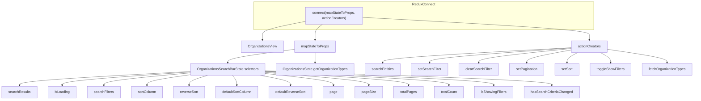
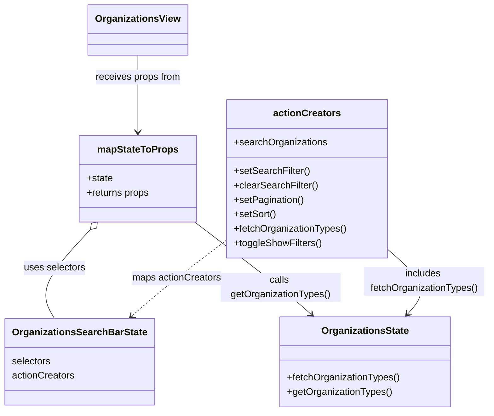

# Diagram: web/portal/src/modules/organizations/OrganizationsViewContainer.js

> Auto-generated by Obscura crawlers

## Diagram 1

### SVG

<svg id="container" width="3175.859375" xmlns="http://www.w3.org/2000/svg" class="flowchart" height="456" viewBox="0 0 3175.859375 456" role="graphics-document document" aria-roledescription="flowchart-v2"><g><marker id="container_flowchart-v2-pointEnd" class="marker flowchart-v2" viewBox="0 0 10 10" refX="5" refY="5" markerUnits="userSpaceOnUse" markerWidth="8" markerHeight="8" orient="auto"><path d="M 0 0 L 10 5 L 0 10 z" class="arrowMarkerPath" style="stroke-width: 1; stroke-dasharray: 1, 0;"></path></marker><marker id="container_flowchart-v2-pointStart" class="marker flowchart-v2" viewBox="0 0 10 10" refX="4.5" refY="5" markerUnits="userSpaceOnUse" markerWidth="8" markerHeight="8" orient="auto"><path d="M 0 5 L 10 10 L 10 0 z" class="arrowMarkerPath" style="stroke-width: 1; stroke-dasharray: 1, 0;"></path></marker><marker id="container_flowchart-v2-circleEnd" class="marker flowchart-v2" viewBox="0 0 10 10" refX="11" refY="5" markerUnits="userSpaceOnUse" markerWidth="11" markerHeight="11" orient="auto"><circle cx="5" cy="5" r="5" class="arrowMarkerPath" style="stroke-width: 1; stroke-dasharray: 1, 0;"></circle></marker><marker id="container_flowchart-v2-circleStart" class="marker flowchart-v2" viewBox="0 0 10 10" refX="-1" refY="5" markerUnits="userSpaceOnUse" markerWidth="11" markerHeight="11" orient="auto"><circle cx="5" cy="5" r="5" class="arrowMarkerPath" style="stroke-width: 1; stroke-dasharray: 1, 0;"></circle></marker><marker id="container_flowchart-v2-crossEnd" class="marker cross flowchart-v2" viewBox="0 0 11 11" refX="12" refY="5.2" markerUnits="userSpaceOnUse" markerWidth="11" markerHeight="11" orient="auto"><path d="M 1,1 l 9,9 M 10,1 l -9,9" class="arrowMarkerPath" style="stroke-width: 2; stroke-dasharray: 1, 0;"></path></marker><marker id="container_flowchart-v2-crossStart" class="marker cross flowchart-v2" viewBox="0 0 11 11" refX="-1" refY="5.2" markerUnits="userSpaceOnUse" markerWidth="11" markerHeight="11" orient="auto"><path d="M 1,1 l 9,9 M 10,1 l -9,9" class="arrowMarkerPath" style="stroke-width: 2; stroke-dasharray: 1, 0;"></path></marker><g class="root"><g class="clusters"><g class="cluster" id="ReduxConnect" data-look="classic"><rect style="" x="1160.1484375" y="8" width="1558.4375" height="128"></rect><g class="cluster-label" transform="translate(1887.5234375, 8)"><foreignObject width="103.6875" height="24">

ReduxConnect

</foreignObject></g></g></g><g class="edgePaths"><path d="M1401.133,97.137L1367.635,103.614C1334.138,110.091,1267.143,123.046,1233.646,133.69C1200.148,144.333,1200.148,152.667,1200.148,160.333C1200.148,168,1200.148,175,1200.148,178.5L1200.148,182" id="L_CONNECT_view_0" class="edge-thickness-normal edge-pattern-solid edge-thickness-normal edge-pattern-solid flowchart-link" style=";" data-edge="true" data-et="edge" data-id="L_CONNECT_view_0" data-points="W3sieCI6MTQwMS4xMzI4MTI1LCJ5Ijo5Ny4xMzcxMzgyNzEyNTUyNX0seyJ4IjoxMjAwLjE0ODQzNzUsInkiOjEzNn0seyJ4IjoxMjAwLjE0ODQzNzUsInkiOjE2MX0seyJ4IjoxMjAwLjE0ODQzNzUsInkiOjE4Nn1d" marker-end="url(#container_flowchart-v2-pointEnd)"></path><path d="M1475.737,111L1469.818,115.167C1463.9,119.333,1452.063,127.667,1446.145,136C1440.227,144.333,1440.227,152.667,1440.227,160.333C1440.227,168,1440.227,175,1440.227,178.5L1440.227,182" id="L_CONNECT_map_0" class="edge-thickness-normal edge-pattern-solid edge-thickness-normal edge-pattern-solid flowchart-link" style=";" data-edge="true" data-et="edge" data-id="L_CONNECT_map_0" data-points="W3sieCI6MTQ3NS43MzY4MTY0MDYyNSwieSI6MTExfSx7IngiOjE0NDAuMjI2NTYyNSwieSI6MTM2fSx7IngiOjE0NDAuMjI2NTYyNSwieSI6MTYxfSx7IngiOjE0NDAuMjI2NTYyNSwieSI6MTg2fV0=" marker-end="url(#container_flowchart-v2-pointEnd)"></path><path d="M1661.133,79.127L1834.042,88.606C2006.951,98.084,2352.768,117.042,2525.677,130.688C2698.586,144.333,2698.586,152.667,2698.586,160.333C2698.586,168,2698.586,175,2698.586,178.5L2698.586,182" id="L_CONNECT_actions_0" class="edge-thickness-normal edge-pattern-solid edge-thickness-normal edge-pattern-solid flowchart-link" style=";" data-edge="true" data-et="edge" data-id="L_CONNECT_actions_0" data-points="W3sieCI6MTY2MS4xMzI4MTI1LCJ5Ijo3OS4xMjY2MjQ0NjI5NzM2Mn0seyJ4IjoyNjk4LjU4NTkzNzUsInkiOjEzNn0seyJ4IjoyNjk4LjU4NTkzNzUsInkiOjE2MX0seyJ4IjoyNjk4LjU4NTkzNzUsInkiOjE4Nn1d" marker-end="url(#container_flowchart-v2-pointEnd)"></path><path d="M1346.727,225.221L1296.003,231.851C1245.279,238.481,1143.831,251.74,1093.107,261.87C1042.383,272,1042.383,279,1042.383,282.5L1042.383,286" id="L_map_selectors_0" class="edge-thickness-normal edge-pattern-solid edge-thickness-normal edge-pattern-solid flowchart-link" style=";" data-edge="true" data-et="edge" data-id="L_map_selectors_0" data-points="W3sieCI6MTM0Ni43MjY1NjI1LCJ5IjoyMjUuMjIwODc4MTcxMzkyNjZ9LHsieCI6MTA0Mi4zODI4MTI1LCJ5IjoyNjV9LHsieCI6MTA0Mi4zODI4MTI1LCJ5IjoyOTB9XQ==" marker-end="url(#container_flowchart-v2-pointEnd)"></path><path d="M1440.227,240L1440.227,244.167C1440.227,248.333,1440.227,256.667,1440.227,264.333C1440.227,272,1440.227,279,1440.227,282.5L1440.227,286" id="L_map_orgState_0" class="edge-thickness-normal edge-pattern-solid edge-thickness-normal edge-pattern-solid flowchart-link" style=";" data-edge="true" data-et="edge" data-id="L_map_orgState_0" data-points="W3sieCI6MTQ0MC4yMjY1NjI1LCJ5IjoyNDB9LHsieCI6MTQ0MC4yMjY1NjI1LCJ5IjoyNjV9LHsieCI6MTQ0MC4yMjY1NjI1LCJ5IjoyOTB9XQ==" marker-end="url(#container_flowchart-v2-pointEnd)"></path><path d="M872.672,326.248L741.922,333.374C611.172,340.499,349.672,354.749,218.922,365.375C88.172,376,88.172,383,88.172,386.5L88.172,390" id="L_selectors_SR_0" class="edge-thickness-normal edge-pattern-solid edge-thickness-normal edge-pattern-solid flowchart-link" style=";" data-edge="true" data-et="edge" data-id="L_selectors_SR_0" data-points="W3sieCI6ODcyLjY3MTg3NSwieSI6MzI2LjI0ODQ0NjQ0MjE2ODM2fSx7IngiOjg4LjE3MTg3NSwieSI6MzY5fSx7IngiOjg4LjE3MTg3NSwieSI6Mzk0fV0=" marker-end="url(#container_flowchart-v2-pointEnd)"></path><path d="M872.672,328.621L774.385,335.35C676.099,342.08,479.526,355.54,381.24,365.77C282.953,376,282.953,383,282.953,386.5L282.953,390" id="L_selectors_LO_0" class="edge-thickness-normal edge-pattern-solid edge-thickness-normal edge-pattern-solid flowchart-link" style=";" data-edge="true" data-et="edge" data-id="L_selectors_LO_0" data-points="W3sieCI6ODcyLjY3MTg3NSwieSI6MzI4LjYyMDUyMTE1NTg4Mzh9LHsieCI6MjgyLjk1MzEyNSwieSI6MzY5fSx7IngiOjI4Mi45NTMxMjUsInkiOjM5NH1d" marker-end="url(#container_flowchart-v2-pointEnd)"></path><path d="M872.672,332.509L806.122,338.591C739.573,344.673,606.474,356.836,539.924,366.418C473.375,376,473.375,383,473.375,386.5L473.375,390" id="L_selectors_SF_0" class="edge-thickness-normal edge-pattern-solid edge-thickness-normal edge-pattern-solid flowchart-link" style=";" data-edge="true" data-et="edge" data-id="L_selectors_SF_0" data-points="W3sieCI6ODcyLjY3MTg3NSwieSI6MzMyLjUwOTM5ODIxMjM0ODh9LHsieCI6NDczLjM3NSwieSI6MzY5fSx7IngiOjQ3My4zNzUsInkiOjM5NH1d" marker-end="url(#container_flowchart-v2-pointEnd)"></path><path d="M872.672,340.769L839.078,345.475C805.484,350.18,738.297,359.59,704.703,367.795C671.109,376,671.109,383,671.109,386.5L671.109,390" id="L_selectors_SC_0" class="edge-thickness-normal edge-pattern-solid edge-thickness-normal edge-pattern-solid flowchart-link" style=";" data-edge="true" data-et="edge" data-id="L_selectors_SC_0" data-points="W3sieCI6ODcyLjY3MTg3NSwieSI6MzQwLjc2OTQ1ODk5ODgwMDZ9LHsieCI6NjcxLjEwOTM3NSwieSI6MzY5fSx7IngiOjY3MS4xMDkzNzUsInkiOjM5NH1d" marker-end="url(#container_flowchart-v2-pointEnd)"></path><path d="M950.045,344L935.795,348.167C921.546,352.333,893.046,360.667,878.797,368.333C864.547,376,864.547,383,864.547,386.5L864.547,390" id="L_selectors_RS_0" class="edge-thickness-normal edge-pattern-solid edge-thickness-normal edge-pattern-solid flowchart-link" style=";" data-edge="true" data-et="edge" data-id="L_selectors_RS_0" data-points="W3sieCI6OTUwLjA0NDkyMTg3NSwieSI6MzQ0fSx7IngiOjg2NC41NDY4NzUsInkiOjM2OX0seyJ4Ijo4NjQuNTQ2ODc1LCJ5IjozOTR9XQ==" marker-end="url(#container_flowchart-v2-pointEnd)"></path><path d="M1064.251,344L1067.626,348.167C1071.001,352.333,1077.75,360.667,1081.125,368.333C1084.5,376,1084.5,383,1084.5,386.5L1084.5,390" id="L_selectors_DSC_0" class="edge-thickness-normal edge-pattern-solid edge-thickness-normal edge-pattern-solid flowchart-link" style=";" data-edge="true" data-et="edge" data-id="L_selectors_DSC_0" data-points="W3sieCI6MTA2NC4yNTEzNTIxNjM0NjE0LCJ5IjozNDR9LHsieCI6MTA4NC41LCJ5IjozNjl9LHsieCI6MTA4NC41LCJ5IjozOTR9XQ==" marker-end="url(#container_flowchart-v2-pointEnd)"></path><path d="M1192.87,344L1216.094,348.167C1239.317,352.333,1285.764,360.667,1308.988,368.333C1332.211,376,1332.211,383,1332.211,386.5L1332.211,390" id="L_selectors_DRS_0" class="edge-thickness-normal edge-pattern-solid edge-thickness-normal edge-pattern-solid flowchart-link" style=";" data-edge="true" data-et="edge" data-id="L_selectors_DRS_0" data-points="W3sieCI6MTE5Mi44NzA0OTI3ODg0NjE0LCJ5IjozNDR9LHsieCI6MTMzMi4yMTA5Mzc1LCJ5IjozNjl9LHsieCI6MTMzMi4yMTA5Mzc1LCJ5IjozOTR9XQ==" marker-end="url(#container_flowchart-v2-pointEnd)"></path><path d="M1212.094,335.142L1264.883,340.785C1317.672,346.428,1423.25,357.714,1476.039,366.857C1528.828,376,1528.828,383,1528.828,386.5L1528.828,390" id="L_selectors_P_0" class="edge-thickness-normal edge-pattern-solid edge-thickness-normal edge-pattern-solid flowchart-link" style=";" data-edge="true" data-et="edge" data-id="L_selectors_P_0" data-points="W3sieCI6MTIxMi4wOTM3NSwieSI6MzM1LjE0MTc0ODk3NjE1MDN9LHsieCI6MTUyOC44MjgxMjUsInkiOjM2OX0seyJ4IjoxNTI4LjgyODEyNSwieSI6Mzk0fV0=" marker-end="url(#container_flowchart-v2-pointEnd)"></path><path d="M1212.094,330.671L1291.4,337.059C1370.706,343.447,1529.318,356.224,1608.624,366.112C1687.93,376,1687.93,383,1687.93,386.5L1687.93,390" id="L_selectors_PS_0" class="edge-thickness-normal edge-pattern-solid edge-thickness-normal edge-pattern-solid flowchart-link" style=";" data-edge="true" data-et="edge" data-id="L_selectors_PS_0" data-points="W3sieCI6MTIxMi4wOTM3NSwieSI6MzMwLjY3MDUzMTI4NDAzNzN9LHsieCI6MTY4Ny45Mjk2ODc1LCJ5IjozNjl9LHsieCI6MTY4Ny45Mjk2ODc1LCJ5IjozOTR9XQ==" marker-end="url(#container_flowchart-v2-pointEnd)"></path><path d="M1212.094,327.699L1321.276,334.583C1430.458,341.466,1648.823,355.233,1758.005,365.617C1867.188,376,1867.188,383,1867.188,386.5L1867.188,390" id="L_selectors_TP_0" class="edge-thickness-normal edge-pattern-solid edge-thickness-normal edge-pattern-solid flowchart-link" style=";" data-edge="true" data-et="edge" data-id="L_selectors_TP_0" data-points="W3sieCI6MTIxMi4wOTM3NSwieSI6MzI3LjY5OTQ2NDgzNTQyNTAzfSx7IngiOjE4NjcuMTg3NSwieSI6MzY5fSx7IngiOjE4NjcuMTg3NSwieSI6Mzk0fV0=" marker-end="url(#container_flowchart-v2-pointEnd)"></path><path d="M1212.094,325.734L1352.212,332.945C1492.331,340.156,1772.568,354.578,1912.686,365.289C2052.805,376,2052.805,383,2052.805,386.5L2052.805,390" id="L_selectors_TC_0" class="edge-thickness-normal edge-pattern-solid edge-thickness-normal edge-pattern-solid flowchart-link" style=";" data-edge="true" data-et="edge" data-id="L_selectors_TC_0" data-points="W3sieCI6MTIxMi4wOTM3NSwieSI6MzI1LjczMzk0NDY3MDM4ODI3fSx7IngiOjIwNTIuODA0Njg3NSwieSI6MzY5fSx7IngiOjIwNTIuODA0Njg3NSwieSI6Mzk0fV0=" marker-end="url(#container_flowchart-v2-pointEnd)"></path><path d="M1212.094,324.25L1386.671,331.709C1561.247,339.167,1910.401,354.083,2084.978,365.042C2259.555,376,2259.555,383,2259.555,386.5L2259.555,390" id="L_selectors_SFShow_0" class="edge-thickness-normal edge-pattern-solid edge-thickness-normal edge-pattern-solid flowchart-link" style=";" data-edge="true" data-et="edge" data-id="L_selectors_SFShow_0" data-points="W3sieCI6MTIxMi4wOTM3NSwieSI6MzI0LjI1MDM4ODMyMzM0MTh9LHsieCI6MjI1OS41NTQ2ODc1LCJ5IjozNjl9LHsieCI6MjI1OS41NTQ2ODc1LCJ5IjozOTR9XQ==" marker-end="url(#container_flowchart-v2-pointEnd)"></path><path d="M1212.094,322.96L1430.59,330.633C1649.086,338.307,2086.078,353.653,2304.574,364.827C2523.07,376,2523.07,383,2523.07,386.5L2523.07,390" id="L_selectors_CHG_0" class="edge-thickness-normal edge-pattern-solid edge-thickness-normal edge-pattern-solid flowchart-link" style=";" data-edge="true" data-et="edge" data-id="L_selectors_CHG_0" data-points="W3sieCI6MTIxMi4wOTM3NSwieSI6MzIyLjk2MDA0ODExOTUzOTA3fSx7IngiOjI1MjMuMDcwMzEyNSwieSI6MzY5fSx7IngiOjI1MjMuMDcwMzEyNSwieSI6Mzk0fV0=" marker-end="url(#container_flowchart-v2-pointEnd)"></path><path d="M2615.914,217.529L2471.49,225.441C2327.065,233.353,2038.216,249.176,1893.792,260.588C1749.367,272,1749.367,279,1749.367,282.5L1749.367,286" id="L_actions_searchEntities_0" class="edge-thickness-normal edge-pattern-solid edge-thickness-normal edge-pattern-solid flowchart-link" style=";" data-edge="true" data-et="edge" data-id="L_actions_searchEntities_0" data-points="W3sieCI6MjYxNS45MTQwNjI1LCJ5IjoyMTcuNTI4OTIxODEwNjk5Nn0seyJ4IjoxNzQ5LjM2NzE4NzUsInkiOjI2NX0seyJ4IjoxNzQ5LjM2NzE4NzUsInkiOjI5MH1d" marker-end="url(#container_flowchart-v2-pointEnd)"></path><path d="M2615.914,218.854L2507.292,226.545C2398.669,234.236,2181.424,249.618,2072.802,260.809C1964.18,272,1964.18,279,1964.18,282.5L1964.18,286" id="L_actions_setSearchFilter_0" class="edge-thickness-normal edge-pattern-solid edge-thickness-normal edge-pattern-solid flowchart-link" style=";" data-edge="true" data-et="edge" data-id="L_actions_setSearchFilter_0" data-points="W3sieCI6MjYxNS45MTQwNjI1LCJ5IjoyMTguODUzNjIzMjUwMDc0NDZ9LHsieCI6MTk2NC4xNzk2ODc1LCJ5IjoyNjV9LHsieCI6MTk2NC4xNzk2ODc1LCJ5IjoyOTB9XQ==" marker-end="url(#container_flowchart-v2-pointEnd)"></path><path d="M2615.914,221.43L2544.704,228.692C2473.495,235.954,2331.076,250.477,2259.866,261.238C2188.656,272,2188.656,279,2188.656,282.5L2188.656,286" id="L_actions_clearSearchFilter_0" class="edge-thickness-normal edge-pattern-solid edge-thickness-normal edge-pattern-solid flowchart-link" style=";" data-edge="true" data-et="edge" data-id="L_actions_clearSearchFilter_0" data-points="W3sieCI6MjYxNS45MTQwNjI1LCJ5IjoyMjEuNDMwNDUxNTAyMTk4NTR9LHsieCI6MjE4OC42NTYyNSwieSI6MjY1fSx7IngiOjIxODguNjU2MjUsInkiOjI5MH1d" marker-end="url(#container_flowchart-v2-pointEnd)"></path><path d="M2615.914,227.833L2581.388,234.027C2546.862,240.222,2477.81,252.611,2443.284,262.305C2408.758,272,2408.758,279,2408.758,282.5L2408.758,286" id="L_actions_setPagination_0" class="edge-thickness-normal edge-pattern-solid edge-thickness-normal edge-pattern-solid flowchart-link" style=";" data-edge="true" data-et="edge" data-id="L_actions_setPagination_0" data-points="W3sieCI6MjYxNS45MTQwNjI1LCJ5IjoyMjcuODMyNzEzMzUzODE5Nn0seyJ4IjoyNDA4Ljc1NzgxMjUsInkiOjI2NX0seyJ4IjoyNDA4Ljc1NzgxMjUsInkiOjI5MH1d" marker-end="url(#container_flowchart-v2-pointEnd)"></path><path d="M2644.375,240L2636.009,244.167C2627.643,248.333,2610.911,256.667,2602.546,264.333C2594.18,272,2594.18,279,2594.18,282.5L2594.18,286" id="L_actions_setSort_0" class="edge-thickness-normal edge-pattern-solid edge-thickness-normal edge-pattern-solid flowchart-link" style=";" data-edge="true" data-et="edge" data-id="L_actions_setSort_0" data-points="W3sieCI6MjY0NC4zNzUsInkiOjI0MH0seyJ4IjoyNTk0LjE3OTY4NzUsInkiOjI2NX0seyJ4IjoyNTk0LjE3OTY4NzUsInkiOjI5MH1d" marker-end="url(#container_flowchart-v2-pointEnd)"></path><path d="M2748.197,240L2755.853,244.167C2763.509,248.333,2778.821,256.667,2786.477,264.333C2794.133,272,2794.133,279,2794.133,282.5L2794.133,286" id="L_actions_toggleShowFilters_0" class="edge-thickness-normal edge-pattern-solid edge-thickness-normal edge-pattern-solid flowchart-link" style=";" data-edge="true" data-et="edge" data-id="L_actions_toggleShowFilters_0" data-points="W3sieCI6Mjc0OC4xOTY4MTQ5MDM4NDYsInkiOjI0MH0seyJ4IjoyNzk0LjEzMjgxMjUsInkiOjI2NX0seyJ4IjoyNzk0LjEzMjgxMjUsInkiOjI5MH1d" marker-end="url(#container_flowchart-v2-pointEnd)"></path><path d="M2781.258,225.131L2826.544,231.775C2871.831,238.42,2962.404,251.71,3007.69,261.855C3052.977,272,3052.977,279,3052.977,282.5L3052.977,286" id="L_actions_fetchOrganizationTypes_0" class="edge-thickness-normal edge-pattern-solid edge-thickness-normal edge-pattern-solid flowchart-link" style=";" data-edge="true" data-et="edge" data-id="L_actions_fetchOrganizationTypes_0" data-points="W3sieCI6Mjc4MS4yNTc4MTI1LCJ5IjoyMjUuMTMwNTA1NzA5NjI0OH0seyJ4IjozMDUyLjk3NjU2MjUsInkiOjI2NX0seyJ4IjozMDUyLjk3NjU2MjUsInkiOjI5MH1d" marker-end="url(#container_flowchart-v2-pointEnd)"></path></g><g class="edgeLabels"><g class="edgeLabel"><g class="label" data-id="L_CONNECT_view_0" transform="translate(0, 0)"><foreignObject width="0" height="0">

</foreignObject></g></g><g class="edgeLabel"><g class="label" data-id="L_CONNECT_map_0" transform="translate(0, 0)"><foreignObject width="0" height="0">

</foreignObject></g></g><g class="edgeLabel"><g class="label" data-id="L_CONNECT_actions_0" transform="translate(0, 0)"><foreignObject width="0" height="0">

</foreignObject></g></g><g class="edgeLabel"><g class="label" data-id="L_map_selectors_0" transform="translate(0, 0)"><foreignObject width="0" height="0">

</foreignObject></g></g><g class="edgeLabel"><g class="label" data-id="L_map_orgState_0" transform="translate(0, 0)"><foreignObject width="0" height="0">

</foreignObject></g></g><g class="edgeLabel"><g class="label" data-id="L_selectors_SR_0" transform="translate(0, 0)"><foreignObject width="0" height="0">

</foreignObject></g></g><g class="edgeLabel"><g class="label" data-id="L_selectors_LO_0" transform="translate(0, 0)"><foreignObject width="0" height="0">

</foreignObject></g></g><g class="edgeLabel"><g class="label" data-id="L_selectors_SF_0" transform="translate(0, 0)"><foreignObject width="0" height="0">

</foreignObject></g></g><g class="edgeLabel"><g class="label" data-id="L_selectors_SC_0" transform="translate(0, 0)"><foreignObject width="0" height="0">

</foreignObject></g></g><g class="edgeLabel"><g class="label" data-id="L_selectors_RS_0" transform="translate(0, 0)"><foreignObject width="0" height="0">

</foreignObject></g></g><g class="edgeLabel"><g class="label" data-id="L_selectors_DSC_0" transform="translate(0, 0)"><foreignObject width="0" height="0">

</foreignObject></g></g><g class="edgeLabel"><g class="label" data-id="L_selectors_DRS_0" transform="translate(0, 0)"><foreignObject width="0" height="0">

</foreignObject></g></g><g class="edgeLabel"><g class="label" data-id="L_selectors_P_0" transform="translate(0, 0)"><foreignObject width="0" height="0">

</foreignObject></g></g><g class="edgeLabel"><g class="label" data-id="L_selectors_PS_0" transform="translate(0, 0)"><foreignObject width="0" height="0">

</foreignObject></g></g><g class="edgeLabel"><g class="label" data-id="L_selectors_TP_0" transform="translate(0, 0)"><foreignObject width="0" height="0">

</foreignObject></g></g><g class="edgeLabel"><g class="label" data-id="L_selectors_TC_0" transform="translate(0, 0)"><foreignObject width="0" height="0">

</foreignObject></g></g><g class="edgeLabel"><g class="label" data-id="L_selectors_SFShow_0" transform="translate(0, 0)"><foreignObject width="0" height="0">

</foreignObject></g></g><g class="edgeLabel"><g class="label" data-id="L_selectors_CHG_0" transform="translate(0, 0)"><foreignObject width="0" height="0">

</foreignObject></g></g><g class="edgeLabel"><g class="label" data-id="L_actions_searchEntities_0" transform="translate(0, 0)"><foreignObject width="0" height="0">

</foreignObject></g></g><g class="edgeLabel"><g class="label" data-id="L_actions_setSearchFilter_0" transform="translate(0, 0)"><foreignObject width="0" height="0">

</foreignObject></g></g><g class="edgeLabel"><g class="label" data-id="L_actions_clearSearchFilter_0" transform="translate(0, 0)"><foreignObject width="0" height="0">

</foreignObject></g></g><g class="edgeLabel"><g class="label" data-id="L_actions_setPagination_0" transform="translate(0, 0)"><foreignObject width="0" height="0">

</foreignObject></g></g><g class="edgeLabel"><g class="label" data-id="L_actions_setSort_0" transform="translate(0, 0)"><foreignObject width="0" height="0">

</foreignObject></g></g><g class="edgeLabel"><g class="label" data-id="L_actions_toggleShowFilters_0" transform="translate(0, 0)"><foreignObject width="0" height="0">

</foreignObject></g></g><g class="edgeLabel"><g class="label" data-id="L_actions_fetchOrganizationTypes_0" transform="translate(0, 0)"><foreignObject width="0" height="0">

</foreignObject></g></g></g><g class="nodes"><g class="node default" id="flowchart-CONNECT-0" transform="translate(1531.1328125, 72)"><rect class="basic label-container" style="" x="-130" y="-39" width="260" height="78"></rect><g class="label" style="" transform="translate(-100, -24)"><rect></rect><foreignObject width="200" height="48">

connect(mapStateToProps, actionCreators)

</foreignObject></g></g><g class="node default" id="flowchart-view-2" transform="translate(1200.1484375, 213)"><rect class="basic label-container" style="" x="-96.578125" y="-27" width="193.15625" height="54"></rect><g class="label" style="" transform="translate(-66.578125, -12)"><rect></rect><foreignObject width="133.15625" height="24">

OrganizationsView

</foreignObject></g></g><g class="node default" id="flowchart-map-4" transform="translate(1440.2265625, 213)"><rect class="basic label-container" style="" x="-93.5" y="-27" width="187" height="54"></rect><g class="label" style="" transform="translate(-63.5, -12)"><rect></rect><foreignObject width="127" height="24">

mapStateToProps

</foreignObject></g></g><g class="node default" id="flowchart-actions-6" transform="translate(2698.5859375, 213)"><rect class="basic label-container" style="" x="-82.671875" y="-27" width="165.34375" height="54"></rect><g class="label" style="" transform="translate(-52.671875, -12)"><rect></rect><foreignObject width="105.34375" height="24">

actionCreators

</foreignObject></g></g><g class="node default" id="flowchart-selectors-8" transform="translate(1042.3828125, 317)"><rect class="basic label-container" style="" x="-169.7109375" y="-27" width="339.421875" height="54"></rect><g class="label" style="" transform="translate(-139.7109375, -12)"><rect></rect><foreignObject width="279.421875" height="24">

OrganizationsSearchBarState.selectors

</foreignObject></g></g><g class="node default" id="flowchart-orgState-10" transform="translate(1440.2265625, 317)"><rect class="basic label-container" style="" x="-178.1328125" y="-27" width="356.265625" height="54"></rect><g class="label" style="" transform="translate(-148.1328125, -12)"><rect></rect><foreignObject width="296.265625" height="24">

OrganizationsState.getOrganizationTypes

</foreignObject></g></g><g class="node default" id="flowchart-SR-12" transform="translate(88.171875, 421)"><rect class="basic label-container" style="" x="-80.171875" y="-27" width="160.34375" height="54"></rect><g class="label" style="" transform="translate(-50.171875, -12)"><rect></rect><foreignObject width="100.34375" height="24">

searchResults

</foreignObject></g></g><g class="node default" id="flowchart-LO-14" transform="translate(282.953125, 421)"><rect class="basic label-container" style="" x="-64.609375" y="-27" width="129.21875" height="54"></rect><g class="label" style="" transform="translate(-34.609375, -12)"><rect></rect><foreignObject width="69.21875" height="24">

isLoading

</foreignObject></g></g><g class="node default" id="flowchart-SF-16" transform="translate(473.375, 421)"><rect class="basic label-container" style="" x="-75.8125" y="-27" width="151.625" height="54"></rect><g class="label" style="" transform="translate(-45.8125, -12)"><rect></rect><foreignObject width="91.625" height="24">

searchFilters

</foreignObject></g></g><g class="node default" id="flowchart-SC-18" transform="translate(671.109375, 421)"><rect class="basic label-container" style="" x="-71.921875" y="-27" width="143.84375" height="54"></rect><g class="label" style="" transform="translate(-41.921875, -12)"><rect></rect><foreignObject width="83.84375" height="24">

sortColumn

</foreignObject></g></g><g class="node default" id="flowchart-RS-20" transform="translate(864.546875, 421)"><rect class="basic label-container" style="" x="-71.515625" y="-27" width="143.03125" height="54"></rect><g class="label" style="" transform="translate(-41.515625, -12)"><rect></rect><foreignObject width="83.03125" height="24">

reverseSort

</foreignObject></g></g><g class="node default" id="flowchart-DSC-22" transform="translate(1084.5, 421)"><rect class="basic label-container" style="" x="-98.4375" y="-27" width="196.875" height="54"></rect><g class="label" style="" transform="translate(-68.4375, -12)"><rect></rect><foreignObject width="136.875" height="24">

defaultSortColumn

</foreignObject></g></g><g class="node default" id="flowchart-DRS-24" transform="translate(1332.2109375, 421)"><rect class="basic label-container" style="" x="-99.2734375" y="-27" width="198.546875" height="54"></rect><g class="label" style="" transform="translate(-69.2734375, -12)"><rect></rect><foreignObject width="138.546875" height="24">

defaultReverseSort

</foreignObject></g></g><g class="node default" id="flowchart-P-26" transform="translate(1528.828125, 421)"><rect class="basic label-container" style="" x="-47.34375" y="-27" width="94.6875" height="54"></rect><g class="label" style="" transform="translate(-17.34375, -12)"><rect></rect><foreignObject width="34.6875" height="24">

page

</foreignObject></g></g><g class="node default" id="flowchart-PS-28" transform="translate(1687.9296875, 421)"><rect class="basic label-container" style="" x="-61.7578125" y="-27" width="123.515625" height="54"></rect><g class="label" style="" transform="translate(-31.7578125, -12)"><rect></rect><foreignObject width="63.515625" height="24">

pageSize

</foreignObject></g></g><g class="node default" id="flowchart-TP-30" transform="translate(1867.1875, 421)"><rect class="basic label-container" style="" x="-67.5" y="-27" width="135" height="54"></rect><g class="label" style="" transform="translate(-37.5, -12)"><rect></rect><foreignObject width="75" height="24">

totalPages

</foreignObject></g></g><g class="node default" id="flowchart-TC-32" transform="translate(2052.8046875, 421)"><rect class="basic label-container" style="" x="-68.1171875" y="-27" width="136.234375" height="54"></rect><g class="label" style="" transform="translate(-38.1171875, -12)"><rect></rect><foreignObject width="76.234375" height="24">

totalCount

</foreignObject></g></g><g class="node default" id="flowchart-SFShow-34" transform="translate(2259.5546875, 421)"><rect class="basic label-container" style="" x="-88.6328125" y="-27" width="177.265625" height="54"></rect><g class="label" style="" transform="translate(-58.6328125, -12)"><rect></rect><foreignObject width="117.265625" height="24">

isShowingFilters

</foreignObject></g></g><g class="node default" id="flowchart-CHG-36" transform="translate(2523.0703125, 421)"><rect class="basic label-container" style="" x="-124.8828125" y="-27" width="249.765625" height="54"></rect><g class="label" style="" transform="translate(-94.8828125, -12)"><rect></rect><foreignObject width="189.765625" height="24">

hasSearchCriteriaChanged

</foreignObject></g></g><g class="node default" id="flowchart-searchEntities-38" transform="translate(1749.3671875, 317)"><rect class="basic label-container" style="" x="-81.0078125" y="-27" width="162.015625" height="54"></rect><g class="label" style="" transform="translate(-51.0078125, -12)"><rect></rect><foreignObject width="102.015625" height="24">

searchEntities

</foreignObject></g></g><g class="node default" id="flowchart-setSearchFilter-40" transform="translate(1964.1796875, 317)"><rect class="basic label-container" style="" x="-83.8046875" y="-27" width="167.609375" height="54"></rect><g class="label" style="" transform="translate(-53.8046875, -12)"><rect></rect><foreignObject width="107.609375" height="24">

setSearchFilter

</foreignObject></g></g><g class="node default" id="flowchart-clearSearchFilter-42" transform="translate(2188.65625, 317)"><rect class="basic label-container" style="" x="-90.671875" y="-27" width="181.34375" height="54"></rect><g class="label" style="" transform="translate(-60.671875, -12)"><rect></rect><foreignObject width="121.34375" height="24">

clearSearchFilter

</foreignObject></g></g><g class="node default" id="flowchart-setPagination-44" transform="translate(2408.7578125, 317)"><rect class="basic label-container" style="" x="-79.4296875" y="-27" width="158.859375" height="54"></rect><g class="label" style="" transform="translate(-49.4296875, -12)"><rect></rect><foreignObject width="98.859375" height="24">

setPagination

</foreignObject></g></g><g class="node default" id="flowchart-setSort-46" transform="translate(2594.1796875, 317)"><rect class="basic label-container" style="" x="-55.9921875" y="-27" width="111.984375" height="54"></rect><g class="label" style="" transform="translate(-25.9921875, -12)"><rect></rect><foreignObject width="51.984375" height="24">

setSort

</foreignObject></g></g><g class="node default" id="flowchart-toggleShowFilters-48" transform="translate(2794.1328125, 317)"><rect class="basic label-container" style="" x="-93.9609375" y="-27" width="187.921875" height="54"></rect><g class="label" style="" transform="translate(-63.9609375, -12)"><rect></rect><foreignObject width="127.921875" height="24">

toggleShowFilters

</foreignObject></g></g><g class="node default" id="flowchart-fetchOrganizationTypes-50" transform="translate(3052.9765625, 317)"><rect class="basic label-container" style="" x="-114.8828125" y="-27" width="229.765625" height="54"></rect><g class="label" style="" transform="translate(-84.8828125, -12)"><rect></rect><foreignObject width="169.765625" height="24">

fetchOrganizationTypes

</foreignObject></g></g></g></g></g></svg>

## Diagram 2

### SVG

<svg id="container" width="807.2669067382812" xmlns="http://www.w3.org/2000/svg" class="classDiagram" height="686" viewBox="5.1484375 0 807.2669067382812 686" role="graphics-document document" aria-roledescription="class"><g><defs><marker id="container_class-aggregationStart" class="marker aggregation class" refX="18" refY="7" markerWidth="190" markerHeight="240" orient="auto"><path d="M 18,7 L9,13 L1,7 L9,1 Z"></path></marker></defs><defs><marker id="container_class-aggregationEnd" class="marker aggregation class" refX="1" refY="7" markerWidth="20" markerHeight="28" orient="auto"><path d="M 18,7 L9,13 L1,7 L9,1 Z"></path></marker></defs><defs><marker id="container_class-extensionStart" class="marker extension class" refX="18" refY="7" markerWidth="190" markerHeight="240" orient="auto"><path d="M 1,7 L18,13 V 1 Z"></path></marker></defs><defs><marker id="container_class-extensionEnd" class="marker extension class" refX="1" refY="7" markerWidth="20" markerHeight="28" orient="auto"><path d="M 1,1 V 13 L18,7 Z"></path></marker></defs><defs><marker id="container_class-compositionStart" class="marker composition class" refX="18" refY="7" markerWidth="190" markerHeight="240" orient="auto"><path d="M 18,7 L9,13 L1,7 L9,1 Z"></path></marker></defs><defs><marker id="container_class-compositionEnd" class="marker composition class" refX="1" refY="7" markerWidth="20" markerHeight="28" orient="auto"><path d="M 18,7 L9,13 L1,7 L9,1 Z"></path></marker></defs><defs><marker id="container_class-dependencyStart" class="marker dependency class" refX="6" refY="7" markerWidth="190" markerHeight="240" orient="auto"><path d="M 5,7 L9,13 L1,7 L9,1 Z"></path></marker></defs><defs><marker id="container_class-dependencyEnd" class="marker dependency class" refX="13" refY="7" markerWidth="20" markerHeight="28" orient="auto"><path d="M 18,7 L9,13 L14,7 L9,1 Z"></path></marker></defs><defs><marker id="container_class-lollipopStart" class="marker lollipop class" refX="13" refY="7" markerWidth="190" markerHeight="240" orient="auto"><circle stroke="black" fill="transparent" cx="7" cy="7" r="6"></circle></marker></defs><defs><marker id="container_class-lollipopEnd" class="marker lollipop class" refX="1" refY="7" markerWidth="190" markerHeight="240" orient="auto"><circle stroke="black" fill="transparent" cx="7" cy="7" r="6"></circle></marker></defs><g class="root"><g class="clusters"></g><g class="edgePaths"><path d="M229.5,92L229.5,98.167C229.5,104.333,229.5,116.667,229.5,138C229.5,159.333,229.5,189.667,229.5,204.833L229.5,220" id="id_OrganizationsView_mapStateToProps_1" class="edge-thickness-normal edge-pattern-solid relation" style=";;;" data-edge="true" data-et="edge" data-id="id_OrganizationsView_mapStateToProps_1" data-points="W3sieCI6MjI5LjUsInkiOjkyfSx7IngiOjIyOS41LCJ5IjoxMjl9LHsieCI6MjI5LjUsInkiOjIyNn1d" marker-end="url(#container_class-dependencyEnd)"></path><path d="M149.998,382.568L134.889,398.64C119.78,414.712,89.562,446.856,79.549,471.595C69.536,496.333,79.728,513.667,84.824,522.333L89.921,531" id="id_mapStateToProps_OrganizationsSearchBarState_2" class="edge-thickness-normal edge-pattern-solid relation" style=";;;" data-edge="true" data-et="edge" data-id="id_mapStateToProps_OrganizationsSearchBarState_2" data-points="W3sieCI6MTYxLjgxMzUzNTkxMTYwMjIzLCJ5IjozNzB9LHsieCI6NTkuMzQzNzUsInkiOjQ3OX0seyJ4Ijo4OS45MjA2MTQ5MTkzNTQ4NSwieSI6NTMxfV0=" marker-start="url(#container_class-aggregationStart)"></path><path d="M323.922,370L347.746,388.167C371.571,406.333,419.219,442.667,451.523,468.337C483.827,494.008,500.786,509.016,509.266,516.52L517.746,524.024" id="id_mapStateToProps_OrganizationsState_3" class="edge-thickness-normal edge-pattern-solid relation" style=";;;" data-edge="true" data-et="edge" data-id="id_mapStateToProps_OrganizationsState_3" data-points="W3sieCI6MzIzLjkyMjMwNjYyOTgzNDIsInkiOjM3MH0seyJ4Ijo0NjYuODY3MTg3NSwieSI6NDc5fSx7IngiOjUyMi4yMzkxNjMzMDY0NTE2LCJ5Ijo1Mjh9XQ==" marker-end="url(#container_class-dependencyEnd)"></path><path d="M376.996,399.229L359.561,412.524C342.125,425.819,307.254,452.41,280.774,473.709C254.293,495.008,236.204,511.016,227.159,519.02L218.114,527.024" id="id_actionCreators_OrganizationsSearchBarState_4" class="edge-thickness-normal edge-pattern-dashed relation" style=";;;" data-edge="true" data-et="edge" data-id="id_actionCreators_OrganizationsSearchBarState_4" data-points="W3sieCI6Mzc2Ljk5NjA5Mzc1LCJ5IjozOTkuMjI5MDU5MDEzMjYzOTZ9LHsieCI6MjcyLjM4MjgxMjUsInkiOjQ3OX0seyJ4IjoyMTMuNjIwNzE1NzI1ODA2NDYsInkiOjUzMX1d" marker-end="url(#container_class-dependencyEnd)"></path><path d="M642.504,413.944L654.919,424.787C667.333,435.629,692.163,457.315,697.996,475.576C703.83,493.837,690.668,508.674,684.087,516.093L677.506,523.512" id="id_actionCreators_OrganizationsState_5" class="edge-thickness-normal edge-pattern-solid relation" style=";;;" data-edge="true" data-et="edge" data-id="id_actionCreators_OrganizationsState_5" data-points="W3sieCI6NjQyLjUwMzkwNjI1LCJ5Ijo0MTMuOTQzODQ5NjYyNjA3OTN9LHsieCI6NzE2Ljk5MjE4NzUsInkiOjQ3OX0seyJ4Ijo2NzMuNTI0NDQ1NTY0NTE2MSwieSI6NTI4fV0=" marker-end="url(#container_class-dependencyEnd)"></path></g><g class="edgeLabels"><g class="edgeLabel" transform="translate(229.5, 129)"><g class="label" data-id="id_OrganizationsView_mapStateToProps_1" transform="translate(-71.546875, -12)"><foreignObject width="143.09375" height="24">

receives props from

</foreignObject></g></g><g class="edgeLabel" transform="translate(89.91945, 446.47576)"><g class="label" data-id="id_mapStateToProps_OrganizationsSearchBarState_2" transform="translate(-51.34375, -12)"><foreignObject width="102.6875" height="24">

uses selectors

</foreignObject></g></g><g class="edgeLabel" transform="translate(424.79279, 446.91694)"><g class="label" data-id="id_mapStateToProps_OrganizationsState_3" transform="translate(-100, -24)"><foreignObject width="200" height="48">

calls getOrganizationTypes()

</foreignObject></g></g><g class="edgeLabel" transform="translate(293.49153, 462.90393)"><g class="label" data-id="id_actionCreators_OrganizationsSearchBarState_4" transform="translate(-74.484375, -12)"><foreignObject width="148.96875" height="24">

maps actionCreators

</foreignObject></g></g><g class="edgeLabel" transform="translate(704.41536, 468.01572)"><g class="label" data-id="id_actionCreators_OrganizationsState_5" transform="translate(-100, -24)"><foreignObject width="200" height="48">

includes fetchOrganizationTypes()

</foreignObject></g></g></g><g class="nodes"><g class="node default" id="classId-OrganizationsView-0" transform="translate(229.5, 50)"><g class="basic label-container"><path d="M-79.78125 -42 L79.78125 -42 L79.78125 42 L-79.78125 42" stroke="none" stroke-width="0" fill="#ECECFF" style=""></path><path d="M-79.78125 -42 C-19.296790389597597 -42, 41.18766922080481 -42, 79.78125 -42 M-79.78125 -42 C-41.663241041862506 -42, -3.5452320837250113 -42, 79.78125 -42 M79.78125 -42 C79.78125 -11.95818996927052, 79.78125 18.08362006145896, 79.78125 42 M79.78125 -42 C79.78125 -15.71431625064443, 79.78125 10.57136749871114, 79.78125 42 M79.78125 42 C38.17017411934491 42, -3.4409017613101867 42, -79.78125 42 M79.78125 42 C21.848317915629522 42, -36.084614168740956 42, -79.78125 42 M-79.78125 42 C-79.78125 17.5439484426243, -79.78125 -6.912103114751403, -79.78125 -42 M-79.78125 42 C-79.78125 11.159802073188125, -79.78125 -19.68039585362375, -79.78125 -42" stroke="#9370DB" stroke-width="1.3" fill="none" stroke-dasharray="0 0" style=""></path></g><g class="annotation-group text" transform="translate(0, -18)"></g><g class="label-group text" transform="translate(-67.78125, -18)"><g class="label" style="font-weight: bolder" transform="translate(0,-12)"><foreignObject width="135.5625" height="24">

OrganizationsView

</foreignObject></g></g><g class="members-group text" transform="translate(-67.78125, 30)"></g><g class="methods-group text" transform="translate(-67.78125, 60)"></g><g class="divider" style=""><path d="M-79.78125 6 C-31.70552736439 6, 16.37019527122 6, 79.78125 6 M-79.78125 6 C-27.120638759917043 6, 25.539972480165915 6, 79.78125 6" stroke="#9370DB" stroke-width="1.3" fill="none" stroke-dasharray="0 0" style=""></path></g><g class="divider" style=""><path d="M-79.78125 24 C-19.73662930250339 24, 40.30799139499322 24, 79.78125 24 M-79.78125 24 C-46.19169319126116 24, -12.602136382522318 24, 79.78125 24" stroke="#9370DB" stroke-width="1.3" fill="none" stroke-dasharray="0 0" style=""></path></g></g><g class="node default" id="classId-mapStateToProps-1" transform="translate(229.5, 298)"><g class="basic label-container"><path d="M-97.49609375 -72 L97.49609375 -72 L97.49609375 72 L-97.49609375 72" stroke="none" stroke-width="0" fill="#ECECFF" style=""></path><path d="M-97.49609375 -72 C-25.964557078415126 -72, 45.56697959316975 -72, 97.49609375 -72 M-97.49609375 -72 C-24.80031231939789 -72, 47.89546911120422 -72, 97.49609375 -72 M97.49609375 -72 C97.49609375 -37.597809056332615, 97.49609375 -3.1956181126652297, 97.49609375 72 M97.49609375 -72 C97.49609375 -16.695285566817994, 97.49609375 38.60942886636401, 97.49609375 72 M97.49609375 72 C52.577496354025065 72, 7.6588989580501305 72, -97.49609375 72 M97.49609375 72 C31.223320342168037 72, -35.049453065663926 72, -97.49609375 72 M-97.49609375 72 C-97.49609375 23.295694695583357, -97.49609375 -25.408610608833285, -97.49609375 -72 M-97.49609375 72 C-97.49609375 23.6151062486463, -97.49609375 -24.769787502707402, -97.49609375 -72" stroke="#9370DB" stroke-width="1.3" fill="none" stroke-dasharray="0 0" style=""></path></g><g class="annotation-group text" transform="translate(0, -48)"></g><g class="label-group text" transform="translate(-64.7109375, -48)"><g class="label" style="font-weight: bolder" transform="translate(0,-12)"><foreignObject width="129.421875" height="24">

mapStateToProps

</foreignObject></g></g><g class="members-group text" transform="translate(-85.49609375, 0)"><g class="label" style="" transform="translate(0,-12)"><foreignObject width="44.09375" height="24">

+state

</foreignObject></g><g class="label" style="" transform="translate(0,12)"><foreignObject width="106.28125" height="24">

+returns props

</foreignObject></g></g><g class="methods-group text" transform="translate(-85.49609375, 72)"></g><g class="divider" style=""><path d="M-97.49609375 -24 C-19.864102865544794 -24, 57.76788801891041 -24, 97.49609375 -24 M-97.49609375 -24 C-36.12068145331887 -24, 25.254730843362253 -24, 97.49609375 -24" stroke="#9370DB" stroke-width="1.3" fill="none" stroke-dasharray="0 0" style=""></path></g><g class="divider" style=""><path d="M-97.49609375 48 C-27.866303568985558 48, 41.763486612028885 48, 97.49609375 48 M-97.49609375 48 C-31.31612800579653 48, 34.86383773840694 48, 97.49609375 48" stroke="#9370DB" stroke-width="1.3" fill="none" stroke-dasharray="0 0" style=""></path></g></g><g class="node default" id="classId-OrganizationsSearchBarState-2" transform="translate(132.2578125, 603)"><g class="basic label-container"><path d="M-119.109375 -72 L119.109375 -72 L119.109375 72 L-119.109375 72" stroke="none" stroke-width="0" fill="#ECECFF" style=""></path><path d="M-119.109375 -72 C-70.4083250840624 -72, -21.707275168124795 -72, 119.109375 -72 M-119.109375 -72 C-68.78466227655674 -72, -18.45994955311349 -72, 119.109375 -72 M119.109375 -72 C119.109375 -19.09651060300687, 119.109375 33.80697879398626, 119.109375 72 M119.109375 -72 C119.109375 -23.71834939190292, 119.109375 24.563301216194162, 119.109375 72 M119.109375 72 C24.588287426024323 72, -69.93280014795135 72, -119.109375 72 M119.109375 72 C51.11336472274148 72, -16.88264555451704 72, -119.109375 72 M-119.109375 72 C-119.109375 38.169612905393954, -119.109375 4.339225810787909, -119.109375 -72 M-119.109375 72 C-119.109375 35.211230098802965, -119.109375 -1.577539802394071, -119.109375 -72" stroke="#9370DB" stroke-width="1.3" fill="none" stroke-dasharray="0 0" style=""></path></g><g class="annotation-group text" transform="translate(0, -48)"></g><g class="label-group text" transform="translate(-107.109375, -48)"><g class="label" style="font-weight: bolder" transform="translate(0,-12)"><foreignObject width="214.21875" height="24">

OrganizationsSearchBarState

</foreignObject></g></g><g class="members-group text" transform="translate(-107.109375, 0)"><g class="label" style="" transform="translate(0,-12)"><foreignObject width="65.46875" height="24">

selectors

</foreignObject></g><g class="label" style="" transform="translate(0,12)"><foreignObject width="105.34375" height="24">

actionCreators

</foreignObject></g></g><g class="methods-group text" transform="translate(-107.109375, 72)"></g><g class="divider" style=""><path d="M-119.109375 -24 C-35.564943266654595 -24, 47.97948846669081 -24, 119.109375 -24 M-119.109375 -24 C-69.26025328415082 -24, -19.411131568301627 -24, 119.109375 -24" stroke="#9370DB" stroke-width="1.3" fill="none" stroke-dasharray="0 0" style=""></path></g><g class="divider" style=""><path d="M-119.109375 48 C-40.86686160789965 48, 37.3756517842007 48, 119.109375 48 M-119.109375 48 C-43.384792577421194 48, 32.33978984515761 48, 119.109375 48" stroke="#9370DB" stroke-width="1.3" fill="none" stroke-dasharray="0 0" style=""></path></g></g><g class="node default" id="classId-OrganizationsState-3" transform="translate(606.9921875, 603)"><g class="basic label-container"><path d="M-140.87109375 -75 L140.87109375 -75 L140.87109375 75 L-140.87109375 75" stroke="none" stroke-width="0" fill="#ECECFF" style=""></path><path d="M-140.87109375 -75 C-38.300909758798184 -75, 64.26927423240363 -75, 140.87109375 -75 M-140.87109375 -75 C-52.67660301905393 -75, 35.51788771189214 -75, 140.87109375 -75 M140.87109375 -75 C140.87109375 -44.96945630102127, 140.87109375 -14.938912602042542, 140.87109375 75 M140.87109375 -75 C140.87109375 -16.16168039291332, 140.87109375 42.67663921417336, 140.87109375 75 M140.87109375 75 C48.60020348594557 75, -43.67068677810886 75, -140.87109375 75 M140.87109375 75 C50.507657749161154 75, -39.85577825167769 75, -140.87109375 75 M-140.87109375 75 C-140.87109375 32.6758070712735, -140.87109375 -9.648385857452993, -140.87109375 -75 M-140.87109375 75 C-140.87109375 23.519026189475106, -140.87109375 -27.961947621049788, -140.87109375 -75" stroke="#9370DB" stroke-width="1.3" fill="none" stroke-dasharray="0 0" style=""></path></g><g class="annotation-group text" transform="translate(0, -51)"></g><g class="label-group text" transform="translate(-69.8671875, -51)"><g class="label" style="font-weight: bolder" transform="translate(0,-12)"><foreignObject width="139.734375" height="24">

OrganizationsState

</foreignObject></g></g><g class="members-group text" transform="translate(-128.87109375, -3)"></g><g class="methods-group text" transform="translate(-128.87109375, 27)"><g class="label" style="" transform="translate(0,-12)"><foreignObject width="187.875" height="24">

+fetchOrganizationTypes()

</foreignObject></g><g class="label" style="" transform="translate(0,12)"><foreignObject width="174.203125" height="24">

+getOrganizationTypes()

</foreignObject></g></g><g class="divider" style=""><path d="M-140.87109375 -27 C-37.80970941031296 -27, 65.25167492937408 -27, 140.87109375 -27 M-140.87109375 -27 C-42.165008850765716 -27, 56.54107604846857 -27, 140.87109375 -27" stroke="#9370DB" stroke-width="1.3" fill="none" stroke-dasharray="0 0" style=""></path></g><g class="divider" style=""><path d="M-140.87109375 -3 C-46.353509113369014 -3, 48.16407552326197 -3, 140.87109375 -3 M-140.87109375 -3 C-64.4790753304475 -3, 11.912943089105 -3, 140.87109375 -3" stroke="#9370DB" stroke-width="1.3" fill="none" stroke-dasharray="0 0" style=""></path></g></g><g class="node default" id="classId-actionCreators-4" transform="translate(509.75, 298)"><g class="basic label-container"><path d="M-132.75390625 -132 L132.75390625 -132 L132.75390625 132 L-132.75390625 132" stroke="none" stroke-width="0" fill="#ECECFF" style=""></path><path d="M-132.75390625 -132 C-48.28110553622227 -132, 36.19169517755546 -132, 132.75390625 -132 M-132.75390625 -132 C-62.73047696674388 -132, 7.292952316512242 -132, 132.75390625 -132 M132.75390625 -132 C132.75390625 -69.86633325207325, 132.75390625 -7.732666504146508, 132.75390625 132 M132.75390625 -132 C132.75390625 -27.361394202595463, 132.75390625 77.27721159480907, 132.75390625 132 M132.75390625 132 C32.464199223546544 132, -67.82550780290691 132, -132.75390625 132 M132.75390625 132 C53.7958170379472 132, -25.162272174105595 132, -132.75390625 132 M-132.75390625 132 C-132.75390625 71.04071017043809, -132.75390625 10.081420340876178, -132.75390625 -132 M-132.75390625 132 C-132.75390625 60.75975671063944, -132.75390625 -10.480486578721127, -132.75390625 -132" stroke="#9370DB" stroke-width="1.3" fill="none" stroke-dasharray="0 0" style=""></path></g><g class="annotation-group text" transform="translate(0, -108)"></g><g class="label-group text" transform="translate(-53.6328125, -108)"><g class="label" style="font-weight: bolder" transform="translate(0,-12)"><foreignObject width="107.265625" height="24">

actionCreators

</foreignObject></g></g><g class="members-group text" transform="translate(-120.75390625, -60)"><g class="label" style="" transform="translate(0,-12)"><foreignObject width="155" height="24">

+searchOrganizations

</foreignObject></g></g><g class="methods-group text" transform="translate(-120.75390625, -12)"><g class="label" style="" transform="translate(0,-12)"><foreignObject width="125.953125" height="24">

+setSearchFilter()

</foreignObject></g><g class="label" style="" transform="translate(0,12)"><foreignObject width="139.6875" height="24">

+clearSearchFilter()

</foreignObject></g><g class="label" style="" transform="translate(0,36)"><foreignObject width="117.203125" height="24">

+setPagination()

</foreignObject></g><g class="label" style="" transform="translate(0,60)"><foreignObject width="70.34375" height="24">

+setSort()

</foreignObject></g><g class="label" style="" transform="translate(0,84)"><foreignObject width="187.875" height="24">

+fetchOrganizationTypes()

</foreignObject></g><g class="label" style="" transform="translate(0,108)"><foreignObject width="146.203125" height="24">

+toggleShowFilters()

</foreignObject></g></g><g class="divider" style=""><path d="M-132.75390625 -84 C-41.89215783160043 -84, 48.96959058679914 -84, 132.75390625 -84 M-132.75390625 -84 C-33.53266852896125 -84, 65.6885691920775 -84, 132.75390625 -84" stroke="#9370DB" stroke-width="1.3" fill="none" stroke-dasharray="0 0" style=""></path></g><g class="divider" style=""><path d="M-132.75390625 -36 C-46.37660413384876 -36, 40.00069798230248 -36, 132.75390625 -36 M-132.75390625 -36 C-73.89131282842376 -36, -15.028719406847529 -36, 132.75390625 -36" stroke="#9370DB" stroke-width="1.3" fill="none" stroke-dasharray="0 0" style=""></path></g></g></g></g></g></svg>
