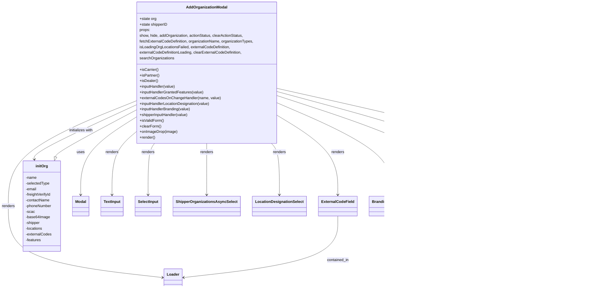

# Diagram: web/portal/src/modules/organizations/components/AddOrganizationModal.js


> Auto-generated by Obscura crawlers

## Diagram 1



### SVG

<svg id="container" width="2467.01171875" xmlns="http://www.w3.org/2000/svg" class="classDiagram" height="1232" viewBox="0 0 2467.01171875 1232" role="graphics-document document" aria-roledescription="class"><style>#container{font-family:"trebuchet ms",verdana,arial,sans-serif;font-size:16px;fill:#333;}@keyframes edge-animation-frame{from{stroke-dashoffset:0;}}@keyframes dash{to{stroke-dashoffset:0;}}#container .edge-animation-slow{stroke-dasharray:9,5!important;stroke-dashoffset:900;animation:dash 50s linear infinite;stroke-linecap:round;}#container .edge-animation-fast{stroke-dasharray:9,5!important;stroke-dashoffset:900;animation:dash 20s linear infinite;stroke-linecap:round;}#container .error-icon{fill:#552222;}#container .error-text{fill:#552222;stroke:#552222;}#container .edge-thickness-normal{stroke-width:1px;}#container .edge-thickness-thick{stroke-width:3.5px;}#container .edge-pattern-solid{stroke-dasharray:0;}#container .edge-thickness-invisible{stroke-width:0;fill:none;}#container .edge-pattern-dashed{stroke-dasharray:3;}#container .edge-pattern-dotted{stroke-dasharray:2;}#container .marker{fill:#333333;stroke:#333333;}#container .marker.cross{stroke:#333333;}#container svg{font-family:"trebuchet ms",verdana,arial,sans-serif;font-size:16px;}#container p{margin:0;}#container g.classGroup text{fill:#9370DB;stroke:none;font-family:"trebuchet ms",verdana,arial,sans-serif;font-size:10px;}#container g.classGroup text .title{font-weight:bolder;}#container .nodeLabel,#container .edgeLabel{color:#131300;}#container .edgeLabel .label rect{fill:#ECECFF;}#container .label text{fill:#131300;}#container .labelBkg{background:#ECECFF;}#container .edgeLabel .label span{background:#ECECFF;}#container .classTitle{font-weight:bolder;}#container .node rect,#container .node circle,#container .node ellipse,#container .node polygon,#container .node path{fill:#ECECFF;stroke:#9370DB;stroke-width:1px;}#container .divider{stroke:#9370DB;stroke-width:1;}#container g.clickable{cursor:pointer;}#container g.classGroup rect{fill:#ECECFF;stroke:#9370DB;}#container g.classGroup line{stroke:#9370DB;stroke-width:1;}#container .classLabel .box{stroke:none;stroke-width:0;fill:#ECECFF;opacity:0.5;}#container .classLabel .label{fill:#9370DB;font-size:10px;}#container .relation{stroke:#333333;stroke-width:1;fill:none;}#container .dashed-line{stroke-dasharray:3;}#container .dotted-line{stroke-dasharray:1 2;}#container #compositionStart,#container .composition{fill:#333333!important;stroke:#333333!important;stroke-width:1;}#container #compositionEnd,#container .composition{fill:#333333!important;stroke:#333333!important;stroke-width:1;}#container #dependencyStart,#container .dependency{fill:#333333!important;stroke:#333333!important;stroke-width:1;}#container #dependencyStart,#container .dependency{fill:#333333!important;stroke:#333333!important;stroke-width:1;}#container #extensionStart,#container .extension{fill:transparent!important;stroke:#333333!important;stroke-width:1;}#container #extensionEnd,#container .extension{fill:transparent!important;stroke:#333333!important;stroke-width:1;}#container #aggregationStart,#container .aggregation{fill:transparent!important;stroke:#333333!important;stroke-width:1;}#container #aggregationEnd,#container .aggregation{fill:transparent!important;stroke:#333333!important;stroke-width:1;}#container #lollipopStart,#container .lollipop{fill:#ECECFF!important;stroke:#333333!important;stroke-width:1;}#container #lollipopEnd,#container .lollipop{fill:#ECECFF!important;stroke:#333333!important;stroke-width:1;}#container .edgeTerminals{font-size:11px;line-height:initial;}#container .classTitleText{text-anchor:middle;font-size:18px;fill:#333;}#container .label-icon{display:inline-block;height:1em;overflow:visible;vertical-align:-0.125em;}#container .node .label-icon path{fill:currentColor;stroke:revert;stroke-width:revert;}#container :root{--mermaid-font-family:"trebuchet ms",verdana,arial,sans-serif;}</style><g><defs><marker id="container_class-aggregationStart" class="marker aggregation class" refX="18" refY="7" markerWidth="190" markerHeight="240" orient="auto"><path d="M 18,7 L9,13 L1,7 L9,1 Z"></path></marker></defs><defs><marker id="container_class-aggregationEnd" class="marker aggregation class" refX="1" refY="7" markerWidth="20" markerHeight="28" orient="auto"><path d="M 18,7 L9,13 L1,7 L9,1 Z"></path></marker></defs><defs><marker id="container_class-extensionStart" class="marker extension class" refX="18" refY="7" markerWidth="190" markerHeight="240" orient="auto"><path d="M 1,7 L18,13 V 1 Z"></path></marker></defs><defs><marker id="container_class-extensionEnd" class="marker extension class" refX="1" refY="7" markerWidth="20" markerHeight="28" orient="auto"><path d="M 1,1 V 13 L18,7 Z"></path></marker></defs><defs><marker id="container_class-compositionStart" class="marker composition class" refX="18" refY="7" markerWidth="190" markerHeight="240" orient="auto"><path d="M 18,7 L9,13 L1,7 L9,1 Z"></path></marker></defs><defs><marker id="container_class-compositionEnd" class="marker composition class" refX="1" refY="7" markerWidth="20" markerHeight="28" orient="auto"><path d="M 18,7 L9,13 L1,7 L9,1 Z"></path></marker></defs><defs><marker id="container_class-dependencyStart" class="marker dependency class" refX="6" refY="7" markerWidth="190" markerHeight="240" orient="auto"><path d="M 5,7 L9,13 L1,7 L9,1 Z"></path></marker></defs><defs><marker id="container_class-dependencyEnd" class="marker dependency class" refX="13" refY="7" markerWidth="20" markerHeight="28" orient="auto"><path d="M 18,7 L9,13 L14,7 L9,1 Z"></path></marker></defs><defs><marker id="container_class-lollipopStart" class="marker lollipop class" refX="13" refY="7" markerWidth="190" markerHeight="240" orient="auto"><circle stroke="black" fill="transparent" cx="7" cy="7" r="6"></circle></marker></defs><defs><marker id="container_class-lollipopEnd" class="marker lollipop class" refX="1" refY="7" markerWidth="190" markerHeight="240" orient="auto"><circle stroke="black" fill="transparent" cx="7" cy="7" r="6"></circle></marker></defs><g class="root"><g class="clusters"></g><g class="edgePaths"><path d="M568.074,500.265L530.78,524.388C493.486,548.51,418.897,596.755,381.603,651.044C344.309,705.333,344.309,765.667,344.309,795.833L344.309,826" id="id_AddOrganizationModal_Modal_1" class="edge-thickness-normal edge-pattern-solid relation" style=";;;" data-edge="true" data-et="edge" data-id="id_AddOrganizationModal_Modal_1" data-points="W3sieCI6NTY4LjA3NDIxODc1LCJ5Ijo1MDAuMjY1MzQ3MTI4NTA1fSx7IngiOjM0NC4zMDg1OTM3NSwieSI6NjQ1fSx7IngiOjM0NC4zMDg1OTM3NSwieSI6ODMyfV0=" marker-end="url(#container_class-dependencyEnd)"></path><path d="M568.074,564.993L552.651,578.328C537.228,591.662,506.382,618.331,490.958,661.832C475.535,705.333,475.535,765.667,475.535,795.833L475.535,826" id="id_AddOrganizationModal_TextInput_2" class="edge-thickness-normal edge-pattern-solid relation" style=";;;" data-edge="true" data-et="edge" data-id="id_AddOrganizationModal_TextInput_2" data-points="W3sieCI6NTY4LjA3NDIxODc1LCJ5Ijo1NjQuOTkzNDg2MDYwMTY4OH0seyJ4Ijo0NzUuNTM1MTU2MjUsInkiOjY0NX0seyJ4Ijo0NzUuNTM1MTU2MjUsInkiOjgzMn1d" marker-end="url(#container_class-dependencyEnd)"></path><path d="M652.62,608L648.248,614.167C643.876,620.333,635.131,632.667,630.759,669C626.387,705.333,626.387,765.667,626.387,795.833L626.387,826" id="id_AddOrganizationModal_SelectInput_3" class="edge-thickness-normal edge-pattern-solid relation" style=";;;" data-edge="true" data-et="edge" data-id="id_AddOrganizationModal_SelectInput_3" data-points="W3sieCI6NjUyLjYyMDIxMjgxNTI4MTksInkiOjYwOH0seyJ4Ijo2MjYuMzg2NzE4NzUsInkiOjY0NX0seyJ4Ijo2MjYuMzg2NzE4NzUsInkiOjgzMn1d" marker-end="url(#container_class-dependencyEnd)"></path><path d="M865.324,608L865.324,614.167C865.324,620.333,865.324,632.667,865.324,669C865.324,705.333,865.324,765.667,865.324,795.833L865.324,826" id="id_AddOrganizationModal_ShipperOrganizationsAsyncSelect_4" class="edge-thickness-normal edge-pattern-solid relation" style=";;;" data-edge="true" data-et="edge" data-id="id_AddOrganizationModal_ShipperOrganizationsAsyncSelect_4" data-points="W3sieCI6ODY1LjMyNDIxODc1LCJ5Ijo2MDh9LHsieCI6ODY1LjMyNDIxODc1LCJ5Ijo2NDV9LHsieCI6ODY1LjMyNDIxODc1LCJ5Ijo4MzJ9XQ==" marker-end="url(#container_class-dependencyEnd)"></path><path d="M1127.636,608L1133.028,614.167C1138.42,620.333,1149.204,632.667,1154.596,669C1159.988,705.333,1159.988,765.667,1159.988,795.833L1159.988,826" id="id_AddOrganizationModal_LocationDesignationSelect_5" class="edge-thickness-normal edge-pattern-solid relation" style=";;;" data-edge="true" data-et="edge" data-id="id_AddOrganizationModal_LocationDesignationSelect_5" data-points="W3sieCI6MTEyNy42MzY0NDA1NjAwODg5LCJ5Ijo2MDh9LHsieCI6MTE1OS45ODgyODEyNSwieSI6NjQ1fSx7IngiOjExNTkuOTg4MjgxMjUsInkiOjgzMn1d" marker-end="url(#container_class-dependencyEnd)"></path><path d="M1162.574,496.144L1201.771,520.953C1240.967,545.762,1319.361,595.381,1358.557,650.357C1397.754,705.333,1397.754,765.667,1397.754,795.833L1397.754,826" id="id_AddOrganizationModal_ExternalCodeField_6" class="edge-thickness-normal edge-pattern-solid relation" style=";;;" data-edge="true" data-et="edge" data-id="id_AddOrganizationModal_ExternalCodeField_6" data-points="W3sieCI6MTE2Mi41NzQyMTg3NSwieSI6NDk2LjE0MzYyMjI1MDU5MDZ9LHsieCI6MTM5Ny43NTM5MDYyNSwieSI6NjQ1fSx7IngiOjEzOTcuNzUzOTA2MjUsInkiOjgzMn1d" marker-end="url(#container_class-dependencyEnd)"></path><path d="M1162.574,441.042L1238.523,475.035C1314.473,509.028,1466.371,577.014,1542.32,641.174C1618.27,705.333,1618.27,765.667,1618.27,795.833L1618.27,826" id="id_AddOrganizationModal_BrandingOptionSelect_7" class="edge-thickness-normal edge-pattern-solid relation" style=";;;" data-edge="true" data-et="edge" data-id="id_AddOrganizationModal_BrandingOptionSelect_7" data-points="W3sieCI6MTE2Mi41NzQyMTg3NSwieSI6NDQxLjA0MTg2NjgzNTQ0ODMzfSx7IngiOjE2MTguMjY5NTMxMjUsInkiOjY0NX0seyJ4IjoxNjE4LjI2OTUzMTI1LCJ5Ijo4MzJ9XQ==" marker-end="url(#container_class-dependencyEnd)"></path><path d="M1162.574,409.118L1278.142,448.432C1393.71,487.745,1624.845,566.373,1740.413,635.853C1855.98,705.333,1855.98,765.667,1855.98,795.833L1855.98,826" id="id_AddOrganizationModal_GrantedFeaturesSelect_8" class="edge-thickness-normal edge-pattern-solid relation" style=";;;" data-edge="true" data-et="edge" data-id="id_AddOrganizationModal_GrantedFeaturesSelect_8" data-points="W3sieCI6MTE2Mi41NzQyMTg3NSwieSI6NDA5LjExODA3MTk4NTExMDl9LHsieCI6MTg1NS45ODA0Njg3NSwieSI6NjQ1fSx7IngiOjE4NTUuOTgwNDY4NzUsInkiOjgzMn1d" marker-end="url(#container_class-dependencyEnd)"></path><path d="M568.074,428.753L479.354,464.794C390.633,500.835,213.191,572.918,124.471,647.125C35.75,721.333,35.75,797.667,35.75,874C35.75,950.333,35.75,1026.667,142.121,1077.164C248.491,1127.662,461.232,1152.323,567.603,1164.654L673.974,1176.985" id="id_AddOrganizationModal_Loader_9" class="edge-thickness-normal edge-pattern-solid relation" style=";;;" data-edge="true" data-et="edge" data-id="id_AddOrganizationModal_Loader_9" data-points="W3sieCI6NTY4LjA3NDIxODc1LCJ5Ijo0MjguNzUyNjA3NDY1MjM3N30seyJ4IjozNS43NSwieSI6NjQ1fSx7IngiOjM1Ljc1LCJ5Ijo4NzR9LHsieCI6MzUuNzUsInkiOjExMDN9LHsieCI6Njc5LjkzMzU5Mzc1LCJ5IjoxMTc3LjY3NTUzNzc5OTI3OX1d" marker-end="url(#container_class-dependencyEnd)"></path><path d="M1162.574,391.228L1313.633,433.523C1464.691,475.819,1766.809,560.409,1917.867,632.871C2068.926,705.333,2068.926,765.667,2068.926,795.833L2068.926,826" id="id_AddOrganizationModal_ImageUploader_10" class="edge-thickness-normal edge-pattern-solid relation" style=";;;" data-edge="true" data-et="edge" data-id="id_AddOrganizationModal_ImageUploader_10" data-points="W3sieCI6MTE2Mi41NzQyMTg3NSwieSI6MzkxLjIyNzkxNjIxNTAwNTczfSx7IngiOjIwNjguOTI1NzgxMjUsInkiOjY0NX0seyJ4IjoyMDY4LjkyNTc4MTI1LCJ5Ijo4MzJ9XQ==" marker-end="url(#container_class-dependencyEnd)"></path><path d="M1162.574,376.728L1355.955,421.44C1549.336,466.152,1936.098,555.576,2129.479,625.455C2322.859,695.333,2322.859,745.667,2322.859,770.833L2322.859,796" id="id_AddOrganizationModal_ValidationRow_11" class="edge-thickness-normal edge-pattern-solid relation" style=";;;" data-edge="true" data-et="edge" data-id="id_AddOrganizationModal_ValidationRow_11" data-points="W3sieCI6MTE2Mi41NzQyMTg3NSwieSI6Mzc2LjcyNzg0NDc5MzYyMzY2fSx7IngiOjIzMjIuODU5Mzc1LCJ5Ijo2NDV9LHsieCI6MjMyMi44NTkzNzUsInkiOjgwMn1d" marker-end="url(#container_class-dependencyEnd)"></path><path d="M568.074,446.767L497.303,479.806C426.531,512.845,284.988,578.922,215.036,617.14C145.084,655.358,146.722,665.716,147.541,670.895L148.36,676.074" id="id_AddOrganizationModal_initOrg_12" class="edge-thickness-normal edge-pattern-solid relation" style=";;;" data-edge="true" data-et="edge" data-id="id_AddOrganizationModal_initOrg_12" data-points="W3sieCI6NTY4LjA3NDIxODc1LCJ5Ijo0NDYuNzY3Mzg3NjIyMzYxMzV9LHsieCI6MTQzLjQ0NTMxMjUsInkiOjY0NX0seyJ4IjoxNDkuMjk3ODgxNDEzNzU1NDUsInkiOjY4Mn1d" marker-end="url(#container_class-dependencyEnd)"></path><path d="M2322.859,946L2322.859,972.167C2322.859,998.333,2322.859,1050.667,2322.859,1082C2322.859,1113.333,2322.859,1123.667,2322.859,1128.833L2322.859,1134" id="id_ValidationRow_FontAwesomeIcon_13" class="edge-thickness-normal edge-pattern-solid relation" style=";;;" data-edge="true" data-et="edge" data-id="id_ValidationRow_FontAwesomeIcon_13" data-points="W3sieCI6MjMyMi44NTkzNzUsInkiOjk0Nn0seyJ4IjoyMzIyLjg1OTM3NSwieSI6MTEwM30seyJ4IjoyMzIyLjg1OTM3NSwieSI6MTE0MH1d" marker-end="url(#container_class-dependencyEnd)"></path><path d="M1397.754,916L1397.754,947.167C1397.754,978.333,1397.754,1040.667,1291.545,1084.163C1185.337,1127.659,972.92,1152.318,866.711,1164.648L760.503,1176.977" id="id_ExternalCodeField_Loader_14" class="edge-thickness-normal edge-pattern-solid relation" style=";;;" data-edge="true" data-et="edge" data-id="id_ExternalCodeField_Loader_14" data-points="W3sieCI6MTM5Ny43NTM5MDYyNSwieSI6OTE2fSx7IngiOjEzOTcuNzUzOTA2MjUsInkiOjExMDN9LHsieCI6NzU0LjU0Mjk2ODc1LCJ5IjoxMTc3LjY2OTM1Njg3NTUzMDl9XQ==" marker-end="url(#container_class-dependencyEnd)"></path><path d="M238.038,665.388L238.988,661.99C239.939,658.592,241.841,651.796,296.847,619.091C351.853,586.386,459.964,527.772,514.019,498.465L568.074,469.159" id="id_initOrg_AddOrganizationModal_15" class="edge-thickness-normal edge-pattern-solid relation" style=";;;" data-edge="true" data-et="edge" data-id="id_initOrg_AddOrganizationModal_15" data-points="W3sieCI6MjMzLjM4OTU4NDQ3MDUyNDAzLCJ5Ijo2ODJ9LHsieCI6MjQzLjc0MjE4NzUsInkiOjY0NX0seyJ4Ijo1NjguMDc0MjE4NzUsInkiOjQ2OS4xNTg1MzU3NDIzNDA5fV0=" marker-start="url(#container_class-extensionStart)"></path></g><g class="edgeLabels"><g class="edgeLabel" transform="translate(344.30859375, 645)"><g class="label" data-id="id_AddOrganizationModal_Modal_1" transform="translate(-16.4921875, -12)"><foreignObject width="32.984375" height="24"><div xmlns="http://www.w3.org/1999/xhtml" class="labelBkg" style="display: table-cell; white-space: nowrap; line-height: 1.5; max-width: 200px; text-align: center;"><span class="edgeLabel"><p>uses</p></span></div></foreignObject></g></g><g class="edgeLabel" transform="translate(475.53515625, 645)"><g class="label" data-id="id_AddOrganizationModal_TextInput_2" transform="translate(-27.75, -12)"><foreignObject width="55.5" height="24"><div xmlns="http://www.w3.org/1999/xhtml" class="labelBkg" style="display: table-cell; white-space: nowrap; line-height: 1.5; max-width: 200px; text-align: center;"><span class="edgeLabel"><p>renders</p></span></div></foreignObject></g></g><g class="edgeLabel" transform="translate(626.38671875, 645)"><g class="label" data-id="id_AddOrganizationModal_SelectInput_3" transform="translate(-27.75, -12)"><foreignObject width="55.5" height="24"><div xmlns="http://www.w3.org/1999/xhtml" class="labelBkg" style="display: table-cell; white-space: nowrap; line-height: 1.5; max-width: 200px; text-align: center;"><span class="edgeLabel"><p>renders</p></span></div></foreignObject></g></g><g class="edgeLabel" transform="translate(865.32421875, 645)"><g class="label" data-id="id_AddOrganizationModal_ShipperOrganizationsAsyncSelect_4" transform="translate(-27.75, -12)"><foreignObject width="55.5" height="24"><div xmlns="http://www.w3.org/1999/xhtml" class="labelBkg" style="display: table-cell; white-space: nowrap; line-height: 1.5; max-width: 200px; text-align: center;"><span class="edgeLabel"><p>renders</p></span></div></foreignObject></g></g><g class="edgeLabel" transform="translate(1159.98828125, 645)"><g class="label" data-id="id_AddOrganizationModal_LocationDesignationSelect_5" transform="translate(-27.75, -12)"><foreignObject width="55.5" height="24"><div xmlns="http://www.w3.org/1999/xhtml" class="labelBkg" style="display: table-cell; white-space: nowrap; line-height: 1.5; max-width: 200px; text-align: center;"><span class="edgeLabel"><p>renders</p></span></div></foreignObject></g></g><g class="edgeLabel" transform="translate(1397.75390625, 645)"><g class="label" data-id="id_AddOrganizationModal_ExternalCodeField_6" transform="translate(-27.75, -12)"><foreignObject width="55.5" height="24"><div xmlns="http://www.w3.org/1999/xhtml" class="labelBkg" style="display: table-cell; white-space: nowrap; line-height: 1.5; max-width: 200px; text-align: center;"><span class="edgeLabel"><p>renders</p></span></div></foreignObject></g></g><g class="edgeLabel" transform="translate(1618.26953125, 645)"><g class="label" data-id="id_AddOrganizationModal_BrandingOptionSelect_7" transform="translate(-27.75, -12)"><foreignObject width="55.5" height="24"><div xmlns="http://www.w3.org/1999/xhtml" class="labelBkg" style="display: table-cell; white-space: nowrap; line-height: 1.5; max-width: 200px; text-align: center;"><span class="edgeLabel"><p>renders</p></span></div></foreignObject></g></g><g class="edgeLabel" transform="translate(1855.98046875, 645)"><g class="label" data-id="id_AddOrganizationModal_GrantedFeaturesSelect_8" transform="translate(-27.75, -12)"><foreignObject width="55.5" height="24"><div xmlns="http://www.w3.org/1999/xhtml" class="labelBkg" style="display: table-cell; white-space: nowrap; line-height: 1.5; max-width: 200px; text-align: center;"><span class="edgeLabel"><p>renders</p></span></div></foreignObject></g></g><g class="edgeLabel" transform="translate(35.75, 874)"><g class="label" data-id="id_AddOrganizationModal_Loader_9" transform="translate(-27.75, -12)"><foreignObject width="55.5" height="24"><div xmlns="http://www.w3.org/1999/xhtml" class="labelBkg" style="display: table-cell; white-space: nowrap; line-height: 1.5; max-width: 200px; text-align: center;"><span class="edgeLabel"><p>renders</p></span></div></foreignObject></g></g><g class="edgeLabel" transform="translate(2068.92578125, 645)"><g class="label" data-id="id_AddOrganizationModal_ImageUploader_10" transform="translate(-27.75, -12)"><foreignObject width="55.5" height="24"><div xmlns="http://www.w3.org/1999/xhtml" class="labelBkg" style="display: table-cell; white-space: nowrap; line-height: 1.5; max-width: 200px; text-align: center;"><span class="edgeLabel"><p>renders</p></span></div></foreignObject></g></g><g class="edgeLabel" transform="translate(2322.859375, 645)"><g class="label" data-id="id_AddOrganizationModal_ValidationRow_11" transform="translate(-27.75, -12)"><foreignObject width="55.5" height="24"><div xmlns="http://www.w3.org/1999/xhtml" class="labelBkg" style="display: table-cell; white-space: nowrap; line-height: 1.5; max-width: 200px; text-align: center;"><span class="edgeLabel"><p>renders</p></span></div></foreignObject></g></g><g class="edgeLabel" transform="translate(338.78806, 553.80672)"><g class="label" data-id="id_AddOrganizationModal_initOrg_12" transform="translate(-52.4453125, -12)"><foreignObject width="104.890625" height="24"><div xmlns="http://www.w3.org/1999/xhtml" class="labelBkg" style="display: table-cell; white-space: nowrap; line-height: 1.5; max-width: 200px; text-align: center;"><span class="edgeLabel"><p>initializes with</p></span></div></foreignObject></g></g><g class="edgeLabel" transform="translate(2322.859375, 1103)"><g class="label" data-id="id_ValidationRow_FontAwesomeIcon_13" transform="translate(-16.4921875, -12)"><foreignObject width="32.984375" height="24"><div xmlns="http://www.w3.org/1999/xhtml" class="labelBkg" style="display: table-cell; white-space: nowrap; line-height: 1.5; max-width: 200px; text-align: center;"><span class="edgeLabel"><p>uses</p></span></div></foreignObject></g></g><g class="edgeLabel" transform="translate(1397.75390625, 1103)"><g class="label" data-id="id_ExternalCodeField_Loader_14" transform="translate(-47.40625, -12)"><foreignObject width="94.8125" height="24"><div xmlns="http://www.w3.org/1999/xhtml" class="labelBkg" style="display: table-cell; white-space: nowrap; line-height: 1.5; max-width: 200px; text-align: center;"><span class="edgeLabel"><p>contained_in</p></span></div></foreignObject></g></g><g class="edgeLabel"><g class="label" data-id="id_initOrg_AddOrganizationModal_15" transform="translate(0, 0)"><foreignObject width="0" height="0"><div xmlns="http://www.w3.org/1999/xhtml" class="labelBkg" style="display: table-cell; white-space: nowrap; line-height: 1.5; max-width: 200px; text-align: center;"><span class="edgeLabel"></span></div></foreignObject></g></g></g><g class="nodes"><g class="node default" id="classId-AddOrganizationModal-0" transform="translate(865.32421875, 308)"><g class="basic label-container"><path d="M-297.25 -300 L297.25 -300 L297.25 300 L-297.25 300" stroke="none" stroke-width="0" fill="#ECECFF" style=""></path><path d="M-297.25 -300 C-156.81354869713502 -300, -16.377097394270038 -300, 297.25 -300 M-297.25 -300 C-92.68210827966902 -300, 111.88578344066195 -300, 297.25 -300 M297.25 -300 C297.25 -93.08974840883297, 297.25 113.82050318233405, 297.25 300 M297.25 -300 C297.25 -167.48995969545072, 297.25 -34.97991939090144, 297.25 300 M297.25 300 C174.16748567230113 300, 51.08497134460225 300, -297.25 300 M297.25 300 C161.05542330803243 300, 24.860846616064862 300, -297.25 300 M-297.25 300 C-297.25 104.28568124167961, -297.25 -91.42863751664078, -297.25 -300 M-297.25 300 C-297.25 150.1808925800031, -297.25 0.36178516000620675, -297.25 -300" stroke="#9370DB" stroke-width="1.3" fill="none" stroke-dasharray="0 0" style=""></path></g><g class="annotation-group text" transform="translate(0, -276)"></g><g class="label-group text" transform="translate(-83.453125, -276)"><g class="label" style="font-weight: bolder" transform="translate(0,-12)"><foreignObject width="166.90625" height="24"><div xmlns="http://www.w3.org/1999/xhtml" style="display: table-cell; white-space: nowrap; line-height: 1.5; max-width: 215px; text-align: center;"><span class="nodeLabel markdown-node-label" style=""><p>AddOrganizationModal</p></span></div></foreignObject></g></g><g class="members-group text" transform="translate(-285.25, -228)"><g class="label" style="" transform="translate(0,-12)"><foreignObject width="71.921875" height="24"><div xmlns="http://www.w3.org/1999/xhtml" style="display: table-cell; white-space: nowrap; line-height: 1.5; max-width: 130px; text-align: center;"><span class="nodeLabel markdown-node-label" style=""><p>+state org</p></span></div></foreignObject></g><g class="label" style="" transform="translate(0,12)"><foreignObject width="118.609375" height="24"><div xmlns="http://www.w3.org/1999/xhtml" style="display: table-cell; white-space: nowrap; line-height: 1.5; max-width: 176px; text-align: center;"><span class="nodeLabel markdown-node-label" style=""><p>+state shipperID</p></span></div></foreignObject></g><g class="label" style="" transform="translate(0,36)"><foreignObject width="45.375" height="24"><div xmlns="http://www.w3.org/1999/xhtml" style="display: table-cell; white-space: nowrap; line-height: 1.5; max-width: 96px; text-align: center;"><span class="nodeLabel markdown-node-label" style=""><p>props:</p></span></div></foreignObject></g><g class="label" style="" transform="translate(0,60)"><foreignObject width="443.625" height="24"><div xmlns="http://www.w3.org/1999/xhtml" style="display: table-cell; white-space: nowrap; line-height: 1.5; max-width: 494px; text-align: center;"><span class="nodeLabel markdown-node-label" style=""><p>show, hide, addOrganization, actionStatus, clearActionStatus,</p></span></div></foreignObject></g><g class="label" style="" transform="translate(0,84)"><foreignObject width="487.046875" height="24"><div xmlns="http://www.w3.org/1999/xhtml" style="display: table-cell; white-space: nowrap; line-height: 1.5; max-width: 537px; text-align: center;"><span class="nodeLabel markdown-node-label" style=""><p>fetchExternalCodeDefinition, organizationName, organizationTypes,</p></span></div></foreignObject></g><g class="label" style="" transform="translate(0,108)"><foreignObject width="385.828125" height="24"><div xmlns="http://www.w3.org/1999/xhtml" style="display: table-cell; white-space: nowrap; line-height: 1.5; max-width: 436px; text-align: center;"><span class="nodeLabel markdown-node-label" style=""><p>isLoadingOrgLocationsFailed, externalCodeDefinition,</p></span></div></foreignObject></g><g class="label" style="" transform="translate(0,132)"><foreignObject width="438.375" height="24"><div xmlns="http://www.w3.org/1999/xhtml" style="display: table-cell; white-space: nowrap; line-height: 1.5; max-width: 489px; text-align: center;"><span class="nodeLabel markdown-node-label" style=""><p>externalCodeDefinitionLoading, clearExternalCodeDefinition,</p></span></div></foreignObject></g><g class="label" style="" transform="translate(0,156)"><foreignObject width="147.015625" height="24"><div xmlns="http://www.w3.org/1999/xhtml" style="display: table-cell; white-space: nowrap; line-height: 1.5; max-width: 197px; text-align: center;"><span class="nodeLabel markdown-node-label" style=""><p>searchOrganizations</p></span></div></foreignObject></g></g><g class="methods-group text" transform="translate(-285.25, -12)"><g class="label" style="" transform="translate(0,-12)"><foreignObject width="79.609375" height="24"><div xmlns="http://www.w3.org/1999/xhtml" style="display: table-cell; white-space: nowrap; line-height: 1.5; max-width: 137px; text-align: center;"><span class="nodeLabel markdown-node-label" style=""><p>+isCarrier()</p></span></div></foreignObject></g><g class="label" style="" transform="translate(0,12)"><foreignObject width="83.6875" height="24"><div xmlns="http://www.w3.org/1999/xhtml" style="display: table-cell; white-space: nowrap; line-height: 1.5; max-width: 141px; text-align: center;"><span class="nodeLabel markdown-node-label" style=""><p>+isPartner()</p></span></div></foreignObject></g><g class="label" style="" transform="translate(0,36)"><foreignObject width="77.25" height="24"><div xmlns="http://www.w3.org/1999/xhtml" style="display: table-cell; white-space: nowrap; line-height: 1.5; max-width: 135px; text-align: center;"><span class="nodeLabel markdown-node-label" style=""><p>+isDealer()</p></span></div></foreignObject></g><g class="label" style="" transform="translate(0,60)"><foreignObject width="153.75" height="24"><div xmlns="http://www.w3.org/1999/xhtml" style="display: table-cell; white-space: nowrap; line-height: 1.5; max-width: 211px; text-align: center;"><span class="nodeLabel markdown-node-label" style=""><p>+inputHandler(value)</p></span></div></foreignObject></g><g class="label" style="" transform="translate(0,84)"><foreignObject width="272.90625" height="24"><div xmlns="http://www.w3.org/1999/xhtml" style="display: table-cell; white-space: nowrap; line-height: 1.5; max-width: 330px; text-align: center;"><span class="nodeLabel markdown-node-label" style=""><p>+inputHandlerGrantedFeatures(value)</p></span></div></foreignObject></g><g class="label" style="" transform="translate(0,108)"><foreignObject width="340.3125" height="24"><div xmlns="http://www.w3.org/1999/xhtml" style="display: table-cell; white-space: nowrap; line-height: 1.5; max-width: 398px; text-align: center;"><span class="nodeLabel markdown-node-label" style=""><p>+externalCodesOnChangeHandler(name, value)</p></span></div></foreignObject></g><g class="label" style="" transform="translate(0,132)"><foreignObject width="302.28125" height="24"><div xmlns="http://www.w3.org/1999/xhtml" style="display: table-cell; white-space: nowrap; line-height: 1.5; max-width: 360px; text-align: center;"><span class="nodeLabel markdown-node-label" style=""><p>+inputHandlerLocationDesignation(value)</p></span></div></foreignObject></g><g class="label" style="" transform="translate(0,156)"><foreignObject width="218.953125" height="24"><div xmlns="http://www.w3.org/1999/xhtml" style="display: table-cell; white-space: nowrap; line-height: 1.5; max-width: 276px; text-align: center;"><span class="nodeLabel markdown-node-label" style=""><p>+inputHandlerBranding(value)</p></span></div></foreignObject></g><g class="label" style="" transform="translate(0,180)"><foreignObject width="209.21875" height="24"><div xmlns="http://www.w3.org/1999/xhtml" style="display: table-cell; white-space: nowrap; line-height: 1.5; max-width: 267px; text-align: center;"><span class="nodeLabel markdown-node-label" style=""><p>+shipperInputHandler(value)</p></span></div></foreignObject></g><g class="label" style="" transform="translate(0,204)"><foreignObject width="102.4375" height="24"><div xmlns="http://www.w3.org/1999/xhtml" style="display: table-cell; white-space: nowrap; line-height: 1.5; max-width: 160px; text-align: center;"><span class="nodeLabel markdown-node-label" style=""><p>+isValidForm()</p></span></div></foreignObject></g><g class="label" style="" transform="translate(0,228)"><foreignObject width="90.578125" height="24"><div xmlns="http://www.w3.org/1999/xhtml" style="display: table-cell; white-space: nowrap; line-height: 1.5; max-width: 148px; text-align: center;"><span class="nodeLabel markdown-node-label" style=""><p>+clearForm()</p></span></div></foreignObject></g><g class="label" style="" transform="translate(0,252)"><foreignObject width="159.234375" height="24"><div xmlns="http://www.w3.org/1999/xhtml" style="display: table-cell; white-space: nowrap; line-height: 1.5; max-width: 217px; text-align: center;"><span class="nodeLabel markdown-node-label" style=""><p>+onImageDrop(image)</p></span></div></foreignObject></g><g class="label" style="" transform="translate(0,276)"><foreignObject width="66.609375" height="24"><div xmlns="http://www.w3.org/1999/xhtml" style="display: table-cell; white-space: nowrap; line-height: 1.5; max-width: 124px; text-align: center;"><span class="nodeLabel markdown-node-label" style=""><p>+render()</p></span></div></foreignObject></g></g><g class="divider" style=""><path d="M-297.25 -252 C-86.31595910451236 -252, 124.61808179097528 -252, 297.25 -252 M-297.25 -252 C-92.18114274033158 -252, 112.88771451933684 -252, 297.25 -252" stroke="#9370DB" stroke-width="1.3" fill="none" stroke-dasharray="0 0" style=""></path></g><g class="divider" style=""><path d="M-297.25 -36 C-146.7386810787741 -36, 3.772637842451786 -36, 297.25 -36 M-297.25 -36 C-65.47500649389536 -36, 166.29998701220927 -36, 297.25 -36" stroke="#9370DB" stroke-width="1.3" fill="none" stroke-dasharray="0 0" style=""></path></g></g><g class="node default" id="classId-ValidationRow-1" transform="translate(2322.859375, 874)"><g class="basic label-container"><path d="M-136.15234375 -72 L136.15234375 -72 L136.15234375 72 L-136.15234375 72" stroke="none" stroke-width="0" fill="#ECECFF" style=""></path><path d="M-136.15234375 -72 C-36.33471366252353 -72, 63.48291642495295 -72, 136.15234375 -72 M-136.15234375 -72 C-30.009676020595876 -72, 76.13299170880825 -72, 136.15234375 -72 M136.15234375 -72 C136.15234375 -23.445997259463155, 136.15234375 25.10800548107369, 136.15234375 72 M136.15234375 -72 C136.15234375 -23.23813989088208, 136.15234375 25.523720218235837, 136.15234375 72 M136.15234375 72 C46.978593161603385 72, -42.19515742679323 72, -136.15234375 72 M136.15234375 72 C77.43672956809297 72, 18.721115386185957 72, -136.15234375 72 M-136.15234375 72 C-136.15234375 17.007037134314494, -136.15234375 -37.98592573137101, -136.15234375 -72 M-136.15234375 72 C-136.15234375 14.526360626168994, -136.15234375 -42.94727874766201, -136.15234375 -72" stroke="#9370DB" stroke-width="1.3" fill="none" stroke-dasharray="0 0" style=""></path></g><g class="annotation-group text" transform="translate(0, -48)"></g><g class="label-group text" transform="translate(-52.4765625, -48)"><g class="label" style="font-weight: bolder" transform="translate(0,-12)"><foreignObject width="104.953125" height="24"><div xmlns="http://www.w3.org/1999/xhtml" style="display: table-cell; white-space: nowrap; line-height: 1.5; max-width: 154px; text-align: center;"><span class="nodeLabel markdown-node-label" style=""><p>ValidationRow</p></span></div></foreignObject></g></g><g class="members-group text" transform="translate(-124.15234375, 0)"><g class="label" style="" transform="translate(0,-12)"><foreignObject width="195.828125" height="24"><div xmlns="http://www.w3.org/1999/xhtml" style="display: table-cell; white-space: nowrap; line-height: 1.5; max-width: 253px; text-align: center;"><span class="nodeLabel markdown-node-label" style=""><p>+props: isValid, description</p></span></div></foreignObject></g></g><g class="methods-group text" transform="translate(-124.15234375, 48)"><g class="label" style="" transform="translate(0,-12)"><foreignObject width="66.609375" height="24"><div xmlns="http://www.w3.org/1999/xhtml" style="display: table-cell; white-space: nowrap; line-height: 1.5; max-width: 124px; text-align: center;"><span class="nodeLabel markdown-node-label" style=""><p>+render()</p></span></div></foreignObject></g></g><g class="divider" style=""><path d="M-136.15234375 -24 C-77.80223884599505 -24, -19.4521339419901 -24, 136.15234375 -24 M-136.15234375 -24 C-50.47593491326144 -24, 35.20047392347712 -24, 136.15234375 -24" stroke="#9370DB" stroke-width="1.3" fill="none" stroke-dasharray="0 0" style=""></path></g><g class="divider" style=""><path d="M-136.15234375 24 C-61.89439208174868 24, 12.363559586502646 24, 136.15234375 24 M-136.15234375 24 C-80.02181229979435 24, -23.891280849588696 24, 136.15234375 24" stroke="#9370DB" stroke-width="1.3" fill="none" stroke-dasharray="0 0" style=""></path></g></g><g class="node default" id="classId-initOrg-2" transform="translate(179.66796875, 874)"><g class="basic label-container"><path d="M-80.1953125 -192 L80.1953125 -192 L80.1953125 192 L-80.1953125 192" stroke="none" stroke-width="0" fill="#ECECFF" style=""></path><path d="M-80.1953125 -192 C-34.02020596998879 -192, 12.154900560022426 -192, 80.1953125 -192 M-80.1953125 -192 C-30.881592105477367 -192, 18.432128289045266 -192, 80.1953125 -192 M80.1953125 -192 C80.1953125 -74.29316579667636, 80.1953125 43.413668406647275, 80.1953125 192 M80.1953125 -192 C80.1953125 -49.75992983376554, 80.1953125 92.48014033246892, 80.1953125 192 M80.1953125 192 C42.23480899239311 192, 4.274305484786225 192, -80.1953125 192 M80.1953125 192 C37.154186203771204 192, -5.886940092457593 192, -80.1953125 192 M-80.1953125 192 C-80.1953125 54.33999117524351, -80.1953125 -83.32001764951298, -80.1953125 -192 M-80.1953125 192 C-80.1953125 67.94403483624839, -80.1953125 -56.11193032750322, -80.1953125 -192" stroke="#9370DB" stroke-width="1.3" fill="none" stroke-dasharray="0 0" style=""></path></g><g class="annotation-group text" transform="translate(0, -168)"></g><g class="label-group text" transform="translate(-25.265625, -168)"><g class="label" style="font-weight: bolder" transform="translate(0,-12)"><foreignObject width="50.53125" height="24"><div xmlns="http://www.w3.org/1999/xhtml" style="display: table-cell; white-space: nowrap; line-height: 1.5; max-width: 100px; text-align: center;"><span class="nodeLabel markdown-node-label" style=""><p>initOrg</p></span></div></foreignObject></g></g><g class="members-group text" transform="translate(-68.1953125, -120)"><g class="label" style="" transform="translate(0,-12)"><foreignObject width="46.96875" height="24"><div xmlns="http://www.w3.org/1999/xhtml" style="display: table-cell; white-space: nowrap; line-height: 1.5; max-width: 104px; text-align: center;"><span class="nodeLabel markdown-node-label" style=""><p>-name</p></span></div></foreignObject></g><g class="label" style="" transform="translate(0,12)"><foreignObject width="101.171875" height="24"><div xmlns="http://www.w3.org/1999/xhtml" style="display: table-cell; white-space: nowrap; line-height: 1.5; max-width: 159px; text-align: center;"><span class="nodeLabel markdown-node-label" style=""><p>-selectedType</p></span></div></foreignObject></g><g class="label" style="" transform="translate(0,36)"><foreignObject width="46.796875" height="24"><div xmlns="http://www.w3.org/1999/xhtml" style="display: table-cell; white-space: nowrap; line-height: 1.5; max-width: 104px; text-align: center;"><span class="nodeLabel markdown-node-label" style=""><p>-email</p></span></div></foreignObject></g><g class="label" style="" transform="translate(0,60)"><foreignObject width="109.40625" height="24"><div xmlns="http://www.w3.org/1999/xhtml" style="display: table-cell; white-space: nowrap; line-height: 1.5; max-width: 167px; text-align: center;"><span class="nodeLabel markdown-node-label" style=""><p>-freightVerifyId</p></span></div></foreignObject></g><g class="label" style="" transform="translate(0,84)"><foreignObject width="102.359375" height="24"><div xmlns="http://www.w3.org/1999/xhtml" style="display: table-cell; white-space: nowrap; line-height: 1.5; max-width: 160px; text-align: center;"><span class="nodeLabel markdown-node-label" style=""><p>-contactName</p></span></div></foreignObject></g><g class="label" style="" transform="translate(0,108)"><foreignObject width="111.125" height="24"><div xmlns="http://www.w3.org/1999/xhtml" style="display: table-cell; white-space: nowrap; line-height: 1.5; max-width: 169px; text-align: center;"><span class="nodeLabel markdown-node-label" style=""><p>-phoneNumber</p></span></div></foreignObject></g><g class="label" style="" transform="translate(0,132)"><foreignObject width="37.765625" height="24"><div xmlns="http://www.w3.org/1999/xhtml" style="display: table-cell; white-space: nowrap; line-height: 1.5; max-width: 95px; text-align: center;"><span class="nodeLabel markdown-node-label" style=""><p>-scac</p></span></div></foreignObject></g><g class="label" style="" transform="translate(0,156)"><foreignObject width="101.34375" height="24"><div xmlns="http://www.w3.org/1999/xhtml" style="display: table-cell; white-space: nowrap; line-height: 1.5; max-width: 159px; text-align: center;"><span class="nodeLabel markdown-node-label" style=""><p>-base64Image</p></span></div></foreignObject></g><g class="label" style="" transform="translate(0,180)"><foreignObject width="61.71875" height="24"><div xmlns="http://www.w3.org/1999/xhtml" style="display: table-cell; white-space: nowrap; line-height: 1.5; max-width: 120px; text-align: center;"><span class="nodeLabel markdown-node-label" style=""><p>-shipper</p></span></div></foreignObject></g><g class="label" style="" transform="translate(0,204)"><foreignObject width="73.078125" height="24"><div xmlns="http://www.w3.org/1999/xhtml" style="display: table-cell; white-space: nowrap; line-height: 1.5; max-width: 130px; text-align: center;"><span class="nodeLabel markdown-node-label" style=""><p>-locations</p></span></div></foreignObject></g><g class="label" style="" transform="translate(0,228)"><foreignObject width="109.578125" height="24"><div xmlns="http://www.w3.org/1999/xhtml" style="display: table-cell; white-space: nowrap; line-height: 1.5; max-width: 167px; text-align: center;"><span class="nodeLabel markdown-node-label" style=""><p>-externalCodes</p></span></div></foreignObject></g><g class="label" style="" transform="translate(0,252)"><foreignObject width="65.65625" height="24"><div xmlns="http://www.w3.org/1999/xhtml" style="display: table-cell; white-space: nowrap; line-height: 1.5; max-width: 123px; text-align: center;"><span class="nodeLabel markdown-node-label" style=""><p>-features</p></span></div></foreignObject></g></g><g class="methods-group text" transform="translate(-68.1953125, 192)"></g><g class="divider" style=""><path d="M-80.1953125 -144 C-35.2356739721131 -144, 9.723964555773804 -144, 80.1953125 -144 M-80.1953125 -144 C-38.56304313994885 -144, 3.069226220102294 -144, 80.1953125 -144" stroke="#9370DB" stroke-width="1.3" fill="none" stroke-dasharray="0 0" style=""></path></g><g class="divider" style=""><path d="M-80.1953125 168 C-29.824712013583735 168, 20.54588847283253 168, 80.1953125 168 M-80.1953125 168 C-18.95249261010553 168, 42.29032727978894 168, 80.1953125 168" stroke="#9370DB" stroke-width="1.3" fill="none" stroke-dasharray="0 0" style=""></path></g></g><g class="node default" id="classId-Modal-3" transform="translate(344.30859375, 874)"><g class="basic label-container"><path d="M-34.4453125 -42 L34.4453125 -42 L34.4453125 42 L-34.4453125 42" stroke="none" stroke-width="0" fill="#ECECFF" style=""></path><path d="M-34.4453125 -42 C-9.56233556616099 -42, 15.320641367678022 -42, 34.4453125 -42 M-34.4453125 -42 C-7.48823573036243 -42, 19.46884103927514 -42, 34.4453125 -42 M34.4453125 -42 C34.4453125 -21.0068075532677, 34.4453125 -0.013615106535397103, 34.4453125 42 M34.4453125 -42 C34.4453125 -21.852849494194306, 34.4453125 -1.7056989883886118, 34.4453125 42 M34.4453125 42 C19.199265569514914 42, 3.9532186390298243 42, -34.4453125 42 M34.4453125 42 C14.17507308106984 42, -6.09516633786032 42, -34.4453125 42 M-34.4453125 42 C-34.4453125 24.185210817328826, -34.4453125 6.370421634657653, -34.4453125 -42 M-34.4453125 42 C-34.4453125 11.34880255317152, -34.4453125 -19.30239489365696, -34.4453125 -42" stroke="#9370DB" stroke-width="1.3" fill="none" stroke-dasharray="0 0" style=""></path></g><g class="annotation-group text" transform="translate(0, -18)"></g><g class="label-group text" transform="translate(-22.4453125, -18)"><g class="label" style="font-weight: bolder" transform="translate(0,-12)"><foreignObject width="44.890625" height="24"><div xmlns="http://www.w3.org/1999/xhtml" style="display: table-cell; white-space: nowrap; line-height: 1.5; max-width: 95px; text-align: center;"><span class="nodeLabel markdown-node-label" style=""><p>Modal</p></span></div></foreignObject></g></g><g class="members-group text" transform="translate(-22.4453125, 30)"></g><g class="methods-group text" transform="translate(-22.4453125, 60)"></g><g class="divider" style=""><path d="M-34.4453125 6 C-18.100705464089533 6, -1.7560984281790653 6, 34.4453125 6 M-34.4453125 6 C-14.161148480784703 6, 6.123015538430593 6, 34.4453125 6" stroke="#9370DB" stroke-width="1.3" fill="none" stroke-dasharray="0 0" style=""></path></g><g class="divider" style=""><path d="M-34.4453125 24 C-9.790163721237914 24, 14.864985057524173 24, 34.4453125 24 M-34.4453125 24 C-8.36790708900762 24, 17.70949832198476 24, 34.4453125 24" stroke="#9370DB" stroke-width="1.3" fill="none" stroke-dasharray="0 0" style=""></path></g></g><g class="node default" id="classId-TextInput-4" transform="translate(475.53515625, 874)"><g class="basic label-container"><path d="M-46.78125 -42 L46.78125 -42 L46.78125 42 L-46.78125 42" stroke="none" stroke-width="0" fill="#ECECFF" style=""></path><path d="M-46.78125 -42 C-25.227496111287316 -42, -3.6737422225746315 -42, 46.78125 -42 M-46.78125 -42 C-28.056574545717165 -42, -9.33189909143433 -42, 46.78125 -42 M46.78125 -42 C46.78125 -16.14854467171197, 46.78125 9.702910656576059, 46.78125 42 M46.78125 -42 C46.78125 -14.612207804655334, 46.78125 12.775584390689332, 46.78125 42 M46.78125 42 C19.710861615431753 42, -7.359526769136494 42, -46.78125 42 M46.78125 42 C9.797336431386043 42, -27.186577137227914 42, -46.78125 42 M-46.78125 42 C-46.78125 23.75421857355891, -46.78125 5.508437147117817, -46.78125 -42 M-46.78125 42 C-46.78125 12.431031972513022, -46.78125 -17.137936054973956, -46.78125 -42" stroke="#9370DB" stroke-width="1.3" fill="none" stroke-dasharray="0 0" style=""></path></g><g class="annotation-group text" transform="translate(0, -18)"></g><g class="label-group text" transform="translate(-34.78125, -18)"><g class="label" style="font-weight: bolder" transform="translate(0,-12)"><foreignObject width="69.5625" height="24"><div xmlns="http://www.w3.org/1999/xhtml" style="display: table-cell; white-space: nowrap; line-height: 1.5; max-width: 118px; text-align: center;"><span class="nodeLabel markdown-node-label" style=""><p>TextInput</p></span></div></foreignObject></g></g><g class="members-group text" transform="translate(-34.78125, 30)"></g><g class="methods-group text" transform="translate(-34.78125, 60)"></g><g class="divider" style=""><path d="M-46.78125 6 C-11.416045582328543 6, 23.949158835342914 6, 46.78125 6 M-46.78125 6 C-11.273377669012945 6, 24.23449466197411 6, 46.78125 6" stroke="#9370DB" stroke-width="1.3" fill="none" stroke-dasharray="0 0" style=""></path></g><g class="divider" style=""><path d="M-46.78125 24 C-14.453370640288874 24, 17.874508719422252 24, 46.78125 24 M-46.78125 24 C-27.095336314530012 24, -7.409422629060025 24, 46.78125 24" stroke="#9370DB" stroke-width="1.3" fill="none" stroke-dasharray="0 0" style=""></path></g></g><g class="node default" id="classId-SelectInput-5" transform="translate(626.38671875, 874)"><g class="basic label-container"><path d="M-54.0703125 -42 L54.0703125 -42 L54.0703125 42 L-54.0703125 42" stroke="none" stroke-width="0" fill="#ECECFF" style=""></path><path d="M-54.0703125 -42 C-30.241824798340506 -42, -6.413337096681012 -42, 54.0703125 -42 M-54.0703125 -42 C-16.875561772526936 -42, 20.319188954946128 -42, 54.0703125 -42 M54.0703125 -42 C54.0703125 -16.366881232151187, 54.0703125 9.266237535697627, 54.0703125 42 M54.0703125 -42 C54.0703125 -11.786967209696282, 54.0703125 18.426065580607435, 54.0703125 42 M54.0703125 42 C21.286510459454966 42, -11.497291581090067 42, -54.0703125 42 M54.0703125 42 C14.72209162487028 42, -24.62612925025944 42, -54.0703125 42 M-54.0703125 42 C-54.0703125 14.62969214782537, -54.0703125 -12.74061570434926, -54.0703125 -42 M-54.0703125 42 C-54.0703125 13.173365003691327, -54.0703125 -15.653269992617346, -54.0703125 -42" stroke="#9370DB" stroke-width="1.3" fill="none" stroke-dasharray="0 0" style=""></path></g><g class="annotation-group text" transform="translate(0, -18)"></g><g class="label-group text" transform="translate(-42.0703125, -18)"><g class="label" style="font-weight: bolder" transform="translate(0,-12)"><foreignObject width="84.140625" height="24"><div xmlns="http://www.w3.org/1999/xhtml" style="display: table-cell; white-space: nowrap; line-height: 1.5; max-width: 133px; text-align: center;"><span class="nodeLabel markdown-node-label" style=""><p>SelectInput</p></span></div></foreignObject></g></g><g class="members-group text" transform="translate(-42.0703125, 30)"></g><g class="methods-group text" transform="translate(-42.0703125, 60)"></g><g class="divider" style=""><path d="M-54.0703125 6 C-17.378180209846157 6, 19.313952080307686 6, 54.0703125 6 M-54.0703125 6 C-27.378021870343257 6, -0.6857312406865148 6, 54.0703125 6" stroke="#9370DB" stroke-width="1.3" fill="none" stroke-dasharray="0 0" style=""></path></g><g class="divider" style=""><path d="M-54.0703125 24 C-29.971962922131073 24, -5.8736133442621465 24, 54.0703125 24 M-54.0703125 24 C-27.256478827800915 24, -0.4426451556018307 24, 54.0703125 24" stroke="#9370DB" stroke-width="1.3" fill="none" stroke-dasharray="0 0" style=""></path></g></g><g class="node default" id="classId-ShipperOrganizationsAsyncSelect-6" transform="translate(865.32421875, 874)"><g class="basic label-container"><path d="M-134.8671875 -42 L134.8671875 -42 L134.8671875 42 L-134.8671875 42" stroke="none" stroke-width="0" fill="#ECECFF" style=""></path><path d="M-134.8671875 -42 C-58.066945434237155 -42, 18.73329663152569 -42, 134.8671875 -42 M-134.8671875 -42 C-60.1372162021615 -42, 14.592755095677006 -42, 134.8671875 -42 M134.8671875 -42 C134.8671875 -17.920710323254028, 134.8671875 6.158579353491945, 134.8671875 42 M134.8671875 -42 C134.8671875 -14.012732147532393, 134.8671875 13.974535704935214, 134.8671875 42 M134.8671875 42 C54.04554309871561 42, -26.776101302568776 42, -134.8671875 42 M134.8671875 42 C77.09930220463895 42, 19.33141690927789 42, -134.8671875 42 M-134.8671875 42 C-134.8671875 19.610382754912433, -134.8671875 -2.779234490175135, -134.8671875 -42 M-134.8671875 42 C-134.8671875 16.530143936077017, -134.8671875 -8.939712127845965, -134.8671875 -42" stroke="#9370DB" stroke-width="1.3" fill="none" stroke-dasharray="0 0" style=""></path></g><g class="annotation-group text" transform="translate(0, -18)"></g><g class="label-group text" transform="translate(-122.8671875, -18)"><g class="label" style="font-weight: bolder" transform="translate(0,-12)"><foreignObject width="245.734375" height="24"><div xmlns="http://www.w3.org/1999/xhtml" style="display: table-cell; white-space: nowrap; line-height: 1.5; max-width: 292px; text-align: center;"><span class="nodeLabel markdown-node-label" style=""><p>ShipperOrganizationsAsyncSelect</p></span></div></foreignObject></g></g><g class="members-group text" transform="translate(-122.8671875, 30)"></g><g class="methods-group text" transform="translate(-122.8671875, 60)"></g><g class="divider" style=""><path d="M-134.8671875 6 C-37.38886583959045 6, 60.0894558208191 6, 134.8671875 6 M-134.8671875 6 C-68.15942234232075 6, -1.4516571846415047 6, 134.8671875 6" stroke="#9370DB" stroke-width="1.3" fill="none" stroke-dasharray="0 0" style=""></path></g><g class="divider" style=""><path d="M-134.8671875 24 C-36.831581073823 24, 61.204025352353995 24, 134.8671875 24 M-134.8671875 24 C-27.087632454220795 24, 80.69192259155841 24, 134.8671875 24" stroke="#9370DB" stroke-width="1.3" fill="none" stroke-dasharray="0 0" style=""></path></g></g><g class="node default" id="classId-LocationDesignationSelect-7" transform="translate(1159.98828125, 874)"><g class="basic label-container"><path d="M-109.796875 -42 L109.796875 -42 L109.796875 42 L-109.796875 42" stroke="none" stroke-width="0" fill="#ECECFF" style=""></path><path d="M-109.796875 -42 C-60.23018197466047 -42, -10.663488949320936 -42, 109.796875 -42 M-109.796875 -42 C-28.914347706638154 -42, 51.96817958672369 -42, 109.796875 -42 M109.796875 -42 C109.796875 -17.40051505461651, 109.796875 7.198969890766982, 109.796875 42 M109.796875 -42 C109.796875 -11.236856636525463, 109.796875 19.526286726949074, 109.796875 42 M109.796875 42 C42.48981535835557 42, -24.817244283288858 42, -109.796875 42 M109.796875 42 C24.388300347676605 42, -61.02027430464679 42, -109.796875 42 M-109.796875 42 C-109.796875 24.895005326828997, -109.796875 7.790010653657994, -109.796875 -42 M-109.796875 42 C-109.796875 25.064062868877254, -109.796875 8.128125737754509, -109.796875 -42" stroke="#9370DB" stroke-width="1.3" fill="none" stroke-dasharray="0 0" style=""></path></g><g class="annotation-group text" transform="translate(0, -18)"></g><g class="label-group text" transform="translate(-97.796875, -18)"><g class="label" style="font-weight: bolder" transform="translate(0,-12)"><foreignObject width="195.59375" height="24"><div xmlns="http://www.w3.org/1999/xhtml" style="display: table-cell; white-space: nowrap; line-height: 1.5; max-width: 243px; text-align: center;"><span class="nodeLabel markdown-node-label" style=""><p>LocationDesignationSelect</p></span></div></foreignObject></g></g><g class="members-group text" transform="translate(-97.796875, 30)"></g><g class="methods-group text" transform="translate(-97.796875, 60)"></g><g class="divider" style=""><path d="M-109.796875 6 C-40.08994149696211 6, 29.616992006075776 6, 109.796875 6 M-109.796875 6 C-42.916719271507006 6, 23.96343645698599 6, 109.796875 6" stroke="#9370DB" stroke-width="1.3" fill="none" stroke-dasharray="0 0" style=""></path></g><g class="divider" style=""><path d="M-109.796875 24 C-27.49847076060456 24, 54.79993347879088 24, 109.796875 24 M-109.796875 24 C-27.041921877706017 24, 55.71303124458797 24, 109.796875 24" stroke="#9370DB" stroke-width="1.3" fill="none" stroke-dasharray="0 0" style=""></path></g></g><g class="node default" id="classId-ExternalCodeField-8" transform="translate(1397.75390625, 874)"><g class="basic label-container"><path d="M-77.96875 -42 L77.96875 -42 L77.96875 42 L-77.96875 42" stroke="none" stroke-width="0" fill="#ECECFF" style=""></path><path d="M-77.96875 -42 C-30.026847019251463 -42, 17.915055961497075 -42, 77.96875 -42 M-77.96875 -42 C-16.28646761565288 -42, 45.39581476869424 -42, 77.96875 -42 M77.96875 -42 C77.96875 -21.573179758620242, 77.96875 -1.1463595172404837, 77.96875 42 M77.96875 -42 C77.96875 -9.659857629649188, 77.96875 22.680284740701623, 77.96875 42 M77.96875 42 C21.51049962455555 42, -34.9477507508889 42, -77.96875 42 M77.96875 42 C19.635985337578596 42, -38.69677932484281 42, -77.96875 42 M-77.96875 42 C-77.96875 21.98670927402778, -77.96875 1.9734185480555624, -77.96875 -42 M-77.96875 42 C-77.96875 11.351389381270266, -77.96875 -19.297221237459468, -77.96875 -42" stroke="#9370DB" stroke-width="1.3" fill="none" stroke-dasharray="0 0" style=""></path></g><g class="annotation-group text" transform="translate(0, -18)"></g><g class="label-group text" transform="translate(-65.96875, -18)"><g class="label" style="font-weight: bolder" transform="translate(0,-12)"><foreignObject width="131.9375" height="24"><div xmlns="http://www.w3.org/1999/xhtml" style="display: table-cell; white-space: nowrap; line-height: 1.5; max-width: 180px; text-align: center;"><span class="nodeLabel markdown-node-label" style=""><p>ExternalCodeField</p></span></div></foreignObject></g></g><g class="members-group text" transform="translate(-65.96875, 30)"></g><g class="methods-group text" transform="translate(-65.96875, 60)"></g><g class="divider" style=""><path d="M-77.96875 6 C-29.997341089841065 6, 17.97406782031787 6, 77.96875 6 M-77.96875 6 C-43.78277724983373 6, -9.596804499667456 6, 77.96875 6" stroke="#9370DB" stroke-width="1.3" fill="none" stroke-dasharray="0 0" style=""></path></g><g class="divider" style=""><path d="M-77.96875 24 C-21.496362012967367 24, 34.976025974065266 24, 77.96875 24 M-77.96875 24 C-38.84827880412062 24, 0.27219239175876453 24, 77.96875 24" stroke="#9370DB" stroke-width="1.3" fill="none" stroke-dasharray="0 0" style=""></path></g></g><g class="node default" id="classId-BrandingOptionSelect-9" transform="translate(1618.26953125, 874)"><g class="basic label-container"><path d="M-92.546875 -42 L92.546875 -42 L92.546875 42 L-92.546875 42" stroke="none" stroke-width="0" fill="#ECECFF" style=""></path><path d="M-92.546875 -42 C-50.88445995047636 -42, -9.222044900952724 -42, 92.546875 -42 M-92.546875 -42 C-24.718658061302335 -42, 43.10955887739533 -42, 92.546875 -42 M92.546875 -42 C92.546875 -19.537018570884644, 92.546875 2.9259628582307116, 92.546875 42 M92.546875 -42 C92.546875 -11.261885551219429, 92.546875 19.476228897561143, 92.546875 42 M92.546875 42 C44.535489042771346 42, -3.4758969144573086 42, -92.546875 42 M92.546875 42 C40.966009580455555 42, -10.61485583908889 42, -92.546875 42 M-92.546875 42 C-92.546875 18.466820990889545, -92.546875 -5.06635801822091, -92.546875 -42 M-92.546875 42 C-92.546875 19.86224363800416, -92.546875 -2.2755127239916817, -92.546875 -42" stroke="#9370DB" stroke-width="1.3" fill="none" stroke-dasharray="0 0" style=""></path></g><g class="annotation-group text" transform="translate(0, -18)"></g><g class="label-group text" transform="translate(-80.546875, -18)"><g class="label" style="font-weight: bolder" transform="translate(0,-12)"><foreignObject width="161.09375" height="24"><div xmlns="http://www.w3.org/1999/xhtml" style="display: table-cell; white-space: nowrap; line-height: 1.5; max-width: 209px; text-align: center;"><span class="nodeLabel markdown-node-label" style=""><p>BrandingOptionSelect</p></span></div></foreignObject></g></g><g class="members-group text" transform="translate(-80.546875, 30)"></g><g class="methods-group text" transform="translate(-80.546875, 60)"></g><g class="divider" style=""><path d="M-92.546875 6 C-21.413988499895822 6, 49.718898000208355 6, 92.546875 6 M-92.546875 6 C-19.146124931532242 6, 54.254625136935516 6, 92.546875 6" stroke="#9370DB" stroke-width="1.3" fill="none" stroke-dasharray="0 0" style=""></path></g><g class="divider" style=""><path d="M-92.546875 24 C-55.46611088109314 24, -18.385346762186273 24, 92.546875 24 M-92.546875 24 C-21.060163058522207 24, 50.426548882955586 24, 92.546875 24" stroke="#9370DB" stroke-width="1.3" fill="none" stroke-dasharray="0 0" style=""></path></g></g><g class="node default" id="classId-GrantedFeaturesSelect-10" transform="translate(1855.98046875, 874)"><g class="basic label-container"><path d="M-95.1640625 -42 L95.1640625 -42 L95.1640625 42 L-95.1640625 42" stroke="none" stroke-width="0" fill="#ECECFF" style=""></path><path d="M-95.1640625 -42 C-54.24482714535896 -42, -13.325591790717922 -42, 95.1640625 -42 M-95.1640625 -42 C-42.53988757498844 -42, 10.084287350023118 -42, 95.1640625 -42 M95.1640625 -42 C95.1640625 -15.771651007262541, 95.1640625 10.456697985474918, 95.1640625 42 M95.1640625 -42 C95.1640625 -13.267977509946142, 95.1640625 15.464044980107715, 95.1640625 42 M95.1640625 42 C24.343483150172617 42, -46.47709619965477 42, -95.1640625 42 M95.1640625 42 C28.276257253242903 42, -38.61154799351419 42, -95.1640625 42 M-95.1640625 42 C-95.1640625 25.0978809759403, -95.1640625 8.195761951880598, -95.1640625 -42 M-95.1640625 42 C-95.1640625 9.685922790099326, -95.1640625 -22.628154419801348, -95.1640625 -42" stroke="#9370DB" stroke-width="1.3" fill="none" stroke-dasharray="0 0" style=""></path></g><g class="annotation-group text" transform="translate(0, -18)"></g><g class="label-group text" transform="translate(-83.1640625, -18)"><g class="label" style="font-weight: bolder" transform="translate(0,-12)"><foreignObject width="166.328125" height="24"><div xmlns="http://www.w3.org/1999/xhtml" style="display: table-cell; white-space: nowrap; line-height: 1.5; max-width: 214px; text-align: center;"><span class="nodeLabel markdown-node-label" style=""><p>GrantedFeaturesSelect</p></span></div></foreignObject></g></g><g class="members-group text" transform="translate(-83.1640625, 30)"></g><g class="methods-group text" transform="translate(-83.1640625, 60)"></g><g class="divider" style=""><path d="M-95.1640625 6 C-42.04129966366803 6, 11.081463172663945 6, 95.1640625 6 M-95.1640625 6 C-30.20809695687089 6, 34.74786858625822 6, 95.1640625 6" stroke="#9370DB" stroke-width="1.3" fill="none" stroke-dasharray="0 0" style=""></path></g><g class="divider" style=""><path d="M-95.1640625 24 C-45.00543915309086 24, 5.1531841938182765 24, 95.1640625 24 M-95.1640625 24 C-27.53267581975763 24, 40.09871086048474 24, 95.1640625 24" stroke="#9370DB" stroke-width="1.3" fill="none" stroke-dasharray="0 0" style=""></path></g></g><g class="node default" id="classId-Loader-11" transform="translate(717.23828125, 1182)"><g class="basic label-container"><path d="M-37.3046875 -42 L37.3046875 -42 L37.3046875 42 L-37.3046875 42" stroke="none" stroke-width="0" fill="#ECECFF" style=""></path><path d="M-37.3046875 -42 C-17.944152425273323 -42, 1.4163826494533538 -42, 37.3046875 -42 M-37.3046875 -42 C-15.681385411935889 -42, 5.941916676128223 -42, 37.3046875 -42 M37.3046875 -42 C37.3046875 -10.6860135053074, 37.3046875 20.6279729893852, 37.3046875 42 M37.3046875 -42 C37.3046875 -14.162298204590801, 37.3046875 13.675403590818398, 37.3046875 42 M37.3046875 42 C8.758161510510796 42, -19.78836447897841 42, -37.3046875 42 M37.3046875 42 C7.7772747573626795 42, -21.75013798527464 42, -37.3046875 42 M-37.3046875 42 C-37.3046875 8.452946556450037, -37.3046875 -25.094106887099926, -37.3046875 -42 M-37.3046875 42 C-37.3046875 12.088606711831037, -37.3046875 -17.822786576337926, -37.3046875 -42" stroke="#9370DB" stroke-width="1.3" fill="none" stroke-dasharray="0 0" style=""></path></g><g class="annotation-group text" transform="translate(0, -18)"></g><g class="label-group text" transform="translate(-25.3046875, -18)"><g class="label" style="font-weight: bolder" transform="translate(0,-12)"><foreignObject width="50.609375" height="24"><div xmlns="http://www.w3.org/1999/xhtml" style="display: table-cell; white-space: nowrap; line-height: 1.5; max-width: 101px; text-align: center;"><span class="nodeLabel markdown-node-label" style=""><p>Loader</p></span></div></foreignObject></g></g><g class="members-group text" transform="translate(-25.3046875, 30)"></g><g class="methods-group text" transform="translate(-25.3046875, 60)"></g><g class="divider" style=""><path d="M-37.3046875 6 C-9.825324042718506 6, 17.654039414562988 6, 37.3046875 6 M-37.3046875 6 C-20.806541701943086 6, -4.308395903886172 6, 37.3046875 6" stroke="#9370DB" stroke-width="1.3" fill="none" stroke-dasharray="0 0" style=""></path></g><g class="divider" style=""><path d="M-37.3046875 24 C-9.546566860015897 24, 18.211553779968206 24, 37.3046875 24 M-37.3046875 24 C-7.884394658659314 24, 21.535898182681372 24, 37.3046875 24" stroke="#9370DB" stroke-width="1.3" fill="none" stroke-dasharray="0 0" style=""></path></g></g><g class="node default" id="classId-ImageUploader-12" transform="translate(2068.92578125, 874)"><g class="basic label-container"><path d="M-67.78125 -42 L67.78125 -42 L67.78125 42 L-67.78125 42" stroke="none" stroke-width="0" fill="#ECECFF" style=""></path><path d="M-67.78125 -42 C-28.69317706120374 -42, 10.394895877592518 -42, 67.78125 -42 M-67.78125 -42 C-29.43440381589017 -42, 8.912442368219658 -42, 67.78125 -42 M67.78125 -42 C67.78125 -22.780822551663753, 67.78125 -3.561645103327507, 67.78125 42 M67.78125 -42 C67.78125 -16.396772075744305, 67.78125 9.20645584851139, 67.78125 42 M67.78125 42 C35.703601771869664 42, 3.625953543739328 42, -67.78125 42 M67.78125 42 C36.07442474300639 42, 4.367599486012786 42, -67.78125 42 M-67.78125 42 C-67.78125 23.31880436695566, -67.78125 4.637608733911321, -67.78125 -42 M-67.78125 42 C-67.78125 13.928455087161936, -67.78125 -14.143089825676128, -67.78125 -42" stroke="#9370DB" stroke-width="1.3" fill="none" stroke-dasharray="0 0" style=""></path></g><g class="annotation-group text" transform="translate(0, -18)"></g><g class="label-group text" transform="translate(-55.78125, -18)"><g class="label" style="font-weight: bolder" transform="translate(0,-12)"><foreignObject width="111.5625" height="24"><div xmlns="http://www.w3.org/1999/xhtml" style="display: table-cell; white-space: nowrap; line-height: 1.5; max-width: 162px; text-align: center;"><span class="nodeLabel markdown-node-label" style=""><p>ImageUploader</p></span></div></foreignObject></g></g><g class="members-group text" transform="translate(-55.78125, 30)"></g><g class="methods-group text" transform="translate(-55.78125, 60)"></g><g class="divider" style=""><path d="M-67.78125 6 C-29.087795037085698 6, 9.605659925828604 6, 67.78125 6 M-67.78125 6 C-29.984449461606168 6, 7.812351076787664 6, 67.78125 6" stroke="#9370DB" stroke-width="1.3" fill="none" stroke-dasharray="0 0" style=""></path></g><g class="divider" style=""><path d="M-67.78125 24 C-21.374705331144433 24, 25.031839337711133 24, 67.78125 24 M-67.78125 24 C-40.32832130510058 24, -12.87539261020116 24, 67.78125 24" stroke="#9370DB" stroke-width="1.3" fill="none" stroke-dasharray="0 0" style=""></path></g></g><g class="node default" id="classId-FontAwesomeIcon-13" transform="translate(2322.859375, 1182)"><g class="basic label-container"><path d="M-78.140625 -42 L78.140625 -42 L78.140625 42 L-78.140625 42" stroke="none" stroke-width="0" fill="#ECECFF" style=""></path><path d="M-78.140625 -42 C-25.85708755570233 -42, 26.426449888595343 -42, 78.140625 -42 M-78.140625 -42 C-44.25274040166493 -42, -10.36485580332986 -42, 78.140625 -42 M78.140625 -42 C78.140625 -25.152228517279458, 78.140625 -8.304457034558915, 78.140625 42 M78.140625 -42 C78.140625 -24.494404002821035, 78.140625 -6.9888080056420705, 78.140625 42 M78.140625 42 C22.973974002973428 42, -32.192676994053144 42, -78.140625 42 M78.140625 42 C17.184692230245894 42, -43.77124053950821 42, -78.140625 42 M-78.140625 42 C-78.140625 19.952423777573188, -78.140625 -2.0951524448536247, -78.140625 -42 M-78.140625 42 C-78.140625 11.775732513069354, -78.140625 -18.448534973861292, -78.140625 -42" stroke="#9370DB" stroke-width="1.3" fill="none" stroke-dasharray="0 0" style=""></path></g><g class="annotation-group text" transform="translate(0, -18)"></g><g class="label-group text" transform="translate(-66.140625, -18)"><g class="label" style="font-weight: bolder" transform="translate(0,-12)"><foreignObject width="132.28125" height="24"><div xmlns="http://www.w3.org/1999/xhtml" style="display: table-cell; white-space: nowrap; line-height: 1.5; max-width: 181px; text-align: center;"><span class="nodeLabel markdown-node-label" style=""><p>FontAwesomeIcon</p></span></div></foreignObject></g></g><g class="members-group text" transform="translate(-66.140625, 30)"></g><g class="methods-group text" transform="translate(-66.140625, 60)"></g><g class="divider" style=""><path d="M-78.140625 6 C-29.95289413223805 6, 18.2348367355239 6, 78.140625 6 M-78.140625 6 C-40.13417288409834 6, -2.1277207681966814 6, 78.140625 6" stroke="#9370DB" stroke-width="1.3" fill="none" stroke-dasharray="0 0" style=""></path></g><g class="divider" style=""><path d="M-78.140625 24 C-26.550155637923424 24, 25.04031372415315 24, 78.140625 24 M-78.140625 24 C-39.841553029842274 24, -1.5424810596845475 24, 78.140625 24" stroke="#9370DB" stroke-width="1.3" fill="none" stroke-dasharray="0 0" style=""></path></g></g></g></g></g></svg>

## Diagram 2

```mermaid
flowchart LR
  A[User clicks Create button] --> B{isValidForm()}
  B -- false --> C[Button disabled / no action]
  B -- true --> D[Build payload from org state]
  D --> E[Call addOrganization(payload)]
  E --> F[Server processes request]
  F --> G{actionStatus returned}
  G -- ORGANIZATION_ADDED --> H[setOrg(initOrg)]
  H --> I[clearActionStatus()]
  I --> J[searchOrganizations()]
  J --> K[hide() modal closed]
  G -- ORGANIZATION_EXISTS or Organization_Add_Error --> L[Show FormAlert with error]
```

> SVG rendering failed for this diagram.
