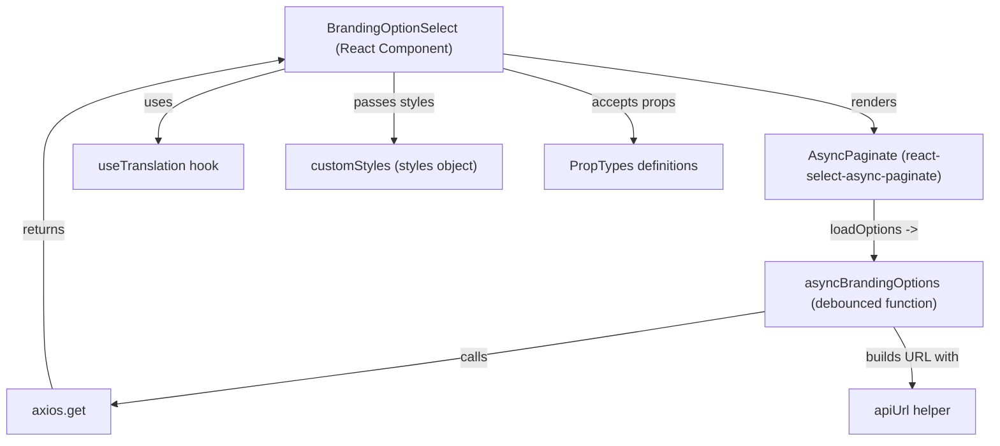

# Diagram: web/portal/src/modules/organizations/components/BrandingOptionSelect.js


> Auto-generated by Obscura crawlers

## Diagram 1



### SVG

<svg id="container" width="1188.91015625" xmlns="http://www.w3.org/2000/svg" class="flowchart" height="526" viewBox="0 0 1188.91015625 526" role="graphics-document document" aria-roledescription="flowchart-v2"><style>#container{font-family:"trebuchet ms",verdana,arial,sans-serif;font-size:16px;fill:#333;}@keyframes edge-animation-frame{from{stroke-dashoffset:0;}}@keyframes dash{to{stroke-dashoffset:0;}}#container .edge-animation-slow{stroke-dasharray:9,5!important;stroke-dashoffset:900;animation:dash 50s linear infinite;stroke-linecap:round;}#container .edge-animation-fast{stroke-dasharray:9,5!important;stroke-dashoffset:900;animation:dash 20s linear infinite;stroke-linecap:round;}#container .error-icon{fill:#552222;}#container .error-text{fill:#552222;stroke:#552222;}#container .edge-thickness-normal{stroke-width:1px;}#container .edge-thickness-thick{stroke-width:3.5px;}#container .edge-pattern-solid{stroke-dasharray:0;}#container .edge-thickness-invisible{stroke-width:0;fill:none;}#container .edge-pattern-dashed{stroke-dasharray:3;}#container .edge-pattern-dotted{stroke-dasharray:2;}#container .marker{fill:#333333;stroke:#333333;}#container .marker.cross{stroke:#333333;}#container svg{font-family:"trebuchet ms",verdana,arial,sans-serif;font-size:16px;}#container p{margin:0;}#container .label{font-family:"trebuchet ms",verdana,arial,sans-serif;color:#333;}#container .cluster-label text{fill:#333;}#container .cluster-label span{color:#333;}#container .cluster-label span p{background-color:transparent;}#container .label text,#container span{fill:#333;color:#333;}#container .node rect,#container .node circle,#container .node ellipse,#container .node polygon,#container .node path{fill:#ECECFF;stroke:#9370DB;stroke-width:1px;}#container .rough-node .label text,#container .node .label text,#container .image-shape .label,#container .icon-shape .label{text-anchor:middle;}#container .node .katex path{fill:#000;stroke:#000;stroke-width:1px;}#container .rough-node .label,#container .node .label,#container .image-shape .label,#container .icon-shape .label{text-align:center;}#container .node.clickable{cursor:pointer;}#container .root .anchor path{fill:#333333!important;stroke-width:0;stroke:#333333;}#container .arrowheadPath{fill:#333333;}#container .edgePath .path{stroke:#333333;stroke-width:2.0px;}#container .flowchart-link{stroke:#333333;fill:none;}#container .edgeLabel{background-color:rgba(232,232,232, 0.8);text-align:center;}#container .edgeLabel p{background-color:rgba(232,232,232, 0.8);}#container .edgeLabel rect{opacity:0.5;background-color:rgba(232,232,232, 0.8);fill:rgba(232,232,232, 0.8);}#container .labelBkg{background-color:rgba(232, 232, 232, 0.5);}#container .cluster rect{fill:#ffffde;stroke:#aaaa33;stroke-width:1px;}#container .cluster text{fill:#333;}#container .cluster span{color:#333;}#container div.mermaidTooltip{position:absolute;text-align:center;max-width:200px;padding:2px;font-family:"trebuchet ms",verdana,arial,sans-serif;font-size:12px;background:hsl(80, 100%, 96.2745098039%);border:1px solid #aaaa33;border-radius:2px;pointer-events:none;z-index:100;}#container .flowchartTitleText{text-anchor:middle;font-size:18px;fill:#333;}#container rect.text{fill:none;stroke-width:0;}#container .icon-shape,#container .image-shape{background-color:rgba(232,232,232, 0.8);text-align:center;}#container .icon-shape p,#container .image-shape p{background-color:rgba(232,232,232, 0.8);padding:2px;}#container .icon-shape rect,#container .image-shape rect{opacity:0.5;background-color:rgba(232,232,232, 0.8);fill:rgba(232,232,232, 0.8);}#container .label-icon{display:inline-block;height:1em;overflow:visible;vertical-align:-0.125em;}#container .node .label-icon path{fill:currentColor;stroke:revert;stroke-width:revert;}#container :root{--mermaid-font-family:"trebuchet ms",verdana,arial,sans-serif;}</style><g><marker id="container_flowchart-v2-pointEnd" class="marker flowchart-v2" viewBox="0 0 10 10" refX="5" refY="5" markerUnits="userSpaceOnUse" markerWidth="8" markerHeight="8" orient="auto"><path d="M 0 0 L 10 5 L 0 10 z" class="arrowMarkerPath" style="stroke-width: 1; stroke-dasharray: 1, 0;"></path></marker><marker id="container_flowchart-v2-pointStart" class="marker flowchart-v2" viewBox="0 0 10 10" refX="4.5" refY="5" markerUnits="userSpaceOnUse" markerWidth="8" markerHeight="8" orient="auto"><path d="M 0 5 L 10 10 L 10 0 z" class="arrowMarkerPath" style="stroke-width: 1; stroke-dasharray: 1, 0;"></path></marker><marker id="container_flowchart-v2-circleEnd" class="marker flowchart-v2" viewBox="0 0 10 10" refX="11" refY="5" markerUnits="userSpaceOnUse" markerWidth="11" markerHeight="11" orient="auto"><circle cx="5" cy="5" r="5" class="arrowMarkerPath" style="stroke-width: 1; stroke-dasharray: 1, 0;"></circle></marker><marker id="container_flowchart-v2-circleStart" class="marker flowchart-v2" viewBox="0 0 10 10" refX="-1" refY="5" markerUnits="userSpaceOnUse" markerWidth="11" markerHeight="11" orient="auto"><circle cx="5" cy="5" r="5" class="arrowMarkerPath" style="stroke-width: 1; stroke-dasharray: 1, 0;"></circle></marker><marker id="container_flowchart-v2-crossEnd" class="marker cross flowchart-v2" viewBox="0 0 11 11" refX="12" refY="5.2" markerUnits="userSpaceOnUse" markerWidth="11" markerHeight="11" orient="auto"><path d="M 1,1 l 9,9 M 10,1 l -9,9" class="arrowMarkerPath" style="stroke-width: 2; stroke-dasharray: 1, 0;"></path></marker><marker id="container_flowchart-v2-crossStart" class="marker cross flowchart-v2" viewBox="0 0 11 11" refX="-1" refY="5.2" markerUnits="userSpaceOnUse" markerWidth="11" markerHeight="11" orient="auto"><path d="M 1,1 l 9,9 M 10,1 l -9,9" class="arrowMarkerPath" style="stroke-width: 2; stroke-dasharray: 1, 0;"></path></marker><g class="root"><g class="clusters"></g><g class="edgePaths"><path d="M604.082,64.128L678.553,73.94C753.025,83.752,901.967,103.376,976.439,118.688C1050.91,134,1050.91,145,1050.91,150.5L1050.91,156" id="L_BrandingOptionSelect_AsyncPaginateComp_0" class="edge-thickness-normal edge-pattern-solid edge-thickness-normal edge-pattern-solid flowchart-link" style=";" data-edge="true" data-et="edge" data-id="L_BrandingOptionSelect_AsyncPaginateComp_0" data-points="W3sieCI6NjA0LjA4MjAzMTI1LCJ5Ijo2NC4xMjgxNTIzNDE3Mzk1OH0seyJ4IjoxMDUwLjkxMDE1NjI1LCJ5IjoxMjN9LHsieCI6MTA1MC45MTAxNTYyNSwieSI6MTYwfV0=" marker-end="url(#container_flowchart-v2-pointEnd)"></path><path d="M344.082,81.833L318.475,88.694C292.868,95.555,241.655,109.278,216.048,123.639C190.441,138,190.441,153,190.441,160.5L190.441,168" id="L_BrandingOptionSelect_useTranslationHook_0" class="edge-thickness-normal edge-pattern-solid edge-thickness-normal edge-pattern-solid flowchart-link" style=";" data-edge="true" data-et="edge" data-id="L_BrandingOptionSelect_useTranslationHook_0" data-points="W3sieCI6MzQ0LjA4MjAzMTI1LCJ5Ijo4MS44MzI4MTAwMDM4NTYxMX0seyJ4IjoxOTAuNDQxNDA2MjUsInkiOjEyM30seyJ4IjoxOTAuNDQxNDA2MjUsInkiOjE3Mn1d" marker-end="url(#container_flowchart-v2-pointEnd)"></path><path d="M474.082,86L474.082,92.167C474.082,98.333,474.082,110.667,474.082,122.333C474.082,134,474.082,145,474.082,150.5L474.082,156" id="L_BrandingOptionSelect_customStyles_0" class="edge-thickness-normal edge-pattern-solid edge-thickness-normal edge-pattern-solid flowchart-link" style=";" data-edge="true" data-et="edge" data-id="L_BrandingOptionSelect_customStyles_0" data-points="W3sieCI6NDc0LjA4MjAzMTI1LCJ5Ijo4Nn0seyJ4Ijo0NzQuMDgyMDMxMjUsInkiOjEyM30seyJ4Ijo0NzQuMDgyMDMxMjUsInkiOjE2MH1d" marker-end="url(#container_flowchart-v2-pointEnd)"></path><path d="M604.082,81.256L630.484,88.214C656.887,95.171,709.691,109.085,736.094,123.543C762.496,138,762.496,153,762.496,160.5L762.496,168" id="L_BrandingOptionSelect_PropTypesDef_0" class="edge-thickness-normal edge-pattern-solid edge-thickness-normal edge-pattern-solid flowchart-link" style=";" data-edge="true" data-et="edge" data-id="L_BrandingOptionSelect_PropTypesDef_0" data-points="W3sieCI6NjA0LjA4MjAzMTI1LCJ5Ijo4MS4yNTYzMDQ2ODM0NzkxNn0seyJ4Ijo3NjIuNDk2MDkzNzUsInkiOjEyM30seyJ4Ijo3NjIuNDk2MDkzNzUsInkiOjE3Mn1d" marker-end="url(#container_flowchart-v2-pointEnd)"></path><path d="M1050.91,238L1050.91,244.167C1050.91,250.333,1050.91,262.667,1050.91,274.333C1050.91,286,1050.91,297,1050.91,302.5L1050.91,308" id="L_AsyncPaginateComp_asyncBrandingOptionsFn_0" class="edge-thickness-normal edge-pattern-solid edge-thickness-normal edge-pattern-solid flowchart-link" style=";" data-edge="true" data-et="edge" data-id="L_AsyncPaginateComp_asyncBrandingOptionsFn_0" data-points="W3sieCI6MTA1MC45MTAxNTYyNSwieSI6MjM4fSx7IngiOjEwNTAuOTEwMTU2MjUsInkiOjI3NX0seyJ4IjoxMDUwLjkxMDE1NjI1LCJ5IjozMTJ9XQ==" marker-end="url(#container_flowchart-v2-pointEnd)"></path><path d="M920.91,371.526L862.355,380.772C803.799,390.018,686.689,408.509,555.873,427.012C425.057,445.515,280.536,464.03,208.275,473.288L136.014,482.546" id="L_asyncBrandingOptionsFn_axios_0" class="edge-thickness-normal edge-pattern-solid edge-thickness-normal edge-pattern-solid flowchart-link" style=";" data-edge="true" data-et="edge" data-id="L_asyncBrandingOptionsFn_axios_0" data-points="W3sieCI6OTIwLjkxMDE1NjI1LCJ5IjozNzEuNTI2MzcxMzE2NTc3NX0seyJ4Ijo1NjkuNTc4MTI1LCJ5Ijo0Mjd9LHsieCI6MTMyLjA0Njg3NSwieSI6NDgzLjA1MzkyMzAyNTE5NDN9XQ==" marker-end="url(#container_flowchart-v2-pointEnd)"></path><path d="M1074.738,390L1078.506,396.167C1082.273,402.333,1089.808,414.667,1093.576,426.333C1097.344,438,1097.344,449,1097.344,454.5L1097.344,460" id="L_asyncBrandingOptionsFn_apiUrl_0" class="edge-thickness-normal edge-pattern-solid edge-thickness-normal edge-pattern-solid flowchart-link" style=";" data-edge="true" data-et="edge" data-id="L_asyncBrandingOptionsFn_apiUrl_0" data-points="W3sieCI6MTA3NC43Mzc5MjE0NjM4MTU4LCJ5IjozOTB9LHsieCI6MTA5Ny4zNDM3NSwieSI6NDI3fSx7IngiOjEwOTcuMzQzNzUsInkiOjQ2NH1d" marker-end="url(#container_flowchart-v2-pointEnd)"></path><path d="M62.336,464L60.58,457.833C58.824,451.667,55.312,439.333,53.557,420.5C51.801,401.667,51.801,376.333,51.801,351C51.801,325.667,51.801,300.333,51.801,275C51.801,249.667,51.801,224.333,51.801,199C51.801,173.667,51.801,148.333,99.858,127.018C147.916,105.702,244.03,88.403,292.088,79.754L340.145,71.105" id="L_axios_BrandingOptionSelect_0" class="edge-thickness-normal edge-pattern-solid edge-thickness-normal edge-pattern-solid flowchart-link" style=";" data-edge="true" data-et="edge" data-id="L_axios_BrandingOptionSelect_0" data-points="W3sieCI6NjIuMzM1NzU0Mzk0NTMxMjUsInkiOjQ2NH0seyJ4Ijo1MS44MDA3ODEyNSwieSI6NDI3fSx7IngiOjUxLjgwMDc4MTI1LCJ5IjozNTF9LHsieCI6NTEuODAwNzgxMjUsInkiOjI3NX0seyJ4Ijo1MS44MDA3ODEyNSwieSI6MTk5fSx7IngiOjUxLjgwMDc4MTI1LCJ5IjoxMjN9LHsieCI6MzQ0LjA4MjAzMTI1LCJ5Ijo3MC4zOTY3MjkwNzU3MDQ4OH1d" marker-end="url(#container_flowchart-v2-pointEnd)"></path></g><g class="edgeLabels"><g class="edgeLabel" transform="translate(1050.91015625, 123)"><g class="label" data-id="L_BrandingOptionSelect_AsyncPaginateComp_0" transform="translate(-27.75, -12)"><foreignObject width="55.5" height="24"><div xmlns="http://www.w3.org/1999/xhtml" class="labelBkg" style="display: table-cell; white-space: nowrap; line-height: 1.5; max-width: 200px; text-align: center;"><span class="edgeLabel"><p>renders</p></span></div></foreignObject></g></g><g class="edgeLabel" transform="translate(190.44140625, 123)"><g class="label" data-id="L_BrandingOptionSelect_useTranslationHook_0" transform="translate(-16.4921875, -12)"><foreignObject width="32.984375" height="24"><div xmlns="http://www.w3.org/1999/xhtml" class="labelBkg" style="display: table-cell; white-space: nowrap; line-height: 1.5; max-width: 200px; text-align: center;"><span class="edgeLabel"><p>uses</p></span></div></foreignObject></g></g><g class="edgeLabel" transform="translate(474.08203125, 123)"><g class="label" data-id="L_BrandingOptionSelect_customStyles_0" transform="translate(-47.4765625, -12)"><foreignObject width="94.953125" height="24"><div xmlns="http://www.w3.org/1999/xhtml" class="labelBkg" style="display: table-cell; white-space: nowrap; line-height: 1.5; max-width: 200px; text-align: center;"><span class="edgeLabel"><p>passes styles</p></span></div></foreignObject></g></g><g class="edgeLabel" transform="translate(762.49609375, 123)"><g class="label" data-id="L_BrandingOptionSelect_PropTypesDef_0" transform="translate(-50.296875, -12)"><foreignObject width="100.59375" height="24"><div xmlns="http://www.w3.org/1999/xhtml" class="labelBkg" style="display: table-cell; white-space: nowrap; line-height: 1.5; max-width: 200px; text-align: center;"><span class="edgeLabel"><p>accepts props</p></span></div></foreignObject></g></g><g class="edgeLabel" transform="translate(1050.91015625, 275)"><g class="label" data-id="L_AsyncPaginateComp_asyncBrandingOptionsFn_0" transform="translate(-53.90625, -12)"><foreignObject width="107.8125" height="24"><div xmlns="http://www.w3.org/1999/xhtml" class="labelBkg" style="display: table-cell; white-space: nowrap; line-height: 1.5; max-width: 200px; text-align: center;"><span class="edgeLabel"><p>loadOptions -&gt;</p></span></div></foreignObject></g></g><g class="edgeLabel" transform="translate(569.578125, 427)"><g class="label" data-id="L_asyncBrandingOptionsFn_axios_0" transform="translate(-16.4453125, -12)"><foreignObject width="32.890625" height="24"><div xmlns="http://www.w3.org/1999/xhtml" class="labelBkg" style="display: table-cell; white-space: nowrap; line-height: 1.5; max-width: 200px; text-align: center;"><span class="edgeLabel"><p>calls</p></span></div></foreignObject></g></g><g class="edgeLabel" transform="translate(1097.34375, 427)"><g class="label" data-id="L_asyncBrandingOptionsFn_apiUrl_0" transform="translate(-56.421875, -12)"><foreignObject width="112.84375" height="24"><div xmlns="http://www.w3.org/1999/xhtml" class="labelBkg" style="display: table-cell; white-space: nowrap; line-height: 1.5; max-width: 200px; text-align: center;"><span class="edgeLabel"><p>builds URL with</p></span></div></foreignObject></g></g><g class="edgeLabel" transform="translate(51.80078125, 275)"><g class="label" data-id="L_axios_BrandingOptionSelect_0" transform="translate(-26.265625, -12)"><foreignObject width="52.53125" height="24"><div xmlns="http://www.w3.org/1999/xhtml" class="labelBkg" style="display: table-cell; white-space: nowrap; line-height: 1.5; max-width: 200px; text-align: center;"><span class="edgeLabel"><p>returns</p></span></div></foreignObject></g></g></g><g class="nodes"><g class="node default" id="flowchart-BrandingOptionSelect-0" transform="translate(474.08203125, 47)"><rect class="basic label-container" style="" x="-130" y="-39" width="260" height="78"></rect><g class="label" style="" transform="translate(-100, -24)"><rect></rect><foreignObject width="200" height="48"><div xmlns="http://www.w3.org/1999/xhtml" style="display: table; white-space: break-spaces; line-height: 1.5; max-width: 200px; text-align: center; width: 200px;"><span class="nodeLabel"><p>BrandingOptionSelect (React Component)</p></span></div></foreignObject></g></g><g class="node default" id="flowchart-AsyncPaginateComp-1" transform="translate(1050.91015625, 199)"><rect class="basic label-container" style="" x="-130" y="-39" width="260" height="78"></rect><g class="label" style="" transform="translate(-100, -24)"><rect></rect><foreignObject width="200" height="48"><div xmlns="http://www.w3.org/1999/xhtml" style="display: table; white-space: break-spaces; line-height: 1.5; max-width: 200px; text-align: center; width: 200px;"><span class="nodeLabel"><p>AsyncPaginate (react-select-async-paginate)</p></span></div></foreignObject></g></g><g class="node default" id="flowchart-asyncBrandingOptionsFn-2" transform="translate(1050.91015625, 351)"><rect class="basic label-container" style="" x="-130" y="-39" width="260" height="78"></rect><g class="label" style="" transform="translate(-100, -24)"><rect></rect><foreignObject width="200" height="48"><div xmlns="http://www.w3.org/1999/xhtml" style="display: table; white-space: break-spaces; line-height: 1.5; max-width: 200px; text-align: center; width: 200px;"><span class="nodeLabel"><p>asyncBrandingOptions (debounced function)</p></span></div></foreignObject></g></g><g class="node default" id="flowchart-axios-3" transform="translate(70.0234375, 491)"><rect class="basic label-container" style="" x="-62.0234375" y="-27" width="124.046875" height="54"></rect><g class="label" style="" transform="translate(-32.0234375, -12)"><rect></rect><foreignObject width="64.046875" height="24"><div xmlns="http://www.w3.org/1999/xhtml" style="display: table-cell; white-space: nowrap; line-height: 1.5; max-width: 200px; text-align: center;"><span class="nodeLabel"><p>axios.get</p></span></div></foreignObject></g></g><g class="node default" id="flowchart-apiUrl-4" transform="translate(1097.34375, 491)"><rect class="basic label-container" style="" x="-77.8046875" y="-27" width="155.609375" height="54"></rect><g class="label" style="" transform="translate(-47.8046875, -12)"><rect></rect><foreignObject width="95.609375" height="24"><div xmlns="http://www.w3.org/1999/xhtml" style="display: table-cell; white-space: nowrap; line-height: 1.5; max-width: 200px; text-align: center;"><span class="nodeLabel"><p>apiUrl helper</p></span></div></foreignObject></g></g><g class="node default" id="flowchart-useTranslationHook-5" transform="translate(190.44140625, 199)"><rect class="basic label-container" style="" x="-103.640625" y="-27" width="207.28125" height="54"></rect><g class="label" style="" transform="translate(-73.640625, -12)"><rect></rect><foreignObject width="147.28125" height="24"><div xmlns="http://www.w3.org/1999/xhtml" style="display: table-cell; white-space: nowrap; line-height: 1.5; max-width: 200px; text-align: center;"><span class="nodeLabel"><p>useTranslation hook</p></span></div></foreignObject></g></g><g class="node default" id="flowchart-customStyles-6" transform="translate(474.08203125, 199)"><rect class="basic label-container" style="" x="-130" y="-39" width="260" height="78"></rect><g class="label" style="" transform="translate(-100, -24)"><rect></rect><foreignObject width="200" height="48"><div xmlns="http://www.w3.org/1999/xhtml" style="display: table; white-space: break-spaces; line-height: 1.5; max-width: 200px; text-align: center; width: 200px;"><span class="nodeLabel"><p>customStyles (styles object)</p></span></div></foreignObject></g></g><g class="node default" id="flowchart-PropTypesDef-7" transform="translate(762.49609375, 199)"><rect class="basic label-container" style="" x="-108.4140625" y="-27" width="216.828125" height="54"></rect><g class="label" style="" transform="translate(-78.4140625, -12)"><rect></rect><foreignObject width="156.828125" height="24"><div xmlns="http://www.w3.org/1999/xhtml" style="display: table-cell; white-space: nowrap; line-height: 1.5; max-width: 200px; text-align: center;"><span class="nodeLabel"><p>PropTypes definitions</p></span></div></foreignObject></g></g></g></g></g></svg>

## Diagram 2

```mermaid
classDiagram
  class BrandingOptionSelect {
    +value
    +onChange()
    +selectedShipper
    +render()
  }
  class asyncBrandingOptions {
    +(shipperOrgId) : Promise{options}
  }
  class customStyles {
    <<object>>
  }
  class apiUrl {
    +(path) : string
  }
  class axios {
    +get(url) : Promise<Response>
  }
  class useTranslation {
    +(namespaces) : {t}
  }
  class AsyncPaginate {
    +name
    +isMulti
    +loadOptions
    +placeholder
    +styles
    +value
    +onChange
    +cacheUniqs
  }

  BrandingOptionSelect "1" o-- "1" AsyncPaginate : uses
  BrandingOptionSelect "1" o-- "1" useTranslation : uses
  BrandingOptionSelect "1" o-- "1" customStyles : provides
  BrandingOptionSelect "1" o-- "1" PropTypes : validates

  asyncBrandingOptions "1" o-- "1" axios : calls
  asyncBrandingOptions "1" o-- "1" apiUrl : composes URL
  AsyncPaginate "1" o-- "1" asyncBrandingOptions : loadOptions->uses
```

> SVG rendering failed for this diagram.
