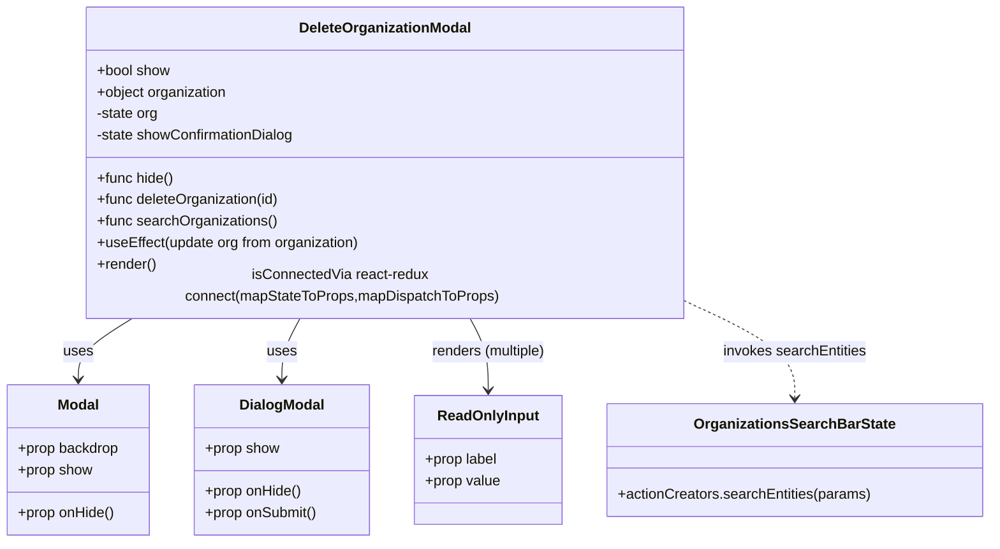
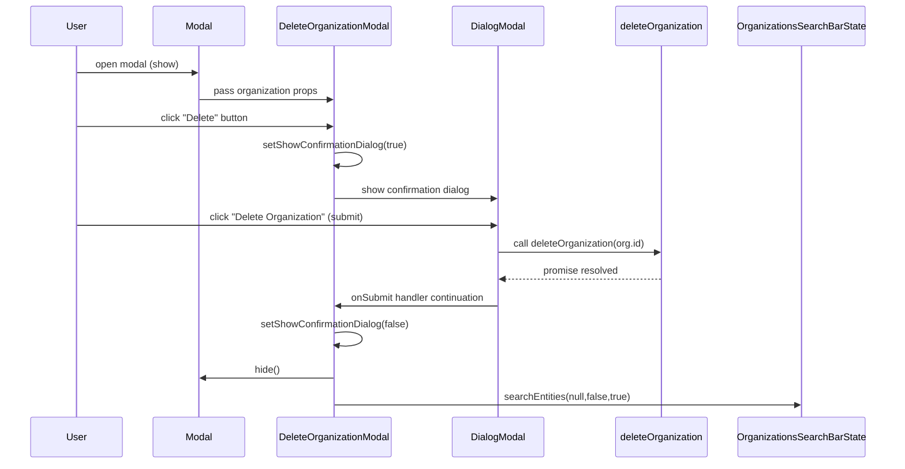

# Diagram: web/portal/src/modules/organizations/components/DeleteOrganizationModal.js

> Auto-generated by Obscura crawlers

## Diagram 1

### SVG

<svg id="container" width="1100.609375" xmlns="http://www.w3.org/2000/svg" class="classDiagram" height="594" viewBox="0 0 1100.609375 594" role="graphics-document document" aria-roledescription="class"><g><defs><marker id="container_class-aggregationStart" class="marker aggregation class" refX="18" refY="7" markerWidth="190" markerHeight="240" orient="auto"><path d="M 18,7 L9,13 L1,7 L9,1 Z"></path></marker></defs><defs><marker id="container_class-aggregationEnd" class="marker aggregation class" refX="1" refY="7" markerWidth="20" markerHeight="28" orient="auto"><path d="M 18,7 L9,13 L1,7 L9,1 Z"></path></marker></defs><defs><marker id="container_class-extensionStart" class="marker extension class" refX="18" refY="7" markerWidth="190" markerHeight="240" orient="auto"><path d="M 1,7 L18,13 V 1 Z"></path></marker></defs><defs><marker id="container_class-extensionEnd" class="marker extension class" refX="1" refY="7" markerWidth="20" markerHeight="28" orient="auto"><path d="M 1,1 V 13 L18,7 Z"></path></marker></defs><defs><marker id="container_class-compositionStart" class="marker composition class" refX="18" refY="7" markerWidth="190" markerHeight="240" orient="auto"><path d="M 18,7 L9,13 L1,7 L9,1 Z"></path></marker></defs><defs><marker id="container_class-compositionEnd" class="marker composition class" refX="1" refY="7" markerWidth="20" markerHeight="28" orient="auto"><path d="M 18,7 L9,13 L1,7 L9,1 Z"></path></marker></defs><defs><marker id="container_class-dependencyStart" class="marker dependency class" refX="6" refY="7" markerWidth="190" markerHeight="240" orient="auto"><path d="M 5,7 L9,13 L1,7 L9,1 Z"></path></marker></defs><defs><marker id="container_class-dependencyEnd" class="marker dependency class" refX="13" refY="7" markerWidth="20" markerHeight="28" orient="auto"><path d="M 18,7 L9,13 L14,7 L9,1 Z"></path></marker></defs><defs><marker id="container_class-lollipopStart" class="marker lollipop class" refX="13" refY="7" markerWidth="190" markerHeight="240" orient="auto"><circle stroke="black" fill="transparent" cx="7" cy="7" r="6"></circle></marker></defs><defs><marker id="container_class-lollipopEnd" class="marker lollipop class" refX="1" refY="7" markerWidth="190" markerHeight="240" orient="auto"><circle stroke="black" fill="transparent" cx="7" cy="7" r="6"></circle></marker></defs><g class="root"><g class="clusters"></g><g class="edgePaths"><path d="M150.301,344L139.967,350.167C129.632,356.333,108.962,368.667,98.628,380C88.293,391.333,88.293,401.667,88.293,406.833L88.293,412" id="id_DeleteOrganizationModal_Modal_1" class="edge-thickness-normal edge-pattern-solid relation" style=";;;" data-edge="true" data-et="edge" data-id="id_DeleteOrganizationModal_Modal_1" data-points="W3sieCI6MTUwLjMwMTQ1NzY5ODE3MDc0LCJ5IjozNDR9LHsieCI6ODguMjkyOTY4NzUsInkiOjM4MX0seyJ4Ijo4OC4yOTI5Njg3NSwieSI6NDE4fV0=" marker-end="url(#container_class-dependencyEnd)"></path><path d="M337.608,344L334.149,350.167C330.689,356.333,323.77,368.667,320.311,380C316.852,391.333,316.852,401.667,316.852,406.833L316.852,412" id="id_DeleteOrganizationModal_DialogModal_2" class="edge-thickness-normal edge-pattern-solid relation" style=";;;" data-edge="true" data-et="edge" data-id="id_DeleteOrganizationModal_DialogModal_2" data-points="W3sieCI6MzM3LjYwODAxMjU3NjIxOTUsInkiOjM0NH0seyJ4IjozMTYuODUxNTYyNSwieSI6MzgxfSx7IngiOjMxNi44NTE1NjI1LCJ5Ijo0MTh9XQ==" marker-end="url(#container_class-dependencyEnd)"></path><path d="M526.099,344L529.558,350.167C533.018,356.333,539.937,368.667,543.396,382C546.855,395.333,546.855,409.667,546.855,416.833L546.855,424" id="id_DeleteOrganizationModal_ReadOnlyInput_3" class="edge-thickness-normal edge-pattern-solid relation" style=";;;" data-edge="true" data-et="edge" data-id="id_DeleteOrganizationModal_ReadOnlyInput_3" data-points="W3sieCI6NTI2LjA5OTAxODY3Mzc4MDUsInkiOjM0NH0seyJ4Ijo1NDYuODU1NDY4NzUsInkiOjM4MX0seyJ4Ijo1NDYuODU1NDY4NzUsInkiOjQzMH1d" marker-end="url(#container_class-dependencyEnd)"></path><path d="M767.326,327.564L787.039,336.47C806.751,345.376,846.176,363.188,865.889,380.761C885.602,398.333,885.602,415.667,885.602,424.333L885.602,433" id="id_DeleteOrganizationModal_OrganizationsSearchBarState_4" class="edge-thickness-normal edge-pattern-dashed relation" style=";;;" data-edge="true" data-et="edge" data-id="id_DeleteOrganizationModal_OrganizationsSearchBarState_4" data-points="W3sieCI6NzY3LjMyNjE3MTg3NSwieSI6MzI3LjU2NDA1NjMxOTExM30seyJ4Ijo4ODUuNjAxNTYyNSwieSI6MzgxfSx7IngiOjg4NS42MDE1NjI1LCJ5Ijo0Mzl9XQ==" marker-end="url(#container_class-dependencyEnd)"></path></g><g class="edgeLabels"><g class="edgeLabel" transform="translate(88.29296875, 381)"><g class="label" data-id="id_DeleteOrganizationModal_Modal_1" transform="translate(-16.4921875, -12)"><foreignObject width="32.984375" height="24">

uses

</foreignObject></g></g><g class="edgeLabel" transform="translate(316.8515625, 381)"><g class="label" data-id="id_DeleteOrganizationModal_DialogModal_2" transform="translate(-16.4921875, -12)"><foreignObject width="32.984375" height="24">

uses

</foreignObject></g></g><g class="edgeLabel" transform="translate(546.85546875, 381)"><g class="label" data-id="id_DeleteOrganizationModal_ReadOnlyInput_3" transform="translate(-65.46875, -12)"><foreignObject width="130.9375" height="24">

renders  (multiple)

</foreignObject></g></g><g class="edgeLabel" transform="translate(885.6015625, 381)"><g class="label" data-id="id_DeleteOrganizationModal_OrganizationsSearchBarState_4" transform="translate(-80.7109375, -12)"><foreignObject width="161.421875" height="24">

invokes searchEntities

</foreignObject></g></g></g><g class="nodes"><g class="node default" id="classId-DeleteOrganizationModal-0" transform="translate(431.853515625, 176)"><g class="basic label-container"><path d="M-335.47265625 -168 L335.47265625 -168 L335.47265625 168 L-335.47265625 168" stroke="none" stroke-width="0" fill="#ECECFF" style=""></path><path d="M-335.47265625 -168 C-72.25492397226748 -168, 190.96280830546505 -168, 335.47265625 -168 M-335.47265625 -168 C-161.57975108450484 -168, 12.31315408099033 -168, 335.47265625 -168 M335.47265625 -168 C335.47265625 -54.03125062573778, 335.47265625 59.93749874852443, 335.47265625 168 M335.47265625 -168 C335.47265625 -58.607473372527494, 335.47265625 50.78505325494501, 335.47265625 168 M335.47265625 168 C139.77145613465748 168, -55.92974398068503 168, -335.47265625 168 M335.47265625 168 C112.55510984573883 168, -110.36243655852235 168, -335.47265625 168 M-335.47265625 168 C-335.47265625 76.99001631144405, -335.47265625 -14.019967377111897, -335.47265625 -168 M-335.47265625 168 C-335.47265625 89.0506525166008, -335.47265625 10.101305033201612, -335.47265625 -168" stroke="#9370DB" stroke-width="1.3" fill="none" stroke-dasharray="0 0" style=""></path></g><g class="annotation-group text" transform="translate(0, -144)"></g><g class="label-group text" transform="translate(-92.8671875, -144)"><g class="label" style="font-weight: bolder" transform="translate(0,-12)"><foreignObject width="185.734375" height="24">

DeleteOrganizationModal

</foreignObject></g></g><g class="members-group text" transform="translate(-323.47265625, -96)"><g class="label" style="" transform="translate(0,-12)"><foreignObject width="82.78125" height="24">

+bool show

</foreignObject></g><g class="label" style="" transform="translate(0,12)"><foreignObject width="148.0625" height="24">

+object organization

</foreignObject></g><g class="label" style="" transform="translate(0,36)"><foreignObject width="70.390625" height="24">

-state org

</foreignObject></g><g class="label" style="" transform="translate(0,60)"><foreignObject width="224.25" height="24">

-state showConfirmationDialog

</foreignObject></g></g><g class="methods-group text" transform="translate(-323.47265625, 24)"><g class="label" style="" transform="translate(0,-12)"><foreignObject width="86.234375" height="24">

+func hide()

</foreignObject></g><g class="label" style="" transform="translate(0,12)"><foreignObject width="206.09375" height="24">

+func deleteOrganization(id)

</foreignObject></g><g class="label" style="" transform="translate(0,36)"><foreignObject width="201.0625" height="24">

+func searchOrganizations()

</foreignObject></g><g class="label" style="" transform="translate(0,60)"><foreignObject width="296.9375" height="24">

+useEffect(update org from organization)

</foreignObject></g><g class="label" style="" transform="translate(0,84)"><foreignObject width="66.609375" height="24">

+render()

</foreignObject></g><g class="label" style="" transform="translate(0,108)"><foreignObject width="554.078125" height="24">

isConnectedVia react-redux connect(mapStateToProps,mapDispatchToProps)

</foreignObject></g></g><g class="divider" style=""><path d="M-335.47265625 -120 C-133.81447313218877 -120, 67.84370998562247 -120, 335.47265625 -120 M-335.47265625 -120 C-166.4792714127214 -120, 2.5141134245571948 -120, 335.47265625 -120" stroke="#9370DB" stroke-width="1.3" fill="none" stroke-dasharray="0 0" style=""></path></g><g class="divider" style=""><path d="M-335.47265625 0 C-82.86436205562975 0, 169.7439321387405 0, 335.47265625 0 M-335.47265625 0 C-185.90263602481815 0, -36.3326157996363 0, 335.47265625 0" stroke="#9370DB" stroke-width="1.3" fill="none" stroke-dasharray="0 0" style=""></path></g></g><g class="node default" id="classId-Modal-1" transform="translate(88.29296875, 502)"><g class="basic label-container"><path d="M-80.29296875 -84 L80.29296875 -84 L80.29296875 84 L-80.29296875 84" stroke="none" stroke-width="0" fill="#ECECFF" style=""></path><path d="M-80.29296875 -84 C-41.0041901376693 -84, -1.7154115253385953 -84, 80.29296875 -84 M-80.29296875 -84 C-29.044962768795784 -84, 22.20304321240843 -84, 80.29296875 -84 M80.29296875 -84 C80.29296875 -44.35966705607448, 80.29296875 -4.719334112148957, 80.29296875 84 M80.29296875 -84 C80.29296875 -17.29192712051055, 80.29296875 49.4161457589789, 80.29296875 84 M80.29296875 84 C43.767910548696904 84, 7.242852347393807 84, -80.29296875 84 M80.29296875 84 C34.79079324972853 84, -10.71138225054294 84, -80.29296875 84 M-80.29296875 84 C-80.29296875 41.146404168521286, -80.29296875 -1.7071916629574275, -80.29296875 -84 M-80.29296875 84 C-80.29296875 49.22646513621062, -80.29296875 14.452930272421241, -80.29296875 -84" stroke="#9370DB" stroke-width="1.3" fill="none" stroke-dasharray="0 0" style=""></path></g><g class="annotation-group text" transform="translate(0, -60)"></g><g class="label-group text" transform="translate(-22.4453125, -60)"><g class="label" style="font-weight: bolder" transform="translate(0,-12)"><foreignObject width="44.890625" height="24">

Modal

</foreignObject></g></g><g class="members-group text" transform="translate(-68.29296875, -12)"><g class="label" style="" transform="translate(0,-12)"><foreignObject width="114.140625" height="24">

+prop backdrop

</foreignObject></g><g class="label" style="" transform="translate(0,12)"><foreignObject width="83.9375" height="24">

+prop show

</foreignObject></g></g><g class="methods-group text" transform="translate(-68.29296875, 60)"><g class="label" style="" transform="translate(0,-12)"><foreignObject width="109.046875" height="24">

+prop onHide()

</foreignObject></g></g><g class="divider" style=""><path d="M-80.29296875 -36 C-26.625895693844868 -36, 27.041177362310265 -36, 80.29296875 -36 M-80.29296875 -36 C-28.10087757725941 -36, 24.09121359548118 -36, 80.29296875 -36" stroke="#9370DB" stroke-width="1.3" fill="none" stroke-dasharray="0 0" style=""></path></g><g class="divider" style=""><path d="M-80.29296875 36 C-47.09617639764237 36, -13.899384045284734 36, 80.29296875 36 M-80.29296875 36 C-34.049683216864544 36, 12.193602316270912 36, 80.29296875 36" stroke="#9370DB" stroke-width="1.3" fill="none" stroke-dasharray="0 0" style=""></path></g></g><g class="node default" id="classId-DialogModal-2" transform="translate(316.8515625, 502)"><g class="basic label-container"><path d="M-98.265625 -84 L98.265625 -84 L98.265625 84 L-98.265625 84" stroke="none" stroke-width="0" fill="#ECECFF" style=""></path><path d="M-98.265625 -84 C-24.711671291809978 -84, 48.842282416380044 -84, 98.265625 -84 M-98.265625 -84 C-48.0510630664644 -84, 2.1634988670711977 -84, 98.265625 -84 M98.265625 -84 C98.265625 -27.759914789648292, 98.265625 28.480170420703416, 98.265625 84 M98.265625 -84 C98.265625 -27.096942031424987, 98.265625 29.806115937150025, 98.265625 84 M98.265625 84 C55.478368534058035 84, 12.69111206811607 84, -98.265625 84 M98.265625 84 C23.298722112507775 84, -51.66818077498445 84, -98.265625 84 M-98.265625 84 C-98.265625 31.494740597496204, -98.265625 -21.010518805007592, -98.265625 -84 M-98.265625 84 C-98.265625 41.225055875463326, -98.265625 -1.5498882490733479, -98.265625 -84" stroke="#9370DB" stroke-width="1.3" fill="none" stroke-dasharray="0 0" style=""></path></g><g class="annotation-group text" transform="translate(0, -60)"></g><g class="label-group text" transform="translate(-45.625, -60)"><g class="label" style="font-weight: bolder" transform="translate(0,-12)"><foreignObject width="91.25" height="24">

DialogModal

</foreignObject></g></g><g class="members-group text" transform="translate(-86.265625, -12)"><g class="label" style="" transform="translate(0,-12)"><foreignObject width="83.9375" height="24">

+prop show

</foreignObject></g></g><g class="methods-group text" transform="translate(-86.265625, 36)"><g class="label" style="" transform="translate(0,-12)"><foreignObject width="109.046875" height="24">

+prop onHide()

</foreignObject></g><g class="label" style="" transform="translate(0,12)"><foreignObject width="126.90625" height="24">

+prop onSubmit()

</foreignObject></g></g><g class="divider" style=""><path d="M-98.265625 -36 C-49.90527177118788 -36, -1.544918542375754 -36, 98.265625 -36 M-98.265625 -36 C-35.19755831302212 -36, 27.870508373955758 -36, 98.265625 -36" stroke="#9370DB" stroke-width="1.3" fill="none" stroke-dasharray="0 0" style=""></path></g><g class="divider" style=""><path d="M-98.265625 12 C-44.081209590798395 12, 10.103205818403211 12, 98.265625 12 M-98.265625 12 C-28.880425844862188 12, 40.504773310275624 12, 98.265625 12" stroke="#9370DB" stroke-width="1.3" fill="none" stroke-dasharray="0 0" style=""></path></g></g><g class="node default" id="classId-ReadOnlyInput-3" transform="translate(546.85546875, 502)"><g class="basic label-container"><path d="M-81.73828125 -72 L81.73828125 -72 L81.73828125 72 L-81.73828125 72" stroke="none" stroke-width="0" fill="#ECECFF" style=""></path><path d="M-81.73828125 -72 C-33.4795740710303 -72, 14.779133107939401 -72, 81.73828125 -72 M-81.73828125 -72 C-41.46503415599629 -72, -1.191787061992585 -72, 81.73828125 -72 M81.73828125 -72 C81.73828125 -33.9880904147282, 81.73828125 4.023819170543604, 81.73828125 72 M81.73828125 -72 C81.73828125 -39.29827677554004, 81.73828125 -6.596553551080078, 81.73828125 72 M81.73828125 72 C48.512752112588565 72, 15.28722297517713 72, -81.73828125 72 M81.73828125 72 C18.14204314158902 72, -45.45419496682196 72, -81.73828125 72 M-81.73828125 72 C-81.73828125 37.245425399030225, -81.73828125 2.4908507980604497, -81.73828125 -72 M-81.73828125 72 C-81.73828125 16.6627609802105, -81.73828125 -38.674478039579, -81.73828125 -72" stroke="#9370DB" stroke-width="1.3" fill="none" stroke-dasharray="0 0" style=""></path></g><g class="annotation-group text" transform="translate(0, -48)"></g><g class="label-group text" transform="translate(-54.3203125, -48)"><g class="label" style="font-weight: bolder" transform="translate(0,-12)"><foreignObject width="108.640625" height="24">

ReadOnlyInput

</foreignObject></g></g><g class="members-group text" transform="translate(-69.73828125, 0)"><g class="label" style="" transform="translate(0,-12)"><foreignObject width="82.5" height="24">

+prop label

</foreignObject></g><g class="label" style="" transform="translate(0,12)"><foreignObject width="85.15625" height="24">

+prop value

</foreignObject></g></g><g class="methods-group text" transform="translate(-69.73828125, 72)"></g><g class="divider" style=""><path d="M-81.73828125 -24 C-44.558634284168114 -24, -7.378987318336229 -24, 81.73828125 -24 M-81.73828125 -24 C-40.967596575923665 -24, -0.19691190184732932 -24, 81.73828125 -24" stroke="#9370DB" stroke-width="1.3" fill="none" stroke-dasharray="0 0" style=""></path></g><g class="divider" style=""><path d="M-81.73828125 48 C-42.4809616014817 48, -3.223641952963405 48, 81.73828125 48 M-81.73828125 48 C-19.73058025393466 48, 42.27712074213068 48, 81.73828125 48" stroke="#9370DB" stroke-width="1.3" fill="none" stroke-dasharray="0 0" style=""></path></g></g><g class="node default" id="classId-OrganizationsSearchBarState-4" transform="translate(885.6015625, 502)"><g class="basic label-container"><path d="M-207.0078125 -63 L207.0078125 -63 L207.0078125 63 L-207.0078125 63" stroke="none" stroke-width="0" fill="#ECECFF" style=""></path><path d="M-207.0078125 -63 C-81.34202378513575 -63, 44.3237649297285 -63, 207.0078125 -63 M-207.0078125 -63 C-41.4969097527125 -63, 124.013992994575 -63, 207.0078125 -63 M207.0078125 -63 C207.0078125 -14.283410039416509, 207.0078125 34.43317992116698, 207.0078125 63 M207.0078125 -63 C207.0078125 -19.303885167977825, 207.0078125 24.39222966404435, 207.0078125 63 M207.0078125 63 C96.70337864964823 63, -13.601055200703541 63, -207.0078125 63 M207.0078125 63 C95.33739005663358 63, -16.33303238673284 63, -207.0078125 63 M-207.0078125 63 C-207.0078125 26.53356458214558, -207.0078125 -9.93287083570884, -207.0078125 -63 M-207.0078125 63 C-207.0078125 18.478167831629293, -207.0078125 -26.043664336741415, -207.0078125 -63" stroke="#9370DB" stroke-width="1.3" fill="none" stroke-dasharray="0 0" style=""></path></g><g class="annotation-group text" transform="translate(0, -39)"></g><g class="label-group text" transform="translate(-107.109375, -39)"><g class="label" style="font-weight: bolder" transform="translate(0,-12)"><foreignObject width="214.21875" height="24">

OrganizationsSearchBarState

</foreignObject></g></g><g class="members-group text" transform="translate(-195.0078125, 9)"></g><g class="methods-group text" transform="translate(-195.0078125, 39)"><g class="label" style="" transform="translate(0,-12)"><foreignObject width="282.90625" height="24">

+actionCreators.searchEntities(params)

</foreignObject></g></g><g class="divider" style=""><path d="M-207.0078125 -15 C-112.13594939679001 -15, -17.26408629358002 -15, 207.0078125 -15 M-207.0078125 -15 C-65.62511737605575 -15, 75.75757774788849 -15, 207.0078125 -15" stroke="#9370DB" stroke-width="1.3" fill="none" stroke-dasharray="0 0" style=""></path></g><g class="divider" style=""><path d="M-207.0078125 9 C-106.10737757829166 9, -5.206942656583323 9, 207.0078125 9 M-207.0078125 9 C-114.04464754673275 9, -21.081482593465495 9, 207.0078125 9" stroke="#9370DB" stroke-width="1.3" fill="none" stroke-dasharray="0 0" style=""></path></g></g></g></g></g></svg>

## Diagram 2

### SVG

<svg id="container" width="1574" xmlns="http://www.w3.org/2000/svg" height="807" viewBox="-50 -10 1574 807" role="graphics-document document" aria-roledescription="sequence"><g><rect x="1244" y="721" fill="#eaeaea" stroke="#666" width="230" height="65" name="SearchState" rx="3" ry="3" class="actor actor-bottom"></rect><text x="1359" y="753.5" dominant-baseline="central" alignment-baseline="central" class="actor actor-box" style="text-anchor: middle; font-size: 16px; font-weight: 400;"><tspan x="1359" dy="0">OrganizationsSearchBarState</tspan></text></g><g><rect x="1036" y="721" fill="#eaeaea" stroke="#666" width="158" height="65" name="deleteOrganizationFunc" rx="3" ry="3" class="actor actor-bottom"></rect><text x="1115" y="753.5" dominant-baseline="central" alignment-baseline="central" class="actor actor-box" style="text-anchor: middle; font-size: 16px; font-weight: 400;"><tspan x="1115" dy="0">deleteOrganization</tspan></text></g><g><rect x="750" y="721" fill="#eaeaea" stroke="#666" width="150" height="65" name="DialogModal" rx="3" ry="3" class="actor actor-bottom"></rect><text x="825" y="753.5" dominant-baseline="central" alignment-baseline="central" class="actor actor-box" style="text-anchor: middle; font-size: 16px; font-weight: 400;"><tspan x="825" dy="0">DialogModal</tspan></text></g><g><rect x="425" y="721" fill="#eaeaea" stroke="#666" width="204" height="65" name="DeleteOrganizationModal" rx="3" ry="3" class="actor actor-bottom"></rect><text x="527" y="753.5" dominant-baseline="central" alignment-baseline="central" class="actor actor-box" style="text-anchor: middle; font-size: 16px; font-weight: 400;"><tspan x="527" dy="0">DeleteOrganizationModal</tspan></text></g><g><rect x="209" y="721" fill="#eaeaea" stroke="#666" width="150" height="65" name="Modal" rx="3" ry="3" class="actor actor-bottom"></rect><text x="284" y="753.5" dominant-baseline="central" alignment-baseline="central" class="actor actor-box" style="text-anchor: middle; font-size: 16px; font-weight: 400;"><tspan x="284" dy="0">Modal</tspan></text></g><g><rect x="0" y="721" fill="#eaeaea" stroke="#666" width="150" height="65" name="User" rx="3" ry="3" class="actor actor-bottom"></rect><text x="75" y="753.5" dominant-baseline="central" alignment-baseline="central" class="actor actor-box" style="text-anchor: middle; font-size: 16px; font-weight: 400;"><tspan x="75" dy="0">User</tspan></text></g><g><line id="actor5" x1="1359" y1="65" x2="1359" y2="721" class="actor-line 200" stroke-width="0.5px" stroke="#999" name="SearchState"></line><g id="root-5"><rect x="1244" y="0" fill="#eaeaea" stroke="#666" width="230" height="65" name="SearchState" rx="3" ry="3" class="actor actor-top"></rect><text x="1359" y="32.5" dominant-baseline="central" alignment-baseline="central" class="actor actor-box" style="text-anchor: middle; font-size: 16px; font-weight: 400;"><tspan x="1359" dy="0">OrganizationsSearchBarState</tspan></text></g></g><g><line id="actor4" x1="1115" y1="65" x2="1115" y2="721" class="actor-line 200" stroke-width="0.5px" stroke="#999" name="deleteOrganizationFunc"></line><g id="root-4"><rect x="1036" y="0" fill="#eaeaea" stroke="#666" width="158" height="65" name="deleteOrganizationFunc" rx="3" ry="3" class="actor actor-top"></rect><text x="1115" y="32.5" dominant-baseline="central" alignment-baseline="central" class="actor actor-box" style="text-anchor: middle; font-size: 16px; font-weight: 400;"><tspan x="1115" dy="0">deleteOrganization</tspan></text></g></g><g><line id="actor3" x1="825" y1="65" x2="825" y2="721" class="actor-line 200" stroke-width="0.5px" stroke="#999" name="DialogModal"></line><g id="root-3"><rect x="750" y="0" fill="#eaeaea" stroke="#666" width="150" height="65" name="DialogModal" rx="3" ry="3" class="actor actor-top"></rect><text x="825" y="32.5" dominant-baseline="central" alignment-baseline="central" class="actor actor-box" style="text-anchor: middle; font-size: 16px; font-weight: 400;"><tspan x="825" dy="0">DialogModal</tspan></text></g></g><g><line id="actor2" x1="527" y1="65" x2="527" y2="721" class="actor-line 200" stroke-width="0.5px" stroke="#999" name="DeleteOrganizationModal"></line><g id="root-2"><rect x="425" y="0" fill="#eaeaea" stroke="#666" width="204" height="65" name="DeleteOrganizationModal" rx="3" ry="3" class="actor actor-top"></rect><text x="527" y="32.5" dominant-baseline="central" alignment-baseline="central" class="actor actor-box" style="text-anchor: middle; font-size: 16px; font-weight: 400;"><tspan x="527" dy="0">DeleteOrganizationModal</tspan></text></g></g><g><line id="actor1" x1="284" y1="65" x2="284" y2="721" class="actor-line 200" stroke-width="0.5px" stroke="#999" name="Modal"></line><g id="root-1"><rect x="209" y="0" fill="#eaeaea" stroke="#666" width="150" height="65" name="Modal" rx="3" ry="3" class="actor actor-top"></rect><text x="284" y="32.5" dominant-baseline="central" alignment-baseline="central" class="actor actor-box" style="text-anchor: middle; font-size: 16px; font-weight: 400;"><tspan x="284" dy="0">Modal</tspan></text></g></g><g><line id="actor0" x1="75" y1="65" x2="75" y2="721" class="actor-line 200" stroke-width="0.5px" stroke="#999" name="User"></line><g id="root-0"><rect x="0" y="0" fill="#eaeaea" stroke="#666" width="150" height="65" name="User" rx="3" ry="3" class="actor actor-top"></rect><text x="75" y="32.5" dominant-baseline="central" alignment-baseline="central" class="actor actor-box" style="text-anchor: middle; font-size: 16px; font-weight: 400;"><tspan x="75" dy="0">User</tspan></text></g></g><g></g><defs><symbol id="computer" width="24" height="24"><path transform="scale(.5)" d="M2 2v13h20v-13h-20zm18 11h-16v-9h16v9zm-10.228 6l.466-1h3.524l.467 1h-4.457zm14.228 3h-24l2-6h2.104l-1.33 4h18.45l-1.297-4h2.073l2 6zm-5-10h-14v-7h14v7z"></path></symbol></defs><defs><symbol id="database" fill-rule="evenodd" clip-rule="evenodd"><path transform="scale(.5)" d="M12.258.001l.256.004.255.005.253.008.251.01.249.012.247.015.246.016.242.019.241.02.239.023.236.024.233.027.231.028.229.031.225.032.223.034.22.036.217.038.214.04.211.041.208.043.205.045.201.046.198.048.194.05.191.051.187.053.183.054.18.056.175.057.172.059.168.06.163.061.16.063.155.064.15.066.074.033.073.033.071.034.07.034.069.035.068.035.067.035.066.035.064.036.064.036.062.036.06.036.06.037.058.037.058.037.055.038.055.038.053.038.052.038.051.039.05.039.048.039.047.039.045.04.044.04.043.04.041.04.04.041.039.041.037.041.036.041.034.041.033.042.032.042.03.042.029.042.027.042.026.043.024.043.023.043.021.043.02.043.018.044.017.043.015.044.013.044.012.044.011.045.009.044.007.045.006.045.004.045.002.045.001.045v17l-.001.045-.002.045-.004.045-.006.045-.007.045-.009.044-.011.045-.012.044-.013.044-.015.044-.017.043-.018.044-.02.043-.021.043-.023.043-.024.043-.026.043-.027.042-.029.042-.03.042-.032.042-.033.042-.034.041-.036.041-.037.041-.039.041-.04.041-.041.04-.043.04-.044.04-.045.04-.047.039-.048.039-.05.039-.051.039-.052.038-.053.038-.055.038-.055.038-.058.037-.058.037-.06.037-.06.036-.062.036-.064.036-.064.036-.066.035-.067.035-.068.035-.069.035-.07.034-.071.034-.073.033-.074.033-.15.066-.155.064-.16.063-.163.061-.168.06-.172.059-.175.057-.18.056-.183.054-.187.053-.191.051-.194.05-.198.048-.201.046-.205.045-.208.043-.211.041-.214.04-.217.038-.22.036-.223.034-.225.032-.229.031-.231.028-.233.027-.236.024-.239.023-.241.02-.242.019-.246.016-.247.015-.249.012-.251.01-.253.008-.255.005-.256.004-.258.001-.258-.001-.256-.004-.255-.005-.253-.008-.251-.01-.249-.012-.247-.015-.245-.016-.243-.019-.241-.02-.238-.023-.236-.024-.234-.027-.231-.028-.228-.031-.226-.032-.223-.034-.22-.036-.217-.038-.214-.04-.211-.041-.208-.043-.204-.045-.201-.046-.198-.048-.195-.05-.19-.051-.187-.053-.184-.054-.179-.056-.176-.057-.172-.059-.167-.06-.164-.061-.159-.063-.155-.064-.151-.066-.074-.033-.072-.033-.072-.034-.07-.034-.069-.035-.068-.035-.067-.035-.066-.035-.064-.036-.063-.036-.062-.036-.061-.036-.06-.037-.058-.037-.057-.037-.056-.038-.055-.038-.053-.038-.052-.038-.051-.039-.049-.039-.049-.039-.046-.039-.046-.04-.044-.04-.043-.04-.041-.04-.04-.041-.039-.041-.037-.041-.036-.041-.034-.041-.033-.042-.032-.042-.03-.042-.029-.042-.027-.042-.026-.043-.024-.043-.023-.043-.021-.043-.02-.043-.018-.044-.017-.043-.015-.044-.013-.044-.012-.044-.011-.045-.009-.044-.007-.045-.006-.045-.004-.045-.002-.045-.001-.045v-17l.001-.045.002-.045.004-.045.006-.045.007-.045.009-.044.011-.045.012-.044.013-.044.015-.044.017-.043.018-.044.02-.043.021-.043.023-.043.024-.043.026-.043.027-.042.029-.042.03-.042.032-.042.033-.042.034-.041.036-.041.037-.041.039-.041.04-.041.041-.04.043-.04.044-.04.046-.04.046-.039.049-.039.049-.039.051-.039.052-.038.053-.038.055-.038.056-.038.057-.037.058-.037.06-.037.061-.036.062-.036.063-.036.064-.036.066-.035.067-.035.068-.035.069-.035.07-.034.072-.034.072-.033.074-.033.151-.066.155-.064.159-.063.164-.061.167-.06.172-.059.176-.057.179-.056.184-.054.187-.053.19-.051.195-.05.198-.048.201-.046.204-.045.208-.043.211-.041.214-.04.217-.038.22-.036.223-.034.226-.032.228-.031.231-.028.234-.027.236-.024.238-.023.241-.02.243-.019.245-.016.247-.015.249-.012.251-.01.253-.008.255-.005.256-.004.258-.001.258.001zm-9.258 20.499v.01l.001.021.003.021.004.022.005.021.006.022.007.022.009.023.01.022.011.023.012.023.013.023.015.023.016.024.017.023.018.024.019.024.021.024.022.025.023.024.024.025.052.049.056.05.061.051.066.051.07.051.075.051.079.052.084.052.088.052.092.052.097.052.102.051.105.052.11.052.114.051.119.051.123.051.127.05.131.05.135.05.139.048.144.049.147.047.152.047.155.047.16.045.163.045.167.043.171.043.176.041.178.041.183.039.187.039.19.037.194.035.197.035.202.033.204.031.209.03.212.029.216.027.219.025.222.024.226.021.23.02.233.018.236.016.24.015.243.012.246.01.249.008.253.005.256.004.259.001.26-.001.257-.004.254-.005.25-.008.247-.011.244-.012.241-.014.237-.016.233-.018.231-.021.226-.021.224-.024.22-.026.216-.027.212-.028.21-.031.205-.031.202-.034.198-.034.194-.036.191-.037.187-.039.183-.04.179-.04.175-.042.172-.043.168-.044.163-.045.16-.046.155-.046.152-.047.148-.048.143-.049.139-.049.136-.05.131-.05.126-.05.123-.051.118-.052.114-.051.11-.052.106-.052.101-.052.096-.052.092-.052.088-.053.083-.051.079-.052.074-.052.07-.051.065-.051.06-.051.056-.05.051-.05.023-.024.023-.025.021-.024.02-.024.019-.024.018-.024.017-.024.015-.023.014-.024.013-.023.012-.023.01-.023.01-.022.008-.022.006-.022.006-.022.004-.022.004-.021.001-.021.001-.021v-4.127l-.077.055-.08.053-.083.054-.085.053-.087.052-.09.052-.093.051-.095.05-.097.05-.1.049-.102.049-.105.048-.106.047-.109.047-.111.046-.114.045-.115.045-.118.044-.12.043-.122.042-.124.042-.126.041-.128.04-.13.04-.132.038-.134.038-.135.037-.138.037-.139.035-.142.035-.143.034-.144.033-.147.032-.148.031-.15.03-.151.03-.153.029-.154.027-.156.027-.158.026-.159.025-.161.024-.162.023-.163.022-.165.021-.166.02-.167.019-.169.018-.169.017-.171.016-.173.015-.173.014-.175.013-.175.012-.177.011-.178.01-.179.008-.179.008-.181.006-.182.005-.182.004-.184.003-.184.002h-.37l-.184-.002-.184-.003-.182-.004-.182-.005-.181-.006-.179-.008-.179-.008-.178-.01-.176-.011-.176-.012-.175-.013-.173-.014-.172-.015-.171-.016-.17-.017-.169-.018-.167-.019-.166-.02-.165-.021-.163-.022-.162-.023-.161-.024-.159-.025-.157-.026-.156-.027-.155-.027-.153-.029-.151-.03-.15-.03-.148-.031-.146-.032-.145-.033-.143-.034-.141-.035-.14-.035-.137-.037-.136-.037-.134-.038-.132-.038-.13-.04-.128-.04-.126-.041-.124-.042-.122-.042-.12-.044-.117-.043-.116-.045-.113-.045-.112-.046-.109-.047-.106-.047-.105-.048-.102-.049-.1-.049-.097-.05-.095-.05-.093-.052-.09-.051-.087-.052-.085-.053-.083-.054-.08-.054-.077-.054v4.127zm0-5.654v.011l.001.021.003.021.004.021.005.022.006.022.007.022.009.022.01.022.011.023.012.023.013.023.015.024.016.023.017.024.018.024.019.024.021.024.022.024.023.025.024.024.052.05.056.05.061.05.066.051.07.051.075.052.079.051.084.052.088.052.092.052.097.052.102.052.105.052.11.051.114.051.119.052.123.05.127.051.131.05.135.049.139.049.144.048.147.048.152.047.155.046.16.045.163.045.167.044.171.042.176.042.178.04.183.04.187.038.19.037.194.036.197.034.202.033.204.032.209.03.212.028.216.027.219.025.222.024.226.022.23.02.233.018.236.016.24.014.243.012.246.01.249.008.253.006.256.003.259.001.26-.001.257-.003.254-.006.25-.008.247-.01.244-.012.241-.015.237-.016.233-.018.231-.02.226-.022.224-.024.22-.025.216-.027.212-.029.21-.03.205-.032.202-.033.198-.035.194-.036.191-.037.187-.039.183-.039.179-.041.175-.042.172-.043.168-.044.163-.045.16-.045.155-.047.152-.047.148-.048.143-.048.139-.05.136-.049.131-.05.126-.051.123-.051.118-.051.114-.052.11-.052.106-.052.101-.052.096-.052.092-.052.088-.052.083-.052.079-.052.074-.051.07-.052.065-.051.06-.05.056-.051.051-.049.023-.025.023-.024.021-.025.02-.024.019-.024.018-.024.017-.024.015-.023.014-.023.013-.024.012-.022.01-.023.01-.023.008-.022.006-.022.006-.022.004-.021.004-.022.001-.021.001-.021v-4.139l-.077.054-.08.054-.083.054-.085.052-.087.053-.09.051-.093.051-.095.051-.097.05-.1.049-.102.049-.105.048-.106.047-.109.047-.111.046-.114.045-.115.044-.118.044-.12.044-.122.042-.124.042-.126.041-.128.04-.13.039-.132.039-.134.038-.135.037-.138.036-.139.036-.142.035-.143.033-.144.033-.147.033-.148.031-.15.03-.151.03-.153.028-.154.028-.156.027-.158.026-.159.025-.161.024-.162.023-.163.022-.165.021-.166.02-.167.019-.169.018-.169.017-.171.016-.173.015-.173.014-.175.013-.175.012-.177.011-.178.009-.179.009-.179.007-.181.007-.182.005-.182.004-.184.003-.184.002h-.37l-.184-.002-.184-.003-.182-.004-.182-.005-.181-.007-.179-.007-.179-.009-.178-.009-.176-.011-.176-.012-.175-.013-.173-.014-.172-.015-.171-.016-.17-.017-.169-.018-.167-.019-.166-.02-.165-.021-.163-.022-.162-.023-.161-.024-.159-.025-.157-.026-.156-.027-.155-.028-.153-.028-.151-.03-.15-.03-.148-.031-.146-.033-.145-.033-.143-.033-.141-.035-.14-.036-.137-.036-.136-.037-.134-.038-.132-.039-.13-.039-.128-.04-.126-.041-.124-.042-.122-.043-.12-.043-.117-.044-.116-.044-.113-.046-.112-.046-.109-.046-.106-.047-.105-.048-.102-.049-.1-.049-.097-.05-.095-.051-.093-.051-.09-.051-.087-.053-.085-.052-.083-.054-.08-.054-.077-.054v4.139zm0-5.666v.011l.001.02.003.022.004.021.005.022.006.021.007.022.009.023.01.022.011.023.012.023.013.023.015.023.016.024.017.024.018.023.019.024.021.025.022.024.023.024.024.025.052.05.056.05.061.05.066.051.07.051.075.052.079.051.084.052.088.052.092.052.097.052.102.052.105.051.11.052.114.051.119.051.123.051.127.05.131.05.135.05.139.049.144.048.147.048.152.047.155.046.16.045.163.045.167.043.171.043.176.042.178.04.183.04.187.038.19.037.194.036.197.034.202.033.204.032.209.03.212.028.216.027.219.025.222.024.226.021.23.02.233.018.236.017.24.014.243.012.246.01.249.008.253.006.256.003.259.001.26-.001.257-.003.254-.006.25-.008.247-.01.244-.013.241-.014.237-.016.233-.018.231-.02.226-.022.224-.024.22-.025.216-.027.212-.029.21-.03.205-.032.202-.033.198-.035.194-.036.191-.037.187-.039.183-.039.179-.041.175-.042.172-.043.168-.044.163-.045.16-.045.155-.047.152-.047.148-.048.143-.049.139-.049.136-.049.131-.051.126-.05.123-.051.118-.052.114-.051.11-.052.106-.052.101-.052.096-.052.092-.052.088-.052.083-.052.079-.052.074-.052.07-.051.065-.051.06-.051.056-.05.051-.049.023-.025.023-.025.021-.024.02-.024.019-.024.018-.024.017-.024.015-.023.014-.024.013-.023.012-.023.01-.022.01-.023.008-.022.006-.022.006-.022.004-.022.004-.021.001-.021.001-.021v-4.153l-.077.054-.08.054-.083.053-.085.053-.087.053-.09.051-.093.051-.095.051-.097.05-.1.049-.102.048-.105.048-.106.048-.109.046-.111.046-.114.046-.115.044-.118.044-.12.043-.122.043-.124.042-.126.041-.128.04-.13.039-.132.039-.134.038-.135.037-.138.036-.139.036-.142.034-.143.034-.144.033-.147.032-.148.032-.15.03-.151.03-.153.028-.154.028-.156.027-.158.026-.159.024-.161.024-.162.023-.163.023-.165.021-.166.02-.167.019-.169.018-.169.017-.171.016-.173.015-.173.014-.175.013-.175.012-.177.01-.178.01-.179.009-.179.007-.181.006-.182.006-.182.004-.184.003-.184.001-.185.001-.185-.001-.184-.001-.184-.003-.182-.004-.182-.006-.181-.006-.179-.007-.179-.009-.178-.01-.176-.01-.176-.012-.175-.013-.173-.014-.172-.015-.171-.016-.17-.017-.169-.018-.167-.019-.166-.02-.165-.021-.163-.023-.162-.023-.161-.024-.159-.024-.157-.026-.156-.027-.155-.028-.153-.028-.151-.03-.15-.03-.148-.032-.146-.032-.145-.033-.143-.034-.141-.034-.14-.036-.137-.036-.136-.037-.134-.038-.132-.039-.13-.039-.128-.041-.126-.041-.124-.041-.122-.043-.12-.043-.117-.044-.116-.044-.113-.046-.112-.046-.109-.046-.106-.048-.105-.048-.102-.048-.1-.05-.097-.049-.095-.051-.093-.051-.09-.052-.087-.052-.085-.053-.083-.053-.08-.054-.077-.054v4.153zm8.74-8.179l-.257.004-.254.005-.25.008-.247.011-.244.012-.241.014-.237.016-.233.018-.231.021-.226.022-.224.023-.22.026-.216.027-.212.028-.21.031-.205.032-.202.033-.198.034-.194.036-.191.038-.187.038-.183.04-.179.041-.175.042-.172.043-.168.043-.163.045-.16.046-.155.046-.152.048-.148.048-.143.048-.139.049-.136.05-.131.05-.126.051-.123.051-.118.051-.114.052-.11.052-.106.052-.101.052-.096.052-.092.052-.088.052-.083.052-.079.052-.074.051-.07.052-.065.051-.06.05-.056.05-.051.05-.023.025-.023.024-.021.024-.02.025-.019.024-.018.024-.017.023-.015.024-.014.023-.013.023-.012.023-.01.023-.01.022-.008.022-.006.023-.006.021-.004.022-.004.021-.001.021-.001.021.001.021.001.021.004.021.004.022.006.021.006.023.008.022.01.022.01.023.012.023.013.023.014.023.015.024.017.023.018.024.019.024.02.025.021.024.023.024.023.025.051.05.056.05.06.05.065.051.07.052.074.051.079.052.083.052.088.052.092.052.096.052.101.052.106.052.11.052.114.052.118.051.123.051.126.051.131.05.136.05.139.049.143.048.148.048.152.048.155.046.16.046.163.045.168.043.172.043.175.042.179.041.183.04.187.038.191.038.194.036.198.034.202.033.205.032.21.031.212.028.216.027.22.026.224.023.226.022.231.021.233.018.237.016.241.014.244.012.247.011.25.008.254.005.257.004.26.001.26-.001.257-.004.254-.005.25-.008.247-.011.244-.012.241-.014.237-.016.233-.018.231-.021.226-.022.224-.023.22-.026.216-.027.212-.028.21-.031.205-.032.202-.033.198-.034.194-.036.191-.038.187-.038.183-.04.179-.041.175-.042.172-.043.168-.043.163-.045.16-.046.155-.046.152-.048.148-.048.143-.048.139-.049.136-.05.131-.05.126-.051.123-.051.118-.051.114-.052.11-.052.106-.052.101-.052.096-.052.092-.052.088-.052.083-.052.079-.052.074-.051.07-.052.065-.051.06-.05.056-.05.051-.05.023-.025.023-.024.021-.024.02-.025.019-.024.018-.024.017-.023.015-.024.014-.023.013-.023.012-.023.01-.023.01-.022.008-.022.006-.023.006-.021.004-.022.004-.021.001-.021.001-.021-.001-.021-.001-.021-.004-.021-.004-.022-.006-.021-.006-.023-.008-.022-.01-.022-.01-.023-.012-.023-.013-.023-.014-.023-.015-.024-.017-.023-.018-.024-.019-.024-.02-.025-.021-.024-.023-.024-.023-.025-.051-.05-.056-.05-.06-.05-.065-.051-.07-.052-.074-.051-.079-.052-.083-.052-.088-.052-.092-.052-.096-.052-.101-.052-.106-.052-.11-.052-.114-.052-.118-.051-.123-.051-.126-.051-.131-.05-.136-.05-.139-.049-.143-.048-.148-.048-.152-.048-.155-.046-.16-.046-.163-.045-.168-.043-.172-.043-.175-.042-.179-.041-.183-.04-.187-.038-.191-.038-.194-.036-.198-.034-.202-.033-.205-.032-.21-.031-.212-.028-.216-.027-.22-.026-.224-.023-.226-.022-.231-.021-.233-.018-.237-.016-.241-.014-.244-.012-.247-.011-.25-.008-.254-.005-.257-.004-.26-.001-.26.001z"></path></symbol></defs><defs><symbol id="clock" width="24" height="24"><path transform="scale(.5)" d="M12 2c5.514 0 10 4.486 10 10s-4.486 10-10 10-10-4.486-10-10 4.486-10 10-10zm0-2c-6.627 0-12 5.373-12 12s5.373 12 12 12 12-5.373 12-12-5.373-12-12-12zm5.848 12.459c.202.038.202.333.001.372-1.907.361-6.045 1.111-6.547 1.111-.719 0-1.301-.582-1.301-1.301 0-.512.77-5.447 1.125-7.445.034-.192.312-.181.343.014l.985 6.238 5.394 1.011z"></path></symbol></defs><defs><marker id="arrowhead" refX="7.9" refY="5" markerUnits="userSpaceOnUse" markerWidth="12" markerHeight="12" orient="auto-start-reverse"><path d="M -1 0 L 10 5 L 0 10 z"></path></marker></defs><defs><marker id="crosshead" markerWidth="15" markerHeight="8" orient="auto" refX="4" refY="4.5"><path fill="none" stroke="#000000" stroke-width="1pt" d="M 1,2 L 6,7 M 6,2 L 1,7" style="stroke-dasharray: 0, 0;"></path></marker></defs><defs><marker id="filled-head" refX="15.5" refY="7" markerWidth="20" markerHeight="28" orient="auto"><path d="M 18,7 L9,13 L14,7 L9,1 Z"></path></marker></defs><defs><marker id="sequencenumber" refX="15" refY="15" markerWidth="60" markerHeight="40" orient="auto"><circle cx="15" cy="15" r="6"></circle></marker></defs><text x="178" y="80" text-anchor="middle" dominant-baseline="middle" alignment-baseline="middle" class="messageText" dy="1em" style="font-size: 16px; font-weight: 400;">open modal (show)</text><line x1="76" y1="113" x2="280" y2="113" class="messageLine0" stroke-width="2" stroke="none" marker-end="url(#arrowhead)" style="fill: none;"></line><text x="404" y="128" text-anchor="middle" dominant-baseline="middle" alignment-baseline="middle" class="messageText" dy="1em" style="font-size: 16px; font-weight: 400;">pass organization props</text><line x1="285" y1="161" x2="523" y2="161" class="messageLine0" stroke-width="2" stroke="none" marker-end="url(#arrowhead)" style="fill: none;"></line><text x="300" y="176" text-anchor="middle" dominant-baseline="middle" alignment-baseline="middle" class="messageText" dy="1em" style="font-size: 16px; font-weight: 400;">click "Delete" button</text><line x1="76" y1="209" x2="523" y2="209" class="messageLine0" stroke-width="2" stroke="none" marker-end="url(#arrowhead)" style="fill: none;"></line><text x="528" y="224" text-anchor="middle" dominant-baseline="middle" alignment-baseline="middle" class="messageText" dy="1em" style="font-size: 16px; font-weight: 400;">setShowConfirmationDialog(true)</text><path d="M 528,257 C 588,247 588,287 528,277" class="messageLine0" stroke-width="2" stroke="none" marker-end="url(#arrowhead)" style="fill: none;"></path><text x="675" y="302" text-anchor="middle" dominant-baseline="middle" alignment-baseline="middle" class="messageText" dy="1em" style="font-size: 16px; font-weight: 400;">show confirmation dialog</text><line x1="528" y1="335" x2="821" y2="335" class="messageLine0" stroke-width="2" stroke="none" marker-end="url(#arrowhead)" style="fill: none;"></line><text x="449" y="350" text-anchor="middle" dominant-baseline="middle" alignment-baseline="middle" class="messageText" dy="1em" style="font-size: 16px; font-weight: 400;">click "Delete Organization" (submit)</text><line x1="76" y1="383" x2="821" y2="383" class="messageLine0" stroke-width="2" stroke="none" marker-end="url(#arrowhead)" style="fill: none;"></line><text x="969" y="398" text-anchor="middle" dominant-baseline="middle" alignment-baseline="middle" class="messageText" dy="1em" style="font-size: 16px; font-weight: 400;">call deleteOrganization(org.id)</text><line x1="826" y1="431" x2="1111" y2="431" class="messageLine0" stroke-width="2" stroke="none" marker-end="url(#arrowhead)" style="fill: none;"></line><text x="972" y="446" text-anchor="middle" dominant-baseline="middle" alignment-baseline="middle" class="messageText" dy="1em" style="font-size: 16px; font-weight: 400;">promise resolved</text><line x1="1114" y1="479" x2="829" y2="479" class="messageLine1" stroke-width="2" stroke="none" marker-end="url(#arrowhead)" style="stroke-dasharray: 3, 3; fill: none;"></line><text x="678" y="494" text-anchor="middle" dominant-baseline="middle" alignment-baseline="middle" class="messageText" dy="1em" style="font-size: 16px; font-weight: 400;">onSubmit handler continuation</text><line x1="824" y1="527" x2="531" y2="527" class="messageLine0" stroke-width="2" stroke="none" marker-end="url(#arrowhead)" style="fill: none;"></line><text x="528" y="542" text-anchor="middle" dominant-baseline="middle" alignment-baseline="middle" class="messageText" dy="1em" style="font-size: 16px; font-weight: 400;">setShowConfirmationDialog(false)</text><path d="M 528,575 C 588,565 588,605 528,595" class="messageLine0" stroke-width="2" stroke="none" marker-end="url(#arrowhead)" style="fill: none;"></path><text x="407" y="620" text-anchor="middle" dominant-baseline="middle" alignment-baseline="middle" class="messageText" dy="1em" style="font-size: 16px; font-weight: 400;">hide()</text><line x1="526" y1="653" x2="288" y2="653" class="messageLine0" stroke-width="2" stroke="none" marker-end="url(#arrowhead)" style="fill: none;"></line><text x="942" y="668" text-anchor="middle" dominant-baseline="middle" alignment-baseline="middle" class="messageText" dy="1em" style="font-size: 16px; font-weight: 400;">searchEntities(null,false,true)</text><line x1="528" y1="701" x2="1355" y2="701" class="messageLine0" stroke-width="2" stroke="none" marker-end="url(#arrowhead)" style="fill: none;"></line></svg>
