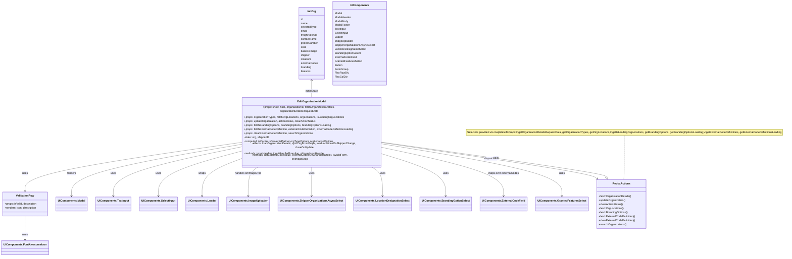
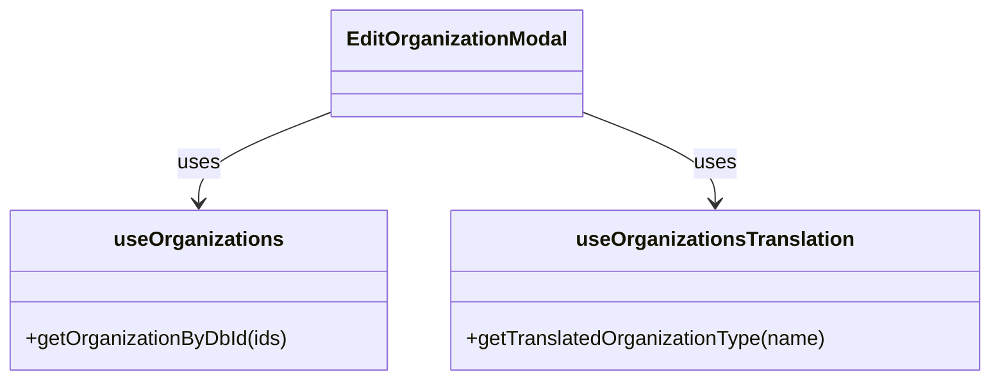

# Diagram: web/portal/src/modules/organizations/components/EditOrganizationModal.js

> Auto-generated by Obscura crawlers

## Diagram 1

### SVG

<svg id="container" width="4571.5" xmlns="http://www.w3.org/2000/svg" class="classDiagram" height="1480" viewBox="0 0 4571.5 1480" role="graphics-document document" aria-roledescription="class"><g><defs><marker id="container_class-aggregationStart" class="marker aggregation class" refX="18" refY="7" markerWidth="190" markerHeight="240" orient="auto"><path d="M 18,7 L9,13 L1,7 L9,1 Z"></path></marker></defs><defs><marker id="container_class-aggregationEnd" class="marker aggregation class" refX="1" refY="7" markerWidth="20" markerHeight="28" orient="auto"><path d="M 18,7 L9,13 L1,7 L9,1 Z"></path></marker></defs><defs><marker id="container_class-extensionStart" class="marker extension class" refX="18" refY="7" markerWidth="190" markerHeight="240" orient="auto"><path d="M 1,7 L18,13 V 1 Z"></path></marker></defs><defs><marker id="container_class-extensionEnd" class="marker extension class" refX="1" refY="7" markerWidth="20" markerHeight="28" orient="auto"><path d="M 1,1 V 13 L18,7 Z"></path></marker></defs><defs><marker id="container_class-compositionStart" class="marker composition class" refX="18" refY="7" markerWidth="190" markerHeight="240" orient="auto"><path d="M 18,7 L9,13 L1,7 L9,1 Z"></path></marker></defs><defs><marker id="container_class-compositionEnd" class="marker composition class" refX="1" refY="7" markerWidth="20" markerHeight="28" orient="auto"><path d="M 18,7 L9,13 L1,7 L9,1 Z"></path></marker></defs><defs><marker id="container_class-dependencyStart" class="marker dependency class" refX="6" refY="7" markerWidth="190" markerHeight="240" orient="auto"><path d="M 5,7 L9,13 L1,7 L9,1 Z"></path></marker></defs><defs><marker id="container_class-dependencyEnd" class="marker dependency class" refX="13" refY="7" markerWidth="20" markerHeight="28" orient="auto"><path d="M 18,7 L9,13 L14,7 L9,1 Z"></path></marker></defs><defs><marker id="container_class-lollipopStart" class="marker lollipop class" refX="13" refY="7" markerWidth="190" markerHeight="240" orient="auto"><circle stroke="black" fill="transparent" cx="7" cy="7" r="6"></circle></marker></defs><defs><marker id="container_class-lollipopEnd" class="marker lollipop class" refX="1" refY="7" markerWidth="190" markerHeight="240" orient="auto"><circle stroke="black" fill="transparent" cx="7" cy="7" r="6"></circle></marker></defs><g class="root"><g class="clusters"></g><g class="edgePaths"><path d="M3604.117,784L3604.117,817.167C3604.117,850.333,3604.117,916.667,3603.506,956C3602.896,995.333,3601.674,1007.667,3601.064,1013.833L3600.453,1020" id="edgeNote1" class="edge-thickness-normal edge-pattern-dotted relation" style="fill: none;;;fill: none" data-edge="true" data-et="edge" data-id="edgeNote1" data-points="W3sieCI6MzYwNC4xMTcxODc1LCJ5Ijo3ODR9LHsieCI6MzYwNC4xMTcxODc1LCJ5Ijo5ODN9LHsieCI6MzYwMC40NTI4NDkwMTQ5NDU1LCJ5IjoxMDIwfV0="></path><path d="M1381.285,821.293L1175.096,848.244C968.908,875.195,556.53,929.098,350.341,973.715C144.152,1018.333,144.152,1053.667,144.152,1071.333L144.152,1089" id="id_EditOrganizationModal_ValidationRow_1" class="edge-thickness-normal edge-pattern-solid relation" style=";;;" data-edge="true" data-et="edge" data-id="id_EditOrganizationModal_ValidationRow_1" data-points="W3sieCI6MTM4MS4yODUxNTYyNSwieSI6ODIxLjI5MjUwMDg4ODI0MTV9LHsieCI6MTQ0LjE1MjM0Mzc1LCJ5Ijo5ODN9LHsieCI6MTQ0LjE1MjM0Mzc1LCJ5IjoxMDk1fV0=" marker-end="url(#container_class-dependencyEnd)"></path><path d="M1381.285,832.317L1221.094,857.431C1060.904,882.545,740.522,932.772,580.331,980.553C420.141,1028.333,420.141,1073.667,420.141,1096.333L420.141,1119" id="id_EditOrganizationModal_UIComponents.Modal_2" class="edge-thickness-normal edge-pattern-solid relation" style=";;;" data-edge="true" data-et="edge" data-id="id_EditOrganizationModal_UIComponents.Modal_2" data-points="W3sieCI6MTM4MS4yODUxNTYyNSwieSI6ODMyLjMxNzMyNzIzMDAzNjN9LHsieCI6NDIwLjE0MDYyNSwieSI6OTgzfSx7IngiOjQyMC4xNDA2MjUsInkiOjExMjV9XQ==" marker-end="url(#container_class-dependencyEnd)"></path><path d="M1381.285,846.336L1261.35,869.113C1141.414,891.89,901.543,937.445,781.607,982.889C661.672,1028.333,661.672,1073.667,661.672,1096.333L661.672,1119" id="id_EditOrganizationModal_UIComponents.TextInput_3" class="edge-thickness-normal edge-pattern-solid relation" style=";;;" data-edge="true" data-et="edge" data-id="id_EditOrganizationModal_UIComponents.TextInput_3" data-points="W3sieCI6MTM4MS4yODUxNTYyNSwieSI6ODQ2LjMzNTY2ODI4MDI3NTd9LHsieCI6NjYxLjY3MTg3NSwieSI6OTgzfSx7IngiOjY2MS42NzE4NzUsInkiOjExMjV9XQ==" marker-end="url(#container_class-dependencyEnd)"></path><path d="M1381.285,870.137L1304.876,888.948C1228.466,907.758,1075.647,945.379,999.238,986.856C922.828,1028.333,922.828,1073.667,922.828,1096.333L922.828,1119" id="id_EditOrganizationModal_UIComponents.SelectInput_4" class="edge-thickness-normal edge-pattern-solid relation" style=";;;" data-edge="true" data-et="edge" data-id="id_EditOrganizationModal_UIComponents.SelectInput_4" data-points="W3sieCI6MTM4MS4yODUxNTYyNSwieSI6ODcwLjEzNzAzNjAxOTQyNzh9LHsieCI6OTIyLjgyODEyNSwieSI6OTgzfSx7IngiOjkyMi44MjgxMjUsInkiOjExMjV9XQ==" marker-end="url(#container_class-dependencyEnd)"></path><path d="M1381.285,911.865L1346.903,923.721C1312.521,935.577,1243.757,959.288,1209.374,993.811C1174.992,1028.333,1174.992,1073.667,1174.992,1096.333L1174.992,1119" id="id_EditOrganizationModal_UIComponents.Loader_5" class="edge-thickness-normal edge-pattern-solid relation" style=";;;" data-edge="true" data-et="edge" data-id="id_EditOrganizationModal_UIComponents.Loader_5" data-points="W3sieCI6MTM4MS4yODUxNTYyNSwieSI6OTExLjg2NTAyMzQwMTMyMzR9LHsieCI6MTE3NC45OTIxODc1LCJ5Ijo5ODN9LHsieCI6MTE3NC45OTIxODc1LCJ5IjoxMTI1fV0=" marker-end="url(#container_class-dependencyEnd)"></path><path d="M1502.834,946L1492.507,952.167C1482.179,958.333,1461.523,970.667,1451.195,999.5C1440.867,1028.333,1440.867,1073.667,1440.867,1096.333L1440.867,1119" id="id_EditOrganizationModal_UIComponents.ImageUploader_6" class="edge-thickness-normal edge-pattern-solid relation" style=";;;" data-edge="true" data-et="edge" data-id="id_EditOrganizationModal_UIComponents.ImageUploader_6" data-points="W3sieCI6MTUwMi44MzQ0NjE0MDU1MywieSI6OTQ2fSx7IngiOjE0NDAuODY3MTg3NSwieSI6OTgzfSx7IngiOjE0NDAuODY3MTg3NSwieSI6MTEyNX1d" marker-end="url(#container_class-dependencyEnd)"></path><path d="M1804.297,946L1804.297,952.167C1804.297,958.333,1804.297,970.667,1804.297,999.5C1804.297,1028.333,1804.297,1073.667,1804.297,1096.333L1804.297,1119" id="id_EditOrganizationModal_UIComponents.ShipperOrganizationsAsyncSelect_7" class="edge-thickness-normal edge-pattern-solid relation" style=";;;" data-edge="true" data-et="edge" data-id="id_EditOrganizationModal_UIComponents.ShipperOrganizationsAsyncSelect_7" data-points="W3sieCI6MTgwNC4yOTY4NzUsInkiOjk0Nn0seyJ4IjoxODA0LjI5Njg3NSwieSI6OTgzfSx7IngiOjE4MDQuMjk2ODc1LCJ5IjoxMTI1fV0=" marker-end="url(#container_class-dependencyEnd)"></path><path d="M2140.611,946L2152.133,952.167C2163.655,958.333,2186.698,970.667,2198.22,999.5C2209.742,1028.333,2209.742,1073.667,2209.742,1096.333L2209.742,1119" id="id_EditOrganizationModal_UIComponents.LocationDesignationSelect_8" class="edge-thickness-normal edge-pattern-solid relation" style=";;;" data-edge="true" data-et="edge" data-id="id_EditOrganizationModal_UIComponents.LocationDesignationSelect_8" data-points="W3sieCI6MjE0MC42MTA5NTkxMDEzODI0LCJ5Ijo5NDZ9LHsieCI6MjIwOS43NDIxODc1LCJ5Ijo5ODN9LHsieCI6MjIwOS43NDIxODc1LCJ5IjoxMTI1fV0=" marker-end="url(#container_class-dependencyEnd)"></path><path d="M2227.309,885.434L2284.902,901.695C2342.495,917.956,2457.681,950.478,2515.274,989.406C2572.867,1028.333,2572.867,1073.667,2572.867,1096.333L2572.867,1119" id="id_EditOrganizationModal_UIComponents.BrandingOptionSelect_9" class="edge-thickness-normal edge-pattern-solid relation" style=";;;" data-edge="true" data-et="edge" data-id="id_EditOrganizationModal_UIComponents.BrandingOptionSelect_9" data-points="W3sieCI6MjIyNy4zMDg1OTM3NSwieSI6ODg1LjQzNDE1MTI3NTE5NjR9LHsieCI6MjU3Mi44NjcxODc1LCJ5Ijo5ODN9LHsieCI6MjU3Mi44NjcxODc1LCJ5IjoxMTI1fV0=" marker-end="url(#container_class-dependencyEnd)"></path><path d="M2227.309,849.458L2340.119,871.715C2452.93,893.972,2678.551,938.486,2791.361,983.41C2904.172,1028.333,2904.172,1073.667,2904.172,1096.333L2904.172,1119" id="id_EditOrganizationModal_UIComponents.ExternalCodeField_10" class="edge-thickness-normal edge-pattern-solid relation" style=";;;" data-edge="true" data-et="edge" data-id="id_EditOrganizationModal_UIComponents.ExternalCodeField_10" data-points="W3sieCI6MjIyNy4zMDg1OTM3NSwieSI6ODQ5LjQ1ODE1OTMwNzg3NTl9LHsieCI6MjkwNC4xNzE4NzUsInkiOjk4M30seyJ4IjoyOTA0LjE3MTg3NSwieSI6MTEyNX1d" marker-end="url(#container_class-dependencyEnd)"></path><path d="M2227.309,830.028L2395.747,855.524C2564.185,881.019,2901.061,932.009,3069.499,980.171C3237.938,1028.333,3237.938,1073.667,3237.938,1096.333L3237.938,1119" id="id_EditOrganizationModal_UIComponents.GrantedFeaturesSelect_11" class="edge-thickness-normal edge-pattern-solid relation" style=";;;" data-edge="true" data-et="edge" data-id="id_EditOrganizationModal_UIComponents.GrantedFeaturesSelect_11" data-points="W3sieCI6MjIyNy4zMDg1OTM3NSwieSI6ODMwLjAyODI3OTcyOTI3MzJ9LHsieCI6MzIzNy45Mzc1LCJ5Ijo5ODN9LHsieCI6MzIzNy45Mzc1LCJ5IjoxMTI1fV0=" marker-end="url(#container_class-dependencyEnd)"></path><path d="M2227.309,823.098L2424.747,849.749C2622.186,876.399,3017.063,929.699,3219.644,961.79C3422.225,993.88,3432.512,1004.76,3437.655,1010.2L3442.798,1015.64" id="id_EditOrganizationModal_ReduxActions_12" class="edge-thickness-normal edge-pattern-solid relation" style=";;;" data-edge="true" data-et="edge" data-id="id_EditOrganizationModal_ReduxActions_12" data-points="W3sieCI6MjIyNy4zMDg1OTM3NSwieSI6ODIzLjA5ODIyODMxMTMwMTF9LHsieCI6MzQxMS45Mzk0NTMxMjUsInkiOjk4M30seyJ4IjozNDQ2LjkxOTU1MDM1NjY1NzUsInkiOjEwMjB9XQ==" marker-end="url(#container_class-dependencyEnd)"></path><path d="M3499.207,1004.786L3497.267,1001.155C3495.326,997.524,3491.445,990.262,3279.462,959.553C3067.479,928.844,2647.394,874.689,2437.351,847.611L2227.309,820.533" id="id_ReduxActions_EditOrganizationModal_13" class="edge-thickness-normal edge-pattern-solid relation" style=";;;" data-edge="true" data-et="edge" data-id="id_ReduxActions_EditOrganizationModal_13" data-points="W3sieCI6MzUwNy4zMzczNDkyNjk3MDEsInkiOjEwMjB9LHsieCI6MzQ4Ny41NjQ0NTMxMjUsInkiOjk4M30seyJ4IjoyMjI3LjMwODU5Mzc1LCJ5Ijo4MjAuNTMyOTQ3Nzk4NDcxNH1d" marker-start="url(#container_class-extensionStart)"></path><path d="M1804.297,482L1804.297,493.167C1804.297,504.333,1804.297,526.667,1804.297,544C1804.297,561.333,1804.297,573.667,1804.297,579.833L1804.297,586" id="id_initOrg_EditOrganizationModal_14" class="edge-thickness-normal edge-pattern-solid relation" style=";;;" data-edge="true" data-et="edge" data-id="id_initOrg_EditOrganizationModal_14" data-points="W3sieCI6MTgwNC4yOTY4NzUsInkiOjQ3Nn0seyJ4IjoxODA0LjI5Njg3NSwieSI6NTQ5fSx7IngiOjE4MDQuMjk2ODc1LCJ5Ijo1ODZ9XQ==" marker-start="url(#container_class-dependencyStart)"></path><path d="M144.152,1239L144.152,1257.667C144.152,1276.333,144.152,1313.667,144.152,1337.5C144.152,1361.333,144.152,1371.667,144.152,1376.833L144.152,1382" id="id_ValidationRow_UIComponents.FontAwesomeIcon_15" class="edge-thickness-normal edge-pattern-dashed relation" style=";;;" data-edge="true" data-et="edge" data-id="id_ValidationRow_UIComponents.FontAwesomeIcon_15" data-points="W3sieCI6MTQ0LjE1MjM0Mzc1LCJ5IjoxMjM5fSx7IngiOjE0NC4xNTIzNDM3NSwieSI6MTM1MX0seyJ4IjoxNDQuMTUyMzQzNzUsInkiOjEzODh9XQ==" marker-end="url(#container_class-dependencyEnd)"></path></g><g class="edgeLabels"><g class="edgeLabel"><g class="label" data-id="edgeNote1" transform="translate(0, 0)"><foreignObject width="0" height="0">

</foreignObject></g></g><g class="edgeLabel" transform="translate(144.15234375, 983)"><g class="label" data-id="id_EditOrganizationModal_ValidationRow_1" transform="translate(-16.4921875, -12)"><foreignObject width="32.984375" height="24">

uses

</foreignObject></g></g><g class="edgeLabel" transform="translate(420.140625, 983)"><g class="label" data-id="id_EditOrganizationModal_UIComponents.Modal_2" transform="translate(-27.75, -12)"><foreignObject width="55.5" height="24">

renders

</foreignObject></g></g><g class="edgeLabel" transform="translate(661.671875, 983)"><g class="label" data-id="id_EditOrganizationModal_UIComponents.TextInput_3" transform="translate(-16.4921875, -12)"><foreignObject width="32.984375" height="24">

uses

</foreignObject></g></g><g class="edgeLabel" transform="translate(922.828125, 983)"><g class="label" data-id="id_EditOrganizationModal_UIComponents.SelectInput_4" transform="translate(-16.4921875, -12)"><foreignObject width="32.984375" height="24">

uses

</foreignObject></g></g><g class="edgeLabel" transform="translate(1174.9921875, 983)"><g class="label" data-id="id_EditOrganizationModal_UIComponents.Loader_5" transform="translate(-21.390625, -12)"><foreignObject width="42.78125" height="24">

wraps

</foreignObject></g></g><g class="edgeLabel" transform="translate(1440.8671875, 983)"><g class="label" data-id="id_EditOrganizationModal_UIComponents.ImageUploader_6" transform="translate(-79.703125, -12)"><foreignObject width="159.40625" height="24">

handles onImageDrop

</foreignObject></g></g><g class="edgeLabel" transform="translate(1804.296875, 983)"><g class="label" data-id="id_EditOrganizationModal_UIComponents.ShipperOrganizationsAsyncSelect_7" transform="translate(-16.4921875, -12)"><foreignObject width="32.984375" height="24">

uses

</foreignObject></g></g><g class="edgeLabel" transform="translate(2209.7421875, 983)"><g class="label" data-id="id_EditOrganizationModal_UIComponents.LocationDesignationSelect_8" transform="translate(-16.4921875, -12)"><foreignObject width="32.984375" height="24">

uses

</foreignObject></g></g><g class="edgeLabel" transform="translate(2572.8671875, 983)"><g class="label" data-id="id_EditOrganizationModal_UIComponents.BrandingOptionSelect_9" transform="translate(-16.4921875, -12)"><foreignObject width="32.984375" height="24">

uses

</foreignObject></g></g><g class="edgeLabel" transform="translate(2904.171875, 983)"><g class="label" data-id="id_EditOrganizationModal_UIComponents.ExternalCodeField_10" transform="translate(-91.4921875, -12)"><foreignObject width="182.984375" height="24">

maps over externalCodes

</foreignObject></g></g><g class="edgeLabel" transform="translate(3237.9375, 983)"><g class="label" data-id="id_EditOrganizationModal_UIComponents.GrantedFeaturesSelect_11" transform="translate(-16.4921875, -12)"><foreignObject width="32.984375" height="24">

uses

</foreignObject></g></g><g class="edgeLabel" transform="translate(2844.85405, 906.45467)"><g class="label" data-id="id_EditOrganizationModal_ReduxActions_12" transform="translate(-39.1796875, -12)"><foreignObject width="78.359375" height="24">

dispatches

</foreignObject></g></g><g class="edgeLabel" transform="translate(2878.24035, 904.44842)"><g class="label" data-id="id_ReduxActions_EditOrganizationModal_13" transform="translate(-16.4453125, -12)"><foreignObject width="32.890625" height="24">

calls

</foreignObject></g></g><g class="edgeLabel" transform="translate(1804.296875, 549)"><g class="label" data-id="id_initOrg_EditOrganizationModal_14" transform="translate(-39.6328125, -12)"><foreignObject width="79.265625" height="24">

initialState

</foreignObject></g></g><g class="edgeLabel" transform="translate(144.15234375, 1351)"><g class="label" data-id="id_ValidationRow_UIComponents.FontAwesomeIcon_15" transform="translate(-16.4921875, -12)"><foreignObject width="32.984375" height="24">

uses

</foreignObject></g></g></g><g class="nodes"><g class="node default" id="classId-EditOrganizationModal-0" transform="translate(1804.296875, 766)"><g class="basic label-container"><path d="M-423.01171875 -180 L423.01171875 -180 L423.01171875 180 L-423.01171875 180" stroke="none" stroke-width="0" fill="#ECECFF" style=""></path><path d="M-423.01171875 -180 C-118.24756557857768 -180, 186.51658759284464 -180, 423.01171875 -180 M-423.01171875 -180 C-105.66421869063862 -180, 211.68328136872276 -180, 423.01171875 -180 M423.01171875 -180 C423.01171875 -80.94309175939908, 423.01171875 18.113816481201837, 423.01171875 180 M423.01171875 -180 C423.01171875 -80.72099152106345, 423.01171875 18.558016957873093, 423.01171875 180 M423.01171875 180 C229.36352971957638 180, 35.715340689152754 180, -423.01171875 180 M423.01171875 180 C144.43406304145918 180, -134.14359266708163 180, -423.01171875 180 M-423.01171875 180 C-423.01171875 73.79195853150951, -423.01171875 -32.416082936980985, -423.01171875 -180 M-423.01171875 180 C-423.01171875 101.7299217492833, -423.01171875 23.459843498566613, -423.01171875 -180" stroke="#9370DB" stroke-width="1.3" fill="none" stroke-dasharray="0 0" style=""></path></g><g class="annotation-group text" transform="translate(0, -156)"></g><g class="label-group text" transform="translate(-83.3203125, -156)"><g class="label" style="font-weight: bolder" transform="translate(0,-12)"><foreignObject width="166.640625" height="24">

EditOrganizationModal

</foreignObject></g></g><g class="members-group text" transform="translate(-411.01171875, -108)"><g class="label" style="" transform="translate(0,-12)"><foreignObject width="675.171875" height="24">

+props: show, hide, organizationId, fetchOrganizationDetails, organizationDetailsRequestData

</foreignObject></g><g class="label" style="" transform="translate(0,12)"><foreignObject width="602.09375" height="24">

+props: organizationTypes, fetchOrgLocations, orgLocations, isLoadingOrgLocations

</foreignObject></g><g class="label" style="" transform="translate(0,36)"><foreignObject width="435.359375" height="24">

+props: updateOrganization, actionStatus, clearActionStatus

</foreignObject></g><g class="label" style="" transform="translate(0,60)"><foreignObject width="533.78125" height="24">

+props: fetchBrandingOptions, brandingOptions, brandingOptionsLoading

</foreignObject></g><g class="label" style="" transform="translate(0,84)"><foreignObject width="667.75" height="24">

+props: fetchExternalCodeDefinition, externalCodeDefinition, externalCodeDefinitionLoading

</foreignObject></g><g class="label" style="" transform="translate(0,108)"><foreignObject width="415.125" height="24">

+props: clearExternalCodeDefinition, searchOrganizations

</foreignObject></g><g class="label" style="" transform="translate(0,132)"><foreignObject width="152.59375" height="24">

-state: org, shipperID

</foreignObject></g><g class="label" style="" transform="translate(0,156)"><foreignObject width="541.390625" height="24">

-computed: isCarrier,isDealer,isPartner,orgTypeOptions,orgLocationOptions

</foreignObject></g><g class="label" style="" transform="translate(0,180)"><foreignObject width="738.703125" height="24">

-effects: loadOrganizationDetails, syncOrgFromProps, loadLocationsOnShipperChange, closeOnUpdate

</foreignObject></g><g class="label" style="" transform="translate(0,204)"><foreignObject width="503.59375" height="24">

-methods: inputHandler, inputHandlerBranding, shipperInputHandler

</foreignObject></g><g class="label" style="" transform="translate(0,228)"><foreignObject width="675.0625" height="24">

-methods: getExternalCodeValue, externalCodesOnChangeHandler, isValidForm, onImageDrop

</foreignObject></g></g><g class="methods-group text" transform="translate(-411.01171875, 180)"></g><g class="divider" style=""><path d="M-423.01171875 -132 C-204.50768534168625 -132, 13.99634806662749 -132, 423.01171875 -132 M-423.01171875 -132 C-229.40878940419975 -132, -35.8058600583995 -132, 423.01171875 -132" stroke="#9370DB" stroke-width="1.3" fill="none" stroke-dasharray="0 0" style=""></path></g><g class="divider" style=""><path d="M-423.01171875 156 C-251.8108913330147 156, -80.61006391602939 156, 423.01171875 156 M-423.01171875 156 C-165.7687372020436 156, 91.47424434591278 156, 423.01171875 156" stroke="#9370DB" stroke-width="1.3" fill="none" stroke-dasharray="0 0" style=""></path></g></g><g class="node default" id="classId-ValidationRow-1" transform="translate(144.15234375, 1167)"><g class="basic label-container"><path d="M-136.15234375 -72 L136.15234375 -72 L136.15234375 72 L-136.15234375 72" stroke="none" stroke-width="0" fill="#ECECFF" style=""></path><path d="M-136.15234375 -72 C-46.55788832701309 -72, 43.03656709597382 -72, 136.15234375 -72 M-136.15234375 -72 C-41.43136676963357 -72, 53.28961021073286 -72, 136.15234375 -72 M136.15234375 -72 C136.15234375 -24.873674114051113, 136.15234375 22.252651771897774, 136.15234375 72 M136.15234375 -72 C136.15234375 -38.704290034059355, 136.15234375 -5.4085800681187095, 136.15234375 72 M136.15234375 72 C65.6069817558952 72, -4.938380238209589 72, -136.15234375 72 M136.15234375 72 C51.36242521038028 72, -33.42749332923944 72, -136.15234375 72 M-136.15234375 72 C-136.15234375 33.02458791977936, -136.15234375 -5.950824160441286, -136.15234375 -72 M-136.15234375 72 C-136.15234375 17.141641654154327, -136.15234375 -37.716716691691346, -136.15234375 -72" stroke="#9370DB" stroke-width="1.3" fill="none" stroke-dasharray="0 0" style=""></path></g><g class="annotation-group text" transform="translate(0, -48)"></g><g class="label-group text" transform="translate(-52.4765625, -48)"><g class="label" style="font-weight: bolder" transform="translate(0,-12)"><foreignObject width="104.953125" height="24">

ValidationRow

</foreignObject></g></g><g class="members-group text" transform="translate(-124.15234375, 0)"><g class="label" style="" transform="translate(0,-12)"><foreignObject width="195.828125" height="24">

+props: isValid, description

</foreignObject></g><g class="label" style="" transform="translate(0,12)"><foreignObject width="192.8125" height="24">

+renders: icon, description

</foreignObject></g></g><g class="methods-group text" transform="translate(-124.15234375, 72)"></g><g class="divider" style=""><path d="M-136.15234375 -24 C-79.87104961430762 -24, -23.58975547861523 -24, 136.15234375 -24 M-136.15234375 -24 C-42.931227077052995 -24, 50.28988959589401 -24, 136.15234375 -24" stroke="#9370DB" stroke-width="1.3" fill="none" stroke-dasharray="0 0" style=""></path></g><g class="divider" style=""><path d="M-136.15234375 48 C-37.48961342115082 48, 61.17311690769836 48, 136.15234375 48 M-136.15234375 48 C-28.97223270718635 48, 78.2078783356273 48, 136.15234375 48" stroke="#9370DB" stroke-width="1.3" fill="none" stroke-dasharray="0 0" style=""></path></g></g><g class="node default" id="classId-initOrg-2" transform="translate(1804.296875, 260)"><g class="basic label-container"><path d="M-76.9765625 -216 L76.9765625 -216 L76.9765625 216 L-76.9765625 216" stroke="none" stroke-width="0" fill="#ECECFF" style=""></path><path d="M-76.9765625 -216 C-34.568724155052486 -216, 7.839114189895028 -216, 76.9765625 -216 M-76.9765625 -216 C-19.954096472131546 -216, 37.06836955573691 -216, 76.9765625 -216 M76.9765625 -216 C76.9765625 -85.83426417818666, 76.9765625 44.331471643626685, 76.9765625 216 M76.9765625 -216 C76.9765625 -67.85847808592922, 76.9765625 80.28304382814156, 76.9765625 216 M76.9765625 216 C20.631162301470553 216, -35.714237897058894 216, -76.9765625 216 M76.9765625 216 C40.37294172710145 216, 3.7693209542028967 216, -76.9765625 216 M-76.9765625 216 C-76.9765625 124.09359881472531, -76.9765625 32.18719762945062, -76.9765625 -216 M-76.9765625 216 C-76.9765625 110.37365879084267, -76.9765625 4.747317581685337, -76.9765625 -216" stroke="#9370DB" stroke-width="1.3" fill="none" stroke-dasharray="0 0" style=""></path></g><g class="annotation-group text" transform="translate(0, -192)"></g><g class="label-group text" transform="translate(-25.265625, -192)"><g class="label" style="font-weight: bolder" transform="translate(0,-12)"><foreignObject width="50.53125" height="24">

initOrg

</foreignObject></g></g><g class="members-group text" transform="translate(-64.9765625, -144)"><g class="label" style="" transform="translate(0,-12)"><foreignObject width="14.09375" height="24">

id

</foreignObject></g><g class="label" style="" transform="translate(0,12)"><foreignObject width="40.515625" height="24">

name

</foreignObject></g><g class="label" style="" transform="translate(0,36)"><foreignObject width="94.734375" height="24">

selectedType

</foreignObject></g><g class="label" style="" transform="translate(0,60)"><foreignObject width="40.34375" height="24">

email

</foreignObject></g><g class="label" style="" transform="translate(0,84)"><foreignObject width="103.1875" height="24">

freightVerifyId

</foreignObject></g><g class="label" style="" transform="translate(0,108)"><foreignObject width="95.90625" height="24">

contactName

</foreignObject></g><g class="label" style="" transform="translate(0,132)"><foreignObject width="104.6875" height="24">

phoneNumber

</foreignObject></g><g class="label" style="" transform="translate(0,156)"><foreignObject width="31.3125" height="24">

scac

</foreignObject></g><g class="label" style="" transform="translate(0,180)"><foreignObject width="94.890625" height="24">

base64Image

</foreignObject></g><g class="label" style="" transform="translate(0,204)"><foreignObject width="55.265625" height="24">

shipper

</foreignObject></g><g class="label" style="" transform="translate(0,228)"><foreignObject width="66.625" height="24">

locations

</foreignObject></g><g class="label" style="" transform="translate(0,252)"><foreignObject width="103.125" height="24">

externalCodes

</foreignObject></g><g class="label" style="" transform="translate(0,276)"><foreignObject width="64.984375" height="24">

branding

</foreignObject></g><g class="label" style="" transform="translate(0,300)"><foreignObject width="59.453125" height="24">

features

</foreignObject></g></g><g class="methods-group text" transform="translate(-64.9765625, 216)"></g><g class="divider" style=""><path d="M-76.9765625 -168 C-17.83134532847636 -168, 41.31387184304728 -168, 76.9765625 -168 M-76.9765625 -168 C-24.624558774886047 -168, 27.727444950227905 -168, 76.9765625 -168" stroke="#9370DB" stroke-width="1.3" fill="none" stroke-dasharray="0 0" style=""></path></g><g class="divider" style=""><path d="M-76.9765625 192 C-35.114957143150164 192, 6.746648213699672 192, 76.9765625 192 M-76.9765625 192 C-29.26962373106341 192, 18.437315037873176 192, 76.9765625 192" stroke="#9370DB" stroke-width="1.3" fill="none" stroke-dasharray="0 0" style=""></path></g></g><g class="node default" id="classId-ReduxActions-3" transform="translate(3585.89453125, 1167)"><g class="basic label-container"><path d="M-147.55859375 -147 L147.55859375 -147 L147.55859375 147 L-147.55859375 147" stroke="none" stroke-width="0" fill="#ECECFF" style=""></path><path d="M-147.55859375 -147 C-47.45907960520873 -147, 52.64043453958254 -147, 147.55859375 -147 M-147.55859375 -147 C-41.195214332850554 -147, 65.16816508429889 -147, 147.55859375 -147 M147.55859375 -147 C147.55859375 -52.24479267921906, 147.55859375 42.51041464156188, 147.55859375 147 M147.55859375 -147 C147.55859375 -36.26229324785058, 147.55859375 74.47541350429884, 147.55859375 147 M147.55859375 147 C33.11262808640413 147, -81.33333757719174 147, -147.55859375 147 M147.55859375 147 C52.89617181681717 147, -41.766250116365654 147, -147.55859375 147 M-147.55859375 147 C-147.55859375 74.58854241922506, -147.55859375 2.177084838450128, -147.55859375 -147 M-147.55859375 147 C-147.55859375 39.67759060789771, -147.55859375 -67.64481878420457, -147.55859375 -147" stroke="#9370DB" stroke-width="1.3" fill="none" stroke-dasharray="0 0" style=""></path></g><g class="annotation-group text" transform="translate(0, -123)"></g><g class="label-group text" transform="translate(-49.7578125, -123)"><g class="label" style="font-weight: bolder" transform="translate(0,-12)"><foreignObject width="99.515625" height="24">

ReduxActions

</foreignObject></g></g><g class="members-group text" transform="translate(-135.55859375, -75)"></g><g class="methods-group text" transform="translate(-135.55859375, -45)"><g class="label" style="" transform="translate(0,-12)"><foreignObject width="196.75" height="24">

+fetchOrganizationDetails()

</foreignObject></g><g class="label" style="" transform="translate(0,12)"><foreignObject width="161.78125" height="24">

+updateOrganization()

</foreignObject></g><g class="label" style="" transform="translate(0,36)"><foreignObject width="145.53125" height="24">

+clearActionStatus()

</foreignObject></g><g class="label" style="" transform="translate(0,60)"><foreignObject width="149.515625" height="24">

+fetchOrgLocations()

</foreignObject></g><g class="label" style="" transform="translate(0,84)"><foreignObject width="176.859375" height="24">

+fetchBrandingOptions()

</foreignObject></g><g class="label" style="" transform="translate(0,108)"><foreignObject width="221.359375" height="24">

+fetchExternalCodeDefinition()

</foreignObject></g><g class="label" style="" transform="translate(0,132)"><foreignObject width="220.8125" height="24">

+clearExternalCodeDefinition()

</foreignObject></g><g class="label" style="" transform="translate(0,156)"><foreignObject width="165.375" height="24">

+searchOrganizations()

</foreignObject></g></g><g class="divider" style=""><path d="M-147.55859375 -99 C-49.82481329910327 -99, 47.90896715179346 -99, 147.55859375 -99 M-147.55859375 -99 C-69.87825576153902 -99, 7.802082226921954 -99, 147.55859375 -99" stroke="#9370DB" stroke-width="1.3" fill="none" stroke-dasharray="0 0" style=""></path></g><g class="divider" style=""><path d="M-147.55859375 -75 C-35.20967483010807 -75, 77.13924408978386 -75, 147.55859375 -75 M-147.55859375 -75 C-86.70917451016211 -75, -25.85975527032423 -75, 147.55859375 -75" stroke="#9370DB" stroke-width="1.3" fill="none" stroke-dasharray="0 0" style=""></path></g></g><g class="node default" id="classId-UIComponents-4" transform="translate(2090.77734375, 260)"><g class="basic label-container"><path d="M-159.50390625 -252 L159.50390625 -252 L159.50390625 252 L-159.50390625 252" stroke="none" stroke-width="0" fill="#ECECFF" style=""></path><path d="M-159.50390625 -252 C-45.00147136531763 -252, 69.50096351936475 -252, 159.50390625 -252 M-159.50390625 -252 C-84.74038673857885 -252, -9.976867227157697 -252, 159.50390625 -252 M159.50390625 -252 C159.50390625 -77.89478504768829, 159.50390625 96.21042990462342, 159.50390625 252 M159.50390625 -252 C159.50390625 -104.56320871611936, 159.50390625 42.873582567761275, 159.50390625 252 M159.50390625 252 C44.564674970807516 252, -70.37455630838497 252, -159.50390625 252 M159.50390625 252 C54.39434538527374 252, -50.715215479452525 252, -159.50390625 252 M-159.50390625 252 C-159.50390625 54.3839545854693, -159.50390625 -143.2320908290614, -159.50390625 -252 M-159.50390625 252 C-159.50390625 134.48445736222632, -159.50390625 16.968914724452645, -159.50390625 -252" stroke="#9370DB" stroke-width="1.3" fill="none" stroke-dasharray="0 0" style=""></path></g><g class="annotation-group text" transform="translate(0, -228)"></g><g class="label-group text" transform="translate(-53.4765625, -228)"><g class="label" style="font-weight: bolder" transform="translate(0,-12)"><foreignObject width="106.953125" height="24">

UIComponents

</foreignObject></g></g><g class="members-group text" transform="translate(-147.50390625, -180)"><g class="label" style="" transform="translate(0,-12)"><foreignObject width="44.59375" height="24">

Modal

</foreignObject></g><g class="label" style="" transform="translate(0,12)"><foreignObject width="97.203125" height="24">

ModalHeader

</foreignObject></g><g class="label" style="" transform="translate(0,36)"><foreignObject width="81.109375" height="24">

ModalBody

</foreignObject></g><g class="label" style="" transform="translate(0,60)"><foreignObject width="91.015625" height="24">

ModalFooter

</foreignObject></g><g class="label" style="" transform="translate(0,84)"><foreignObject width="68.203125" height="24">

TextInput

</foreignObject></g><g class="label" style="" transform="translate(0,108)"><foreignObject width="82.890625" height="24">

SelectInput

</foreignObject></g><g class="label" style="" transform="translate(0,132)"><foreignObject width="49.921875" height="24">

Loader

</foreignObject></g><g class="label" style="" transform="translate(0,156)"><foreignObject width="110.828125" height="24">

ImageUploader

</foreignObject></g><g class="label" style="" transform="translate(0,180)"><foreignObject width="241.53125" height="24">

ShipperOrganizationsAsyncSelect

</foreignObject></g><g class="label" style="" transform="translate(0,204)"><foreignObject width="192.734375" height="24">

LocationDesignationSelect

</foreignObject></g><g class="label" style="" transform="translate(0,228)"><foreignObject width="158.984375" height="24">

BrandingOptionSelect

</foreignObject></g><g class="label" style="" transform="translate(0,252)"><foreignObject width="130.34375" height="24">

ExternalCodeField

</foreignObject></g><g class="label" style="" transform="translate(0,276)"><foreignObject width="163.359375" height="24">

GrantedFeaturesSelect

</foreignObject></g><g class="label" style="" transform="translate(0,300)"><foreignObject width="49.078125" height="24">

Button

</foreignObject></g><g class="label" style="" transform="translate(0,324)"><foreignObject width="80.484375" height="24">

FormGroup

</foreignObject></g><g class="label" style="" transform="translate(0,348)"><foreignObject width="81.59375" height="24">

FlexRowDiv

</foreignObject></g><g class="label" style="" transform="translate(0,372)"><foreignObject width="74.015625" height="24">

FlexColDiv

</foreignObject></g></g><g class="methods-group text" transform="translate(-147.50390625, 252)"></g><g class="divider" style=""><path d="M-159.50390625 -204 C-90.1915908252845 -204, -20.879275400569014 -204, 159.50390625 -204 M-159.50390625 -204 C-94.81685020318002 -204, -30.12979415636005 -204, 159.50390625 -204" stroke="#9370DB" stroke-width="1.3" fill="none" stroke-dasharray="0 0" style=""></path></g><g class="divider" style=""><path d="M-159.50390625 228 C-64.01105805157822 228, 31.481790146843565 228, 159.50390625 228 M-159.50390625 228 C-65.83555969420054 228, 27.83278686159892 228, 159.50390625 228" stroke="#9370DB" stroke-width="1.3" fill="none" stroke-dasharray="0 0" style=""></path></g></g><g class="node default" id="classId-UIComponents.Modal-5" transform="translate(420.140625, 1167)"><g class="basic label-container"><path d="M-89.8359375 -42 L89.8359375 -42 L89.8359375 42 L-89.8359375 42" stroke="none" stroke-width="0" fill="#ECECFF" style=""></path><path d="M-89.8359375 -42 C-51.50926160389252 -42, -13.182585707785037 -42, 89.8359375 -42 M-89.8359375 -42 C-22.43041304660619 -42, 44.97511140678762 -42, 89.8359375 -42 M89.8359375 -42 C89.8359375 -9.97921299370745, 89.8359375 22.0415740125851, 89.8359375 42 M89.8359375 -42 C89.8359375 -11.299746405040839, 89.8359375 19.400507189918322, 89.8359375 42 M89.8359375 42 C40.73216044331753 42, -8.371616613364935 42, -89.8359375 42 M89.8359375 42 C47.06379365989862 42, 4.291649819797243 42, -89.8359375 42 M-89.8359375 42 C-89.8359375 14.134887938980963, -89.8359375 -13.730224122038074, -89.8359375 -42 M-89.8359375 42 C-89.8359375 20.13649027969857, -89.8359375 -1.7270194406028594, -89.8359375 -42" stroke="#9370DB" stroke-width="1.3" fill="none" stroke-dasharray="0 0" style=""></path></g><g class="annotation-group text" transform="translate(0, -18)"></g><g class="label-group text" transform="translate(-77.8359375, -18)"><g class="label" style="font-weight: bolder" transform="translate(0,-12)"><foreignObject width="155.671875" height="24">

UIComponents.Modal

</foreignObject></g></g><g class="members-group text" transform="translate(-77.8359375, 30)"></g><g class="methods-group text" transform="translate(-77.8359375, 60)"></g><g class="divider" style=""><path d="M-89.8359375 6 C-41.79197893402575 6, 6.251979631948501 6, 89.8359375 6 M-89.8359375 6 C-21.996478421949092 6, 45.842980656101815 6, 89.8359375 6" stroke="#9370DB" stroke-width="1.3" fill="none" stroke-dasharray="0 0" style=""></path></g><g class="divider" style=""><path d="M-89.8359375 24 C-51.29298165094873 24, -12.750025801897465 24, 89.8359375 24 M-89.8359375 24 C-37.19189994583735 24, 15.452137608325302 24, 89.8359375 24" stroke="#9370DB" stroke-width="1.3" fill="none" stroke-dasharray="0 0" style=""></path></g></g><g class="node default" id="classId-UIComponents.TextInput-6" transform="translate(661.671875, 1167)"><g class="basic label-container"><path d="M-101.6953125 -42 L101.6953125 -42 L101.6953125 42 L-101.6953125 42" stroke="none" stroke-width="0" fill="#ECECFF" style=""></path><path d="M-101.6953125 -42 C-53.53263734601651 -42, -5.3699621920330145 -42, 101.6953125 -42 M-101.6953125 -42 C-37.08826364421135 -42, 27.518785211577296 -42, 101.6953125 -42 M101.6953125 -42 C101.6953125 -14.421002095117892, 101.6953125 13.157995809764216, 101.6953125 42 M101.6953125 -42 C101.6953125 -19.360980839297866, 101.6953125 3.278038321404267, 101.6953125 42 M101.6953125 42 C30.40010167352311 42, -40.89510915295378 42, -101.6953125 42 M101.6953125 42 C25.94816980691084 42, -49.79897288617832 42, -101.6953125 42 M-101.6953125 42 C-101.6953125 22.653110602245203, -101.6953125 3.306221204490406, -101.6953125 -42 M-101.6953125 42 C-101.6953125 17.079871666064633, -101.6953125 -7.840256667870733, -101.6953125 -42" stroke="#9370DB" stroke-width="1.3" fill="none" stroke-dasharray="0 0" style=""></path></g><g class="annotation-group text" transform="translate(0, -18)"></g><g class="label-group text" transform="translate(-89.6953125, -18)"><g class="label" style="font-weight: bolder" transform="translate(0,-12)"><foreignObject width="179.390625" height="24">

UIComponents.TextInput

</foreignObject></g></g><g class="members-group text" transform="translate(-89.6953125, 30)"></g><g class="methods-group text" transform="translate(-89.6953125, 60)"></g><g class="divider" style=""><path d="M-101.6953125 6 C-28.567385944312065 6, 44.56054061137587 6, 101.6953125 6 M-101.6953125 6 C-29.980973336878208 6, 41.733365826243585 6, 101.6953125 6" stroke="#9370DB" stroke-width="1.3" fill="none" stroke-dasharray="0 0" style=""></path></g><g class="divider" style=""><path d="M-101.6953125 24 C-36.44224946505379 24, 28.810813569892417 24, 101.6953125 24 M-101.6953125 24 C-35.37599148831947 24, 30.943329523361058 24, 101.6953125 24" stroke="#9370DB" stroke-width="1.3" fill="none" stroke-dasharray="0 0" style=""></path></g></g><g class="node default" id="classId-UIComponents.SelectInput-7" transform="translate(922.828125, 1167)"><g class="basic label-container"><path d="M-109.4609375 -42 L109.4609375 -42 L109.4609375 42 L-109.4609375 42" stroke="none" stroke-width="0" fill="#ECECFF" style=""></path><path d="M-109.4609375 -42 C-34.11914160725463 -42, 41.222654285490734 -42, 109.4609375 -42 M-109.4609375 -42 C-56.37319135557619 -42, -3.2854452111523784 -42, 109.4609375 -42 M109.4609375 -42 C109.4609375 -23.44999906769725, 109.4609375 -4.8999981353944975, 109.4609375 42 M109.4609375 -42 C109.4609375 -10.069946489958255, 109.4609375 21.86010702008349, 109.4609375 42 M109.4609375 42 C48.3622605392007 42, -12.736416421598605 42, -109.4609375 42 M109.4609375 42 C30.097522050473955 42, -49.26589339905209 42, -109.4609375 42 M-109.4609375 42 C-109.4609375 15.064367679526015, -109.4609375 -11.87126464094797, -109.4609375 -42 M-109.4609375 42 C-109.4609375 8.672655041911518, -109.4609375 -24.654689916176963, -109.4609375 -42" stroke="#9370DB" stroke-width="1.3" fill="none" stroke-dasharray="0 0" style=""></path></g><g class="annotation-group text" transform="translate(0, -18)"></g><g class="label-group text" transform="translate(-97.4609375, -18)"><g class="label" style="font-weight: bolder" transform="translate(0,-12)"><foreignObject width="194.921875" height="24">

UIComponents.SelectInput

</foreignObject></g></g><g class="members-group text" transform="translate(-97.4609375, 30)"></g><g class="methods-group text" transform="translate(-97.4609375, 60)"></g><g class="divider" style=""><path d="M-109.4609375 6 C-31.215788573011807 6, 47.02936035397639 6, 109.4609375 6 M-109.4609375 6 C-65.085893787001 6, -20.710850074001996 6, 109.4609375 6" stroke="#9370DB" stroke-width="1.3" fill="none" stroke-dasharray="0 0" style=""></path></g><g class="divider" style=""><path d="M-109.4609375 24 C-56.1968172120133 24, -2.932696924026601 24, 109.4609375 24 M-109.4609375 24 C-29.95119084791692 24, 49.55855580416616 24, 109.4609375 24" stroke="#9370DB" stroke-width="1.3" fill="none" stroke-dasharray="0 0" style=""></path></g></g><g class="node default" id="classId-UIComponents.Loader-8" transform="translate(1174.9921875, 1167)"><g class="basic label-container"><path d="M-92.703125 -42 L92.703125 -42 L92.703125 42 L-92.703125 42" stroke="none" stroke-width="0" fill="#ECECFF" style=""></path><path d="M-92.703125 -42 C-36.41052966825009 -42, 19.882065663499816 -42, 92.703125 -42 M-92.703125 -42 C-42.77838618260552 -42, 7.146352634788954 -42, 92.703125 -42 M92.703125 -42 C92.703125 -15.097940061189938, 92.703125 11.804119877620124, 92.703125 42 M92.703125 -42 C92.703125 -9.723431866266687, 92.703125 22.553136267466627, 92.703125 42 M92.703125 42 C51.31462057497031 42, 9.926116149940626 42, -92.703125 42 M92.703125 42 C53.23123790713419 42, 13.759350814268373 42, -92.703125 42 M-92.703125 42 C-92.703125 23.09029879951206, -92.703125 4.180597599024118, -92.703125 -42 M-92.703125 42 C-92.703125 9.823405397860952, -92.703125 -22.353189204278095, -92.703125 -42" stroke="#9370DB" stroke-width="1.3" fill="none" stroke-dasharray="0 0" style=""></path></g><g class="annotation-group text" transform="translate(0, -18)"></g><g class="label-group text" transform="translate(-80.703125, -18)"><g class="label" style="font-weight: bolder" transform="translate(0,-12)"><foreignObject width="161.40625" height="24">

UIComponents.Loader

</foreignObject></g></g><g class="members-group text" transform="translate(-80.703125, 30)"></g><g class="methods-group text" transform="translate(-80.703125, 60)"></g><g class="divider" style=""><path d="M-92.703125 6 C-19.520081859781 6, 53.662961280438 6, 92.703125 6 M-92.703125 6 C-50.496972022480335 6, -8.29081904496067 6, 92.703125 6" stroke="#9370DB" stroke-width="1.3" fill="none" stroke-dasharray="0 0" style=""></path></g><g class="divider" style=""><path d="M-92.703125 24 C-19.260915710526305 24, 54.18129357894739 24, 92.703125 24 M-92.703125 24 C-28.241086864651905 24, 36.22095127069619 24, 92.703125 24" stroke="#9370DB" stroke-width="1.3" fill="none" stroke-dasharray="0 0" style=""></path></g></g><g class="node default" id="classId-UIComponents.ImageUploader-9" transform="translate(1440.8671875, 1167)"><g class="basic label-container"><path d="M-123.171875 -42 L123.171875 -42 L123.171875 42 L-123.171875 42" stroke="none" stroke-width="0" fill="#ECECFF" style=""></path><path d="M-123.171875 -42 C-37.246570104776865 -42, 48.67873479044627 -42, 123.171875 -42 M-123.171875 -42 C-24.812068207417184 -42, 73.54773858516563 -42, 123.171875 -42 M123.171875 -42 C123.171875 -14.58541084947608, 123.171875 12.82917830104784, 123.171875 42 M123.171875 -42 C123.171875 -21.39371019475151, 123.171875 -0.7874203895030192, 123.171875 42 M123.171875 42 C38.012968289257074 42, -47.14593842148585 42, -123.171875 42 M123.171875 42 C71.3779671079588 42, 19.584059215917605 42, -123.171875 42 M-123.171875 42 C-123.171875 20.204873996820005, -123.171875 -1.5902520063599894, -123.171875 -42 M-123.171875 42 C-123.171875 21.34256856481508, -123.171875 0.6851371296301565, -123.171875 -42" stroke="#9370DB" stroke-width="1.3" fill="none" stroke-dasharray="0 0" style=""></path></g><g class="annotation-group text" transform="translate(0, -18)"></g><g class="label-group text" transform="translate(-111.171875, -18)"><g class="label" style="font-weight: bolder" transform="translate(0,-12)"><foreignObject width="222.34375" height="24">

UIComponents.ImageUploader

</foreignObject></g></g><g class="members-group text" transform="translate(-111.171875, 30)"></g><g class="methods-group text" transform="translate(-111.171875, 60)"></g><g class="divider" style=""><path d="M-123.171875 6 C-28.381112697171844 6, 66.40964960565631 6, 123.171875 6 M-123.171875 6 C-56.51989598579041 6, 10.132083028419174 6, 123.171875 6" stroke="#9370DB" stroke-width="1.3" fill="none" stroke-dasharray="0 0" style=""></path></g><g class="divider" style=""><path d="M-123.171875 24 C-24.797385580070312 24, 73.57710383985938 24, 123.171875 24 M-123.171875 24 C-26.127760568993466 24, 70.91635386201307 24, 123.171875 24" stroke="#9370DB" stroke-width="1.3" fill="none" stroke-dasharray="0 0" style=""></path></g></g><g class="node default" id="classId-UIComponents.ShipperOrganizationsAsyncSelect-10" transform="translate(1804.296875, 1167)"><g class="basic label-container"><path d="M-190.2578125 -42 L190.2578125 -42 L190.2578125 42 L-190.2578125 42" stroke="none" stroke-width="0" fill="#ECECFF" style=""></path><path d="M-190.2578125 -42 C-44.53181742245846 -42, 101.19417765508308 -42, 190.2578125 -42 M-190.2578125 -42 C-72.21700717303932 -42, 45.82379815392136 -42, 190.2578125 -42 M190.2578125 -42 C190.2578125 -12.516052441142904, 190.2578125 16.967895117714193, 190.2578125 42 M190.2578125 -42 C190.2578125 -13.126672333899354, 190.2578125 15.746655332201293, 190.2578125 42 M190.2578125 42 C85.25350498030292 42, -19.750802539394158 42, -190.2578125 42 M190.2578125 42 C66.21516194326746 42, -57.82748861346508 42, -190.2578125 42 M-190.2578125 42 C-190.2578125 13.101231954382168, -190.2578125 -15.797536091235663, -190.2578125 -42 M-190.2578125 42 C-190.2578125 18.686282527646966, -190.2578125 -4.627434944706067, -190.2578125 -42" stroke="#9370DB" stroke-width="1.3" fill="none" stroke-dasharray="0 0" style=""></path></g><g class="annotation-group text" transform="translate(0, -18)"></g><g class="label-group text" transform="translate(-178.2578125, -18)"><g class="label" style="font-weight: bolder" transform="translate(0,-12)"><foreignObject width="356.515625" height="24">

UIComponents.ShipperOrganizationsAsyncSelect

</foreignObject></g></g><g class="members-group text" transform="translate(-178.2578125, 30)"></g><g class="methods-group text" transform="translate(-178.2578125, 60)"></g><g class="divider" style=""><path d="M-190.2578125 6 C-87.02541488275347 6, 16.206982734493067 6, 190.2578125 6 M-190.2578125 6 C-43.9103298987705 6, 102.437152702459 6, 190.2578125 6" stroke="#9370DB" stroke-width="1.3" fill="none" stroke-dasharray="0 0" style=""></path></g><g class="divider" style=""><path d="M-190.2578125 24 C-77.24302640936966 24, 35.771759681260676 24, 190.2578125 24 M-190.2578125 24 C-95.96032536593191 24, -1.662838231863816 24, 190.2578125 24" stroke="#9370DB" stroke-width="1.3" fill="none" stroke-dasharray="0 0" style=""></path></g></g><g class="node default" id="classId-UIComponents.LocationDesignationSelect-11" transform="translate(2209.7421875, 1167)"><g class="basic label-container"><path d="M-165.1875 -42 L165.1875 -42 L165.1875 42 L-165.1875 42" stroke="none" stroke-width="0" fill="#ECECFF" style=""></path><path d="M-165.1875 -42 C-77.31975930866338 -42, 10.547981382673242 -42, 165.1875 -42 M-165.1875 -42 C-42.1148091953668 -42, 80.9578816092664 -42, 165.1875 -42 M165.1875 -42 C165.1875 -15.677590186592631, 165.1875 10.644819626814737, 165.1875 42 M165.1875 -42 C165.1875 -24.67416636627537, 165.1875 -7.3483327325507375, 165.1875 42 M165.1875 42 C46.20308907299069 42, -72.78132185401861 42, -165.1875 42 M165.1875 42 C90.58724862962185 42, 15.986997259243708 42, -165.1875 42 M-165.1875 42 C-165.1875 13.652387095662558, -165.1875 -14.695225808674884, -165.1875 -42 M-165.1875 42 C-165.1875 13.281814180521732, -165.1875 -15.436371638956537, -165.1875 -42" stroke="#9370DB" stroke-width="1.3" fill="none" stroke-dasharray="0 0" style=""></path></g><g class="annotation-group text" transform="translate(0, -18)"></g><g class="label-group text" transform="translate(-153.1875, -18)"><g class="label" style="font-weight: bolder" transform="translate(0,-12)"><foreignObject width="306.375" height="24">

UIComponents.LocationDesignationSelect

</foreignObject></g></g><g class="members-group text" transform="translate(-153.1875, 30)"></g><g class="methods-group text" transform="translate(-153.1875, 60)"></g><g class="divider" style=""><path d="M-165.1875 6 C-47.49873312472954 6, 70.19003375054092 6, 165.1875 6 M-165.1875 6 C-47.79325016444477 6, 69.60099967111046 6, 165.1875 6" stroke="#9370DB" stroke-width="1.3" fill="none" stroke-dasharray="0 0" style=""></path></g><g class="divider" style=""><path d="M-165.1875 24 C-40.71514451013948 24, 83.75721097972104 24, 165.1875 24 M-165.1875 24 C-89.83247328468872 24, -14.477446569377435 24, 165.1875 24" stroke="#9370DB" stroke-width="1.3" fill="none" stroke-dasharray="0 0" style=""></path></g></g><g class="node default" id="classId-UIComponents.BrandingOptionSelect-12" transform="translate(2572.8671875, 1167)"><g class="basic label-container"><path d="M-147.9375 -42 L147.9375 -42 L147.9375 42 L-147.9375 42" stroke="none" stroke-width="0" fill="#ECECFF" style=""></path><path d="M-147.9375 -42 C-55.46645972878298 -42, 37.00458054243404 -42, 147.9375 -42 M-147.9375 -42 C-57.542982153248786 -42, 32.85153569350243 -42, 147.9375 -42 M147.9375 -42 C147.9375 -13.007723360146418, 147.9375 15.984553279707164, 147.9375 42 M147.9375 -42 C147.9375 -21.465597515053275, 147.9375 -0.9311950301065508, 147.9375 42 M147.9375 42 C40.00815419907475 42, -67.9211916018505 42, -147.9375 42 M147.9375 42 C44.32222874812233 42, -59.293042503755345 42, -147.9375 42 M-147.9375 42 C-147.9375 20.427813778241404, -147.9375 -1.1443724435171916, -147.9375 -42 M-147.9375 42 C-147.9375 9.344244766145316, -147.9375 -23.31151046770937, -147.9375 -42" stroke="#9370DB" stroke-width="1.3" fill="none" stroke-dasharray="0 0" style=""></path></g><g class="annotation-group text" transform="translate(0, -18)"></g><g class="label-group text" transform="translate(-135.9375, -18)"><g class="label" style="font-weight: bolder" transform="translate(0,-12)"><foreignObject width="271.875" height="24">

UIComponents.BrandingOptionSelect

</foreignObject></g></g><g class="members-group text" transform="translate(-135.9375, 30)"></g><g class="methods-group text" transform="translate(-135.9375, 60)"></g><g class="divider" style=""><path d="M-147.9375 6 C-51.38760243675205 6, 45.162295126495906 6, 147.9375 6 M-147.9375 6 C-59.976246781388994 6, 27.98500643722201 6, 147.9375 6" stroke="#9370DB" stroke-width="1.3" fill="none" stroke-dasharray="0 0" style=""></path></g><g class="divider" style=""><path d="M-147.9375 24 C-45.69293269811725 24, 56.55163460376551 24, 147.9375 24 M-147.9375 24 C-37.43773903800245 24, 73.0620219239951 24, 147.9375 24" stroke="#9370DB" stroke-width="1.3" fill="none" stroke-dasharray="0 0" style=""></path></g></g><g class="node default" id="classId-UIComponents.ExternalCodeField-13" transform="translate(2904.171875, 1167)"><g class="basic label-container"><path d="M-133.3671875 -42 L133.3671875 -42 L133.3671875 42 L-133.3671875 42" stroke="none" stroke-width="0" fill="#ECECFF" style=""></path><path d="M-133.3671875 -42 C-36.43211793671195 -42, 60.502951626576106 -42, 133.3671875 -42 M-133.3671875 -42 C-42.16005476557105 -42, 49.047077968857906 -42, 133.3671875 -42 M133.3671875 -42 C133.3671875 -9.661515101033878, 133.3671875 22.676969797932244, 133.3671875 42 M133.3671875 -42 C133.3671875 -22.697453899316155, 133.3671875 -3.3949077986323104, 133.3671875 42 M133.3671875 42 C67.73831317729272 42, 2.1094388545854486 42, -133.3671875 42 M133.3671875 42 C71.95384913546494 42, 10.540510770929885 42, -133.3671875 42 M-133.3671875 42 C-133.3671875 16.833650664194984, -133.3671875 -8.332698671610032, -133.3671875 -42 M-133.3671875 42 C-133.3671875 15.757459028827014, -133.3671875 -10.485081942345971, -133.3671875 -42" stroke="#9370DB" stroke-width="1.3" fill="none" stroke-dasharray="0 0" style=""></path></g><g class="annotation-group text" transform="translate(0, -18)"></g><g class="label-group text" transform="translate(-121.3671875, -18)"><g class="label" style="font-weight: bolder" transform="translate(0,-12)"><foreignObject width="242.734375" height="24">

UIComponents.ExternalCodeField

</foreignObject></g></g><g class="members-group text" transform="translate(-121.3671875, 30)"></g><g class="methods-group text" transform="translate(-121.3671875, 60)"></g><g class="divider" style=""><path d="M-133.3671875 6 C-68.23743295863903 6, -3.1076784172780663 6, 133.3671875 6 M-133.3671875 6 C-55.994544229896675 6, 21.37809904020665 6, 133.3671875 6" stroke="#9370DB" stroke-width="1.3" fill="none" stroke-dasharray="0 0" style=""></path></g><g class="divider" style=""><path d="M-133.3671875 24 C-65.45851295520497 24, 2.450161589590067 24, 133.3671875 24 M-133.3671875 24 C-73.7679490491621 24, -14.168710598324196 24, 133.3671875 24" stroke="#9370DB" stroke-width="1.3" fill="none" stroke-dasharray="0 0" style=""></path></g></g><g class="node default" id="classId-UIComponents.GrantedFeaturesSelect-14" transform="translate(3237.9375, 1167)"><g class="basic label-container"><path d="M-150.3984375 -42 L150.3984375 -42 L150.3984375 42 L-150.3984375 42" stroke="none" stroke-width="0" fill="#ECECFF" style=""></path><path d="M-150.3984375 -42 C-77.7865461845933 -42, -5.174654869186611 -42, 150.3984375 -42 M-150.3984375 -42 C-62.557667660570246 -42, 25.283102178859508 -42, 150.3984375 -42 M150.3984375 -42 C150.3984375 -20.113155573358632, 150.3984375 1.773688853282735, 150.3984375 42 M150.3984375 -42 C150.3984375 -11.518030986719857, 150.3984375 18.963938026560285, 150.3984375 42 M150.3984375 42 C54.436543271786334 42, -41.52535095642733 42, -150.3984375 42 M150.3984375 42 C82.15623975863376 42, 13.91404201726752 42, -150.3984375 42 M-150.3984375 42 C-150.3984375 21.542194236285546, -150.3984375 1.0843884725710922, -150.3984375 -42 M-150.3984375 42 C-150.3984375 10.398736570672266, -150.3984375 -21.202526858655467, -150.3984375 -42" stroke="#9370DB" stroke-width="1.3" fill="none" stroke-dasharray="0 0" style=""></path></g><g class="annotation-group text" transform="translate(0, -18)"></g><g class="label-group text" transform="translate(-138.3984375, -18)"><g class="label" style="font-weight: bolder" transform="translate(0,-12)"><foreignObject width="276.796875" height="24">

UIComponents.GrantedFeaturesSelect

</foreignObject></g></g><g class="members-group text" transform="translate(-138.3984375, 30)"></g><g class="methods-group text" transform="translate(-138.3984375, 60)"></g><g class="divider" style=""><path d="M-150.3984375 6 C-72.54244437213939 6, 5.313548755721229 6, 150.3984375 6 M-150.3984375 6 C-38.59446280900079 6, 73.20951188199842 6, 150.3984375 6" stroke="#9370DB" stroke-width="1.3" fill="none" stroke-dasharray="0 0" style=""></path></g><g class="divider" style=""><path d="M-150.3984375 24 C-87.12110524632735 24, -23.843772992654692 24, 150.3984375 24 M-150.3984375 24 C-81.58292184032598 24, -12.76740618065196 24, 150.3984375 24" stroke="#9370DB" stroke-width="1.3" fill="none" stroke-dasharray="0 0" style=""></path></g></g><g class="node default" id="classId-UIComponents.FontAwesomeIcon-15" transform="translate(144.15234375, 1430)"><g class="basic label-container"><path d="M-133.53125 -42 L133.53125 -42 L133.53125 42 L-133.53125 42" stroke="none" stroke-width="0" fill="#ECECFF" style=""></path><path d="M-133.53125 -42 C-52.67122297127909 -42, 28.188804057441814 -42, 133.53125 -42 M-133.53125 -42 C-33.07911409344382 -42, 67.37302181311236 -42, 133.53125 -42 M133.53125 -42 C133.53125 -14.90354793518922, 133.53125 12.19290412962156, 133.53125 42 M133.53125 -42 C133.53125 -24.67819084137379, 133.53125 -7.356381682747582, 133.53125 42 M133.53125 42 C67.16524191969418 42, 0.7992338393883642 42, -133.53125 42 M133.53125 42 C27.309392365106447 42, -78.9124652697871 42, -133.53125 42 M-133.53125 42 C-133.53125 20.659863482313185, -133.53125 -0.6802730353736308, -133.53125 -42 M-133.53125 42 C-133.53125 16.11877779019046, -133.53125 -9.76244441961908, -133.53125 -42" stroke="#9370DB" stroke-width="1.3" fill="none" stroke-dasharray="0 0" style=""></path></g><g class="annotation-group text" transform="translate(0, -18)"></g><g class="label-group text" transform="translate(-121.53125, -18)"><g class="label" style="font-weight: bolder" transform="translate(0,-12)"><foreignObject width="243.0625" height="24">

UIComponents.FontAwesomeIcon

</foreignObject></g></g><g class="members-group text" transform="translate(-121.53125, 30)"></g><g class="methods-group text" transform="translate(-121.53125, 60)"></g><g class="divider" style=""><path d="M-133.53125 6 C-66.89361234471201 6, -0.255974689424022 6, 133.53125 6 M-133.53125 6 C-34.924380868452616 6, 63.68248826309477 6, 133.53125 6" stroke="#9370DB" stroke-width="1.3" fill="none" stroke-dasharray="0 0" style=""></path></g><g class="divider" style=""><path d="M-133.53125 24 C-65.09860656903153 24, 3.334036861936937 24, 133.53125 24 M-133.53125 24 C-78.62810712709623 24, -23.724964254192443 24, 133.53125 24" stroke="#9370DB" stroke-width="1.3" fill="none" stroke-dasharray="0 0" style=""></path></g></g><g class="node undefined" id="note0" transform="translate(3604.1171875, 766)"><g class="basic label-container"><path d="M-959.3828125 -18 L959.3828125 -18 L959.3828125 18 L-959.3828125 18" stroke="none" stroke-width="0" fill="#fff5ad" style="fill:#fff5ad !important;stroke:#aaaa33 !important"></path><path d="M-959.3828125 -18 C-348.0823154121583 -18, 263.21818167568335 -18, 959.3828125 -18 M-959.3828125 -18 C-559.1980416437491 -18, -159.0132707874982 -18, 959.3828125 -18 M959.3828125 -18 C959.3828125 -9.991899083022654, 959.3828125 -1.9837981660453075, 959.3828125 18 M959.3828125 -18 C959.3828125 -9.963505521515765, 959.3828125 -1.9270110430315306, 959.3828125 18 M959.3828125 18 C382.64552197178614 18, -194.09176855642772 18, -959.3828125 18 M959.3828125 18 C378.40730839326136 18, -202.56819571347728 18, -959.3828125 18 M-959.3828125 18 C-959.3828125 8.518558842341207, -959.3828125 -0.9628823153175858, -959.3828125 -18 M-959.3828125 18 C-959.3828125 8.65651695607901, -959.3828125 -0.6869660878419808, -959.3828125 -18" stroke="#aaaa33" stroke-width="1.3" fill="none" stroke-dasharray="0 0" style="fill:#fff5ad !important;stroke:#aaaa33 !important"></path></g><g class="label" style="text-align:left !important;white-space:nowrap !important" transform="translate(-953.3828125, -12)"><rect></rect><foreignObject width="1906.765625" height="24">

Selectors provided via mapStateToProps:\ngetOrganizationDetailsRequestData, getOrganizationTypes, getOrgLocations,\ngetIsLoadingOrgLocations, getBrandingOptions, getBrandingOptionsLoading,\ngetExternalCodeDefinitions, getExternalCodeDefinitionsLoading

</foreignObject></g></g></g></g></g></svg>

## Diagram 2

### SVG

<svg id="container" width="771.640625" xmlns="http://www.w3.org/2000/svg" class="classDiagram" height="300" viewBox="0 0 771.640625 300" role="graphics-document document" aria-roledescription="class"><g><defs><marker id="container_class-aggregationStart" class="marker aggregation class" refX="18" refY="7" markerWidth="190" markerHeight="240" orient="auto"><path d="M 18,7 L9,13 L1,7 L9,1 Z"></path></marker></defs><defs><marker id="container_class-aggregationEnd" class="marker aggregation class" refX="1" refY="7" markerWidth="20" markerHeight="28" orient="auto"><path d="M 18,7 L9,13 L1,7 L9,1 Z"></path></marker></defs><defs><marker id="container_class-extensionStart" class="marker extension class" refX="18" refY="7" markerWidth="190" markerHeight="240" orient="auto"><path d="M 1,7 L18,13 V 1 Z"></path></marker></defs><defs><marker id="container_class-extensionEnd" class="marker extension class" refX="1" refY="7" markerWidth="20" markerHeight="28" orient="auto"><path d="M 1,1 V 13 L18,7 Z"></path></marker></defs><defs><marker id="container_class-compositionStart" class="marker composition class" refX="18" refY="7" markerWidth="190" markerHeight="240" orient="auto"><path d="M 18,7 L9,13 L1,7 L9,1 Z"></path></marker></defs><defs><marker id="container_class-compositionEnd" class="marker composition class" refX="1" refY="7" markerWidth="20" markerHeight="28" orient="auto"><path d="M 18,7 L9,13 L1,7 L9,1 Z"></path></marker></defs><defs><marker id="container_class-dependencyStart" class="marker dependency class" refX="6" refY="7" markerWidth="190" markerHeight="240" orient="auto"><path d="M 5,7 L9,13 L1,7 L9,1 Z"></path></marker></defs><defs><marker id="container_class-dependencyEnd" class="marker dependency class" refX="13" refY="7" markerWidth="20" markerHeight="28" orient="auto"><path d="M 18,7 L9,13 L14,7 L9,1 Z"></path></marker></defs><defs><marker id="container_class-lollipopStart" class="marker lollipop class" refX="13" refY="7" markerWidth="190" markerHeight="240" orient="auto"><circle stroke="black" fill="transparent" cx="7" cy="7" r="6"></circle></marker></defs><defs><marker id="container_class-lollipopEnd" class="marker lollipop class" refX="1" refY="7" markerWidth="190" markerHeight="240" orient="auto"><circle stroke="black" fill="transparent" cx="7" cy="7" r="6"></circle></marker></defs><g class="root"><g class="clusters"></g><g class="edgePaths"><path d="M260.922,87.388L243.24,94.323C225.559,101.259,190.195,115.129,172.514,127.231C154.832,139.333,154.832,149.667,154.832,154.833L154.832,160" id="id_EditOrganizationModal_useOrganizations_1" class="edge-thickness-normal edge-pattern-solid relation" style=";;;" data-edge="true" data-et="edge" data-id="id_EditOrganizationModal_useOrganizations_1" data-points="W3sieCI6MjYwLjkyMTg3NSwieSI6ODcuMzg3OTA5NDY2NDU3MjJ9LHsieCI6MTU0LjgzMjAzMTI1LCJ5IjoxMjl9LHsieCI6MTU0LjgzMjAzMTI1LCJ5IjoxNjZ9XQ==" marker-end="url(#container_class-dependencyEnd)"></path><path d="M451.563,87.388L469.244,94.323C486.926,101.259,522.289,115.129,539.971,127.231C557.652,139.333,557.652,149.667,557.652,154.833L557.652,160" id="id_EditOrganizationModal_useOrganizationsTranslation_2" class="edge-thickness-normal edge-pattern-solid relation" style=";;;" data-edge="true" data-et="edge" data-id="id_EditOrganizationModal_useOrganizationsTranslation_2" data-points="W3sieCI6NDUxLjU2MjUsInkiOjg3LjM4NzkwOTQ2NjQ1NzIyfSx7IngiOjU1Ny42NTIzNDM3NSwieSI6MTI5fSx7IngiOjU1Ny42NTIzNDM3NSwieSI6MTY2fV0=" marker-end="url(#container_class-dependencyEnd)"></path></g><g class="edgeLabels"><g class="edgeLabel" transform="translate(154.83203125, 129)"><g class="label" data-id="id_EditOrganizationModal_useOrganizations_1" transform="translate(-16.4921875, -12)"><foreignObject width="32.984375" height="24">

uses

</foreignObject></g></g><g class="edgeLabel" transform="translate(557.65234375, 129)"><g class="label" data-id="id_EditOrganizationModal_useOrganizationsTranslation_2" transform="translate(-16.4921875, -12)"><foreignObject width="32.984375" height="24">

uses

</foreignObject></g></g></g><g class="nodes"><g class="node default" id="classId-useOrganizations-0" transform="translate(154.83203125, 229)"><g class="basic label-container"><path d="M-146.83203125 -63 L146.83203125 -63 L146.83203125 63 L-146.83203125 63" stroke="none" stroke-width="0" fill="#ECECFF" style=""></path><path d="M-146.83203125 -63 C-41.39154418819179 -63, 64.04894287361643 -63, 146.83203125 -63 M-146.83203125 -63 C-73.14425948862099 -63, 0.5435122727580222 -63, 146.83203125 -63 M146.83203125 -63 C146.83203125 -24.7539499436202, 146.83203125 13.492100112759601, 146.83203125 63 M146.83203125 -63 C146.83203125 -28.012861546341277, 146.83203125 6.974276907317446, 146.83203125 63 M146.83203125 63 C55.75038147841238 63, -35.33126829317524 63, -146.83203125 63 M146.83203125 63 C59.07838770103676 63, -28.67525584792648 63, -146.83203125 63 M-146.83203125 63 C-146.83203125 27.335386989940766, -146.83203125 -8.329226020118469, -146.83203125 -63 M-146.83203125 63 C-146.83203125 18.39620269883357, -146.83203125 -26.20759460233286, -146.83203125 -63" stroke="#9370DB" stroke-width="1.3" fill="none" stroke-dasharray="0 0" style=""></path></g><g class="annotation-group text" transform="translate(0, -39)"></g><g class="label-group text" transform="translate(-63.4140625, -39)"><g class="label" style="font-weight: bolder" transform="translate(0,-12)"><foreignObject width="126.828125" height="24">

useOrganizations

</foreignObject></g></g><g class="members-group text" transform="translate(-134.83203125, 9)"></g><g class="methods-group text" transform="translate(-134.83203125, 39)"><g class="label" style="" transform="translate(0,-12)"><foreignObject width="206.25" height="24">

+getOrganizationByDbId(ids)

</foreignObject></g></g><g class="divider" style=""><path d="M-146.83203125 -15 C-80.51282907464923 -15, -14.193626899298465 -15, 146.83203125 -15 M-146.83203125 -15 C-61.91182262493855 -15, 23.008386000122897 -15, 146.83203125 -15" stroke="#9370DB" stroke-width="1.3" fill="none" stroke-dasharray="0 0" style=""></path></g><g class="divider" style=""><path d="M-146.83203125 9 C-66.56593174290349 9, 13.700167764193026 9, 146.83203125 9 M-146.83203125 9 C-84.93015702240325 9, -23.0282827948065 9, 146.83203125 9" stroke="#9370DB" stroke-width="1.3" fill="none" stroke-dasharray="0 0" style=""></path></g></g><g class="node default" id="classId-useOrganizationsTranslation-1" transform="translate(557.65234375, 229)"><g class="basic label-container"><path d="M-205.98828125 -63 L205.98828125 -63 L205.98828125 63 L-205.98828125 63" stroke="none" stroke-width="0" fill="#ECECFF" style=""></path><path d="M-205.98828125 -63 C-64.00375906710664 -63, 77.98076311578671 -63, 205.98828125 -63 M-205.98828125 -63 C-96.91567149702234 -63, 12.15693825595531 -63, 205.98828125 -63 M205.98828125 -63 C205.98828125 -13.830994436231357, 205.98828125 35.338011127537285, 205.98828125 63 M205.98828125 -63 C205.98828125 -24.023698122231764, 205.98828125 14.952603755536472, 205.98828125 63 M205.98828125 63 C73.96124230886113 63, -58.06579663227774 63, -205.98828125 63 M205.98828125 63 C53.015682090049864 63, -99.95691706990027 63, -205.98828125 63 M-205.98828125 63 C-205.98828125 20.41496616049143, -205.98828125 -22.170067679017137, -205.98828125 -63 M-205.98828125 63 C-205.98828125 18.88446166717322, -205.98828125 -25.23107666565356, -205.98828125 -63" stroke="#9370DB" stroke-width="1.3" fill="none" stroke-dasharray="0 0" style=""></path></g><g class="annotation-group text" transform="translate(0, -39)"></g><g class="label-group text" transform="translate(-104.6328125, -39)"><g class="label" style="font-weight: bolder" transform="translate(0,-12)"><foreignObject width="209.265625" height="24">

useOrganizationsTranslation

</foreignObject></g></g><g class="members-group text" transform="translate(-193.98828125, 9)"></g><g class="methods-group text" transform="translate(-193.98828125, 39)"><g class="label" style="" transform="translate(0,-12)"><foreignObject width="283.34375" height="24">

+getTranslatedOrganizationType(name)

</foreignObject></g></g><g class="divider" style=""><path d="M-205.98828125 -15 C-108.39581749915823 -15, -10.803353748316454 -15, 205.98828125 -15 M-205.98828125 -15 C-58.92305771064139 -15, 88.14216582871722 -15, 205.98828125 -15" stroke="#9370DB" stroke-width="1.3" fill="none" stroke-dasharray="0 0" style=""></path></g><g class="divider" style=""><path d="M-205.98828125 9 C-61.481866361352616 9, 83.02454852729477 9, 205.98828125 9 M-205.98828125 9 C-99.76329552584235 9, 6.461690198315296 9, 205.98828125 9" stroke="#9370DB" stroke-width="1.3" fill="none" stroke-dasharray="0 0" style=""></path></g></g><g class="node default" id="classId-EditOrganizationModal-2" transform="translate(356.2421875, 50)"><g class="basic label-container"><path d="M-95.3203125 -42 L95.3203125 -42 L95.3203125 42 L-95.3203125 42" stroke="none" stroke-width="0" fill="#ECECFF" style=""></path><path d="M-95.3203125 -42 C-21.158168074568493 -42, 53.00397635086301 -42, 95.3203125 -42 M-95.3203125 -42 C-44.34578221579855 -42, 6.628748068402899 -42, 95.3203125 -42 M95.3203125 -42 C95.3203125 -20.47882161383313, 95.3203125 1.04235677233374, 95.3203125 42 M95.3203125 -42 C95.3203125 -11.431263906860586, 95.3203125 19.137472186278828, 95.3203125 42 M95.3203125 42 C56.522576369497294 42, 17.724840238994588 42, -95.3203125 42 M95.3203125 42 C42.320857479050225 42, -10.67859754189955 42, -95.3203125 42 M-95.3203125 42 C-95.3203125 12.330358813126356, -95.3203125 -17.339282373747288, -95.3203125 -42 M-95.3203125 42 C-95.3203125 16.130722587654105, -95.3203125 -9.73855482469179, -95.3203125 -42" stroke="#9370DB" stroke-width="1.3" fill="none" stroke-dasharray="0 0" style=""></path></g><g class="annotation-group text" transform="translate(0, -18)"></g><g class="label-group text" transform="translate(-83.3203125, -18)"><g class="label" style="font-weight: bolder" transform="translate(0,-12)"><foreignObject width="166.640625" height="24">

EditOrganizationModal

</foreignObject></g></g><g class="members-group text" transform="translate(-83.3203125, 30)"></g><g class="methods-group text" transform="translate(-83.3203125, 60)"></g><g class="divider" style=""><path d="M-95.3203125 6 C-40.01241186560522 6, 15.295488768789554 6, 95.3203125 6 M-95.3203125 6 C-51.34364475196651 6, -7.366977003933016 6, 95.3203125 6" stroke="#9370DB" stroke-width="1.3" fill="none" stroke-dasharray="0 0" style=""></path></g><g class="divider" style=""><path d="M-95.3203125 24 C-21.12843722462776 24, 53.06343805074448 24, 95.3203125 24 M-95.3203125 24 C-34.21226985685289 24, 26.895772786294216 24, 95.3203125 24" stroke="#9370DB" stroke-width="1.3" fill="none" stroke-dasharray="0 0" style=""></path></g></g></g></g></g></svg>
