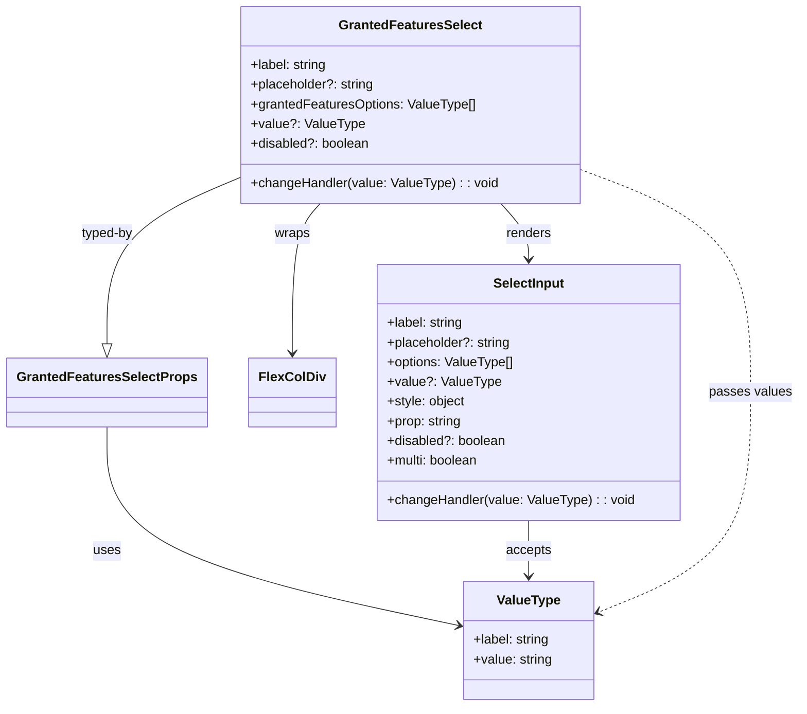

# Diagram: web/portal/src/modules/organizations/components/GrantedFeaturesSelect.tsx

> Auto-generated by Obscura crawlers

## Mermaid

### SVG

<svg id="container" width="948.0703125" xmlns="http://www.w3.org/2000/svg" class="classDiagram" height="860" viewBox="0 0 948.0703125 860" role="graphics-document document" aria-roledescription="class"><g><defs><marker id="container_class-aggregationStart" class="marker aggregation class" refX="18" refY="7" markerWidth="190" markerHeight="240" orient="auto"><path d="M 18,7 L9,13 L1,7 L9,1 Z"></path></marker></defs><defs><marker id="container_class-aggregationEnd" class="marker aggregation class" refX="1" refY="7" markerWidth="20" markerHeight="28" orient="auto"><path d="M 18,7 L9,13 L1,7 L9,1 Z"></path></marker></defs><defs><marker id="container_class-extensionStart" class="marker extension class" refX="18" refY="7" markerWidth="190" markerHeight="240" orient="auto"><path d="M 1,7 L18,13 V 1 Z"></path></marker></defs><defs><marker id="container_class-extensionEnd" class="marker extension class" refX="1" refY="7" markerWidth="20" markerHeight="28" orient="auto"><path d="M 1,1 V 13 L18,7 Z"></path></marker></defs><defs><marker id="container_class-compositionStart" class="marker composition class" refX="18" refY="7" markerWidth="190" markerHeight="240" orient="auto"><path d="M 18,7 L9,13 L1,7 L9,1 Z"></path></marker></defs><defs><marker id="container_class-compositionEnd" class="marker composition class" refX="1" refY="7" markerWidth="20" markerHeight="28" orient="auto"><path d="M 18,7 L9,13 L1,7 L9,1 Z"></path></marker></defs><defs><marker id="container_class-dependencyStart" class="marker dependency class" refX="6" refY="7" markerWidth="190" markerHeight="240" orient="auto"><path d="M 5,7 L9,13 L1,7 L9,1 Z"></path></marker></defs><defs><marker id="container_class-dependencyEnd" class="marker dependency class" refX="13" refY="7" markerWidth="20" markerHeight="28" orient="auto"><path d="M 18,7 L9,13 L14,7 L9,1 Z"></path></marker></defs><defs><marker id="container_class-lollipopStart" class="marker lollipop class" refX="13" refY="7" markerWidth="190" markerHeight="240" orient="auto"><circle stroke="black" fill="transparent" cx="7" cy="7" r="6"></circle></marker></defs><defs><marker id="container_class-lollipopEnd" class="marker lollipop class" refX="1" refY="7" markerWidth="190" markerHeight="240" orient="auto"><circle stroke="black" fill="transparent" cx="7" cy="7" r="6"></circle></marker></defs><g class="root"><g class="clusters"></g><g class="edgePaths"><path d="M277.502,217.543L251.933,228.786C226.363,240.029,175.225,262.514,149.655,296.049C124.086,329.583,124.086,374.167,124.086,396.458L124.086,418.75" id="id_GrantedFeaturesSelect_GrantedFeaturesSelectProps_1" class="edge-thickness-normal edge-pattern-solid relation" style=";;;" data-edge="true" data-et="edge" data-id="id_GrantedFeaturesSelect_GrantedFeaturesSelectProps_1" data-points="W3sieCI6Mjc3LjUwMTk1MzEyNSwieSI6MjE3LjU0Mjc3Mjc0ODQwNjg2fSx7IngiOjEyNC4wODU5Mzc1LCJ5IjoyODV9LHsieCI6MTI0LjA4NTkzNzUsInkiOjQzNn1d" marker-end="url(#container_class-extensionEnd)"></path><path d="M373.103,248L367.55,254.167C361.998,260.333,350.894,272.667,345.341,303C339.789,333.333,339.789,381.667,339.789,405.833L339.789,430" id="id_GrantedFeaturesSelect_FlexColDiv_2" class="edge-thickness-normal edge-pattern-solid relation" style=";;;" data-edge="true" data-et="edge" data-id="id_GrantedFeaturesSelect_FlexColDiv_2" data-points="W3sieCI6MzczLjEwMjU5NTA0Mzc4OTgsInkiOjI0OH0seyJ4IjozMzkuNzg5MDYyNSwieSI6Mjg1fSx7IngiOjMzOS43ODkwNjI1LCJ5Ijo0MzZ9XQ==" marker-end="url(#container_class-dependencyEnd)"></path><path d="M589.19,248L594.743,254.167C600.295,260.333,611.399,272.667,616.952,284C622.504,295.333,622.504,305.667,622.504,310.833L622.504,316" id="id_GrantedFeaturesSelect_SelectInput_3" class="edge-thickness-normal edge-pattern-solid relation" style=";;;" data-edge="true" data-et="edge" data-id="id_GrantedFeaturesSelect_SelectInput_3" data-points="W3sieCI6NTg5LjE5MDM3MzcwNjIxMDIsInkiOjI0OH0seyJ4Ijo2MjIuNTAzOTA2MjUsInkiOjI4NX0seyJ4Ijo2MjIuNTAzOTA2MjUsInkiOjMyMn1d" marker-end="url(#container_class-dependencyEnd)"></path><path d="M124.086,520L124.086,545.167C124.086,570.333,124.086,620.667,193.039,660.913C261.993,701.159,399.9,731.318,468.853,746.398L537.806,761.477" id="id_GrantedFeaturesSelectProps_ValueType_4" class="edge-thickness-normal edge-pattern-solid relation" style=";;;" data-edge="true" data-et="edge" data-id="id_GrantedFeaturesSelectProps_ValueType_4" data-points="W3sieCI6MTI0LjA4NTkzNzUsInkiOjUyMH0seyJ4IjoxMjQuMDg1OTM3NSwieSI6NjcxfSx7IngiOjU0My42Njc5Njg3NSwieSI6NzYyLjc1OTIxNDcwMjc3MDV9XQ==" marker-end="url(#container_class-dependencyEnd)"></path><path d="M622.504,634L622.504,640.167C622.504,646.333,622.504,658.667,622.504,670C622.504,681.333,622.504,691.667,622.504,696.833L622.504,702" id="id_SelectInput_ValueType_5" class="edge-thickness-normal edge-pattern-solid relation" style=";;;" data-edge="true" data-et="edge" data-id="id_SelectInput_ValueType_5" data-points="W3sieCI6NjIyLjUwMzkwNjI1LCJ5Ijo2MzR9LHsieCI6NjIyLjUwMzkwNjI1LCJ5Ijo2NzF9LHsieCI6NjIyLjUwMzkwNjI1LCJ5Ijo3MDh9XQ==" marker-end="url(#container_class-dependencyEnd)"></path><path d="M684.791,206.135L719.049,219.28C753.306,232.424,821.821,258.712,856.078,304.023C890.336,349.333,890.336,413.667,890.336,478C890.336,542.333,890.336,606.667,859.763,651.276C829.19,695.885,768.043,720.77,737.47,733.212L706.897,745.654" id="id_GrantedFeaturesSelect_ValueType_6" class="edge-thickness-normal edge-pattern-dashed relation" style=";;;" data-edge="true" data-et="edge" data-id="id_GrantedFeaturesSelect_ValueType_6" data-points="W3sieCI6Njg0Ljc5MTAxNTYyNSwieSI6MjA2LjEzNTQyMzk3NTU2MTQyfSx7IngiOjg5MC4zMzU5Mzc1LCJ5IjoyODV9LHsieCI6ODkwLjMzNTkzNzUsInkiOjQ3OH0seyJ4Ijo4OTAuMzM1OTM3NSwieSI6NjcxfSx7IngiOjcwMS4zMzk4NDM3NSwieSI6NzQ3LjkxNjAyMTI5MzY2M31d" marker-end="url(#container_class-dependencyEnd)"></path></g><g class="edgeLabels"><g class="edgeLabel" transform="translate(124.0859375, 285)"><g class="label" data-id="id_GrantedFeaturesSelect_GrantedFeaturesSelectProps_1" transform="translate(-32.5625, -12)"><foreignObject width="65.125" height="24">

typed-by

</foreignObject></g></g><g class="edgeLabel" transform="translate(339.7890625, 285)"><g class="label" data-id="id_GrantedFeaturesSelect_FlexColDiv_2" transform="translate(-21.390625, -12)"><foreignObject width="42.78125" height="24">

wraps

</foreignObject></g></g><g class="edgeLabel" transform="translate(622.50390625, 285)"><g class="label" data-id="id_GrantedFeaturesSelect_SelectInput_3" transform="translate(-27.75, -12)"><foreignObject width="55.5" height="24">

renders

</foreignObject></g></g><g class="edgeLabel" transform="translate(124.0859375, 671)"><g class="label" data-id="id_GrantedFeaturesSelectProps_ValueType_4" transform="translate(-16.4921875, -12)"><foreignObject width="32.984375" height="24">

uses

</foreignObject></g></g><g class="edgeLabel" transform="translate(622.50390625, 671)"><g class="label" data-id="id_SelectInput_ValueType_5" transform="translate(-27.421875, -12)"><foreignObject width="54.84375" height="24">

accepts

</foreignObject></g></g><g class="edgeLabel" transform="translate(890.3359375, 478)"><g class="label" data-id="id_GrantedFeaturesSelect_ValueType_6" transform="translate(-49.734375, -12)"><foreignObject width="99.46875" height="24">

passes values

</foreignObject></g></g></g><g class="nodes"><g class="node default" id="classId-GrantedFeaturesSelect-0" transform="translate(481.146484375, 128)"><g class="basic label-container"><path d="M-203.64453125 -120 L203.64453125 -120 L203.64453125 120 L-203.64453125 120" stroke="none" stroke-width="0" fill="#ECECFF" style=""></path><path d="M-203.64453125 -120 C-103.97730286406268 -120, -4.310074478125358 -120, 203.64453125 -120 M-203.64453125 -120 C-108.44396092021853 -120, -13.243390590437059 -120, 203.64453125 -120 M203.64453125 -120 C203.64453125 -67.45877388054407, 203.64453125 -14.917547761088159, 203.64453125 120 M203.64453125 -120 C203.64453125 -42.45809638384989, 203.64453125 35.08380723230022, 203.64453125 120 M203.64453125 120 C85.32189051141098 120, -33.00075022717803 120, -203.64453125 120 M203.64453125 120 C98.54286858850185 120, -6.558794072996307 120, -203.64453125 120 M-203.64453125 120 C-203.64453125 34.01566450544745, -203.64453125 -51.96867098910511, -203.64453125 -120 M-203.64453125 120 C-203.64453125 57.7202328606731, -203.64453125 -4.5595342786538, -203.64453125 -120" stroke="#9370DB" stroke-width="1.3" fill="none" stroke-dasharray="0 0" style=""></path></g><g class="annotation-group text" transform="translate(0, -96)"></g><g class="label-group text" transform="translate(-83.1640625, -96)"><g class="label" style="font-weight: bolder" transform="translate(0,-12)"><foreignObject width="166.328125" height="24">

GrantedFeaturesSelect

</foreignObject></g></g><g class="members-group text" transform="translate(-191.64453125, -48)"><g class="label" style="" transform="translate(0,-12)"><foreignObject width="94.09375" height="24">

+label: string

</foreignObject></g><g class="label" style="" transform="translate(0,12)"><foreignObject width="151.21875" height="24">

+placeholder?: string

</foreignObject></g><g class="label" style="" transform="translate(0,36)"><foreignObject width="274.0625" height="24">

+grantedFeaturesOptions: ValueType[]

</foreignObject></g><g class="label" style="" transform="translate(0,60)"><foreignObject width="134.75" height="24">

+value?: ValueType

</foreignObject></g><g class="label" style="" transform="translate(0,84)"><foreignObject width="145.359375" height="24">

+disabled?: boolean

</foreignObject></g></g><g class="methods-group text" transform="translate(-191.64453125, 96)"><g class="label" style="" transform="translate(0,-12)"><foreignObject width="300.125" height="24">

+changeHandler(value: ValueType) : : void

</foreignObject></g></g><g class="divider" style=""><path d="M-203.64453125 -72 C-121.99010712223524 -72, -40.33568299447049 -72, 203.64453125 -72 M-203.64453125 -72 C-74.7517484534853 -72, 54.14103434302939 -72, 203.64453125 -72" stroke="#9370DB" stroke-width="1.3" fill="none" stroke-dasharray="0 0" style=""></path></g><g class="divider" style=""><path d="M-203.64453125 72 C-115.21145727058594 72, -26.778383291171878 72, 203.64453125 72 M-203.64453125 72 C-100.37827818298345 72, 2.887974884033099 72, 203.64453125 72" stroke="#9370DB" stroke-width="1.3" fill="none" stroke-dasharray="0 0" style=""></path></g></g><g class="node default" id="classId-GrantedFeaturesSelectProps-1" transform="translate(124.0859375, 478)"><g class="basic label-container"><path d="M-116.0859375 -42 L116.0859375 -42 L116.0859375 42 L-116.0859375 42" stroke="none" stroke-width="0" fill="#ECECFF" style=""></path><path d="M-116.0859375 -42 C-54.550305883032586 -42, 6.985325733934829 -42, 116.0859375 -42 M-116.0859375 -42 C-62.27607189267971 -42, -8.46620628535942 -42, 116.0859375 -42 M116.0859375 -42 C116.0859375 -9.321919737711518, 116.0859375 23.356160524576964, 116.0859375 42 M116.0859375 -42 C116.0859375 -8.938911608606453, 116.0859375 24.122176782787093, 116.0859375 42 M116.0859375 42 C29.96664408035467 42, -56.15264933929066 42, -116.0859375 42 M116.0859375 42 C61.73318752803551 42, 7.380437556071016 42, -116.0859375 42 M-116.0859375 42 C-116.0859375 15.75855514158992, -116.0859375 -10.48288971682016, -116.0859375 -42 M-116.0859375 42 C-116.0859375 22.35798606702671, -116.0859375 2.7159721340534233, -116.0859375 -42" stroke="#9370DB" stroke-width="1.3" fill="none" stroke-dasharray="0 0" style=""></path></g><g class="annotation-group text" transform="translate(0, -18)"></g><g class="label-group text" transform="translate(-104.0859375, -18)"><g class="label" style="font-weight: bolder" transform="translate(0,-12)"><foreignObject width="208.171875" height="24">

GrantedFeaturesSelectProps

</foreignObject></g></g><g class="members-group text" transform="translate(-104.0859375, 30)"></g><g class="methods-group text" transform="translate(-104.0859375, 60)"></g><g class="divider" style=""><path d="M-116.0859375 6 C-31.83443482848412 6, 52.41706784303176 6, 116.0859375 6 M-116.0859375 6 C-57.322764335509966 6, 1.4404088289800683 6, 116.0859375 6" stroke="#9370DB" stroke-width="1.3" fill="none" stroke-dasharray="0 0" style=""></path></g><g class="divider" style=""><path d="M-116.0859375 24 C-59.77985594775969 24, -3.473774395519385 24, 116.0859375 24 M-116.0859375 24 C-59.34135007002395 24, -2.596762640047899 24, 116.0859375 24" stroke="#9370DB" stroke-width="1.3" fill="none" stroke-dasharray="0 0" style=""></path></g></g><g class="node default" id="classId-ValueType-2" transform="translate(622.50390625, 780)"><g class="basic label-container"><path d="M-78.8359375 -72 L78.8359375 -72 L78.8359375 72 L-78.8359375 72" stroke="none" stroke-width="0" fill="#ECECFF" style=""></path><path d="M-78.8359375 -72 C-19.97897697094006 -72, 38.87798355811988 -72, 78.8359375 -72 M-78.8359375 -72 C-41.70079645725574 -72, -4.5656554145114825 -72, 78.8359375 -72 M78.8359375 -72 C78.8359375 -34.30383327724584, 78.8359375 3.3923334455083136, 78.8359375 72 M78.8359375 -72 C78.8359375 -28.517145912408516, 78.8359375 14.965708175182968, 78.8359375 72 M78.8359375 72 C16.18913647916262 72, -46.45766454167476 72, -78.8359375 72 M78.8359375 72 C35.131496742417255 72, -8.57294401516549 72, -78.8359375 72 M-78.8359375 72 C-78.8359375 34.864338993847184, -78.8359375 -2.2713220123056317, -78.8359375 -72 M-78.8359375 72 C-78.8359375 23.525435993555647, -78.8359375 -24.949128012888707, -78.8359375 -72" stroke="#9370DB" stroke-width="1.3" fill="none" stroke-dasharray="0 0" style=""></path></g><g class="annotation-group text" transform="translate(0, -48)"></g><g class="label-group text" transform="translate(-37.25, -48)"><g class="label" style="font-weight: bolder" transform="translate(0,-12)"><foreignObject width="74.5" height="24">

ValueType

</foreignObject></g></g><g class="members-group text" transform="translate(-66.8359375, 0)"><g class="label" style="" transform="translate(0,-12)"><foreignObject width="94.09375" height="24">

+label: string

</foreignObject></g><g class="label" style="" transform="translate(0,12)"><foreignObject width="96.421875" height="24">

+value: string

</foreignObject></g></g><g class="methods-group text" transform="translate(-66.8359375, 72)"></g><g class="divider" style=""><path d="M-78.8359375 -24 C-46.06318011116325 -24, -13.290422722326497 -24, 78.8359375 -24 M-78.8359375 -24 C-23.177621010698118 -24, 32.480695478603764 -24, 78.8359375 -24" stroke="#9370DB" stroke-width="1.3" fill="none" stroke-dasharray="0 0" style=""></path></g><g class="divider" style=""><path d="M-78.8359375 48 C-22.488860154233144 48, 33.85821719153371 48, 78.8359375 48 M-78.8359375 48 C-46.09648196128712 48, -13.357026422574236 48, 78.8359375 48" stroke="#9370DB" stroke-width="1.3" fill="none" stroke-dasharray="0 0" style=""></path></g></g><g class="node default" id="classId-FlexColDiv-3" transform="translate(339.7890625, 478)"><g class="basic label-container"><path d="M-49.6171875 -42 L49.6171875 -42 L49.6171875 42 L-49.6171875 42" stroke="none" stroke-width="0" fill="#ECECFF" style=""></path><path d="M-49.6171875 -42 C-14.086287387322272 -42, 21.444612725355455 -42, 49.6171875 -42 M-49.6171875 -42 C-10.18323748640163 -42, 29.25071252719674 -42, 49.6171875 -42 M49.6171875 -42 C49.6171875 -22.989236639902924, 49.6171875 -3.978473279805847, 49.6171875 42 M49.6171875 -42 C49.6171875 -13.889310431238513, 49.6171875 14.221379137522973, 49.6171875 42 M49.6171875 42 C12.59186603640184 42, -24.43345542719632 42, -49.6171875 42 M49.6171875 42 C17.73326402881884 42, -14.150659442362318 42, -49.6171875 42 M-49.6171875 42 C-49.6171875 24.33752365983186, -49.6171875 6.675047319663719, -49.6171875 -42 M-49.6171875 42 C-49.6171875 8.948857943682228, -49.6171875 -24.102284112635544, -49.6171875 -42" stroke="#9370DB" stroke-width="1.3" fill="none" stroke-dasharray="0 0" style=""></path></g><g class="annotation-group text" transform="translate(0, -18)"></g><g class="label-group text" transform="translate(-37.6171875, -18)"><g class="label" style="font-weight: bolder" transform="translate(0,-12)"><foreignObject width="75.234375" height="24">

FlexColDiv

</foreignObject></g></g><g class="members-group text" transform="translate(-37.6171875, 30)"></g><g class="methods-group text" transform="translate(-37.6171875, 60)"></g><g class="divider" style=""><path d="M-49.6171875 6 C-11.535923139851796 6, 26.545341220296407 6, 49.6171875 6 M-49.6171875 6 C-17.379209170200404 6, 14.858769159599191 6, 49.6171875 6" stroke="#9370DB" stroke-width="1.3" fill="none" stroke-dasharray="0 0" style=""></path></g><g class="divider" style=""><path d="M-49.6171875 24 C-15.856127168033993 24, 17.904933163932014 24, 49.6171875 24 M-49.6171875 24 C-16.946417455544655 24, 15.72435258891069 24, 49.6171875 24" stroke="#9370DB" stroke-width="1.3" fill="none" stroke-dasharray="0 0" style=""></path></g></g><g class="node default" id="classId-SelectInput-4" transform="translate(622.50390625, 478)"><g class="basic label-container"><path d="M-183.09765625 -156 L183.09765625 -156 L183.09765625 156 L-183.09765625 156" stroke="none" stroke-width="0" fill="#ECECFF" style=""></path><path d="M-183.09765625 -156 C-96.33074288506808 -156, -9.563829520136153 -156, 183.09765625 -156 M-183.09765625 -156 C-69.45342571579747 -156, 44.19080481840507 -156, 183.09765625 -156 M183.09765625 -156 C183.09765625 -67.24185468771444, 183.09765625 21.516290624571127, 183.09765625 156 M183.09765625 -156 C183.09765625 -45.11801966720965, 183.09765625 65.7639606655807, 183.09765625 156 M183.09765625 156 C39.18199186214912 156, -104.73367252570176 156, -183.09765625 156 M183.09765625 156 C67.11333296773708 156, -48.87099031452584 156, -183.09765625 156 M-183.09765625 156 C-183.09765625 63.59299647294068, -183.09765625 -28.814007054118633, -183.09765625 -156 M-183.09765625 156 C-183.09765625 68.2728050451956, -183.09765625 -19.454389909608807, -183.09765625 -156" stroke="#9370DB" stroke-width="1.3" fill="none" stroke-dasharray="0 0" style=""></path></g><g class="annotation-group text" transform="translate(0, -132)"></g><g class="label-group text" transform="translate(-42.0703125, -132)"><g class="label" style="font-weight: bolder" transform="translate(0,-12)"><foreignObject width="84.140625" height="24">

SelectInput

</foreignObject></g></g><g class="members-group text" transform="translate(-171.09765625, -84)"><g class="label" style="" transform="translate(0,-12)"><foreignObject width="94.09375" height="24">

+label: string

</foreignObject></g><g class="label" style="" transform="translate(0,12)"><foreignObject width="151.21875" height="24">

+placeholder?: string

</foreignObject></g><g class="label" style="" transform="translate(0,36)"><foreignObject width="154.953125" height="24">

+options: ValueType[]

</foreignObject></g><g class="label" style="" transform="translate(0,60)"><foreignObject width="134.75" height="24">

+value?: ValueType

</foreignObject></g><g class="label" style="" transform="translate(0,84)"><foreignObject width="95.90625" height="24">

+style: object

</foreignObject></g><g class="label" style="" transform="translate(0,108)"><foreignObject width="91.75" height="24">

+prop: string

</foreignObject></g><g class="label" style="" transform="translate(0,132)"><foreignObject width="145.359375" height="24">

+disabled?: boolean

</foreignObject></g><g class="label" style="" transform="translate(0,156)"><foreignObject width="113.515625" height="24">

+multi: boolean

</foreignObject></g></g><g class="methods-group text" transform="translate(-171.09765625, 132)"><g class="label" style="" transform="translate(0,-12)"><foreignObject width="300.125" height="24">

+changeHandler(value: ValueType) : : void

</foreignObject></g></g><g class="divider" style=""><path d="M-183.09765625 -108 C-64.90861587788365 -108, 53.280424494232705 -108, 183.09765625 -108 M-183.09765625 -108 C-56.662806582607686 -108, 69.77204308478463 -108, 183.09765625 -108" stroke="#9370DB" stroke-width="1.3" fill="none" stroke-dasharray="0 0" style=""></path></g><g class="divider" style=""><path d="M-183.09765625 108 C-94.81955453143455 108, -6.541452812869096 108, 183.09765625 108 M-183.09765625 108 C-38.131785489680766 108, 106.83408527063847 108, 183.09765625 108" stroke="#9370DB" stroke-width="1.3" fill="none" stroke-dasharray="0 0" style=""></path></g></g></g></g></g></svg>
