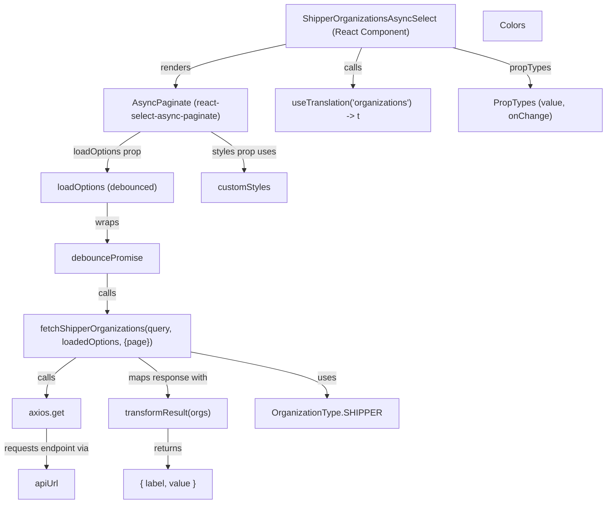

# Diagram: web/portal/src/modules/organizations/components/ShipperOrganizationsAsyncSelect.js

> Auto-generated by Obscura crawlers

## Mermaid

### SVG

<svg id="container" width="1106.89453125" xmlns="http://www.w3.org/2000/svg" class="flowchart" height="910" viewBox="0 0 1106.89453125 910" role="graphics-document document" aria-roledescription="flowchart-v2"><g><marker id="container_flowchart-v2-pointEnd" class="marker flowchart-v2" viewBox="0 0 10 10" refX="5" refY="5" markerUnits="userSpaceOnUse" markerWidth="8" markerHeight="8" orient="auto"><path d="M 0 0 L 10 5 L 0 10 z" class="arrowMarkerPath" style="stroke-width: 1; stroke-dasharray: 1, 0;"></path></marker><marker id="container_flowchart-v2-pointStart" class="marker flowchart-v2" viewBox="0 0 10 10" refX="4.5" refY="5" markerUnits="userSpaceOnUse" markerWidth="8" markerHeight="8" orient="auto"><path d="M 0 5 L 10 10 L 10 0 z" class="arrowMarkerPath" style="stroke-width: 1; stroke-dasharray: 1, 0;"></path></marker><marker id="container_flowchart-v2-circleEnd" class="marker flowchart-v2" viewBox="0 0 10 10" refX="11" refY="5" markerUnits="userSpaceOnUse" markerWidth="11" markerHeight="11" orient="auto"><circle cx="5" cy="5" r="5" class="arrowMarkerPath" style="stroke-width: 1; stroke-dasharray: 1, 0;"></circle></marker><marker id="container_flowchart-v2-circleStart" class="marker flowchart-v2" viewBox="0 0 10 10" refX="-1" refY="5" markerUnits="userSpaceOnUse" markerWidth="11" markerHeight="11" orient="auto"><circle cx="5" cy="5" r="5" class="arrowMarkerPath" style="stroke-width: 1; stroke-dasharray: 1, 0;"></circle></marker><marker id="container_flowchart-v2-crossEnd" class="marker cross flowchart-v2" viewBox="0 0 11 11" refX="12" refY="5.2" markerUnits="userSpaceOnUse" markerWidth="11" markerHeight="11" orient="auto"><path d="M 1,1 l 9,9 M 10,1 l -9,9" class="arrowMarkerPath" style="stroke-width: 2; stroke-dasharray: 1, 0;"></path></marker><marker id="container_flowchart-v2-crossStart" class="marker cross flowchart-v2" viewBox="0 0 11 11" refX="-1" refY="5.2" markerUnits="userSpaceOnUse" markerWidth="11" markerHeight="11" orient="auto"><path d="M 1,1 l 9,9 M 10,1 l -9,9" class="arrowMarkerPath" style="stroke-width: 2; stroke-dasharray: 1, 0;"></path></marker><g class="root"><g class="clusters"></g><g class="edgePaths"><path d="M526.773,79.584L492.822,86.82C458.871,94.056,390.969,108.528,357.018,121.264C323.066,134,323.066,145,323.066,150.5L323.066,156" id="L_ShipperOrganizationsAsyncSelect_AsyncPaginate_0" class="edge-thickness-normal edge-pattern-solid edge-thickness-normal edge-pattern-solid flowchart-link" style=";" data-edge="true" data-et="edge" data-id="L_ShipperOrganizationsAsyncSelect_AsyncPaginate_0" data-points="W3sieCI6NTI2Ljc3MzQzNzUsInkiOjc5LjU4MzkxNjY1ODQ1MDgyfSx7IngiOjMyMy4wNjY0MDYyNSwieSI6MTIzfSx7IngiOjMyMy4wNjY0MDYyNSwieSI6MTYwfV0=" marker-end="url(#container_flowchart-v2-pointEnd)"></path><path d="M387.355,238L397.521,244.167C407.686,250.333,428.017,262.667,438.182,274.333C448.348,286,448.348,297,448.348,302.5L448.348,308" id="L_AsyncPaginate_customStyles_0" class="edge-thickness-normal edge-pattern-solid edge-thickness-normal edge-pattern-solid flowchart-link" style=";" data-edge="true" data-et="edge" data-id="L_AsyncPaginate_customStyles_0" data-points="W3sieCI6Mzg3LjM1NTQ2ODc1LCJ5IjoyMzh9LHsieCI6NDQ4LjM0NzY1NjI1LCJ5IjoyNzV9LHsieCI6NDQ4LjM0NzY1NjI1LCJ5IjozMTJ9XQ==" marker-end="url(#container_flowchart-v2-pointEnd)"></path><path d="M258.777,238L248.612,244.167C238.447,250.333,218.116,262.667,207.951,274.333C197.785,286,197.785,297,197.785,302.5L197.785,308" id="L_AsyncPaginate_LoadOptions_0" class="edge-thickness-normal edge-pattern-solid edge-thickness-normal edge-pattern-solid flowchart-link" style=";" data-edge="true" data-et="edge" data-id="L_AsyncPaginate_LoadOptions_0" data-points="W3sieCI6MjU4Ljc3NzM0Mzc1LCJ5IjoyMzh9LHsieCI6MTk3Ljc4NTE1NjI1LCJ5IjoyNzV9LHsieCI6MTk3Ljc4NTE1NjI1LCJ5IjozMTJ9XQ==" marker-end="url(#container_flowchart-v2-pointEnd)"></path><path d="M197.785,366L197.785,372.167C197.785,378.333,197.785,390.667,197.785,402.333C197.785,414,197.785,425,197.785,430.5L197.785,436" id="L_LoadOptions_DebouncePromise_0" class="edge-thickness-normal edge-pattern-solid edge-thickness-normal edge-pattern-solid flowchart-link" style=";" data-edge="true" data-et="edge" data-id="L_LoadOptions_DebouncePromise_0" data-points="W3sieCI6MTk3Ljc4NTE1NjI1LCJ5IjozNjZ9LHsieCI6MTk3Ljc4NTE1NjI1LCJ5Ijo0MDN9LHsieCI6MTk3Ljc4NTE1NjI1LCJ5Ijo0NDB9XQ==" marker-end="url(#container_flowchart-v2-pointEnd)"></path><path d="M197.785,494L197.785,500.167C197.785,506.333,197.785,518.667,197.785,530.333C197.785,542,197.785,553,197.785,558.5L197.785,564" id="L_DebouncePromise_fetchShipperOrganizations_0" class="edge-thickness-normal edge-pattern-solid edge-thickness-normal edge-pattern-solid flowchart-link" style=";" data-edge="true" data-et="edge" data-id="L_DebouncePromise_fetchShipperOrganizations_0" data-points="W3sieCI6MTk3Ljc4NTE1NjI1LCJ5Ijo0OTR9LHsieCI6MTk3Ljc4NTE1NjI1LCJ5Ijo1MzF9LHsieCI6MTk3Ljc4NTE1NjI1LCJ5Ijo1Njh9XQ==" marker-end="url(#container_flowchart-v2-pointEnd)"></path><path d="M141.059,646L132.09,652.167C123.12,658.333,105.181,670.667,96.212,682.333C87.242,694,87.242,705,87.242,710.5L87.242,716" id="L_fetchShipperOrganizations_Axios_0" class="edge-thickness-normal edge-pattern-solid edge-thickness-normal edge-pattern-solid flowchart-link" style=";" data-edge="true" data-et="edge" data-id="L_fetchShipperOrganizations_Axios_0" data-points="W3sieCI6MTQxLjA1OTE1OTEyODI4OTQ4LCJ5Ijo2NDZ9LHsieCI6ODcuMjQyMTg3NSwieSI6NjgzfSx7IngiOjg3LjI0MjE4NzUsInkiOjcyMH1d" marker-end="url(#container_flowchart-v2-pointEnd)"></path><path d="M87.242,774L87.242,780.167C87.242,786.333,87.242,798.667,87.242,810.333C87.242,822,87.242,833,87.242,838.5L87.242,844" id="L_Axios_apiUrl_0" class="edge-thickness-normal edge-pattern-solid edge-thickness-normal edge-pattern-solid flowchart-link" style=";" data-edge="true" data-et="edge" data-id="L_Axios_apiUrl_0" data-points="W3sieCI6ODcuMjQyMTg3NSwieSI6Nzc0fSx7IngiOjg3LjI0MjE4NzUsInkiOjgxMX0seyJ4Ijo4Ny4yNDIxODc1LCJ5Ijo4NDh9XQ==" marker-end="url(#container_flowchart-v2-pointEnd)"></path><path d="M351.199,636.523L391.451,644.269C431.703,652.015,512.207,667.508,552.459,680.754C592.711,694,592.711,705,592.711,710.5L592.711,716" id="L_fetchShipperOrganizations_OrganizationType_0" class="edge-thickness-normal edge-pattern-solid edge-thickness-normal edge-pattern-solid flowchart-link" style=";" data-edge="true" data-et="edge" data-id="L_fetchShipperOrganizations_OrganizationType_0" data-points="W3sieCI6MzUxLjE5OTIxODc1LCJ5Ijo2MzYuNTIzMTg5NjgxNjA1Nn0seyJ4Ijo1OTIuNzEwOTM3NSwieSI6NjgzfSx7IngiOjU5Mi43MTA5Mzc1LCJ5Ijo3MjB9XQ==" marker-end="url(#container_flowchart-v2-pointEnd)"></path><path d="M254.511,646L263.481,652.167C272.45,658.333,290.389,670.667,299.359,682.333C308.328,694,308.328,705,308.328,710.5L308.328,716" id="L_fetchShipperOrganizations_transformResult_0" class="edge-thickness-normal edge-pattern-solid edge-thickness-normal edge-pattern-solid flowchart-link" style=";" data-edge="true" data-et="edge" data-id="L_fetchShipperOrganizations_transformResult_0" data-points="W3sieCI6MjU0LjUxMTE1MzM3MTcxMDUyLCJ5Ijo2NDZ9LHsieCI6MzA4LjMyODEyNSwieSI6NjgzfSx7IngiOjMwOC4zMjgxMjUsInkiOjcyMH1d" marker-end="url(#container_flowchart-v2-pointEnd)"></path><path d="M308.328,774L308.328,780.167C308.328,786.333,308.328,798.667,308.328,810.333C308.328,822,308.328,833,308.328,838.5L308.328,844" id="L_transformResult_Options_0" class="edge-thickness-normal edge-pattern-solid edge-thickness-normal edge-pattern-solid flowchart-link" style=";" data-edge="true" data-et="edge" data-id="L_transformResult_Options_0" data-points="W3sieCI6MzA4LjMyODEyNSwieSI6Nzc0fSx7IngiOjMwOC4zMjgxMjUsInkiOjgxMX0seyJ4IjozMDguMzI4MTI1LCJ5Ijo4NDh9XQ==" marker-end="url(#container_flowchart-v2-pointEnd)"></path><path d="M662.375,86L659.643,92.167C656.91,98.333,651.445,110.667,648.713,122.333C645.98,134,645.98,145,645.98,150.5L645.98,156" id="L_ShipperOrganizationsAsyncSelect_useTranslation_0" class="edge-thickness-normal edge-pattern-solid edge-thickness-normal edge-pattern-solid flowchart-link" style=";" data-edge="true" data-et="edge" data-id="L_ShipperOrganizationsAsyncSelect_useTranslation_0" data-points="W3sieCI6NjYyLjM3NTI1Njk5MDEzMTYsInkiOjg2fSx7IngiOjY0NS45ODA0Njg3NSwieSI6MTIzfSx7IngiOjY0NS45ODA0Njg3NSwieSI6MTYwfV0=" marker-end="url(#container_flowchart-v2-pointEnd)"></path><path d="M828.081,86L851.55,92.167C875.019,98.333,921.957,110.667,945.426,122.333C968.895,134,968.895,145,968.895,150.5L968.895,156" id="L_ShipperOrganizationsAsyncSelect_PropTypesNode_0" class="edge-thickness-normal edge-pattern-solid edge-thickness-normal edge-pattern-solid flowchart-link" style=";" data-edge="true" data-et="edge" data-id="L_ShipperOrganizationsAsyncSelect_PropTypesNode_0" data-points="W3sieCI6ODI4LjA4MTE1NzQ4MzU1MjYsInkiOjg2fSx7IngiOjk2OC44OTQ1MzEyNSwieSI6MTIzfSx7IngiOjk2OC44OTQ1MzEyNSwieSI6MTYwfV0=" marker-end="url(#container_flowchart-v2-pointEnd)"></path></g><g class="edgeLabels"><g class="edgeLabel" transform="translate(323.06640625, 123)"><g class="label" data-id="L_ShipperOrganizationsAsyncSelect_AsyncPaginate_0" transform="translate(-27.75, -12)"><foreignObject width="55.5" height="24">

renders

</foreignObject></g></g><g class="edgeLabel" transform="translate(448.34765625, 275)"><g class="label" data-id="L_AsyncPaginate_customStyles_0" transform="translate(-58.6796875, -12)"><foreignObject width="117.359375" height="24">

styles prop uses

</foreignObject></g></g><g class="edgeLabel" transform="translate(197.78515625, 275)"><g class="label" data-id="L_AsyncPaginate_LoadOptions_0" transform="translate(-63.7109375, -12)"><foreignObject width="127.421875" height="24">

loadOptions prop

</foreignObject></g></g><g class="edgeLabel" transform="translate(197.78515625, 403)"><g class="label" data-id="L_LoadOptions_DebouncePromise_0" transform="translate(-21.390625, -12)"><foreignObject width="42.78125" height="24">

wraps

</foreignObject></g></g><g class="edgeLabel" transform="translate(197.78515625, 531)"><g class="label" data-id="L_DebouncePromise_fetchShipperOrganizations_0" transform="translate(-16.4453125, -12)"><foreignObject width="32.890625" height="24">

calls

</foreignObject></g></g><g class="edgeLabel" transform="translate(87.2421875, 683)"><g class="label" data-id="L_fetchShipperOrganizations_Axios_0" transform="translate(-16.4453125, -12)"><foreignObject width="32.890625" height="24">

calls

</foreignObject></g></g><g class="edgeLabel" transform="translate(87.2421875, 811)"><g class="label" data-id="L_Axios_apiUrl_0" transform="translate(-79.2421875, -12)"><foreignObject width="158.484375" height="24">

requests endpoint via

</foreignObject></g></g><g class="edgeLabel" transform="translate(592.7109375, 683)"><g class="label" data-id="L_fetchShipperOrganizations_OrganizationType_0" transform="translate(-16.4921875, -12)"><foreignObject width="32.984375" height="24">

uses

</foreignObject></g></g><g class="edgeLabel" transform="translate(308.328125, 683)"><g class="label" data-id="L_fetchShipperOrganizations_transformResult_0" transform="translate(-72.65625, -12)"><foreignObject width="145.3125" height="24">

maps response with

</foreignObject></g></g><g class="edgeLabel" transform="translate(308.328125, 811)"><g class="label" data-id="L_transformResult_Options_0" transform="translate(-26.265625, -12)"><foreignObject width="52.53125" height="24">

returns

</foreignObject></g></g><g class="edgeLabel" transform="translate(645.98046875, 123)"><g class="label" data-id="L_ShipperOrganizationsAsyncSelect_useTranslation_0" transform="translate(-16.4453125, -12)"><foreignObject width="32.890625" height="24">

calls

</foreignObject></g></g><g class="edgeLabel" transform="translate(968.89453125, 123)"><g class="label" data-id="L_ShipperOrganizationsAsyncSelect_PropTypesNode_0" transform="translate(-37.625, -12)"><foreignObject width="75.25" height="24">

propTypes

</foreignObject></g></g></g><g class="nodes"><g class="node default" id="flowchart-ShipperOrganizationsAsyncSelect-0" transform="translate(679.65625, 47)"><rect class="basic label-container" style="" x="-152.8828125" y="-39" width="305.765625" height="78"></rect><g class="label" style="" transform="translate(-122.8828125, -24)"><rect></rect><foreignObject width="245.765625" height="48">

ShipperOrganizationsAsyncSelect (React Component)

</foreignObject></g></g><g class="node default" id="flowchart-AsyncPaginate-1" transform="translate(323.06640625, 199)"><rect class="basic label-container" style="" x="-130" y="-39" width="260" height="78"></rect><g class="label" style="" transform="translate(-100, -24)"><rect></rect><foreignObject width="200" height="48">

AsyncPaginate (react-select-async-paginate)

</foreignObject></g></g><g class="node default" id="flowchart-DebouncePromise-2" transform="translate(197.78515625, 467)"><rect class="basic label-container" style="" x="-95.15625" y="-27" width="190.3125" height="54"></rect><g class="label" style="" transform="translate(-65.15625, -12)"><rect></rect><foreignObject width="130.3125" height="24">

debouncePromise

</foreignObject></g></g><g class="node default" id="flowchart-LoadOptions-3" transform="translate(197.78515625, 339)"><rect class="basic label-container" style="" x="-122.5859375" y="-27" width="245.171875" height="54"></rect><g class="label" style="" transform="translate(-92.5859375, -12)"><rect></rect><foreignObject width="185.171875" height="24">

loadOptions (debounced)

</foreignObject></g></g><g class="node default" id="flowchart-fetchShipperOrganizations-4" transform="translate(197.78515625, 607)"><rect class="basic label-container" style="" x="-153.4140625" y="-39" width="306.828125" height="78"></rect><g class="label" style="" transform="translate(-123.4140625, -24)"><rect></rect><foreignObject width="246.828125" height="48">

fetchShipperOrganizations(query, loadedOptions, {page})

</foreignObject></g></g><g class="node default" id="flowchart-transformResult-5" transform="translate(308.328125, 747)"><rect class="basic label-container" style="" x="-109.0625" y="-27" width="218.125" height="54"></rect><g class="label" style="" transform="translate(-79.0625, -12)"><rect></rect><foreignObject width="158.125" height="24">

transformResult(orgs)

</foreignObject></g></g><g class="node default" id="flowchart-Axios-6" transform="translate(87.2421875, 747)"><rect class="basic label-container" style="" x="-62.0234375" y="-27" width="124.046875" height="54"></rect><g class="label" style="" transform="translate(-32.0234375, -12)"><rect></rect><foreignObject width="64.046875" height="24">

axios.get

</foreignObject></g></g><g class="node default" id="flowchart-apiUrl-7" transform="translate(87.2421875, 875)"><rect class="basic label-container" style="" x="-52.09375" y="-27" width="104.1875" height="54"></rect><g class="label" style="" transform="translate(-22.09375, -12)"><rect></rect><foreignObject width="44.1875" height="24">

apiUrl

</foreignObject></g></g><g class="node default" id="flowchart-OrganizationType-8" transform="translate(592.7109375, 747)"><rect class="basic label-container" style="" x="-125.3203125" y="-27" width="250.640625" height="54"></rect><g class="label" style="" transform="translate(-95.3203125, -12)"><rect></rect><foreignObject width="190.640625" height="24">

OrganizationType.SHIPPER

</foreignObject></g></g><g class="node default" id="flowchart-Colors-9" transform="translate(935.21875, 47)"><rect class="basic label-container" style="" x="-52.6796875" y="-27" width="105.359375" height="54"></rect><g class="label" style="" transform="translate(-22.6796875, -12)"><rect></rect><foreignObject width="45.359375" height="24">

Colors

</foreignObject></g></g><g class="node default" id="flowchart-customStyles-10" transform="translate(448.34765625, 339)"><rect class="basic label-container" style="" x="-77.9765625" y="-27" width="155.953125" height="54"></rect><g class="label" style="" transform="translate(-47.9765625, -12)"><rect></rect><foreignObject width="95.953125" height="24">

customStyles

</foreignObject></g></g><g class="node default" id="flowchart-useTranslation-11" transform="translate(645.98046875, 199)"><rect class="basic label-container" style="" x="-142.9140625" y="-39" width="285.828125" height="78"></rect><g class="label" style="" transform="translate(-112.9140625, -24)"><rect></rect><foreignObject width="225.828125" height="48">

useTranslation('organizations') -&gt; t

</foreignObject></g></g><g class="node default" id="flowchart-PropTypesNode-12" transform="translate(968.89453125, 199)"><rect class="basic label-container" style="" x="-130" y="-39" width="260" height="78"></rect><g class="label" style="" transform="translate(-100, -24)"><rect></rect><foreignObject width="200" height="48">

PropTypes (value, onChange)

</foreignObject></g></g><g class="node default" id="flowchart-Options-32" transform="translate(308.328125, 875)"><rect class="basic label-container" style="" x="-81.0234375" y="-27" width="162.046875" height="54"></rect><g class="label" style="" transform="translate(-51.0234375, -12)"><rect></rect><foreignObject width="102.046875" height="24">

{ label, value }

</foreignObject></g></g></g></g></g></svg>
