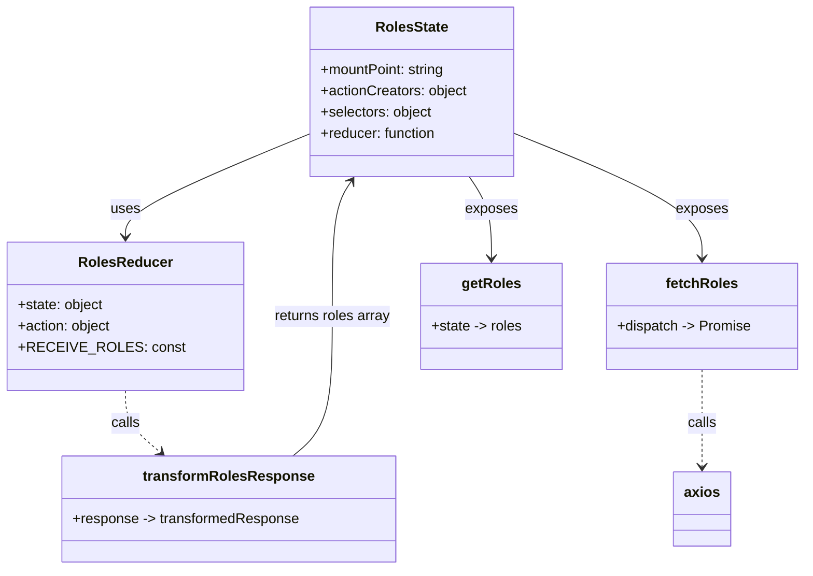

# Diagram: web/portal/src/modules/roles/RolesState.js


> Auto-generated by Obscura crawlers

## Diagram 1



### SVG

<svg id="container" width="883.734375" xmlns="http://www.w3.org/2000/svg" class="classDiagram" height="644" viewBox="0 0 883.734375 644" role="graphics-document document" aria-roledescription="class"><style>#container{font-family:"trebuchet ms",verdana,arial,sans-serif;font-size:16px;fill:#333;}@keyframes edge-animation-frame{from{stroke-dashoffset:0;}}@keyframes dash{to{stroke-dashoffset:0;}}#container .edge-animation-slow{stroke-dasharray:9,5!important;stroke-dashoffset:900;animation:dash 50s linear infinite;stroke-linecap:round;}#container .edge-animation-fast{stroke-dasharray:9,5!important;stroke-dashoffset:900;animation:dash 20s linear infinite;stroke-linecap:round;}#container .error-icon{fill:#552222;}#container .error-text{fill:#552222;stroke:#552222;}#container .edge-thickness-normal{stroke-width:1px;}#container .edge-thickness-thick{stroke-width:3.5px;}#container .edge-pattern-solid{stroke-dasharray:0;}#container .edge-thickness-invisible{stroke-width:0;fill:none;}#container .edge-pattern-dashed{stroke-dasharray:3;}#container .edge-pattern-dotted{stroke-dasharray:2;}#container .marker{fill:#333333;stroke:#333333;}#container .marker.cross{stroke:#333333;}#container svg{font-family:"trebuchet ms",verdana,arial,sans-serif;font-size:16px;}#container p{margin:0;}#container g.classGroup text{fill:#9370DB;stroke:none;font-family:"trebuchet ms",verdana,arial,sans-serif;font-size:10px;}#container g.classGroup text .title{font-weight:bolder;}#container .nodeLabel,#container .edgeLabel{color:#131300;}#container .edgeLabel .label rect{fill:#ECECFF;}#container .label text{fill:#131300;}#container .labelBkg{background:#ECECFF;}#container .edgeLabel .label span{background:#ECECFF;}#container .classTitle{font-weight:bolder;}#container .node rect,#container .node circle,#container .node ellipse,#container .node polygon,#container .node path{fill:#ECECFF;stroke:#9370DB;stroke-width:1px;}#container .divider{stroke:#9370DB;stroke-width:1;}#container g.clickable{cursor:pointer;}#container g.classGroup rect{fill:#ECECFF;stroke:#9370DB;}#container g.classGroup line{stroke:#9370DB;stroke-width:1;}#container .classLabel .box{stroke:none;stroke-width:0;fill:#ECECFF;opacity:0.5;}#container .classLabel .label{fill:#9370DB;font-size:10px;}#container .relation{stroke:#333333;stroke-width:1;fill:none;}#container .dashed-line{stroke-dasharray:3;}#container .dotted-line{stroke-dasharray:1 2;}#container #compositionStart,#container .composition{fill:#333333!important;stroke:#333333!important;stroke-width:1;}#container #compositionEnd,#container .composition{fill:#333333!important;stroke:#333333!important;stroke-width:1;}#container #dependencyStart,#container .dependency{fill:#333333!important;stroke:#333333!important;stroke-width:1;}#container #dependencyStart,#container .dependency{fill:#333333!important;stroke:#333333!important;stroke-width:1;}#container #extensionStart,#container .extension{fill:transparent!important;stroke:#333333!important;stroke-width:1;}#container #extensionEnd,#container .extension{fill:transparent!important;stroke:#333333!important;stroke-width:1;}#container #aggregationStart,#container .aggregation{fill:transparent!important;stroke:#333333!important;stroke-width:1;}#container #aggregationEnd,#container .aggregation{fill:transparent!important;stroke:#333333!important;stroke-width:1;}#container #lollipopStart,#container .lollipop{fill:#ECECFF!important;stroke:#333333!important;stroke-width:1;}#container #lollipopEnd,#container .lollipop{fill:#ECECFF!important;stroke:#333333!important;stroke-width:1;}#container .edgeTerminals{font-size:11px;line-height:initial;}#container .classTitleText{text-anchor:middle;font-size:18px;fill:#333;}#container .label-icon{display:inline-block;height:1em;overflow:visible;vertical-align:-0.125em;}#container .node .label-icon path{fill:currentColor;stroke:revert;stroke-width:revert;}#container :root{--mermaid-font-family:"trebuchet ms",verdana,arial,sans-serif;}</style><g><defs><marker id="container_class-aggregationStart" class="marker aggregation class" refX="18" refY="7" markerWidth="190" markerHeight="240" orient="auto"><path d="M 18,7 L9,13 L1,7 L9,1 Z"></path></marker></defs><defs><marker id="container_class-aggregationEnd" class="marker aggregation class" refX="1" refY="7" markerWidth="20" markerHeight="28" orient="auto"><path d="M 18,7 L9,13 L1,7 L9,1 Z"></path></marker></defs><defs><marker id="container_class-extensionStart" class="marker extension class" refX="18" refY="7" markerWidth="190" markerHeight="240" orient="auto"><path d="M 1,7 L18,13 V 1 Z"></path></marker></defs><defs><marker id="container_class-extensionEnd" class="marker extension class" refX="1" refY="7" markerWidth="20" markerHeight="28" orient="auto"><path d="M 1,1 V 13 L18,7 Z"></path></marker></defs><defs><marker id="container_class-compositionStart" class="marker composition class" refX="18" refY="7" markerWidth="190" markerHeight="240" orient="auto"><path d="M 18,7 L9,13 L1,7 L9,1 Z"></path></marker></defs><defs><marker id="container_class-compositionEnd" class="marker composition class" refX="1" refY="7" markerWidth="20" markerHeight="28" orient="auto"><path d="M 18,7 L9,13 L1,7 L9,1 Z"></path></marker></defs><defs><marker id="container_class-dependencyStart" class="marker dependency class" refX="6" refY="7" markerWidth="190" markerHeight="240" orient="auto"><path d="M 5,7 L9,13 L1,7 L9,1 Z"></path></marker></defs><defs><marker id="container_class-dependencyEnd" class="marker dependency class" refX="13" refY="7" markerWidth="20" markerHeight="28" orient="auto"><path d="M 18,7 L9,13 L14,7 L9,1 Z"></path></marker></defs><defs><marker id="container_class-lollipopStart" class="marker lollipop class" refX="13" refY="7" markerWidth="190" markerHeight="240" orient="auto"><circle stroke="black" fill="transparent" cx="7" cy="7" r="6"></circle></marker></defs><defs><marker id="container_class-lollipopEnd" class="marker lollipop class" refX="1" refY="7" markerWidth="190" markerHeight="240" orient="auto"><circle stroke="black" fill="transparent" cx="7" cy="7" r="6"></circle></marker></defs><g class="root"><g class="clusters"></g><g class="edgePaths"><path d="M326.559,152.874L293.561,166.895C260.563,180.916,194.566,208.958,161.568,228.146C128.57,247.333,128.57,257.667,128.57,262.833L128.57,268" id="id_RolesState_RolesReducer_1" class="edge-thickness-normal edge-pattern-solid relation" style=";;;" data-edge="true" data-et="edge" data-id="id_RolesState_RolesReducer_1" data-points="W3sieCI6MzI2LjU1ODU5Mzc1LCJ5IjoxNTIuODczOTQzOTE2ODM2Mn0seyJ4IjoxMjguNTcwMzEyNSwieSI6MjM3fSx7IngiOjEyOC41NzAzMTI1LCJ5IjoyNzR9XQ==" marker-end="url(#container_class-dependencyEnd)"></path><path d="M556.605,150.776L591.943,165.147C627.281,179.517,697.957,208.259,733.295,231.796C768.633,255.333,768.633,273.667,768.633,282.833L768.633,292" id="id_RolesState_fetchRoles_2" class="edge-thickness-normal edge-pattern-solid relation" style=";;;" data-edge="true" data-et="edge" data-id="id_RolesState_fetchRoles_2" data-points="W3sieCI6NTU2LjYwNTQ2ODc1LCJ5IjoxNTAuNzc1OTY4OTQ1OTU0MDJ9LHsieCI6NzY4LjYzMjgxMjUsInkiOjIzN30seyJ4Ijo3NjguNjMyODEyNSwieSI6Mjk4fV0=" marker-end="url(#container_class-dependencyEnd)"></path><path d="M506.976,200L511.176,206.167C515.377,212.333,523.778,224.667,527.979,240C532.18,255.333,532.18,273.667,532.18,282.833L532.18,292" id="id_RolesState_getRoles_3" class="edge-thickness-normal edge-pattern-solid relation" style=";;;" data-edge="true" data-et="edge" data-id="id_RolesState_getRoles_3" data-points="W3sieCI6NTA2Ljk3NTgyODI0MjQ4MTIsInkiOjIwMH0seyJ4Ijo1MzIuMTc5Njg3NSwieSI6MjM3fSx7IngiOjUzMi4xNzk2ODc1LCJ5IjoyOTh9XQ==" marker-end="url(#container_class-dependencyEnd)"></path><path d="M128.57,442L128.57,448.167C128.57,454.333,128.57,466.667,134.887,478.343C141.203,490.019,153.835,501.037,160.152,506.547L166.468,512.056" id="id_RolesReducer_transformRolesResponse_4" class="edge-thickness-normal edge-pattern-dashed relation" style=";;;" data-edge="true" data-et="edge" data-id="id_RolesReducer_transformRolesResponse_4" data-points="W3sieCI6MTI4LjU3MDMxMjUsInkiOjQ0Mn0seyJ4IjoxMjguNTcwMzEyNSwieSI6NDc5fSx7IngiOjE3MC45ODk0ODkzNjg1NTY3LCJ5Ijo1MTZ9XQ==" marker-end="url(#container_class-dependencyEnd)"></path><path d="M768.633,418L768.633,428.167C768.633,438.333,768.633,458.667,768.633,477C768.633,495.333,768.633,511.667,768.633,519.833L768.633,528" id="id_fetchRoles_axios_5" class="edge-thickness-normal edge-pattern-dashed relation" style=";;;" data-edge="true" data-et="edge" data-id="id_fetchRoles_axios_5" data-points="W3sieCI6NzY4LjYzMjgxMjUsInkiOjQxOH0seyJ4Ijo3NjguNjMyODEyNSwieSI6NDc5fSx7IngiOjc2OC42MzI4MTI1LCJ5Ijo1MzR9XQ==" marker-end="url(#container_class-dependencyEnd)"></path><path d="M308.565,516L315.635,509.833C322.705,503.667,336.845,491.333,343.915,465C350.984,438.667,350.984,398.333,350.984,358C350.984,317.667,350.984,277.333,354.622,251.826C358.26,226.32,365.535,215.639,369.173,210.299L372.81,204.959" id="id_transformRolesResponse_RolesState_6" class="edge-thickness-normal edge-pattern-solid relation" style=";;;" data-edge="true" data-et="edge" data-id="id_transformRolesResponse_RolesState_6" data-points="W3sieCI6MzA4LjU2NTE5ODEzMTQ0MzMsInkiOjUxNn0seyJ4IjozNTAuOTg0Mzc1LCJ5Ijo0Nzl9LHsieCI6MzUwLjk4NDM3NSwieSI6MzU4fSx7IngiOjM1MC45ODQzNzUsInkiOjIzN30seyJ4IjozNzYuMTg4MjM0MjU3NTE4OCwieSI6MjAwfV0=" marker-end="url(#container_class-dependencyEnd)"></path></g><g class="edgeLabels"><g class="edgeLabel" transform="translate(128.5703125, 237)"><g class="label" data-id="id_RolesState_RolesReducer_1" transform="translate(-16.4921875, -12)"><foreignObject width="32.984375" height="24"><div xmlns="http://www.w3.org/1999/xhtml" class="labelBkg" style="display: table-cell; white-space: nowrap; line-height: 1.5; max-width: 200px; text-align: center;"><span class="edgeLabel"><p>uses</p></span></div></foreignObject></g></g><g class="edgeLabel" transform="translate(768.6328125, 237)"><g class="label" data-id="id_RolesState_fetchRoles_2" transform="translate(-29.4296875, -12)"><foreignObject width="58.859375" height="24"><div xmlns="http://www.w3.org/1999/xhtml" class="labelBkg" style="display: table-cell; white-space: nowrap; line-height: 1.5; max-width: 200px; text-align: center;"><span class="edgeLabel"><p>exposes</p></span></div></foreignObject></g></g><g class="edgeLabel" transform="translate(532.1796875, 237)"><g class="label" data-id="id_RolesState_getRoles_3" transform="translate(-29.4296875, -12)"><foreignObject width="58.859375" height="24"><div xmlns="http://www.w3.org/1999/xhtml" class="labelBkg" style="display: table-cell; white-space: nowrap; line-height: 1.5; max-width: 200px; text-align: center;"><span class="edgeLabel"><p>exposes</p></span></div></foreignObject></g></g><g class="edgeLabel" transform="translate(128.5703125, 479)"><g class="label" data-id="id_RolesReducer_transformRolesResponse_4" transform="translate(-16.4453125, -12)"><foreignObject width="32.890625" height="24"><div xmlns="http://www.w3.org/1999/xhtml" class="labelBkg" style="display: table-cell; white-space: nowrap; line-height: 1.5; max-width: 200px; text-align: center;"><span class="edgeLabel"><p>calls</p></span></div></foreignObject></g></g><g class="edgeLabel" transform="translate(768.6328125, 479)"><g class="label" data-id="id_fetchRoles_axios_5" transform="translate(-16.4453125, -12)"><foreignObject width="32.890625" height="24"><div xmlns="http://www.w3.org/1999/xhtml" class="labelBkg" style="display: table-cell; white-space: nowrap; line-height: 1.5; max-width: 200px; text-align: center;"><span class="edgeLabel"><p>calls</p></span></div></foreignObject></g></g><g class="edgeLabel" transform="translate(350.984375, 358)"><g class="label" data-id="id_transformRolesResponse_RolesState_6" transform="translate(-66.84375, -12)"><foreignObject width="133.6875" height="24"><div xmlns="http://www.w3.org/1999/xhtml" class="labelBkg" style="display: table-cell; white-space: nowrap; line-height: 1.5; max-width: 200px; text-align: center;"><span class="edgeLabel"><p>returns roles array</p></span></div></foreignObject></g></g></g><g class="nodes"><g class="node default" id="classId-RolesState-0" transform="translate(441.58203125, 104)"><g class="basic label-container"><path d="M-115.0234375 -96 L115.0234375 -96 L115.0234375 96 L-115.0234375 96" stroke="none" stroke-width="0" fill="#ECECFF" style=""></path><path d="M-115.0234375 -96 C-32.36149011823417 -96, 50.300457263531655 -96, 115.0234375 -96 M-115.0234375 -96 C-32.61355052304668 -96, 49.79633645390663 -96, 115.0234375 -96 M115.0234375 -96 C115.0234375 -25.989377230149643, 115.0234375 44.021245539700715, 115.0234375 96 M115.0234375 -96 C115.0234375 -51.34749760872628, 115.0234375 -6.694995217452558, 115.0234375 96 M115.0234375 96 C49.06766466713762 96, -16.88810816572476 96, -115.0234375 96 M115.0234375 96 C52.595775961956846 96, -9.831885576086307 96, -115.0234375 96 M-115.0234375 96 C-115.0234375 50.86556909816258, -115.0234375 5.731138196325162, -115.0234375 -96 M-115.0234375 96 C-115.0234375 33.085683398102596, -115.0234375 -29.82863320379481, -115.0234375 -96" stroke="#9370DB" stroke-width="1.3" fill="none" stroke-dasharray="0 0" style=""></path></g><g class="annotation-group text" transform="translate(0, -72)"></g><g class="label-group text" transform="translate(-39.421875, -72)"><g class="label" style="font-weight: bolder" transform="translate(0,-12)"><foreignObject width="78.84375" height="24"><div xmlns="http://www.w3.org/1999/xhtml" style="display: table-cell; white-space: nowrap; line-height: 1.5; max-width: 127px; text-align: center;"><span class="nodeLabel markdown-node-label" style=""><p>RolesState</p></span></div></foreignObject></g></g><g class="members-group text" transform="translate(-103.0234375, -24)"><g class="label" style="" transform="translate(0,-12)"><foreignObject width="143.109375" height="24"><div xmlns="http://www.w3.org/1999/xhtml" style="display: table-cell; white-space: nowrap; line-height: 1.5; max-width: 201px; text-align: center;"><span class="nodeLabel markdown-node-label" style=""><p>+mountPoint: string</p></span></div></foreignObject></g><g class="label" style="" transform="translate(0,12)"><foreignObject width="166.625" height="24"><div xmlns="http://www.w3.org/1999/xhtml" style="display: table-cell; white-space: nowrap; line-height: 1.5; max-width: 224px; text-align: center;"><span class="nodeLabel markdown-node-label" style=""><p>+actionCreators: object</p></span></div></foreignObject></g><g class="label" style="" transform="translate(0,36)"><foreignObject width="127" height="24"><div xmlns="http://www.w3.org/1999/xhtml" style="display: table-cell; white-space: nowrap; line-height: 1.5; max-width: 185px; text-align: center;"><span class="nodeLabel markdown-node-label" style=""><p>+selectors: object</p></span></div></foreignObject></g><g class="label" style="" transform="translate(0,60)"><foreignObject width="132.453125" height="24"><div xmlns="http://www.w3.org/1999/xhtml" style="display: table-cell; white-space: nowrap; line-height: 1.5; max-width: 190px; text-align: center;"><span class="nodeLabel markdown-node-label" style=""><p>+reducer: function</p></span></div></foreignObject></g></g><g class="methods-group text" transform="translate(-103.0234375, 96)"></g><g class="divider" style=""><path d="M-115.0234375 -48 C-63.10543184393137 -48, -11.18742618786274 -48, 115.0234375 -48 M-115.0234375 -48 C-28.843196371599788 -48, 57.337044756800424 -48, 115.0234375 -48" stroke="#9370DB" stroke-width="1.3" fill="none" stroke-dasharray="0 0" style=""></path></g><g class="divider" style=""><path d="M-115.0234375 72 C-48.87628198973489 72, 17.270873520530216 72, 115.0234375 72 M-115.0234375 72 C-32.23840232400683 72, 50.546632851986345 72, 115.0234375 72" stroke="#9370DB" stroke-width="1.3" fill="none" stroke-dasharray="0 0" style=""></path></g></g><g class="node default" id="classId-RolesReducer-1" transform="translate(128.5703125, 358)"><g class="basic label-container"><path d="M-120.5703125 -84 L120.5703125 -84 L120.5703125 84 L-120.5703125 84" stroke="none" stroke-width="0" fill="#ECECFF" style=""></path><path d="M-120.5703125 -84 C-58.85860706770028 -84, 2.8530983645994468 -84, 120.5703125 -84 M-120.5703125 -84 C-45.217426164546566 -84, 30.135460170906867 -84, 120.5703125 -84 M120.5703125 -84 C120.5703125 -22.16678177640597, 120.5703125 39.66643644718806, 120.5703125 84 M120.5703125 -84 C120.5703125 -44.148141511513444, 120.5703125 -4.296283023026888, 120.5703125 84 M120.5703125 84 C70.30244989040241 84, 20.034587280804814 84, -120.5703125 84 M120.5703125 84 C40.25359607075649 84, -40.063120358487026 84, -120.5703125 84 M-120.5703125 84 C-120.5703125 26.02885405219289, -120.5703125 -31.94229189561422, -120.5703125 -84 M-120.5703125 84 C-120.5703125 46.20092104906617, -120.5703125 8.401842098132335, -120.5703125 -84" stroke="#9370DB" stroke-width="1.3" fill="none" stroke-dasharray="0 0" style=""></path></g><g class="annotation-group text" transform="translate(0, -60)"></g><g class="label-group text" transform="translate(-50.015625, -60)"><g class="label" style="font-weight: bolder" transform="translate(0,-12)"><foreignObject width="100.03125" height="24"><div xmlns="http://www.w3.org/1999/xhtml" style="display: table-cell; white-space: nowrap; line-height: 1.5; max-width: 150px; text-align: center;"><span class="nodeLabel markdown-node-label" style=""><p>RolesReducer</p></span></div></foreignObject></g></g><g class="members-group text" transform="translate(-108.5703125, -12)"><g class="label" style="" transform="translate(0,-12)"><foreignObject width="97.640625" height="24"><div xmlns="http://www.w3.org/1999/xhtml" style="display: table-cell; white-space: nowrap; line-height: 1.5; max-width: 155px; text-align: center;"><span class="nodeLabel markdown-node-label" style=""><p>+state: object</p></span></div></foreignObject></g><g class="label" style="" transform="translate(0,12)"><foreignObject width="106.65625" height="24"><div xmlns="http://www.w3.org/1999/xhtml" style="display: table-cell; white-space: nowrap; line-height: 1.5; max-width: 164px; text-align: center;"><span class="nodeLabel markdown-node-label" style=""><p>+action: object</p></span></div></foreignObject></g><g class="label" style="" transform="translate(0,36)"><foreignObject width="167.125" height="24"><div xmlns="http://www.w3.org/1999/xhtml" style="display: table-cell; white-space: nowrap; line-height: 1.5; max-width: 225px; text-align: center;"><span class="nodeLabel markdown-node-label" style=""><p>+RECEIVE_ROLES: const</p></span></div></foreignObject></g></g><g class="methods-group text" transform="translate(-108.5703125, 84)"></g><g class="divider" style=""><path d="M-120.5703125 -36 C-44.58755072557527 -36, 31.39521104884946 -36, 120.5703125 -36 M-120.5703125 -36 C-70.17731142204065 -36, -19.784310344081277 -36, 120.5703125 -36" stroke="#9370DB" stroke-width="1.3" fill="none" stroke-dasharray="0 0" style=""></path></g><g class="divider" style=""><path d="M-120.5703125 60 C-58.280587017877885 60, 4.009138464244231 60, 120.5703125 60 M-120.5703125 60 C-61.88232331774791 60, -3.194334135495822 60, 120.5703125 60" stroke="#9370DB" stroke-width="1.3" fill="none" stroke-dasharray="0 0" style=""></path></g></g><g class="node default" id="classId-transformRolesResponse-2" transform="translate(239.77734375, 576)"><g class="basic label-container"><path d="M-186.38671875 -60 L186.38671875 -60 L186.38671875 60 L-186.38671875 60" stroke="none" stroke-width="0" fill="#ECECFF" style=""></path><path d="M-186.38671875 -60 C-96.45015722152326 -60, -6.513595693046511 -60, 186.38671875 -60 M-186.38671875 -60 C-100.02248550308819 -60, -13.658252256176382 -60, 186.38671875 -60 M186.38671875 -60 C186.38671875 -12.478143642174508, 186.38671875 35.04371271565098, 186.38671875 60 M186.38671875 -60 C186.38671875 -24.999693395126144, 186.38671875 10.000613209747712, 186.38671875 60 M186.38671875 60 C79.98958059742506 60, -26.40755755514988 60, -186.38671875 60 M186.38671875 60 C46.993474605973915 60, -92.39976953805217 60, -186.38671875 60 M-186.38671875 60 C-186.38671875 30.630159093034212, -186.38671875 1.2603181860684245, -186.38671875 -60 M-186.38671875 60 C-186.38671875 35.04238561420766, -186.38671875 10.084771228415313, -186.38671875 -60" stroke="#9370DB" stroke-width="1.3" fill="none" stroke-dasharray="0 0" style=""></path></g><g class="annotation-group text" transform="translate(0, -36)"></g><g class="label-group text" transform="translate(-91.8359375, -36)"><g class="label" style="font-weight: bolder" transform="translate(0,-12)"><foreignObject width="183.671875" height="24"><div xmlns="http://www.w3.org/1999/xhtml" style="display: table-cell; white-space: nowrap; line-height: 1.5; max-width: 231px; text-align: center;"><span class="nodeLabel markdown-node-label" style=""><p>transformRolesResponse</p></span></div></foreignObject></g></g><g class="members-group text" transform="translate(-174.38671875, 12)"><g class="label" style="" transform="translate(0,-12)"><foreignObject width="256.9375" height="24"><div xmlns="http://www.w3.org/1999/xhtml" style="display: table-cell; white-space: nowrap; line-height: 1.5; max-width: 335px; text-align: center;"><span class="nodeLabel markdown-node-label" style=""><p>+response -&gt; transformedResponse</p></span></div></foreignObject></g></g><g class="methods-group text" transform="translate(-174.38671875, 60)"></g><g class="divider" style=""><path d="M-186.38671875 -12 C-42.91337954536752 -12, 100.55995965926496 -12, 186.38671875 -12 M-186.38671875 -12 C-86.81284301961661 -12, 12.761032710766784 -12, 186.38671875 -12" stroke="#9370DB" stroke-width="1.3" fill="none" stroke-dasharray="0 0" style=""></path></g><g class="divider" style=""><path d="M-186.38671875 36 C-56.74973010906905 36, 72.8872585318619 36, 186.38671875 36 M-186.38671875 36 C-38.706424486180595 36, 108.97386977763881 36, 186.38671875 36" stroke="#9370DB" stroke-width="1.3" fill="none" stroke-dasharray="0 0" style=""></path></g></g><g class="node default" id="classId-fetchRoles-3" transform="translate(768.6328125, 358)"><g class="basic label-container"><path d="M-107.1015625 -60 L107.1015625 -60 L107.1015625 60 L-107.1015625 60" stroke="none" stroke-width="0" fill="#ECECFF" style=""></path><path d="M-107.1015625 -60 C-40.36346088170484 -60, 26.374640736590322 -60, 107.1015625 -60 M-107.1015625 -60 C-21.521741569116756 -60, 64.05807936176649 -60, 107.1015625 -60 M107.1015625 -60 C107.1015625 -30.80807455199029, 107.1015625 -1.6161491039805824, 107.1015625 60 M107.1015625 -60 C107.1015625 -14.838648006647709, 107.1015625 30.322703986704582, 107.1015625 60 M107.1015625 60 C42.84964533728274 60, -21.402271825434525 60, -107.1015625 60 M107.1015625 60 C29.700330942034483 60, -47.70090061593103 60, -107.1015625 60 M-107.1015625 60 C-107.1015625 15.183720949405348, -107.1015625 -29.632558101189304, -107.1015625 -60 M-107.1015625 60 C-107.1015625 32.518000975759335, -107.1015625 5.036001951518678, -107.1015625 -60" stroke="#9370DB" stroke-width="1.3" fill="none" stroke-dasharray="0 0" style=""></path></g><g class="annotation-group text" transform="translate(0, -36)"></g><g class="label-group text" transform="translate(-38.6875, -36)"><g class="label" style="font-weight: bolder" transform="translate(0,-12)"><foreignObject width="77.375" height="24"><div xmlns="http://www.w3.org/1999/xhtml" style="display: table-cell; white-space: nowrap; line-height: 1.5; max-width: 126px; text-align: center;"><span class="nodeLabel markdown-node-label" style=""><p>fetchRoles</p></span></div></foreignObject></g></g><g class="members-group text" transform="translate(-95.1015625, 12)"><g class="label" style="" transform="translate(0,-12)"><foreignObject width="151.515625" height="24"><div xmlns="http://www.w3.org/1999/xhtml" style="display: table-cell; white-space: nowrap; line-height: 1.5; max-width: 230px; text-align: center;"><span class="nodeLabel markdown-node-label" style=""><p>+dispatch -&gt; Promise</p></span></div></foreignObject></g></g><g class="methods-group text" transform="translate(-95.1015625, 60)"></g><g class="divider" style=""><path d="M-107.1015625 -12 C-27.011326198223003 -12, 53.078910103553994 -12, 107.1015625 -12 M-107.1015625 -12 C-44.84968408101004 -12, 17.40219433797992 -12, 107.1015625 -12" stroke="#9370DB" stroke-width="1.3" fill="none" stroke-dasharray="0 0" style=""></path></g><g class="divider" style=""><path d="M-107.1015625 36 C-26.107892587939546 36, 54.88577732412091 36, 107.1015625 36 M-107.1015625 36 C-55.86306690037794 36, -4.624571300755875 36, 107.1015625 36" stroke="#9370DB" stroke-width="1.3" fill="none" stroke-dasharray="0 0" style=""></path></g></g><g class="node default" id="classId-getRoles-4" transform="translate(532.1796875, 358)"><g class="basic label-container"><path d="M-79.3515625 -60 L79.3515625 -60 L79.3515625 60 L-79.3515625 60" stroke="none" stroke-width="0" fill="#ECECFF" style=""></path><path d="M-79.3515625 -60 C-42.339748656027005 -60, -5.327934812054011 -60, 79.3515625 -60 M-79.3515625 -60 C-33.62474356685236 -60, 12.102075366295281 -60, 79.3515625 -60 M79.3515625 -60 C79.3515625 -34.80207086052026, 79.3515625 -9.604141721040513, 79.3515625 60 M79.3515625 -60 C79.3515625 -12.340739171708272, 79.3515625 35.31852165658346, 79.3515625 60 M79.3515625 60 C31.38472947696676 60, -16.582103546066477 60, -79.3515625 60 M79.3515625 60 C38.58558829626556 60, -2.1803859074688745 60, -79.3515625 60 M-79.3515625 60 C-79.3515625 21.041783788309303, -79.3515625 -17.916432423381394, -79.3515625 -60 M-79.3515625 60 C-79.3515625 20.74059426707641, -79.3515625 -18.51881146584718, -79.3515625 -60" stroke="#9370DB" stroke-width="1.3" fill="none" stroke-dasharray="0 0" style=""></path></g><g class="annotation-group text" transform="translate(0, -36)"></g><g class="label-group text" transform="translate(-31.84375, -36)"><g class="label" style="font-weight: bolder" transform="translate(0,-12)"><foreignObject width="63.6875" height="24"><div xmlns="http://www.w3.org/1999/xhtml" style="display: table-cell; white-space: nowrap; line-height: 1.5; max-width: 112px; text-align: center;"><span class="nodeLabel markdown-node-label" style=""><p>getRoles</p></span></div></foreignObject></g></g><g class="members-group text" transform="translate(-67.3515625, 12)"><g class="label" style="" transform="translate(0,-12)"><foreignObject width="102.859375" height="24"><div xmlns="http://www.w3.org/1999/xhtml" style="display: table-cell; white-space: nowrap; line-height: 1.5; max-width: 181px; text-align: center;"><span class="nodeLabel markdown-node-label" style=""><p>+state -&gt; roles</p></span></div></foreignObject></g></g><g class="methods-group text" transform="translate(-67.3515625, 60)"></g><g class="divider" style=""><path d="M-79.3515625 -12 C-32.38710701228899 -12, 14.577348475422014 -12, 79.3515625 -12 M-79.3515625 -12 C-46.7728665737807 -12, -14.194170647561407 -12, 79.3515625 -12" stroke="#9370DB" stroke-width="1.3" fill="none" stroke-dasharray="0 0" style=""></path></g><g class="divider" style=""><path d="M-79.3515625 36 C-44.09701966986527 36, -8.842476839730537 36, 79.3515625 36 M-79.3515625 36 C-33.36575273046808 36, 12.620057039063838 36, 79.3515625 36" stroke="#9370DB" stroke-width="1.3" fill="none" stroke-dasharray="0 0" style=""></path></g></g><g class="node default" id="classId-axios-5" transform="translate(768.6328125, 576)"><g class="basic label-container"><path d="M-31.2734375 -42 L31.2734375 -42 L31.2734375 42 L-31.2734375 42" stroke="none" stroke-width="0" fill="#ECECFF" style=""></path><path d="M-31.2734375 -42 C-6.690302690626172 -42, 17.892832118747656 -42, 31.2734375 -42 M-31.2734375 -42 C-8.561933551432077 -42, 14.149570397135847 -42, 31.2734375 -42 M31.2734375 -42 C31.2734375 -14.947228124123072, 31.2734375 12.105543751753856, 31.2734375 42 M31.2734375 -42 C31.2734375 -18.72360168132484, 31.2734375 4.552796637350319, 31.2734375 42 M31.2734375 42 C18.721239734745403 42, 6.169041969490809 42, -31.2734375 42 M31.2734375 42 C11.094687592228738 42, -9.084062315542525 42, -31.2734375 42 M-31.2734375 42 C-31.2734375 9.404981867512738, -31.2734375 -23.190036264974523, -31.2734375 -42 M-31.2734375 42 C-31.2734375 14.612701590179917, -31.2734375 -12.774596819640166, -31.2734375 -42" stroke="#9370DB" stroke-width="1.3" fill="none" stroke-dasharray="0 0" style=""></path></g><g class="annotation-group text" transform="translate(0, -18)"></g><g class="label-group text" transform="translate(-19.2734375, -18)"><g class="label" style="font-weight: bolder" transform="translate(0,-12)"><foreignObject width="38.546875" height="24"><div xmlns="http://www.w3.org/1999/xhtml" style="display: table-cell; white-space: nowrap; line-height: 1.5; max-width: 88px; text-align: center;"><span class="nodeLabel markdown-node-label" style=""><p>axios</p></span></div></foreignObject></g></g><g class="members-group text" transform="translate(-19.2734375, 30)"></g><g class="methods-group text" transform="translate(-19.2734375, 60)"></g><g class="divider" style=""><path d="M-31.2734375 6 C-18.426979126047485 6, -5.580520752094969 6, 31.2734375 6 M-31.2734375 6 C-17.94683524439658 6, -4.620232988793159 6, 31.2734375 6" stroke="#9370DB" stroke-width="1.3" fill="none" stroke-dasharray="0 0" style=""></path></g><g class="divider" style=""><path d="M-31.2734375 24 C-11.344208144980662 24, 8.585021210038676 24, 31.2734375 24 M-31.2734375 24 C-7.058929603149572 24, 17.155578293700856 24, 31.2734375 24" stroke="#9370DB" stroke-width="1.3" fill="none" stroke-dasharray="0 0" style=""></path></g></g></g></g></g></svg>

## Diagram 2

```mermaid
flowchart TD
    A[fetchRoles action invoked] --> B[build URL: ROLES_URL]
    B --> C[axios.get(url)]
    C --> D[Promise.all resolves]
    D --> E[dispatch RECEIVE_ROLES with payload]
    E --> F[RolesReducer receives action]
    F --> G[transformRolesResponse(action.payload.response)]
    G --> H[update state.roles with transformedResponse.response.roles]
    C --> I[catch error]
    I --> J[console.log(err)]
```

> SVG rendering failed for this diagram.
