# Diagram: web/portal/src/modules/shipment-detail/ActionNav.js

> Auto-generated by Obscura crawlers

## Mermaid

```mermaid
classDiagram
    class ActionNav {
        +object shipment
        +func eventHandler
        +bool enableAlertMeAction
        +bool enableShipmentEventsAction
        +bool enableCancelShipmentAction
        +bool enableReportDelayAction
        +bool enableClearDelayAction
        +bool enableMobileTrackingAction
        +bool enableBillOfLadingAction
        +string assetId
        +bool arrived
        +object shipmentSubscription
        +bool isShipmentSubscriptionLoading
        -bool isOpen
        +actionToggle()
        +render()
    }
    class DropdownButton
    class DropdownItem
    class Tooltip
    class Text
    class Icon
    class ShipmentUtils {
        +getMobileTrackingEnabled(shipment)
        +getIsShipmentWithinTrackingWindow(shipment)
    }

    ActionNav --> DropdownButton : uses
    DropdownButton "1" o-- "*" DropdownItem : contains
    DropdownItem --> Tooltip : optionally wrapped by
    DropdownItem --> Text : displays text
    DropdownItem --> Icon : may display spinner
    ActionNav --> ShipmentUtils : calls

    %% Conditional actions as notes
    class AlertMeItem {
        +visible if enableAlertMeAction
        +disabled if isShipmentSubscriptionLoading
        +shows spinner if isShipmentSubscriptionLoading
        +shows (Active) if shipmentSubscription
        +onClick -> SHOW_ALERT_ME_MODAL
    }
    class AssignAssetItem {
        +visible if enableShipmentEventsAction
        +disabled if arrived
        +onClick -> SHOW_ADD_ASSET
    }
    class UnassignAssetItem {
        +visible if enableShipmentEventsAction and assetId
        +onClick -> SHOW_UNASSIGN_ASSET
    }
    class ReportEventsItem {
        +visible if enableShipmentEventsAction
        +onClick -> SHOW_ADD_EVENTS
    }
    class ReportDelayItem {
        +visible if enableReportDelayAction
        +disabled if arrived
        +onClick -> SHOW_REPORT_CARRIER_DELAY
    }
    class ClearDelayItem {
        +visible if enableClearDelayAction
        +disabled if arrived
        +onClick -> SHOW_CLEAR_CARRIER_DELAY
    }
    class BillOfLadingItem {
        +visible if enableBillOfLadingAction
        +onClick -> SHOW_BILL_OF_LADING
    }
    class CancelShipmentItem {
        +visible if enableCancelShipmentAction
        +disabled if arrived
        +onClick -> SHOW_CANCEL_SHIPMENT
    }
    class EnableMobileTrackingItem {
        +visible if enableMobileTrackingAction and shipment.mode_name != "Rail" and not getMobileTrackingEnabled(shipment) and getIsShipmentWithinTrackingWindow(shipment)
        +disabled if arrived
        +onClick -> TOGGLE_ENABLE_MOBILE_TRACKING
    }
    class DisableMobileTrackingItem {
        +visible if enableMobileTrackingAction and getMobileTrackingEnabled(shipment) and getIsShipmentWithinTrackingWindow(shipment)
        +onClick -> TOGGLE_DISABLE_MOBILE_TRACKING
    }

    DropdownItem <|-- AlertMeItem
    DropdownItem <|-- AssignAssetItem
    DropdownItem <|-- UnassignAssetItem
    DropdownItem <|-- ReportEventsItem
    DropdownItem <|-- ReportDelayItem
    DropdownItem <|-- ClearDelayItem
    DropdownItem <|-- BillOfLadingItem
    DropdownItem <|-- CancelShipmentItem
    DropdownItem <|-- EnableMobileTrackingItem
    DropdownItem <|-- DisableMobileTrackingItem
```

### SVG

<svg id="container" width="6523.1328125" xmlns="http://www.w3.org/2000/svg" class="classDiagram" height="1168" viewBox="0 0 6523.1328125 1168" role="graphics-document document" aria-roledescription="class"><g><defs><marker id="container_class-aggregationStart" class="marker aggregation class" refX="18" refY="7" markerWidth="190" markerHeight="240" orient="auto"><path d="M 18,7 L9,13 L1,7 L9,1 Z"></path></marker></defs><defs><marker id="container_class-aggregationEnd" class="marker aggregation class" refX="1" refY="7" markerWidth="20" markerHeight="28" orient="auto"><path d="M 18,7 L9,13 L1,7 L9,1 Z"></path></marker></defs><defs><marker id="container_class-extensionStart" class="marker extension class" refX="18" refY="7" markerWidth="190" markerHeight="240" orient="auto"><path d="M 1,7 L18,13 V 1 Z"></path></marker></defs><defs><marker id="container_class-extensionEnd" class="marker extension class" refX="1" refY="7" markerWidth="20" markerHeight="28" orient="auto"><path d="M 1,1 V 13 L18,7 Z"></path></marker></defs><defs><marker id="container_class-compositionStart" class="marker composition class" refX="18" refY="7" markerWidth="190" markerHeight="240" orient="auto"><path d="M 18,7 L9,13 L1,7 L9,1 Z"></path></marker></defs><defs><marker id="container_class-compositionEnd" class="marker composition class" refX="1" refY="7" markerWidth="20" markerHeight="28" orient="auto"><path d="M 18,7 L9,13 L1,7 L9,1 Z"></path></marker></defs><defs><marker id="container_class-dependencyStart" class="marker dependency class" refX="6" refY="7" markerWidth="190" markerHeight="240" orient="auto"><path d="M 5,7 L9,13 L1,7 L9,1 Z"></path></marker></defs><defs><marker id="container_class-dependencyEnd" class="marker dependency class" refX="13" refY="7" markerWidth="20" markerHeight="28" orient="auto"><path d="M 18,7 L9,13 L14,7 L9,1 Z"></path></marker></defs><defs><marker id="container_class-lollipopStart" class="marker lollipop class" refX="13" refY="7" markerWidth="190" markerHeight="240" orient="auto"><circle stroke="black" fill="transparent" cx="7" cy="7" r="6"></circle></marker></defs><defs><marker id="container_class-lollipopEnd" class="marker lollipop class" refX="1" refY="7" markerWidth="190" markerHeight="240" orient="auto"><circle stroke="black" fill="transparent" cx="7" cy="7" r="6"></circle></marker></defs><g class="root"><g class="clusters"></g><g class="edgePaths"><path d="M2080.354,488L2076.566,494.167C2072.778,500.333,2065.201,512.667,2061.413,529.5C2057.625,546.333,2057.625,567.667,2057.625,578.333L2057.625,589" id="id_ActionNav_DropdownButton_1" class="edge-thickness-normal edge-pattern-solid relation" style=";;;" data-edge="true" data-et="edge" data-id="id_ActionNav_DropdownButton_1" data-points="W3sieCI6MjA4MC4zNTQyMzQ4MjYyNjM2LCJ5Ijo0ODh9LHsieCI6MjA1Ny42MjUsInkiOjUyNX0seyJ4IjoyMDU3LjYyNSwieSI6NTk1fV0=" marker-end="url(#container_class-dependencyEnd)"></path><path d="M2057.625,696.25L2057.625,705.042C2057.625,713.833,2057.625,731.417,2057.625,746.375C2057.625,761.333,2057.625,773.667,2057.625,779.833L2057.625,786" id="id_DropdownButton_DropdownItem_2" class="edge-thickness-normal edge-pattern-solid relation" style=";;;" data-edge="true" data-et="edge" data-id="id_DropdownButton_DropdownItem_2" data-points="W3sieCI6MjA1Ny42MjUsInkiOjY3OX0seyJ4IjoyMDU3LjYyNSwieSI6NzQ5fSx7IngiOjIwNTcuNjI1LCJ5Ijo3ODZ9XQ==" marker-start="url(#container_class-aggregationStart)"></path><path d="M1991.453,830.656L1674.409,843.38C1357.365,856.104,723.276,881.552,406.232,910.443C89.188,939.333,89.188,971.667,89.188,987.833L89.188,1004" id="id_DropdownItem_Tooltip_3" class="edge-thickness-normal edge-pattern-solid relation" style=";;;" data-edge="true" data-et="edge" data-id="id_DropdownItem_Tooltip_3" data-points="W3sieCI6MTk5MS40NTMxMjUsInkiOjgzMC42NTU2OTkzMTczNTJ9LHsieCI6ODkuMTg3NSwieSI6OTA3fSx7IngiOjg5LjE4NzUsInkiOjEwMTB9XQ==" marker-end="url(#container_class-dependencyEnd)"></path><path d="M1991.453,830.87L1698.878,843.558C1406.302,856.246,821.151,881.623,528.576,910.478C236,939.333,236,971.667,236,987.833L236,1004" id="id_DropdownItem_Text_4" class="edge-thickness-normal edge-pattern-solid relation" style=";;;" data-edge="true" data-et="edge" data-id="id_DropdownItem_Text_4" data-points="W3sieCI6MTk5MS40NTMxMjUsInkiOjgzMC44Njk3MzM0MTExMDI3fSx7IngiOjIzNiwieSI6OTA3fSx7IngiOjIzNiwieSI6MTAxMH1d" marker-end="url(#container_class-dependencyEnd)"></path><path d="M1991.453,831.106L1721.954,843.755C1452.456,856.404,913.458,881.702,643.96,910.518C374.461,939.333,374.461,971.667,374.461,987.833L374.461,1004" id="id_DropdownItem_Icon_5" class="edge-thickness-normal edge-pattern-solid relation" style=";;;" data-edge="true" data-et="edge" data-id="id_DropdownItem_Icon_5" data-points="W3sieCI6MTk5MS40NTMxMjUsInkiOjgzMS4xMDU4MDQyNjU1ODk5fSx7IngiOjM3NC40NjA5Mzc1LCJ5Ijo5MDd9LHsieCI6Mzc0LjQ2MDkzNzUsInkiOjEwMTB9XQ==" marker-end="url(#container_class-dependencyEnd)"></path><path d="M2375.22,488L2379.008,494.167C2382.796,500.333,2390.373,512.667,2394.161,524C2397.949,535.333,2397.949,545.667,2397.949,550.833L2397.949,556" id="id_ActionNav_ShipmentUtils_6" class="edge-thickness-normal edge-pattern-solid relation" style=";;;" data-edge="true" data-et="edge" data-id="id_ActionNav_ShipmentUtils_6" data-points="W3sieCI6MjM3NS4yMTk5ODM5MjM3MzY0LCJ5Ijo0ODh9LHsieCI6MjM5Ny45NDkyMTg3NSwieSI6NTI1fSx7IngiOjIzOTcuOTQ5MjE4NzUsInkiOjU2Mn1d" marker-end="url(#container_class-dependencyEnd)"></path><path d="M1974.231,832.738L1756.367,845.115C1538.503,857.492,1102.775,882.246,884.911,900.79C667.047,919.333,667.047,931.667,667.047,937.833L667.047,944" id="id_DropdownItem_AlertMeItem_7" class="edge-thickness-normal edge-pattern-solid relation" style=";;;" data-edge="true" data-et="edge" data-id="id_DropdownItem_AlertMeItem_7" data-points="W3sieCI6MTk5MS40NTMxMjUsInkiOjgzMS43NTkyODQwMjA4MDk3fSx7IngiOjY2Ny4wNDY4NzUsInkiOjkwN30seyJ4Ijo2NjcuMDQ2ODc1LCJ5Ijo5NDR9XQ==" marker-start="url(#container_class-extensionStart)"></path><path d="M1974.264,835.004L1831.438,847.003C1688.612,859.002,1402.96,883.001,1260.134,905.167C1117.309,927.333,1117.309,947.667,1117.309,957.833L1117.309,968" id="id_DropdownItem_AssignAssetItem_8" class="edge-thickness-normal edge-pattern-solid relation" style=";;;" data-edge="true" data-et="edge" data-id="id_DropdownItem_AssignAssetItem_8" data-points="W3sieCI6MTk5MS40NTMxMjUsInkiOjgzMy41NTkzODIwMjMxNzJ9LHsieCI6MTExNy4zMDg1OTM3NSwieSI6OTA3fSx7IngiOjExMTcuMzA4NTkzNzUsInkiOjk2OH1d" marker-start="url(#container_class-extensionStart)"></path><path d="M1974.44,841.937L1909.716,852.781C1844.993,863.625,1715.545,885.312,1650.821,908.323C1586.098,931.333,1586.098,955.667,1586.098,967.833L1586.098,980" id="id_DropdownItem_UnassignAssetItem_9" class="edge-thickness-normal edge-pattern-solid relation" style=";;;" data-edge="true" data-et="edge" data-id="id_DropdownItem_UnassignAssetItem_9" data-points="W3sieCI6MTk5MS40NTMxMjUsInkiOjgzOS4wODY0NzkyNzY5NTA3fSx7IngiOjE1ODYuMDk3NjU2MjUsInkiOjkwN30seyJ4IjoxNTg2LjA5NzY1NjI1LCJ5Ijo5ODB9XQ==" marker-start="url(#container_class-extensionStart)"></path><path d="M2057.625,887.25L2057.625,890.542C2057.625,893.833,2057.625,900.417,2057.625,915.875C2057.625,931.333,2057.625,955.667,2057.625,967.833L2057.625,980" id="id_DropdownItem_ReportEventsItem_10" class="edge-thickness-normal edge-pattern-solid relation" style=";;;" data-edge="true" data-et="edge" data-id="id_DropdownItem_ReportEventsItem_10" data-points="W3sieCI6MjA1Ny42MjUsInkiOjg3MH0seyJ4IjoyMDU3LjYyNSwieSI6OTA3fSx7IngiOjIwNTcuNjI1LCJ5Ijo5ODB9XQ==" marker-start="url(#container_class-extensionStart)"></path><path d="M2140.77,843.067L2199.569,853.723C2258.368,864.378,2375.965,885.689,2434.764,906.511C2493.563,927.333,2493.563,947.667,2493.563,957.833L2493.563,968" id="id_DropdownItem_ReportDelayItem_11" class="edge-thickness-normal edge-pattern-solid relation" style=";;;" data-edge="true" data-et="edge" data-id="id_DropdownItem_ReportDelayItem_11" data-points="W3sieCI6MjEyMy43OTY4NzUsInkiOjgzOS45OTE1NzcwNjA5MzJ9LHsieCI6MjQ5My41NjI1LCJ5Ijo5MDd9LHsieCI6MjQ5My41NjI1LCJ5Ijo5Njh9XQ==" marker-start="url(#container_class-extensionStart)"></path><path d="M2140.977,835.539L2272.653,847.449C2404.33,859.359,2667.682,883.18,2799.359,905.257C2931.035,927.333,2931.035,947.667,2931.035,957.833L2931.035,968" id="id_DropdownItem_ClearDelayItem_12" class="edge-thickness-normal edge-pattern-solid relation" style=";;;" data-edge="true" data-et="edge" data-id="id_DropdownItem_ClearDelayItem_12" data-points="W3sieCI6MjEyMy43OTY4NzUsInkiOjgzMy45ODUyNDk5ODU0NjQ2fSx7IngiOjI5MzEuMDM1MTU2MjUsInkiOjkwN30seyJ4IjoyOTMxLjAzNTE1NjI1LCJ5Ijo5Njh9XQ==" marker-start="url(#container_class-extensionStart)"></path><path d="M2141.014,833.131L2341.097,845.443C2541.18,857.754,2941.346,882.377,3141.429,906.855C3341.512,931.333,3341.512,955.667,3341.512,967.833L3341.512,980" id="id_DropdownItem_BillOfLadingItem_13" class="edge-thickness-normal edge-pattern-solid relation" style=";;;" data-edge="true" data-et="edge" data-id="id_DropdownItem_BillOfLadingItem_13" data-points="W3sieCI6MjEyMy43OTY4NzUsInkiOjgzMi4wNzE2ODE3NTI0OTF9LHsieCI6MzM0MS41MTE3MTg3NSwieSI6OTA3fSx7IngiOjMzNDEuNTExNzE4NzUsInkiOjk4MH1d" marker-start="url(#container_class-extensionStart)"></path><path d="M2141.028,831.88L2410.122,844.4C2679.215,856.92,3217.403,881.96,3486.496,904.647C3755.59,927.333,3755.59,947.667,3755.59,957.833L3755.59,968" id="id_DropdownItem_CancelShipmentItem_14" class="edge-thickness-normal edge-pattern-solid relation" style=";;;" data-edge="true" data-et="edge" data-id="id_DropdownItem_CancelShipmentItem_14" data-points="W3sieCI6MjEyMy43OTY4NzUsInkiOjgzMS4wNzg3MzE2NjE3NTV9LHsieCI6Mzc1NS41ODk4NDM3NSwieSI6OTA3fSx7IngiOjM3NTUuNTg5ODQzNzUsInkiOjk2OH1d" marker-start="url(#container_class-extensionStart)"></path><path d="M2141.039,830.507L2565.255,843.256C2989.47,856.005,3837.901,881.502,4262.117,904.418C4686.332,927.333,4686.332,947.667,4686.332,957.833L4686.332,968" id="id_DropdownItem_EnableMobileTrackingItem_15" class="edge-thickness-normal edge-pattern-solid relation" style=";;;" data-edge="true" data-et="edge" data-id="id_DropdownItem_EnableMobileTrackingItem_15" data-points="W3sieCI6MjEyMy43OTY4NzUsInkiOjgyOS45ODg2NDk5NTcxMjl9LHsieCI6NDY4Ni4zMzIwMzEyNSwieSI6OTA3fSx7IngiOjQ2ODYuMzMyMDMxMjUsInkiOjk2OH1d" marker-start="url(#container_class-extensionStart)"></path><path d="M2141.043,829.685L2779.149,842.57C3417.254,855.456,4693.465,881.228,5331.57,906.281C5969.676,931.333,5969.676,955.667,5969.676,967.833L5969.676,980" id="id_DropdownItem_DisableMobileTrackingItem_16" class="edge-thickness-normal edge-pattern-solid relation" style=";;;" data-edge="true" data-et="edge" data-id="id_DropdownItem_DisableMobileTrackingItem_16" data-points="W3sieCI6MjEyMy43OTY4NzUsInkiOjgyOS4zMzYyNzU2MzA2ODg0fSx7IngiOjU5NjkuNjc1NzgxMjUsInkiOjkwN30seyJ4Ijo1OTY5LjY3NTc4MTI1LCJ5Ijo5ODB9XQ==" marker-start="url(#container_class-extensionStart)"></path></g><g class="edgeLabels"><g class="edgeLabel" transform="translate(2057.625, 525)"><g class="label" data-id="id_ActionNav_DropdownButton_1" transform="translate(-16.4921875, -12)"><foreignObject width="32.984375" height="24">

uses

</foreignObject></g></g><g class="edgeLabel" transform="translate(2057.625, 749)"><g class="label" data-id="id_DropdownButton_DropdownItem_2" transform="translate(-30.890625, -12)"><foreignObject width="61.78125" height="24">

contains

</foreignObject></g></g><g class="edgeLabel" transform="translate(89.1875, 907)"><g class="label" data-id="id_DropdownItem_Tooltip_3" transform="translate(-81.1875, -12)"><foreignObject width="162.375" height="24">

optionally wrapped by

</foreignObject></g></g><g class="edgeLabel" transform="translate(236, 907)"><g class="label" data-id="id_DropdownItem_Text_4" transform="translate(-45.625, -12)"><foreignObject width="91.25" height="24">

displays text

</foreignObject></g></g><g class="edgeLabel" transform="translate(374.4609375, 907)"><g class="label" data-id="id_DropdownItem_Icon_5" transform="translate(-72.8359375, -12)"><foreignObject width="145.671875" height="24">

may display spinner

</foreignObject></g></g><g class="edgeLabel" transform="translate(2397.94921875, 525)"><g class="label" data-id="id_ActionNav_ShipmentUtils_6" transform="translate(-16.4453125, -12)"><foreignObject width="32.890625" height="24">

calls

</foreignObject></g></g><g class="edgeLabel"><g class="label" data-id="id_DropdownItem_AlertMeItem_7" transform="translate(0, 0)"><foreignObject width="0" height="0">

</foreignObject></g></g><g class="edgeLabel"><g class="label" data-id="id_DropdownItem_AssignAssetItem_8" transform="translate(0, 0)"><foreignObject width="0" height="0">

</foreignObject></g></g><g class="edgeLabel"><g class="label" data-id="id_DropdownItem_UnassignAssetItem_9" transform="translate(0, 0)"><foreignObject width="0" height="0">

</foreignObject></g></g><g class="edgeLabel"><g class="label" data-id="id_DropdownItem_ReportEventsItem_10" transform="translate(0, 0)"><foreignObject width="0" height="0">

</foreignObject></g></g><g class="edgeLabel"><g class="label" data-id="id_DropdownItem_ReportDelayItem_11" transform="translate(0, 0)"><foreignObject width="0" height="0">

</foreignObject></g></g><g class="edgeLabel"><g class="label" data-id="id_DropdownItem_ClearDelayItem_12" transform="translate(0, 0)"><foreignObject width="0" height="0">

</foreignObject></g></g><g class="edgeLabel"><g class="label" data-id="id_DropdownItem_BillOfLadingItem_13" transform="translate(0, 0)"><foreignObject width="0" height="0">

</foreignObject></g></g><g class="edgeLabel"><g class="label" data-id="id_DropdownItem_CancelShipmentItem_14" transform="translate(0, 0)"><foreignObject width="0" height="0">

</foreignObject></g></g><g class="edgeLabel"><g class="label" data-id="id_DropdownItem_EnableMobileTrackingItem_15" transform="translate(0, 0)"><foreignObject width="0" height="0">

</foreignObject></g></g><g class="edgeLabel"><g class="label" data-id="id_DropdownItem_DisableMobileTrackingItem_16" transform="translate(0, 0)"><foreignObject width="0" height="0">

</foreignObject></g></g><g class="edgeTerminals" transform="translate(2042.625, 696.5)"><g class="inner" transform="translate(0, 0)"><foreignObject style="width: 9px; height: 12px;">
1
</foreignObject></g></g><g class="edgeTerminals" transform="translate(2067.625, 763.5)"><g class="inner" transform="translate(0, 0)"></g><foreignObject style="width: 9px; height: 12px;">
*
</foreignObject></g></g><g class="nodes"><g class="node default" id="classId-ActionNav-0" transform="translate(2227.787109375, 248)"><g class="basic label-container"><path d="M-168.3671875 -240 L168.3671875 -240 L168.3671875 240 L-168.3671875 240" stroke="none" stroke-width="0" fill="#ECECFF" style=""></path><path d="M-168.3671875 -240 C-64.31396929443657 -240, 39.73924891112685 -240, 168.3671875 -240 M-168.3671875 -240 C-40.90598846028276 -240, 86.55521057943449 -240, 168.3671875 -240 M168.3671875 -240 C168.3671875 -133.81346364587307, 168.3671875 -27.62692729174617, 168.3671875 240 M168.3671875 -240 C168.3671875 -130.84061169105294, 168.3671875 -21.681223382105884, 168.3671875 240 M168.3671875 240 C58.400731007938845 240, -51.56572548412231 240, -168.3671875 240 M168.3671875 240 C73.08980664094537 240, -22.187574218109262 240, -168.3671875 240 M-168.3671875 240 C-168.3671875 85.8959843460517, -168.3671875 -68.20803130789659, -168.3671875 -240 M-168.3671875 240 C-168.3671875 102.50467858969526, -168.3671875 -34.99064282060948, -168.3671875 -240" stroke="#9370DB" stroke-width="1.3" fill="none" stroke-dasharray="0 0" style=""></path></g><g class="annotation-group text" transform="translate(0, -216)"></g><g class="label-group text" transform="translate(-36.859375, -216)"><g class="label" style="font-weight: bolder" transform="translate(0,-12)"><foreignObject width="73.71875" height="24">

ActionNav

</foreignObject></g></g><g class="members-group text" transform="translate(-156.3671875, -168)"><g class="label" style="" transform="translate(0,-12)"><foreignObject width="126.15625" height="24">

+object shipment

</foreignObject></g><g class="label" style="" transform="translate(0,12)"><foreignObject width="142.0625" height="24">

+func eventHandler

</foreignObject></g><g class="label" style="" transform="translate(0,36)"><foreignObject width="196.1875" height="24">

+bool enableAlertMeAction

</foreignObject></g><g class="label" style="" transform="translate(0,60)"><foreignObject width="257.65625" height="24">

+bool enableShipmentEventsAction

</foreignObject></g><g class="label" style="" transform="translate(0,84)"><foreignObject width="257.875" height="24">

+bool enableCancelShipmentAction

</foreignObject></g><g class="label" style="" transform="translate(0,108)"><foreignObject width="229.5" height="24">

+bool enableReportDelayAction

</foreignObject></g><g class="label" style="" transform="translate(0,132)"><foreignObject width="217.390625" height="24">

+bool enableClearDelayAction

</foreignObject></g><g class="label" style="" transform="translate(0,156)"><foreignObject width="249.859375" height="24">

+bool enableMobileTrackingAction

</foreignObject></g><g class="label" style="" transform="translate(0,180)"><foreignObject width="228.90625" height="24">

+bool enableBillOfLadingAction

</foreignObject></g><g class="label" style="" transform="translate(0,204)"><foreignObject width="105.96875" height="24">

+string assetId

</foreignObject></g><g class="label" style="" transform="translate(0,228)"><foreignObject width="96.78125" height="24">

+bool arrived

</foreignObject></g><g class="label" style="" transform="translate(0,252)"><foreignObject width="218.015625" height="24">

+object shipmentSubscription

</foreignObject></g><g class="label" style="" transform="translate(0,276)"><foreignObject width="275.875" height="24">

+bool isShipmentSubscriptionLoading

</foreignObject></g><g class="label" style="" transform="translate(0,300)"><foreignObject width="94.234375" height="24">

-bool isOpen

</foreignObject></g></g><g class="methods-group text" transform="translate(-156.3671875, 192)"><g class="label" style="" transform="translate(0,-12)"><foreignObject width="110.1875" height="24">

+actionToggle()

</foreignObject></g><g class="label" style="" transform="translate(0,12)"><foreignObject width="66.609375" height="24">

+render()

</foreignObject></g></g><g class="divider" style=""><path d="M-168.3671875 -192 C-59.32052292133859 -192, 49.72614165732281 -192, 168.3671875 -192 M-168.3671875 -192 C-72.62020694765341 -192, 23.12677360469317 -192, 168.3671875 -192" stroke="#9370DB" stroke-width="1.3" fill="none" stroke-dasharray="0 0" style=""></path></g><g class="divider" style=""><path d="M-168.3671875 168 C-42.78434430004583 168, 82.79849889990834 168, 168.3671875 168 M-168.3671875 168 C-78.79996963396961 168, 10.76724823206078 168, 168.3671875 168" stroke="#9370DB" stroke-width="1.3" fill="none" stroke-dasharray="0 0" style=""></path></g></g><g class="node default" id="classId-DropdownButton-1" transform="translate(2057.625, 637)"><g class="basic label-container"><path d="M-74.5390625 -42 L74.5390625 -42 L74.5390625 42 L-74.5390625 42" stroke="none" stroke-width="0" fill="#ECECFF" style=""></path><path d="M-74.5390625 -42 C-16.761219721633687 -42, 41.01662305673263 -42, 74.5390625 -42 M-74.5390625 -42 C-31.73676250265317 -42, 11.065537494693658 -42, 74.5390625 -42 M74.5390625 -42 C74.5390625 -12.333580811860795, 74.5390625 17.33283837627841, 74.5390625 42 M74.5390625 -42 C74.5390625 -19.8254381526993, 74.5390625 2.3491236946014027, 74.5390625 42 M74.5390625 42 C26.853442408343454 42, -20.83217768331309 42, -74.5390625 42 M74.5390625 42 C28.58114907042642 42, -17.37676435914716 42, -74.5390625 42 M-74.5390625 42 C-74.5390625 9.181503138428837, -74.5390625 -23.636993723142325, -74.5390625 -42 M-74.5390625 42 C-74.5390625 14.855574000485166, -74.5390625 -12.288851999029667, -74.5390625 -42" stroke="#9370DB" stroke-width="1.3" fill="none" stroke-dasharray="0 0" style=""></path></g><g class="annotation-group text" transform="translate(0, -18)"></g><g class="label-group text" transform="translate(-62.5390625, -18)"><g class="label" style="font-weight: bolder" transform="translate(0,-12)"><foreignObject width="125.078125" height="24">

DropdownButton

</foreignObject></g></g><g class="members-group text" transform="translate(-62.5390625, 30)"></g><g class="methods-group text" transform="translate(-62.5390625, 60)"></g><g class="divider" style=""><path d="M-74.5390625 6 C-24.606146863364927 6, 25.326768773270146 6, 74.5390625 6 M-74.5390625 6 C-38.91407429310673 6, -3.2890860862134588 6, 74.5390625 6" stroke="#9370DB" stroke-width="1.3" fill="none" stroke-dasharray="0 0" style=""></path></g><g class="divider" style=""><path d="M-74.5390625 24 C-42.27048550877277 24, -10.001908517545544 24, 74.5390625 24 M-74.5390625 24 C-23.34721149104974 24, 27.844639517900518 24, 74.5390625 24" stroke="#9370DB" stroke-width="1.3" fill="none" stroke-dasharray="0 0" style=""></path></g></g><g class="node default" id="classId-DropdownItem-2" transform="translate(2057.625, 828)"><g class="basic label-container"><path d="M-66.171875 -42 L66.171875 -42 L66.171875 42 L-66.171875 42" stroke="none" stroke-width="0" fill="#ECECFF" style=""></path><path d="M-66.171875 -42 C-39.62150588525044 -42, -13.071136770500878 -42, 66.171875 -42 M-66.171875 -42 C-32.379528984069495 -42, 1.4128170318610103 -42, 66.171875 -42 M66.171875 -42 C66.171875 -10.349887479953164, 66.171875 21.30022504009367, 66.171875 42 M66.171875 -42 C66.171875 -18.927885907559588, 66.171875 4.144228184880824, 66.171875 42 M66.171875 42 C25.45715078236298 42, -15.25757343527404 42, -66.171875 42 M66.171875 42 C23.32858799757276 42, -19.514699004854478 42, -66.171875 42 M-66.171875 42 C-66.171875 15.08725635804657, -66.171875 -11.82548728390686, -66.171875 -42 M-66.171875 42 C-66.171875 16.396629650502323, -66.171875 -9.206740698995354, -66.171875 -42" stroke="#9370DB" stroke-width="1.3" fill="none" stroke-dasharray="0 0" style=""></path></g><g class="annotation-group text" transform="translate(0, -18)"></g><g class="label-group text" transform="translate(-54.171875, -18)"><g class="label" style="font-weight: bolder" transform="translate(0,-12)"><foreignObject width="108.34375" height="24">

DropdownItem

</foreignObject></g></g><g class="members-group text" transform="translate(-54.171875, 30)"></g><g class="methods-group text" transform="translate(-54.171875, 60)"></g><g class="divider" style=""><path d="M-66.171875 6 C-24.922132919030297 6, 16.327609161939407 6, 66.171875 6 M-66.171875 6 C-16.980981946461895 6, 32.20991110707621 6, 66.171875 6" stroke="#9370DB" stroke-width="1.3" fill="none" stroke-dasharray="0 0" style=""></path></g><g class="divider" style=""><path d="M-66.171875 24 C-21.228075008664014 24, 23.715724982671972 24, 66.171875 24 M-66.171875 24 C-32.04018181870098 24, 2.091511362598041 24, 66.171875 24" stroke="#9370DB" stroke-width="1.3" fill="none" stroke-dasharray="0 0" style=""></path></g></g><g class="node default" id="classId-Tooltip-3" transform="translate(89.1875, 1052)"><g class="basic label-container"><path d="M-37.7265625 -42 L37.7265625 -42 L37.7265625 42 L-37.7265625 42" stroke="none" stroke-width="0" fill="#ECECFF" style=""></path><path d="M-37.7265625 -42 C-10.036202890691726 -42, 17.654156718616548 -42, 37.7265625 -42 M-37.7265625 -42 C-9.269921166004405 -42, 19.18672016799119 -42, 37.7265625 -42 M37.7265625 -42 C37.7265625 -11.647976505392887, 37.7265625 18.704046989214227, 37.7265625 42 M37.7265625 -42 C37.7265625 -9.905826910481075, 37.7265625 22.18834617903785, 37.7265625 42 M37.7265625 42 C9.096307463231735 42, -19.53394757353653 42, -37.7265625 42 M37.7265625 42 C11.273685926550307 42, -15.179190646899386 42, -37.7265625 42 M-37.7265625 42 C-37.7265625 15.67523405637813, -37.7265625 -10.64953188724374, -37.7265625 -42 M-37.7265625 42 C-37.7265625 24.583461063352885, -37.7265625 7.166922126705771, -37.7265625 -42" stroke="#9370DB" stroke-width="1.3" fill="none" stroke-dasharray="0 0" style=""></path></g><g class="annotation-group text" transform="translate(0, -18)"></g><g class="label-group text" transform="translate(-25.7265625, -18)"><g class="label" style="font-weight: bolder" transform="translate(0,-12)"><foreignObject width="51.453125" height="24">

Tooltip

</foreignObject></g></g><g class="members-group text" transform="translate(-25.7265625, 30)"></g><g class="methods-group text" transform="translate(-25.7265625, 60)"></g><g class="divider" style=""><path d="M-37.7265625 6 C-9.780166173019346 6, 18.16623015396131 6, 37.7265625 6 M-37.7265625 6 C-18.886011895952443 6, -0.04546129190488557 6, 37.7265625 6" stroke="#9370DB" stroke-width="1.3" fill="none" stroke-dasharray="0 0" style=""></path></g><g class="divider" style=""><path d="M-37.7265625 24 C-10.600618879407666 24, 16.52532474118467 24, 37.7265625 24 M-37.7265625 24 C-10.347452507642387 24, 17.031657484715225 24, 37.7265625 24" stroke="#9370DB" stroke-width="1.3" fill="none" stroke-dasharray="0 0" style=""></path></g></g><g class="node default" id="classId-Text-4" transform="translate(236, 1052)"><g class="basic label-container"><path d="M-27.3828125 -42 L27.3828125 -42 L27.3828125 42 L-27.3828125 42" stroke="none" stroke-width="0" fill="#ECECFF" style=""></path><path d="M-27.3828125 -42 C-9.576396181496392 -42, 8.230020137007216 -42, 27.3828125 -42 M-27.3828125 -42 C-7.739776559664044 -42, 11.903259380671912 -42, 27.3828125 -42 M27.3828125 -42 C27.3828125 -20.502868032730134, 27.3828125 0.994263934539731, 27.3828125 42 M27.3828125 -42 C27.3828125 -12.469012952124071, 27.3828125 17.061974095751857, 27.3828125 42 M27.3828125 42 C8.40288393495253 42, -10.577044630094939 42, -27.3828125 42 M27.3828125 42 C9.14442469985866 42, -9.093963100282679 42, -27.3828125 42 M-27.3828125 42 C-27.3828125 16.123556258271286, -27.3828125 -9.752887483457428, -27.3828125 -42 M-27.3828125 42 C-27.3828125 11.756797958034593, -27.3828125 -18.486404083930815, -27.3828125 -42" stroke="#9370DB" stroke-width="1.3" fill="none" stroke-dasharray="0 0" style=""></path></g><g class="annotation-group text" transform="translate(0, -18)"></g><g class="label-group text" transform="translate(-15.3828125, -18)"><g class="label" style="font-weight: bolder" transform="translate(0,-12)"><foreignObject width="30.765625" height="24">

Text

</foreignObject></g></g><g class="members-group text" transform="translate(-15.3828125, 30)"></g><g class="methods-group text" transform="translate(-15.3828125, 60)"></g><g class="divider" style=""><path d="M-27.3828125 6 C-13.805275114540182 6, -0.2277377290803635 6, 27.3828125 6 M-27.3828125 6 C-9.681191884730154 6, 8.020428730539692 6, 27.3828125 6" stroke="#9370DB" stroke-width="1.3" fill="none" stroke-dasharray="0 0" style=""></path></g><g class="divider" style=""><path d="M-27.3828125 24 C-7.954587151098547 24, 11.473638197802906 24, 27.3828125 24 M-27.3828125 24 C-6.256844514500628 24, 14.869123470998744 24, 27.3828125 24" stroke="#9370DB" stroke-width="1.3" fill="none" stroke-dasharray="0 0" style=""></path></g></g><g class="node default" id="classId-Icon-5" transform="translate(374.4609375, 1052)"><g class="basic label-container"><path d="M-27.3046875 -42 L27.3046875 -42 L27.3046875 42 L-27.3046875 42" stroke="none" stroke-width="0" fill="#ECECFF" style=""></path><path d="M-27.3046875 -42 C-11.457224869161937 -42, 4.390237761676126 -42, 27.3046875 -42 M-27.3046875 -42 C-12.944140495940916 -42, 1.4164065081181683 -42, 27.3046875 -42 M27.3046875 -42 C27.3046875 -20.57410102765057, 27.3046875 0.851797944698859, 27.3046875 42 M27.3046875 -42 C27.3046875 -12.027261029537929, 27.3046875 17.945477940924143, 27.3046875 42 M27.3046875 42 C11.450459652069226 42, -4.403768195861549 42, -27.3046875 42 M27.3046875 42 C14.696356961970336 42, 2.088026423940672 42, -27.3046875 42 M-27.3046875 42 C-27.3046875 14.644467932915148, -27.3046875 -12.711064134169703, -27.3046875 -42 M-27.3046875 42 C-27.3046875 21.568730209238684, -27.3046875 1.1374604184773673, -27.3046875 -42" stroke="#9370DB" stroke-width="1.3" fill="none" stroke-dasharray="0 0" style=""></path></g><g class="annotation-group text" transform="translate(0, -18)"></g><g class="label-group text" transform="translate(-15.3046875, -18)"><g class="label" style="font-weight: bolder" transform="translate(0,-12)"><foreignObject width="30.609375" height="24">

Icon

</foreignObject></g></g><g class="members-group text" transform="translate(-15.3046875, 30)"></g><g class="methods-group text" transform="translate(-15.3046875, 60)"></g><g class="divider" style=""><path d="M-27.3046875 6 C-15.511852152924295 6, -3.7190168058485895 6, 27.3046875 6 M-27.3046875 6 C-6.678429468767259 6, 13.947828562465482 6, 27.3046875 6" stroke="#9370DB" stroke-width="1.3" fill="none" stroke-dasharray="0 0" style=""></path></g><g class="divider" style=""><path d="M-27.3046875 24 C-7.540697451137142 24, 12.223292597725717 24, 27.3046875 24 M-27.3046875 24 C-6.545710978838194 24, 14.213265542323612 24, 27.3046875 24" stroke="#9370DB" stroke-width="1.3" fill="none" stroke-dasharray="0 0" style=""></path></g></g><g class="node default" id="classId-ShipmentUtils-6" transform="translate(2397.94921875, 637)"><g class="basic label-container"><path d="M-215.78515625 -75 L215.78515625 -75 L215.78515625 75 L-215.78515625 75" stroke="none" stroke-width="0" fill="#ECECFF" style=""></path><path d="M-215.78515625 -75 C-52.502094283538895 -75, 110.78096768292221 -75, 215.78515625 -75 M-215.78515625 -75 C-97.0513370111346 -75, 21.682482227730787 -75, 215.78515625 -75 M215.78515625 -75 C215.78515625 -22.39016730867887, 215.78515625 30.219665382642262, 215.78515625 75 M215.78515625 -75 C215.78515625 -43.834486652804316, 215.78515625 -12.668973305608624, 215.78515625 75 M215.78515625 75 C55.014405407358566 75, -105.75634543528287 75, -215.78515625 75 M215.78515625 75 C81.82168104174698 75, -52.14179416650603 75, -215.78515625 75 M-215.78515625 75 C-215.78515625 35.77192381187885, -215.78515625 -3.4561523762423008, -215.78515625 -75 M-215.78515625 75 C-215.78515625 27.782569629500586, -215.78515625 -19.43486074099883, -215.78515625 -75" stroke="#9370DB" stroke-width="1.3" fill="none" stroke-dasharray="0 0" style=""></path></g><g class="annotation-group text" transform="translate(0, -51)"></g><g class="label-group text" transform="translate(-51.8984375, -51)"><g class="label" style="font-weight: bolder" transform="translate(0,-12)"><foreignObject width="103.796875" height="24">

ShipmentUtils

</foreignObject></g></g><g class="members-group text" transform="translate(-203.78515625, -3)"></g><g class="methods-group text" transform="translate(-203.78515625, 27)"><g class="label" style="" transform="translate(0,-12)"><foreignObject width="277.546875" height="24">

+getMobileTrackingEnabled(shipment)

</foreignObject></g><g class="label" style="" transform="translate(0,12)"><foreignObject width="355.671875" height="24">

+getIsShipmentWithinTrackingWindow(shipment)

</foreignObject></g></g><g class="divider" style=""><path d="M-215.78515625 -27 C-58.2723375122855 -27, 99.240481225429 -27, 215.78515625 -27 M-215.78515625 -27 C-81.99643526336533 -27, 51.792285723269345 -27, 215.78515625 -27" stroke="#9370DB" stroke-width="1.3" fill="none" stroke-dasharray="0 0" style=""></path></g><g class="divider" style=""><path d="M-215.78515625 -3 C-101.54496838337583 -3, 12.695219483248337 -3, 215.78515625 -3 M-215.78515625 -3 C-58.592595544524585 -3, 98.59996516095083 -3, 215.78515625 -3" stroke="#9370DB" stroke-width="1.3" fill="none" stroke-dasharray="0 0" style=""></path></g></g><g class="node default" id="classId-AlertMeItem-7" transform="translate(667.046875, 1052)"><g class="basic label-container"><path d="M-215.28125 -108 L215.28125 -108 L215.28125 108 L-215.28125 108" stroke="none" stroke-width="0" fill="#ECECFF" style=""></path><path d="M-215.28125 -108 C-86.22940225032883 -108, 42.82244549934234 -108, 215.28125 -108 M-215.28125 -108 C-48.967923323746646 -108, 117.34540335250671 -108, 215.28125 -108 M215.28125 -108 C215.28125 -24.961105160654967, 215.28125 58.07778967869007, 215.28125 108 M215.28125 -108 C215.28125 -30.12969245414, 215.28125 47.74061509172, 215.28125 108 M215.28125 108 C48.37524179789614 108, -118.53076640420772 108, -215.28125 108 M215.28125 108 C58.10446877831336 108, -99.07231244337328 108, -215.28125 108 M-215.28125 108 C-215.28125 33.14995980260335, -215.28125 -41.700080394793304, -215.28125 -108 M-215.28125 108 C-215.28125 43.508165956017564, -215.28125 -20.983668087964872, -215.28125 -108" stroke="#9370DB" stroke-width="1.3" fill="none" stroke-dasharray="0 0" style=""></path></g><g class="annotation-group text" transform="translate(0, -84)"></g><g class="label-group text" transform="translate(-44.9375, -84)"><g class="label" style="font-weight: bolder" transform="translate(0,-12)"><foreignObject width="89.875" height="24">

AlertMeItem

</foreignObject></g></g><g class="members-group text" transform="translate(-203.28125, -36)"><g class="label" style="" transform="translate(0,-12)"><foreignObject width="224.453125" height="24">

+visible if enableAlertMeAction

</foreignObject></g><g class="label" style="" transform="translate(0,12)"><foreignObject width="319.609375" height="24">

+disabled if isShipmentSubscriptionLoading

</foreignObject></g><g class="label" style="" transform="translate(0,36)"><foreignObject width="361.625" height="24">

+shows spinner if isShipmentSubscriptionLoading

</foreignObject></g><g class="label" style="" transform="translate(0,60)"><foreignObject width="265.546875" height="24">

+onClick -&gt; SHOW_ALERT_ME_MODAL

</foreignObject></g></g><g class="methods-group text" transform="translate(-203.28125, 84)"><g class="label" style="" transform="translate(0,-12)"><foreignObject width="293.859375" height="24">

+shows(Active) : if shipmentSubscription

</foreignObject></g></g><g class="divider" style=""><path d="M-215.28125 -60 C-69.257960981223 -60, 76.76532803755401 -60, 215.28125 -60 M-215.28125 -60 C-102.35851564631942 -60, 10.564218707361164 -60, 215.28125 -60" stroke="#9370DB" stroke-width="1.3" fill="none" stroke-dasharray="0 0" style=""></path></g><g class="divider" style=""><path d="M-215.28125 60 C-94.65979199744785 60, 25.96166600510429 60, 215.28125 60 M-215.28125 60 C-86.29650110923973 60, 42.688247781520545 60, 215.28125 60" stroke="#9370DB" stroke-width="1.3" fill="none" stroke-dasharray="0 0" style=""></path></g></g><g class="node default" id="classId-AssignAssetItem-8" transform="translate(1117.30859375, 1052)"><g class="basic label-container"><path d="M-184.98046875 -84 L184.98046875 -84 L184.98046875 84 L-184.98046875 84" stroke="none" stroke-width="0" fill="#ECECFF" style=""></path><path d="M-184.98046875 -84 C-102.27685009360194 -84, -19.573231437203873 -84, 184.98046875 -84 M-184.98046875 -84 C-75.88773975374274 -84, 33.20498924251453 -84, 184.98046875 -84 M184.98046875 -84 C184.98046875 -18.738309387730297, 184.98046875 46.523381224539406, 184.98046875 84 M184.98046875 -84 C184.98046875 -25.03385842820829, 184.98046875 33.93228314358342, 184.98046875 84 M184.98046875 84 C46.426114813640254 84, -92.12823912271949 84, -184.98046875 84 M184.98046875 84 C103.9050529273121 84, 22.829637104624197 84, -184.98046875 84 M-184.98046875 84 C-184.98046875 26.208412142314216, -184.98046875 -31.583175715371567, -184.98046875 -84 M-184.98046875 84 C-184.98046875 19.149825142199504, -184.98046875 -45.70034971560099, -184.98046875 -84" stroke="#9370DB" stroke-width="1.3" fill="none" stroke-dasharray="0 0" style=""></path></g><g class="annotation-group text" transform="translate(0, -60)"></g><g class="label-group text" transform="translate(-60.0390625, -60)"><g class="label" style="font-weight: bolder" transform="translate(0,-12)"><foreignObject width="120.078125" height="24">

AssignAssetItem

</foreignObject></g></g><g class="members-group text" transform="translate(-172.98046875, -12)"><g class="label" style="" transform="translate(0,-12)"><foreignObject width="285.921875" height="24">

+visible if enableShipmentEventsAction

</foreignObject></g><g class="label" style="" transform="translate(0,12)"><foreignObject width="140.5" height="24">

+disabled if arrived

</foreignObject></g><g class="label" style="" transform="translate(0,36)"><foreignObject width="215.4375" height="24">

+onClick -&gt; SHOW_ADD_ASSET

</foreignObject></g></g><g class="methods-group text" transform="translate(-172.98046875, 84)"></g><g class="divider" style=""><path d="M-184.98046875 -36 C-53.66410290523635 -36, 77.6522629395273 -36, 184.98046875 -36 M-184.98046875 -36 C-85.6830026030401 -36, 13.614463543919811 -36, 184.98046875 -36" stroke="#9370DB" stroke-width="1.3" fill="none" stroke-dasharray="0 0" style=""></path></g><g class="divider" style=""><path d="M-184.98046875 60 C-87.10396793843952 60, 10.772532873120952 60, 184.98046875 60 M-184.98046875 60 C-105.329034957043 60, -25.677601164086013 60, 184.98046875 60" stroke="#9370DB" stroke-width="1.3" fill="none" stroke-dasharray="0 0" style=""></path></g></g><g class="node default" id="classId-UnassignAssetItem-9" transform="translate(1586.09765625, 1052)"><g class="basic label-container"><path d="M-233.80859375 -72 L233.80859375 -72 L233.80859375 72 L-233.80859375 72" stroke="none" stroke-width="0" fill="#ECECFF" style=""></path><path d="M-233.80859375 -72 C-61.46890196673638 -72, 110.87078981652724 -72, 233.80859375 -72 M-233.80859375 -72 C-78.64514980485632 -72, 76.51829414028737 -72, 233.80859375 -72 M233.80859375 -72 C233.80859375 -28.559082651280043, 233.80859375 14.881834697439913, 233.80859375 72 M233.80859375 -72 C233.80859375 -31.840148515373983, 233.80859375 8.319702969252035, 233.80859375 72 M233.80859375 72 C91.72085580519746 72, -50.36688213960508 72, -233.80859375 72 M233.80859375 72 C83.57979904251422 72, -66.64899566497155 72, -233.80859375 72 M-233.80859375 72 C-233.80859375 43.178662700780336, -233.80859375 14.357325401560672, -233.80859375 -72 M-233.80859375 72 C-233.80859375 26.22042073089733, -233.80859375 -19.559158538205338, -233.80859375 -72" stroke="#9370DB" stroke-width="1.3" fill="none" stroke-dasharray="0 0" style=""></path></g><g class="annotation-group text" transform="translate(0, -48)"></g><g class="label-group text" transform="translate(-69.4453125, -48)"><g class="label" style="font-weight: bolder" transform="translate(0,-12)"><foreignObject width="138.890625" height="24">

UnassignAssetItem

</foreignObject></g></g><g class="members-group text" transform="translate(-221.80859375, 0)"><g class="label" style="" transform="translate(0,-12)"><foreignObject width="374.171875" height="24">

+visible if enableShipmentEventsAction and assetId

</foreignObject></g><g class="label" style="" transform="translate(0,12)"><foreignObject width="259.5" height="24">

+onClick -&gt; SHOW_UNASSIGN_ASSET

</foreignObject></g></g><g class="methods-group text" transform="translate(-221.80859375, 72)"></g><g class="divider" style=""><path d="M-233.80859375 -24 C-135.27259428171368 -24, -36.73659481342733 -24, 233.80859375 -24 M-233.80859375 -24 C-86.08277179125184 -24, 61.64305016749631 -24, 233.80859375 -24" stroke="#9370DB" stroke-width="1.3" fill="none" stroke-dasharray="0 0" style=""></path></g><g class="divider" style=""><path d="M-233.80859375 48 C-126.97406344757573 48, -20.13953314515146 48, 233.80859375 48 M-233.80859375 48 C-75.19486656936812 48, 83.41886061126377 48, 233.80859375 48" stroke="#9370DB" stroke-width="1.3" fill="none" stroke-dasharray="0 0" style=""></path></g></g><g class="node default" id="classId-ReportEventsItem-10" transform="translate(2057.625, 1052)"><g class="basic label-container"><path d="M-187.71875 -72 L187.71875 -72 L187.71875 72 L-187.71875 72" stroke="none" stroke-width="0" fill="#ECECFF" style=""></path><path d="M-187.71875 -72 C-62.73858691575532 -72, 62.24157616848936 -72, 187.71875 -72 M-187.71875 -72 C-103.75743688727655 -72, -19.79612377455311 -72, 187.71875 -72 M187.71875 -72 C187.71875 -42.36014750597552, 187.71875 -12.720295011951038, 187.71875 72 M187.71875 -72 C187.71875 -27.25288931187866, 187.71875 17.494221376242677, 187.71875 72 M187.71875 72 C109.55963113440855 72, 31.400512268817096 72, -187.71875 72 M187.71875 72 C42.45294258159947 72, -102.81286483680105 72, -187.71875 72 M-187.71875 72 C-187.71875 38.58897264148639, -187.71875 5.177945282972786, -187.71875 -72 M-187.71875 72 C-187.71875 43.18409173777948, -187.71875 14.368183475558958, -187.71875 -72" stroke="#9370DB" stroke-width="1.3" fill="none" stroke-dasharray="0 0" style=""></path></g><g class="annotation-group text" transform="translate(0, -48)"></g><g class="label-group text" transform="translate(-65.515625, -48)"><g class="label" style="font-weight: bolder" transform="translate(0,-12)"><foreignObject width="131.03125" height="24">

ReportEventsItem

</foreignObject></g></g><g class="members-group text" transform="translate(-175.71875, 0)"><g class="label" style="" transform="translate(0,-12)"><foreignObject width="285.921875" height="24">

+visible if enableShipmentEventsAction

</foreignObject></g><g class="label" style="" transform="translate(0,12)"><foreignObject width="225.796875" height="24">

+onClick -&gt; SHOW_ADD_EVENTS

</foreignObject></g></g><g class="methods-group text" transform="translate(-175.71875, 72)"></g><g class="divider" style=""><path d="M-187.71875 -24 C-85.92628400108929 -24, 15.866181997821428 -24, 187.71875 -24 M-187.71875 -24 C-80.6783914398651 -24, 26.36196712026981 -24, 187.71875 -24" stroke="#9370DB" stroke-width="1.3" fill="none" stroke-dasharray="0 0" style=""></path></g><g class="divider" style=""><path d="M-187.71875 48 C-87.95743436692706 48, 11.80388126614588 48, 187.71875 48 M-187.71875 48 C-78.54076256712042 48, 30.63722486575915 48, 187.71875 48" stroke="#9370DB" stroke-width="1.3" fill="none" stroke-dasharray="0 0" style=""></path></g></g><g class="node default" id="classId-ReportDelayItem-11" transform="translate(2493.5625, 1052)"><g class="basic label-container"><path d="M-198.21875 -84 L198.21875 -84 L198.21875 84 L-198.21875 84" stroke="none" stroke-width="0" fill="#ECECFF" style=""></path><path d="M-198.21875 -84 C-86.22554397613334 -84, 25.767662047733324 -84, 198.21875 -84 M-198.21875 -84 C-52.023576342361736 -84, 94.17159731527653 -84, 198.21875 -84 M198.21875 -84 C198.21875 -36.148610779694536, 198.21875 11.702778440610928, 198.21875 84 M198.21875 -84 C198.21875 -30.40924895355863, 198.21875 23.181502092882738, 198.21875 84 M198.21875 84 C75.94667383445253 84, -46.32540233109495 84, -198.21875 84 M198.21875 84 C59.588638239725185 84, -79.04147352054963 84, -198.21875 84 M-198.21875 84 C-198.21875 41.31193584028705, -198.21875 -1.3761283194259022, -198.21875 -84 M-198.21875 84 C-198.21875 47.36371718560532, -198.21875 10.727434371210634, -198.21875 -84" stroke="#9370DB" stroke-width="1.3" fill="none" stroke-dasharray="0 0" style=""></path></g><g class="annotation-group text" transform="translate(0, -60)"></g><g class="label-group text" transform="translate(-61.8125, -60)"><g class="label" style="font-weight: bolder" transform="translate(0,-12)"><foreignObject width="123.625" height="24">

ReportDelayItem

</foreignObject></g></g><g class="members-group text" transform="translate(-186.21875, -12)"><g class="label" style="" transform="translate(0,-12)"><foreignObject width="257.765625" height="24">

+visible if enableReportDelayAction

</foreignObject></g><g class="label" style="" transform="translate(0,12)"><foreignObject width="140.5" height="24">

+disabled if arrived

</foreignObject></g><g class="label" style="" transform="translate(0,36)"><foreignObject width="310.625" height="24">

+onClick -&gt; SHOW_REPORT_CARRIER_DELAY

</foreignObject></g></g><g class="methods-group text" transform="translate(-186.21875, 84)"></g><g class="divider" style=""><path d="M-198.21875 -36 C-96.08284257690276 -36, 6.053064846194474 -36, 198.21875 -36 M-198.21875 -36 C-44.24529374577014 -36, 109.72816250845972 -36, 198.21875 -36" stroke="#9370DB" stroke-width="1.3" fill="none" stroke-dasharray="0 0" style=""></path></g><g class="divider" style=""><path d="M-198.21875 60 C-73.33227472407661 60, 51.554200551846776 60, 198.21875 60 M-198.21875 60 C-100.34540098665038 60, -2.4720519733007507 60, 198.21875 60" stroke="#9370DB" stroke-width="1.3" fill="none" stroke-dasharray="0 0" style=""></path></g></g><g class="node default" id="classId-ClearDelayItem-12" transform="translate(2931.03515625, 1052)"><g class="basic label-container"><path d="M-189.25390625 -84 L189.25390625 -84 L189.25390625 84 L-189.25390625 84" stroke="none" stroke-width="0" fill="#ECECFF" style=""></path><path d="M-189.25390625 -84 C-100.55862996757689 -84, -11.863353685153783 -84, 189.25390625 -84 M-189.25390625 -84 C-96.9729073624492 -84, -4.691908474898412 -84, 189.25390625 -84 M189.25390625 -84 C189.25390625 -28.512283526301736, 189.25390625 26.975432947396527, 189.25390625 84 M189.25390625 -84 C189.25390625 -46.15217137568657, 189.25390625 -8.304342751373142, 189.25390625 84 M189.25390625 84 C78.8893639935322 84, -31.4751782629356 84, -189.25390625 84 M189.25390625 84 C83.56578834682101 84, -22.122329556357982 84, -189.25390625 84 M-189.25390625 84 C-189.25390625 37.94136744238201, -189.25390625 -8.11726511523598, -189.25390625 -84 M-189.25390625 84 C-189.25390625 31.98292976471663, -189.25390625 -20.03414047056674, -189.25390625 -84" stroke="#9370DB" stroke-width="1.3" fill="none" stroke-dasharray="0 0" style=""></path></g><g class="annotation-group text" transform="translate(0, -60)"></g><g class="label-group text" transform="translate(-55.6171875, -60)"><g class="label" style="font-weight: bolder" transform="translate(0,-12)"><foreignObject width="111.234375" height="24">

ClearDelayItem

</foreignObject></g></g><g class="members-group text" transform="translate(-177.25390625, -12)"><g class="label" style="" transform="translate(0,-12)"><foreignObject width="245.65625" height="24">

+visible if enableClearDelayAction

</foreignObject></g><g class="label" style="" transform="translate(0,12)"><foreignObject width="140.5" height="24">

+disabled if arrived

</foreignObject></g><g class="label" style="" transform="translate(0,36)"><foreignObject width="298.890625" height="24">

+onClick -&gt; SHOW_CLEAR_CARRIER_DELAY

</foreignObject></g></g><g class="methods-group text" transform="translate(-177.25390625, 84)"></g><g class="divider" style=""><path d="M-189.25390625 -36 C-77.3601658549698 -36, 34.533574540060414 -36, 189.25390625 -36 M-189.25390625 -36 C-51.657177932638376 -36, 85.93955038472325 -36, 189.25390625 -36" stroke="#9370DB" stroke-width="1.3" fill="none" stroke-dasharray="0 0" style=""></path></g><g class="divider" style=""><path d="M-189.25390625 60 C-96.64262282982865 60, -4.031339409657306 60, 189.25390625 60 M-189.25390625 60 C-50.38432807589291 60, 88.48525009821418 60, 189.25390625 60" stroke="#9370DB" stroke-width="1.3" fill="none" stroke-dasharray="0 0" style=""></path></g></g><g class="node default" id="classId-BillOfLadingItem-13" transform="translate(3341.51171875, 1052)"><g class="basic label-container"><path d="M-171.22265625 -72 L171.22265625 -72 L171.22265625 72 L-171.22265625 72" stroke="none" stroke-width="0" fill="#ECECFF" style=""></path><path d="M-171.22265625 -72 C-65.92343166123463 -72, 39.37579292753074 -72, 171.22265625 -72 M-171.22265625 -72 C-60.23262802721615 -72, 50.7574001955677 -72, 171.22265625 -72 M171.22265625 -72 C171.22265625 -42.6950825003712, 171.22265625 -13.390165000742407, 171.22265625 72 M171.22265625 -72 C171.22265625 -38.945072024276726, 171.22265625 -5.890144048553452, 171.22265625 72 M171.22265625 72 C57.12610947069035 72, -56.970437308619296 72, -171.22265625 72 M171.22265625 72 C78.46506900024706 72, -14.29251824950589 72, -171.22265625 72 M-171.22265625 72 C-171.22265625 23.033306703783047, -171.22265625 -25.933386592433905, -171.22265625 -72 M-171.22265625 72 C-171.22265625 14.423371535494368, -171.22265625 -43.15325692901126, -171.22265625 -72" stroke="#9370DB" stroke-width="1.3" fill="none" stroke-dasharray="0 0" style=""></path></g><g class="annotation-group text" transform="translate(0, -48)"></g><g class="label-group text" transform="translate(-61.2734375, -48)"><g class="label" style="font-weight: bolder" transform="translate(0,-12)"><foreignObject width="122.546875" height="24">

BillOfLadingItem

</foreignObject></g></g><g class="members-group text" transform="translate(-159.22265625, 0)"><g class="label" style="" transform="translate(0,-12)"><foreignObject width="257.171875" height="24">

+visible if enableBillOfLadingAction

</foreignObject></g><g class="label" style="" transform="translate(0,12)"><foreignObject width="251.625" height="24">

+onClick -&gt; SHOW_BILL_OF_LADING

</foreignObject></g></g><g class="methods-group text" transform="translate(-159.22265625, 72)"></g><g class="divider" style=""><path d="M-171.22265625 -24 C-41.97515302648682 -24, 87.27235019702636 -24, 171.22265625 -24 M-171.22265625 -24 C-60.73824949983377 -24, 49.74615725033246 -24, 171.22265625 -24" stroke="#9370DB" stroke-width="1.3" fill="none" stroke-dasharray="0 0" style=""></path></g><g class="divider" style=""><path d="M-171.22265625 48 C-53.035069593036766 48, 65.15251706392647 48, 171.22265625 48 M-171.22265625 48 C-72.4278541805296 48, 26.366947888940814 48, 171.22265625 48" stroke="#9370DB" stroke-width="1.3" fill="none" stroke-dasharray="0 0" style=""></path></g></g><g class="node default" id="classId-CancelShipmentItem-14" transform="translate(3755.58984375, 1052)"><g class="basic label-container"><path d="M-192.85546875 -84 L192.85546875 -84 L192.85546875 84 L-192.85546875 84" stroke="none" stroke-width="0" fill="#ECECFF" style=""></path><path d="M-192.85546875 -84 C-113.63113869062224 -84, -34.40680863124447 -84, 192.85546875 -84 M-192.85546875 -84 C-84.85810276377434 -84, 23.13926322245132 -84, 192.85546875 -84 M192.85546875 -84 C192.85546875 -17.671665571692884, 192.85546875 48.65666885661423, 192.85546875 84 M192.85546875 -84 C192.85546875 -32.854093568630276, 192.85546875 18.291812862739448, 192.85546875 84 M192.85546875 84 C68.82037963895158 84, -55.21470947209684 84, -192.85546875 84 M192.85546875 84 C46.345629406467 84, -100.164209937066 84, -192.85546875 84 M-192.85546875 84 C-192.85546875 18.715683095471306, -192.85546875 -46.56863380905739, -192.85546875 -84 M-192.85546875 84 C-192.85546875 30.72163451130624, -192.85546875 -22.556730977387517, -192.85546875 -84" stroke="#9370DB" stroke-width="1.3" fill="none" stroke-dasharray="0 0" style=""></path></g><g class="annotation-group text" transform="translate(0, -60)"></g><g class="label-group text" transform="translate(-75.5546875, -60)"><g class="label" style="font-weight: bolder" transform="translate(0,-12)"><foreignObject width="151.109375" height="24">

CancelShipmentItem

</foreignObject></g></g><g class="members-group text" transform="translate(-180.85546875, -12)"><g class="label" style="" transform="translate(0,-12)"><foreignObject width="286.15625" height="24">

+visible if enableCancelShipmentAction

</foreignObject></g><g class="label" style="" transform="translate(0,12)"><foreignObject width="140.5" height="24">

+disabled if arrived

</foreignObject></g><g class="label" style="" transform="translate(0,36)"><foreignObject width="269.96875" height="24">

+onClick -&gt; SHOW_CANCEL_SHIPMENT

</foreignObject></g></g><g class="methods-group text" transform="translate(-180.85546875, 84)"></g><g class="divider" style=""><path d="M-192.85546875 -36 C-50.098783144016096 -36, 92.65790246196781 -36, 192.85546875 -36 M-192.85546875 -36 C-80.15126318839641 -36, 32.55294237320717 -36, 192.85546875 -36" stroke="#9370DB" stroke-width="1.3" fill="none" stroke-dasharray="0 0" style=""></path></g><g class="divider" style=""><path d="M-192.85546875 60 C-91.30371116271756 60, 10.248046424564876 60, 192.85546875 60 M-192.85546875 60 C-113.22584018893909 60, -33.596211627878176 60, 192.85546875 60" stroke="#9370DB" stroke-width="1.3" fill="none" stroke-dasharray="0 0" style=""></path></g></g><g class="node default" id="classId-EnableMobileTrackingItem-15" transform="translate(4686.33203125, 1052)"><g class="basic label-container"><path d="M-687.88671875 -84 L687.88671875 -84 L687.88671875 84 L-687.88671875 84" stroke="none" stroke-width="0" fill="#ECECFF" style=""></path><path d="M-687.88671875 -84 C-235.9617287793638 -84, 215.9632611912724 -84, 687.88671875 -84 M-687.88671875 -84 C-298.67493764387535 -84, 90.5368434622493 -84, 687.88671875 -84 M687.88671875 -84 C687.88671875 -25.558814077953983, 687.88671875 32.882371844092035, 687.88671875 84 M687.88671875 -84 C687.88671875 -27.40534881850921, 687.88671875 29.18930236298158, 687.88671875 84 M687.88671875 84 C330.5272614410309 84, -26.832195867938253 84, -687.88671875 84 M687.88671875 84 C387.0491373383749 84, 86.21155592674984 84, -687.88671875 84 M-687.88671875 84 C-687.88671875 26.6586688408767, -687.88671875 -30.6826623182466, -687.88671875 -84 M-687.88671875 84 C-687.88671875 26.0537345968415, -687.88671875 -31.892530806316998, -687.88671875 -84" stroke="#9370DB" stroke-width="1.3" fill="none" stroke-dasharray="0 0" style=""></path></g><g class="annotation-group text" transform="translate(0, -60)"></g><g class="label-group text" transform="translate(-96.7890625, -60)"><g class="label" style="font-weight: bolder" transform="translate(0,-12)"><foreignObject width="193.578125" height="24">

EnableMobileTrackingItem

</foreignObject></g></g><g class="members-group text" transform="translate(-675.88671875, -12)"><g class="label" style="" transform="translate(0,-12)"><foreignObject width="140.5" height="24">

+disabled if arrived

</foreignObject></g><g class="label" style="" transform="translate(0,12)"><foreignObject width="343.484375" height="24">

+onClick -&gt; TOGGLE_ENABLE_MOBILE_TRACKING

</foreignObject></g></g><g class="methods-group text" transform="translate(-675.88671875, 60)"><g class="label" style="" transform="translate(0,-12)"><foreignObject width="1254.984375" height="24">

+visible if enableMobileTrackingAction and shipment.mode_name != "Rail" and not getMobileTrackingEnabled(shipment) and getIsShipmentWithinTrackingWindow(shipment)

</foreignObject></g></g><g class="divider" style=""><path d="M-687.88671875 -36 C-196.07031121677892 -36, 295.74609631644216 -36, 687.88671875 -36 M-687.88671875 -36 C-312.2446960173293 -36, 63.397326715341364 -36, 687.88671875 -36" stroke="#9370DB" stroke-width="1.3" fill="none" stroke-dasharray="0 0" style=""></path></g><g class="divider" style=""><path d="M-687.88671875 36 C-403.8521282630675 36, -119.81753777613505 36, 687.88671875 36 M-687.88671875 36 C-210.9399653924628 36, 266.0067879650744 36, 687.88671875 36" stroke="#9370DB" stroke-width="1.3" fill="none" stroke-dasharray="0 0" style=""></path></g></g><g class="node default" id="classId-DisableMobileTrackingItem-16" transform="translate(5969.67578125, 1052)"><g class="basic label-container"><path d="M-545.45703125 -72 L545.45703125 -72 L545.45703125 72 L-545.45703125 72" stroke="none" stroke-width="0" fill="#ECECFF" style=""></path><path d="M-545.45703125 -72 C-170.10464565143872 -72, 205.24773994712257 -72, 545.45703125 -72 M-545.45703125 -72 C-164.14864664411795 -72, 217.1597379617641 -72, 545.45703125 -72 M545.45703125 -72 C545.45703125 -30.056500025974152, 545.45703125 11.886999948051695, 545.45703125 72 M545.45703125 -72 C545.45703125 -17.88187930095527, 545.45703125 36.23624139808946, 545.45703125 72 M545.45703125 72 C220.5296451622209 72, -104.3977409255582 72, -545.45703125 72 M545.45703125 72 C176.13297863776347 72, -193.19107397447306 72, -545.45703125 72 M-545.45703125 72 C-545.45703125 29.077818214829314, -545.45703125 -13.844363570341372, -545.45703125 -72 M-545.45703125 72 C-545.45703125 38.81301917754553, -545.45703125 5.626038355091055, -545.45703125 -72" stroke="#9370DB" stroke-width="1.3" fill="none" stroke-dasharray="0 0" style=""></path></g><g class="annotation-group text" transform="translate(0, -48)"></g><g class="label-group text" transform="translate(-99.2890625, -48)"><g class="label" style="font-weight: bolder" transform="translate(0,-12)"><foreignObject width="198.578125" height="24">

DisableMobileTrackingItem

</foreignObject></g></g><g class="members-group text" transform="translate(-533.45703125, 0)"><g class="label" style="" transform="translate(0,-12)"><foreignObject width="347.65625" height="24">

+onClick -&gt; TOGGLE_DISABLE_MOBILE_TRACKING

</foreignObject></g></g><g class="methods-group text" transform="translate(-533.45703125, 48)"><g class="label" style="" transform="translate(0,-12)"><foreignObject width="967.625" height="24">

+visible if enableMobileTrackingAction and getMobileTrackingEnabled(shipment) and getIsShipmentWithinTrackingWindow(shipment)

</foreignObject></g></g><g class="divider" style=""><path d="M-545.45703125 -24 C-224.42610120379885 -24, 96.6048288424023 -24, 545.45703125 -24 M-545.45703125 -24 C-287.25710705021123 -24, -29.057182850422464 -24, 545.45703125 -24" stroke="#9370DB" stroke-width="1.3" fill="none" stroke-dasharray="0 0" style=""></path></g><g class="divider" style=""><path d="M-545.45703125 24 C-278.5459193407677 24, -11.634807431535364 24, 545.45703125 24 M-545.45703125 24 C-222.65289418714923 24, 100.15124287570154 24, 545.45703125 24" stroke="#9370DB" stroke-width="1.3" fill="none" stroke-dasharray="0 0" style=""></path></g></g></g></g></g></svg>
